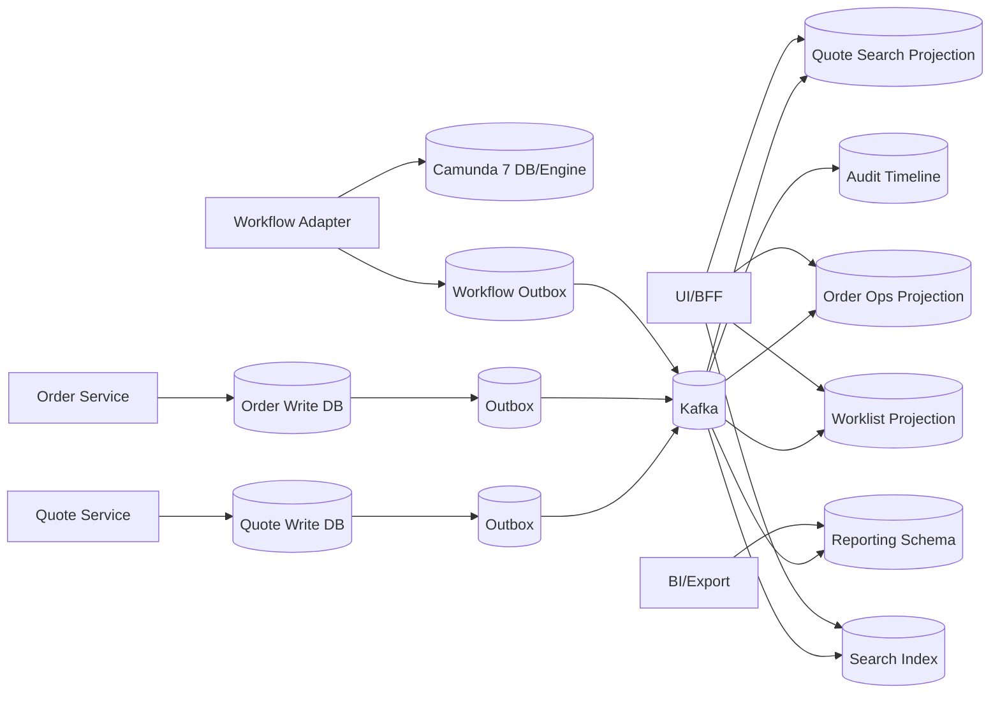
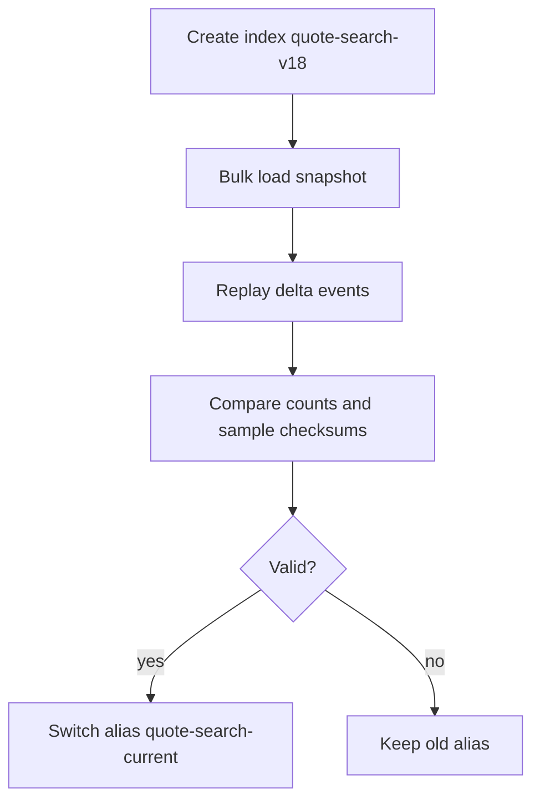
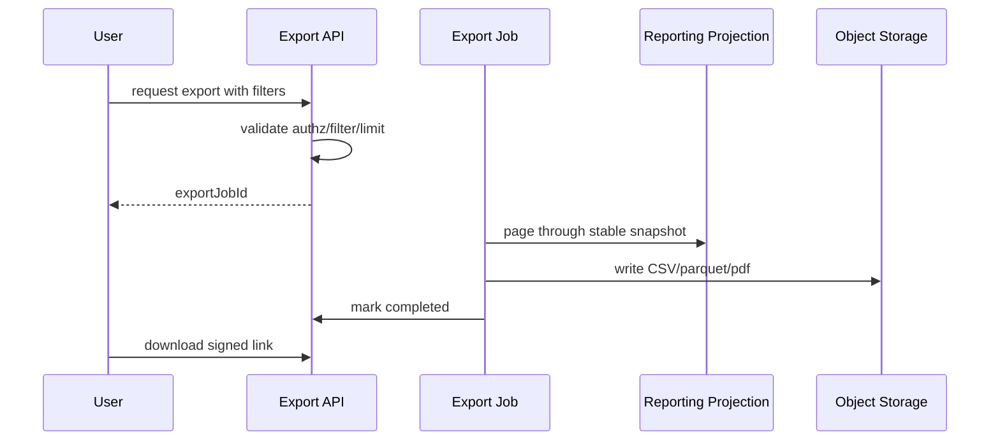

# Part 032 — Search, Reporting, and Operational Queries

Sistem CPQ/OMS production-grade tidak hanya harus bisa membuat quote dan order. Ia juga harus bisa menjawab pertanyaan operasional setiap hari:

- “Quote mana yang pending approval lebih dari 2 hari?”
- “Order mana yang fulfillment-nya stuck di inventory reservation?”
- “Berapa quote high-discount yang diterima minggu ini?”
- “Customer mana yang punya order partially fulfilled?”
- “Case worker mana yang memegang fallout paling banyak?”
- “Apa timeline lengkap perubahan quote ini?”
- “Kenapa order ini telat?”
- “Mana quote yang accepted tapi order belum dibuat?”

Pertanyaan seperti ini tidak cocok dilayani langsung dari write model yang normalized dan transaction-oriented.

Prinsip utama part ini:

> Operational query is a product surface. Treat it with the same design discipline as command APIs.

Search, reporting, worklist, dashboard, dan audit viewer bukan fitur sampingan. Mereka adalah cara organisasi mengendalikan revenue flow dan operational risk.

---

## 1. Query Surfaces in CPQ/OMS

Kita bedakan beberapa jenis query.

| Query type | Goal | Example | Storage fit |
|---|---|---|---|
| Lookup | exact entity by ID | quote detail, order detail | authority/read projection |
| Search | find matching records | quote by customer/name/status | PostgreSQL FTS/search engine |
| Worklist | actionable task list | pending approvals, fallout cases | operational projection |
| Dashboard | aggregate operational state | SLA breach count | aggregate projection |
| Audit timeline | explain what happened | quote decision trace | audit/event/transition table |
| Reporting | business analysis | monthly conversion | reporting schema/warehouse |
| Reconciliation | detect inconsistency | quote accepted but no order | purpose-built query/projection |

Kesalahan umum: semua query ini dipaksa ke satu endpoint `/quotes?filter=...`.

Hasilnya:

- endpoint menjadi unbounded;
- index tidak jelas;
- authorization sulit;
- pagination tidak stabil;
- write database melambat;
- reporting menabrak OLTP;
- search result dipakai untuk keputusan command.

Query surface harus dipisah menurut tujuan.

---

## 2. Architecture Overview



Write services own mutations. Query services own read surfaces.

Camunda data boleh menjadi input projection, tetapi jangan jadikan Camunda internal tables sebagai universal query API. Camunda table model bukan domain read model CPQ/OMS.

---

## 3. Search Is Not Reporting

Search dan reporting sering dicampur.

Search menjawab:

> “Temukan record yang cocok dengan filter atau text ini sekarang.”

Reporting menjawab:

> “Analisis kumpulan data dalam periode tertentu dengan definisi metric yang stabil.”

Operational dashboard menjawab:

> “Apa yang butuh tindakan sekarang?”

Audit menjawab:

> “Apa yang terjadi dan siapa/apa yang menyebabkan?”

Jangan memakai search index untuk laporan keuangan final. Jangan memakai reporting warehouse untuk worklist real-time. Jangan memakai audit log mentah untuk UI list.

Setiap query surface punya grammar dan correctness level berbeda.

---

## 4. Quote Search Design

Quote search harus mendukung use case sales, manager, approval, dan support.

Contoh filter:

- tenant;
- customer;
- sales owner;
- quote status;
- approval status;
- total amount range;
- currency;
- product family;
- created date;
- expires date;
- accepted date;
- discount threshold;
- quote number;
- customer name;
- free text.

Quote search document:

```json
{
  "tenantId": "tnt-123",
  "quoteId": "q-10029",
  "quoteNumber": "Q-2026-0001029",
  "currentRevisionNo": 4,
  "status": "SUBMITTED_FOR_APPROVAL",
  "customer": {
    "id": "cust-889",
    "name": "Acme Manufacturing"
  },
  "salesOwnerId": "user-991",
  "productFamilies": ["connectivity", "security"],
  "total": {
    "currency": "USD",
    "minor": 129900
  },
  "discountPercent": 18.5,
  "approvalStatus": "PENDING",
  "priceFreshness": "FRESH",
  "createdAt": "2026-07-02T09:10:00Z",
  "expiresAt": "2026-08-01T00:00:00Z",
  "projectionSequence": 18820
}
```

Search document is not entity. Ia adalah read contract.

---

## 5. Quote Search Storage Choice

### Option A — PostgreSQL projection table

Cocok jika:

- filter mostly structured;
- result volume moderate;
- text search sederhana;
- transactional rebuild lebih mudah;
- team belum butuh dedicated search cluster.

Schema:

```sql
CREATE TABLE quote_search_projection (
  tenant_id              text NOT NULL,
  quote_id               uuid NOT NULL,
  quote_number           text NOT NULL,
  current_revision_no    int NOT NULL,
  customer_id            uuid NOT NULL,
  customer_name          text NOT NULL,
  sales_owner_id         text NOT NULL,
  status                 text NOT NULL,
  approval_status        text,
  price_freshness        text NOT NULL,
  total_amount_minor     bigint,
  currency               char(3),
  discount_percent       numeric(7,4),
  product_families       text[] NOT NULL DEFAULT '{}',
  created_at             timestamptz NOT NULL,
  expires_at             timestamptz,
  accepted_at            timestamptz,
  search_vector          tsvector,
  projection_sequence    bigint NOT NULL,
  projection_updated_at  timestamptz NOT NULL DEFAULT now(),
  PRIMARY KEY (tenant_id, quote_id)
);

CREATE INDEX idx_quote_search_owner_status
  ON quote_search_projection (tenant_id, sales_owner_id, status, created_at DESC);

CREATE INDEX idx_quote_search_customer
  ON quote_search_projection (tenant_id, customer_id, created_at DESC);

CREATE INDEX idx_quote_search_total
  ON quote_search_projection (tenant_id, currency, total_amount_minor);

CREATE INDEX idx_quote_search_fts
  ON quote_search_projection USING gin(search_vector);
```

### Option B — dedicated search engine

Cocok jika:

- free text penting;
- relevance scoring dibutuhkan;
- faceting/highlighting diperlukan;
- volume besar;
- query fleksibel;
- search team punya operational maturity.

Trade-off:

- eventual consistency lebih jelas;
- index mapping/versioning harus dikelola;
- reindexing perlu blue/green alias;
- authorization filtering harus serius;
- search engine bukan authority.

### Option C — hybrid

Sering paling realistis:

- PostgreSQL projection untuk operational list/worklist;
- search engine untuk free text/faceted search;
- authority lookup untuk detail dan command.

---

## 6. Order Operational Query Design

Order operational query berbeda dari quote search. Ia lebih action-oriented.

Pertanyaan utama:

- order mana yang stuck?
- step mana yang failed?
- siapa owner berikutnya?
- kapan SLA breach?
- external system mana yang belum callback?
- apakah compensation diperlukan?

Order ops projection:

```json
{
  "tenantId": "tnt-123",
  "orderId": "o-88219",
  "orderNumber": "O-2026-0088219",
  "customerId": "cust-889",
  "customerName": "Acme Manufacturing",
  "orderStatus": "IN_PROGRESS",
  "fulfillmentStatus": "PARTIALLY_FAILED",
  "falloutStatus": "OPEN",
  "currentBlockerCode": "INVENTORY_RESERVATION_TIMEOUT",
  "currentOwnerGroup": "fulfillment-ops",
  "nextAction": "RETRY_OR_MANUAL_RESERVE",
  "slaBucket": "BREACHING_SOON",
  "dueAt": "2026-07-02T15:00:00Z",
  "lastFulfillmentEventAt": "2026-07-02T10:44:12Z",
  "projectionSequence": 6631
}
```

Index berdasarkan action:

```sql
CREATE INDEX idx_order_ops_open_fallout
  ON order_operational_projection
    (tenant_id, fallout_status, sla_bucket, due_at)
  WHERE fallout_status = 'OPEN';

CREATE INDEX idx_order_ops_owner
  ON order_operational_projection
    (tenant_id, current_owner_group, due_at)
  WHERE order_status IN ('IN_PROGRESS', 'BLOCKED');
```

Partial index berguna untuk worklist karena operasi biasanya melihat subset aktif, bukan semua order historis.

---

## 7. Worklist as a Product

Worklist bukan list task. Worklist adalah “control surface” untuk manusia.

Approval worklist field:

- task id;
- business key;
- quote id/revision;
- customer;
- requested discount;
- amount;
- approval reason;
- due date;
- assignee/candidate group;
- risk indicator;
- stale indicator;
- conflict indicator.

Fallout worklist field:

- order id;
- failed step;
- blocker code;
- external system;
- retry count;
- last error classification;
- due date;
- suggested action;
- owner group;
- compensation risk.

Worklist requirements:

- stable sorting;
- explicit ownership;
- claim/release;
- permission filtering;
- SLA grouping;
- optimistic concurrency;
- no duplicate task display;
- task disappearing quickly after completion;
- audit trail on manual action.

Design smell:

> If operators need spreadsheets to know what to do next, the operational read model is incomplete.

---

## 8. Pagination and Sorting

Offset pagination looks simple but fails at scale and with changing data.

Bad:

```http
GET /quotes?status=DRAFT&page=1000&size=50
```

Problems:

- slow offset scan;
- duplicate/missing rows while data changes;
- unstable result;
- expensive count.

Better: cursor/keyset pagination.

```http
GET /quote-search?status=DRAFT&sort=-createdAt&limit=50&cursor=eyJjcmVhdGVkQXQiOiIyMDI2LTA3LTAyVDEwOjAwOjAwWiIsInF1b3RlSWQiOiJxLTk5OSJ9
```

Sort key must be deterministic:

```sql
ORDER BY created_at DESC, quote_id DESC
```

Cursor payload should contain last sort values, not page number.

For worklist:

```sql
ORDER BY due_at ASC NULLS LAST, priority DESC, task_id ASC
```

Do not allow arbitrary sorting on unindexed fields in enterprise query APIs.

---

## 9. Filtering Grammar

Avoid raw query language exposure unless necessary.

Better API shape:

```http
GET /quote-search?status=SUBMITTED_FOR_APPROVAL&approvalStatus=PENDING&minAmount=100000&currency=USD&ownerId=user-991
```

For advanced search, define explicit grammar:

```json
{
  "filters": [
    { "field": "status", "op": "IN", "values": ["PRICED", "SUBMITTED_FOR_APPROVAL"] },
    { "field": "totalAmountMinor", "op": "GTE", "value": 100000 },
    { "field": "discountPercent", "op": "GT", "value": 15 }
  ],
  "sort": [
    { "field": "createdAt", "direction": "DESC" },
    { "field": "quoteId", "direction": "DESC" }
  ],
  "limit": 50
}
```

Validate:

- allowed fields;
- allowed ops per field;
- max filters;
- max limit;
- indexed combinations;
- tenant filter mandatory;
- authorization scope.

Never pass user filters directly into SQL or search DSL without allowlist translation.

---

## 10. Authorization in Search

Search is a high-risk data leak surface.

A user may be allowed to see:

- only own quotes;
- quotes in their sales region;
- quotes below approval threshold;
- quotes for assigned customer accounts;
- fallout cases for their operations group;
- redacted fields for sensitive accounts.

Authorization must be applied before result is returned.

Patterns:

### 10.1 Filter-by-scope

Inject allowed scope into query:

```sql
WHERE tenant_id = :tenantId
  AND sales_owner_id = :userId
```

or:

```sql
WHERE tenant_id = :tenantId
  AND sales_region IN (:allowedRegions)
```

### 10.2 Join authorization projection

```sql
JOIN account_access_projection a
  ON a.tenant_id = q.tenant_id
 AND a.customer_id = q.customer_id
 AND a.user_id = :userId
```

### 10.3 Field redaction

Return row but hide fields:

```json
{
  "quoteId": "q-10029",
  "customerName": "Restricted Account",
  "total": null,
  "redactions": ["CUSTOMER_NAME", "TOTAL_AMOUNT"]
}
```

Do not fetch everything then filter in UI. BFF may compose, but data access layer must enforce scope.

---

## 11. Audit Timeline Query

Audit timeline is not the same as search result.

It must explain:

- state transitions;
- command actor;
- command reason;
- approval decision;
- pricing trace;
- workflow task creation/completion;
- external fulfillment callbacks;
- compensation attempts;
- document generation;
- notification sending.

Timeline event table:

```sql
CREATE TABLE business_timeline_event (
  tenant_id          text NOT NULL,
  subject_type       text NOT NULL,
  subject_id         uuid NOT NULL,
  event_id           uuid NOT NULL,
  event_type         text NOT NULL,
  event_time         timestamptz NOT NULL,
  actor_type         text NOT NULL,
  actor_id           text,
  correlation_id     text NOT NULL,
  causation_id       text,
  summary            text NOT NULL,
  details_json       jsonb NOT NULL,
  visibility_class   text NOT NULL,
  PRIMARY KEY (tenant_id, subject_type, subject_id, event_id)
);

CREATE INDEX idx_timeline_subject_time
  ON business_timeline_event (tenant_id, subject_type, subject_id, event_time DESC);
```

Timeline payload harus human-readable dan machine-readable.

Contoh:

```json
{
  "eventType": "QUOTE_APPROVED",
  "summary": "Level 2 approval granted for 18.5% discount",
  "actor": { "type": "USER", "id": "approver-118" },
  "details": {
    "quoteRevision": 4,
    "approvalLevel": 2,
    "policyVersion": "ap-2026-07-a",
    "decisionId": "dec-7711"
  }
}
```

Timeline bukan raw log. Ia adalah business evidence.

---

## 12. Reporting Isolation

Reporting query sering membunuh OLTP karena:

- scan besar;
- join kompleks;
- grouping berat;
- range date panjang;
- export banyak row;
- user menjalankan query bebas.

Pisahkan reporting.

Options:

| Option | Fit | Trade-off |
|---|---|---|
| Read replica | simple reporting | replica lag, still OLTP-shaped schema |
| Reporting schema | curated metrics | requires ETL/projection logic |
| Data warehouse | large analytics | operational complexity |
| Materialized views | periodic aggregates | refresh strategy needed |
| Event-derived facts | metric lineage | needs event quality |

Reporting fact table contoh:

```sql
CREATE TABLE quote_conversion_fact_daily (
  tenant_id              text NOT NULL,
  business_date          date NOT NULL,
  sales_region           text NOT NULL,
  product_family         text NOT NULL,
  quote_created_count    bigint NOT NULL,
  quote_accepted_count   bigint NOT NULL,
  quote_expired_count    bigint NOT NULL,
  total_accepted_minor   bigint NOT NULL,
  currency               char(3) NOT NULL,
  built_at               timestamptz NOT NULL,
  PRIMARY KEY (tenant_id, business_date, sales_region, product_family, currency)
);
```

Reporting metric harus punya definisi.

Contoh:

```text
Quote Accepted Count:
A quote revision counted when QuoteAccepted event is committed within business day in tenant timezone.
If quote is later cancelled, cancellation affects cancellation metric, not accepted count.
```

Tanpa definisi metric, reporting menjadi debat tanpa akhir.

---

## 13. Materialized Views vs Projection Tables

Materialized view berguna untuk query yang dapat dihitung periodik dari table lain.

Projection table berguna untuk event-driven denormalized state.

| Aspect | Materialized view | Projection table |
|---|---|---|
| Source | SQL query | event/command handler |
| Update | refresh | incremental upsert |
| Freshness | periodic/on-demand | event-driven |
| Logic | SQL-centric | domain/event-centric |
| Rebuild | refresh | replay/rebuild job |
| Fit | aggregates, snapshots | operational current state |

Untuk CPQ/OMS:

- materialized view cocok untuk daily/weekly reporting summary;
- projection table cocok untuk approval worklist dan order fallout dashboard;
- search index cocok untuk text/facet search;
- audit timeline cocok untuk event evidence.

---

## 14. Near-Real-Time Search Semantics

Search index biasanya near-real-time, bukan strongly consistent.

Artinya:

- document yang baru diindex mungkin belum langsung searchable;
- refresh interval memengaruhi visibility dan throughput;
- index lag harus diukur;
- command tidak boleh bergantung pada search result sebagai truth.

UX harus memahami ini.

Setelah create quote:

- detail page bisa langsung dari authority;
- search list mungkin delay;
- UI boleh menampilkan local optimistic result;
- search result harus catch up.

Jika user mencari quote tepat setelah submit dan belum muncul, itu bukan alasan untuk mengirim command ulang secara buta. Gunakan idempotency key dan direct lookup by returned ID.

---

## 15. Search Index Document Versioning

Index document harus punya version.

```json
{
  "schemaVersion": 3,
  "documentType": "QUOTE_SEARCH_DOCUMENT",
  "tenantId": "tnt-123",
  "quoteId": "q-10029",
  "aggregateVersion": 17,
  "projectionSequence": 18820,
  "indexedAt": "2026-07-02T10:16:00Z"
}
```

Index update harus guard terhadap older event:

```text
Only update document if incoming aggregateVersion > stored aggregateVersion.
```

Untuk reindex:



Jangan update mapping besar langsung di index production tanpa rollback path.

---

## 16. Operational Dashboard Counters

Dashboard counters terlihat sederhana tetapi sering salah.

Contoh counters:

- pending approvals by level;
- quotes expiring within 7 days;
- open fallout cases;
- orders breaching SLA;
- external callbacks overdue;
- compensation pending;
- failed notifications.

Counter bisa dibangun dengan:

1. query langsung ke projection table;
2. aggregate projection table;
3. scheduled rollup;
4. streaming aggregation;
5. Redis cache di atas aggregate.

Pilih berdasarkan volume dan freshness.

Anti-pattern:

- counter dihitung dari search index tanpa consistency expectation;
- counter dihitung dari write DB dengan join berat setiap refresh;
- counter berbeda dari list karena definisi filter berbeda;
- dashboard angka tidak bisa dijelaskan.

Counter harus link ke underlying list dengan filter yang sama.

---

## 17. Reconciliation Queries

Reconciliation bukan laporan biasa. Ia mencari ketidaksesuaian sistem.

Contoh CPQ/OMS:

| Reconciliation check | Meaning |
|---|---|
| Quote accepted but no order | conversion process failed |
| Order created but no workflow process | orchestration start failed |
| Workflow completed but order not completed | domain update missed |
| Fulfillment step callback received but no step state change | callback handling failed |
| Approval task open for stale quote revision | workflow/task cleanup failed |
| Price result missing for accepted quote | serious commercial evidence gap |
| Outbox event unpublished too long | integration stuck |
| Projection sequence behind event stream | read model lag |

Build dedicated reconciliation jobs.

```sql
SELECT q.tenant_id, q.quote_id, q.accepted_at
FROM quote_revision q
LEFT JOIN customer_order o
  ON o.tenant_id = q.tenant_id
 AND o.source_quote_id = q.quote_id
 AND o.source_quote_revision_no = q.revision_no
WHERE q.status = 'ACCEPTED'
  AND q.accepted_at < now() - interval '5 minutes'
  AND o.order_id IS NULL;
```

Reconciliation should produce cases, not just logs.

```json
{
  "caseType": "ACCEPTED_QUOTE_WITHOUT_ORDER",
  "severity": "HIGH",
  "tenantId": "tnt-123",
  "subjectId": "q-10029",
  "detectedAt": "2026-07-02T10:30:00Z",
  "suggestedAction": "RETRY_ORDER_CREATION_OR_ESCALATE"
}
```

---

## 18. Export Design

Enterprise users will ask for export.

Bad export design:

- direct unlimited SQL query;
- synchronous HTTP request waits minutes;
- no audit of who exported what;
- no field-level redaction;
- no retention;
- no checksum;
- no repeatability.

Better:



Export requirements:

- async job;
- stable snapshot watermark;
- max row limits;
- PII/commercial data redaction;
- audit event;
- expiration;
- checksum;
- repeatable filter definition;
- failure retry;
- user notification.

---

## 19. Query API Error Model

Search/query APIs need specific errors.

| Condition | HTTP | Error code |
|---|---:|---|
| unsupported filter | 400 | `UNSUPPORTED_FILTER` |
| unsupported sort | 400 | `UNSUPPORTED_SORT` |
| too many filters | 400 | `QUERY_TOO_COMPLEX` |
| limit too large | 400 | `QUERY_LIMIT_EXCEEDED` |
| cursor invalid | 400 | `INVALID_CURSOR` |
| projection unavailable | 503 | `READ_MODEL_UNAVAILABLE` |
| search index rebuilding | 503/200 degraded | `SEARCH_INDEX_REBUILDING` |
| unauthorized scope | 403 | `QUERY_SCOPE_DENIED` |
| export too large | 422 | `EXPORT_TOO_LARGE` |

Expose degraded state carefully:

```json
{
  "results": [],
  "page": { "limit": 50, "nextCursor": null },
  "freshness": {
    "projectionLagMs": 12000,
    "degraded": true,
    "reason": "SEARCH_INDEX_REBUILDING"
  }
}
```

Do not silently return partial data unless response marks it clearly.

---

## 20. Query Performance Discipline

Performance is not only DB tuning. It is API contract design.

Rules:

- every list endpoint has mandatory tenant scope;
- every list endpoint has max limit;
- every sort field must be indexed or explicitly bounded;
- no unbounded wildcard search on high-cardinality field;
- no arbitrary joins exposed through API;
- no count-all by default;
- expensive counts are separate endpoint or approximate;
- filters are allowlisted;
- query plan tested with realistic cardinality;
- projection table is sized and partitioned if needed;
- export is async.

For PostgreSQL projection table, keep `EXPLAIN ANALYZE` examples as part of engineering notes.

For search engine, monitor:

- query latency;
- refresh lag;
- indexing backlog;
- rejected writes;
- shard/index size;
- slow query logs;
- authorization filter cost.

---

## 21. Data Retention and History

Operational projection usually stores current state. Audit/reporting stores history.

Separate:

| Data | Retention |
|---|---|
| quote current projection | as long as quote active + archive policy |
| order operational projection | active lifecycle + support window |
| audit timeline | compliance retention |
| raw application logs | shorter operational retention |
| reporting facts | business retention |
| search index | can be rebuilt, shorter retention possible |
| export files | short expiry |

Do not use search index as compliance archive. Search index is rebuildable query infrastructure, not immutable record store.

---

## 22. Timeline, Search, and Report Consistency

The same business event may appear in three places:

- timeline;
- search projection;
- report fact.

Example: `QuoteAccepted`.

Timeline:

```text
Quote accepted by customer representative at exact timestamp.
```

Search:

```text
Quote status = ACCEPTED, acceptedAt set.
```

Reporting:

```text
Increment accepted quote count for business date and region.
```

These are different read products derived from same fact. They may have different freshness. They must not have different definitions.

Create metric/event mapping document:

| Event | Timeline | Search | Reporting |
|---|---|---|---|
| `QuoteAccepted` | append accepted event | status accepted | accepted count + amount |
| `QuoteExpired` | append expired event | status expired | expired count |
| `OrderCompleted` | append completion | status completed | completed order count |
| `FulfillmentStepFailed` | append failure | fallout open | failure count by system |

---

## 23. Example Query Service Layout

```text
query-services/
  quote-search-service/
    api/
      QuoteSearchResource.java
      QuoteExportResource.java
    projection/
      QuoteSearchProjectionConsumer.java
      QuoteSearchProjectionRepository.java
    search/
      QuoteSearchIndexWriter.java
      QuoteSearchIndexQuery.java
    authz/
      QuoteSearchAuthorization.java
    export/
      QuoteExportJob.java
      ExportSnapshotWatermark.java

  order-ops-service/
    api/
      OrderOpsResource.java
      FalloutWorklistResource.java
    projection/
      OrderOpsProjectionConsumer.java
      FalloutProjectionConsumer.java
    reconciliation/
      AcceptedQuoteWithoutOrderCheck.java
      WorkflowWithoutOrderStateCheck.java

  reporting-service/
    api/
      ReportingResource.java
    facts/
      QuoteConversionFactBuilder.java
      OrderFulfillmentFactBuilder.java
    export/
      ReportExportJob.java
```

Boundary:

- query services do not own commands;
- they may emit reconciliation cases;
- they may request rebuild/reindex;
- they enforce authorization;
- they expose freshness;
- they do not mutate quote/order authority.

---

## 24. Failure Modes

| Failure | User symptom | Mitigation |
|---|---|---|
| Projection lag | list outdated | freshness metadata, lag alert, command recheck |
| Search index down | search unavailable | fallback structured search if possible, degrade clearly |
| Report job failed | report missing | retry, job status, partial output forbidden |
| Export too large | timeout | async export, row cap, filter validation |
| Authorization projection stale | missing/excess result | short lag budget, authority check for sensitive detail |
| Reindex wrong mapping | search errors | blue/green index, alias rollback |
| Count mismatch with list | user distrust | single filter definition, test counter/list equivalence |
| Worklist duplicate task | double action risk | unique task key, idempotent completion |
| Timeline missing event | audit gap | event integrity check, reconciliation |
| Reporting metric changed silently | governance issue | metric versioning and definition registry |

---

## 25. Testing Strategy

### 25.1 Query contract tests

Validate filter grammar, sorting, pagination, and error model.

### 25.2 Authorization tests

Same query under different users should return different scoped results.

### 25.3 Projection tests

Event sequence produces expected search/order/worklist projection.

### 25.4 Cursor stability tests

Rows inserted during pagination should not cause duplicate/missing rows beyond documented semantics.

### 25.5 Count/list equivalence tests

Dashboard count should match list endpoint with same filter.

### 25.6 Reindex tests

Rebuilt index result should match projection for sample and aggregate checks.

### 25.7 Reporting definition tests

Metric calculation should match explicit business definition.

### 25.8 Reconciliation tests

Seed inconsistent state and verify case generation.

---

## 26. Production Readiness Checklist

Before launching search/reporting/ops query:

- [ ] Query use cases are separated by surface.
- [ ] Write model is not used for heavy ad-hoc search.
- [ ] Tenant filter is mandatory.
- [ ] Authorization is server-side.
- [ ] Pagination is stable.
- [ ] Filter/sort grammar is allowlisted.
- [ ] Projection lag is measured.
- [ ] Rebuild/reindex process exists.
- [ ] Report metrics have definitions.
- [ ] Export is async and audited.
- [ ] Search index is not authority.
- [ ] Operational dashboard counters link to matching lists.
- [ ] Reconciliation jobs generate actionable cases.
- [ ] Sensitive fields are redacted.
- [ ] Failure modes have degraded behavior.

---

## 27. A Better Way to Think About Query Design

Poor query design asks:

> “Can we add a filter to this endpoint?”

Strong query design asks:

> “What operational decision is this query supporting, what correctness does it require, and what read model makes that decision safe and cheap?”

CPQ/OMS is not just a transaction system. It is an operational control system.

If operators cannot find stuck orders, revenue leaks.

If approvers cannot see why approval is needed, bad commercial decisions happen.

If audit cannot reconstruct price/approval/order history, the platform is not defensible.

If reporting definitions drift, leadership stops trusting the numbers.

---

## 28. Closing Mental Model

There are four query truths:

1. Detail lookup should be correct.
2. Search should be discoverable.
3. Worklist should be actionable.
4. Reporting should be explainable.

Do not collapse them into one generic query layer.

A production CPQ/OMS needs read surfaces that are intentionally designed, observable, rebuildable, authorized, and aligned with business decisions.

Part berikutnya akan masuk ke document generation dan quote artifacts: bagaimana membuat proposal/quote document yang immutable, traceable, dan tidak menyimpang dari commercial truth.
