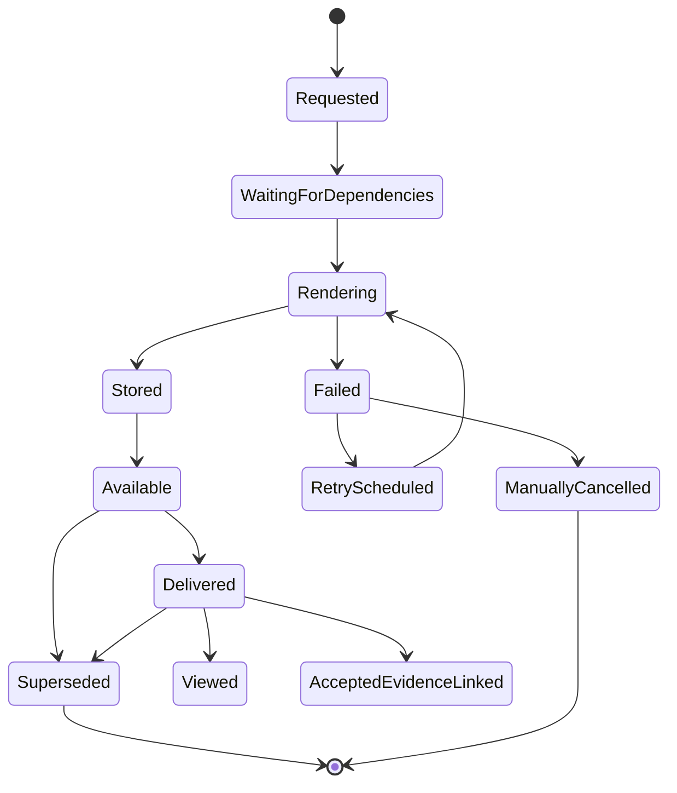
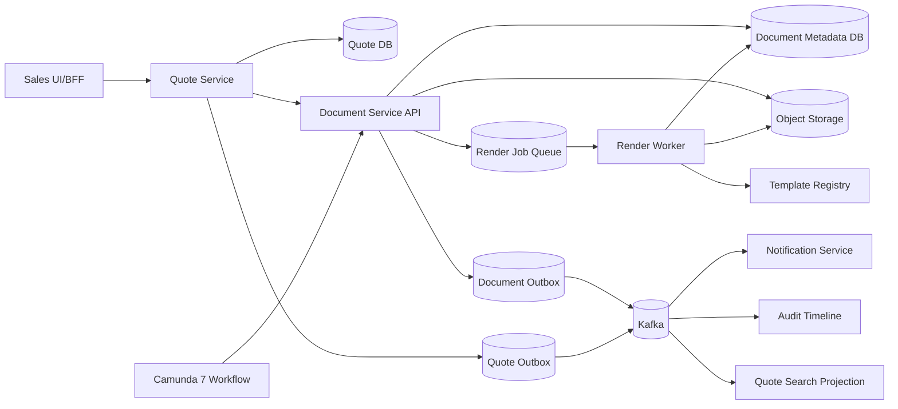
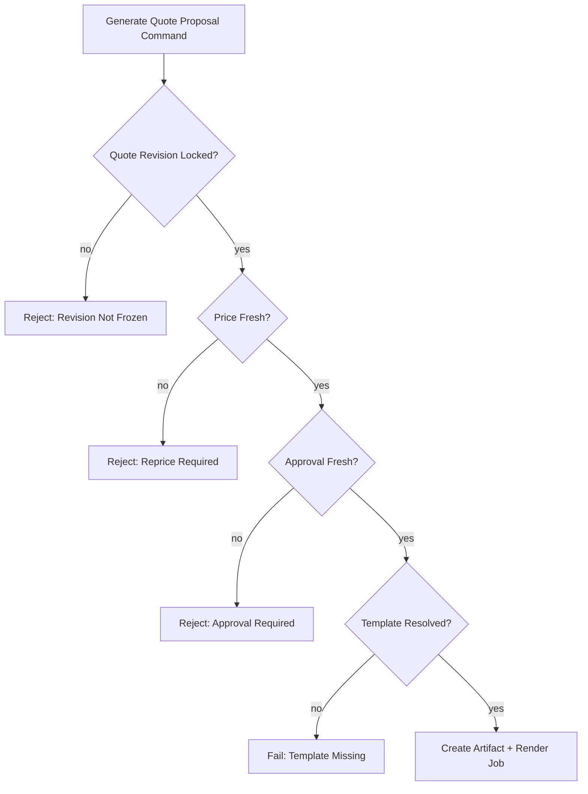
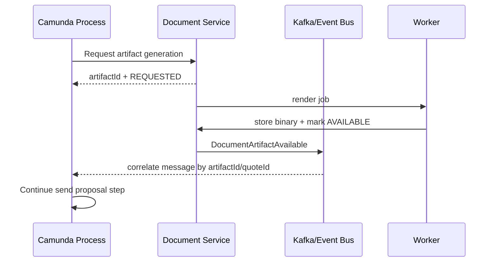

# Part 033 — Document Generation and Quote Artifacts

Di sistem CPQ enterprise, quote tidak selesai ketika angka total muncul di UI.

Quote baru benar-benar bisa dipakai ketika organisasi dapat menghasilkan dokumen yang:

- merepresentasikan konfigurasi yang benar;
- memakai harga yang disetujui;
- punya term dan condition yang tepat;
- dapat dikirim ke customer;
- bisa dibuktikan kembali beberapa bulan atau tahun kemudian;
- tidak berubah diam-diam setelah customer menerima;
- dapat dilacak siapa yang membuat, mengirim, menerima, dan membatalkan;
- bisa dipakai sebagai dasar order tanpa ambiguity.

Dokumen quote adalah artefak legal-komersial. Ia bukan sekadar PDF.

Prinsip utama part ini:

> A quote document is a frozen commercial artifact. It must be reproducible as evidence, but not necessarily regenerated from today's system state.

Kesalahan desain paling umum adalah menganggap document generation sebagai fitur template belaka:

```text
Quote data -> template -> PDF -> done
```

Itu terlalu dangkal untuk enterprise CPQ/OMS.

Desain yang benar memisahkan:

- commercial snapshot;
- render input;
- template version;
- artifact metadata;
- binary storage;
- generation job;
- approval dependency;
- customer delivery;
- audit evidence;
- invalidation policy.

Dokumen yang terlihat sederhana di permukaan sebenarnya berada di persimpangan antara quote lifecycle, pricing, approval, compliance, notification, storage, dan order conversion.

---

## 1. What Is a Quote Artifact?

Kita perlu membedakan istilah sejak awal.

| Concept | Meaning | Authority |
|---|---|---|
| Quote | Commercial intent being negotiated | Quote Service |
| Quote Revision | Immutable-ish revision candidate | Quote Service |
| Price Result | Frozen pricing evidence for a revision | Pricing/Quote boundary |
| Approval Decision | Permission to proceed under policy | Approval/Workflow boundary |
| Render Input | Data structure used to generate document | Document Service |
| Template | Versioned rendering rule | Document Service |
| Artifact | Generated immutable output metadata + binary | Document Service |
| Delivery | Sending artifact to external recipient | Notification/Communication Service |
| Acceptance | Customer/business acceptance of quote terms | Quote Service |

Jangan mencampur semua ini dalam satu kolom `quote.pdf_url`.

`quote.pdf_url` kelihatannya praktis, tetapi menyembunyikan banyak pertanyaan penting:

- PDF itu dibuat dari revision berapa?
- Template version apa?
- Harga mana yang dipakai?
- Apakah approval masih fresh waktu dokumen dibuat?
- Siapa yang generate?
- Dokumen ini pernah dikirim ke customer?
- Apakah dokumen ini superseded?
- Apakah binary-nya berubah?
- Apakah ada hash untuk membuktikan integritas?
- Apakah dokumen ini valid untuk acceptance?

Jika jawaban pertanyaan ini tidak ada, artifact model belum enterprise-grade.

---

## 2. Document Generation Is a Lifecycle

Document generation bukan single function. Ia lifecycle.



Lifecycle ini penting karena generate document sering gagal karena hal non-domain:

- template missing;
- font/render engine error;
- image/logo tidak tersedia;
- object storage timeout;
- malformed render input;
- unsupported locale;
- document terlalu besar;
- external storage conflict;
- network issue;
- data dependency belum fresh;
- approval status berubah saat generate.

Jika sistem hanya punya method `generatePdf(quoteId)`, semua failure ini akan bercampur sebagai `500 Internal Server Error`.

Enterprise system membutuhkan artifact lifecycle yang eksplisit.

---

## 3. Why Artifact Immutability Matters

Quote artifact harus immutable karena dokumen adalah evidence.

Misalnya:

1. Sales membuat quote revision 4.
2. Pricing menghasilkan total USD 129,900.
3. Manager menyetujui discount 18%.
4. Document service membuat proposal PDF.
5. Proposal dikirim ke customer.
6. Customer menyetujui 5 hari kemudian.
7. Product catalog berubah sehari setelah dokumen dikirim.
8. Pricing rule berubah dua hari setelah dokumen dikirim.

Pada saat acceptance, sistem tidak boleh berkata:

> “Mari kita generate ulang dari data terbaru.”

Karena yang diterima customer adalah dokumen lama.

Maka artifact harus menyimpan bukti:

- quote revision identity;
- price result identity;
- approval decision identity;
- template identity;
- render input hash;
- binary hash;
- generated timestamp;
- generated by;
- delivery timestamp;
- recipient;
- supersession status.

Artifact immutable bukan berarti tidak bisa ada versi baru. Artinya artifact lama tidak diedit. Jika ada perubahan, buat artifact baru dan tandai artifact lama sebagai superseded/withdrawn.

---

## 4. Architecture Overview



Document Service bertanggung jawab atas:

- artifact request;
- render input validation;
- template resolution;
- artifact metadata;
- binary storage coordination;
- document lifecycle;
- document events;
- document access control surface.

Document Service **tidak** bertanggung jawab atas:

- menentukan harga;
- menyetujui discount;
- mengubah quote lifecycle;
- mengirim email secara langsung;
- menyimpan rule pricing;
- menjadi source of truth quote.

Ia adalah service spesialis untuk menghasilkan dan mengelola artefak.

---

## 5. Core Invariants

Inilah invariants utama.

| Invariant | Why it matters |
|---|---|
| Artifact must point to exactly one quote revision | Mencegah dokumen ambigu |
| Artifact must point to exact render input version/hash | Membuktikan data yang dirender |
| Artifact binary must be immutable after stored | Mencegah evidence tampering |
| Artifact must record template version | Perubahan template tidak mengubah dokumen lama |
| Artifact cannot be valid if quote revision changed after render | Mencegah stale document dipakai |
| Accepted quote must reference the accepted artifact when acceptance is document-based | Acceptance punya evidence |
| Superseded artifact remains retrievable for audit | History tidak hilang |
| Artifact access must be authorization-checked at object level | Commercial data sensitif |
| Artifact generation must be idempotent for same request key | Retry aman |
| Artifact delivery must be separated from artifact generation | Generate sukses tidak berarti terkirim |

Mental model:

> The document service is not a printer. It is an evidence factory.

---

## 6. Artifact Types

Tidak semua artifact sama.

| Artifact type | Example | Mutability | Customer-facing? | Acceptance relevance |
|---|---|---:|---:|---:|
| Quote Proposal | Customer proposal PDF | immutable | yes | high |
| Internal Approval Pack | Approval summary | immutable | no | medium |
| Price Breakdown | Detailed pricing attachment | immutable | sometimes | high |
| Terms Appendix | Legal terms | versioned/immutable artifact | yes | high |
| Configuration Summary | Product/options summary | immutable | yes | high |
| Order Confirmation | Confirmation after order | immutable | yes | medium |
| Fallout Report | Operational exception artifact | immutable | no | low |
| Amendment Comparison | Delta quote comparison | immutable | yes | high |

Artifact type menentukan:

- template family;
- required dependencies;
- access policy;
- retention policy;
- delivery policy;
- acceptance policy;
- watermark behavior;
- localization rules;
- allowed lifecycle transitions.

Jangan memakai satu `document_type = 'PDF'`.

PDF adalah format. Bukan business artifact type.

---

## 7. Quote Snapshot vs Render Input

Quote snapshot dan render input mirip, tetapi tidak sama.

Quote snapshot adalah domain evidence:

```json
{
  "quoteRevisionId": "qr-004",
  "customerId": "cust-889",
  "lineItems": [...],
  "priceResultId": "pr-1209",
  "approvalDecisionId": "ap-771",
  "effectiveCatalogVersion": "cat-2026-07",
  "currency": "USD"
}
```

Render input adalah view model untuk template:

```json
{
  "proposalNumber": "Q-2026-0001029-R4",
  "customerDisplayName": "Acme Manufacturing",
  "salesContact": {
    "name": "Dina S.",
    "email": "dina@example.internal"
  },
  "sections": [
    {
      "title": "Commercial Summary",
      "rows": [
        {"label": "Subtotal", "value": "USD 158,414.63"},
        {"label": "Discount", "value": "USD -28,514.63"},
        {"label": "Total", "value": "USD 129,900.00"}
      ]
    }
  ],
  "terms": {
    "validUntil": "2026-08-01",
    "paymentTerm": "NET_30"
  }
}
```

Render input boleh memiliki field formatting dan layout helper. Quote snapshot tidak boleh tercemar oleh kebutuhan template.

Rule:

> Domain snapshot is for truth. Render input is for presentation.

---

## 8. Required Snapshot Data

Quote proposal biasanya membutuhkan snapshot data berikut.

### 8.1 Identity

- tenant id;
- quote id;
- quote number;
- revision number;
- artifact type;
- generated by;
- generation timestamp;
- validity date;
- customer identity;
- sales owner identity.

### 8.2 Commercial data

- product offering name;
- configured options;
- quantity;
- contract term;
- one-time charge;
- recurring charge;
- discount;
- surcharge;
- currency;
- tax placeholder or tax disclaimer;
- total;
- payment terms.

### 8.3 Governance data

- approval status;
- approval decision id;
- approver list or approval summary;
- policy reason;
- manual override reason;
- price result id;
- catalog version;
- pricing rule version.

### 8.4 Legal and communication data

- customer legal name;
- billing address;
- service address if relevant;
- legal entity of seller;
- terms version;
- acceptance instructions;
- validity window;
- confidentiality notice.

### 8.5 Traceability data

- correlation id;
- request id;
- artifact id;
- template version;
- render input hash;
- binary hash;
- generation worker version.

Jika ada field yang tidak boleh dilihat customer, jangan hanya “hide in template”. Jangan masukkan field itu ke render input customer-facing.

---

## 9. Template Versioning

Template adalah contract.

Perubahan template bisa mengubah:

- kalimat legal;
- layout price table;
- urutan section;
- format discount;
- label product;
- wording validity;
- acceptance instruction;
- logo/entity seller;
- language;
- footer regulatory notice.

Maka template harus versioned.

Contoh model:

```text
TemplateFamily: quote-proposal
TemplateVersion: quote-proposal:2026.07.0
Locale: en-US
Market: US
Channel: direct-sales
Format: pdf
Status: ACTIVE
EffectiveFrom: 2026-07-01T00:00:00Z
EffectiveTo: null
```

Jangan pakai file path sebagai version:

```text
/templates/quote.ftl
```

Itu bukan identity. Itu implementation detail.

### Template resolution policy

Template dipilih berdasarkan:

- artifact type;
- tenant;
- market/country;
- language/locale;
- sales channel;
- product family;
- customer segment;
- effective date;
- explicit override if allowed.

Resolution result harus disimpan di artifact metadata.

```json
{
  "templateFamily": "quote-proposal",
  "templateVersion": "quote-proposal:2026.07.0",
  "locale": "en-US",
  "market": "US",
  "resolvedAt": "2026-07-02T10:15:00Z"
}
```

Jika template berubah minggu depan, artifact lama tetap mengarah ke template lama.

---

## 10. Template Governance

Template governance sering diremehkan. Padahal template adalah production code dengan dampak legal.

Minimal governance:

- template has owner;
- template has version;
- template has review workflow;
- template has preview tests;
- template has sample render cases;
- template has effective date;
- template has rollback path;
- template has compatibility contract with render input schema;
- legal text changes require approval;
- active template cannot be edited in place.

Template deployment tidak boleh seperti upload file acak ke server.

Template release harus melewati quality gate:

```text
Template change -> lint -> schema compatibility -> sample render -> legal review -> approval -> publish as new version
```

Jika ada kebutuhan hotfix, buat version baru. Jangan mutate version lama.

---

## 11. Render Input Schema

Render input harus punya schema.

Tanpa schema, template engine akan gagal runtime karena field missing.

Contoh simplified schema idea:

```json
{
  "$id": "quote-proposal-render-input.v1",
  "type": "object",
  "required": [
    "proposalNumber",
    "customer",
    "seller",
    "commercialSummary",
    "lineItems",
    "validUntil"
  ],
  "properties": {
    "proposalNumber": {"type": "string"},
    "customer": {
      "type": "object",
      "required": ["displayName"],
      "properties": {
        "displayName": {"type": "string"},
        "legalName": {"type": "string"}
      }
    },
    "lineItems": {
      "type": "array",
      "items": {"$ref": "#/$defs/lineItem"}
    }
  }
}
```

Template version harus declare render input schema version yang didukung.

```text
quote-proposal:2026.07.0 supports quote-proposal-render-input.v1
```

Jika render input berubah secara breaking, rilis template family/version yang sesuai.

---

## 12. Artifact Identity

Artifact id harus menjadi first-class identity.

Contoh:

```text
artifact_id = art_01J1X8...
artifact_number = Q-2026-0001029-R4-PROP-001
```

`artifact_id` adalah internal stable identifier.

`artifact_number` adalah human-readable identifier untuk audit/customer support.

Artifact metadata minimal:

```json
{
  "artifactId": "art-77a",
  "artifactNumber": "Q-2026-0001029-R4-PROP-001",
  "tenantId": "tnt-123",
  "quoteId": "q-10029",
  "quoteRevisionId": "qr-004",
  "artifactType": "QUOTE_PROPOSAL",
  "status": "AVAILABLE",
  "format": "PDF",
  "templateVersion": "quote-proposal:2026.07.0",
  "renderInputHash": "sha256:...",
  "binaryHash": "sha256:...",
  "storageObjectKey": "tenant/tnt-123/quote/q-10029/artifacts/art-77a.pdf",
  "generatedAt": "2026-07-02T10:15:30Z",
  "generatedBy": "user-991"
}
```

Artifact identity harus muncul di:

- audit event;
- notification payload;
- customer portal link;
- quote acceptance record;
- support screen;
- object storage metadata;
- business timeline.

---

## 13. Database Model

Simplified PostgreSQL schema:

```sql
CREATE TABLE document_artifact (
  artifact_id             uuid PRIMARY KEY,
  tenant_id               text NOT NULL,
  artifact_number         text NOT NULL,
  artifact_type           text NOT NULL,
  status                  text NOT NULL,
  subject_type            text NOT NULL,
  subject_id              uuid NOT NULL,
  subject_revision_id     uuid,
  format                  text NOT NULL,
  template_family         text NOT NULL,
  template_version        text NOT NULL,
  render_input_schema     text NOT NULL,
  render_input_hash       text,
  binary_hash             text,
  storage_bucket          text,
  storage_object_key      text,
  content_type            text,
  content_length          bigint,
  generated_by            text,
  generated_at            timestamptz,
  superseded_by_artifact_id uuid,
  failure_code            text,
  failure_message         text,
  created_at              timestamptz NOT NULL DEFAULT now(),
  updated_at              timestamptz NOT NULL DEFAULT now(),
  version                 bigint NOT NULL DEFAULT 0,

  CONSTRAINT uq_document_artifact_number UNIQUE (tenant_id, artifact_number),
  CONSTRAINT ck_document_artifact_status CHECK (
    status IN (
      'REQUESTED',
      'WAITING_FOR_DEPENDENCIES',
      'RENDERING',
      'AVAILABLE',
      'FAILED',
      'SUPERSEDED',
      'CANCELLED'
    )
  )
);
```

Generation job:

```sql
CREATE TABLE document_generation_job (
  job_id                  uuid PRIMARY KEY,
  tenant_id               text NOT NULL,
  artifact_id             uuid NOT NULL REFERENCES document_artifact(artifact_id),
  idempotency_key          text NOT NULL,
  status                  text NOT NULL,
  attempt_count            int NOT NULL DEFAULT 0,
  next_attempt_at          timestamptz,
  locked_by                text,
  locked_until             timestamptz,
  last_error_code          text,
  last_error_message       text,
  created_at              timestamptz NOT NULL DEFAULT now(),
  updated_at              timestamptz NOT NULL DEFAULT now(),

  CONSTRAINT uq_document_generation_idempotency UNIQUE (tenant_id, idempotency_key)
);
```

Artifact event/outbox:

```sql
CREATE TABLE document_outbox (
  outbox_id               uuid PRIMARY KEY,
  tenant_id               text NOT NULL,
  aggregate_type          text NOT NULL,
  aggregate_id            uuid NOT NULL,
  event_type              text NOT NULL,
  event_version           int NOT NULL,
  payload                 jsonb NOT NULL,
  headers                 jsonb NOT NULL,
  status                  text NOT NULL DEFAULT 'PENDING',
  created_at              timestamptz NOT NULL DEFAULT now(),
  published_at            timestamptz
);
```

Jangan simpan binary besar di table utama kecuali ada alasan kuat. Simpan metadata di DB, binary di object storage atau storage service yang sesuai.

---

## 14. Binary Storage Model

Artifact binary harus disimpan dengan pola yang aman.

Storage metadata:

- bucket/container;
- object key;
- content type;
- content length;
- checksum/hash;
- encryption mode;
- retention class;
- storage version id if supported;
- created timestamp;
- access policy;
- legal hold marker if applicable.

Object key jangan bergantung pada nama file customer.

Bad:

```text
Acme Quote Final.pdf
```

Better:

```text
tenant/tnt-123/quote/q-10029/revision/qr-004/artifact/art-77a/content.pdf
```

Tetap jangan menganggap object key sebagai authorization. Authorization harus dicek lewat service/API.

### Signed URL boundary

Jika memakai signed URL:

- durasi pendek;
- scoped ke artifact tertentu;
- hanya setelah authorization check;
- jangan log signed URL penuh;
- jangan kirim signed URL permanen via email;
- pertimbangkan portal link yang resolve ke short-lived URL.

Signed URL adalah delivery mechanism, bukan access policy.

---

## 15. API Design

Document API harus command-shaped.

### Request quote proposal generation

```http
POST /quotes/{quoteId}/revisions/{revisionNo}/artifacts/quote-proposal
Idempotency-Key: gen-q-10029-r4-proposal-v1
If-Match: "quote-revision-version-8"
```

Request body:

```json
{
  "locale": "en-US",
  "format": "PDF",
  "deliveryIntent": "GENERATE_ONLY",
  "requestedBy": "user-991"
}
```

Response:

```json
{
  "artifactId": "art-77a",
  "artifactNumber": "Q-2026-0001029-R4-PROP-001",
  "status": "REQUESTED",
  "links": {
    "self": "/artifacts/art-77a"
  }
}
```

Jika generation asynchronous:

```http
202 Accepted
```

Jangan menjanjikan PDF langsung jika render bisa lebih dari beberapa ratus milidetik, bergantung template dan storage.

### Get artifact metadata

```http
GET /artifacts/{artifactId}
```

Response:

```json
{
  "artifactId": "art-77a",
  "artifactType": "QUOTE_PROPOSAL",
  "status": "AVAILABLE",
  "quoteId": "q-10029",
  "quoteRevisionNo": 4,
  "templateVersion": "quote-proposal:2026.07.0",
  "generatedAt": "2026-07-02T10:15:30Z",
  "content": {
    "contentType": "application/pdf",
    "contentLength": 240181,
    "hash": "sha256:..."
  }
}
```

### Download artifact

```http
GET /artifacts/{artifactId}/content
```

Server melakukan authorization check lalu streaming binary atau redirect ke short-lived signed URL.

### Supersede artifact

```http
POST /artifacts/{artifactId}/supersede
```

Supersede bukan delete.

---

## 16. Synchronous vs Asynchronous Generation

Tidak semua document generation harus async, tetapi enterprise CPQ biasanya lebih aman async.

| Mode | Good for | Risk |
|---|---|---|
| Synchronous | small internal preview, fast templates | request timeout, user waits, retry ambiguity |
| Asynchronous | customer proposal, large quote, legal package | extra lifecycle complexity |
| Hybrid | quick preview sync, final artifact async | two paths must not diverge |

Recommended model:

- preview can be sync and watermarked;
- final customer-facing artifact is async and immutable;
- final artifact emits event when available;
- notification service sends when artifact is available and delivery requested.

Preview tidak boleh dipakai sebagai accepted artifact.

---

## 17. Idempotency Design

Generation request harus idempotent.

Example idempotency key:

```text
tenant:tnt-123:quote:q-10029:revision:4:type:QUOTE_PROPOSAL:locale:en-US:format:PDF
```

Tetapi jangan mengandalkan client untuk selalu membentuk key dengan benar. Server juga harus punya natural uniqueness jika business rule menginginkan one active artifact per revision/type.

Possible uniqueness:

```sql
CREATE UNIQUE INDEX uq_active_quote_proposal_artifact
ON document_artifact (tenant_id, subject_revision_id, artifact_type, template_version, format)
WHERE status IN ('REQUESTED', 'WAITING_FOR_DEPENDENCIES', 'RENDERING', 'AVAILABLE');
```

Policy harus jelas:

- same request returns existing artifact;
- changed locale creates different artifact;
- changed template version creates different artifact;
- quote revision change creates different artifact;
- superseded artifact can be regenerated as new artifact;
- failed artifact can be retried without new artifact or can create new artifact depending status policy.

Idempotency bukan “ignore duplicate”. Idempotency adalah “same command produces same observable result”.

---

## 18. Freshness Checks

Sebelum final artifact dibuat, system harus memeriksa freshness.

Checklist:

- quote revision exists;
- quote revision is in allowed state;
- configuration snapshot exists;
- price result exists;
- price result is valid for revision;
- approval required? if yes, approval decision exists and is valid;
- quote is not expired;
- customer data required for document exists;
- template resolution succeeds;
- user has permission to generate;
- no newer revision already supersedes this revision for final proposal use.

Mermaid dependency gate:



Jangan generate final proposal dari draft yang masih bergerak.

---

## 19. Artifact Status vs Quote Status

Artifact status tidak sama dengan quote status.

Quote status:

```text
DRAFT -> CONFIGURED -> PRICED -> APPROVAL_PENDING -> APPROVED -> ACCEPTED
```

Artifact status:

```text
REQUESTED -> RENDERING -> AVAILABLE -> DELIVERED/SUPERSEDED
```

Quote bisa `APPROVED` tetapi artifact generation `FAILED`.

Artifact bisa `AVAILABLE` tetapi quote revision sudah `SUPERSEDED`.

Quote bisa `ACCEPTED` berdasarkan artifact tertentu.

Jangan gabungkan state seperti:

```text
QUOTE_STATUS = PDF_GENERATED
```

Itu mencampur domain commercial lifecycle dengan document lifecycle.

---

## 20. Document Events

Document service harus publish events.

Examples:

```text
DocumentArtifactRequested
DocumentArtifactRenderingStarted
DocumentArtifactAvailable
DocumentArtifactGenerationFailed
DocumentArtifactSuperseded
DocumentArtifactDownloaded
DocumentArtifactDeliveryRequested
```

Event payload:

```json
{
  "eventId": "evt-901",
  "eventType": "DocumentArtifactAvailable",
  "eventVersion": 1,
  "occurredAt": "2026-07-02T10:15:30Z",
  "tenantId": "tnt-123",
  "artifactId": "art-77a",
  "artifactType": "QUOTE_PROPOSAL",
  "subjectType": "QUOTE_REVISION",
  "subjectId": "qr-004",
  "quoteId": "q-10029",
  "quoteRevisionNo": 4,
  "artifactNumber": "Q-2026-0001029-R4-PROP-001",
  "templateVersion": "quote-proposal:2026.07.0",
  "binaryHash": "sha256:...",
  "correlationId": "corr-abc"
}
```

Notification service dapat subscribe ke `DocumentArtifactAvailable`, tetapi hanya mengirim jika ada delivery intent atau workflow command.

Quote service dapat subscribe untuk update read model, tetapi quote domain truth tidak boleh berubah hanya karena artifact tersedia kecuali ada command/event contract yang jelas.

---

## 21. Camunda 7 Boundary

Camunda workflow sering butuh document generation:

- after quote approval, generate proposal;
- before sending customer notification, ensure artifact exists;
- before contract acceptance, verify artifact available;
- during order confirmation, generate confirmation document.

Namun Camunda process variable tidak boleh menyimpan seluruh render input.

Good variable:

```json
{
  "quoteId": "q-10029",
  "quoteRevisionNo": 4,
  "artifactId": "art-77a",
  "artifactType": "QUOTE_PROPOSAL"
}
```

Bad variable:

```json
{
  "entireQuote": {...},
  "renderInput": {...},
  "pdfBase64": "..."
}
```

Workflow harus memanggil Document Service melalui command API, lalu menunggu event/callback jika async.

Pattern:



Workflow waits for business event, not for render thread.

---

## 22. Rendering Engine Boundary

Rendering engine bisa memakai teknologi berbeda:

- HTML-to-PDF;
- template engine + PDF renderer;
- DOCX template + PDF conversion;
- dedicated document composition platform;
- external vendor.

Yang penting: boundary-nya stabil.

Render worker input:

```json
{
  "artifactId": "art-77a",
  "templateVersion": "quote-proposal:2026.07.0",
  "renderInputRef": "render-input/art-77a.json",
  "format": "PDF",
  "locale": "en-US"
}
```

Render worker output:

```json
{
  "artifactId": "art-77a",
  "status": "AVAILABLE",
  "contentType": "application/pdf",
  "contentLength": 240181,
  "binaryHash": "sha256:...",
  "storageObjectKey": "..."
}
```

Jangan bocorkan detail library render ke Quote Service.

Quote Service tidak peduli apakah PDF dibuat via Flying Saucer, wkhtmltopdf, LibreOffice, vendor API, atau engine internal. Quote Service hanya peduli artifact tersedia dan valid.

---

## 23. Watermark and Preview

Preview document harus jelas berbeda dari final artifact.

Preview policy:

- watermark `DRAFT`;
- not acceptable by customer;
- can be regenerated;
- shorter retention;
- may omit legal signature;
- generated from non-final quote state;
- not referenced by acceptance.

Final artifact policy:

- no draft watermark;
- immutable;
- linked to frozen revision;
- linked to price/approval evidence;
- stored with hash;
- audit retained;
- used for delivery/acceptance.

Jangan biarkan customer menerima preview.

Jika preview dikirim keluar tanpa kontrol, sistem kehilangan defensibility.

---

## 24. Redaction and Field-Level Security

Dokumen customer-facing tidak boleh mengandung internal-only data seperti:

- approval threshold;
- internal margin;
- cost basis;
- risk score;
- approver comment internal;
- supplier pricing;
- fraud indicator;
- tenant internal routing;
- workflow incident note;
- debug correlation details.

Redaction harus terjadi sebelum render input terbentuk, bukan hanya di template.

Bad:

```html
{{#if showInternalMargin}}{{margin}}{{/if}}
```

Better:

```text
CustomerRenderInputBuilder never includes margin.
```

Template tidak boleh menjadi primary security boundary.

---

## 25. Terms and Conditions Versioning

Terms and conditions juga artifact dependency.

Contoh:

```json
{
  "termsFamily": "standard-b2b-connectivity",
  "termsVersion": "standard-b2b-connectivity:2026.06.1",
  "market": "US",
  "language": "en-US",
  "effectiveDate": "2026-06-01"
}
```

Jika quote berlaku 30 hari, terms yang diterima customer adalah terms yang ada di document artifact, bukan terms terbaru saat order dibuat.

Maka artifact metadata harus menyimpan terms version.

Jangan hanya menyisipkan text terbaru saat download.

Download harus mengembalikan binary yang sama atau versi evidence yang jelas.

---

## 26. Localization and Formatting

Localization bukan hanya translate label.

Ia mencakup:

- language;
- date format;
- decimal separator;
- currency format;
- tax wording;
- legal entity wording;
- product naming;
- address format;
- measurement unit;
- paper size;
- right-to-left layout if relevant;
- market-specific terms.

Render input sebaiknya menyimpan raw value dan display value jika display harus reproducible.

Example:

```json
{
  "total": {
    "currency": "EUR",
    "minor": 12990000,
    "display": "129.900,00 €"
  }
}
```

Jika display value dihitung ulang saat render ulang dengan library locale terbaru, hasil bisa berubah.

Untuk final artifact, yang penting adalah binary evidence. Untuk reproducibility, simpan render input dan formatter version jika perlu.

---

## 27. Hashing and Integrity

Artifact harus menyimpan hash.

- render input hash;
- binary hash;
- template package hash if possible;
- optional combined evidence hash.

Example:

```text
renderInputHash = sha256(canonicalJson(renderInput))
binaryHash = sha256(pdfBytes)
evidenceHash = sha256(artifactId + renderInputHash + binaryHash + templateVersion)
```

Hash berguna untuk:

- detect binary corruption;
- prove artifact not changed;
- audit comparison;
- support dispute investigation;
- migration verification.

Hash bukan pengganti access control. Hash adalah integrity evidence.

---

## 28. Artifact Acceptance Link

Jika customer menerima quote berdasarkan dokumen, acceptance record harus mengacu ke artifact.

```sql
CREATE TABLE quote_acceptance (
  acceptance_id           uuid PRIMARY KEY,
  tenant_id               text NOT NULL,
  quote_id                uuid NOT NULL,
  quote_revision_id       uuid NOT NULL,
  accepted_artifact_id    uuid NOT NULL,
  accepted_by             text NOT NULL,
  accepted_at             timestamptz NOT NULL,
  acceptance_channel      text NOT NULL,
  acceptance_ip_hash      text,
  acceptance_evidence     jsonb NOT NULL
);
```

Acceptance tanpa artifact reference rawan dispute:

- customer menerima dokumen yang mana?
- apakah dokumen sama dengan yang kita simpan?
- apakah quote revision berubah setelah dokumen dikirim?
- apakah terms version benar?

Acceptance should attach to evidence, not just status.

---

## 29. Regeneration and Correction Policy

Ada beberapa scenario:

### 29.1 Same artifact download

User download artifact lama. Return same binary.

### 29.2 Regenerate because failed

Artifact belum available. Retry same job or create replacement depending policy.

### 29.3 Generate new document because quote changed

Create new artifact for new quote revision.

### 29.4 Correct legal/template error

Do not mutate old artifact. Create corrected artifact and mark old one superseded/withdrawn.

### 29.5 Binary storage corrupted

If hash mismatch, mark artifact integrity failure, investigate, restore from backup if possible. Jangan diam-diam regenerate dari current data dan overwrite.

Policy harus eksplisit.

```text
Old artifact stays as historical evidence.
New artifact expresses new commercial/legal statement.
```

---

## 30. Document Generation Failure Taxonomy

| Failure | Retry? | Owner | Example response |
|---|---:|---|---|
| Template not found | no until config fixed | Document Ops | TEMPLATE_NOT_FOUND |
| Render input invalid | no until bug/data fixed | Service team | RENDER_INPUT_INVALID |
| Renderer timeout | yes | Platform/Document | RENDER_TIMEOUT |
| Object storage unavailable | yes | Platform | STORAGE_UNAVAILABLE |
| Quote revision stale | no | User/domain | QUOTE_REVISION_STALE |
| Approval missing | no | Business workflow | APPROVAL_REQUIRED |
| Unsupported locale | no until template added | Template owner | LOCALE_UNSUPPORTED |
| Binary hash mismatch | no automatic | Security/Ops | ARTIFACT_INTEGRITY_FAILURE |

Retry everything is dangerous.

A missing template will not fix itself by retrying 100 times.

---

## 31. Security Model

Document artifact security must be object-level.

User can access artifact if:

- same tenant;
- has permission for subject quote/order;
- artifact type allowed for role;
- artifact is not restricted/internal;
- customer portal token maps to customer/quote;
- artifact is not withdrawn for external access;
- field-level redaction policy satisfied before generation.

Roles:

| Role | Access |
|---|---|
| Sales owner | own quote proposal, preview, customer artifacts |
| Sales manager | team quotes, approval packs if permitted |
| Approver | approval pack, quote proposal summary |
| Support agent | customer-visible artifacts and timeline |
| Legal admin | terms/template artifacts |
| Customer portal user | delivered customer-facing artifact only |
| System worker | storage write/read through service credentials only |

Never expose raw storage bucket broadly.

---

## 32. Audit Trail

Audit must record:

- artifact requested;
- dependency validation result;
- template resolved;
- render started;
- render failed/succeeded;
- binary stored;
- artifact downloaded;
- artifact delivered;
- artifact superseded;
- artifact linked to acceptance.

Audit event example:

```json
{
  "auditType": "DOCUMENT_ARTIFACT_AVAILABLE",
  "tenantId": "tnt-123",
  "actor": "document-worker:render-02",
  "subject": {
    "type": "DOCUMENT_ARTIFACT",
    "id": "art-77a"
  },
  "related": {
    "quoteId": "q-10029",
    "quoteRevisionId": "qr-004"
  },
  "data": {
    "templateVersion": "quote-proposal:2026.07.0",
    "binaryHash": "sha256:..."
  },
  "occurredAt": "2026-07-02T10:15:30Z"
}
```

Audit bukan log teks. Audit adalah queryable evidence.

---

## 33. Operational Metrics

Metrics yang penting:

- generation request count;
- generation success/failure count;
- render duration p50/p95/p99;
- storage write duration;
- template failure count;
- retry count;
- job queue depth;
- artifact availability latency;
- download count;
- delivery-to-available lag;
- superseded artifact count;
- hash mismatch count;
- unsupported locale count.

Dashboard harus bisa menjawab:

- apakah document generation sedang melambat?
- template mana yang sering gagal?
- quote mana yang blocked karena artifact gagal?
- apakah storage down?
- apakah ada spike failed render setelah template release?
- apakah ada artifact downloaded oleh actor tidak biasa?

---

## 34. Testing Strategy

Test document generation tidak boleh hanya snapshot PDF pixel.

Layer test:

| Test | Purpose |
|---|---|
| Render input builder unit test | field correctness |
| Schema validation test | template contract |
| Template resolution test | correct version by market/locale |
| Golden data test | expected commercial values |
| PDF smoke test | binary generated and readable |
| Hash test | canonical render input stable |
| Authorization test | artifact access boundary |
| Idempotency test | duplicate request returns same result |
| Failure injection test | storage/render/template failure |
| Workflow integration test | Camunda waits/continues correctly |

Golden data test example:

```text
Given approved quote revision 4
And template quote-proposal:2026.07.0
When proposal is generated
Then the render input contains total USD 129,900.00
And discount reason is visible only if customer-visible policy allows
And approval internal comment is absent
And artifact metadata references priceResultId pr-1209
```

For PDF visual regression, sample cases should include:

- one line quote;
- bundle with nested options;
- long customer name;
- multi-currency not allowed case;
- long terms section;
- discount table;
- unsupported locale;
- page break across line item table;
- zero discount;
- amendment comparison.

---

## 35. Implementation Skeleton

Application service shape:

```java
public final class RequestQuoteProposalGenerationHandler {
  private final QuoteReadClient quoteReadClient;
  private final ArtifactRepository artifactRepository;
  private final TemplateResolver templateResolver;
  private final RenderInputBuilder renderInputBuilder;
  private final GenerationJobRepository jobRepository;
  private final OutboxWriter outboxWriter;
  private final AuthorizationService authorizationService;

  public ArtifactResponse handle(RequestQuoteProposalCommand command) {
    authorizationService.assertCanGenerateQuoteArtifact(
        command.actor(), command.tenantId(), command.quoteId());

    QuoteRevisionView revision = quoteReadClient.getRevision(
        command.tenantId(), command.quoteId(), command.revisionNo());

    revision.assertCanGenerateFinalProposal();

    TemplateResolution template = templateResolver.resolve(
        ArtifactType.QUOTE_PROPOSAL,
        revision.market(),
        command.locale(),
        revision.effectiveAt());

    RenderInput renderInput = renderInputBuilder.build(revision, template);
    renderInput.validateAgainst(template.renderInputSchema());

    String renderInputHash = CanonicalJson.sha256(renderInput);

    Artifact artifact = artifactRepository.findByIdempotencyKey(command.idempotencyKey())
        .orElseGet(() -> Artifact.requested(
            command.tenantId(),
            revision.quoteId(),
            revision.revisionId(),
            ArtifactType.QUOTE_PROPOSAL,
            template,
            renderInputHash,
            command.actor()));

    artifactRepository.save(artifact);
    jobRepository.enqueueIfAbsent(artifact.artifactId(), command.idempotencyKey(), renderInput);

    outboxWriter.append(DocumentArtifactRequested.from(artifact));

    return ArtifactResponse.from(artifact);
  }
}
```

Worker shape:

```java
public final class RenderArtifactWorker {
  private final GenerationJobRepository jobRepository;
  private final ArtifactRepository artifactRepository;
  private final TemplateStore templateStore;
  private final Renderer renderer;
  private final ObjectStorage storage;
  private final OutboxWriter outboxWriter;

  public void pollAndRender() {
    jobRepository.claimNextDueJob().ifPresent(job -> {
      Artifact artifact = artifactRepository.getForUpdate(job.artifactId());
      try {
        artifact.markRendering();

        TemplatePackage template = templateStore.load(artifact.templateVersion());
        byte[] pdf = renderer.render(template, job.renderInput());
        String binaryHash = Hashing.sha256(pdf);

        StoredObject stored = storage.putImmutable(
            artifact.storageKey(),
            "application/pdf",
            pdf,
            binaryHash);

        artifact.markAvailable(stored, binaryHash);
        job.markSucceeded();
        outboxWriter.append(DocumentArtifactAvailable.from(artifact));
      } catch (RetryableRenderException e) {
        job.scheduleRetry(e.code(), e.getMessage());
        artifact.markFailedRetryable(e.code(), e.getMessage());
      } catch (NonRetryableRenderException e) {
        job.markFailed(e.code(), e.getMessage());
        artifact.markFailed(e.code(), e.getMessage());
        outboxWriter.append(DocumentArtifactGenerationFailed.from(artifact, e));
      }
    });
  }
}
```

Important: implementation detail dapat berubah, tetapi command boundary, metadata, idempotency, dan event semantics harus stabil.

---

## 36. Anti-Patterns

### 36.1 Store only PDF URL in quote table

Ini menghilangkan lifecycle, template version, hash, and evidence.

### 36.2 Generate PDF directly in request thread for final proposal

Bisa timeout, retry ambiguity, dan user experience buruk.

### 36.3 Regenerate old proposal from current data

Ini menghancurkan evidence.

### 36.4 Template is edited in place

Dokumen lama tidak bisa dijelaskan.

### 36.5 Put sensitive internal data into render input

Template bukan security boundary.

### 36.6 Email service generates document

Notification service seharusnya mengirim artifact, bukan membuat commercial document.

### 36.7 Camunda stores PDF base64 in process variable

Membengkakkan engine DB dan mencampur binary dengan workflow state.

### 36.8 Delete superseded artifacts

Superseded artifact tetap evidence.

---

## 37. Production Readiness Checklist

Sebelum document generation dianggap siap production:

- [ ] artifact metadata model exists;
- [ ] artifact binary immutable;
- [ ] template versioning exists;
- [ ] render input schema exists;
- [ ] quote revision freshness checked;
- [ ] price/approval references stored;
- [ ] idempotency key handled;
- [ ] async lifecycle supported;
- [ ] retry policy separated by failure type;
- [ ] object-level authorization tested;
- [ ] customer-facing redaction tested;
- [ ] audit event emitted;
- [ ] hash stored and verified;
- [ ] artifact download access logged;
- [ ] template release has tests;
- [ ] preview clearly watermarked;
- [ ] final artifact cannot be regenerated in place;
- [ ] Camunda does not store binary;
- [ ] notification waits for artifact available;
- [ ] operational dashboard shows failed jobs;
- [ ] runbook exists for template failure and storage failure.

---

## 38. Mental Model Recap

Document generation dalam CPQ/OMS enterprise bukan masalah “cara membuat PDF”.

Ini masalah:

- freezing commercial evidence;
- preserving legal/commercial context;
- separating preview from final artifact;
- versioning template and terms;
- protecting sensitive data;
- making generation retryable;
- making delivery auditable;
- making acceptance defensible.

Rule paling penting:

> Never let today's mutable data rewrite yesterday's customer-facing evidence.

Jika prinsip ini dipegang, document service akan menjadi bagian kuat dari quote-to-order lifecycle, bukan utility rapuh di pinggir sistem.

Part berikutnya akan membahas Notification and Communication Service: bagaimana artifact, quote, order, workflow, dan SLA berubah menjadi komunikasi yang reliable, auditable, idempotent, dan customer-safe.
