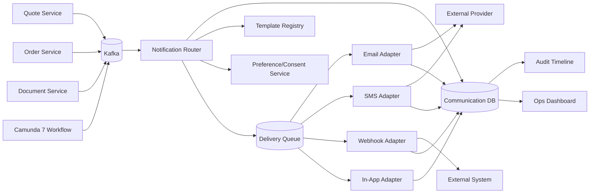
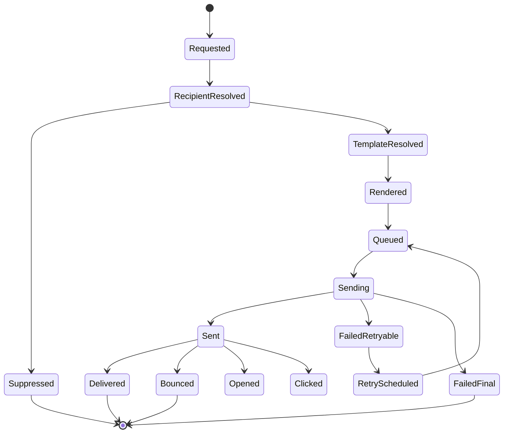
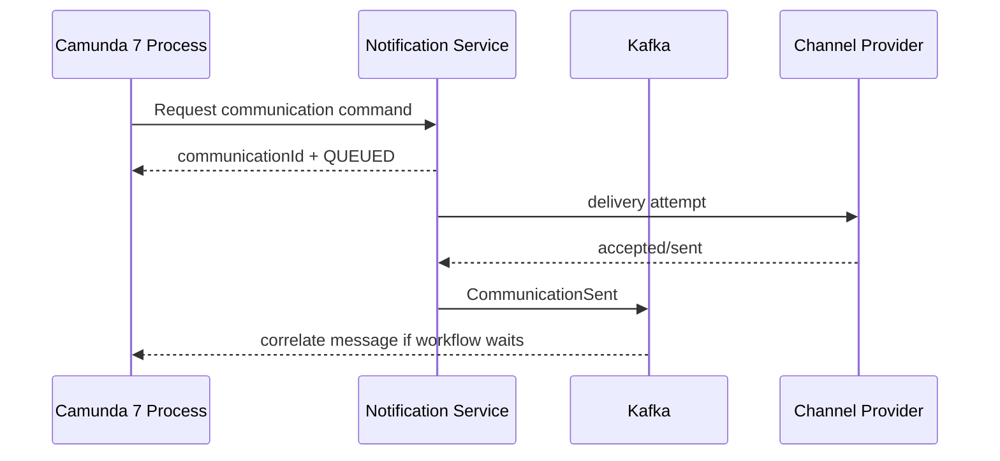
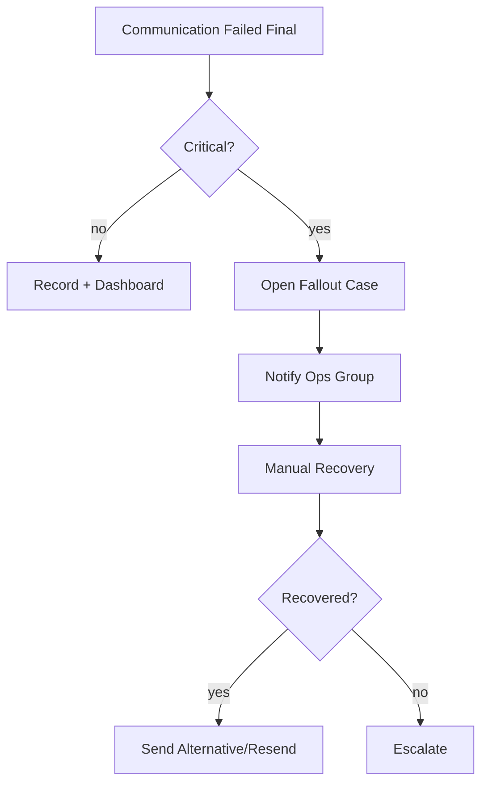

# Part 034 — Notification and Communication Service

Notification service sering dianggap gampang:

```text
event masuk -> kirim email
```

Untuk CPQ/OMS enterprise, model ini terlalu rapuh.

Komunikasi quote/order membawa dampak besar:

- customer menerima proposal;
- approver diberi tugas;
- sales diberi tahu quote expired;
- fulfillment team diberi tahu order stuck;
- support diberi notifikasi fallout;
- customer dikirim order confirmation;
- legal/commercial artifact dikirim keluar;
- SLA escalation dipicu;
- external partner diberi callback.

Jika notification salah, dampaknya bukan sekadar email gagal. Dampaknya bisa:

- customer menerima quote salah;
- customer menerima dokumen superseded;
- approver melewatkan deadline;
- order terlambat karena fallout tidak terlihat;
- duplicate email membuat customer bingung;
- sensitive data bocor;
- audit tidak bisa membuktikan komunikasi;
- workflow lanjut padahal delivery gagal;
- service retry mengirim pesan berkali-kali.

Prinsip utama part ini:

> Notification is not a side effect. It is a communication lifecycle with business evidence.

Notification service bukan sekadar SMTP wrapper. Ia adalah communication control plane.

---

## 1. Notification vs Communication

Kita mulai dari istilah.

| Term | Meaning | Example |
|---|---|---|
| Notification | A message intended to inform or prompt action | approval reminder email |
| Communication | Broader business interaction with recipient | quote proposal delivery |
| Delivery Attempt | One try through one channel/provider | email sent via provider X |
| Delivery Result | Provider/system outcome | accepted, bounced, failed |
| Recipient | Target person/system | customer contact, approver, webhook consumer |
| Template | Versioned content pattern | quote-approved-email:2026.07.0 |
| Message | Concrete rendered content | actual email body sent |
| Communication Record | Auditable record of intent, content metadata, recipient, status | stored evidence |

Tidak semua notification punya legal significance. Tetapi semua notification yang memengaruhi quote/order lifecycle harus punya audit trace.

---

## 2. Communication Types in CPQ/OMS

| Type | Example | Business criticality | Needs artifact? |
|---|---|---:|---:|
| Approval Task Notification | approver assigned | high | no |
| Approval Reminder | pending too long | medium | no |
| Quote Proposal Delivery | send quote PDF to customer | very high | yes |
| Quote Expiry Warning | quote expires in 3 days | medium | sometimes |
| Quote Accepted Confirmation | customer accepted quote | high | yes/evidence |
| Order Confirmation | order created | high | yes/sometimes |
| Fulfillment Update | shipment/provisioning update | medium | no/sometimes |
| Fallout Alert | manual intervention needed | high | no |
| SLA Escalation | order stuck beyond SLA | high | no |
| External Webhook | notify partner/CRM/Billing | high | payload |
| Internal Digest | daily sales summary | low/medium | no |

Criticality menentukan:

- retry policy;
- audit depth;
- content retention;
- approval requirement;
- recipient validation;
- delivery confirmation requirement;
- fallback channel;
- escalation behavior.

---

## 3. Architecture Overview



Notification service menerima business facts dan commands, lalu membuat communication records.

Ia tidak boleh menjadi tempat business state utama quote/order.

Ia boleh menyimpan communication evidence.

---

## 4. Core Responsibilities

Notification/Communication Service bertanggung jawab atas:

- memilih notification rule berdasarkan event/command;
- resolve recipient;
- check preference/consent policy;
- resolve template version;
- render message;
- attach/link artifact safely;
- enqueue delivery attempt;
- integrate with provider/channel;
- retry delivery;
- record delivery result;
- publish communication events;
- expose operational communication history;
- provide audit evidence.

Ia tidak bertanggung jawab atas:

- menghitung harga;
- menentukan approval policy;
- membuat quote document artifact;
- mengubah order fulfillment state tanpa command contract;
- menjadi CRM master data;
- menjadi template storage tanpa governance;
- mengirim dari workflow tanpa record.

---

## 5. Notification Lifecycle



Tidak semua channel mendukung semua status. Email provider mungkin memberi accepted/bounced/opened. Webhook punya HTTP status. In-app punya read/unread.

Lifecycle harus channel-neutral tetapi cukup spesifik untuk operasional.

---

## 6. Communication Record Model

Communication record adalah source of truth untuk komunikasi.

```json
{
  "communicationId": "com-901",
  "tenantId": "tnt-123",
  "communicationType": "QUOTE_PROPOSAL_DELIVERY",
  "status": "SENT",
  "subjectType": "QUOTE_REVISION",
  "subjectId": "qr-004",
  "quoteId": "q-10029",
  "orderId": null,
  "artifactIds": ["art-77a"],
  "recipient": {
    "type": "CUSTOMER_CONTACT",
    "contactId": "contact-551",
    "channel": "EMAIL",
    "addressMasked": "a***@acme.example"
  },
  "templateVersion": "quote-proposal-email:2026.07.0",
  "idempotencyKey": "quote-q-10029-r4-proposal-delivery-contact-551",
  "requestedBy": "user-991",
  "requestedAt": "2026-07-02T10:20:00Z",
  "sentAt": "2026-07-02T10:20:03Z",
  "correlationId": "corr-abc"
}
```

Jangan hanya mengandalkan provider message id. Provider id adalah external attempt identity, bukan business communication identity.

---

## 7. Database Model

Communication table:

```sql
CREATE TABLE communication_record (
  communication_id        uuid PRIMARY KEY,
  tenant_id               text NOT NULL,
  communication_type      text NOT NULL,
  status                  text NOT NULL,
  subject_type            text NOT NULL,
  subject_id              uuid NOT NULL,
  quote_id                uuid,
  order_id                uuid,
  recipient_type          text NOT NULL,
  recipient_ref           text NOT NULL,
  channel                 text NOT NULL,
  address_hash            text,
  address_masked          text,
  template_family         text NOT NULL,
  template_version        text NOT NULL,
  rendered_content_hash   text,
  idempotency_key          text NOT NULL,
  requested_by            text,
  requested_at            timestamptz NOT NULL,
  sent_at                 timestamptz,
  final_at                timestamptz,
  failure_code            text,
  failure_message         text,
  correlation_id          text,
  created_at              timestamptz NOT NULL DEFAULT now(),
  updated_at              timestamptz NOT NULL DEFAULT now(),
  version                 bigint NOT NULL DEFAULT 0,

  CONSTRAINT uq_communication_idempotency UNIQUE (tenant_id, idempotency_key)
);
```

Attempt table:

```sql
CREATE TABLE communication_delivery_attempt (
  attempt_id              uuid PRIMARY KEY,
  tenant_id               text NOT NULL,
  communication_id        uuid NOT NULL REFERENCES communication_record(communication_id),
  attempt_no              int NOT NULL,
  channel                 text NOT NULL,
  provider                text,
  provider_message_id     text,
  status                  text NOT NULL,
  request_payload_hash    text,
  response_code           text,
  response_summary        text,
  attempted_at            timestamptz NOT NULL,
  completed_at            timestamptz,

  CONSTRAINT uq_communication_attempt_no UNIQUE (communication_id, attempt_no)
);
```

Artifact link:

```sql
CREATE TABLE communication_artifact_link (
  communication_id        uuid NOT NULL REFERENCES communication_record(communication_id),
  artifact_id             uuid NOT NULL,
  artifact_role           text NOT NULL,
  PRIMARY KEY (communication_id, artifact_id)
);
```

Outbox:

```sql
CREATE TABLE communication_outbox (
  outbox_id               uuid PRIMARY KEY,
  tenant_id               text NOT NULL,
  aggregate_type          text NOT NULL,
  aggregate_id            uuid NOT NULL,
  event_type              text NOT NULL,
  event_version           int NOT NULL,
  payload                 jsonb NOT NULL,
  headers                 jsonb NOT NULL,
  status                  text NOT NULL DEFAULT 'PENDING',
  created_at              timestamptz NOT NULL DEFAULT now(),
  published_at            timestamptz
);
```

Content retention perlu dipikirkan. Menyimpan full rendered body mungkin membantu audit, tetapi meningkatkan risiko privacy/sensitive data. Alternatifnya simpan hash, template version, render data reference, dan delivery metadata.

---

## 8. Command vs Event-Triggered Notification

Ada dua mode utama.

### 8.1 Command-triggered

User/system explicitly requests communication.

Example:

```http
POST /quotes/{quoteId}/revisions/{revisionNo}/communications/send-proposal
Idempotency-Key: send-proposal-q-10029-r4-contact-551
```

Command-triggered cocok untuk:

- send proposal;
- resend proposal;
- send order confirmation;
- manual fallout escalation;
- customer-specific communication.

### 8.2 Event-triggered

Business event triggers rule.

Example:

```text
QuoteSubmittedForApproval -> notify approver
OrderFulfillmentFailed -> notify operations group
DocumentArtifactAvailable -> if delivery intent exists, send proposal
```

Event-triggered cocok untuk:

- task assignment;
- reminders;
- SLA warnings;
- operational alerts;
- system callbacks.

Aturan penting:

> Critical customer communication should often be command-triggered or workflow-controlled, not blindly triggered by low-level events.

`DocumentArtifactAvailable` tidak selalu berarti “kirim ke customer”. Bisa jadi artifact dibuat untuk preview, internal approval, atau manual review.

---

## 9. Notification Rule Model

Rule menentukan kapan komunikasi dibuat.

Example:

```json
{
  "ruleId": "rule-approval-assigned-v1",
  "triggerEventType": "ApprovalTaskAssigned",
  "communicationType": "APPROVAL_TASK_ASSIGNED",
  "recipientResolver": "APPROVAL_ASSIGNEE",
  "channelPreference": ["IN_APP", "EMAIL"],
  "templateFamily": "approval-task-assigned",
  "priority": "HIGH",
  "dedupeWindow": "PT15M",
  "enabled": true
}
```

Rule harus versioned/effective-dated jika perubahan notification dapat berdampak bisnis.

Jangan hardcode semua rule di consumer class.

Untuk awal project, boleh config static dalam code. Tetapi tetap modelkan konsep rule agar transisi ke admin-governed rules tidak merusak arsitektur.

---

## 10. Recipient Resolution

Recipient resolution sering lebih kompleks dari template rendering.

Source recipient:

- customer contact selected in quote;
- billing contact;
- sales owner;
- sales manager;
- approval assignee;
- candidate group;
- operations queue;
- tenant admin;
- external partner endpoint;
- webhook subscription.

Recipient resolver harus menghasilkan recipient yang eksplisit:

```json
{
  "recipientType": "CUSTOMER_CONTACT",
  "recipientRef": "contact-551",
  "displayName": "Ana Customer",
  "channel": "EMAIL",
  "address": "ana@acme.example",
  "language": "en-US",
  "timezone": "America/New_York"
}
```

Failure cases:

- no recipient found;
- recipient has no valid address;
- recipient opted out;
- recipient inactive;
- duplicate recipient;
- recipient belongs to another tenant;
- recipient not authorized for artifact;
- channel not available for market.

Recipient failure harus menjadi status bisnis, bukan NullPointerException.

---

## 11. Preference, Consent, and Suppression

Tidak semua message boleh dikirim hanya karena sistem bisa.

Preference/consent dimension:

- channel preference;
- language preference;
- opt-out;
- quiet hours;
- regulatory consent;
- customer account communication policy;
- internal role notification policy;
- bounce suppression;
- blacklisted domain;
- tenant-level disable switch;
- maintenance freeze.

Suppression result harus auditable.

Example:

```json
{
  "communicationId": "com-901",
  "status": "SUPPRESSED",
  "suppressionReason": "CUSTOMER_OPTED_OUT_MARKETING",
  "evaluatedAt": "2026-07-02T10:20:00Z"
}
```

Namun hati-hati: quote proposal delivery mungkin transactional/contractual, bukan marketing. Preference rule harus membedakan message category.

Jangan memakai satu boolean `email_opt_out` untuk semua hal.

---

## 12. Template and Content Governance

Notification template juga versioned.

Template identity:

```text
quote-proposal-email:2026.07.0
approval-reminder-email:2026.07.0
fallout-alert-inapp:2026.07.0
order-confirmation-email:2026.07.0
```

Template metadata:

- family;
- version;
- channel;
- locale;
- market;
- message category;
- owner;
- effective date;
- approved by;
- supported payload schema;
- subject template;
- body template;
- attachment/link policy;
- retention policy.

Template change can change business meaning.

Example subject change:

```text
Old: Your quote is ready
New: Your approved contract offer is ready
```

Itu bukan sekadar copywriting. Bisa punya implikasi legal/commercial.

---

## 13. Render Data Boundary

Notification render data tidak boleh sembarang mengambil entity penuh.

Bad:

```json
{
  "quote": {"entireQuoteEntity": "..."},
  "customer": {"entireCustomerEntity": "..."}
}
```

Better:

```json
{
  "quoteNumber": "Q-2026-0001029",
  "customerDisplayName": "Acme Manufacturing",
  "proposalLink": "https://portal.example/quotes/q-10029/artifacts/art-77a",
  "validUntilDisplay": "August 1, 2026",
  "salesContactName": "Dina S."
}
```

Content rendering harus memakai purpose-built payload.

Keuntungan:

- mengurangi leakage;
- template lebih stabil;
- test lebih mudah;
- snapshot evidence lebih jelas;
- compatibility lebih terkontrol.

---

## 14. Artifact Attachment Policy

Untuk quote proposal, communication harus terkait artifact.

Ada dua cara umum:

### 14.1 Attach binary

Email menyertakan PDF attachment.

Pros:

- mudah untuk customer;
- offline access;
- attachment menjadi evidence delivery.

Cons:

- size limit;
- forwarded widely;
- access revocation sulit;
- duplicate storage in provider;
- sensitive document leaks easier.

### 14.2 Link to portal/signed URL

Email berisi link.

Pros:

- access controlled;
- can require authentication;
- can expire;
- download tracked;
- easier revocation.

Cons:

- customer friction;
- link expiry issue;
- portal availability dependency.

Policy tergantung business/legal. Untuk high-value B2B quote, portal link sering lebih defensible daripada permanent attachment.

Jika attach PDF, communication record harus menyimpan artifact id dan binary hash yang dikirim.

---

## 15. Idempotency and Deduplication

Notification retry bisa menyebabkan duplicate communication.

Idempotency key harus business-specific.

Examples:

```text
approval-task-assigned:{taskId}:{assigneeId}:v1
quote-proposal-delivery:{quoteRevisionId}:{artifactId}:{recipientContactId}:v1
order-confirmation:{orderId}:{recipientContactId}:v1
fallout-alert:{falloutCaseId}:{recipientGroup}:{escalationLevel}:v1
```

Dedupe window berbeda dari idempotency.

| Mechanism | Meaning |
|---|---|
| Idempotency | same command returns same communication |
| Dedupe window | suppress near-duplicate noisy events |
| Rate limit | bound volume per recipient/channel |
| Suppression | policy says do not send |

Jangan hanya mengandalkan provider deduplication.

Provider tidak memahami quote revision, artifact, atau fallout case.

---

## 16. Retry Strategy

Retry harus berdasarkan failure class.

| Failure | Retry? | Example |
|---|---:|---|
| Provider timeout | yes | SMTP/API timeout |
| 5xx provider | yes | provider unavailable |
| 429 rate limit | yes with backoff | throttled |
| Invalid email | no | malformed address |
| Suppressed recipient | no | opted out |
| Template missing | no until fixed | config error |
| Artifact unavailable | wait/retry via dependency | proposal not generated |
| Unauthorized artifact | no | data policy issue |
| Webhook 400 | no or manual | receiver rejected payload |
| Webhook 500 | yes | receiver temporary error |

Retry policy example:

```text
attempt 1: now
attempt 2: +1 minute
attempt 3: +5 minutes
attempt 4: +30 minutes
attempt 5: +2 hours
then final failure + escalation if critical
```

Retry must not create new communication record unless business wants resend.

It should create delivery attempts under same communication record.

---

## 17. Channel Adapters

Channel adapter hides provider-specific API.

Interface:

```java
public interface DeliveryChannelAdapter {
  DeliveryResult send(DeliveryRequest request);
  Channel channel();
  boolean supports(MessageCategory category);
}
```

Email adapter request:

```json
{
  "communicationId": "com-901",
  "to": [{"address": "ana@acme.example", "name": "Ana Customer"}],
  "subject": "Your quote Q-2026-0001029 is ready",
  "htmlBody": "...",
  "textBody": "...",
  "attachments": [],
  "headers": {
    "X-Correlation-Id": "corr-abc"
  }
}
```

Webhook adapter request:

```json
{
  "communicationId": "com-902",
  "endpointId": "crm-main",
  "eventType": "OrderCreated",
  "payload": {...},
  "signature": "..."
}
```

Provider-specific metadata belongs in attempt record, not in domain-level communication API.

---

## 18. Webhook as Communication

Webhook sering dianggap integration, bukan notification. Tapi dalam CPQ/OMS, webhook adalah communication to external system.

Webhook needs:

- subscription registry;
- endpoint validation;
- signing secret;
- payload schema version;
- retry policy;
- idempotency key;
- event ordering caveat;
- delivery attempt log;
- DLQ/manual replay;
- tenant boundary;
- rate limit;
- circuit breaker.

Webhook delivery record:

```json
{
  "communicationType": "EXTERNAL_WEBHOOK",
  "recipientType": "WEBHOOK_SUBSCRIPTION",
  "recipientRef": "sub-120",
  "channel": "WEBHOOK",
  "status": "FAILED_RETRYABLE",
  "subjectType": "ORDER",
  "subjectId": "ord-991"
}
```

Jangan fire-and-forget webhook tanpa record. Partner akan bertanya, “apakah event sudah dikirim?” Sistem harus bisa menjawab.

---

## 19. Camunda 7 Integration

Workflow butuh notification untuk:

- approval task assignment;
- approval escalation;
- document delivery;
- fallout manual task;
- customer communication wait states;
- timeout reminders;
- external callback.

Pattern yang baik:



Camunda process variable cukup menyimpan:

```json
{
  "communicationId": "com-901",
  "artifactId": "art-77a",
  "quoteId": "q-10029"
}
```

Jangan simpan rendered email body atau full recipient list di Camunda variable kecuali ada alasan kuat.

Workflow should wait for business-level result only when necessary.

Tidak semua email perlu membuat workflow menunggu delivery. Approval reminder bisa fire-and-observe. Quote proposal delivery mungkin perlu lanjut setelah `CommunicationSent` atau `CommunicationDelivered`, tergantung policy.

---

## 20. Event Contracts

Notification service consumes events:

```text
QuoteSubmittedForApproval
ApprovalTaskAssigned
ApprovalTaskEscalated
DocumentArtifactAvailable
QuoteAccepted
OrderCreated
OrderFulfillmentFailed
FalloutCaseOpened
OrderCompleted
```

Notification service publishes events:

```text
CommunicationRequested
CommunicationSuppressed
CommunicationQueued
CommunicationSent
CommunicationFailed
CommunicationBounced
CommunicationDelivered
CommunicationOpened
CommunicationClicked
```

Event example:

```json
{
  "eventId": "evt-1001",
  "eventType": "CommunicationSent",
  "eventVersion": 1,
  "occurredAt": "2026-07-02T10:20:03Z",
  "tenantId": "tnt-123",
  "communicationId": "com-901",
  "communicationType": "QUOTE_PROPOSAL_DELIVERY",
  "subjectType": "QUOTE_REVISION",
  "subjectId": "qr-004",
  "quoteId": "q-10029",
  "artifactIds": ["art-77a"],
  "channel": "EMAIL",
  "recipientType": "CUSTOMER_CONTACT",
  "recipientRef": "contact-551",
  "correlationId": "corr-abc"
}
```

Do not publish raw email address unless necessary and allowed.

---

## 21. Communication API

### Send quote proposal

```http
POST /quotes/{quoteId}/revisions/{revisionNo}/communications/proposal
Idempotency-Key: quote-q-10029-r4-art-77a-contact-551
```

Body:

```json
{
  "artifactId": "art-77a",
  "recipientContactId": "contact-551",
  "channel": "EMAIL",
  "deliveryMode": "PORTAL_LINK",
  "messageNote": "Optional short sales note"
}
```

Response:

```json
{
  "communicationId": "com-901",
  "status": "QUEUED",
  "communicationType": "QUOTE_PROPOSAL_DELIVERY"
}
```

### Resend communication

```http
POST /communications/{communicationId}/resend
Idempotency-Key: resend-com-901-20260702-1
```

Resend should create a new communication record or new attempt depending business meaning.

Recommended:

- retry same communication for technical failure;
- resend creates new communication linked to original.

### Get communication history

```http
GET /quotes/{quoteId}/communications
```

Return communication records, not provider logs only.

---

## 22. In-App Notification and Worklist Boundary

In-app notification differs from worklist.

| Surface | Meaning |
|---|---|
| Worklist task | actionable unit user must complete |
| In-app notification | message informing user something happened |
| Alert | high-priority issue requiring attention |
| Dashboard item | aggregate operational state |

Approval task assignment creates a worklist task via Camunda/human task model. It may also create an in-app/email notification.

Do not implement approval task as “email only”. Email can be missed. The task must exist in workflow/worklist.

Notification is a prompt, not the task authority.

---

## 23. SLA Reminders and Escalations

SLA reminder can be generated by:

- Camunda timer boundary event;
- scheduled query over projection;
- event-driven rule with due time;
- dedicated SLA service.

Example:

```text
Approval task assigned at 09:00
Reminder at +4 business hours
Escalation at +1 business day
Auto-reassign at +2 business days if policy allows
```

Notification service should not decide approval escalation policy alone.

It should receive:

```text
ApprovalTaskEscalated
```

or a command:

```text
SendEscalationNotification
```

Policy belongs to workflow/policy domain. Notification executes communication.

---

## 24. Failure and Fallout

Notification failure itself can create fallout.

Examples:

- quote proposal delivery final failed;
- order confirmation email bounced;
- webhook to billing failed permanently;
- approver notification suppressed due to missing email;
- customer contact invalid;
- artifact unavailable for delivery.

For critical communication, final failure should trigger:

- operational alert;
- fallout case;
- manual retry task;
- alternative channel;
- workflow incident/event.

Failure model:



A communication system without failure recovery is not enterprise-grade.

---

## 25. Security and Privacy

Notification is a high-risk data leakage point.

Security rules:

- do not include sensitive data unless necessary;
- prefer portal links for sensitive artifacts;
- mask email/phone in logs;
- store address hash for dedupe/search;
- encrypt sensitive payload if stored;
- do not expose provider payload broadly;
- validate recipient belongs to tenant/subject;
- prevent mass email injection via user note;
- sanitize HTML content;
- sign webhooks;
- avoid logging signed URLs;
- separate internal and customer templates;
- review template variables for leakage.

Example leakage:

```text
Internal margin: 42%
Approval reason: Customer is high risk but acceptable
Cost basis: USD 71,000
```

This must never appear in customer email.

---

## 26. Rate Limiting and Noise Control

Too many notifications create blindness.

Controls:

- per recipient rate limit;
- per communication type rate limit;
- digest mode for low-priority updates;
- dedupe window;
- escalation threshold;
- quiet hours;
- group notification aggregation;
- suppress repeated state updates that do not change action.

Example:

```text
Do not email approver more than once every 4 hours for same quote approval task.
Do show in-app task status immediately.
Escalate to manager only after SLA breach.
```

For operations:

```text
Group 20 similar inventory timeout alerts into one digest if they share root cause.
```

Notification design must respect human attention as a scarce resource.

---

## 27. Content Personalization Boundary

Personalization can be useful but dangerous.

Allowed:

- recipient name;
- quote number;
- sales contact;
- customer portal link;
- localized greeting;
- relevant due date.

Dangerous:

- exposing internal segmentation;
- exposing approval score;
- exposing discount policy threshold;
- exposing inferred customer risk;
- dynamic legal wording without template governance;
- AI-generated customer-facing legal/commercial text without review.

For enterprise CPQ, commercial communication should be deterministic and governed.

AI/dynamic copy may help internal draft, but final customer-facing content must have control points.

---

## 28. Bounce, Complaint, and Feedback Handling

Email delivery is not complete when provider accepts message.

Feedback types:

- hard bounce;
- soft bounce;
- complaint/spam report;
- unsubscribe;
- open;
- click;
- delivery delayed;
- mailbox full;
- domain blocked.

Bounce handling:

```text
Provider webhook -> Notification Service -> update attempt/communication -> publish CommunicationBounced -> update contact suppression/read model -> possibly open fallout
```

Do not let provider webhook directly mutate customer master data without validation.

Bounce event should be interpreted according to channel and message category.

---

## 29. Operational Dashboard

Dashboard should show:

- queued count;
- sending count;
- failed retryable count;
- failed final count;
- suppressed count;
- bounce count;
- provider latency;
- provider error rate;
- template failure count;
- artifact unavailable blockers;
- communication by type;
- communication by tenant;
- delivery SLA breach;
- retry queue age;
- webhook endpoint failure rate.

Useful operational questions:

- Which quote proposals failed to send today?
- Which customers have bounced order confirmations?
- Which approvers did not receive task notification?
- Which template release increased failure rate?
- Which provider is degraded?
- Which webhooks are repeatedly failing?

---

## 30. Testing Strategy

Testing layers:

| Test | Purpose |
|---|---|
| Rule matching test | event maps to expected communication |
| Recipient resolver test | correct recipients and failures |
| Preference test | suppression correctness |
| Template schema test | payload compatible |
| Rendering test | subject/body generated safely |
| Idempotency test | duplicate command no duplicate communication |
| Retry test | retryable/non-retryable behavior |
| Provider adapter contract test | request/response mapping |
| Webhook signing test | signature correctness |
| Authorization test | artifact/recipient tenant boundary |
| Camunda integration test | workflow correlation with communication event |
| Audit test | communication trace complete |

Scenario test example:

```text
Given quote revision 4 has available artifact art-77a
And customer contact contact-551 has transactional email enabled
When sales sends quote proposal
Then one communication record is created
And it links to artifact art-77a
And it uses template quote-proposal-email active for market/locale
And delivery attempt is queued
And duplicate command with same idempotency key returns same communication
```

Suppression test example:

```text
Given customer contact has invalid email
When quote proposal delivery is requested
Then communication status becomes FAILED_FINAL or SUPPRESSED according to policy
And no provider attempt is made
And fallout is opened if communication is critical
```

---

## 31. Implementation Skeleton

Command handler:

```java
public final class SendQuoteProposalHandler {
  private final ArtifactClient artifactClient;
  private final RecipientResolver recipientResolver;
  private final PreferenceService preferenceService;
  private final TemplateResolver templateResolver;
  private final MessageRenderer renderer;
  private final CommunicationRepository communicationRepository;
  private final DeliveryQueue deliveryQueue;
  private final OutboxWriter outboxWriter;
  private final AuthorizationService authorizationService;

  public CommunicationResponse handle(SendQuoteProposalCommand command) {
    authorizationService.assertCanSendQuoteProposal(
        command.actor(), command.tenantId(), command.quoteId());

    ArtifactView artifact = artifactClient.getAvailableArtifact(
        command.tenantId(), command.artifactId());

    artifact.assertSubject(command.quoteId(), command.revisionNo());
    artifact.assertType(ArtifactType.QUOTE_PROPOSAL);

    Recipient recipient = recipientResolver.resolveCustomerContact(
        command.tenantId(), command.recipientContactId());

    PreferenceDecision preference = preferenceService.evaluate(
        recipient, MessageCategory.TRANSACTIONAL_QUOTE_DELIVERY);

    TemplateResolution template = templateResolver.resolve(
        "quote-proposal-email",
        recipient.locale(),
        artifact.market(),
        command.requestedAt());

    Communication existing = communicationRepository
        .findByIdempotencyKey(command.tenantId(), command.idempotencyKey())
        .orElse(null);

    if (existing != null) {
      return CommunicationResponse.from(existing);
    }

    Communication communication = Communication.requested(
        command.tenantId(),
        CommunicationType.QUOTE_PROPOSAL_DELIVERY,
        artifact.subject(),
        recipient,
        template,
        command.idempotencyKey(),
        command.actor());

    if (preference.isSuppressed()) {
      communication.markSuppressed(preference.reason());
      communicationRepository.save(communication);
      outboxWriter.append(CommunicationSuppressed.from(communication));
      return CommunicationResponse.from(communication);
    }

    RenderedMessage message = renderer.render(template, QuoteProposalEmailPayload.from(artifact, recipient));
    communication.markRendered(message.hash());
    communication.linkArtifact(artifact.artifactId(), "QUOTE_PROPOSAL");
    communication.markQueued();

    communicationRepository.save(communication);
    deliveryQueue.enqueue(communication.communicationId(), message);
    outboxWriter.append(CommunicationQueued.from(communication));

    return CommunicationResponse.from(communication);
  }
}
```

Delivery worker:

```java
public final class DeliveryWorker {
  private final DeliveryQueue deliveryQueue;
  private final CommunicationRepository communicationRepository;
  private final DeliveryChannelRegistry channelRegistry;
  private final OutboxWriter outboxWriter;

  public void pollAndSend() {
    deliveryQueue.claimNext().ifPresent(job -> {
      Communication communication = communicationRepository.getForUpdate(job.communicationId());
      DeliveryChannelAdapter adapter = channelRegistry.get(communication.channel());

      DeliveryAttempt attempt = communication.startAttempt();

      try {
        DeliveryResult result = adapter.send(job.toDeliveryRequest(communication));
        communication.applyDeliveryResult(attempt, result);

        if (communication.isSent()) {
          outboxWriter.append(CommunicationSent.from(communication));
        }
        if (communication.isFinalFailure()) {
          outboxWriter.append(CommunicationFailed.from(communication));
        }
      } catch (RetryableDeliveryException e) {
        communication.markAttemptRetryableFailure(attempt, e.code(), e.getMessage());
        deliveryQueue.scheduleRetry(job, e.retryAfter());
      } catch (NonRetryableDeliveryException e) {
        communication.markFinalFailure(attempt, e.code(), e.getMessage());
        outboxWriter.append(CommunicationFailed.from(communication));
      }

      communicationRepository.save(communication);
    });
  }
}
```

Again: implementation can vary. Lifecycle and invariants must not.

---

## 32. Anti-Patterns

### 32.1 Send email directly from Quote Service

Quote service becomes coupled to channel/provider and loses communication lifecycle.

### 32.2 Send email directly from Camunda delegate

Workflow execution becomes dependent on email provider latency/failure.

### 32.3 Treat provider accepted as business delivered

Provider accepted means provider accepted request. It may still bounce later.

### 32.4 No idempotency key

Retries create duplicate customer emails.

### 32.5 Store raw email body with sensitive data forever

Audit benefit may not justify privacy risk.

### 32.6 Use one template for internal and customer communication

Internal variables leak.

### 32.7 Notification decides business policy

Notification should execute communication, not decide approval or fulfillment logic.

### 32.8 No operational dashboard

Failed communication becomes invisible until customer complains.

---

## 33. Production Readiness Checklist

Before notification service is production-ready:

- [ ] communication record model exists;
- [ ] delivery attempt model exists;
- [ ] idempotency key enforced;
- [ ] retry policy by failure class exists;
- [ ] suppression/preference evaluated;
- [ ] recipient resolution is explicit and testable;
- [ ] template versioning exists;
- [ ] internal/customer template separation exists;
- [ ] artifact link policy exists;
- [ ] sensitive data is masked in logs;
- [ ] provider adapter errors are normalized;
- [ ] webhook signing and retry implemented if webhooks exist;
- [ ] Camunda does not send provider calls directly;
- [ ] critical failure opens fallout/escalation;
- [ ] communication events are published;
- [ ] dashboard shows queue and failure health;
- [ ] bounce/feedback handling exists if email provider supports it;
- [ ] duplicate event handling tested;
- [ ] authorization/tenant boundary tested;
- [ ] runbook exists for provider outage;
- [ ] template release quality gate exists.

---

## 34. Mental Model Recap

Notification service di CPQ/OMS enterprise adalah communication ledger + delivery engine.

Ia harus menjawab:

- apa yang ingin dikomunikasikan;
- kepada siapa;
- berdasarkan event/command apa;
- memakai template versi apa;
- apakah boleh dikirim;
- artifact apa yang terkait;
- apakah sudah dikirim;
- apakah gagal;
- apakah perlu retry;
- apakah perlu escalation;
- apakah bisa dibuktikan nanti.

Rule paling penting:

> Never make critical communication an invisible side effect.

Quote proposal delivery, approval escalation, order confirmation, fallout alert, dan webhook integration adalah bagian dari enterprise lifecycle. Mereka perlu contract, idempotency, observability, audit, dan recovery.

Part berikutnya akan membahas API Composition and Frontend-Facing BFF: bagaimana UI CPQ/OMS mendapatkan view yang cepat dan aman tanpa membuat backend menjadi endpoint chaos atau chatty microservice graph.
