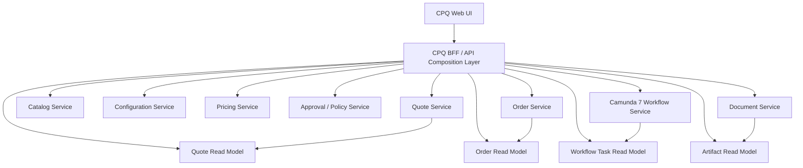
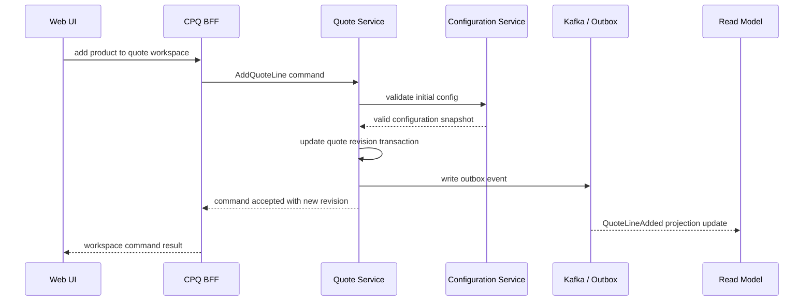
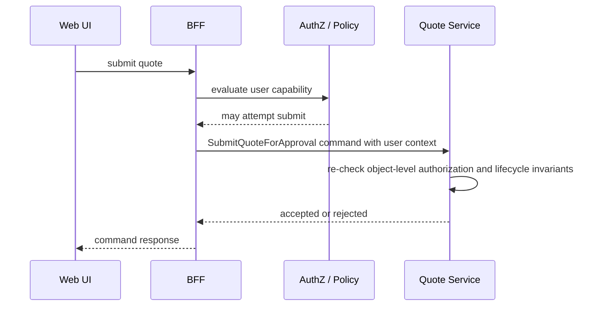

# Part 035 — API Composition and Frontend-Facing BFF

A CPQ screen is rarely backed by one service.

A sales user opens a quote workspace. The screen needs the quote header, quote lines, product names, eligibility status, configuration warnings, pricing summary, discount authority, approval state, generated document status, customer context, order conversion readiness, and maybe workflow tasks assigned to the current user.

If the frontend calls every backend service directly, the UI becomes a distributed transaction coordinator with CSS.

If the quote service starts returning everything the UI wants, the quote service becomes a god service.

The correct middle ground is a **frontend-facing API composition layer**, usually called a **BFF**: Backend for Frontend.

The BFF is not where the business lives. It is where a specific user experience is shaped from multiple business capabilities.

The mental model:

> Domain services own truth.  
> Workflow owns long-running coordination.  
> Events build derived views.  
> BFF owns screen-shaped composition and interaction ergonomics.

This part designs the BFF for a production-grade CPQ/OMS platform.

---

## 1. The Problem: CPQ UI Is Not CRUD

A simple CRUD UI maps roughly like this:

```text
screen -> resource -> table
```

A CPQ workspace maps more like this:

```text
screen -> quote lifecycle
       -> quote lines
       -> product catalog snapshot
       -> configuration validation
       -> price trace
       -> approval policy
       -> workflow task
       -> document artifact
       -> notification state
       -> order conversion readiness
```

That means a frontend page cannot be designed by asking, “Which table does this screen edit?”

The better question is:

> What decision or action does this screen help a user perform, and which authoritative services must be consulted to do it safely?

For example, a quote pricing screen is not just displaying price.
It helps the user answer:

- Is this quote currently priceable?
- Are all quote lines valid?
- What changed since the last price calculation?
- Is the price result still fresh?
- Which discounts require approval?
- Can the current user override anything?
- Can this quote move to approval?

A BFF exists because the UI needs **task-oriented composition**, while backend services should stay **capability-oriented**.

---

## 2. What the BFF Is Allowed to Own

A BFF may own:

1. Screen-shaped response models.
2. UI workflow simplification.
3. Aggregation of read models.
4. Presentation-specific filtering.
5. Request fan-out where safe.
6. Small interaction conveniences.
7. Client-specific pagination and sorting adapters.
8. API shape optimized for frontend journey.
9. Correlation ID propagation.
10. Translation from domain errors into user-actionable UI hints.

A BFF must not own:

1. Final quote state.
2. Final price calculation.
3. Product eligibility truth.
4. Approval authority truth.
5. Order fulfillment state.
6. Workflow process state.
7. Audit truth.
8. Cross-service transaction decisions.
9. Idempotency guarantees for domain commands unless delegated to domain services.
10. Tenant isolation rules independent of the underlying services.

The BFF is allowed to say:

> “Here is the quote workspace shape for this user.”

The BFF is not allowed to say:

> “This quote is approved because the UI button was clicked.”

Approval is a domain/workflow decision. The BFF only calls the command endpoint that performs the decision.

---

## 3. Architecture Positioning

A clean CPQ/OMS frontend architecture usually has two layers of read composition:

1. **Operational read models** built from domain events.
2. **BFF composition APIs** that shape those read models and call authoritative services when needed.



The BFF does not need to call every authoritative service on every request.

For common screen loads, prefer read models:

```text
GET /ui/quote-workspaces/{quoteId}
  -> quote workspace projection
  -> current user capability projection
  -> workflow task projection
  -> artifact projection
```

For commands, call authoritative services:

```text
POST /ui/quote-workspaces/{quoteId}/actions/submit-for-approval
  -> Quote Service command
  -> Workflow Service correlation if required
```

Read from projections when the user is observing.
Command through domain services when the user is changing truth.

---

## 4. The Most Important BFF Invariant

The BFF may compose **views**.

The BFF may not compose **truth**.

This distinction prevents a common enterprise failure: a composed screen shows data that looks authoritative, but no single backend service can defend it.

Example bad design:

```text
BFF loads quote lines from Quote Service
BFF loads price from Pricing Service
BFF loads approval requirement from Policy Service
BFF decides quote is ready for acceptance
```

This is wrong.

The quote service must own whether a quote can be accepted, because acceptance changes quote lifecycle and creates legal/commercial consequence.
The BFF can display readiness hints, but the final command must validate again.

Correct design:

```text
BFF displays:
  - current known price state
  - current known approval state
  - readiness hints

Quote Service command validates:
  - quote state
  - latest revision
  - price freshness
  - approval freshness
  - user authority
  - idempotency key
```

The screen can be helpful.
The domain command must be decisive.

---

## 5. Screen-Oriented API Design

A BFF endpoint should usually be named after user workspaces, not database entities.

Bad:

```http
GET /ui/quotes/{quoteId}/header
GET /ui/quotes/{quoteId}/lines
GET /ui/quotes/{quoteId}/prices
GET /ui/quotes/{quoteId}/tasks
GET /ui/quotes/{quoteId}/documents
GET /ui/quotes/{quoteId}/permissions
```

This forces the browser to become the composition engine.

Better:

```http
GET /ui/quote-workspaces/{quoteId}
```

Response shape:

```json
{
  "quote": {
    "quoteId": "Q-2026-000231",
    "revision": 4,
    "status": "PRICED",
    "customerName": "Acme Corp",
    "currency": "USD"
  },
  "lifecycle": {
    "currentState": "PRICED",
    "availableActions": ["EDIT", "SUBMIT_FOR_APPROVAL", "GENERATE_DOCUMENT"],
    "blockedActions": [
      {
        "action": "ACCEPT",
        "reasonCode": "APPROVAL_REQUIRED",
        "message": "Discount approval is required before acceptance."
      }
    ]
  },
  "lines": [
    {
      "quoteLineId": "QL-1",
      "displayName": "Enterprise Connectivity Bundle",
      "configurationStatus": "VALID",
      "pricingStatus": "PRICED",
      "warnings": []
    }
  ],
  "pricing": {
    "status": "FRESH",
    "totalRecurring": "12000.00",
    "totalOneTime": "1500.00",
    "approvalImpact": "REQUIRES_APPROVAL"
  },
  "approval": {
    "required": true,
    "status": "NOT_SUBMITTED",
    "nextApproverHint": "Regional Sales Manager"
  },
  "documents": {
    "latestProposal": null,
    "canGenerate": true
  },
  "tasks": []
}
```

Notice the response is not an entity model.
It is a **workspace model**.

The workspace model answers: “What does the user need to know and do now?”

---

## 6. BFF Command API Design

A BFF may expose screen-friendly command endpoints.
But the command must still map to authoritative backend commands.

Example:

```http
POST /ui/quote-workspaces/{quoteId}/actions/add-product
Idempotency-Key: 01JABC...
If-Match: "quote-revision-4"
```

Request:

```json
{
  "productOfferingId": "PO-ENT-CONNECTIVITY",
  "quantity": 1,
  "initialCharacteristics": {
    "bandwidth": "1Gbps",
    "termMonths": 36
  }
}
```

BFF behavior:

1. Extract tenant/user/correlation context.
2. Validate only request shape and UI-level convenience rules.
3. Call quote service command.
4. Return updated workspace or command result.

BFF must not directly write quote tables.



The BFF can optionally return a fresh composed workspace after the command.
But the command result should be explicit about projection freshness:

```json
{
  "commandId": "CMD-9123",
  "quoteId": "Q-2026-000231",
  "newRevision": 5,
  "workspaceFreshness": "COMMAND_RESULT_AUTHORITATIVE_READ_MODEL_MAY_LAG",
  "links": {
    "workspace": "/ui/quote-workspaces/Q-2026-000231"
  }
}
```

This prevents a subtle lie: the command succeeded, but projections may still be catching up.

---

## 7. BFF Endpoint Categories

A CPQ BFF usually has five categories of endpoints.

### 7.1 Workspace Endpoints

These support major user journeys.

```http
GET /ui/quote-workspaces/{quoteId}
GET /ui/order-workspaces/{orderId}
GET /ui/customer-workspaces/{customerId}
GET /ui/approval-workspaces/{taskId}
GET /ui/fallout-workspaces/{caseId}
```

Workspace endpoints are composition-heavy and read-oriented.

### 7.2 Action Endpoints

These support user actions.

```http
POST /ui/quote-workspaces/{quoteId}/actions/add-product
POST /ui/quote-workspaces/{quoteId}/actions/reprice
POST /ui/quote-workspaces/{quoteId}/actions/submit-for-approval
POST /ui/quote-workspaces/{quoteId}/actions/generate-proposal
POST /ui/quote-workspaces/{quoteId}/actions/accept
POST /ui/order-workspaces/{orderId}/actions/cancel
```

Action endpoints are command-oriented and must be idempotent.

### 7.3 Lookup Endpoints

These support UI-assisted search.

```http
GET /ui/lookups/product-offerings?query=fiber&customerId=C-1
GET /ui/lookups/accounts?query=acme
GET /ui/lookups/approvers?quoteId=Q-1
```

Lookup endpoints must avoid leaking unauthorized data.

### 7.4 Task Endpoints

These support worklist and human workflow.

```http
GET /ui/worklists/my-tasks
GET /ui/worklists/team-tasks
POST /ui/tasks/{taskId}/actions/claim
POST /ui/tasks/{taskId}/actions/complete
POST /ui/tasks/{taskId}/actions/reassign
```

The BFF may call the workflow service, but task completion must be semantic, not raw variable mutation.

### 7.5 Admin/Operator Endpoints

These support operational control, usually separated by role and network policy.

```http
GET /ui/ops/orders/{orderId}/timeline
GET /ui/ops/workflows/{businessKey}/incidents
POST /ui/ops/fallout-cases/{caseId}/actions/retry
POST /ui/ops/fallout-cases/{caseId}/actions/escalate
```

Operator endpoints should be separately protected and heavily audited.

---

## 8. Composition Strategies

There are three common composition strategies.

### Strategy A: Direct Synchronous Fan-Out

BFF calls several services live during one request.

Good for:

- Low-latency internal services.
- Small number of dependencies.
- Data that must be fresh.
- Admin/debug screens.

Bad for:

- Large dashboards.
- High-volume landing pages.
- Screens with many optional panels.
- Services with unstable latency.

Risk:

```text
BFF latency = slowest dependency + retries + serialization + network overhead
```

If a quote workspace calls eight services live, the frontend does not have one dependency; it has eight.

Use strict dependency budgets:

```text
Quote workspace load may call at most:
- 1 primary read model
- 1 authorization/capability service
- 1 optional workflow task service
```

Anything else should come from projections or lazy panels.

### Strategy B: Projection-First Composition

BFF reads a pre-built workspace projection.

Good for:

- Quote workspace landing page.
- Order workspace landing page.
- Worklist.
- Search results.
- Operational dashboard.

Risk:

- Projection lag.
- Stale display.
- Rebuild complexity.

The UI must understand freshness:

```json
{
  "projectionVersion": 923481,
  "sourceRevision": 5,
  "freshness": {
    "quote": "UP_TO_DATE",
    "pricing": "UP_TO_DATE",
    "approval": "MAY_LAG"
  }
}
```

The command endpoint still validates against authoritative services.

### Strategy C: Hybrid Composition

Use projections for most data and live calls for small, critical checks.

Example:

```text
GET /ui/quote-workspaces/{quoteId}
  - read quote workspace projection
  - live call entitlement service for current user's available actions
```

This is often the best production compromise.

The projection is user-independent.
The action capability is user-specific.

---

## 9. Avoiding Chatty UI APIs

A chatty CPQ UI creates accidental distributed load.

Bad quote page behavior:

```text
1 request for quote header
20 requests for quote line detail
20 requests for product name
20 requests for price
20 requests for configuration warnings
1 request for approval summary
1 request for task state
```

For a quote with 100 lines, this design collapses.

Better:

```http
GET /ui/quote-workspaces/{quoteId}?include=lines,pricing,approval,tasks,documents
```

But include flags must be controlled.
Do not create a generic GraphQL-like free-for-all unless the platform explicitly invests in query complexity control, authorization filtering, caching, and observability.

For REST/JAX-RS BFF, prefer named composition profiles:

```http
GET /ui/quote-workspaces/{quoteId}?profile=summary
GET /ui/quote-workspaces/{quoteId}?profile=pricing
GET /ui/quote-workspaces/{quoteId}?profile=approval
GET /ui/quote-workspaces/{quoteId}?profile=full
```

Each profile has a known cost budget.

```yaml
profiles:
  summary:
    maxBackendCalls: 2
    p95BudgetMs: 250
  pricing:
    maxBackendCalls: 3
    p95BudgetMs: 500
  full:
    maxBackendCalls: 4
    p95BudgetMs: 800
```

This turns UI composition into an engineered contract instead of accidental fan-out.

---

## 10. Workspace Model Design

A good workspace model has these sections:

1. Identity.
2. Lifecycle.
3. Main editable content.
4. Derived status.
5. User capabilities.
6. Warnings and blockers.
7. Related tasks.
8. Related artifacts.
9. Timeline summary.
10. Freshness metadata.

Example structural model:

```json
{
  "identity": {},
  "lifecycle": {},
  "content": {},
  "derivedStatus": {},
  "capabilities": {},
  "warnings": [],
  "blockers": [],
  "tasks": [],
  "artifacts": [],
  "timeline": {},
  "freshness": {}
}
```

The two most important sections are `capabilities` and `blockers`.

A screen should not force the frontend to infer whether a button is legal from raw state.

Bad:

```javascript
if (quote.status === 'PRICED' && quote.discount <= user.maxDiscount) {
  showSubmitButton();
}
```

Better:

```json
{
  "capabilities": {
    "submitForApproval": {
      "allowed": true,
      "requiresConfirmation": false
    },
    "acceptQuote": {
      "allowed": false,
      "reasonCode": "APPROVAL_REQUIRED",
      "message": "Approval is required before quote acceptance."
    }
  }
}
```

The frontend renders capability. It does not reverse-engineer policy.

---

## 11. Capability Computation

Capability computation is not the same as authorization.

Authorization asks:

> Is this user allowed to attempt this action?

Capability asks:

> Given this user and this object state, should the UI offer this action now?

Example:

```text
User is authorized to submit quotes.
But this specific quote cannot be submitted because price is stale.
```

Capability is a composition of:

- user role
- tenant
- account relationship
- quote lifecycle state
- quote revision
- price freshness
- approval policy
- workflow state
- document state
- regulatory/compliance blockers

The BFF may compute UI capabilities by calling a policy service or reading a capability projection, but the domain command must validate again.

Capability response should be explicit:

```json
{
  "action": "SUBMIT_FOR_APPROVAL",
  "allowed": false,
  "authorization": "ALLOWED",
  "stateCheck": "FAILED",
  "blockers": [
    {
      "code": "PRICE_STALE",
      "message": "Quote must be repriced before approval submission.",
      "remediationAction": "REPRICE"
    }
  ]
}
```

This supports a better UX than a generic disabled button.

---

## 12. Error Handling at BFF Boundary

The BFF should preserve domain error codes and add UI context where useful.

Backend error:

```json
{
  "type": "https://errors.example.com/quote/state-conflict",
  "title": "Quote state conflict",
  "status": 409,
  "errorCode": "QUOTE_STATE_CONFLICT",
  "detail": "Quote is already submitted for approval.",
  "instance": "/quotes/Q-1"
}
```

BFF enriched error:

```json
{
  "type": "https://errors.example.com/quote/state-conflict",
  "title": "Quote state conflict",
  "status": 409,
  "errorCode": "QUOTE_STATE_CONFLICT",
  "detail": "Quote is already submitted for approval.",
  "ui": {
    "toastLevel": "warning",
    "suggestedAction": "REFRESH_WORKSPACE",
    "primaryButtonLabel": "Refresh quote"
  }
}
```

Do not hide backend errors behind generic UI messages.
Do not expose sensitive internals.
Do preserve machine-readable error codes.

---

## 13. Idempotency Through the BFF

User interfaces retry.
Browsers double-submit.
Mobile networks duplicate requests.
Users click twice.
Reverse proxies retry.

Every state-changing BFF endpoint must accept an idempotency key and pass it to the authoritative command service.

```http
POST /ui/quote-workspaces/Q-1/actions/accept
Idempotency-Key: 01JABCXYZ
If-Match: "quote-revision-7"
```

BFF local idempotency is optional.
Domain idempotency is mandatory.

BFF can maintain a short TTL response cache for user experience:

```text
key = tenant:user:method:path:idempotencyKey
value = command response
TTL = 5-15 minutes
```

But the BFF cache is only a convenience.
The quote service must still enforce command idempotency.

---

## 14. BFF Security Boundary

The BFF is often trusted by frontend teams, but it must not be trusted by domain services as a magical safe caller.

Every downstream request should carry:

- authenticated subject
- tenant id
- correlation id
- request id
- delegated authority context
- service identity
- original IP/user-agent when needed for audit

A domain service should still verify:

- service-to-service authentication
- tenant boundary
- object-level access
- command authorization
- lifecycle invariant

The BFF may reduce frontend complexity.
It may not become a privilege bypass.



Double-checking is not duplication when the checks protect different boundaries.

---

## 15. BFF and OpenAPI Contract

The BFF should have its own OpenAPI contract.
Do not expose internal service DTOs directly.

Contract categories:

```text
/openapi/cpq-bff.yaml
/openapi/admin-bff.yaml
/openapi/mobile-bff.yaml    optional
```

Generated DTOs should stay at the adapter boundary.
Map them into BFF response models explicitly.

A BFF OpenAPI schema is allowed to be screen-shaped:

```yaml
QuoteWorkspaceResponse:
  type: object
  required:
    - identity
    - lifecycle
    - capabilities
    - freshness
  properties:
    identity:
      $ref: '#/components/schemas/QuoteWorkspaceIdentity'
    lifecycle:
      $ref: '#/components/schemas/QuoteLifecyclePanel'
    capabilities:
      $ref: '#/components/schemas/QuoteWorkspaceCapabilities'
    freshness:
      $ref: '#/components/schemas/WorkspaceFreshness'
```

Do not import `QuoteEntity`, `PriceResultEntity`, or `CamundaTaskDto` into BFF contracts.

Internal model leakage creates long-term UI coupling.

---

## 16. BFF Implementation With JAX-RS/Jersey

A typical JAX-RS resource should be thin.

```java
@Path("/ui/quote-workspaces")
@Produces(MediaType.APPLICATION_JSON)
@Consumes(MediaType.APPLICATION_JSON)
public class QuoteWorkspaceResource {

    private final QuoteWorkspaceApplicationService applicationService;

    @GET
    @Path("/{quoteId}")
    public Response getWorkspace(
            @PathParam("quoteId") String quoteId,
            @QueryParam("profile") @DefaultValue("summary") String profile,
            @Context SecurityContext securityContext,
            @Context HttpHeaders headers
    ) {
        RequestContext ctx = RequestContextFactory.from(securityContext, headers);
        QuoteWorkspaceResponse response = applicationService.getWorkspace(ctx, quoteId, profile);
        return Response.ok(response).build();
    }

    @POST
    @Path("/{quoteId}/actions/submit-for-approval")
    public Response submitForApproval(
            @PathParam("quoteId") String quoteId,
            SubmitForApprovalRequest request,
            @HeaderParam("Idempotency-Key") String idempotencyKey,
            @HeaderParam("If-Match") String ifMatch,
            @Context SecurityContext securityContext,
            @Context HttpHeaders headers
    ) {
        RequestContext ctx = RequestContextFactory.from(securityContext, headers);
        SubmitForApprovalResult result = applicationService.submitForApproval(
                ctx,
                quoteId,
                request,
                idempotencyKey,
                ifMatch
        );
        return Response.accepted(result).build();
    }
}
```

The application service does composition.
The resource handles HTTP concerns.
The domain services own truth.

---

## 17. Aggregator Service Shape

The BFF application service often looks like this:

```java
public final class QuoteWorkspaceApplicationService {

    private final QuoteWorkspaceProjectionClient workspaceProjectionClient;
    private final CapabilityClient capabilityClient;
    private final QuoteCommandClient quoteCommandClient;
    private final TaskClient taskClient;
    private final WorkspaceAssembler assembler;

    public QuoteWorkspaceResponse getWorkspace(RequestContext ctx, String quoteId, String profile) {
        WorkspaceProjection projection = workspaceProjectionClient.getQuoteWorkspace(ctx, quoteId, profile);
        CapabilitySet capabilities = capabilityClient.evaluateQuoteCapabilities(ctx, quoteId, projection.revision());
        List<TaskSummary> tasks = taskClient.findRelevantTasks(ctx, quoteId, profile);

        return assembler.assemble(projection, capabilities, tasks);
    }

    public SubmitForApprovalResult submitForApproval(
            RequestContext ctx,
            String quoteId,
            SubmitForApprovalRequest request,
            String idempotencyKey,
            String ifMatch
    ) {
        requireIdempotencyKey(idempotencyKey);
        requireIfMatch(ifMatch);

        return quoteCommandClient.submitForApproval(ctx, quoteId, request, idempotencyKey, ifMatch);
    }
}
```

Notice the command path does not perform local “almost equivalent” business logic.
It delegates to the owner.

---

## 18. Latency Budget

A BFF must have explicit latency budgets.
Otherwise, every new UI panel adds one more backend call until the workspace becomes unusable.

Example budgets:

| Endpoint | P95 Target | Max Live Calls | Preferred Source |
|---|---:|---:|---|
| `GET /ui/quote-workspaces/{id}?profile=summary` | 250 ms | 2 | projection + capability |
| `GET /ui/quote-workspaces/{id}?profile=pricing` | 500 ms | 3 | projection + price trace read |
| `GET /ui/worklists/my-tasks` | 300 ms | 1 | task projection |
| `POST /ui/quote-workspaces/{id}/actions/reprice` | 2 s accepted response | 1 command | pricing/quote command |
| `POST /ui/quote-workspaces/{id}/actions/accept` | 1 s accepted response | 1 command | quote command |

Rules:

1. No hidden unbounded fan-out.
2. No per-line backend calls in a loop.
3. No cross-service retry storm.
4. No long-running generation in request thread.
5. Return accepted command result for long-running actions.

---

## 19. Lazy Panels and Progressive Loading

Not every panel must load at once.

A quote workspace can load in layers:

```text
Layer 1: identity, lifecycle, total summary, available actions
Layer 2: line table and warnings
Layer 3: price trace detail
Layer 4: approval history
Layer 5: artifact/document history
Layer 6: audit timeline
```

The BFF should expose meaningful panel endpoints when the data is expensive:

```http
GET /ui/quote-workspaces/{quoteId}/panels/price-trace
GET /ui/quote-workspaces/{quoteId}/panels/approval-history
GET /ui/quote-workspaces/{quoteId}/panels/audit-timeline
```

Panel endpoints are better than a single monster endpoint that always fetches everything.

But avoid micro-panels so small that the browser becomes chatty again.

---

## 20. BFF Caching

BFF caching is useful but dangerous.

Safe-ish BFF caches:

- product lookup result by tenant/catalog version/query
- user capability result with very short TTL
- workspace projection response by projection version
- idempotency response cache
- reference data

Dangerous BFF caches:

- approval result after policy changed
- quote editable state
- price result without price version key
- tenant authorization decision with long TTL
- task ownership state

Cache keys must include all dimensions that affect data:

```text
tenantId
userId or role set if user-specific
catalogVersion
priceBookVersion
quoteRevision
policyVersion
locale
currency
profile
```

Example:

```text
cpq:bff:v1:tenant:t1:user:u9:quote:Q1:rev:7:profile:summary
```

Do not cache state-changing command responses unless keyed by idempotency key.

---

## 21. Handling Projection Lag

Projection lag is normal in event-driven systems.
The BFF must represent it honestly.

After a command succeeds, the BFF has choices:

1. Return command result only.
2. Return authoritative command result plus stale workspace warning.
3. Poll until projection catches up within a small budget.
4. Push update through websocket/SSE after projection catches up.

Avoid pretending the projection is instantly fresh.

A good command response:

```json
{
  "status": "ACCEPTED",
  "quoteId": "Q-1",
  "newRevision": 8,
  "projection": {
    "status": "MAY_LAG",
    "expectedSourceRevision": 8
  }
}
```

A good workspace response:

```json
{
  "identity": {
    "quoteId": "Q-1",
    "revision": 7
  },
  "freshness": {
    "sourceRevision": 8,
    "projectedRevision": 7,
    "status": "STALE"
  }
}
```

This lets the UI show:

> “Quote updated. Refreshing workspace...”

instead of confusing the user with stale data.

---

## 22. BFF and Camunda 7

The BFF should not expose raw Camunda 7 details to the frontend unless building an operator console.

Bad:

```json
{
  "taskDefinitionKey": "approveDiscountTask",
  "processInstanceId": "8c24...",
  "executionId": "a23f...",
  "variables": {
    "discountLevel": 0.25
  }
}
```

Better:

```json
{
  "taskId": "TASK-APPROVAL-9123",
  "taskType": "QUOTE_APPROVAL",
  "displayName": "Approve discount exception",
  "assignedToCurrentUser": true,
  "dueAt": "2026-07-04T10:00:00+07:00",
  "availableActions": ["APPROVE", "REJECT", "REQUEST_REWORK"]
}
```

The workflow service can wrap Camunda identifiers and expose semantic task APIs.

```http
POST /ui/tasks/{taskId}/actions/approve
```

not:

```http
POST /engine-rest/task/{camundaTaskId}/complete
```

A production UI should interact with business tasks, not engine internals.

---

## 23. BFF and Search

Search endpoints often become authorization leaks.

Bad:

```http
GET /ui/quotes/search?query=acme
```

If this returns every quote matching Acme across tenants/accounts, the BFF becomes a data leak.

Search must apply:

- tenant filter
- user account access
- quote visibility rule
- team ownership rule
- lifecycle visibility rule
- field-level redaction

Search response should be intentionally small:

```json
{
  "items": [
    {
      "quoteId": "Q-1",
      "displayNumber": "Q-2026-0001",
      "customerName": "Acme Corp",
      "status": "IN_APPROVAL",
      "total": "12000.00",
      "currency": "USD",
      "lastUpdatedAt": "2026-07-02T09:00:00+07:00"
    }
  ],
  "page": {
    "cursor": "eyJ...",
    "hasNext": true
  }
}
```

Do not return full line, price trace, approval history, and documents in search results.
Search is for finding, not for reconstructing the workspace.

---

## 24. BFF and Frontend State

The frontend should treat server state as authoritative and local state as temporary.

Local UI state:

- expanded panels
- unsaved form field values
- active tab
- local validation messages
- optimistic button state

Server state:

- quote revision
- price state
- approval state
- task assignment
- generated artifact
- order state

Every edit should carry the version/revision it was based on.

```http
If-Match: "quote-revision-7"
```

If the quote has moved to revision 8, the command must fail with a conflict.

The BFF can help by returning a merge-friendly conflict response:

```json
{
  "errorCode": "QUOTE_REVISION_CONFLICT",
  "serverRevision": 8,
  "clientRevision": 7,
  "ui": {
    "suggestedAction": "RELOAD_AND_REAPPLY_CHANGES"
  }
}
```

Do not silently overwrite.
Do not auto-merge commercial decisions without explicit design.

---

## 25. Testing the BFF

BFF tests must prove composition behavior, not domain internals.

Test categories:

1. Contract test for BFF OpenAPI.
2. Mapping test from projections to workspace response.
3. Authorization filtering test.
4. Error translation test.
5. Partial dependency failure test.
6. Timeout behavior test.
7. Idempotency key propagation test.
8. Correlation ID propagation test.
9. Projection lag response test.
10. Performance budget test.

Example test scenarios:

| Scenario | Expected Behavior |
|---|---|
| Quote exists, user has access | Workspace returned with capabilities |
| Quote exists, user lacks account access | 404 or 403 based on disclosure policy |
| Price projection stale | Workspace shows stale freshness and disables accept |
| Capability service timeout | Workspace degraded with safe blocked actions |
| Submit command duplicate | Same command result returned from domain service |
| Approval task assigned to another user | Task visible only if user has team permission |

The safest degraded state is usually:

```text
display read-only workspace + disable dangerous commands
```

Never degrade into allowing more.

---

## 26. Observability

Every BFF request should be traceable across:

- frontend request id
- BFF request id
- correlation id
- user id
- tenant id
- quote id/order id
- downstream service calls
- workflow business key
- Kafka/event projection version where relevant

Minimum structured log fields:

```json
{
  "component": "cpq-bff",
  "operation": "GetQuoteWorkspace",
  "tenantId": "t1",
  "userId": "u1",
  "quoteId": "Q-1",
  "profile": "summary",
  "correlationId": "corr-1",
  "downstreamCallCount": 3,
  "durationMs": 142,
  "freshnessStatus": "UP_TO_DATE"
}
```

Metrics:

- request count by endpoint/profile
- latency by endpoint/profile
- downstream call count
- downstream failure rate
- partial response rate
- workspace freshness status
- disabled action counts by blocker
- search result latency
- command acceptance latency

A BFF with no downstream call metrics is a black box with a pretty API.

---

## 27. Failure Modeling

A production BFF must intentionally handle partial failure.

| Failure | Safe Response |
|---|---|
| Quote projection unavailable | 503 or degraded shell if cached snapshot exists |
| Capability service unavailable | Read-only workspace, dangerous actions disabled |
| Task projection unavailable | Workspace loads with task panel unavailable |
| Document service unavailable | Document panel unavailable; quote commands unaffected |
| Pricing command timeout | Return unknown outcome if command may have reached backend |
| Search backend slow | Timeout with retry-after or narrow query suggestion |
| Redis cache unavailable | Fall back to source/projection if budget allows |
| Authz service unavailable | Deny dangerous actions; do not allow by default |

Unknown outcome is especially important.
If the BFF times out after sending a command, it cannot say the command failed.
It can only say:

```text
The result is unknown. Use command status/idempotency key to check outcome.
```

---

## 28. Anti-Patterns

### Anti-Pattern 1: BFF as Mini-Monolith

The BFF starts with composition, then accumulates pricing rules, approval rules, quote state transitions, and workflow decisions.

Symptom:

```text
Changing quote lifecycle requires modifying BFF logic.
```

Fix:

Move lifecycle decisions back to domain services and expose capabilities.

### Anti-Pattern 2: Frontend Reconstructs Domain Rules

The frontend derives actions from raw status fields.

Symptom:

```text
Button visibility differs between web and mobile.
```

Fix:

Return capabilities from backend.

### Anti-Pattern 3: Raw Camunda Exposure

The UI completes raw Camunda tasks and writes variables directly.

Symptom:

```text
Task completion bypasses domain validation.
```

Fix:

Expose semantic task commands.

### Anti-Pattern 4: Entity-Shaped Workspace

The BFF returns database-shaped nested objects.

Symptom:

```text
Frontend breaks when persistence mapping changes.
```

Fix:

Return screen/task-shaped models.

### Anti-Pattern 5: Hidden Fan-Out

A single endpoint calls 20 services.

Symptom:

```text
P95 latency grows every sprint.
```

Fix:

Use projection-first composition, named profiles, and call budgets.

---

## 29. Production Checklist

Before calling the BFF production-ready, verify:

- [ ] Every state-changing endpoint requires idempotency key.
- [ ] Every state-changing endpoint propagates user/tenant/correlation context.
- [ ] Every workspace has freshness metadata.
- [ ] Every workspace exposes capabilities, not just raw state.
- [ ] Domain commands revalidate lifecycle and authorization.
- [ ] BFF OpenAPI is independent from internal service DTOs.
- [ ] Projection lag is represented honestly.
- [ ] Downstream call count is measured.
- [ ] Endpoint latency budgets are documented.
- [ ] Partial dependency failure has safe behavior.
- [ ] Search endpoints enforce object-level authorization.
- [ ] Camunda internals are hidden behind semantic workflow/task APIs.
- [ ] No BFF code writes domain tables directly.
- [ ] No UI code reconstructs approval policy from raw fields.
- [ ] Contract tests cover workspace response shape.

---

## 30. The Core Lesson

The BFF is not a shortcut around microservice boundaries.

It is a controlled adapter between **user journeys** and **business capabilities**.

A good CPQ BFF makes the UI fast, understandable, and safe.
A bad CPQ BFF becomes the real system while pretending to be a thin layer.

The invariant to remember:

> The BFF may make the system easier to use.  
> It must not make the system less true.

In the next part, we go deeper into one of the most important things the BFF must not invent by itself: approval authority, entitlement, and commercial policy.
