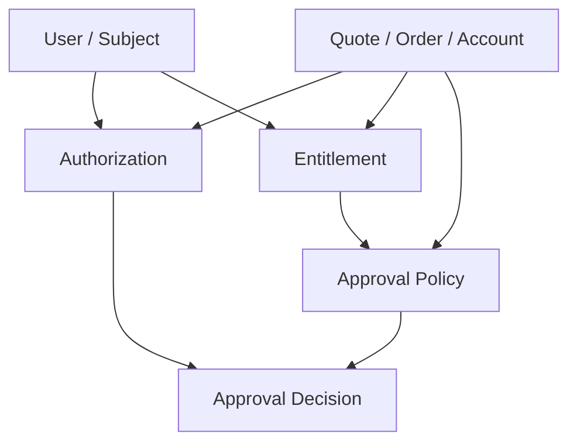
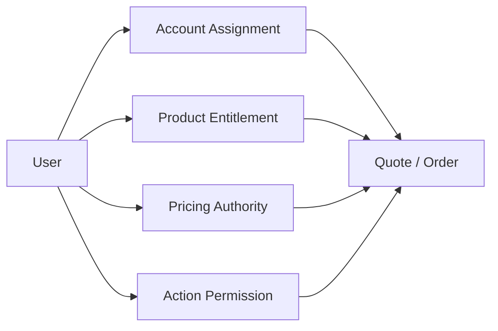
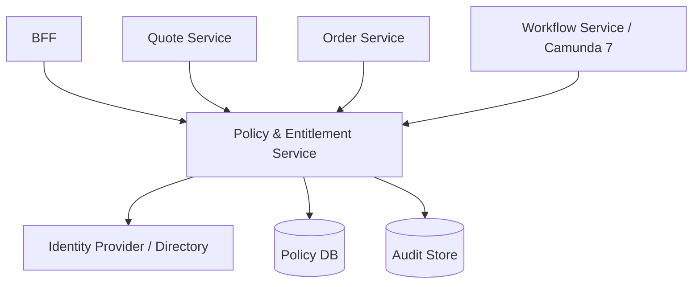
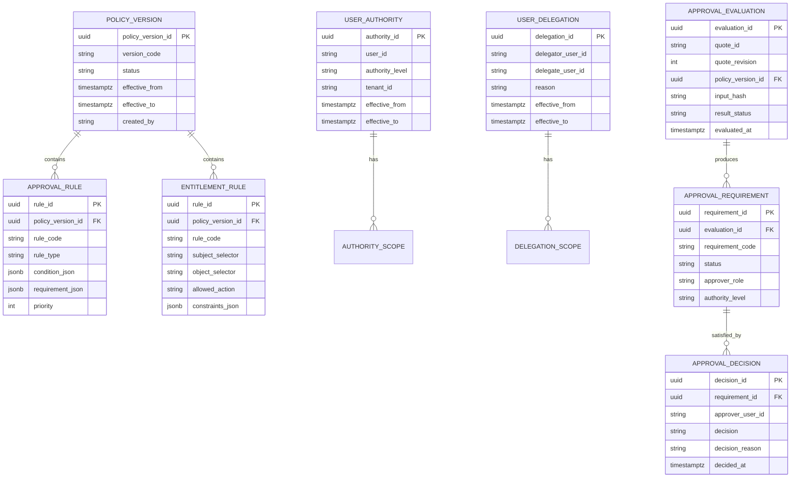
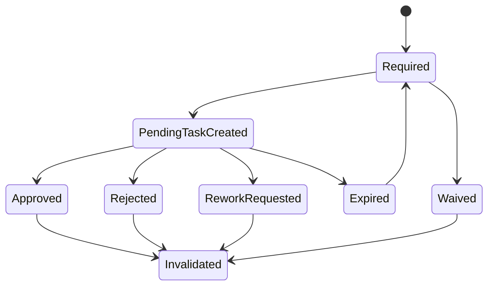
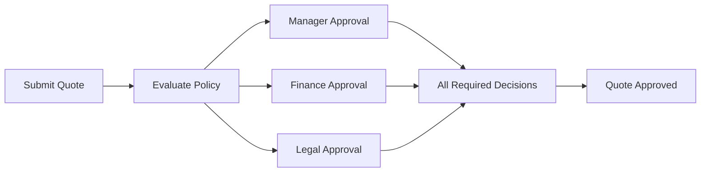
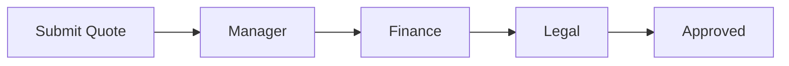
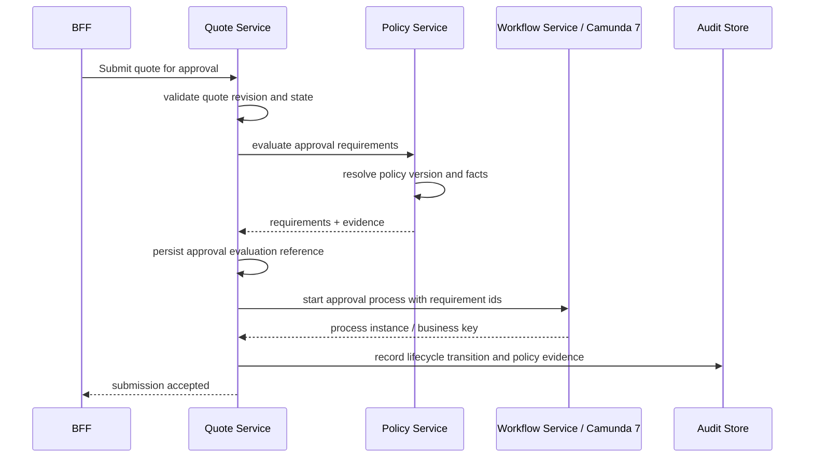

# Part 036 — Approval Policy and Entitlement Engine

Enterprise CPQ dies when “approval” is treated as a button.

A real approval system is not:

```text
if discount > 20%, manager approval required
```

That is only the beginning.

A production CPQ approval system must answer harder questions:

- Who is allowed to create this quote?
- Who is allowed to see this account?
- Who may apply this product discount?
- Who may override margin guardrails?
- Who may approve a quote they also authored?
- What if the approver is on leave?
- What if the approval policy changed after the quote was submitted?
- What if the customer belongs to a restricted segment?
- What if the quote has multiple product families with different authority chains?
- What evidence proves that the accepted quote was approved under the right policy?

That is why CPQ needs an **approval policy and entitlement engine**.

The mental model:

> Entitlement decides what a user may attempt.  
> Policy decides what the business requires.  
> Approval records prove who accepted responsibility for an exception.

Do not collapse these three into one boolean.

---

## 1. Approval, Authorization, and Entitlement Are Not the Same

These terms are often mixed together. In CPQ/OMS, that causes security bugs and commercial leakage.

### Authorization

Authorization asks:

> Is this subject allowed to perform this operation on this object?

Example:

```text
Can user U edit quote Q?
```

### Entitlement

Entitlement asks:

> What commercial actions, products, accounts, regions, or price boundaries is this subject entitled to operate within?

Example:

```text
Can sales rep U sell product offering P to customer C in region R?
Can U apply discount up to 12% for product family F?
```

### Approval Policy

Approval policy asks:

> Given this quote and its risk/exception profile, what approvals are required before the quote may proceed?

Example:

```text
This quote requires approval from:
- Sales Manager because discount is 18%
- Finance because margin is below threshold
- Legal because custom terms were added
```

### Approval Decision

Approval decision asks:

> Did an authorized approver approve/reject/request rework for a specific quote revision under a specific policy version?

Example:

```text
Manager M approved quote Q revision 4 using policy version PV-2026-07.
```

These concepts must remain separate.



If you merge them, you cannot audit why a quote was allowed.

---

## 2. The Core Invariant

The most important invariant:

> A quote may only advance past a protected lifecycle boundary if the required approvals for that exact quote revision have been satisfied by authorized approvers under an applicable policy version.

Break it down:

- **protected lifecycle boundary**: submit, approve, accept, convert to order, cancel, amend.
- **required approvals**: derived from policy evaluation.
- **exact quote revision**: approval is not transferable to modified quote content.
- **authorized approvers**: approver must have authority at decision time.
- **applicable policy version**: the policy used must be known and recorded.

This invariant is not a UI rule.
It must be enforced by quote service/workflow/policy boundaries.

---

## 3. Policy Engine Responsibilities

The policy engine should be able to answer:

1. What actions is the user entitled to attempt?
2. What quote/order actions are blocked and why?
3. What approval requirements exist for this quote revision?
4. What approver roles or authority levels are required?
5. Which specific users are eligible approvers?
6. Whether a specific approval decision is valid.
7. Whether existing approvals are still fresh after quote change.
8. Whether delegated approval is valid.
9. Whether a four-eyes rule is violated.
10. What evidence should be stored for audit.

The engine should not:

1. Mutate quote lifecycle directly.
2. Complete Camunda tasks directly without domain command semantics.
3. Store raw UI state.
4. Replace domain service validation.
5. Become a generic rules dumping ground.

---

## 4. Policy Inputs: Decision Facts

Policy evaluation must be based on explicit facts, not ad-hoc service calls hidden inside rule code.

Example `QuoteApprovalFacts`:

```json
{
  "quoteId": "Q-2026-000231",
  "quoteRevision": 4,
  "tenantId": "tenant-a",
  "customer": {
    "customerId": "C-100",
    "segment": "ENTERPRISE",
    "riskTier": "MEDIUM",
    "country": "ID"
  },
  "seller": {
    "userId": "U-10",
    "roleCodes": ["SALES_REP"],
    "region": "APAC",
    "teamId": "TEAM-7"
  },
  "commercials": {
    "currency": "USD",
    "totalRecurring": "12000.00",
    "totalOneTime": "1500.00",
    "maxDiscountPercent": "18.00",
    "minMarginPercent": "11.50",
    "hasManualOverride": true,
    "hasCustomTerms": false
  },
  "products": [
    {
      "productFamily": "CONNECTIVITY",
      "offeringId": "PO-FIBER-1G",
      "discountPercent": "18.00",
      "marginPercent": "11.50"
    }
  ],
  "lifecycle": {
    "quoteStatus": "PRICED",
    "priceStatus": "FRESH",
    "configurationStatus": "VALID"
  }
}
```

This object is the policy engine's input contract.

A policy result must include evidence:

```json
{
  "policyVersion": "PV-2026-07-01",
  "decisionId": "DEC-9912",
  "requiresApproval": true,
  "requirements": [
    {
      "requirementCode": "DISCOUNT_MANAGER_APPROVAL",
      "reason": "Max discount 18.00% exceeds seller authority 12.00%",
      "approverRole": "SALES_MANAGER",
      "minimumAuthorityLevel": "REGIONAL_MANAGER",
      "scope": {
        "productFamily": "CONNECTIVITY",
        "region": "APAC"
      }
    }
  ],
  "blockers": [],
  "evidence": {
    "matchedRules": ["RULE-DISC-APAC-003"],
    "inputHash": "sha256:..."
  }
}
```

Without evidence, policy is just an opinion.

---

## 5. Authority Model

Approval authority is usually based on several dimensions:

- role
- hierarchy level
- region
- product family
- customer segment
- discount threshold
- margin threshold
- deal size
- contract term
- risk category
- delegated authority
- temporary assignment

A simplistic authority table:

| Authority Level | Max Discount | Min Margin | Scope |
|---|---:|---:|---|
| Sales Rep | 10% | 20% | Own accounts |
| Sales Manager | 20% | 15% | Team accounts |
| Regional Director | 30% | 10% | Regional accounts |
| Finance Approver | Any | Below 10% requires finance | Assigned product families |
| Legal Approver | N/A | N/A | Custom terms |

But authority is rarely one-dimensional.

Example:

```text
A regional director may approve 28% discount for connectivity products in APAC,
but not for regulated government accounts,
and not if they authored the quote,
and not if margin is below finance threshold.
```

The policy engine must handle composed constraints.

---

## 6. Entitlement Model

Entitlement controls what a user may attempt before approval is even considered.

Examples:

- User may quote only assigned accounts.
- User may sell only certain product families.
- User may see prices only for their sales channel.
- User may apply manual discount only up to entitlement limit.
- User may submit quote but not accept quote.
- User may approve only quotes outside their authorship.
- User may perform fallout recovery only for assigned region.

Entitlement is not only security.
It is also commercial containment.



A user can be allowed to view a quote but not allowed to reprice it.
A user can be allowed to edit quote lines but not override discount.
A user can be allowed to submit for approval but not approve.

Do not represent entitlement as one role string.

---

## 7. Policy Service Boundary

A clean architecture has a dedicated policy/entitlement service or module.



The policy service provides:

- capability evaluation for UI
- entitlement evaluation for command attempts
- approval requirement evaluation
- approver candidate resolution
- approval decision validation
- policy version publication
- simulation API
- audit evidence storage

It should not be a service that every business rule is thrown into.
Catalog rules remain in catalog/configuration.
Pricing calculation remains in pricing.
Quote lifecycle remains in quote.
Policy service owns commercial authority and decision requirements.

---

## 8. Data Model

A simplified relational model:



The model separates:

- policy definition
- authority assignment
- delegation
- evaluation result
- requirement
- decision

That separation is what makes audit possible.

---

## 9. Policy Versioning

Approval policy changes over time.

Common mistake:

```text
Quote submitted under old policy.
Approver approves after policy changed.
System evaluates using latest policy.
```

This creates audit ambiguity.

Better:

1. Quote revision is submitted.
2. Policy engine evaluates using active policy version.
3. Evaluation result stores `policyVersion`, `inputHash`, and requirements.
4. Approval tasks are created from the stored requirements.
5. If quote changes, previous evaluation is invalidated.
6. If policy changes, decide whether in-flight quotes keep old policy or require re-evaluation by explicit rule.

Policy application modes:

| Mode | Meaning | Use Case |
|---|---|---|
| `LOCK_ON_SUBMISSION` | Quote uses policy active at submission time | Strong audit stability |
| `REVALIDATE_ON_APPROVAL` | Approval must satisfy latest policy too | High-risk regulated flows |
| `REVALIDATE_ON_ACCEPTANCE` | Quote can be approved, but acceptance checks latest blockers | Commercial risk control |
| `MANUAL_REVIEW_ON_POLICY_CHANGE` | In-flight quotes are flagged | Major policy migration |

Pick one deliberately.
Do not leave it accidental.

---

## 10. Approval Requirement Lifecycle

Approval is not a boolean.

Requirement lifecycle:



Quote lifecycle references approval summary, but requirement lifecycle is its own audit trail.

Important fields:

- requirement id
- requirement code
- quote id
- quote revision
- policy version
- required authority
- current status
- approver candidates
- decision id
- invalidation reason

A quote is approval-satisfied only if all active requirements are satisfied or waived by valid authority.

---

## 11. Approval Chain Computation

A quote may require multiple approvals.

Examples:

```text
Discount exception -> Sales Manager
Margin exception -> Finance
Custom terms -> Legal
Strategic account -> VP Sales
Restricted segment -> Compliance
```

Approval chain can be:

### Parallel

All required approvers can decide independently.



### Sequential

Approval happens in order.



### Conditional

Later approvals depend on earlier decisions or updated facts.

```text
Manager approves discount.
If manager requests deeper discount change, reprice and re-evaluate policy.
```

The policy engine should produce a requirement graph, not just a flat list.

---

## 12. Four-Eyes and Conflict of Interest

A common enterprise control:

> The person who created or materially modified the quote must not be the only approver of the same quote.

This is often called four-eyes control.

Conflict rules:

- author cannot approve own quote
- last modifier cannot approve after material change
- delegate cannot approve if delegator is also conflicted, depending on policy
- direct subordinate approval may be disallowed for specific risk tiers
- same user cannot satisfy two independent requirements if segregation is required

Model conflict explicitly:

```json
{
  "approverUserId": "U-99",
  "eligible": false,
  "ineligibilityReasons": [
    {
      "code": "QUOTE_AUTHOR_CONFLICT",
      "message": "Quote author cannot approve this requirement."
    }
  ]
}
```

Do not hide this as “no approvers found.”

---

## 13. Delegation

Approvers go on leave.
People change roles.
Escalations happen.

Delegation must be controlled.

Delegation dimensions:

- delegator
- delegate
- effective period
- scope
- reason
- created by
- approval by admin/manager if required
- maximum authority allowed
- exclusions

Example:

```json
{
  "delegatorUserId": "MGR-1",
  "delegateUserId": "MGR-2",
  "effectiveFrom": "2026-07-01T00:00:00+07:00",
  "effectiveTo": "2026-07-15T23:59:59+07:00",
  "scope": {
    "region": "APAC",
    "productFamilies": ["CONNECTIVITY"],
    "maxDiscountPercent": "20.00"
  },
  "exclusions": {
    "customerSegments": ["GOVERNMENT"]
  }
}
```

Delegation is not just adding someone to a group.
It is temporary authority with evidence.

---

## 14. Approval Policy Evaluation Flow



The important part:

- Policy service evaluates.
- Quote service persists approval evaluation reference.
- Workflow service orchestrates tasks.
- Audit records evidence.

Camunda is not the policy engine.
It is the task/process engine.

---

## 15. Camunda 7 Integration

Camunda 7 should receive stable business references:

```json
{
  "quoteId": "Q-2026-000231",
  "quoteRevision": 4,
  "approvalEvaluationId": "AE-9912",
  "approvalRequirementIds": ["AR-1", "AR-2"],
  "tenantId": "tenant-a"
}
```

Avoid passing full price traces, full quote lines, or full customer data as process variables.

The BPMN process should call services by semantic command:

```text
Create approval task for requirement AR-1
Complete approval requirement AR-1 as APPROVED by user U-99
Notify quote service when all requirements satisfied
```

Not:

```text
Set variable discountApproved = true
```

A boolean variable does not prove authority.

---

## 16. Semantic Task Completion

Task completion must validate the decision.

Bad flow:

```text
POST /engine-rest/task/{id}/complete
variables: { approved: true }
```

Correct flow:

```http
POST /approval-requirements/{requirementId}/decisions
```

Request:

```json
{
  "decision": "APPROVE",
  "comment": "Approved based on strategic account commitment.",
  "idempotencyKey": "01J..."
}
```

Policy/approval service validates:

- task exists
- requirement exists
- quote revision matches
- approver is eligible
- approver has authority
- four-eyes rule not violated
- requirement still active
- idempotency key not reused incompatibly

Then it records decision and tells workflow service to complete the corresponding task.

Task completion is a consequence of a valid business decision.
It is not the business decision itself.

---

## 17. Policy Result as Evidence

Every approval requirement should be traceable back to facts.

Evidence record:

```json
{
  "evaluationId": "AE-9912",
  "policyVersion": "PV-2026-07-01",
  "evaluatedAt": "2026-07-02T10:15:00+07:00",
  "quoteId": "Q-2026-000231",
  "quoteRevision": 4,
  "inputHash": "sha256:abc...",
  "factsSnapshotLocation": "s3://audit/policy/AE-9912/input.json",
  "resultSnapshotLocation": "s3://audit/policy/AE-9912/result.json",
  "matchedRules": ["RULE-DISC-APAC-003", "RULE-MARGIN-FIN-002"],
  "engineVersion": "policy-engine-1.12.0"
}
```

This lets you answer months later:

- What did the system know?
- Which policy version was active?
- Which rules matched?
- Who approved?
- Was the approver eligible?
- Did the quote change afterward?

Without this, audit becomes archaeology.

---

## 18. Policy Implementation Options

There are several implementation choices.

### Option A: Code-Based Policy

Rules are Java code.

Good:

- type-safe
- testable
- easy to refactor
- works for complex logic

Bad:

- business changes require deployment
- harder for business users to inspect
- risk of hidden behavior

### Option B: DMN Decision Tables

Rules are modeled as decision tables.

Good:

- explainable
- business-readable if well-designed
- versionable
- good for tabular policy

Bad:

- complex procedural logic is awkward
- overuse creates unreadable tables
- data preparation still needs code

### Option C: Hybrid

Use code for fact preparation and orchestration, DMN/table rules for business policy.

This is usually best for CPQ.

```text
Java prepares clean QuoteApprovalFacts.
DMN/table evaluates approval requirements.
Java validates authority and stores evidence.
```

Do not let rules call random services.
Do not let code hide all commercial thresholds.

---

## 19. API Design

Policy service API should be explicit.

### Evaluate Capabilities

```http
POST /policy/capabilities/quote
```

Request:

```json
{
  "userId": "U-10",
  "tenantId": "tenant-a",
  "quoteId": "Q-1",
  "quoteRevision": 4,
  "requestedActions": ["EDIT", "REPRICE", "SUBMIT_FOR_APPROVAL", "ACCEPT"]
}
```

Response:

```json
{
  "capabilities": [
    {
      "action": "EDIT",
      "allowed": true
    },
    {
      "action": "ACCEPT",
      "allowed": false,
      "reasonCode": "APPROVAL_REQUIRED"
    }
  ]
}
```

### Evaluate Approval Requirements

```http
POST /policy/approval-evaluations/quote
```

Response:

```json
{
  "approvalEvaluationId": "AE-9912",
  "policyVersion": "PV-2026-07-01",
  "requiresApproval": true,
  "requirements": []
}
```

### Resolve Approver Candidates

```http
GET /policy/approval-requirements/{requirementId}/candidates
```

### Record Decision

```http
POST /approval-requirements/{requirementId}/decisions
```

### Simulate Policy

```http
POST /policy/simulations/quote-approval
```

Simulation is important for admins before publishing policy changes.

---

## 20. Policy Simulation

A serious policy engine needs simulation.

Before publishing a new policy, business/admin users should be able to ask:

- How many open quotes would require new approval?
- Which quotes would become blocked?
- Which product families are affected?
- Which regions are affected?
- Which approver groups would receive more workload?
- Which previous approvals would be invalidated?

Simulation output:

```json
{
  "simulationId": "SIM-2026-07-02-01",
  "candidatePolicyVersion": "PV-DRAFT-9",
  "sampleSize": 10000,
  "impact": {
    "newApprovalRequiredCount": 231,
    "approvalNoLongerRequiredCount": 58,
    "blockedQuoteCount": 12,
    "estimatedAdditionalApproverTasks": 311
  },
  "topReasons": [
    {
      "reasonCode": "MARGIN_BELOW_NEW_THRESHOLD",
      "count": 144
    }
  ]
}
```

Policy changes are production changes.
Treat them like releases.

---

## 21. Authorization Enforcement Points

Authorization must be enforced in multiple places.

| Boundary | Check |
|---|---|
| BFF | UI capability, coarse access, object visibility |
| Quote Service | command authorization, lifecycle invariant |
| Pricing Service | price override entitlement |
| Policy Service | authority and approval eligibility |
| Workflow Service | task claim/complete permission |
| Document Service | artifact access permission |
| Order Service | order action permission |
| Search/Read Model | row/object filtering and redaction |

Do not rely on only the BFF.
Do not rely on only the identity provider.
Do not rely on only Camunda task assignment.

Each service must protect its own state-changing operations.

---

## 22. Stale Approval Handling

A quote approval becomes stale when material facts change.

Material changes:

- quote line added/removed
- quantity changed
- price changed
- discount changed
- customer changed
- product offering changed
- term changed
- manual override changed
- legal/commercial term changed
- policy-critical characteristic changed

Non-material changes might not invalidate approval:

- internal note added
- UI display name corrected
- document regenerated from same snapshot
- comment added

Define this explicitly.

Example invalidation rule:

```text
If quote revision changes due to commercial material change,
all approvals tied to previous revision become invalid.
```

Approval freshness should be visible:

```json
{
  "approvalStatus": "STALE",
  "staleReason": "QUOTE_COMMERCIALS_CHANGED_AFTER_APPROVAL",
  "previousApprovedRevision": 4,
  "currentRevision": 5
}
```

Do not silently reuse approval from old quote content.

---

## 23. Waivers

Some requirements can be waived.
But waiver is itself an approval decision.

Waiver fields:

- requirement id
- waived by
- waiver authority
- reason
- expiry if any
- policy version
- audit evidence

Waiver example:

```json
{
  "requirementId": "AR-99",
  "decision": "WAIVE",
  "reasonCode": "PRE_APPROVED_STRATEGIC_DEAL",
  "comment": "Approved by executive deal desk under strategic account program.",
  "evidenceReference": "DOC-EXEC-APPROVAL-123"
}
```

A waiver without authority is a bypass.
A waiver without evidence is an audit risk.

---

## 24. Approval Metrics

Policy and approval engine should expose business and operational metrics.

Metrics:

- approval required rate by product family
- average approval cycle time
- rejection rate
- rework rate
- stale approval rate
- escalation rate
- policy blocker count
- approver workload
- overdue task count
- delegated approval count
- waiver count
- approval invalidation count
- quote conversion rate after approval

These metrics reveal whether policy is protecting the business or slowing it down unnecessarily.

A policy engine is not just control.
It is feedback about commercial process design.

---

## 25. Testing Strategy

Test policy with scenario catalogs.

Example scenarios:

| Scenario | Expected Result |
|---|---|
| Sales rep discount 5%, margin 30% | No approval |
| Sales rep discount 18%, margin 25% | Sales manager approval |
| Discount 18%, margin 8% | Sales manager + finance approval |
| Custom legal terms | Legal approval |
| Author attempts own approval | Rejected by four-eyes rule |
| Delegate approves within scope | Accepted |
| Delegate approves outside scope | Rejected |
| Quote changed after approval | Approval stale |
| Policy changed after submission | Based on configured policy application mode |
| Government customer with restricted product | Compliance approval or blocker |

Policy tests should verify:

- result correctness
- matched rule evidence
- policy version
- input hash stability
- approver eligibility
- invalidation behavior
- audit record creation

Do not test only happy-path approvals.
The value of the engine is in exceptions.

---

## 26. Failure Modeling

| Failure | Correct Behavior |
|---|---|
| Policy service unavailable during quote submit | Fail closed or queue for review, depending on risk mode |
| Approver directory unavailable | Requirement remains pending; candidate resolution degraded |
| Delegation data stale | Do not approve if authority cannot be verified |
| Policy version missing | Block protected lifecycle transition |
| Approval decision duplicate | Return same idempotent result |
| Quote revision mismatch | Reject decision as stale |
| Camunda task completion failed after decision stored | Reconcile task completion by requirement id |
| Camunda task completed but decision not stored | Treat as invalid; rebuild/repair from audit if possible |
| Policy evaluation timeout | Unknown/no decision; do not advance lifecycle |

The safest rule:

> If authority cannot be proven, do not approve.

This may create operational friction, but it preserves defensibility.

---

## 27. Anti-Patterns

### Anti-Pattern 1: Approval as Status Field

```text
quote.approved = true
```

This loses who, why, when, under what authority, and for which revision.

Fix:

Store approval requirements and decisions as separate records.

### Anti-Pattern 2: Role Equals Authority

```text
ROLE_MANAGER can approve all discounts
```

This ignores product, region, customer, margin, delegation, and conflict.

Fix:

Model authority scope.

### Anti-Pattern 3: UI-Only Approval Check

The UI hides the approve button, but backend accepts the command.

Fix:

Validate approval authority server-side.

### Anti-Pattern 4: Camunda Variable as Approval Truth

```text
approved = true
```

A process variable is not enough evidence.

Fix:

Persist approval decision in approval/domain service and use Camunda for orchestration.

### Anti-Pattern 5: Policy Without Versioning

Rules change, but old decisions cannot be explained.

Fix:

Version policy and store evaluation evidence.

### Anti-Pattern 6: No Simulation

Business publishes policy changes blindly.

Fix:

Add policy simulation and impact analysis.

---

## 28. Production Checklist

Before the policy/entitlement engine is production-ready:

- [ ] Authorization, entitlement, approval requirement, and approval decision are separate concepts.
- [ ] Approval is tied to quote revision.
- [ ] Policy version is stored with every evaluation.
- [ ] Input facts and result evidence are hashable and auditable.
- [ ] Approver eligibility is validated at decision time.
- [ ] Four-eyes/conflict rules are explicit.
- [ ] Delegation has scope, time window, and audit trail.
- [ ] Approval invalidation rules are explicit.
- [ ] Waivers require authority and evidence.
- [ ] BFF receives capabilities but does not decide final approval.
- [ ] Quote service revalidates protected lifecycle transitions.
- [ ] Camunda tasks are semantic, not raw variable writes.
- [ ] Policy simulation exists before publication.
- [ ] Metrics expose approval cycle health.
- [ ] Failure behavior is fail-closed for protected transitions.

---

## 29. The Core Lesson

Approval is not a button.
Approval is a chain of evidence.

The system must prove:

```text
this quote revision
under this policy version
with these commercial facts
required these approvals
which were decided by these eligible people
at these times
before this lifecycle transition happened
```

That is the difference between a demo CPQ and an enterprise CPQ.

The approval policy and entitlement engine is where commercial control becomes executable, testable, and defensible.

In the next part, we move from commercial authority to the external enterprise systems that often decide whether an order can be fulfilled: inventory and availability integration.
