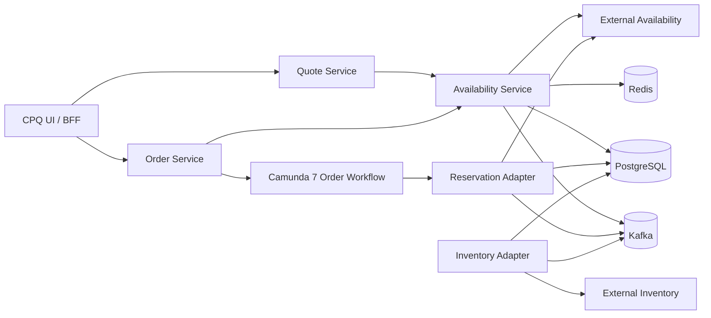
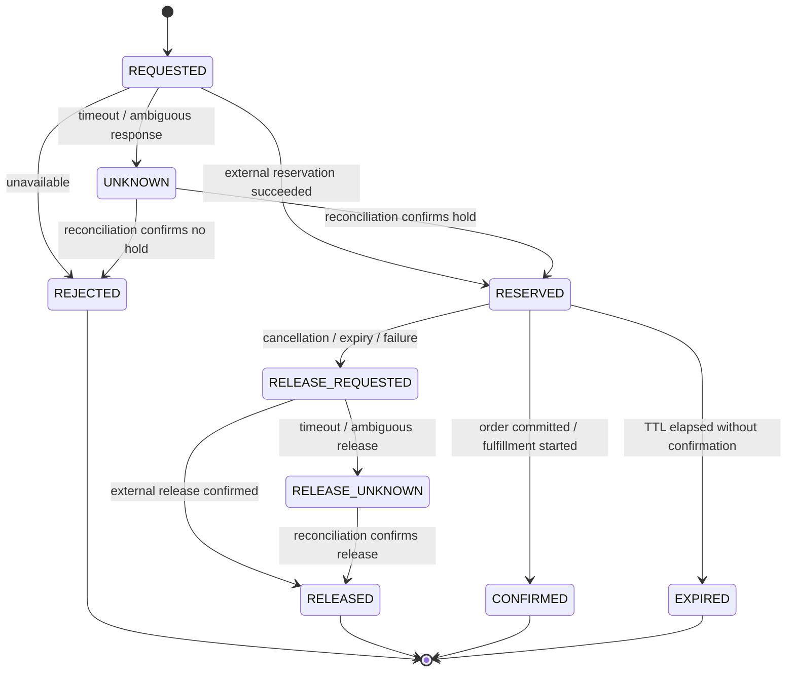
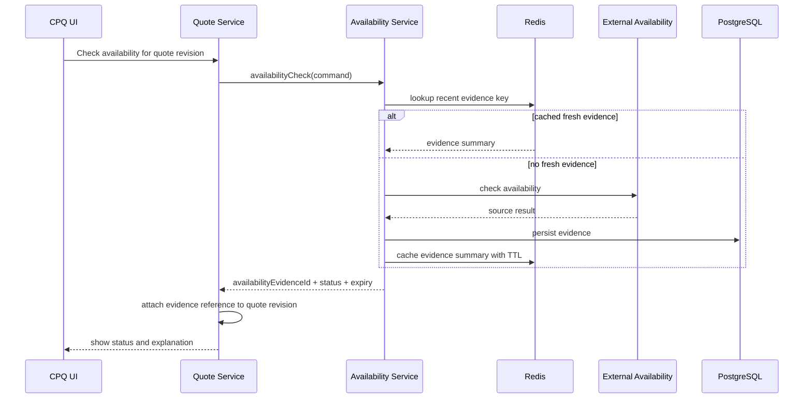
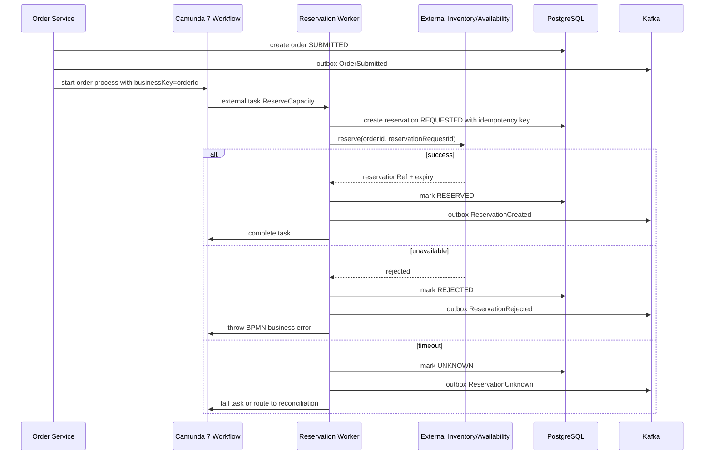
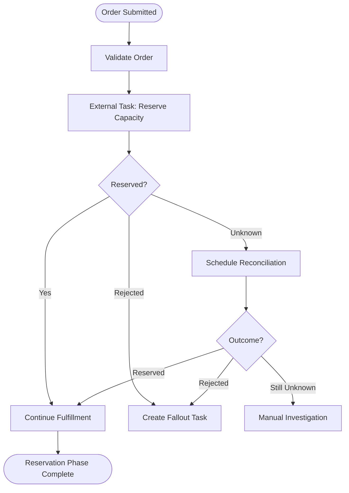
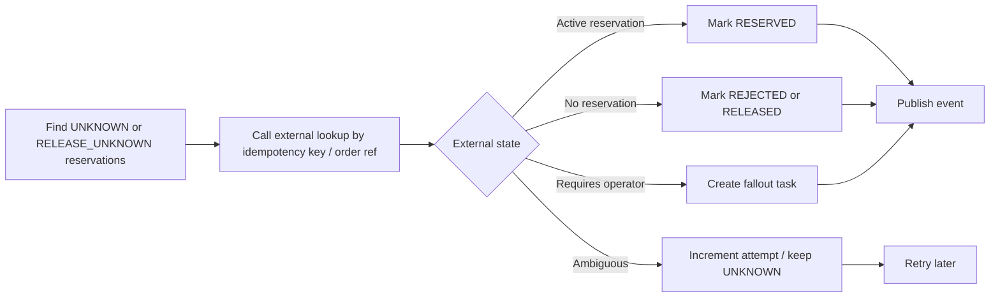

# Part 037 — Inventory and Availability Integration

A CPQ/OMS platform does not become enterprise-grade by calculating a beautiful price. It becomes enterprise-grade when the quote can be fulfilled, the order can be promised, and the system can explain what changed when fulfillment becomes impossible.

Inventory and availability integration is where many CPQ systems collapse because they mix four different concepts:

1. **Catalog**: what can be sold.
2. **Availability**: whether it appears feasible to sell now.
3. **Reservation**: a temporary claim against capacity, stock, slot, or resource.
4. **Fulfillment inventory**: the actual product/resource/service state after delivery.

These are not the same thing.

A product offering can be valid in the catalog but unavailable in a region. It can be available during quote preview but unavailable during order submission. It can be reserved but later fail during provisioning. It can be delivered but not yet reflected in product inventory. Treating these as one boolean field like `available = true` is not a simplification. It is a corruption of the domain.

This part designs the inventory and availability boundary for a large CPQ/OMS system.

---

## 1. The Core Mental Model

Availability is a **promise-quality signal**.

Reservation is a **time-bound operational claim**.

Inventory is a **record of realized or allocated product/resource state**.

A quote does not usually own inventory. It owns evidence that, at some point in time, the requested configuration was considered feasible. An order, depending on the business, may create a stronger claim through reservation, capacity allocation, stock allocation, or provisioning request.

The first invariant is:

> A quote may display availability evidence, but only an accepted order should create fulfillment obligation.

The second invariant is:

> Availability evidence must be versioned and timestamped because it becomes stale by nature.

The third invariant is:

> Reservation must be idempotent, expirable, auditable, and reversible.

A system that cannot represent stale availability will lie to users. A system that cannot expire reservations will leak capacity. A system that cannot reconcile reservations will create ghost holds.

---

## 2. Capability Boundary

Do not build inventory logic directly inside Quote Service or Order Service. Use a boundary that makes the meaning of the interaction explicit.



The recommended service roles:

| Capability | Responsibility | Must Not Do |
|---|---|---|
| Quote Service | Store quote snapshot and availability evidence reference | Own real reservation state |
| Order Service | Own order lifecycle and fulfillment obligation | Directly mutate external inventory |
| Availability Service | Normalize availability checks and availability evidence | Decide commercial eligibility or pricing |
| Reservation Adapter | Create, extend, confirm, release, and reconcile reservations | Hide unknown external outcomes |
| Inventory Adapter | Read/update product inventory representation or receive inventory events | Become the order lifecycle authority |
| Camunda 7 Workflow | Orchestrate reservation/provisioning/release steps | Store business truth only in process variables |

This separation prevents the common failure where a quote line becomes a half-catalog, half-inventory, half-order object.

---

## 3. Domain Vocabulary

Use names that expose the lifecycle.

### 3.1 Availability Check

An availability check answers a question:

> Given this sellable configuration, customer/location/channel/time, does the fulfillment domain currently believe this can be supplied?

It is not a guarantee.

```java
public final class AvailabilityCheckCommand {
    public UUID requestId;
    public UUID tenantId;
    public UUID quoteId;
    public int quoteRevision;
    public String customerId;
    public String locationId;
    public List<AvailabilityLineRequest> lines;
    public Instant requestedAt;
}
```

### 3.2 Availability Evidence

Availability evidence is a persisted answer.

```java
public final class AvailabilityEvidence {
    public UUID evidenceId;
    public UUID tenantId;
    public String sourceSystem;
    public String sourceReference;
    public AvailabilityStatus status;
    public Instant checkedAt;
    public Instant expiresAt;
    public List<AvailabilityLineEvidence> lines;
    public String explanationCode;
    public Map<String, Object> diagnosticFacts;
}
```

The key fields are `checkedAt`, `expiresAt`, `sourceSystem`, and line-level result. Without them, the quote cannot explain why the user saw “available” yesterday but cannot submit today.

### 3.3 Reservation

A reservation is stronger than an availability check. It creates a claim.

```java
public final class Reservation {
    public UUID reservationId;
    public UUID tenantId;
    public UUID orderId;
    public String externalReservationRef;
    public ReservationStatus status;
    public Instant reservedAt;
    public Instant expiresAt;
    public List<ReservationLine> lines;
}
```

A reservation should never be hidden behind a boolean. It has lifecycle.



---

## 4. Availability Is Not Eligibility

Do not confuse availability with product eligibility.

Eligibility asks:

> Is the customer/channel/location allowed to buy this offering?

Availability asks:

> Can the fulfillment side currently supply it?

Pricing asks:

> What should the customer pay under this commercial context?

Inventory asks:

> What product/resource/service instance exists or is allocated?

A broadband product may be eligible for a customer segment but unavailable at a specific address. A device may be available in stock but ineligible due to regional commercial policy. A discount may be valid even when stock is low. These dimensions should interact, but they should not collapse into one rule engine.

---

## 5. Quote-Time Availability

Quote-time availability is useful but fragile.

A salesperson needs early feedback: “Can this bundle probably be fulfilled?” The system should answer quickly, but it must not over-promise.

Recommended quote-time behavior:

1. User configures quote lines.
2. Quote Service calls Availability Service with quote revision and line snapshot.
3. Availability Service checks cache for recent evidence.
4. If no usable evidence exists, it queries external availability or internal projection.
5. Availability evidence is persisted.
6. Quote stores reference to evidence, not the whole external response as mutable truth.
7. UI displays status and expiry.



Quote-time availability should not block every quote creation. It may block submit or acceptance depending on business rule, but the domain should distinguish:

- `NOT_CHECKED`
- `AVAILABLE`
- `PARTIALLY_AVAILABLE`
- `UNAVAILABLE`
- `STALE`
- `UNKNOWN`

`UNKNOWN` is a first-class state. It means the system does not know. It is different from unavailable.

---

## 6. Order-Time Reservation

Order submission is different. The platform is moving from commercial intent to fulfillment obligation.

Recommended order-time flow:



The order should not assume the external call failed just because a timeout occurred. Timeout means unknown. The external system may have created a reservation but the response was lost.

This is the **unknown outcome problem**.

Top-tier systems model it explicitly.

---

## 7. Data Model

A minimal production-grade data model:

```sql
create table availability_evidence (
  evidence_id uuid primary key,
  tenant_id uuid not null,
  source_system text not null,
  source_reference text,
  subject_type text not null,
  subject_id uuid not null,
  subject_revision int,
  status text not null,
  checked_at timestamptz not null,
  expires_at timestamptz,
  explanation_code text,
  diagnostic_json jsonb not null default '{}'::jsonb,
  created_at timestamptz not null default now(),
  constraint ck_availability_status check (
    status in ('NOT_CHECKED','AVAILABLE','PARTIALLY_AVAILABLE','UNAVAILABLE','UNKNOWN','STALE')
  )
);

create table availability_evidence_line (
  evidence_line_id uuid primary key,
  evidence_id uuid not null references availability_evidence(evidence_id),
  line_ref text not null,
  requested_quantity numeric(18,6) not null,
  available_quantity numeric(18,6),
  status text not null,
  explanation_code text,
  diagnostic_json jsonb not null default '{}'::jsonb
);

create table reservation (
  reservation_id uuid primary key,
  tenant_id uuid not null,
  order_id uuid not null,
  idempotency_key text not null,
  source_system text not null,
  external_reservation_ref text,
  status text not null,
  reserved_at timestamptz,
  expires_at timestamptz,
  confirmed_at timestamptz,
  released_at timestamptz,
  last_reconciled_at timestamptz,
  created_at timestamptz not null default now(),
  updated_at timestamptz not null default now(),
  version bigint not null,
  constraint uq_reservation_idem unique (tenant_id, source_system, idempotency_key),
  constraint ck_reservation_status check (
    status in ('REQUESTED','RESERVED','REJECTED','UNKNOWN','CONFIRMED',
               'RELEASE_REQUESTED','RELEASED','RELEASE_UNKNOWN','EXPIRED')
  )
);

create table reservation_line (
  reservation_line_id uuid primary key,
  reservation_id uuid not null references reservation(reservation_id),
  order_line_id uuid not null,
  product_offering_id text not null,
  requested_quantity numeric(18,6) not null,
  reserved_quantity numeric(18,6),
  status text not null,
  explanation_code text,
  source_payload_json jsonb not null default '{}'::jsonb
);
```

Design notes:

- `availability_evidence` can attach to quote revision, order, or operational check.
- `reservation` belongs to order lifecycle.
- `idempotency_key` prevents duplicate reservations after retry.
- `external_reservation_ref` is nullable because the first result may be unknown.
- `diagnostic_json` stores source-specific explanation without becoming command truth.

---

## 8. JPA/EclipseLink Mapping Boundary

Do not map external inventory payloads as deep entity graphs. Normalize only what the domain needs for commands, operations, and audit. Keep source payload as JSONB only for diagnostics and replay evidence.

```java
@Entity
@Table(name = "reservation",
       uniqueConstraints = @UniqueConstraint(
           name = "uq_reservation_idem",
           columnNames = {"tenant_id", "source_system", "idempotency_key"}))
public class ReservationEntity {

    @Id
    @Column(name = "reservation_id")
    private UUID reservationId;

    @Column(name = "tenant_id", nullable = false)
    private UUID tenantId;

    @Column(name = "order_id", nullable = false)
    private UUID orderId;

    @Column(name = "idempotency_key", nullable = false)
    private String idempotencyKey;

    @Enumerated(EnumType.STRING)
    @Column(name = "status", nullable = false)
    private ReservationStatus status;

    @Version
    @Column(name = "version", nullable = false)
    private long version;

    @OneToMany(mappedBy = "reservation", cascade = CascadeType.ALL, orphanRemoval = false)
    private List<ReservationLineEntity> lines = new ArrayList<>();
}
```

Rules:

1. Load reservation aggregate when handling reservation lifecycle command.
2. Do not lazy-load reservation lines during serialization.
3. Do not expose entity directly to JAX-RS.
4. Use optimistic lock to prevent competing reservation transitions.
5. Store external payloads as evidence, not as domain object replacement.

---

## 9. OpenAPI Contract Shape

Use command-shaped APIs.

```yaml
paths:
  /availability-checks:
    post:
      operationId: createAvailabilityCheck
      parameters:
        - name: Idempotency-Key
          in: header
          required: true
          schema:
            type: string
      requestBody:
        required: true
        content:
          application/json:
            schema:
              $ref: '#/components/schemas/CreateAvailabilityCheckRequest'
      responses:
        '201':
          description: Availability evidence created
          content:
            application/json:
              schema:
                $ref: '#/components/schemas/AvailabilityEvidenceResponse'

  /orders/{orderId}/reservations:
    post:
      operationId: requestReservation
      parameters:
        - name: orderId
          in: path
          required: true
          schema:
            type: string
            format: uuid
        - name: Idempotency-Key
          in: header
          required: true
          schema:
            type: string
      responses:
        '202':
          description: Reservation request accepted
```

The API should not return false certainty. If reservation is async, use `202 Accepted` and expose a status resource.

---

## 10. Kafka Event Model

Events should represent facts, not requests that may or may not have happened.

Recommended events:

- `AvailabilityEvidenceCreated`
- `AvailabilityEvidenceExpired`
- `ReservationRequested`
- `ReservationCreated`
- `ReservationRejected`
- `ReservationOutcomeUnknown`
- `ReservationConfirmed`
- `ReservationReleaseRequested`
- `ReservationReleased`
- `ReservationReleaseOutcomeUnknown`
- `InventoryProductInstanceCreated`
- `InventoryProductInstanceUpdated`

Example envelope:

```json
{
  "eventId": "b70f2db4-7e4d-45de-87c0-19fb3a5b70d4",
  "eventType": "ReservationCreated",
  "eventVersion": 1,
  "tenantId": "9ddac4d2-9f70-4f4c-8310-3eecdf80c2cc",
  "aggregateType": "Reservation",
  "aggregateId": "2f2b9fc2-6e9c-46b3-a246-4be4f49833a1",
  "occurredAt": "2026-07-02T10:20:00Z",
  "correlationId": "order-7fb...",
  "causationId": "command-91a...",
  "payload": {
    "orderId": "7fb...",
    "externalReservationRef": "EXT-RES-88429",
    "expiresAt": "2026-07-03T10:20:00Z"
  }
}
```

Partition by `orderId` or `reservationId` depending on consumer needs. For order lifecycle projections, `orderId` is usually better. For reservation-specific reconciliation, `reservationId` is acceptable.

---

## 11. Redis Usage

Redis is useful here, but only with discipline.

Good uses:

- cache recent availability evidence summary;
- short TTL quote preview result;
- duplicate request fast path;
- external rate limit counter;
- short-lived correlation lookup;
- cache stampede protection for expensive availability checks.

Bad uses:

- authoritative reservation state;
- permanent availability truth;
- source of fulfillment obligation;
- lock that substitutes database constraint;
- hidden workflow queue.

Key design:

```text
cpq:{tenantId}:availability:evidence:{fingerprint} -> summary, TTL <= evidence expiry
cpq:{tenantId}:availability:inflight:{fingerprint} -> requestId, very short TTL
cpq:{tenantId}:reservation:idempotency:{key} -> reservationId/status, TTL bounded
```

If Redis is down, the system should degrade to slower checks or explicit unavailable-to-check state. It should not invent positive availability.

---

## 12. Camunda 7 Integration

Camunda should orchestrate reservation steps. It should not be the source of reservation truth.



External task worker rules:

1. Generate idempotency key from `orderId + reservationStep + attemptGroup`.
2. Persist reservation request before external call.
3. Call external system with idempotency/correlation reference if supported.
4. On success, update reservation state and complete task.
5. On business rejection, throw BPMN error or complete to rejection path.
6. On timeout, mark unknown and route to reconciliation.

Do not let the worker simply throw a Java exception for every external failure. A business rejection and a technical uncertainty must produce different workflow paths.

---

## 13. Reconciliation

Every external integration with reservation semantics needs reconciliation.

Reconciliation answers:

- Did the external system create the reservation?
- Is the reservation still active?
- Did it expire?
- Was it released?
- Does external state match local state?
- Is manual intervention needed?

A simple reconciliation loop:



Run reconciliation through a scheduled worker or Camunda timer path. The important point is that unknown is not ignored.

---

## 14. Inventory Projection

External product inventory may be the real source of installed products. The CPQ/OMS platform often still needs a local projection for search, eligibility, amendment, renewal, and customer care.

Projection table example:

```sql
create table customer_product_projection (
  tenant_id uuid not null,
  customer_product_id text not null,
  customer_id text not null,
  product_offering_id text not null,
  product_spec_id text,
  status text not null,
  activation_date timestamptz,
  termination_date timestamptz,
  source_system text not null,
  source_version text,
  last_source_event_at timestamptz,
  payload_json jsonb not null default '{}'::jsonb,
  primary key (tenant_id, customer_product_id)
);

create index ix_customer_product_projection_customer
  on customer_product_projection (tenant_id, customer_id, status);
```

This projection is not the fulfillment authority. It is a local read model. If it is stale, commands that require current truth should query the source or run a validation step.

---

## 15. Failure Modes

| Failure | Bad Design | Better Design |
|---|---|---|
| Availability check timeout | Mark unavailable | Mark unknown, show retry/recheck path |
| Reservation timeout | Retry blindly and double-hold capacity | Use idempotency key and reconciliation |
| External reservation succeeds but local DB fails | Lose reservation | Persist REQUESTED before call; reconcile by idempotency key |
| Local reservation succeeds but event publishing fails | Downstream blind spot | Transactional outbox |
| Quote availability becomes stale | User submits based on old data | Recheck or reserve during submit |
| Reservation expires before fulfillment | Continue order blindly | Timer/revalidation before fulfillment step |
| Cancel order release fails | Assume release happened | Track RELEASE_UNKNOWN and reconcile |
| External inventory sends duplicate event | Duplicate projection update | Inbox deduplication by source event id |
| External system changes schema | Break consumer | Adapter contract tests and tolerant parser |

The most dangerous integration failures are not obvious exceptions. They are ambiguous outcomes.

---

## 16. Testing Strategy

Test inventory integration as lifecycle behavior.

### 16.1 Unit Tests

- availability fingerprint generation;
- stale evidence detection;
- reservation state transition guard;
- idempotency key derivation;
- external status mapping;
- explanation code mapping.

### 16.2 Integration Tests

- JPA reservation persistence;
- unique idempotency constraint;
- outbox event creation;
- Redis cache expiry;
- external adapter timeout handling;
- reconciliation update path.

### 16.3 Workflow Tests

- reservation success path;
- reservation rejected path;
- reservation unknown path;
- compensation release path;
- manual fallout path;
- timer expiry path.

### 16.4 Contract Tests

- external availability API contract;
- external reservation API contract;
- event schema compatibility;
- OpenAPI response contract;
- webhook/callback contract.

### 16.5 Scenario Tests

Use scenario names that mirror business risk:

- `quote_shows_available_but_submit_rechecks_and_rejects_when_stock_gone`
- `reservation_timeout_then_reconciliation_confirms_external_hold`
- `cancel_order_release_timeout_creates_release_unknown_case`
- `duplicate_reservation_request_returns_existing_reservation`
- `availability_cache_expiry_forces_recheck_before_acceptance`

---

## 17. Production Readiness Checklist

Before calling this integration production-ready, verify:

- availability evidence has expiry and source reference;
- reservation lifecycle includes unknown outcome states;
- every external reservation call has idempotency key;
- local state is persisted before risky external call where possible;
- reconciliation exists for unknown outcomes;
- release path is tracked as strongly as reserve path;
- events are published through outbox;
- Redis cache is optional and bounded by TTL;
- quote submit revalidates stale evidence;
- order workflow distinguishes business rejection from technical failure;
- dashboards show reservation age, unknown count, release unknown count, and external error rate;
- manual fallout task has enough evidence for operator decision;
- tenant boundary exists in DB, cache key, event envelope, and external request.

---

## 18. The Design Rule

The clean rule is:

> Catalog tells us what can be sold. Availability tells us what appears feasible. Reservation claims capacity. Fulfillment proves delivery. Inventory records the realized product/resource state.

Once you keep those concepts separate, the architecture becomes easier to reason about.

Quote Service does not need to own stock. Order Service does not need to become inventory. Camunda does not need to store business truth. Redis does not need to become authority. Kafka does not need to act like a request/response bus.

Each component gets a narrow job.

That is how enterprise CPQ/OMS stays correct under latency, failure, retries, stale data, and human intervention.

