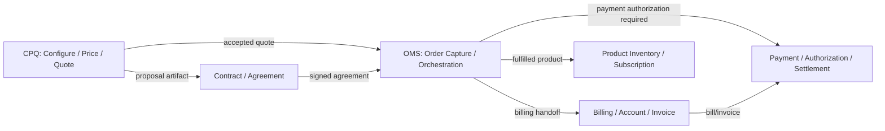
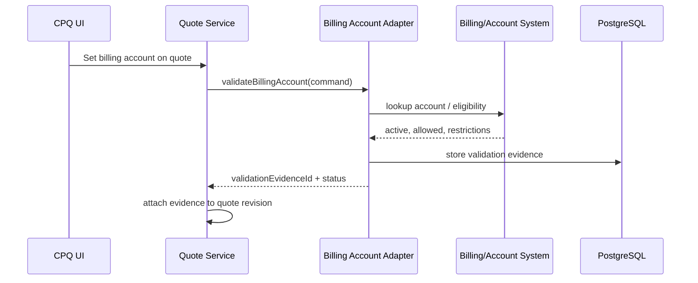
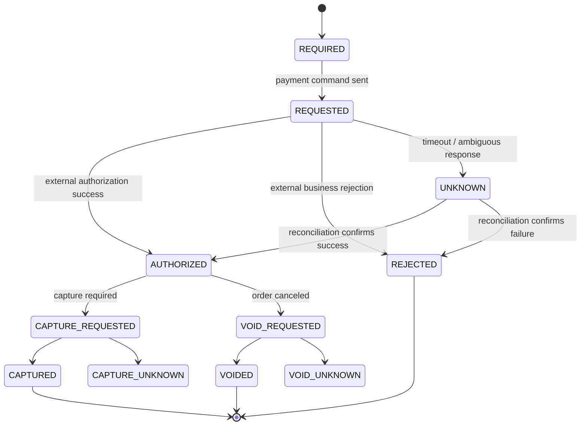
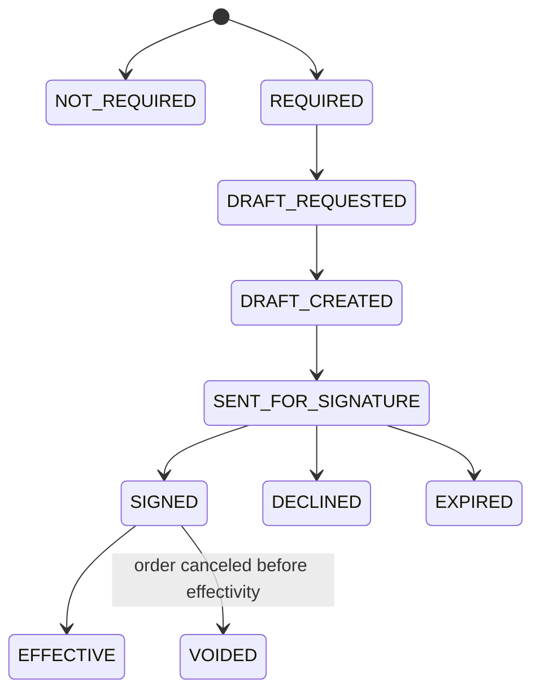
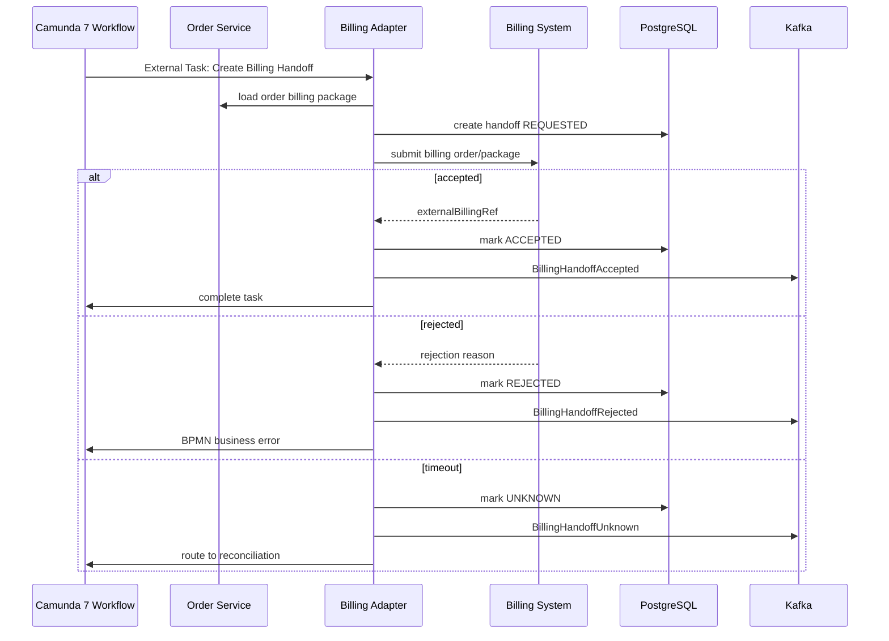
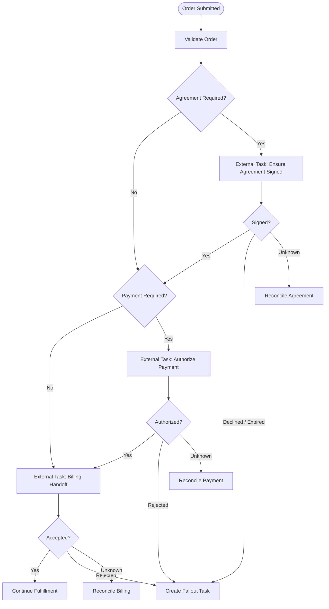

# Part 038 — Payment, Billing, and Contract Boundaries

A CPQ/OMS platform is not a billing system. It is not a payment processor. It is not a legal contract repository. But it must interact with all three.

This is a boundary problem.

If the boundary is too weak, Order Service becomes a dumping ground for billing flags, invoice fields, payment tokens, contract PDFs, subscription states, tax decisions, credit notes, and finance exceptions. The system becomes impossible to evolve because every downstream process leaks back into order capture.

If the boundary is too strict, the order cannot be fulfilled because the platform ignores real commercial prerequisites: account validity, billing account readiness, payment authorization, contract signature, credit approval, tax jurisdiction, and product activation conditions.

The goal is not to model finance completely. The goal is to model the handoff correctly.

---

## 1. The Core Mental Model

CPQ creates a **commercial proposal**.

Order management creates a **fulfillment obligation**.

Billing creates a **monetary obligation**.

Payment settles or authorizes a **funds movement**.

Contract management creates **legal evidence of agreement**.

These are related, but they are not the same lifecycle.



The key design rule:

> CPQ/OMS should store the evidence needed to prove what was agreed and what was handed off, but it should not pretend to be the system of record for billing, payment, or contract execution unless that is explicitly its bounded context.

---

## 2. Vocabulary Boundary

Use precise names.

| Concept | Meaning | Owner |
|---|---|---|
| Quote | Commercial proposal with priced configuration and terms | CPQ / Quote Service |
| Quote Acceptance | Customer or authorized actor accepts proposal | Quote Service |
| Order | Fulfillment instruction derived from accepted quote or other channel | Order Service |
| Billing Account | Account used for invoicing/charging | Billing/Account system |
| Payment Method | Tokenized method or external reference used for payment | Payment system |
| Payment Authorization | Temporary approval to charge or reserve funds | Payment system |
| Invoice/Bill | Monetary statement generated after billing process | Billing system |
| Contract/Agreement | Legal record of commercial terms | Contract system |
| Subscription/Product Instance | Realized service/product after fulfillment | Inventory/subscription system |

Do not store `invoiceStatus` on an order unless the order domain genuinely needs a local projection. If you need it for UI, store it in a read model as external status, not as order truth.

---

## 3. What CPQ/OMS Must Know

A CPQ/OMS platform usually needs to know:

1. Is the customer allowed to use this billing account?
2. Is the billing account active and compatible with the quote?
3. Is payment required before fulfillment?
4. Was payment authorization obtained?
5. Is a signed agreement required?
6. Was the agreement generated from the same quote revision?
7. Was the agreement signed by an authorized party?
8. Was the billing handoff accepted by downstream system?
9. Does billing need activation event after fulfillment?
10. What evidence should be retained for audit and dispute handling?

It does not necessarily need to know:

- invoice line calculation internals;
- payment gateway routing rules;
- settlement batch lifecycle;
- card network details;
- revenue recognition logic;
- general ledger postings;
- tax filing workflows;
- legal clause authoring internals.

This is the difference between integration awareness and bounded-context leakage.

---

## 4. Billing Account Validation

Before quote acceptance or order submission, the system often needs to validate a billing account.

Billing account validation answers:

> Can this customer/channel/order use this account for this commercial transaction?

Validation is not billing.

Recommended flow:



The quote should store evidence reference, not become the billing account master.

Validation statuses:

- `VALID`
- `INVALID`
- `RESTRICTED`
- `UNKNOWN`
- `STALE`

Again: `UNKNOWN` is not `INVALID`.

---

## 5. Payment Boundary

Payment is dangerous because it has financial, legal, and security implications.

In CPQ/OMS, payment usually appears as one of these patterns:

1. **No payment in order flow**: invoice later.
2. **Payment method required**: token/reference must exist before order.
3. **Pre-authorization required**: funds authorization before fulfillment.
4. **Capture required before fulfillment**: charge before shipment/activation.
5. **Deposit required**: partial upfront charge.
6. **Credit check required**: payment replaced by credit decision.

Do not design a generic `paymentStatus` enum without knowing which pattern applies.

### 5.1 Payment Intent

A payment intent is a local representation of what CPQ/OMS asked the payment domain to do.

```java
public final class PaymentIntent {
    public UUID paymentIntentId;
    public UUID tenantId;
    public UUID orderId;
    public String externalPaymentIntentRef;
    public PaymentIntentType type;
    public Money amount;
    public PaymentIntentStatus status;
    public Instant requestedAt;
    public Instant expiresAt;
}
```

Possible statuses:



Payment uses the same unknown outcome discipline as reservation. A timeout during authorization may still have authorized funds externally.

### 5.2 Never Store Sensitive Payment Details Casually

The CPQ/OMS platform should store external references and tokenized identifiers, not raw card or bank details. Even if the system is not directly in PCI scope, engineering discipline should assume payment data is high-risk and minimize storage.

Store:

- payment intent id;
- external payment reference;
- tokenized payment method reference;
- last four digits if policy allows and necessary for UX;
- authorization status;
- amount, currency, expiry;
- evidence/audit references.

Avoid storing:

- raw card number;
- CVV;
- raw bank credentials;
- gateway secrets;
- opaque external payloads with sensitive data.

---

## 6. Contract and Agreement Boundary

A quote artifact is not always a contract. A contract is a legally meaningful agreement accepted by authorized parties.

CPQ/OMS must distinguish:

- proposal document;
- quote PDF;
- order summary;
- agreement draft;
- agreement for signature;
- signed agreement;
- effective contract;
- contract amendment.

Contract lifecycle example:



The important invariant:

> A signed agreement must reference the quote revision or order version it legally represents.

If a user changes price, terms, product configuration, billing account, or customer legal entity after agreement generation, the agreement may become stale. The system should not silently reuse it.

---

## 7. Billing Handoff

Billing handoff translates order/commercial facts into billing system input.

It does not mean Order Service calculates invoices.

A handoff package may include:

- customer/account references;
- billing account reference;
- order id and order line ids;
- product offering ids;
- charge components from pricing result;
- recurring/non-recurring charge classification;
- discount components;
- effective date;
- contract term;
- tax-relevant address/reference;
- agreement reference;
- activation trigger policy;
- external correlation id.



Handoff is a lifecycle. Do not reduce it to `billingCreated = true`.

---

## 8. Data Model

A minimal local model:

```sql
create table billing_account_validation (
  validation_id uuid primary key,
  tenant_id uuid not null,
  subject_type text not null,
  subject_id uuid not null,
  subject_revision int,
  billing_account_ref text not null,
  status text not null,
  checked_at timestamptz not null,
  expires_at timestamptz,
  source_system text not null,
  source_reference text,
  explanation_code text,
  diagnostic_json jsonb not null default '{}'::jsonb,
  constraint ck_billing_validation_status check (
    status in ('VALID','INVALID','RESTRICTED','UNKNOWN','STALE')
  )
);

create table payment_intent (
  payment_intent_id uuid primary key,
  tenant_id uuid not null,
  order_id uuid not null,
  idempotency_key text not null,
  external_payment_ref text,
  type text not null,
  status text not null,
  amount numeric(18,6) not null,
  currency char(3) not null,
  requested_at timestamptz,
  expires_at timestamptz,
  last_reconciled_at timestamptz,
  version bigint not null,
  constraint uq_payment_intent_idem unique (tenant_id, idempotency_key),
  constraint ck_payment_intent_status check (
    status in ('REQUIRED','REQUESTED','AUTHORIZED','REJECTED','UNKNOWN',
               'CAPTURE_REQUESTED','CAPTURED','CAPTURE_UNKNOWN',
               'VOID_REQUESTED','VOIDED','VOID_UNKNOWN')
  )
);

create table agreement_evidence (
  agreement_evidence_id uuid primary key,
  tenant_id uuid not null,
  quote_id uuid,
  quote_revision int,
  order_id uuid,
  external_agreement_ref text,
  artifact_id uuid,
  status text not null,
  generated_at timestamptz,
  sent_at timestamptz,
  signed_at timestamptz,
  expires_at timestamptz,
  signer_ref text,
  source_system text not null,
  evidence_hash text,
  diagnostic_json jsonb not null default '{}'::jsonb,
  constraint ck_agreement_status check (
    status in ('NOT_REQUIRED','REQUIRED','DRAFT_REQUESTED','DRAFT_CREATED',
               'SENT_FOR_SIGNATURE','SIGNED','DECLINED','EXPIRED','EFFECTIVE','VOIDED')
  )
);

create table billing_handoff (
  billing_handoff_id uuid primary key,
  tenant_id uuid not null,
  order_id uuid not null,
  idempotency_key text not null,
  external_billing_ref text,
  status text not null,
  requested_at timestamptz,
  accepted_at timestamptz,
  rejected_at timestamptz,
  last_reconciled_at timestamptz,
  package_hash text not null,
  package_json jsonb not null,
  version bigint not null,
  constraint uq_billing_handoff_idem unique (tenant_id, idempotency_key),
  constraint ck_billing_handoff_status check (
    status in ('REQUESTED','ACCEPTED','REJECTED','UNKNOWN','CANCEL_REQUESTED','CANCELED','CANCEL_UNKNOWN')
  )
);
```

Design notes:

- Store billing package hash so repeated handoff can detect payload drift.
- Store agreement reference with quote revision to prevent stale agreement reuse.
- Store payment intent lifecycle separately from order lifecycle.
- Use unique idempotency constraints for external calls.
- Keep sensitive external payload out of JSONB unless scrubbed.

---

## 9. Order Invariants

Order submission should check commercial prerequisites.

Example invariants:

1. If product requires signed agreement, order cannot enter fulfillment until agreement is `SIGNED` or `EFFECTIVE`.
2. If payment authorization is required, order cannot enter fulfillment until payment intent is `AUTHORIZED`.
3. If billing account is required, quote/order must have non-stale valid billing account evidence.
4. If quote revision changes after agreement generation, agreement becomes stale.
5. If price result changes after payment authorization amount, payment authorization must be revalidated.
6. If order is canceled before capture, payment authorization should be voided or allowed to expire based on payment policy.
7. If billing handoff is unknown, downstream activation must not assume billing exists.

These invariants belong in domain services, not just BPMN diagrams.

---

## 10. Camunda 7 Orchestration

A typical order process may include payment, agreement, billing, and fulfillment gates.



BPMN should make gates visible, but the truth should remain in domain tables. The workflow asks services to perform commands. Services persist truth, emit events, and return business result.

---

## 11. External Task Worker Design

Payment worker example:

```java
public final class AuthorizePaymentWorker {

    public void execute(ExternalTask task, ExternalTaskService externalTaskService) {
        UUID orderId = UUID.fromString(task.getBusinessKey());
        String idempotencyKey = "payment-auth:" + orderId;

        PaymentAuthorizationResult result = paymentApplicationService.authorizeForOrder(
            new AuthorizePaymentCommand(orderId, idempotencyKey)
        );

        switch (result.status()) {
            case AUTHORIZED -> externalTaskService.complete(task.getId(), Map.of(
                "paymentIntentId", result.paymentIntentId().toString()
            ));
            case REJECTED -> externalTaskService.handleBpmnError(
                task.getId(),
                "PAYMENT_REJECTED",
                result.explanation()
            );
            case UNKNOWN -> externalTaskService.complete(task.getId(), Map.of(
                "paymentOutcome", "UNKNOWN"
            ));
        }
    }
}
```

The worker is thin. It does not decide payment policy. It calls the application service.

---

## 12. Event Model

Recommended events:

### Billing Account

- `BillingAccountValidationCreated`
- `BillingAccountValidationExpired`
- `BillingAccountValidationRejected`

### Payment

- `PaymentIntentRequired`
- `PaymentAuthorizationRequested`
- `PaymentAuthorized`
- `PaymentRejected`
- `PaymentOutcomeUnknown`
- `PaymentCaptureRequested`
- `PaymentCaptured`
- `PaymentCaptureUnknown`
- `PaymentVoidRequested`
- `PaymentVoided`

### Contract

- `AgreementRequired`
- `AgreementDraftRequested`
- `AgreementDraftCreated`
- `AgreementSentForSignature`
- `AgreementSigned`
- `AgreementDeclined`
- `AgreementExpired`
- `AgreementBecameStale`

### Billing Handoff

- `BillingHandoffRequested`
- `BillingHandoffAccepted`
- `BillingHandoffRejected`
- `BillingHandoffOutcomeUnknown`

Event names should be past-tense facts. Avoid `ProcessPayment` as an event name. That is a command.

---

## 13. Billing Package Construction

Billing package construction must be deterministic.

Input sources:

- accepted quote revision;
- immutable price result;
- order line tree;
- customer account reference;
- billing account validation evidence;
- agreement evidence;
- effective date policy;
- product offering charge metadata;
- tax-relevant address/reference;
- order action: add, modify, disconnect, renew.

The package builder should produce:

```json
{
  "orderId": "7fb...",
  "billingAccountRef": "BA-10029",
  "agreementRef": "AGR-9921",
  "effectiveDate": "2026-07-15",
  "items": [
    {
      "orderLineId": "line-1",
      "action": "ADD",
      "productOfferingId": "fiber-1g",
      "charges": [
        {
          "chargeType": "RECURRING",
          "code": "MRC_FIBER_1G",
          "amount": "80.00",
          "currency": "USD",
          "frequency": "MONTHLY"
        },
        {
          "chargeType": "ONE_TIME",
          "code": "INSTALL_FEE",
          "amount": "50.00",
          "currency": "USD"
        }
      ]
    }
  ]
}
```

Do not let the billing adapter recalculate price. It should transform approved/accepted price evidence into downstream format.

---

## 14. Contract Staleness

Contract staleness is a subtle enterprise failure.

Agreement is stale when any legally material fact changes after generation/signature:

- customer legal entity;
- billing account;
- product configuration;
- price component;
- discount;
- contract term;
- service address;
- effective date;
- cancellation/renewal clause;
- signature authority;
- quote revision.

Use a hash of material facts:

```text
agreement_material_hash = sha256(
  tenantId + quoteId + quoteRevision + customerLegalEntity + billingAccountRef +
  lineConfigurationSnapshotHash + priceResultHash + termSnapshotHash
)
```

Store the hash on agreement evidence. Before order submission, recompute it. If it differs, do not proceed silently.

---

## 15. Reconciliation

Payment, billing, and contract systems are external. They will produce ambiguous outcomes.

Reconciliation tables should track:

- last attempt time;
- attempt count;
- external lookup key;
- last external status;
- local status;
- mismatch reason;
- next retry time;
- manual intervention flag.

Reconciliation is required for:

- payment authorization unknown;
- payment capture unknown;
- payment void unknown;
- agreement signature callback missing;
- billing handoff unknown;
- billing cancellation unknown.

Do not rely only on webhooks. Webhooks fail, duplicate, arrive late, or arrive out of order. Use them as hints; reconcile as the correctness mechanism.

---

## 16. API Boundary

Expose resources that match lifecycle evidence.

```yaml
paths:
  /orders/{orderId}/payment-intents:
    post:
      operationId: createPaymentIntentForOrder
      parameters:
        - name: orderId
          in: path
          required: true
          schema:
            type: string
            format: uuid
        - name: Idempotency-Key
          in: header
          required: true
          schema:
            type: string
      responses:
        '202':
          description: Payment authorization requested

  /orders/{orderId}/billing-handoffs:
    post:
      operationId: createBillingHandoff
      responses:
        '202':
          description: Billing handoff requested

  /quotes/{quoteId}/revisions/{revision}/agreement-evidence:
    get:
      operationId: getAgreementEvidenceForQuoteRevision
      responses:
        '200':
          description: Agreement evidence for quote revision
```

Do not expose low-level gateway concepts to CPQ UI unless they are part of user action.

---

## 17. Security and Compliance Boundary

Security rules:

1. Payment-related payloads must be minimized.
2. External tokens must be encrypted or protected according to platform policy.
3. Do not log sensitive payment payloads.
4. Use field-level redaction in API error responses.
5. Only authorized roles can override payment/contract gates.
6. Manual override must create an audit event with actor, reason, and authority evidence.
7. Billing account access must be object-level authorized.
8. Signed agreement artifacts must be immutable or content-addressed.

A production CPQ/OMS system should behave as though every billing/payment/contract integration record might become evidence in a dispute.

---

## 18. Failure Matrix

| Failure | Bad Design | Better Design |
|---|---|---|
| Payment authorization timeout | Retry blindly | Mark UNKNOWN, reconcile by idempotency/external ref |
| Payment rejected | Technical incident | Business rejection path and user-visible reason category |
| Agreement generated then quote repriced | Reuse agreement | Mark agreement stale and regenerate/resign if required |
| Billing handoff timeout | Assume failed | Mark UNKNOWN and reconcile external system |
| Billing rejects line | Mutate order silently | Create fallout with rejection reason and remediation options |
| Webhook arrives before local record | Drop event | Inbox staging and later correlation |
| Duplicate webhook | Duplicate state transition | Deduplicate by source event id |
| Billing account becomes inactive after quote | Fulfill anyway | Revalidate before submit/activation based on policy |
| Payment capture succeeds but local update fails | Charge without evidence | Reconcile and repair local state with audit trail |
| Manual override used | No trace | Require reason, authority, and immutable audit entry |

---

## 19. Testing Strategy

### 19.1 Unit Tests

- billing package hash stability;
- agreement material hash change detection;
- payment transition guard;
- billing handoff transition guard;
- stale validation detection;
- sensitive field redaction.

### 19.2 Integration Tests

- unique idempotency constraints;
- outbox event creation;
- payment/billing external adapter stubs;
- JSONB package persistence;
- optimistic lock conflict;
- agreement evidence query.

### 19.3 Workflow Tests

- no-payment path;
- payment authorized path;
- payment rejected path;
- payment unknown reconciliation path;
- agreement required and signed path;
- agreement stale path;
- billing handoff rejected path;
- billing handoff unknown path.

### 19.4 Contract Tests

- payment provider contract;
- billing handoff contract;
- agreement/signature provider callback contract;
- OpenAPI error response contract;
- event schema compatibility.

### 19.5 Scenario Tests

- `signed_agreement_becomes_stale_when_price_changes`
- `payment_timeout_reconciliation_confirms_authorization`
- `billing_handoff_rejected_creates_fallout_task`
- `duplicate_payment_authorization_request_returns_existing_intent`
- `billing_account_validation_expires_before_order_submission`
- `webhook_duplicate_does_not_duplicate_payment_capture`

---

## 20. Production Readiness Checklist

Before production:

- order lifecycle separates payment, agreement, billing, and fulfillment states;
- billing account validation evidence has expiry;
- payment intent uses idempotency key and unknown state;
- agreement evidence references quote revision/order version;
- agreement material hash detects stale legal/commercial facts;
- billing package is deterministic and hashable;
- billing adapter does not recalculate price;
- external callbacks are idempotent;
- reconciliation exists for unknown outcomes;
- sensitive payment fields are not logged or stored casually;
- manual override requires authority and reason;
- all handoff events go through outbox;
- Camunda process variables contain references, not sensitive payloads;
- dashboards show payment unknown, agreement stale, billing rejected, and reconciliation backlog.

---

## 21. The Design Rule

The clean architecture rule is:

> Quote proves what was offered. Order proves what was requested for fulfillment. Contract proves what was agreed. Billing proves what must be charged. Payment proves authorization or settlement. Product inventory proves what exists after fulfillment.

Do not collapse these into one aggregate.

The CPQ/OMS platform should coordinate them through explicit evidence, idempotent commands, durable handoff records, events, reconciliation, and workflow gates.

That boundary is what prevents an enterprise order platform from becoming a fragile ball of finance, legal, fulfillment, and sales logic.

