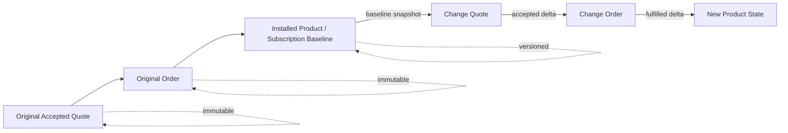
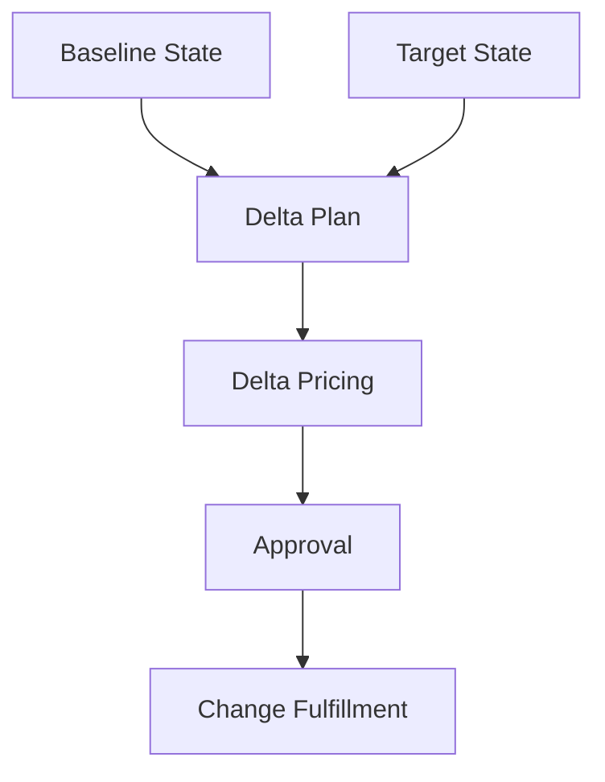
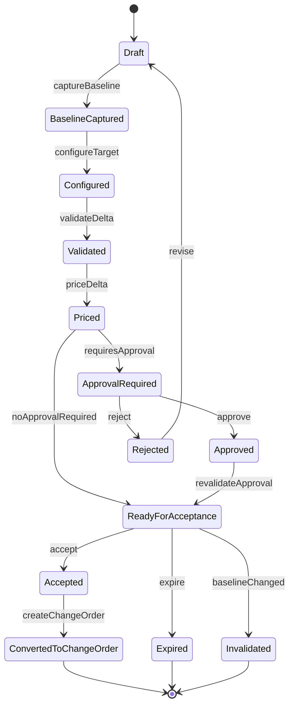
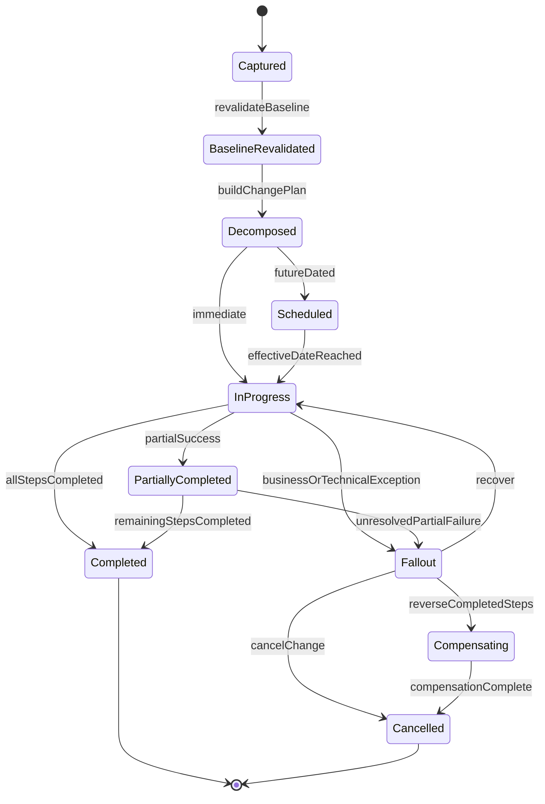
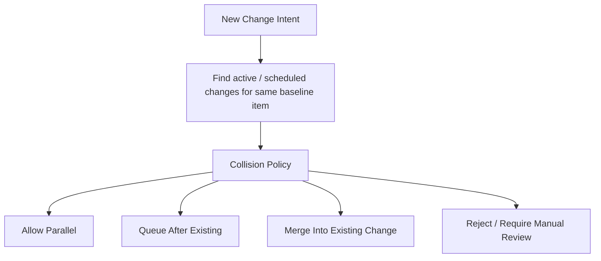
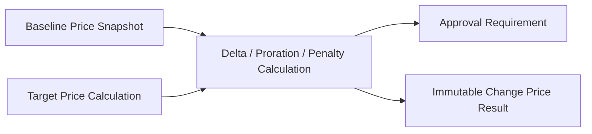
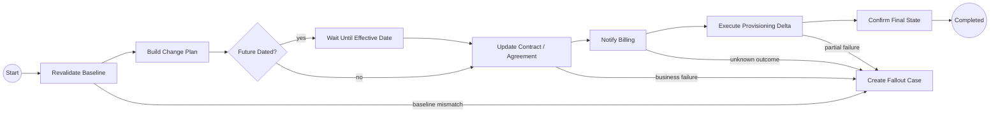
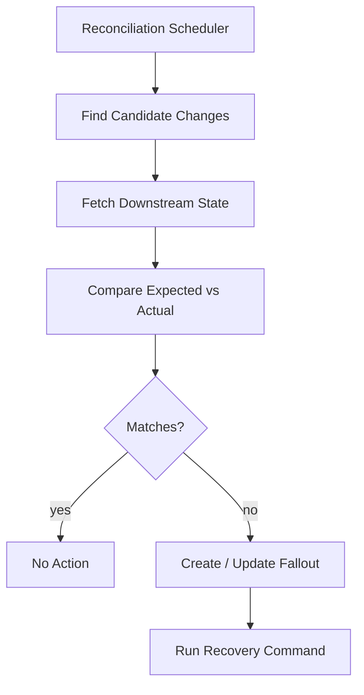

# Part 039 — Amendment, Renewal, and Change Order

The first order is not the end of the customer lifecycle.

In most enterprise CPQ/OMS systems, the hardest complexity appears after the first successful sale:

- the customer upgrades an existing product,
- a bundle member is removed,
- a site is relocated,
- the contract is renewed,
- a term is extended,
- a discount is renegotiated,
- a product is replaced by a newer catalog offer,
- an in-flight order must be amended,
- a future-dated change overlaps with another future-dated change,
- a cancellation creates a penalty, credit, or refund obligation.

A demo system treats these as updates.

A production system treats them as **new commercial and fulfillment intents over an existing baseline**.

This part builds the mental model and implementation architecture for amendment, renewal, and change order without corrupting quote, order, price, approval, fulfillment, audit, or contract evidence.

---

## 1. Core Rule

Do not mutate the old order.

Do not mutate the accepted quote.

Do not mutate the historical price result.

Do not rewrite the old fulfillment plan.

A change order is not an edit to history. It is a new intent that references history.



The platform must be able to answer:

> Given the customer state at baseline version X, why did we allow this change, how did we price it, who approved it, what changed, what was sent to fulfillment, and what final state resulted?

If the system cannot answer that, it does not have enterprise-grade change-order capability.

---

## 2. Vocabulary Boundary

The vocabulary must be explicit because teams often overload the same words.

| Term | Meaning | Source of Truth |
|---|---|---|
| Amendment | A modification to an existing commercial agreement or active product/service. | CPQ/OMS for intent and evidence; contract/billing/inventory may own downstream truth. |
| Renewal | A commercial continuation of an expiring agreement or subscription term. | CPQ for offer/price/approval; contract/billing for agreement and billing continuation. |
| Change Quote | A quote representing a proposed delta against an existing baseline. | Quote Service. |
| Change Order | An order representing accepted delta fulfillment. | Order Service. |
| Baseline | The current or selected version of installed product/customer agreement used as starting point. | Product inventory/subscription/agreement read source, snapshotted by CPQ. |
| Delta | The intended difference between baseline and target state. | CPQ/OMS derived but persisted as evidence. |
| Target State | Desired state after the change completes. | CPQ computes; inventory/subscription eventually reflects after fulfillment. |
| Effective Date | Date/time when commercial or fulfillment change should take effect. | Change quote/order; downstream systems may have their own activation confirmation. |
| In-flight Change | A change whose order/process has started but is not terminal. | Order Service + Workflow. |
| Future-dated Change | Accepted change scheduled for future execution. | Order Service + Workflow + scheduler. |
| Cancellation | Termination or removal of existing product/service. | Order Service for intent; inventory/subscription for final state. |

The dangerous word is **update**.

In CRUD, update means mutating a row.

In CPQ/OMS change lifecycle, update often means creating a new intent that modifies a future or active state. That distinction is the difference between an auditable platform and a system that silently rewrites business history.

---

## 3. Amendment Is a Three-State Problem

A normal new sale has two important states:

1. what the customer wants,
2. what the system will fulfill.

An amendment has three:

1. **baseline state** — what exists now or what is scheduled to exist,
2. **target state** — what the customer wants after change,
3. **delta state** — what must be done to move from baseline to target.



The platform should not ask only: “what product lines are in the new quote?”

It must ask:

- What existing products are being retained?
- What existing products are being modified?
- What existing products are being removed?
- What new products are being added?
- What product relationships are affected?
- What terms are affected?
- What downstream systems must be changed?
- What charge, credit, penalty, or prorated amount is created?
- What approvals are required because this is a change, not a new sale?
- What happens if part of the change succeeds and part fails?

A change quote is not just another quote type. It is a quote with a baseline obligation.

---

## 4. The Baseline Snapshot Principle

A change quote must snapshot its baseline.

It is not enough to store `customerId` and fetch current product state later.

Why?

Because the installed product state may change between:

1. quote creation,
2. configuration,
3. pricing,
4. approval,
5. customer acceptance,
6. order creation,
7. fulfillment execution.

If the baseline changes during that window, the quote may no longer be valid.

Therefore, the change quote should store at least:

```text
baselineSnapshotId
baselineSourceSystem
baselineSourceVersion
baselineCapturedAt
customerId
tenantId
agreementRef
installedProductRefs[]
baselineProductTree
baselineCommercialTerms
baselineBillingContext
baselineContractContext
baselineInventoryContextHash
```

The snapshot does not need to own the downstream system. It owns the **evidence used by CPQ**.

A good baseline snapshot lets the system say:

> This renewal price was calculated using product inventory version 917, agreement version 12, catalog version 2026-Q3, price book version 44, and discount policy version 8.

That sentence is the shape of enterprise defensibility.

---

## 5. Delta Line Model

A change order needs line actions.

A normal new order often has `ADD` implicitly.

A change order must make action explicit.

```text
ADD       create a new product/component
MODIFY    change attributes, terms, quantity, location, option, or relationship
REMOVE    terminate/remove an existing product/component
SUSPEND   pause service without final termination
RESUME    reactivate suspended service
REPLACE   remove one existing item and add another linked item
NO_CHANGE retained in target state for context, but no fulfillment action
```

A robust delta line should include:

```text
changeLineId
changeQuoteId / changeOrderId
action
baselineItemRef
targetOfferingId
targetSpecificationId
parentLineId
relationshipType
beforeSnapshot
afterSnapshot
deltaAttributes
effectiveDate
pricingTreatment
fulfillmentTreatment
requiresApproval
validationStatus
```

Example:

```json
{
  "action": "MODIFY",
  "baselineItemRef": "product-instance-98231",
  "targetOfferingId": "fiber-1gbps-business",
  "before": {
    "bandwidth": "500Mbps",
    "contractTermMonths": 24
  },
  "after": {
    "bandwidth": "1Gbps",
    "contractTermMonths": 24
  },
  "effectiveDate": "2026-09-01",
  "pricingTreatment": "DELTA_WITH_PRORATION"
}
```

Do not model this as a generic JSON patch unless the domain is extremely fluid and the governance model is strong. JSON patch is mechanically expressive, but business change needs semantic actions.

The system must understand the difference between:

- “change bandwidth from 500 Mbps to 1 Gbps”,
- “replace product with a different offering”,
- “remove a bundle child”,
- “terminate the whole agreement”,
- “renew with same products but new term and price”.

They are not equivalent.

---

## 6. Amendment Taxonomy

Different change types require different validation, pricing, approval, and fulfillment.

| Change Type | Example | CPQ Concern | OMS Concern |
|---|---|---|---|
| Upgrade | 500 Mbps → 1 Gbps | eligibility, delta price, term impact | modify service profile |
| Downgrade | premium support → standard support | penalty, approval, term rule | modify entitlement |
| Add-on | add static IP | compatibility, price | provision add-on |
| Removal | remove add-on | credit, dependency | deprovision safely |
| Replacement | legacy product → new offer | migration path, grandfathering | disconnect old + provide new |
| Relocation | move service to new address | availability, install fee | site survey, provisioning |
| Renewal | extend term | renewal offer, uplift, discount | contract/billing continuation |
| Suspension | pause service | policy, billing treatment | suspend provisioning |
| Resume | resume service | outstanding balance, eligibility | reactivate provisioning |
| Cancellation | terminate product/agreement | penalty, refund, contract term | disconnect, billing closure |

The taxonomy matters because it drives the process.

A downgrade may need approval even if price decreases because it may violate revenue retention policy.

A removal may require dependency validation because another product depends on it.

A renewal may require price uplift and contract evidence but no technical provisioning.

A relocation may require availability check and new installation workflow.

A cancellation may require compensation, billing closure, and contract termination.

---

## 7. Change Quote Lifecycle

A change quote has its own lifecycle.



Important invariants:

1. A change quote cannot be priced without a baseline snapshot.
2. A change quote cannot be accepted if the baseline is stale unless policy allows stale acceptance.
3. A change quote cannot be accepted if approval is stale.
4. A change quote cannot be converted twice into different change orders.
5. A change quote cannot silently switch baseline after approval.
6. A change quote must retain before/after evidence.
7. A renewal quote must reference the expiring agreement or subscription term.
8. A cancellation quote must disclose penalty, credit, and effective date treatment.

The key transition is not `Accepted`.

The key transition is:

> Accepted against which baseline?

---

## 8. Change Order Lifecycle

A change order has a different lifecycle from a new provide order.



A change order must know:

- what baseline it was accepted against,
- what target state it is trying to achieve,
- what steps are required,
- which steps are reversible,
- which steps are compensatable,
- which steps have unknown outcome,
- which downstream systems have acknowledged change,
- what final state is confirmed.

Do not collapse this into `PROCESSING`, `DONE`, and `FAILED`.

Those states hide the exact operational detail needed during production incidents.

---

## 9. Baseline Staleness

Baseline staleness is the central risk of amendment.

The baseline is stale when the actual current state no longer matches the snapshot used by the quote/order.

Examples:

- another change order completed first,
- billing account changed,
- contract was amended externally,
- product inventory version changed,
- catalog offering was retired,
- price book version expired,
- customer eligibility changed,
- an in-flight order is already modifying the same asset,
- the product was suspended for non-payment.

Staleness is not always fatal.

There are three policy choices:

| Policy | Meaning | Example |
|---|---|---|
| Strict | reject if baseline changed | cancellation against active product |
| Rebase | recompute quote against latest baseline | renewal before acceptance |
| Tolerant | allow if changed fields are irrelevant | billing address changed but service config unchanged |

A production system must make the policy explicit.

```text
if baseline.hash != current.hash:
  diff = compare(current, baseline)
  decision = baselinePolicy.evaluate(changeType, diff)

  if decision == REJECT:
    invalidateChangeQuote()
  if decision == REBASE:
    createNewRevisionFromLatestBaseline()
  if decision == TOLERATE:
    recordToleratedBaselineDrift(diff)
```

Never ignore baseline drift.

Ignored drift becomes billing disputes, provisioning failures, and audit gaps.

---

## 10. In-Flight Change Collision

Two changes may target the same installed product.

Example:

- Sales submits upgrade from 500 Mbps to 1 Gbps.
- Customer support submits relocation for the same service.
- Billing submits suspension for non-payment.

These changes may be independent, compatible, sequential, or mutually exclusive.

The system needs collision detection.



Common policies:

| Collision | Recommended Treatment |
|---|---|
| Two independent add-ons | allow parallel if no shared dependency |
| Upgrade + relocation | often sequence or manual review |
| Cancellation + upgrade | reject or require manual review |
| Renewal + add-on | allow but reprice renewal if term affected |
| Billing suspension + new change | block until suspension resolved |
| Two future-dated changes same product | require sequencing by effective date |

A naive system locks the whole customer account.

A better system locks or sequences by **affected baseline item and dependency graph**.

---

## 11. Renewal Is Not Just Another Amendment

A renewal usually changes the commercial term more than the technical product.

The product may remain the same, but the agreement changes.

Renewal concerns:

- expiring term,
- renewal window,
- renewal price book,
- uplift rule,
- discount retention,
- new minimum term,
- grandfathered offer,
- migration to new offering,
- approval for discount carry-over,
- contract artifact,
- billing continuation,
- auto-renewal policy,
- customer notice period.

A renewal quote should capture:

```text
agreementRef
currentTermStart
currentTermEnd
renewalTermStart
renewalTermEnd
renewalMode: MANUAL | AUTO | NEGOTIATED
retainedProducts[]
changedProducts[]
retiredProducts[]
newProducts[]
priceUpliftPolicyVersion
discountCarryForwardPolicyVersion
contractTemplateVersion
```

Renewal has a dangerous trap:

> The product state may be unchanged, but the commercial obligation is new.

Therefore, renewal must still create a new quote/contract/approval evidence where required.

Do not simply update `contractEndDate` on the old agreement.

---

## 12. Pricing a Change

Change pricing is more complicated than new-sale pricing.

It may include:

- before price,
- after price,
- delta recurring charge,
- one-time change fee,
- installation fee,
- penalty,
- credit,
- refund,
- proration,
- remaining term calculation,
- minimum commitment recalculation,
- discount clawback,
- migration incentive,
- renewal uplift,
- tax placeholder.

A good change price result should show both the target and the delta.

```text
beforeMonthlyRecurring = 500.00
afterMonthlyRecurring  = 650.00
deltaMonthlyRecurring  = 150.00
oneTimeUpgradeFee      = 75.00
proratedCharge         = 48.39
penalty                = 0.00
credit                 = 0.00
```

But never store only the delta.

Store enough evidence to explain:

- what the customer paid before,
- what they will pay after,
- what one-time charges apply,
- how proration was calculated,
- what policy version was used,
- why a penalty was or was not applied,
- what approval threshold was triggered.



Pricing invariant:

> A change price result must be reproducible from baseline snapshot, target configuration, price book version, policy version, and effective date.

---

## 13. Approval for Amendments

Approval rules for amendments are not the same as new-sale rules.

A change may need approval because:

- margin decreases,
- recurring revenue decreases,
- discount increases,
- contract term is shortened,
- penalty is waived,
- grandfathered product is retained,
- credit/refund exceeds threshold,
- cancellation violates term,
- downgrade violates retention policy,
- customer segment has special restrictions,
- manual override was applied,
- product migration is high risk.

Example DMN decision facts:

```text
changeType
customerSegment
baselineMonthlyRecurring
targetMonthlyRecurring
deltaMonthlyRecurring
remainingTermMonths
penaltyAmount
penaltyWaived
creditAmount
discountBefore
discountAfter
manualOverrideApplied
productRetired
migrationPath
salesChannel
```

The approval evidence must reference the change quote revision and price result.

If the quote is repriced or rebased, approval must be invalidated unless the policy explicitly allows approval carry-over.

---

## 14. Contract and Billing Boundary

Amendments and renewals often affect contracts and billing.

But CPQ/OMS should not become the contract or billing system by accident.

The CPQ/OMS platform should send or store evidence such as:

```text
agreementRef
amendmentType
acceptedChangeQuoteRef
contractTemplateVersion
signedArtifactRef
billingAccountRef
billingEffectiveDate
billingHandoffEventId
billingAcknowledgementRef
```

It should not silently own:

- invoice generation,
- tax authority calculation,
- payment settlement,
- legal clause repository,
- subscription ledger,
- financial adjustment ledger,
- receivables lifecycle.

The boundary is:

> CPQ/OMS owns the accepted intent and fulfillment orchestration. Downstream systems own their ledgers and final operational truth.

---

## 15. Catalog Migration and Grandfathering

A renewal or amendment often encounters retired or grandfathered catalog items.

Possible policies:

| Policy | Meaning |
|---|---|
| Keep Existing | customer can continue current product but cannot add more |
| Renew Existing | customer can renew old product for another term |
| Force Migration | customer must move to new product |
| Soft Migration | system recommends new product but allows exception |
| Block Change | old product cannot be changed; only cancellation allowed |

A catalog model should expose migration paths.

```text
legacyOfferingId
allowedChangeActions
replacementOfferingIds[]
migrationEffectiveFrom
migrationEffectiveTo
requiresApproval
retentionPolicyVersion
```

Do not implement this as hard-coded Java `if legacyProductX` logic.

It must be data-driven because product migrations are commercial policy, not code structure.

---

## 16. API Shape

Change APIs should be command-oriented.

Examples:

```http
POST /change-quotes
POST /change-quotes/{changeQuoteId}/capture-baseline
POST /change-quotes/{changeQuoteId}/configure-target
POST /change-quotes/{changeQuoteId}/validate-delta
POST /change-quotes/{changeQuoteId}/price
POST /change-quotes/{changeQuoteId}/submit-for-approval
POST /change-quotes/{changeQuoteId}/accept
POST /change-quotes/{changeQuoteId}/convert-to-order

GET  /change-quotes/{changeQuoteId}
GET  /change-quotes/{changeQuoteId}/timeline
GET  /customers/{customerId}/change-options
```

For order:

```http
POST /change-orders
POST /change-orders/{changeOrderId}/start
POST /change-orders/{changeOrderId}/cancel
POST /change-orders/{changeOrderId}/recover
GET  /change-orders/{changeOrderId}
GET  /change-orders/{changeOrderId}/fulfillment-plan
GET  /change-orders/{changeOrderId}/timeline
```

Command request example:

```json
{
  "idempotencyKey": "8ea8c4b4-1431-4236-b269-8c4cc3e3e7c6",
  "customerId": "cust-10019",
  "baselineRef": {
    "source": "PRODUCT_INVENTORY",
    "productInstanceId": "pi-99182",
    "version": 17
  },
  "changeType": "UPGRADE",
  "effectiveDate": "2026-09-01",
  "requestedBy": "sales-user-778"
}
```

The command must include idempotency because users retry. BFF retries. Network layers retry. Workflow workers retry. Without idempotency, the same change may be created twice.

---

## 17. PostgreSQL Data Model

A simplified relational shape:

```sql
create table change_quote (
  id uuid primary key,
  tenant_id text not null,
  customer_id text not null,
  quote_number text not null,
  revision int not null,
  change_type text not null,
  status text not null,
  baseline_snapshot_id uuid not null,
  target_effective_date timestamptz,
  accepted_at timestamptz,
  converted_order_id uuid,
  version int not null,
  created_at timestamptz not null,
  updated_at timestamptz not null,
  unique (tenant_id, quote_number, revision)
);

create table baseline_snapshot (
  id uuid primary key,
  tenant_id text not null,
  source_system text not null,
  source_ref text not null,
  source_version text not null,
  captured_at timestamptz not null,
  snapshot_hash text not null,
  payload jsonb not null
);

create table change_quote_line (
  id uuid primary key,
  tenant_id text not null,
  change_quote_id uuid not null references change_quote(id),
  parent_line_id uuid references change_quote_line(id),
  action text not null,
  baseline_item_ref text,
  target_offering_id text,
  before_payload jsonb,
  after_payload jsonb,
  effective_date timestamptz,
  status text not null
);

create table change_price_result (
  id uuid primary key,
  tenant_id text not null,
  change_quote_id uuid not null references change_quote(id),
  price_book_version text not null,
  policy_version text not null,
  baseline_price_snapshot jsonb not null,
  target_price_snapshot jsonb not null,
  delta_price_snapshot jsonb not null,
  price_hash text not null,
  created_at timestamptz not null
);

create table change_order (
  id uuid primary key,
  tenant_id text not null,
  change_quote_id uuid not null references change_quote(id),
  status text not null,
  baseline_snapshot_id uuid not null references baseline_snapshot(id),
  process_instance_id text,
  business_key text not null,
  version int not null,
  created_at timestamptz not null,
  updated_at timestamptz not null,
  unique (tenant_id, change_quote_id)
);
```

The `unique (tenant_id, change_quote_id)` constraint prevents converting the same accepted change quote into multiple change orders.

You may also need a constraint for active changes per product instance:

```sql
create unique index uq_active_change_per_baseline_item
on change_order_affected_item (tenant_id, baseline_item_ref)
where status in ('CAPTURED', 'SCHEDULED', 'IN_PROGRESS', 'FALLOUT');
```

This is not always correct for every business. It is a default safety pattern. If your domain allows parallel changes, replace the unique index with a collision policy table and explicit sequencing.

---

## 18. EclipseLink JPA Mapping Boundary

Do not map every nested JSON snapshot as entities.

Use entities for lifecycle and queryable relations:

- `ChangeQuoteEntity`,
- `ChangeQuoteLineEntity`,
- `BaselineSnapshotEntity`,
- `ChangePriceResultEntity`,
- `ChangeOrderEntity`,
- `ChangeOrderStepEntity`,
- `ChangeTransitionLogEntity`.

Use JSONB payloads for immutable evidence that is not frequently joined:

- baseline product tree,
- before/after characteristic snapshot,
- price trace,
- contract context,
- external inventory response.

Aggregate loading rule:

> Load the minimum aggregate needed to validate and apply the command. Do not load the entire customer universe.

Example repository methods:

```java
public interface ChangeQuoteRepository {
    Optional<ChangeQuote> findForCommand(TenantId tenantId, ChangeQuoteId id);
    Optional<ChangeQuote> findAcceptedForConversion(TenantId tenantId, ChangeQuoteId id);
    void save(ChangeQuote quote);
}

public interface ChangeOrderRepository {
    Optional<ChangeOrder> findForWorkflowCommand(TenantId tenantId, ChangeOrderId id);
    boolean hasActiveChangeForBaselineItem(TenantId tenantId, BaselineItemRef ref);
    void save(ChangeOrder order);
}
```

Keep JPA entities persistence-oriented. Keep domain methods on domain objects or aggregate wrappers if your architecture separates entity and domain model.

---

## 19. Kafka Event Model

Change lifecycle should emit events as business facts.

Examples:

```text
ChangeQuoteCreated
BaselineCapturedForChangeQuote
ChangeQuoteConfigured
ChangeQuoteValidated
ChangeQuotePriced
ChangeQuoteApprovalRequired
ChangeQuoteApproved
ChangeQuoteAccepted
ChangeQuoteInvalidated
ChangeOrderCreated
ChangeOrderScheduled
ChangeOrderStarted
ChangeOrderStepCompleted
ChangeOrderEnteredFallout
ChangeOrderCompleted
ChangeOrderCancelled
RenewalQuoteCreated
RenewalAccepted
```

Partition key choices:

| Event Type | Partition Key |
|---|---|
| Change quote events | `changeQuoteId` or `customerId` |
| Change order events | `changeOrderId` or affected product instance |
| Installed product impact events | `productInstanceId` |
| Customer timeline events | `customerId` |

The partition key is a business decision. If you need strict ordering for all changes affecting the same installed product, key by product instance or a normalized affected-item key.

Do not publish event payloads that require consumers to query the source database immediately to understand what happened. Include enough immutable facts for consumers to build their projections.

---

## 20. Camunda 7 Workflow Boundary

Camunda should orchestrate long-running change execution, not own the commercial truth.

Good process variables:

```text
changeOrderId
businessKey
tenantId
customerId
changeType
baselineSnapshotId
effectiveDate
requiresContractUpdate
requiresBillingHandoff
requiresProvisioning
```

Bad process variables:

```text
entireBaselineProductTree
entirePriceTrace
allLineAttributes
billingAccountSecret
fullContractPayload
largeExternalSystemResponses
```

A typical change-order process:



Workflow should call domain services through commands. Domain services decide state transitions. Camunda coordinates time, waiting, retry, escalation, and human intervention.

---

## 21. Change Order Compensation

Change compensation is harder than new-order compensation because the baseline may already be partially modified.

Possible scenarios:

- contract amendment succeeded but provisioning failed,
- billing handoff succeeded but provisioning failed,
- old product disconnected but replacement failed,
- new product activated but old product failed to disconnect,
- penalty waived but cancellation failed,
- renewal contract signed but billing continuation failed.

Each change step should declare compensation behavior:

```text
stepName
system
forwardAction
successSignal
compensationAction
isReversible
isCompensatable
requiresManualApprovalForCompensation
unknownOutcomeCheck
```

Do not assume every step is reversible.

Some actions are compensatable but not reversible. For example, if a notification was sent, you cannot unsend it. You can only send a correction.

---

## 22. Reconciliation

Every change-order system needs reconciliation.

Reconciliation checks whether CPQ/OMS believes the change state matches downstream reality.

Examples:

- OMS says order completed, inventory still old.
- Billing acknowledged handoff, but invoice schedule not created.
- Contract service says signed, OMS still waiting.
- Provisioning callback never arrived.
- Two systems report different effective dates.
- Product inventory has version 19, OMS expected version 18.

Reconciliation process:



Reconciliation must be idempotent. It must not create duplicate fallout cases for the same discrepancy.

---

## 23. Search and Operational Views

Case workers need views like:

- active changes by customer,
- active changes by installed product,
- future-dated changes,
- baseline-stale change quotes,
- renewal quotes expiring soon,
- change orders in fallout,
- pending contract update,
- pending billing handoff,
- partially completed change orders,
- changes blocked by collision policy.

Do not build these views by joining deep write-model tables on every UI request.

Use projection tables:

```text
change_quote_search_projection
change_order_ops_projection
customer_change_timeline_projection
renewal_pipeline_projection
affected_item_active_change_projection
```

Projection lag must be visible. A user should know if the screen may be slightly stale.

---

## 24. Failure Modes

| Failure | Consequence | Defense |
|---|---|---|
| Mutating old order | audit corruption | immutable order + change order reference |
| Baseline not snapshotted | unreproducible price/approval | baseline snapshot table |
| Duplicate change order | double fulfillment | idempotency + unique conversion constraint |
| Parallel conflicting changes | inconsistent product state | affected-item collision detection |
| Stale approval | unauthorized commercial change | approval tied to quote revision + price hash |
| Stale baseline | invalid customer promise | baseline revalidation before acceptance/conversion |
| No delta semantics | impossible fulfillment | explicit line action model |
| Pricing only stores delta | cannot explain customer bill impact | before/after/delta price result |
| Camunda owns business state | split-brain truth | domain service owns lifecycle state |
| Downstream callback lost | stuck order | timeout + reconciliation |
| Compensation assumed reversible | bad recovery | per-step compensation metadata |

---

## 25. Testing Strategy

Test scenarios should include:

1. upgrade active product,
2. downgrade requiring approval,
3. add-on addition,
4. add-on removal with dependency,
5. renewal with price uplift,
6. renewal with discount carry-forward approval,
7. cancellation with penalty,
8. cancellation with penalty waiver approval,
9. replacement of retired product,
10. baseline drift before acceptance,
11. baseline drift before order conversion,
12. parallel change collision,
13. future-dated change execution,
14. in-flight change cancellation,
15. partial fulfillment failure,
16. compensation failure,
17. downstream unknown outcome,
18. duplicate command retry,
19. stale approval after repricing,
20. projection rebuild from events.

For each scenario, assert:

- lifecycle state,
- transition log,
- price result,
- approval requirement,
- outbox events,
- workflow correlation,
- affected item lock/collision behavior,
- audit record,
- idempotency record.

---

## 26. Anti-Patterns

### Anti-Pattern 1: Updating the Original Order

This destroys evidence.

Correct approach: create a new change order referencing the original order or baseline product instance.

### Anti-Pattern 2: Treating Renewal as Date Extension

Renewal often changes price, discount, term, agreement, billing, and approval. It is a commercial event, not only a field update.

### Anti-Pattern 3: Using Current Inventory at Fulfillment Time Without Snapshot

This makes quote pricing and approval unreproducible.

### Anti-Pattern 4: Delta as Generic JSON Patch

JSON patch describes mechanical mutation, not business meaning. Use semantic line actions.

### Anti-Pattern 5: No Collision Model

Without collision detection, two valid changes can combine into an invalid state.

### Anti-Pattern 6: Camunda Process Variables as Data Store

Process variables are for orchestration context. Commercial evidence belongs in domain storage.

### Anti-Pattern 7: Approval Not Bound to Price Hash

If price changes after approval but approval remains valid, the control system is broken.

### Anti-Pattern 8: Manual Database Fixes for Change Failures

Manual fixes must be expressed as audited recovery commands, not SQL patches.

---

## 27. Engineering Checklist

A change-order implementation is not production-ready until it has:

- immutable accepted quote and original order records,
- baseline snapshot with source version/hash,
- semantic delta line actions,
- before/after/delta pricing evidence,
- approval tied to revision and price result,
- baseline staleness policy,
- in-flight collision policy,
- idempotent command APIs,
- unique conversion from accepted quote to change order,
- Camunda process correlation by business key,
- external system acknowledgement records,
- reconciliation jobs,
- fallout handling,
- compensation metadata,
- operational projections,
- complete audit trail,
- scenario test catalog.

---

## 28. Mental Model Summary

A change order is not a patch.

It is a new business intent over an existing commercial and operational baseline.

A renewal is not a date update.

It is a new commercial commitment, even when the product state remains mostly unchanged.

An amendment is not a shortcut around quote/order lifecycle.

It is where CPQ/OMS lifecycle modeling becomes truly enterprise-grade.

The invariant is simple:

> Preserve history, snapshot the baseline, compute the target, persist the delta, approve the evidence, orchestrate the change, reconcile the outcome.

That is the difference between a system that can sell once and a platform that can manage the full customer lifecycle.

---

## References

- TM Forum TMF622 Product Ordering Management API: standardized mechanism for placing product orders based on product offerings.
- TM Forum TMF648 Quote Management API: customer quote management in pre-ordering.
- Camunda 7 external task and process orchestration documentation.
- PostgreSQL documentation on constraints, indexes, and JSONB.
