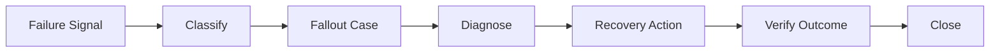
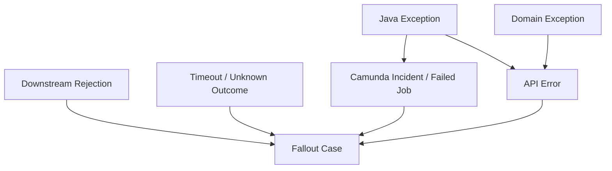
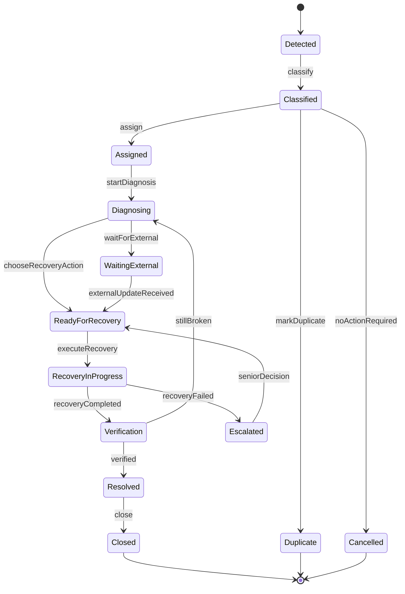
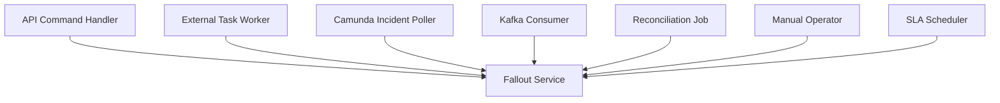
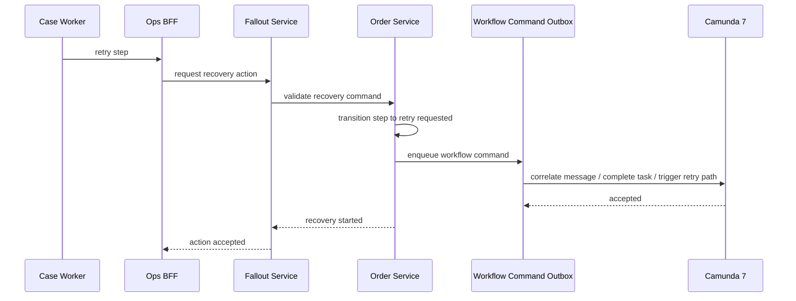

# Part 040 — Fallout Management and Exception Handling

A production CPQ/OMS platform is not defined by how well it handles the happy path.

It is defined by what happens when the happy path breaks.

Orders get rejected by downstream systems.

Callbacks never arrive.

Provisioning succeeds but the acknowledgement is lost.

Billing accepts a handoff but later rejects activation.

Inventory reports a product version mismatch.

A Camunda job exhausts retries.

A case worker fixes the wrong field.

A customer accepts a quote while the baseline has changed.

A payment authorization expires before fulfillment starts.

A contract is signed but the order is still stuck.

This is not an edge case. This is the normal life of enterprise order management.

The goal of fallout management is not to avoid all failure. That is impossible.

The goal is to make failure **visible, classified, recoverable, auditable, and bounded**.

---

## 1. Core Mental Model

An exception is a moment.

A fallout case is a managed lifecycle.



A thrown Java exception is not fallout management.

A Camunda incident is not enough.

A support ticket is not enough.

A Slack message is not enough.

Fallout management is the system capability that turns abnormal process states into controlled operational work.

---

## 2. Vocabulary Boundary

Use precise words.

| Term | Meaning |
|---|---|
| Technical Error | Infrastructure or programming failure: timeout, 500, DB deadlock, network error. |
| Business Error | Expected domain rejection: product unavailable, invalid address, credit check failed, approval denied. |
| Incident | A workflow/job/process execution problem requiring intervention or retry. |
| Fallout | A business process has left the happy path and needs classified recovery. |
| Recovery Action | Controlled command used to move the process to a valid state. |
| Compensation | Action that counteracts or reverses already completed business effects. |
| Reconciliation | Comparing expected state with downstream reality to detect drift. |
| Manual Resolution | Human-assisted recovery performed through audited application commands. |
| Force Close | Exceptional closure requiring authority and reason, not normal recovery. |

Do not use `FAILED` as the universal state.

A failed payment, failed job, failed validation, failed provisioning callback, and failed approval are different things. They require different recovery paths.

---

## 3. Error, Incident, and Fallout

The layers are related but not identical.



A Java exception may be fully handled by retry and never become fallout.

A business rejection may become fallout immediately because no automatic recovery is safe.

A timeout may be worse than an error because the outcome is unknown.

A workflow incident may represent a purely technical problem or a business process blockage.

The system must classify, not just catch.

---

## 4. Fallout Taxonomy

A fallout taxonomy gives operators and engineers a shared language.

| Category | Example | Typical Owner | Recovery Style |
|---|---|---|---|
| Validation Fallout | order line violates downstream rule | Sales Ops / Order Ops | revise or cancel |
| Baseline Fallout | product inventory version mismatch | Order Ops | rebase, cancel, or manual decision |
| Provisioning Fallout | external provisioning rejected request | Fulfillment Ops | correct data and retry |
| Billing Fallout | billing account invalid | Billing Ops | update billing context and retry |
| Contract Fallout | signed contract missing or invalid | Sales Ops / Legal Ops | attach/correct contract evidence |
| Payment Fallout | authorization expired | Finance/Ops | reauthorize or cancel |
| Timeout Unknown | downstream did not respond | Technical Ops | reconcile then retry/continue |
| Duplicate/Correlation Fallout | callback cannot be correlated | Engineering/Ops | match or quarantine |
| Workflow Incident | Camunda job exhausted retries | Platform/Ops | retry, fix, migrate, or compensate |
| Data Drift | OMS state differs from downstream | Engineering/Ops | reconcile and correct through commands |
| Policy Fallout | approval/policy changed mid-flight | Sales Ops | reapprove or invalidate |
| Compensation Fallout | reversal failed | Senior Ops | manual recovery or escalation |

The taxonomy should be stored in reference data, not scattered through code.

---

## 5. Fallout Case as First-Class Domain Object

Do not manage fallout only inside Camunda Cockpit, logs, or support tickets.

Create a first-class `fallout_case` domain object.

Minimum fields:

```text
falloutCaseId
tenantId
caseNumber
caseType
severity
status
source
sourceEventId
relatedQuoteId
relatedOrderId
relatedChangeOrderId
relatedProcessInstanceId
relatedExternalSystem
relatedExternalReference
businessKey
customerId
affectedLineIds[]
classificationCode
diagnosticSummary
recommendedAction
assignedGroup
assignedUser
slaDueAt
createdAt
updatedAt
resolvedAt
closedAt
version
```

The fallout case is not the source of truth for the order. It is the source of truth for recovery work.

It links to the order, workflow, event, external system, and audit trail.

---

## 6. Fallout Lifecycle



Important invariants:

1. A fallout case must have a classification before recovery.
2. A recovery action must be authorized.
3. A recovery action must be idempotent or protected by idempotency key.
4. A manual resolution must leave an audit trail.
5. Closing a case must not imply the order is correct unless verification passed.
6. Duplicate cases must be linked, not deleted.
7. Force close must require reason, authority, and impact statement.

---

## 7. Detection Sources

Fallout can be detected by many sources.



Examples:

- API command detects baseline mismatch.
- External task worker receives downstream rejection.
- Camunda job reaches zero retries.
- Kafka consumer cannot correlate event.
- Reconciliation finds state drift.
- SLA scheduler detects order stuck too long.
- Operator raises a manual case.

Do not assume all fallout starts inside workflow.

---

## 8. Camunda 7 Incident Boundary

Camunda 7 incidents are important, but they should not be your full operational model.

A Camunda incident tells you that process execution is blocked, often because a job failed and automatic recovery is exhausted.

That is a technical/process signal.

The business fallout case should add:

- affected customer,
- affected order,
- affected order line,
- commercial impact,
- SLA impact,
- operational owner,
- allowed recovery actions,
- security authority,
- audit reason,
- cross-system diagnosis,
- customer visibility.


Do not expose raw Camunda incidents as the primary business worklist.

Expose a business worklist backed by fallout cases and enriched with process metadata.

---

## 9. Business Error vs Technical Failure

In Camunda workers, distinguish between:

1. business error,
2. technical failure,
3. unknown outcome.

### Business Error

The downstream system responded with a meaningful business rejection.

Example:

```text
ADDRESS_NOT_SERVICEABLE
PRODUCT_NOT_AVAILABLE
BILLING_ACCOUNT_INVALID
CREDIT_CHECK_FAILED
CONTRACT_NOT_SIGNED
```

This should usually be modeled as BPMN error or a domain failure event, then converted into fallout or an alternate process branch.

### Technical Failure

The worker could not complete due to infrastructure or transient problem.

Example:

```text
HTTP 503
connection timeout before request sent
Kafka unavailable
DB transient lock timeout
```

This may be retried automatically.

### Unknown Outcome

The request may have been processed, but the worker did not receive a reliable answer.

Example:

```text
HTTP timeout after request body sent
connection dropped after downstream accepted request
callback lost
Camunda complete call timed out
```

This requires reconciliation before retry, because retry may duplicate side effects.

Unknown outcome is the most dangerous category.

---

## 10. Recovery Action Catalog

Recovery actions must be explicit commands, not ad-hoc scripts.

| Recovery Action | Meaning | Guard |
|---|---|---|
| Retry Step | Retry same step safely | idempotent external reference or no side effect |
| Reconcile Step | Check downstream actual state | external lookup available |
| Correct Data | Amend recoverable data field | authorization + audit reason |
| Reprice Quote | Recompute price after drift | quote not accepted or policy allows revision |
| Rebase Change | Rebuild baseline/target delta | no irreversible fulfillment started |
| Resume Workflow | Continue process after manual correction | order state permits continuation |
| Skip Step | Mark step not required | senior authority + reason |
| Reroute Step | Use alternate fulfillment path | policy permits alternate route |
| Compensate Step | Counteract completed effect | compensation plan exists |
| Cancel Order | Stop order and clean up | cancellation policy satisfied |
| Force Close | Close case despite unresolved detail | exceptional authority |

Recovery commands should look like normal domain commands:

```json
{
  "idempotencyKey": "e566d7a2-3e7f-4d60-b54b-a012ebd8e9a0",
  "falloutCaseId": "fc-100912",
  "action": "RETRY_STEP",
  "target": {
    "orderId": "ord-88210",
    "stepId": "step-provision-router"
  },
  "reason": "Downstream outage resolved. Previous failure occurred before request was accepted.",
  "requestedBy": "ops-user-44"
}
```

Do not allow recovery through direct database mutation.

---

## 11. Controlled Manual Correction

Manual correction is not a bad thing.

Uncontrolled manual correction is bad.

A production system should support limited, audited correction commands.

Examples:

- correct external account reference,
- update service address after validation,
- attach missing contract artifact,
- select alternate provisioning route,
- replace invalid device identifier,
- reassign fallout owner,
- set customer-visible delay reason,
- mark downstream acknowledgement as matched after reconciliation.

Manual correction must have:

```text
who
when
what field/action
old value
new value
reason
authority
related fallout case
related order/process
resulting state transition
```

If the system lacks safe manual recovery, operators will invent unsafe manual recovery.

---

## 12. PostgreSQL Data Model

A simplified schema:

```sql
create table fallout_case (
  id uuid primary key,
  tenant_id text not null,
  case_number text not null,
  case_type text not null,
  severity text not null,
  status text not null,
  source text not null,
  classification_code text,
  customer_id text,
  related_order_id uuid,
  related_quote_id uuid,
  related_change_order_id uuid,
  process_instance_id text,
  business_key text,
  external_system text,
  external_reference text,
  diagnostic_summary text,
  recommended_action text,
  assigned_group text,
  assigned_user text,
  sla_due_at timestamptz,
  resolved_at timestamptz,
  closed_at timestamptz,
  version int not null,
  created_at timestamptz not null,
  updated_at timestamptz not null,
  unique (tenant_id, case_number)
);

create table fallout_event (
  id uuid primary key,
  tenant_id text not null,
  fallout_case_id uuid not null references fallout_case(id),
  event_type text not null,
  actor_type text not null,
  actor_id text,
  reason text,
  payload jsonb,
  created_at timestamptz not null
);

create table fallout_recovery_action (
  id uuid primary key,
  tenant_id text not null,
  fallout_case_id uuid not null references fallout_case(id),
  action_type text not null,
  status text not null,
  requested_by text not null,
  reason text not null,
  idempotency_key text not null,
  target_ref jsonb not null,
  result_payload jsonb,
  created_at timestamptz not null,
  completed_at timestamptz,
  unique (tenant_id, idempotency_key)
);

create table fallout_external_signal (
  id uuid primary key,
  tenant_id text not null,
  source_system text not null,
  source_event_id text,
  related_external_ref text,
  normalized_signal_type text not null,
  payload jsonb not null,
  received_at timestamptz not null,
  unique (tenant_id, source_system, source_event_id)
);
```

Use append-only event/history tables for case activity. Do not overwrite the diagnostic timeline.

---

## 13. Deduplication

Fallout detection is noisy.

The same underlying issue may be detected by:

- the worker,
- the Camunda incident poller,
- the reconciliation job,
- the downstream callback consumer,
- the SLA scanner.

You need a deduplication key.

Example:

```text
tenantId + relatedOrderId + affectedStepId + classificationCode + externalSystem
```

If a matching active case exists, update it with a new signal.

Do not create five independent cases for the same stuck provisioning step.

---

## 14. Severity and SLA

Severity should be derived from impact, not from stack trace length.

| Severity | Example | Response |
|---|---|---|
| SEV1 | many orders blocked, revenue/system outage | immediate incident response |
| SEV2 | high-value customer order blocked | urgent operational handling |
| SEV3 | individual order needs correction | normal operations queue |
| SEV4 | informational inconsistency | batch reconciliation |

SLA factors:

- customer segment,
- order value,
- promised delivery date,
- regulatory obligation,
- product criticality,
- downstream system impact,
- number of affected orders,
- age of stuck state,
- customer-visible impact.

A `FAILED` state with no SLA is not manageable.

---

## 15. Case Worker UX

A case worker does not need raw logs first.

They need decision context.

A good fallout screen shows:

```text
Case summary
Customer and order context
Current order/process state
Affected lines
Timeline
Failure classification
Downstream messages
Recommended recovery actions
Allowed actions for this user
SLA and escalation
Related cases
Audit history
```

For each recovery action, the UI should explain:

- what it will do,
- what it will not do,
- whether it is reversible,
- whether it may contact downstream systems,
- whether customer-visible state changes,
- whether approval is required.

The UI should prevent unsafe operations, not merely warn about them.

---

## 16. Workflow Command Boundary

When a case worker clicks “retry provisioning”, the UI should not directly call Camunda to manipulate tokens.

Recommended flow:



Why not call Camunda directly?

Because domain state and workflow state must remain consistent.

The domain service should decide whether retry is valid. Camunda should orchestrate execution after the domain command is accepted.

---

## 17. Camunda Token Manipulation Is a Last Resort

Camunda provides operational capabilities, but business applications should not casually manipulate process instances to hide modeling errors.

Before process modification, ask:

- Is this a normal business recovery path that should be modeled?
- Is the process instance in a known valid state?
- Has domain state been updated consistently?
- Is there an audit reason?
- Is this action reversible?
- Does it affect already completed steps?
- Is there a test for this recovery path?

For routine fallout, prefer modeled recovery paths and message correlation.

Reserve process instance modification for exceptional platform operations with senior authority and explicit runbook.

---

## 18. Reconciliation as Fallout Prevention

Reconciliation should catch drift before customers do.

Candidate checks:

| Check | Expected Result |
|---|---|
| Order completed vs inventory state | inventory reflects fulfilled product |
| Billing handoff sent vs billing acknowledgement | acknowledgement exists |
| Contract required vs artifact signed | signed artifact linked |
| Provisioning request sent vs callback | callback received or external state confirms completion |
| Camunda running process vs order state | states are compatible |
| Outbox published vs consumer projection | projection caught up |
| Scheduled order vs effective date | process started after due time |

Reconciliation output should either:

- do nothing,
- update an existing case,
- create a new fallout case,
- enqueue a safe recovery command,
- escalate.

It should not silently patch state.

---

## 19. Observability

Fallout metrics should be first-class.

Useful metrics:

```text
fallout_cases_created_total{type,severity,source}
fallout_cases_open{type,severity,assigned_group}
fallout_case_age_seconds{type,severity}
fallout_recovery_actions_total{action,status}
fallout_reopened_total{type}
camunda_incidents_open{process_definition,key}
external_unknown_outcome_total{system,operation}
reconciliation_mismatch_total{check_type}
manual_corrections_total{field,service}
force_close_total{reason,role}
```

Dashboards should answer:

- Which downstream system creates the most fallout?
- Which product creates the most fallout?
- Which process step is most fragile?
- Which recovery action fails most often?
- How old are open cases?
- Are cases breaching SLA?
- Are force closures increasing?
- Is reconciliation finding hidden drift?

Without metrics, fallout becomes invisible operational debt.

---

## 20. Security and Authorization

Fallout recovery is powerful.

It can change orders, retry downstream commands, compensate completed work, override policy, or force close unresolved cases.

Authorization must be fine-grained.

Examples:

| Action | Required Authority |
|---|---|
| View fallout case | tenant/customer/order visibility |
| Assign case | group lead or ops manager |
| Retry safe step | order ops role |
| Correct address | sales ops or authorized case worker |
| Waive penalty | commercial approval authority |
| Skip fulfillment step | senior operations authority |
| Compensate completed step | fulfillment lead or incident commander |
| Force close | restricted senior role |
| Process modification | platform admin + incident approval |

Every recovery action must be audited.

Do not rely only on UI hiding. Enforce permissions in service commands.

---

## 21. Customer Visibility

Not every internal fallout detail should be visible to the customer.

But customer-facing status must not lie.

Recommended split:

| Internal State | Customer State |
|---|---|
| Downstream HTTP 500 | Processing delayed |
| Billing account mismatch | Action required / billing issue |
| Provisioning rejected invalid address | Action required / address validation |
| Camunda incident | Processing delayed |
| Compensation in progress | Cancellation/change being finalized |
| Manual review required | Under review |

Customer-visible states should be controlled by policy and communication templates.

Never expose stack traces, internal system names, or sensitive policy details.

---

## 22. Event Model

Fallout events:

```text
FalloutCaseCreated
FalloutCaseClassified
FalloutCaseAssigned
FalloutCaseEscalated
FalloutRecoveryActionRequested
FalloutRecoveryActionStarted
FalloutRecoveryActionCompleted
FalloutRecoveryActionFailed
FalloutCaseResolved
FalloutCaseClosed
FalloutCaseReopened
FalloutCaseForceClosed
```

Consumers:

- ops dashboard projection,
- customer communication service,
- audit service,
- analytics/reporting,
- incident management integration,
- SLA monitoring.

Do not emit sensitive payloads broadly. Event payloads should be useful but not leak secrets or restricted customer data.

---

## 23. Testing Strategy

Test fallout like a product feature.

Required test categories:

### Unit Tests

- classification rules,
- severity derivation,
- recovery action guard,
- state transition guard,
- deduplication key logic,
- SLA calculation.

### Integration Tests

- external task worker failure handling,
- Camunda incident to fallout case projection,
- downstream rejection to fallout case,
- reconciliation mismatch to case,
- recovery action to order transition,
- outbox workflow command publishing,
- idempotent recovery retry.

### Scenario Tests

- provisioning timeout with unknown outcome,
- billing rejection after order decomposition,
- contract missing before activation,
- duplicate callback,
- stale baseline during change order,
- compensation failure,
- manual correction then retry,
- force close with authority,
- case reopened after failed verification.

### Chaos / Failure Injection

- downstream 500,
- downstream timeout after side effect,
- Kafka publish delay,
- Camunda job retry exhaustion,
- database optimistic lock conflict,
- Redis unavailable for idempotency fast-path,
- projection lag.

The acceptance criterion is not “exception thrown”.

The acceptance criterion is:

> The system creates the right case, allows only safe recovery, records evidence, and reaches a valid final state or explicit unresolved state.

---

## 24. Operational Runbook

A fallout runbook should include:

1. how to identify severity,
2. how to find related order and process instance,
3. how to inspect downstream references,
4. how to distinguish business rejection from technical failure,
5. how to determine unknown outcome,
6. when retry is safe,
7. when reconciliation is required,
8. when compensation is required,
9. when escalation is required,
10. when force close is allowed,
11. how to communicate customer-visible status,
12. how to create post-incident learning.

Runbooks should link to application recovery actions, not database scripts.

---

## 25. Anti-Patterns

### Anti-Pattern 1: Failed State Without Case

A failed state without ownership, SLA, and recovery path is not operationally useful.

### Anti-Pattern 2: Logs as Work Queue

Logs are diagnostics, not workflow.

### Anti-Pattern 3: Database Patch as Recovery

SQL patches bypass domain invariants, audit, workflow, events, and projections.

### Anti-Pattern 4: Raw Camunda Incident as Business Worklist

Camunda incidents are process signals. Business fallout needs domain enrichment.

### Anti-Pattern 5: Retry Everything

Retrying unknown outcome operations can duplicate side effects.

### Anti-Pattern 6: Hide Fallout From Customer State

Customers should not see internal stack traces, but they should see honest delayed/action-required status.

### Anti-Pattern 7: No Reopen Path

A case can be marked resolved but later found still broken. Reopen must be supported.

### Anti-Pattern 8: Recovery Without Authorization

Fallout actions can affect money, contracts, service activation, and customer commitments. They require strong authorization.

---

## 26. Production Readiness Checklist

Fallout management is production-ready when the platform has:

- explicit fallout taxonomy,
- first-class fallout case entity,
- lifecycle states and transition guards,
- case assignment and SLA,
- Camunda incident projection,
- downstream rejection handling,
- unknown outcome handling,
- reconciliation jobs,
- safe recovery action catalog,
- idempotent recovery commands,
- controlled manual correction,
- authorization per recovery action,
- audit trail,
- operational dashboard,
- customer-visible status mapping,
- metrics and alerts,
- scenario tests,
- runbooks,
- post-incident feedback loop into product/process design.

---

## 27. Mental Model Summary

Fallout is not embarrassment.

Fallout is reality made visible.

A weak OMS hides failure inside logs, manual SQL, support tickets, and tribal knowledge.

A strong OMS turns failure into controlled work:

1. detect,
2. classify,
3. assign,
4. diagnose,
5. recover,
6. verify,
7. close,
8. learn.

That is the operational difference between a demo workflow and an enterprise-grade order management platform.

The invariant is:

> Every abnormal business process state must have an owner, a classification, an allowed recovery path, an audit trail, and a verifiable outcome.

If your system satisfies that invariant, failure becomes manageable.

If it does not, failure becomes folklore.

---

## References

- Camunda 7 operations documentation: incidents and failed jobs requiring human operational handling.
- Camunda 7 external task APIs: failure reporting, BPMN business errors, retries, and completion.
- TM Forum Product Ordering and Quote Management APIs as domain context for order and quote lifecycle.
- PostgreSQL documentation on constraints, partial indexes, and transaction-safe state management.
