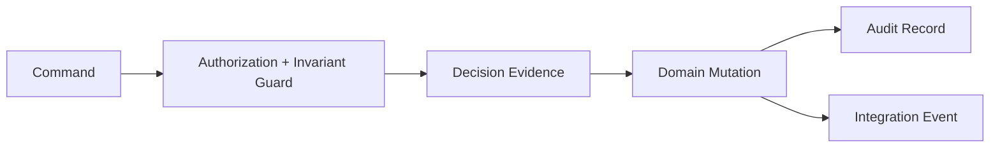
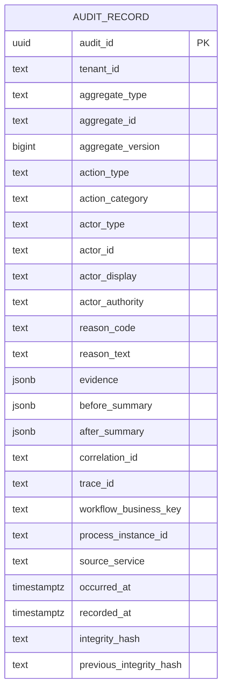
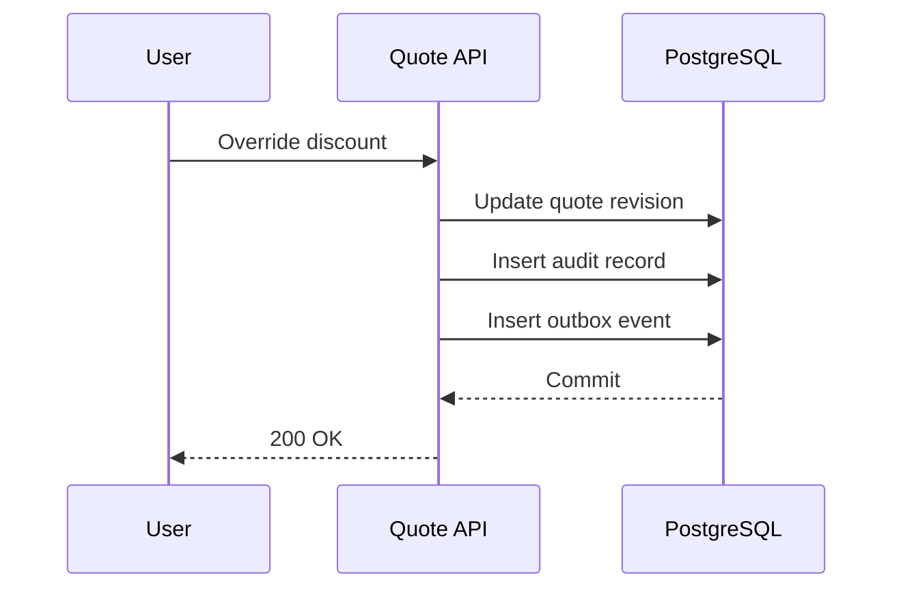
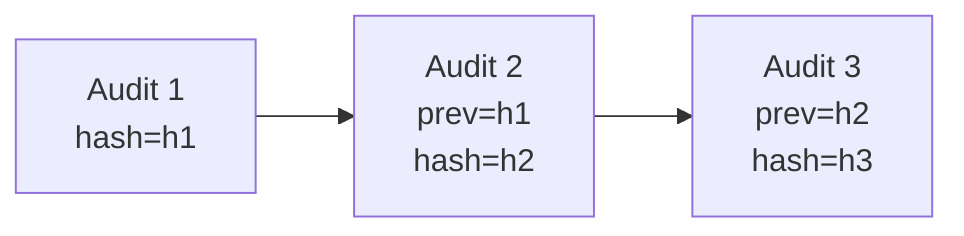
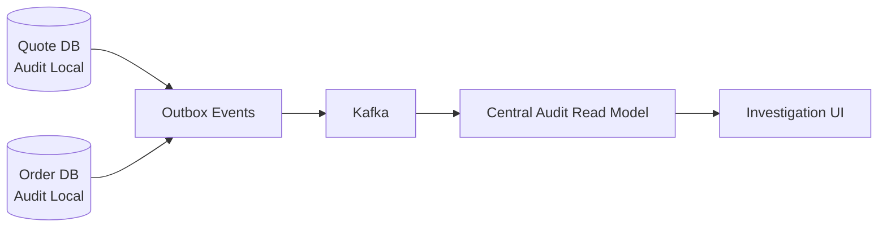
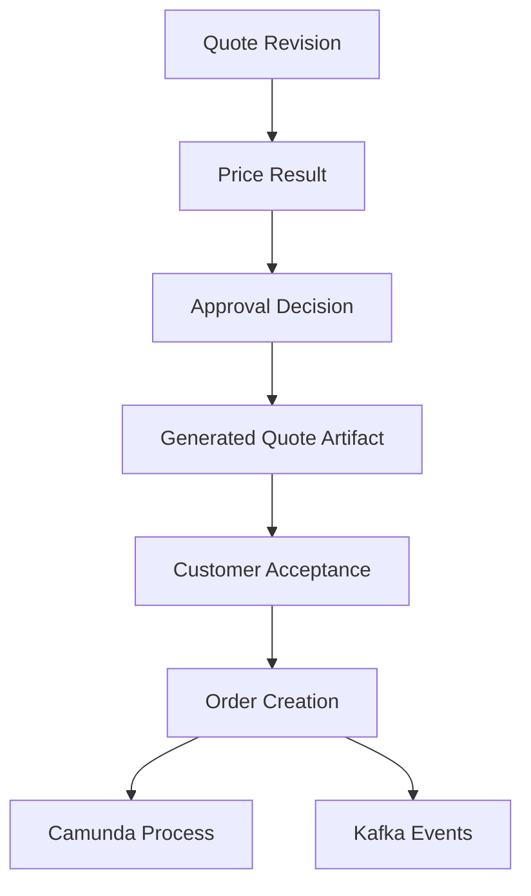

# Part 041 — Audit Trail and Regulatory Defensibility

A CPQ/OMS platform is not only a transaction system.

It is an evidence system.

A customer asks why they received a certain price.

Sales asks who approved a discount.

Finance asks why an order was submitted with a waived fee.

Operations asks who manually retried a failed fulfillment step.

A regulator asks whether the company applied policy consistently.

Legal asks which version of the quote document was accepted.

Security asks whether a privileged user accessed a restricted quote.

If the platform cannot answer those questions, it is not enterprise-grade. It may still process orders, but it cannot defend its own behavior.

Audit is not a log file.

Audit is a structured, durable, queryable explanation of business-relevant actions and decisions.

---

## 1. Core Mental Model

Every important state change should leave behind an answer to five questions:

1. **Who** caused it?
2. **What** changed?
3. **When** did it happen?
4. **Why** was it allowed?
5. **What evidence** was used?

In CPQ/OMS, the fifth question is the difference between a normal CRUD audit and a defensible commercial system.

A quote was not merely changed.

A quote was changed under a specific product catalog version, price book version, approval policy version, actor authority, customer context, and workflow state.



The audit record must be written near the mutation, not reconstructed later from scattered logs.

Logs help debugging.

Audit explains accountability.

---

## 2. What Must Be Audited

Do not audit everything with equal weight.

Audit noise is a real failure mode. If every read, cache miss, background poll, and internal retry is dumped into the same audit table, the audit trail becomes unreadable.

For CPQ/OMS, audit these classes of event.

| Class | Example | Why It Matters |
|---|---|---|
| Commercial mutation | Quote line added, discount changed, price overridden | Changes customer-facing commercial evidence |
| Lifecycle transition | Quote submitted, approved, accepted, order created | Defines legal and operational state |
| Authorization-sensitive action | Manual override, approval, task reassignment | Requires accountability |
| Policy decision | Approval required, discount allowed, eligibility failed | Explains why system allowed/denied action |
| Workflow action | Human task completed, process cancelled, retry triggered | Explains orchestration history |
| Integration handoff | Order submitted to fulfillment, billing handoff sent | Explains cross-system responsibility transfer |
| Manual recovery | Fallout resolved, compensation triggered, order corrected | Highest-risk operational intervention |
| Security event | Unauthorized access attempt, privilege elevation, tenant mismatch | Detects abuse and misconfiguration |
| Artifact event | Quote PDF generated, signed document attached, accepted artifact frozen | Defends customer-facing document history |

The design rule:

> Audit business facts and privileged actions, not implementation chatter.

---

## 3. The Audit Trail Is Not the Event Stream

A common mistake is to say, “Kafka is our audit log.”

Kafka can be part of the evidence chain, but it should not be the primary audit store for CPQ/OMS.

Why?

Kafka events are optimized for integration and consumption.

Audit records are optimized for investigation, accountability, retention, and controlled disclosure.

| Concern | Kafka Event | Audit Record |
|---|---|---|
| Primary purpose | Notify other systems | Preserve evidence |
| Consumer | Other services | Operators, auditors, investigators, support, compliance |
| Retention | Operational/event retention policy | Legal/business retention policy |
| Schema | Integration contract | Evidence contract |
| Query pattern | Stream processing | Investigation and report query |
| Payload | Minimal business fact | Actor, reason, evidence, before/after summary, correlation |
| Mutability | Append-only topic | Append-only audit table/object store |

A `QuoteApproved` Kafka event may say:

```json
{
  "eventType": "QuoteApproved",
  "quoteId": "Q-1001",
  "revision": 3,
  "approvedAt": "2026-07-02T09:20:00Z"
}
```

The audit record should say more:

```json
{
  "auditType": "QUOTE_APPROVED",
  "aggregateType": "QUOTE",
  "aggregateId": "Q-1001",
  "aggregateVersion": 18,
  "quoteRevision": 3,
  "actor": {
    "type": "USER",
    "id": "u-981",
    "displayName": "Senior Sales Manager",
    "tenantId": "tenant-a"
  },
  "reason": "Approved discount within delegated authority",
  "evidence": {
    "discountPercent": 18.5,
    "approvalPolicyVersion": "ap-2026.07.01",
    "priceBookVersion": "pb-2026-q3",
    "approvalTaskId": "camunda-task-771",
    "processInstanceBusinessKey": "quote:Q-1001:rev:3"
  },
  "correlationId": "corr-7d8e",
  "traceId": "0af7651916cd43dd8448eb211c80319c",
  "createdAt": "2026-07-02T09:20:01Z"
}
```

The event says what other systems need to react to.

The audit record explains why the platform was allowed to do it.

---

## 4. Audit Record Contract

An audit record should be boring.

Boring is good.

Boring means the schema is stable, queryable, and repeatable.

A practical audit record has this shape:



Important fields:

| Field | Meaning |
|---|---|
| `tenant_id` | Investigation and authorization boundary |
| `aggregate_type` / `aggregate_id` | Business object being affected |
| `aggregate_version` | Optimistic version after mutation or relevant version at decision time |
| `action_type` | Specific action, for example `QUOTE_PRICE_OVERRIDDEN` |
| `action_category` | Higher-level class: `COMMERCIAL_MUTATION`, `SECURITY`, `WORKFLOW`, `RECOVERY` |
| `actor_type` | `USER`, `SERVICE`, `SYSTEM`, `WORKER`, `EXTERNAL_SYSTEM` |
| `actor_authority` | What authority allowed action: role, policy grant, delegation, service credential |
| `reason_code` | Machine-queryable reason |
| `reason_text` | Human explanation, controlled but readable |
| `evidence` | Versioned facts used to make/allow decision |
| `before_summary` | Minimal before-state snapshot; not necessarily full object |
| `after_summary` | Minimal after-state snapshot |
| `correlation_id` | Request/business correlation |
| `trace_id` | Distributed trace correlation |
| `workflow_business_key` | Camunda business key when relevant |
| `process_instance_id` | Camunda process instance id when relevant |
| `integrity_hash` | Tamper-evidence helper, not magic security |

The audit record does not need to duplicate the entire domain object.

It needs enough evidence to explain the action without requiring fragile reconstruction from current state.

---

## 5. Append-Only as an Invariant

Audit records should be append-only.

No update.

No delete.

No “fix typo in old audit row.”

If correction is needed, append a correction record.



The audit record and business mutation should commit in the same database transaction when they belong to the same service boundary.

If the quote state changes but the audit record fails to write, the transaction should fail.

If the audit record writes but the quote mutation fails, the transaction should fail.

Partial evidence is worse than no evidence because it creates false confidence.

---

## 6. PostgreSQL Design

A simple baseline table:

```sql
create table audit_record (
  audit_id uuid primary key,
  tenant_id text not null,
  aggregate_type text not null,
  aggregate_id text not null,
  aggregate_version bigint,
  action_type text not null,
  action_category text not null,
  actor_type text not null,
  actor_id text not null,
  actor_display text,
  actor_authority text,
  reason_code text,
  reason_text text,
  evidence jsonb not null default '{}'::jsonb,
  before_summary jsonb,
  after_summary jsonb,
  correlation_id text,
  trace_id text,
  workflow_business_key text,
  process_instance_id text,
  source_service text not null,
  occurred_at timestamptz not null,
  recorded_at timestamptz not null default now(),
  previous_integrity_hash text,
  integrity_hash text
);

create index idx_audit_aggregate
  on audit_record (tenant_id, aggregate_type, aggregate_id, occurred_at desc);

create index idx_audit_action
  on audit_record (tenant_id, action_type, occurred_at desc);

create index idx_audit_actor
  on audit_record (tenant_id, actor_id, occurred_at desc);

create index idx_audit_correlation
  on audit_record (correlation_id);

create index idx_audit_workflow
  on audit_record (workflow_business_key);
```

Use JSONB for evidence carefully.

Good use of JSONB:

```json
{
  "priceBookVersion": "pb-2026-q3",
  "approvalPolicyVersion": "ap-2026.07.01",
  "discountPercent": 18.5,
  "maxDelegatedDiscountPercent": 20,
  "approvalDecisionId": "ad-771"
}
```

Bad use of JSONB:

```json
{
  "entireQuote": { "...": "huge object copied blindly" }
}
```

Do not turn the audit table into a warehouse of random object dumps.

Audit evidence should be intentional.

---

## 7. Tamper-Evidence Without Fantasy

An integrity hash can make tampering more detectable.

It does not make the system tamper-proof.

A practical approach:

```text
integrity_hash = sha256(
  tenant_id + aggregate_type + aggregate_id + action_type + actor_id + occurred_at + canonical_json(evidence) + previous_integrity_hash
)
```

This creates a hash chain per aggregate or per tenant/action stream.



If someone modifies a historical row, later hashes no longer match.

But the database administrator could still rewrite all hashes unless additional controls exist.

Stronger controls include:

- write-once object storage export;
- database permissions that prevent application-level delete/update;
- periodic hash anchor stored outside the primary database;
- backup and restore validation;
- access audit for privileged database users;
- separation of duty between application operators and audit storage administrators.

The engineering conclusion:

> Integrity hash is a detection mechanism. Governance and storage controls are the protection mechanism.

---

## 8. Actor Model

A weak audit trail says:

```text
updated_by = system
```

That is almost useless.

A defensible actor model distinguishes:

| Actor Type | Example | Audit Meaning |
|---|---|---|
| `USER` | Sales rep, approver, case worker | Human accountability |
| `SERVICE` | Quote Service, Order Service | Service-level responsibility |
| `WORKER` | Camunda external task worker | Automated workflow execution |
| `SYSTEM` | Scheduled reconciliation job | Platform-controlled automation |
| `EXTERNAL_SYSTEM` | CRM, billing, inventory | Outside-system signal |
| `SUPPORT_IMPERSONATION` | Support user acting as customer | High-risk delegated action |

For user actions, store:

- stable user id;
- tenant id;
- display name at time of action;
- role/authority at time of action;
- delegation context if applicable;
- impersonation context if applicable;
- request source if useful: UI, API client, admin console.

Do not rely on current identity state to explain past action.

A user may leave the company.

A role may be renamed.

A delegation may expire.

The audit record must preserve the relevant authority snapshot.

---

## 9. Commercial Decision Trace

Commercial defensibility depends on decision trace.

For CPQ, this means the platform can answer:

- Which product catalog version was used?
- Which price book version was used?
- Which promotion rules were applied?
- Which discount rules were applied?
- Which manual overrides occurred?
- Which approval policy version was evaluated?
- Which approver had authority?
- What quote document was generated?
- What exact quote revision was accepted?

A price override audit record should not just say:

```text
Discount changed from 10% to 18%.
```

It should say:

```json
{
  "oldDiscountPercent": 10,
  "newDiscountPercent": 18,
  "overrideReasonCode": "STRATEGIC_ACCOUNT_RETENTION",
  "priceBookVersion": "pb-2026-q3",
  "manualOverridePolicyVersion": "mop-2026.07",
  "requiresApproval": true,
  "approvalRequirementId": "ar-991",
  "enteredBy": "u-sales-12"
}
```

An approval audit record should then say:

```json
{
  "approvalRequirementId": "ar-991",
  "approvalPolicyVersion": "ap-2026.07",
  "approverAuthority": "REGION_MANAGER_MAX_20_PERCENT",
  "quoteRevision": 4,
  "priceResultHash": "sha256:...",
  "approvedDiscountPercent": 18
}
```

This creates a chain:


The audit trail should make that chain explicit.

---

## 10. Workflow Audit Boundary

Camunda 7 history is valuable.

It records workflow-level facts: process instance, activity lifecycle, task lifecycle, variable changes depending on history configuration, user operations, and related execution data.

But Camunda history is not your complete business audit.

Why?

Because Camunda does not know the full domain meaning of quote price, approval authority, commercial evidence, tenant policy, product catalog version, or legal artifact acceptance unless you explicitly model and persist those facts.

Use Camunda history for workflow truth.

Use domain audit for business truth.

Correlate them.

| Domain Audit Field | Camunda Field |
|---|---|
| `workflow_business_key` | Process business key |
| `process_instance_id` | Process instance id |
| `task_id` inside evidence | User task id |
| `activity_id` inside evidence | BPMN activity id |
| `process_definition_key` inside evidence | BPMN process definition key |
| `process_definition_version` inside evidence | BPMN deployed version |

A quote approval task completion should produce a domain audit record like:

```json
{
  "actionType": "QUOTE_APPROVAL_TASK_COMPLETED",
  "aggregateType": "QUOTE",
  "aggregateId": "Q-1001",
  "actorType": "USER",
  "actorId": "u-981",
  "evidence": {
    "taskId": "cam-task-123",
    "processInstanceId": "proc-456",
    "businessKey": "quote:Q-1001:rev:4",
    "taskDefinitionKey": "approveDiscount",
    "decision": "APPROVED",
    "approvalDecisionId": "ad-991"
  }
}
```

Do not make auditors query raw Camunda tables to understand business events.

Build a business audit surface.

---

## 11. Audit Service: Shared Library or Dedicated Service?

There are two common patterns.

### Pattern A — Local Audit Table Per Service

Each service writes audit records to its own database.

Pros:

- same transaction as domain mutation;
- strong service autonomy;
- no synchronous dependency on central audit service;
- clean ownership.

Cons:

- cross-service audit timeline requires aggregation;
- retention policy coordination is harder;
- audit search needs projection/warehouse.

### Pattern B — Central Audit Service

Services call a central audit service.

Pros:

- single query surface;
- unified schema;
- centralized retention/security.

Cons:

- dangerous synchronous dependency;
- hard to keep audit write atomic with domain mutation;
- high blast radius;
- central service may become dumping ground.

The production-grade compromise:

1. Write critical audit records locally in the same transaction as the domain mutation.
2. Publish audit events through outbox.
3. Project them into a central audit search/read service.



The local database owns truth.

The central audit read model owns investigation convenience.

---

## 12. JAX-RS Boundary

Audit starts at the request boundary.

A JAX-RS filter should establish request context:

- correlation id;
- trace id;
- tenant id;
- actor id;
- actor type;
- actor authority snapshot;
- source application;
- client id;
- request id.

But the filter should not write business audit by itself.

The filter does not know whether the command succeeded, whether a guard passed, what state changed, or what decision evidence was used.

The domain command handler writes audit after the business decision.

```java
public QuoteApprovalResult approveQuote(ApproveQuoteCommand command, RequestContext ctx) {
    Quote quote = quoteRepository.loadForUpdate(command.quoteId());

    ApprovalDecision decision = approvalPolicy.evaluate(quote, ctx.actor());

    quote.approve(decision);

    auditRepository.append(AuditRecord.quoteApproved(
        quote,
        ctx.actor(),
        decision,
        ctx.correlationId(),
        ctx.traceId()
    ));

    outboxRepository.append(QuoteEvents.approved(quote));

    return QuoteApprovalResult.from(quote);
}
```

The service boundary captures context.

The domain command captures meaning.

---

## 13. Before/After Summary Discipline

Before/after values are useful, but dangerous.

Do not blindly store entire object snapshots in every audit row.

Instead, store summaries that answer investigation questions.

For a quote discount override:

```json
{
  "beforeSummary": {
    "lineId": "QL-1",
    "discountPercent": 10,
    "netAmount": "900.00 USD",
    "approvalStatus": "NOT_REQUIRED"
  },
  "afterSummary": {
    "lineId": "QL-1",
    "discountPercent": 18,
    "netAmount": "820.00 USD",
    "approvalStatus": "REQUIRED"
  }
}
```

For order fallout resolution:

```json
{
  "beforeSummary": {
    "falloutStatus": "OPEN",
    "orderLineStatus": "FULFILLMENT_BLOCKED"
  },
  "afterSummary": {
    "falloutStatus": "RESOLVED",
    "orderLineStatus": "FULFILLMENT_RETRY_REQUESTED"
  }
}
```

Before/after summaries should be:

- small;
- intentional;
- stable;
- non-sensitive where possible;
- enough to explain decision impact.

---

## 14. Sensitive Data and Audit

Audit can become a privacy and security problem.

Never assume “audit means store everything forever.”

Do not store raw secrets, tokens, full payment card data, session cookies, passwords, or private keys in audit.

Be careful with:

- customer personal data;
- tax identifiers;
- contract documents;
- payment references;
- internal comments;
- support notes;
- attachments;
- external system payloads.

Practical rules:

1. Store references to sensitive artifacts, not the artifact content.
2. Store stable identifiers and hashes when possible.
3. Redact free-text fields before audit if they can contain sensitive data.
4. Keep audit access separate from normal business access.
5. Log every audit-read operation for sensitive investigations.
6. Apply retention and legal hold deliberately.

Audit data is high-value data.

Protect it like production data, not like debug logs.

---

## 15. Audit Query Surfaces

A good audit design includes query use cases from the start.

### Quote Timeline

Question:

> What happened to quote Q-1001 from creation to acceptance?

Query:

```sql
select *
from audit_record
where tenant_id = :tenantId
  and aggregate_type = 'QUOTE'
  and aggregate_id = :quoteId
order by occurred_at asc;
```

### User Activity

Question:

> What privileged actions did this approver perform last week?

```sql
select *
from audit_record
where tenant_id = :tenantId
  and actor_id = :actorId
  and action_category in ('APPROVAL', 'RECOVERY', 'SECURITY')
  and occurred_at >= :from
  and occurred_at < :to
order by occurred_at desc;
```

### Policy Decision Investigation

Question:

> Which quotes were approved under policy version ap-2026.07?

```sql
select *
from audit_record
where tenant_id = :tenantId
  and action_type = 'QUOTE_APPROVED'
  and evidence ->> 'approvalPolicyVersion' = 'ap-2026.07'
order by occurred_at desc;
```

### Fallout Recovery Investigation

Question:

> Which orders were manually recovered by support?

```sql
select *
from audit_record
where tenant_id = :tenantId
  and action_category = 'RECOVERY'
  and actor_type = 'USER'
order by occurred_at desc;
```

If a critical question cannot be answered with reasonable effort, the audit model is incomplete.

---

## 16. Regulatory Defensibility Checklist

A CPQ/OMS action is defensible when the platform can prove:

- the actor was authenticated;
- the actor had authority;
- the command was valid for the lifecycle state;
- the relevant policy version was known;
- the relevant product/catalog/price versions were known;
- the decision evidence was persisted;
- the state mutation and audit record committed together;
- the workflow action is correlated;
- integration handoff is traceable;
- manual recovery is visible;
- sensitive data is protected;
- historical evidence does not rely on mutable current state.

For a quote acceptance, the audit trail should connect:



If that chain breaks, investigation becomes guesswork.

---

## 17. Anti-Patterns

### Anti-Pattern 1 — `created_by` and `updated_by` as Audit

Useful metadata, but not an audit trail.

It cannot explain why a discount was allowed, which approval policy applied, or what evidence was used.

### Anti-Pattern 2 — Logs as Audit

Logs are operational.

They may be sampled, rotated, redacted, reformatted, lost, or stored with different retention rules.

Audit must be intentional evidence.

### Anti-Pattern 3 — Current-State Reconstruction

Do not say:

> We can inspect the current quote and infer what happened.

Current state lies by omission.

It does not show failed attempts, rejected approvals, overwritten values, stale policy, or manual recovery.

### Anti-Pattern 4 — Camunda History as Complete Business Audit

Camunda history explains process execution.

It does not automatically explain business semantics.

Correlate it with domain audit.

### Anti-Pattern 5 — Audit as Unbounded JSON Dump

Dumping full request/response payloads into audit creates privacy risk, storage bloat, and weak semantics.

Store evidence, not garbage.

### Anti-Pattern 6 — Central Audit Service in the Critical Path

If every command must synchronously call a central audit service, audit availability can block the whole platform.

Prefer local transactional audit plus asynchronous central projection.

---

## 18. Production Readiness Questions

Before go-live, ask:

1. Can we reconstruct a quote approval chain without reading application logs?
2. Can we prove which price book and approval policy were used?
3. Can we identify all manual overrides by actor and tenant?
4. Can we distinguish human, service, system, worker, and external actors?
5. Can we correlate domain audit with Camunda process instances?
6. Can we correlate audit with Kafka events and outbox records?
7. Can we detect tampering or missing audit chains?
8. Can we query audit without exposing sensitive data broadly?
9. Can we retain audit records according to business/legal requirements?
10. Can we explain why a command was rejected, not only why it succeeded?

If the answer is no, the system is not yet defensible.

---

## 19. The Design Standard

For this series, the rule is:

> Every lifecycle-changing command must produce an audit record that explains actor, authority, decision evidence, state impact, correlation, and workflow context.

This is not bureaucracy.

It is engineering discipline.

In small systems, correctness is often tested by the immediate response.

In enterprise systems, correctness is also tested months later by someone asking:

> Why did the system do this?

A top-tier CPQ/OMS platform can answer.

---

## References

- OWASP Logging Cheat Sheet: https://cheatsheetseries.owasp.org/cheatsheets/Logging_Cheat_Sheet.html
- OWASP Top 10 2021 A09 Security Logging and Monitoring Failures: https://owasp.org/Top10/2021/A09_2021-Security_Logging_and_Monitoring_Failures/
- Camunda 7 HistoryEvent Javadocs: https://docs.camunda.org/javadoc/camunda-bpm-platform/7.15/org/camunda/bpm/engine/impl/history/event/HistoryEvent.html
- Camunda 7 UserOperationLogEntry Javadocs: https://docs.camunda.org/javadoc/camunda-bpm-platform/7.3/org/camunda/bpm/engine/history/UserOperationLogEntry.html
