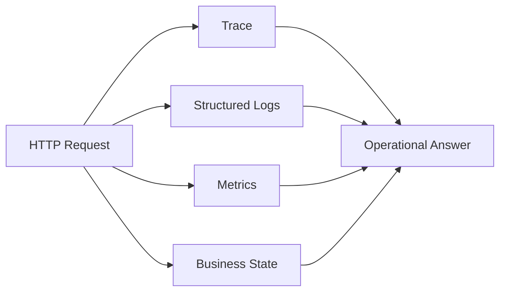
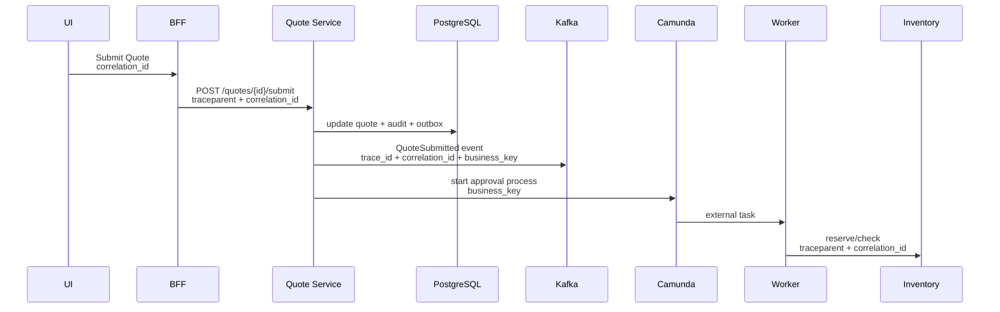
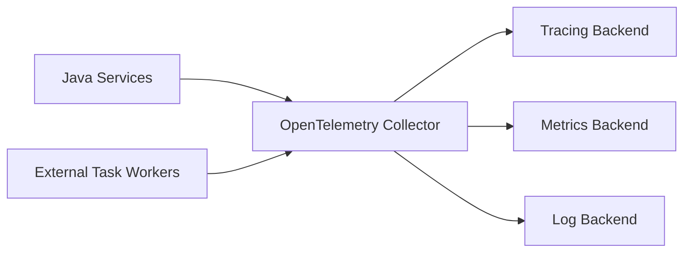
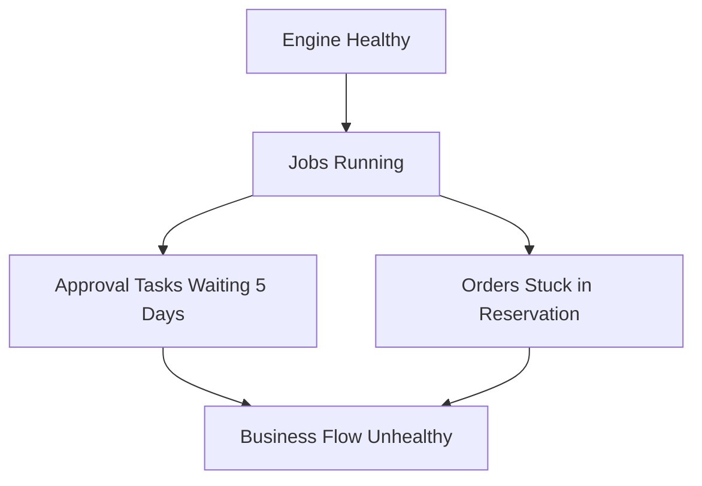

# Part 042 — Observability: Logs, Metrics, Traces

A CPQ/OMS platform can fail in many ways.

The price engine is slow.

The quote API times out.

A Kafka consumer lags.

A Camunda external task worker retries forever.

A downstream inventory system accepts a reservation but never sends a callback.

A customer sees stale catalog data.

A quote is approved but order creation does not happen.

The database is healthy, but the business process is stuck.

Observability is the difference between guessing and knowing.

But enterprise observability is not just “add logs.”

It is the ability to ask a business/technical question and follow the answer across HTTP, Java services, PostgreSQL transactions, Kafka messages, Redis cache, Camunda workflow, external task workers, and downstream systems.

---

## 1. Core Mental Model

Observability has three classic signals:

- logs;
- metrics;
- traces.

For CPQ/OMS, add a fourth dimension:

- **business state**.

A trace can show that `POST /quotes/{id}/submit` took 700 ms.

A metric can show quote submission latency p95.

A log can show a validation failure.

But the operator still needs to know:

- Which quote?
- Which revision?
- Which tenant?
- Which process instance?
- Which order?
- Which Kafka event?
- Which external fulfillment step?
- Was the business outcome successful, pending, rejected, or unknown?



If telemetry cannot be joined to business identity, it is only half useful.

---

## 2. The Four IDs You Must Carry

A production CPQ/OMS platform should consistently propagate these identifiers.

| Identifier | Purpose | Example |
|---|---|---|
| `trace_id` | Distributed tracing identity | `0af7651916cd43dd8448eb211c80319c` |
| `correlation_id` | User/business operation correlation | `corr-quote-submit-7d8e` |
| `business_key` | Workflow/domain lifecycle identity | `quote:Q-1001:rev:4` |
| `aggregate_id` | Domain object identity | `quoteId=Q-1001`, `orderId=O-991` |

Do not collapse them into one field.

They answer different questions.

`trace_id` answers:

> Which technical calls were part of this request path?

`correlation_id` answers:

> Which logs/events belong to the same user or command operation?

`business_key` answers:

> Which long-running business process does this belong to?

`aggregate_id` answers:

> Which domain object changed?

A synchronous HTTP request may have one trace.

A long-running order workflow may span many traces over several days.

That is why Camunda business key and domain aggregate id matter.

---

## 3. Propagation Map

A clean propagation model looks like this:



Each boundary needs propagation rules:

| Boundary | Propagate |
|---|---|
| HTTP inbound | `traceparent`, `correlation_id`, actor, tenant |
| HTTP outbound | `traceparent`, `correlation_id`, tenant-safe headers |
| Kafka event | `trace_id`, `correlation_id`, aggregate id, event id, causation id |
| PostgreSQL audit | `trace_id`, `correlation_id`, aggregate id, workflow key |
| Camunda process | business key, domain ids, minimal variables |
| Redis key/value | avoid storing trace as authority; use trace for logs only |
| External task worker | fetch task, create new span, log process/task ids |

The aim is not to put every context value everywhere.

The aim is to make every diagnostic path joinable.

---

## 4. Logs: Structured, Sparse, Useful

A log line should be a small event with context.

Bad log:

```text
Error processing request
```

Better log:

```json
{
  "level": "ERROR",
  "message": "quote submission failed",
  "service": "quote-service",
  "tenantId": "tenant-a",
  "quoteId": "Q-1001",
  "quoteRevision": 4,
  "actorId": "u-771",
  "correlationId": "corr-7d8e",
  "traceId": "0af7651916cd43dd8448eb211c80319c",
  "errorCode": "QUOTE_STALE_PRICE",
  "lifecycleState": "PRICED",
  "command": "SubmitQuote",
  "retryable": false
}
```

Use structured logs.

Use stable field names.

Use domain language.

Do not log secrets.

Do not log full payloads by default.

Do not log the same failure ten times in the same call stack.

### Recommended Log Event Classes

| Class | Example |
|---|---|
| Command accepted | `quote.submit.command.accepted` |
| Command rejected | `quote.submit.command.rejected` |
| Domain transition | `quote.lifecycle.transitioned` |
| External call | `inventory.reservation.requested` |
| External result | `inventory.reservation.accepted` |
| Unknown outcome | `inventory.reservation.outcome_unknown` |
| Workflow action | `camunda.external_task.completed` |
| Retry exhausted | `fulfillment.retry_exhausted` |
| Fallout opened | `fallout.case.opened` |
| Security denial | `authorization.denied` |

The log event name should be stable enough to use in dashboards and alerts.

---

## 5. Metrics: Measure Systems and Business Flow

Metrics are for trends, alerts, and SLOs.

A metric should be cheap to aggregate and safe to store at high volume.

### Technical Metrics

| Metric | Type | Labels |
|---|---|---|
| `http_server_request_duration_seconds` | histogram | service, method, route, status |
| `db_transaction_duration_seconds` | histogram | service, operation |
| `kafka_consumer_lag` | gauge | consumer_group, topic, partition |
| `redis_operation_duration_seconds` | histogram | service, operation |
| `camunda_external_task_duration_seconds` | histogram | topic, worker |
| `camunda_external_task_failures_total` | counter | topic, error_code |

### Business Metrics

| Metric | Type | Labels |
|---|---|---|
| `quote_created_total` | counter | tenant_segment, channel |
| `quote_submitted_total` | counter | tenant_segment, channel |
| `quote_approval_required_total` | counter | policy_version, reason_code |
| `quote_approved_total` | counter | approval_level |
| `quote_rejected_total` | counter | reason_code |
| `order_created_total` | counter | order_type |
| `order_fallout_open_total` | counter | fallout_type |
| `order_fulfillment_duration_seconds` | histogram | product_family |
| `manual_recovery_total` | counter | recovery_action |

### Avoid High-Cardinality Labels

Do not use these as metric labels:

- quote id;
- order id;
- user id;
- customer id;
- process instance id;
- full error message;
- raw product SKU if cardinality is large;
- tenant id if there are many tenants and the backend cannot handle it.

Put high-cardinality identifiers in logs and traces.

Put low-cardinality dimensions in metrics.

This one rule prevents many observability backends from becoming expensive and slow.

---

## 6. Traces: Follow Causality Across Boundaries

A trace tells the story of a request path.

For CPQ/OMS, trace spans should map to meaningful operations.

Example span tree:

```text
POST /quotes/{quoteId}/submit
  QuoteResource.submitQuote
    QuoteApplicationService.submit
      QuoteRepository.load
      PricingFreshnessChecker.verify
      ApprovalPolicy.evaluate
      QuoteRepository.save
      AuditRepository.append
      OutboxRepository.append
    CamundaRuntime.startProcessInstanceByKey
```

For an external task worker:

```text
camunda.external_task.fulfillment.reserve_inventory
  OrderRepository.load
  InventoryClient.reserve
  OrderRepository.markReservationRequested
  AuditRepository.append
  OutboxRepository.append
```

Good span names are neither too generic nor too specific.

Bad:

```text
process
```

Too specific:

```text
process quote Q-1001 revision 4 for tenant-a
```

Good:

```text
QuoteApplicationService.submit
```

Use span attributes for identifiers:

```text
cpq.quote_id=Q-1001
cpq.quote_revision=4
cpq.tenant_segment=enterprise
workflow.business_key=quote:Q-1001:rev:4
camunda.process_definition_key=quote-approval
```

Do not put sensitive data in trace attributes.

---

## 7. OpenTelemetry Positioning

OpenTelemetry should be treated as the instrumentation standard layer.

The application emits telemetry through OpenTelemetry APIs/SDKs/instrumentation.

The collector receives, processes, and exports telemetry to the chosen backend.



Do not couple domain code directly to a vendor backend.

Vendor-neutral instrumentation gives you leverage.

The implementation detail may change.

The semantic model should not.

---

## 8. W3C Trace Context

For HTTP boundaries, propagate W3C Trace Context headers:

```text
traceparent: 00-0af7651916cd43dd8448eb211c80319c-b7ad6b7169203331-01
tracestate: vendor-specific-state
```

`traceparent` carries portable trace identity.

`tracestate` carries vendor-specific state.

Add a separate correlation id header, for example:

```text
x-correlation-id: corr-7d8e
```

Do not use correlation id as a replacement for trace context.

Correlation id is business/debug grouping.

Trace context is distributed tracing identity.

---

## 9. JAX-RS/Jersey Instrumentation Pattern

Use a request filter to establish context.

```java
@Provider
public class RequestContextFilter implements ContainerRequestFilter, ContainerResponseFilter {
    @Override
    public void filter(ContainerRequestContext request) {
        String correlationId = getOrCreateCorrelationId(request);
        String tenantId = resolveTenant(request);
        Actor actor = resolveActor(request);

        RequestContextHolder.set(new RequestContext(
            correlationId,
            tenantId,
            actor
        ));

        MDC.put("correlationId", correlationId);
        MDC.put("tenantId", tenantId);
        MDC.put("actorId", actor.id());
    }

    @Override
    public void filter(ContainerRequestContext request, ContainerResponseContext response) {
        response.getHeaders().putSingle("x-correlation-id", RequestContextHolder.current().correlationId());
        MDC.clear();
        RequestContextHolder.clear();
    }
}
```

This filter should not decide business observability.

It only creates the request context.

Command handlers and workflow workers should add domain-specific events and span attributes.

---

## 10. Kafka Observability

Kafka breaks synchronous trace continuity unless you deliberately propagate context.

Each event should include or carry headers for:

- event id;
- event type;
- aggregate type;
- aggregate id;
- aggregate version;
- causation id;
- correlation id;
- trace id or trace context;
- producer service;
- schema version;
- occurred at.

Example Kafka headers:

```text
event_id=evt-991
event_type=QuoteAccepted
aggregate_type=QUOTE
aggregate_id=Q-1001
correlation_id=corr-7d8e
traceparent=00-0af7651916cd43dd8448eb211c80319c-b7ad6b7169203331-01
producer_service=quote-service
schema_version=1.2.0
```

Consumer logs should include:

- topic;
- partition;
- offset;
- consumer group;
- event id;
- aggregate id;
- correlation id;
- processing result;
- retry count;
- dead-letter status.

Kafka observability must answer:

1. Was the event produced?
2. Was the event visible in the topic?
3. Did the intended consumer read it?
4. Did the consumer process it?
5. Did processing mutate local state?
6. Did the consumer publish follow-up events?
7. If it failed, where is the failure parked?

---

## 11. Camunda 7 Observability

Camunda observability has two layers.

### Engine/Technical Layer

Track:

- job executor health;
- failed jobs;
- incident count;
- external task lock duration;
- external task retries;
- external task failures;
- process instance count;
- history cleanup;
- database query latency;
- process deployment version.

### Business Process Layer

Track:

- quote approvals waiting by age;
- approval SLA breach count;
- orders stuck in fulfillment by step;
- fallout cases opened by type;
- process instances with unknown external outcome;
- compensation required count;
- manual recovery actions;
- average quote approval time;
- average order fulfillment time.

Do not stop at engine metrics.

A Camunda engine can be technically healthy while the business is stuck.



The business dashboard must not rely only on process-engine health.

---

## 12. PostgreSQL Observability

For CPQ/OMS, database observability should cover:

- connection pool usage;
- query latency by operation;
- transaction duration;
- lock waits;
- deadlocks;
- row update conflicts;
- optimistic lock failures;
- migration duration;
- table/index growth;
- outbox backlog;
- audit table growth;
- projection lag;
- slow queries for search/reporting.

Domain-specific database metrics matter:

| Metric | Meaning |
|---|---|
| `outbox_pending_records` | Event publication backlog |
| `idempotency_conflict_total` | Duplicate or conflicting command attempts |
| `quote_optimistic_lock_failure_total` | Concurrent quote edit pressure |
| `audit_append_failure_total` | Critical audit health issue |
| `projection_lag_seconds` | Read model freshness |

If `outbox_pending_records` grows, the system may still accept commands but downstream systems are becoming stale.

If `projection_lag_seconds` grows, the UI may show old state.

If `audit_append_failure_total` is nonzero, treat it as severe.

---

## 13. Redis Observability

Redis observability in this platform should answer:

- Are hot keys forming?
- Are cache hit rates healthy?
- Are keys evicted unexpectedly?
- Are TTLs missing?
- Is memory pressure rising?
- Are lock-like keys expiring too late or too early?
- Are rate-limit keys exploding in cardinality?
- Are stale catalog/price caches being invalidated?

Useful metrics:

| Metric | Meaning |
|---|---|
| `redis_cache_hit_ratio` | Cache effectiveness |
| `redis_operation_duration_seconds` | Redis latency |
| `redis_key_evictions_total` | Memory pressure / policy effect |
| `catalog_cache_stale_served_total` | Intentional stale read served |
| `price_preview_cache_miss_total` | Pricing preview recomputation pressure |
| `idempotency_fast_path_hit_total` | Duplicate command short-circuit |

The important CPQ-specific rule:

> Redis health is not business correctness. Redis only accelerates or protects. PostgreSQL remains the authority.

---

## 14. Dashboards by Question

Do not build dashboards by technology only.

Build dashboards by question.

### Quote Conversion Dashboard

Answers:

- Are quotes moving through lifecycle?
- Where are they stuck?
- Is pricing slow?
- Are approvals delayed?
- Are documents generating successfully?

Signals:

- quote created/submitted/approved/accepted counts;
- pricing duration histogram;
- approval waiting age;
- quote document generation failures;
- quote rejection reason distribution.

### Order Fulfillment Dashboard

Answers:

- Are orders being created and fulfilled?
- Which fulfillment steps are failing?
- Are external systems slow or unreliable?
- Is compensation increasing?

Signals:

- order created count;
- order fulfillment duration;
- fulfillment step failure count;
- unknown outcome count;
- fallout open count;
- external API latency/error rate.

### Workflow Health Dashboard

Answers:

- Are Camunda jobs failing?
- Are external tasks locked too long?
- Are incidents increasing?
- Are approvals breaching SLA?

Signals:

- failed jobs;
- incidents;
- external task failure count;
- task age histogram;
- process instance age by process definition.

### Integration Event Dashboard

Answers:

- Is outbox draining?
- Are Kafka consumers keeping up?
- Are events being dead-lettered?
- Are projections stale?

Signals:

- outbox pending count;
- event publish latency;
- consumer lag;
- DLQ count;
- projection lag.

---

## 15. Alerting Rules

Alert on user/business impact, not just CPU.

Examples:

| Alert | Severity | Meaning |
|---|---|---|
| Quote submit error rate above threshold | High | Customers/sales cannot progress quotes |
| Pricing p95 above SLO | High | CPQ UX degraded |
| Audit append failures | Critical | Defensibility broken |
| Outbox pending age above threshold | High | Downstream systems stale |
| Order fallout spike | High | Fulfillment reliability issue |
| Unknown outcome count rising | Critical | External consistency risk |
| Approval task SLA breach | Medium/High | Revenue workflow blocked |
| Kafka DLQ nonzero for critical event | High | Integration processing failure |
| Camunda incident count rising | High | Workflow execution failure |
| Projection lag above stale-data budget | Medium | UI/search may mislead users |

Avoid alert spam.

Each alert should have:

- owner;
- runbook link;
- severity;
- business impact statement;
- first diagnostic query;
- escalation rule.

An alert without an action is noise.

---

## 16. SLO Thinking

A CPQ/OMS SLO should express user/business expectations.

Examples:

| Capability | SLO Candidate |
|---|---|
| Create quote | 99.9% successful under valid input within 1s |
| Price quote | 99% completed within 2s for standard catalog size |
| Submit quote | 99.9% accepted/rejected deterministically within 1s |
| Approval task visibility | 99% visible in worklist within 10s after submission |
| Accept quote | 99.9% creates exactly one order intent or deterministic rejection |
| Order event publication | 99.9% critical events published within 30s of DB commit |
| Projection freshness | 99% read model lag below 15s |
| Audit append | 100% for lifecycle-changing successful commands |

Be careful with 100% SLOs.

Use them only for invariants where failure should stop the command, such as audit append for lifecycle-changing actions.

---

## 17. Runbook-Oriented Observability

When an operator gets an alert, the telemetry should support a path.

Example: `QuoteAccepted event published but order not created`.

Runbook path:

1. Search logs by `correlation_id`.
2. Find quote acceptance audit record.
3. Verify outbox record for `QuoteAccepted`.
4. Verify Kafka topic/partition/offset.
5. Check order consumer lag.
6. Check inbox/idempotency record in Order Service.
7. Check order creation transaction result.
8. Check Camunda process start command.
9. Check fallout case or DLQ.
10. Execute reconciliation if needed.

The telemetry model should make each step possible.

If step 4 and step 5 cannot be connected, Kafka observability is incomplete.

If step 8 cannot be connected to order id/business key, workflow observability is incomplete.

---

## 18. Anti-Patterns

### Anti-Pattern 1 — Logging Full Payloads

This leaks sensitive data and creates noise.

Log identifiers, outcome, reason code, and safe summaries.

### Anti-Pattern 2 — Metrics With High-Cardinality Labels

`quote_id` as a metric label will eventually hurt the metrics backend.

Use logs/traces for high-cardinality investigation.

### Anti-Pattern 3 — Only Technical Dashboards

CPU, memory, and HTTP 500s are necessary but insufficient.

You also need quote/order/workflow health.

### Anti-Pattern 4 — No Correlation Across Async Boundaries

If Kafka messages and Camunda tasks cannot be correlated to the original command, investigation becomes archaeology.

### Anti-Pattern 5 — Treating Traces as Audit

Traces are not durable business evidence.

Use audit for accountability.

Use traces for diagnostics.

### Anti-Pattern 6 — No Runbooks

Dashboards without runbooks produce anxiety, not operations.

Every critical alert needs a next action.

---

## 19. Production Readiness Checklist

Before go-live, verify:

- every inbound request gets or propagates a correlation id;
- W3C trace context is propagated across HTTP boundaries;
- Kafka events carry correlation/causation/event identifiers;
- Camunda process instances use meaningful business keys;
- external task logs include task id, topic, process instance id, business key, and retry count;
- audit records include trace/correlation/business identifiers;
- logs are structured and redacted;
- metrics avoid high-cardinality labels;
- dashboards answer business questions;
- alerts have owners and runbooks;
- outbox, inbox, DLQ, projection lag, and fallout are visible;
- observability works in failure drills, not only in happy-path demos.

---

## 20. The Design Standard

For this series, the observability rule is:

> Every important business operation must be traceable from HTTP request to domain mutation, audit record, outbox event, Kafka processing, Camunda workflow, external task execution, downstream handoff, and final business state.

This does not mean every operation is synchronous.

It means every operation is explainable.

In a small app, observability helps developers debug.

In an enterprise CPQ/OMS platform, observability helps the organization operate, recover, defend, and improve.

---

## References

- OpenTelemetry Documentation: https://opentelemetry.io/docs/
- OpenTelemetry Signals: https://opentelemetry.io/docs/concepts/signals/
- W3C Trace Context Recommendation: https://www.w3.org/TR/trace-context/
- W3C Trace Context Level 2: https://www.w3.org/TR/trace-context-2/
- OWASP Logging Cheat Sheet: https://cheatsheetseries.owasp.org/cheatsheets/Logging_Cheat_Sheet.html
