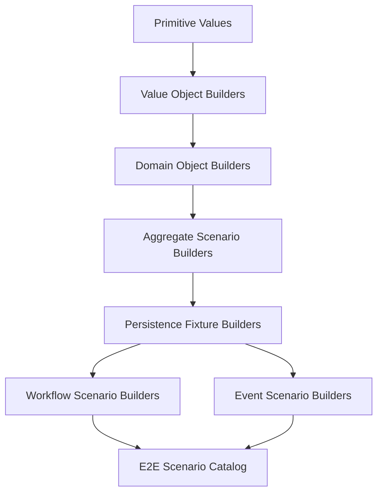

# Part 044 — Test Data Builders and Scenario Catalog

Part sebelumnya membahas strategi testing.
Sekarang kita masuk ke masalah yang sering dianggap kecil tetapi diam-diam menghancurkan test suite enterprise:

> test data.

Di CPQ/OMS, test data bukan sekadar object dummy.
Test data adalah representasi dari:

- catalog version
- product offering
- configuration choice
- price book
- discount policy
- approval authority
- quote revision
- order baseline
- fulfillment state
- tenant
- user persona
- external system behavior
- workflow state
- event history

Jika test data kacau, test akan kacau.
Jika fixture tidak bisa dibaca, test tidak lagi menjadi dokumentasi.
Jika scenario tidak eksplisit, engineer akan takut mengubah sistem.

Part ini membangun pola **test data builders** dan **scenario catalog** untuk CPQ/OMS production-grade.

---

## 1. Prinsip Utama: Test Data Harus Berbicara dalam Bahasa Domain

Test data buruk terlihat seperti ini:

```java
QuoteEntity quote = new QuoteEntity();
quote.setStatus("S3");
quote.setType("T1");
quote.setAmount(new BigDecimal("1234.56"));
quote.setFlag1(true);
quote.setFlag2(false);
```

Masalahnya bukan hanya jelek.
Masalahnya adalah tidak ada yang tahu arti bisnisnya.

Test data baik terlihat seperti ini:

```java
QuoteRevision quote = QuoteScenarios.enterpriseInternetBundle()
    .forTenant("acme-id")
    .requestedBySeller("seller-jakarta-01")
    .withRecurringDiscount("18.00")
    .pricedUsingPriceBook("enterprise-q3-2026")
    .requiringFinanceApproval()
    .build();
```

Kalau test gagal, engineer bisa membaca konteksnya.

Test data builder yang bagus bukan sekadar pattern GoF.
Ia adalah **domain language compiler** untuk test.

---

## 2. Masalah Fixture Tradisional

Banyak proyek enterprise mulai dengan fixture JSON besar.

```text
src/test/resources/fixtures/quote-full.json
src/test/resources/fixtures/order-full.json
src/test/resources/fixtures/catalog-full.json
```

Awalnya nyaman.
Lama-lama menjadi masalah.

### Masalah 1: Mystery fixture

Tidak ada yang tahu field mana yang relevan untuk test.

```json
{
  "quoteId": "q-123",
  "status": "PRICED",
  "fieldA": true,
  "fieldB": false,
  "fieldC": "X",
  "fieldD": "Y"
}
```

Saat test gagal, engineer tidak tahu apakah `fieldC` penting atau kebetulan.

### Masalah 2: Fixture reuse berlebihan

Satu fixture dipakai 80 test.
Satu perubahan kecil membuat 30 test gagal.
Tidak jelas apakah bug atau expected change.

### Masalah 3: Fixture tidak encode intent

Fixture menyimpan data, bukan alasan.

Test butuh:

```text
quote with stale approval because discount changed after approval
```

Fixture sering hanya memberi:

```text
quote-status-approved.json
```

### Masalah 4: Time flakiness

Fixture memakai `now()`.
Test gagal tergantung jam, timezone, atau tanggal.

### Masalah 5: External behavior implicit

Order test butuh inventory timeout.
Fixture hanya menyimpan order.
External behavior tidak terlihat.

---

## 3. Scenario Catalog: Inventory of Business Situations

Untuk CPQ/OMS, kita butuh **scenario catalog**.

Scenario catalog adalah daftar situasi bisnis yang disepakati sebagai test vocabulary.

Bukan semua test data harus global.
Tetapi scenario penting harus punya nama stabil.

Contoh:

| Scenario ID | Name | Purpose |
|---|---|---|
| `CAT-001` | Standard active catalog publication | baseline catalog untuk quote normal |
| `CFG-001` | Valid enterprise internet bundle | configuration valid happy path |
| `CFG-002` | Missing required router option | invalid configuration explanation |
| `PRC-001` | Standard recurring price | baseline pricing |
| `PRC-002` | Discount above seller authority | approval trigger |
| `QTE-001` | Draft quote with one configured line | quote edit test |
| `QTE-002` | Priced quote requiring finance approval | approval workflow |
| `QTE-003` | Approved quote with stale material change | stale approval invariant |
| `ORD-001` | Order submitted from accepted quote | order capture |
| `ORD-002` | Order with inventory reservation timeout | unknown outcome |
| `ORD-003` | Order requiring compensation | cancellation/reversal |
| `SEC-001` | Tenant-crossing quote access attempt | object-level authz |
| `WF-001` | Finance approval task open past SLA | escalation timer |

Scenario catalog bukan berarti semua data dipusatkan dalam file raksasa.
Scenario catalog adalah index dan naming discipline.
Implementation-nya bisa builder, SQL seed, JSON sample, atau kombinasi.

---

## 4. Layered Test Data Model

Test data harus disusun berlapis.



### Layer 1: Primitive values

Contoh:

- deterministic UUID
- deterministic clock
- known currency
- known tenant
- known user
- known product code

### Layer 2: Value object builders

Contoh:

- `Money.usd("100.00")`
- `Percent.of("18.00")`
- `EffectivePeriod.closedOpen(start, end)`
- `TenantId.of("acme-id")`

### Layer 3: Domain object builders

Contoh:

- `ProductOfferingBuilder`
- `QuoteLineBuilder`
- `PriceComponentBuilder`
- `ApprovalDecisionBuilder`

### Layer 4: Aggregate scenario builders

Contoh:

- `QuoteScenarios.pricedQuoteRequiringFinanceApproval()`
- `OrderScenarios.submittedOrderWithPendingReservation()`

### Layer 5: Persistence fixture builders

Contoh:

- persist catalog publication
- persist quote revision
- persist order with fulfillment steps
- persist outbox event
- persist idempotency record

### Layer 6: Workflow/event scenario builders

Contoh:

- start Camunda process at approval wait state
- create external task mock response
- publish Kafka event
- insert inbox processed marker

---

## 5. Deterministic Test Clock

CPQ/OMS sangat sensitif terhadap waktu.

Waktu mempengaruhi:

- catalog effective date
- quote expiration
- approval SLA
- price validity
- reservation expiration
- retry backoff
- audit timestamp
- document generation timestamp
- billing handoff date
- renewal window

Karena itu test tidak boleh memakai `Instant.now()` langsung.

Gunakan clock abstraction:

```java
public interface BusinessClock {
    Instant now();
    LocalDate today(ZoneId zoneId);
}
```

Untuk test:

```java
FixedBusinessClock clock = FixedBusinessClock.at("2026-07-02T10:00:00Z");
```

Scenario builder harus menerima clock.

```java
QuoteRevision quote = QuoteScenarios.standardQuote()
    .createdAt(clock.instant())
    .expiresInDays(30)
    .build();
```

Jangan biarkan waktu menjadi dependency tersembunyi.

---

## 6. Deterministic Identity

ID random membuat failure sulit direproduksi.

Untuk unit/domain test, gunakan ID stabil.

```java
public final class TestIds {
    public static final TenantId ACME = TenantId.of("tenant-acme");
    public static final QuoteId QUOTE_001 = QuoteId.of("quote-001");
    public static final OrderId ORDER_001 = OrderId.of("order-001");
    public static final ProductOfferingId INTERNET_1G = ProductOfferingId.of("po-internet-1g");
}
```

Untuk integration test yang butuh uniqueness, buat deterministic prefix per test.

```java
TestIdFactory ids = TestIdFactory.forTest("duplicate-accept-command");
QuoteId quoteId = ids.quoteId("main");
```

Tujuan:

- test mudah dibaca
- log mudah dicari
- database row mudah dikorelasikan
- failure reproducible

---

## 7. Money and Decimal Discipline

Pricing test tidak boleh memakai double.

Gunakan decimal string dan currency eksplisit.

```java
Money monthly = Money.of("USD", "1200.00");
Percent discount = Percent.of("18.50");
```

Test builder harus membuat rounding policy eksplisit.

```java
PricingScenario scenario = PricingScenarios.enterpriseRecurringPlan()
    .currency("USD")
    .roundingMode("HALF_UP")
    .scale(2)
    .baseRecurring("1200.00")
    .discountPercent("18.50")
    .build();
```

Jangan biarkan default JVM, database, atau serializer menentukan hasil pricing secara implicit.

---

## 8. Persona and Authority Builders

CPQ/OMS enterprise sangat bergantung pada siapa yang melakukan aksi.

Persona minimal:

| Persona | Capability |
|---|---|
| `sellerBasic` | create/edit quote within territory |
| `sellerSenior` | apply moderate discount |
| `financeApprover` | approve discount above threshold |
| `salesManager` | approve commercial exception |
| `caseWorker` | resolve fallout case |
| `tenantAdmin` | manage tenant config |
| `systemWorkflow` | execute workflow command |
| `notificationService` | send notification only |

Builder:

```java
Actor seller = Personas.sellerBasic()
    .tenant("tenant-acme")
    .region("ID-JK")
    .authorityLimitPercent("10.00")
    .build();

Actor finance = Personas.financeApprover()
    .tenant("tenant-acme")
    .approvalScope("DISCOUNT_OVER_15")
    .fourEyesEligible(true)
    .build();
```

Test harus eksplisit tentang persona.

Buruk:

```java
approveQuote(user);
```

Baik:

```java
approveQuote(asFinanceApproverFromSameTenantButDifferentUser());
```

---

## 9. Product Catalog Builder

Catalog adalah fondasi CPQ.
Test catalog harus bisa dibangun dengan vocabulary domain.

```java
CatalogPublication catalog = CatalogScenarios.activeEnterpriseCatalog()
    .publicationId("cat-2026-q3")
    .effectiveFrom("2026-07-01")
    .offering("enterprise-internet-1g", offering -> offering
        .name("Enterprise Internet 1G")
        .requiresOption("managed-router")
        .allowsOption("static-ip")
        .incompatibleWith("consumer-router")
        .priceBook("enterprise-q3-2026"))
    .build();
```

Builder harus bisa mengekspresikan:

- product specification
- product offering
- bundle
- characteristic
- required option
- optional add-on
- incompatible option
- eligibility rule
- effective date
- publication status
- price book linkage

### Catalog scenario minimal

| Scenario | Use |
|---|---|
| active standard catalog | happy path quote |
| future catalog | effective date test |
| expired catalog | stale quote test |
| invalid bundle | configuration rejection |
| catalog with changed material terms | quote revalidation |
| catalog with discontinued offering | renewal/change order test |

---

## 10. Configuration Scenario Builder

Configuration builder harus menghasilkan both request dan expected explanation.

```java
ConfigurationScenario invalidRouterScenario = ConfigurationScenarios.enterpriseInternet()
    .selectOffering("enterprise-internet-1g")
    .selectOption("static-ip")
    .omitRequiredOption("managed-router")
    .expectInvalidBecause("REQUIRED_OPTION_MISSING", "managed-router")
    .build();
```

Ini penting karena configuration engine bukan hanya harus menolak.
Ia harus menjelaskan.

### Configuration scenario matrix

| Scenario | Expected |
|---|---|
| valid minimal bundle | valid, priceable |
| required option missing | invalid, explanation contains missing option |
| incompatible option selected | invalid, explanation contains conflict pair |
| derived option auto-added | valid, explanation contains derived option |
| partial configuration | incomplete, not priceable |
| discontinued option | invalid under active catalog |

---

## 11. Pricing Scenario Builder

Pricing builder harus menghasilkan input, expected components, expected approval trigger, dan trace expectation.

```java
PricingScenario pricing = PricingScenarios.enterpriseInternet1G()
    .baseRecurring("1200.00")
    .activationFee("100.00")
    .discountPercent("18.00")
    .currency("USD")
    .expectComponent("BASE_RECURRING", "1200.00")
    .expectComponent("DISCOUNT", "-216.00")
    .expectComponent("ACTIVATION_FEE", "100.00")
    .expectRecurringTotal("984.00")
    .expectOneTimeTotal("100.00")
    .expectApprovalRequired("FINANCE", "DISCOUNT_THRESHOLD_EXCEEDED")
    .build();
```

Pricing test harus menghindari “magic expected total”.

Expected result harus menjelaskan alasan.

### Price scenario catalog

| Scenario | Purpose |
|---|---|
| base recurring price | baseline |
| recurring + one-time | charge type split |
| discount under threshold | no approval |
| discount over threshold | approval required |
| manual override | override trace |
| promotion stack | stacking rule |
| rounding boundary | decimal correctness |
| expired price book | rejection |
| stale price result | quote acceptance guard |

---

## 12. Quote Scenario Builder

Quote builder harus mendukung lifecycle.

```java
QuoteRevision quote = QuoteScenarios.enterpriseQuote()
    .tenant("tenant-acme")
    .createdBy(Personas.sellerSenior())
    .usingCatalog("cat-2026-q3")
    .withLine("enterprise-internet-1g", line -> line
        .configuredWith("managed-router")
        .configuredWith("static-ip"))
    .priced(pricing -> pricing
        .priceBook("enterprise-q3-2026")
        .recurringTotal("984.00")
        .oneTimeTotal("100.00")
        .approvalRequired("FINANCE"))
    .submittedForApproval()
    .build();
```

Lifecycle modifiers:

```java
.draft()
.configured()
.priced()
.submittedForApproval()
.approvedBy(financeApprover)
.rejectedBy(financeApprover)
.accepted()
.expired()
.withMaterialChangeAfterApproval()
```

### Quote scenario catalog

| Scenario | Purpose |
|---|---|
| draft quote | edit API |
| configured unpriced quote | price command |
| priced no approval quote | direct accept |
| priced approval-required quote | workflow start |
| approved quote | accept command |
| approved then material changed | stale approval |
| expired quote | acceptance rejection |
| accepted quote | duplicate accept/idempotency |

---

## 13. Order Scenario Builder

Order builder harus membedakan order header, order line, fulfillment step, dan external correlation.

```java
OrderScenario order = OrderScenarios.fromAcceptedQuote()
    .orderId("order-001")
    .tenant("tenant-acme")
    .withLine("line-1", line -> line
        .action("ADD")
        .offering("enterprise-internet-1g")
        .fulfillmentStep("RESERVE_INVENTORY", "PENDING")
        .fulfillmentStep("PROVISION_SERVICE", "NOT_STARTED"))
    .workflowBusinessKey("order-001")
    .build();
```

Order lifecycle modifiers:

```java
.submitted()
.orchestrationStarted()
.reservationPending()
.reservationSucceeded()
.reservationUnknownOutcome()
.provisioningFailed()
.falloutCreated()
.cancelRequested()
.compensationInProgress()
.completed()
```

### Order scenario catalog

| Scenario | Purpose |
|---|---|
| submitted order | workflow start |
| order with pending reservation | external task wait |
| order with unknown reservation outcome | reconciliation |
| order with failed provisioning | fallout |
| completed order | cancellation rejection |
| partially fulfilled order | compensation |
| order with amendment in progress | change collision |

---

## 14. Workflow Scenario Builder

Camunda test data tidak boleh hanya `Map<String, Object>` yang tersebar.

Buat builder untuk process variables.

```java
WorkflowScenario approvalWorkflow = WorkflowScenarios.quoteApproval()
    .businessKey("quote-001:rev-3")
    .tenant("tenant-acme")
    .quoteId("quote-001")
    .revision(3)
    .priceResultId("price-result-001")
    .approvalType("FINANCE")
    .requestedBy("seller-001")
    .build();
```

Process variables harus minimal.
Workflow tidak menyimpan semua quote data.

### Workflow scenario types

| Scenario | Purpose |
|---|---|
| approval not required | direct path |
| finance approval required | user task |
| approval rejected | rework loop |
| approval stale | terminate/restart |
| SLA elapsed | escalation timer |
| external task failure retryable | retry path |
| external task retries exhausted | incident/fallout |
| compensation triggered | reversal path |

---

## 15. Event Scenario Builder

Event builder harus menghasilkan envelope, payload, headers, dan expected idempotency key.

```java
DomainEvent event = EventScenarios.quoteAccepted()
    .eventId("evt-quote-accepted-001")
    .aggregateId("quote-001")
    .aggregateVersion(7)
    .tenant("tenant-acme")
    .correlationId("corr-001")
    .schemaVersion("2.0")
    .payload(payload -> payload
        .quoteId("quote-001")
        .revision(3)
        .orderIntentId("order-intent-001"))
    .build();
```

Event scenario harus mendukung negative cases:

```java
.duplicateOf(existingEvent)
.withUnknownSchemaVersion()
.withMissingRequiredField("revision")
.withOlderAggregateVersion()
.withDifferentTenantHeaderThanPayload()
```

### Event scenario catalog

| Scenario | Purpose |
|---|---|
| valid QuoteAccepted | order creation consumer |
| duplicate QuoteAccepted | idempotency |
| out-of-order QuotePriced | projection robustness |
| invalid payload | DLQ |
| unknown schema version | compatibility handling |
| tenant mismatch | security reject |
| poison event | retry/DLQ path |

---

## 16. External System Stub Scenario

External systems tidak boleh hanya dimock dengan `when().thenReturn()` tanpa domain meaning.

Buat stub scenario.

```java
InventoryStubScenario inventory = InventoryStubScenarios.reservation()
    .forProduct("enterprise-internet-1g")
    .availableQuantity(1)
    .onReserveReturnSuccess("reservation-001")
    .build();
```

Negative case:

```java
InventoryStubScenarios.reservation()
    .forProduct("enterprise-internet-1g")
    .onReserveTimeout()
    .onReconcileReturnReserved("reservation-001")
    .build();
```

Ini penting untuk unknown outcome.

Timeout bukan berarti gagal.
Timeout berarti tidak tahu.

### External stub catalog

| External Boundary | Scenario |
|---|---|
| Inventory | available, unavailable, timeout, duplicate reserve, release failure |
| Payment | authorized, declined, timeout, duplicate intent |
| Billing | account valid, account suspended, API unavailable |
| Document | render success, render timeout, template missing |
| Notification | sent, bounced, provider timeout, duplicate request |

---

## 17. Persistence Fixture Builder

Integration test butuh data di database nyata.
Tetapi jangan menulis SQL mentah di setiap test.

Buat fixture builder:

```java
PersistedQuote persistedQuote = fixtures.quotes()
    .approvedQuoteRequiringFinance()
    .tenant("tenant-acme")
    .persist();
```

Fixture builder boleh memakai repository/application service, tergantung tujuan test.

### Dua mode fixture

#### Mode 1: through application service

Dipakai ketika ingin membuat state valid melalui behavior publik.

```java
fixtures.throughApplication()
    .createConfiguredPricedApprovedQuote();
```

Keuntungan:

- state lebih realistis
- invariant terjaga

Kelemahan:

- lambat
- test setup lebih panjang
- failure setup bisa menutupi failure target

#### Mode 2: direct persistence

Dipakai ketika ingin menyiapkan state tertentu secara cepat.

```java
fixtures.directDb()
    .insertApprovedQuoteRevisionWithStalePrice();
```

Keuntungan:

- cepat
- bisa membuat edge state

Kelemahan:

- bisa menciptakan state tidak valid
- harus dijaga ketat

Rule praktis:

> Gunakan application service untuk happy baseline. Gunakan direct DB hanya untuk edge case yang sulit dicapai atau untuk migration/repair/reconciliation tests.

---

## 18. Database Cleanup Strategy

Test database harus bersih dan deterministic.

Pilihan umum:

1. transaction rollback per test
2. truncate tables per test
3. recreate schema per test class
4. container per suite
5. container per test class

Untuk CPQ/OMS, sering kali paling praktis:

- container per test suite/module
- migration dijalankan sekali
- truncate business tables per test
- keep reference data if immutable
- reset sequences if ID numeric

### Cleanup order

Karena ada FK, cleanup harus mengikuti dependency.

```text
outbox_event
inbox_event
workflow_correlation
audit_log
fulfillment_step
order_line
orders
approval_decision
price_component
price_result
quote_line
quote_revision
quote
catalog_publication
```

Jangan truncate Camunda engine tables sembarangan kecuali test environment memang isolated dan tahu konsekuensinya.
Untuk workflow tests, lebih aman engine database dipisah dari application DB atau lifecycle-nya dikontrol oleh test extension.

---

## 19. Golden Scenarios vs Generated Scenarios

Ada dua jenis scenario.

### Golden scenario

Golden scenario adalah scenario eksplisit yang disimpan karena penting secara bisnis.

Contoh:

- enterprise internet bundle with finance approval
- stale approved quote after discount change
- order reservation timeout then reconciliation success

Golden scenario harus stabil dan diberi nama.

### Generated scenario

Generated scenario dipakai untuk mengeksplorasi kombinasi.

Contoh:

- random valid option combinations
- discount percentages around threshold
- multiple order line action combinations
- retry count variations

Generated scenario bagus untuk property-based atau fuzz-ish testing.
Tetapi jangan menggantikan golden scenario.

Golden scenario menjelaskan bisnis.
Generated scenario mencari edge case.

---

## 20. Property-Based and Metamorphic Test Ideas

Untuk CPQ/OMS, property-based testing sangat berguna jika dipakai selektif.

### Pricing properties

- total equals sum of components by charge type
- applying 0% discount does not change base price
- increasing discount should not increase recurring total
- same input snapshot produces same price result
- rounding result must always have expected scale

### Configuration properties

- selecting incompatible pair always invalid
- adding optional compatible option should not invalidate existing valid config
- required option omission always invalid
- same catalog snapshot and same selections produce same result

### State machine properties

- terminal state cannot transition to non-terminal state unless explicit amendment lifecycle starts
- invalid transition never changes state
- every successful transition emits transition log

### Event consumer properties

- processing same event twice has same final state as processing once
- event with older aggregate version does not overwrite newer projection

Metamorphic test membantu ketika expected exact output sulit dihitung, tetapi relation antar-output jelas.

---

## 21. Test Data for Negative Paths

Negative paths harus punya data builder sendiri.
Jangan membuat negative state dengan mutation acak.

Buruk:

```java
quote.setStatus(APPROVED);
quote.setPriceResult(null);
```

Baik:

```java
QuoteScenarios.invalidApprovedQuote()
    .missingPriceResultEvidence()
    .build();
```

Mengapa?

Karena invalid state punya arti.
Jika kita sengaja membuat state korup untuk repair/reconciliation test, test harus mengatakannya.

### Negative scenario taxonomy

| Type | Example |
|---|---|
| business invalid | accept expired quote |
| security invalid | approve quote outside authority |
| data corruption | approved quote missing price result |
| integration failure | inventory timeout |
| workflow failure | external task retries exhausted |
| event failure | duplicate event |
| compatibility failure | unknown schema version |
| projection failure | stale read model |

---

## 22. Scenario Naming Convention

Nama scenario harus stabil, singkat, dan domain-oriented.

Format yang direkomendasikan:

```text
<capability>-<state>-<special-condition>
```

Contoh:

```text
quote-priced-finance-approval-required
quote-approved-stale-after-discount-change
order-submitted-inventory-reservation-timeout
order-cancelled-compensation-release-inventory-failed
catalog-active-enterprise-internet-bundle-v2026q3
```

Untuk Java method:

```java
QuoteScenarios.pricedQuoteRequiringFinanceApproval()
QuoteScenarios.approvedQuoteStaleAfterDiscountChange()
OrderScenarios.submittedOrderWithReservationTimeout()
OrderScenarios.cancelledOrderWithFailedInventoryReleaseCompensation()
```

Jangan pakai:

```text
test1
defaultQuote
fullQuote
complexOrder
fixtureA
```

Nama yang buruk membuat test suite kehilangan fungsi dokumentasi.

---

## 23. Scenario Catalog File

Selain builder, buat scenario catalog di repository.

Contoh:

```md
# CPQ/OMS Scenario Catalog

## QTE-003 — Approved Quote Stale After Discount Change

Purpose:
Ensures that approval evidence cannot authorize acceptance after material commercial change.

Given:
- tenant: tenant-acme
- seller: seller-senior
- product: enterprise-internet-1g
- quote revision: 3
- price result: price-result-001
- approval: finance approved discount 18%

When:
- seller changes discount from 18% to 22%

Expected:
- quote remains editable or requires repricing depending on command
- previous approval becomes stale
- accept command is rejected
- audit records material change
- new approval cycle is required
```

Scenario catalog adalah shared language antara engineer, QA, BA, architect, dan ops.

---

## 24. Test Module Layout

Recommended repository layout:

```text
cpq-platform/
  test-support/
    src/main/java/
      com/example/cpq/testsupport/
        ids/
        clock/
        persona/
        catalog/
        configuration/
        pricing/
        quote/
        order/
        workflow/
        event/
        external/
        persistence/
  catalog-service/
    src/test/java/
    src/integrationTest/java/
  quote-service/
    src/test/java/
    src/integrationTest/java/
  order-service/
    src/test/java/
    src/integrationTest/java/
  workflow-service/
    src/test/java/
    src/integrationTest/java/
  e2e-tests/
    src/test/java/
  docs/
    testing/
      scenario-catalog.md
      test-data-guidelines.md
```

`test-support` harus hati-hati.
Jangan menjadi dumping ground.

Rule:

- builder generic boleh shared
- scenario yang sangat service-specific sebaiknya tetap di service module
- external stub DSL bisa shared
- jangan share assertion yang menyembunyikan business meaning

---

## 25. Builder Design Rules

### Rule 1: Default harus valid

Builder default harus menghasilkan object valid.

```java
QuoteScenarios.enterpriseQuote().build();
```

Harus valid.

Kalau ingin invalid, harus eksplisit.

```java
QuoteScenarios.enterpriseQuote()
    .invalidBecauseMissingRequiredRouter()
    .build();
```

### Rule 2: Invalid state harus bernama

Jangan ada:

```java
.withNullPriceResult()
```

Lebih baik:

```java
.corruptedMissingPriceResultEvidence()
```

### Rule 3: Jangan sembunyikan important values

Jika test tentang discount threshold, discount harus terlihat.

```java
.withDiscountPercent("18.00")
.expectApprovalRequired()
```

Bukan:

```java
.withDefaultDiscount()
```

### Rule 4: Builder tidak boleh terlalu pintar

Builder yang menghitung terlalu banyak bisa menyembunyikan bug yang sama dengan production code.

Jika builder memakai pricing logic production untuk expected result, test menjadi circular.

Expected pricing harus bisa dibuat dari formula sederhana atau explicit components.

### Rule 5: Builder harus expose evidence IDs

Test CPQ/OMS sering butuh assert correlation.

Builder harus memberi akses ke:

- quoteId
- revision
- priceResultId
- approvalDecisionId
- orderId
- processInstanceBusinessKey
- eventId
- correlationId

---

## 26. Assertion Builders

Selain data builder, buat assertion helper yang domain-aware.

```java
assertThatQuote(quote)
    .isPriced()
    .hasRecurringTotal("984.00", "USD")
    .requiresApproval("FINANCE", "DISCOUNT_THRESHOLD_EXCEEDED")
    .hasPriceTraceComponent("DISCOUNT", "-216.00");
```

```java
assertThatOrder(order)
    .wasCreatedFromQuote("quote-001", 3)
    .hasLineAction("line-1", "ADD")
    .hasFulfillmentStep("RESERVE_INVENTORY", "PENDING");
```

```java
assertThatAuditTimeline(timeline)
    .containsDecision("FINANCE_APPROVED")
    .containsActor("finance-approver-001")
    .containsEvidence("price-result-001")
    .isOrderedByBusinessTime();
```

Assertion helper harus meningkatkan readability, bukan menyembunyikan logic.

---

## 27. Test Data and Migration

Migration test juga butuh scenario.

Contoh:

```text
Given quote data from schema version 12
When migration 13 runs
Then quote revision still has valid price result relation
And accepted quote remains accepted
And stale approval detection still works
```

Simpan sample legacy rows untuk migration critical.

Bukan semua data lama perlu disimpan.
Pilih scenario historis yang mewakili:

- old quote without new nullable field
- old order without workflow correlation table
- old price result before price component normalization
- old approval decision before authority snapshot
- old event schema before field addition

Migration yang tidak dites dengan legacy data nyata sering gagal saat production deploy.

---

## 28. Test Data for Observability

Observability assertion butuh correlation values deterministic.

```java
CorrelationId correlationId = CorrelationId.of("corr-quote-accept-001");
```

E2E scenario harus memakai correlation ID yang diketahui.

Lalu assert:

- API response contains correlation ID
- outbox event contains correlation ID
- Kafka header contains correlation ID
- workflow variable contains correlation ID
- audit row contains correlation ID
- logs contain correlation ID

Test observability tidak perlu parse semua log production.
Tetapi critical journey harus membuktikan propagation.

---

## 29. Test Data for Authorization

Authorization test butuh matrix persona.

```java
AuthorizationScenario scenario = AuthorizationScenarios.quoteAccess()
    .quoteOwnedBy("tenant-acme", "region-jakarta", "sales-team-a")
    .actor(Personas.sellerBasic()
        .tenant("tenant-acme")
        .region("region-bandung")
        .team("sales-team-b"))
    .expectDenied("OUTSIDE_SALES_SCOPE")
    .build();
```

Authorization scenario harus eksplisit terhadap:

- tenant
- region
- sales team
- role
- approval authority
- relationship to object
- disclosure policy

Security test yang hanya memakai `admin` user tidak bernilai.

---

## 30. Worked Example: Stale Approval Scenario

Mari lihat scenario lengkap.

### Business description

```text
A seller creates an enterprise quote with 18% discount.
Finance approves it.
Seller then changes discount to 22%.
The old approval must no longer allow acceptance.
```

### Scenario builder

```java
QuoteScenario scenario = QuoteScenarios.approvedQuoteStaleAfterDiscountChange()
    .tenant("tenant-acme")
    .seller(Personas.sellerSenior())
    .approver(Personas.financeApprover())
    .product("enterprise-internet-1g")
    .originalDiscount("18.00")
    .changedDiscount("22.00")
    .build();
```

### Unit test

```java
@Test
void oldApprovalCannotAuthorizeAcceptanceAfterDiscountChange() {
    QuoteRevision quote = scenario.buildDomainQuote();

    assertThrows(StaleApprovalException.class, quote::accept);
}
```

### Integration test

```java
@Test
void acceptCommandReturnsConflictForStaleApproval() {
    PersistedQuote persisted = scenario.persist(fixtures);

    ApiResponse response = api.acceptQuote(
        persisted.quoteId(),
        persisted.revision(),
        IdempotencyKey.of("idem-stale-approval-001")
    );

    assertThat(response.status()).isEqualTo(409);
    assertThatProblem(response.body())
        .hasCode("QUOTE_APPROVAL_STALE")
        .hasCorrelationId();
}
```

### Audit assertion

```java
assertThatAuditTimeline(api.auditTimeline(persisted.quoteId()))
    .containsEvent("QUOTE_APPROVED")
    .containsEvent("QUOTE_MATERIAL_FIELD_CHANGED")
    .containsEvent("QUOTE_ACCEPT_REJECTED")
    .containsReason("APPROVAL_STALE");
```

Satu scenario dipakai di banyak layer, tetapi tiap layer menguji hal berbeda.

---

## 31. Worked Example: Reservation Timeout Unknown Outcome

### Business description

```text
Order orchestration asks Inventory to reserve capacity.
Inventory call times out.
The system must not assume failure.
It must create an unknown outcome state and reconcile.
```

### Scenario builder

```java
OrderScenario scenario = OrderScenarios.submittedOrderWithReservationTimeout()
    .tenant("tenant-acme")
    .product("enterprise-internet-1g")
    .inventoryStub(stub -> stub
        .onReserveTimeout()
        .onReconcileReturnReserved("reservation-001"))
    .build();
```

### Workflow test

```java
@Test
void reservationTimeoutMovesOrderToUnknownOutcomeAndWaitsForReconciliation() {
    ProcessInstance pi = workflow.startOrderProcess(scenario.workflowVariables());

    externalTaskWorker.reserveInventoryAndTimeout(pi);

    assertThatOrder(scenario.orderId())
        .hasFulfillmentStep("RESERVE_INVENTORY", "UNKNOWN_OUTCOME");

    assertThatProcess(pi)
        .isWaitingAt("WaitForInventoryReconciliation");
}
```

### Integration test

```java
@Test
void reconciliationMarksReservationSucceededWithoutDuplicateReserve() {
    PersistedOrder order = scenario.persistAfterTimeout(fixtures);

    reconciliationJob.runFor(order.orderId());

    assertThatOrder(order.orderId())
        .hasReservationId("reservation-001")
        .hasFulfillmentStep("RESERVE_INVENTORY", "COMPLETED");

    inventoryStub.verifyReserveCalledOnce();
}
```

Timeout behavior harus dites karena ini salah satu sumber bug paling mahal di OMS.

---

## 32. Anti-Pattern Test Data

### Anti-pattern 1: One fixture to rule them all

Satu fixture besar untuk semua test membuat test rapuh.

### Anti-pattern 2: Random everything

Random ID, random date, random amount membuat failure sulit direproduksi.

### Anti-pattern 3: Builder dengan default tersembunyi

Jika default penting untuk business rule, test harus menunjukkannya.

### Anti-pattern 4: Test data menggunakan production service untuk expected result

Ini membuat test circular.

### Anti-pattern 5: Tidak ada scenario ownership

Jika tidak ada yang memelihara scenario catalog, ia akan membusuk.

### Anti-pattern 6: Fixture langsung menulis state mustahil tanpa label

Kadang kita perlu corrupt state untuk repair test.
Tetapi state itu harus diberi nama eksplisit.

### Anti-pattern 7: E2E membuat data lewat UI untuk semua hal

Mahal, lambat, dan rapuh.
Gunakan API/fixture untuk setup; UI hanya untuk journey yang memang perlu UI assertion.

---

## 33. Scenario Governance

Scenario catalog butuh governance ringan.

Setiap scenario penting harus punya:

- ID
- name
- purpose
- owner capability
- given state
- action
- expected outcome
- layer usage
- data sensitivity
- related production incident if any

Contoh:

```text
Scenario ID: ORD-002
Name: Order Reservation Timeout Unknown Outcome
Owner: Order/Fulfillment Capability
Purpose: Ensure timeout does not get interpreted as failure
Layers: workflow, integration, E2E smoke
Related incident: production class risk, not necessarily actual incident
```

Jika production incident terjadi, tambahkan scenario regression.

Rule:

> Setiap incident serius harus menghasilkan scenario, bukan hanya patch.

---

## 34. Practical Checklist

Saat menulis test baru, tanyakan:

- [ ] Apakah nama scenario menjelaskan business situation?
- [ ] Apakah tenant eksplisit?
- [ ] Apakah persona/authority eksplisit?
- [ ] Apakah catalog version eksplisit?
- [ ] Apakah clock deterministic?
- [ ] Apakah currency dan rounding eksplisit?
- [ ] Apakah expected result menjelaskan reason, bukan hanya value?
- [ ] Apakah external system behavior eksplisit?
- [ ] Apakah workflow business key eksplisit jika melibatkan Camunda?
- [ ] Apakah event ID/correlation ID eksplisit jika melibatkan Kafka/outbox?
- [ ] Apakah negative path diberi nama?
- [ ] Apakah builder tidak memakai production logic untuk expected result?
- [ ] Apakah test setup lebih kecil dari behavior yang diuji?
- [ ] Apakah scenario bisa dipakai ulang tanpa menjadi fixture global raksasa?

---

## 35. Kesimpulan

Test data builder dan scenario catalog adalah fondasi test suite enterprise.

Tanpa itu, test akan berubah menjadi:

- fixture besar
- setup tidak terbaca
- failure tidak bisa didiagnosis
- E2E lambat
- expected output magic
- authorization blind spot
- workflow blind spot
- event blind spot

Dengan scenario catalog yang baik, test menjadi executable knowledge base.

Ia menjawab:

- produk apa yang sedang dijual?
- quote dalam lifecycle apa?
- price dihitung dari policy mana?
- approval authority siapa?
- order sedang berada di fulfillment state apa?
- external system sedang sukses, gagal, timeout, atau unknown?
- event apa yang sudah terjadi?
- workflow sedang menunggu apa?
- tenant dan persona mana yang boleh melakukan aksi?

Top engineer tidak hanya menulis test.
Ia membangun bahasa scenario yang membuat sistem bisa dimengerti, diubah, dan dipertahankan saat kompleksitas bertambah.

Part berikutnya akan masuk ke performance modeling dan load testing: bagaimana menguji pricing latency, quote concurrency, workflow throughput, database bottleneck, Kafka lag, dan Redis hot key sebagai sistem enterprise yang benar-benar dipakai.
