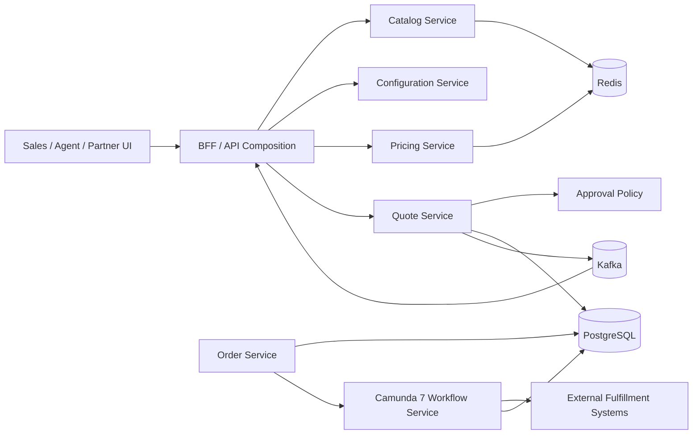
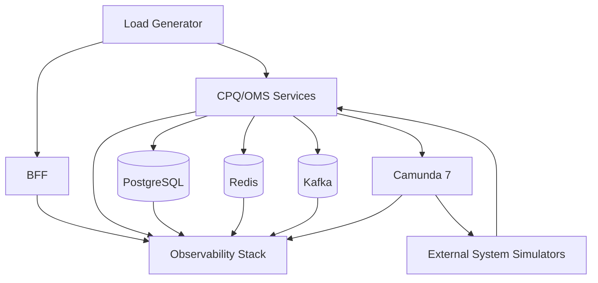
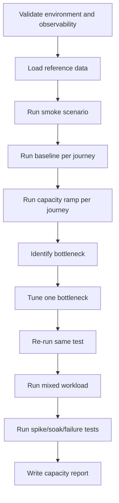

# Part 045 — Performance Modeling and Load Testing

Performance testing CPQ/OMS is not the same as asking: “how many requests per second can this API handle?”

That question is too shallow.

A real CPQ/OMS platform has many latency shapes:

- catalog search is read-heavy and cache-sensitive
- configuration validation is rule/graph-heavy
- pricing is CPU + policy + precision-sensitive
- quote save is transactional and audit-heavy
- approval is human-latency-heavy
- order submit is orchestration-heavy
- fulfillment is external-system-heavy
- order search is projection/index-heavy
- Camunda 7 is job-throughput-sensitive
- Kafka publishing is outbox/consumer-lag-sensitive
- Redis is hot-key/memory/TTL-sensitive
- PostgreSQL is lock/index/connection-pool-sensitive

A top-level engineer does not start with a tool.

A top-level engineer starts with a **performance model**.

The model says:

> for this business journey, under this traffic shape, these resources become limiting first, and these are the signals proving it.

Without that model, load testing becomes expensive theatre.

---

## 1. The Real Goal

The goal of performance engineering in CPQ/OMS is not maximum throughput.

The goal is controlled behavior under load:

1. predictable latency for high-value user journeys
2. bounded resource usage
3. graceful degradation
4. no silent data corruption
5. no uncontrolled queue growth
6. no invisible workflow backlog
7. no runaway database contention
8. no Kafka lag that breaks business freshness
9. no Redis behavior that hides source-of-truth failure
10. no release to production without capacity evidence

In CPQ/OMS, performance failure usually appears as a business failure:

| Technical symptom | Business symptom |
|---|---|
| Pricing p95 rises from 400ms to 4s | Sales cannot iterate quote fast enough |
| Catalog cache stampede | Product selection intermittently fails |
| Quote save lock contention | Users overwrite or lose quote edits |
| Outbox publisher slows down | Downstream approval/search/document views become stale |
| Kafka consumer lag grows | BFF shows wrong order state |
| Camunda jobs pile up | Fulfillment appears stuck |
| Redis hot key saturates | Popular bundle cannot be configured reliably |
| PostgreSQL connection pool exhaustion | Whole platform looks down even though services are alive |

The performance test is useful only if it can explain these symptoms before production does.

---

## 2. Performance Model Before Load Test

A performance model is a simple, explicit hypothesis.

Example:

> During quote creation, the limiting resource is not HTTP request handling. It is pricing evaluation plus PostgreSQL writes to quote revision, price result, audit log, and outbox. At 200 quote submissions/minute, p95 submit latency should remain below 1.5s, DB CPU below 65%, pool wait below 50ms, and outbox lag below 5s.

This model has five parts:

| Part | Example |
|---|---|
| Workload | 200 quote submissions/minute |
| Journey | configure → price → save quote |
| Resource hypothesis | pricing CPU + DB writes |
| Service-level expectation | p95 `< 1.5s` |
| Supporting signal | DB CPU, pool wait, outbox lag |

Never run a load test without a hypothesis.

Otherwise, every graph becomes noise.

---

## 3. CPQ/OMS Performance Surface

A CPQ/OMS platform has multiple surfaces. Each surface needs different load shape.



The key surfaces:

| Surface | Performance risk |
|---|---|
| BFF | API fan-out, slow composition, projection lag confusion |
| Catalog | cache miss storm, effective-date filtering, search/index cost |
| Configuration | graph/rule explosion, invalid partial configs, explainability overhead |
| Pricing | discount stacking, rounding, price trace, policy calls |
| Quote | transactional write path, revision growth, optimistic lock conflicts |
| Approval | policy evaluation, task creation, worklist freshness |
| Order submit | idempotency, validation, workflow start, outbox publish |
| Camunda 7 | job executor throughput, external task backlog, incidents |
| Kafka | publish latency, consumer lag, partition hotspot |
| Redis | hot key, eviction, TTL, stampede |
| PostgreSQL | pool saturation, lock contention, index bloat, write amplification |

Each surface deserves a different test.

A single “end-to-end full journey load test” is useful later. It is a terrible first test because it hides the bottleneck.

---

## 4. The CPQ/OMS Performance Budget

Every critical journey should have a budget.

Not a vague SLA.

A budget.

Example budget for interactive quoting:

| Operation | Target | Hard limit | Notes |
|---|---:|---:|---|
| Load quote workspace | p95 `< 700ms` | p99 `< 1.5s` | projection/cache path |
| Validate partial config | p95 `< 300ms` | p99 `< 800ms` | local rules, no deep external calls |
| Price quote preview | p95 `< 800ms` | p99 `< 2s` | trace generated but may be cached |
| Save quote revision | p95 `< 1.2s` | p99 `< 3s` | DB + audit + outbox |
| Submit for approval | p95 `< 1.5s` | p99 `< 4s` | policy + workflow start |
| Accept quote → create order | p95 `< 2s` | p99 `< 5s` | idempotent command + order creation |
| Start fulfillment workflow | p95 `< 2s` | p99 `< 6s` | order commit + Camunda start |

Example budget for asynchronous behavior:

| Async path | Target |
|---|---:|
| Outbox row created after domain commit | same transaction |
| Outbox published to Kafka | p95 `< 5s` |
| Search projection updated | p95 `< 10s` |
| Worklist projection updated | p95 `< 10s` |
| Camunda external task picked up | p95 `< 30s` depending SLA |
| Fulfillment callback correlated | p95 depends external SLA |
| Reconciliation detects stale pending step | within configured watchdog interval |

The purpose of this table is not to worship numbers.

The purpose is to make trade-offs visible.

If pricing p95 must be below 800ms, you cannot casually call three external systems during price preview.

If outbox lag must be below 5s, the publisher needs capacity and monitoring.

If worklist projection can lag 10s, UI must not present projection as command truth.

---

## 5. Workload Model

The workload model describes how the platform is used.

A weak workload model says:

> 1000 users.

That is almost meaningless.

A useful workload model says:

```yaml
business_day:
  timezone: Asia/Jakarta
  active_sales_users: 1200
  peak_concurrent_users: 300
  quote_workspace_views_per_hour_peak: 12000
  configuration_validations_per_hour_peak: 36000
  price_previews_per_hour_peak: 24000
  quote_saves_per_hour_peak: 6000
  submit_for_approval_per_hour_peak: 1200
  approval_decisions_per_hour_peak: 900
  quote_acceptance_per_hour_peak: 700
  order_submissions_per_hour_peak: 700
  fulfillment_callbacks_per_hour_peak: 5000
  order_searches_per_hour_peak: 15000
```

Then decompose by journey:

| Journey | Ratio | Notes |
|---|---:|---|
| Browse catalog only | 35% | search + detail + cache |
| Configure and abandon | 25% | high config/pricing, no quote save |
| Save quote draft | 20% | write path begins |
| Submit for approval | 10% | policy + Camunda task |
| Accept quote/order submit | 5% | critical write + workflow |
| Operational order search | 5% | read model/search path |

This matters because CPQ traffic is not uniform.

A sales campaign may create extreme price-preview load without corresponding order load.

A partner integration may create order submit spikes without UI browsing.

A fulfillment outage may create callback/retry storms with no increase in quote traffic.

---

## 6. Load Shapes

Use different load shapes for different questions.

| Test type | Question answered |
|---|---|
| Smoke load | Is the script/environment basically valid? |
| Baseline | What does normal load look like? |
| Capacity/ramp | Where is the first bottleneck? |
| Stress | How does the system fail beyond expected load? |
| Spike | Can it absorb sudden campaign/partner bursts? |
| Soak | Does it degrade after hours because of leaks, bloat, queue growth, cache churn? |
| Resilience load | What happens when one dependency slows/fails under load? |
| Recovery load | Can it catch up after backlog? |
| Replay load | Can projections/reconciliation rebuild in acceptable time? |

A CPQ/OMS performance test plan should include all of these eventually.

But do not run all at once.

Start with baseline and capacity for one journey.

Then expand.

---

## 7. Closed Model vs Open Model

A closed model keeps a fixed number of virtual users. Each user waits for a response before doing the next action.

An open model sends work at a fixed arrival rate regardless of response time.

Both are useful.

They answer different questions.

| Model | Good for | Risk |
|---|---|---|
| Closed model | UI user behavior, think time, concurrent sessions | hides overload because throughput drops when latency rises |
| Open model | API/event arrival rate, partner bursts, queue pressure | can overload system aggressively if not controlled |

Example:

For sales UI quoting, closed model is useful:

- user opens workspace
- waits/thinks
- changes option
- waits/thinks
- prices
- edits discount
- saves quote

For partner order submit API, open model is usually better:

- 50 commands/sec arrive whether the system is healthy or not
- backlog and latency reveal capacity

In tools, this distinction appears as injection profiles, scenarios, executors, arrival rates, and virtual users. Gatling documentation explicitly frames performance tests around concepts like virtual users, injection profiles, and load models. k6 scenarios and executors control how virtual users and iterations are scheduled, including open-model executors such as constant arrival rate.

---

## 8. Critical Journeys to Test

Do not test endpoints in isolation first.

Test business journeys.

### Journey A — Quote Workspace Load

```text
GET /bff/quote-workspaces/{quoteId}
GET /quotes/{quoteId}/summary
GET /catalog/product-offerings?segment=enterprise
GET /workflows/tasks?businessKey=quote:{quoteId}
```

Risk:

- fan-out too wide
- projection stale
- N+1 remote calls
- tenant filtering expensive
- quote line tree serialization too large

Signals:

- BFF p95/p99
- downstream call count per request
- cache hit ratio
- projection lag
- payload size
- DB query count

### Journey B — Configure and Price

```text
POST /configurations/validate
POST /prices/preview
```

Risk:

- configuration graph explosion
- repeated catalog/rule loads
- price trace generation too expensive
- Redis hot key
- CPU saturation

Signals:

- CPU per request
- rules evaluated per request
- cache hit ratio
- p95/p99 by catalog size
- explainability trace size

### Journey C — Save Quote Revision

```text
POST /quotes/{quoteId}/revisions
```

Risk:

- large line tree persistence
- optimistic lock conflict
- audit write amplification
- outbox write overhead
- index cost

Signals:

- DB transaction duration
- connection pool wait
- rows written per quote
- lock waits
- retry count
- outbox rows created

### Journey D — Submit for Approval

```text
POST /quotes/{quoteId}/commands/submit-for-approval
```

Risk:

- policy evaluation latency
- stale price/config detection
- Camunda process start latency
- task projection lag

Signals:

- policy evaluation time
- process start time
- task creation time
- outbox publish lag
- worklist projection lag

### Journey E — Accept Quote and Create Order

```text
POST /quotes/{quoteId}/commands/accept
POST /orders
```

Risk:

- duplicate submit
- quote revision changed
- order creation idempotency
- inventory/payment validation slow
- workflow start fails after order commit

Signals:

- idempotency duplicate rate
- conflict rate
- order creation transaction time
- workflow correlation delay
- orphan order count

### Journey F — Fulfillment Orchestration

```text
Camunda external tasks
Kafka events
External callbacks
Order state projections
```

Risk:

- external task worker undercapacity
- callback storm
- failed job incidents
- retry thundering herd
- stuck workflow

Signals:

- external task backlog
- worker lock duration
- failed job count
- incident count
- order step age
- callback deduplication rate

---

## 9. Performance Test Architecture

A useful performance test environment should look like production in the ways that matter.

It does not need the same size.

It needs the same bottleneck shape.



Critical requirements:

1. same database schema and indexes
2. same JPA/EclipseLink mappings
3. same Camunda BPMN/DMN deployments
4. same Kafka topic count/partitioning shape
5. same Redis eviction/TTL policy shape
6. same connection-pool settings class
7. same serialization and compression settings
8. same auth/token validation path, or realistic stub
9. external systems simulated with latency/failure profiles
10. observability enabled before test begins

A common mistake is testing against fake in-memory dependencies.

That proves almost nothing for a CPQ/OMS platform.

---

## 10. Data Volume Model

Performance depends on data size.

A quote with three lines is not the same as a quote with 700 lines and nested bundles.

Build data profiles:

| Profile | Shape |
|---|---|
| Small quote | 1 bundle, 5 lines, simple price |
| Medium quote | 5 bundles, 80 lines, mixed one-time/recurring charges |
| Large quote | 20 bundles, 500 lines, many characteristics |
| Complex quote | nested bundle, eligibility rules, override discounts |
| Approval-heavy quote | threshold discount, multi-level approval |
| Change quote | baseline order + delta lines |
| Fulfillment-heavy order | many order lines, parallel external tasks |

Catalog volume:

| Object | Test volume |
|---|---:|
| Product specifications | 1k / 10k / 100k |
| Product offerings | 5k / 50k / 500k |
| Characteristics | 50k / 500k / 5M |
| Compatibility rules | 10k / 100k / 1M |
| Price book rows | 100k / 1M / 10M |
| Eligibility rules | 10k / 100k |

Operational volume:

| Object | Test volume |
|---|---:|
| Quotes | 1M |
| Quote revisions | 3M |
| Quote lines | 100M |
| Price components | 300M |
| Orders | 500k |
| Order lines | 50M |
| Fulfillment steps | 200M |
| Audit records | 500M |
| Outbox rows retained | according to cleanup policy |

The exact numbers depend on business scale.

The principle does not.

Performance tests without realistic data volumes are often dangerously optimistic.

---

## 11. Database Performance Model

PostgreSQL is usually where CPQ/OMS truth lives.

So model it explicitly.

For every critical command, know:

- how many rows are read
- how many rows are written
- which indexes are used
- which rows can be locked
- how long the transaction stays open
- how many outbox/audit rows are added
- how much JSONB is read/written
- whether queries are tenant-selective
- whether pagination is stable
- whether old data causes index/table bloat

Example: save quote revision.

```text
1 command
  reads:
    quote header by id + tenant
    latest revision by quote id
    catalog snapshot metadata
  writes:
    quote_revision: 1
    quote_line_snapshot: N
    quote_characteristic_snapshot: M
    price_result: 1
    price_component: K
    audit_record: 1..many
    outbox_event: 1..many
```

Then estimate write amplification:

```text
N = quote lines
M = characteristics
K = price components
rows_written = 1 + N + M + 1 + K + audit + outbox
```

For large quotes, one save can become thousands of inserted rows.

That is not bad by itself.

It is bad only if the system pretends every quote save is a tiny write.

### Database Signals

Track at least:

| Signal | Meaning |
|---|---|
| query latency by normalized SQL | slow query path |
| connection pool active/idle/wait | pool saturation |
| transaction duration | long lock window |
| lock wait | contention |
| deadlock count | invalid lock ordering |
| rows scanned vs returned | index/filter problem |
| WAL generation | write pressure |
| autovacuum lag | bloat risk |
| index size growth | write/read trade-off |
| temp file usage | sort/hash memory issue |

### Example Query Budget

| Query class | Target |
|---|---:|
| quote header by id | `< 10ms` p95 DB time |
| quote line tree load | `< 100ms` p95 for medium quote |
| order search page | `< 200ms` p95 DB time |
| worklist page | `< 150ms` p95 DB time |
| outbox claim batch | stable under backlog |
| idempotency lookup | `< 10ms` p95 DB time |

These are examples, not universal truth.

The important thing is having budgets before the incident.

---

## 12. JPA/EclipseLink Performance Model

JPA hides SQL creation.

That is useful for productivity and dangerous for performance.

For each aggregate load, answer:

1. how many SQL statements are executed?
2. are lazy relationships loaded inside transaction only?
3. are DTOs created before leaving service boundary?
4. are large collections accidentally loaded?
5. does serialization trigger lazy loading?
6. is the second-level cache enabled where it should not be?
7. are batch reads/fetch groups used intentionally?
8. are updates minimal or full graph merges?
9. are optimistic lock conflicts visible?
10. is flush timing controlled?

### JPA Load-Test Traps

| Trap | Symptom |
|---|---|
| N+1 line loading | p95 grows with line count unexpectedly |
| large graph merge | CPU and SQL explosion on save |
| lazy loading during JSON serialization | random DB calls after resource logic |
| no batch fetching | too many small queries |
| overusing eager mapping | huge memory/object graph |
| long transaction around remote calls | lock/pool exhaustion |
| unbounded persistence context | memory growth during batch jobs |
| optimistic conflict hidden by retry loop | user sees random slow saves |

### Measurement Pattern

During performance test, record for each command:

```json
{
  "operation": "quote.saveRevision",
  "quoteSize": "LARGE",
  "sqlStatementCount": 42,
  "rowsRead": 900,
  "rowsWritten": 1800,
  "flushCount": 1,
  "transactionMillis": 740,
  "optimisticLockConflict": false
}
```

Do not only record HTTP latency.

HTTP latency tells you the patient is sick.

SQL/JPA metrics tell you where.

---

## 13. Camunda 7 Performance Model

Camunda 7 is a process engine with its own database and job execution behavior.

Do not treat it as a magical queue.

In CPQ/OMS, Camunda performance questions include:

- how many process instances start per minute?
- how many active instances exist?
- how many wait states exist?
- how many external tasks are created per order?
- how many jobs are due at the same time?
- how long are jobs locked?
- how many failed jobs/incidents appear?
- how much history is written?
- how large are process variables?
- how often do workers poll?
- how many workers compete for the same topic?

### Workflow Load Model

Example order process:

```text
1 order submitted
  starts 1 process instance
  creates 1 validation service task
  creates N fulfillment external tasks
  waits for N callbacks
  may create fallout task
  writes history events
  emits order state events
```

If each order has 20 lines and each line creates 3 external tasks, 100 orders/minute may create 6000 external tasks/minute.

That number matters more than HTTP RPS.

### Camunda Signals

| Signal | Meaning |
|---|---|
| process instances started/minute | intake rate |
| active instances | open long-running load |
| job acquisition time | executor pressure |
| external task backlog by topic | worker capacity problem |
| failed jobs | retry/failure pattern |
| incidents | unresolved operational failure |
| process variable size | DB pressure and serialization cost |
| history table growth | storage/cleanup pressure |
| job lock expiration | worker too slow or lock too short |

### Process Variable Rule

Do not store the whole quote/order snapshot inside Camunda variables.

Store references and minimal decision facts.

Bad:

```json
{
  "fullOrder": { "lines": [ /* thousands of nested objects */ ] }
}
```

Better:

```json
{
  "tenantId": "t-001",
  "orderId": "ord-123",
  "orderVersion": 4,
  "businessKey": "order:ord-123",
  "fulfillmentPlanId": "fp-991"
}
```

The domain service owns truth.

Camunda owns orchestration state.

---

## 14. Kafka and Outbox Performance Model

Kafka throughput is not the first question.

The first question is freshness.

For CPQ/OMS, measure:

- outbox creation time
- outbox claim latency
- publish latency
- consumer lag
- projection lag
- DLQ rate
- retry rate
- duplicate handling rate
- partition skew
- event size

### Outbox Lag Formula

```text
outbox_lag = now - oldest_unpublished_outbox.created_at
```

### Projection Lag Formula

```text
projection_lag = now - event.occurred_at for last applied event
```

### Consumer Freshness Budget

| Consumer | Freshness target |
|---|---:|
| quote search projection | p95 `< 10s` |
| order search projection | p95 `< 10s` |
| worklist projection | p95 `< 10s` |
| notification service | p95 `< 30s` for non-urgent |
| audit export | batch-dependent |
| reconciliation service | SLA-dependent |

If the BFF reads stale projections, the UI must communicate freshness.

Do not pretend asynchronous read models are immediate.

### Event Size Budget

Events should not become full entity dumps.

Bad event:

```json
{
  "type": "QuoteSaved",
  "payload": {
    "entireQuote": { "lines": [ /* huge snapshot */ ] }
  }
}
```

Better event:

```json
{
  "type": "QuoteRevisionSaved",
  "payload": {
    "quoteId": "q-123",
    "revisionId": "qr-004",
    "tenantId": "t-001",
    "lineCount": 230,
    "totalAmount": "124000.00",
    "currency": "IDR",
    "requiresApproval": true
  }
}
```

Consumers that need detail can query authority or use a deliberate snapshot event design.

---

## 15. Redis Performance Model

Redis performance problems in CPQ/OMS are often caused by wrong semantics, not raw Redis slowness.

Track:

- cache hit/miss ratio by cache type
- hot keys
- key cardinality
- memory usage
- eviction count
- TTL distribution
- command latency
- network round trips
- serialization size
- stampede lock wait
- stale read rate

### Cache Hit Ratio Is Not Enough

A 95% hit ratio can still be bad if the 5% miss path triggers expensive DB/rule computation and all misses happen during peak.

Measure:

```text
miss_cost = p95 latency of cache miss path
miss_amplification = number of backend calls caused by one miss
stampede_factor = concurrent identical misses
```

### Hot Key Example

A popular enterprise bundle may create a hot key:

```text
catalog:tenant:t-001:offering:enterprise-core:v2026-07
```

If every quote workspace repeatedly hits it, Redis may become a coordination bottleneck.

Mitigations:

- local near-cache for immutable catalog slices
- key sharding only if semantics allow
- prewarming
- versioned keys
- TTL jitter
- batch fetch
- avoid lock-heavy cache rebuild

---

## 16. External Dependency Simulation

CPQ/OMS almost always depends on external systems:

- CRM/customer
- product inventory
- billing account
- payment
- contract/document signing
- fulfillment/provisioning
- notification provider

Load tests must simulate their behavior realistically.

Not just success.

Model:

| Behavior | Example |
|---|---|
| normal latency | p95 300ms |
| long tail | p99 3s |
| timeout | 1% timeout |
| business rejection | 2% unavailable inventory |
| duplicate callback | 0.5% duplicate |
| out-of-order callback | occasional |
| unknown outcome | request timed out but external may have acted |
| maintenance window | dependency unavailable for 5 minutes |

A fake service that always returns `200 OK` in 5ms will produce dangerous confidence.

---

## 17. Load Test Scripts as Code

Performance scripts should live with the system.

Example repository structure:

```text
/performance
  /scenarios
    quote-workspace.js
    configure-price.js
    save-quote.js
    submit-approval.js
    accept-quote-create-order.js
    fulfillment-callback-storm.js
  /data
    users.csv
    quotes-small.csv
    quotes-large.csv
    product-offerings.csv
  /profiles
    baseline.yaml
    capacity.yaml
    spike.yaml
    soak.yaml
  /assertions
    cpq-budgets.yaml
  README.md
```

Scripts must include:

- tenant-aware data
- realistic auth/token path
- idempotency keys
- optimistic version headers
- think time for UI journeys
- randomized but valid catalog selections
- large quote cases
- expected conflict cases
- failure injection cases
- correlation IDs

A script that blindly repeats one request with one payload is a benchmark, not a CPQ/OMS performance test.

---

## 18. Example k6 Scenario Shape

This is illustrative, not a mandatory tool choice.

```js
import http from 'k6/http';
import { check, sleep } from 'k6';
import { uuidv4 } from 'https://jslib.k6.io/k6-utils/1.4.0/index.js';

export const options = {
  scenarios: {
    quote_preview_peak: {
      executor: 'constant-arrival-rate',
      rate: 200,
      timeUnit: '1m',
      duration: '20m',
      preAllocatedVUs: 50,
      maxVUs: 300
    }
  },
  thresholds: {
    'http_req_duration{operation:price_preview}': ['p(95)<800', 'p(99)<2000'],
    'http_req_failed{operation:price_preview}': ['rate<0.01']
  }
};

export default function () {
  const tenantId = 'tenant-a';
  const correlationId = uuidv4();

  const payload = JSON.stringify({
    quoteId: `q-${__VU}-${__ITER}`,
    catalogVersion: '2026.07.enterprise',
    lines: [
      {
        offeringId: 'enterprise-core-bundle',
        quantity: 1,
        characteristics: {
          bandwidth: '1G',
          contractTermMonths: 24
        }
      }
    ]
  });

  const res = http.post('https://cpq.example.test/prices/preview', payload, {
    headers: {
      'Content-Type': 'application/json',
      'X-Tenant-Id': tenantId,
      'X-Correlation-Id': correlationId
    },
    tags: { operation: 'price_preview' }
  });

  check(res, {
    'status is 200': r => r.status === 200,
    'has price result': r => !!r.json('priceResultId')
  });

  sleep(Math.random() * 2);
}
```

The important parts are not syntax.

The important parts are:

- named scenario
- explicit load model
- operation tags
- thresholds
- realistic payload
- tenant/correlation headers
- enough VUs for arrival rate
- business-level checks

---

## 19. Example Gatling Scenario Shape

Again, illustrative.

```scala
class QuoteSaveSimulation extends Simulation {

  val httpProtocol = http
    .baseUrl("https://cpq.example.test")
    .header("Content-Type", "application/json")

  val feeder = csv("quotes-large.csv").circular

  val saveQuote = scenario("save-large-quote-revision")
    .feed(feeder)
    .exec { session =>
      session.set("correlationId", java.util.UUID.randomUUID().toString)
    }
    .exec(
      http("save quote revision")
        .post("/quotes/#{quoteId}/revisions")
        .header("X-Tenant-Id", "#{tenantId}")
        .header("X-Correlation-Id", "#{correlationId}")
        .header("Idempotency-Key", "#{idempotencyKey}")
        .body(ElFileBody("bodies/save-large-quote.json")).asJson
        .check(status.in(200, 201, 409))
    )

  setUp(
    saveQuote.inject(
      rampUsersPerSec(10).to(100).during(10.minutes),
      constantUsersPerSec(100).during(20.minutes)
    )
  ).protocols(httpProtocol)
   .assertions(
      global.responseTime.percentile3.lt(1500),
      global.failedRequests.percent.lt(1)
   )
}
```

Business checks matter more than HTTP status.

For example, a `409` conflict may be expected in a concurrency test but unacceptable in a normal save test.

---

## 20. Performance Assertions

A performance test without assertions is just a graph generator.

Define assertions at three levels.

### HTTP Assertions

```yaml
http:
  quote_workspace:
    p95_ms: 700
    p99_ms: 1500
    error_rate_max: 0.005
  price_preview:
    p95_ms: 800
    p99_ms: 2000
    error_rate_max: 0.01
  save_quote_revision:
    p95_ms: 1200
    p99_ms: 3000
    error_rate_max: 0.01
```

### Resource Assertions

```yaml
postgresql:
  pool_wait_p95_ms: 50
  lock_wait_p95_ms: 100
  deadlocks_max: 0

camunda:
  external_task_backlog_max: 5000
  incident_rate_max: 0.001

kafka:
  outbox_oldest_unpublished_seconds_max: 5
  consumer_lag_records_max: 10000

redis:
  eviction_count_max: 0
  hot_key_latency_p95_ms: 5
```

### Business Assertions

```yaml
business:
  duplicate_orders_max: 0
  orphan_orders_max: 0
  accepted_quotes_without_order_max: 0
  stale_approved_quote_acceptances_max: 0
  unresolved_fallout_older_than_sla_max: 0
```

The business assertions are the most important.

A system can pass HTTP thresholds and still corrupt business flow.

---

## 21. Performance Test Execution Sequence

A sane sequence:



Do not tune five things at once.

If you change indexes, pool size, worker count, and cache TTL simultaneously, you will not know which change mattered.

---

## 22. Bottleneck Analysis Patterns

### Pattern 1 — HTTP p95 High, DB Normal

Likely:

- CPU-bound pricing/config engine
- remote dependency latency
- serialization overhead
- BFF fan-out
- thread pool saturation

Check:

- CPU profile
- method-level timing
- downstream latency
- payload size
- GC pauses

### Pattern 2 — DB Pool Wait High

Likely:

- pool too small
- transactions too long
- remote call inside transaction
- slow queries holding connections
- thread count too high for DB capacity

Fix direction:

- shorten transactions
- move remote calls outside transaction
- optimize SQL/index
- align HTTP worker count with DB capacity
- increase pool only if DB can handle it

### Pattern 3 — Lock Wait High

Likely:

- hot aggregate row
- quote/order header update too frequent
- pessimistic locking overused
- lock order inconsistent
- background job conflicts with commands

Fix direction:

- optimistic version conflict handling
- append-only revision model
- narrower updates
- consistent lock ordering
- reduce hot counters

### Pattern 4 — Kafka Lag High, HTTP Normal

Likely:

- outbox publisher undercapacity
- consumer too slow
- partition skew
- large event payload
- downstream projection DB slow

Fix direction:

- increase consumer parallelism respecting partitioning
- reduce event payload
- optimize projection writes
- separate hot topics
- monitor DLQ/retry loop

### Pattern 5 — Camunda Backlog High

Likely:

- external workers too few
- worker lock duration wrong
- external dependency slow
- job executor undersized
- BPMN creates too many jobs
- retry cycle thundering herd

Fix direction:

- tune worker concurrency by topic
- reduce unnecessary async continuations
- use backoff
- split topic by work type
- reduce variable size
- improve external simulator/dependency

### Pattern 6 — Redis Latency High

Likely:

- hot key
- large values
- command misuse
- network round trips
- memory pressure/eviction
- stampede lock contention

Fix direction:

- reduce value size
- batch operations
- local cache immutable data
- TTL jitter
- prewarm
- split key shape

---

## 23. Tuning Order

Tune in this order:

1. remove correctness bugs
2. remove remote calls inside transactions
3. fix pathological SQL/indexes
4. fix JPA N+1/graph merge
5. fix cache stampede/hot keys
6. fix outbox/consumer throughput
7. fix Camunda worker/job throughput
8. align thread pools and connection pools
9. tune GC/JVM
10. scale horizontally/vertically

Scaling is last, not first.

If one quote save writes the wrong shape, ten pods will write the wrong shape faster.

---

## 24. JVM and Service Runtime Signals

Track:

| Signal | Why it matters |
|---|---|
| CPU utilization | pricing/config often CPU-heavy |
| heap usage | large quote graphs and serialization |
| GC pause | p99 latency instability |
| thread pool active/queued | request backlog |
| DB pool active/queued | DB contention |
| HTTP client pool | downstream bottleneck |
| request payload size | serialization/network overhead |
| response payload size | BFF/search payload bloat |
| exception rate | hidden retry/failure storm |

For CPQ/OMS, p99 matters because a small number of high-value quotes are often the large/complex ones.

Do not optimize only average latency.

Average latency hides enterprise pain.

---

## 25. Load Testing Failure Injection

Performance and resilience must be tested together.

Examples:

| Failure | Expected behavior |
|---|---|
| pricing policy service slows | quote preview degrades with clear timeout/error |
| inventory check times out | order enters pending/reconciliation path, no duplicate reservation |
| Kafka unavailable | domain command may commit outbox, publisher backlog visible |
| Redis unavailable | cache bypass or controlled degradation, no authority loss |
| Camunda start fails after order commit | workflow start command retried/reconciled |
| external fulfillment duplicates callback | idempotent callback handling |
| DB lock conflict | command returns conflict or safe retry |
| outbox publisher dies | backlog alert before freshness SLA breach |

The rule:

> a dependency failure must not create an untraceable business state.

---

## 26. Capacity Report Template

Every serious performance effort should produce a capacity report.

Minimal template:

```md
# CPQ/OMS Capacity Report

## Scope
- System version:
- Environment:
- Dataset profile:
- Test date:
- Commit SHA:
- BPMN/DMN version:

## Workload
- Journey mix:
- Arrival rates:
- User model:
- Data profiles:

## Assertions
- HTTP latency:
- Async freshness:
- Resource limits:
- Business invariants:

## Results
- Achieved throughput:
- p50/p95/p99:
- Error/conflict rate:
- DB metrics:
- Kafka metrics:
- Camunda metrics:
- Redis metrics:

## Bottleneck
- Primary bottleneck:
- Evidence:
- Secondary bottlenecks:

## Changes Tested
- Change:
- Before:
- After:
- Risk:

## Decision
- Production capacity recommendation:
- Safe operating limit:
- Scaling rule:
- Required follow-up:
```

Without a report, performance knowledge disappears into screenshots and memory.

---

## 27. Engineering Checklist

Before calling the system performance-tested:

- [ ] critical journeys have explicit budgets
- [ ] workload model is based on business volume, not guessed RPS
- [ ] dataset includes large/complex quote and order cases
- [ ] scripts use realistic auth, tenant, idempotency, and version headers
- [ ] external dependencies have latency/failure simulation
- [ ] PostgreSQL metrics are captured
- [ ] JPA SQL count and transaction duration are visible
- [ ] Camunda backlog, failed jobs, incidents, and variable sizes are visible
- [ ] Kafka outbox lag and consumer lag are visible
- [ ] Redis hit/miss, hot keys, eviction, and TTL are visible
- [ ] business invariants are asserted
- [ ] spike, soak, and recovery tests exist
- [ ] capacity report is versioned
- [ ] safe operating limit is known
- [ ] alert thresholds map to performance budgets

---

## 28. Mental Model

Performance engineering is not speed chasing.

It is **constraint discovery**.

A CPQ/OMS platform is a chain:

```text
user journey
  -> API composition
  -> domain command
  -> database transaction
  -> audit/outbox
  -> Kafka consumers
  -> projections
  -> Camunda workflow
  -> external systems
  -> reconciliation
```

The chain is only as strong as its weakest invisible queue.

The job is to make every queue, lock, cache, worker, and freshness boundary visible before production load exposes it.

---

## 29. Closing

At this level, a performance test is not a benchmark.

It is an architectural review executed by machines.

If a design has weak boundaries, wrong transactions, lazy audit, overloaded Camunda variables, unbounded fan-out, or fake cache authority, load will reveal it.

The goal is not to win a number.

The goal is to prove that the system behaves predictably when the business depends on it.
