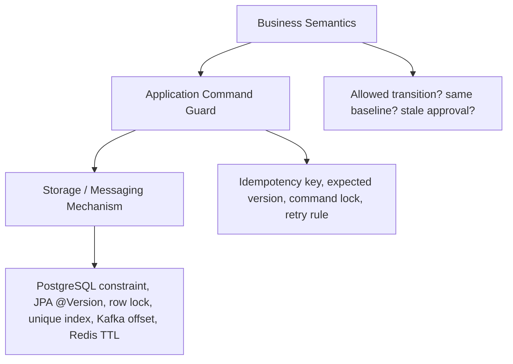
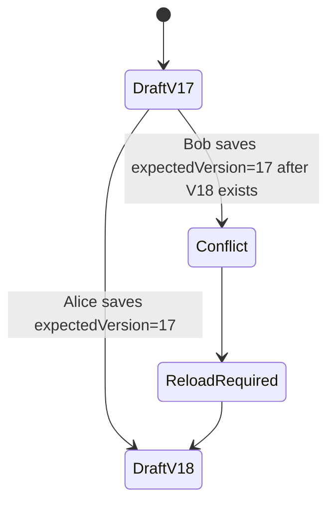
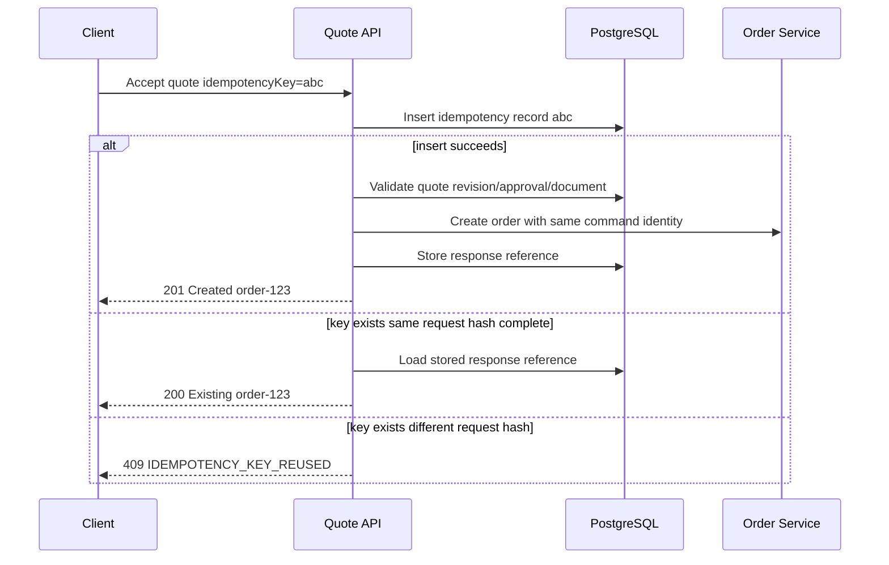
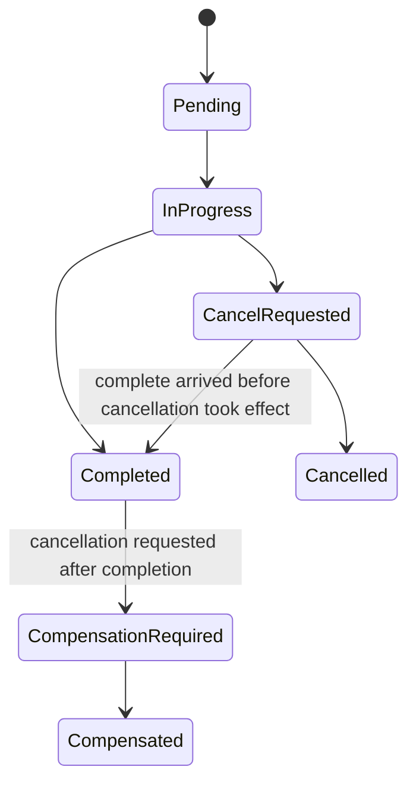

# Part 046 — Concurrency Control and Race Conditions

Concurrency bugs in CPQ/OMS are expensive because they do not look like normal bugs.

They look like business inconsistency:

- two users edit the same quote and one change disappears
- approval is granted for a price that is no longer current
- quote is accepted twice and creates two orders
- order is cancelled while fulfillment callback marks it completed
- inventory reservation is released after being confirmed
- Kafka event is consumed twice and projection increments wrong counter
- Camunda external task completes after timeout and another worker already retried
- Redis lock expires while work is still running
- optimistic lock retry creates a duplicated side effect

A top-level engineer treats concurrency as a domain-design problem, not only a database problem.

The core question is:

> what must be true if two valid actions happen close together?

---

## 1. Why CPQ/OMS Is Race-Prone

CPQ/OMS has many naturally concurrent actors:

| Actor | Concurrent action |
|---|---|
| Sales agent | edits quote lines |
| Sales manager | approves discount |
| Customer/partner | accepts quote |
| Pricing system | republishes price book |
| Product catalog | publishes new catalog version |
| Order service | creates order |
| Camunda workflow | advances fulfillment step |
| External fulfillment system | sends callback |
| Kafka consumer | updates projection |
| Reconciliation job | repairs stale state |
| Case worker | manually resolves fallout |

Concurrency is not exceptional.

It is the normal operating condition.

Therefore the design must state which actor wins, which action is rejected, which action is retried, and which action creates a new revision.

---

## 2. The Three Layers of Concurrency

Concurrency control has three layers.



Do not jump straight to locks.

First define business semantics.

Example:

> If quote revision changed after approval, the old approval cannot be used for acceptance.

Only after that do you choose mechanism:

- `approved_revision_id` must equal `accepted_revision_id`
- command checks expected revision
- DB constraint/order creation query enforces it
- event/audit records the rejection

---

## 3. Concurrency Vocabulary

Use precise terms.

| Term | Meaning |
|---|---|
| Lost update | two writers update same state; one silently overwrites the other |
| Double submit | same command executed twice |
| Stale decision | approval/price/config result used after input changed |
| Check-then-act race | code checks a condition, another transaction changes it, then code acts on stale assumption |
| ABA problem | state changes from A → B → A; simple state check misses intervening change |
| Duplicate event | same event processed more than once |
| Out-of-order event | later fact observed before earlier fact |
| Split brain authority | two services both think they own the same truth |
| Lock expiry race | distributed lock expires before protected work completes |
| Retry side effect | retry repeats a non-idempotent action |
| Unknown outcome | caller times out and cannot know whether callee acted |

These are not academic labels.

They are production failure categories.

---

## 4. Core Rule: Commands Must Carry Preconditions

A command should not say only:

```json
{
  "discountPercent": 25
}
```

It should say:

```json
{
  "quoteId": "q-123",
  "expectedQuoteVersion": 17,
  "expectedRevisionId": "qr-004",
  "discountPercent": 25,
  "reasonCode": "STRATEGIC_DEAL"
}
```

Preconditions make concurrency explicit.

Common CPQ/OMS preconditions:

| Command | Required precondition |
|---|---|
| edit quote line | expected quote version/revision |
| price quote | expected configuration version/catalog version |
| submit for approval | current price result id and config result id |
| approve quote | expected approval task id and revision id |
| accept quote | approved revision id, document artifact id, expected quote version |
| create order | accepted quote revision id, idempotency key |
| cancel order | expected order version/state |
| complete fulfillment step | expected step version/status |
| resolve fallout | expected fallout case version/status |

A command without preconditions is an invitation to race conditions.

---

## 5. Optimistic Locking as Default

For CPQ/OMS business aggregates, optimistic locking should usually be the default.

Why?

Because users mostly do not edit the exact same quote/order at the exact same millisecond, but when they do, silent overwrite is unacceptable.

JPA optimistic locking uses a version field to detect conflicting concurrent updates. In a typical mapping:

```java
@Entity
@Table(name = "quote")
public class QuoteEntity {

    @Id
    private UUID id;

    @Version
    @Column(name = "version", nullable = false)
    private long version;

    @Enumerated(EnumType.STRING)
    @Column(name = "status", nullable = false)
    private QuoteStatus status;

    // ...
}
```

The command checks expected version:

```java
public QuoteDto updateQuote(UUID quoteId, long expectedVersion, UpdateQuoteCommand command) {
    QuoteEntity quote = quoteRepository.findByIdForUpdateIntent(quoteId);

    if (quote.getVersion() != expectedVersion) {
        throw new ConflictException("QUOTE_VERSION_CONFLICT");
    }

    quote.apply(command);
    return mapper.toDto(quote);
}
```

Then JPA/database detects conflict if another transaction committed first.

Do not hide this from the user.

Return a conflict that says:

- quote changed
- reload required
- current version
- conflicting fields if safe to expose

### Bad Retry Pattern

Do not blindly retry user-edit commands after optimistic lock failure.

Bad:

```text
user edit fails optimistic lock
system reloads latest state
system reapplies user edit automatically
system saves
```

This can silently override another person’s decision.

Retry is acceptable for technical commands whose operation is known to be commutative/idempotent.

Retry is dangerous for semantic edits.

---

## 6. Pessimistic Locking: Use Narrowly

Pessimistic locking means blocking other writers earlier.

Use it only when business semantics require exclusivity or conflict cost is too high.

Examples:

| Case | Possible mechanism |
|---|---|
| allocate unique sequence-like business number | DB sequence/unique constraint, not application lock |
| claim outbox batch | `FOR UPDATE SKIP LOCKED` style claim |
| assign fallout case to one worker | row update with status/owner precondition |
| reserve scarce local resource | authority service transaction |
| process idempotency record | unique key + status transition |

Do not use pessimistic locks as a general solution for quote editing.

A quote can be open for minutes or hours. Database locks must not live that long.

### Lock Window Rule

A lock should protect a short critical section, not a human session.

Bad:

```text
user opens quote
system locks quote
user goes to lunch
all other users blocked
```

Better:

```text
user opens quote
system shows version 17
user submits command with expected version 17
system rejects if quote changed
```

---

## 7. PostgreSQL Constraints Beat Application Hope

If a business invariant must never be violated, put it in the database when possible.

Application checks are necessary.

They are not sufficient.

### Example: One Order Per Accepted Quote Revision

```sql
CREATE UNIQUE INDEX uq_order_quote_revision_primary
ON sales_order (quote_revision_id)
WHERE order_kind = 'PRIMARY';
```

Application logic may check first:

```sql
SELECT id FROM sales_order WHERE quote_revision_id = :revisionId;
```

But the unique index is what prevents a race between two submitters.

### Example: Idempotency Key

```sql
CREATE TABLE idempotency_record (
  tenant_id uuid NOT NULL,
  idempotency_key text NOT NULL,
  command_name text NOT NULL,
  request_hash text NOT NULL,
  status text NOT NULL,
  response_ref text,
  created_at timestamptz NOT NULL,
  updated_at timestamptz NOT NULL,
  PRIMARY KEY (tenant_id, command_name, idempotency_key)
);
```

The primary key is the concurrency control.

Not a `SELECT` before `INSERT`.

Use insert-first semantics:

```sql
INSERT INTO idempotency_record (...)
VALUES (...)
ON CONFLICT DO NOTHING;
```

Then decide whether this request owns execution or must return stored result/conflict.

---

## 8. Quote Edit Race

Scenario:

```text
T1: Alice loads quote version 17
T2: Bob loads quote version 17
T3: Alice changes term from 12 months to 24 months
T4: Bob adds discount 20%
T5: Alice saves version 18
T6: Bob saves based on version 17
```

Without concurrency control, Bob may overwrite Alice.

Correct behavior:

```text
Bob's command is rejected with QUOTE_VERSION_CONFLICT
Bob reloads version 18
Bob decides whether discount still applies
```

### State Diagram



### API Shape

```http
PATCH /quotes/q-123
If-Match: "17"
Idempotency-Key: edit-q123-abc
```

Conflict response:

```json
{
  "type": "https://errors.example.com/quote-version-conflict",
  "title": "Quote has changed",
  "status": 409,
  "code": "QUOTE_VERSION_CONFLICT",
  "detail": "The quote was modified after this workspace was loaded.",
  "quoteId": "q-123",
  "expectedVersion": 17,
  "currentVersion": 18,
  "safeUserAction": "RELOAD_AND_REAPPLY"
}
```

---

## 9. Price Staleness Race

Scenario:

```text
T1: Quote priced using catalog v2026.07 and price book p-44
T2: New price book p-45 is published
T3: User accepts quote based on p-44
```

The system must know whether old price is still valid.

Possible policies:

| Policy | Meaning |
|---|---|
| valid until quote expiry | old price result remains acceptable |
| reprice required on publish | quote must be repriced before submit/accept |
| reprice required on material change | only certain price book changes invalidate |
| approval required if stale | accept allowed only with authority |

Do not bury this in code.

Model it explicitly.

Quote price result must include:

```json
{
  "priceResultId": "pr-991",
  "priceBookVersion": "p-44",
  "catalogVersion": "2026.07",
  "pricedAt": "2026-07-02T10:00:00+07:00",
  "validUntil": "2026-07-09T23:59:59+07:00",
  "stalenessPolicy": "VALID_UNTIL_QUOTE_EXPIRY",
  "inputHash": "sha256:..."
}
```

Acceptance guard:

```text
accept quote only if:
  quote.revision_id == approved_revision_id
  price_result_id == approved_price_result_id
  price_result still acceptable under policy
  document artifact matches same revision
```

---

## 10. Approval Staleness Race

Scenario:

```text
T1: Quote revision 4 priced at IDR 100M with 20% discount
T2: Manager approves revision 4
T3: Sales changes line quantity, revision 5
T4: Sales attempts to accept quote using approval from revision 4
```

Correct behavior:

> approval for revision 4 cannot authorize revision 5.

Approval decision should bind to immutable facts:

```json
{
  "approvalDecisionId": "ap-123",
  "quoteId": "q-123",
  "quoteRevisionId": "qr-004",
  "priceResultId": "pr-991",
  "approvalRequirementId": "req-456",
  "decision": "APPROVED",
  "approvedBy": "manager-17",
  "authoritySnapshot": {
    "role": "REGIONAL_SALES_MANAGER",
    "maxDiscountPercent": 25,
    "region": "ID-JAVA"
  }
}
```

Acceptance must check the same IDs.

Never model approval as `quote.approved = true`.

That boolean is not enough evidence.

---

## 11. Double Submit Race

Scenario:

```text
T1: User clicks Accept Quote
T2: Browser retries due to network timeout
T3: User clicks again
T4: Partner integration also submits same accept command
```

Expected result:

- one order is created
- repeated same command returns same result
- different command with same idempotency key is rejected
- duplicate order is impossible by database constraint

### Idempotency Flow



### Database Protection

Use both:

1. idempotency record
2. unique order constraint

Why both?

The idempotency record handles API retry semantics.

The unique order constraint protects business invariant even if the idempotency layer has a bug.

---

## 12. Order Cancel vs Fulfillment Complete Race

Scenario:

```text
T1: Customer requests cancellation
T2: System sends cancel to fulfillment provider
T3: Provider sends complete callback for original fulfillment step
T4: Provider sends cancellation confirmed callback
```

Which state wins?

Wrong answer:

> whichever event arrives last.

Correct answer:

> state transition rules decide.

Example fulfillment step states:



If completion arrives after cancel requested, it may still be valid because external system already completed before cancellation took effect.

The order service must record facts:

- cancel requested at
- external complete received at
- external event id
- external event timestamp if trustworthy
- internal received timestamp
- final transition reason

Do not delete the contradiction.

Explain it.

---

## 13. External Callback Race

External callbacks can be:

- duplicate
- delayed
- out of order
- contradictory
- missing
- retried after timeout

Every callback must have an idempotency key or deduplication identity.

Example:

```sql
CREATE TABLE external_callback_record (
  tenant_id uuid NOT NULL,
  provider_name text NOT NULL,
  external_event_id text NOT NULL,
  received_at timestamptz NOT NULL,
  payload_hash text NOT NULL,
  processed_status text NOT NULL,
  PRIMARY KEY (tenant_id, provider_name, external_event_id)
);
```

Processing flow:

```text
insert callback record
if duplicate same hash -> return success
if duplicate different hash -> raise provider conflict
load fulfillment step
apply state transition if allowed
if transition impossible -> create fallout case
emit event/outbox
```

Never process callback side effects before deduplication.

---

## 14. Kafka Consumer Race

Kafka consumers are at-least-once in many practical designs.

Therefore consumers must be idempotent.

### Inbox Table

```sql
CREATE TABLE consumer_inbox (
  consumer_name text NOT NULL,
  event_id uuid NOT NULL,
  processed_at timestamptz NOT NULL,
  event_type text NOT NULL,
  aggregate_id uuid NOT NULL,
  PRIMARY KEY (consumer_name, event_id)
);
```

Consumer transaction:

```text
begin
  insert into consumer_inbox
  if duplicate -> commit and skip
  apply projection update
commit
```

### Projection Race

Bad projection update:

```sql
UPDATE quote_search
SET approval_count = approval_count + 1
WHERE quote_id = :quoteId;
```

If duplicate event arrives, count is wrong.

Better:

- store decision rows keyed by decision id
- derive count from unique facts
- use upsert with event identity

```sql
INSERT INTO quote_approval_projection_decision (
  quote_id,
  approval_decision_id,
  decision,
  decided_at
)
VALUES (...)
ON CONFLICT (approval_decision_id) DO NOTHING;
```

Then update aggregate projection from facts or use deterministic merge.

---

## 15. Out-of-Order Event Race

Scenario:

```text
OrderCreated version 1
OrderCancelled version 3
OrderSubmitted version 2
```

Consumer sees version 3 before version 2.

Options:

| Strategy | Use when |
|---|---|
| version-aware ignore older | projection only needs latest state |
| buffer missing versions | strict sequence needed |
| rebuild from authority | projection can query source |
| event-sourced reducer | complete ordered stream per aggregate |

For most CPQ/OMS projections, a version-aware merge is practical:

```sql
UPDATE order_search_projection
SET status = :eventStatus,
    aggregate_version = :eventVersion,
    updated_at = now()
WHERE order_id = :orderId
  AND aggregate_version < :eventVersion;
```

This prevents older events from moving projection backward.

But it does not recover missing details if version 2 carried data needed by version 3.

Design events accordingly.

---

## 16. Camunda External Task Race

External task worker pattern introduces its own races.

Scenario:

```text
T1: worker A locks task for 30s
T2: worker A calls external provider, slow response
T3: lock expires
T4: worker B locks same task
T5: both workers attempt side effect
```

The external side effect must be idempotent.

Camunda lock is not the final business protection.

Design worker command:

```json
{
  "orderId": "ord-123",
  "fulfillmentStepId": "fs-88",
  "workflowTaskId": "camunda-task-xyz",
  "attemptId": "attempt-001",
  "idempotencyKey": "fulfillment:fs-88:reserve-inventory"
}
```

Domain service protects:

```text
execute fulfillment step only if:
  step status is PENDING or RETRYABLE
  command name not already completed for step
  expected step version matches
```

External provider receives stable idempotency key if supported.

If not supported, reconciliation must handle unknown outcome.

---

## 17. Camunda Process Start Race

Scenario:

```text
T1: order service commits order
T2: starts Camunda process
T3: timeout occurs before response
T4: retry starts another process
```

Use a deterministic business key and process start idempotency strategy.

Options:

1. store workflow correlation record in order DB
2. use unique business key discipline at application level
3. reconcile orders with missing workflow
4. do not assume timeout means process did not start

Correlation table:

```sql
CREATE TABLE workflow_correlation (
  tenant_id uuid NOT NULL,
  aggregate_type text NOT NULL,
  aggregate_id uuid NOT NULL,
  workflow_name text NOT NULL,
  business_key text NOT NULL,
  process_instance_id text,
  status text NOT NULL,
  created_at timestamptz NOT NULL,
  updated_at timestamptz NOT NULL,
  PRIMARY KEY (tenant_id, aggregate_type, aggregate_id, workflow_name)
);
```

If process start times out:

- mark correlation `START_UNKNOWN`
- reconciliation queries Camunda by business key or process variables
- if found, attach process instance id
- if not found after safe interval, retry start

Unknown outcome is a state, not an exception log.

---

## 18. Redis Lock Race

Redis locks are often overused.

The dangerous pattern:

```text
acquire Redis lock TTL 30s
perform work 45s
lock expires
another worker acquires lock
both perform work
```

A Redis lock can reduce duplicate work.

It should not be the only correctness mechanism for money/order/approval.

For critical commands, use database constraints and idempotency records.

Redis lock is acceptable for:

- cache rebuild stampede prevention
- low-value duplicate background work reduction
- short-lived local coordination where correctness is still enforced elsewhere

It is not acceptable as sole protection for:

- one order per quote
- one approval decision per task
- inventory reservation authority
- payment capture
- contract signing

---

## 19. ABA Problem in CPQ/OMS

ABA means state returns to the same visible value, hiding intermediate changes.

Scenario:

```text
Quote status = DRAFT
User loads quote
Quote becomes SUBMITTED
Approval rejected
Quote returns to DRAFT
User saves old draft command because status is DRAFT again
```

If command checks only status, it passes incorrectly.

Use version/revision, not status alone.

Bad precondition:

```text
status == DRAFT
```

Good precondition:

```text
status == DRAFT
and quote_version == expectedVersion
and quote_revision_id == expectedRevisionId
```

State is not enough.

History matters.

---

## 20. Check-Then-Act Race

Bad:

```java
if (!orderRepository.existsForQuoteRevision(revisionId)) {
    orderRepository.createOrder(revisionId);
}
```

Two requests can both pass the check.

Better:

```java
try {
    orderRepository.createOrderWithUniqueQuoteRevision(revisionId);
} catch (UniqueConstraintViolation e) {
    return orderRepository.findByQuoteRevision(revisionId);
}
```

Or use explicit idempotency flow.

The rule:

> do not separate eligibility check from state change unless storage enforces the invariant.

---

## 21. Retry Rules

Retries are dangerous unless classified.

| Operation | Retry? | Why |
|---|---|---|
| read catalog | yes | no side effect |
| price preview | yes if deterministic | no committed side effect, but watch CPU |
| save quote edit | usually no automatic semantic retry | may overwrite human edit |
| create order | yes with idempotency key | must return same result |
| start workflow | yes with correlation/unknown outcome handling | timeout ambiguity |
| send notification | yes with delivery idempotency | duplicate communication risk |
| external reservation | yes only with provider idempotency/reconciliation | unknown outcome |
| payment capture | yes only with provider idempotency | financial duplicate risk |

Retry must include:

- max attempts
- backoff
- idempotency identity
- timeout budget
- error classification
- audit/failure record

No infinite retry loops.

No retry without ownership of side-effect semantics.

---

## 22. Transaction Boundary Rules

Do not hold DB transactions while doing remote work.

Bad:

```text
begin transaction
  update order status
  call inventory service
  call payment service
  start Camunda process
commit
```

Better:

```text
begin transaction
  validate command
  update order state
  write audit
  write outbox/workflow command
commit

async worker/process performs remote work with idempotency
```

Transaction should protect local truth.

Workflow/events coordinate external side effects.

### Short Transaction Pattern

```java
@Transactional
public OrderCreatedResult createOrder(CreateOrderCommand command) {
    IdempotencyDecision idem = idempotency.claim(command.identity());
    if (idem.isReplay()) return idem.replay();

    QuoteSnapshot quote = quoteRepository.loadAcceptedRevision(command.quoteRevisionId());
    OrderEntity order = OrderEntity.fromAcceptedQuote(quote, command);

    orderRepository.insert(order);
    audit.record(OrderAudit.created(order));
    outbox.record(OrderEvents.created(order));
    workflowOutbox.record(StartOrderWorkflow.forOrder(order));

    idempotency.complete(command.identity(), order.id());
    return new OrderCreatedResult(order.id());
}
```

Remote calls happen after commit.

---

## 23. Aggregate Design and Hot Rows

A common performance/concurrency bug is over-centralizing state.

Bad design:

```text
order header row updated every time any fulfillment step changes
```

If an order has many parallel steps, the header becomes a hot row.

Better:

- fulfillment steps have their own rows and versions
- order header updates only on meaningful aggregate state transition
- derived progress is computed/projected
- state transition function decides when order status changes

Example:

```sql
UPDATE fulfillment_step
SET status = :newStatus,
    version = version + 1
WHERE id = :stepId
  AND version = :expectedVersion;
```

Then evaluate whether order status can move:

```sql
UPDATE sales_order
SET status = 'FULFILLED', version = version + 1
WHERE id = :orderId
  AND status = 'IN_PROGRESS'
  AND NOT EXISTS (
    SELECT 1 FROM fulfillment_step
    WHERE order_id = :orderId
      AND status NOT IN ('COMPLETED', 'SKIPPED')
  );
```

This update is safe because it encodes the condition at update time.

---

## 24. Concurrency Control Matrix

| Race | Primary protection | Secondary protection |
|---|---|---|
| quote edit lost update | expected version + JPA `@Version` | transition log |
| stale price acceptance | price result id/revision check | acceptance guard + audit |
| stale approval | approval bound to revision/price result | Camunda task completion validation |
| double order creation | idempotency key | unique index on quote revision |
| duplicate external callback | callback dedup table | state transition guard |
| duplicate Kafka event | inbox table | idempotent projection merge |
| out-of-order Kafka event | aggregate version | rebuild/reconciliation |
| external task duplicate execution | domain step idempotency | provider idempotency key |
| workflow start timeout | workflow correlation record | reconciliation by business key |
| Redis lock expiry | DB invariant | idempotency record |
| manual fallout conflict | fallout case version | assignment/authority guard |
| order cancel vs complete | transition matrix | compensation path |

This matrix should exist in architecture docs.

If nobody can explain the protection for each race, the system is not production-grade.

---

## 25. Testing Race Conditions

Race conditions must be tested intentionally.

Unit tests are not enough.

### Example: Double Submit Test

```java
@Test
void acceptingSameQuoteTwiceCreatesOnlyOneOrder() throws Exception {
    AcceptedQuote quote = fixture.acceptedQuote();

    ExecutorService pool = Executors.newFixedThreadPool(2);
    CountDownLatch start = new CountDownLatch(1);

    Callable<OrderResult> task = () -> {
        start.await();
        return quoteApi.acceptQuote(
            quote.id(),
            quote.revisionId(),
            "same-idempotency-key"
        );
    };

    Future<OrderResult> f1 = pool.submit(task);
    Future<OrderResult> f2 = pool.submit(task);
    start.countDown();

    OrderResult r1 = f1.get();
    OrderResult r2 = f2.get();

    assertThat(r1.orderId()).isEqualTo(r2.orderId());
    assertThat(orderRepository.countByQuoteRevision(quote.revisionId())).isEqualTo(1);
}
```

### Example: Stale Approval Test

```java
@Test
void approvalCannotBeUsedAfterQuoteRevisionChanges() {
    Quote quote = fixture.quotePricedAndSubmitted();
    Approval approval = approvalService.approve(quote.currentRevisionId());

    quoteService.editLine(quote.id(), quote.version(), editQuantity());

    assertThatThrownBy(() ->
        quoteService.acceptQuote(
            quote.id(),
            approval.quoteRevisionId(),
            approval.priceResultId()
        )
    ).hasErrorCode("STALE_APPROVAL");
}
```

### Example: Out-of-Order Projection Test

```java
@Test
void olderOrderEventDoesNotMoveProjectionBackwards() {
    projection.apply(orderCancelled(version(3)));
    projection.apply(orderSubmitted(version(2)));

    OrderProjection row = projection.find(orderId);
    assertThat(row.status()).isEqualTo("CANCELLED");
    assertThat(row.aggregateVersion()).isEqualTo(3);
}
```

### Required Race Tests

- [ ] two users edit same quote
- [ ] approval completes after quote revision changes
- [ ] accept quote twice
- [ ] accept quote while quote expires
- [ ] create order while price book changes
- [ ] cancel order while fulfillment completes
- [ ] duplicate external callback
- [ ] out-of-order external callback
- [ ] duplicate Kafka event
- [ ] out-of-order Kafka event
- [ ] Camunda external task lock expires
- [ ] process start timeout then retry
- [ ] fallout case claimed by two workers
- [ ] Redis lock expires before work completes
- [ ] reconciliation races with normal callback

---

## 26. Observability for Concurrency

You cannot debug races without evidence.

Log structured fields:

| Field | Why |
|---|---|
| `tenantId` | isolate tenant impact |
| `aggregateType` | quote/order/step/case |
| `aggregateId` | trace object |
| `expectedVersion` | detect stale command |
| `actualVersion` | conflict analysis |
| `commandId` | command identity |
| `idempotencyKey` | retry/double-submit analysis |
| `eventId` | Kafka duplicate analysis |
| `processInstanceId` | Camunda trace |
| `businessKey` | business workflow trace |
| `externalRequestId` | provider call trace |
| `externalEventId` | callback dedup |
| `transitionFrom` / `transitionTo` | lifecycle correctness |
| `conflictCode` | race classification |

Metrics:

| Metric | Meaning |
|---|---|
| optimistic lock conflicts by command | edit contention |
| idempotency replay count | retry/double-submit frequency |
| idempotency hash conflict count | client misuse/bug |
| duplicate callback count | provider behavior |
| stale approval rejection count | approval/revision friction |
| stale price rejection count | pricing/catalog drift impact |
| Kafka duplicate skipped count | consumer idempotency activity |
| out-of-order event ignored count | partitioning/versioning issue |
| workflow start unknown count | Camunda/API timeout issue |
| lock wait p95 | DB contention |
| deadlock count | lock ordering bug |

A race should produce a named metric, not only an exception.

---

## 27. Anti-Patterns

### Anti-Pattern 1 — “Just Use Synchronized”

`synchronized` protects only one JVM instance.

It does not protect:

- multiple service pods
- database writes from another service
- Kafka consumers
- Camunda workers
- external callbacks

Use it only for local in-memory structures, not business correctness.

### Anti-Pattern 2 — “Redis Lock Solves It”

Redis lock can reduce duplicate work.

It does not replace database invariants.

### Anti-Pattern 3 — “Retry Everything”

Retry without idempotency creates duplicate side effects.

Retry without semantic awareness overwrites human decisions.

### Anti-Pattern 4 — “Status Check Is Enough”

Status can return to the same value.

Use version/revision/decision IDs.

### Anti-Pattern 5 — “Events Are Ordered Globally”

Kafka does not give useful global business ordering across all aggregates.

Design per-aggregate ordering and version-aware consumers.

### Anti-Pattern 6 — “Camunda Is the Source of Truth”

Camunda owns workflow execution state.

Domain service owns business truth.

### Anti-Pattern 7 — “UI Disable Button Prevents Double Submit”

UI prevention is helpful.

Server-side idempotency is mandatory.

---

## 28. Design Review Questions

Ask these before approving any CPQ/OMS feature:

1. What happens if the command is sent twice?
2. What happens if two users perform this command concurrently?
3. What precondition does the command carry?
4. What database constraint enforces the invariant?
5. What is the aggregate version/revision check?
6. Can the approval/price/config become stale?
7. What happens if Kafka publishes/consumes duplicate event?
8. What happens if event arrives out of order?
9. What happens if Camunda external task is executed twice?
10. What happens if process start times out?
11. What happens if external provider acts but response is lost?
12. What happens if Redis lock expires?
13. Is retry safe? Why?
14. Is manual resolution versioned and audited?
15. Which metric proves this race happened?

If a feature owner cannot answer these, the feature is not ready.

---

## 29. Mental Model

Concurrency control is not one mechanism.

It is a stack:

```text
business invariant
  -> command precondition
  -> aggregate version/revision
  -> idempotency identity
  -> database constraint
  -> transaction boundary
  -> event identity/version
  -> workflow correlation
  -> external idempotency/reconciliation
  -> audit/observability
```

Every layer catches a different failure.

A production-grade CPQ/OMS system does not rely on luck that commands arrive in a nice order.

It assumes disorder.

Then it makes disorder safe.

---

## 30. Closing

A race condition is not merely two threads touching the same variable.

In enterprise CPQ/OMS, a race condition is any situation where two true business facts compete to change the same commercial or fulfillment reality.

The solution is not “add locks everywhere”.

The solution is to model the business truth precisely:

- what can change
- who can change it
- based on which version
- with which authority
- producing which immutable evidence
- protected by which storage invariant
- recoverable by which workflow/reconciliation path

That is the difference between a demo system and a production-grade order platform.
