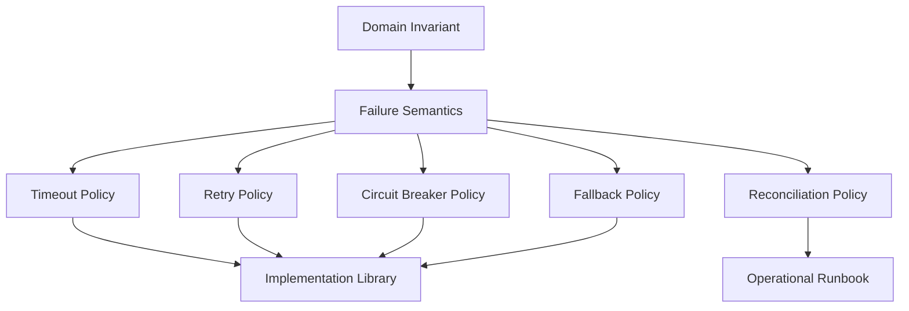
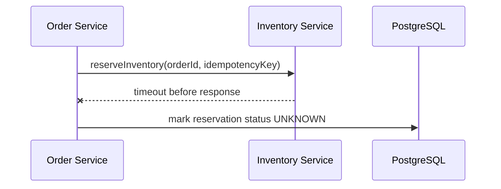
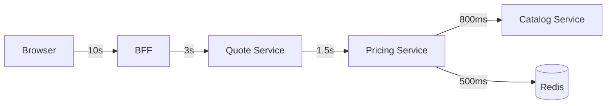
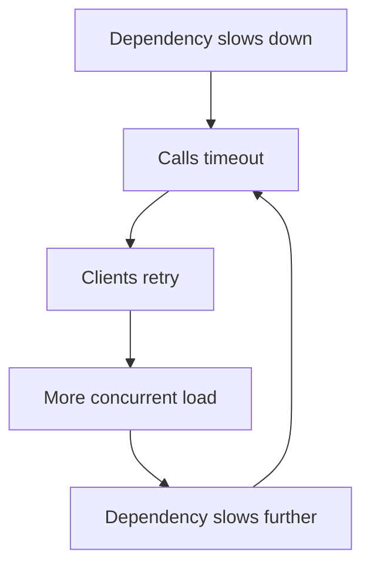
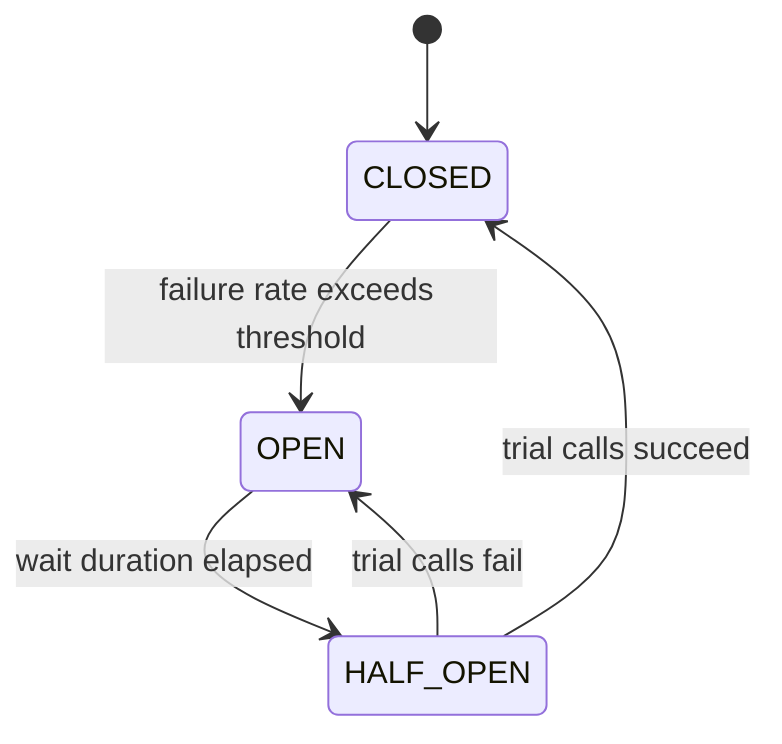
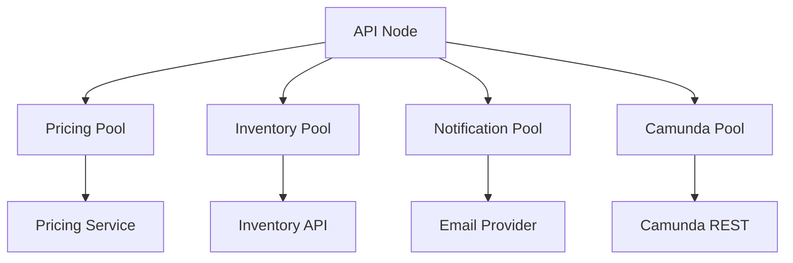
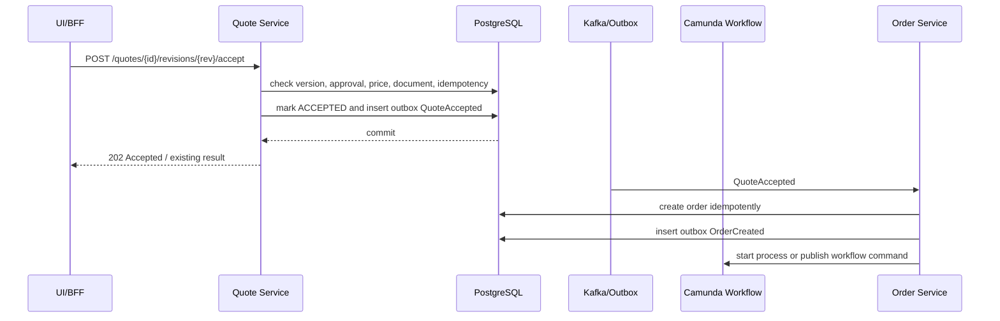

# Part 047 — Resilience: Retry, Timeout, and Circuit Breaking

A production CPQ/OMS platform is not resilient because every dependency is always available.

It is resilient because every dependency is allowed to fail in a controlled way.

The wrong mental model is:

> call the dependency, retry if it fails, and hope the system recovers.

The right mental model is:

> every remote call has a failure contract, every retry has a budget, every timeout has a caller-visible consequence, every fallback preserves a domain invariant, and every unknown outcome has a reconciliation path.

In CPQ/OMS, resilience bugs are not only technical incidents.

They become business defects:

- quote submitted twice
- price calculated from stale catalog
- order stuck after payment authorization
- inventory reserved but order failed
- approval completed after quote changed
- notification sent repeatedly
- fulfillment callback lost
- case worker manually fixes data without audit

Resilience is therefore a domain-design discipline.

---

## 1. The Resilience Objective

The objective is not to hide all failures.

The objective is to keep the system honest.

A resilient CPQ/OMS must know the difference between:

| Situation | Correct response |
|---|---|
| Dependency definitely rejected request | Surface business/technical failure |
| Dependency definitely accepted request | Commit local state and continue |
| Dependency did not answer | Treat as unknown outcome |
| Dependency is overloaded | Stop sending more load |
| Dependency is slow | Bound waiting time |
| Dependency is intermittently failing | Retry only when safe |
| Dependency is down | Fail fast or degrade safely |
| Consumer cannot process event | Quarantine, alert, and preserve evidence |

The most dangerous state is not `FAILED`.

The most dangerous state is `UNKNOWN`.

A top-level engineer designs for `UNKNOWN` explicitly.

---

## 2. Resilience Is a Contract, Not a Library

Libraries can provide retry, timeout, circuit breaker, rate limiter, bulkhead, and fallback.

They cannot decide whether retrying `SubmitQuote` is safe.

They cannot decide whether a stale price preview is acceptable.

They cannot decide whether an inventory reservation should be reconciled or compensated.

That is domain work.



A resilience policy starts with questions like:

- What happens if the dependency answers after our timeout?
- Can this command be safely retried?
- Does this command have an idempotency key?
- Can we compensate the side effect?
- Can we reconcile the final state later?
- Is degraded behavior allowed for this journey?
- Should the user see failure, pending, or stale result?

Only after that do we choose library annotations or decorators.

---

## 3. Failure Taxonomy

Do not put all failures into one `Exception` bucket.

CPQ/OMS needs a failure taxonomy because each class requires different treatment.

| Failure type | Example | Retry? | User-visible state |
|---|---|---:|---|
| Validation failure | invalid quote line | No | rejected |
| Authorization failure | user cannot approve discount | No | forbidden |
| Business conflict | quote revision stale | No | conflict |
| Dependency timeout | inventory API did not answer | Maybe | pending/unknown |
| Dependency 5xx | billing unavailable | Maybe | pending/failure |
| Rate limited | CRM returns 429 | Later | delayed |
| Network failure | connection reset | Maybe | unknown |
| Duplicate request | same idempotency key | Return previous result | same as original |
| Poison message | event schema invalid | No | DLQ/fallout |
| Partial side effect | payment authorized, order failed | No blind retry | compensation/reconciliation |

The key is not whether an exception happened.

The key is what the system knows after the exception.

---

## 4. The Unknown Outcome Problem

Consider this flow:



The timeout does not prove reservation failed.

It proves only that the caller stopped waiting.

The remote service may have:

- never received the request
- received and rejected it
- received and accepted it
- accepted it but failed before responding
- responded but response was lost

Therefore the local state should not become `RESERVATION_FAILED` automatically.

It should become something like:

```text
RESERVATION_UNKNOWN
```

Then a reconciliation job or workflow step asks the remote system:

```text
What is the reservation status for order O-123 and idempotency key K-456?
```

Without this pattern, retries create duplicate reservations, duplicate payments, duplicate orders, and duplicate notifications.

---

## 5. Timeout Design

A timeout is a business decision expressed as a technical limit.

It answers:

> how long is the caller allowed to wait before the interaction becomes operationally unsafe or economically wasteful?

Timeouts must be set at every boundary:



The inner timeout must be shorter than the outer timeout.

Otherwise the caller times out while the callee is still doing work, causing wasted load and unknown outcomes.

### Timeout Budget Example

| Segment | Budget |
|---|---:|
| Browser wait | 10s |
| BFF aggregate quote workspace | 4s |
| Quote service command | 2.5s |
| Pricing service call | 1.5s |
| Catalog cache lookup | 100ms |
| Catalog database fallback | 800ms |
| Observability/export overhead | bounded/non-blocking |

Timeouts should not be copied across endpoints.

A preview price endpoint, quote acceptance endpoint, and order fulfillment callback have different consequences.

---

## 6. Retry Design

Retry is useful only when the failure is transient and the operation is safe to repeat.

Retry is dangerous when it multiplies side effects.

### Retry-Safe Categories

| Operation | Retry safe? | Required condition |
|---|---:|---|
| Read product offering | Yes | no side effect |
| Calculate price preview | Usually | deterministic input or idempotency key |
| Submit quote | Yes, if designed | idempotency key + optimistic version |
| Accept quote | Yes, if designed | idempotency key + quote revision lock |
| Create order | Yes, if designed | idempotency key + unique quote revision constraint |
| Reserve inventory | Only if designed | remote idempotency key |
| Authorize payment | Only if designed | remote idempotency key + status lookup |
| Send notification | Only if designed | communication idempotency key |
| Complete Camunda external task | Handle carefully | task lock/version semantics |

A retry policy must include:

- maximum attempts
- backoff
- jitter
- retryable error classes
- non-retryable error classes
- total elapsed time limit
- idempotency requirement
- observability tag
- fallback/reconciliation behavior after exhaustion

### Bad Retry

```text
retry 5 times on every Exception
```

This is not resilience.

This is denial-of-service against your own dependencies.

### Better Retry Contract

```text
Operation: reserveInventory
Retryable:
  - connection reset before response
  - HTTP 503
  - HTTP 429 with Retry-After
Non-retryable:
  - HTTP 400
  - HTTP 401/403
  - business rejection
  - duplicate incompatible idempotency key
Attempts:
  - 3 attempts max
Backoff:
  - exponential + jitter
After exhaustion:
  - mark reservation UNKNOWN
  - create reconciliation task
  - emit OrderReservationUnresolved event
```

---

## 7. Retry Storms

A retry storm happens when many callers retry at the same time against a weak dependency.

The dependency becomes slower, causing more retries, causing more load.



Controls:

- exponential backoff
- jitter
- bounded attempts
- client-side concurrency limit
- circuit breaker
- queue depth limit
- load shedding
- idempotency
- dependency-level SLO alert

In CPQ/OMS, retry storms commonly happen around pricing, inventory, billing, notification, and workflow external task workers.

---

## 8. Circuit Breaker Design

A circuit breaker is a failure containment mechanism.

It prevents repeated calls to a dependency that is already failing.



### When to Use Circuit Breaker

Use it for remote dependencies where repeated failure can create cascading damage:

- pricing service calling catalog service
- order service calling inventory API
- order service calling billing/payment API
- notification service calling email provider
- BFF calling multiple backend services
- external task worker calling an external fulfillment system

### When Not to Use It Blindly

Do not use circuit breaker as an excuse to return fake success.

Bad fallback:

```text
Inventory service down -> assume inventory available
```

Good fallback:

```text
Inventory service down -> return availability unknown; allow quote draft but block quote acceptance/order submission depending on policy
```

A circuit breaker should protect capacity and truth.

It should not invent truth.

---

## 9. Fallback Design

A fallback is safe only when it preserves domain invariants.

| Scenario | Unsafe fallback | Safer fallback |
|---|---|---|
| Pricing unavailable | use zero price | block final quote, allow draft |
| Catalog unavailable | use random last-known option | use versioned cached catalog if within stale budget |
| Inventory unavailable | assume available | mark availability unknown |
| Approval policy unavailable | skip approval | require manual review or block submit |
| Notification provider down | drop notification | persist communication pending and retry |
| Search index unavailable | show empty result as truth | show degraded search or fallback to DB-limited query |

Fallback is not always necessary.

Sometimes the correct response is explicit failure.

A quote acceptance endpoint should often fail rather than silently proceed with uncertain pricing or approval.

---

## 10. Bulkhead Design

A bulkhead limits damage by isolating resources.

Without bulkheads, one slow dependency can exhaust every worker thread and connection pool.



Bulkhead examples:

- separate HTTP client pools per dependency
- separate worker pools per external task topic
- separate Kafka consumer groups per projection type
- separate database connection pools for OLTP and reporting
- separate Camunda job executor tuning for workflow workloads
- separate queue/topic for slow notification provider

A single shared thread pool for all outbound calls is a common enterprise failure amplifier.

---

## 11. Rate Limiting and Load Shedding

Rate limiting protects a dependency.

Load shedding protects the service itself.

Examples:

| Boundary | Control |
|---|---|
| Public quote preview API | per-user/per-tenant rate limit |
| Pricing service | max concurrent calculations |
| Catalog publish | single active publication per tenant |
| Order submit | idempotency + queue depth limit |
| Notification service | provider-specific rate limit |
| External task worker | max tasks per fetch/worker |
| BFF | reject large search/export requests early |

Load shedding should fail early with clear errors.

Slow failure is worse than fast rejection because it consumes capacity and creates timeout cascades.

---

## 12. Kafka Resilience

Kafka does not eliminate failure.

It changes the failure shape.

Producer-side concerns:

- event must be emitted only after domain commit
- outbox must track publish state
- producer retry must not publish incompatible duplicate event
- partition key must preserve aggregate ordering where needed
- publish latency must be observable

Consumer-side concerns:

- consumer must be idempotent
- handler must separate retryable vs poison failure
- failed event must preserve original payload and headers
- DLQ must be searchable and replayable
- projection lag must be visible
- consumer retry must not block unrelated partitions indefinitely without policy

### Consumer Failure Policy

| Failure | Action |
|---|---|
| DB deadlock/transient error | retry with backoff |
| downstream service unavailable | retry or pause depending on handler |
| invalid schema | DLQ immediately |
| unknown aggregate | retry briefly, then DLQ/fallout |
| duplicate event | acknowledge using inbox/dedup record |
| out-of-order event | buffer, reject, or rebuild depending on projection |

Do not hide DLQ under the rug.

A DLQ is an operational inbox.

It needs ownership, SLA, replay tooling, and audit.

---

## 13. Camunda 7 Resilience Boundary

Camunda 7 already has failure and retry mechanisms.

But domain services must still decide what the failure means.

Important distinctions:

| Camunda concept | Meaning |
|---|---|
| BPMN error | expected business error path |
| Technical exception | unexpected technical failure |
| Failed job | job failed during execution |
| Incident | job cannot be automatically retried further |
| External task failure | worker reports failure and retry count |
| External task BPMN error | worker reports modeled business error |
| Timer event | explicit wait/escalation boundary |

### Rule

Use BPMN error for modeled business alternatives.

Use technical failure/retry for infrastructure or transient dependency problems.

Bad:

```text
Inventory says NOT_AVAILABLE -> throw RuntimeException and create incident
```

Better:

```text
Inventory says NOT_AVAILABLE -> throw BPMN business error or complete task with domain result, route to modeled fallback path
```

Bad:

```text
Inventory API timeout -> BPMN error "InventoryUnavailable"
```

Better:

```text
Inventory API timeout -> external task failure with retry; after retry exhaustion, route to fallout/reconciliation policy
```

---

## 14. External Task Worker Resilience

External task workers are natural bulkhead points.

Each worker topic should have its own policy.

Example worker topics:

| Topic | Dependency | Retry policy | Failure path |
|---|---|---|---|
| `reserve-inventory` | inventory API | short retry + unknown outcome reconciliation | fallout if unresolved |
| `activate-service` | provisioning API | longer retry | fallout/manual recovery |
| `create-billing-subscription` | billing API | retry with idempotency | reconciliation |
| `send-order-confirmation` | notification service | async retry | communication pending |
| `generate-quote-document` | document service | retry | artifact generation failed |

Worker design checklist:

- lock duration longer than expected processing time
- worker heartbeat/extend lock if supported by design
- idempotency key per external call
- safe handling when complete call fails
- failure details sanitized
- correlation id propagated
- business key logged
- no long DB transaction around remote call
- no unbounded thread pool

---

## 15. Redis Failure Policy

Redis is an accelerator in this architecture.

It is not the authority.

Therefore Redis failure policy should usually be:

| Redis usage | Failure behavior |
|---|---|
| catalog cache | fallback to DB/service if capacity allows |
| price preview cache | recompute or return degraded response |
| idempotency fast-path | fallback to PostgreSQL idempotency table for authoritative operations |
| rate limit | fail closed for abusive public API; fail open only for trusted low-risk internal flow |
| distributed lock | treat lock failure as inability to safely proceed |
| worklist cache | rebuild from projection store |
| ephemeral UI state | allow user refresh |

Never store the only copy of quote/order truth in Redis.

Never make Redis lock the only guard against duplicate order creation.

---

## 16. PostgreSQL Failure Policy

PostgreSQL is the authority.

If PostgreSQL is unavailable for write operations, the system should not pretend it can commit business truth.

Patterns:

- fail fast when connection pool is exhausted
- use separate pool limits per service
- use transaction timeout
- use statement timeout for expensive queries
- do not hold transactions across remote calls
- keep OLTP queries separate from reporting/export workloads
- expose pool saturation metrics
- use idempotency table for command deduplication
- use unique constraints as final correctness guard

A queue of blocked HTTP requests waiting for DB connections is not resilience.

It is delayed failure.

---

## 17. End-to-End Example: Accept Quote

Accepting a quote is one of the most important flows.



Failure handling:

| Failure point | Correct behavior |
|---|---|
| Client retries accept | return same idempotent result |
| DB optimistic conflict | return conflict, no side effect |
| Outbox publisher fails | quote remains accepted; event pending |
| Order consumer receives duplicate | dedupe by quote revision/order constraint |
| Workflow start timeout | mark workflow start unknown and reconcile |
| Order creation fails due validation | create fallout, do not silently unaccept quote |

The quote acceptance transaction should not call inventory, billing, document generation, notification, and Camunda synchronously in one giant transaction.

It should commit the business fact and then drive the rest through controlled asynchronous mechanisms.

---

## 18. Resilience Matrix

Every dependency needs a matrix.

Example:

| Dependency | Called by | Timeout | Retry | Circuit breaker | Fallback | Reconciliation |
|---|---|---:|---|---|---|---|
| Catalog Service | Pricing, BFF | 800ms-2s | read retry | yes | versioned cache | catalog version check |
| Pricing Service | Quote, BFF | 1.5s-3s | careful | yes | preview only; no final fallback | reprice command |
| Inventory API | Order workflow | 2s-5s | idempotent retry | yes | unknown availability | reservation status query |
| Billing API | Order workflow | 3s-8s | idempotent retry | yes | pending billing | billing status query |
| Email Provider | Notification | 3s-10s | async retry | yes | pending communication | provider message status |
| Camunda REST | Domain services | 2s-5s | idempotent start/correlation | yes | workflow command outbox | process instance lookup |
| Redis | Services | 50ms-200ms | limited | maybe | DB/service fallback | cache rebuild |
| PostgreSQL | Service owner | strict statement tx timeout | app-level retry only for safe transient cases | no | no fake commit | restore/repair |

This matrix should live beside the ADRs.

It should be reviewed whenever an endpoint or workflow changes.

---

## 19. Java Implementation Strategy

For this stack, do not depend on framework magic hidden inside controllers.

Keep resilience policies at adapter boundaries.

Recommended layering:

```text
JAX-RS Resource
  -> Application Service
    -> Domain Service
    -> Repository
    -> Outbound Port
      -> Resilient Adapter
        -> HTTP/JMS/Kafka/Redis client
```

The domain service should not know whether an outbound call used Resilience4j, MicroProfile Fault Tolerance, custom executor, or raw client timeout.

It should receive a meaningful result:

```java
sealed interface AvailabilityResult permits Available, NotAvailable, AvailabilityUnknown {}
```

or in older Java style:

```java
public final class AvailabilityResult {
    public enum Status { AVAILABLE, NOT_AVAILABLE, UNKNOWN }

    private final Status status;
    private final String externalReference;
    private final String reasonCode;
}
```

Avoid returning raw `IOException`, `TimeoutException`, or `WebApplicationException` into domain logic.

Map technical failure into domain-aware uncertainty.

---

## 20. Example: Outbound Adapter Policy

Pseudo-shape:

```java
public final class InventoryReservationAdapter implements InventoryReservationPort {

    private final InventoryHttpClient client;
    private final ReservationResiliencePolicy policy;

    @Override
    public ReservationAttemptResult reserve(ReservationCommand command) {
        try {
            return policy.execute(() -> client.reserve(command));
        } catch (BusinessRejectionException ex) {
            return ReservationAttemptResult.rejected(ex.reasonCode());
        } catch (TimeoutException | NetworkException ex) {
            return ReservationAttemptResult.unknown(command.idempotencyKey(), ex.getClass().getSimpleName());
        } catch (CircuitOpenException ex) {
            return ReservationAttemptResult.deferred("INVENTORY_CIRCUIT_OPEN");
        }
    }
}
```

The application service can then persist truthfully:

```text
reservation_status = UNKNOWN
unknown_reason = TIMEOUT
reconciliation_required = true
```

That is better than pretending a timeout is either success or failure.

---

## 21. Configuration Principles

Do not hardcode resilience values inside business code.

Use configuration with explicit names:

```yaml
resilience:
  inventoryReservation:
    timeoutMillis: 3000
    maxAttempts: 3
    backoffInitialMillis: 200
    backoffMaxMillis: 2000
    jitter: true
    circuitBreaker:
      failureRateThreshold: 50
      minimumCalls: 20
      openDurationSeconds: 30
    bulkhead:
      maxConcurrentCalls: 50
  quotePricing:
    timeoutMillis: 1500
    maxAttempts: 2
    fallbackAllowedForPreview: true
    fallbackAllowedForFinalQuote: false
```

Name the policy after the business interaction, not only the dependency.

`inventoryReservation` and `inventoryLookup` may have different policies even if both call the same external inventory system.

---

## 22. Observability for Resilience

Every resilience mechanism must produce telemetry.

Minimum metrics:

| Metric | Meaning |
|---|---|
| dependency latency | remote boundary performance |
| timeout count | calls exceeding allowed wait |
| retry attempts | retry pressure |
| retry exhausted count | policy failures |
| circuit state | open/half-open/closed |
| bulkhead rejection | saturation/load shedding |
| fallback count | degraded behavior frequency |
| unknown outcome count | reconciliation pressure |
| DLQ count | event processing failures |
| external task failure count | workflow dependency instability |
| idempotency replay count | duplicate/retry behavior |

Every log line should include:

- correlation id
- tenant id
- business key
- quote id/order id
- process instance id if applicable
- dependency name
- operation name
- idempotency key hash or reference
- failure category

Do not alert on every retry.

Alert on symptoms that matter:

- retry exhaustion
- circuit open for critical dependency
- unknown outcome above threshold
- DLQ growth
- fallout case growth
- projection lag growth
- job incidents growth
- order stuck in non-terminal state beyond SLA

---

## 23. Resilience Testing

Resilience that is not tested is decorative.

Test cases:

| Test | Expected proof |
|---|---|
| dependency timeout on quote price preview | degraded preview or explicit failure according to policy |
| dependency timeout on quote acceptance | no fake acceptance, no duplicate side effect |
| duplicate accept request | same result, one order |
| inventory timeout after remote accepted | local unknown + reconciliation resolves accepted |
| email provider down | communication pending, no lost notification |
| Kafka duplicate event | consumer idempotency |
| Kafka poison event | DLQ with evidence |
| Camunda external task worker crash | task retry/lock expiration behavior understood |
| Redis outage | authority remains PostgreSQL |
| PostgreSQL pool exhausted | fast failure, no thread exhaustion |
| circuit breaker open | calls fail fast and produce telemetry |
| bulkhead saturated | non-critical dependency does not starve core flow |

Use fault injection in integration tests.

Do not rely only on unit tests with mocked success responses.

---

## 24. Resilience Anti-Patterns

### Anti-Pattern 1: Retry Everything

Retrying non-idempotent commands creates duplicate side effects.

### Anti-Pattern 2: Timeout Means Failure

Timeout means unknown unless the protocol gives proof of failure.

### Anti-Pattern 3: Circuit Breaker With Fake Success

Failing fast is good.

Inventing truth is not.

### Anti-Pattern 4: One Global HTTP Client Pool

One bad dependency can starve every integration.

### Anti-Pattern 5: DLQ Without Owner

A DLQ without replay tooling and SLA is just a delayed data-loss mechanism.

### Anti-Pattern 6: Workflow Incident as Business Process

Expected business alternatives should be modeled in BPMN.

Incidents are for operational failure, not ordinary rejection.

### Anti-Pattern 7: Redis Lock as Correctness Boundary

Redis locks can help coordinate work.

They should not be the final guarantee for quote acceptance, order creation, or payment side effects.

### Anti-Pattern 8: Fallback to Stale Price for Final Quote

A stale price may be acceptable for preview.

It is usually not acceptable for legally/commercially binding quote acceptance.

---

## 25. Production Readiness Checklist

Before a CPQ/OMS service is production-ready, answer these:

- Does every outbound dependency have timeout, retry, circuit breaker, and fallback policy?
- Are retryable and non-retryable errors classified explicitly?
- Are all retried commands idempotent?
- Is unknown outcome represented in domain state?
- Is reconciliation implemented for unknown outcomes?
- Does each dependency have its own connection pool or concurrency limit?
- Are Kafka consumers idempotent?
- Does DLQ preserve payload, headers, error, and correlation metadata?
- Are Camunda technical failures separated from BPMN business errors?
- Can operators see circuit open, retry exhaustion, DLQ growth, and unknown outcome backlog?
- Are fallback rules different for preview vs final commit flows?
- Does a dependency outage degrade non-critical journeys without corrupting core truth?
- Are resilience policies tested with fault injection?

---

## 26. Mental Model

Resilience is not about making failure disappear.

It is about refusing to let failure become ambiguous, duplicated, unaudited, or unrecoverable.

For CPQ/OMS, the golden rule is:

> If the system cannot know the truth now, it must record what it knows, mark what it does not know, and create a path to know later.

Retry, timeout, circuit breaker, fallback, DLQ, and reconciliation are only tools.

The real architecture is the failure semantics behind them.

