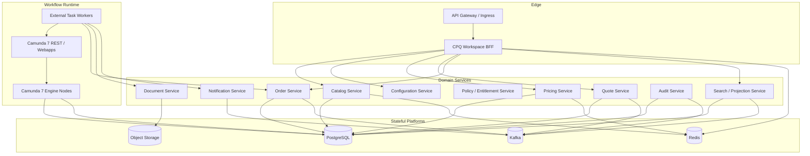
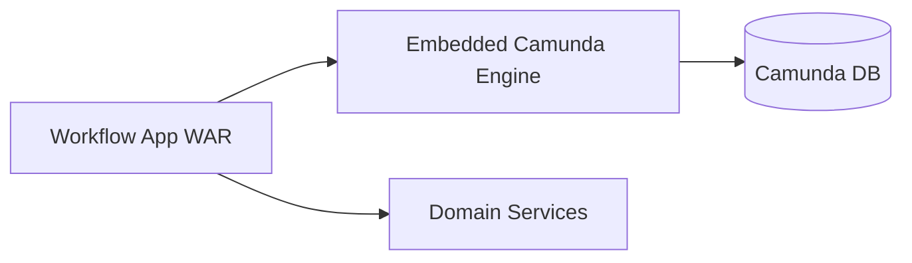
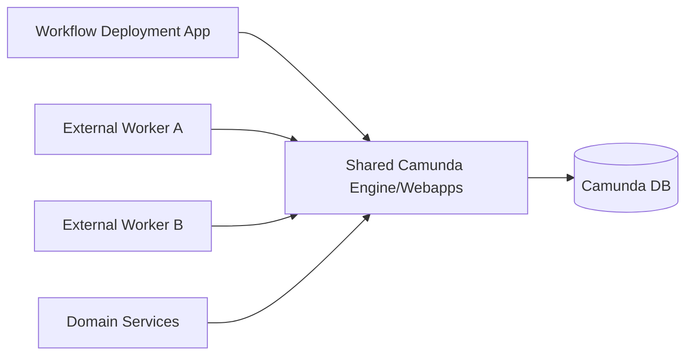
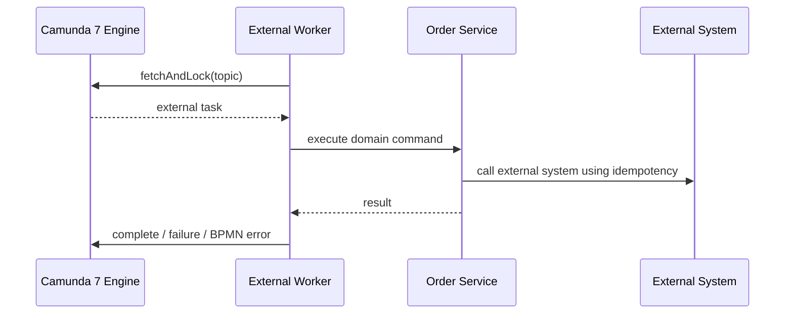
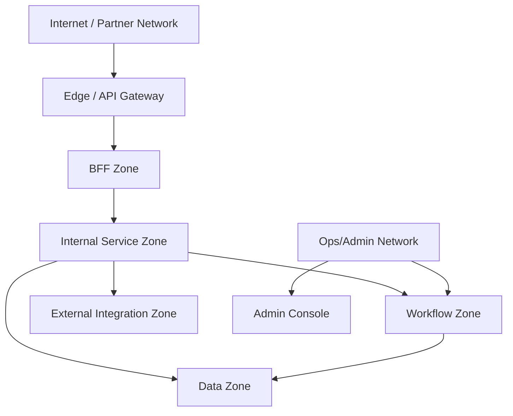
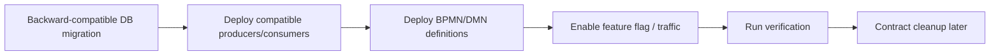

# Part 048 — Deployment Topology and Runtime Environments

A CPQ/OMS platform can look clean in code and still fail in production because the runtime topology is wrong.

Common examples:

- every service shares one overloaded PostgreSQL instance without pool control
- Camunda job executor runs inside nodes that should only serve REST traffic
- external task workers scale without respecting remote dependency limits
- BFF calls too many services synchronously
- Redis is deployed as if it were source of truth
- Kafka topics exist, but no one owns replay, retention, or DLQ operation
- database migrations run after new code starts
- process definitions are deployed without compatibility with running process instances
- secrets and tenant config drift across environments
- staging has no meaningful similarity to production

Deployment topology is architecture made physical.

It decides where failure spreads, where capacity is consumed, where state lives, and how safely releases can happen.

---

## 1. Runtime Topology Is a Correctness Concern

Deployment is not only DevOps packaging.

For CPQ/OMS, topology affects correctness:

| Topology mistake | Business consequence |
|---|---|
| Quote service and reporting share DB pool | quote acceptance slows during export |
| Camunda engine shares schema with domain tables casually | migration and lock risk become coupled |
| External workers over-scale | external inventory/billing is overloaded |
| No idempotent startup behavior | duplicate process instances/orders |
| No environment parity | production-only workflow bugs |
| No graceful shutdown | half-processed external tasks |
| Bad network segmentation | internal admin APIs exposed |
| No deployment order | new consumers fail on old schema/events |

A top-level engineer sees runtime topology as part of the domain safety model.

---

## 2. Baseline Deployment Units

This series uses these logical deployment units.



This is a logical map, not a mandate that every box must be its own repository or cluster.

But each box has a separate runtime responsibility.

---

## 3. Stateless vs Stateful Boundary

Services should be stateless at runtime.

Truth lives in stateful platforms.

| Component | Runtime state? | Authority? |
|---|---:|---:|
| JAX-RS service node | no durable state | no |
| BFF | no durable state | no |
| External task worker | no durable state | no |
| Camunda engine | process runtime state in DB | workflow authority |
| PostgreSQL | durable domain state | yes |
| Kafka | durable event log | event distribution, not domain DB |
| Redis | ephemeral/cache state | no for core domain truth |
| Object storage | document/artifact binary | artifact binary authority with DB metadata |

A service instance must be replaceable.

If killing a service instance destroys quote/order truth, the topology is wrong.

---

## 4. GlassFish/Jersey Deployment Shape

Because this stack uses JAX-RS/Jersey and GlassFish, a common unit is a WAR application per service.

Example:

```text
quote-service.war
order-service.war
pricing-service.war
catalog-service.war
configuration-service.war
policy-service.war
notification-service.war
document-service.war
search-service.war
```

Each WAR should own:

- JAX-RS resources
- application services
- domain model
- repository implementation
- outbound adapters
- service-specific configuration
- Flyway/Liquibase migration module or migration artifact
- OpenAPI contract
- schema contract
- test fixtures

Each WAR should not contain:

- entity classes from another service
- direct repository access to another service database
- Camunda internal entities unless it is the workflow application
- generated clients mixed with domain objects
- shared mutable global state

GlassFish gives a Jakarta EE runtime.

But the runtime does not automatically create service boundaries.

The boundary is created by deployment, database ownership, API contracts, event ownership, and authorization.

---

## 5. Recommended Environment Ladder

A serious CPQ/OMS platform needs environment stages with explicit purpose.

| Environment | Purpose | Data style |
|---|---|---|
| Local | developer feedback | synthetic fixtures |
| Component CI | service tests | disposable DB/Kafka/Redis |
| Integration | multi-service contract verification | synthetic but realistic |
| Workflow Lab | BPMN/DMN/process migration test | scenario catalog |
| Performance | load/capacity model | generated production-shaped data |
| UAT | business scenario acceptance | curated business data |
| Pre-prod | release rehearsal | production-like config, anonymized data if allowed |
| Production | real business operation | real data |

Do not use one shared “dev” environment as the only integration proof.

Shared dev environments become polluted, unstable, and misleading.

---

## 6. Environment Parity That Actually Matters

Perfect parity is expensive.

Useful parity is specific.

For CPQ/OMS, prioritize parity for:

- database schema and constraints
- transaction isolation expectations
- connection pool limits
- Camunda process engine configuration
- job executor/external worker behavior
- Kafka partition count and retention class
- Redis eviction/TTL behavior
- auth/tenant claims
- external dependency timeout behavior
- process definitions and DMN versions
- observability pipelines
- deployment order

Do not obsess over identical CPU count in every environment while ignoring that staging has no process incidents, no Kafka replay, no Redis eviction, and no tenant isolation.

---

## 7. Camunda 7 Topology Options

Camunda 7 can be run in different ways.

The topology decision affects coupling, scaling, and migration flexibility.

### Option A — Embedded Engine Per Workflow Application



Pros:

- simple deployment for one workflow app
- code and BPMN deployed together
- local control of delegates

Cons:

- process engine lifecycle tied to app deployment
- scaling REST/API traffic and job execution can be coupled
- harder to keep domain services clean if delegates call repositories directly
- migration fence weaker if business logic lives inside delegates

### Option B — Shared Camunda Engine



Pros:

- centralized process runtime
- external task pattern can decouple workers
- engine operations more visible
- domain services can remain workflow-aware but engine-independent

Cons:

- shared runtime becomes critical platform
- process deployment governance required
- tenant/process authorization must be strong
- cluster/job executor tuning becomes platform-level work

### Option C — Remote Engine + External Task Workers

This is often the cleanest enterprise boundary.

Domain services own business truth.

Camunda owns workflow state.

Workers perform integration actions through service APIs.



This pattern is strong because business mutation remains behind service APIs.

---

## 8. Camunda Runtime Segmentation

Do not assume all Camunda nodes must do all things.

You may separate:

| Node type | Responsibility |
|---|---|
| Webapp/REST nodes | Cockpit/Tasklist/REST access |
| Engine/job executor nodes | async continuations, timers, internal jobs |
| Deployment node/job | BPMN/DMN deployment |
| External workers | external task execution |
| Admin/ops access | controlled operator functions |

For high control, you may disable job execution in some nodes and dedicate execution capacity to specific nodes.

The key is not the exact shape.

The key is to avoid accidental coupling between UI/admin traffic, REST traffic, process deployment, and job execution.

---

## 9. Camunda Database Boundary

Camunda engine tables should be treated as Camunda-owned.

Domain services should not query or mutate Camunda tables directly.

Allowed access patterns:

- Camunda REST/Java API
- exported/projection events
- operational reports through supported APIs or controlled read replicas if formally accepted
- separate workflow correlation table in domain DB if needed

Not allowed:

- joining order tables directly with Camunda runtime tables in business code
- using Camunda history tables as the only business audit trail
- manually changing process state through SQL in ordinary operations
- coupling domain migration to Camunda internal schema

Camunda workflow state is useful evidence.

It is not a replacement for domain state.

---

## 10. PostgreSQL Topology

Each service should own its schema or database boundary.

Common options:

| Option | Description | Trade-off |
|---|---|---|
| Database per service | strongest isolation | more operational overhead |
| Schema per service | pragmatic isolation | shared instance blast radius |
| Shared schema | weak boundary | avoid for microservices |

For this learning series, a pragmatic enterprise topology is:

```text
PostgreSQL cluster / instance
  schema catalog
  schema configuration
  schema pricing
  schema quote
  schema order
  schema policy
  schema notification
  schema document
  schema audit
  schema projection
  schema camunda
```

With strict rules:

- service user can access only its schema
- cross-service reads go through API/event/projection
- no foreign keys across service schemas
- migrations are owned per service
- reporting uses projections or replicas, not direct OLTP joins
- Camunda schema is isolated

This is not as pure as database-per-service.

But it is far safer than shared tables.

---

## 11. PostgreSQL Connection Pool Topology

Connection pools are capacity contracts.

If every service sets `maxPoolSize=100`, the database will be destroyed under load.

Design pools from DB capacity backward.

Example:

| Service | Pool purpose | Max connections |
|---|---|---:|
| quote-service | OLTP commands/queries | 20 |
| order-service | OLTP commands/queries | 20 |
| pricing-service | price calculation reads/writes | 15 |
| catalog-service | catalog reads/publish | 15 |
| camunda-engine | workflow runtime | sized separately |
| search-service | projection writes | 10 |
| reporting/export | separate pool/replica | isolated |

Rules:

- separate long-running export from OLTP
- use statement timeout
- avoid idle transaction leakage
- monitor pool wait time
- reject early when pool is saturated
- never scale service pods without checking DB connection budget

---

## 12. Kafka Topology

Kafka is the event distribution backbone.

Deployment decisions include:

- topic ownership
- partition count
- replication factor
- retention
- compaction or delete policy
- consumer group ownership
- DLQ topic strategy
- schema registry integration
- ACLs
- replay tooling

Example topic classes:

| Topic | Owner | Key | Retention intent |
|---|---|---|---|
| `quote.events.v1` | Quote Service | quoteId | domain event stream |
| `order.events.v1` | Order Service | orderId | domain event stream |
| `catalog.events.v1` | Catalog Service | catalogVersion/productOfferingId | publication/change stream |
| `notification.commands.v1` | Notification Service | communicationId | command/event boundary |
| `audit.events.v1` | Audit Service | subjectId | evidence ingestion |
| `projection.dlq.v1` | Projection owner | original key | operational recovery |

Do not let every service publish to every topic.

Topic ownership is part of the architecture.

---

## 13. Redis Topology

Redis should be deployed according to usage class.

| Usage | Topology concern |
|---|---|
| cache | memory sizing, eviction policy, TTL discipline |
| idempotency fast-path | persistence/fallback to PostgreSQL |
| rate limit | availability vs fail-open/fail-closed policy |
| ephemeral workspace state | acceptable loss behavior |
| lock coordination | clock/TTL/fencing caveats |

Avoid mixing unrelated criticality in one Redis deployment without conscious policy.

Example:

```text
redis-cache-catalog-pricing
redis-rate-limit
redis-ui-ephemeral
```

or one cluster with strict key namespace, memory budgets, and monitoring.

The key question:

> if this Redis data disappears, what business truth is lost?

The acceptable answer for core CPQ/OMS should be:

> none.

---

## 14. Object Storage for Artifacts

Quote documents, signed agreements, rendered proposals, and generated files should not live as large blobs inside core OLTP rows unless there is a deliberate reason.

Recommended split:

| Data | Location |
|---|---|
| artifact metadata | PostgreSQL document schema |
| artifact binary | object storage |
| artifact hash | PostgreSQL metadata |
| template version | PostgreSQL/config repository |
| render input snapshot | PostgreSQL or object storage with hash |
| access policy | document service + authorization |

Deployment implications:

- object storage credentials are service-specific
- access should go through signed URL or document service authorization
- artifact immutability must be enforced
- backup/retention policy must align with legal/commercial requirement

---

## 15. Network Zones

A useful topology separates traffic classes.



Principles:

- public traffic should not reach internal service ports directly
- Camunda Cockpit/Tasklist/Admin endpoints must be protected
- service-to-service traffic should authenticate
- database ports are not exposed to application users
- external provider callbacks enter through controlled ingress
- admin/control-plane APIs are separated from public APIs

Network topology is part of authorization.

---

## 16. Configuration and Secrets

Configuration categories:

| Category | Example | Change frequency |
|---|---|---|
| build-time | Java version, dependencies | release |
| deploy-time | service URL, pool size, feature flag default | deployment |
| runtime dynamic | approval thresholds, catalog availability | governed config |
| secret | DB password, OAuth client secret | rotation policy |
| tenant config | tenant catalog segment, policy set | controlled admin change |

Rules:

- secrets are not stored in Git
- tenant config changes are audited
- policy/config changes have effective date
- service startup validates required config
- config drift is detectable
- dangerous config has guardrails
- local config cannot silently become production config

CPQ/OMS has many business policies.

Do not hide policy changes inside environment variables.

---

## 17. Deployment Order

Release order matters because services, schemas, events, and processes evolve together.

Safe general order:



For breaking changes, use expand-migrate-contract:

1. expand schema/contract to support old and new
2. deploy code that writes/reads both if needed
3. backfill data
4. move traffic
5. verify
6. remove old paths in later release

Never deploy code that requires a new column before the migration exists.

Never deploy a process definition that calls a worker topic no worker understands.

Never remove an event field while existing consumers still require it.

---

## 18. Process Definition Deployment

Camunda process deployment has its own compatibility concerns.

Questions before deploying new BPMN/DMN:

- Are existing process instances allowed to continue on old definition?
- Do we need process instance migration?
- Are external task topic names compatible?
- Are process variables schema-compatible?
- Are DMN decision input names stable?
- Are timer semantics changed?
- Are incidents expected after deployment?
- Is rollback possible?
- Are task forms/worklist projections compatible?

In many cases, do not migrate running instances automatically.

Let existing orders finish on old process definition unless there is a clear operational reason.

Workflow versioning is not the same as code versioning.

---

## 19. Feature Flags

Feature flags are useful, but dangerous if they become hidden business policy.

Good uses:

- progressive rollout of a new quote workspace
- enable new pricing rule evaluator for one tenant
- route small percentage of preview traffic to new service
- disable non-critical notification channel
- activate new projection read model

Bad uses:

- secretly bypass approval
- silently change price calculation without versioned evidence
- hide schema incompatibility
- create permanent forked behavior nobody owns

Every flag needs:

- owner
- purpose
- default
- expiry/removal plan
- audit for changes
- tenant scope if applicable
- test coverage for both states

---

## 20. Blue/Green and Rolling Deployment

Stateless services can often roll gradually.

But CPQ/OMS deployment must account for:

- DB schema compatibility
- API contract compatibility
- event schema compatibility
- idempotency behavior
- workflow topic compatibility
- cache invalidation
- projection rebuild
- user session/workspace continuity

A service is rolling-deployable only if old and new versions can run together.

Checklist:

| Compatibility | Required question |
|---|---|
| API | Can old BFF call new service and new BFF call old service? |
| DB | Can old and new code read/write schema? |
| Event | Can old/new consumers process old/new events? |
| BPMN | Can workers support old and new process definitions? |
| Redis | Are key names/versioning compatible? |
| Search projection | Can projection handle replay from both versions? |

If not, use a controlled cutover with traffic freeze, migration, verification, and rollback plan.

---

## 21. Graceful Shutdown

Graceful shutdown is critical for workers and services.

On shutdown:

- stop accepting new HTTP requests
- stop fetching new external tasks
- finish or safely abandon in-flight tasks
- stop Kafka polling and commit offsets only after successful processing
- release resources
- preserve idempotency state
- flush telemetry if safe
- avoid starting new Camunda process instances after shutdown begins

External task workers must be especially careful.

If the worker performed the external side effect but dies before completing the Camunda task, retry may happen.

Therefore external calls need idempotency and process recovery needs reconciliation.

---

## 22. Health Checks

Use different checks for different purposes.

| Check | Purpose | Should include |
|---|---|---|
| liveness | should container be restarted? | local process health only |
| readiness | should traffic be sent? | DB connectivity, critical config, dependency readiness policy |
| startup | is app initialized? | migration/dependency initialization status |
| deep health | operator diagnosis | dependency details, non-public |

Do not make liveness depend on every remote dependency.

That can cause cascading restarts during dependency outage.

Readiness should be strict enough to avoid sending traffic to broken nodes.

Deep health should not expose secrets or internal topology publicly.

---

## 23. Scaling Model

Scale based on bottleneck, not feelings.

| Component | Scale signal |
|---|---|
| BFF | request latency, CPU, backend fan-out latency |
| Quote Service | command latency, DB pool wait, optimistic conflict rate |
| Pricing Service | calculation latency, CPU, cache hit ratio |
| Catalog Service | publish workload, cache invalidation, read latency |
| Order Service | command backlog, fulfillment state transitions |
| External Task Workers | task backlog, dependency capacity, failure rate |
| Camunda Engine | job acquisition latency, incidents, DB load |
| Kafka Consumers | lag, processing time, DLQ growth |
| Search Projection | projection lag, write throughput |
| PostgreSQL | CPU, I/O, locks, pool wait, query latency |
| Redis | memory, evictions, command latency, hot keys |

Do not scale workers beyond external dependency contracts.

More workers can mean faster outage.

---

## 24. Multi-Tenant Deployment Concerns

Tenant isolation can be implemented at different layers.

| Layer | Concern |
|---|---|
| API gateway | tenant routing and authentication |
| service | tenant context validation |
| PostgreSQL | tenant_id constraints/indexing or schema/database isolation |
| Kafka | tenant in event envelope, ACL/topic strategy |
| Redis | tenant-scoped keys |
| Camunda | tenant id/process definition segregation if used |
| object storage | tenant-safe path/bucket policy |
| logs/metrics | tenant-aware but privacy-safe dimensions |

Do not rely on frontend filtering for tenant isolation.

Tenant boundary must exist in backend authorization and data access.

---

## 25. Operational Access

Production topology must include controlled operational access.

Operators need to:

- inspect order state
- inspect workflow state
- inspect failed jobs/incidents
- retry safe operations
- quarantine poison events
- replay DLQ events
- regenerate read models
- view audit trail
- view artifact metadata
- manage feature flags
- deploy/rollback BPMN/DMN safely

But operators should not have unrestricted database write access as the normal recovery mechanism.

Operational control plane should expose safe commands with authorization and audit.

---

## 26. Local Development Topology

Local development should optimize feedback, not pretend to be production.

Minimum local stack:

```text
PostgreSQL
Kafka-compatible broker or Kafka
Redis
Camunda 7 engine/webapp
selected services under development
mock external systems
```

Local development should support:

- deterministic seed data
- one-command environment reset
- BPMN/DMN deployment
- contract validation
- event inspection
- outbox inspection
- external mock behavior selection
- test tenant setup

Do not require every developer to run the entire enterprise platform for every change.

Support slices:

```text
catalog + configuration + pricing
quote + policy + document
order + camunda + workers
notification + external provider mock
projection + kafka + postgres
```

---

## 27. Runtime Verification After Deployment

After deployment, verify behavior, not only process health.

Smoke checks:

- create quote draft
- configure product
- price quote
- submit approval
- complete approval in test tenant
- accept quote
- create order
- start order workflow
- process one external task through mock/sandbox dependency
- emit and consume event
- update projection
- generate document
- send test notification or enqueue safely
- verify audit trail

Technical checks:

- DB migrations applied
- no connection pool saturation
- Kafka consumer lag normal
- Redis no unexpected evictions
- Camunda no new incident spike
- error rate within threshold
- traces flow across services
- DLQ empty or expected
- feature flags correct

---

## 28. Deployment Anti-Patterns

### Anti-Pattern 1: Shared Everything

One shared database user, one schema, one Redis namespace, one Kafka topic, one thread pool.

This removes isolation and creates ambiguous ownership.

### Anti-Pattern 2: Camunda as the Domain Database

Workflow state is not quote/order truth.

### Anti-Pattern 3: Scale Everything Horizontally

Scaling services without checking DB, Kafka partitioning, external dependency limits, and Camunda job executor behavior can increase failure.

### Anti-Pattern 4: Migrations as Startup Side Effect Without Control

Automatic migrations on every service startup can create race conditions and unpredictable production startup.

### Anti-Pattern 5: No Worker Version Strategy

New BPMN calls a topic or variable shape that old workers do not support.

### Anti-Pattern 6: Staging That Proves Nothing

A staging environment without realistic process definitions, Kafka replay, DB constraints, auth claims, and dependency failure behavior gives false confidence.

### Anti-Pattern 7: Operational Recovery Through SQL Patches

SQL patches may be necessary in emergencies, but they should not be the normal operational interface.

---

## 29. Production Topology Checklist

Before go-live:

- Are service deployment units clear?
- Does each service own its schema/API/event boundary?
- Is Camunda schema isolated?
- Are Camunda job execution and REST/webapp access intentionally placed?
- Are external workers separately scalable and bounded?
- Are DB connection budgets calculated?
- Are Kafka topics owned and ACL-protected?
- Are Redis namespaces and TTL policies defined?
- Are object artifacts immutable and access-controlled?
- Are secrets managed outside Git?
- Are tenant boundaries enforced backend-side?
- Are migrations ordered and backward-compatible?
- Are BPMN/DMN deployments versioned and tested?
- Can old and new service versions run together during rolling deploy?
- Is graceful shutdown implemented?
- Are liveness/readiness/deep health checks separated?
- Are operational actions auditable?
- Is environment parity meaningful for workflow, DB, Kafka, Redis, auth, and observability?

---

## 30. Mental Model

Deployment topology is not where code runs.

It is where responsibility, state, capacity, and failure boundaries become real.

For CPQ/OMS, the production rule is:

> the runtime must make the safe architecture easier than the unsafe shortcut.

If topology makes it easy to bypass service boundaries, query another service database, mutate Camunda tables, overrun external dependencies, or patch data without audit, the system will eventually do those things under pressure.

Design the runtime so correctness is the path of least resistance.

