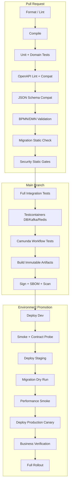
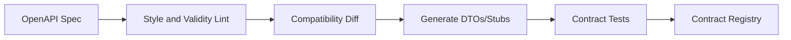
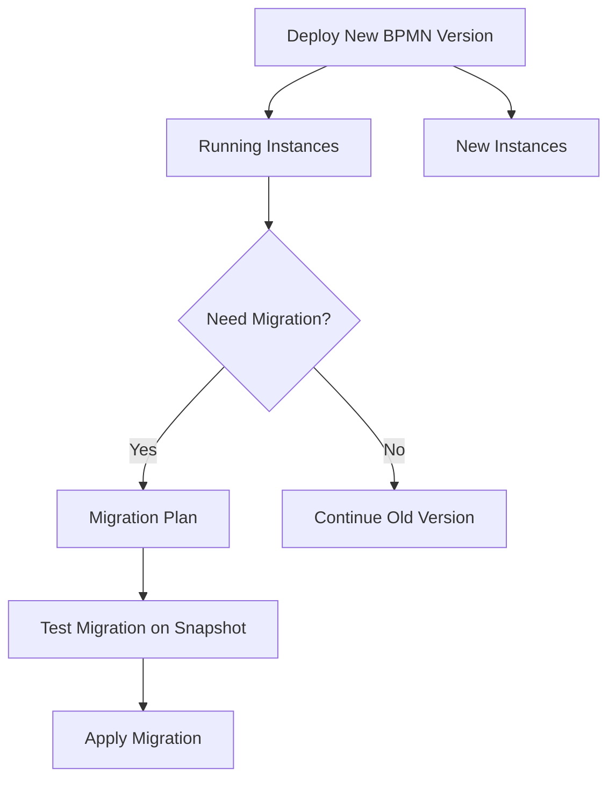
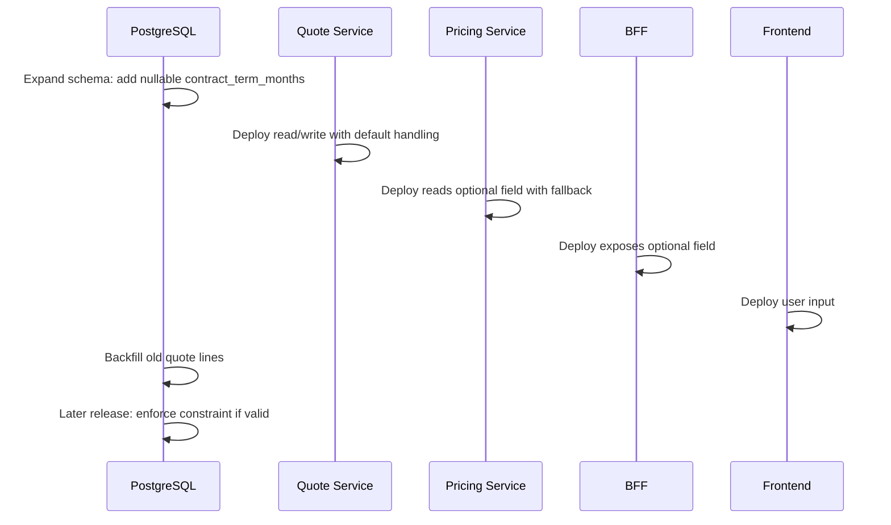

# Part 049 — CI/CD, Quality Gates, and Release Governance

A CPQ/OMS platform is not production-grade because it can be deployed.

It is production-grade when every deployment is forced to answer these questions before it reaches users:

- Did we break an API contract?
- Did we break an event contract?
- Did we break a workflow contract?
- Did we break a database migration path?
- Did we break a tenant boundary?
- Did we break an approval invariant?
- Did we break a quote/order lifecycle transition?
- Did we break operational recovery?
- Did we introduce a migration that cannot be rolled forward safely?
- Did we deploy a process definition that strands running Camunda instances?

CI/CD is not automation theatre.

For enterprise CPQ/OMS, CI/CD is the **evidence pipeline**.

It is the system that rejects unsafe change before unsafe change becomes a customer-visible, revenue-impacting, or audit-impacting incident.

---

## 1. The Core Mental Model

A release pipeline is not only a build script.

It is a controlled sequence of proofs.

```mermaid
flowchart LR
  Change[Change Request / Pull Request]
  Compile[Compile and Static Checks]
  Domain[Domain Invariant Tests]
  Contract[API and Schema Compatibility]
  Persistence[DB Migration Safety]
  Workflow[BPMN/DMN Compatibility]
  Security[Security and Tenant Gates]
  Package[Immutable Artifacts]
  Deploy[Progressive Deployment]
  Observe[Post-Deploy Verification]
  Evidence[Release Evidence Bundle]

  Change --> Compile --> Domain --> Contract --> Persistence --> Workflow --> Security --> Package --> Deploy --> Observe --> Evidence
```



Each gate asks a different question.

| Gate | Question |
|---|---|
| Compile | Does the code still build deterministically? |
| Unit/domain | Do local invariants still hold? |
| Contract | Can existing clients/producers/consumers still survive? |
| Persistence | Can data evolve without corrupting source of truth? |
| Workflow | Can running and new process instances execute safely? |
| Security | Did we weaken authorization, secrets, or tenant isolation? |
| Packaging | Can we reproduce exactly what was tested? |
| Deployment | Can we move safely through environments? |
| Verification | Did the system become healthy in business terms? |
| Evidence | Can we explain what changed, why, and how it was proven? |

Top engineers do not treat CI/CD as a DevOps side topic.

They treat it as a distributed systems safety mechanism.

---

## 2. What Makes CPQ/OMS Release Governance Hard

CPQ/OMS is not a single service with isolated CRUD tables.

A quote acceptance can involve:

- product catalog snapshot
- configuration validity
- price calculation
- discount approval
- quote artifact generation
- customer acceptance
- order creation
- order decomposition
- Camunda process start
- inventory reservation
- billing handoff
- document and notification publication
- audit and reporting projections
- Kafka events
- Redis cache invalidation

A small change can break several surfaces.

Example: adding `contractTermMonths` to quote lines.

| Surface | Possible break |
|---|---|
| OpenAPI | old frontend fails because field is required too early |
| Pricing | default term is interpreted differently |
| PostgreSQL | migration locks quote_line too long |
| JPA | lazy mapping triggers N+1 pricing query |
| Kafka | old consumers reject event payload |
| Camunda | old process instances lack required variable |
| Redis | cache key ignores term and returns stale price |
| Document | quote PDF template misses term evidence |
| Audit | approval snapshot does not include term |
| Search | projection does not index term |

A good pipeline catches this before merge or before production promotion.

A weak pipeline only catches syntax.

---

## 3. Release Governance Is Not Bureaucracy

Bad governance asks:

> Who approved this release?

Good governance asks:

> Which invariants were proven, which risks remain, and which rollback/roll-forward path is valid?

A release should produce a manifest like this:

```yaml
release:
  id: cpq-oms-2026.07.02-rc.4
  gitCommit: 7c8f0e9
  buildNumber: 1842
  services:
    quote-service: 1.14.0
    pricing-service: 1.9.3
    order-service: 1.12.1
    workflow-service: 1.8.0
  contracts:
    openapiCompatibility: passed
    eventSchemaCompatibility: passed
    problemDetailsCompatibility: passed
  database:
    migrationPlan: expand-migrate-contract
    destructiveChange: false
    backfillRequired: true
    backfillJobId: bf_quote_term_20260702
  workflow:
    bpmnChanged: true
    migrationPlanRequired: false
    newProcessDefinitionOnly: true
  risk:
    productionBlastRadius: quote-edit-and-price-preview
    rollbackStrategy: roll-forward-only-for-schema
  evidence:
    domainTests: passed
    integrationTests: passed
    securityTests: passed
    performanceSmoke: passed
    postDeployQueries: passed
```

This is not paperwork.

This is how you survive audits, incidents, and production defects.

---

## 4. Artifact Taxonomy

Before building the pipeline, define what the pipeline produces.

| Artifact | Example | Rule |
|---|---|---|
| Source artifact | Git commit | immutable after merge |
| API contract | `quote-api.yaml` | versioned, linted, compatibility-checked |
| Schema contract | JSON Schema / Avro / protobuf | producer and consumer compatibility checked |
| BPMN artifact | `quote-approval.bpmn` | validated and version-tagged |
| DMN artifact | `discount-policy.dmn` | tested with decision scenarios |
| DB migration | `V2026070201__add_quote_term.sql` | forward-only, reviewed, dry-run tested |
| Java artifact | JAR/WAR | built once, promoted unchanged |
| Container artifact | OCI image | signed, scanned, immutable digest |
| Deployment manifest | Helm/Kustomize/plain manifests | environment-specific config separated |
| Release manifest | evidence bundle | retained for audit |

The rule is simple:

> Build once. Promote the same artifact. Change configuration, not binaries.

If staging and production run different binaries for the same release, your pipeline is not proving production safety.

---

## 5. Pipeline Shape

A practical pipeline for this series:



Do not run every expensive test on every keystroke.

But do not allow a change to merge unless the cheap gates already prove it is directionally safe.

---

## 6. Gate 1 — Repository and Ownership Gates

The first quality gate is not code execution.

It is ownership.

For CPQ/OMS, different files have different blast radius.

| Path | Mandatory reviewers |
|---|---|
| `contracts/openapi/**` | API owner + affected service owner |
| `contracts/events/**` | event owner + consuming team representative |
| `db/migration/**` | service owner + data owner |
| `workflow/bpmn/**` | workflow owner + operations owner |
| `workflow/dmn/**` | policy owner + audit/commercial owner |
| `security/**` | security owner |
| `infra/**` | platform owner |
| `domain/**/state-machine/**` | domain architect |

Example `CODEOWNERS`:

```text
/contracts/openapi/quote/**        @cpq-api-owners @quote-service-owners
/contracts/events/order/**         @event-platform @order-service-owners
/services/pricing/**               @pricing-engineers
/services/order/db/migration/**    @order-service-owners @data-governance
/workflow/bpmn/order/**            @workflow-owners @oms-ops
/workflow/dmn/approval/**          @commercial-policy @audit-control
/security/**                       @security-engineering
```

A release governance system without ownership becomes theatre.

Everyone can approve; no one is accountable.

---

## 7. Gate 2 — Build Reproducibility

Build reproducibility means: given the same commit and dependency graph, the pipeline can recreate the same artifact.

Minimum requirements:

- pin Java version
- pin Maven version or use Maven wrapper
- pin plugin versions
- ban dynamic dependency versions
- separate generated code from handwritten code
- fail if generated code is stale
- produce build metadata
- produce SBOM
- sign artifacts if your organization requires supply-chain evidence

Example Maven discipline:

```xml
<dependencyManagement>
  <dependencies>
    <dependency>
      <groupId>org.glassfish.jersey</groupId>
      <artifactId>jersey-bom</artifactId>
      <version>${jersey.version}</version>
      <type>pom</type>
      <scope>import</scope>
    </dependency>
  </dependencies>
</dependencyManagement>

<build>
  <pluginManagement>
    <plugins>
      <plugin>
        <groupId>org.apache.maven.plugins</groupId>
        <artifactId>maven-compiler-plugin</artifactId>
        <version>${maven.compiler.plugin.version}</version>
      </plugin>
    </plugins>
  </pluginManagement>
</build>
```

Bad signs:

- `LATEST` dependency versions
- generated DTOs edited manually
- contract code generated locally but not checked in nor generated in CI
- application reads build-time secrets
- artifact has no commit SHA metadata
- same tag can be overwritten

---

## 8. Gate 3 — Static Code and Architecture Gates

Static gates catch cheap errors.

They are not enough, but they are valuable.

Suggested static gates:

| Gate | Purpose |
|---|---|
| compile | type correctness |
| format | reduce review noise |
| static analysis | suspicious code patterns |
| dependency convergence | avoid runtime classpath surprises |
| forbidden dependency | enforce module boundaries |
| architecture test | prevent domain layer from importing adapters |
| generated-code freshness | prevent contract drift |
| dead code detection | reduce ambiguity |

For CPQ/OMS, architecture tests matter more than style tests.

Example boundary rules:

```java
// Pseudocode using an architecture-test style.
classes()
  .that().resideInAPackage("..domain..").should()
  .onlyDependOnClassesThat().resideInAnyPackage(
      "java..",
      "jakarta.validation..",
      "com.example.cpq.shared.money..",
      "com.example.cpq.quote.domain.."
  );

classes()
  .that().resideInAPackage("..domain..").should()
  .notDependOnClassesThat().resideInAnyPackage(
      "jakarta.ws.rs..",
      "jakarta.persistence..",
      "org.camunda..",
      "org.apache.kafka..",
      "redis.clients.."
  );
```

Domain code should not know HTTP, Kafka, Redis, or Camunda.

That is not purity for purity's sake.

It preserves testability and migration freedom.

---

## 9. Gate 4 — Domain Invariant Tests

A CPQ/OMS release must prove lifecycle invariants.

Examples:

| Invariant | Test |
|---|---|
| accepted quote cannot be edited | command test |
| stale price cannot be accepted | quote acceptance test |
| stale approval cannot create order | approval freshness test |
| duplicate submit cannot create duplicate order | idempotency test |
| order cancellation cannot ignore fulfilled lines | state transition test |
| manual override requires authority | authorization + domain test |
| quote artifact hash must match accepted revision | artifact evidence test |
| amendment requires baseline version | change order test |

These tests should run without infrastructure when possible.

Example:

```java
@Test
void cannotAcceptQuoteWhenPriceSnapshotIsStale() {
  Quote quote = QuoteFixtures.pricedApprovedQuote()
      .withCatalogVersion("catalog-2026.07")
      .withPriceResultVersion("price-v4")
      .build();

  PricingFreshness current = new PricingFreshness(
      "catalog-2026.08",
      "price-v5"
  );

  assertThatThrownBy(() -> quote.accept(current, CustomerAcceptance.valid()))
      .isInstanceOf(StaleQuoteEvidenceException.class)
      .hasMessageContaining("price evidence is no longer current");
}
```

If a lifecycle rule is important enough to discuss in architecture review, it is important enough to test.

---

## 10. Gate 5 — OpenAPI Contract Gates

OpenAPI-first means the API contract is not documentation after code.

It is the public boundary.

Your pipeline should fail when:

- OpenAPI is invalid
- schema names are unstable
- generated DTOs are stale
- required fields are added to existing request/response without compatibility review
- enum values are removed or repurposed
- error schema deviates from Problem Details model
- endpoint changes from idempotent command to ambiguous mutation
- examples do not match schema
- operation IDs are missing or renamed carelessly
- generated server stubs are not updated

OpenAPI compatibility is not only syntax.



Compatibility examples:

| Change | Usually compatible? | Notes |
|---|---:|---|
| Add optional response field | yes | clients should ignore unknown fields |
| Add required response field | mostly yes | but may break strict generated clients |
| Add required request field | no | old clients cannot send it |
| Remove response field | no | clients may depend on it |
| Rename field | no | treat as add new + deprecate old |
| Add enum value | risky | strict clients may fail |
| Change field meaning | no | worst kind of break |
| Change error shape | no | breaks automation and UX |
| Add endpoint | yes | if no auth side effect |
| Change status code semantics | risky | clients may branch on status |

For command endpoints, compatibility must include semantics.

Example:

```yaml
paths:
  /quotes/{quoteId}/commands/accept:
    post:
      operationId: acceptQuote
      parameters:
        - name: Idempotency-Key
          in: header
          required: true
          schema:
            type: string
        - name: If-Match
          in: header
          required: true
          schema:
            type: string
      responses:
        '202':
          description: Acceptance accepted for processing
        '409':
          description: Quote cannot be accepted in current state
          content:
            application/problem+json:
              schema:
                $ref: '#/components/schemas/Problem'
```

A release that changes `202` to `200` with different behavior is a contract change, even if the JSON schema remains valid.

---

## 11. Gate 6 — JSON Schema and Event Compatibility

Events are not internal logs.

They are contracts consumed by other services.

The pipeline must treat event schema changes as release-sensitive.

Minimum event gates:

- schema validity
- schema compatibility against previous published versions
- envelope field stability
- event name ownership
- event version policy
- producer example validity
- consumer contract tests
- idempotency field existence
- aggregate key field existence
- event time and occurred-at semantics

Example event schema gate:

```yaml
eventCompatibility:
  quote.accepted.v1:
    previousVersion: 1.3.0
    proposedVersion: 1.4.0
    compatible: true
    changes:
      - addedOptionalField: acceptedByDisplayName
      - addedOptionalField: acceptanceChannel
  order.submitted.v1:
    previousVersion: 2.1.0
    proposedVersion: 3.0.0
    compatible: false
    breakingChanges:
      - removedField: orderLines[].action
      - changedType: requestedCompletionDate string -> object
```

Event compatibility is stricter than API compatibility in one way:

> Once an event is emitted, it may be replayed years later.

That means old events must remain readable.

Never design a consumer that only understands the latest event shape.

---

## 12. Gate 7 — Database Migration Gates

Database migration gates prevent the most expensive kind of release failure: irreversible data damage.

Basic checks:

- migration filename and version order
- checksum integrity
- migration runs from empty database
- migration runs from previous release database
- migration is idempotent where declared repeatable
- no destructive change without expand-contract plan
- no long exclusive lock without explicit approval
- no table rewrite on large table without migration plan
- no application code that requires migration not yet deployed
- no migration touching Camunda engine tables unless planned as Camunda platform update

A migration gate should run against a realistic database snapshot shape.

Not production data necessarily.

But production-scale cardinality and indexes.

Example destructive change detection:

```sql
-- Suspicious in an application migration.
ALTER TABLE quote_line DROP COLUMN discount_reason;
ALTER TABLE quote_line ALTER COLUMN contract_term_months SET NOT NULL;
ALTER TYPE quote_status DROP VALUE 'UNDER_REVIEW'; -- PostgreSQL does not support this directly; still watch enum changes.
```

Safer pattern:

```sql
-- Expand.
ALTER TABLE quote_line ADD COLUMN contract_term_months integer;

-- Backfill separately in chunks.
-- Validate usage.
-- Later contract in a separate release.
```

Migration gate output should be explicit:

```yaml
migrationReview:
  migration: V2026070201__add_contract_term_to_quote_line.sql
  destructive: false
  tableRewriteRisk: low
  lockRisk: low
  requiresBackfill: true
  backfillStrategy: chunked-by-quote-revision-id
  compatibleWithCurrentCode: true
  compatibleWithNextCode: true
  rollback: roll-forward-only
```

A top-level engineer does not ask only “does migration run?”

They ask “does migration run safely while old and new code coexist?”

---

## 13. Gate 8 — JPA/EclipseLink Persistence Gates

Some persistence breaks do not show up in migration tests.

They show up at runtime:

- lazy loading outside transaction
- N+1 queries in quote workspace
- missing optimistic lock field
- entity mapping mismatch
- enum ordinal corruption
- cascade deleting historical evidence
- mutable embedded object shared across aggregates
- EclipseLink cache returns stale cross-tenant data

Persistence gates:

| Gate | Purpose |
|---|---|
| mapping boot test | ensure persistence unit starts |
| schema validation | ensure entity mapping matches DB expectation |
| aggregate repository test | validate load/save for quote/order aggregate |
| optimistic lock test | prove concurrent update rejection |
| query count test | catch major N+1 regressions |
| tenant filter test | prevent cross-tenant reads |
| cascade safety test | prevent deleting evidence accidentally |

Example optimistic lock test:

```java
@Test
void concurrentQuoteRevisionUpdateMustFailOneWriter() {
  UUID revisionId = fixtures.persistDraftQuoteRevision();

  QuoteRevision a = repo.load(revisionId);
  QuoteRevision b = repo.load(revisionId);

  a.rename("Enterprise Renewal A");
  repo.save(a);

  b.rename("Enterprise Renewal B");

  assertThatThrownBy(() -> repo.save(b))
      .isInstanceOf(OptimisticConcurrencyException.class);
}
```

If a release changes mapping, it must prove it did not weaken aggregate safety.

---

## 14. Gate 9 — BPMN and DMN Gates

Camunda 7 artifacts are release artifacts.

Treat them like code.

BPMN gates:

- model parses successfully
- process id/key is stable unless intentionally changed
- business key usage is documented
- process variables contract is explicit
- external task topics are stable
- retry configuration exists
- timer/escalation behavior is tested
- incident path is reachable and visible
- process version tag is set
- migration impact on running instances is reviewed
- call activity binding is explicit where required
- no unbounded parallel explosion
- no service task doing domain logic that belongs in service

DMN gates:

- decision table parses
- hit policy is intentional
- overlapping rules are tested
- no silent fall-through for required decision
- rule version is recorded in decision evidence
- scenario catalog covers edge cases
- approval policy output is stable
- stale approval invalidation rule is tested

Camunda versioning requires special attention:



Running instances continuing on older versions is often good.

It becomes dangerous only when external systems assume there is only one active process shape.

Therefore, workflow release governance must ask:

- Can old process instances still complete?
- Can old external task topics still be handled?
- Can old process variables still be interpreted?
- Do new workers understand old and new process expectations?
- Is a migration plan needed or should old instances drain naturally?

---

## 15. Gate 10 — Camunda Deployment Contract

For this series, workflow deployment should create a deployment record:

```yaml
workflowDeployment:
  deploymentId: wf-2026.07.02-quote-approval-v12
  processDefinitions:
    - key: quoteApproval
      versionTag: quote-approval-1.12.0
      changeType: additive
      runningInstancePolicy: drain-old
      migrationPlanRequired: false
      externalTopics:
        - quote.approval.evaluate
        - quote.approval.revalidate
  decisionDefinitions:
    - key: discountApprovalPolicy
      versionTag: discount-policy-2.4.0
      decisionEvidenceRequired: true
  compatibility:
    oldWorkersCanCompleteOldInstances: true
    newWorkersCanHandleOldExternalTasks: true
    variablesBackwardCompatible: true
```

This is important because Camunda deployment state is not identical to application deployment state.

A Java service can be rolled back.

A process definition deployment and started process instances cannot be treated with the same rollback semantics.

---

## 16. Gate 11 — Security and Tenant Gates

Security gates must be part of CI/CD, not only penetration testing.

Minimum gates:

| Gate | Purpose |
|---|---|
| secret scanning | prevent credentials in repo |
| dependency scanning | known CVEs |
| container scanning | vulnerable OS packages |
| SAST | suspicious code patterns |
| authz tests | object-level permission correctness |
| tenant isolation tests | cross-tenant read/write prevention |
| admin API tests | restricted operational endpoints |
| mass assignment tests | prevent client-controlled sensitive fields |
| audit integrity tests | high-value actions logged |
| security header tests | edge/API security baseline |

For CPQ/OMS, the most dangerous security bugs are often business authorization bugs:

- user can approve their own discount
- user can view another tenant's quote
- user can submit order for quote they cannot access
- user can override price without entitlement
- service token can call admin endpoints without least privilege
- BFF returns hidden margin fields
- operational recovery endpoint bypasses approval

These must be automated.

Example authorization test matrix:

```yaml
authorizationScenarios:
  - actor: sales_rep_tenant_a
    action: approve_discount_over_threshold
    target: quote_tenant_a_high_discount
    expected: denied
  - actor: sales_manager_tenant_a
    action: approve_discount_over_threshold
    target: quote_tenant_a_high_discount
    expected: allowed
  - actor: sales_manager_tenant_a
    action: view_quote
    target: quote_tenant_b
    expected: denied
  - actor: ops_admin
    action: recover_order_fallout
    target: order_tenant_a_failed_reservation
    expected: allowed_with_audit_reason
```

A release that changes authorization must run this matrix.

---

## 17. Gate 12 — Performance and Resilience Smoke

Not every release needs full load testing.

But every release should pass a cheap performance and resilience smoke test for critical journeys.

Critical smoke journeys:

- open quote workspace
- configure bundle
- price quote
- submit for approval
- complete approval task
- accept quote
- create order
- start order orchestration
- consume outbox event
- update read model

Minimum thresholds:

```yaml
performanceSmoke:
  quoteWorkspaceP95: "< 800ms"
  pricePreviewP95: "< 1200ms"
  acceptQuoteP95: "< 500ms synchronous ack"
  orderSubmitP95: "< 700ms synchronous ack"
  outboxPublishLagP95: "< 5s"
  projectionLagP95: "< 10s"
  camundaExternalTaskCompletionP95: "< 30s for test worker"
```

Resilience smoke:

- pricing dependency timeout returns safe error, not fake price
- duplicate quote acceptance request returns same accepted result
- Kafka consumer duplicate event is ignored idempotently
- Redis unavailable does not corrupt quote truth
- Camunda external task failure creates retry/incident path
- order callback unknown outcome creates reconciliation task

A smoke test should not prove capacity.

It should prove the system still behaves sanely under expected minor faults.

---

## 18. Gate 13 — Observability Gates

A release is not safe if it cannot be observed.

Observability gates check that new behavior emits enough information to operate it.

Required correlation fields:

| Field | Where |
|---|---|
| `correlationId` | all logs, events, API responses |
| `traceId` | all traced service calls |
| `tenantId` | logs/events where safe and necessary |
| `quoteId` | quote flows |
| `quoteRevisionId` | quote evidence flows |
| `orderId` | order flows |
| `processInstanceId` | Camunda flows |
| `businessKey` | workflow correlation |
| `eventId` | Kafka events |
| `idempotencyKey` | command processing |

CI can validate observability in integration tests:

```java
@Test
void acceptQuoteMustEmitCorrelatedAuditEventAndOutboxEvent() {
  var result = api.acceptQuote(quoteId, idempotencyKey, ifMatch);

  assertThat(result.status()).isEqualTo(202);

  await().untilAsserted(() -> {
    assertThat(auditLog.findByCorrelationId(result.correlationId()))
        .containsEvent("QUOTE_ACCEPT_REQUESTED");

    assertThat(outbox.findByAggregateId(quoteId))
        .anyMatch(e -> e.eventType().equals("quote.accepted.v1")
            && e.correlationId().equals(result.correlationId()));
  });
}
```

Do not deploy a feature that cannot be debugged.

---

## 19. Deployment Order Gates

Microservices create deployment ordering problems.

Use compatibility to reduce ordering constraints.

When ordering is unavoidable, make it explicit.

Example safe order for adding a new optional quote field used by pricing:



Bad order:

1. UI requires field.
2. BFF requires field.
3. Pricing requires field.
4. DB migration not yet applied.

This creates a production outage.

---

## 20. Rollback Is Not Always Possible

A mature release process distinguishes rollback from roll-forward.

| Change type | Rollback possible? | Preferred recovery |
|---|---:|---|
| stateless code only | often yes | rollback or roll-forward |
| additive API | yes | rollback usually safe |
| additive DB column | usually yes | rollback code, keep column |
| destructive DB change | no | roll-forward fix |
| emitted event with bad semantics | no | compensating event / consumer patch |
| started Camunda process instances | not simple | drain, migrate, or compensate |
| quote/order business state change | no | domain correction or compensation |
| document artifact generated | no | supersede with new artifact |
| approval decision recorded | no | invalidate/re-approve |

Therefore release manifest must state recovery mode:

```yaml
recovery:
  codeRollbackSupported: true
  dbRollbackSupported: false
  workflowRollbackSupported: false
  businessCompensationRequiredForBadOrders: true
  preferredRecovery: roll-forward
```

Most enterprise data releases are roll-forward releases.

Pretending otherwise creates false confidence.

---

## 21. Environment Promotion

A release should move through environments with increasing evidence.

| Environment | Purpose |
|---|---|
| local | fast feedback, dev ergonomics |
| ephemeral PR env | contract/integration validation for changed surface |
| dev/shared | continuous integration environment |
| staging | production-like topology and data shape |
| pre-prod | release candidate validation, if organization has one |
| production canary | small blast radius real traffic |
| production full | controlled rollout |

Do not confuse “staging exists” with “staging proves production.”

Staging only proves production if it has:

- similar topology
- realistic data volume
- realistic service dependencies or high-fidelity stubs
- similar auth model
- similar Camunda job/external task behavior
- similar Kafka partitioning and consumer group behavior
- similar Redis eviction/TTL behavior
- similar database migration risk profile

---

## 22. Feature Flags and Release Flags

Feature flags are useful.

They are also dangerous if unmanaged.

Use feature flags for:

- gradual user exposure
- disabling non-critical behavior
- switching between old and new read path
- enabling new UI flow after backend is ready
- controlling risky workflow branch

Do not use feature flags to hide incompatible data model changes without a migration plan.

Flag taxonomy:

| Flag type | Lifetime | Example |
|---|---:|---|
| release flag | days/weeks | enable new quote line contract term |
| experiment flag | bounded | compare pricing preview UX |
| operational kill switch | long-lived | disable notification send |
| permission flag | long-lived but governed | enable amendment feature for tenant group |
| migration flag | bounded | dual-read old/new column |

Every flag needs:

- owner
- default value
- removal date
- blast radius
- observability
- test coverage for on/off

A stale flag is hidden complexity.

---

## 23. Quality Gate Matrix by Service

Not every service needs the same gates.

| Service | Critical gates |
|---|---|
| Catalog | schema, seed data, cache invalidation, search projection |
| Configuration | rule scenario tests, explainability, catalog compatibility |
| Pricing | money precision, price trace, discount policy, performance |
| Quote | lifecycle invariants, OpenAPI, JPA, audit, document artifacts |
| Approval/Policy | DMN tests, authorization, stale approval invalidation |
| Order | orchestration, idempotency, compensation, outbox, fallout |
| Workflow | BPMN validation, process versioning, migration impact |
| Notification | template tests, idempotency, retry, delivery audit |
| Document | template version, hash integrity, artifact immutability |
| BFF | API composition, authz filtering, latency smoke |
| Search/Read Model | projection replay, authz filtering, lag metrics |
| Audit | append-only behavior, tamper evidence, access control |

A generic pipeline is a starting point.

A production-grade system needs service-specific gates.

---

## 24. Example GitHub Actions Skeleton

This is intentionally simplified.

It shows sequencing, not every command.

```yaml
name: cpq-oms-ci

on:
  pull_request:
  push:
    branches: [ main ]

permissions:
  contents: read
  security-events: write

jobs:
  compile-test:
    runs-on: ubuntu-latest
    steps:
      - uses: actions/checkout@v4
      - uses: actions/setup-java@v4
        with:
          distribution: temurin
          java-version: '21'
          cache: maven
      - run: ./mvnw -B -ntp verify -DskipITs

  contract-gates:
    runs-on: ubuntu-latest
    steps:
      - uses: actions/checkout@v4
      - run: ./tools/openapi-lint.sh contracts/openapi
      - run: ./tools/openapi-compat.sh contracts/openapi baseline/openapi
      - run: ./tools/json-schema-compat.sh contracts/events baseline/events
      - run: ./mvnw -pl contract-tests -am test

  migration-gates:
    runs-on: ubuntu-latest
    services:
      postgres:
        image: postgres:16
        env:
          POSTGRES_PASSWORD: postgres
        ports:
          - 5432:5432
        options: >-
          --health-cmd pg_isready
          --health-interval 10s
          --health-timeout 5s
          --health-retries 5
    steps:
      - uses: actions/checkout@v4
      - run: ./tools/migration-static-check.sh services/*/db/migration
      - run: ./mvnw -pl migration-tests -am verify

  workflow-gates:
    runs-on: ubuntu-latest
    steps:
      - uses: actions/checkout@v4
      - run: ./tools/bpmn-validate.sh workflow/bpmn
      - run: ./tools/dmn-scenario-test.sh workflow/dmn
      - run: ./mvnw -pl workflow-tests -am test

  security-gates:
    runs-on: ubuntu-latest
    steps:
      - uses: actions/checkout@v4
      - run: ./tools/secret-scan.sh
      - run: ./tools/dependency-scan.sh
      - run: ./mvnw -pl security-tests -am test

  package:
    if: github.ref == 'refs/heads/main'
    needs:
      - compile-test
      - contract-gates
      - migration-gates
      - workflow-gates
      - security-gates
    runs-on: ubuntu-latest
    steps:
      - uses: actions/checkout@v4
      - run: ./mvnw -B -ntp package
      - run: ./tools/build-images.sh
      - run: ./tools/write-release-manifest.sh
```

The real implementation should use your organization's approved actions, scanners, artifact registries, and secret management.

The architectural rule is more important than the exact YAML:

> Do not package what has not passed the gates that match its blast radius.

---

## 25. Release Evidence Bundle

A release evidence bundle should include:

- commit SHA
- artifact digests
- OpenAPI diff report
- event schema compatibility report
- DB migration report
- BPMN/DMN validation report
- unit/integration/E2E test results
- security scan report
- performance smoke report
- release risk assessment
- deployment order
- rollback/roll-forward plan
- post-deploy verification checklist
- approval trail

Example file layout:

```text
release-evidence/
  2026.07.02-rc.4/
    release-manifest.yaml
    artifacts/
      quote-service-image-digest.txt
      order-service-image-digest.txt
    contracts/
      openapi-diff-report.json
      event-schema-compat-report.json
    database/
      migration-plan.md
      migration-dry-run.log
      lock-risk-report.md
    workflow/
      bpmn-validation-report.json
      dmn-scenario-report.json
      process-version-impact.md
    tests/
      unit.xml
      integration.xml
      workflow.xml
      e2e.xml
    security/
      dependency-scan.sarif
      secret-scan.log
      authz-test-report.xml
    performance/
      smoke-summary.json
    operations/
      deployment-order.md
      post-deploy-checklist.md
      recovery-plan.md
```

This is the difference between “we think it was safe” and “we can show why it was safe.”

---

## 26. Post-Deploy Verification

Deployment is not done when pods are running.

It is done when business verification passes.

Post-deploy probes:

| Probe | What it proves |
|---|---|
| health endpoint | process is alive |
| readiness endpoint | dependencies are usable |
| synthetic quote create | write path works |
| synthetic price preview | pricing path works |
| synthetic approval route | workflow decision path works |
| synthetic order submit | Camunda process start works |
| outbox lag check | event publishing works |
| consumer lag check | projections are keeping up |
| audit record check | evidence path works |
| search projection check | read model updated |
| error rate check | no abnormal failures |
| latency check | no obvious performance regression |

Business synthetic test example:

```yaml
postDeploySynthetic:
  scenario: enterprise-small-bundle-quote-to-order
  steps:
    - createCustomerContext
    - createQuote
    - addBundleOffering
    - configureRequiredOptions
    - priceQuote
    - submitForApproval
    - autoApproveLowRiskQuote
    - generateQuoteArtifact
    - acceptQuote
    - submitOrder
    - verifyCamundaProcessStarted
    - verifyOrderProjectionVisible
    - verifyAuditTrailComplete
```

Keep synthetic data isolated and clearly marked.

Never let synthetic orders leak into real fulfillment.

---

## 27. Emergency Release Governance

Emergency release does not mean no governance.

It means reduced but explicit governance.

Emergency minimum:

- exact incident reference
- exact scope of change
- owner approval
- compile and affected tests
- migration risk review if DB touched
- contract review if API/event touched
- workflow impact review if BPMN/DMN touched
- security review if auth touched
- recovery plan
- post-deploy verification
- retro follow-up ticket

Emergency release record:

```yaml
emergencyRelease:
  incidentId: INC-2026-0714-023
  reason: order submission fails for quotes with renewal amendment lines
  changeScope:
    services: [order-service]
    dbMigration: false
    workflowChange: false
    apiChange: false
  skippedGates:
    fullPerformanceSuite: deferred
  mandatoryFollowUp:
    - add regression scenario for renewal amendment order submission
    - add consumer contract for renewal amendment event
```

The fastest way to create the next incident is to fix the current incident with invisible, unreviewed change.

---

## 28. Anti-Patterns

### Anti-pattern 1 — CI only compiles

Compile proves syntax.

It does not prove quote correctness, order safety, migration safety, or event compatibility.

### Anti-pattern 2 — Manual approval replaces evidence

A senior person clicking approve is not a substitute for compatibility reports.

### Anti-pattern 3 — Generated code drift

If OpenAPI generates DTOs but generated code is not checked or regenerated in CI, your contract-first discipline is fake.

### Anti-pattern 4 — Database migration in app startup

For small systems, this may be acceptable.

For enterprise CPQ/OMS, uncontrolled startup migration creates unpredictable lock and deployment coupling.

Prefer controlled migration jobs with explicit rollout order.

### Anti-pattern 5 — Treating BPMN as diagram only

BPMN is executable behavior.

It needs tests, versioning, deployment governance, and migration review.

### Anti-pattern 6 — Rollback fantasy

If a release emits wrong events, starts wrong process instances, or mutates business state, rolling back code does not undo truth.

### Anti-pattern 7 — One giant E2E test suite as quality strategy

E2E tests are slow and brittle.

Use them for critical journeys.

Push most correctness down into domain, contract, integration, workflow, and schema tests.

---

## 29. Practical Definition of Done for a CPQ/OMS Release

A change is not done when code is merged.

It is done when these are true:

- source code is reviewed by correct owners
- API/event/schema compatibility is proven
- DB migration path is proven
- BPMN/DMN impact is reviewed and tested
- domain invariants are covered
- idempotency behavior is tested for command changes
- audit behavior is tested for high-value actions
- tenant/security behavior is tested for sensitive paths
- observability fields are emitted
- release manifest exists
- deployment order is known
- recovery mode is known
- post-deploy verification is defined

For CPQ/OMS, “done” means the business can trust the system after deployment.

---

## 30. Final Checklist

Before production deployment:

- [ ] Every changed service has passed its service-specific gates.
- [ ] Every changed OpenAPI spec has compatibility evidence.
- [ ] Every changed event schema has producer and consumer compatibility evidence.
- [ ] Every changed DB migration has dry-run evidence.
- [ ] Every destructive DB change is deferred or explicitly approved with roll-forward plan.
- [ ] Every changed BPMN/DMN artifact has scenario test evidence.
- [ ] Every workflow change has running-instance impact analysis.
- [ ] Every authorization-sensitive change has object-level and tenant tests.
- [ ] Every quote/order lifecycle change has invariant tests.
- [ ] Every new async path has idempotency and retry behavior tested.
- [ ] Every new business event is observable and documented.
- [ ] Every new operational failure mode has a runbook entry.
- [ ] Release manifest exists.
- [ ] Artifact digests are recorded.
- [ ] Deployment order is explicit.
- [ ] Recovery plan is explicit.
- [ ] Post-deploy verification is automated or scripted.

---

## 31. Key Takeaways

CI/CD for enterprise CPQ/OMS is not about speed alone.

It is about safe speed.

The core rules:

1. Treat contracts, schemas, migrations, BPMN, and DMN as release artifacts.
2. Make every risky surface fail the pipeline before production.
3. Build once and promote immutable artifacts.
4. Separate rollback fantasy from roll-forward reality.
5. Produce release evidence, not just green checkmarks.
6. Make post-deploy verification business-aware.
7. Use governance to preserve engineering speed, not block it blindly.

A top 1% engineer does not ask, “Can we deploy this?”

They ask:

> What evidence proves this release will preserve business truth under real production conditions?

---

## References

- GitHub Actions Workflow Syntax: https://docs.github.com/actions/using-workflows/workflow-syntax-for-github-actions
- OpenAPI Specification: https://spec.openapis.org/oas/v3.2.0.html
- Camunda 7 Process Versioning: https://docs.camunda.org/manual/7.24/user-guide/process-engine/process-versioning/
- Camunda 7 Process Instance Migration: https://docs.camunda.org/manual/7.24/user-guide/process-engine/process-instance-migration/
- Flyway Repeatable Migrations: https://documentation.red-gate.com/fd/repeatable-migrations-273973335.html
