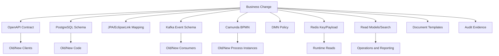
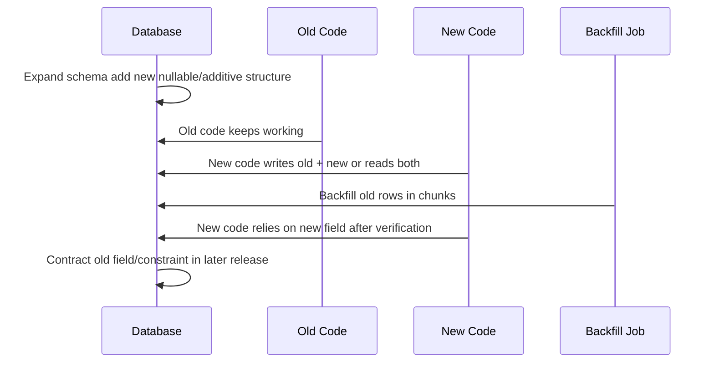
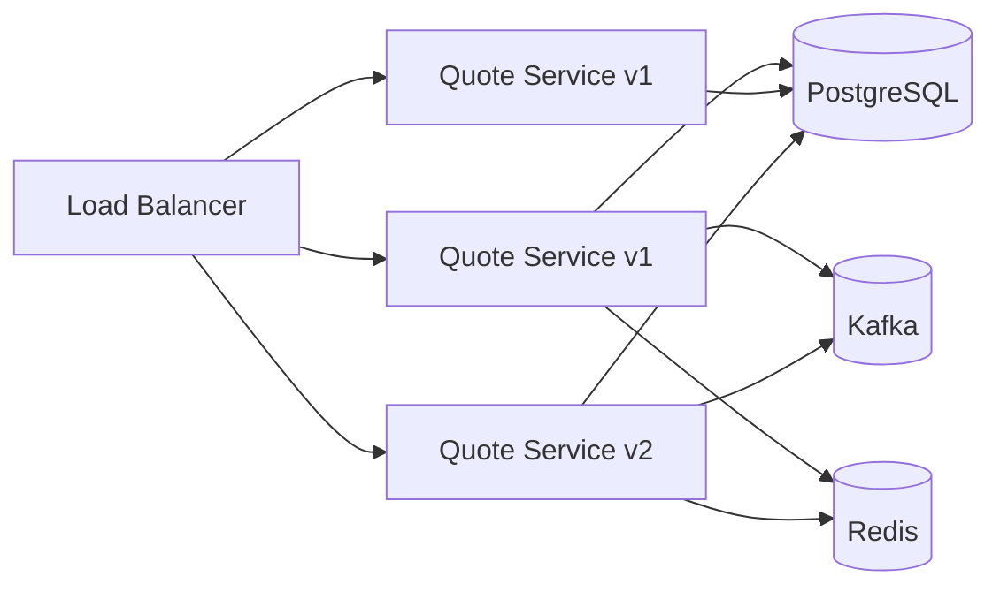
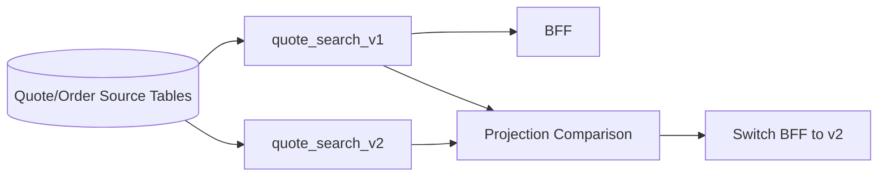

# Part 050 — Data Migration and Backward Compatibility

The most dangerous production releases are not the ones that change code.

They are the ones that change meaning.

In CPQ/OMS, meaning lives in many places:

- PostgreSQL tables
- JPA entity mappings
- OpenAPI request/response schemas
- Kafka event schemas
- Camunda process definitions
- DMN policy decisions
- Redis keys and cached payloads
- search/read model projections
- quote documents
- audit records
- operational runbooks

Backward compatibility is the discipline that lets old and new meanings coexist during change.

Without it, every deployment becomes a gamble.

---

## 1. The Core Rule

For enterprise CPQ/OMS:

> A release is compatible when old data, old requests, old events, old process instances, old caches, and old operational procedures can survive the transition to new code.

This is broader than API compatibility.

A service can pass OpenAPI compatibility and still fail because:

- old rows do not have a new required column
- old Kafka events cannot be deserialized
- old Camunda process instances lack a new variable
- old Redis cache entries use old payload shape
- old quote artifacts no longer match acceptance rules
- old approval decisions do not include new evidence fields
- old search projections are missing new columns

A top engineer thinks in compatibility surfaces.

---

## 2. Compatibility Surface Map



Every surface needs a compatibility rule.

| Surface | Compatibility question |
|---|---|
| API | Can old clients call new service? Can new clients tolerate old response during rollout? |
| DB | Can old and new code read/write during migration window? |
| JPA | Can mappings read old rows without exceptions or semantic corruption? |
| Event | Can old consumers read new events? Can new consumers read old events during replay? |
| Workflow | Can old process instances complete? Can new workers handle old tasks? |
| DMN | Can old decision evidence still be interpreted? |
| Redis | Can old cache entries be ignored, migrated, or invalidated safely? |
| Read model | Can projections be rebuilt from old events/data? |
| Document | Can old artifacts remain legally/commercially understandable? |
| Audit | Can old audit records still answer who/what/why/when? |

---

## 3. The Expand–Migrate–Contract Pattern

Most safe data evolution follows this pattern.



The phases:

| Phase | Meaning |
|---|---|
| Expand | Add new structure without breaking old code |
| Migrate | Populate/derive new structure safely |
| Dual-read/write | Keep old and new paths compatible during rollout |
| Verify | Prove data completeness and correctness |
| Contract | Remove old structure only after all dependencies are gone |

Do not combine all phases in one release unless the table is tiny, the service is not distributed, and the business risk is low.

CPQ/OMS usually does not meet those conditions.

---

## 4. Example: Adding Contract Term to Quote Lines

Business wants quote line pricing to depend on contract term.

Naive implementation:

```sql
ALTER TABLE quote_line ADD COLUMN contract_term_months integer NOT NULL;
```

This breaks existing rows.

Even if it succeeds with a default, it may rewrite a large table or hide semantic uncertainty.

Safer plan:

### Release A — Expand

```sql
ALTER TABLE quote_line
  ADD COLUMN contract_term_months integer;

ALTER TABLE quote_line
  ADD COLUMN contract_term_source varchar(40);
```

New code:

- reads `contract_term_months`
- if missing, derives default from quote header or product offering snapshot
- writes both explicit value and source for new quote lines
- does not require field for old draft quotes yet

### Release B — Backfill

```sql
UPDATE quote_line
SET contract_term_months = q.contract_term_months,
    contract_term_source = 'BACKFILLED_FROM_QUOTE'
FROM quote_revision q
WHERE quote_line.quote_revision_id = q.id
  AND quote_line.contract_term_months IS NULL
  AND quote_line.id > :last_id
ORDER BY quote_line.id
LIMIT :chunk_size;
```

In real PostgreSQL, chunking is usually implemented with selected IDs in application code or a CTE, because plain `UPDATE ... LIMIT` is not standard PostgreSQL syntax.

Example CTE style:

```sql
WITH candidate AS (
  SELECT ql.id
  FROM quote_line ql
  JOIN quote_revision qr ON qr.id = ql.quote_revision_id
  WHERE ql.contract_term_months IS NULL
  ORDER BY ql.id
  LIMIT 1000
)
UPDATE quote_line ql
SET contract_term_months = qr.contract_term_months,
    contract_term_source = 'BACKFILLED_FROM_QUOTE'
FROM candidate c
JOIN quote_revision qr ON qr.id = ql.quote_revision_id
WHERE ql.id = c.id;
```

### Release C — Verify

```sql
SELECT count(*)
FROM quote_line
WHERE contract_term_months IS NULL
  AND lifecycle_status IN ('DRAFT', 'PRICED', 'APPROVED');
```

### Release D — Contract

```sql
ALTER TABLE quote_line
  ALTER COLUMN contract_term_months SET NOT NULL;
```

Only do this after all active data is valid and old code is gone.

---

## 5. Compatibility Is About Coexistence

During a rolling deployment, old and new code can run at the same time.



That means compatibility must support:

- old code reading rows written by new code
- new code reading rows written by old code
- old consumers reading new events
- new consumers replaying old events
- old cache payloads being safely ignored or invalidated
- old process instances being completed by new workers

A design that only works after all nodes are restarted is fragile.

---

## 6. Backward-Compatible Database Changes

Usually safe:

| Change | Notes |
|---|---|
| Add nullable column | safe if old code ignores it |
| Add table | safe if no old code depends on absence |
| Add index concurrently | safer for large PostgreSQL tables, but operationally planned |
| Add optional JSONB field | safe if readers tolerate missing field |
| Add new reference data row | safe if old code tolerates unknown values |
| Add new read model table | safe if not part of command path |

Usually risky/breaking:

| Change | Why |
|---|---|
| Drop column | old code may still read/write it |
| Rename column | same as drop + add from old code perspective |
| Change type | old mapping/deserializers may fail |
| Add NOT NULL immediately | old rows and old code may violate it |
| Add mandatory FK immediately | old rows may violate it |
| Tighten CHECK constraint immediately | old data may violate it |
| Delete enum value | old data/events may still contain it |
| Change meaning of status | silent corruption |
| Merge two columns into one | old code loses meaning |

The safe approach is usually additive, then backfill, then contract.

---

## 7. PostgreSQL Constraint Evolution

Constraints are valuable.

But adding them to large existing tables requires care.

For CPQ/OMS, constraints protect business truth:

- valid quote state
- valid order state
- valid money amount precision
- one accepted revision per quote
- one primary order per accepted quote revision
- valid tenant ownership
- valid FK to immutable snapshot tables

Approach:

1. Add the column/table first.
2. Backfill existing data.
3. Validate with query.
4. Add constraint in a controlled release.
5. Monitor lock and duration.

Example partial unique index:

```sql
CREATE UNIQUE INDEX CONCURRENTLY uq_order_primary_per_quote_revision
ON customer_order(quote_revision_id)
WHERE order_kind = 'PRIMARY';
```

Example CHECK constraint after data cleanup:

```sql
ALTER TABLE quote_line
ADD CONSTRAINT ck_quote_line_contract_term_positive
CHECK (contract_term_months IS NULL OR contract_term_months > 0);
```

For high-volume tables, treat constraint addition as an operational event, not just a migration file.

---

## 8. JPA/EclipseLink Compatibility

JPA mapping changes must match DB evolution.

Dangerous changes:

- changing enum ordinal mapping
- making a nullable column primitive `int` in Java
- adding `optional=false` before DB guarantees it
- adding cascade remove to historical child entities
- changing relationship cardinality without data migration
- renaming entity fields without query migration
- changing lazy/eager fetch behavior casually
- using converter logic that cannot parse old values

Safer entity evolution:

```java
@Entity
@Table(name = "quote_line")
public class QuoteLineEntity {

  @Column(name = "contract_term_months")
  private Integer contractTermMonths;

  @Column(name = "contract_term_source")
  private String contractTermSource;

  public ContractTerm contractTermOrDefault(QuoteRevisionEntity revision) {
    if (contractTermMonths != null) {
      return ContractTerm.explicit(contractTermMonths, contractTermSource);
    }
    return ContractTerm.derivedFromRevision(revision.getContractTermMonths());
  }
}
```

Do not use primitive `int` until the column is truly non-null for all rows.

Do not let entity mapping pretend migration has already completed.

---

## 9. OpenAPI Backward Compatibility

API compatibility should be designed for rolling clients.

Compatible request evolution:

- add optional field
- add optional header
- add new endpoint
- add new query parameter with safe default
- add new enum only if clients are tolerant

Breaking request evolution:

- add required field
- remove field
- rename field
- change type
- change field meaning
- change idempotency semantics
- change error contract

For CPQ/OMS commands, compatibility includes state semantics.

Example risky change:

```yaml
# Before
POST /quotes/{quoteId}/commands/submit-for-approval
# returns 202 and starts approval asynchronously

# After
POST /quotes/{quoteId}/commands/submit-for-approval
# returns 200 and synchronously completes approval for low-risk quote
```

This may look like a behavior optimization.

It is actually a contract change.

Old clients may expect a task/workflow to exist.

Safer approach:

- keep old endpoint semantics
- add explicit command variant if needed
- expose resulting state in query/read model
- document async completion behavior separately

---

## 10. Event Schema Backward Compatibility

Events are harder than APIs because of replay.

A consumer deployed today may read an event produced two years ago.

Rules:

- never change event meaning without a new event name/version
- add optional fields, not required fields
- preserve old fields until all consumers and replay paths no longer need them
- never reuse enum values for different meaning
- include schema version or event type version
- include aggregate id and event id
- include occurred-at and produced-at if relevant
- keep old deserializers or upcasters where necessary

Example event evolution:

```json
{
  "eventId": "evt-123",
  "eventType": "quote.accepted.v1",
  "schemaVersion": "1.4.0",
  "tenantId": "tenant-a",
  "aggregateId": "quote-789",
  "quoteRevisionId": "rev-3",
  "acceptedAt": "2026-07-02T10:15:30Z",
  "acceptedBy": "user-456",
  "acceptanceChannel": "CUSTOMER_PORTAL"
}
```

Adding `acceptanceChannel` is usually safe if optional.

Changing `acceptedBy` from user id to display name is breaking because the meaning changed.

---

## 11. Upcasters and Translators

Sometimes new code needs to interpret old event shapes.

Use an upcaster.

```java
public interface EventUpcaster {
  boolean supports(String eventType, String schemaVersion);
  JsonNode upcast(JsonNode oldPayload);
}

public final class QuoteAcceptedV1_2ToV1_4Upcaster implements EventUpcaster {
  @Override
  public boolean supports(String eventType, String schemaVersion) {
    return eventType.equals("quote.accepted.v1")
        && schemaVersion.equals("1.2.0");
  }

  @Override
  public JsonNode upcast(JsonNode oldPayload) {
    ObjectNode copy = oldPayload.deepCopy();
    copy.put("acceptanceChannel", "UNKNOWN_LEGACY");
    copy.put("schemaVersion", "1.4.0");
    return copy;
  }
}
```

But use upcasters carefully.

They cannot invent business truth.

If the old event did not contain evidence, mark it as unknown legacy instead of fabricating certainty.

---

## 12. Kafka Deployment Compatibility

Kafka release ordering must handle producers and consumers.

Common safe order for additive event field:

1. Deploy consumers that tolerate old and new schemas.
2. Deploy producer that emits optional new field.
3. Verify consumer behavior.
4. Later, if needed, make new field operationally required after all old events are handled or upcastable.

Bad order:

1. Producer emits new required shape.
2. Old consumer crashes.
3. Consumer group lag grows.
4. Projection becomes stale.
5. Operations dashboard lies.

Consumer compatibility checklist:

- unknown fields ignored
- missing optional fields handled
- unknown enum values mapped to `UNKNOWN` or rejected into controlled DLQ
- duplicate event handled
- old event version still understood
- replay tested from baseline event set
- poison event handling tested

---

## 13. Redis Cache Compatibility

Redis is often forgotten during migration.

Old cache entries can break new code.

Strategies:

| Strategy | Use when |
|---|---|
| TTL expiry | stale cache is tolerable for short time |
| versioned key | payload shape changes |
| namespace bump | broad invalidation required |
| explicit delete by event | affected aggregate known |
| read-through migration | safe to convert cached payload on read |
| bypass cache | high-risk release window |

Example key versioning:

```text
cpq:v1:tenant:{tenantId}:quote-workspace:{quoteId}
cpq:v2:tenant:{tenantId}:quote-workspace:{quoteId}
```

Do not deserialize old cache payload with new strict DTO unless you can tolerate failure.

Safer:

```java
try {
  return cache.get(keyV2, QuoteWorkspaceView.class);
} catch (CachePayloadIncompatibleException e) {
  cache.delete(keyV2);
  return rebuildFromSourceOfTruth(quoteId);
}
```

Cache compatibility rule:

> Cache may be discarded. Source of truth may not be guessed.

---

## 14. Camunda 7 Workflow Compatibility

Camunda compatibility has two dimensions:

1. process definition versioning
2. running process instance state

When a new process definition version is deployed, running instances do not automatically change to the new version.

This is useful.

It lets old instances finish with their original model.

But your external workers and services must still understand what old instances need.

Workflow compatibility checklist:

- old process instances can complete
- new process instances start with intended version
- external task topics remain supported while old instances exist
- process variables are backward compatible
- message correlation names remain available if old instances wait for them
- timer semantics are not broken
- user tasks still map to case-worker UI
- incidents from old versions remain operable
- migration plan exists if old instances cannot drain

---

## 15. BPMN Change Classification

| BPMN change | Compatibility risk |
|---|---|
| Add new path for new instances only | low/medium |
| Add optional non-interrupting timer | medium |
| Rename external task topic | high |
| Rename message correlation name | high |
| Remove user task where instances wait | high |
| Change variable name used by worker | high |
| Change call activity binding | high |
| Change boundary event scope | high |
| Add required DMN result variable | medium/high |
| Change incident/retry behavior | medium/high |

For high-risk BPMN changes, decide:

- let old instances drain
- migrate old instances
- cancel and restart controlled subset
- add compatibility adapter in workers
- support both variable names temporarily

---

## 16. Process Instance Migration

Process instance migration is not a magic upgrade button.

It maps active activities in source process definition to semantically equivalent activities in target process definition.

Safe migration requires:

- source and target definitions identified
- active activity mapping complete
- semantic equivalence reviewed
- variable compatibility tested
- user task semantics preserved or intentionally changed
- external task topic compatibility verified
- incident/failure handling plan
- batch size and operational window defined
- rollback/roll-forward plan

Migration plan example conceptually:

```java
MigrationPlan plan = runtimeService
    .createMigrationPlan(sourceDefinitionId, targetDefinitionId)
    .mapActivities("waitForApproval", "waitForApproval")
    .mapActivities("generateQuoteDocument", "generateQuoteDocumentV2")
    .build();

runtimeService
    .newMigration(plan)
    .processInstanceIds(instanceIds)
    .execute();
```

Only migrate when necessary.

Draining old instances is often safer.

---

## 17. DMN Compatibility

DMN rules produce decision evidence.

Changing rules can change business outcomes.

Compatibility questions:

- Are old decision results still interpretable?
- Does quote approval evidence record decision definition/version?
- Does new rule require new facts not present in old quotes?
- Are default/fallback rules explicit?
- Are overlapping rules intentional?
- Does rule change invalidate existing approvals?

Example decision evidence:

```json
{
  "decisionKey": "discountApprovalPolicy",
  "decisionVersionTag": "2.4.0",
  "inputFactsHash": "sha256:...",
  "result": {
    "approvalRequired": true,
    "approvalLevel": "REGIONAL_DIRECTOR",
    "reasonCodes": ["DISCOUNT_ABOVE_25_PERCENT"]
  },
  "evaluatedAt": "2026-07-02T11:20:00Z"
}
```

If new DMN rules would have produced a different result, do not silently reinterpret old approvals.

Create an explicit invalidation/reapproval policy.

---

## 18. Product Catalog and Pricing Compatibility

Catalog changes are data migrations with business meaning.

Examples:

- product offering deprecated
- option renamed
- bundle structure changed
- eligibility rule changed
- price book updated
- discount policy changed
- tax category corrected

Compatibility principle:

> Existing quote revisions must remain reproducible from their snapshots.

Do not make old quote correctness depend on current catalog.

Quote should snapshot:

- product offering id and version
- product specification version
- selected options
- characteristic values
- price book version
- pricing rule version
- discount policy version
- approval policy version
- document template version

If catalog version changes, old quotes may need freshness checks, but old evidence must remain explainable.

---

## 19. Search and Read Model Compatibility

Read models are derived.

They can be rebuilt.

But rebuild must be planned.

Read model migration options:

| Option | Use when |
|---|---|
| add nullable projection column | new filter/sort optional |
| rebuild from source tables | source truth has all data |
| replay from events | event history complete and compatible |
| dual projection | old and new UI coexist |
| shadow projection | validate new model before switching |
| full reindex | search schema changed significantly |

Example projection migration:



Do not let search projection become the authority for command decisions.

If search is stale during migration, command endpoints must still validate against source of truth.

---

## 20. Document Template Compatibility

Quote artifacts are evidence.

Changing a template changes how evidence is presented, not necessarily the business truth.

Rules:

- template version must be recorded
- render input schema version must be recorded
- generated artifact should be immutable
- old artifact remains valid unless explicitly superseded
- new template must handle old render input only if re-render is required
- re-render must produce a new artifact version, not overwrite old binary

Artifact metadata:

```json
{
  "artifactId": "art-123",
  "quoteRevisionId": "qr-789",
  "templateKey": "enterprise-proposal",
  "templateVersion": "3.2.0",
  "renderInputSchemaVersion": "2.1.0",
  "contentHash": "sha256:...",
  "generatedAt": "2026-07-02T12:00:00Z",
  "supersedesArtifactId": null
}
```

Do not mutate old PDFs.

Supersede them.

---

## 21. Audit Compatibility

Audit records must outlive application versions.

That means:

- audit event type names must remain interpretable
- actor model must be stable
- authority snapshot must be preserved
- before/after summaries must be versioned
- sensitive data redaction must not destroy legal evidence
- query tools must understand old audit shapes

Do not store audit payloads with only current DTO class names.

Bad:

```json
{
  "class": "com.example.quote.api.AcceptQuoteRequest",
  "payload": { }
}
```

Better:

```json
{
  "auditEventType": "QUOTE_ACCEPTED",
  "auditSchemaVersion": "1.2.0",
  "subject": {
    "type": "QUOTE_REVISION",
    "id": "qr-789"
  },
  "actor": {
    "type": "USER",
    "id": "user-456",
    "authoritySnapshot": ["ACCEPT_QUOTE"]
  },
  "evidence": {
    "quoteRevisionNumber": 3,
    "priceResultId": "pr-321",
    "artifactId": "art-123"
  }
}
```

Audit is a compatibility surface because future investigators need to understand past records.

---

## 22. Backfill Architecture

Backfill is production software.

Do not treat it as a throwaway script for important data.

Backfill job requirements:

- idempotent
- resumable
- chunked
- rate-limited
- observable
- tenant-aware
- audited where business-significant
- safe under concurrent application writes
- uses stable ordering
- records progress
- supports dry run
- has stop/resume controls

Backfill progress table:

```sql
CREATE TABLE data_backfill_job (
  id uuid PRIMARY KEY,
  job_key varchar(120) NOT NULL,
  status varchar(40) NOT NULL,
  started_at timestamptz,
  completed_at timestamptz,
  last_processed_id uuid,
  processed_count bigint NOT NULL DEFAULT 0,
  failed_count bigint NOT NULL DEFAULT 0,
  dry_run boolean NOT NULL DEFAULT false,
  parameters jsonb NOT NULL,
  created_at timestamptz NOT NULL DEFAULT now(),
  updated_at timestamptz NOT NULL DEFAULT now()
);
```

Chunk processing pattern:

```java
while (true) {
  List<QuoteLineId> ids = backfillRepository.nextChunk(jobId, 500);
  if (ids.isEmpty()) {
    backfillRepository.markComplete(jobId);
    break;
  }

  for (QuoteLineId id : ids) {
    try {
      backfillOneLine(id);
      backfillRepository.markItemSuccess(jobId, id);
    } catch (RetryableBackfillException e) {
      backfillRepository.markItemRetry(jobId, id, e);
    } catch (Exception e) {
      backfillRepository.markItemFailed(jobId, id, e);
    }
  }

  rateLimiter.pauseIfNeeded();
}
```

Backfill code should be reviewed like application code.

It changes business data.

---

## 23. Dual-Write and Dual-Read

Dual-write can be necessary during migration.

But it must be temporary and observable.

Example:

```java
public void updateQuoteTerm(QuoteLine line, ContractTerm term) {
  // Old representation.
  line.setLegacyTermCode(term.toLegacyCode());

  // New representation.
  line.setContractTermMonths(term.months());
  line.setContractTermSource(term.source());
}
```

Dual-read:

```java
public ContractTerm readContractTerm(QuoteLineEntity line, QuoteRevisionEntity revision) {
  if (line.getContractTermMonths() != null) {
    return ContractTerm.explicit(line.getContractTermMonths(), line.getContractTermSource());
  }

  if (line.getLegacyTermCode() != null) {
    return ContractTerm.fromLegacyCode(line.getLegacyTermCode());
  }

  return ContractTerm.derivedFromRevision(revision.getContractTermMonths());
}
```

Rules:

- log metrics for old path usage
- add dashboard for remaining legacy reads
- define removal criteria
- remove dual path after contract phase

If you never remove dual paths, your system becomes a museum of old migrations.

---

## 24. Compatibility Test Matrix

Every significant release should define a compatibility matrix.

```yaml
compatibilityMatrix:
  oldClient_newServer: passed
  newClient_oldServer: passed
  oldCode_newDb: passed
  newCode_oldDb: not_required_for_deployment_order
  oldConsumer_newEvent: passed
  newConsumer_oldEventReplay: passed
  oldProcess_newWorker: passed
  newProcess_oldWorker: not_allowed
  oldCache_newCode: passed_by_namespace_bump
  oldProjection_newBff: not_used
```

Not every cell must pass.

But every failed/not-required cell must be justified by deployment order.

This is how you prevent hidden assumptions.

---

## 25. Release Ordering Examples

### Example A — Add optional quote field

Safe order:

1. DB expand.
2. Backend handles missing field.
3. Backend writes field for new quotes.
4. BFF exposes optional field.
5. Frontend sends field.
6. Backfill old records.
7. Add constraint later if needed.

### Example B — Rename Kafka event field

Safe order:

1. Add new field while keeping old field.
2. Update consumers to prefer new field but fallback to old.
3. Update producer to populate both.
4. Verify no consumers rely on old field.
5. Publish new event version or remove old field only in major version.

### Example C — Change BPMN external task topic

Safe order:

1. Deploy worker that supports old and new topic.
2. Deploy new BPMN using new topic.
3. Let old process instances drain.
4. Remove old topic support only after no active old tasks remain.

### Example D — Add NOT NULL requirement

Safe order:

1. Add nullable column.
2. New code writes field.
3. Backfill old rows.
4. Verify zero nulls.
5. Add NOT NULL.
6. Remove fallback code later.

---

## 26. Rollback vs Roll-Forward

Data migrations frequently make rollback unsafe.

Design for roll-forward.

| Scenario | Correct response |
|---|---|
| new code fails but DB expand is additive | rollback code, keep schema |
| backfill produced wrong derived values | pause, correct with compensating migration |
| event emitted with wrong field meaning | publish corrective event or patch consumer logic |
| process instances started on bad BPMN | suspend, migrate/modify/compensate, deploy fixed version |
| document generated with wrong template | supersede document, do not overwrite |
| approval evaluated with wrong DMN | invalidate approval and re-evaluate with evidence |

Rollback is useful for stateless code.

Business state needs correction, compensation, or roll-forward.

---

## 27. Migration Runbook Template

Every non-trivial data migration should have a runbook.

```md
# Migration Runbook: Add Contract Term to Quote Line

## Purpose
Add explicit contract term to quote line pricing evidence.

## Scope
Tables: quote_line, quote_revision
Services: quote-service, pricing-service, BFF
Events: quote.priced.v1 optional field addition
Workflow: no BPMN change

## Pre-checks
- Confirm migration version not applied.
- Confirm quote_line row count.
- Confirm no long-running transactions.
- Confirm backup/recovery policy.
- Confirm old and new code compatibility.

## Deployment order
1. Apply expand migration.
2. Deploy quote-service v1.15.
3. Deploy pricing-service v1.10.
4. Enable dual-write flag.
5. Run backfill dry-run.
6. Run backfill live.
7. Verify null count.
8. Enable UI field.

## Verification queries
...

## Failure handling
- If migration fails before commit: stop and investigate.
- If backfill fails: pause job, inspect failed rows, resume.
- If new code fails: rollback code, keep additive columns.

## Roll-forward plan
...
```

A migration without a runbook is a production experiment.

---

## 28. Verification Queries

Migration verification should be queryable.

Examples:

```sql
-- Remaining rows without migrated value.
SELECT count(*)
FROM quote_line
WHERE contract_term_months IS NULL;

-- Rows where line term differs unexpectedly from quote term.
SELECT ql.id, ql.quote_revision_id, ql.contract_term_months, qr.contract_term_months
FROM quote_line ql
JOIN quote_revision qr ON qr.id = ql.quote_revision_id
WHERE ql.contract_term_source = 'BACKFILLED_FROM_QUOTE'
  AND ql.contract_term_months <> qr.contract_term_months
LIMIT 100;

-- New writes using old path.
SELECT count(*)
FROM quote_line
WHERE created_at > now() - interval '1 hour'
  AND contract_term_months IS NULL;
```

Expose these as dashboard panels during the migration window.

---

## 29. Anti-Patterns

### Anti-pattern 1 — Big bang migration

One release changes schema, code, event, workflow, UI, and reporting.

When it fails, no one knows which layer broke.

### Anti-pattern 2 — Rename instead of add-and-deprecate

Renames are breaking changes disguised as cleanup.

### Anti-pattern 3 — Required field too early

A required field is safe only after all writers can provide it and all historical data has been migrated or exempted.

### Anti-pattern 4 — Reinterpreting old data silently

Changing the meaning of old status values corrupts history.

### Anti-pattern 5 — Mutating historical quote/order evidence

Historical commercial evidence should be superseded, not overwritten.

### Anti-pattern 6 — Ignoring running process instances

A new BPMN version does not automatically fix old instances.

Ignoring this creates stuck processes.

### Anti-pattern 7 — Cache payload shape change without key versioning

Old Redis payloads can crash new code or produce stale views.

### Anti-pattern 8 — Backfill without progress tracking

You cannot operate what you cannot pause, resume, measure, or audit.

---

## 30. Final Checklist

Before a migration release:

- [ ] Compatibility surfaces identified.
- [ ] Expand-migrate-contract plan exists.
- [ ] Old code/new DB compatibility is proven.
- [ ] New code/old DB compatibility is either proven or deployment order prevents it.
- [ ] OpenAPI compatibility checked.
- [ ] Event schema compatibility checked.
- [ ] Old event replay tested.
- [ ] Redis cache strategy defined.
- [ ] JPA mapping handles old rows.
- [ ] BPMN running instance impact reviewed.
- [ ] DMN decision evidence compatibility reviewed.
- [ ] Search/read model rebuild plan exists if needed.
- [ ] Document template versioning handled.
- [ ] Audit schema remains interpretable.
- [ ] Backfill is chunked, idempotent, observable, and resumable.
- [ ] Verification queries exist.
- [ ] Roll-forward plan exists.
- [ ] Release manifest states compatibility assumptions.

---

## 31. Key Takeaways

Data migration and backward compatibility are not database-only topics.

In CPQ/OMS, compatibility crosses:

- API contracts
- database schema
- JPA mapping
- event streams
- workflow instances
- decision rules
- cache payloads
- projections
- documents
- audit evidence

The strongest pattern is usually:

1. Expand additively.
2. Make code tolerate old and new forms.
3. Migrate/backfill safely.
4. Verify with production-relevant queries.
5. Contract only after all dependencies are gone.

A top 1% engineer does not treat migration as “SQL to run before deploy.”

They treat it as a controlled compatibility program across time.

---

## References

- PostgreSQL Documentation — Constraints: https://www.postgresql.org/docs/current/ddl-constraints.html
- PostgreSQL Documentation — Explicit Locking: https://www.postgresql.org/docs/current/explicit-locking.html
- Flyway Repeatable Migrations: https://documentation.red-gate.com/fd/repeatable-migrations-273973335.html
- OpenAPI Specification: https://spec.openapis.org/oas/v3.2.0.html
- Camunda 7 Process Versioning: https://docs.camunda.org/manual/7.24/user-guide/process-engine/process-versioning/
- Camunda 7 Process Instance Migration: https://docs.camunda.org/manual/7.24/user-guide/process-engine/process-instance-migration/
