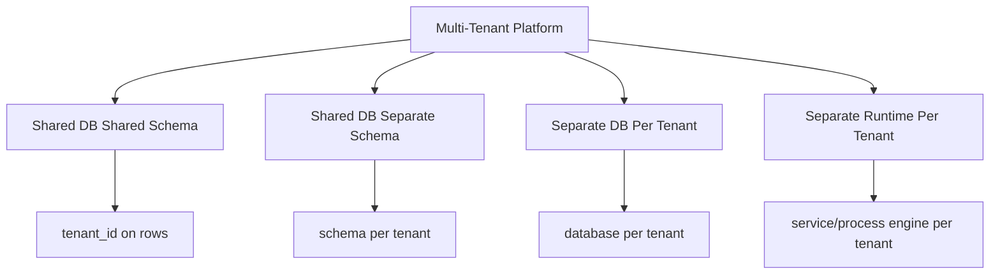
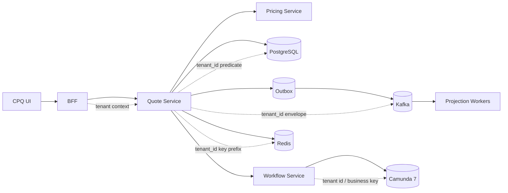
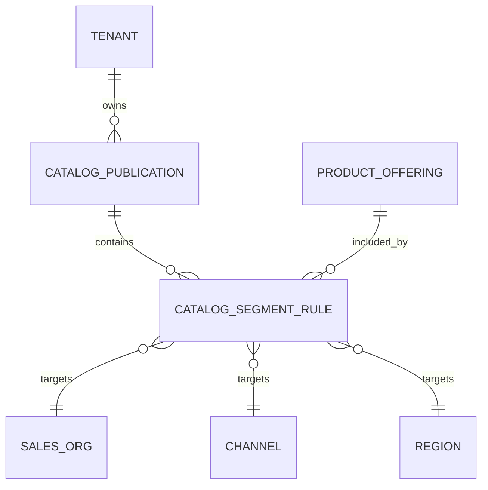
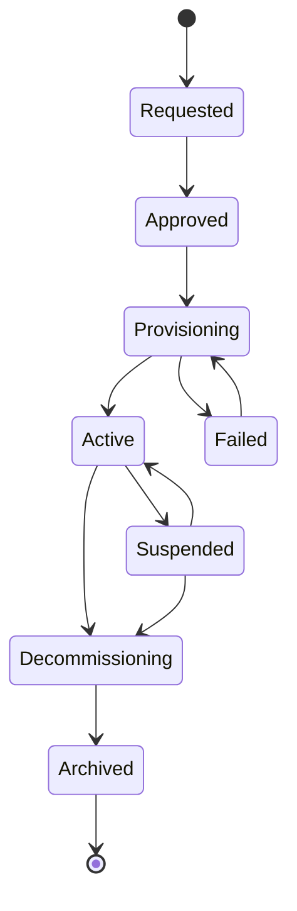
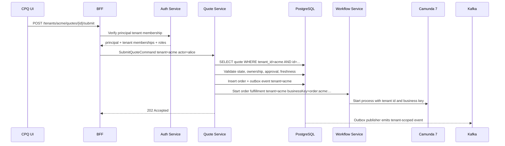

# Part 051 — Multi-Tenancy and Enterprise Segmentation

Multi-tenancy is not a column.

It is a promise.

The promise is simple:

> A user, process, event, cache entry, task, report, document, search result, and operational action from one tenant must not accidentally observe, mutate, infer, or depend on another tenant's data.

In CPQ/OMS, this is harder than ordinary SaaS CRUD.

A quote can depend on:

- product catalog visibility
- customer/account ownership
- channel
- region
- sales organization
- price book
- discount entitlement
- approval authority
- workflow task assignment
- inventory boundary
- billing-account boundary
- document visibility
- audit/legal retention rules

That means `tenant_id` is necessary, but not sufficient.

A production CPQ/OMS needs two related models:

1. **Tenant isolation** — who owns the data and where isolation must be enforced.
2. **Enterprise segmentation** — which commercial, organizational, legal, and operational segments affect behavior inside a tenant.

If you collapse both into a single `tenant_id`, the platform becomes simple but wrong.

If you model every dimension as a tenant, the platform becomes fragmented and impossible to operate.

The skill is knowing the difference.

---

## 1. Core Mental Model

A tenant is the top-level isolation boundary.

A segment is a behavior-selection boundary.

They answer different questions.

| Concept | Question | Example |
|---|---|---|
| Tenant | Whose data is this? | `acme-id`, `globex-id` |
| Legal entity | Which legal party owns this transaction? | `ACME_US`, `ACME_SG` |
| Sales organization | Which sales structure governs selling? | `ENT_APAC`, `SMB_EU` |
| Channel | Through which channel is this sold? | `direct`, `partner`, `self_service` |
| Region | Which regional policy applies? | `ID`, `SG`, `EU` |
| Brand | Which brand/commercial catalog applies? | `premium`, `standard` |
| Customer segment | Which customer class affects pricing/policy? | `enterprise`, `public_sector` |
| Product segment | Which product family or line of business applies? | `connectivity`, `cloud`, `managed_service` |
| Operational segment | Which operations team handles work? | `tier_1_ops`, `enterprise_fulfillment` |

The invariant:

> Tenant isolation prevents cross-customer leakage. Segmentation selects allowed behavior inside the tenant boundary.

Example:

```text
Tenant: ACME
  Legal Entity: ACME Indonesia
  Sales Org: Enterprise APAC
  Channel: Direct Sales
  Customer Segment: Strategic Enterprise
  Catalog Segment: Connectivity Premium
  Price Segment: APAC Enterprise 2026
  Approval Segment: Regional VP Approval Matrix
```

This is one tenant context with many segment dimensions.

---

## 2. The Dangerous Simplification

Bad design:

```text
tenant_id = region
```

or:

```text
tenant_id = customer_id
```

or:

```text
tenant_id = sales_org
```

This feels practical at first.

Then the failures arrive.

### 2.1 If Region Becomes Tenant

A global enterprise customer with activity in multiple regions becomes multiple tenants.

You lose:

- global customer visibility
- global contract consistency
- cross-region renewal handling
- consolidated approval trace
- global account reporting

### 2.2 If Customer Becomes Tenant

A holding company with many subsidiaries becomes hard to model.

You lose:

- parent-child account hierarchy
- shared contract terms
- account-level entitlement
- shared quote templates
- central procurement workflow

### 2.3 If Sales Org Becomes Tenant

A quote moving between sales organizations becomes cross-tenant migration.

You lose:

- clean account ownership transfer
- unified audit
- consistent document access
- operational visibility

Top-level tenant must be stable.

Segments can change.

That single difference matters.

---

## 3. Tenant Boundary Decision

For this CPQ/OMS series, use this default:

> `tenant_id` is the highest isolation boundary for customer-owned or organization-owned business data. Segments are separate attributes resolved through policy and master data.

A tenant may represent:

- one enterprise customer in a B2B SaaS model
- one internal business unit in an internal enterprise platform
- one market/operator in a telecom-style deployment
- one reseller/partner in a partner-operated CPQ model

Do not decide by data model convenience.

Decide by these questions:

| Decision Question | If yes, candidate for tenant boundary |
|---|---|
| Must this party never see another party's quote/order/audit data? | Yes |
| Can this party have separate encryption/retention/legal controls? | Yes |
| Can this party be onboarded/offboarded independently? | Yes |
| Can this party have separate catalog/pricing/admin configuration? | Sometimes |
| Can this party share customers/contracts with others? | Usually no |
| Can operations support this boundary during incidents? | Must be yes |

A tenant boundary that operations cannot support is not a real boundary.

---

## 4. Isolation Models

There are four practical isolation models.



### 4.1 Shared Database, Shared Schema

All tenants share tables.

Every tenant-owned row has `tenant_id`.

Good for:

- many tenants
- cost efficiency
- centralized operations
- shared reporting infrastructure
- simple deployment

Hard parts:

- cross-tenant leakage risk
- every query must enforce tenant scope
- index design must include tenant dimensions
- noisy-neighbor risk
- tenant-level restore is harder

This is the default for most SaaS-like CPQ/OMS systems.

But it demands discipline.

### 4.2 Shared Database, Separate Schema

Each tenant has its own schema.

Good for:

- stronger data separation
- easier tenant export/restore
- easier per-tenant migration in some cases

Hard parts:

- many schemas create operational complexity
- migrations become slower
- cross-tenant reporting becomes harder
- connection/pool/schema routing gets complicated

### 4.3 Separate Database Per Tenant

Each tenant has a dedicated database.

Good for:

- strong isolation
- regulatory/compliance separation
- easier per-tenant backup/restore
- noisy-neighbor mitigation

Hard parts:

- expensive operations
- tenant provisioning complexity
- migrations multiply
- central analytics/read models need aggregation

### 4.4 Separate Runtime Per Tenant

Each tenant has separate services or Camunda engines.

Good for:

- high-value tenants
- strict isolation
- custom release windows
- contractual separation

Hard parts:

- operational overhead
- version drift
- duplicated monitoring
- harder fleet governance

Camunda 7 explicitly supports two multi-tenancy approaches: one process engine per tenant, or one engine using tenant identifiers. In the tenant-identifier approach, tenant data is stored in the same schema and isolation is provided by a tenant identifier column; Camunda also warns that transparent tenant separation is not implemented for all APIs, so not every Camunda API should be directly exposed to tenants.

Reference: https://docs.camunda.org/manual/7.24/user-guide/process-engine/multi-tenancy/

---

## 5. Recommended Default for This Series

For the reference implementation:

```text
Business services: shared DB + shared schema + tenant_id
Camunda 7: single engine + tenant identifiers, hidden behind Workflow Service
Kafka: shared topics partitioned by aggregate, tenant_id in envelope
Redis: shared cluster, tenant-prefixed keys
Search/read model: shared index/table with tenant filter as mandatory predicate
Documents: shared object store bucket, tenant-scoped object keys and metadata
Admin control plane: tenant-aware configuration with approval/audit
```

This gives a realistic enterprise baseline.

Then allow exceptions:

| Exception | Escalated Isolation |
|---|---|
| Regulated tenant requires data residency | separate DB/schema/runtime region |
| Very large tenant causes noisy-neighbor risk | dedicated pools/topics/cache/runtime |
| Tenant requires custom workflow | tenant-specific process definition version |
| Tenant requires custom catalog/pricing | tenant-specific segment config, not separate codebase |
| Tenant requires contractual audit export | tenant-scoped archive/export pipeline |

Default shared.

Escalate with evidence.

---

## 6. Tenant Context

Every request must produce a tenant context.

Not just a string.

A useful tenant context contains:

```java
public record TenantContext(
    String tenantId,
    String principalId,
    Set<String> roles,
    Set<String> groups,
    Set<String> tenantMemberships,
    String legalEntityId,
    String salesOrgId,
    String channelId,
    String regionCode,
    String customerSegment,
    String correlationId
) {}
```

But do not blindly accept all values from the client.

Client can propose.

Server must resolve.

### 6.1 Tenant Resolution Sources

| Source | Trust Level | Usage |
|---|---:|---|
| JWT tenant claim | Medium/high if issued by trusted IdP | membership hint |
| URL path `/tenants/{tenantId}` | Low by itself | requested scope |
| Header `X-Tenant-Id` | Low by itself | internal routing only after auth |
| Account ownership table | High | object-level verification |
| Partner delegation table | High | delegated access |
| Admin session selection | Medium | explicit tenant switching |
| Service credential | High for service identity, low for object authorization | backend task routing |

Correct rule:

> A tenant id in a request selects intended scope; it does not prove authorization.

The server must verify:

```text
principal can access tenant
principal can access object
object belongs to tenant
operation is allowed in current state
operation is allowed by segment policy
```

All five are needed.

---

## 7. Tenant Context Propagation

Tenant context must cross all boundaries.



Required propagation fields:

| Boundary | Required Tenant Fields |
|---|---|
| HTTP | tenant id, principal id, correlation id, auth claims |
| Domain command | tenant id, actor, authority snapshot |
| Database row | tenant id on tenant-owned tables |
| Kafka event | tenant id in envelope and payload metadata |
| Redis key | tenant prefix + environment + service namespace |
| Camunda process | tenant id, business key, process variable contract |
| Document artifact | tenant id, quote/order id, access classification |
| Audit record | tenant id, actor, segment evidence |
| Search projection | tenant id + authorization materialized fields |

If any boundary drops tenant context, that boundary becomes a leak point.

---

## 8. PostgreSQL Tenant Design

For shared schema, every tenant-owned table must have `tenant_id`.

But the deeper rule is:

> Foreign keys should preserve tenant containment.

Bad:

```sql
CREATE TABLE quote_line (
  id uuid PRIMARY KEY,
  quote_revision_id uuid NOT NULL REFERENCES quote_revision(id),
  tenant_id text NOT NULL
);
```

This allows accidental cross-tenant relation if `quote_revision_id` points to another tenant.

Better:

```sql
CREATE TABLE quote_revision (
  tenant_id text NOT NULL,
  id uuid NOT NULL,
  quote_id uuid NOT NULL,
  revision_no int NOT NULL,
  state text NOT NULL,
  PRIMARY KEY (tenant_id, id),
  UNIQUE (tenant_id, quote_id, revision_no)
);

CREATE TABLE quote_line (
  tenant_id text NOT NULL,
  id uuid NOT NULL,
  quote_revision_id uuid NOT NULL,
  line_no int NOT NULL,
  PRIMARY KEY (tenant_id, id),
  FOREIGN KEY (tenant_id, quote_revision_id)
    REFERENCES quote_revision(tenant_id, id)
);
```

Now the database itself prevents cross-tenant child linkage.

### 8.1 Index Rule

For tenant-owned operational queries:

```sql
CREATE INDEX idx_quote_revision_tenant_state_updated
ON quote_revision (tenant_id, state, updated_at DESC);

CREATE INDEX idx_order_tenant_state_created
ON customer_order (tenant_id, state, created_at DESC);
```

Do not index only `state` for high-volume multi-tenant tables.

Tenant is usually the leading filter.

### 8.2 Tenant-Aware Unique Constraints

Wrong:

```sql
UNIQUE (quote_number)
```

Right:

```sql
UNIQUE (tenant_id, quote_number)
```

Unless quote numbers are globally unique by regulatory requirement.

### 8.3 Row-Level Security

PostgreSQL Row-Level Security can be useful.

But do not use it as the only boundary.

Use it as defense-in-depth when:

- all application sessions reliably set tenant context
- migrations and batch jobs are controlled
- reporting roles are understood
- operations teams know how RLS affects debugging

Application-level authorization still remains mandatory.

### 8.4 Tenant-Scoped Audit

Every audit record should include:

```text
tenant_id
object_type
object_id
actor_type
actor_id
operation
before_summary
after_summary
reason_code
correlation_id
occurred_at
```

Audit without tenant id is operationally incomplete.

---

## 9. JPA/EclipseLink Tenant Discipline

JPA can hide SQL.

That is convenient.

It is also dangerous.

The repository layer must enforce tenant explicitly.

```java
public Optional<QuoteRevision> findById(TenantContext tenant, UUID quoteRevisionId) {
    return em.createQuery("""
        select q
        from QuoteRevision q
        where q.tenantId = :tenantId
          and q.id = :id
        """, QuoteRevision.class)
      .setParameter("tenantId", tenant.tenantId())
      .setParameter("id", quoteRevisionId)
      .getResultStream()
      .findFirst();
}
```

Do not expose generic repository methods like:

```java
findById(UUID id)
```

for tenant-owned aggregates.

The method signature should make tenant omission impossible.

### 9.1 Aggregate Root Rule

Tenant id is part of every aggregate root identity.

```java
public record QuoteRevisionId(String tenantId, UUID id) {}
public record OrderId(String tenantId, UUID id) {}
public record ProductOfferingId(String tenantId, String code, int version) {}
```

Even if your database uses UUID primary keys, your domain identity should still carry tenant.

This prevents accidental cross-tenant calls in code.

### 9.2 No Cross-Tenant Entity Graphs

Do not let one entity association cross tenant boundaries.

A quote line should not reference a product offering entity from a different tenant through ORM association.

Use snapshots:

```java
@Embeddable
public class ProductOfferingSnapshot {
    private String tenantId;
    private String offeringCode;
    private int catalogVersion;
    private String displayName;
    private String segmentCode;
}
```

Snapshot beats live cross-tenant lookup.

---

## 10. Catalog Segmentation

Catalog segmentation decides what can be sold.

It should answer:

```text
Given tenant, legal entity, channel, region, customer segment, and date,
which product offerings are visible and eligible?
```

Do not encode this as UI filtering only.

Eligibility must be enforced server-side.

### 10.1 Catalog Visibility Model



Minimum fields:

```sql
CREATE TABLE catalog_segment_rule (
  tenant_id text NOT NULL,
  id uuid NOT NULL,
  catalog_publication_id uuid NOT NULL,
  product_offering_code text NOT NULL,
  sales_org_id text,
  channel_id text,
  region_code text,
  customer_segment text,
  effective_from timestamptz NOT NULL,
  effective_to timestamptz,
  status text NOT NULL,
  PRIMARY KEY (tenant_id, id)
);
```

### 10.2 Visibility vs Eligibility

Separate them.

Visibility:

> Can the user see this offering in the catalog?

Eligibility:

> Can this offering be selected for this customer/context?

Example:

- A sales rep may see an enterprise connectivity package.
- The customer may be ineligible because service area is unsupported.

Do not hide all ineligible products by default.

In enterprise CPQ, explainability matters.

Sometimes the system should show:

```text
Not eligible: customer location outside supported coverage area.
```

That is better than a disappearing option.

---

## 11. Pricing Segmentation

Pricing segmentation decides what commercial rules apply.

It should answer:

```text
Given tenant, price segment, customer segment, channel, region, product, date,
which price book and discount policy version applies?
```

Pricing is more sensitive than catalog visibility.

A cross-segment price leak can expose confidential commercial strategy.

### 11.1 Price Segment Model

```text
price_segment = tenant + legal entity + sales org + channel + region + customer class + product family + effective date
```

Not every dimension must be populated.

But every decision must record which dimensions were used.

### 11.2 Price Decision Evidence

A price result should carry:

```json
{
  "tenantId": "acme",
  "quoteId": "...",
  "priceBookVersion": "APAC-ENT-2026-v7",
  "priceSegment": "APAC_ENTERPRISE_DIRECT",
  "customerSegment": "STRATEGIC_ENTERPRISE",
  "channel": "DIRECT",
  "region": "ID",
  "effectiveAt": "2026-07-02T00:00:00Z",
  "components": []
}
```

This is required for reproducibility.

Without segment evidence, you cannot answer:

> Why did this customer get this price?

---

## 12. Approval Segmentation

Approval policy is not global.

A 20% discount may be normal in one market and suspicious in another.

Approval policy depends on:

- tenant
- sales org
- legal entity
- channel
- customer segment
- product family
- contract term
- margin band
- discount authority
- risk class

### 12.1 Approval Authority Scope

```sql
CREATE TABLE approval_authority_scope (
  tenant_id text NOT NULL,
  id uuid NOT NULL,
  principal_id text NOT NULL,
  sales_org_id text,
  region_code text,
  customer_segment text,
  product_family text,
  max_discount_percent numeric(9,4),
  max_contract_value numeric(19,4),
  effective_from timestamptz NOT NULL,
  effective_to timestamptz,
  PRIMARY KEY (tenant_id, id)
);
```

The scope must be snapshotted into approval evidence.

Do not merely store:

```text
approved_by = alice
```

Store:

```text
approved_by = alice
approved_under_scope = Regional VP APAC Enterprise v3
authority_evidence_hash = ...
```

Authority can change later.

The quote must remain defensible.

---

## 13. Order Segmentation

Order segmentation decides who can fulfill and operate the order.

It depends on:

- tenant
- legal entity
- fulfillment region
- product family
- inventory domain
- partner/reseller responsibility
- operations queue
- support tier

Do not use quote owner as fulfillment owner.

Sales ownership and operations ownership are different.

### 13.1 Operations Queue Mapping

```text
order line product family + region + partner flag -> fulfillment group
```

Example:

```json
{
  "tenantId": "acme",
  "orderId": "...",
  "lineId": "...",
  "productFamily": "connectivity",
  "region": "ID-JKT",
  "requiresFieldWork": true,
  "fulfillmentGroup": "ID_CONNECTIVITY_FIELD_OPS"
}
```

This mapping must be versioned.

A line created yesterday should not silently move queues because config changed today.

---

## 14. Kafka Tenant Boundary

Kafka events must include tenant context.

Minimum envelope:

```json
{
  "eventId": "...",
  "eventType": "quote.approved.v1",
  "tenantId": "acme",
  "aggregateType": "quote",
  "aggregateId": "...",
  "aggregateVersion": 17,
  "occurredAt": "2026-07-02T10:00:00Z",
  "correlationId": "...",
  "causationId": "...",
  "dataClassification": "commercial-confidential",
  "payload": {}
}
```

### 14.1 Topic Strategy

| Strategy | Good For | Risk |
|---|---|---|
| Shared topic with tenant in envelope | many tenants, low ops overhead | consumers must enforce tenant filtering |
| Topic per tenant | strict isolation, high-value tenants | topic explosion, harder fleet ops |
| Topic per domain and region | data residency/regional ops | routing complexity |
| Dedicated cluster per tenant | extreme isolation | expensive and operationally heavy |

Default:

```text
cpq.quote.events.v1
cpq.order.events.v1
cpq.catalog.events.v1
cpq.workflow.events.v1
```

with mandatory `tenantId` in envelope.

Escalate to tenant-specific topics only for evidence-based isolation requirements.

### 14.2 Consumer Rule

Every consumer must either:

1. process all tenants safely, or
2. explicitly allowlist tenants.

Never rely on accidental filtering.

```java
if (!tenantAccessPolicy.canProcess(event.tenantId())) {
    metrics.increment("event.skipped.unauthorized_tenant");
    return;
}
```

This matters for projection workers, notification workers, document workers, and workflow workers.

---

## 15. Redis Tenant Boundary

Redis keys must be tenant-scoped.

Bad:

```text
quote-preview:123
catalog:offering:VPN_BASIC
idempotency:submit-order:abc
```

Good:

```text
prod:quote-service:tenant:acme:quote-preview:123
prod:catalog-service:tenant:acme:offering:VPN_BASIC:v42
prod:quote-service:tenant:acme:idempotency:submit-order:abc
```

### 15.1 Key Prefix Contract

```text
<env>:<service>:tenant:<tenantId>:<domain>:<key>:<version>
```

A key without tenant should be reviewed.

Allowed global keys are rare:

- public static reference data
- service health marker
- global rate-limit metadata
- distributed configuration version

Even then, document it.

### 15.2 Redis Must Not Decide Tenant Authority

Redis can cache entitlement result.

Redis must not be the source of entitlement truth.

Correct:

```text
DB/policy engine decides -> Redis caches short-lived result -> DB/policy can invalidate
```

Wrong:

```text
Redis key exists -> user is authorized
```

---

## 16. Camunda 7 Tenant Boundary

There are two practical approaches for this platform.

### 16.1 Single Engine With Tenant Identifiers

Use when:

- many tenants
- similar workflow definitions
- shared operations team
- moderate isolation requirement

Pattern:

```java
runtimeService
  .createProcessInstanceByKey("order_fulfillment")
  .processDefinitionTenantId(tenantId)
  .businessKey("order:" + tenantId + ":" + orderId)
  .setVariables(variables)
  .execute();
```

Key rules:

- tenant id must be explicit when starting process instances
- business key must include tenant-aware business identity
- task queries must be filtered by tenant or hidden behind custom service APIs
- do not expose raw Camunda REST APIs to tenant users
- admin tools require strict operator authorization

### 16.2 One Engine Per Tenant

Use when:

- strict isolation is required
- tenant-specific process definitions are heavy
- tenant runtime lifecycle differs
- regulatory or contractual boundary requires separation

But do not choose this casually.

It increases:

- deployment complexity
- migration complexity
- job executor tuning complexity
- monitoring complexity
- process definition drift

Camunda 7 documentation describes one-engine-per-tenant as a supported multi-tenancy approach and notes that each process engine can use a different data source, schema, or table prefix. It also notes shared job execution options for multiple engines.

Reference: https://docs.camunda.org/manual/7.24/user-guide/process-engine/multi-tenancy/

### 16.3 Custom Workflow Service Boundary

The CPQ/OMS services should not call raw Camunda tenant APIs directly everywhere.

Use a Workflow Service facade:

```text
POST /internal/workflows/order-fulfillment/start
POST /internal/workflows/quote-approval/start
POST /internal/workflows/messages/inventory-reserved/correlate
GET  /internal/workflows/tasks?tenantId=...
```

The facade enforces:

- tenant authorization
- process key allowlist
- variable schema
- business key format
- audit
- correlation id
- operator permission
- migration fence

---

## 17. Search and Reporting Tenant Boundary

Search is one of the easiest places to leak data.

Because search often optimizes for relevance, not authorization.

Rule:

> Authorization must be applied before ranking and before pagination.

Bad:

```text
search all quotes -> rank -> paginate -> filter unauthorized results
```

This creates empty pages and can leak counts.

Better:

```text
apply tenant + access predicate -> rank -> paginate
```

### 17.1 Projection Fields

Quote search projection should include:

```text
tenant_id
quote_id
quote_number
customer_id
owner_id
sales_org_id
region_code
state
approval_state
authorized_group_ids
visibility_scope
updated_at
```

Do not force search service to call Quote Service for every row to know visibility.

Materialize enough authorization fields into the projection.

But keep them derived and rebuildable.

---

## 18. Document and Artifact Tenant Boundary

Documents are high-risk.

A quote PDF can expose:

- prices
- discounts
- customer identity
- contract terms
- approval conditions
- internal notes if generated incorrectly

Artifact key design:

```text
s3://cpq-artifacts/prod/tenant/acme/quote/quote-123/rev/4/artifact/proposal-v2.pdf
```

Metadata:

```json
{
  "tenantId": "acme",
  "artifactType": "quote-proposal",
  "quoteId": "quote-123",
  "quoteRevision": 4,
  "classification": "commercial-confidential",
  "createdBy": "document-service",
  "contentHash": "..."
}
```

Access must be authorized through application service.

Do not expose raw object store paths as permanent public URLs unless signed and time-limited.

---

## 19. Admin Tenant Boundary

Admin users are dangerous because they cross ordinary user boundaries.

Define admin scopes:

| Admin Scope | Permission |
|---|---|
| Tenant Admin | manage users/config for one tenant |
| Catalog Admin | publish catalog for tenant/segment |
| Pricing Admin | manage price books for tenant/segment |
| Policy Admin | manage approval/entitlement rules |
| Workflow Admin | deploy/suspend/migrate process definitions |
| Operator | retry jobs, manage incidents, inspect health |
| Super Admin | cross-tenant platform administration |

Never treat `admin=true` as enough.

An operator who can retry a workflow job may indirectly trigger fulfillment.

A workflow admin who can update variables may alter process behavior.

Camunda 7 authorization documentation explicitly warns that variable update permissions can trigger other changes in the process, for example by causing conditional events to evaluate successfully.

Reference: https://docs.camunda.org/manual/7.24/user-guide/process-engine/authorization-service/

---

## 20. Tenant Provisioning Lifecycle

Tenant provisioning is not a row insert.

Lifecycle:



Provisioning must create or configure:

- tenant master record
- legal entities
- user/group mappings
- catalog baseline
- price baseline
- approval policy baseline
- workflow deployments or tenant identifiers
- Redis namespace policy
- Kafka consumer access if isolated
- document storage prefix
- search projection namespace
- audit retention rules
- default admin scopes

Do not activate tenant until baseline config is complete.

### 20.1 Tenant Activation Checklist

```text
[ ] tenant master exists
[ ] identity provider mapping tested
[ ] user/group/role mappings loaded
[ ] legal entity configured
[ ] catalog publication active
[ ] price book active
[ ] approval policy active
[ ] workflow process definitions deployed or shared definitions mapped
[ ] notification templates configured
[ ] document artifact prefix configured
[ ] audit retention configured
[ ] tenant health check passes
[ ] sample quote create/configure/price/approve flow passes
```

---

## 21. Tenant Suspension

Suspension must be explicit.

A suspended tenant may allow:

- read-only access
- payment/billing reconciliation
- operator export
- audit access

but block:

- new quote creation
- quote acceptance
- order submission
- catalog publication
- price book publication
- workflow process start

Suspension policy:

```text
ACTIVE:
  all authorized actions allowed

SUSPENDED_READ_ONLY:
  reads allowed
  new commercial commitments blocked
  workflow recovery allowed by operator

SUSPENDED_SECURITY:
  reads blocked except security/admin
  active sessions revoked
  workflow side effects paused

DECOMMISSIONING:
  only export, archive, retention, legal hold operations allowed
```

Do not implement tenant suspension only at UI level.

Every command handler must check tenant operational state.

---

## 22. Tenant-Aware Idempotency

Idempotency keys are tenant-scoped.

Bad:

```text
idempotency_key = requestId
```

Better:

```text
idempotency_key = tenantId + actorId + commandType + clientRequestId
```

Database table:

```sql
CREATE TABLE idempotency_record (
  tenant_id text NOT NULL,
  actor_id text NOT NULL,
  command_type text NOT NULL,
  idempotency_key text NOT NULL,
  request_hash text NOT NULL,
  response_hash text,
  status text NOT NULL,
  created_at timestamptz NOT NULL,
  expires_at timestamptz NOT NULL,
  PRIMARY KEY (tenant_id, actor_id, command_type, idempotency_key)
);
```

A client in tenant A must not collide with tenant B.

---

## 23. Cross-Tenant Operations

Some operations are legitimately cross-tenant:

- platform-wide health dashboard
- security investigation
- global catalog template management
- fleet migration
- analytics aggregation
- global audit export
- support impersonation

Treat these as privileged workflows.

Do not implement them by silently omitting tenant filters.

Cross-tenant operation must require:

```text
explicit cross_tenant_scope
reason code
operator identity
approval when high risk
time-limited access
full audit
read-only default
```

### 23.1 Support Impersonation

Support impersonation is especially dangerous.

Safer model:

```text
operator requests session -> approval or policy grants -> scoped session created -> all actions audited as operator acting for user/tenant
```

Never overwrite actor identity with impersonated user only.

Audit must show both:

```text
actor = support.operator@company
acting_as = user@tenant
reason = CASE-12345
scope = quote-read-only
expires_at = ...
```

---

## 24. Multi-Tenant Threat Model

Use this checklist.

| Threat | Example | Control |
|---|---|---|
| Broken object-level authorization | user changes quote id in URL | object ownership check |
| Missing tenant filter | search query returns other tenant rows | mandatory tenant predicate |
| Cache leakage | Redis key missing tenant prefix | key namespace contract |
| Event leakage | notification consumer processes wrong tenant event | tenant allowlist + envelope |
| Workflow leakage | task query not tenant filtered | Workflow Service facade |
| Admin overreach | tenant admin edits global pricing | scoped admin roles |
| Report leakage | aggregate report includes hidden tenant | report authorization layer |
| Document leakage | shared artifact URL guessed | signed URL + metadata auth |
| Log leakage | logs include confidential price data | redaction + classification |
| Test leakage | fixtures mix tenant data | scenario catalog tenant assertions |

OWASP's multi-tenant guidance focuses on tenant isolation and preventing cross-tenant attacks, and OWASP API Security identifies object-level authorization as a critical API risk. In CPQ/OMS, both concerns are central because object identifiers are everywhere: quotes, orders, tasks, documents, accounts, and workflow instances.

References:

- https://cheatsheetseries.owasp.org/cheatsheets/Multi_Tenant_Security_Cheat_Sheet.html
- https://owasp.org/API-Security/editions/2023/en/0xa1-broken-object-level-authorization/

---

## 25. Tenant Isolation Tests

Tenant isolation needs dedicated tests.

Not incidental tests.

### 25.1 API Test

```text
Given tenant A user
And tenant B quote exists
When user requests /quotes/{tenantBQuoteId}
Then response is 404 or 403 according to disclosure policy
And audit records denied access
```

Disclosure policy matters.

For sensitive objects, prefer `404` to avoid confirming existence.

### 25.2 Repository Test

```text
Given same UUID-like external reference exists under two tenants
When repository loads by tenant A
Then only tenant A row is returned
```

### 25.3 Search Test

```text
Given quote with matching search term in tenant B
When tenant A user searches same term
Then tenant B result is not counted, ranked, or paginated
```

### 25.4 Kafka Consumer Test

```text
Given consumer is configured for tenant A
When tenant B event is received
Then consumer skips event and increments unauthorized tenant metric
```

### 25.5 Redis Test

```text
Given tenant A and tenant B have same quote id
When preview cache is written for both
Then keys are distinct
```

### 25.6 Camunda Task Test

```text
Given task exists for tenant B
When tenant A user queries worklist
Then task is not visible
And raw Camunda task id is never exposed as sufficient access token
```

---

## 26. Operational Metrics

Track tenant-aware metrics.

```text
api_requests_total{tenant,service,operation,status}
command_denied_total{tenant,reason}
cross_tenant_access_denied_total{sourceTenant,targetTenant,operation}
quote_created_total{tenant,channel,region}
order_failed_total{tenant,fulfillmentGroup,reason}
workflow_incidents_total{tenant,processKey}
projection_lag_seconds{tenant,projection}
redis_hit_ratio{tenant,cacheName}
consumer_lag{tenant,consumerGroup,topic}
tenant_suspended_command_blocked_total{tenant,operation}
```

Be careful with metric cardinality.

If tenant count is huge, use tenant tier or sampled tenant labels for high-volume metrics.

But security denial metrics should preserve enough forensic detail in logs/audit.

---

## 27. Design Smells

### Smell 1: `findById(id)` for Tenant-Owned Object

Should be:

```text
findById(tenantId, id)
```

### Smell 2: Tenant in UI Only

Server must enforce tenant.

UI filtering is convenience, not security.

### Smell 3: Shared Redis Key Without Tenant

Almost always wrong.

### Smell 4: Raw Camunda REST Exposed to Users

Dangerous unless Camunda authorization and tenant restrictions are fully configured and understood.

### Smell 5: Admin Role Without Scope

`ADMIN` is not enough.

Use scoped permissions.

### Smell 6: Search Filter After Pagination

Authorization must happen before ranking and pagination.

### Smell 7: Segment Is Treated as Tenant

Segments are behavior selectors.

Tenants are isolation boundaries.

### Smell 8: Tenant-Specific Forked Codebase

Configuration and policy should vary.

Core code should remain shared unless isolation requires runtime split.

---

## 28. Reference Tenant Context Flow



No boundary relies on the previous boundary blindly.

Each one reasserts the tenant.

---

## 29. Minimal Implementation Plan

### Step 1 — Tenant Master

Create:

```text
tenant
tenant_state
tenant_segment_config
tenant_user_membership
tenant_admin_scope
```

### Step 2 — Tenant Context Filter

In JAX-RS/Jersey:

- authenticate principal
- resolve requested tenant
- verify membership
- attach TenantContext to request scope
- add correlation id

### Step 3 — Repository Signatures

For tenant-owned aggregates:

```java
findById(TenantContext tenant, Id id)
save(TenantContext tenant, Aggregate aggregate)
search(TenantContext tenant, Query query)
```

No generic tenant-less access.

### Step 4 — Database Constraints

- `tenant_id` on tenant-owned tables
- composite primary/foreign keys where practical
- tenant-leading indexes
- tenant-aware uniqueness

### Step 5 — Event Envelope

Require `tenantId` in every event envelope.

Reject events without tenant unless explicitly global.

### Step 6 — Redis Namespace

Implement key builder.

No manual string keys in business code.

### Step 7 — Workflow Facade

All Camunda operations go through Workflow Service.

No raw Camunda exposure to CPQ UI.

### Step 8 — Tenant Isolation Test Suite

Add cross-tenant negative tests for every API and projection.

---

## 30. Production Checklist

```text
[ ] tenant id is present on all tenant-owned tables
[ ] tenant-aware foreign keys prevent cross-tenant child linkage
[ ] tenant-leading indexes exist for operational queries
[ ] repository APIs require tenant context
[ ] object-level authorization verifies tenant ownership
[ ] search applies tenant/access predicate before ranking and pagination
[ ] Redis keys use tenant namespace builder
[ ] Kafka events include tenant id and classification
[ ] consumers enforce tenant scope or explicit all-tenant permission
[ ] Camunda process start/correlation includes tenant-aware business key
[ ] raw Camunda APIs are not exposed to tenant users
[ ] admin roles are scoped and audited
[ ] document artifacts are tenant-scoped and access-controlled
[ ] tenant provisioning has activation checklist
[ ] tenant suspension blocks commercial commands server-side
[ ] cross-tenant operations require reason code and audit
[ ] isolation tests cover API, DB, search, Redis, Kafka, Camunda, documents
```

---

## Closing

Multi-tenancy is not achieved by adding `tenant_id`.

That is only the first move.

A production CPQ/OMS must carry tenant context through:

- HTTP
- domain commands
- database constraints
- event envelopes
- cache keys
- workflow instances
- documents
- read models
- audit records
- admin operations

The deeper design principle is this:

> Isolation must be enforced at every boundary where data is read, changed, cached, emitted, rendered, searched, or operated.

Enterprise segmentation is equally important, but different.

Segments choose behavior.

Tenants enforce isolation.

Confusing the two creates either security leaks or operational chaos.
