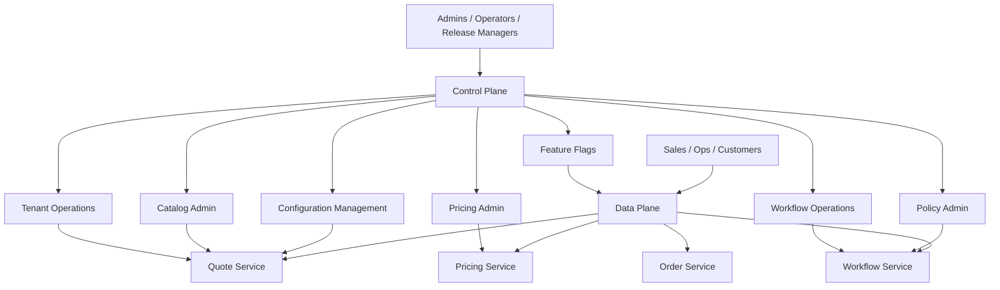
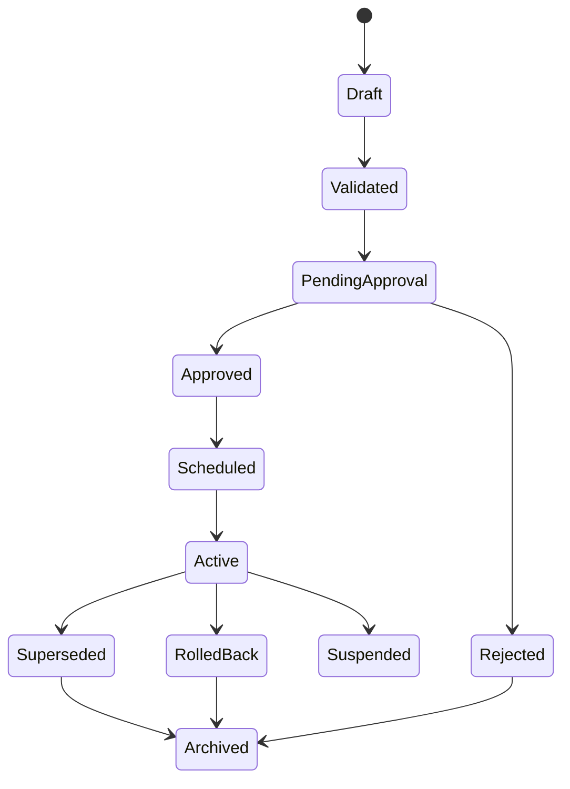
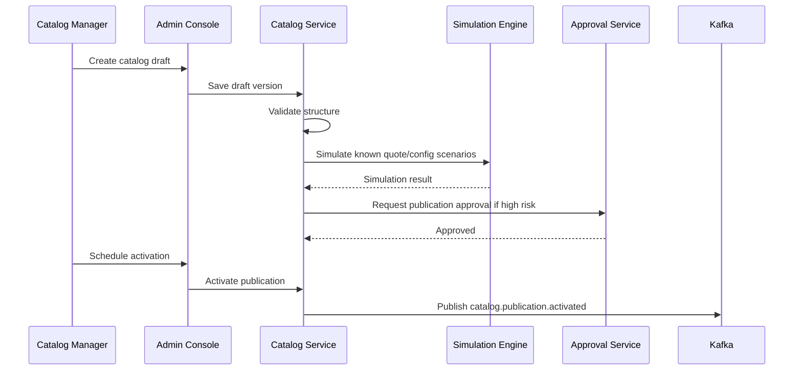
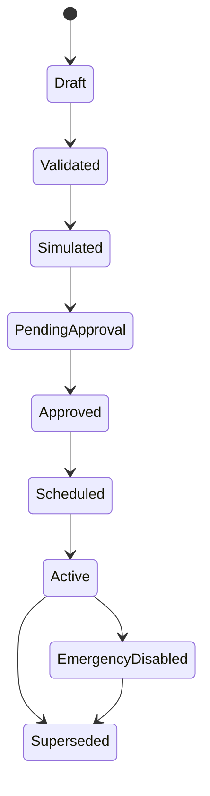
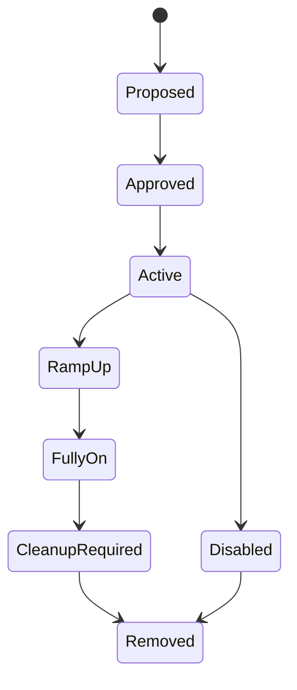
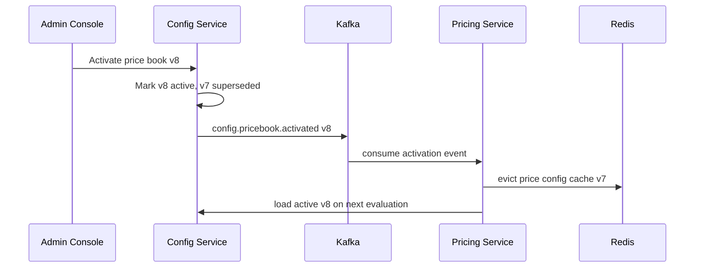
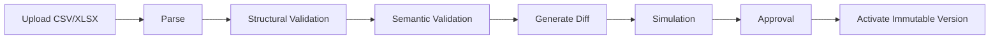
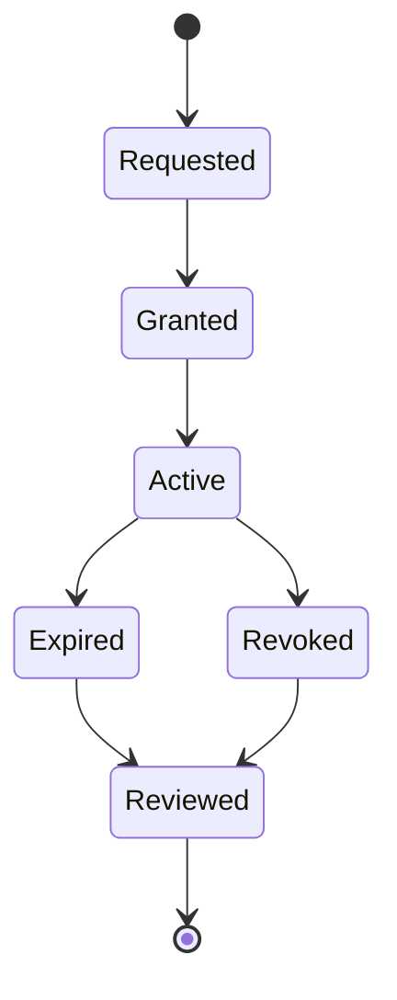
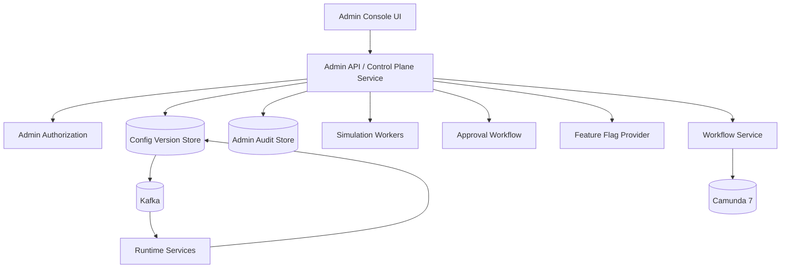

# Part 052 — Admin Console and Operational Control Plane

Every enterprise platform eventually grows a second product.

The first product is used by business users.

The second product is used by administrators, operators, support engineers, release managers, security teams, catalog managers, pricing managers, and workflow owners.

That second product is the control plane.

If you do not design it intentionally, it appears anyway as:

- SQL scripts
- manual Redis edits
- direct Kafka replays
- raw Camunda Cockpit operations
- undocumented feature flags
- shell scripts
- emergency database patches
- spreadsheet-driven configuration
- privileged API calls through Postman

That is not control.

That is institutionalized risk.

A production CPQ/OMS needs an admin console and operational control plane that can change the system safely, visibly, reversibly, and audibly.

---

## 1. Core Distinction: Data Plane vs Control Plane

The data plane handles business traffic.

The control plane changes how business traffic behaves.



Examples:

| Plane | Operation |
|---|---|
| Data plane | create quote |
| Data plane | price quote |
| Data plane | submit order |
| Data plane | complete approval task |
| Control plane | publish catalog version |
| Control plane | activate price book |
| Control plane | change approval policy |
| Control plane | suspend tenant |
| Control plane | retry workflow incident |
| Control plane | enable feature flag for 5% of tenant users |
| Control plane | migrate process instances |

The control plane is more dangerous because it changes the rules.

---

## 2. Why Admin Console Is Not Just CRUD

CRUD admin screens are easy.

Safe admin systems are hard.

An admin action can:

- change customer pricing
- expose products in a region
- bypass approval
- restart workflow side effects
- publish wrong documents
- enable untested features
- leak tenant data
- mutate process variables
- trigger fulfillment retries

Therefore admin action needs a lifecycle.



Not every configuration needs all states.

But high-impact configuration must never jump from edit to production silently.

---

## 3. Control Plane Capability Map

```text
control-plane/
  tenant-ops/
  user-and-role-admin/
  catalog-admin/
  pricing-admin/
  policy-admin/
  workflow-admin/
  feature-flag-admin/
  integration-admin/
  notification-template-admin/
  document-template-admin/
  operational-recovery/
  audit-and-change-history/
  release-governance/
```

Each capability should answer:

1. Who can change it?
2. What is the blast radius?
3. Is approval required?
4. Can it be simulated?
5. Can it be scheduled?
6. Can it be rolled back?
7. What audit evidence is produced?
8. Which running quotes/orders/processes are affected?
9. How is the change observed after activation?

If a control-plane feature cannot answer those questions, it is not production-ready.

---

## 4. Admin Roles

Avoid `ROLE_ADMIN` as a catch-all.

Use scoped roles.

| Role | Allowed Actions | Not Allowed |
|---|---|---|
| Tenant Admin | manage tenant users/config | edit global platform config |
| Catalog Manager | draft/catalog publication | change price books |
| Pricing Manager | price book/discount table draft | approve own high-risk changes without policy |
| Policy Manager | approval/entitlement policy draft | retry workflow jobs |
| Workflow Operator | inspect/retry incidents | change commercial policy |
| Workflow Admin | deploy/suspend process definitions | edit prices/catalog |
| Release Manager | promote validated releases | bypass validation |
| Support Operator | scoped read/recovery actions | unrestricted cross-tenant access |
| Security Admin | user/role/security policy | commercial override |
| Super Admin | emergency platform scope | must be highly restricted and audited |

Permissions should include:

```text
resource
operation
tenant_scope
segment_scope
environment_scope
approval_requirement
risk_level
```

Example:

```json
{
  "resource": "priceBook",
  "operation": "publish",
  "tenantScope": ["acme"],
  "segmentScope": ["APAC_ENTERPRISE"],
  "environmentScope": ["staging", "prod"],
  "approvalRequirement": "four_eyes",
  "riskLevel": "high"
}
```

---

## 5. Control Plane Safety Rails

A mature control plane has safety rails.

Not warnings.

Actual gates.

### 5.1 Validation Gate

Validate syntax and structure.

Examples:

- OpenAPI schema valid
- JSON Schema valid
- price book rows parse correctly
- DMN table compiles
- BPMN deployable
- template variables match schema
- feature flag targeting rule valid

### 5.2 Semantic Gate

Validate meaning.

Examples:

- price book has no overlapping effective ranges
- discount policy does not exceed approval limits
- catalog bundle has no impossible option combination
- workflow migration plan maps all active wait states
- tenant suspension does not block legally required recovery operations

### 5.3 Simulation Gate

Run scenarios before activation.

Examples:

```text
simulate price book on top 100 active quote patterns
simulate catalog publication against known invalid configurations
simulate approval policy against historical discount cases
simulate workflow migration against active process instance states
```

### 5.4 Approval Gate

Require approval for high-risk changes.

Approval must be independent.

No self-approval for high-impact changes.

### 5.5 Schedule Gate

Some changes should activate later.

Examples:

- price book effective at midnight region time
- catalog campaign starts next Monday
- tenant suspension at contract end
- workflow deployment after release window

### 5.6 Rollback/Fallback Gate

Before activation, define rollback.

Examples:

- revert feature flag
- reactivate previous price book
- mark new catalog publication superseded
- deploy previous process definition for new instances
- run compensating migration script

Not every change can be rolled back perfectly.

When rollback is impossible, require stronger simulation and approval.

---

## 6. Configuration Object Model

A control-plane change should be a first-class object.

```sql
CREATE TABLE config_change_request (
  tenant_id text,
  id uuid PRIMARY KEY,
  change_type text NOT NULL,
  target_resource_type text NOT NULL,
  target_resource_id text NOT NULL,
  status text NOT NULL,
  risk_level text NOT NULL,
  requested_by text NOT NULL,
  requested_at timestamptz NOT NULL,
  reason text NOT NULL,
  effective_at timestamptz,
  validation_result jsonb,
  simulation_result jsonb,
  approval_result jsonb,
  activation_result jsonb,
  rollback_plan jsonb,
  correlation_id text NOT NULL
);
```

This prevents invisible admin mutations.

### 6.1 Config Version Table

```sql
CREATE TABLE managed_config_version (
  tenant_id text,
  config_type text NOT NULL,
  config_key text NOT NULL,
  version int NOT NULL,
  status text NOT NULL,
  payload jsonb NOT NULL,
  payload_hash text NOT NULL,
  created_by text NOT NULL,
  created_at timestamptz NOT NULL,
  activated_at timestamptz,
  superseded_at timestamptz,
  PRIMARY KEY (tenant_id, config_type, config_key, version)
);
```

Rule:

> Runtime services consume active immutable config versions, not mutable admin drafts.

Admin changes create new versions.

They do not mutate active versions in place.

---

## 7. Catalog Admin

Catalog admin must manage:

- product specifications
- product offerings
- bundles
- option groups
- compatibility constraints
- eligibility rules
- catalog publications
- effective dates
- segment visibility
- retirement lifecycle

### 7.1 Catalog Publication Flow



### 7.2 Catalog Controls

```text
[ ] no duplicate offering code in same version
[ ] no invalid bundle graph cycle
[ ] no orphan option group
[ ] no retired offering visible in new publication
[ ] effective date does not overlap conflicting publication
[ ] visibility rules are tenant/segment scoped
[ ] top quote scenarios still configure successfully
[ ] pricing mappings exist for new offerings
[ ] order decomposition mapping exists where needed
```

A catalog publication that breaks pricing/order decomposition is not a valid publication.

---

## 8. Pricing Admin

Pricing admin is high risk.

A wrong price book can create direct financial damage.

Pricing admin must manage:

- price books
- price components
- discounts
- surcharge tables
- promotion rules
- rounding policies
- manual override thresholds
- margin thresholds
- price segment mapping
- effective dating

### 8.1 Price Book Activation

Price books should be immutable once active.

Change means new version.



### 8.2 Pricing Simulation

Before activation, run:

```text
sample active quotes
sample historical accepted quotes
sample edge-case bundles
sample maximum discount cases
sample zero/negative price traps
sample rounding-sensitive scenarios
sample tenant/segment coverage
```

Output:

```json
{
  "simulationId": "...",
  "candidatePriceBook": "APAC-ENT-2026-v8",
  "baselinePriceBook": "APAC-ENT-2026-v7",
  "casesRun": 4820,
  "casesChanged": 911,
  "maxIncreasePercent": 18.5,
  "maxDecreasePercent": 22.0,
  "negativePriceCases": 0,
  "missingPriceCases": 0,
  "approvalRequired": true
}
```

Do not activate price books blind.

---

## 9. Policy Admin

Policy admin manages rules that affect decisions.

Examples:

- approval requirement
- discount authority
- entitlement rules
- eligibility rules
- risk scoring
- manual override policy
- fallout routing

Policy changes should be testable against scenarios.

### 9.1 DMN/Rule Governance

For DMN or rule-table changes:

```text
[ ] decision compiles
[ ] hit policy matches expected semantics
[ ] no unintended rule shadowing
[ ] default rule exists where needed
[ ] historical decision sample comparison generated
[ ] approval required for high-risk change
[ ] decision version stored
[ ] decision result includes version and matched rule ids
```

A policy that cannot explain matched rule ids is weak.

---

## 10. Feature Flags

Feature flags are control-plane configuration.

They are not harmless booleans.

OpenFeature describes feature flags as runtime-controlled decisions that can alter application behavior without redeploying code and can be context-aware, using data such as user or request context. It also positions OpenFeature as a vendor-agnostic feature flagging API.

Reference: https://openfeature.dev/docs/reference/intro/

### 10.1 Feature Flag Classes

| Class | Example | Risk |
|---|---|---|
| Release flag | enable new quote UI | medium |
| Experiment flag | compare quote layout | low/medium |
| Ops flag | disable document generation temporarily | high |
| Permission flag | enable amendment feature for tenant | high |
| Data model flag | read new price component column | high |
| Workflow flag | use new fulfillment process | very high |

Do not manage all flags the same way.

### 10.2 Flag Evaluation Context

For CPQ/OMS:

```json
{
  "tenantId": "acme",
  "principalId": "alice",
  "roles": ["sales_rep"],
  "salesOrg": "APAC_ENT",
  "channel": "direct",
  "region": "ID",
  "environment": "prod",
  "service": "quote-service"
}
```

Flag targeting must respect tenant boundaries.

### 10.3 Flag Lifecycle



Long-lived flags become hidden architecture.

Every flag needs an owner and expiry review.

---

## 11. Workflow Operations

Workflow operations are not ordinary admin actions.

They can cause business side effects.

Camunda Admin provides user, group, tenant, authorization, system management, and auditing areas in its web applications. Camunda authorization service can restrict access to process instances, tasks, and other resources, but it has complexity/performance trade-offs and must be configured deliberately.

References:

- https://docs.camunda.org/manual/7.24/webapps/admin/
- https://docs.camunda.org/manual/7.24/user-guide/process-engine/authorization-service/

### 11.1 Workflow Operation Types

| Operation | Risk |
|---|---:|
| view process instance | low/medium depending on variables |
| retry failed job | medium/high |
| modify process instance | high |
| migrate process instance | high |
| suspend process definition | high |
| delete process instance | very high |
| update variables | very high |
| correlate message manually | very high |

Camunda authorization docs warn that variable update permissions can trigger process changes, such as successful evaluation of conditional events.

That means variable update is not just data edit.

It is potential process control.

### 11.2 Workflow Operation Facade

Do not expose arbitrary workflow operations through the admin console.

Expose safe commands:

```text
Retry failed fulfillment step
Mark external callback as received after evidence check
Escalate approval task
Reassign task to authorized group
Suspend order workflow due to tenant security hold
Resume workflow after hold release
Migrate eligible instances to approved process version
```

Each command maps to controlled Camunda API calls behind the Workflow Service.

### 11.3 Workflow Operation Evidence

Every operation records:

```text
tenant_id
process_instance_id
business_key
operator_id
operation_type
reason_code
before_state_summary
after_state_summary
variable_delta_summary
approval_id if required
correlation_id
occurred_at
```

Never allow invisible workflow surgery.

---

## 12. Tenant Operations

Tenant operations include:

- tenant onboarding
- tenant activation
- tenant suspension
- tenant config update
- tenant export
- tenant decommissioning
- tenant emergency lock

### 12.1 Tenant Onboarding Wizard

A useful admin console should guide:

```text
1. Create tenant master
2. Configure legal entities
3. Configure identity mapping
4. Configure admin roles
5. Assign catalog baseline
6. Assign price baseline
7. Assign approval baseline
8. Configure document and notification templates
9. Configure workflow tenant mapping
10. Run smoke scenario
11. Activate tenant
```

Do not let operators activate an incomplete tenant.

### 12.2 Tenant Emergency Lock

Emergency lock blocks dangerous operations quickly:

```text
quote.create = blocked
quote.accept = blocked
order.submit = blocked
workflow.start = blocked
admin.publish_config = blocked
read.audit = allowed
read.existing_quotes = policy-dependent
workflow.recovery = security-admin only
```

Emergency controls need their own audit and expiry.

A permanent emergency flag is a broken process.

---

## 13. Operational Recovery Console

Recovery console should not be raw database access.

It should expose business-safe recovery actions.

### 13.1 Recovery Action Catalog

| Failure | Safe Recovery Action |
|---|---|
| duplicate submit order request | return original order result |
| price document generation failed | regenerate artifact from immutable render input |
| inventory callback unknown | run reconciliation check |
| fulfillment step failed retryably | retry step with same idempotency key |
| approval task assigned wrong group | reassign using policy-validated group |
| projection stuck | replay projection from checkpoint |
| notification failed | resend same communication record |
| workflow incident | retry mapped external task or create fallout case |

Recovery action must be idempotent.

Recovery action must produce audit.

Recovery action must not require operator to know database internals.

### 13.2 Recovery Command Shape

```json
{
  "operation": "RETRY_FULFILLMENT_STEP",
  "tenantId": "acme",
  "orderId": "...",
  "fulfillmentStepId": "...",
  "reasonCode": "PROVIDER_TIMEOUT_CONFIRMED_SAFE_TO_RETRY",
  "evidence": {
    "incidentId": "...",
    "providerStatusCheck": "NO_ORDER_CREATED"
  }
}
```

Operator must provide evidence.

The system must validate if the action is legal in current state.

---

## 14. Release Governance Control Plane

Release governance bridges CI/CD and runtime admin.

It answers:

- which version is deployed?
- which config versions are active?
- which process definitions are active?
- which tenants have feature X enabled?
- which migrations have run?
- which read models are lagging?
- which flags are stale?
- which emergency controls are active?

### 14.1 Release Manifest

```json
{
  "releaseId": "2026.07.02-001",
  "services": {
    "quote-service": "1.18.0",
    "order-service": "1.14.0",
    "pricing-service": "1.11.0",
    "workflow-service": "1.9.0"
  },
  "openapiContracts": {
    "quote-api": "v1.18.0"
  },
  "eventSchemas": {
    "quote.accepted": "v3"
  },
  "dbMigrations": ["V2026070201__add_change_order_baseline.sql"],
  "processDefinitions": {
    "order_fulfillment": "v12",
    "quote_approval": "v8"
  },
  "featureFlags": {
    "change-order-v2": "enabled-for-beta-tenants"
  }
}
```

This manifest should be visible in the control plane.

---

## 15. Configuration Distribution

Runtime services need active config.

There are three patterns.

### 15.1 Pull From Config Service

Service reads config when needed.

Good:

- always fresh
- central control

Risk:

- latency
- config service dependency on hot path

### 15.2 Cache Locally With Version

Service loads active config and caches by version.

Good:

- fast
- resilient to config service outage

Risk:

- stale config if invalidation fails

### 15.3 Event-Driven Invalidation

Admin activates config.

Kafka event invalidates runtime cache.



Best default:

```text
immutable active config versions + local cache + event invalidation + TTL safety net
```

---

## 16. Admin API Design

Admin APIs should be command-shaped.

Not generic PATCH endpoints.

Bad:

```http
PATCH /admin/price-books/{id}
```

Better:

```http
POST /admin/price-books/{id}/validate
POST /admin/price-books/{id}/simulate
POST /admin/price-books/{id}/request-approval
POST /admin/price-books/{id}/schedule-activation
POST /admin/price-books/{id}/activate-emergency-disable
```

Commands expose intent.

Intent can be authorized, audited, validated, approved, and tested.

### 16.1 Admin Error Model

Admin errors need operational detail.

Example:

```json
{
  "type": "https://errors.example.com/config/semantic-validation-failed",
  "title": "Price book semantic validation failed",
  "status": 409,
  "detail": "Candidate price book has 12 missing price components and 2 negative price outcomes.",
  "code": "PRICE_BOOK_SEMANTIC_VALIDATION_FAILED",
  "correlationId": "...",
  "validationReportId": "..."
}
```

Do not return generic `400 Bad Request` for high-value admin actions.

---

## 17. Admin UI Design Principles

A control-plane UI should optimize for safe decisions.

### 17.1 Show Blast Radius

Before activation:

```text
This change affects:
- 1 tenant
- 3 sales orgs
- 2 regions
- 418 active draft quotes
- 76 pending approvals
- 0 submitted orders
- 12 workflow definitions using this policy
```

### 17.2 Show Diff

Admin must see what changed.

```diff
- maxDiscountWithoutApproval: 10%
+ maxDiscountWithoutApproval: 15%

- appliesTo: [APAC_ENTERPRISE]
+ appliesTo: [APAC_ENTERPRISE, APAC_PUBLIC_SECTOR]
```

### 17.3 Show Simulation Result

Before activation:

```text
Historical scenario replay:
- 4,820 cases run
- 911 cases changed
- 0 missing price cases
- 0 negative price cases
- 54 quotes now require additional approval
```

### 17.4 Require Reason Code

Every high-risk admin action needs a reason.

Free text alone is weak.

Use reason code + optional explanation.

### 17.5 Prefer Safe Defaults

Buttons should not default to destructive action.

Example:

- `Dry run migration` before `Run migration`
- `Disable for new quotes only` before `Disable globally`
- `Retry selected step` before `Retry all incidents`

---

## 18. Audit Model for Admin Actions

Admin audit is separate from business audit but linked.

Business audit answers:

> What happened to this quote/order?

Admin audit answers:

> Who changed the rules that affected this quote/order?

### 18.1 Admin Audit Fields

```text
tenant_id nullable for global actions
admin_action_id
actor_id
actor_roles_snapshot
action_type
resource_type
resource_id
resource_version_before
resource_version_after
change_diff
risk_level
reason_code
approval_id
simulation_report_id
effective_at
correlation_id
ip_address/user_agent if applicable
occurred_at
```

### 18.2 Link Admin Change to Business Decision

When a quote is priced, store:

```text
price_book_version
pricing_config_change_id
policy_version
policy_config_change_id
catalog_publication_id
catalog_change_id
```

Then later you can answer:

> Which admin change caused this quote to require approval?

This is enterprise-grade defensibility.

---

## 19. Environment Management

Admin changes should move across environments.

```text
local -> dev -> test -> staging -> prod
```

But not all control-plane data should be promoted the same way.

| Object | Promotion Model |
|---|---|
| BPMN/DMN definition | source-controlled + CI/CD deployed |
| catalog template | source-controlled or admin-authored depending maturity |
| price book | controlled import/admin approval |
| tenant user mapping | environment-specific |
| feature flag | environment-specific with optional template |
| notification template | versioned and promoted |
| document template | versioned and promoted |
| recovery action | code-defined, not admin-authored |

Do not blindly copy production tenant/user data to lower environments.

Use synthetic or masked datasets.

---

## 20. Import/Export Controls

Enterprise admins love spreadsheets.

Do not fight reality.

Control it.

### 20.1 Safe Import Pipeline



### 20.2 Import Rules

```text
[ ] file schema version required
[ ] tenant/segment scope required
[ ] row-level validation result produced
[ ] semantic validation result produced
[ ] diff against active version produced
[ ] activation creates immutable version
[ ] raw uploaded file stored as evidence
[ ] operator and approval recorded
```

A spreadsheet upload directly mutating active prices is a production incident waiting to happen.

---

## 21. Control Plane and Camunda Built-In Apps

Camunda Admin, Cockpit, and Tasklist are useful.

But they are not your CPQ/OMS control plane.

Use them carefully:

| Tool | Good For | Risk |
|---|---|---|
| Camunda Admin | engine users/groups/tenants/authorization/system areas | not domain-specific |
| Camunda Cockpit | process inspection/incidents | raw operations can bypass domain rules |
| Camunda Tasklist | generic task handling | may not match CPQ task UX/security |
| Custom Admin Console | domain-specific safe operations | requires deliberate design |

The recommended model:

```text
CPQ/OMS Admin Console -> Workflow Service -> controlled Camunda API usage
```

Not:

```text
Business operators -> raw Camunda Admin/Cockpit APIs -> process mutation
```

---

## 22. Emergency Controls

Emergencies happen.

Build explicit controls.

Examples:

```text
pause order submission for tenant
pause fulfillment process starts
disable document delivery channel
disable partner inventory adapter
force approval for all discounts above 0%
block quote acceptance for expired price books
freeze catalog publication
```

### 22.1 Emergency Control Object

```sql
CREATE TABLE emergency_control (
  id uuid PRIMARY KEY,
  tenant_id text,
  control_type text NOT NULL,
  target_scope jsonb NOT NULL,
  status text NOT NULL,
  enabled_by text NOT NULL,
  enabled_at timestamptz NOT NULL,
  expires_at timestamptz,
  reason_code text NOT NULL,
  approval_id uuid,
  disabled_by text,
  disabled_at timestamptz
);
```

Emergency controls should expire or require periodic review.

No permanent emergency switches.

---

## 23. Control Plane Observability

Track control-plane metrics.

```text
config_change_requested_total{type,risk,tenant}
config_change_approved_total{type,risk,tenant}
config_change_rejected_total{type,risk,tenant}
config_activation_failed_total{type,reason}
feature_flag_stale_total{owner}
admin_action_denied_total{operation,reason}
workflow_recovery_action_total{operation,result}
emergency_control_active_total{type,tenant}
tenant_onboarding_duration_seconds{tenantTier}
```

Dashboards should show:

- active emergency controls
- config changes waiting approval
- config changes scheduled for production
- recent high-risk admin actions
- failed admin activations
- stale feature flags
- workflow operations performed by operators
- tenant onboarding failures

A control plane without observability is just another hidden system.

---

## 24. Security Model

Control-plane security must be stricter than data-plane security.

Required controls:

```text
[ ] separate admin roles from business roles
[ ] MFA for high-risk roles
[ ] scoped permissions by tenant/environment/resource
[ ] no shared admin accounts
[ ] approval for high-risk changes
[ ] reason code required
[ ] full audit
[ ] session timeout stricter than user app
[ ] IP/network restrictions where appropriate
[ ] break-glass role with expiry and post-review
[ ] field-level redaction for sensitive data
```

### 24.1 Break-Glass Access

Break-glass access must be exceptional.

Lifecycle:



Audit must include:

```text
who requested
who approved
why
scope
start/end time
actions taken
post-incident review link
```

---

## 25. Control Plane Testing

Admin features need tests as much as user features.

### 25.1 Validation Tests

```text
invalid price book cannot be activated
catalog with bundle cycle is rejected
DMN with missing default rule fails semantic validation
feature flag with invalid segment is rejected
```

### 25.2 Authorization Tests

```text
catalog manager cannot publish price book
pricing manager cannot retry workflow job
tenant admin cannot edit another tenant
operator cannot update process variables directly
```

### 25.3 Simulation Tests

```text
candidate price book simulation detects missing price
candidate approval policy simulation detects changed approval count
catalog publication simulation detects unpriceable offering
```

### 25.4 Audit Tests

```text
high-risk admin action creates admin audit
business quote stores config version evidence
emergency control stores reason and expiry
```

### 25.5 Failure Tests

```text
activation event published but consumer fails -> runtime eventually reloads via TTL/pull
config service unavailable -> data plane uses last known active version
failed activation does not partially mutate active config
```

---

## 26. Anti-Patterns

### Anti-Pattern 1: Admin Console as Direct Table Editor

Direct table editing bypasses domain invariants.

### Anti-Pattern 2: Active Config Is Mutable

Mutable active config destroys reproducibility.

### Anti-Pattern 3: SQL Scripts as Normal Operations

SQL scripts should be last resort with change record, review, backup, and audit.

### Anti-Pattern 4: Raw Camunda Operations for Business Recovery

Operators should use domain-safe recovery commands.

### Anti-Pattern 5: Feature Flags Without Owner/Expiry

Permanent flags become a shadow architecture.

### Anti-Pattern 6: No Blast Radius Preview

Admins should know what their change affects before activation.

### Anti-Pattern 7: No Simulation

High-impact commercial config without simulation is gambling.

### Anti-Pattern 8: Super Admin for Everyone

Convenient until audit or incident review.

### Anti-Pattern 9: Environment Drift Hidden From Release Notes

Runtime config is part of release truth.

### Anti-Pattern 10: Admin Audit Not Linked to Business Decisions

You cannot defend why a quote behaved a certain way if you cannot link decision to config version.

---

## 27. Minimal Implementation Plan

### Step 1 — Admin Identity and Scope

Implement scoped admin permissions:

```text
admin_principal
admin_role
admin_scope
admin_permission
```

### Step 2 — Config Versioning

All managed config becomes versioned and immutable once active.

### Step 3 — Change Request Lifecycle

Implement:

```text
Draft -> Validate -> Simulate -> Approve -> Schedule -> Activate
```

### Step 4 — Catalog/Pricing/Policy Admin APIs

Make command-shaped APIs.

No generic direct table patches.

### Step 5 — Workflow Operation Facade

Expose safe workflow operations through Workflow Service.

Hide raw Camunda APIs from business operators.

### Step 6 — Feature Flag Registry

Every flag has:

```text
owner
purpose
risk class
target scope
created at
expiry/review date
cleanup issue
```

### Step 7 — Admin Audit

Record every high-risk admin action and link config versions to business decisions.

### Step 8 — Control Plane Dashboard

Surface:

- active config versions
- pending approvals
- scheduled activations
- active emergency controls
- stale flags
- recent workflow recovery actions
- tenant onboarding state

---

## 28. Reference Control Plane Architecture



Control-plane changes are not hidden side effects.

They become versioned facts.

---

## 29. Production Checklist

```text
[ ] admin roles are scoped by tenant/environment/resource
[ ] no generic super-admin dependency for normal operations
[ ] managed config is immutable after activation
[ ] high-risk changes require validation, simulation, approval, and audit
[ ] active config versions are visible in release/control dashboard
[ ] feature flags have owner, risk class, and expiry/review date
[ ] raw Camunda APIs are not exposed to business operators
[ ] workflow recovery actions are domain-safe commands
[ ] admin actions require reason codes
[ ] blast radius preview is shown before activation
[ ] import pipeline validates, diffs, simulates, and stores raw evidence
[ ] emergency controls have expiry/review
[ ] tenant onboarding has activation checklist
[ ] business decisions store config version evidence
[ ] admin audit is queryable and linked to business audit
[ ] control-plane metrics and dashboards exist
```

---

## Closing

The admin console is not an afterthought.

In enterprise CPQ/OMS, it is the place where the rules of the business are changed.

That makes it one of the most powerful systems in the platform.

The right model is:

> Admin actions create versioned, validated, simulated, approved, audited control-plane facts that runtime services consume safely.

Not:

> Admin users directly mutate production behavior through ad hoc screens and scripts.

A top engineer designs the control plane with the same seriousness as the customer-facing system.

Because many production incidents are not caused by users using the system incorrectly.

They are caused by administrators changing the system incorrectly.
