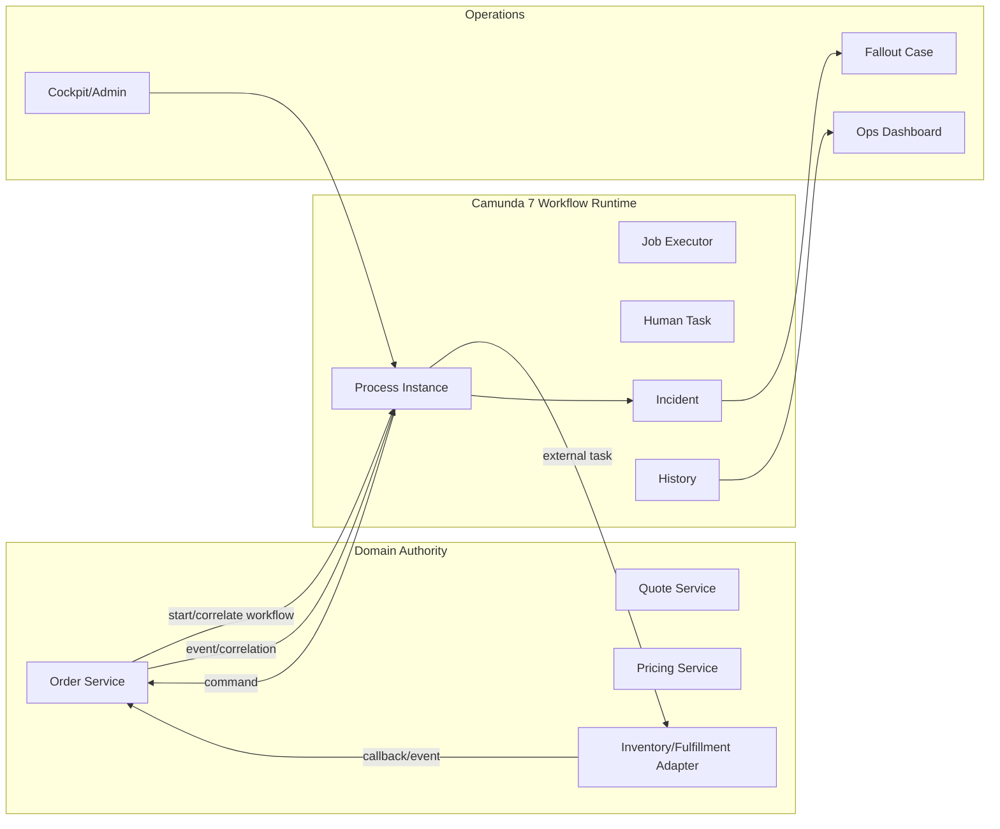
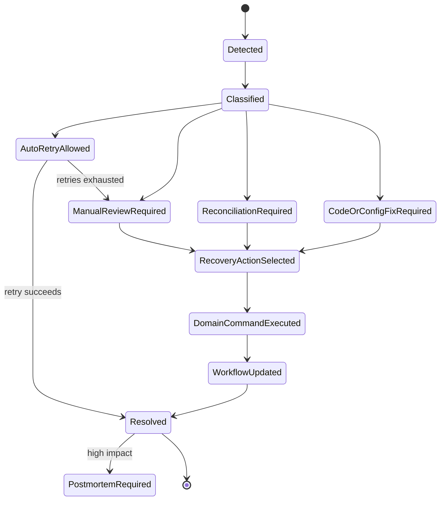
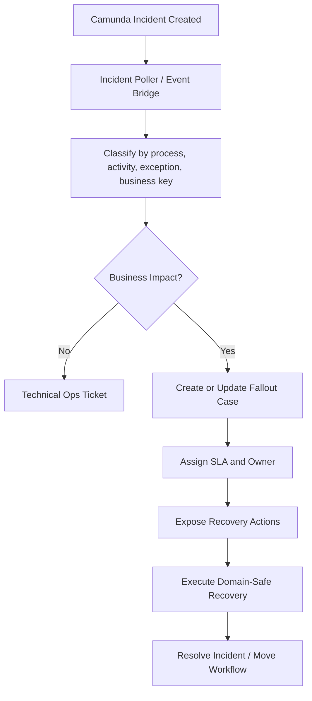
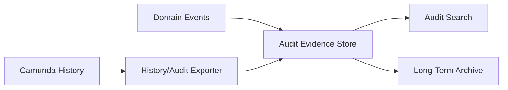
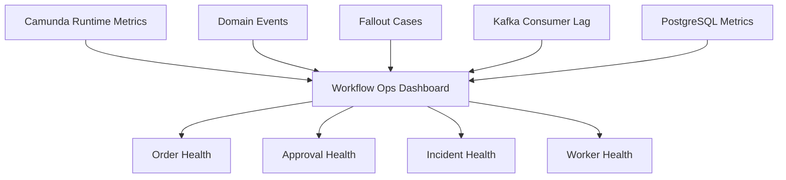

# Part 053 — Camunda 7 Operations and Incident Playbook

> A workflow engine is not production-ready because the BPMN diagram is valid.  
> It is production-ready when failed jobs, stuck process instances, duplicate callbacks, broken variables, bad deployments, and human recovery paths are controlled, observable, auditable, and reversible.

This part is about operating Camunda 7 as a production workflow runtime inside the CPQ/OMS platform we have been building.

We are not repeating BPMN basics. We are building the operational muscle that separates a toy workflow from an enterprise-grade order orchestration system.

The core question is simple:

> When an order process fails at 02:00, can the platform tell an operator exactly what failed, why it failed, what can be retried safely, what must be investigated, and what action leaves an audit trail?

If the answer is no, Camunda is only moving complexity from code into diagrams.

---

## 1. What Camunda 7 Owns in This Architecture

In this CPQ/OMS platform, Camunda 7 owns **process orchestration**, not domain truth.

That means:

- Quote Service owns quote state.
- Pricing Service owns pricing evidence.
- Order Service owns order state.
- Inventory/Fulfillment integrations own external fulfillment facts.
- Camunda owns orchestration progress, wait states, retries, user tasks, process variables, incidents, and process history.

Camunda can decide **what step is next**, but the domain service decides **whether the business transition is valid**.

Bad production systems invert this. They hide business state inside process variables and then try to reconstruct order truth from workflow tables. That path leads to brittle migration, impossible reporting, and unsafe manual fixes.

### 1.1 Correct Responsibility Split



### 1.2 The Golden Rule

Do not let Camunda process variables become the hidden database of the business.

Camunda variables should contain:

- identifiers,
- correlation keys,
- compact routing facts,
- process-local flags,
- retry metadata,
- decision result references,
- small immutable snapshots required by the process.

They should not contain:

- complete quote JSON,
- complete order JSON,
- mutable pricing breakdown,
- large documents,
- external system payloads,
- secret data,
- authority-critical state that bypasses domain services.

A process variable is operational state. A domain aggregate is business truth.

---

## 2. Operational Mental Model

Camunda 7 operations revolve around five runtime surfaces:

1. **Process instance** — one execution of a BPMN process.
2. **Job** — async work scheduled by the engine.
3. **External task** — pull-based work executed by external workers.
4. **Incident** — unresolved failed execution requiring attention.
5. **History** — persisted runtime/historic evidence for analysis and operations.

In CPQ/OMS, these surfaces map to business flows:

| Camunda Runtime Surface | CPQ/OMS Meaning | Production Question |
|---|---|---|
| Process instance | Quote approval or order orchestration instance | Which quote/order is this about? |
| Business key | Business correlation identifier | Can an operator search by quote/order ID? |
| Job | Async continuation, timer, retryable work | Is failure technical or business? |
| External task | Work delegated to worker/integration adapter | Can it be retried safely? |
| User task | Human approval/fallout/review work | Who can act and what is stale? |
| Incident | Engine-visible unresolved failure | Should this become a fallout case? |
| History | Evidence of what happened | Can we reconstruct the timeline? |

The platform must never require an operator to inspect raw engine tables to understand a customer-impacting failure.

---

## 3. Business Key Discipline

Every process instance must have a meaningful business key.

For this platform:

```text
quote approval process business key = quote:{quoteId}:rev:{revisionNo}
order orchestration process business key = order:{orderId}
change order process business key = change-order:{changeOrderId}
fallout process business key = fallout:{falloutCaseId}
```

Why this matters:

- Cockpit search becomes useful.
- logs can include business key.
- metrics can tag business flow.
- domain services can correlate workflow safely.
- support teams can speak in business language.

### 3.1 Anti-Pattern: UUID-Only Business Key

This is operationally weak:

```text
businessKey = 9c2e8af6-1b0b-4e95-978f-5d637c3ef8d7
```

The process engine can correlate it, but humans cannot reason about it. Use UUIDs internally if needed, but expose a business key shape that carries meaning.

### 3.2 Business Key Is Not Authorization

A business key is not a security boundary.

Never assume that because a user knows `order:123`, they can view or operate it. Authorization must still be checked in the domain/control-plane API.

---

## 4. Process Definition Deployment Strategy

Camunda process definitions are versioned. A new deployment creates a new version of the process definition. Existing running process instances normally continue with the version they started with, while new instances use the newest version unless started explicitly with another version.

This is a strength if planned. It is a production hazard if ignored.

### 4.1 Deployment Units

Recommended structure:

```text
workflow-definitions/
  quote-approval/
    quote-approval.bpmn
    discount-policy.dmn
    approval-routing.dmn
    README.md
    scenarios/
  order-orchestration/
    order-orchestration.bpmn
    fulfillment-routing.dmn
    README.md
    scenarios/
```

A workflow deployment should include:

- BPMN files,
- related DMN files,
- version notes,
- migration notes,
- compatibility notes,
- expected variables,
- expected external task topics,
- expected domain commands/events,
- rollback/roll-forward guidance.

### 4.2 Version Compatibility Checklist

Before deploying a new process definition:

| Check | Question |
|---|---|
| Variable compatibility | Can old and new process versions handle existing variable contracts? |
| Worker compatibility | Are external task topics still supported by workers? |
| Domain API compatibility | Are called APIs backward-compatible? |
| DMN compatibility | Are decision output shapes compatible? |
| Incident behavior | Are new failure paths observable? |
| Migration need | Do running instances need migration or can they drain? |
| Monitoring | Do dashboards distinguish process definition versions? |

### 4.3 Drain vs Migrate

Do not migrate process instances just because a new BPMN version exists.

Use this rule:

| Situation | Preferred Action |
|---|---|
| Old version is safe and short-lived | Let instances drain. |
| Old version has non-critical improvement missing | Let instances drain. |
| Old version has business logic defect | Consider migration or controlled compensation. |
| Old version calls removed API | Migrate or keep compatibility adapter. |
| Old version has stuck wait state | Repair, migrate, or terminate with domain-safe recovery. |

Migration is an operational intervention, not a normal deployment step.

---

## 5. Job Executor Operations

The Camunda job executor is the engine component that executes async continuations, timers, and other background jobs.

For CPQ/OMS, job executor behavior affects:

- quote approval reminders,
- approval SLA timers,
- order orchestration async continuations,
- retry timing,
- process throughput,
- incident generation,
- database load.

### 5.1 Async Boundary Design

A BPMN async boundary is not a decoration. It defines a transaction boundary and retry boundary.

Use async before/after when:

- the next step calls an external system,
- a service task may fail transiently,
- a long-running continuation should not roll back previous progress,
- a retry should happen independently,
- an operator may need to inspect failure at that point.

Avoid async boundaries when:

- the task is pure in-memory routing,
- the step is not meaningful operationally,
- adding a wait state would create unnecessary job volume,
- failure cannot be handled independently.

### 5.2 Job Executor Sizing Model

Do not tune the job executor by guessing.

Model it like this:

```text
required throughput = business operations per second × workflow jobs per operation
worker capacity = active job threads × average jobs completed per second per thread
safety margin = 30% to 50% depending on traffic variability
```

Example:

```text
200 submitted orders/minute
7 internal Camunda jobs per order
= 1400 jobs/minute
= about 23.3 jobs/second
```

If each job performs a quick domain command and averages 100 ms, one worker thread can theoretically handle 10 jobs/s. But production threads are not theoretical. DB locks, API calls, retries, serialization, and GC reduce capacity. You design for measured capacity, not ideal capacity.

### 5.3 Job Executor Failure Modes

| Failure Mode | Symptom | Likely Cause | First Response |
|---|---|---|---|
| Job backlog grows | Delayed timers, slow orchestration | Too few workers, slow tasks, DB contention | Check job acquisition, DB load, task duration |
| Many failed jobs | Incidents rising | Bad deployment, external outage, contract mismatch | Classify by exception and activity ID |
| Duplicate side effect | External system called twice | Non-idempotent delegate or retry | Stop retry, inspect domain idempotency |
| Lock timeout | Job retried while previous work may still run | Long task, timeout mismatch | Treat as unknown outcome |
| Database pressure | Engine tables hot | High job volume/history, poor indexing, noisy polling | Reduce job churn, tune DB, separate runtime/load |

---

## 6. External Task Worker Operations

External tasks are a good fit for microservices because workers pull work from Camunda and complete/fail/BPMN-error tasks explicitly.

In CPQ/OMS, external tasks are useful for:

- fulfillment adapter calls,
- inventory reservation,
- billing handoff,
- document generation,
- notification dispatch,
- slow integration boundaries.

### 6.1 Worker Contract

Every external task topic must have a published worker contract:

```yaml
topic: reserve-inventory
owner: fulfillment-adapter-service
inputVariables:
  - orderId
  - orderLineIds
  - reservationRequestId
outputVariables:
  - reservationOutcomeRef
failureSemantics:
  technicalFailure: retry via Camunda failure
  businessFailure: BPMN error INVENTORY_REJECTED
  unknownOutcome: create reconciliation case
idempotencyKey: orderId + reservationRequestId
maxLockDuration: 2 minutes
retryPolicy: R5/PT30S
```

If a topic has no contract, production support will reverse-engineer it during an outage. That is not operations. That is archaeology.

### 6.2 Complete vs Failure vs BPMN Error

Use the right completion path:

| Worker Outcome | Camunda Action | Meaning |
|---|---|---|
| Work succeeded | `complete` | Process may continue. |
| Technical transient failure | `handleFailure` | Retry may be safe. |
| Business rejection | `handleBpmnError` | BPMN should route business path. |
| Unknown outcome | Usually failure + reconciliation/fallout | Do not blindly retry side effects. |

### 6.3 External Task Lock Expiration

Lock expiration creates one of the most dangerous production states: the worker may still be doing work, but Camunda may make the task available again.

For side-effecting tasks:

- use idempotency keys,
- use external request IDs,
- persist outbound request records,
- handle duplicate complete attempts,
- treat timeouts as unknown until reconciled,
- monitor lock expiration separately from normal failure.

---

## 7. Incident Taxonomy

Do not treat all Camunda incidents the same. The engine sees an execution failure. Operations must classify it into a business-relevant category.

Recommended taxonomy:

| Incident Type | Meaning | Example | Default Handling |
|---|---|---|---|
| Technical transient | Dependency or infra temporary issue | inventory timeout | retry with backoff |
| Technical persistent | Bug/config/schema issue | missing variable, class not found | stop retry, fix deployment/config |
| Business modeled | Expected business exception | credit check rejected | BPMN error path, no incident |
| Business unmodeled | Business condition missing BPMN path | unavailable product state | create fallout case |
| Data corruption | State violates invariant | order line missing required snapshot | block, investigate, manual correction |
| Unknown outcome | External side effect may or may not have happened | timeout after reserve request | reconcile before retry |
| Operational unsafe | Retry may duplicate money/inventory/contract side effect | duplicate billing handoff | freeze, require senior approval |

### 7.1 Incident Lifecycle



The important point: incident handling should not be a raw Cockpit action first. It should become a controlled recovery workflow when business state is involved.

---

## 8. When to Retry

A retry is safe only when the operation is idempotent or has no side effect.

### 8.1 Retry Decision Matrix

| Failed Step | Safe to Auto-Retry? | Why |
|---|---:|---|
| Read product catalog | Yes | Read-only, cacheable. |
| Recalculate price preview | Usually yes | Pure computation if inputs stable. |
| Send email | Only with idempotency/dedup | Can duplicate customer message. |
| Reserve inventory | Only with external request ID | Can double reserve. |
| Create billing account | Usually no without reconciliation | Can create duplicate account. |
| Submit order to downstream OMS | No unless downstream idempotency exists | Can duplicate order. |
| Generate document | Usually yes with artifact idempotency | Same input should yield same artifact reference. |
| Complete human approval | No blind retry | Human action semantics must be preserved. |

### 8.2 Retry Budget

Retries should have a budget:

```text
max attempts × delay pattern × side-effect risk × operator visibility
```

Example:

```text
inventory availability read:
  attempts: 5
  delay: 5s, 15s, 30s, 60s, 120s
  auto-fallout-after: exhausted

billing handoff:
  attempts: 1 automatic
  then: reconciliation case
```

A retry policy is not only technical. It encodes risk appetite.

---

## 9. From Camunda Incident to Fallout Case

Camunda incidents are technical workflow incidents. CPQ/OMS needs business fallout cases.

Recommended translation:



### 9.1 Fallout Case Payload

```json
{
  "falloutCaseId": "FO-2026-000912",
  "source": "CAMUNDA_INCIDENT",
  "businessKey": "order:ORD-100928",
  "processDefinitionKey": "order-orchestration",
  "activityId": "reserveInventoryTask",
  "incidentType": "UNKNOWN_OUTCOME",
  "severity": "HIGH",
  "domainEntityType": "ORDER",
  "domainEntityId": "ORD-100928",
  "safeActions": [
    "CHECK_RESERVATION_STATUS",
    "MARK_RESERVATION_CONFIRMED",
    "MARK_RESERVATION_FAILED",
    "ESCALATE_TO_FULFILLMENT"
  ]
}
```

Do not expose arbitrary “set process variable” or “move token” operations to business users. Wrap them in domain-safe recovery commands.

---

## 10. Manual Recovery Rules

Manual recovery is necessary in enterprise OMS. It is also dangerous.

The rule:

> Operators should choose business recovery actions, not manipulate engine internals directly.

### 10.1 Good Recovery Actions

```text
Retry reservation after reconciliation
Mark external order accepted with reference
Cancel downstream fulfillment request
Escalate to fulfillment operations
Recreate notification artifact
Re-drive billing handoff with same idempotency key
```

### 10.2 Bad Recovery Actions

```text
Set variable "reserved" = true
Move token to next task because it seems stuck
Delete incident without domain confirmation
Terminate process instance without order cancellation
Update ACT_RU_* tables directly
Retry all failed jobs globally
```

### 10.3 Recovery Command Pattern

A recovery action should be implemented as a domain command:

```text
POST /orders/{orderId}/recovery-actions/confirm-inventory-reservation
```

The command should:

1. authorize the operator,
2. validate order state,
3. validate fallout case state,
4. validate external evidence,
5. append audit evidence,
6. update domain state,
7. publish outbox event,
8. correlate or signal Camunda safely.

---

## 11. History Retention and Cleanup

Camunda history is useful but can become expensive.

In CPQ/OMS, history is used for:

- approval trace,
- process diagnostics,
- incident investigation,
- SLA measurement,
- audit support,
- operational reporting.

But not all history must live forever in Camunda tables.

### 11.1 Retention Classes

| Process Type | Retention Need | Strategy |
|---|---|---|
| Quote approval | Medium/high | Keep enough for audit window; export key evidence to audit store. |
| Order orchestration | High | Keep operational history; export critical timeline. |
| Notification workflow | Medium | Keep summary, archive detail. |
| Batch cleanup process | Low | Short retention. |
| Fallout process | High | Keep or archive with case record. |

### 11.2 Evidence Export Pattern

Do not depend only on Camunda history tables for regulatory evidence.

Use an audit/evidence store for business-critical history:



Camunda history is operational history. The audit evidence store is business evidence.

### 11.3 Cleanup Safety

Before history cleanup:

- confirm retention requirements,
- confirm audit export completeness,
- test on staging-sized data,
- monitor query performance before/after,
- exclude active diagnostics window,
- avoid cleanup job competing with peak order traffic,
- document what data will no longer be available in Cockpit.

---

## 12. Camunda Database Hygiene

Camunda 7 uses relational database tables for runtime and history. That means workflow performance is also database performance.

### 12.1 Common Table Pressure Areas

| Area | Why It Grows |
|---|---|
| Runtime execution tables | active process instances, wait states |
| Runtime job tables | timers, async continuations, retries |
| Variable tables | too many/large variables |
| History process/activity tables | high process volume |
| History variable/detail tables | verbose variable updates |
| Incident tables | unresolved failures |

### 12.2 Variable Hygiene

Bad variable design is one of the fastest ways to degrade Camunda operations.

Avoid:

- large serialized Java objects,
- huge JSON blobs,
- frequently updated large variables,
- sensitive data,
- versionless complex payloads,
- variables duplicated from domain aggregates.

Prefer:

- IDs,
- compact enums,
- immutable references,
- small routing facts,
- external document/artifact references,
- explicit versioned variable contracts.

### 12.3 Query Hygiene

Operational dashboards should not repeatedly execute heavy ad-hoc Camunda queries against production runtime tables.

Use projection/read model tables for:

- order workflow status,
- approval task queue,
- fallout case dashboard,
- SLA breach list,
- process KPI dashboard.

Let Camunda be the engine. Do not turn it into your BI database.

---

## 13. Monitoring Model

A production Camunda installation needs both technical and business monitoring.

### 13.1 Technical Metrics

Track:

- active process instances by definition/version,
- job backlog,
- failed jobs,
- incident count by activity,
- external task lock expirations,
- job acquisition latency,
- history cleanup duration,
- DB connection pool usage,
- slow engine queries,
- worker success/failure rate,
- worker latency by topic.

### 13.2 Business Metrics

Track:

- quote approval cycle time,
- quote approval SLA breaches,
- order orchestration duration,
- fulfillment fallout rate,
- cancellation compensation success rate,
- manual recovery count,
- stuck orders by stage,
- rework loop count,
- retry-to-success ratio,
- unknown outcome count.

### 13.3 Dashboard Shape



A good dashboard answers:

- Which business flows are unhealthy?
- Which technical component is the likely cause?
- Which incidents need manual action?
- Which actions are safe?
- Which customers/orders are affected?

---

## 14. Alerting Strategy

Bad alerting wakes people up for noise. Good alerting points to customer or business impact.

### 14.1 Alert Classes

| Alert | Trigger | Severity |
|---|---|---|
| Order orchestration backlog | Active orders stuck beyond stage budget | High |
| Incident spike | Incident rate above baseline | High |
| External task lock expiration spike | Workers timing out | High |
| Approval SLA breach | Business deadline exceeded | Medium/high |
| History cleanup failure | Cleanup repeatedly fails | Medium |
| Process deployment mismatch | New process version active without compatible worker | High |
| Failed job repeated at same activity | Likely code/config defect | High |

### 14.2 Alert Payload

An alert should include:

```text
business impact: orders affected / quote approvals delayed
process key/version
activity id
incident category
example business keys
first detected time
recent deployment correlation
safe first action
runbook link
```

Never send an alert that only says “Camunda incidents > 100”. That is a symptom without operational context.

---

## 15. Runbooks

A runbook is not a wiki page full of vague advice. It is a deterministic procedure for a known failure class.

### 15.1 Runbook Template

```md
# Runbook: Inventory Reservation Unknown Outcome

## Symptoms
- Camunda incident at activity reserveInventoryTask
- External task failure reason contains timeout after outbound request
- Order status is RESERVATION_PENDING

## Impact
- Order cannot progress to fulfillment
- Duplicate reservation possible if retried blindly

## Do Not
- Do not retry job before reconciliation
- Do not set process variable manually
- Do not cancel order unless customer/ops confirms

## Diagnosis
1. Open fallout case by orderId.
2. Check outbound request record by reservationRequestId.
3. Query fulfillment adapter status endpoint.
4. Compare external reservation state with order state.

## Safe Recovery
- If external reservation exists: run ConfirmReservationRecoveryCommand.
- If external reservation does not exist: run MarkReservationFailedAndRetryCommand.
- If external state unknown: escalate to fulfillment ops.

## Verification
- Order state changed from RESERVATION_PENDING.
- Camunda process moved past reserveInventoryTask or routed to fallout.
- Audit event recorded.
- Customer-facing status updated.
```

### 15.2 Required Runbooks

For CPQ/OMS, minimum runbooks:

1. quote approval task stuck,
2. approval SLA timer not firing,
3. quote approved but stale price detected,
4. order process not started after quote acceptance,
5. duplicate order submit attempt,
6. inventory reservation timeout,
7. billing handoff timeout,
8. document generation failure,
9. notification duplicate risk,
10. Camunda incident spike after deployment,
11. external task worker down,
12. process migration failure,
13. history cleanup failure,
14. engine database contention,
15. fallout case cannot be resolved.

---

## 16. Cockpit/Admin Usage Policy

Camunda Cockpit/Admin are powerful. In enterprise CPQ/OMS, raw operational tools must be governed.

### 16.1 Who Can Use What

| Capability | Allowed Role | Notes |
|---|---|---|
| View process instance | Support/ops | Subject to tenant/business authorization. |
| View variables | Restricted ops | Sensitive variables must be avoided/masked. |
| Retry failed job | Technical ops | Only when runbook says retry is safe. |
| Modify variables | Senior technical ops only | Prefer domain recovery command. |
| Migrate process instance | Workflow platform owner | Requires migration plan. |
| Delete/terminate instance | Highly restricted | Must align with domain cancellation/closure. |
| Deploy process definition | Release pipeline only | No manual production deployment. |

### 16.2 Never Do This in Production

- update Camunda engine tables directly,
- delete incidents without root cause classification,
- retry all failed jobs globally,
- modify business variables without audit,
- terminate order process while order is still active,
- deploy BPMN manually outside release governance,
- expose Cockpit broadly as business workbench.

---

## 17. Process Instance Migration Playbook

Migration is needed when running process instances must move from old process definition version to new version.

### 17.1 Migration Preconditions

Before migration:

- identify affected process definition versions,
- classify active instance states,
- map old activities to new activities,
- confirm variable compatibility,
- confirm worker/topic compatibility,
- confirm DMN compatibility,
- run migration simulation in staging using production-like instances,
- define rollback/abort strategy,
- create approval record.

### 17.2 Migration Plan Shape

```text
source: order-orchestration:v12
target: order-orchestration:v13
reason: old process calls removed inventory topic
scope:
  instances at activities:
    - waitForReservationCallback
    - reserveInventoryTask
exclude:
  - completed instances
  - instances with active fallout case
validation:
  - variable orderId exists
  - variable fulfillmentPlanRef exists
  - domain order state in RESERVATION_PENDING or RESERVATION_REQUESTED
post-check:
  - no incident at old activity
  - process instance version updated
  - order projection still consistent
```

### 17.3 Migration Risk

Migration changes the execution path of live business flows. Treat it like a data migration and production operation, not a developer convenience.

---

## 18. Production Incident Scenarios

### 18.1 Scenario: Order Stuck After Quote Acceptance

Symptoms:

- Quote is `ACCEPTED`.
- Order exists in `SUBMITTED`.
- No active order orchestration process found.

Likely causes:

- workflow start failed after domain commit,
- outbox publisher down,
- process deployment missing,
- process start idempotency conflict.

Safe response:

1. Check order `workflow_correlation` record.
2. Check outbox event `OrderSubmitted`.
3. Check Camunda process by business key `order:{orderId}`.
4. If no process exists and order state allows orchestration, run `StartOrderWorkflowRecoveryCommand`.
5. Verify process instance started and order projection updated.

Never create process instance manually without domain recovery command, because duplicate workflow may be created.

### 18.2 Scenario: Inventory Reservation Timeout

Symptoms:

- Incident at external task `reserveInventory`.
- External request sent.
- No callback received.

Safe response:

1. Classify as unknown outcome.
2. Do not retry immediately.
3. Query external inventory by request ID.
4. If reservation exists, confirm reservation in Order Service and correlate Camunda.
5. If reservation does not exist, mark failed and allow retry or route fallout.
6. Append audit evidence.

### 18.3 Scenario: Incident Spike After Deployment

Symptoms:

- Many incidents at same activity after release.
- Errors mention missing variable, class, topic, or API 4xx.

Safe response:

1. Freeze automatic retry if side effects are involved.
2. Compare release manifest to active process version.
3. Check worker compatibility.
4. Check OpenAPI/schema compatibility.
5. Decide roll-forward adapter/fix vs process migration vs allow old instances to drain.
6. Create postmortem entry.

---

## 19. Operational Data Model Extensions

Do not rely only on Camunda internal tables. Build operational tables owned by platform services.

Example:

```sql
create table workflow_correlation (
  id uuid primary key,
  tenant_id varchar(64) not null,
  domain_type varchar(64) not null,
  domain_id varchar(128) not null,
  process_definition_key varchar(128) not null,
  process_instance_id varchar(128),
  business_key varchar(256) not null,
  status varchar(64) not null,
  started_at timestamptz,
  ended_at timestamptz,
  last_incident_at timestamptz,
  created_at timestamptz not null,
  updated_at timestamptz not null,
  unique (tenant_id, domain_type, domain_id, process_definition_key)
);
```

This table lets the domain/control-plane know what workflow exists for a business entity without querying Camunda raw tables for every operation.

---

## 20. CPQ/OMS Camunda Operations Checklist

Before production:

- [ ] Every process starts with business key.
- [ ] Every process variable contract is documented.
- [ ] Large business payloads are not stored as variables.
- [ ] Every external task topic has a worker contract.
- [ ] Every side-effecting worker is idempotent.
- [ ] Every business rejection is BPMN-modeled, not technical incident.
- [ ] Unknown outcome paths are explicitly handled.
- [ ] Incident-to-fallout mapping exists.
- [ ] Manual recovery actions are domain commands.
- [ ] Cockpit/Admin access is restricted.
- [ ] Runbooks exist for common failures.
- [ ] Dashboards show process + business impact.
- [ ] Alerts include business keys and runbook links.
- [ ] History retention is defined.
- [ ] Audit evidence is exported outside Camunda where required.
- [ ] Process deployment is governed by CI/CD.
- [ ] Process migration playbook exists.
- [ ] Load test includes job executor and external task worker behavior.
- [ ] Disaster recovery drill includes workflow runtime state.

---

## 21. The Top 1% Lens

A common engineer says:

> “The process failed. Retry the job.”

A production engineer asks:

> “What kind of failure is this? Did the failed activity have an external side effect? Is retry idempotent? Does the domain state agree with the workflow state? What evidence do we need before moving the process forward?”

That shift is the difference between running workflows and operating a business-critical workflow platform.

Camunda 7 in CPQ/OMS is powerful precisely because it exposes long-running state. But every exposed wait state becomes an operational responsibility.

The mature architecture does not pretend failures will not happen. It designs failures into the platform:

- technical failure,
- business rejection,
- unknown outcome,
- manual recovery,
- audit evidence,
- safe retry,
- controlled migration,
- operational visibility.

That is what makes workflow orchestration production-grade.

---

## 22. What Comes Next

Camunda operations cannot be healthy if the database underneath is unhealthy.

The next part moves into PostgreSQL operations for CPQ/OMS: connection pools, vacuum, indexes, partitioning, transaction bloat, backups, restore drills, query hygiene, and operational data ownership.
