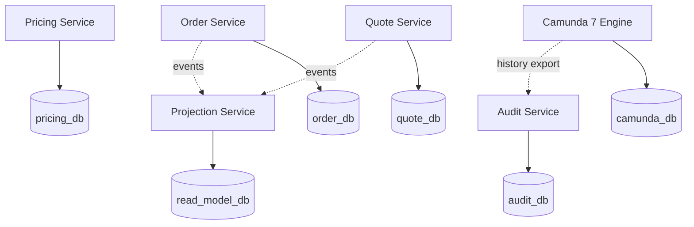
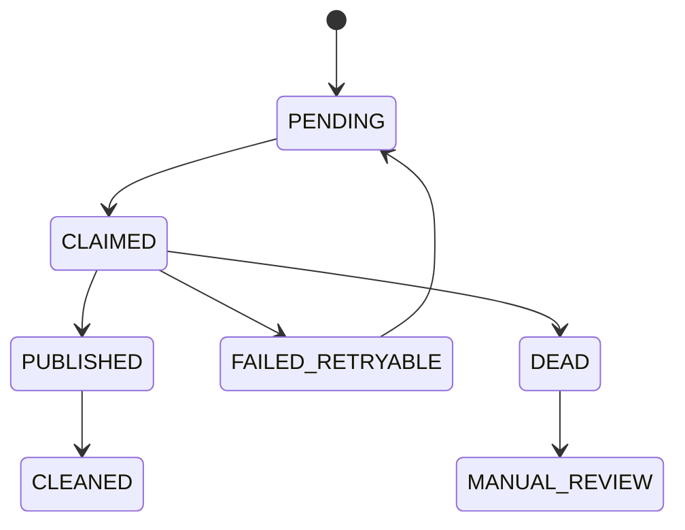

# Part 054 — PostgreSQL Operations for CPQ/OMS

> A CPQ/OMS platform does not fail only when code is wrong.  
> It also fails when the database is allowed to become slow, bloated, under-indexed, over-indexed, over-connected, poorly backed up, or operationally opaque.

This part is about running PostgreSQL for an enterprise CPQ/OMS system.

We are not learning PostgreSQL basics. We already covered data modeling earlier. Now the question is:

> Can this database survive real quote traffic, order bursts, long-running workflow correlation, audit growth, replay/rebuild operations, and production incidents without becoming the hidden single point of failure?

PostgreSQL is the source of truth for most CPQ/OMS services. That makes it both the strongest correctness boundary and the most dangerous bottleneck.

---

## 1. PostgreSQL's Role in This Platform

In this architecture, PostgreSQL is used for:

- domain aggregates,
- lifecycle state,
- quote/order revisions,
- price evidence,
- approval evidence,
- audit trails,
- outbox/inbox records,
- idempotency records,
- read model projections,
- operational correlation tables,
- Camunda engine runtime/history database.

That does **not** mean one shared database for everything.

### 1.1 Database Ownership Rule

Each service owns its schema/database boundary.



The physical deployment may consolidate some databases for cost or operational simplicity, but logical ownership must remain strict.

A shared PostgreSQL instance is acceptable. A shared schema with cross-service writes is not.

---

## 2. Operational Invariants

PostgreSQL operations for CPQ/OMS must protect these invariants:

| Invariant | Meaning |
|---|---|
| Domain truth is durable | Accepted quote/order state survives process crash. |
| Lifecycle transitions are atomic | State, audit, and outbox are committed together. |
| Queries are predictable | Critical APIs do not depend on accidental full scans. |
| Writes do not block forever | Locks are bounded and observable. |
| Database growth is planned | History/audit/outbox/projection tables do not grow uncontrolled. |
| Recovery is proven | Backups are restored in drills, not trusted by faith. |
| Migrations are safe | Schema evolution does not break running services. |
| Observability exists | Slow query, lock, bloat, replication, and pool pressure are visible. |

A database that is correct but unobservable is not production-ready.

---

## 3. Connection Pooling

Every Java service using PostgreSQL needs disciplined connection pooling.

A connection is not free. Too many connections increase memory usage, context switching, lock contention, and operational instability.

### 3.1 Pool Sizing Mental Model

For each service:

```text
max useful connections ≠ max request concurrency
max useful connections ≈ number of concurrent DB-bound operations the database can actually serve
```

If 12 services each configure `maximumPoolSize=50`, the database may suddenly see 600 potential connections. That is not scaling. That is accidental denial of service.

### 3.2 Pool Budget

Start with a global budget:

```text
PostgreSQL max_connections budget
  minus admin/reserved connections
  minus replication/maintenance connections
  divided across services by workload criticality
```

Example:

| Service | Pool Size Rationale |
|---|---|
| Quote Service | High interactive traffic; moderate pool. |
| Pricing Service | CPU-heavy; DB calls should be limited. |
| Order Service | Critical writes; carefully protected pool. |
| Projection Service | Async writes; controlled batch pool. |
| Audit Service | High write volume; separate pool/tuning. |
| Camunda Engine | Runtime sensitive; isolate from noisy apps. |

### 3.3 Pool Anti-Patterns

Avoid:

- large pools to hide slow queries,
- one transaction per HTTP request if it does external calls inside,
- holding DB connection while waiting for remote API,
- running batch backfills from app pool,
- letting background jobs starve interactive traffic,
- sharing the same pool for OLTP and export/reporting.

### 3.4 Transaction Duration Rule

A transaction should be short, local, and purposeful.

Bad:

```text
begin transaction
  load order
  call inventory API
  call billing API
  update order
commit
```

Good:

```text
transaction 1:
  persist command intent
  update order state
  write outbox
commit

outside transaction:
  async worker calls external system

transaction 2:
  persist callback result
  transition order
  write audit/outbox
commit
```

PostgreSQL is not the place to hold business uncertainty while waiting for the outside world.

---

## 4. Locking Operations

CPQ/OMS has high-value concurrent operations:

- quote edit vs approval,
- quote accept vs expiration,
- order submit vs duplicate submit,
- order cancel vs fulfillment complete,
- compensation vs callback,
- projection rebuild vs live projection updates.

PostgreSQL locks are necessary, but they are not the design. The design is the lifecycle invariant.

### 4.1 Lock Visibility

Production dashboards should show:

- long-running transactions,
- sessions waiting on locks,
- blocked queries,
- blocking query text,
- transaction age,
- idle-in-transaction sessions.

A single forgotten transaction can block quote/order writes and create cascading failures.

### 4.2 Operational Queries

Example diagnostic queries should exist in a runbook, not be invented during outage.

```sql
-- Sessions currently waiting on a lock
select
  pid,
  usename,
  application_name,
  wait_event_type,
  wait_event,
  state,
  now() - xact_start as tx_age,
  left(query, 500) as query
from pg_stat_activity
where wait_event_type = 'Lock'
order by tx_age desc;
```

```sql
-- Long-running transactions
select
  pid,
  usename,
  application_name,
  state,
  now() - xact_start as tx_age,
  left(query, 500) as query
from pg_stat_activity
where xact_start is not null
order by tx_age desc
limit 20;
```

### 4.3 Lock Timeout Policy

Set explicit timeouts for application connections:

```sql
set lock_timeout = '3s';
set statement_timeout = '30s';
set idle_in_transaction_session_timeout = '60s';
```

Actual values depend on workload, but the principle is fixed: unbounded waiting is not production behavior.

---

## 5. Vacuum and Bloat

PostgreSQL uses MVCC. Updates/deletes create old row versions that must eventually be cleaned. If vacuum cannot keep up, tables and indexes bloat, query performance degrades, and operational risk increases.

In CPQ/OMS, high-churn tables include:

- outbox,
- inbox/dedup,
- idempotency records,
- projection tables,
- task/worklist projections,
- Camunda runtime/history tables,
- quote draft tables if edits are frequent,
- order fulfillment step updates.

### 5.1 Autovacuum Is Not Optional

Autovacuum must be monitored and tuned. Do not disable it because it seems noisy.

Track:

- last autovacuum time,
- dead tuples,
- vacuum duration,
- table bloat estimate,
- index bloat estimate,
- transaction ID age,
- tables not being vacuumed frequently enough.

### 5.2 CPQ/OMS Table Risk Classes

| Table Type | Risk | Strategy |
|---|---|---|
| Append-only audit | growth | partition/archive/compress |
| Outbox | churn | frequent cleanup, partial indexes |
| Inbox/dedup | churn | TTL/delete/partition |
| Quote revisions | growth | archive old revisions based on policy |
| Active quote drafts | update churn | optimistic lock, avoid huge row updates |
| Order fulfillment step | moderate churn | index by active status/stage |
| Camunda history | growth | retention/history cleanup/export |
| Projection tables | rebuild/write churn | truncate/rebuild strategy or partition |

### 5.3 Avoid Hot Update Payloads

If a row contains large JSONB snapshots and you update small status fields frequently, the database may rewrite large row versions unnecessarily.

Separate:

- immutable snapshot table,
- mutable lifecycle state table,
- append-only transition log.

Bad shape:

```text
quote_revision(id, status, huge_snapshot_jsonb, updated_at)
```

Better shape:

```text
quote_revision(id, immutable_snapshot_jsonb, created_at)
quote_lifecycle(id, quote_revision_id, status, version, updated_at)
quote_transition_log(...)
```

---

## 6. Index Operations

Indexes are not free. They speed reads and slow writes. Enterprise CPQ/OMS needs deliberate index ownership.

### 6.1 Index by Access Pattern

Every important index should answer a named query.

Example:

```sql
create index idx_order_active_by_tenant_status
on customer_order (tenant_id, status, created_at desc)
where status in ('SUBMITTED', 'ORCHESTRATING', 'FULFILLMENT_PENDING');
```

This index exists for an operational dashboard. If the dashboard changes, the index must be reviewed.

### 6.2 Common CPQ/OMS Indexes

| Query | Index Shape |
|---|---|
| Find active quote by customer | `(tenant_id, customer_id, status, updated_at desc)` partial active statuses |
| Find quote revision | `(tenant_id, quote_id, revision_no)` unique |
| Find active order by status | `(tenant_id, status, created_at desc)` partial active statuses |
| Find order by quote revision | `(tenant_id, source_quote_revision_id)` |
| Find outbox unpublished | `(status, next_attempt_at, created_at)` partial status pending |
| Find idempotency key | `(tenant_id, endpoint_key, idempotency_key)` unique |
| Find audit by entity | `(tenant_id, entity_type, entity_id, occurred_at desc)` |
| Find workflow correlation | `(tenant_id, domain_type, domain_id)` unique |

### 6.3 Index Maintenance

Index maintenance includes:

- checking unused indexes,
- checking duplicate indexes,
- checking bloated indexes,
- using `REINDEX CONCURRENTLY` when needed,
- avoiding index creation during peak traffic,
- verifying query plans after adding/changing indexes,
- documenting why an index exists.

### 6.4 Explain Discipline

A query should not be merged into a critical API without an explain plan review for representative data volume.

Checklist:

- Does it use expected index?
- Does it scan too many rows?
- Does sorting spill?
- Does tenant filter appear early?
- Does pagination remain stable?
- Does query degrade with historical data growth?
- Does it lock rows unnecessarily?

---

## 7. Partitioning Strategy

Partitioning is useful when it matches operational access and retention patterns. It is harmful when used as a magic performance switch.

Good candidates:

- audit log by time,
- outbox by creation time,
- inbox/dedup by creation time,
- high-volume event projection by time,
- historical order timeline by time,
- tenant-specific partitioning only when tenant skew is extreme and operations justify it.

Bad candidates:

- small tables,
- highly joined OLTP tables without clear partition pruning,
- tables where every query touches many partitions,
- partitioning only because the table feels “large”.

### 7.1 Example: Audit Partitioning

```sql
create table audit_event (
  tenant_id varchar(64) not null,
  event_id uuid not null,
  entity_type varchar(64) not null,
  entity_id varchar(128) not null,
  occurred_at timestamptz not null,
  event_type varchar(128) not null,
  payload jsonb not null,
  primary key (event_id, occurred_at)
) partition by range (occurred_at);
```

Monthly partitions:

```sql
create table audit_event_2026_07
partition of audit_event
for values from ('2026-07-01') to ('2026-08-01');
```

### 7.2 Partition Operations

Operational benefits:

- drop old partition instead of massive delete,
- archive partition as unit,
- reduce vacuum pressure on historical immutable data,
- keep active partitions smaller.

Risks:

- more complex migrations,
- more complex indexes,
- query planning overhead,
- incorrect partition key causes no benefit,
- global uniqueness constraints require careful design.

---

## 8. Outbox Operations

The outbox table is a high-churn operational table. It must be designed for publishing, retrying, and cleanup.

### 8.1 Outbox Lifecycle



### 8.2 Outbox Indexes

```sql
create index idx_outbox_pending
on outbox_event (next_attempt_at, created_at)
where status in ('PENDING', 'FAILED_RETRYABLE');
```

```sql
create index idx_outbox_by_aggregate
on outbox_event (aggregate_type, aggregate_id, sequence_no);
```

### 8.3 Outbox Cleanup

Do not keep published outbox records forever in the hot table unless required.

Options:

- archive published records to cold table,
- partition by created time,
- delete after Kafka retention + audit retention requirement,
- retain dead records until manually resolved,
- expose outbox health dashboard.

Metrics:

- oldest pending age,
- pending count,
- retry count,
- dead count,
- publish latency p95/p99,
- duplicate publish detection,
- per-aggregate ordering violations.

---

## 9. Idempotency and Inbox Table Operations

Idempotency records protect against duplicate commands. Inbox records protect consumers against duplicate events.

These tables grow and churn.

### 9.1 Idempotency Record Retention

Retention depends on business semantics:

| Operation | Suggested Retention Logic |
|---|---|
| quote preview | short TTL |
| quote submit | quote lifecycle duration + safety window |
| accept quote | long enough to prevent duplicate order creation |
| order submit | long enough to protect downstream duplication |
| payment/billing handoff | aligned with external reconciliation window |

### 9.2 Inbox Dedup Retention

Inbox record retention should cover at least:

- Kafka replay window,
- consumer retry window,
- operational replay policy,
- business risk window.

If you delete inbox records too early, replay may reapply events. If you keep them forever in one hot table, you create bloat.

Partitioning or TTL cleanup is usually required at scale.

---

## 10. Query Patterns for CPQ/OMS

### 10.1 Interactive Query

Interactive API queries must be bounded.

Examples:

- get quote workspace,
- get active order summary,
- get approval task,
- get product configuration screen.

Rules:

- tenant filter required,
- stable pagination required,
- no unbounded joins,
- no arbitrary user-provided sort without index strategy,
- no report query on OLTP endpoint,
- no fetching giant aggregate graph by accident.

### 10.2 Operational Query

Operational queries support human work:

- stuck orders,
- SLA breach list,
- failed fulfillment steps,
- pending approvals,
- process incidents by stage.

These should use projection/read-model tables, not ad-hoc joins across domain and Camunda runtime tables.

### 10.3 Reporting Query

Reporting queries should be isolated:

- replica,
- reporting schema,
- materialized view,
- ETL/ELT pipeline,
- data warehouse.

Do not let a monthly sales report compete with quote acceptance transactions.

---

## 11. JSONB Operations

JSONB is useful for immutable snapshots and flexible evidence payloads. It is dangerous when used as an unbounded schema escape hatch.

Good use:

- quote configuration snapshot,
- price trace payload,
- external response evidence,
- audit detail,
- original request/response archive,
- document render input.

Bad use:

- mutable lifecycle fields,
- frequently filtered core fields,
- state machine status,
- tenant ID,
- money totals used in query/reporting,
- hidden foreign keys.

### 11.1 JSONB Operational Rule

If you frequently filter, join, or enforce invariants on a field, it should probably be a column.

Use JSONB for evidence and snapshots. Use columns for operational truth.

---

## 12. Backup and Restore

A backup strategy that has never been restored is a hope, not a capability.

### 12.1 Recovery Objectives

Define per database:

| Database | RPO | RTO | Notes |
|---|---:|---:|---|
| order_db | very low | low | business-critical authority |
| quote_db | low | low/medium | customer-facing commercial state |
| pricing_db | medium | medium | reference/policy + evidence |
| audit_db | very low/low | medium | defensibility evidence |
| camunda_db | low | low | active workflow runtime |
| read_model_db | higher | lower priority | can rebuild if source events available |

### 12.2 Restore Drill

A restore drill must prove:

- backup can be restored,
- WAL/PITR works if used,
- application can connect,
- data integrity checks pass,
- Camunda engine can resume process instances,
- outbox/inbox state is consistent,
- Kafka replay plan is understood,
- read models can be rebuilt,
- secrets/permissions are correct,
- restoration time meets RTO.

### 12.3 Restore Verification Queries

Examples:

```sql
-- Count critical active orders
select status, count(*)
from customer_order
group by status;
```

```sql
-- Check unpublished outbox age
select min(created_at) as oldest_pending, count(*)
from outbox_event
where status in ('PENDING', 'FAILED_RETRYABLE');
```

```sql
-- Check workflow correlation without process id
select count(*)
from workflow_correlation
where status = 'ACTIVE'
  and process_instance_id is null;
```

A restore drill is not complete until business-level checks pass.

---

## 13. Replication and Read Scaling

Read replicas can help, but they introduce lag.

Do not use replicas for decisions requiring current truth unless lag is explicitly acceptable.

### 13.1 Safe Replica Use

Safe:

- reporting,
- dashboard read models with lag indicator,
- export jobs,
- audit search,
- historical quote/order views.

Risky:

- quote accept validation,
- order cancellation decision,
- approval freshness check,
- idempotency lookup,
- inventory reservation decision,
- compensation decision.

### 13.2 Replica Lag Rule

Any UI/API backed by replica should disclose or tolerate lag.

For operator dashboards:

```text
Data freshness: 12 seconds behind primary
```

For command validation: use primary.

---

## 14. Security Operations

PostgreSQL security in CPQ/OMS protects commercial data, customer information, approval evidence, and operational control.

### 14.1 Database Role Model

Use separate roles:

| Role | Permission |
|---|---|
| app_quote_rw | Quote service runtime read/write only quote schema |
| app_order_rw | Order service runtime read/write only order schema |
| app_audit_write | Append audit events, restricted read |
| migration_owner | DDL migration, controlled by CI/CD |
| readonly_support | Limited diagnostic read |
| reporting_ro | Reporting schema/replica read |
| breakglass_dba | Emergency only, audited |

Avoid one superuser connection string reused by all services.

### 14.2 Sensitive Data Handling

Rules:

- secrets do not go into audit payloads,
- customer PII is minimized,
- payment tokens are not stored unless explicitly allowed,
- approval notes may contain sensitive data and need access control,
- document render inputs may contain commercial confidential data,
- backups must be encrypted and access-controlled.

---

## 15. Migration Operations

Schema migrations in CPQ/OMS are high-risk because services, events, workflows, and historical data evolve together.

### 15.1 Migration Types

| Migration Type | Risk |
|---|---|
| Add nullable column | Low |
| Add table/index concurrently | Low/medium |
| Add NOT NULL with backfill | Medium |
| Rewrite large table | High |
| Change enum/status | High |
| Drop column | High |
| Change JSONB shape | Medium/high |
| Add FK to large table | Medium/high |
| Partition existing table | High |

### 15.2 Expand–Migrate–Contract

Use staged migration:

1. expand schema safely,
2. deploy app writing both old/new if needed,
3. backfill gradually,
4. validate parity,
5. switch reads,
6. stop old writes,
7. contract old schema later.

Do not combine all stages into one release when data volume is large.

### 15.3 Backfill Runbook

A backfill should be:

- resumable,
- batched,
- rate-limited,
- observable,
- lock-aware,
- tenant-aware,
- idempotent,
- separately deployable from app release if needed.

Example shape:

```sql
-- Claim a batch of rows for backfill using deterministic ordering.
select id
from quote_revision
where new_hash is null
order by created_at, id
limit 1000;
```

The application/backfill worker computes and updates in small chunks.

---

## 16. Camunda Database Boundary

Camunda 7 database requires special attention because it stores runtime engine state.

### 16.1 Do Not Share Camunda Schema With Domain Tables

Keep Camunda schema/database separate from domain service schemas.

Reasons:

- engine upgrade/migration risk,
- operational query isolation,
- history cleanup behavior,
- table growth patterns,
- permission separation,
- backup/restore clarity.

### 16.2 Do Not Query Camunda Tables as Business API

Do not build business screens directly from `ACT_*` tables.

Use:

- Camunda API for workflow operations,
- domain workflow correlation table,
- projection service for worklists/dashboards,
- audit export for evidence.

Raw engine tables are implementation details.

### 16.3 Camunda DB Monitoring

Track:

- active runtime rows,
- job table backlog,
- failed jobs/incidents,
- history table growth,
- slow queries,
- lock waits,
- cleanup duration,
- DB connection pool usage by engine,
- transaction age.

---

## 17. Observability for PostgreSQL

Minimum dashboard sections:

1. connections and pool usage,
2. transaction age,
3. lock waits,
4. slow queries,
5. query throughput,
6. buffer cache hit ratio,
7. table/index growth,
8. dead tuples/autovacuum,
9. replication lag,
10. checkpoint/WAL pressure,
11. disk usage and growth forecast,
12. backup status and restore drill age.

### 17.1 Application-Level DB Metrics

Each service should expose:

- pool active/idle/pending,
- query latency by operation name,
- transaction duration,
- failed transaction count,
- optimistic lock failure count,
- lock timeout count,
- statement timeout count,
- deadlock count,
- outbox pending age,
- projection lag.

The database team sees the instance. The service team must see its own query behavior.

---

## 18. PostgreSQL Incident Playbooks

### 18.1 Incident: Connection Pool Exhausted

Symptoms:

- API requests hang or fail.
- Pool pending threads rise.
- DB may still have capacity or may be saturated.

Diagnosis:

1. Check pool active/idle/pending per service.
2. Check long transactions.
3. Check slow queries.
4. Check external calls inside transactions.
5. Check recent release.

Safe actions:

- shed non-critical traffic,
- pause batch jobs,
- scale app only if DB can handle it,
- kill clearly idle-in-transaction sessions if runbook permits,
- roll forward query fix if release-related.

Do not blindly increase pool size.

### 18.2 Incident: Lock Wait Spike

Symptoms:

- Writes slow.
- `wait_event_type = Lock` visible.
- Specific quote/order operations hang.

Diagnosis:

1. Identify blockers.
2. Identify blocked business operation.
3. Check transaction age.
4. Check if migration/backfill is running.
5. Check if operator/reporting query holds lock.

Safe actions:

- cancel blocker if safe,
- pause migration/backfill,
- increase application lock timeout if too aggressive only after analysis,
- fix transaction scope.

### 18.3 Incident: Outbox Backlog

Symptoms:

- Events delayed.
- Projection lag grows.
- Workflow correlation waits for events.

Diagnosis:

1. Check oldest pending outbox.
2. Check publisher errors.
3. Check Kafka availability.
4. Check row locking/claim query.
5. Check poison event blocking order.

Safe actions:

- isolate poison event,
- increase publisher workers carefully,
- replay after fix,
- route dead records to manual review,
- avoid deleting unpublished events.

### 18.4 Incident: Disk Growth

Symptoms:

- Disk usage rapidly increasing.
- Audit/history/outbox/projection tables growing.

Diagnosis:

1. Identify top growing tables/indexes.
2. Check dead tuples and bloat.
3. Check history cleanup.
4. Check outbox cleanup.
5. Check batch/retry storm.

Safe actions:

- stop retry storm,
- archive/drop old partitions if policy allows,
- run vacuum/reindex plan,
- expand storage as emergency measure,
- fix retention leak.

---

## 19. Production Readiness Checklist

For each PostgreSQL-backed service:

- [ ] Owned schema/database is clear.
- [ ] Connection pool budget is documented.
- [ ] Pool metrics are exported.
- [ ] Transaction timeouts are configured.
- [ ] Long transaction dashboard exists.
- [ ] Lock wait dashboard exists.
- [ ] Slow query logging is configured.
- [ ] Critical queries have explain plans reviewed.
- [ ] Index ownership is documented.
- [ ] Outbox cleanup is implemented.
- [ ] Idempotency/inbox retention is implemented.
- [ ] Audit/history growth plan exists.
- [ ] Autovacuum is monitored.
- [ ] Backup works.
- [ ] Restore drill has been performed.
- [ ] Migration runbook exists.
- [ ] Backfill strategy is resumable.
- [ ] Replica lag is monitored if replicas are used.
- [ ] Service roles have least privilege.
- [ ] Break-glass access is audited.
- [ ] Camunda DB is isolated and monitored.

---

## 20. The Top 1% Lens

A weak backend team treats PostgreSQL as a place where data is stored.

A strong platform team treats PostgreSQL as a correctness and operations boundary.

That means they ask:

- What is the write path?
- What can block it?
- What grows forever?
- What is the retention policy?
- What happens during replay?
- What happens during restore?
- Which queries are allowed to be slow?
- Which queries are never allowed to be slow?
- Which tables are hot?
- Which indexes are justified?
- Which migrations are safe online?
- Which incidents require business recovery?

For CPQ/OMS, PostgreSQL is not only storage. It is the ledger of commercial intent, approval evidence, order obligation, workflow correlation, and recovery history.

If the database is operated casually, the business process is operated casually.

---

## 21. What Comes Next

PostgreSQL is one operational pillar. The next part moves to Kafka operations for CPQ/OMS: consumer lag, topic retention, replay, DLQ, schema evolution, partition expansion, and event-driven production dashboards.
