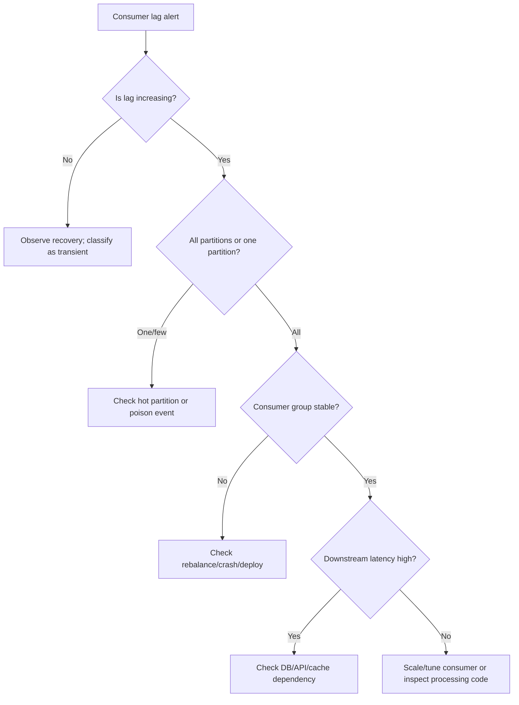
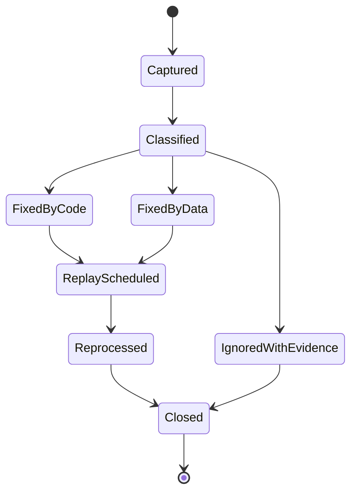

# Part 055 — Kafka Operations for CPQ/OMS

> Kafka di CPQ/OMS bukan “message queue cepat”. Kafka adalah **operational backbone untuk fakta bisnis yang sudah committed**. Kalau operasinya buruk, sistem terlihat berjalan, tetapi quote, approval, order, fulfillment, audit, projection, dan reconciliation perlahan tidak lagi menceritakan realitas yang sama.

Part ini tidak mengulang dasar Kafka. Kita akan fokus ke operasi Kafka untuk sistem CPQ/OMS enterprise: topic governance, consumer lag, retention, replay, DLQ, schema compatibility, partition expansion, incident playbook, dan dashboard yang benar-benar membantu engineer mengambil keputusan.

Referensi faktual: Apache Kafka mendeskripsikan dirinya sebagai event streaming platform yang scalable dan fault-tolerant, dengan producer, consumer, topic, partition, offset, Admin API, dan operasi cluster sebagai bagian inti ekosistemnya. Dokumentasi Kafka juga menekankan kemampuan fault-tolerant cluster dan pemisahan producer/consumer melalui log.  
Reference: https://kafka.apache.org/documentation/

---

## 1. Mental Model: Kafka sebagai Business Fact Log

Dalam CPQ/OMS, event Kafka idealnya berarti:

> “Sebuah fakta bisnis sudah terjadi dan sudah committed di source of truth service.”

Contoh:

- `QuotePriced`
- `QuoteSubmittedForApproval`
- `QuoteApproved`
- `QuoteAccepted`
- `OrderCreated`
- `OrderDecompositionCompleted`
- `OrderFulfillmentStepCompleted`
- `OrderFalloutRaised`
- `DocumentGenerated`
- `NotificationRequested`

Event bukan:

- request untuk “coba lakukan sesuatu” tanpa authority yang jelas,
- replikasi tabel database mentah,
- dumping ground seluruh field entity,
- remote procedure call terselubung,
- cara menghindari desain API atau workflow yang jelas.

Kafka operations harus dimulai dari pertanyaan:

> “Kalau event ini terlambat, hilang dari consumer, diproses dua kali, diproses out-of-order, atau harus di-replay, apa konsekuensi bisnisnya?”

Bukan dari pertanyaan:

> “Berapa broker yang kita butuhkan?”

Broker sizing penting, tetapi tanpa event semantics, sizing hanya membuat kekacauan berjalan lebih cepat.

---

## 2. CPQ/OMS Kafka Surface

Kafka dalam platform ini biasanya melayani beberapa surface:

| Surface | Producer | Consumer | Risk Utama |
|---|---|---|---|
| Domain event | Quote/Order/Pricing/Catalog service | Projection, audit, workflow, notification | Duplicate, lag, schema drift |
| Integration event | Anti-corruption layer | ERP/CRM/Billing/Inventory adapter | External outage, retry storm |
| Outbox publishing | Domain DB outbox publisher | Kafka topics | Dual-write gap, stuck outbox |
| Read model projection | Event consumers | Search/reporting/worklist DB | Projection lag, rebuild correctness |
| Workflow trigger | Domain services or workflow bridge | Camunda starter/correlator | Duplicate process, wrong correlation |
| Notification trigger | Domain events | Notification service | Spam duplicate, stale template |
| Audit stream | Domain services | Audit store/security monitoring | Missing evidence, tampering suspicion |

Kafka harus diperlakukan sebagai **shared infrastructure with strict ownership**. Kalau semua service bebas membuat topic, mengubah payload, dan replay tanpa koordinasi, Kafka berubah menjadi distributed entropy machine.

---

## 3. Operating Invariants

Sebelum bicara tools, tetapkan invariant.

### 3.1 Event Ownership Invariant

Setiap topic punya satu logical owner.

Contoh:

| Topic | Owner | Boleh Publish? | Boleh Consume? |
|---|---|---|---|
| `cpq.quote.events.v1` | Quote Service | Quote Service only | Many services |
| `cpq.order.events.v1` | Order Service | Order Service only | Many services |
| `cpq.pricing.events.v1` | Pricing Service | Pricing Service only | Many services |
| `cpq.workflow.events.v1` | Workflow Bridge/Workflow Service | Workflow boundary only | Ops/search/audit |
| `cpq.notification.commands.v1` | Domain services via outbox | Approved producers only | Notification Service |

Kalau dua service publish event yang sama ke topic yang sama tanpa ownership jelas, debugging incident akan menjadi debat, bukan investigasi.

### 3.2 Event Is Not Database Row Invariant

Event harus menyatakan fakta bisnis, bukan representasi tabel.

Buruk:

```json
{
  "table": "quote",
  "operation": "UPDATE",
  "before": {...},
  "after": {...}
}
```

Lebih baik:

```json
{
  "eventType": "QuoteApproved",
  "eventVersion": 1,
  "tenantId": "tenant-acme",
  "aggregateType": "Quote",
  "aggregateId": "q-100240",
  "aggregateVersion": 8,
  "occurredAt": "2026-07-02T09:15:20Z",
  "payload": {
    "quoteId": "q-100240",
    "revision": 3,
    "approvalDecisionId": "appr-88321",
    "approvedBy": "user-41",
    "approvalPolicyVersion": "discount-policy:2026.07.01",
    "approvedTotal": {
      "currency": "IDR",
      "amount": "25000000.00"
    }
  }
}
```

### 3.3 Ordering Scope Invariant

Kafka only guarantees order within a partition. Therefore, ordering guarantee must be scoped explicitly.

Untuk CPQ/OMS, partition key umumnya:

| Event Family | Recommended Key | Rationale |
|---|---|---|
| Quote lifecycle | `tenantId + quoteId` | Quote events per quote harus urut |
| Order lifecycle | `tenantId + orderId` | Order events per order harus urut |
| Fulfillment step | `tenantId + orderId` or `tenantId + orderLineId` | Pilih berdasarkan replay/order semantics |
| Catalog publication | `tenantId + catalogVersionId` | Publication lifecycle harus urut |
| Notification command | `tenantId + notificationIntentId` | Idempotency per notification |
| Projection rebuild | depends on projection | Bisa dedicated replay topic atau source event topic |

Jangan memakai random key untuk event lifecycle aggregate. Random key menaikkan throughput tetapi menghancurkan determinism.

### 3.4 Consumer Idempotency Invariant

Setiap consumer harus aman menerima event yang sama lebih dari sekali.

Minimal simpan:

```sql
create table inbox_message (
    consumer_name text not null,
    message_id text not null,
    topic text not null,
    partition_no integer not null,
    offset_no bigint not null,
    aggregate_type text not null,
    aggregate_id text not null,
    event_type text not null,
    received_at timestamptz not null default now(),
    processed_at timestamptz,
    status text not null,
    failure_reason text,
    primary key (consumer_name, message_id)
);
```

Rule:

> Offset commit bukan idempotency. Offset commit hanya menandai posisi baca consumer group. Business idempotency tetap tanggung jawab consumer.

---

## 4. Topic Governance

Topic governance adalah control plane untuk Kafka.

### 4.1 Topic Naming Convention

Gunakan naming yang bisa dibaca manusia dan dipakai automation.

Format:

```text
<domain>.<capability>.<stream-kind>.v<major>
```

Contoh:

```text
cpq.quote.events.v1
cpq.order.events.v1
cpq.pricing.events.v1
cpq.catalog.publications.v1
cpq.notification.commands.v1
cpq.notification.events.v1
cpq.audit.events.v1
cpq.workflow.events.v1
cpq.search.rebuild-commands.v1
cpq.dead-letter.events.v1
```

Hindari:

```text
events
quote
order-topic
kafka_quote_1
prod-events
all-domain-events
```

Topic name adalah API. Treat it as public contract.

### 4.2 Topic Metadata Registry

Setiap topic harus punya metadata minimal:

```yaml
topic: cpq.order.events.v1
owner: order-service
purpose: Published facts about committed order lifecycle changes.
messageKey: tenantId + orderId
schemaFamily: OrderDomainEvent
retention: 30d
cleanupPolicy: delete
partitions: 24
replicationFactor: 3
pii: false
containsFinancialData: true
allowedProducers:
  - order-service
allowedConsumers:
  - order-search-projector
  - audit-service
  - notification-service
  - workflow-correlator
replayPolicy:
  allowed: true
  requiresApproval: true
  maxWindow: 30d
breakingChangePolicy:
  newMajorTopicRequired: true
```

Simpan di repo sebagai `kafka-topics.yaml` atau per-service topic spec. Jangan biarkan topic dibuat manual lewat console tanpa trace.

### 4.3 Topic Creation Gate

Topic baru harus melewati review:

- Apa owner-nya?
- Apa event semantics-nya?
- Apa key-nya?
- Apa retention-nya?
- Apa schema-nya?
- Apa replay behavior-nya?
- Apa consumer utamanya?
- Apakah data mengandung PII, price, discount, approval evidence?
- Apakah event ini command, fact, atau notification intent?
- Apakah topic ini menggandakan topic lain?

Kalau pertanyaan ini tidak bisa dijawab, topic belum boleh dibuat.

---

## 5. Partition Strategy

Partition adalah unit parallelism dan ordering scope.

### 5.1 Partition Count Is a Contract

Menambah partition bisa mengubah key-to-partition mapping. Untuk keyed event, itu bisa mengganggu ordering jika producer partitioner berubah atau event lama dan baru tidak lagi jatuh ke partition yang sama untuk key tertentu.

Dalam CPQ/OMS, partition expansion harus diperlakukan sebagai operation dengan checklist:

- Apakah topic berisi lifecycle event yang membutuhkan strict per-aggregate ordering?
- Apakah producer memakai stable key?
- Apakah consumer bergantung pada partition-local ordering?
- Apakah replay sedang berjalan?
- Apakah consumer group bisa menangani rebalancing?
- Apakah lag threshold sementara akan dinaikkan?
- Apakah dashboard bisa membedakan rebalance lag vs true processing lag?

### 5.2 Partition Sizing Heuristic

Jangan mulai dari “berapa banyak partition biasanya”. Mulai dari workload.

Variables:

```text
peak_events_per_second
average_processing_ms_per_event
consumer_instances
max_parallelism_needed
ordering_scope
retention_storage
replay_window
```

Rough heuristic:

```text
required_parallelism ≈ peak_events_per_second * avg_processing_ms / 1000
```

Contoh:

```text
peak_events_per_second = 600
avg_processing_ms = 50ms
required_parallelism = 600 * 50 / 1000 = 30 concurrent processing lanes
```

Kalau satu consumer instance memproses satu partition per thread, topic butuh setidaknya sekitar 30 partition untuk consumer group tersebut. Tetapi jika event membutuhkan strict order per aggregate, concurrency harus tetap menjaga ordering per key.

### 5.3 Hot Partition Detection

Hot partition muncul ketika key distribution timpang.

Contoh penyebab:

- partition key hanya `tenantId`, padahal satu tenant menyumbang 80% traffic,
- semua notification command memakai key `notification`,
- semua catalog event memakai key `global`,
- order batch besar menghasilkan ribuan event dengan same key,
- satu enterprise customer melakukan mass renewal campaign.

Metric yang dibutuhkan:

| Metric | Meaning |
|---|---|
| records in/sec per partition | apakah traffic merata? |
| bytes in/sec per partition | apakah payload tertentu terlalu besar? |
| consumer lag per partition | apakah satu partition tertinggal? |
| processing time per key sample | apakah aggregate tertentu berat? |
| event size percentile | apakah payload membengkak? |

### 5.4 Key Design Examples

```java
public final class KafkaKeys {
    public static String quoteKey(String tenantId, String quoteId) {
        return tenantId + ":quote:" + quoteId;
    }

    public static String orderKey(String tenantId, String orderId) {
        return tenantId + ":order:" + orderId;
    }

    public static String notificationKey(String tenantId, String notificationIntentId) {
        return tenantId + ":notification:" + notificationIntentId;
    }
}
```

Jangan pakai object JSON sebagai key jika tidak ada canonical serialization. Key harus stable.

---

## 6. Retention and Replay

Retention bukan hanya storage setting. Retention menentukan berapa jauh sistem bisa memperbaiki dirinya lewat replay.

### 6.1 Retention Classes

| Topic Class | Example | Retention Strategy |
|---|---|---|
| Domain lifecycle event | `cpq.order.events.v1` | 30–180 days depending audit/replay need |
| Integration event | `cpq.erp.events.v1` | Based on partner retry/reconciliation window |
| Notification command | `cpq.notification.commands.v1` | Shorter, because final state stored elsewhere |
| Audit event | `cpq.audit.events.v1` | Long or archived to immutable store |
| Rebuild command | `cpq.search.rebuild-commands.v1` | Short operational retention |
| DLQ | `cpq.dead-letter.events.v1` | Long enough for investigation, not infinite |

Rule:

> Jika replay dari Kafka adalah bagian dari disaster recovery atau read model rebuild, retention harus sesuai RPO/RTO dan rebuild strategy.

### 6.2 Replay Is a Controlled Operation

Replay event bukan “reset offset lalu jalan”. Replay adalah production change.

Replay checklist:

- What topic?
- What consumer group?
- What offset/time window?
- Which tenant?
- Which aggregate range?
- Is the consumer idempotent?
- Will replay trigger emails/webhooks again?
- Will replay start Camunda processes again?
- Will replay write audit duplicate?
- Is there a dry-run mode?
- Is replay isolated to rebuild projection DB?
- How do we stop replay safely?

### 6.3 Replay-Safe Consumer Contract

Consumer yang boleh direplay harus punya mode:

```text
NORMAL
REPLAY_REBUILD
REPLAY_VALIDATE_ONLY
```

Behavior:

| Mode | Side Effects Allowed? | Use Case |
|---|---:|---|
| `NORMAL` | Yes | Regular processing |
| `REPLAY_REBUILD` | Only projection writes | Rebuild search/read model |
| `REPLAY_VALIDATE_ONLY` | No | Validate schema/event stream |

Notification consumer tidak boleh replay lalu mengirim ulang email tanpa deduplication dan policy.

Workflow starter tidak boleh replay lalu membuat process instance baru untuk order lama.

Audit consumer boleh menyimpan duplicate detection, bukan duplicate audit fact.

---

## 7. Consumer Lag Operations

Consumer lag adalah signal. Bukan semua lag adalah incident.

### 7.1 Types of Lag

| Type | Meaning | Example |
|---|---|---|
| Healthy transient lag | short spike after burst | mass quote submit during campaign |
| Processing capacity lag | consumer slower than producer | pricing projection overloaded |
| Poison event lag | one event repeatedly fails | bad schema/data edge case |
| Rebalance lag | group unstable | rolling deploy or crash loop |
| Downstream dependency lag | consumer blocked by DB/API | search DB slow, billing API down |
| Intentional paused lag | operator paused consumer | controlled replay/fix |

A lag alert tanpa classification hanya menciptakan noise.

### 7.2 Lag Triage Tree



### 7.3 Key Lag Metrics

Per consumer group:

- total lag,
- max partition lag,
- lag growth rate,
- records consumed/sec,
- processing latency p50/p95/p99,
- commit latency,
- rebalance count,
- consumer instance count,
- failure/retry count,
- DLQ publish count,
- downstream dependency latency.

Per business flow:

- quote projection delay,
- order worklist delay,
- notification request delay,
- audit visibility delay,
- fulfillment event correlation delay.

Consumer lag must be translated into business impact:

```text
"order-search-projector lag 120k records"
```

is less useful than:

```text
"Order search and case-worker dashboard are 17 minutes behind for tenant-acme. Command path is unaffected, but operators may not see latest fallout cases."
```

### 7.4 Lag Alert Design

Bad alert:

```text
consumer_lag > 1000
```

Better alert:

```text
consumer_lag_growth_rate > threshold
AND lag_oldest_event_age > 5m
AND consumer_group_state != rebalancing
```

Better business alert:

```text
order_worklist_projection_delay_seconds > 300
FOR 10 minutes
```

---

## 8. DLQ Strategy

DLQ is not a trash bin. DLQ is an investigation queue.

### 8.1 When to DLQ

Use DLQ for:

- non-retryable schema violation,
- unknown event type/version,
- invalid business reference that cannot be resolved after retry window,
- poison event causing consumer to block partition,
- transformation bug after max retry,
- payload too large for downstream projection.

Do not DLQ immediately for:

- temporary DB outage,
- temporary network timeout,
- short downstream API failure,
- rebalance interruption,
- rate limit that can be retried safely.

### 8.2 DLQ Message Envelope

```json
{
  "dlqId": "dlq-20260702-00001",
  "sourceTopic": "cpq.order.events.v1",
  "sourcePartition": 3,
  "sourceOffset": 891222,
  "consumerName": "order-search-projector",
  "failureType": "SCHEMA_VALIDATION_FAILED",
  "failureMessage": "payload.fulfillmentPlanId is required",
  "firstFailedAt": "2026-07-02T10:21:44Z",
  "lastFailedAt": "2026-07-02T10:36:44Z",
  "attemptCount": 6,
  "tenantId": "tenant-acme",
  "aggregateType": "Order",
  "aggregateId": "ord-8812",
  "messageId": "evt-77621",
  "originalEvent": { }
}
```

### 8.3 DLQ Processing Lifecycle



DLQ item harus memiliki owner. Tanpa owner, DLQ menjadi permanent landfill.

### 8.4 DLQ Is Not a Substitute for Idempotency

Jika event gagal setelah sebagian side effect terjadi, lalu masuk DLQ, reprocessing harus aman.

Contoh notification:

- event diproses,
- email berhasil terkirim,
- DB update gagal,
- consumer crash,
- event diproses ulang.

Tanpa idempotency, user menerima email dua kali.

DLQ tidak memperbaiki ini. Idempotent side effect record yang memperbaiki.

---

## 9. Schema Evolution Operations

Schema evolution adalah daily operational risk.

### 9.1 Compatibility Rule

Default rule untuk CPQ/OMS event:

- add optional field: allowed,
- add required field: breaking,
- remove field: breaking unless field deprecated long enough and consumers verified,
- change type: breaking,
- change meaning: breaking even if type same,
- rename field: breaking,
- change enum semantics: breaking,
- change money precision/scale: breaking,
- change timestamp timezone semantics: breaking.

### 9.2 Event Versioning

Gunakan version field:

```json
{
  "eventType": "OrderCreated",
  "eventVersion": 2,
  "schemaId": "cpq.order.OrderCreated.v2",
  "messageId": "evt-..."
}
```

Policy:

- Minor additive changes stay in same topic if compatible.
- Major breaking changes require new event version and maybe new topic major version.
- Consumer harus reject unknown major version dengan explicit DLQ, bukan silent ignore.
- Deprecated fields must have removal date.

### 9.3 Schema Compatibility Gate in CI

CI harus mengecek:

- schema valid,
- backward compatibility terhadap previous release,
- example payload valid,
- OpenAPI DTO tidak bocor sebagai event schema,
- field names stable,
- money/timestamp format consistent,
- tenant/correlation/message ID mandatory,
- no accidental PII field.

---

## 10. Kafka and Camunda 7 Boundary

Camunda 7 dan Kafka sama-sama bisa menggerakkan flow. Jangan biarkan keduanya menjadi competing orchestrators.

### 10.1 Recommended Boundary

| Need | Owner |
|---|---|
| Long-running order orchestration | Camunda 7 |
| Published committed facts | Kafka |
| Start workflow after domain commit | Outbox → workflow starter or command API |
| Correlate external callback | Domain service validates → Camunda message correlation |
| Rebuild read model | Kafka replay |
| Human task lifecycle | Camunda 7 + domain task projection |
| Business state authority | Domain service DB |

### 10.2 Anti-Pattern: Event Soup Workflow

Buruk:

```text
OrderCreated event starts process.
InventoryReserved event moves process.
PaymentAuthorized event moves process.
FulfillmentCompleted event moves process.
CancellationRequested event moves process.
```

Ini bisa valid jika correlation dan idempotency matang. Tetapi sering berubah menjadi:

- event out-of-order,
- duplicate message correlation,
- process instance not found,
- event consumed before process committed,
- replay accidentally moves old workflow,
- business state beda dengan process state.

Lebih aman:

1. Domain service menerima command.
2. Domain service commit state + outbox.
3. Workflow service/process starter starts/correlates process idempotently.
4. Camunda external task calls domain commands.
5. Domain event publishes committed result.
6. Projection/audit consume event.

---

## 11. Kafka Security and Tenant Controls

Kafka mengandung commercial facts. Perlakukan seperti data plane sensitif.

### 11.1 Controls

- TLS untuk broker/client.
- SASL/OAuth/mTLS sesuai platform.
- ACL per service principal.
- Producer ACL restricted ke owned topic.
- Consumer ACL restricted ke approved topics.
- No shared “cpq-service” credential.
- Separate credentials for app, replay tool, admin tool.
- Topic metadata marks PII/financial data.
- Audit admin operations.

### 11.2 Tenant Leakage Risk

Event harus membawa `tenantId`, tetapi tenant isolation tidak cukup hanya dengan field. Consumer harus enforce tenant scope.

Example consumer guard:

```java
if (!tenantAccessPolicy.canProcess(consumerName, event.tenantId())) {
    throw new SecurityException("Consumer is not allowed to process tenant " + event.tenantId());
}
```

Replay tool harus mendukung tenant filter. Tanpa tenant filter, satu replay bisa rebuild atau memicu side effect lintas tenant.

---

## 12. Operational Dashboards

Kafka dashboard yang baik tidak hanya menampilkan broker CPU.

### 12.1 Platform Dashboard

- broker up/down,
- controller status,
- under-replicated partitions,
- offline partitions,
- request latency,
- disk usage,
- network IO,
- produce/consume throughput,
- ISR shrink/expand,
- partition count,
- topic storage by topic.

### 12.2 Domain Event Dashboard

| Metric | Why It Matters |
|---|---|
| events/sec by topic | volume behavior |
| event age p95 by topic | freshness |
| event size p95/p99 | payload growth |
| publish failure count | producer/outbox issue |
| outbox unpublished age | DB-to-Kafka gap |
| event validation failure | schema/data drift |
| duplicate message count | producer retry/idempotency issue |

### 12.3 Consumer Dashboard

- lag by group/topic/partition,
- oldest unprocessed event age,
- processing latency,
- error rate,
- DLQ rate,
- retry count,
- rebalance count,
- consumer instance count,
- downstream DB/API latency,
- idempotency hit count.

### 12.4 Business Dashboard

| Business Flow | Kafka-Related Indicator |
|---|---|
| Quote search freshness | `Quote events → quote projection delay` |
| Order dashboard freshness | `Order events → order projection delay` |
| Notification timeliness | `Notification commands lag` |
| Audit completeness | `Domain event count vs audit projection count` |
| Fallout detection | `Fulfillment events correlation delay` |
| Reconciliation | `Expected vs observed integration events` |

---

## 13. Incident Playbooks

### 13.1 Incident: Consumer Lag Increasing

Symptoms:

- consumer lag rising,
- projection stale,
- operators report missing latest orders.

Triage:

1. Identify affected consumer group.
2. Check all partitions vs one partition.
3. Check consumer instance health.
4. Check rebalance frequency.
5. Check downstream dependency latency.
6. Check recent deploy/config change.
7. Check error/DLQ rate.
8. Identify oldest event age and business impact.

Actions:

- If downstream DB slow: scale/tune DB or pause non-critical consumers.
- If poison event: isolate, DLQ after policy, resume partition.
- If capacity issue: scale consumer if partitions allow.
- If hot partition: assess key distribution; scaling alone may not help.
- If recent deploy: rollback/roll-forward.

Communication template:

```text
Impact: Order worklist projection is delayed by 18 minutes for tenant-acme.
Command path: unaffected.
Risk: operators may not see latest fallout cases.
Action: consumer scaled from 4 to 8; DB latency normal; lag decreasing.
Next update: when projection delay < 5 minutes.
```

### 13.2 Incident: Outbox Stuck

Symptoms:

- domain commands succeed,
- events not visible,
- projection stale,
- outbox unpublished rows increasing.

Triage:

- publisher alive?
- Kafka auth/connectivity error?
- serialization/schema error?
- one poison row blocking batch?
- DB lock on outbox table?
- producer timeout?

Actions:

- Do not manually publish event unless you preserve message ID and order.
- Mark poison outbox row with failure state if needed.
- Resume publisher after fix.
- Verify published count equals outbox expected count.

### 13.3 Incident: DLQ Spike

Symptoms:

- DLQ rate above baseline,
- consumer lag may or may not rise,
- projection missing subset.

Triage:

- same failure type?
- same event version?
- same tenant?
- same producer release?
- same consumer release?
- schema compatibility gate missed?

Actions:

- Stop affected producer if producing invalid events.
- Patch consumer if consumer bug.
- Create replay plan.
- Document data correction if needed.
- Close DLQ items with evidence.

### 13.4 Incident: Accidental Replay Triggered Side Effects

Symptoms:

- duplicate notifications,
- duplicate workflow starts,
- duplicate external API calls,
- unexpected order state transitions.

Immediate actions:

1. Stop replay job.
2. Pause affected consumer group.
3. Identify replay window and topics.
4. Identify side effects emitted.
5. Freeze downstream integration if needed.
6. Use idempotency records to classify duplicates.
7. Create remediation plan.

Prevention:

- replay tool must require explicit mode,
- side-effect consumers reject replay unless allowed,
- workflow starter uses idempotent process start by business key,
- notification service deduplicates by notification intent.

---

## 14. Operational Runbook Commands

Exact commands depend on deployment, but runbook intent should be stable.

### 14.1 Inspect Consumer Group

```bash
kafka-consumer-groups \
  --bootstrap-server "$BOOTSTRAP" \
  --describe \
  --group order-search-projector
```

Capture:

- current offset,
- log end offset,
- lag,
- partition distribution,
- consumer id/client id/host.

### 14.2 Inspect Topic Configuration

```bash
kafka-configs \
  --bootstrap-server "$BOOTSTRAP" \
  --entity-type topics \
  --entity-name cpq.order.events.v1 \
  --describe
```

Look for:

- retention,
- cleanup policy,
- min in-sync replicas,
- max message bytes,
- compression,
- custom configs.

### 14.3 Reset Offset — Dangerous

Offset reset must never be casual.

Checklist before reset:

- written approval?
- backup of current offsets?
- consumer stopped?
- replay mode set?
- side effects disabled?
- tenant/topic/window known?
- rollback plan?

Example intent:

```bash
# Example only. Do not run without runbook approval.
kafka-consumer-groups \
  --bootstrap-server "$BOOTSTRAP" \
  --group order-search-projector-rebuild \
  --topic cpq.order.events.v1 \
  --reset-offsets \
  --to-datetime 2026-07-02T00:00:00.000 \
  --execute
```

Prefer creating a separate rebuild consumer group over mutating production consumer offsets.

---

## 15. Topic and Consumer Release Governance

### 15.1 Producer Release Checklist

- Event schema compatible.
- Example payload updated.
- Contract tests pass.
- Topic owner approved.
- No field meaning changed silently.
- Event key unchanged or migration plan exists.
- Event size measured.
- Outbox publisher tested.
- Consumer impact reviewed.
- Observability updated.

### 15.2 Consumer Release Checklist

- Unknown event version behavior defined.
- Idempotency table migration deployed.
- Retry/DLQ policy tested.
- Replay mode behavior tested.
- Backward compatibility with old event examples tested.
- Lag dashboard updated.
- Downstream dependency timeout configured.
- Graceful shutdown tested.

### 15.3 Topic Config Change Checklist

- Retention change impact analyzed.
- Partition increase impact analyzed.
- ACL changes reviewed.
- Message size change reviewed.
- Replication/min ISR checked.
- Rollback plan exists.
- Business impact communicated.

---

## 16. Kafka Operations Meets CPQ/OMS Failure Modeling

### 16.1 Quote Accepted but Order Not Created

Potential Kafka-related causes:

- `QuoteAccepted` event not published due to stuck outbox,
- event published but workflow/order starter lagging,
- consumer DLQ due schema issue,
- duplicate prevented incorrectly,
- wrong partition/key causing out-of-order processing,
- process start failed after event consumed.

Investigation path:

1. Check Quote DB state.
2. Check outbox row for `QuoteAccepted`.
3. Check Kafka topic offset/event presence.
4. Check consumer inbox for workflow starter.
5. Check Camunda process instance by business key.
6. Check Order DB for idempotency record.
7. Check audit timeline.

### 16.2 Order Fulfilled but Search Shows Pending

Potential causes:

- order event published,
- search projector lagging,
- projection write failed,
- projection DB index issue,
- consumer skipped event due unknown version,
- replay/rebuild behind.

Key rule:

> Search stale does not mean order state stale. Command path must read authority from Order DB, not projection.

### 16.3 Duplicate Notification

Potential causes:

- event replay without replay mode,
- notification consumer retried after side effect but before commit,
- message ID changed across retry,
- idempotency key based on event offset instead of notification intent,
- manual re-drive from DLQ without dedupe.

Prevent with:

- stable `notificationIntentId`,
- idempotent send record,
- provider message ID tracking,
- replay-safe consumer mode.

---

## 17. Production Readiness Checklist

Kafka side:

- [ ] Topic ownership registry exists.
- [ ] Topic naming convention enforced.
- [ ] Topic creation through IaC/control plane only.
- [ ] ACL per service principal.
- [ ] Retention documented per topic.
- [ ] Partition key documented per topic.
- [ ] Consumer group ownership documented.
- [ ] Schema compatibility gate in CI.
- [ ] Producer/consumer contract tests exist.
- [ ] Outbox publisher metrics exist.
- [ ] Consumer inbox/idempotency exists for side-effect consumers.
- [ ] DLQ lifecycle exists.
- [ ] Replay tool has approval and safe modes.
- [ ] Lag dashboard shows oldest event age and business impact.
- [ ] Rebalance alert exists.
- [ ] Hot partition dashboard exists.
- [ ] Event size dashboard exists.
- [ ] Incident runbook tested.
- [ ] Accidental replay drill performed.

CPQ/OMS side:

- [ ] Quote events can rebuild quote search projection.
- [ ] Order events can rebuild order worklist/search projection.
- [ ] Audit projection completeness can be verified.
- [ ] Notification duplication is prevented.
- [ ] Workflow start/correlation is idempotent.
- [ ] External integration events have reconciliation.
- [ ] Tenant filter works for replay.
- [ ] Sensitive commercial fields are classified.
- [ ] Business dashboards expose projection delay.

---

## 18. Common Anti-Patterns

### Anti-Pattern 1: One Topic for Everything

```text
cpq.events
```

Symptoms:

- unclear ownership,
- impossible ACL,
- hard retention,
- noisy consumer,
- difficult replay,
- schema chaos.

Fix: split by domain/capability and ownership.

### Anti-Pattern 2: Consumer Lag as Only Health Signal

Lag can be zero while consumer silently drops invalid event. Lag can be high during healthy rebuild. Add business freshness, error, and DLQ metrics.

### Anti-Pattern 3: Replay as Debugging Shortcut

Replay can cause side effects. Build explicit replay mode and runbook.

### Anti-Pattern 4: Event Schema Mirrors Entity

Entity changes become event breaking changes. Event should express business fact.

### Anti-Pattern 5: Offset Commit as Business Commit

Offset commit does not prove projection, notification, audit, or workflow side effect succeeded. Use idempotency/inbox/business state.

### Anti-Pattern 6: Infinite DLQ Retention Without Ownership

DLQ becomes hidden backlog. Every DLQ item needs classification, owner, action, and closure evidence.

---

## 19. The Top 1% Lens

A good engineer can publish and consume Kafka events.

A stronger engineer can design event schemas and consumers.

A top-tier engineer asks:

- What exactly is the business fact?
- Who owns it?
- What is the ordering scope?
- What happens under duplicate, delay, replay, and schema drift?
- How does this event affect human operations?
- Can we rebuild read models from it?
- Can we prove no event was lost between DB and Kafka?
- Can we replay without causing side effects?
- Can we explain business impact from lag?
- Can we recover during incident without inventing truth?

Kafka operations for CPQ/OMS is not mostly about broker administration. It is about keeping business facts, projections, workflows, and human operations coherent while the system is constantly changing.

---

## 20. References

- Apache Kafka Documentation — https://kafka.apache.org/documentation/
- Apache Kafka Operations and APIs — https://kafka.apache.org/documentation/#operations
- Kafka Consumer Groups Tool — https://kafka.apache.org/documentation/#basic_ops_consumer_group
- CloudEvents Specification — https://cloudevents.io/
- Debezium Outbox Event Router — https://debezium.io/documentation/reference/stable/transformations/outbox-event-router.html
