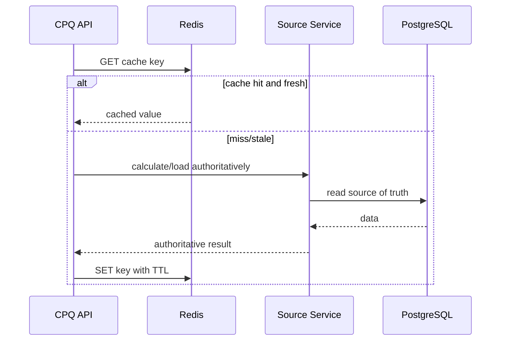

# Part 056 — Redis Operations for CPQ/OMS

> Redis di CPQ/OMS harus diperlakukan sebagai **speed layer with explicit correctness boundaries**. Redis boleh mempercepat catalog lookup, price preview, idempotency fast-path, rate limit, dan ephemeral coordination. Redis tidak boleh menjadi tempat diam-diam menyimpan kebenaran bisnis yang tidak bisa dipulihkan.

Part ini membahas operasi Redis untuk CPQ/OMS production: memory limit, eviction, TTL, key design, hot key, latency, persistence, replication/cluster, failover, monitoring, cache invalidation, runbook incident, dan production readiness.

Referensi faktual: Redis mendokumentasikan key eviction sebagai mekanisme untuk menghapus key otomatis saat cache melewati batas memory, latency monitoring untuk membantu troubleshooting latency, serta Redis Cluster sebagai topologi horizontal scaling dengan karakteristik availability/consistency yang harus dipahami operator.  
References: https://redis.io/docs/latest/develop/reference/eviction/ ; https://redis.io/docs/latest/operate/oss_and_stack/management/optimization/latency-monitor/ ; https://redis.io/docs/latest/operate/oss_and_stack/management/scaling/

---

## 1. Redis Role in CPQ/OMS

Redis bukan satu hal. Dalam CPQ/OMS, Redis bisa dipakai untuk beberapa role berbeda:

| Role | Example | Authority? | Durability Needed? |
|---|---|---:|---:|
| Catalog cache | product offering by id/version | No | No |
| Price preview cache | calculated price preview | No | No |
| Quote workspace cache | UI composition snapshot | No | Usually no |
| Idempotency fast-path | recently seen command key | Not alone | Maybe backing DB required |
| Rate limit | API throttling per tenant/user | No | No/low |
| Distributed lock | short critical section guard | No | No, but correctness risky |
| Pub/Sub notification | local invalidation fanout | No | No |
| Stream buffer | operational mini-stream | Usually no | Depends, but Kafka preferred for durable facts |
| Session store | user session/token metadata | No business authority | Depends on auth model |

Rule utama:

> Jika kehilangan Redis membuat quote/order/approval/fulfillment truth hilang, desainnya salah.

Redis boleh hilang lalu sistem tetap bisa recover dari PostgreSQL/Kafka/source of truth.

---

## 2. Operating Invariants

### 2.1 Redis Is Reconstructable

Setiap key Redis harus punya jawaban:

- Dari mana key ini dibangun ulang?
- Siapa owner-nya?
- Apa TTL-nya?
- Apa invalidation event-nya?
- Apa behavior jika key missing?
- Apa behavior jika value stale?

Kalau tidak ada jawaban, key itu kemungkinan hidden database.

### 2.2 TTL Is a Contract

TTL bukan angka random. TTL adalah staleness budget.

| Data | TTL Guideline | Reason |
|---|---:|---|
| Catalog offering by published version | long TTL | immutable by version |
| Current active catalog pointer | short TTL | can change on publication |
| Price preview | short TTL | depends on catalog/pricing/policy/customer context |
| Approval eligibility cache | very short TTL | authority-sensitive |
| Idempotency fast-path | equal/greater than retry window | prevent duplicate command burst |
| Rate limit bucket | window-based | part of rate policy |
| Worklist projection cache | short TTL or event invalidated | human ops freshness |

TTL harus terdokumentasi sebagai keputusan domain.

### 2.3 Eviction Must Not Break Correctness

Redis eviction bisa menghapus key ketika memory penuh. Karena itu, aplikasi harus menganggap cache miss sebagai normal behavior.

Bad:

```java
PriceResult cached = redis.get(key);
if (cached == null) {
    throw new IllegalStateException("Price missing");
}
```

Better:

```java
PriceResult cached = redis.get(key);
if (cached != null && cached.isFreshFor(commandContext)) {
    return cached;
}
return pricingService.calculateAuthoritatively(commandContext);
```

### 2.4 No Silent Cross-Tenant Keys

Every key must include tenant scope unless data is truly global and safe.

Good:

```text
cpq:{tenant-acme}:catalog:{catalog-v2026-07}:offering:{offering-123}
cpq:{tenant-acme}:quote-preview:{quote-781}:rev:{3}
cpq:{tenant-acme}:rate-limit:user:{user-41}:create-quote
```

Bad:

```text
catalog:offering-123
quote:781
rate-limit:user-41
```

---

## 3. Keyspace Design

Keyspace design is operational architecture.

### 3.1 Key Naming Template

```text
<system>:{tenant}:<capability>:<resource>:<id>[:<version>][:<purpose>]
```

Examples:

```text
cpq:{tenant-acme}:catalog:offering:off-100:catalog-v2026-07
cpq:{tenant-acme}:pricing:preview:quote-q100:rev-3:policy-v2026-07
cpq:{tenant-acme}:idempotency:create-order:key-9f2a
cpq:{tenant-acme}:rate:user-user41:create-quote:20260702T1000
cpq:{tenant-acme}:lock:quote-q100:submit
cpq:{tenant-acme}:projection:quote-summary:q100
```

Curly braces can be used deliberately in Redis Cluster hash tags, but do not overuse them blindly. Hash tag choice affects key distribution.

### 3.2 Key Metadata Registry

For production CPQ/OMS, maintain key registry:

```yaml
keyPattern: cpq:{tenant}:pricing:preview:{quoteId}:rev-{revision}:policy-{policyVersion}
owner: pricing-service
purpose: cache calculated price preview for UI responsiveness
authority: false
sourceOfRebuild: pricing-service + PostgreSQL quote snapshot + pricing policy
ttl: 5 minutes
containsPII: false
containsCommerciallySensitiveData: true
invalidation:
  - QuoteChanged
  - PricingPolicyPublished
  - CatalogPublished
failureBehavior: recalculate synchronously or return stale-warning depending endpoint
maxExpectedCardinality: 500000
```

Tanpa registry, Redis akan menjadi tempat key orphan yang tidak ada yang berani hapus.

### 3.3 Cardinality Budget

Sebelum key pattern dipakai, hitung cardinality.

```text
expected_keys = tenant_count * active_quotes_per_tenant * revisions_per_quote * cached_views_per_revision
```

Contoh:

```text
tenant_count = 200
active_quotes_per_tenant = 10_000
revisions_per_quote = 4
cached_views = 3
expected_keys = 24_000_000
```

Kalau average serialized value 4 KB:

```text
24_000_000 * 4 KB = ~96 GB raw payload
```

Belum overhead Redis. Artinya key pattern ini tidak boleh dibuat tanpa TTL pendek, selective caching, compression decision, atau cache admission policy.

---

## 4. Memory and Eviction Operations

### 4.1 Memory Is a Product Constraint

Redis memory penuh bukan “infra problem” saja. Itu bisa membuat:

- catalog cache miss storm,
- price preview latency naik,
- idempotency fast-path hilang,
- rate limit kurang akurat,
- session invalidation,
- hot key pressure,
- downstream PostgreSQL load spike.

### 4.2 Required Metrics

Monitor:

- used memory,
- max memory,
- memory fragmentation ratio,
- evicted keys,
- expired keys,
- keyspace hits/misses,
- commands/sec,
- connected clients,
- blocked clients,
- instantaneous input/output kbps,
- slowlog count,
- latency spikes,
- per-db/keyspace key count,
- big keys,
- hot keys if supported.

### 4.3 Eviction Policy Decision

Redis supports different eviction policies. The right policy depends on whether Redis is used as cache only or mixed workload.

General CPQ/OMS guidance:

| Workload | Policy Direction | Notes |
|---|---|---|
| Pure cache | LRU/LFU-style can be acceptable | app must tolerate miss |
| Cache + idempotency fast-path | avoid evicting idempotency unexpectedly | separate Redis logical/cluster if needed |
| Rate limit | eviction can weaken enforcement | use small bounded keyspace, TTL strict |
| Locks | eviction of lock key is dangerous | locks must have short TTL and be non-authoritative |
| Session | eviction can log users out | capacity must match session policy |

Important:

> Jangan campur semua workload Redis dalam satu memory pool tanpa memahami eviction impact antar-workload.

Jika price preview cache menghabiskan memory lalu idempotency keys tergusur, sistem bisa menerima duplicate command.

### 4.4 Workload Separation

Possible separation:

```text
Redis Cluster A: catalog + price cache
Redis Cluster B: idempotency + rate limit
Redis Cluster C: session store
Redis Cluster D: ephemeral locks / operational coordination
```

Atau minimal separate DB/logical namespace, tetapi Redis Cluster hanya mendukung DB 0. Dalam cluster topology, separation sering berarti separate cluster atau separate deployment.

---

## 5. TTL Discipline

### 5.1 TTL Anti-Patterns

Bad:

- no TTL on cache key,
- all TTL = 24 hours,
- TTL based on developer feeling,
- TTL longer than underlying business validity,
- TTL not tested,
- no dashboard for keys without TTL,
- no owner for key pattern.

### 5.2 TTL by Business Validity

Examples:

| Key | TTL Reasoning |
|---|---|
| Published catalog offering by version | long because version immutable |
| Active catalog pointer | short because publication can switch active version |
| Customer eligibility result | short because customer/account status may change |
| Price preview | short because manual override, policy, tax, catalog, quote line can change |
| Submit quote idempotency key | at least API retry window + client retry max |
| Create order idempotency key | long enough to survive retries and client uncertainty |
| Lock key | very short, bounded by critical section |
| Rate bucket | exact policy window |

### 5.3 Expiration Jitter

If many keys expire at the same time, cache stampede occurs.

Add jitter:

```java
Duration ttlWithJitter(Duration base) {
    long jitterSeconds = ThreadLocalRandom.current().nextLong(0, 60);
    return base.plusSeconds(jitterSeconds);
}
```

For high-volume keys, use soft TTL + async refresh.

### 5.4 Soft TTL Pattern

Value contains freshness metadata:

```json
{
  "value": { },
  "generatedAt": "2026-07-02T10:00:00Z",
  "softExpiresAt": "2026-07-02T10:02:00Z",
  "hardExpiresAt": "2026-07-02T10:10:00Z",
  "sourceVersion": "pricing-policy:2026.07.02"
}
```

Behavior:

- before soft expiry: use value,
- after soft expiry but before hard expiry: serve if acceptable and refresh async,
- after hard expiry: recompute synchronously or fail with clear semantics.

For final quote acceptance or order submission, do not use stale cached price as authority.

---

## 6. Cache Correctness Patterns

### 6.1 Cache-Aside



Cache-aside is simple but requires clear miss behavior.

### 6.2 Versioned Cache Keys

Instead of deleting every old key, include version in key.

```text
cpq:{tenant}:catalog:offering:{offeringId}:catalog-v2026-07
cpq:{tenant}:pricing:preview:{quoteId}:rev-3:pricing-v2026-07-02
```

When new catalog/pricing version is published, new keys are used. Old keys expire naturally.

This avoids unreliable global delete storms.

### 6.3 Event-Driven Invalidation

Events that may invalidate Redis:

- `CatalogPublished`
- `PricingPolicyPublished`
- `QuoteChanged`
- `QuoteSubmitted`
- `QuoteApproved`
- `QuoteExpired`
- `CustomerEligibilityChanged`
- `TenantConfigChanged`

Invalidation consumer must be idempotent.

### 6.4 Stale-While-Revalidate

Good for UI preview:

- show cached preview with freshness indicator,
- trigger refresh,
- update UI when fresh result arrives.

Not acceptable for:

- final price commit,
- quote approval decision,
- order submission validation,
- contractual document generation,
- payment/billing handoff.

---

## 7. Hot Key Operations

Hot key adalah key yang menerima traffic tidak proporsional.

### 7.1 CPQ/OMS Hot Key Examples

- active catalog pointer for large tenant,
- most popular product offering,
- default pricing policy,
- global tenant config,
- rate limit key for integration client,
- quote workspace used by many collaborators,
- lock key for mass renewal job,
- dashboard summary key.

### 7.2 Symptoms

- Redis CPU high while memory ok,
- one shard overloaded,
- p99 GET latency high,
- network IO concentrated,
- app latency spikes on same endpoint,
- Redis slowlog shows repeated key access,
- cluster slot imbalance.

### 7.3 Fix Patterns

| Cause | Fix |
|---|---|
| One global key | shard by tenant/segment/version |
| Large value | split value, reduce payload, compress carefully |
| High read frequency | local in-process cache with short TTL |
| Expensive recompute on miss | stampede protection, single-flight |
| Rate limit hot key | hierarchical rate limit or token bucket per client+route |
| Dashboard aggregate | precompute projection in DB, not Redis-only |

### 7.4 Single-Flight Pattern

Prevent many threads recomputing same missing key.

```java
public PricePreview getOrCompute(CacheKey key) {
    PricePreview cached = redis.get(key);
    if (cached != null && cached.isFresh()) return cached;

    return singleFlight.doOnce(key.toString(), () -> {
        PricePreview again = redis.get(key);
        if (again != null && again.isFresh()) return again;

        PricePreview computed = pricingEngine.preview(key.context());
        redis.set(key, computed, ttlWithJitter(Duration.ofMinutes(5)));
        return computed;
    });
}
```

Distributed single-flight using Redis lock must be treated carefully; lock loss must not corrupt authority.

---

## 8. Redis Locks: Use with Suspicion

Redis locks are often overused.

### 8.1 Valid Uses

Acceptable:

- prevent duplicate expensive recompute,
- serialize non-critical background refresh,
- reduce thundering herd,
- protect operational job from concurrent execution when failure is tolerable,
- short-lived UI command guard backed by DB invariant.

Not acceptable as only protection for:

- quote accepted once,
- order created once,
- approval applied once,
- payment captured once,
- fulfillment step completed once,
- inventory reservation authority.

Those need database constraints/idempotency/domain state.

### 8.2 Lock Pattern

```text
SET lock-key token NX PX 5000
```

Release only if token matches.

Pseudo-Lua:

```lua
if redis.call("GET", KEYS[1]) == ARGV[1] then
  return redis.call("DEL", KEYS[1])
else
  return 0
end
```

Even then, lock expiry, GC pause, network pause, failover, and clock assumptions can break reasoning. Use lock to reduce contention, not to define correctness.

### 8.3 Correctness Stack

For `submitQuote`:

1. Redis lock may reduce duplicate work.
2. PostgreSQL optimistic lock checks quote version.
3. Domain invariant checks allowed transition.
4. Idempotency table prevents duplicate command result.
5. Unique constraint prevents duplicate order creation.
6. Audit records decision.

Redis is layer 1, not layer 6.

---

## 9. Latency Operations

### 9.1 Redis Latency Causes

- big keys,
- slow commands,
- high connection churn,
- network latency,
- CPU saturation,
- fork/persistence overhead,
- eviction pressure,
- hot shard,
- blocked client,
- Lua script running too long,
- cluster redirection overhead,
- DNS/connection pool issue in app.

### 9.2 Latency Metrics

Track:

- command latency p50/p95/p99,
- per-command latency,
- Redis latency monitor events,
- slowlog entries,
- network RTT from app pods,
- connection pool wait time,
- timeout count,
- retry count,
- command rate,
- payload size,
- big key scan result.

### 9.3 Avoid Dangerous Commands in Production Path

Avoid or strictly control:

- `KEYS *`,
- large `HGETALL`,
- large `LRANGE`,
- blocking scripts,
- huge multi-key operations across cluster slots,
- scanning without cursor discipline,
- unbounded pub/sub fanout,
- unbounded stream length.

Use `SCAN` carefully for operational tasks, not hot request path.

---

## 10. Persistence and Recovery

Redis persistence choice depends on role.

### 10.1 Cache-Only Redis

If Redis only caches reconstructable data:

- persistence can be optional,
- cold start miss storm must be handled,
- warmup strategy may be needed,
- source systems must absorb recompute load,
- TTL and cache admission matter.

### 10.2 Idempotency/Rate Limit Redis

If Redis stores idempotency fast-path:

- source of truth should still be PostgreSQL for critical commands,
- Redis can accelerate duplicate detection,
- Redis loss may increase DB load but must not allow duplicate business effect,
- TTL must match retry window.

### 10.3 Session Redis

If Redis stores sessions:

- persistence/failover affects user experience,
- session invalidation policy must be explicit,
- session is not CPQ authority,
- auth server/token introspection strategy matters.

### 10.4 Streams in Redis

Redis Streams can be useful for small internal streams, but for CPQ/OMS durable integration/event backbone, Kafka remains the better authority in this series.

Use Redis Streams only when:

- scope is local/operational,
- data loss/replay semantics are acceptable,
- consumer group lifecycle is operationally owned,
- message retention is bounded,
- no cross-enterprise event governance is required.

Do not introduce Redis Streams as a second Kafka without governance.

---

## 11. Redis Cluster and Failover

### 11.1 Cluster Awareness

Redis Cluster shards keys across hash slots. Multi-key operations require keys in same slot or compatible hash tags.

Implication:

- key naming affects distribution,
- using `{tenant}` as hash tag puts all tenant keys in same slot group and can create hot tenant shard,
- using too broad hash tag can destroy distribution,
- multi-key atomic operations across tenants/resources become hard.

### 11.2 Failover Behavior

During failover:

- writes may fail briefly,
- clients may receive MOVED/ASK redirection,
- connection pools may churn,
- cached data may be lost depending topology/persistence,
- locks may become unsafe,
- latency may spike,
- application retry can amplify load.

Application behavior must be explicit:

| Endpoint | Redis Down Behavior |
|---|---|
| View catalog | fallback to DB/service, slower |
| Preview price | recompute, maybe degrade if pricing source overloaded |
| Submit quote | continue with DB authority, skip Redis fast-path |
| Create order | continue if DB idempotency available |
| Rate limit | choose fail-open or fail-closed per API risk |
| Worklist view | query projection DB, maybe slower |
| Admin operation | often fail-closed |

### 11.3 Fail-Open vs Fail-Closed

| Use Case | Suggested Behavior |
|---|---|
| Catalog cache miss | fail-open to source |
| Price preview cache | fail-open to compute, with rate protection |
| Final quote acceptance | fail-open Redis, DB authority required |
| Payment-related idempotency | fail-closed if DB idempotency unavailable, not if only Redis unavailable |
| Rate limit public API | often fail-closed or degraded strict policy |
| Internal low-risk read | fail-open |
| Admin/security control | fail-closed |

---

## 12. Redis and PostgreSQL/Kafka/Camunda Boundary

### 12.1 PostgreSQL Boundary

PostgreSQL owns:

- quote state,
- order state,
- approval decision,
- price result committed to quote,
- idempotency authority,
- audit record,
- workflow correlation record,
- outbox.

Redis may cache or accelerate, but cannot replace these.

### 12.2 Kafka Boundary

Kafka owns durable business event stream. Redis Pub/Sub can be used for local cache invalidation, but Pub/Sub is not durable business event storage.

Pattern:

```text
Domain DB commit -> Outbox -> Kafka event -> Redis invalidation consumer -> delete/version cache keys
```

Do not rely on Redis Pub/Sub as sole invalidation for business-critical state. If invalidation message is missed, TTL/versioned key must still protect correctness.

### 12.3 Camunda Boundary

Camunda owns workflow runtime. Redis should not store workflow state.

Possible Redis uses:

- cache task summary read model,
- rate limit task action API,
- short-lived UI collaboration state,
- external task worker dedupe fast-path backed by DB.

Do not store process variables or task ownership only in Redis.

---

## 13. Operational Dashboards

### 13.1 Redis Platform Dashboard

- instance/cluster health,
- memory used vs max,
- memory fragmentation,
- eviction count,
- expiration count,
- ops/sec,
- connected clients,
- blocked clients,
- command latency,
- slowlog entries,
- network IO,
- replication lag,
- cluster slot health,
- failover events.

### 13.2 CPQ Cache Dashboard

| Metric | Why It Matters |
|---|---|
| catalog cache hit ratio | catalog latency/load |
| price preview hit ratio | UI responsiveness |
| price preview stale serve count | user-facing freshness risk |
| idempotency fast-path hit count | duplicate command behavior |
| keys without TTL count | memory leak risk |
| evicted keys by pattern | correctness/performance risk |
| hot key candidates | shard/CPU risk |
| cache rebuild load | downstream PostgreSQL/service risk |

### 13.3 Business Impact Dashboard

Translate Redis metrics into business language:

```text
Redis cache hit ratio dropped from 92% to 40% for catalog offering lookup.
Pricing preview p95 increased from 180ms to 1.7s.
Quote submission remains correct because final pricing uses PostgreSQL authority.
```

This is better than:

```text
Redis CPU high.
```

---

## 14. Incident Playbooks

### 14.1 Incident: Redis Memory Near Limit

Symptoms:

- memory > 85–90%,
- eviction increasing,
- cache hit ratio dropping,
- app latency rising,
- PostgreSQL read load rising.

Triage:

1. Identify top key patterns by cardinality.
2. Check recent deploy/new key pattern.
3. Check keys without TTL.
4. Check big keys.
5. Check eviction policy.
6. Check tenant/campaign spike.
7. Check whether idempotency/rate limit keys are being evicted.

Actions:

- Reduce TTL for non-critical caches.
- Disable/adapt cache admission for large keys.
- Scale memory/cluster if valid growth.
- Split workload if cache evicts critical ephemeral keys.
- Patch leaking key pattern.
- Warm or rebuild selectively after stabilization.

### 14.2 Incident: Cache Stampede

Symptoms:

- sudden miss spike,
- Redis hit ratio drops,
- PostgreSQL/pricing service load spikes,
- API latency rises,
- many keys expire simultaneously.

Triage:

- common TTL expiration?
- deployment flushed keys?
- catalog publication invalidated broad keys?
- Redis restart/failover?
- hot key expired?

Actions:

- Enable jitter.
- Add single-flight.
- Add soft TTL.
- Rate-limit recompute.
- Use versioned keys instead of mass delete.
- Warm top keys for critical tenant if appropriate.

### 14.3 Incident: Hot Key / Hot Shard

Symptoms:

- one shard CPU high,
- p99 Redis latency high,
- ops concentrated on one key/slot,
- app endpoints using same cached resource slow.

Triage:

- identify hot key,
- identify endpoint/tenant,
- inspect key hash tag,
- inspect value size,
- check invalidation loop,
- check local cache disabled?

Actions:

- shard key by resource/version/segment,
- add local cache for immutable data,
- reduce value size,
- split aggregate into smaller keys,
- remove broad hash tag,
- precompute in PostgreSQL projection if Redis is serving as dashboard DB.

### 14.4 Incident: Redis Down or Failover

Symptoms:

- connection errors,
- MOVED/ASK spikes,
- timeouts,
- API latency spike,
- cache miss storm after recovery.

Triage:

- cluster state,
- failover event,
- app retry storm,
- connection pool exhaustion,
- source DB overload due fallback,
- whether critical command path depends on Redis.

Actions:

- Ensure command path uses DB authority.
- Reduce retry amplification.
- Temporarily disable non-critical cache recompute.
- Protect PostgreSQL with rate/bulkhead.
- Warm critical immutable catalog keys gradually.
- Verify idempotency DB prevents duplicates.

Communication:

```text
Impact: Redis cache cluster failover caused catalog/pricing preview latency increase.
Business correctness: quote submit/order create remain protected by PostgreSQL authority and idempotency table.
Current action: recompute throttled; top catalog keys warming gradually; monitoring DB read load.
```

### 14.5 Incident: Wrong Cached Price Shown

Symptoms:

- UI shows price inconsistent with final quote price,
- customer or salesperson reports discrepancy,
- approval threshold not matching preview.

Triage:

1. Inspect cache key includes quote revision?
2. Inspect pricing policy version in key/value.
3. Inspect catalog version in key/value.
4. Inspect invalidation event delivery.
5. Inspect TTL.
6. Compare authoritative pricing trace.
7. Check stale-while-revalidate logic.

Actions:

- Invalidate affected keys.
- Patch key versioning.
- Add freshness metadata.
- Ensure final quote pricing never trusts preview cache.
- Add regression test for cache key composition.

---

## 15. Operational Commands

Commands differ by environment, but runbook intent stays stable.

### 15.1 Check Memory

```bash
redis-cli INFO memory
```

Look for:

- `used_memory_human`,
- `maxmemory_human`,
- `mem_fragmentation_ratio`,
- allocator stats.

### 15.2 Check Stats

```bash
redis-cli INFO stats
```

Look for:

- `total_commands_processed`,
- `instantaneous_ops_per_sec`,
- `expired_keys`,
- `evicted_keys`,
- `keyspace_hits`,
- `keyspace_misses`.

### 15.3 Slowlog

```bash
redis-cli SLOWLOG GET 20
```

Investigate commands, keys, clients, duration.

### 15.4 Latency

```bash
redis-cli LATENCY LATEST
redis-cli LATENCY DOCTOR
```

Use as signal; correlate with app latency and infra metrics.

### 15.5 Big Keys

```bash
redis-cli --bigkeys
```

Run carefully. Do not run heavyweight scans casually on production during peak.

### 15.6 Scan by Pattern

```bash
redis-cli --scan --pattern 'cpq:{tenant-acme}:pricing:preview:*'
```

Use cursor-based scanning and operational windows. Never use `KEYS` on production hot path.

---

## 16. Redis Client Configuration for Java Services

This series does not mandate one client, but the operational requirements are stable.

### 16.1 Required Client Properties

- connection timeout,
- command timeout,
- bounded connection pool,
- retry policy with jitter,
- circuit breaker/bulkhead for Redis operations,
- topology refresh for cluster,
- metrics per command,
- serialization errors visible,
- no infinite blocking,
- graceful fallback behavior.

### 16.2 Timeout Budget

Redis must not consume entire API latency budget.

Example:

```text
GET /quote-workspace/{id} latency budget: 800ms
Redis cache lookup budget: 30ms p95, 80ms max before fallback
Pricing preview recompute budget: 500ms
Projection DB fallback budget: 250ms
Response assembly budget: 50ms
```

If Redis is slow, fallback or degrade. Do not let every request block for seconds waiting on cache.

### 16.3 Serialization Version

Cache payload must include version:

```json
{
  "cacheSchemaVersion": 2,
  "sourceVersion": "quote:q100:rev3",
  "generatedAt": "2026-07-02T10:00:00Z",
  "payload": { }
}
```

On unknown cache schema version, treat as miss.

---

## 17. Redis Testing Strategy

### 17.1 Integration Tests

Test with real Redis/Testcontainers where possible:

- key composition,
- TTL exists,
- TTL range includes jitter,
- stale metadata behavior,
- serialization compatibility,
- cache miss fallback,
- cache hit behavior,
- invalidation consumer,
- idempotency fast-path fallback to DB,
- lock release token safety,
- rate limit windows.

### 17.2 Failure Tests

Simulate:

- Redis unavailable,
- Redis timeout,
- Redis returns stale value,
- key evicted,
- serialization failure,
- connection pool exhausted,
- lock expires during operation,
- cache stampede,
- mass invalidation.

### 17.3 Production Drill

Run drills:

- restart Redis cache cluster,
- flush non-production cache and observe warmup,
- disable Redis for quote workspace,
- simulate hot key,
- simulate eviction spike,
- simulate Redis latency injection,
- verify final quote/order correctness unaffected.

---

## 18. Redis Security

Redis can contain commercially sensitive data.

Controls:

- TLS where supported/required,
- authentication/ACL,
- network isolation,
- no public exposure,
- separate credentials per service,
- key pattern restrictions where possible,
- encrypt sensitive value before storing if required,
- avoid storing secrets/credentials,
- avoid storing full customer PII if not necessary,
- audit admin operations,
- restrict dangerous commands.

### 18.1 Sensitive Data Policy

Do not cache blindly:

- full customer profile,
- full contract document,
- payment data,
- secrets,
- auth tokens without security model,
- raw approval justification if sensitive,
- large quote documents.

Cache minimal derived data with TTL and classification.

---

## 19. Production Readiness Checklist

Redis architecture:

- [ ] Every key pattern has owner.
- [ ] Every cache key has TTL unless explicitly justified.
- [ ] Key registry exists.
- [ ] Tenant included in key where required.
- [ ] Cardinality budget calculated.
- [ ] Memory limit configured.
- [ ] Eviction policy chosen intentionally.
- [ ] Workloads separated if eviction impact differs.
- [ ] Big key detection exists.
- [ ] Hot key detection exists.
- [ ] Cache hit/miss dashboard exists.
- [ ] Eviction alert exists.
- [ ] Slowlog/latency monitoring exists.
- [ ] Redis down behavior documented per endpoint.
- [ ] Stampede protection exists for expensive recompute.
- [ ] Versioned keys or invalidation strategy exists.
- [ ] Redis locks are not sole correctness guard.
- [ ] Idempotency authority stored in PostgreSQL for critical commands.
- [ ] Sensitive data classification exists.
- [ ] Security/network controls exist.
- [ ] Failover drill performed.
- [ ] Cold cache drill performed.

CPQ/OMS correctness:

- [ ] Final pricing does not trust preview cache.
- [ ] Quote acceptance does not depend on Redis lock only.
- [ ] Order creation idempotency survives Redis loss.
- [ ] Approval decision does not rely on stale entitlement cache.
- [ ] Workflow state not stored in Redis as authority.
- [ ] Redis Pub/Sub is not used as durable business event transport.
- [ ] Cache invalidation failure is bounded by TTL/versioning.
- [ ] Projection stale behavior is visible to users/operators.

---

## 20. Common Anti-Patterns

### Anti-Pattern 1: Redis as Hidden Database

Symptoms:

- no source of rebuild,
- no TTL,
- app fails if key missing,
- data not in PostgreSQL/Kafka,
- operators afraid to flush Redis.

Fix: move authority to PostgreSQL/domain service; Redis only caches.

### Anti-Pattern 2: One Redis for Everything

Price preview evicts idempotency keys. Session keys compete with catalog cache. Locks compete with dashboard data.

Fix: separate workloads or enforce memory/TTL/cardinality discipline.

### Anti-Pattern 3: TTL Copy-Paste

Every key gets `24h` TTL. Price preview stale. Approval stale. Catalog pointer stale.

Fix: TTL by business validity and staleness budget.

### Anti-Pattern 4: Mass Delete Invalidation

`SCAN` + delete millions of keys after catalog publish causes Redis/network spike.

Fix: versioned keys, pointer switching, gradual expiration.

### Anti-Pattern 5: Redis Lock as Business Correctness

Lock protects duplicate submit until failover/timeout/GC pause. Then duplicate order appears.

Fix: DB constraints, idempotency records, domain transition guards.

### Anti-Pattern 6: No Cold Cache Plan

Redis restarts. Every request recomputes price/catalog. PostgreSQL collapses.

Fix: bulkhead, warmup, cache admission, progressive rebuild, fallback throttling.

---

## 21. The Top 1% Lens

A basic engineer uses Redis to make things fast.

A strong engineer adds TTL and monitors hit rate.

A top-tier engineer asks:

- What is the authority if Redis loses this key?
- What business invariant breaks if this value is stale?
- What happens when eviction removes this key?
- What is the maximum key cardinality?
- What is the cold cache behavior?
- What is the hot key behavior?
- Is TTL derived from business validity or arbitrary?
- Can this cache be invalidated by version rather than mass delete?
- Does Redis failure create duplicate order/approval/payment?
- Does fallback overload PostgreSQL or pricing engine?
- Can operators explain business impact from Redis metrics?

Redis operations in enterprise CPQ/OMS is not about making everything fast. It is about making the right things fast **without moving business truth into an ephemeral layer**.

---

## 22. References

- Redis Key Eviction — https://redis.io/docs/latest/develop/reference/eviction/
- Redis Latency Monitoring — https://redis.io/docs/latest/operate/oss_and_stack/management/optimization/latency-monitor/
- Redis Cluster Scaling — https://redis.io/docs/latest/operate/oss_and_stack/management/scaling/
- Redis Cache-Aside — https://redis.io/docs/latest/develop/use-case-patterns/cache-aside/
- Redis Distributed Locks — https://redis.io/docs/latest/develop/clients/patterns/distributed-locks/
- Redis Persistence — https://redis.io/docs/latest/operate/oss_and_stack/management/persistence/
