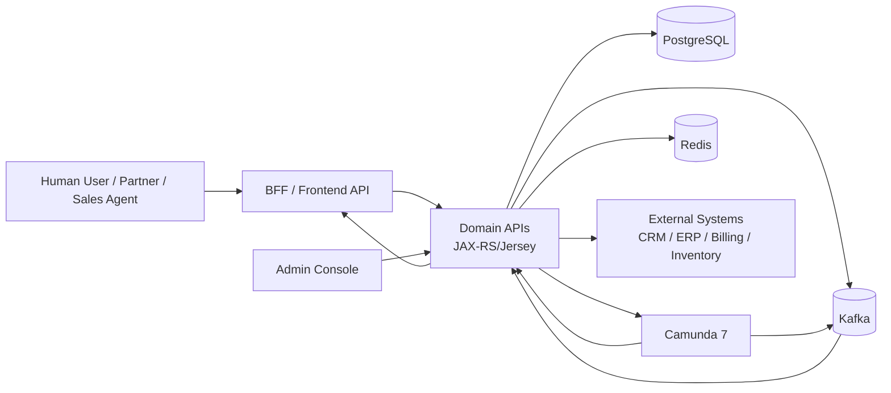
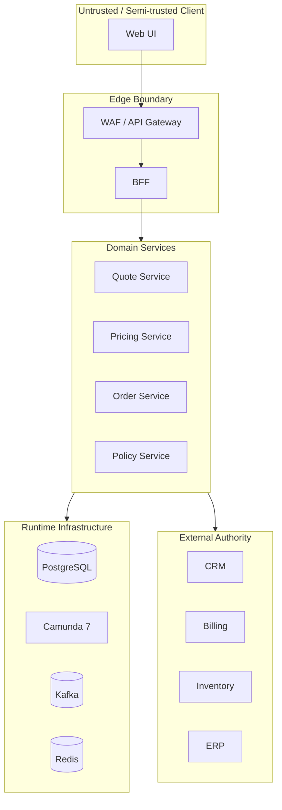
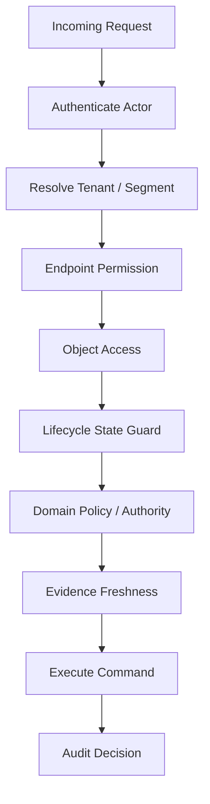
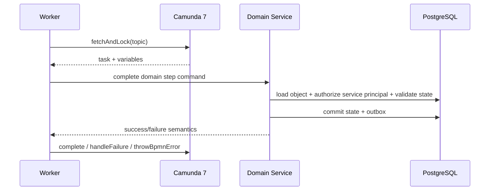
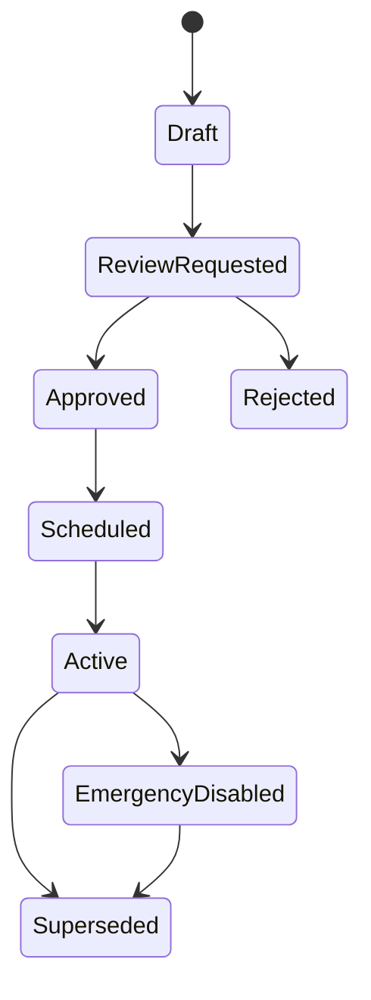

# Security Hardening and Threat Model

A CPQ/OMS platform is not merely a set of business APIs. It is a commercial authority surface.

It decides:

- who may see customer commercial terms,
- who may configure restricted products,
- who may override price,
- who may approve margin exceptions,
- who may submit binding orders,
- who may recover failed fulfillment,
- who may mutate operational controls,
- who may see evidence after the fact.

That means security cannot be added as a gateway rule after the domain has already been designed. In this kind of system, security is part of the domain model.

The dangerous failure is not only “attacker steals a token”. The more common enterprise failure is subtler:

> A legitimate user performs a business action they should not be allowed to perform on a legitimate object using a legitimate API.

For CPQ/OMS, that is enough to create regulatory exposure, revenue leakage, fulfillment error, audit gap, or customer breach.

This part builds the threat model and hardening strategy for our platform.

We will not repeat generic web security basics. The focus here is how security actually breaks inside a production-grade CPQ/OMS built with Java microservices, JAX-RS/Jersey, PostgreSQL, EclipseLink JPA, Camunda 7, Kafka, Redis, OpenAPI-first contracts, and schema-first events.

---

## 1. The Security Thesis

The security thesis for this platform is:

> Every business action must be authorized against actor, tenant, object, lifecycle state, authority scope, policy version, and evidence context before it changes system truth.

This is stricter than endpoint authorization.

Endpoint authorization says:

```text
User has QUOTE_APPROVER role -> may call POST /quotes/{id}/approve
```

Enterprise CPQ/OMS authorization says:

```text
User may approve this exact quote revision only if:
- user belongs to the same tenant or permitted enterprise segment,
- user has authority for this sales region/channel/customer class,
- user has approval limit for the required discount/margin/risk band,
- user did not create or last materially modify the quote,
- quote revision is still current,
- price result hash matches the approved price evidence,
- approval policy version has not invalidated this requirement,
- no stronger approval requirement is now pending,
- quote is in APPROVAL_PENDING,
- actor is not acting through a suspended/delegated identity outside allowed period.
```

That is not just security. That is domain correctness.

---

## 2. Threat Modeling Scope

We model threats across seven surfaces.



Security controls must cover:

1. **Human access**: sales user, approver, operations user, administrator, partner user.
2. **API access**: external API client, BFF, service-to-service calls, workflow workers.
3. **Object access**: quote, quote revision, order, customer, document, task, fallout case.
4. **Lifecycle actions**: edit, price, submit, approve, reject, accept, order, cancel, recover.
5. **Data storage**: PostgreSQL tables, object storage, logs, audit tables, Redis keys.
6. **Async flow**: Kafka events, outbox, inbox, DLQ, replay, workflow callbacks.
7. **Control plane**: config, catalog publish, rule deployment, BPMN/DMN deployment, tenant operation.

The mistake is to threat-model only the request path. In CPQ/OMS, many harmful transitions happen asynchronously.

---

## 3. Security Assets

A threat model starts with assets.

In this platform, the main assets are not just passwords or tokens.

| Asset | Why It Matters | Example Attack |
|---|---|---|
| Quote commercial terms | Price, margin, discount, negotiated commitments | Sales user views competitor/customer quote |
| Price trace | Explains why price was produced | Attacker manipulates trace to hide unauthorized discount |
| Approval decision | Grants authority to proceed | User reuses stale approval after quote changed |
| Order state | Fulfillment obligation | Duplicate submit creates unintended order |
| Product restriction | Eligibility/compliance control | User configures restricted product outside allowed segment |
| Workflow task | Operational decision point | User completes another group’s task |
| Document artifact | Customer-facing evidence | User downloads accepted proposal for another tenant |
| Audit trail | Defensibility record | Admin deletes/rewrites audit evidence |
| Event stream | Propagates business facts | Consumer trusts spoofed event or replayed event |
| Admin control plane | Changes system behavior | Operator changes approval policy without trace |

A mature design protects assets by meaning, not by storage location.

For example, quote price data exists in:

- `quote_revision`,
- `quote_line`,
- `price_result`,
- document render input,
- generated PDF,
- audit log,
- search projection,
- Kafka event,
- Redis cache,
- BFF response,
- logs and traces.

If only the database table is protected, the system is still leaking.

---

## 4. Threat Actor Model

Do not threat-model only anonymous external attackers.

Enterprise CPQ/OMS has many realistic attackers and failure actors.

| Actor | Capability | Realistic Threat |
|---|---|---|
| External attacker | No account or stolen token | API enumeration, token replay, injection, rate abuse |
| Partner user | Limited legitimate access | Horizontal access to another partner/customer quote |
| Sales user | Legitimate quote access | Unauthorized discount override, stale approval reuse |
| Approver | Approval authority | Approves self-created quote or outside authority scope |
| Operations user | Recovery authority | Manually completes fallout without evidence |
| Developer/operator | Runtime access | Reads production secrets or customer commercial data |
| Service account | Machine credentials | Over-permissioned service mutates domain state |
| Event producer | Kafka write access | Emits fake domain event or replays old event |
| Workflow worker | Camunda external task access | Completes task without domain validation |
| Admin | Control plane access | Changes policy/catalog/workflow without approval/audit |

The design goal is not to assume everyone is malicious. The design goal is to make unsafe behavior difficult, visible, and recoverable.

---

## 5. Trust Boundaries

A trust boundary exists wherever data crosses from one authority context to another.



Key trust boundaries:

1. **Browser to BFF**: user-supplied input, identity claims, request tampering.
2. **BFF to domain service**: frontend convenience must not become business authority.
3. **Service to service**: internal network is not a security boundary.
4. **Domain service to database**: application authorization must not be bypassable through broad DB users.
5. **Domain service to Camunda**: workflow state is not enough to authorize domain mutation.
6. **Kafka to consumer**: event authenticity and schema compatibility must be verified.
7. **Redis to service**: cache values are derived and may be stale or poisoned.
8. **Control plane to runtime**: admin operations can be more dangerous than customer operations.
9. **External systems to OMS**: callbacks and status updates can be duplicated, delayed, malicious, or wrong.

A strong rule:

> Crossing a trust boundary must trigger validation, authorization, correlation, and audit proportional to the operation risk.

---

## 6. STRIDE Applied to CPQ/OMS

STRIDE is useful if adapted to domain impact.

| STRIDE | CPQ/OMS Example | Control |
|---|---|---|
| Spoofing | Fake callback says inventory reservation succeeded | Signed callback, allowlist, nonce/correlation, reconciliation |
| Tampering | Client modifies quote line price in request | Server recomputation, price result hash, command schema validation |
| Repudiation | Approver denies approving margin exception | Append-only audit, actor snapshot, approval evidence hash |
| Information disclosure | Sales user accesses another tenant’s quote PDF | Object-level authz, signed short-lived URLs, tenant-aware storage |
| Denial of service | Quote pricing endpoint abused with huge config | rate limit, complexity limit, bulkhead, async job offload |
| Elevation of privilege | User with quote edit role completes approval task | task authz + domain policy authz + four-eyes rule |

The most important thing: every STRIDE category must be converted into testable controls.

Bad:

```text
Mitigate tampering.
```

Good:

```text
For SubmitQuoteCommand, server ignores all client-supplied calculated totals and uses stored PriceResultSnapshot identified by priceResultId and priceResultHash. If stored hash differs from command hash, return 409 PRICE_RESULT_STALE.
```

---

## 7. The Core Security Invariants

These invariants should appear in code, tests, audit, and architecture review.

### 7.1 Tenant Isolation Invariant

```text
No request, event, cache key, workflow instance, document, projection, or audit query may access data outside its resolved tenant or permitted enterprise segment.
```

This applies to:

- path parameters,
- body identifiers,
- query filters,
- Kafka event tenant id,
- Redis key namespace,
- Camunda tenant id/business key,
- document object key,
- search projection,
- audit query,
- admin operation scope.

### 7.2 Object-Level Authorization Invariant

```text
Every operation that uses a business object identifier supplied by a caller must prove that the actor has access to that exact object.
```

Do not rely on non-enumerable UUIDs. UUIDs reduce guessing. They do not prove authorization.

### 7.3 Lifecycle Authorization Invariant

```text
Permission to act depends on object state and revision, not only actor role.
```

Example:

- A user may edit a draft quote.
- The same user may not edit an accepted quote.
- An approver may approve `APPROVAL_PENDING` quote revision.
- The same approver may not approve `EXPIRED` or superseded revision.

### 7.4 Authority Scope Invariant

```text
Approval authority must be evaluated against the specific commercial risk of the quote revision.
```

Example authority dimensions:

- discount percentage,
- margin floor,
- total contract value,
- product family,
- channel,
- customer segment,
- geography,
- contract duration,
- special terms,
- manual override reason.

### 7.5 Four-Eyes Invariant

```text
A material commercial exception must not be approved solely by the same actor who created or materially changed it.
```

This is not a UI rule. It must be enforced in the domain command handler.

### 7.6 Evidence Freshness Invariant

```text
Approval, document generation, acceptance, and order submission must reference current evidence hashes.
```

Evidence includes:

- catalog version,
- configuration result hash,
- price result hash,
- approval requirement version,
- approval decision set,
- generated document hash,
- accepted artifact id.

### 7.7 No-Client-Calculated-Truth Invariant

```text
Client-supplied calculated values are hints at most; the server must verify or recompute business truth.
```

The client may send selected options. It must not send authoritative totals, discount approval status, or fulfillment readiness.

### 7.8 Recovery Authorization Invariant

```text
Manual recovery actions must be more constrained and more audited than normal happy-path actions.
```

Fallout recovery can override normal automation. Therefore it is high risk.

---

## 8. Authorization Model

Use layered authorization.



Each layer answers a different question.

| Layer | Question |
|---|---|
| Authentication | Who is the actor? |
| Tenant resolution | Which tenant/segment is this actor operating in? |
| Endpoint permission | Is actor allowed to attempt this kind of operation? |
| Object access | Is actor allowed to access this exact quote/order/task/document? |
| Lifecycle guard | Is the object in a state where the command is legal? |
| Domain policy | Does actor have authority for this commercial risk? |
| Evidence freshness | Is actor acting on current facts? |
| Audit | Can we prove why access was allowed/denied? |

The most common enterprise bug is stopping at endpoint permission.

---

## 9. JAX-RS/Jersey Hardening Pattern

JAX-RS filters are useful for cross-cutting security context, but not enough for domain authorization.

### 9.1 Request Filter Responsibilities

A request filter should handle:

- correlation id creation/validation,
- trace context propagation,
- token extraction,
- token validation result attachment,
- tenant header validation,
- request size guard,
- basic content type enforcement,
- security headers on response,
- audit context initialization.

It should not approve domain actions.

Example conceptual flow:

```java
@Provider
@Priority(Priorities.AUTHENTICATION)
public final class SecurityContextFilter implements ContainerRequestFilter {
  @Override
  public void filter(ContainerRequestContext request) {
    AuthenticatedActor actor = tokenVerifier.verify(request.getHeaderString("Authorization"));
    TenantContext tenant = tenantResolver.resolve(actor, request.getHeaders());
    CorrelationContext correlation = correlationResolver.resolve(request.getHeaders());

    request.setProperty("actor", actor);
    request.setProperty("tenant", tenant);
    request.setProperty("correlation", correlation);
  }
}
```

The command handler still performs object-level and policy-level authorization.

### 9.2 Resource Method Pattern

```java
@POST
@Path("/quotes/{quoteId}/revisions/{revision}/approve")
public Response approveQuote(
    @PathParam("quoteId") UUID quoteId,
    @PathParam("revision") long revision,
    ApproveQuoteRequest request,
    @Context SecurityContext securityContext) {

  ApproveQuoteCommand command = mapper.toCommand(
      quoteId,
      revision,
      request,
      RequestContexts.actor(),
      RequestContexts.tenant(),
      RequestContexts.correlation());

  ApproveQuoteResult result = quoteApplicationService.approve(command);
  return Response.ok(mapper.toResponse(result)).build();
}
```

Notice what is missing: no authorization shortcut in the resource. Resource methods should adapt HTTP to application commands.

### 9.3 Command Handler Pattern

```java
public ApproveQuoteResult approve(ApproveQuoteCommand command) {
  QuoteRevision quote = quoteRepository.getForUpdate(command.quoteId(), command.revision());

  authorizationService.assertCanApprove(
      command.actor(),
      command.tenant(),
      quote,
      command.expectedEvidenceHash());

  quote.approve(command.actor(), command.reason(), command.expectedEvidenceHash());

  quoteRepository.save(quote);
  auditRecorder.recordApproval(command, quote);
  outbox.publish(QuoteApprovedEvent.from(quote));

  return ApproveQuoteResult.from(quote);
}
```

Authorization lives where the full object, lifecycle, policy, and evidence context are available.

---

## 10. API Contract Hardening

OpenAPI-first design should encode security expectations.

### 10.1 Do Not Expose Overbroad Mutation Shapes

Bad:

```json
{
  "status": "APPROVED",
  "approvedBy": "user-123",
  "discountPercent": 35,
  "totalAmount": 1000
}
```

Good:

```json
{
  "decision": "APPROVE",
  "reasonCode": "STRATEGIC_ACCOUNT_EXCEPTION",
  "comment": "Approved within regional authority.",
  "expectedPriceResultHash": "sha256:...",
  "expectedApprovalRequirementHash": "sha256:..."
}
```

Commands describe intent. They do not allow clients to set derived truth.

### 10.2 Require Idempotency for Risky Commands

High-risk commands should require an idempotency key:

- submit quote,
- accept quote,
- create order from quote,
- cancel order,
- create amendment,
- complete fallout recovery,
- send customer document,
- trigger billing handoff.

Use both:

```text
Idempotency-Key: <client-generated-key>
If-Match: <revision/version/evidence-etag>
```

The first prevents duplicate side effects. The second prevents stale mutation.

### 10.3 Avoid Identifier Confusion

Do not accept ambiguous identifiers.

Bad:

```http
POST /approve
{
  "id": "123"
}
```

Good:

```http
POST /quotes/{quoteId}/revisions/{revision}/approval-decisions
```

The path communicates object type and lifecycle scope.

### 10.4 Standardize Authorization Errors

Do not leak object existence across tenants.

| Situation | Response |
|---|---|
| No token | 401 |
| Token invalid/expired | 401 |
| Authenticated but lacks endpoint permission | 403 |
| Object inaccessible or nonexistent from actor perspective | Usually 404 |
| Object visible but action not allowed by lifecycle/policy | 409 or 403 depending semantics |
| Evidence stale | 409 |

A common safe pattern:

- use `404` when revealing existence would leak another tenant’s object,
- use `403` when object visibility is already allowed but action authority is missing,
- use `409` when state/evidence conflict prevents command.

---

## 11. PostgreSQL Hardening

Application authorization is primary, but database design should limit blast radius.

### 11.1 Separate Database Roles

Do not run every service with a superuser or schema-owner role.

Use separate roles:

```text
quote_app_rw
quote_migration_owner
quote_readonly_reporting
quote_outbox_publisher
quote_admin_limited
```

Runtime app roles should not be able to:

- drop tables,
- alter schema,
- disable triggers,
- read unrelated service schemas,
- write audit tables directly unless through controlled functions/table permissions,
- mutate migration metadata.

### 11.2 Tenant-Aware Constraints

If using shared-table tenancy, make tenant part of uniqueness and access patterns.

Example:

```sql
create table quote_revision (
  tenant_id uuid not null,
  quote_id uuid not null,
  revision_no bigint not null,
  status text not null,
  version bigint not null,
  primary key (tenant_id, quote_id, revision_no)
);
```

This makes accidental cross-tenant joins harder to write.

### 11.3 Tenant-Aware Foreign Keys

```sql
create table quote_line (
  tenant_id uuid not null,
  quote_id uuid not null,
  revision_no bigint not null,
  line_id uuid not null,
  primary key (tenant_id, quote_id, revision_no, line_id),
  foreign key (tenant_id, quote_id, revision_no)
    references quote_revision (tenant_id, quote_id, revision_no)
);
```

A foreign key that ignores tenant can accidentally connect data across tenant boundaries.

### 11.4 Audit Table Protection

Audit tables should be append-only from application perspective.

Options:

- no update/delete grants for app role,
- append-only table design,
- database trigger preventing mutation,
- periodic hash chain anchoring,
- immutable object storage export for long-term evidence,
- separation between operational log and audit evidence.

### 11.5 Sensitive Field Handling

Classify fields.

| Field Type | Example | Handling |
|---|---|---|
| Public-ish operational | order status | normal access-controlled storage |
| Commercial sensitive | discount, margin, price trace | strict object authz, limited projection, careful logging |
| Personal data | contact, address | minimization, masking, retention policy |
| Secret | token, credential | never in DB except secret store reference |
| Evidence hash | artifact hash, decision hash | immutable, non-secret, auditable |

Never log margin, raw token, full document URL, or secret values.

---

## 12. EclipseLink/JPA Hardening

ORM does not remove security concerns. It can hide them.

### 12.1 Repository Must Require Tenant Context

Bad:

```java
QuoteRevision findById(UUID quoteId, long revision);
```

Good:

```java
QuoteRevision getByTenantAndId(TenantId tenantId, QuoteId quoteId, RevisionNo revision);
```

Make unsafe repository methods impossible or visibly internal.

### 12.2 Avoid Lazy Authorization Bugs

A lazy association may be loaded after authorization code has already run.

Example bug:

```java
QuoteRevision quote = repository.get(command.quoteId());
authz.assertCanView(actor, quote);
return mapper.toResponse(quote); // mapper lazily loads sensitive price trace
```

Fix:

- response mapper must be explicit,
- sensitive associations require authorization-aware fetch,
- use projection/read model for view APIs,
- never expose entity graph directly.

### 12.3 Avoid Mass Assignment

Generated DTOs must never map directly into entities.

Bad:

```java
entityManager.merge(requestBodyMappedEntity);
```

Good:

```java
quote.applyDiscountOverride(actor, reason, requestedOverride, policyDecision);
```

Domain methods enforce invariants.

### 12.4 Versioned Writes

All business-critical aggregate roots need optimistic versioning:

- `QuoteRevision.version`,
- `Order.version`,
- `FalloutCase.version`,
- `ApprovalTask.version`,
- `ControlPlaneConfig.version`.

A lost update in CPQ/OMS is often a security bug because it can bypass review or stale evidence detection.

---

## 13. Camunda 7 Hardening

Camunda 7 introduces a separate runtime surface. Treat it as a high-privilege orchestration system.

### 13.1 Do Not Expose Raw Camunda REST Broadly

Raw Camunda REST APIs can manipulate:

- process instances,
- variables,
- tasks,
- incidents,
- jobs,
- deployments,
- process definitions.

Expose domain-safe APIs instead.

Bad:

```text
Frontend calls Camunda task complete endpoint directly.
```

Good:

```text
Frontend calls CPQ BFF -> Domain task API -> domain authorization -> Camunda task completion.
```

### 13.2 Process Variables Are Not a Secure Database

Avoid storing sensitive commercial details in Camunda variables.

Store references and evidence hashes instead:

```json
{
  "tenantId": "tenant-123",
  "quoteId": "quote-456",
  "revisionNo": 7,
  "priceResultHash": "sha256:...",
  "approvalRequirementHash": "sha256:..."
}
```

Do not store:

- full price trace,
- margin details,
- customer personal details,
- raw tokens,
- generated document content.

### 13.3 External Task Worker Must Reauthorize

A worker fetching a task does not mean it is allowed to mutate domain state.

Worker flow:



The domain service remains the authority.

### 13.4 Task Completion Must Be Domain-Mediated

For human tasks:

- user must be allowed to see the task,
- user must be allowed to claim/complete it,
- task must correspond to current object state,
- completion payload must be validated,
- domain object must accept the decision,
- Camunda completion should happen after or as part of a safe orchestration pattern.

Raw task ownership is not enough.

### 13.5 Deployment Governance

BPMN/DMN deployment changes business behavior.

Require:

- code review,
- model validation,
- versioned deployment artifact,
- environment promotion,
- rollback/roll-forward plan,
- process instance migration decision,
- audit record of deployment.

A BPMN change can be as dangerous as a code change.

---

## 14. Kafka Hardening

Kafka is a business fact distribution surface. Protect it accordingly.

### 14.1 Event Authenticity

Consumers should not treat every event as valid domain truth without checking:

- topic ownership,
- schema version,
- producer identity,
- tenant id,
- aggregate id,
- event id,
- event time,
- event type,
- required evidence hashes,
- replay status if relevant.

### 14.2 Consumer Authorization

Internal consumers should have minimal topic access.

Bad:

```text
all-services can read all topics
all-services can write all topics
```

Good:

```text
quote-service writes quote.events
order-service reads quote.events and writes order.events
notification-service reads selected integration events only
reporting-service reads projection topics only
```

### 14.3 Event Payload Minimization

Do not publish everything.

Bad event:

```json
{
  "eventType": "QuoteApproved",
  "customerEmail": "...",
  "marginPercent": 41.2,
  "fullPriceTrace": {...},
  "approvalComment": "..."
}
```

Better event:

```json
{
  "eventId": "...",
  "eventType": "QuoteApproved",
  "tenantId": "...",
  "quoteId": "...",
  "revisionNo": 7,
  "approvalDecisionSetId": "...",
  "priceResultHash": "sha256:...",
  "occurredAt": "..."
}
```

Consumers that need sensitive details can call authorized APIs.

### 14.4 Replay Safety

Replay is powerful and dangerous.

Replay policy must define:

- who may trigger replay,
- which topic/partition/time range,
- which consumers are replay-safe,
- whether external side effects are disabled,
- how idempotency is verified,
- how replay is audited.

Never replay into a side-effecting notification or billing adapter without a replay mode.

---

## 15. Redis Hardening

Redis is often treated casually because it is “just cache”. That is unsafe.

### 15.1 Key Namespace Discipline

Use tenant and purpose in key names.

```text
cpq:{tenantId}:catalog:offering:{offeringId}:v:{catalogVersion}
cpq:{tenantId}:quote-preview:{quoteId}:{revision}:hash:{configHash}
cpq:{tenantId}:idem:{actorId}:{operation}:{idempotencyKey}
```

Do not use global keys for tenant-scoped data.

### 15.2 Do Not Store Secrets in Redis Unless Designed for It

Avoid storing:

- OAuth tokens,
- raw credentials,
- private document URLs,
- full price traces,
- full customer personal data.

If a session-like object must be stored, define:

- encryption policy,
- TTL,
- access control,
- eviction behavior,
- failover behavior,
- revocation semantics.

### 15.3 Cache Poisoning Prevention

Only trusted services should write business cache keys.

Cache value should include:

- schema version,
- tenant id,
- source version,
- produced at,
- TTL,
- evidence hash.

Consumers should reject cache entries that do not match expected tenant/version/evidence.

### 15.4 Lock Caveat

Do not use Redis lock as the only guard for critical business invariants.

Use database constraints and optimistic locking as final authority.

Redis lock may reduce contention. It must not be the only thing preventing duplicate order creation or unauthorized state transition.

---

## 16. Control Plane Hardening

Control plane changes behavior. Treat it as privileged software supply chain.

Control plane operations include:

- publish catalog,
- activate price book,
- deploy DMN approval policy,
- deploy BPMN process,
- change feature flag,
- update tenant segmentation,
- change retry policy,
- trigger replay,
- migrate process instances,
- execute recovery action,
- rotate integration credentials.

For high-risk operations require:

- maker-checker approval,
- explicit reason,
- dry-run/simulation,
- diff view,
- blast radius estimate,
- scheduled activation window,
- rollback/roll-forward plan,
- immutable audit.



Do not let production behavior be changed by an unaudited admin form.

---

## 17. Secrets and Credentials

Secrets are not configuration.

Secrets include:

- database passwords,
- Kafka credentials,
- Redis credentials,
- OAuth client secrets,
- external system API keys,
- signing keys,
- encryption keys,
- webhook shared secrets,
- object storage credentials.

Rules:

1. Never commit secrets.
2. Never place secrets in BPMN/DMN files.
3. Never log secrets.
4. Rotate secrets regularly and after incident.
5. Prefer short-lived credentials where possible.
6. Separate credentials by service and environment.
7. Make secret access auditable.
8. Avoid sharing one powerful integration account across services.

For local development, use fake local secrets that cannot access shared environments.

---

## 18. Secure Logging and Audit

Logs are for operation. Audit is for evidence. They overlap but are not the same.

### 18.1 Log What Helps Incident Response

Log:

- correlation id,
- actor id hash or internal id,
- tenant id,
- operation,
- object id,
- result,
- error code,
- latency,
- downstream dependency,
- Camunda process instance id/business key,
- Kafka topic/partition/offset where relevant.

Do not log:

- access tokens,
- passwords,
- raw personal data,
- full price trace,
- full approval comment if sensitive,
- private document URL,
- signing secret,
- card/payment details.

### 18.2 Audit Security Decisions

For denied high-risk operations, record:

- actor,
- tenant,
- operation,
- object reference if safe,
- reason code,
- policy version,
- decision time,
- correlation id.

Be careful not to create an audit side channel that reveals hidden object existence to unauthorized users.

---

## 19. Input Validation and Injection Defenses

Input validation is not only about SQL injection. It protects domain complexity.

### 19.1 Validate at Multiple Layers

| Layer | Validation |
|---|---|
| API schema | type, required fields, enum, max length, format |
| Application command | cross-field consistency, idempotency, expected version |
| Domain model | invariant enforcement |
| Persistence | constraints, FK, unique, check constraints |
| External adapter | response schema and semantic validation |

### 19.2 Complexity Limits

Configuration/pricing endpoints need complexity guards:

- max line count,
- max bundle depth,
- max option count,
- max attribute payload size,
- max rule evaluation count,
- max request body size,
- max search filters,
- max export rows.

A valid-looking request can still be a denial-of-service vector.

### 19.3 Query and Search Safety

For search APIs:

- whitelist sortable fields,
- parameterize SQL,
- avoid raw filter expression injection,
- cap page size,
- use stable pagination,
- enforce tenant filter server-side,
- avoid returning hidden fields in projections.

---

## 20. Supply Chain Hardening

This platform has a large dependency surface:

- Java runtime,
- Maven dependencies,
- Jersey/JAX-RS,
- EclipseLink,
- PostgreSQL driver,
- Kafka client,
- Redis client,
- Camunda 7 libraries,
- JSON Schema/OpenAPI tools,
- container images,
- CI actions/plugins,
- test tools,
- frontend dependencies,
- generated code.

Minimum controls:

- dependency pinning,
- vulnerability scanning,
- SBOM generation,
- license review,
- signed artifacts if available,
- container image scanning,
- reproducible build discipline where practical,
- restricted CI secrets,
- branch protection,
- mandatory review for generated code changes,
- provenance for BPMN/DMN and schema artifacts.

Do not treat generated code as inherently safe. Generated code is part of your attack surface.

---

## 21. Threat Scenarios

### 21.1 Horizontal Quote Access

**Scenario**: partner user changes quote id in URL and views another partner’s quote.

Weak design:

```text
GET /quotes/{quoteId}
checks only role QUOTE_VIEWER
```

Strong design:

```text
GET /quotes/{quoteId}
resolves actor tenant/segment
loads quote by tenant + quote id
checks relationship access
filters response fields by role
returns 404 if inaccessible
records denied access event if suspicious
```

Tests:

- same tenant allowed,
- different tenant denied,
- same enterprise parent but unauthorized segment denied,
- admin with scoped reason allowed,
- projection/search does not leak hidden quote.

### 21.2 Stale Approval Reuse

**Scenario**: quote approved at 10% discount, then modified to 30% discount, but old approval still allows acceptance.

Controls:

- approval references price result hash,
- quote modification invalidates approval decision set,
- acceptance requires current approval requirement hash,
- domain command rejects stale approval.

### 21.3 Workflow Task Hijack

**Scenario**: user completes Camunda task id they should not own.

Controls:

- do not expose raw task id completion,
- task API loads domain task projection by tenant/user,
- domain validates candidate group/assignee,
- domain validates quote/order state,
- Camunda completion uses internal service credential,
- audit records actor and decision.

### 21.4 Event Forgery

**Scenario**: unauthorized producer writes `OrderFulfilled` event to Kafka.

Controls:

- Kafka ACL restricts producer,
- event envelope validates producer identity/schema,
- consumer verifies expected state transition,
- domain service does not accept event as raw command without idempotency and authorization semantics,
- reconciliation catches impossible transition.

### 21.5 Admin Policy Abuse

**Scenario**: admin changes discount approval threshold to bypass approvals.

Controls:

- maker-checker for policy activation,
- diff and simulation required,
- scheduled activation,
- audit record,
- active policy version included in approval evidence,
- unusual policy change alert.

---

## 22. Security Test Matrix

| Area | Test |
|---|---|
| Tenant isolation | Cross-tenant quote/order/document/search access denied |
| Object authz | Actor cannot mutate object merely by knowing UUID |
| Lifecycle authz | Commands rejected in invalid state |
| Approval authority | Approver denied outside threshold/scope |
| Four-eyes | Creator cannot approve own material exception |
| Evidence freshness | Stale price/approval/document hash rejected |
| Idempotency | Duplicate submit/order/recovery does not duplicate side effect |
| Input validation | Oversized/invalid/deep config rejected |
| Injection | SQL/search/filter injection attempts rejected |
| Camunda task | Raw task hijack impossible through domain API |
| Kafka | Duplicate/replayed/out-of-order event safely handled |
| Redis | Cache poison/stale tenant mismatch rejected |
| Admin | High-risk config requires approval/audit |
| Logs | Tokens/secrets/margin details not logged |
| Audit | Security-sensitive decisions recorded |

The test suite should include negative authorization tests for every high-risk command.

---

## 23. Security Review Checklist

Before a feature ships, ask:

1. What business asset does this feature expose or mutate?
2. Which actor types can access it?
3. Which tenant/segment rules apply?
4. Which object-level authorization check exists?
5. Which lifecycle state guard exists?
6. Which policy/authority decision exists?
7. Which evidence hash/version is required?
8. What happens on stale request?
9. What happens on duplicate request?
10. What is audited?
11. What is logged?
12. What is explicitly not logged?
13. Does any event leak sensitive data?
14. Does any cache key/value cross tenant boundary?
15. Does any workflow variable contain sensitive data?
16. Can admin/control plane change this behavior?
17. How is that admin change reviewed and audited?
18. Can this feature be abused for denial of service?
19. What are the negative tests?
20. What is the incident playbook?

A feature is not enterprise-grade until these questions have concrete answers.

---

## 24. Anti-Patterns

### Anti-Pattern 1: Gateway-Only Security

The API gateway checks JWT and role, but domain services trust all internal calls.

Why it fails:

- compromised internal service becomes superuser,
- workflow worker can mutate anything,
- BFF bug becomes domain breach,
- object-level authorization is missing.

### Anti-Pattern 2: Role Explosion

Creating roles like:

```text
APPROVE_DISCOUNT_10
APPROVE_DISCOUNT_20
APPROVE_DISCOUNT_ENTERPRISE_NORTH_REGION_CHANNEL_A
```

Why it fails:

- roles become unmaintainable,
- policy logic hides in identity provider,
- evidence snapshot is weak,
- approval reason is not auditable.

Use role + policy decision + authority scope.

### Anti-Pattern 3: Raw Camunda Tasklist as Business UI

Letting users complete workflow tasks directly without domain checks.

Why it fails:

- task permission is not quote/order permission,
- stale task can mutate stale object,
- approval evidence may be incomplete,
- audit is fragmented.

### Anti-Pattern 4: Sensitive Data in Events

Publishing full quote/price/customer payload to many topics.

Why it fails:

- every consumer becomes regulated data processor,
- deletion/retention becomes hard,
- replay multiplies exposure,
- debugging tools leak data.

### Anti-Pattern 5: Admin Is Trusted

No maker-checker, no diff, no audit for policy/config changes.

Why it fails:

- accidental config breaks revenue,
- malicious config bypasses approval,
- no defensible record after incident.

---

## 25. Production Hardening Baseline

Minimum baseline:

- TLS everywhere practical.
- Strong token validation and expiry.
- Service-to-service authentication.
- Tenant context required in every command.
- Object-level authorization required for every object id.
- Domain policy authorization for high-risk actions.
- Optimistic locking and stale evidence detection.
- Idempotency for side-effecting commands.
- Secrets managed outside code/config repo.
- Separate DB roles per service and purpose.
- Kafka ACLs per producer/consumer.
- Redis authentication/network isolation/key namespace.
- No raw Camunda REST exposure to general users.
- Sensitive workflow variables avoided.
- Control plane maker-checker for risky changes.
- Append-only audit for critical decisions.
- Security-relevant logs without secrets.
- Negative authorization test suite.
- Incident playbooks for authz breach, event poisoning, control-plane misuse, and data leakage.

---

## 26. Mental Model

Think of CPQ/OMS security as five gates:

```text
identity -> tenant -> object -> lifecycle -> authority/evidence
```

A command is safe only after passing all five.

A system that checks only identity and role is not secure enough for enterprise CPQ/OMS.

A system that checks object access but not lifecycle allows stale or impossible business actions.

A system that checks lifecycle but not evidence allows old approvals, old prices, or old documents to be reused.

A system that checks evidence but not audit cannot defend itself after the fact.

The target is not paranoia. The target is controlled commercial authority.

---

## 27. References

- OWASP API Security Top 10 2023 — Broken Object Level Authorization: https://owasp.org/API-Security/editions/2023/en/0xa1-broken-object-level-authorization/
- OWASP Application Security Verification Standard: https://owasp.org/www-project-application-security-verification-standard/
- OWASP Authorization Cheat Sheet: https://cheatsheetseries.owasp.org/cheatsheets/Authorization_Cheat_Sheet.html
- OWASP Logging Cheat Sheet: https://cheatsheetseries.owasp.org/cheatsheets/Logging_Cheat_Sheet.html
- NIST SP 800-218 Secure Software Development Framework: https://csrc.nist.gov/pubs/sp/800/218/final
- Camunda 7 Security Instructions: https://docs.camunda.org/manual/latest/user-guide/security/
- Camunda 7 Multi-Tenancy: https://docs.camunda.org/manual/latest/user-guide/process-engine/multi-tenancy/
- Kafka Security Documentation: https://kafka.apache.org/documentation/#security
- Redis Security Documentation: https://redis.io/docs/latest/operate/oss_and_stack/management/security/
