# Enterprise Integration Patterns

A CPQ/OMS platform rarely lives alone.

It sits between systems that all believe they own part of the truth:

- CRM owns customer relationship and opportunity context.
- Product catalog owns sellable product definitions.
- Pricing owns commercial calculation and policy.
- Inventory owns availability and reservation facts.
- Billing owns billing accounts, invoices, charges, taxation, payment status, and receivables.
- ERP owns financial/back-office execution in many enterprises.
- Contract systems own signed legal commitments.
- Fulfillment systems own provisioning, shipping, activation, installation, or service delivery.
- Notification/document systems own customer-facing communication artifacts.
- Data warehouse owns analytics, not operational truth.

The integration problem is not “how do we call another API?”

The real problem is:

> How do we exchange facts and requests between systems without corrupting ownership, lifecycle, auditability, consistency, or recoverability?

This part builds the integration model for an enterprise CPQ/OMS platform.

We will not repeat generic Kafka, REST, or database fundamentals. The focus is integration structure: boundaries, contracts, anti-corruption layers, sync/async decisions, idempotency, reconciliation, and failure handling.

---

## 1. The Integration Thesis

The thesis:

> Every integration must declare authority, direction, contract, consistency expectation, failure semantics, idempotency rule, and reconciliation path.

If an integration does not declare those things, it is not production-grade.

Bad integration description:

```text
Order service integrates with billing.
```

Good integration description:

```text
Order service sends BillingActivationRequested after order line reaches BILLING_READY.
Billing system is authority for billing account, invoice, charge activation, and payment status.
OMS is authority for order lifecycle and billing handoff state.
The handoff is asynchronous via Kafka with outbox publication.
Each request has a business idempotency key: tenantId + orderId + orderLineId + billingHandoffAttemptNo.
Billing returns accepted/rejected/unknown through callback event.
OMS reconciles pending handoffs every 15 minutes.
Manual fallout is created after SLA breach or explicit rejection.
```

The second description can be built, tested, operated, audited, and repaired.

---

## 2. Integration Is Ownership Negotiation

Before choosing REST or Kafka, decide ownership.

| Business Concept | Likely Authority | CPQ/OMS Relationship |
|---|---|---|
| Customer master | CRM / Customer master | Reference and snapshot selected customer facts |
| Sales opportunity | CRM | Associate quote to opportunity, do not own opportunity lifecycle |
| Product offering | Catalog | Snapshot catalog version into quote/order |
| Product configuration | CPQ configuration service | Own selected configuration evidence |
| Price result | Pricing service | Own price evidence for quote revision |
| Quote | Quote service | Own commercial proposal lifecycle |
| Order | Order service | Own fulfillment obligation lifecycle |
| Inventory availability | Inventory service | Request/check/reserve, do not own inventory truth |
| Billing account | Billing/account system | Validate/reference, do not own billing account truth |
| Invoice | Billing system | Observe/reference, do not generate invoice truth unless explicitly in billing domain |
| Contract signature | Contract/document system | Request/sign/reference accepted artifact |
| Shipment/provisioning | Fulfillment system | Orchestrate/handoff/observe, do not fake completion |
| Audit evidence | CPQ/OMS audit service | Own CPQ/OMS decision evidence |

A system may store snapshots of facts it does not own. But it must label them as snapshots.

Example:

```text
quote.customer_snapshot_name
quote.customer_snapshot_segment
quote.customer_snapshot_taken_at
quote.customer_authority_ref
```

That is different from owning the customer.

---

## 3. Integration Context Map

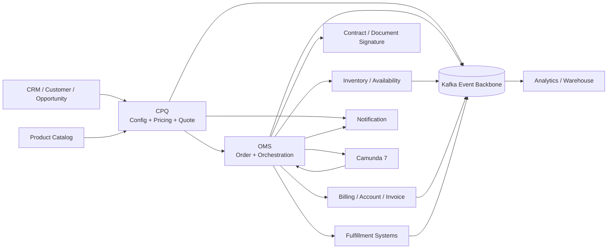

The diagram hides the important question: which arrows are command, query, event, or callback?

You must mark each integration direction.

---

## 4. Integration Taxonomy

Use a small taxonomy.

| Type | Meaning | Example |
|---|---|---|
| Query | Ask another authority for current information | Check billing account status |
| Command | Ask another system to perform an action | Reserve inventory |
| Event | Publish a fact that already happened | QuoteAccepted |
| Callback | Another system reports result of a prior command | InventoryReservationConfirmed |
| Snapshot | Store selected external facts at decision time | Customer segment on quote |
| Projection | Derived read model for UI/reporting | Order operations dashboard |
| Reconciliation | Later compare local state with external authority | Billing handoff status check |
| Control plane sync | Publish configuration/policy/catalog changes | Catalog version activation |

Do not blur these.

The common bug is treating an event as a command.

Bad:

```text
Billing system consumes OrderCreated and automatically bills customer.
```

Better:

```text
OMS emits OrderCreated as a fact.
OMS later emits BillingActivationRequested when domain state reaches billing-ready and required evidence exists.
Billing emits BillingActivationAccepted/Rejected.
```

---

## 5. Sync vs Async Decision Framework

Do not choose synchronous REST because it is easy. Do not choose Kafka because it is fashionable.

Choose based on business semantics.

| Question | Sync Query/Command | Async Event/Command |
|---|---|---|
| Does user need immediate answer? | Often yes | Usually no |
| Is operation long-running? | Usually no | Yes |
| Can external system be temporarily unavailable? | Maybe blocks user | Decouple and recover |
| Does operation create side effect? | Needs idempotency/timeout handling | Needs outbox/inbox/reconciliation |
| Is stale answer acceptable? | Maybe no | Often yes with projection lag |
| Must result be incorporated in workflow? | Can be sync gate | Often async wait state |

### 5.1 Synchronous Integration Is Fine When...

Use sync when:

- answer is needed to continue current user action,
- latency is bounded,
- dependency is highly available,
- operation is idempotent or read-only,
- fallback semantics are clear,
- timeout creates safe user-visible state.

Examples:

- product eligibility check during quote configuration,
- billing account validation during quote acceptance,
- customer search in BFF,
- retrieving document artifact metadata.

### 5.2 Asynchronous Integration Is Better When...

Use async when:

- operation is long-running,
- dependency availability should not block user flow,
- external side effect may complete later,
- retry/reconciliation is required,
- workflow needs wait state,
- high throughput is needed,
- consumers are independent.

Examples:

- order fulfillment,
- inventory reservation confirmation,
- billing activation,
- document rendering,
- notification sending,
- data warehouse ingestion,
- external provisioning.

---

## 6. Anti-Corruption Layer

An anti-corruption layer protects your domain from external models.

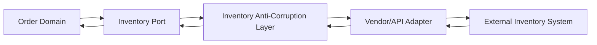

The ACL is responsible for:

- translating external identifiers,
- mapping status semantics,
- validating response schema,
- converting external error codes,
- normalizing retryability,
- preserving raw external reference for audit,
- hiding vendor-specific fields from domain,
- enforcing idempotency key conventions,
- detecting impossible transitions.

### 6.1 Bad Domain Leakage

Bad:

```java
if (sapStatus.equals("REL") || sapStatus.equals("TECO")) {
  orderLine.markFulfilled();
}
```

Better:

```java
FulfillmentStatus status = fulfillmentGateway.getStatus(externalRef);
orderLine.applyFulfillmentObservation(status.toDomainObservation());
```

External status names should not spread across the domain.

---

## 7. Canonical Model vs Local Model

Many enterprises try to define one canonical model for all systems.

This can help at integration boundaries, but it becomes dangerous when treated as domain model.

Use this rule:

> Canonical integration models are exchange contracts. Local domain models are decision models.

A canonical `ProductOrder` might describe order items, related parties, and state.

Your OMS local model still needs:

- order lifecycle invariants,
- fulfillment plan,
- compensation state,
- fallout state,
- billing handoff status,
- evidence hashes,
- idempotency records,
- state transition log.

Do not force local domain invariants into a generic canonical schema.

---

## 8. Integration Contract Shape

Every integration contract should document:

```text
Name:
Purpose:
Owner:
Authority:
Direction:
Protocol:
Trigger:
Input schema:
Output schema:
Idempotency key:
Correlation id:
Tenant propagation:
Timeout:
Retry policy:
Error mapping:
State impact:
Audit evidence:
Replay behavior:
Reconciliation path:
Security control:
Operational dashboard:
```

Example:

```text
Name: Inventory Reservation Request
Purpose: Reserve physical/service capacity for order line before fulfillment execution
Owner: OMS owns request; Inventory owns reservation truth
Direction: OMS -> Inventory
Protocol: Async command event + callback event
Trigger: Order line enters RESERVATION_REQUIRED
Input schema: InventoryReservationRequested.v1
Idempotency key: tenantId + orderId + orderLineId + reservationAttemptNo
Correlation id: orderLineFulfillmentStepId
Timeout: 15 minutes to first response
Retry: no blind duplicate command; query status before retry after timeout
State impact: pending -> confirmed/rejected/unknown/fallout
Audit: request payload hash, external reference, callback evidence
Replay: callback replay allowed; command replay forbidden without recovery mode
Reconciliation: scheduled reservation status query
Security: producer ACL, signed callback, tenant validation
Dashboard: pending count, age, rejection code, unknown count
```

This is the minimum useful level of precision.

---

## 9. CRM Integration

CRM integration usually covers:

- customer lookup,
- account/contact reference,
- opportunity association,
- sales stage update,
- quote visibility back to CRM,
- accepted quote/order notification.

### 9.1 Ownership Rule

CRM owns customer relationship context. CPQ owns quote commercial evidence.

CPQ may snapshot:

- customer id,
- customer name,
- segment,
- account owner,
- credit classification indicator,
- opportunity id,
- legal entity reference.

But CPQ should not silently mutate CRM customer master.

### 9.2 Common Failure

CRM says customer segment is `ENTERPRISE` at quote creation. Later CRM changes segment to `SMB`.

Question: should existing quote approval change?

Answer: only if policy says so.

Design:

- quote stores customer segment snapshot,
- quote stores external customer reference,
- quote may detect segment drift before acceptance,
- policy decides whether drift invalidates price/approval,
- drift creates revalidation requirement, not silent mutation.

### 9.3 Integration Pattern

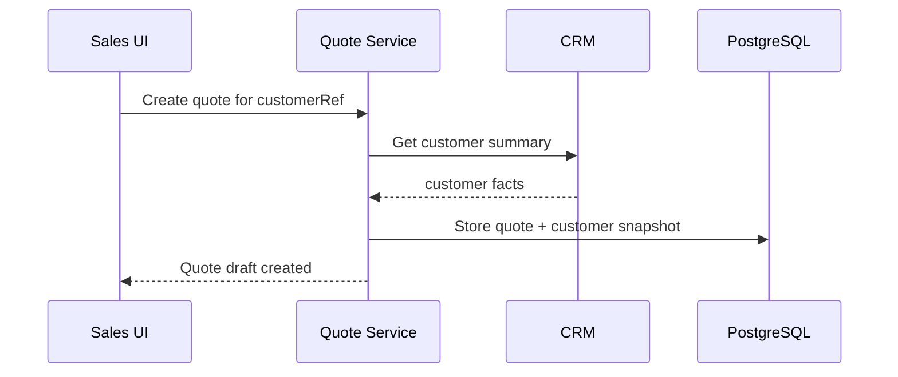

CRM read at quote creation is usually synchronous because user needs immediate validation. Later CRM updates should not mutate quote truth without explicit revalidation.

---

## 10. Product Catalog Integration

Catalog integration is foundational.

### 10.1 Ownership Rule

Catalog owns sellable definitions. CPQ owns selected configuration evidence.

At quote time:

- CPQ reads catalog version,
- configuration engine validates selected offering/options,
- quote stores catalog snapshot references and relevant denormalized facts,
- price result references catalog version.

### 10.2 Catalog Versioning Pattern

```text
catalog_version = 2026.07.01-enterprise-v3
product_offering_id = broadband-pro-1g
offering_version = 14
constraint_set_hash = sha256:...
```

Quote should be reproducible even if catalog changes tomorrow.

### 10.3 Catalog Publish Event

When catalog publishes a new version:

```json
{
  "eventType": "CatalogVersionPublished",
  "tenantId": "tenant-1",
  "catalogVersion": "2026.07.01-enterprise-v3",
  "effectiveFrom": "2026-07-15T00:00:00Z",
  "publicationHash": "sha256:..."
}
```

Consumers may:

- warm Redis cache,
- rebuild eligibility projections,
- mark draft quotes as needing revalidation if policy requires,
- update BFF catalog read models.

Do not mutate accepted quotes just because catalog changed.

---

## 11. Pricing Integration

Pricing may be internal service or external pricing engine.

### 11.1 Ownership Rule

Pricing owns price calculation logic and price result. Quote owns commercial lifecycle using a price result snapshot.

### 11.2 Price Request Contract

Price request should include:

- tenant,
- quote id/revision,
- customer snapshot reference,
- catalog version,
- configuration result,
- quantity/term,
- channel,
- contract context,
- requested overrides,
- pricing policy version if fixed,
- correlation id.

Price response should include:

- price result id,
- component list,
- totals,
- rounding details,
- discount policy outcomes,
- approval triggers,
- calculation trace hash,
- validity window,
- deterministic input hash.

### 11.3 Price Freshness

A quote should not be accepted using a stale price result unless business explicitly allows it.

Freshness can be invalidated by:

- quote line change,
- quantity/term change,
- customer segment change,
- price book change,
- promotion expiry,
- manual override change,
- catalog version change,
- approval policy change.

---

## 12. Inventory and Availability Integration

This was covered as a domain part earlier. Here we focus on integration style.

### 12.1 Three Different Questions

Do not collapse these:

| Question | Integration Type | Meaning |
|---|---|---|
| Is product likely available? | Query | Non-binding quote-time check |
| Can we hold capacity? | Command | Reservation request |
| What is actual installed/available inventory? | Query/event | Inventory authority observation |

### 12.2 Timeout Means Unknown

If reservation request times out, do not assume failure.

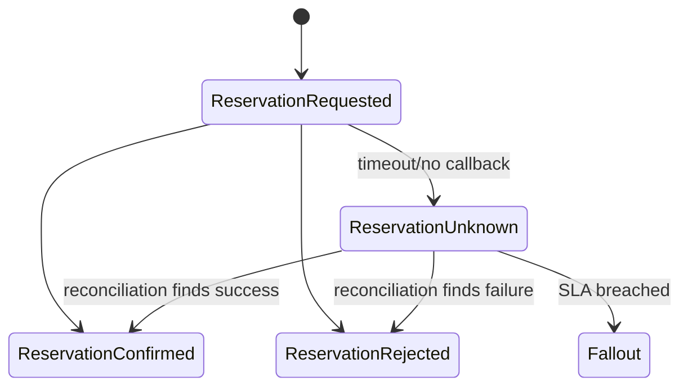

Unknown is a first-class state.

### 12.3 Idempotency Key

Reservation idempotency key:

```text
tenantId + orderId + orderLineId + reservationPurpose + attemptNo
```

Do not use a random key generated per retry. That defeats idempotency.

---

## 13. Billing Integration

Billing is often where OMS boundaries get corrupted.

### 13.1 Ownership Rule

Billing owns:

- billing account,
- invoice,
- charge activation,
- taxation in billing context,
- payment posting,
- receivables,
- billing cycle.

OMS owns:

- order state,
- billing handoff readiness,
- evidence sent to billing,
- handoff status from OMS perspective.

OMS should not fake invoice status or mutate billing account state.

### 13.2 Billing Handoff Pattern

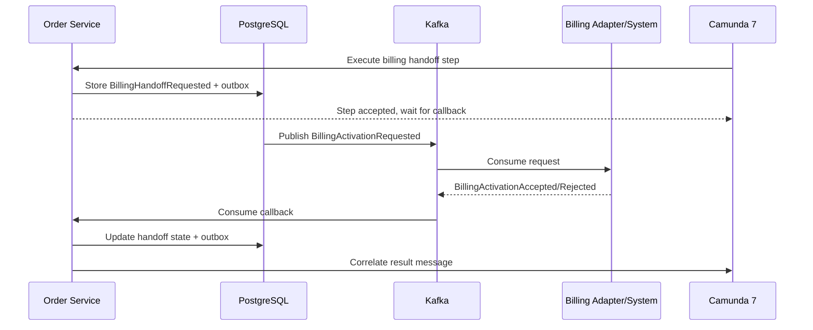

### 13.3 Billing Contract Must Include Evidence

Billing request should include:

- order id,
- order line id,
- customer/billing account reference,
- product offering snapshot,
- charge components,
- effective date,
- contract term,
- tax context if relevant,
- quote/order evidence hashes,
- accepted document reference,
- idempotency key.

Billing may reject if:

- billing account invalid,
- charge code unknown,
- effective date invalid,
- tax jurisdiction missing,
- product mapping missing,
- duplicate/inconsistent request.

Rejection is a business failure, not a technical exception.

---

## 14. ERP Integration

ERP integration often handles downstream financial/logistical processes.

Examples:

- sales order creation,
- purchase order request,
- revenue recognition handoff,
- stock movement,
- shipment request,
- project creation,
- cost center validation.

### 14.1 ERP Is Usually Slow and Strict

ERP systems often have:

- rigid master data requirements,
- batch windows,
- strict posting periods,
- long response times,
- complex error codes,
- eventual status callbacks,
- manual correction queues.

So ERP integration should normally be asynchronous with strong reconciliation.

### 14.2 ERP Adapter Pattern

The ERP adapter should translate:

```text
OMS domain request -> ERP-specific API/file/message
ERP response/error -> normalized domain observation
```

Do not let ERP status codes pollute order state.

Bad:

```text
order.status = SAP_DOC_CREATED_BUT_NOT_RELEASED
```

Good:

```text
fulfillment_step.status = EXTERNAL_ACCEPTED
fulfillment_step.external_status_code = SAP_REL_PENDING
fulfillment_step.external_status_label = "Release pending"
```

Domain status remains stable. External details remain evidence.

---

## 15. Contract and Document Integration

Quote acceptance often depends on document generation and signature.

### 15.1 Ownership Rule

Document service owns artifact generation. Contract/signature service owns signature ceremony. Quote/order owns whether accepted evidence is sufficient to proceed.

### 15.2 Signed Artifact Pattern

```text
QuoteRevision -> GenerateProposalDocument -> CustomerSigns -> SignatureCompleted -> QuoteAccepted -> OrderCreated
```

The signed artifact should capture:

- quote id/revision,
- artifact id,
- artifact hash,
- template version,
- render input hash,
- signer identity/reference,
- signature timestamp,
- signature provider reference,
- acceptance terms.

Acceptance must validate that signed artifact corresponds to current quote revision and price/approval evidence.

---

## 16. Notification Integration

Notifications should not be emitted directly from random services.

### 16.1 Notification as Derived Side Effect

Domain emits fact:

```text
QuoteApproved
OrderFulfillmentFailed
BillingActivationRejected
```

Notification service decides:

- recipient,
- channel,
- template,
- localization,
- preference/consent,
- retry,
- suppression,
- audit.

### 16.2 Notification Idempotency

Notification idempotency key:

```text
tenantId + notificationPurpose + sourceEventId + recipientRef
```

This prevents duplicate email/SMS on event replay or consumer retry.

---

## 17. Data Warehouse and Analytics Integration

Analytics is not operational authority.

### 17.1 Good Pattern

Publish sanitized events/projections to analytics:

- quote created,
- quote priced,
- quote approved,
- quote accepted,
- order created,
- order fallout created,
- fulfillment completed.

Include:

- stable identifiers,
- timestamps,
- state transitions,
- dimensions,
- monetary aggregates where allowed,
- policy version/evidence hash references.

### 17.2 Bad Pattern

Operational services query data warehouse to decide whether quote can be approved.

Why bad:

- stale data,
- non-authoritative transformations,
- weak transaction semantics,
- poor incident recovery,
- analytics access controls differ from operational controls.

Use operational read models for operational decisions.

---

## 18. File-Based Integration

Some enterprise systems still integrate via files.

Do not dismiss file integration as unprofessional. It may be required. But make it explicit and controlled.

File integration contract must define:

- file naming convention,
- schema version,
- delimiter/format,
- encoding,
- checksum,
- encryption,
- signing,
- delivery location,
- schedule,
- retry,
- duplicate detection,
- partial failure handling,
- acknowledgement file,
- reconciliation report,
- retention.

### 18.1 File Batch Pattern

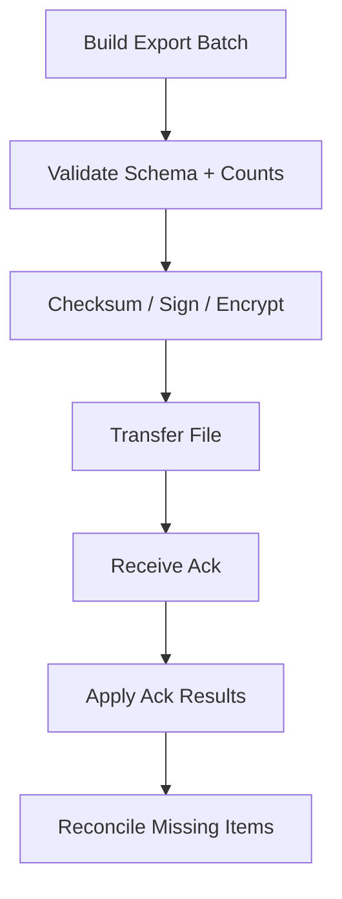

Every row needs a business key and idempotency key.

---

## 19. Integration State Modeling

Never store only an external reference.

Store integration lifecycle.

Example `external_handoff` table:

```sql
create table external_handoff (
  tenant_id uuid not null,
  handoff_id uuid not null,
  aggregate_type text not null,
  aggregate_id uuid not null,
  purpose text not null,
  target_system text not null,
  status text not null,
  idempotency_key text not null,
  external_reference text,
  request_hash text not null,
  last_response_hash text,
  attempt_count integer not null,
  next_retry_at timestamptz,
  last_error_code text,
  last_error_message text,
  created_at timestamptz not null,
  updated_at timestamptz not null,
  primary key (tenant_id, handoff_id),
  unique (tenant_id, target_system, idempotency_key)
);
```

Possible states:

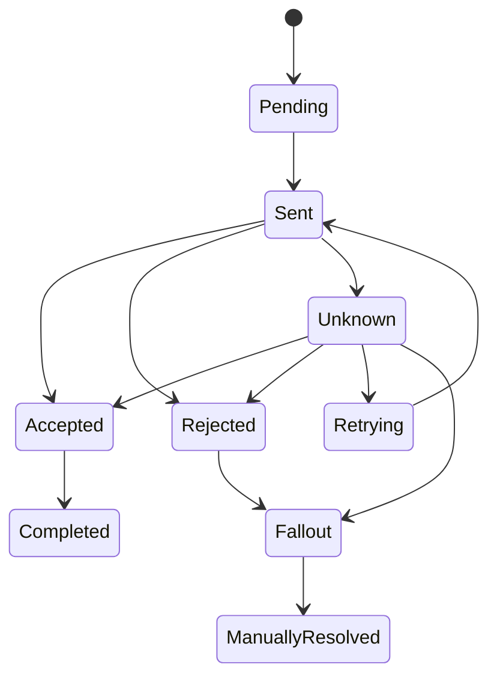

This lets operations see where integration is stuck.

---

## 20. Error Mapping

External errors must be normalized.

| External Condition | Normalized Type | Domain Impact |
|---|---|---|
| Validation failure | BUSINESS_REJECTED | Move to fallout/rework |
| Duplicate same request | IDEMPOTENT_SUCCESS or DUPLICATE_CONFLICT | Resolve by comparing payload hash |
| Timeout | UNKNOWN | Reconcile before retrying dangerous command |
| 5xx/transient | TECHNICAL_RETRYABLE | Retry with backoff |
| Unauthorized | SECURITY_CONFIGURATION_FAILURE | Stop and alert |
| Unknown code | UNCLASSIFIED_EXTERNAL_FAILURE | Fallout + mapping update |

Never let raw external error codes directly drive domain state without classification.

---

## 21. Idempotency Across Integrations

Idempotency must be business-key based.

Bad:

```text
idempotencyKey = UUID.randomUUID() on every retry
```

Good:

```text
idempotencyKey = tenantId + orderId + orderLineId + targetSystem + purpose + attemptNo
```

For commands that should be exactly one per lifecycle step, do not increment attempt number on retry. Use the same key.

Use new attempt number only when business explicitly creates a new attempt after previous attempt is terminally failed/cancelled.

### 21.1 Payload Hash

Store request hash with idempotency key.

If same key + same hash appears: return previous result.

If same key + different hash appears: reject as idempotency conflict.

---

## 22. Correlation and Traceability

Every integration message should carry:

- correlation id,
- causation id,
- event id/message id,
- tenant id,
- aggregate id,
- source service,
- source version,
- schema version,
- business process key,
- external reference if known.

Example:

```json
{
  "eventId": "01J...",
  "correlationId": "corr-123",
  "causationId": "cmd-456",
  "tenantId": "tenant-1",
  "aggregateType": "ORDER_LINE",
  "aggregateId": "line-123",
  "processBusinessKey": "order:ord-9",
  "source": "order-service",
  "schemaVersion": "billing-activation-requested.v1"
}
```

Without this, debugging cross-system failures becomes archaeology.

---

## 23. Reconciliation as First-Class Design

Every integration that can become unknown needs reconciliation.

Reconciliation asks:

```text
What does the external authority believe happened?
What do we believe happened?
Where do the states diverge?
What safe action resolves divergence?
```

### 23.1 Reconciliation Job Pattern

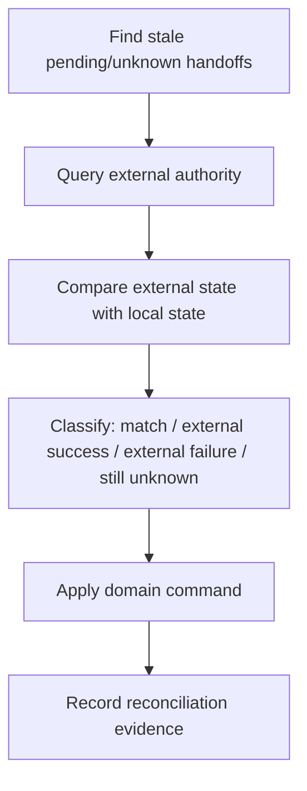

Reconciliation must use domain commands, not direct DB updates.

### 23.2 Reconciliation Result Types

| Result | Meaning | Action |
|---|---|---|
| Matched | Local and external agree | mark checked |
| External success | External completed but callback missed | apply success observation |
| External failure | External failed but local pending | apply failure observation |
| External unknown | External also does not know | keep unknown / retry / fallout |
| Local impossible | Local state cannot accept external result | create fallout |

---

## 24. Camunda 7 Integration Boundary

Camunda orchestrates long-running work. It should not become the integration authority.

### 24.1 Good Boundary

Camunda process:

- decides next orchestration step,
- creates wait states,
- handles timers,
- routes business errors,
- creates human task/fallout path.

Domain service:

- validates command,
- owns state transition,
- writes outbox,
- records audit,
- interprets external callback.

### 24.2 External Task Worker Pattern

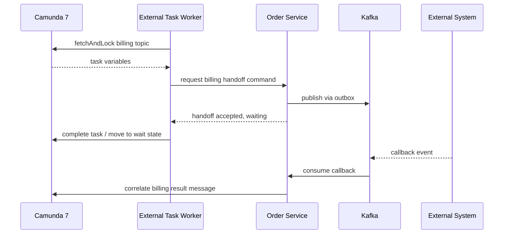

The worker does not call external system directly unless the domain explicitly delegates that adapter role and still persists integration lifecycle.

---

## 25. Integration With Outbox and Inbox

Use outbox for publishing facts/commands after local DB commit.

Use inbox for consuming external messages idempotently.

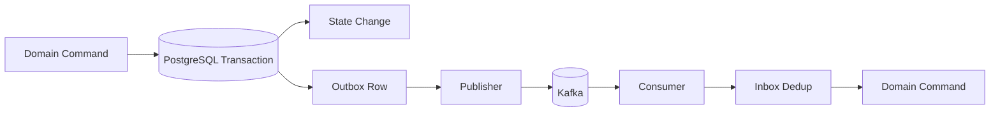

Consumer must be idempotent because Kafka and external systems can redeliver.

Inbox record should store:

- message id,
- source system,
- schema version,
- aggregate id,
- received at,
- processing status,
- payload hash,
- error code,
- retry count.

---

## 26. Integration Security

Every integration needs security controls.

| Integration | Security Control |
|---|---|
| Synchronous API call | mTLS/OAuth/service identity, scoped credentials, timeout |
| Kafka event | ACL, schema validation, producer identity, topic ownership |
| Callback/webhook | signature, timestamp, replay protection, allowlist where useful |
| File transfer | encryption, signing/checksum, secure transport, retention |
| Admin-triggered replay | privileged role, approval, audit, blast radius limit |
| External adapter | secret isolation, credential rotation, least privilege |

Do not use one shared integration credential for all systems.

---

## 27. Integration Observability

Integration dashboards should show business state, not only technical status.

Metrics:

- request count by target system,
- accepted/rejected/unknown count,
- pending age,
- callback latency,
- retry count,
- DLQ count,
- reconciliation corrections,
- duplicate message count,
- idempotency conflicts,
- external error code distribution,
- SLA breach count,
- fallout cases by target system.

Logs should include:

- correlation id,
- tenant id,
- aggregate id,
- handoff id,
- target system,
- idempotency key hash,
- external reference,
- normalized error code.

Do not log full sensitive payloads.

---

## 28. Integration Testing Strategy

Integration tests should cover behavior, not just happy path connectivity.

| Test | Purpose |
|---|---|
| Contract test | Request/response/event schema compatibility |
| Adapter mapping test | External status/error maps correctly |
| Idempotency test | Retry does not duplicate external side effect |
| Timeout test | Timeout becomes unknown, not failure |
| Callback duplicate test | Duplicate callback is safe |
| Callback before local wait test | Early callback handled or parked |
| Reconciliation test | Missing callback repaired |
| Rejection test | Business rejection creates fallout/rework |
| Security test | Invalid signature/token rejected |
| Replay test | Replay does not resend real notification/billing command |
| Tenant test | Tenant mismatch rejected |

Use simulators for external systems that can produce:

- success,
- business rejection,
- timeout,
- delayed callback,
- duplicate callback,
- out-of-order callback,
- malformed response,
- unauthorized response,
- unknown status.

---

## 29. Integration Runbook Template

Every integration should have a runbook.

```text
Integration name:
Business owner:
Technical owner:
Target system owner:
Data classification:
Protocol:
Normal flow:
Known external statuses:
Retry policy:
Timeout policy:
Reconciliation job:
Dashboard link:
Alert thresholds:
DLQ handling:
Manual recovery actions:
Security credentials:
Secret rotation process:
Common incidents:
Rollback/disable switch:
Escalation contacts:
Audit evidence location:
```

If there is no runbook, the integration is not production-ready.

---

## 30. Common Integration Anti-Patterns

### Anti-Pattern 1: Distributed CRUD

Services directly update each other’s records.

Why it fails:

- no ownership,
- no audit,
- no lifecycle semantics,
- impossible recovery.

Use commands/events with explicit ownership.

### Anti-Pattern 2: Shared Database Integration

Billing reads OMS tables directly. OMS reads CRM tables directly.

Why it fails:

- schema coupling,
- bypassed authorization,
- impossible versioning,
- lock/performance risk,
- unclear audit.

Use APIs/events/projections.

### Anti-Pattern 3: Event as RPC

Producer emits event and expects immediate consumer side effect to proceed.

Why it fails:

- hidden synchronous dependency,
- no explicit timeout,
- unclear failure semantics,
- hard to reconcile.

If you need a command, model a command.

### Anti-Pattern 4: Callback Trust

External callback directly completes order step.

Why it fails:

- spoofing risk,
- duplicate callback risk,
- stale callback risk,
- impossible transition risk.

Callback should create a domain observation. Domain decides transition.

### Anti-Pattern 5: No Unknown State

Timeouts become failure.

Why it fails:

- external system may have succeeded,
- retry may duplicate side effect,
- cancellation may conflict with already completed work.

Use `UNKNOWN` and reconciliation.

### Anti-Pattern 6: Data Warehouse as Operational Source

Using analytics tables to decide order workflow.

Why it fails:

- stale transformations,
- no command semantics,
- no operational SLA,
- weak audit chain.

Operational decisions need operational authority.

---

## 31. Practical Integration Blueprint

For each external integration, create these code modules:

```text
order-service/
  src/main/java/.../integration/
    billing/
      BillingPort.java
      BillingCommandService.java
      BillingHandoffRepository.java
      BillingHandoffEntity.java
      BillingOutboxMapper.java
      BillingCallbackConsumer.java
      BillingReconciliationJob.java
      BillingErrorMapper.java
      BillingAuditRecorder.java
      BillingSecurityVerifier.java
```

The names matter less than the separation:

- port defines domain-facing contract,
- command service controls lifecycle,
- repository stores handoff state,
- mapper builds external contract,
- consumer handles callback idempotently,
- reconciliation repairs unknowns,
- error mapper normalizes external failures,
- audit recorder preserves evidence,
- security verifier validates external authenticity.

---

## 32. Capstone Example: Order to Billing + Inventory

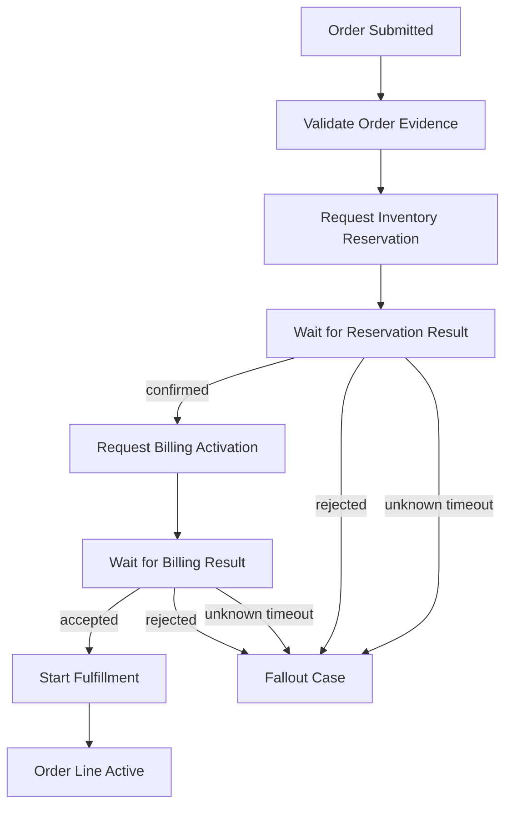

Each transition corresponds to a domain command and integration evidence.

| Step | Authority | Integration Pattern |
|---|---|---|
| Validate order evidence | OMS | Local domain validation |
| Reserve inventory | Inventory | Async command + callback + reconciliation |
| Billing activation | Billing | Async command + callback + reconciliation |
| Fulfillment | Fulfillment system | Async command/external task/callback |
| Fallout | OMS | Human recovery workflow |

This is what production-grade integration looks like: explicit ownership, explicit waiting, explicit unknown handling, explicit recovery.

---

## 33. Mental Model

Do not think of enterprise integration as plumbing.

Think of it as treaty-making between authorities.

Every integration treaty must answer:

```text
Who owns this fact?
Who may request action?
What is the contract?
What does success mean?
What does rejection mean?
What does timeout mean?
What is safe to retry?
How do we detect duplicates?
How do we reconcile disagreement?
What is audited?
Who can operate recovery?
```

If those questions are answered, protocol choice becomes much easier.

If those questions are not answered, even the best Kafka topic or REST API becomes a distributed failure generator.

---

## 34. References

- TM Forum Open APIs Directory: https://www.tmforum.org/open-digital-architecture/open-apis
- TM Forum Product Ordering Management API: https://www.tmforum.org/open-digital-architecture/open-apis/product-ordering-management-api-TMF622/v5.0
- TM Forum Product Inventory Management API: https://www.tmforum.org/open-digital-architecture/open-apis/product-inventory-management-api-TMF637/v5.0
- TM Forum Customer Bill Management API: https://www.tmforum.org/open-digital-architecture/open-apis/customer-bill-management-api-TMF678/v5.0
- Enterprise Integration Patterns: https://www.enterpriseintegrationpatterns.com/
- Debezium Outbox Event Router: https://debezium.io/documentation/reference/stable/transformations/outbox-event-router.html
- Apache Kafka Documentation: https://kafka.apache.org/documentation/
- Camunda 7 External Tasks: https://docs.camunda.org/manual/latest/user-guide/process-engine/external-tasks/
