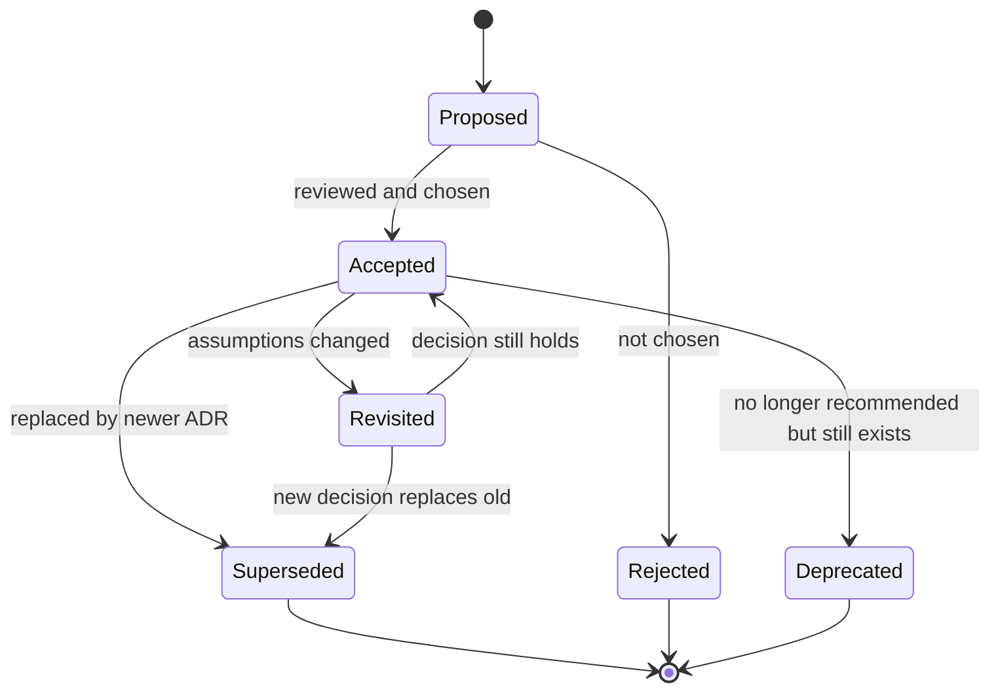
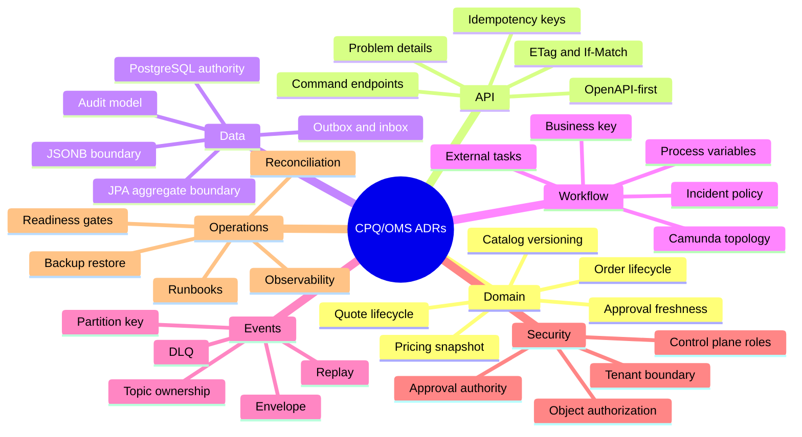
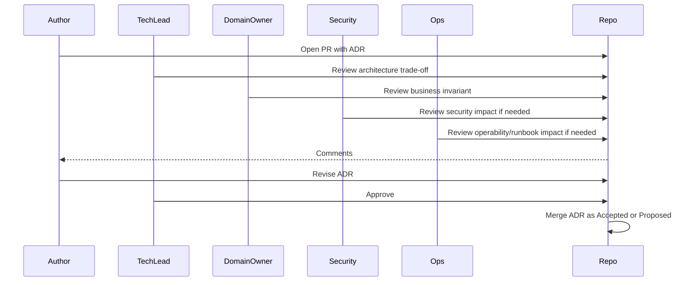
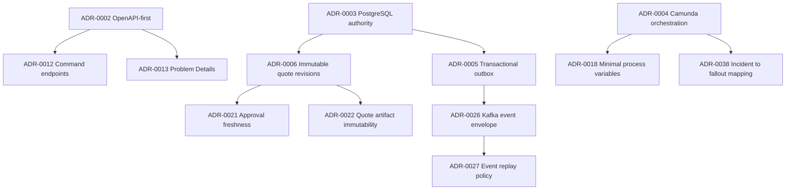

# Architecture Decision Records

A production CPQ/OMS platform is not only code.

It is a pile of decisions:

- why quote revision is immutable,
- why pricing result is snapshotted,
- why order orchestration lives in Camunda 7,
- why Kafka events are integration facts, not database replication,
- why Redis is not source of truth,
- why PostgreSQL owns lifecycle state,
- why OpenAPI-first is mandatory,
- why every process instance uses a business key,
- why product catalog publication is versioned,
- why order cancellation is compensation, not deletion,
- why approval freshness is invalidated by material quote changes,
- why some failures create fallout instead of infinite retry.

If those decisions only live inside senior engineers' heads, the system will decay.

A future team member will ask:

> Why did we build it this way?

If the answer is:

```text
Because someone decided that two years ago.
```

then the architecture has already lost part of its memory.

This part builds an ADR practice for the CPQ/OMS platform.

ADR means **Architecture Decision Record**: a lightweight document that captures one significant decision, its context, chosen option, rejected alternatives, and consequences.

The point is not documentation theater.

The point is to make architecture **reviewable, debatable, traceable, reversible, and teachable**.

---

## 1. Core Thesis

The thesis:

> Enterprise architecture is not the diagram. Enterprise architecture is the accumulated set of decisions that make the diagram defensible.

A diagram shows current shape.

An ADR explains why the shape exists.

Without ADRs, architecture discussion often degenerates into opinion:

```text
Use workflow engine.
No, use event choreography.
No, use Temporal.
No, use Camunda.
No, use simple services.
```

With ADRs, the discussion becomes concrete:

```text
Decision:
Use Camunda 7 as a workflow orchestration service for long-running order fulfillment.

Context:
- order fulfillment has human tasks, timers, retries, escalation, and fallout;
- the enterprise already operates Camunda 7;
- running process instances must be visible to operations;
- workflow variables must not become domain state;
- Camunda 7 has lifecycle constraints, so a migration fence is required.

Rejected alternatives:
- pure Kafka choreography;
- custom workflow tables;
- synchronous orchestration inside Order Service;
- immediate Camunda 8 adoption.

Consequences:
- workflow-service becomes runtime owner of process execution;
- order-service remains authority for order state;
- process variables are minimal;
- every instance uses business key;
- external tasks must be idempotent;
- migration fence is mandatory.
```

That is a real architectural memory.

---

## 2. What Counts as an Architecture Decision?

Not every decision needs an ADR.

Bad ADR candidate:

```text
Use LocalDateTime in this mapper.
```

Good ADR candidate:

```text
Use deterministic Clock abstraction for all command handlers that create lifecycle evidence.
```

The second decision changes testing, reproducibility, audit, and production behavior.

A decision deserves an ADR when it affects at least one of these:

| Area | ADR-worthy example |
|---|---|
| Domain truth | Quote revision is immutable after submit. |
| Lifecycle | Accepted quote can create at most one primary order. |
| Workflow | Camunda owns orchestration, not domain state. |
| Integration | Billing handoff is asynchronous with reconciliation. |
| Data model | Price result is snapshotted, not recalculated during acceptance. |
| API contract | Lifecycle mutation uses command endpoints, not PATCH. |
| Eventing | Events are published through transactional outbox. |
| Security | Authorization is object-level and tenant-aware. |
| Operations | Failed external tasks map to fallout after policy threshold. |
| Migration | Schema changes follow expand-migrate-contract. |
| Deployment | Workflow engine is deployed separately from domain services. |
| Observability | Correlation ID, trace ID, business key, and aggregate ID must travel together. |

Rule of thumb:

> If reversing the decision would require cross-service changes, migration, retraining, or operational runbook changes, record it.

---

## 3. ADR Is Not a Design Document

A common mistake is turning ADRs into huge design documents.

That kills the practice.

An ADR should answer:

1. What decision did we make?
2. Why now?
3. What constraints shaped the decision?
4. What options were considered?
5. What did we choose?
6. What consequences do we accept?
7. What would cause us to revisit the decision?

An ADR is not supposed to contain every table, class, endpoint, and test.

Use this separation:

| Artifact | Purpose |
|---|---|
| ADR | Captures one decision and trade-off. |
| Design doc | Explains full design. |
| OpenAPI spec | Defines HTTP contract. |
| JSON Schema | Defines payload/event contract. |
| BPMN/DMN | Defines workflow/decision model. |
| Runbook | Explains operational action. |
| Test suite | Proves behavior. |
| README | Helps onboarding and local usage. |

ADR links to those artifacts.

It does not replace them.

---

## 4. ADR Lifecycle

ADRs are not static notes.

They have lifecycle.



Use status explicitly:

```text
Status: Proposed | Accepted | Rejected | Superseded | Deprecated
```

Never edit history to pretend the team was always right.

Architecture maturity means the decision trail shows learning.

---

## 5. Recommended ADR Template

Use a simple, repeatable template.

```mdx
# ADR-0007: Use Transactional Outbox for Domain Event Publication

Date: 2026-07-02

Status: Accepted

## Context

What problem are we solving?
What constraints exist?
What has changed?
Why does the decision matter now?

## Decision

What did we choose?
State it directly.

## Alternatives Considered

### Option A: Publish event directly inside service transaction

Pros:
- simple code path

Cons:
- dual-write risk
- event may publish without DB commit
- DB may commit without event publish

### Option B: Transactional outbox with polling publisher

Pros:
- event record commits in same DB transaction as aggregate mutation
- publisher can retry independently
- replay and monitoring are possible

Cons:
- additional table and publisher process
- eventual publication, not immediate publication
- cleanup/retention required

## Consequences

What gets better?
What gets worse?
What new obligations exist?

## Invariants Protected

Which business/technical invariants does this decision protect?

## Revisit Triggers

When should we reconsider?

## References

Links to code, docs, tickets, BPMN, OpenAPI, schema, runbook.
```

Keep it direct.

A useful ADR can be two pages.

A useless ADR can be twenty pages.

---

## 6. ADR Naming and Location

Place ADRs close to architecture artifacts, not buried in a wiki nobody reads.

Recommended structure:

```text
repo-root/
  docs/
    adr/
      0001-record-architecture-decisions.md
      0002-use-openapi-first-for-service-contracts.md
      0003-use-postgresql-as-system-of-record.md
      0004-use-camunda-7-for-workflow-orchestration.md
      0005-use-transactional-outbox-for-events.md
      0006-use-quote-revision-snapshots.md
      0007-use-redis-only-as-non-authoritative-accelerator.md
    architecture/
      system-context.md
      service-boundaries.md
      runtime-topology.md
    runbooks/
      order-fallout.md
      camunda-incident-recovery.md
      kafka-replay.md
```

ADR filename rule:

```text
<sequence>-<short-slug>.md
```

Example:

```text
0012-use-camunda-business-key-for-workflow-correlation.md
```

Do not rename accepted ADRs unless absolutely necessary.

Stable filenames make historical links reliable.

---

## 7. The CPQ/OMS ADR Taxonomy

For this platform, categorize ADRs by decision family.



This taxonomy prevents ADR chaos.

When someone searches for “why is pricing snapshot immutable?”, they should know where to look.

---

## 8. Decision Quality Bar

A CPQ/OMS ADR is not accepted unless it passes this bar:

| Question | Why it matters |
|---|---|
| What invariant does this protect? | Prevents solution-driven decisions. |
| What failure mode does this reduce? | Forces production thinking. |
| What new failure mode does it create? | Avoids naive optimism. |
| What operational obligation does it introduce? | Every architecture choice creates runbook cost. |
| What data migration does it imply? | Enterprise systems live for years. |
| What test must prove it? | Decision without test becomes belief. |
| What metric will reveal failure? | Observability must match decision risk. |
| What is the rollback or supersession path? | Architecture must be revisitable. |

An ADR that cannot answer these is not ready.

Example weak ADR:

```text
Decision: Use Redis for performance.
```

Better ADR:

```text
Decision: Use Redis cache-aside for product catalog read projections only.

Protected invariant:
Quote acceptance must not depend on Redis content.

Failure mode reduced:
High repeated catalog read latency during configuration sessions.

New failure mode:
Stale catalog projection may be shown to user.

Control:
Cache key includes tenantId + catalogPublicationId + productOfferingId.
TTL is 15 minutes.
Publication event invalidates keys.
Quote submit validates against PostgreSQL catalog snapshot.

Test:
Catalog cache stale scenario must fail safe at quote submit.

Metric:
Catalog cache hit ratio, stale validation rejection count, Redis latency, fallback read latency.
```

That is an enterprise-grade decision.

---

## 9. ADR Review Flow

ADR review should be lightweight but strict.



Not every ADR needs every reviewer.

But CPQ/OMS decisions often cross boundaries.

Suggested reviewers:

| ADR type | Required reviewers |
|---|---|
| Quote/order lifecycle | Tech lead, domain owner, QA lead |
| Approval/security | Tech lead, security, domain owner |
| Workflow/Camunda | Tech lead, platform/workflow owner, operations |
| Data model/migration | Tech lead, DBA/platform, QA lead |
| Event contract | Tech lead, producer owner, consumer owner |
| Integration | Tech lead, external system owner, operations |
| Production readiness | Tech lead, SRE/ops, security, domain owner |

The goal is not bureaucracy.

The goal is to prevent invisible cross-entity damage.

---

## 10. ADR and Code Change Coupling

Some ADRs should be merged before code.

Some should be merged together with code.

Use this rule:

| Situation | ADR timing |
|---|---|
| New architectural direction | ADR before code. |
| Existing implementation discovered an implicit decision | ADR with code cleanup. |
| Emergency production patch | Code first, ADR follow-up required. |
| Reversing prior decision | New ADR supersedes old ADR before major change. |
| Data migration strategy | ADR before migration PR. |
| Security model change | ADR before implementation. |

Example pull request structure:

```text
PR: Implement quote revision immutability

Changes:
- docs/adr/0011-use-immutable-quote-revisions.md
- quote-service/src/main/java/.../SubmitQuoteCommandHandler.java
- quote-service/src/main/resources/db/migration/V031__quote_revision_constraints.sql
- quote-service/src/test/java/.../SubmitQuoteConcurrencyTest.java
- openapi/quote-service.yaml
```

If code changes architecture but no ADR changes, reviewers should ask:

> Is this a local implementation detail, or did we just make an architectural decision silently?

---

## 11. ADRs for Domain Decisions

Domain ADRs are the most valuable in CPQ/OMS.

Technology changes.

Domain constraints persist.

### Example: Quote Revision Immutability

```mdx
# ADR-0011: Use Immutable Quote Revisions After Submission

Date: 2026-07-02
Status: Accepted

## Context

A quote can be edited while in DRAFT.
After it is submitted for pricing/approval, commercial evidence starts to accumulate:
price result, approval requirement, approval decision, document artifact, and customer acceptance.
If the same quote revision remains mutable, old evidence can point to changed commercial content.

## Decision

After a quote revision leaves DRAFT, material commercial content becomes immutable.
Any material change creates a new quote revision.

## Alternatives Considered

### Mutable quote with audit log

Pros:
- simpler UI mental model
- fewer rows

Cons:
- price/approval/document evidence can become stale or misleading
- audit reconstruction becomes complex
- concurrent edit/approval race is harder

### Immutable revision with new revision on material change

Pros:
- evidence is bound to stable content
- approval freshness is enforceable
- accepted quote can be reproduced
- order conversion has a clear source revision

Cons:
- UI must expose revision history
- storage grows
- amend/revise flows need explicit commands

## Consequences

- quote_revision is the aggregate root for submitted commercial evidence.
- price_result references quote_revision_id.
- approval_decision references quote_revision_id.
- document_artifact references quote_revision_id.
- accepted quote revision can create at most one primary order.
```

This ADR protects the platform from a common enterprise failure:

> A customer accepted version A, the system later shows version B, and nobody can prove what was actually approved.

---

## 12. ADRs for Workflow Decisions

Workflow ADRs must be especially precise because workflow systems tend to become invisible coupling points.

### Example: Camunda Process Variables Are Not Domain State

```mdx
# ADR-0018: Treat Camunda 7 Process Variables as Workflow Context, Not Domain State

Date: 2026-07-02
Status: Accepted

## Context

Order fulfillment is orchestrated by Camunda 7.
Process instances need variables for routing, task assignment, worker calls, and correlation.
If full order state is copied into process variables, Camunda history becomes a second source of truth.

## Decision

Camunda variables may store only minimal workflow context:
- tenantId
- orderId
- orderRevision or orderVersion
- businessKey
- fulfillmentPlanId
- current step identifiers
- correlation IDs
- non-authoritative routing hints

Order state remains in Order Service PostgreSQL tables.

## Consequences

- external task workers load fresh order state from Order Service.
- workflow can route but cannot invent business truth.
- process instance migration is simpler.
- operational debugging requires correlation to domain read model.
```

This ADR prevents a subtle disaster:

> Workflow instance says one thing, Order Service says another, and both claim to be right.

---

## 13. ADRs for Integration Decisions

Integration ADRs must explicitly define authority.

### Example: Billing Handoff Is Asynchronous

```mdx
# ADR-0023: Use Asynchronous Billing Handoff With Reconciliation

Date: 2026-07-02
Status: Accepted

## Context

Order fulfillment eventually needs billing activation.
Billing system owns invoices, charges, tax handling, receivables, and payment status.
OMS owns order lifecycle and billing handoff state.
Synchronous billing activation would couple order completion latency to billing availability.

## Decision

OMS emits BillingActivationRequested through Kafka after order line reaches BILLING_READY.
Billing responds through BillingActivationAccepted, BillingActivationRejected, or status query reconciliation.
OMS tracks billing handoff state locally and creates fallout after SLA breach.

## Consequences

- order lifecycle can represent BILLING_PENDING.
- OMS must reconcile unknown handoff outcomes.
- billing request uses business idempotency key.
- billing events must include orderId, orderLineId, tenantId, requestId, and billingSystemReference if known.
```

The ADR names the contract between authorities.

Without that, integration becomes guesswork.

---

## 14. ADRs for Data Decisions

Data ADRs should state what truth is stored, what is derived, and what can be rebuilt.

### Example: Projection Tables for Operational Search

```mdx
# ADR-0028: Use Projection Tables for Quote and Order Operational Search

Date: 2026-07-02
Status: Accepted

## Context

Operations need fast search across quote/order/workflow fields.
The write model is normalized around lifecycle correctness.
Using write tables directly for search would create complex joins and authorization leakage risk.

## Decision

Use projection tables for operational search.
Projection tables are rebuilt from authoritative domain tables and events.
They are derived, not authoritative.

## Consequences

- projection lag must be visible.
- command decisions must not depend on projection tables.
- projection rebuild job is required.
- search API must expose freshness metadata.
```

Data ADRs should prevent this sentence:

```text
This table was originally a report table, but now some commands depend on it.
```

That is how derived data becomes accidental authority.

---

## 15. ADRs for Security Decisions

Security ADRs should be written in terms of abuse cases.

### Example: Object-Level Authorization for Quote Access

```mdx
# ADR-0031: Enforce Object-Level Authorization in Every Quote Command

Date: 2026-07-02
Status: Accepted

## Context

Quote IDs are opaque but not security boundaries.
Users may belong to different tenants, sales regions, teams, accounts, or delegated approval groups.
A user who can access one quote must not automatically access another quote.

## Decision

Every quote command handler must perform object-level authorization using tenant, account relationship, user role, delegation, and lifecycle-specific permission.
Gateway authentication is necessary but insufficient.

## Consequences

- command handlers receive AuthContext.
- repositories must be tenant-scoped.
- authorization denial is audited.
- search projections must be filtered by entitlement.
- tests must include cross-tenant and cross-account access attempts.
```

This is not optional in enterprise CPQ.

Commercial quotes contain sensitive pricing, discounts, customer strategy, contract terms, and internal approvals.

---

## 16. ADRs for Operations Decisions

Operations ADRs make support assumptions explicit.

### Example: Failed Order Workflow External Tasks Create Fallout After Retry Exhaustion

```mdx
# ADR-0038: Map Exhausted Order Workflow Failures to Fallout Cases

Date: 2026-07-02
Status: Accepted

## Context

Camunda external tasks can fail because of retryable technical errors, rejected business conditions, unknown external outcomes, or permanent integration faults.
Leaving incidents only in Camunda Cockpit is insufficient for case workers.

## Decision

When retry policy is exhausted for order fulfillment tasks, Workflow Service creates a domain fallout case linked to orderId, processInstanceId, activityId, externalTaskId, and last failure classification.

## Consequences

- operations uses fallout worklist as primary recovery queue.
- Camunda incident remains technical evidence.
- recovery actions must be domain-safe commands.
- manual retry is audited.
```

The ADR turns incident handling into a product feature, not a hidden platform chore.

---

## 17. Decision Matrix Template

When comparing options, avoid vague labels like “better” or “more scalable”.

Use a matrix.

Example: workflow orchestration decision.

| Criteria | Pure Kafka choreography | Custom workflow tables | Camunda 7 orchestration |
|---|---:|---:|---:|
| Long-running visibility | Weak | Medium | Strong |
| Human task support | Custom | Custom | Native-ish / supported through task model |
| Timers/escalation | Distributed/custom | Custom | BPMN timer support |
| Incident visibility | Fragmented | Custom | Cockpit/engine incidents |
| Domain state purity | Strong if disciplined | Risky | Strong if variables are constrained |
| Operational familiarity | Medium | Low | High if org already uses Camunda |
| Migration burden | Medium | High | Medium/high due Camunda lifecycle |
| Vendor/platform lifecycle risk | Low | Internal maintenance risk | Requires migration fence |
| Implementation speed | Medium | Slow | Fast/medium |
| Debuggability | Medium | Depends | Strong for process path |

Then write the conclusion:

```text
We choose Camunda 7 orchestration because the order fulfillment domain requires visible long-running processes, human recovery, timers, and incident handling. We accept platform lifecycle risk and mitigate it with a migration fence and minimal process variable model.
```

A matrix does not decide for you.

It makes the trade-off visible.

---

## 18. Consequence Language

The weakest section in many ADRs is `Consequences`.

Bad consequence section:

```text
This improves maintainability and scalability.
```

That says almost nothing.

Good consequence section:

```text
Positive consequences:
- Quote acceptance can reproduce the exact approved commercial content.
- Approval decisions remain bound to a stable revision.
- Order conversion can enforce one primary order per accepted revision.

Negative consequences:
- Users must understand revision history.
- Storage grows with revision count.
- UI must show stale approval and stale price reasons clearly.
- Migration from mutable quote rows requires snapshot backfill.

Operational consequences:
- Support must inspect quote revision, not quote header only.
- Audit reports must group by quoteId and quoteRevisionId.
- Search projection must expose latest revision and accepted revision separately.
```

Consequences must include **cost**.

Every architecture decision is a debt payment plan.

---

## 19. Revisit Triggers

Every major ADR should define revisit triggers.

Example:

```text
Revisit this decision if:
- order workflow volume exceeds Camunda 7 job executor capacity after tuning;
- process migration becomes frequent enough to slow release cadence;
- business process modeling needs exceed BPMN/DMN maintainability;
- enterprise platform strategy mandates Camunda 8 migration;
- workflow-service becomes a domain state authority despite boundary controls.
```

Revisit triggers prevent ideological architecture.

The team is saying:

> This is the best decision under current constraints. These are the signals that would make it wrong.

That is mature engineering.

---

## 20. ADR Index

Maintain an index file.

```mdx
# Architecture Decision Records

| ADR | Status | Title | Area | Supersedes | Last Reviewed |
|---|---|---|---|---|---|
| 0001 | Accepted | Record architecture decisions | Governance | - | 2026-07-02 |
| 0002 | Accepted | Use OpenAPI-first for service contracts | API | - | 2026-07-02 |
| 0003 | Accepted | Use PostgreSQL as authoritative lifecycle store | Data | - | 2026-07-02 |
| 0004 | Accepted | Use Camunda 7 for order workflow orchestration | Workflow | - | 2026-07-02 |
| 0005 | Accepted | Use transactional outbox for event publication | Events | - | 2026-07-02 |
| 0006 | Accepted | Use immutable quote revisions | Domain | - | 2026-07-02 |
| 0007 | Accepted | Use Redis only as non-authoritative accelerator | Cache | - | 2026-07-02 |
```

This index lets new engineers build the system's mental model quickly.

---

## 21. ADR Link Graph

ADRs form a graph.

Example:



This graph reveals coupling.

If ADR-0003 changes, many downstream decisions may need review.

That is exactly what architecture governance should reveal.

---

## 22. Required ADRs for This CPQ/OMS Platform

At minimum, this platform should have these ADRs.

### Governance

```text
ADR-0001: Record architecture decisions
ADR-0002: Use ADR statuses and supersession instead of editing history
ADR-0003: Store ADRs in repository under docs/adr
```

### System Boundary

```text
ADR-0010: Use bounded services around business capabilities, not database entities
ADR-0011: Separate CPQ commercial intent from OMS fulfillment obligation
ADR-0012: Use BFF for frontend composition without business authority
```

### Contracts

```text
ADR-0020: Use OpenAPI-first for HTTP APIs
ADR-0021: Use schema-first event contracts
ADR-0022: Use RFC 9457-style problem detail errors
ADR-0023: Use idempotency key for lifecycle commands
ADR-0024: Use ETag/If-Match for optimistic command protection where applicable
```

### Data

```text
ADR-0030: PostgreSQL is authoritative lifecycle store
ADR-0031: Use immutable quote revision snapshots
ADR-0032: Snapshot price result at quote revision
ADR-0033: Use append-only audit evidence
ADR-0034: Use transactional outbox for integration events
ADR-0035: Keep read models derived and rebuildable
ADR-0036: Use expand-migrate-contract for schema evolution
```

### Workflow

```text
ADR-0040: Use Camunda 7 as workflow orchestration service
ADR-0041: Process variables are not domain state
ADR-0042: Use business key for quote/order workflow correlation
ADR-0043: Use external task workers for integration-side effects
ADR-0044: Map exhausted workflow failure to fallout case
ADR-0045: Define process migration and versioning policy
```

### Eventing

```text
ADR-0050: Kafka events are committed business/integration facts
ADR-0051: Topic ownership follows producer domain ownership
ADR-0052: Partition by aggregate identity where order matters
ADR-0053: Consumers must be idempotent
ADR-0054: DLQ is a lifecycle, not a trash bin
```

### Cache

```text
ADR-0060: Redis is non-authoritative accelerator
ADR-0061: Catalog cache keys include publication/version identity
ADR-0062: Cache TTL is safety net, not correctness mechanism
ADR-0063: Do not depend on Redis locks for lifecycle correctness
```

### Security

```text
ADR-0070: Enforce tenant isolation in every persistence and integration boundary
ADR-0071: Enforce object-level authorization in command handlers
ADR-0072: Approval authority is policy-driven and auditable
ADR-0073: Control plane operations require privileged scoped roles
```

### Operations

```text
ADR-0080: Use production readiness review before launch
ADR-0081: Define SLOs for critical CPQ/OMS journeys
ADR-0082: Define backup/restore and reconciliation drill obligations
ADR-0083: Define incident classification and escalation policy
ADR-0084: Define replay/backfill policy for events and projections
```

---

## 23. Anti-Patterns

### Anti-Pattern 1: ADR After the War

The team argues for weeks, implements something, and writes an ADR after nobody remembers the alternatives.

Result:

```text
ADR becomes justification, not decision memory.
```

Fix:

Write proposed ADR before implementation when the decision is material.

### Anti-Pattern 2: ADR as Approval Stamp

ADR says:

```text
Approved by architecture board.
```

but does not explain trade-offs.

Fix:

ADR must be useful to future engineers, not just current reviewers.

### Anti-Pattern 3: Eternal Accepted ADR

Decision is obsolete, but ADR still says accepted.

Fix:

Use `Superseded` with link to newer ADR.

### Anti-Pattern 4: Technology-Only ADR

ADR says:

```text
Use Kafka.
```

but does not explain business reason.

Fix:

Name the invariant: event ordering, replay, decoupling, integration fact stream, audit propagation, or consumer independence.

### Anti-Pattern 5: No Negative Consequences

Every ADR reads like a sales pitch.

Fix:

Require explicit negative consequences and operational obligations.

### Anti-Pattern 6: Wiki-Only ADRs

ADRs live outside code and drift from implementation.

Fix:

Store ADRs in repo, review with PRs, link to code/specs/tests.

### Anti-Pattern 7: ADRs Without Tests

Decision says immutable quote revision, but tests allow mutation after submit.

Fix:

Every invariant ADR maps to tests.

---

## 24. ADR-to-Test Mapping

Architecture must be testable.

Example mapping:

| ADR | Required tests |
|---|---|
| Immutable quote revision | Attempt material mutation after submit fails. |
| Transactional outbox | DB commit creates outbox event in same transaction. |
| Redis non-authority | Redis unavailable does not corrupt command behavior. |
| Object-level authorization | User cannot access quote outside tenant/account authority. |
| Camunda variables not domain state | Worker reloads order state from Order Service. |
| Billing async handoff | Billing timeout results in pending/unknown, not false success. |
| Event idempotency | Duplicate event does not duplicate side effect. |
| Projection derived | Rebuild produces equivalent search rows. |

If no test can prove the decision, at least define an observable control:

```text
metric, log, dashboard, alert, reconciliation job, or audit report
```

---

## 25. ADR-to-Runbook Mapping

Architecture creates operational duties.

| ADR | Runbook impact |
|---|---|
| Camunda orchestration | Incident recovery, job retry, process migration. |
| Transactional outbox | Publisher lag triage, stuck outbox recovery. |
| Kafka replay | Replay approval, consumer reset, DLQ reprocessing. |
| Redis cache | Flush/invalidate policy, memory pressure response. |
| Projection tables | Rebuild projection safely. |
| Multi-tenancy | Tenant suspension and tenant data access procedure. |
| Audit append-only | Audit retention and evidence export procedure. |
| Billing async handoff | Reconciliation and fallout case handling. |

An ADR is incomplete if it creates an operational behavior nobody knows how to perform.

---

## 26. ADR Review Checklist

Before accepting an ADR, ask:

```text
[ ] Is the decision stated in one direct sentence?
[ ] Is the context specific to this platform?
[ ] Are alternatives described fairly?
[ ] Are negative consequences explicit?
[ ] Are protected invariants named?
[ ] Are new failure modes named?
[ ] Are operational obligations named?
[ ] Are tests or controls named?
[ ] Are migration implications named?
[ ] Are security/tenant impacts considered?
[ ] Are revisit triggers defined?
[ ] Does it link to relevant specs/code/runbooks?
[ ] Does it avoid vague claims like scalable, maintainable, flexible without evidence?
```

This checklist should be part of PR review.

---

## 27. Example ADR: Use OpenAPI-First

```mdx
# ADR-0020: Use OpenAPI-First for HTTP Service Contracts

Date: 2026-07-02
Status: Accepted

## Context

The CPQ/OMS platform has multiple services, BFF clients, integration consumers, generated DTOs, and contract tests.
If HTTP contracts are implemented first and documented later, client/server compatibility becomes accidental.

## Decision

All external and cross-service HTTP APIs are defined in OpenAPI before implementation.
Generated DTOs and interface stubs may be used at adapter boundaries, but generated objects must not become domain entities.

## Alternatives Considered

### Code-first API

Pros:
- fast initial implementation
- less contract ceremony

Cons:
- contract drift
- weaker review of lifecycle semantics
- harder compatibility gates

### OpenAPI-first API

Pros:
- explicit contract review
- generated clients/stubs possible
- compatibility checks in CI
- clearer BFF/service boundary

Cons:
- requires design discipline
- schema changes need governance
- generated code boundary must be managed

## Consequences

- OpenAPI spec changes are reviewed as product/API changes.
- Command endpoints must model lifecycle intent.
- Error responses use shared problem details schema.
- Breaking changes require versioning or migration plan.
```

---

## 28. Example ADR: Use Transactional Outbox

```mdx
# ADR-0034: Use Transactional Outbox for Event Publication

Date: 2026-07-02
Status: Accepted

## Context

Domain services must update PostgreSQL state and publish Kafka events.
Direct DB update plus direct Kafka publish creates dual-write risk.

## Decision

Domain services write outbox rows in the same transaction as aggregate state changes.
A publisher process reads outbox rows and publishes Kafka events.
Consumers must be idempotent.

## Consequences

- Event publication is eventually consistent.
- Outbox lag becomes an operational metric.
- Outbox cleanup and retry are required.
- Event order is preserved per aggregate where publisher policy enforces it.
```

---

## 29. Example ADR: Use Camunda 7 Migration Fence

```mdx
# ADR-0045: Introduce Migration Fence Around Camunda 7

Date: 2026-07-02
Status: Accepted

## Context

Camunda 7 is used for workflow orchestration.
The platform needs long-running processes, user tasks, timers, incidents, and operator visibility.
Camunda 7 lifecycle constraints mean the platform should avoid deep coupling to engine internals.

## Decision

All domain services interact with workflow through Workflow Service APIs and events.
Only Workflow Service uses Camunda 7 engine APIs directly.
BPMN process variables remain minimal.
Domain state remains outside Camunda.

## Consequences

- Future migration to another workflow runtime is possible but not free.
- Workflow Service becomes an anti-corruption layer.
- External task workers must use stable worker contracts.
- Raw Camunda APIs are not exposed to product services or frontend.
```

---

## 30. Lightweight Governance Process

Architecture governance should be small enough to use and strict enough to matter.

Recommended process:

```text
1. Engineer identifies material decision.
2. Engineer writes Proposed ADR.
3. Team reviews in normal PR.
4. Required stakeholders comment.
5. ADR is accepted, rejected, or revised.
6. Implementation links to ADR.
7. ADR index is updated.
8. ADR is reviewed during major redesign or production incident.
```

Do not create a separate architecture ceremony for every decision.

But do not let major decisions slip through unrecorded.

---

## 31. Production Incident as ADR Input

Production incidents often reveal hidden architecture decisions.

Example incident:

```text
Order fulfillment worker retried ReserveInventory after timeout.
External inventory had actually reserved stock, but response was lost.
Retry created duplicate reservation.
```

Post-incident ADR:

```text
ADR-0091: Treat inventory reservation timeout as unknown outcome requiring status reconciliation before retry.
```

New consequences:

```text
- ReserveInventory command stores externalRequestId.
- Worker queries reservation status before retrying after timeout.
- Fallout created if inventory status cannot be determined within SLA.
- Duplicate reservation test is added.
```

Incidents are expensive lessons.

ADRs make sure the system remembers them.

---

## 32. Metrics for ADR Practice

Do not over-measure, but watch useful signals.

| Metric | Interpretation |
|---|---|
| ADRs linked from major PRs | Architecture decisions are visible. |
| Superseded ADR count | Team updates decisions instead of hiding changes. |
| ADRs with tests/runbooks | Decisions are operationalized. |
| Incidents caused by undocumented assumptions | ADR practice is missing key areas. |
| New engineer onboarding time | ADRs help transfer architecture memory. |
| Repeated design debates | Existing ADRs are missing, unclear, or ignored. |

The best ADR practice reduces repeated arguments.

---

## 33. Minimal ADR Set Before Production

Before production readiness review, require these accepted ADRs:

```text
[ ] System boundary and service ownership
[ ] OpenAPI-first contract strategy
[ ] Schema-first event strategy
[ ] PostgreSQL authority and schema evolution
[ ] JPA aggregate and transaction boundary
[ ] Quote revision immutability
[ ] Pricing snapshot and trace
[ ] Approval freshness and authority
[ ] Order lifecycle and fulfillment orchestration
[ ] Camunda 7 topology and migration fence
[ ] Transactional outbox
[ ] Kafka topic and replay policy
[ ] Redis non-authority policy
[ ] Tenant isolation and object authorization
[ ] Audit evidence model
[ ] Fallout and manual recovery model
[ ] Production readiness bar
```

If these are not recorded, the platform is not ready for serious enterprise use.

---

## 34. Mental Model

Think of ADRs as **commit history for architecture**.

Code commit history answers:

```text
What changed in the code?
```

ADR history answers:

```text
Why is the system shaped this way?
```

In a CPQ/OMS platform, the “why” matters because business correctness is not obvious from code.

A future engineer may see:

```java
if (!quoteRevision.isDraft()) {
    throw new ConflictException("QUOTE_REVISION_IMMUTABLE");
}
```

The code shows the rule.

The ADR explains the reason:

```text
Because price, approval, document, and acceptance evidence must stay bound to stable commercial content.
```

That explanation prevents accidental simplification.

---

## 35. References

- Michael Nygard, “Documenting Architecture Decisions” — https://www.cognitect.com/blog/2011/11/15/documenting-architecture-decisions
- ADR GitHub organization and ADR resources — https://adr.github.io/
- Martin Fowler, “Architecture Decision Record” — https://martinfowler.com/bliki/ArchitectureDecisionRecord.html
- UK GDS Way, “Documenting architecture decisions” — https://gds-way.digital.cabinet-office.gov.uk/standards/architecture-decisions.html

---

## 36. Closing

A top-tier engineer does not only ask:

```text
Can we build this?
```

They ask:

```text
Can future teams understand why we built it this way?
Can operations recover it?
Can security review it?
Can auditors trace it?
Can we safely change it later?
```

ADRs are not paperwork.

They are the system's architectural memory.

In the next part, we convert this memory into a production gate: **Production Readiness Review**.
