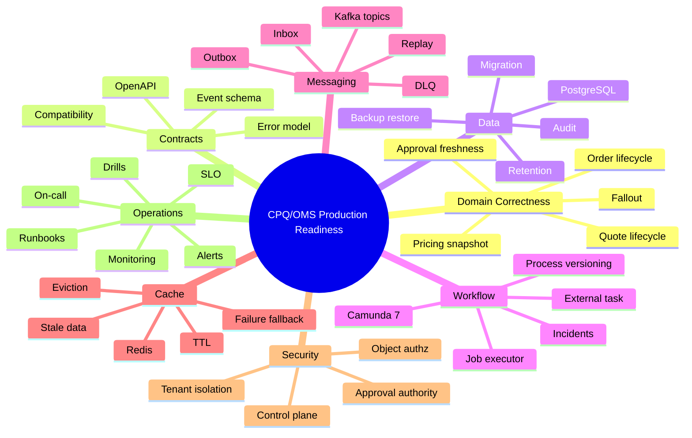
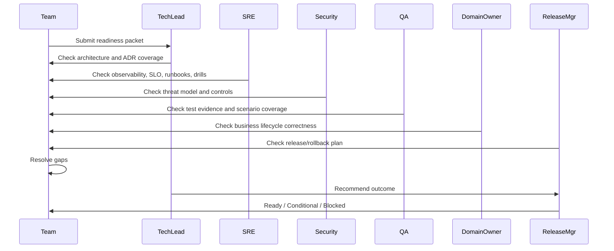

# Production Readiness Review

A CPQ/OMS platform is not production-ready because it deploys.

It is production-ready when the team can answer, with evidence:

- What happens if pricing is slow?
- What happens if catalog cache is stale?
- What happens if quote acceptance is submitted twice?
- What happens if order fulfillment times out after external inventory actually reserved stock?
- What happens if Camunda job executor stops processing jobs?
- What happens if Kafka consumer lag grows for order events?
- What happens if Redis evicts quote preview cache?
- What happens if PostgreSQL migration locks a hot table?
- What happens if billing callback is lost?
- What happens if a tenant user tries to access another tenant's quote?
- What happens if audit export is requested for a disputed quote?
- What happens if a process instance is stuck for three days?
- What happens if a service is rolled back while old process instances keep running?

Production readiness is not a checklist of confidence.

It is a checklist of **evidence**.

This part builds a production readiness review for the enterprise CPQ/OMS platform.

---

## 1. Core Thesis

The thesis:

> A system is production-ready only when its expected failure modes have owners, controls, observability, runbooks, and tested recovery paths.

In a CPQ/OMS platform, “it works on happy path” means very little.

The real production bar is:

```text
Can the platform preserve commercial truth, order truth, tenant isolation, and operational recoverability when dependencies fail, users race, workflows stall, events duplicate, data evolves, and humans intervene?
```

That is the bar.

---

## 2. What PRR Is and Is Not

Production Readiness Review, or PRR, is a structured review before production launch or major release.

It is not:

- an architecture beauty contest,
- a documentation dump,
- a security sign-off only,
- a QA replacement,
- a ritual meeting where everyone says “looks good”.

It is:

- an evidence review,
- a failure-mode review,
- a launch gate,
- an ownership alignment exercise,
- a way to expose untested assumptions before customers do.

The review should end with one of four outcomes:

| Outcome | Meaning |
|---|---|
| Ready | Launch can proceed. |
| Ready with conditions | Launch can proceed after named mitigations or limited scope. |
| Not ready | Launch is blocked until critical gaps are fixed. |
| Deferred | Scope or business timing changed; review must be repeated. |

No vague outcome.

No “probably fine”.

---

## 3. PRR Scope for This Platform

For this CPQ/OMS platform, PRR covers:



This is intentionally broad.

Enterprise CPQ/OMS fails at boundaries.

PRR must inspect boundaries.

---

## 4. Production Readiness Inputs

Do not begin PRR with empty hands.

Required inputs:

```text
[ ] Architecture diagrams
[ ] ADR index
[ ] Service ownership map
[ ] OpenAPI specs
[ ] JSON/event schemas
[ ] Database migration plan
[ ] Camunda BPMN/DMN deployment package
[ ] Kafka topic and consumer ownership list
[ ] Redis keyspace and TTL policy
[ ] Security threat model
[ ] Test evidence summary
[ ] Load/performance report
[ ] Observability dashboard links
[ ] Alert definitions
[ ] Runbooks
[ ] Backup/restore drill results
[ ] Failure drill results
[ ] Release and rollback/roll-forward plan
[ ] Known risks and accepted exceptions
```

If the team cannot provide these, PRR becomes a guessing session.

---

## 5. Readiness Review Flow



The meeting should not discover every gap for the first time.

The readiness packet should make gaps visible before the meeting.

---

## 6. Critical Journey Inventory

Production readiness must be based on journeys, not services.

For CPQ/OMS, define critical journeys:

| Journey | Business meaning |
|---|---|
| Create quote | Sales starts commercial intent. |
| Configure quote | Product offering becomes valid selection. |
| Price quote | Commercial value is calculated and explained. |
| Submit for approval | Policy determines authority required. |
| Approve quote | Authorized human accepts commercial risk. |
| Generate quote document | Customer-facing evidence is produced. |
| Accept quote | Customer commits to commercial content. |
| Create order | Fulfillment obligation begins. |
| Decompose order | Order becomes executable plan. |
| Reserve inventory | Fulfillment readiness is checked/held. |
| Activate/provision | External fulfillment performs action. |
| Billing handoff | Billing authority is requested to activate charges. |
| Handle fallout | Human recovery restores lifecycle progress. |
| Cancel/amend order | Change intent is processed safely. |
| Audit export | Evidence is reconstructable. |

Every critical journey needs:

```text
owner, SLO, dashboard, alert, runbook, failure scenario, test evidence
```

If a journey lacks those, it is not production-ready.

---

## 7. SLO Model

SLOs must attach to user/business value.

Example CPQ/OMS SLOs:

| Journey | SLI | Example SLO |
|---|---|---|
| Quote create | successful command ratio | 99.9% over 30 days excluding validation/user errors |
| Quote pricing | p95 latency | p95 under 800 ms for standard catalog quote preview |
| Quote submit | command success ratio | 99.5% successful non-invalid requests |
| Approval task visibility | projection freshness | 99% of approval tasks visible within 30 seconds |
| Quote acceptance | duplicate prevention | 100% duplicate accept commands produce no duplicate primary order |
| Order start | workflow start success | 99.9% workflow instance started or fallout created within 1 minute |
| Outbox publish | event lag | 99% publish under 60 seconds |
| Billing handoff | completion/known status | 99% known status within 15 minutes |
| Fallout creation | detection latency | 99% retry-exhausted workflow failures create fallout within 2 minutes |
| Audit retrieval | evidence completeness | 100% accepted quotes have price, approval, document, acceptance evidence |

Be careful: not every SLO should be “five nines”.

Use business impact.

An internal projection can tolerate seconds of lag.

Duplicate order creation tolerance is zero.

---

## 8. Error Budget Thinking

For critical journeys, define error budget policy.

Example:

```text
Journey: Quote acceptance
SLO: 99.95% successful acceptance command for valid accepted quote requests over 30 days
Hard invariant: duplicate primary order count must be zero

If SLO burn exceeds threshold:
- freeze non-critical releases to quote/order services;
- prioritize acceptance failure root cause;
- increase monitoring and support coverage;
- run incident review if customer-impacting.
```

Separate SLO violation from invariant violation.

A latency SLO breach is bad.

A duplicate order invariant breach is existential.

---

## 9. Domain Correctness Gate

Domain correctness is the first gate.

```text
[ ] Quote states and transitions are explicit.
[ ] Order states and transitions are explicit.
[ ] Invalid transitions are tested.
[ ] Quote revision immutability is enforced.
[ ] Price result is snapshotted and reproducible.
[ ] Approval decision references exact quote revision.
[ ] Material quote change invalidates approval/pricing/document freshness.
[ ] Accepted quote creates at most one primary order.
[ ] Order cancellation is explicit lifecycle, not deletion.
[ ] Amendment/change order is modeled as new intent over baseline.
[ ] Fallout case has lifecycle and ownership.
[ ] Manual recovery actions are audited and authorization-checked.
```

Evidence:

```text
- state machine tests
- concurrency tests
- database constraints
- command handler tests
- audit samples
- scenario catalog
```

If the team says “the UI prevents it,” the gate fails.

Production correctness must live at command/domain/data boundary.

---

## 10. API Contract Gate

```text
[ ] All public/cross-service HTTP APIs have OpenAPI specs.
[ ] Specs are versioned and reviewed.
[ ] Generated DTOs do not leak into domain model.
[ ] Lifecycle mutations use command-shaped endpoints.
[ ] Error responses follow shared problem detail schema.
[ ] Idempotent commands define idempotency key behavior.
[ ] Optimistic concurrency behavior is documented.
[ ] Pagination/search semantics are stable.
[ ] Tenant and authorization behavior is described.
[ ] Breaking change detection runs in CI.
```

Evidence:

```text
- OpenAPI files
- contract test results
- backward compatibility reports
- sample request/response payloads
```

The contract gate prevents “implementation accidentally became API”.

---

## 11. Event Contract Gate

```text
[ ] Every Kafka topic has owner.
[ ] Every event has schema and version.
[ ] Event envelope includes eventId, eventType, eventVersion, occurredAt, tenantId, producer, correlationId.
[ ] Partition key is documented.
[ ] Retention policy is documented.
[ ] Replay policy is documented.
[ ] Consumer idempotency is implemented.
[ ] DLQ lifecycle is defined.
[ ] Event compatibility checks run in CI.
[ ] Outbox lag is monitored.
```

Evidence:

```text
- event schema repository
- topic ownership matrix
- outbox table metrics
- consumer idempotency tests
- DLQ runbook
- replay drill result
```

PRR should ask:

```text
If this event is published twice, what happens?
If this event arrives late, what happens?
If this event cannot be processed, who owns it?
If we replay a month of events, what breaks?
```

---

## 12. PostgreSQL Readiness Gate

```text
[ ] Schema migrations are versioned.
[ ] Migration lock impact is understood.
[ ] Expand-migrate-contract is used for risky changes.
[ ] Hot tables have appropriate indexes.
[ ] Foreign key constraints protect lifecycle references.
[ ] Partial unique indexes protect business uniqueness where needed.
[ ] Long-running transactions are monitored.
[ ] Connection pool size is budgeted across services.
[ ] Backup/restore drill has been performed.
[ ] Point-in-time recovery objective is defined if required.
[ ] Audit and outbox retention are planned.
[ ] Read replica lag impact is understood.
[ ] Camunda database boundary is separated or explicitly governed.
```

Evidence:

```text
- migration dry-run logs
- explain plans for critical queries
- index list and ownership
- backup restore report
- database dashboard
- lock/bloat monitoring
```

A database is production-ready only when restore is proven.

Backup existence is not enough.

---

## 13. JPA/EclipseLink Readiness Gate

```text
[ ] Aggregate loading boundaries are explicit.
[ ] Lazy loading does not cross API serialization boundary.
[ ] Optimistic locking is used for mutable aggregates.
[ ] Transaction boundaries are command-scoped.
[ ] Bulk updates do not bypass invariants.
[ ] Entity mappings are covered by integration tests.
[ ] N+1 query risks are tested for critical paths.
[ ] EclipseLink cache behavior is understood and safe.
[ ] Entity graph/fetch strategy is defined for critical reads.
[ ] Persistence exceptions map to stable API errors.
```

Evidence:

```text
- integration test logs
- SQL query count tests for critical endpoints
- mapping tests
- optimistic lock conflict tests
```

JPA readiness is not “the app starts”.

It is “the persistence layer preserves aggregate invariants under production access patterns”.

---

## 14. Camunda 7 Readiness Gate

```text
[ ] Camunda topology is documented.
[ ] Workflow Service is the only service using engine APIs directly.
[ ] Process variables are minimal and non-authoritative.
[ ] Business key format is standardized.
[ ] Process definitions are versioned and deployment-controlled.
[ ] Running instance behavior during deployment is understood.
[ ] External task workers are idempotent.
[ ] Retry policies are defined per task type.
[ ] BPMN errors vs technical failures are modeled explicitly.
[ ] Incident handling runbook exists.
[ ] History retention and cleanup policy exists.
[ ] Process migration policy exists.
[ ] Cockpit/Admin access is restricted.
[ ] Workflow metrics and alerts exist.
```

Evidence:

```text
- BPMN/DMN validation result
- workflow scenario tests
- external task duplicate test
- incident drill
- process deployment runbook
- history cleanup configuration
```

Key PRR question:

```text
If a process instance is stuck, can operations identify why, decide whether it is safe to retry, and recover without corrupting order state?
```

If not, Camunda readiness fails.

---

## 15. Kafka Readiness Gate

```text
[ ] Topic naming convention is applied.
[ ] Topic owner is known.
[ ] Producer and consumer owners are documented.
[ ] Partition count and key are justified.
[ ] Retention policy fits replay/diagnostic needs.
[ ] Consumer lag is monitored.
[ ] DLQ is monitored and has owner.
[ ] Reprocessing procedure is tested.
[ ] Schema evolution is controlled.
[ ] Producer outbox is monitored.
[ ] Consumer inbox/deduplication is implemented where required.
[ ] Event replay does not duplicate side effects.
```

Evidence:

```text
- topic registry
- consumer group dashboard
- DLQ replay drill
- schema compatibility report
- idempotent consumer tests
```

A Kafka system without replay discipline is just distributed suspense.

---

## 16. Redis Readiness Gate

```text
[ ] Redis use cases are explicitly non-authoritative.
[ ] Key naming includes tenant and version where required.
[ ] TTL policy exists for every key class.
[ ] Eviction policy is understood.
[ ] Memory usage and hot keys are monitored.
[ ] Cache stampede controls exist for hot paths.
[ ] Redis outage fallback is tested.
[ ] Redis stale data behavior is safe.
[ ] Redis locks are not used as sole correctness mechanism.
[ ] Persistence/failover expectations are documented.
```

Evidence:

```text
- keyspace inventory
- TTL audit
- Redis failure test
- latency dashboard
- memory pressure runbook
```

PRR question:

```text
If Redis is empty, slow, stale, or unavailable, what business truth can be corrupted?
```

Correct answer:

```text
None.
```

Performance may degrade.

Truth must not.

---

## 17. Security Readiness Gate

```text
[ ] Threat model exists.
[ ] Tenant isolation is enforced at API, service, DB, Kafka, Redis, Camunda, and document boundaries.
[ ] Object-level authorization exists for quote/order/task/artifact access.
[ ] Approval authority is policy-driven and audited.
[ ] Control plane operations require privileged scoped roles.
[ ] Service-to-service authentication is enforced.
[ ] Secrets are not stored in repo/config maps/logs.
[ ] Sensitive fields are redacted from logs and events where needed.
[ ] Audit tampering risk is mitigated.
[ ] Security tests include cross-tenant and privilege escalation attempts.
[ ] Dependency and container scans run in CI.
```

Evidence:

```text
- threat model document
- authorization test suite
- security scan report
- audit examples
- access control matrix
```

Security readiness must be domain-specific.

A CPQ quote is not just a record.

It may contain negotiated pricing, discount exceptions, customer strategy, contract terms, and internal approval reasoning.

---

## 18. Observability Readiness Gate

```text
[ ] Structured logs include correlationId, traceId, tenantId, aggregateId where safe.
[ ] Traces propagate across JAX-RS, Kafka, workers, and workflow boundaries where possible.
[ ] Metrics exist for critical journeys, not only infrastructure.
[ ] Dashboards exist for quote, pricing, approval, order, workflow, outbox, Kafka, Redis, PostgreSQL.
[ ] Alerts map to user/business impact.
[ ] Alert runbooks exist.
[ ] Noise budget is controlled.
[ ] Audit logs are separate from diagnostic logs.
[ ] SLO burn is visible for critical journeys.
```

Evidence:

```text
- dashboard screenshots/links
- alert definitions
- trace samples
- log samples
- SLO dashboard
```

Bad alert:

```text
CPU > 80%
```

Better alert:

```text
Quote acceptance valid-command failure rate exceeds threshold for 10 minutes.
```

Infrastructure symptoms matter, but business symptoms should lead.

---

## 19. Runbook Readiness Gate

Runbooks must be executable under stress.

Required runbooks:

```text
[ ] Quote acceptance duplicate detection
[ ] Pricing latency degradation
[ ] Catalog publication rollback/disable
[ ] Approval task stuck or missing
[ ] Camunda failed job / incident recovery
[ ] External task worker outage
[ ] Order fulfillment unknown outcome
[ ] Inventory reservation reconciliation
[ ] Billing handoff reconciliation
[ ] Kafka consumer lag
[ ] DLQ triage and replay
[ ] Outbox publisher stuck
[ ] Redis memory pressure
[ ] PostgreSQL lock/migration incident
[ ] Projection rebuild
[ ] Tenant suspension
[ ] Audit evidence export
[ ] Security incident / unauthorized access attempt
```

Each runbook should contain:

```text
- symptom
- impact
- dashboards
- immediate mitigation
- diagnosis steps
- safe recovery actions
- unsafe actions
- escalation owner
- rollback/roll-forward decision
- customer/support communication notes if needed
- post-incident evidence to preserve
```

The most important section is often:

```text
Unsafe actions
```

Example:

```text
Do not manually update order status to COMPLETED if billing handoff is unknown.
Do not re-run ReserveInventory without checking external reservation status.
Do not delete Camunda process instances to clear incidents.
Do not flush all Redis keys in production without tenant/keyspace impact analysis.
```

Runbooks prevent panic-driven corruption.

---

## 20. Failure Drill Gate

PRR should require failure drills.

Example drills:

| Drill | Expected result |
|---|---|
| Redis unavailable during configuration | UI degrades; quote submit validates against PostgreSQL; no truth corruption. |
| Pricing service p95 latency high | timeout/circuit policy activates; user gets safe retryable error; metrics/alert fire. |
| Kafka consumer stopped | lag alert fires; recovery catches up; no duplicate side effect. |
| Outbox publisher stopped | outbox lag grows; alert fires; publisher restart publishes pending events. |
| External inventory timeout after success | system enters unknown/resolving state; reconciliation prevents duplicate reservation. |
| Camunda external task worker down | tasks remain locked/retried according to policy; incident/fallout created if needed. |
| PostgreSQL migration lock conflict | deploy aborts or migration is rescheduled; app remains healthy. |
| Cross-tenant quote access attempt | denied, audited, no data leakage. |
| Process definition upgrade | old instances continue or migrate according to plan. |
| Projection rebuild | search degraded/rebuilt without changing source truth. |

Drill evidence:

```text
- date
- environment
- scenario
- commands executed
- observed metrics/logs
- outcome
- gaps found
- follow-up actions
```

If failure has never been practiced, production will be the practice.

---

## 21. Release Readiness Gate

```text
[ ] Release scope is clear.
[ ] Services included are listed.
[ ] OpenAPI/schema changes are listed.
[ ] Database migrations are listed.
[ ] BPMN/DMN deployments are listed.
[ ] Kafka topic/schema changes are listed.
[ ] Redis key changes are listed.
[ ] Feature flags are listed.
[ ] Deployment order is defined.
[ ] Smoke tests are defined.
[ ] Roll-forward plan is defined.
[ ] Rollback limitations are explicit.
[ ] Customer/support impact is known.
[ ] On-call coverage is scheduled.
```

For this platform, rollback is often not simple.

Why?

Because you may have:

- migrated database schema,
- started new Camunda process versions,
- emitted new Kafka event versions,
- generated quote artifacts,
- accepted customer quotes,
- created external reservations,
- triggered billing handoffs.

So PRR should prefer:

```text
safe rollout + feature flags + compatibility + roll-forward
```

over naive rollback.

---

## 22. Data Recovery Gate

```text
[ ] RPO and RTO are defined.
[ ] Backup schedule is documented.
[ ] Restore drill has been completed.
[ ] Restore target environment exists or can be created.
[ ] Audit evidence recovery is tested.
[ ] Object storage/document artifact recovery is tested.
[ ] Kafka replay limitations are understood.
[ ] Projection rebuild is tested.
[ ] Camunda state recovery expectations are documented.
[ ] Redis recovery expectations are documented.
```

Define explicitly:

| Data | Authority | Recovery method |
|---|---|---|
| Quote/order state | PostgreSQL | DB restore/PITR, migration replay if applicable |
| Audit trail | PostgreSQL/audit store | restore + integrity check |
| Quote artifact binary | object storage | bucket/object restore + hash validation |
| Kafka events | Kafka retention/archive | replay only within retention/archive limits |
| Search projection | derived DB/search index | rebuild from authoritative data/events |
| Redis cache | non-authoritative | warm/rebuild; no restore needed for truth |
| Camunda runtime | Camunda DB | DB restore; process consistency check |

Never say “we can rebuild it” unless a rebuild has been tested.

---

## 23. Compliance and Audit Gate

```text
[ ] Accepted quote can be reconstructed.
[ ] Price result trace is stored.
[ ] Approval decision evidence is stored.
[ ] Document artifact hash/version is stored.
[ ] Customer acceptance evidence is stored.
[ ] Order creation references accepted quote revision.
[ ] Manual recovery is audited.
[ ] Admin/control-plane changes are audited.
[ ] Audit records include actor, authority, time, target, reason, correlation.
[ ] Sensitive data retention policy exists.
[ ] Audit export path exists.
```

PRR question:

```text
For quote Q accepted on date D, can we prove what was configured, priced, approved, shown, accepted, and converted to order?
```

If the answer is no, the system is not enterprise-grade.

---

## 24. Support Readiness Gate

```text
[ ] Support team can search quote/order by business identifiers.
[ ] Support can see lifecycle timeline.
[ ] Support can see workflow status without raw engine access.
[ ] Support can see fallout cases and owner.
[ ] Support can see external correlation IDs.
[ ] Support can distinguish customer error, validation error, system error, and pending async state.
[ ] Support has escalation path.
[ ] Support has safe manual recovery procedure.
[ ] Support cannot bypass domain invariants casually.
```

Support UX is production infrastructure.

If only engineers can diagnose production issues, the platform is not operationally mature.

---

## 25. Capacity Readiness Gate

```text
[ ] Expected traffic profile is documented.
[ ] Peak quote configuration sessions are estimated.
[ ] Pricing request volume is estimated.
[ ] Approval task volume is estimated.
[ ] Order fulfillment throughput is estimated.
[ ] Camunda job executor capacity is tested.
[ ] Kafka consumer throughput is tested.
[ ] PostgreSQL connection pool budget is tested.
[ ] Redis memory growth is estimated.
[ ] Object storage growth for quote artifacts is estimated.
[ ] Load test report exists.
```

Capacity model example:

```text
Peak hour:
- 2,000 active sales users
- 12,000 quote preview pricing calls/hour
- 1,500 quote submits/hour
- 300 approval decisions/hour
- 900 quote acceptances/hour
- 900 order starts/hour
- 5,000 fulfillment step events/hour
```

Then validate:

```text
Can pricing p95 remain within target?
Can outbox publish keep up?
Can Camunda jobs keep up?
Can DB pool avoid saturation?
Can Redis memory stay below threshold?
```

No production readiness without capacity evidence.

---

## 26. Dependency Readiness Gate

External dependencies must be modeled as unreliable.

```text
[ ] CRM availability assumptions are documented.
[ ] Catalog publication dependency is documented.
[ ] Inventory API timeout/retry/reconciliation is documented.
[ ] Billing API/event dependency is documented.
[ ] Document renderer dependency is documented.
[ ] Notification provider dependency is documented.
[ ] Identity provider dependency is documented.
[ ] Each dependency has timeout, retry, fallback, and owner.
[ ] Unknown outcome policy exists for side-effecting dependencies.
```

For each dependency:

| Dependency | Timeout | Retry | Unknown outcome policy | Fallback | Owner |
|---|---:|---|---|---|---|
| Inventory reservation | 2s | limited, idempotent | query reservation status | fallout if unresolved | Fulfillment team |
| Billing handoff | async | event retry | reconcile billing request | pending/fallout | Billing integration team |
| Document renderer | 5s | retry queue | safe to regenerate if input hash same | artifact pending | Document team |
| Notification provider | async | retry with DLQ | delivery unknown is communication state | alternate channel/manual | Notification team |

Side-effecting dependencies need special care.

Timeout does not mean failure.

It often means unknown.

---

## 27. Production Readiness Scoring

Use scoring for visibility, not as a fake precision metric.

| Category | Status | Notes |
|---|---|---|
| Domain correctness | Green | Invariants tested. |
| API contracts | Green | Compatibility checks in CI. |
| Event contracts | Yellow | DLQ replay drill pending. |
| PostgreSQL | Yellow | Restore drill done, migration lock test pending. |
| Camunda 7 | Yellow | Incident drill done, process migration drill pending. |
| Kafka | Yellow | Consumer lag alert exists, replay drill pending. |
| Redis | Green | Outage fallback tested. |
| Security | Red | Cross-tenant artifact access test failing. |
| Observability | Yellow | Quote dashboards done, billing handoff SLO missing. |
| Runbooks | Yellow | Several unsafe action sections missing. |
| Support readiness | Green | Fallout worklist available. |
| Release plan | Yellow | Roll-forward plan needs detail. |

Decision rule:

```text
Any Red in security, data integrity, domain invariant, or recovery blocks launch.
Yellow can launch only with explicit condition, owner, due date, and risk acceptance.
```

Do not average readiness scores.

One red invariant can invalidate the whole launch.

---

## 28. Conditional Launch

Sometimes business pressure requires phased launch.

Conditional launch is acceptable only if constraints are explicit.

Example:

```text
Launch condition:
- launch only for tenant group: internal-sales-pilot
- maximum quote line count: 20
- no amendment/change order flow
- billing handoff in observe-only mode
- manual approval fallback enabled
- on-call coverage during business hours + 4 hours
- daily readiness review for first 2 weeks
```

A conditional launch is not a loophole.

It is a reduced blast radius.

---

## 29. Readiness Packet Template

Use this template.

```mdx
# Production Readiness Packet: CPQ/OMS Release <version>

Date:
Release owner:
Technical owner:
Domain owner:
SRE owner:
Security owner:

## Scope

Services:
APIs:
Events:
Database migrations:
BPMN/DMN deployments:
Feature flags:
Tenants/customers affected:

## Critical Journeys

| Journey | Owner | SLO | Dashboard | Runbook | Test Evidence |
|---|---|---|---|---|---|

## Architecture Decisions

Linked ADRs:
Known deviations:
Accepted risks:

## Domain Invariants

| Invariant | Enforcement | Test | Monitoring |
|---|---|---|---|

## Failure Modes

| Failure mode | Behavior | Alert | Runbook | Drill |
|---|---|---|---|---|

## Security

Threat model:
Access matrix:
Security tests:
Known risks:

## Data and Recovery

Migration plan:
Backup restore evidence:
Projection rebuild evidence:
Audit export evidence:

## Operations

Dashboards:
Alerts:
Runbooks:
On-call:
Escalation:

## Release Plan

Deployment order:
Smoke tests:
Feature flag plan:
Roll-forward plan:
Rollback limitations:

## Decision

Ready / Conditional / Blocked
Conditions:
Approvers:
```

This packet becomes permanent launch evidence.

---

## 30. Example PRR Finding

Finding:

```text
Billing handoff callback can be lost. OMS marks order line BILLING_REQUESTED but no reconciliation job exists.
```

Severity:

```text
High
```

Why:

```text
Order may remain pending indefinitely and support cannot distinguish billing delay from lost callback.
```

Required fix:

```text
- Add billing_handoff table with status and next_reconcile_at.
- Add reconciliation job querying billing by externalRequestId.
- Create fallout after SLA breach.
- Add dashboard for billing handoff pending age.
- Add runbook.
- Add failure drill: drop callback event and verify reconciliation.
```

Launch decision:

```text
Blocked for tenants using automated billing handoff.
Conditional launch allowed only if billing handoff feature flag is disabled.
```

This is how PRR should behave.

Specific.

Actionable.

Risk-based.

---

## 31. Production Readiness Anti-Patterns

### Anti-Pattern 1: Checklist Without Evidence

```text
Monitoring: yes
Runbook: yes
Security: yes
```

Meaningless.

Require links, tests, dashboards, logs, drill reports.

### Anti-Pattern 2: Happy-Path E2E as Readiness

One successful demo does not prove production readiness.

Test failure, concurrency, duplicate commands, stale data, lost callbacks, and partial outages.

### Anti-Pattern 3: Rollback Fantasy

Distributed systems with DB migrations, events, workflow instances, and external side effects often cannot simply roll back.

Prefer compatibility and roll-forward.

### Anti-Pattern 4: Raw Camunda as Support UX

Expecting business support to recover orders through raw engine screens is dangerous.

Build fallout and operational control surfaces.

### Anti-Pattern 5: Cache as Emergency Truth

Redis can improve latency.

It must not become the only place where commercial facts exist.

### Anti-Pattern 6: No Owner for Yellow Risks

“Known issue” without owner and due date is hidden launch debt.

### Anti-Pattern 7: Security as Final Checklist

Security must be tested through domain scenarios: cross-tenant quote access, approval privilege escalation, artifact download leakage, task hijacking.

---

## 32. Top 1% Readiness Questions

Ask these in PRR:

```text
What is the first customer-visible symptom if this fails?
What invariant can never be violated, even under partial outage?
What data can be rebuilt, and from what authority?
What data cannot be rebuilt?
What operation is unsafe even if it seems to fix the issue?
What is the oldest running workflow instance after deployment, and what version is it on?
Can we reproduce a disputed quote exactly?
Can we explain why a discount was approved?
Can a duplicate event duplicate a side effect?
Can a timeout create duplicate external reservation?
What happens if outbox publisher is down for six hours?
What happens if a tenant is suspended while orders are in progress?
Who can manually recover fallout, and what prevents abuse?
What will wake up on-call before customers complain?
What will support see before engineering logs in?
```

These questions separate production systems from playgrounds.

---

## 33. Final PRR Decision Form

```text
Production Readiness Decision

Release:
Date:
Decision: Ready / Conditional / Blocked

Summary:

Critical blockers:

Conditional risks:

Accepted risks:

Required follow-up:

Approvers:
- Technical owner:
- Domain owner:
- SRE/Operations:
- Security:
- QA:
- Release manager:
```

Store this with release artifacts.

Future incidents should reference it.

If the PRR accepted a risk, incident review should ask whether that acceptance was valid.

---

## 34. Mental Model

Production readiness is not a single state.

It is a contract between:

- product expectations,
- domain invariants,
- engineering design,
- operational capability,
- security posture,
- recovery evidence,
- human support workflow.

A CPQ/OMS platform handles commercial promises and fulfillment obligations.

That means production readiness must protect not only uptime, but also truth:

```text
commercial truth,
approval truth,
order truth,
workflow truth,
audit truth,
tenant boundary truth.
```

If any of those cannot survive failure, the system is not ready.

---

## 35. References

- Google SRE, “Launch Coordination Engineering: Launch Checklist” — https://sre.google/sre-book/launch-checklist/
- Google SRE, “Reliable Product Launches at Scale” — https://sre.google/sre-book/reliable-product-launches/
- Google SRE, “Evolving SRE Engagement Model / Production Readiness Review” — https://sre.google/sre-book/evolving-sre-engagement-model/
- AWS Well-Architected Framework pillars — https://docs.aws.amazon.com/wellarchitected/latest/framework/the-pillars-of-the-framework.html
- OpenTelemetry Observability Primer — https://opentelemetry.io/docs/concepts/observability-primer/

---

## 36. Closing

A production readiness review is not there to slow delivery.

It is there to prevent the most expensive kind of speed:

```text
launch fast, corrupt business truth, recover manually, lose trust, then spend months rebuilding confidence.
```

For CPQ/OMS, production readiness means:

```text
the system can sell, approve, accept, fulfill, fail, recover, explain, and prove what happened.
```

That is the bar.

In the next part, we move from governance and readiness into the reference implementation walkthrough: from create quote to fulfilled order.
