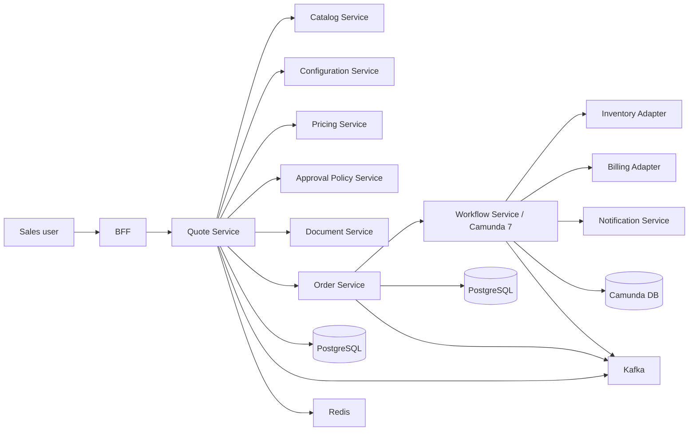
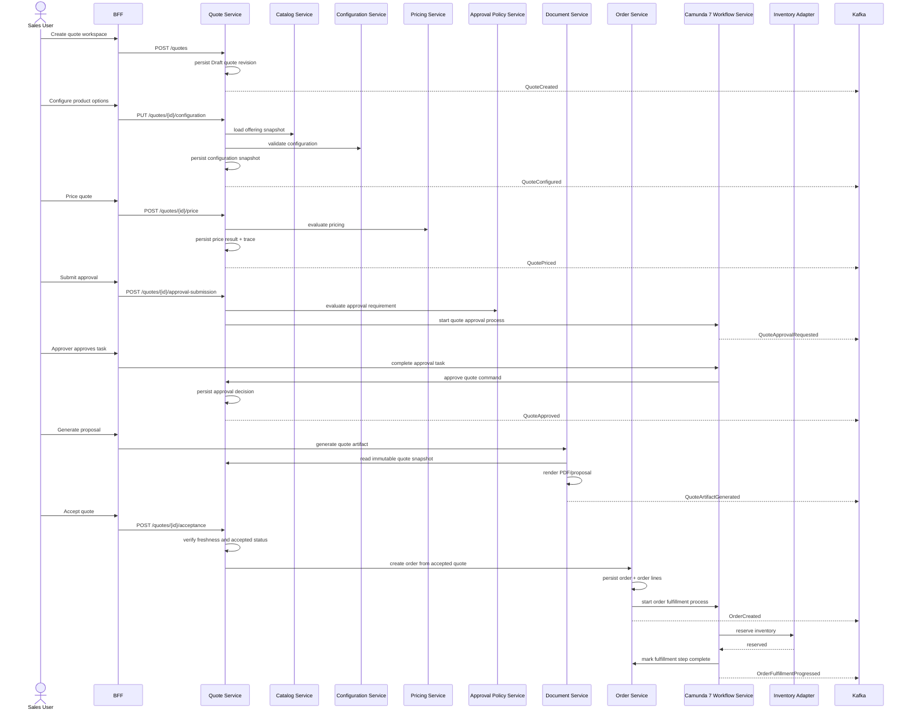
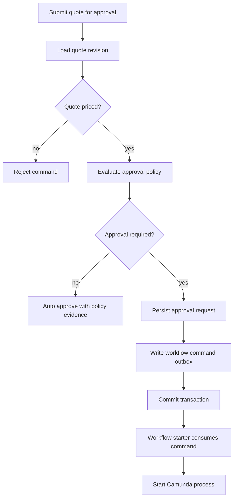
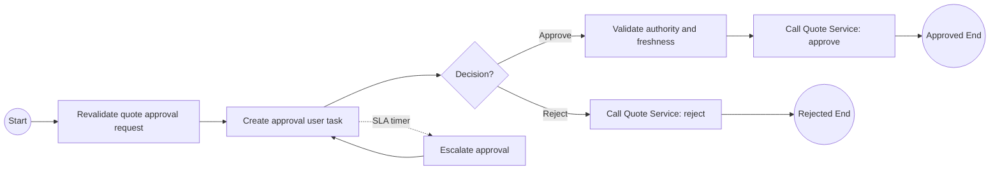
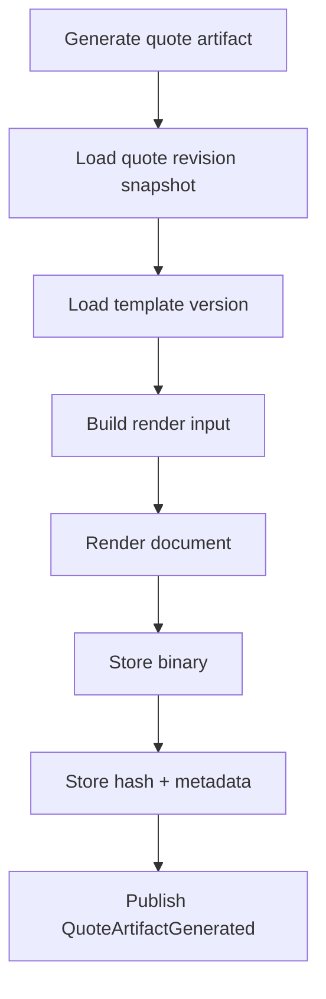
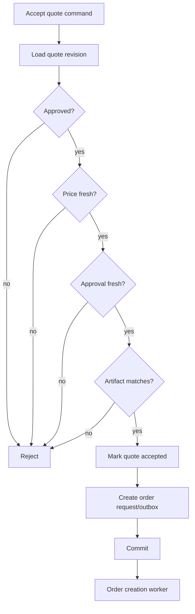
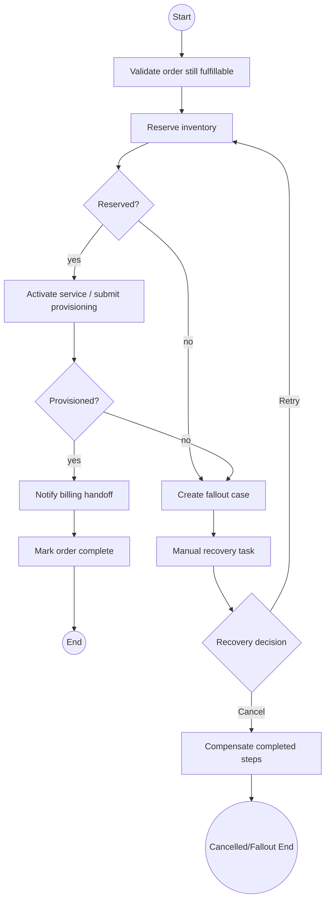

# Reference Implementation Walkthrough

This part is the implementation walkthrough.

Not a toy CRUD app.

Not a “hello quote” endpoint.

Not a single service pretending to be a microservice platform.

The goal is to walk through a **minimum production-shaped CPQ/OMS slice**:

```text
create quote
  -> configure quote
  -> price quote
  -> submit for approval
  -> approve quote
  -> generate quote artifact
  -> accept quote
  -> create order
  -> start order orchestration
  -> fulfill order
  -> publish evidence events
  -> operate failures
```

This is the smallest slice that proves the architecture.

If this slice is weak, the rest of the system will be weak.

---

## 1. The Reference Slice

The reference implementation is intentionally narrow but deep.

It does not implement every CPQ feature.

It implements the **spine** of the platform.



The reference slice has five rules.

1. **PostgreSQL owns business truth.**
2. **Camunda owns long-running orchestration, not domain truth.**
3. **Kafka publishes committed facts, not hopes.**
4. **Redis accelerates reads, never decides truth.**
5. **OpenAPI/Schema contracts are the first review surface.**

Those rules sound simple.

They prevent most enterprise failure modes.

---

## 2. Repository Shape

The implementation can be a modular monorepo.

The point is not monorepo ideology.

The point is that all contracts, schemas, services, migrations, workflows, and tests are versioned together during learning.

```text
enterprise-cpq-oms/
  pom.xml
  platform-bom/
    pom.xml
  contracts/
    openapi/
      quote-api.yaml
      order-api.yaml
      task-api.yaml
    schemas/
      events/
        quote-priced.v1.schema.json
        quote-approved.v1.schema.json
        order-created.v1.schema.json
      commands/
      workflow-variables/
  shared/
    error-model/
    idempotency/
    observability/
    security-context/
    test-support/
  services/
    catalog-service/
    configuration-service/
    pricing-service/
    quote-service/
    order-service/
    workflow-service/
    document-service/
    notification-service/
    bff-service/
  workers/
    order-fulfillment-worker/
    notification-worker/
    outbox-publisher/
    projection-consumer/
  workflows/
    quote-approval/
      quote-approval.bpmn
      approval-policy.dmn
    order-fulfillment/
      order-fulfillment.bpmn
  db/
    quote-service/
      migration/
    order-service/
      migration/
    workflow-service/
      migration/
  deploy/
    local/
    staging/
    production/
  docs/
    adr/
    runbooks/
    prr/
```

A senior reviewer looks for one thing immediately:

```text
Can I find the authority for each contract and lifecycle?
```

If the answer is no, the project will rot.

---

## 3. Runtime Slice

For a local production-shaped environment:

```text
PostgreSQL      -> business DBs + Camunda DB
Kafka           -> event propagation
Redis           -> cache/idempotency fast-path/rate limit
Java services   -> JAX-RS/Jersey resources
Camunda 7       -> workflow runtime
Outbox publisher-> committed event publisher
Workers         -> external task workers + event consumers
```

The local stack should be disposable.

But it should not be fake.

The local stack must exercise:

- PostgreSQL constraints,
- JPA optimistic locking,
- idempotency table,
- outbox table,
- Kafka publishing,
- Redis TTL behavior,
- Camunda process start,
- external task completion,
- workflow incident path,
- audit event creation,
- OpenAPI validation,
- authorization filter.

If local development bypasses these, production bugs will hide until launch.

---

## 4. End-to-End Sequence

The reference happy path is this:



This sequence is not the full product.

It is the spinal cord.

---

## 5. The Golden Path Command Set

The minimal command set:

```text
POST   /quotes
PUT    /quotes/{quoteId}/configuration
POST   /quotes/{quoteId}/pricing
POST   /quotes/{quoteId}/approval-submission
POST   /workflow-tasks/{taskId}/completion
POST   /quotes/{quoteId}/artifacts
POST   /quotes/{quoteId}/acceptance
POST   /orders
POST   /orders/{orderId}/cancellation
GET    /quotes/{quoteId}
GET    /orders/{orderId}
GET    /worklist/tasks
```

Notice the shape.

The command endpoints are lifecycle verbs.

They are not entity patch endpoints pretending to be domain actions.

Bad API:

```http
PATCH /quotes/{id}
{
  "status": "APPROVED"
}
```

Good API:

```http
POST /quotes/{id}/approval-decisions
{
  "decision": "APPROVE",
  "reasonCode": "DISCOUNT_WITHIN_MANAGER_AUTHORITY",
  "comment": "Approved for strategic account renewal.",
  "quoteRevision": 4
}
```

The second form gives the system enough information to defend the decision.

---

## 6. OpenAPI Contract Slice

A command contract should express domain semantics.

Example: accept quote.

```yaml
paths:
  /quotes/{quoteId}/acceptance:
    post:
      operationId: acceptQuote
      parameters:
        - name: quoteId
          in: path
          required: true
          schema:
            type: string
        - name: Idempotency-Key
          in: header
          required: true
          schema:
            type: string
        - name: If-Match
          in: header
          required: true
          schema:
            type: string
      requestBody:
        required: true
        content:
          application/json:
            schema:
              $ref: '#/components/schemas/AcceptQuoteRequest'
      responses:
        '202':
          description: Quote accepted and order creation started
          content:
            application/json:
              schema:
                $ref: '#/components/schemas/AcceptQuoteResponse'
        '409':
          description: Quote cannot be accepted in current state
          content:
            application/problem+json:
              schema:
                $ref: '#/components/schemas/Problem'
```

Request:

```yaml
AcceptQuoteRequest:
  type: object
  required:
    - quoteRevision
    - acceptedBy
    - acceptanceEvidence
  properties:
    quoteRevision:
      type: integer
      minimum: 1
    acceptedBy:
      type: string
    acceptanceEvidence:
      type: object
      required:
        - method
        - acceptedAt
      properties:
        method:
          type: string
          enum: [DIGITAL_SIGNATURE, EMAIL_CONFIRMATION, MANUAL_ENTRY]
        acceptedAt:
          type: string
          format: date-time
        artifactId:
          type: string
```

The presence of `quoteRevision` is deliberate.

Acceptance is not “accept current quote”.

Acceptance is “accept the exact quote revision presented to the customer”.

---

## 7. Quote Service Resource Layer

A JAX-RS resource should be thin.

It should not contain pricing logic, approval logic, or persistence gymnastics.

```java
@Path("/quotes")
@Consumes(MediaType.APPLICATION_JSON)
@Produces(MediaType.APPLICATION_JSON)
public class QuoteResource {

    private final QuoteApplicationService quoteApplicationService;

    @POST
    public Response createQuote(
            @HeaderParam("Idempotency-Key") String idempotencyKey,
            CreateQuoteRequest request,
            @Context SecurityContext securityContext) {

        CommandContext context = CommandContext.from(securityContext, idempotencyKey);
        CreateQuoteResult result = quoteApplicationService.createQuote(context, request);

        return Response.status(Response.Status.CREATED)
                .entity(result.toResponse())
                .tag(result.etag())
                .build();
    }

    @POST
    @Path("/{quoteId}/acceptance")
    public Response acceptQuote(
            @PathParam("quoteId") String quoteId,
            @HeaderParam("Idempotency-Key") String idempotencyKey,
            @HeaderParam("If-Match") String ifMatch,
            AcceptQuoteRequest request,
            @Context SecurityContext securityContext) {

        CommandContext context = CommandContext.from(securityContext, idempotencyKey, ifMatch);
        AcceptQuoteResult result = quoteApplicationService.acceptQuote(context, quoteId, request);

        return Response.accepted(result.toResponse())
                .tag(result.etag())
                .build();
    }
}
```

The resource does four things:

1. map HTTP to command,
2. extract context,
3. delegate,
4. map result to HTTP response.

Nothing more.

---

## 8. Application Service Transaction Shape

The application service owns the use case.

```java
public final class QuoteApplicationService {

    private final QuoteRepository quoteRepository;
    private final PricingGateway pricingGateway;
    private final ApprovalPolicyGateway approvalPolicyGateway;
    private final OutboxRepository outboxRepository;
    private final IdempotencyService idempotencyService;
    private final AuthorizationService authorizationService;
    private final Clock clock;

    @Transactional
    public PriceQuoteResult priceQuote(CommandContext context, String quoteId, PriceQuoteRequest request) {
        return idempotencyService.execute(context.idempotencyKey(), "QUOTE_PRICE", () -> {
            authorizationService.assertCanPriceQuote(context.actor(), quoteId);

            Quote quote = quoteRepository.getForUpdateByBusinessId(quoteId, context.tenantId());
            quote.assertRevision(request.quoteRevision());
            quote.assertCanBePriced();

            PriceEvaluation evaluation = pricingGateway.evaluate(quote.toPricingInput());
            quote.recordPrice(evaluation.toPriceResult(clock.instant()));

            quoteRepository.save(quote);

            outboxRepository.append(DomainEvent.quotePriced(
                    quote.tenantId(),
                    quote.quoteId(),
                    quote.revision(),
                    quote.priceResultId(),
                    context.correlationId(),
                    clock.instant()
            ));

            return PriceQuoteResult.from(quote);
        });
    }
}
```

The transaction writes:

- quote state,
- price result,
- price trace,
- transition log,
- audit record,
- outbox event,
- idempotency record.

It does not publish Kafka directly inside the transaction.

That is the outbox publisher's job.

---

## 9. Aggregate Boundary

The quote aggregate does not know HTTP, Kafka, Camunda, or Redis.

It knows commercial invariants.

```java
public final class Quote {

    private QuoteStatus status;
    private int revision;
    private ConfigurationSnapshot configurationSnapshot;
    private PriceResult priceResult;
    private ApprovalSnapshot approvalSnapshot;
    private ArtifactSnapshot artifactSnapshot;

    public void recordPrice(PriceResult newPriceResult) {
        requireStatus(QuoteStatus.CONFIGURED, QuoteStatus.PRICED, QuoteStatus.APPROVAL_REJECTED);
        requireConfigurationSnapshot();

        this.priceResult = newPriceResult;
        this.approvalSnapshot = null;
        this.artifactSnapshot = null;
        this.status = QuoteStatus.PRICED;
        this.revision++;
    }

    public void approve(ApprovalDecision decision) {
        requireStatus(QuoteStatus.PENDING_APPROVAL);
        requirePriceResult();
        requireDecisionMatchesCurrentRevision(decision);

        this.approvalSnapshot = ApprovalSnapshot.from(decision);
        this.status = QuoteStatus.APPROVED;
        this.revision++;
    }

    public void accept(AcceptanceEvidence evidence) {
        requireStatus(QuoteStatus.APPROVED);
        requireFreshPrice();
        requireFreshApproval();
        requireArtifactPresentedToCustomer(evidence.artifactId());

        this.status = QuoteStatus.ACCEPTED;
        this.revision++;
    }
}
```

The important thing is not the Java syntax.

The important thing is this:

```text
Every state transition invalidates dependent evidence explicitly.
```

Change configuration?

Price becomes stale.

Change price?

Approval becomes stale.

Regenerate proposal?

Customer acceptance must reference the correct artifact.

That is CPQ correctness.

---

## 10. PostgreSQL Persistence Slice

A minimal quote schema:

```sql
create table quote_revision (
    id uuid primary key,
    tenant_id text not null,
    quote_id text not null,
    revision integer not null,
    status text not null,
    customer_account_id text not null,
    sales_owner_id text not null,
    version integer not null,
    created_at timestamptz not null,
    updated_at timestamptz not null,
    unique (tenant_id, quote_id, revision)
);

create table quote_line (
    id uuid primary key,
    quote_revision_id uuid not null references quote_revision(id),
    parent_line_id uuid references quote_line(id),
    line_number text not null,
    product_offering_id text not null,
    product_offering_version text not null,
    quantity numeric(19, 6) not null,
    action text not null,
    configuration_snapshot jsonb not null,
    unique (quote_revision_id, line_number)
);

create table quote_price_result (
    id uuid primary key,
    quote_revision_id uuid not null references quote_revision(id),
    pricing_policy_version text not null,
    currency text not null,
    total_amount numeric(19, 6) not null,
    trace jsonb not null,
    created_at timestamptz not null,
    unique (quote_revision_id)
);

create table quote_approval_decision (
    id uuid primary key,
    quote_revision_id uuid not null references quote_revision(id),
    decision text not null,
    approver_id text not null,
    authority_snapshot jsonb not null,
    reason_code text not null,
    comment text,
    decided_at timestamptz not null
);

create table outbox_event (
    id uuid primary key,
    tenant_id text not null,
    aggregate_type text not null,
    aggregate_id text not null,
    aggregate_revision integer not null,
    event_type text not null,
    event_version integer not null,
    payload jsonb not null,
    headers jsonb not null,
    status text not null,
    created_at timestamptz not null,
    published_at timestamptz
);
```

The schema is not complete.

It shows the design direction.

Important choices:

- quote revision is explicit,
- line tree is explicit,
- snapshots are stored as evidence,
- price result is immutable per revision,
- approval decision stores authority snapshot,
- outbox event is written in the same transaction.

---

## 11. EclipseLink JPA Mapping Direction

Do not map everything bidirectionally.

Do not let JPA object graphs become your domain model by accident.

A production-shaped entity mapping is boring on purpose.

```java
@Entity
@Table(name = "quote_revision")
public class QuoteRevisionEntity {

    @Id
    private UUID id;

    @Column(name = "tenant_id", nullable = false)
    private String tenantId;

    @Column(name = "quote_id", nullable = false)
    private String quoteId;

    @Column(name = "revision", nullable = false)
    private int revision;

    @Enumerated(EnumType.STRING)
    @Column(name = "status", nullable = false)
    private QuoteStatus status;

    @Version
    @Column(name = "version", nullable = false)
    private int version;

    @OneToMany(mappedBy = "quoteRevision", cascade = CascadeType.ALL, orphanRemoval = true)
    private List<QuoteLineEntity> lines = new ArrayList<>();
}
```

Mapping rules:

```text
JPA entity != API DTO
JPA entity != Kafka event
JPA entity != Camunda variable
JPA entity != search projection
JPA entity != UI view model
```

The mapping boundary is not ceremony.

It is how you prevent accidental coupling.

---

## 12. Outbox Publisher

The outbox publisher is a worker.

It polls unpublished events, publishes to Kafka, and marks them published.

```java
public final class OutboxPublisherJob {

    public void publishBatch() {
        List<OutboxEvent> events = outboxRepository.claimBatch(100);

        for (OutboxEvent event : events) {
            try {
                kafkaPublisher.publish(
                        event.topic(),
                        event.partitionKey(),
                        event.payload(),
                        event.headers()
                );

                outboxRepository.markPublished(event.id(), clock.instant());
            } catch (Exception ex) {
                outboxRepository.recordFailure(event.id(), ex.getMessage(), clock.instant());
            }
        }
    }
}
```

The claim query must avoid double publishing by competing workers.

Typical PostgreSQL shape:

```sql
select id
from outbox_event
where status = 'PENDING'
order by created_at
limit 100
for update skip locked;
```

This still does not promise exactly-once business processing.

Consumers must be idempotent.

---

## 13. Event Envelope

An event is not just a payload.

It is a committed fact plus enough context to process it safely.

```json
{
  "eventId": "01JZ1R6S8T7XK4A5Q9ZQ8Y6T4Q",
  "eventType": "QuotePriced",
  "eventVersion": 1,
  "occurredAt": "2026-07-02T10:15:30Z",
  "tenantId": "tenant-acme",
  "aggregateType": "QUOTE",
  "aggregateId": "Q-2026-000123",
  "aggregateRevision": 4,
  "correlationId": "corr-78e0a",
  "causationId": "cmd-price-quote-001",
  "actor": {
    "actorId": "user-100",
    "actorType": "USER"
  },
  "payload": {
    "quoteId": "Q-2026-000123",
    "quoteRevision": 4,
    "priceResultId": "price-123",
    "currency": "USD",
    "totalAmount": "128000.00"
  }
}
```

The `aggregateId` is the partition key for quote events.

That preserves order per quote.

It does not preserve global order.

You do not need global order.

You need aggregate order.

---

## 14. Submit Quote for Approval

Approval submission bridges quote domain and workflow.

The Quote Service should not let Camunda decide whether approval is needed.

Camunda executes the approval lifecycle.

The domain/policy layer decides why approval is needed.



This decouples quote transaction from workflow start.

If Camunda is down, the quote state is still clear:

```text
PENDING_APPROVAL_WORKFLOW_START
```

A recovery worker can start the workflow later.

Do not hide this as a generic 500.

---

## 15. Quote Approval BPMN

Minimal BPMN shape:



The actual `.bpmn` file belongs in `workflows/quote-approval`.

Camunda variables should be minimal:

```json
{
  "tenantId": "tenant-acme",
  "quoteId": "Q-2026-000123",
  "quoteRevision": 4,
  "approvalRequestId": "apr-123",
  "correlationId": "corr-78e0a"
}
```

Do not store full quote payload as process variables.

Long-running process data becomes stale.

The workflow should call domain services to revalidate important decisions.

---

## 16. Completing Approval Task

Do not expose raw Camunda task completion directly to the frontend.

Create a semantic API.

```http
POST /workflow-tasks/{taskId}/completion
Content-Type: application/json
Idempotency-Key: task-complete-123

{
  "decision": "APPROVE",
  "reasonCode": "MANAGER_APPROVED_DISCOUNT",
  "comment": "Discount approved for committed renewal.",
  "observedQuoteRevision": 4
}
```

The Workflow Service then:

1. verifies the user can act on the task,
2. verifies task belongs to the tenant,
3. verifies task type is approval task,
4. verifies the observed quote revision,
5. completes Camunda task,
6. calls Quote Service or lets workflow service task call Quote Service,
7. records audit.

The frontend never mutates quote status directly.

---

## 17. Artifact Generation

A quote artifact is evidence.

It must be reproducible enough to defend what was presented.



Artifact metadata:

```sql
create table quote_artifact (
    id uuid primary key,
    tenant_id text not null,
    quote_id text not null,
    quote_revision integer not null,
    artifact_type text not null,
    template_id text not null,
    template_version text not null,
    storage_uri text not null,
    content_hash text not null,
    generated_by text not null,
    generated_at timestamptz not null,
    unique (tenant_id, quote_id, quote_revision, artifact_type, template_version)
);
```

Acceptance must reference the artifact.

Otherwise the system cannot prove what the customer accepted.

---

## 18. Accept Quote and Create Order

This is the highest-risk handoff.

Quote acceptance creates order intent.

It must be idempotent.



There are two acceptable implementation styles:

### Option A: Synchronous order creation inside acceptance

The Quote Service calls the Order Service during acceptance.

This is simple.

But it creates a distributed failure boundary.

If Quote Service marks quote accepted but Order Service call times out, the system enters unknown outcome.

### Option B: Acceptance commits order creation command

The Quote Service commits:

- quote accepted,
- order creation command outbox,
- audit,
- event.

A worker creates the order idempotently.

This is operationally safer.

The user sees:

```text
Quote accepted. Order creation in progress.
```

For enterprise CPQ/OMS, Option B is usually the better default.

---

## 19. Order Creation From Quote

Order creation should snapshot what matters from the quote.

Do not make the order depend on mutable quote reads.

```java
@Transactional
public CreateOrderResult createOrderFromAcceptedQuote(CreateOrderCommand command) {
    idempotencyService.assertFirstOrReturn(command.idempotencyKey());

    AcceptedQuoteSnapshot quote = quoteGateway.loadAcceptedQuote(
            command.tenantId(),
            command.quoteId(),
            command.quoteRevision()
    );

    Order order = Order.fromAcceptedQuote(quote, clock.instant());
    orderRepository.save(order);

    outboxRepository.append(OrderCreatedEvent.from(order, command.correlationId()));
    workflowCommandOutbox.append(StartOrderFulfillmentProcess.from(order));

    return CreateOrderResult.from(order);
}
```

Order line actions are explicit.

```text
ADD
CHANGE
DISCONNECT
NO_CHANGE
```

Even initial orders should use action semantics.

Why?

Because amendment and change order will need them later.

---

## 20. Order Fulfillment BPMN

A minimal order fulfillment workflow:



Workflow principle:

```text
The process orchestrates work.
The Order Service records order truth.
External adapters record integration attempts.
Fallout Service records manual recovery evidence.
```

Do not let BPMN become the source of truth for order status.

---

## 21. External Task Worker Shape

A worker must be idempotent.

```java
public final class ReserveInventoryWorker implements ExternalTaskHandler {

    @Override
    public void execute(ExternalTask task, ExternalTaskService service) {
        String tenantId = task.getVariable("tenantId");
        String orderId = task.getVariable("orderId");
        String fulfillmentStepId = task.getVariable("fulfillmentStepId");

        try {
            ReservationResult result = inventoryApplicationService.reserve(
                    ReserveInventoryCommand.of(tenantId, orderId, fulfillmentStepId, task.getId())
            );

            if (result.businessRejected()) {
                service.handleBpmnError(task.getId(), "INVENTORY_NOT_AVAILABLE", result.message());
                return;
            }

            service.complete(task.getId(), Map.of(
                    "reservationId", result.reservationId()
            ));
        } catch (RetryableTechnicalException ex) {
            service.handleFailure(
                    task.getId(),
                    ex.getMessage(),
                    ex.stackTraceSummary(),
                    3,
                    60_000L
            );
        }
    }
}
```

Key distinction:

- business rejection -> BPMN error,
- technical retryable failure -> external task failure,
- unknown outcome -> reconciliation path.

---

## 22. Inventory Adapter Attempt Table

External calls need attempt records.

```sql
create table external_call_attempt (
    id uuid primary key,
    tenant_id text not null,
    system_name text not null,
    operation_name text not null,
    business_key text not null,
    idempotency_key text not null,
    request_hash text not null,
    request_payload jsonb not null,
    response_payload jsonb,
    outcome text not null,
    external_reference text,
    attempted_at timestamptz not null,
    completed_at timestamptz,
    unique (tenant_id, system_name, operation_name, idempotency_key)
);
```

This table answers:

```text
Did we call inventory?
With what payload?
Did it time out?
Did it return a reservation id?
Can we safely retry?
Can we reconcile later?
```

Without this, operations becomes guesswork.

---

## 23. Read Model Projection

The BFF should not call ten services for every screen.

Use projections.

```text
quote_workspace_view
order_operations_view
approval_worklist_view
customer_commercial_timeline_view
```

Example quote workspace view:

```sql
create table quote_workspace_view (
    tenant_id text not null,
    quote_id text not null,
    current_revision integer not null,
    status text not null,
    customer_name text not null,
    total_amount numeric(19, 6),
    currency text,
    approval_status text,
    artifact_status text,
    order_id text,
    projection_version integer not null,
    updated_at timestamptz not null,
    primary key (tenant_id, quote_id)
);
```

Projection consumers must be idempotent.

```text
event_id processed?
  yes -> skip
  no  -> apply projection update + record event_id
```

Read model lag must be visible.

A stale projection is acceptable only if the UI communicates command status correctly.

---

## 24. Redis in the Reference Slice

Use Redis for:

- catalog snapshot cache,
- pricing input cache for preview,
- idempotency fast-path,
- rate limiting,
- short-lived worklist cache,
- distributed cache invalidation hint.

Do not use Redis for:

- quote status truth,
- order status truth,
- approval authority truth,
- workflow state truth,
- artifact evidence truth,
- audit evidence truth.

A good key shape:

```text
cpq:{tenantId}:catalog:offering:{offeringId}:v:{catalogVersion}
cpq:{tenantId}:quote-preview:{quoteId}:rev:{revision}:hash:{inputHash}
cpq:{tenantId}:idempotency:{operation}:{idempotencyKey}
```

The key embeds tenant and version.

That reduces accidental cross-tenant and stale-version bugs.

---

## 25. Problem Details Error Contract

The implementation should return machine-readable errors.

```json
{
  "type": "https://errors.example.com/cpq/quote-state-conflict",
  "title": "Quote cannot be accepted",
  "status": 409,
  "detail": "Quote Q-2026-000123 revision 4 is not approved.",
  "instance": "/quotes/Q-2026-000123/acceptance",
  "errorCode": "QUOTE_NOT_APPROVED",
  "correlationId": "corr-78e0a",
  "tenantId": "tenant-acme",
  "businessKey": "quote:Q-2026-000123:rev:4",
  "retryable": false
}
```

A production client needs to know:

- what failed,
- whether retry is useful,
- what business object is affected,
- how to correlate logs,
- whether a human needs to act.

Generic `500` is not enough.

---

## 26. Observability Correlation

Every command gets:

```text
correlation_id
causation_id
tenant_id
actor_id
business_key
trace_id
span_id
idempotency_key
```

Every event carries:

```text
event_id
correlation_id
causation_id
aggregate_id
aggregate_revision
tenant_id
```

Every workflow process carries:

```text
business_key
correlation_id
tenant_id
order_id or quote_id
```

The goal is to answer one question fast:

```text
What happened to this quote/order across API, DB, Kafka, Redis, Camunda, workers, and external systems?
```

If the answer requires shell access to five systems and guesswork, observability failed.

---

## 27. Security Checks in the Slice

Minimum checks:

```text
create quote:
  actor can create quote for customer account

configure quote:
  actor can edit quote
  quote belongs to tenant
  quote status allows edit

price quote:
  actor can price quote
  quote belongs to tenant
  catalog segment visible to tenant

submit approval:
  actor can submit
  approval policy applies to actor/customer/quote

approve task:
  actor is eligible approver
  actor is not requester if four-eyes required
  task belongs to tenant
  quote revision is still current

accept quote:
  actor/customer can accept
  artifact matches revision
  quote approved and fresh

create order:
  accepted quote belongs to tenant
  order not already created for quote revision
```

Authorization must be object-level.

Role-level checks are not enough.

---

## 28. Test Slice

The reference implementation should have these tests before being considered real.

### Domain tests

```text
cannot accept unapproved quote
changing configuration invalidates price and approval
pricing increments quote revision
approval decision must match current quote revision
accepted quote cannot be edited
order can be created once per accepted quote revision
```

### API contract tests

```text
accept quote requires Idempotency-Key
accept quote requires If-Match
quote state conflict returns problem+json
validation errors expose field-level details
```

### PostgreSQL/JPA integration tests

```text
optimistic lock prevents concurrent quote acceptance
unique constraint prevents duplicate order per quote revision
outbox event committed with quote transition
line tree persists and loads deterministically
```

### Camunda tests

```text
approval process creates user task
approval SLA timer escalates
approval completion calls Quote Service command
order fulfillment handles BPMN error as fallout
external task failure creates incident after retries
```

### Kafka tests

```text
outbox publisher publishes QuotePriced once per event id
projection consumer handles duplicate event
consumer ignores older aggregate revision
DLQ receives non-deserializable event
```

### Security tests

```text
tenant A cannot read tenant B quote
a requester cannot approve own quote when four-eyes required
actor without customer access cannot create quote
workflow task completion checks tenant and assignee
```

---

## 29. Failure Drill: Accept Quote Timeout

One critical drill:

```text
User accepts quote.
Quote Service commits quote accepted and order command outbox.
Order creation worker is down.
```

Expected system behavior:

- API returns accepted/in-progress response,
- quote status is `ACCEPTED_PENDING_ORDER_CREATION`,
- outbox/workflow command is pending,
- dashboard shows backlog,
- alert fires after threshold,
- worker restart creates order idempotently,
- customer does not get duplicate order,
- audit shows acceptance time and delayed order creation,
- operations can reconcile safely.

If your design cannot pass this drill, do not launch.

---

## 30. Failure Drill: Inventory Unknown Outcome

Another critical drill:

```text
Order workflow calls inventory reservation.
HTTP request times out.
Inventory may or may not have reserved stock.
```

Bad behavior:

```text
Retry blindly.
```

Good behavior:

```text
record UNKNOWN outcome
run reconciliation by idempotency key / external reference
only retry when safe
create fallout if reconciliation cannot determine outcome
```

The business problem is not “HTTP timeout”.

The business problem is **unknown reservation state**.

---

## 31. Implementation Walkthrough Checklist

A useful implementation walkthrough should prove these artifacts exist:

```text
contracts/openapi/quote-api.yaml
contracts/openapi/order-api.yaml
contracts/schemas/events/quote-priced.v1.schema.json
services/quote-service/.../QuoteResource.java
services/quote-service/.../QuoteApplicationService.java
services/quote-service/.../Quote.java
services/quote-service/.../QuoteRepository.java
services/quote-service/db/migration/V001__quote_core.sql
services/quote-service/db/migration/V002__quote_outbox.sql
workers/outbox-publisher/.../OutboxPublisherJob.java
workflows/quote-approval/quote-approval.bpmn
workflows/order-fulfillment/order-fulfillment.bpmn
services/workflow-service/.../TaskCompletionResource.java
services/order-service/.../OrderApplicationService.java
services/order-service/db/migration/V001__order_core.sql
docs/runbooks/quote-acceptance-timeout.md
docs/runbooks/order-inventory-unknown-outcome.md
docs/adr/ADR-transactional-outbox.md
docs/adr/ADR-camunda-7-workflow-boundary.md
```

If a walkthrough is only slides, it is not enough.

A top-tier engineer walks the reviewer through code, schema, test, event, workflow, and runbook together.

---

## 32. Minimal Vertical Slice Milestones

Build in this order:

### Milestone 1: Contracts and skeleton

- OpenAPI for Quote and Order.
- Problem Details schema.
- Event envelope schema.
- Service skeleton.
- Correlation ID filter.
- Basic auth context.

### Milestone 2: Quote core

- Create quote.
- Configure quote.
- Price quote.
- PostgreSQL/JPA mapping.
- Outbox event.
- Domain tests.

### Milestone 3: Approval workflow

- Approval policy evaluation.
- Quote approval BPMN.
- User task API.
- Approval completion.
- SLA timer.
- Audit trail.

### Milestone 4: Artifact and acceptance

- Document render input.
- Artifact metadata.
- Accept quote.
- Idempotency.
- Duplicate acceptance test.

### Milestone 5: Order creation

- Create order from accepted quote.
- Order line snapshot.
- Workflow command outbox.
- OrderCreated event.

### Milestone 6: Fulfillment orchestration

- Order fulfillment BPMN.
- Inventory worker.
- Failure path.
- Fallout task.
- Reconciliation stub.

### Milestone 7: Operations proof

- Dashboards.
- Alerts.
- Runbooks.
- Failure drills.
- PRR packet.

Do not build admin screens first.

Do not build a generic workflow framework first.

Do not build an over-flexible rule engine first.

Build the spine.

---

## 33. What Good Looks Like

A good reference implementation has these properties:

```text
A quote can be explained.
A price can be traced.
An approval can be defended.
An accepted artifact can be found.
An order can be correlated back to quote revision.
A fulfillment failure creates a visible case.
A duplicate command does not duplicate business effect.
A stale command is rejected deterministically.
A workflow incident maps to business fallout.
A Kafka replay does not corrupt projection.
A Redis miss slows the system but does not break truth.
A DB migration can be reviewed before deploy.
A production incident can be debugged from correlation id.
```

That is the target.

---

## 34. Common Implementation Traps

### Trap 1: One Quote table with mutable status

It looks simple.

It destroys evidence.

Use explicit revisioning and snapshots.

### Trap 2: Camunda variables as domain storage

It is convenient.

It creates stale, opaque, hard-to-migrate state.

Use domain services for truth.

### Trap 3: Kafka event published before DB commit

It works until rollback.

Use outbox.

### Trap 4: Redis cache as approval shortcut

It is fast.

It may approve based on stale authority.

Use Redis for acceleration only.

### Trap 5: BFF doing business decisions

It helps UI quickly.

It fragments domain rules.

Keep BFF as composition boundary.

### Trap 6: External system timeout treated as failure

Timeout is not necessarily failure.

It is unknown outcome.

Record attempts and reconcile.

---

## 35. Reference Implementation Review Questions

Ask these questions during review:

1. Where is quote truth stored?
2. Where is price trace stored?
3. What invalidates approval?
4. How do we prevent duplicate order creation?
5. How do we correlate Camunda process to order?
6. What happens if process start fails after quote acceptance?
7. What happens if Kafka publish fails after DB commit?
8. What happens if Redis loses all keys?
9. What happens if inventory timeout occurs after actual reservation?
10. How does a user know a quote is stale?
11. How does an operator find stuck orders?
12. How does audit prove who approved discount?
13. How does migration affect running process instances?
14. How does a consumer handle duplicate events?
15. How do we test object-level authorization?

If the team cannot answer these with code and data, the reference implementation is not done.

---

## 36. Closing Mental Model

The reference implementation is not about writing many services.

It is about proving one thing:

```text
The platform can preserve commercial truth and fulfillment truth across human decisions, long-running workflows, external systems, asynchronous events, retries, failures, and time.
```

That is the real build-from-scratch challenge.

The code is only the visible part.

The deeper artifact is the set of invariants that survive production.

---

## 37. References

- OpenAPI Specification: https://spec.openapis.org/oas/latest.html
- Jakarta RESTful Web Services: https://jakarta.ee/specifications/restful-ws/
- EclipseLink Project: https://eclipse.dev/eclipselink/
- Camunda 7 Documentation: https://docs.camunda.org/manual/latest/
- Apache Kafka Documentation: https://kafka.apache.org/documentation/
- PostgreSQL Documentation: https://www.postgresql.org/docs/current/
- Redis Documentation: https://redis.io/docs/latest/
- RFC 9457 Problem Details: https://www.rfc-editor.org/rfc/rfc9457.html
