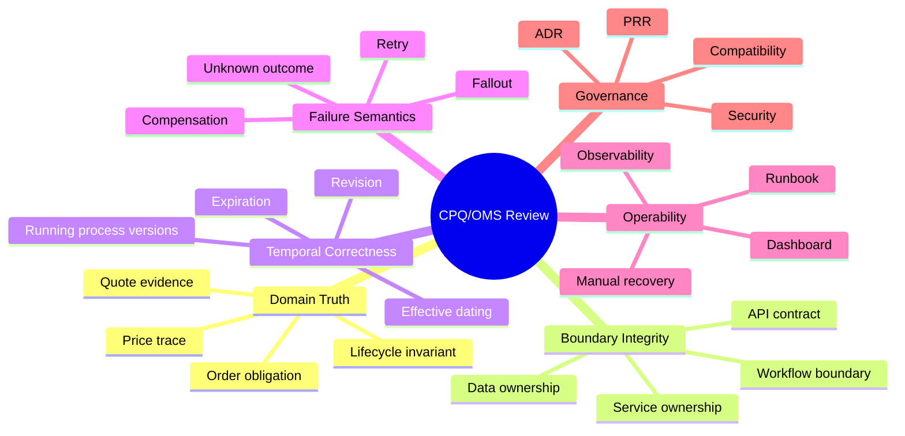
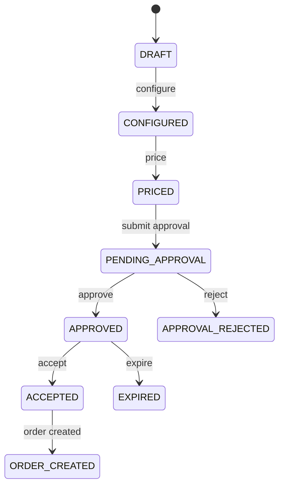

# Top 1% Engineering Review

This part is not another implementation tutorial.

It is a review lens.

A strong engineer can build a working CPQ/OMS.

A top-tier engineer can explain:

- where the truth lives,
- what can go stale,
- what can race,
- what must be immutable,
- what can be recomputed,
- what must be auditable,
- what failure means,
- what humans can safely fix,
- what the system must refuse to do.

The difference is not framework knowledge.

The difference is **structural judgment**.

---

## 1. The Core Review Thesis

The thesis:

> A production-grade CPQ/OMS platform is not judged by how many services it has. It is judged by how well it preserves commercial truth, fulfillment truth, tenant isolation, and recovery evidence under change and failure.

That sentence is the review bar.

When reviewing any design, ask:

```text
Does this design preserve truth when time passes, users race, data evolves, dependencies fail, humans intervene, and old workflow instances keep running?
```

If not, the design is fragile.

---

## 2. The Six Review Axes

Review the platform using six axes.



A weak review focuses on code style.

A strong review focuses on these axes.

---

## 3. Axis 1: Domain Truth

The first question:

```text
Where is the truth?
```

For CPQ/OMS:

| Truth | Authority |
|---|---|
| Product offering definition | Catalog Service |
| Valid configuration result | Configuration Service / Quote snapshot |
| Price result | Pricing Service result stored by Quote Service |
| Approval requirement | Approval Policy Service |
| Approval decision | Quote Service + Workflow evidence |
| Accepted quote | Quote Service |
| Order obligation | Order Service |
| Fulfillment progress | Order Service + workflow correlation |
| Workflow execution state | Camunda 7 |
| Event publication | Outbox + Kafka |
| Cache acceleration | Redis |
| Operational search | Projection/read model |

A common senior-level mistake is to say:

```text
The truth is in the event stream.
```

Maybe in a pure event-sourced system.

But in this architecture, the truth is in service-owned PostgreSQL records, and Kafka carries committed facts outward.

Do not let slogans override actual authority.

---

## 4. Axis 2: Boundary Integrity

A boundary is strong when it can say no.

Weak boundary:

```text
Quote Service can query Pricing DB because it needs performance.
```

Strong boundary:

```text
Quote Service calls Pricing API or consumes pricing policy snapshots through a governed contract.
```

Weak boundary:

```text
Workflow variables store full order JSON.
```

Strong boundary:

```text
Workflow variables store business key and minimal routing state. Order Service stores order truth.
```

Weak boundary:

```text
BFF decides if discount needs approval.
```

Strong boundary:

```text
BFF asks domain/control plane for capabilities and approval requirements.
```

Boundary integrity is not about microservice purity.

It is about preventing hidden ownership.

---

## 5. Axis 3: Temporal Correctness

CPQ/OMS is temporal by nature.

Everything important has time attached:

- catalog effective date,
- price book version,
- quote revision,
- approval decision time,
- authority snapshot time,
- artifact generation time,
- customer acceptance time,
- order creation time,
- reservation expiration,
- billing handoff time,
- workflow definition version,
- process instance start time.

A design that ignores time will fail.

Review question:

```text
Can the system reconstruct what was true at the time the decision was made?
```

If not, it cannot defend its decisions.

---

## 6. Axis 4: Failure Semantics

A failure is not just an exception.

There are different failure classes.

| Failure | Meaning | Correct Response |
|---|---|---|
| Validation failure | Command is invalid | Reject immediately |
| Authorization failure | Actor cannot act | Deny and audit |
| Business conflict | State does not allow action | 409 Problem Details |
| Stale evidence | Revision/version no longer current | Reject and ask re-evaluation |
| Retryable technical failure | Temporary dependency issue | Retry with budget |
| Unknown outcome | External call may have succeeded | Reconcile before retry |
| Workflow incident | Engine cannot progress job | Operator/runbook/fallout |
| Poison event | Consumer cannot process event | DLQ and triage |
| Projection lag | Read model behind write model | Show pending/stale state |
| Cache miss/eviction | Acceleration lost | Recompute from authority |

Top-tier engineering is failure classification.

Most production incidents get worse because the system treats every failure as either retry or crash.

---

## 7. Axis 5: Operability

A production CPQ/OMS is operated by humans.

Not just machines.

Review question:

```text
When an order is stuck, can a trained operator understand the situation, choose a safe action, and leave an audit trail?
```

If not, the system is not enterprise-grade.

Operability artifacts:

- dashboard,
- worklist,
- fallout case,
- audit timeline,
- event trace,
- workflow instance view,
- runbook,
- retry button with guardrails,
- compensation action,
- reconciliation action,
- escalation path,
- post-incident review.

Without these, “microservices” just means distributed confusion.

---

## 8. Axis 6: Governance

Governance is not bureaucracy when the system carries commercial obligations.

Governance answers:

- who can change price policy?
- who can deploy a new BPMN process?
- who can migrate old process instances?
- who can change approval matrix?
- who can override a failed order?
- who can replay Kafka events?
- who can run a migration?
- who can access tenant data?
- who can regenerate artifacts?
- who can delete or mask audit data?

A platform without governance becomes unsafe exactly when it becomes important.

---

## 9. The Smell Catalog

Smells are early warnings.

They are not always fatal.

But they require explanation.

### Smell 1: Entity-shaped APIs

Bad:

```http
PATCH /quotes/{id}
{
  "status": "ACCEPTED"
}
```

Why it smells:

- bypasses lifecycle,
- hides actor intent,
- weak audit,
- impossible to validate state transition properly.

Better:

```http
POST /quotes/{id}/acceptance
```

### Smell 2: Mutable quote instead of revisioned quote

Why it smells:

- cannot prove what customer saw,
- price trace can drift,
- approval decision becomes ambiguous,
- document artifact loses meaning.

Better:

```text
quote_id + revision + immutable snapshots
```

### Smell 3: Price total without price trace

Why it smells:

- cannot debug discount,
- cannot defend invoice dispute,
- cannot explain approval requirement,
- cannot reproduce commercial decision.

Better:

```text
price result + components + policy version + trace
```

### Smell 4: Workflow owns domain state

Why it smells:

- Camunda variables become hidden database,
- migration becomes painful,
- domain invariants split across BPMN and Java,
- process operators can accidentally corrupt business truth.

Better:

```text
Camunda orchestrates; domain services own truth.
```

### Smell 5: Kafka command bus for critical user commands

Why it smells:

- weak immediate validation,
- poor user feedback,
- unclear command ownership,
- hard authorization semantics.

Better:

```text
Synchronous command to owning service, asynchronous events after commit.
```

### Smell 6: Redis lock as correctness guarantee

Why it smells:

- lock expiry can race,
- client pauses can violate assumptions,
- failover can surprise,
- DB still needs invariant enforcement.

Better:

```text
DB constraints + optimistic/pessimistic control + idempotency.
Redis can reduce contention, not prove correctness.
```

### Smell 7: Shared database between services

Why it smells:

- hidden coupling,
- impossible independent release,
- no clear data authority,
- schema migration conflict.

Better:

```text
service-owned schema + API/event contracts + projections.
```

### Smell 8: Admin console with raw mutation powers

Why it smells:

- bypasses invariants,
- creates unaudited fixes,
- breaks operational defensibility.

Better:

```text
admin actions are domain commands with authorization, validation, audit, and rollback policy.
```

### Smell 9: “Retry until success”

Why it smells:

- can duplicate external side effects,
- can amplify outage,
- hides unknown outcome,
- creates cascading failure.

Better:

```text
retry budget + idempotency + attempt log + reconciliation.
```

### Smell 10: E2E tests only on happy path

Why it smells:

- production fails at boundaries,
- workflow incidents untested,
- duplicate command behavior unknown,
- stale evidence rules unproven.

Better:

```text
scenario catalog with race, failure, stale, duplicate, and recovery tests.
```

---

## 10. Critical Design Review: Quote Lifecycle

Review quote lifecycle with invariants.



Questions:

1. Can a quote be priced without valid configuration?
2. Does reconfiguration invalidate price?
3. Does repricing invalidate approval?
4. Does approval reference quote revision?
5. Does artifact reference quote revision?
6. Does acceptance reference artifact?
7. Can acceptance happen twice?
8. Can accepted quote be edited?
9. Can order be created twice for same quote revision?
10. Can expired quote be accepted?

If any answer is fuzzy, lifecycle design is incomplete.

---

## 11. Critical Design Review: Order Lifecycle

Order is not quote with another status.

Order is obligation.

Questions:

1. Does order line preserve quote evidence?
2. Does order line have action semantics?
3. Is fulfillment state per line or only header?
4. Can partial fulfillment be represented?
5. Can cancellation race with fulfillment completion?
6. Can unknown external outcome be represented?
7. Is compensation action idempotent?
8. Is fallout visible to operators?
9. Can order state be reconstructed from audit?
10. Can an order amendment reference baseline order?

The dangerous design is one large `order_status` field.

Enterprise order management needs line-level and step-level truth.

---

## 12. Critical Design Review: Pricing

Pricing is not arithmetic.

Pricing is commercial reasoning.

Review questions:

1. Which price book version was used?
2. Which discount policy was used?
3. Which promotions applied?
4. Which promotions were rejected?
5. Who manually overrode price?
6. What approval did override require?
7. How was rounding performed?
8. Is tax estimated or final?
9. Can price result be reproduced?
10. Can a customer dispute be answered months later?

A price without trace is not enterprise-grade.

It is a number.

---

## 13. Critical Design Review: Approval

Approval is not status transition.

Approval is authority evidence.

Review questions:

1. What approval was required?
2. Why was it required?
3. Who approved?
4. What authority did the approver have at that time?
5. Was four-eyes enforced?
6. Was approval stale when quote changed?
7. Was approval delegated?
8. Was approval escalated?
9. Was approval bypassed by admin?
10. Is the approval decision linked to quote revision and price result?

If approval only stores `approved_by`, it is too weak.

---

## 14. Critical Design Review: Camunda 7 Boundary

Camunda 7 is powerful.

It is also easy to misuse.

Review questions:

1. Is Camunda embedded, shared, or remote? Why?
2. Which service owns process deployment?
3. What is the business key format?
4. Which variables are allowed?
5. What is forbidden in variables?
6. What happens to old process instances after BPMN deploy?
7. How are incidents mapped to business fallout?
8. How are external tasks retried?
9. What is BPMN error vs technical failure?
10. Who can operate process instances?

A good Camunda boundary is boring:

```text
minimal variables
clear business key
external task contract
incident runbook
domain service authority
versioning strategy
migration fence
```

---

## 15. Critical Design Review: Kafka Events

Kafka events should be facts.

Review questions:

1. Is the event emitted after DB commit?
2. Is the event id unique?
3. Is the aggregate id the partition key?
4. Is event version explicit?
5. Can consumers deduplicate?
6. Can consumers tolerate out-of-order global events?
7. Is replay safe?
8. Is DLQ owned?
9. Is retention aligned with replay needs?
10. Is event payload a stable contract or leaked entity?

A Kafka topic full of entity snapshots is not necessarily architecture.

It may be distributed database coupling.

---

## 16. Critical Design Review: PostgreSQL

Database review is architecture review.

Questions:

1. Which constraints enforce domain invariants?
2. Which uniqueness guarantees idempotency?
3. Which rows are hot?
4. Which tables grow unbounded?
5. What is partitioned?
6. What is archived?
7. What is audited?
8. Which queries drive worklists?
9. Which indexes support operational triage?
10. What migration could lock production?

A top-tier engineer does not treat the database as an implementation detail.

The database is where many invariants become real.

---

## 17. Critical Design Review: Redis

Review Redis with suspicion.

Questions:

1. What happens if Redis loses all keys?
2. What happens if cached catalog is stale?
3. What happens if price preview cache misses?
4. What happens if a lock expires early?
5. What happens under memory pressure?
6. Are keys tenant-scoped?
7. Are keys version-scoped?
8. Are TTLs explicit?
9. Are hot keys monitored?
10. Does any correctness rule depend only on Redis?

If the answer to question 10 is yes, redesign.

---

## 18. Critical Design Review: Security

Security review must be object-level.

Questions:

1. Can actor access this tenant?
2. Can actor access this customer account?
3. Can actor see this quote?
4. Can actor perform this lifecycle action?
5. Can actor approve their own request?
6. Can actor override policy?
7. Can actor access generated artifact?
8. Can actor replay admin action?
9. Can service token mutate more than it needs?
10. Does audit record security-sensitive actions?

Role checks alone are insufficient.

Commercial platforms need relationship and authority checks.

---

## 19. Failure Modeling Table

Use this table during review.

| Scenario | Expected Design Response |
|---|---|
| User clicks accept twice | Idempotency returns same result; no duplicate order |
| Quote repriced during approval | Approval becomes stale; task completion rejected or revalidated |
| Order created but workflow start fails | Workflow command outbox retries; order visible as pending orchestration |
| Kafka publish fails | Outbox remains pending; publisher retries; dashboard alerts |
| Consumer processes event twice | Inbox/dedup prevents duplicate projection effect |
| Redis cache is flushed | System slows; truth remains in PostgreSQL |
| Inventory reserve times out | Attempt recorded as unknown; reconciliation before retry |
| Camunda job fails all retries | Incident created; mapped to fallout case |
| BPMN new version deployed | Existing instances stay on old version or migrate by plan |
| DB migration fails halfway | Versioned migration rollback/repair playbook; no silent partial domain change |
| Tenant context missing | Request rejected before domain command |
| Admin override executed | Domain command + authorization + audit + reason code |

If the design response is “we will check logs”, the design is weak.

---

## 20. Architecture Simplification Review

Top-tier engineers do not only add patterns.

They remove unnecessary complexity.

Ask:

```text
Can this be a module instead of a service?
Can this be a projection instead of synchronous composition?
Can this be a DB constraint instead of application code?
Can this be a lifecycle command instead of generic update?
Can this be an outbox event instead of distributed transaction?
Can this be a manual recovery workflow instead of unsafe automatic retry?
Can this be a versioned snapshot instead of dynamic re-read?
```

Simplicity is not fewer boxes.

Simplicity is fewer ambiguous responsibilities.

---

## 21. Microservice Boundary Review

A service boundary is justified when it has at least one of these:

- distinct data authority,
- distinct lifecycle,
- distinct scaling profile,
- distinct security boundary,
- distinct release cadence,
- distinct operational ownership,
- distinct domain expertise,
- high integration value as independent capability.

Bad reason:

```text
Because the noun exists.
```

“Product”, “Price”, “Quote”, and “Order” may deserve separate services.

But “Address Service” or “Currency Service” may just be shared reference data unless it has real authority and lifecycle.

---

## 22. Distributed Transaction Review

CPQ/OMS will tempt you into distributed transactions.

Examples:

```text
accept quote and create order
create order and start workflow
reserve inventory and mark order line reserved
publish event and commit DB
complete Camunda task and update quote
```

Review each as:

```text
What commits first?
What can fail after commit?
What state is visible during the gap?
What retries safely?
What requires reconciliation?
What is the user told?
What is the operator shown?
```

The mature answer is rarely “make it all one transaction”.

The mature answer is usually:

```text
local transaction + outbox + idempotency + visible pending state + reconciliation
```

---

## 23. Workflow Review: BPMN as Contract

BPMN is not only a diagram.

It is executable contract.

Review BPMN for:

- clear start condition,
- clear end states,
- business errors,
- technical retries,
- timers,
- escalation,
- compensation,
- manual task ownership,
- incident path,
- correlation,
- variable contract,
- versioning.

A beautiful BPMN that does not model failure is a misleading diagram.

---

## 24. Data Evolution Review

Backward compatibility is not only API versioning.

Review:

| Surface | Compatibility Question |
|---|---|
| OpenAPI | Can old clients keep working? |
| JSON Schema | Are new fields additive? |
| Kafka event | Can old consumers ignore new fields? |
| PostgreSQL | Can old and new app versions run during deployment? |
| JPA | Does mapping support expand/contract? |
| Redis | Are keys versioned? |
| Camunda BPMN | What happens to running instances? |
| DMN | Can old decisions be explained? |
| Artifact template | Can old proposals be rendered or retrieved? |
| Audit | Can old audit records still be interpreted? |

Data evolution is where many enterprise systems age badly.

A top-tier engineer designs for age from the start.

---

## 25. Review of “Top 1%” Misconceptions

### Misconception 1: More services means more enterprise

No.

More services can mean more failure modes.

Enterprise-grade means clear authority, evidence, and recovery.

### Misconception 2: Event-driven means everything should be async

No.

User commands often need synchronous validation and clear rejection.

Events propagate committed facts.

### Misconception 3: Workflow engine replaces domain model

No.

Workflow engine coordinates work.

Domain model enforces truth.

### Misconception 4: Cache improves architecture

No.

Cache improves latency when bounded by freshness rules.

A cache without invalidation policy creates ambiguity.

### Misconception 5: E2E tests prove quality

Not alone.

E2E tests prove journeys.

Invariant, contract, migration, concurrency, workflow, and failure tests prove structure.

---

## 26. Senior Review Scorecard

Score each area from 1 to 5.

| Area | 1 | 3 | 5 |
|---|---|---|---|
| Domain invariants | Mostly implicit | Some guarded commands | Explicit, tested, persisted |
| API contracts | Entity-shaped | Mixed command/entity | Lifecycle command contracts |
| Data model | CRUD tables | Some snapshots | Revisioned evidence model |
| Workflow | Ad hoc BPMN | Useful orchestration | Clear boundary + incident playbook |
| Events | Fire-and-forget | Outbox for core events | Governed contracts + replay + DLQ |
| Cache | Opportunistic | TTL/invalidation exists | Freshness model + failure safe |
| Security | Role checks | Object checks in places | Object/action/tenant/authority tested |
| Observability | Logs only | Metrics + traces | Business-level traceability |
| Testing | Happy path | Integration coverage | Failure/concurrency/contract coverage |
| Operations | Manual logs | Some dashboards | Runbooks + drills + evidence |
| Migration | Best effort | Versioned migrations | Expand/migrate/contract + rollback plan |
| Governance | Tribal memory | ADRs sometimes | ADR/PRR/release evidence enforced |

A true production-grade system should not need all 5s immediately.

But it must know where it is weak.

Unknown weakness is the real risk.

---

## 27. Architecture Review Walkthrough Script

When presenting this platform, use this order:

1. Start with business lifecycle.
2. Show quote and order state machines.
3. Show authority map.
4. Show service boundaries.
5. Show database invariants.
6. Show command API examples.
7. Show event contracts.
8. Show Camunda BPMN and variable boundary.
9. Show failure paths.
10. Show observability story.
11. Show security model.
12. Show migration strategy.
13. Show runbooks.
14. Show open risks.

Do not start with Kubernetes.

Do not start with package structure.

Do not start with Kafka.

Start with truth.

---

## 28. What to Challenge in Design Reviews

Challenge these claims:

```text
“It is internal, so we do not need strict auth.”
```

Internal systems cause internal breaches and accidental data exposure.

```text
“We can retry if it fails.”
```

Retry is safe only when the operation is idempotent or outcome is known.

```text
“We can get the current price from pricing service later.”
```

The accepted quote needs the price that was presented, not whatever is current later.

```text
“Kafka keeps history, so we can rebuild everything.”
```

Only if event contracts are stable, retained, complete, and replay-safe.

```text
“Camunda shows the process state.”
```

Camunda shows workflow execution state. Business state still belongs to domain services.

```text
“We can fix it manually in DB.”
```

Manual DB fix without domain command and audit is evidence corruption.

---

## 29. The Best Simplification Moves

The best simplification moves in this architecture:

### Use lifecycle commands instead of generic updates

Reduces ambiguous behavior.

### Use quote revision snapshots

Reduces temporal ambiguity.

### Use outbox for event publication

Reduces dual-write inconsistency.

### Use workflow command outbox for Camunda start

Reduces transaction coupling.

### Use minimal workflow variables

Reduces stale process data.

### Use projection tables for UI/search

Reduces chatty BFF and unsafe joins.

### Use object-level authorization consistently

Reduces broken access control.

### Use explicit fallout cases

Reduces invisible operational failure.

### Use ADR and PRR evidence

Reduces tribal-memory architecture.

These are not fancy.

They are durable.

---

## 30. The Hardest Trade-Offs

### Trade-off 1: Synchronous simplicity vs asynchronous recoverability

Synchronous flows are easier to reason about locally.

Asynchronous flows are often safer operationally when external systems fail.

Use synchronous commands inside one authority.

Use asynchronous handoff across authorities when failure must be recoverable.

### Trade-off 2: Workflow visibility vs domain purity

Putting more in BPMN increases visual clarity.

Putting too much in BPMN weakens domain invariants.

Use BPMN for orchestration decisions and human work.

Use domain services for truth-changing commands.

### Trade-off 3: Snapshot storage vs storage cost

Snapshots cost space.

They preserve evidence.

In CPQ/OMS, evidence usually wins.

### Trade-off 4: Microservice autonomy vs operational complexity

Separate services give ownership.

They also create distributed failure.

Split by authority, not by noun.

### Trade-off 5: Flexibility vs governability

Rule/config engines can make everything dynamic.

Too much dynamism creates unreviewable behavior.

Enterprise flexibility needs versioning, simulation, approval, audit, and rollback.

---

## 31. What a Top-Tier Engineer Would Refuse

They would refuse:

- accepting a quote without artifact evidence,
- approving a stale quote revision,
- creating order twice for same quote revision,
- using Redis as order status truth,
- exposing raw Camunda task API to frontend,
- letting admin patch status directly,
- publishing Kafka event before DB commit,
- treating timeout as failure without unknown-outcome handling,
- storing full quote in workflow variables,
- doing migration without expand/contract plan,
- launching without runbook for stuck order,
- calling the system enterprise-grade without audit trail.

Refusal is part of engineering quality.

---

## 32. Final Architecture Evaluation

A mature CPQ/OMS design should be explainable through this chain:

```text
A customer wants a commercial offer.
The system builds a configured quote from catalog evidence.
The system prices it with traceable commercial policy.
The system routes approval based on authority and risk.
The system generates a durable artifact.
The customer accepts a specific revision and artifact.
The system creates an order obligation once.
The system orchestrates fulfillment through recoverable workflow.
The system records every material decision.
The system publishes committed facts.
The system exposes operational state and failure recovery.
The system protects tenant and object boundaries.
The system evolves without corrupting running obligations.
```

If your architecture can tell that story with code, schema, event, workflow, test, and runbook evidence, it is strong.

If it can only tell the story with boxes and arrows, it is not enough.

---

## 33. Personal Mastery Checklist

To know whether you understand this series deeply, answer these without notes:

1. Why is quote revisioning essential?
2. Why is price trace more important than price total?
3. Why must approval reference a specific revision?
4. Why should order not be a status of quote?
5. Why is unknown outcome different from failure?
6. Why is transactional outbox necessary?
7. Why should Camunda variables be minimal?
8. Why is Redis unsafe as a source of truth?
9. Why is object-level authorization mandatory?
10. Why does workflow incident need business fallout mapping?
11. Why does event replay need idempotent consumers?
12. Why does migration strategy include running process instances?
13. Why must admin actions be domain commands?
14. Why must artifact evidence be immutable?
15. Why is production readiness an evidence gate?

If these answers feel obvious, you have internalized the platform.

---

## 34. Closing Mental Model

The top 1% distinction is not knowing every tool.

It is seeing the shape of failure before production teaches it painfully.

In this platform, the shape is clear:

```text
Commercial truth must survive negotiation.
Order truth must survive fulfillment.
Workflow truth must remain operational, not authoritative.
Event truth must follow committed state.
Cache must never become authority.
Human intervention must be safe and auditable.
Security must be object-level.
Change must be versioned.
Failure must be classified.
Recovery must be designed.
```

That is the engineering bar.

The next part will focus on the **Camunda 7 lifecycle and migration fence**: how to build responsibly on Camunda 7 while protecting the architecture from workflow-platform lock-in and future migration pressure.

---

## 35. References

- Camunda 7 Documentation: https://docs.camunda.org/manual/latest/
- Apache Kafka Documentation: https://kafka.apache.org/documentation/
- PostgreSQL Documentation: https://www.postgresql.org/docs/current/
- Redis Documentation: https://redis.io/docs/latest/
- OWASP API Security Top 10: https://owasp.org/API-Security/
- OpenAPI Specification: https://spec.openapis.org/oas/latest.html
- RFC 9457 Problem Details: https://www.rfc-editor.org/rfc/rfc9457.html
