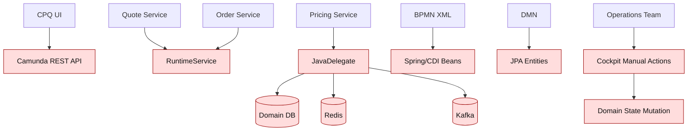
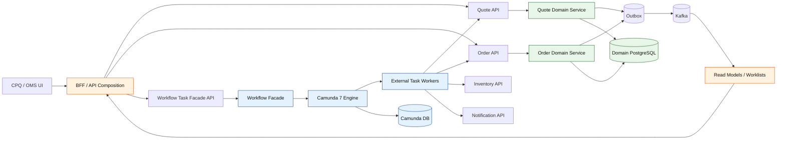
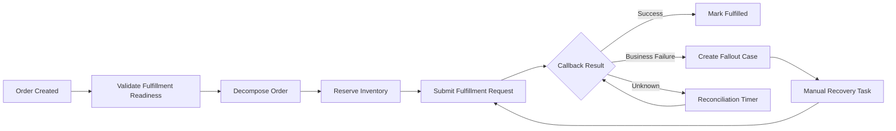
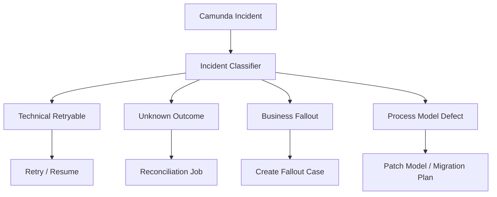
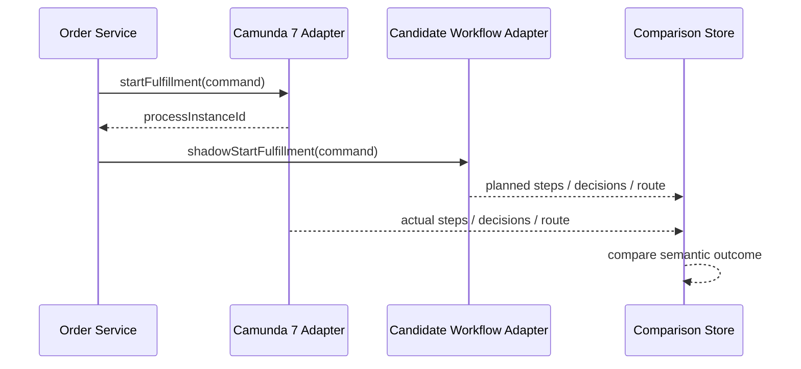
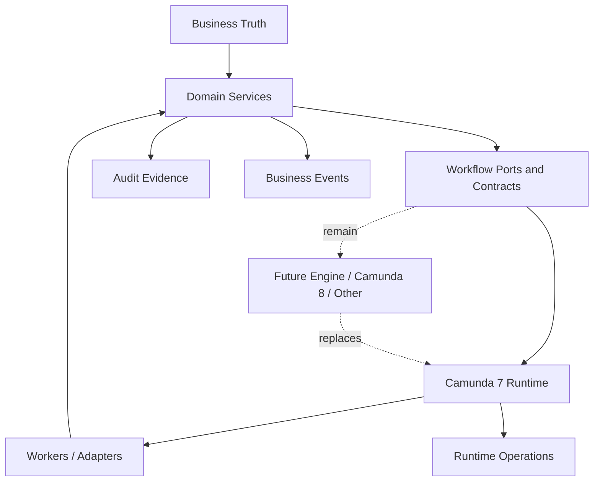

# Part 063 — Camunda 7 Lifecycle and Migration Fence

> A mature engineer can build on a platform while refusing to become trapped by it.
>
> In this part we design the fence that lets a CPQ/OMS run safely on Camunda 7 today while keeping a credible path to migrate, replace, or reduce workflow-engine coupling later.

This part is not a Camunda 8 tutorial. It is also not a panic-driven rewrite plan.

The goal is narrower and more useful: build a **Camunda 7 lifecycle and migration fence** for the CPQ/OMS platform we have been designing across this series.

A migration fence is a set of boundaries, coding rules, model rules, data rules, tests, and operational practices that prevent Camunda-specific choices from leaking everywhere. Without it, a CPQ/OMS slowly becomes impossible to move because business policy, process variables, Java delegates, database reads, UI assumptions, and operational recovery all become tied to one engine's internal shape.

The correct mental model is:

```txt
Camunda 7 is the process runtime.
The CPQ/OMS domain services are the business authority.
The migration fence is the treaty between them.
```

Camunda 7 can still be a pragmatic enterprise choice, especially in organizations with existing process knowledge, operator familiarity, and large BPMN/DMN estates. But in 2026, building a new large CPQ/OMS on Camunda 7 without a migration fence is an architectural risk.

The reason is not that Camunda 7 is bad. The reason is lifecycle reality: Camunda 7 has reached its final feature/minor-release phase, Enterprise support has a defined horizon, and Camunda 8 is not a drop-in replacement. The official migration documentation explicitly says Camunda 8 is not a simple library swap; migration requires adapting models, code, runtime assumptions, and operational practices.

## 1. What Problem Are We Solving?

In this series, Camunda 7 is used for:

- quote approval workflow,
- order orchestration,
- compensation coordination,
- human task lifecycle,
- escalation and timer behavior,
- fallout routing,
- DMN-backed commercial decisions,
- operational process visibility.

Those are valuable capabilities. The danger is not the usage. The danger is **unbounded coupling**.

A poorly fenced system creates dependencies like this:



This feels productive at first. Everything is reachable. Everything can call everything. The workflow can “just do the work.” The UI can “just complete the task.” An operator can “just retry the failed activity.”

Then production happens.

You discover that:

- a process variable has become a hidden domain object,
- Java delegates contain pricing and eligibility logic,
- UI screens depend on raw Camunda task names,
- task completion bypasses authorization rules,
- process instance migration needs business logic nobody documented,
- manual Cockpit actions change operational state without domain audit,
- the order service cannot be tested without a running process engine,
- compensation depends on variable names inside BPMN,
- a new workflow engine would require rewriting half the platform.

The migration fence prevents this failure mode.

## 2. Lifecycle Reality: What Must Be Treated as Fact

Do not build architecture on vibes. Build it on facts and constraints.

As of this writing:

- Camunda has announced Camunda 7 lifecycle timelines and support status through official support/release pages.
- Camunda 7.24 LTS is documented as the last minor release of Camunda 7.
- Camunda's migration documentation says Camunda 8 is not a drop-in replacement for Camunda 7.
- Camunda provides migration journey and migration tooling documentation, including analyzer/converter guidance.

This does not mean every Camunda 7 system must migrate immediately.

It means every serious Camunda 7 system must answer:

1. What is our support horizon?
2. What happens when new feature work in the engine stops?
3. Which parts of our solution would be hard to migrate?
4. Are we coupling business truth to engine internals?
5. Can we operate Camunda 7 safely for the platform's intended lifetime?
6. Can we move critical process solutions without rewriting the whole CPQ/OMS?

A senior design does not say:

> “We will migrate later.”

It says:

> “Here are the seams that make migration later a bounded engineering project rather than a platform rewrite.”

## 3. The Migration Fence Principle

The migration fence has one primary rule:

> Camunda may orchestrate work, but it must not own business truth.

From that one rule, the rest follows.

| Area | Camunda 7 may own | Domain services must own |
|---|---|---|
| Quote approval | task routing, timers, escalation, process state | quote state, approval validity, approval authority, price freshness |
| Order fulfillment | process flow, waits, retries, compensation routing | order state, fulfillment step state, reservation truth, cancellation rules |
| Human tasks | task assignment mechanics | permission to approve, reject, recover, override |
| DMN | decision model execution | policy version, input facts, decision snapshot, audit evidence |
| Variables | orchestration context | canonical aggregate data |
| Incidents | process runtime failure | business fallout case and recovery lifecycle |
| History | process execution history | regulatory/commercial audit trail |
| REST API | process engine administration | customer-facing/business command contract |

The fence is not just conceptual. It must exist in code.

## 4. The Target Shape

A fenced architecture looks like this:



The key design choice: UI and domain services do not speak to raw Camunda primitives directly except through a narrow workflow facade.

That facade translates business commands into workflow operations and workflow events into domain commands.

## 5. Fence Layer 1 — Workflow Facade

Create a single application boundary around Camunda.

Do not scatter `RuntimeService`, `TaskService`, `ExternalTaskService`, `RepositoryService`, `HistoryService`, or raw Camunda REST calls across all services.

Instead, expose a domain-shaped workflow port:

```java
public interface QuoteApprovalWorkflowPort {
    WorkflowStartResult startApproval(StartQuoteApprovalWorkflow command);
    WorkflowSignalResult signalQuoteChanged(SignalQuoteChanged command);
    WorkflowTaskView getApprovalTask(ApprovalTaskId taskId, ActorContext actor);
    WorkflowCommandResult approveQuote(ApproveQuoteTask command);
    WorkflowCommandResult rejectQuote(RejectQuoteTask command);
    WorkflowCommandResult cancelApproval(CancelQuoteApproval command);
}
```

For order orchestration:

```java
public interface OrderWorkflowPort {
    WorkflowStartResult startFulfillment(StartOrderFulfillment command);
    WorkflowSignalResult signalFulfillmentCallback(FulfillmentCallback command);
    WorkflowCommandResult requestCancellation(RequestOrderCancellation command);
    WorkflowCommandResult routeFallout(RouteOrderFallout command);
    WorkflowStatusView getWorkflowStatus(OrderId orderId, ActorContext actor);
}
```

These interfaces express business operations, not engine operations.

A bad interface looks like this:

```java
public interface BadWorkflowService {
    void completeTask(String taskId, Map<String, Object> variables);
    void correlateMessage(String name, String businessKey, Map<String, Object> variables);
    ProcessInstanceDto startProcess(String processKey, Map<String, Object> variables);
}
```

That interface leaks Camunda everywhere. It teaches the rest of the platform to think in engine primitives.

A good interface hides engine mechanics and exposes business intent.

## 6. Fence Layer 2 — Business Key Discipline

Camunda business key is useful, but it must be stable, meaningful, and not overloaded.

Recommended keys:

```txt
quote-approval:{tenantId}:{quoteId}:{revisionNo}
order-fulfillment:{tenantId}:{orderId}
change-order:{tenantId}:{changeOrderId}
fallout:{tenantId}:{falloutCaseId}
```

Rules:

1. Never use random UUID-only business keys if operators need to understand incidents.
2. Never use mutable business keys.
3. Never encode secret data in a business key.
4. Always include tenant context when the Camunda topology is shared.
5. Never use business key as the only authorization control.
6. Store workflow correlation in the domain database.

A workflow correlation table keeps the domain service in control:

```sql
create table workflow_correlation (
    id uuid primary key,
    tenant_id text not null,
    domain_type text not null,
    domain_id uuid not null,
    domain_revision bigint,
    process_key text not null,
    process_instance_id text not null,
    business_key text not null,
    process_definition_id text not null,
    process_definition_version integer not null,
    status text not null,
    started_at timestamptz not null,
    ended_at timestamptz,
    unique (tenant_id, domain_type, domain_id, process_key)
);
```

This table lets you answer:

- which workflow belongs to this quote revision?
- which process version created this order fulfillment?
- which process instance should receive a callback?
- which workflow is still running for this domain object?
- what process version is blocking migration?

## 7. Fence Layer 3 — Process Variable Firewall

Process variables are not a domain database.

For CPQ/OMS, process variables should be small, explicit, and versioned.

Good variables:

```json
{
  "tenantId": "telco-id",
  "quoteId": "8f7b...",
  "quoteRevision": 4,
  "approvalRequestId": "b6a1...",
  "pricingResultId": "d9c0...",
  "riskBand": "HIGH",
  "approvalPolicyVersion": "discount-policy-2026-07-01",
  "workflowContractVersion": "quote-approval-v1"
}
```

Bad variables:

```json
{
  "quote": {
    "customer": { "...": "huge object" },
    "lines": [ { "...": "full mutable domain tree" } ],
    "price": { "...": "full price trace" }
  },
  "entityManager": "some serialized proxy",
  "approvalMatrix": [ "all rules copied here" ]
}
```

Variable rules:

1. Variables identify business facts; they do not contain full business truth.
2. Variables are immutable once they represent a historical decision input.
3. Variable names are part of a workflow contract.
4. Variable contracts must be versioned.
5. No JPA entities in variables.
6. No framework classes in variables.
7. No secrets in variables.
8. No large documents in variables.
9. No customer PII unless absolutely necessary and explicitly protected.
10. No raw external response payloads as long-lived variables.

Define a workflow contract schema:

```yaml
workflowContract: quote-approval-v1
variables:
  tenantId:
    type: string
    required: true
  quoteId:
    type: uuid
    required: true
  quoteRevision:
    type: integer
    required: true
  approvalRequestId:
    type: uuid
    required: true
  approvalPolicyVersion:
    type: string
    required: true
  riskBand:
    type: string
    enum: [LOW, MEDIUM, HIGH, CRITICAL]
  pricingResultId:
    type: uuid
    required: true
```

Then test BPMN models against this contract.

## 8. Fence Layer 4 — Java Delegate and External Task Policy

Camunda 7 often tempts teams to put business logic in Java delegates.

That is convenient but risky.

For a migration-fenced CPQ/OMS, the rule is:

> Java delegates and workers may call domain APIs. They must not implement domain decisions.

Bad delegate:

```java
public class ApproveDiscountDelegate implements JavaDelegate {
    @Override
    public void execute(DelegateExecution execution) {
        Quote quote = entityManager.find(Quote.class, execution.getVariable("quoteId"));
        if (quote.getDiscount().compareTo(new BigDecimal("0.20")) > 0) {
            quote.setStatus("NEEDS_VP_APPROVAL");
        }
        entityManager.persist(quote);
    }
}
```

This delegate:

- reads domain DB directly,
- encodes commercial policy,
- mutates quote state,
- bypasses quote service authorization/audit,
- couples the process model to JPA entities,
- becomes hard to migrate.

Better worker:

```java
public final class RequestApprovalEvaluationWorker {
    public void handle(ExternalTask task, ExternalTaskService service) {
        var command = new EvaluateApprovalRequirementCommand(
            TenantId.of(task.getVariable("tenantId")),
            QuoteId.of(task.getVariable("quoteId")),
            RevisionNo.of(task.getVariable("quoteRevision")),
            ApprovalRequestId.of(task.getVariable("approvalRequestId"))
        );

        ApprovalRequirementResult result = quoteClient.evaluateApprovalRequirement(command);

        service.complete(task.getId(), Map.of(
            "approvalRoute", result.routeCode(),
            "approvalRequirementId", result.requirementId().value()
        ));
    }
}
```

The worker still depends on Camunda 7, but the commercial decision lives behind `quoteClient`.

If migration happens later, you rewrite the worker adapter, not the decision logic.

## 9. Fence Layer 5 — BPMN Modeling Rules

BPMN should model process coordination, not every microscopic implementation step.

For CPQ/OMS, use BPMN for:

- long-running order orchestration,
- human approval routing,
- escalation and timers,
- waiting for external callbacks,
- compensation coordination,
- fallout routing,
- visible operational flow.

Avoid using BPMN for:

- pure synchronous validation,
- simple CRUD lifecycle,
- internal pricing calculations,
- every line-level operation when a domain service can handle it atomically,
- data transformation pipelines,
- retrying every HTTP call without domain semantics,
- business rule execution that belongs in a versioned policy engine.

A fenced BPMN model uses coarse-grained service tasks:



A weak BPMN model creates one service task per method call:

```txt
Load quote -> Load customer -> Load product -> Load price -> Validate line 1 -> Validate line 2 -> Validate line 3 -> Calculate tax -> Save order -> Save line -> Save component -> Send event -> Update search index
```

That is not orchestration. That is distributed procedural code drawn as BPMN.

## 10. Fence Layer 6 — DMN Boundary

DMN is useful for explicit, versioned decisions. It is dangerous when it becomes a hidden programming language for arbitrary domain logic.

Good DMN use cases:

- approval route selection,
- discount authority threshold,
- manual review requirement,
- fallout classification,
- SLA priority band,
- exception routing,
- high-level eligibility gate.

Poor DMN use cases:

- full product configuration engine,
- complex recursive bundle compatibility,
- price component calculation with many dependencies,
- order decomposition graph construction,
- database lookups inside decision evaluation,
- rules requiring side effects.

A fenced DMN decision has:

- named input facts,
- typed input contract,
- deterministic output,
- no side effects,
- explicit version,
- test cases,
- decision snapshot stored by the domain service.

Decision output example:

```json
{
  "decisionKey": "quote-discount-approval",
  "decisionVersion": "2026-07-01",
  "inputHash": "sha256:...",
  "output": {
    "requiresApproval": true,
    "route": "VP_SALES",
    "reasonCode": "DISCOUNT_ABOVE_TIER_LIMIT"
  },
  "evaluatedAt": "2026-07-02T10:15:30Z"
}
```

Do not let DMN output directly mutate quote or order state. Convert decision results into domain commands.

## 11. Fence Layer 7 — UI and Task Facade

The UI must not depend on raw Camunda task names, variable names, or form definitions as the authoritative business API.

A CPQ UI should call a workflow task facade:

```http
GET /work-items?type=quote-approval&status=open
POST /work-items/{workItemId}/approve-quote
POST /work-items/{workItemId}/reject-quote
POST /work-items/{workItemId}/request-more-information
```

Not:

```http
GET /camunda/task?processDefinitionKey=quoteApproval
POST /camunda/task/{taskId}/complete
```

The facade maps Camunda tasks to business work items:

```json
{
  "workItemId": "wi_123",
  "taskType": "QUOTE_APPROVAL",
  "tenantId": "telco-id",
  "quoteId": "8f7b...",
  "quoteRevision": 4,
  "displayTitle": "Approve quote Q-2026-000341 rev 4",
  "requiredAuthority": "VP_SALES",
  "availableActions": ["APPROVE", "REJECT", "REQUEST_REWORK"],
  "slaDueAt": "2026-07-03T17:00:00Z",
  "workflowRef": {
    "engine": "camunda7",
    "processInstanceId": "hidden-or-admin-only",
    "taskId": "hidden-or-admin-only"
  }
}
```

Most users do not need to know the engine. Operators may need workflow references, but even then the action should remain domain-safe.

## 12. Fence Layer 8 — Incident to Fallout Mapping

Camunda incidents are runtime facts. They are not always business facts.

A failed job means the engine failed to execute something. It does not automatically mean the order failed.

Create a mapping layer:



A fallout case should be stored in the domain/operations database, not only in Camunda history.

Example:

```sql
create table fallout_case (
    id uuid primary key,
    tenant_id text not null,
    domain_type text not null,
    domain_id uuid not null,
    source_system text not null,
    source_reference text not null,
    classification text not null,
    severity text not null,
    state text not null,
    assigned_group text,
    created_at timestamptz not null,
    resolved_at timestamptz,
    resolution_code text,
    audit_ref uuid not null
);
```

This is migration-friendly because business recovery state is not trapped inside Camunda incident tables.

## 13. Fence Layer 9 — Database Separation

For a migration-fenced design, separate these concerns:

1. domain database,
2. Camunda engine database,
3. read model/search/reporting database or schema,
4. audit evidence store.

Avoid allowing process workers to directly mutate quote/order tables outside domain services.

A common production mistake is:

```txt
Camunda JavaDelegate -> EntityManager -> quote/order tables
```

The better path is:

```txt
Camunda worker -> domain API command -> domain service transaction -> outbox/event/audit
```

Yes, it is more ceremony.

But it gives you:

- authorization enforcement,
- idempotency,
- audit trail,
- domain invariants,
- tests independent of workflow engine,
- clearer migration path.

## 14. Fence Layer 10 — Process Definition Versioning Strategy

Process versioning is not optional.

A production CPQ/OMS may have long-running orders that remain active for days, weeks, or months. When a new BPMN version is deployed, running instances may remain on older definitions depending on engine behavior and migration choices. That is usually correct.

The problem is not old instances. The problem is undocumented old instances.

Track process definition version at workflow start:

```sql
insert into workflow_correlation (
    id,
    tenant_id,
    domain_type,
    domain_id,
    process_key,
    process_instance_id,
    business_key,
    process_definition_id,
    process_definition_version,
    status,
    started_at
) values (...);
```

For every new process version, decide:

| Question | Required answer |
|---|---|
| Can existing instances continue on old version? | yes/no |
| Must some instances migrate? | filter criteria |
| Are variables compatible? | contract version result |
| Are external task topics compatible? | worker compatibility result |
| Are user tasks compatible? | worklist compatibility result |
| Are timers compatible? | operational impact |
| Are compensation paths compatible? | recovery impact |
| Are history queries compatible? | reporting impact |

Do not deploy BPMN changes without a migration note.

## 15. Fence Layer 11 — Worker Compatibility

External task topics are contracts.

Treat this:

```txt
reserve-inventory
submit-fulfillment
generate-quote-document
notify-customer
```

as seriously as HTTP endpoints.

For each topic define:

```yaml
topic: reserve-inventory
version: v1
inputVariables:
  - tenantId
  - orderId
  - fulfillmentPlanId
  - reservationRequestId
outputs:
  - reservationStatus
  - reservationRef
errors:
  - INVENTORY_UNAVAILABLE
  - RESERVATION_EXPIRED
  - UNKNOWN_OUTCOME
retryPolicy:
  retryableTechnicalErrors: true
  businessErrorsAsBpmnError: true
  unknownOutcomeRequiresReconciliation: true
```

If the worker changes behavior, version the topic or keep backward compatibility.

Bad:

```txt
same topic name, different required variables, no migration plan
```

Good:

```txt
reserve-inventory-v2 with dual worker support until old process instances drain
```

## 16. Fence Layer 12 — Workflow Event Surface

Do not make every Camunda history event a Kafka domain event.

Most engine events are runtime noise.

Publish domain-relevant workflow events from the workflow facade or domain service:

```json
{
  "eventType": "QuoteApprovalWorkflowStarted",
  "tenantId": "telco-id",
  "quoteId": "8f7b...",
  "quoteRevision": 4,
  "processInstanceId": "...",
  "businessKey": "quote-approval:telco-id:8f7b:4",
  "processDefinitionVersion": 12,
  "occurredAt": "2026-07-02T10:00:00Z"
}
```

Useful workflow events:

- `QuoteApprovalWorkflowStarted`,
- `QuoteApprovalTaskCreated`,
- `QuoteApprovalCompleted`,
- `OrderFulfillmentWorkflowStarted`,
- `OrderFulfillmentWaitStateEntered`,
- `OrderFulfillmentIncidentRaised`,
- `OrderFulfillmentFalloutRouted`,
- `WorkflowProcessMigrated`,
- `WorkflowProcessCancelled`.

Avoid publishing:

- every variable update,
- every token movement,
- internal activity IDs without business meaning,
- raw incident stack traces,
- technical retries as business facts.

## 17. Migration Readiness Scorecard

Before calling your CPQ/OMS “migration-ready,” score each process solution.

| Dimension | 0 — Bad | 1 — Partial | 2 — Good |
|---|---|---|---|
| Business truth | In process variables | Mixed | In domain services |
| Java delegate logic | Business-heavy | Mixed | Adapter-only |
| Variable contract | Implicit | Documented but untested | Versioned and tested |
| UI dependency | Raw Camunda API | Mixed | Task facade |
| Worker contract | Implicit | Docs only | Versioned topic contract |
| DMN use | Hidden program | Mixed | Pure decisions |
| Incident handling | Cockpit-only | Manual runbook | Fallout lifecycle |
| Correlation | Search by variables | Partial table | Domain correlation table |
| Tests | Engine-only happy path | Some integration | Domain/workflow contract tests |
| Migration notes | None | Ad hoc | Per version/process |

A process with score below 14/20 is not migration-ready.

That does not mean it must be rewritten now. It means migration risk is visible.

## 18. Migration-Ready Code Packaging

Organize process solutions like this:

```txt
workflow/
  quote-approval/
    bpmn/
      quote-approval-v1.bpmn
    dmn/
      quote-approval-policy-v1.dmn
    contract/
      variables.quote-approval-v1.schema.json
      external-tasks.quote-approval-v1.yaml
      messages.quote-approval-v1.yaml
    tests/
      QuoteApprovalWorkflowTest.java
      QuoteApprovalContractTest.java
    migration/
      2026-07-quote-approval-v2.md

services/
  workflow-service/
    src/main/java/.../camunda7/
      Camunda7QuoteApprovalWorkflowAdapter.java
      Camunda7OrderWorkflowAdapter.java
    src/main/java/.../port/
      QuoteApprovalWorkflowPort.java
      OrderWorkflowPort.java

services/
  quote-service/
    src/main/java/.../application/
      SubmitQuoteForApprovalHandler.java
      ApproveQuoteHandler.java
```

The package structure communicates the fence.

Do not bury BPMN files randomly in a web application and make delegates reach into all domain modules.

## 19. Camunda 7 to Camunda 8: Conceptual Gap Checklist

Do not treat Camunda 8 as Camunda 7 with a new package name.

A migration-aware review must check at least:

- embedded engine assumptions,
- JavaDelegate usage,
- expression language usage,
- process variable serialization,
- transaction boundary assumptions,
- external task vs job worker model,
- BPMN element compatibility,
- DMN compatibility,
- user task and tasklist assumptions,
- Cockpit/Admin operational workflows,
- history/reporting dependencies,
- multi-tenancy assumptions,
- migration of running instances,
- authorization model,
- deployment pipeline,
- incident handling semantics.

The practical consequence:

> The fewer Camunda 7-specific assumptions leak into domain services and UI, the easier the future migration.

## 20. Migration Paths

There are several migration paths. None is universally correct.

### Path A — Stay on Camunda 7 for the platform lifetime

This can be valid if:

- support horizon matches product horizon,
- organization has enterprise support,
- process estate is stable,
- risk is accepted in ADR,
- migration fence still exists,
- operational competence is strong.

Do not choose this path by accident.

Write an ADR.

### Path B — New processes on Camunda 8, old processes remain on Camunda 7

This is often pragmatic.

Use Camunda 7 for existing quote/order processes while building new flows behind the same workflow facade.

The facade routes by process family:

```java
public final class WorkflowRouter implements OrderWorkflowPort {
    private final OrderWorkflowPort camunda7;
    private final OrderWorkflowPort camunda8;
    private final WorkflowRoutingPolicy policy;

    public WorkflowStartResult startFulfillment(StartOrderFulfillment command) {
        return policy.useCamunda8(command)
            ? camunda8.startFulfillment(command)
            : camunda7.startFulfillment(command);
    }
}
```

This is only possible if domain services depend on `OrderWorkflowPort`, not Camunda classes.

### Path C — Strangler migration by process type

Move process families one at a time:

1. quote approval,
2. order fulfillment,
3. compensation,
4. fallout routing,
5. renewal/change order,
6. admin operations.

This limits blast radius.

### Path D — Replace workflow engine with domain-specific orchestration

For some flows, migration may reveal that BPMN is no longer necessary.

Examples:

- simple synchronous quote validation,
- short approval rules handled by policy engine,
- internal projection rebuild,
- retry-only technical jobs.

The migration fence makes this possible because the domain service does not care whether orchestration is Camunda 7, Camunda 8, a scheduler, or a small custom state machine.

## 21. Dual-Run Strategy

For high-risk process migration, use dual-run for shadow comparison.



Do not let shadow workflow mutate external systems.

Shadow execution can compare:

- decision route,
- generated fulfillment plan,
- task assignment,
- timer schedule,
- compensation route,
- exception classification.

Do not compare raw activity IDs. Compare business semantics.

## 22. Migration Fence Testing

Add tests that fail when the fence is broken.

Examples:

### No raw Camunda dependency in domain modules

```txt
Fail build if services/quote-service imports org.camunda.*
Fail build if services/order-service imports org.camunda.*
Fail build if services/pricing-service imports org.camunda.*
```

### No JPA entity in workflow variables

```txt
Fail test if serialized process variable payload contains package com.company.cpq.domain.entity
```

### Worker contract test

```java
@Test
void reserveInventoryWorkerRequiresOnlyContractVariables() {
    var contract = ExternalTaskContract.load("reserve-inventory-v1.yaml");
    assertThat(contract.requiredVariables()).containsExactlyInAnyOrder(
        "tenantId", "orderId", "fulfillmentPlanId", "reservationRequestId"
    );
}
```

### BPMN model lint

Rules:

- every process has a versioned contract,
- every service task topic is registered,
- every message name is registered,
- every boundary timer has an owner/runbook,
- every compensation handler has a domain command,
- no secret variable names,
- no raw customer PII variable names.

### Worklist contract test

```txt
Given a Camunda task exists
When BFF queries work-items
Then response contains domain-safe work item
And does not expose raw variable map
And available actions match actor authority
```

## 23. Migration Fence ADR Template

Use this ADR whenever approving Camunda 7 usage in a new area.

```mdx
# ADR: Use Camunda 7 for <process-family>

## Status
Accepted / Proposed / Superseded

## Context
What business process needs orchestration?
Why is simple synchronous domain logic insufficient?
What are the expected process duration, actors, timers, and external waits?

## Decision
We will use Camunda 7 for <process-family> behind <workflow-port>.

## Boundaries
Business truth remains in <domain-service>.
Camunda variables are limited to <contract>.
UI accesses tasks through <task-facade>.
Workers call domain APIs and do not mutate domain DB directly.

## Migration Fence
- workflow port defined: yes/no
- variable contract: yes/no
- worker topic contract: yes/no
- process version strategy: yes/no
- incident-to-fallout mapping: yes/no
- tests: yes/no

## Consequences
Positive consequences.
Negative consequences.
Operational responsibilities.
Migration implications.

## Revisit Trigger
Support timeline change.
Process complexity crosses threshold.
New process family starts on Camunda 8.
Camunda 7 operational cost exceeds threshold.
```

## 24. Migration Backlog Template

For each process family, maintain a migration backlog:

| Item | Description | Risk | Owner | Status |
|---|---|---:|---|---|
| Variable inventory | List all process variables and types | High | Workflow team | Open |
| Java delegate audit | Classify delegates as adapter/business/mixed | High | Platform team | Open |
| BPMN compatibility | Analyze model against target engine | Medium | Workflow team | Open |
| DMN compatibility | Analyze decisions and hit policies | Medium | Policy team | Open |
| UI dependency audit | Identify raw Camunda UI/API coupling | High | Frontend/BFF | Open |
| Incident runbook mapping | Map incidents to fallout actions | Medium | Ops | Open |
| Running instance strategy | Drain/migrate/cancel/restart | High | Architecture | Open |
| Test harness | Create cross-engine semantic tests | High | QA/platform | Open |

This backlog should be boring and visible.

Invisible migration risk becomes executive surprise.

## 25. What Not to Do

Do not:

- expose raw Camunda REST APIs to CPQ UI,
- let workflow variables become your canonical order state,
- put pricing/configuration logic inside delegates,
- mutate domain state from Cockpit without domain command/audit,
- store full quote/order trees as process variables,
- treat Camunda history as regulatory audit source,
- version BPMN without variable contract review,
- rename external task topics casually,
- rely on process instance migration as a normal release habit,
- assume Camunda 8 is a drop-in replacement,
- postpone all migration thinking until support pressure becomes urgent.

## 26. Production Checklist

Before shipping a Camunda 7-backed CPQ/OMS capability, answer yes to these:

- Is the workflow started through a domain-shaped port?
- Is the business key stable and searchable?
- Is workflow correlation stored in the domain database?
- Are process variables versioned and small?
- Are no JPA entities serialized into process variables?
- Are Java delegates/workers adapters only?
- Are external task topics documented as contracts?
- Are UI actions routed through task facade APIs?
- Are authorization checks performed by domain/control-plane services?
- Are incidents mapped to fallout/recovery lifecycle?
- Are BPMN/DMN files tested?
- Is process versioning documented?
- Is the migration note written?
- Is there an ADR for using Camunda 7 in this process family?
- Is there a support horizon decision?

If any answer is no, the system may still work in a demo. It is not production-grade.

## 27. Final Mental Model

Camunda 7 is not the villain.

The villain is unbounded coupling.

A workflow engine is powerful because it makes process state visible and operable. That same power becomes dangerous when business truth, security, audit, UI, and external integrations are allowed to collapse into the engine.

The migration fence keeps the shape clean:



If one day the engine changes, the domain should remain recognizable.

That is the test.

## 28. References

- Camunda 7 support announcements: https://docs.camunda.org/enterprise/announcement/
- Camunda 7 release policy: https://docs.camunda.org/enterprise/release-policy/
- Camunda 7 to Camunda 8 migration guide: https://docs.camunda.io/docs/guides/migrating-from-camunda-7/
- Camunda 7 to Camunda 8 conceptual differences: https://docs.camunda.io/docs/guides/migrating-from-camunda-7/conceptual-differences/
- Camunda migration tooling: https://docs.camunda.io/docs/8.7/guides/migrating-from-camunda-7/migration-tooling/
- Camunda process versioning: https://docs.camunda.org/manual/latest/user-guide/process-engine/process-versioning/
- Camunda multi-tenancy: https://docs.camunda.org/manual/latest/user-guide/process-engine/multi-tenancy/
