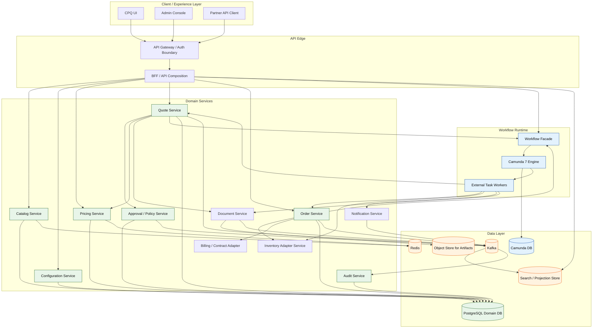
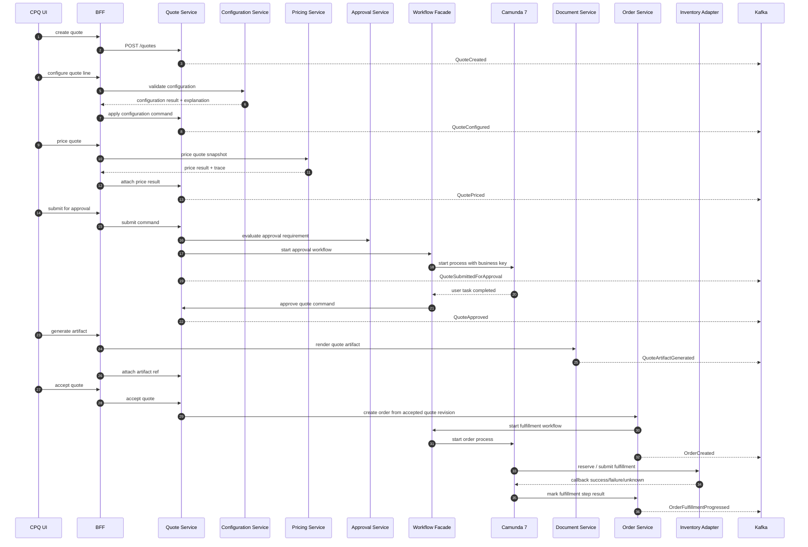
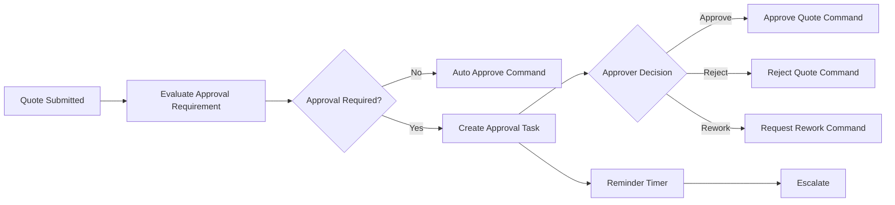
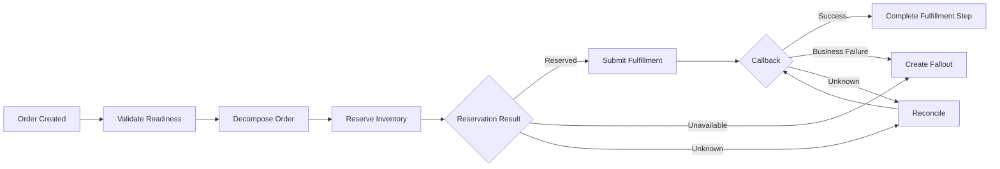

# Part 064 — Final Capstone and Series Close

> The final test is not whether the system can process a happy-path quote.
>
> The final test is whether it can preserve business truth, operational control, and audit evidence when the world becomes messy.

This is the final part of the series.

Across the previous parts, we built the mental model and engineering map for a production-grade CPQ/OMS platform:

- OpenAPI-first external contracts,
- schema-first commands/events/workflow variables,
- JAX-RS/Jersey service boundary,
- PostgreSQL as authority,
- EclipseLink JPA as persistence mechanism,
- Camunda 7 as workflow orchestration runtime,
- Kafka as integration event backbone,
- Redis as acceleration layer,
- audit, observability, security, testing, operations, migration governance.

This capstone compresses the entire series into a final architecture, a final build plan, and a final review checklist.

The goal is not to memorize a template.

The goal is to be able to look at any CPQ/OMS requirement and ask:

```txt
Where is the authority?
What is the lifecycle?
What is the invariant?
What is the contract?
What can fail?
What evidence remains after failure?
What must be tested before production?
```

That is the engineering posture this series was designed to build.

## 1. Final System Statement

We are building a large, production-grade Java microservices CPQ/OMS platform.

It supports:

1. product catalog publication,
2. product configuration,
3. deterministic pricing,
4. quote lifecycle and revisioning,
5. approval policy and entitlement,
6. quote artifact generation,
7. quote acceptance,
8. order creation,
9. order decomposition,
10. fulfillment orchestration,
11. inventory/reservation integration,
12. payment/billing/contract handoff,
13. amendment, renewal, and change order,
14. fallout management,
15. audit and regulatory defensibility,
16. operational observability,
17. migration-aware workflow lifecycle.

The platform is not a CRUD system.

It is a lifecycle machine for commercial and fulfillment intent.

## 2. Final Architecture



The architecture has one non-negotiable property:

> Business truth lives in domain services and PostgreSQL. Camunda, Kafka, Redis, search indexes, and documents derive from or coordinate that truth.

## 3. Final Bounded Context Map

| Context | Authority | Main data | Should not own |
|---|---|---|---|
| Catalog | Product grammar | offering, spec, bundle, characteristic, rule metadata | customer-specific quote state |
| Configuration | Valid configuration reasoning | configuration result, explanation | price truth, order fulfillment |
| Pricing | Commercial calculation evidence | price result, component, trace, policy input | approval authority, order state |
| Quote | Commercial intent | quote revision, quote line, acceptance, artifact refs | fulfillment state |
| Approval/Policy | Authority and control | approval requirement, decision, delegation, policy version | quote mutation without command |
| Order | Fulfillment obligation | order, order line, fulfillment step, cancellation | pricing algorithm |
| Workflow | Long-running coordination | process instance, task, timer, incident | domain truth |
| Inventory adapter | External inventory treaty | availability evidence, reservation refs | inventory source of truth unless explicitly owned |
| Billing/Contract adapter | Handoff treaty | billing validation, contract handoff refs | billing ledger |
| Document | Generated evidence | artifact metadata, hash, template version | quote state |
| Notification | Communication lifecycle | notification attempt, template, recipient evidence | business decision |
| Audit | Evidence index | audit event, actor, before/after summary | mutable domain state |

A weak design starts by asking, “What tables do we need?”

A strong design starts by asking, “Who is allowed to say this fact is true?”

## 4. Final Critical Journey

The primary journey is:

```txt
create quote
  -> configure product
  -> price quote
  -> submit for approval
  -> approve quote
  -> generate quote artifact
  -> accept quote
  -> create order
  -> decompose order
  -> reserve/submit fulfillment
  -> handle callback
  -> complete or route fallout
```

End-to-end:



This is the happy path.

Production readiness is proven by the unhappy paths.

## 5. Final Invariant Catalog

A platform like this is only trustworthy when its invariants are explicit.

### Quote invariants

- A quote revision is immutable after submission, except for explicitly allowed metadata.
- Acceptance must target an approved, non-expired, current quote revision.
- A quote cannot be accepted if price evidence is stale.
- A quote cannot be accepted if approval evidence is stale.
- A quote cannot be converted to more than one primary order unless business policy explicitly allows it.
- Quote artifact hash must match accepted quote material facts.

### Configuration invariants

- A configured quote line must reference a catalog publication/version.
- Configuration result must be reproducible from snapshot facts.
- Invalid configuration cannot be priced as final.
- Manual override must be explicit and auditable.

### Pricing invariants

- Price result is immutable.
- Price result must identify price book/rule/policy versions.
- Price result must expose component trace.
- Rounding must be deterministic.
- Manual discount must preserve actor, authority, reason, and approval impact.

### Approval invariants

- Approver cannot approve their own request when four-eyes rule applies.
- Approval must be tied to exact quote revision and price result.
- Approval authority must be snapshotted.
- Any material quote change invalidates approval.
- Approval completion must go through domain command, not raw task completion alone.

### Order invariants

- Order is created from accepted quote revision snapshot.
- Order line action must be explicit: add, modify, disconnect, no-change.
- Fulfillment step transitions must be valid.
- Unknown external outcome must not be guessed as success or failure.
- Cancellation after external side effects requires compensation/reversal path.

### Workflow invariants

- Process variables do not contain canonical domain truth.
- Process instance has stable business key.
- Workflow correlation is stored outside Camunda.
- Incidents map to technical retry, unknown outcome, business fallout, or model defect.
- Human task completion is authorized by domain/control-plane rules.

### Event invariants

- Events are facts after successful commit.
- Outbox is written in the same transaction as state change.
- Consumers are idempotent.
- Event ordering is guaranteed only within selected aggregate partition.
- Replay must not create duplicate domain effects.

### Redis invariants

- Redis is never authority for quote/order truth.
- Cached values have explicit version/TTL.
- Cache miss must not change business semantics.
- Lock failure must not corrupt domain state.

### Audit invariants

- High-value business decisions must create audit evidence.
- Audit event must include actor, tenant, action, target, reason, timestamp, and correlation.
- Audit data must be append-only from business perspective.
- Regulatory evidence cannot depend solely on application logs.

## 6. Final Repository Shape

A reference implementation can start like this:

```txt
learn-enterprise-cpq-oms-camunda7/
  pom.xml
  platform-bom/
  build-parent/

  contracts/
    openapi/
      catalog-api.yaml
      configuration-api.yaml
      pricing-api.yaml
      quote-api.yaml
      order-api.yaml
      workflow-task-api.yaml
      admin-api.yaml
    schemas/
      commands/
      events/
      workflow-variables/
      errors/
    asyncapi/
      cpq-oms-events.yaml

  services/
    catalog-service/
    configuration-service/
    pricing-service/
    quote-service/
    approval-service/
    order-service/
    workflow-service/
    document-service/
    notification-service/
    audit-service/
    bff-service/

  workflow/
    quote-approval/
      bpmn/
      dmn/
      contract/
      tests/
      migration/
    order-fulfillment/
      bpmn/
      dmn/
      contract/
      tests/
      migration/

  libs/
    common-api-errors/
    common-correlation/
    common-idempotency/
    common-money/
    common-jpa/
    common-security/
    common-testkit/

  database/
    migrations/
      catalog/
      quote/
      order/
      approval/
      audit/
      outbox/

  deployment/
    local/
    environments/
    observability/
    runbooks/

  docs/
    adr/
    prr/
    threat-model/
    scenario-catalog/
    operations/
```

The point is not that every team must use this exact tree.

The point is separation:

- contracts are visible,
- workflow files are first-class,
- migrations are owned,
- shared libraries are small,
- runbooks live near deployment,
- ADR/PRR are part of engineering output.

## 7. Final API Surface

Design APIs around commands and views, not entity tables.

Example Quote API:

```http
POST /quotes
POST /quotes/{quoteId}/lines
POST /quotes/{quoteId}/commands/configure-line
POST /quotes/{quoteId}/commands/price
POST /quotes/{quoteId}/commands/submit-for-approval
POST /quotes/{quoteId}/commands/accept
GET  /quotes/{quoteId}
GET  /quotes/{quoteId}/timeline
GET  /quotes/{quoteId}/price-trace
GET  /quotes/{quoteId}/approval-evidence
```

Example Order API:

```http
POST /orders/from-accepted-quote
POST /orders/{orderId}/commands/request-cancellation
POST /orders/{orderId}/commands/record-fulfillment-callback
POST /orders/{orderId}/commands/route-fallout
GET  /orders/{orderId}
GET  /orders/{orderId}/fulfillment-plan
GET  /orders/{orderId}/timeline
```

Example Workflow Task API:

```http
GET  /work-items
GET  /work-items/{workItemId}
POST /work-items/{workItemId}/commands/approve-quote
POST /work-items/{workItemId}/commands/reject-quote
POST /work-items/{workItemId}/commands/resolve-fallout
POST /work-items/{workItemId}/commands/escalate
```

Bad APIs expose persistence shape:

```http
PUT /quote/{id}/status
PATCH /order-line/{id}
POST /camunda/task/{taskId}/complete
POST /pricing/calculateTotal
```

Good APIs express business intent and preserve invariants.

## 8. Final Persistence Rule

Use PostgreSQL to enforce what should never be left to convention.

Examples:

```sql
-- One accepted revision per quote unless explicitly modeled otherwise.
create unique index uq_quote_one_accepted_revision
on quote_revision (tenant_id, quote_id)
where state = 'ACCEPTED';

-- Idempotency key must be unique per tenant, actor/client, and operation.
create unique index uq_idempotency_scope
on idempotency_record (tenant_id, client_id, operation, idempotency_key);

-- Outbox identity must be stable.
create unique index uq_outbox_event_id
on outbox_event (event_id);

-- Workflow correlation should not duplicate active workflow for same domain intent.
create unique index uq_active_workflow_domain
on workflow_correlation (tenant_id, domain_type, domain_id, process_key)
where status in ('STARTED', 'RUNNING', 'SUSPENDED');
```

JPA/EclipseLink should map the domain model carefully, but JPA should not be the only line of defense.

Application invariants and database constraints are complementary.

## 9. Final Outbox/Event Shape

A final event envelope:

```json
{
  "eventId": "01J...",
  "eventType": "QuoteApproved",
  "eventVersion": 1,
  "tenantId": "telco-id",
  "aggregateType": "QUOTE",
  "aggregateId": "8f7b...",
  "aggregateVersion": 12,
  "occurredAt": "2026-07-02T10:20:00Z",
  "correlationId": "corr-...",
  "causationId": "cmd-...",
  "actor": {
    "type": "USER",
    "id": "u-123"
  },
  "payload": {
    "quoteId": "8f7b...",
    "quoteRevision": 4,
    "approvalDecisionId": "appr-..."
  }
}
```

Event publishing rule:

```txt
Domain state change and outbox insert commit together.
Publisher reads outbox and writes to Kafka.
Consumer stores inbox/dedup record before side effect.
Projection can rebuild from events or source query.
```

Do not pursue mystical “exactly once business semantics” by wishful thinking.

Use idempotency, stable event identity, aggregate version, replay discipline, and reconciliation.

## 10. Final Workflow Shape

Camunda 7 is used behind a workflow facade.

Quote approval process:



Order fulfillment process:



Critical rule:

> A workflow task causes a domain command. It does not directly mutate domain truth.

## 11. Final Security Review

Security is not one layer.

Review every command:

| Command | Required security checks |
|---|---|
| Configure quote | tenant, quote visibility, quote editable state, product eligibility |
| Price quote | tenant, quote visibility, pricing authority if override requested |
| Submit approval | quote owner/delegate, quote state, price freshness |
| Approve quote | approval task ownership, authority level, four-eyes rule, stale approval check |
| Accept quote | customer/account authority, quote approved/current/not expired, artifact freshness |
| Create order | accepted quote, idempotency, duplicate order guard |
| Cancel order | actor authority, order state, fulfillment side-effect state |
| Resolve fallout | operational role, tenant, allowed recovery action, audit reason |
| Admin config publish | admin role, segregation of duties, validation, approval if required |

Security must be tested as business behavior.

An API that returns `200 OK` for the wrong actor is not merely insecure. It is commercially incorrect.

## 12. Final Observability Model

Every important operation should be traceable with:

- `correlationId`,
- `causationId`,
- `tenantId`,
- `actorId`,
- `quoteId`,
- `quoteRevision`,
- `orderId`,
- `processInstanceId`,
- `businessKey`,
- `eventId`,
- `outboxId`,
- `externalReference`.

Example structured log:

```json
{
  "level": "INFO",
  "message": "Quote approved",
  "tenantId": "telco-id",
  "quoteId": "8f7b...",
  "quoteRevision": 4,
  "approvalDecisionId": "appr-...",
  "actorId": "u-123",
  "correlationId": "corr-...",
  "traceId": "trace-...",
  "processInstanceId": "camunda-...",
  "businessKey": "quote-approval:telco-id:8f7b:4"
}
```

Dashboards should answer:

- Are quotes stuck before pricing?
- Are approvals breaching SLA?
- Are order fulfillments stuck in unknown outcome?
- Are external callbacks delayed?
- Is Kafka consumer lag affecting projections?
- Is Redis serving stale catalog data beyond budget?
- Is PostgreSQL lock wait increasing?
- Is Camunda job executor producing incidents?
- Are fallout cases aging beyond SLA?

## 13. Final Failure Drill Catalog

A production-grade system must be drilled.

Minimum drills:

### Quote/pricing drills

- pricing service timeout during quote pricing,
- price book publication during active quote edit,
- stale price detected at acceptance,
- duplicate price command with same idempotency key,
- discount override above authority.

### Approval drills

- approver tries to approve own quote,
- quote changes while approval task is open,
- task completion succeeds but domain approval command fails,
- approval workflow incident before task creation,
- escalation timer fires after task already completed.

### Order drills

- duplicate create order command,
- inventory reserve timeout with unknown outcome,
- fulfillment callback duplicate,
- callback arrives after cancellation request,
- partial fulfillment success then downstream failure,
- compensation failure.

### Kafka/outbox drills

- outbox publisher down for 30 minutes,
- Kafka unavailable during publishing,
- consumer processes duplicate event,
- consumer receives out-of-order event,
- DLQ growth after schema mismatch,
- replay projection from offset zero.

### Redis drills

- Redis unavailable during catalog cache read,
- hot key causes latency spike,
- eviction removes price preview cache,
- stale key survives invalidation event,
- Redis lock lost mid-operation.

### PostgreSQL drills

- migration lock blocks hot table,
- connection pool exhaustion,
- long transaction causes bloat,
- index missing on quote search,
- backup restore validation fails,
- read replica lag affects reporting.

### Camunda drills

- external task worker down,
- failed job retries exhausted,
- process variable contract mismatch,
- process definition deployment regression,
- running process instance on old version,
- operator retries wrong incident.

If the team cannot perform these drills, the system is not ready.

## 14. Final Production Readiness Packet

Before launch, create a readiness packet.

It should include:

1. system context diagram,
2. service ownership map,
3. API contract versions,
4. event contract versions,
5. database migration plan,
6. rollback/roll-forward plan,
7. Camunda process definition inventory,
8. workflow variable contracts,
9. worker topic contracts,
10. DMN decision inventory,
11. security threat model,
12. authorization matrix,
13. audit evidence matrix,
14. observability dashboards,
15. SLO and alert policy,
16. failure drill results,
17. performance test report,
18. data recovery drill result,
19. incident runbooks,
20. support ownership and escalation path,
21. known risks and accepted ADRs,
22. launch decision.

No readiness packet, no production launch.

## 15. Final Engineering Scorecard

Score the system 0–2 per category.

| Category | 0 | 1 | 2 |
|---|---|---|---|
| Domain model | CRUD/entity driven | partially lifecycle-aware | invariant-driven lifecycle model |
| API design | entity API | mixed command/view API | OpenAPI-first business command API |
| Data model | loose tables | partial constraints | constraints enforce core invariants |
| JPA usage | entity graph leaks | mostly controlled | aggregate/repository discipline |
| Workflow | engine owns truth | mixed | Camunda fenced behind ports |
| Events | ad hoc publish | partial outbox | transactional outbox + idempotent consumers |
| Redis | hidden authority | mostly cache | explicit accelerator boundary |
| Security | endpoint-level only | partial object checks | domain-level authz/tenant invariants |
| Audit | logs only | some audit tables | evidence-grade audit trail |
| Observability | technical logs | some dashboards | business + technical tracing |
| Testing | happy path | decent integration | invariant/contract/workflow/failure tests |
| Operations | tribal knowledge | partial runbooks | PRR + drills + ownership |
| Migration readiness | no seams | some abstraction | explicit migration fence |
| Governance | ad hoc decisions | some ADRs | ADR/PRR/release quality gates |

Maximum score: 28.

Interpretation:

| Score | Meaning |
|---:|---|
| 0–10 | Demo/platform-risk level |
| 11–18 | Useful internal system, not yet enterprise-grade |
| 19–24 | Strong production candidate |
| 25–28 | Mature enterprise architecture with good defensibility |

A top engineer does not claim “top 1%” because they know more tools.

They earn it by noticing where reality breaks the design.

## 16. Final Capstone Exercise

Build a vertical slice, not the whole universe.

The capstone implementation should include:

1. `catalog-service`
   - fixed product catalog publication,
   - product offering with configurable options,
   - published version snapshot.

2. `configuration-service`
   - validate selected options,
   - return explanation for invalid combination,
   - produce configuration result snapshot.

3. `pricing-service`
   - price quote line,
   - create price components,
   - return trace and price result ID.

4. `quote-service`
   - create quote,
   - add/configure line,
   - attach price result,
   - submit for approval,
   - accept quote,
   - write audit/outbox.

5. `approval-service`
   - evaluate approval requirement,
   - authority check,
   - store approval decision.

6. `workflow-service`
   - start Camunda 7 quote approval process,
   - expose work item facade,
   - complete approval task through domain command.

7. `order-service`
   - create order from accepted quote,
   - start fulfillment workflow,
   - update fulfillment step by command,
   - route fallout.

8. `document-service`
   - generate quote artifact metadata,
   - store hash and template version.

9. `notification-service`
   - send approval/acceptance notification with idempotency.

10. `audit-service`
    - store high-value business actions.

11. `projection-service`
    - consume Kafka events,
    - build quote/order/worklist read models.

Vertical slice acceptance criteria:

- duplicate commands are safe,
- stale price blocks acceptance,
- stale approval blocks acceptance,
- wrong actor cannot approve,
- quote acceptance creates at most one primary order,
- order workflow can handle unknown inventory outcome,
- outbox publisher can be down and recover,
- projection can rebuild,
- incident creates fallout case,
- audit evidence explains every major decision.

## 17. Final “Build From Scratch” Order

If you implement this as a real project, build in this order:

### Phase 1 — Skeleton and contracts

- repository layout,
- parent POM/BOM,
- OpenAPI contracts,
- JSON schemas,
- common error model,
- common correlation/idempotency libs,
- CI gates.

### Phase 2 — Database authority

- PostgreSQL schema,
- migrations,
- EclipseLink persistence units,
- repository tests,
- optimistic lock tests,
- audit/outbox tables.

### Phase 3 — Quote vertical slice

- create quote,
- configure line,
- price line,
- submit approval,
- accept quote,
- API tests,
- audit/outbox.

### Phase 4 — Workflow vertical slice

- Camunda 7 topology,
- quote approval BPMN,
- task facade,
- approval worker,
- incident test,
- process variable contract.

### Phase 5 — Order vertical slice

- create order from quote,
- order line model,
- fulfillment workflow,
- inventory stub,
- unknown outcome handling,
- fallout case.

### Phase 6 — Events and projections

- outbox publisher,
- Kafka topics,
- idempotent consumers,
- read models,
- rebuild process,
- DLQ playbook.

### Phase 7 — Operational hardening

- metrics,
- traces,
- logs,
- dashboards,
- security tests,
- performance tests,
- failure drills,
- PRR.

### Phase 8 — Governance and migration fence

- ADRs,
- process versioning notes,
- Camunda 7 lifecycle decision,
- migration backlog,
- support horizon decision.

This order avoids the common mistake of starting with UI screens and only later discovering that domain truth is wrong.

## 18. Final Anti-Pattern List

Avoid these:

- treating quote as cart,
- treating order as quote with status,
- pricing without trace,
- approval without authority snapshot,
- quote acceptance without freshness checks,
- order creation without idempotency,
- workflow variables as domain database,
- Java delegates mutating domain tables directly,
- Kafka event as request/response substitute,
- Redis cache as authority,
- audit as log scraping,
- search index as command truth,
- admin console as ungoverned backdoor,
- data migration without backfill/reconciliation,
- process versioning without migration notes,
- readiness review without failure drills.

Every one of these anti-patterns can pass a demo.

Most fail in production.

## 19. Final Mental Model

A CPQ/OMS platform is a system of promises:

- Catalog promises what can be sold.
- Configuration promises what combination is valid.
- Pricing promises what commercial terms were calculated.
- Quote promises what offer was made.
- Approval promises who authorized deviation.
- Artifact promises what was presented.
- Acceptance promises what customer agreed to.
- Order promises what the enterprise must fulfill.
- Workflow promises coordination across time.
- Audit promises evidence after dispute.
- Operations promises recovery after failure.

Tools serve those promises.

They do not replace them.

## 20. How to Know You Have Learned the Material

You understand this series when you can design under pressure.

Given a requirement like:

> “Allow enterprise customers to change bandwidth mid-contract with prorated pricing, approval for high discounts, inventory reservation, and billing handoff.”

You should immediately ask:

1. Is this amendment, renewal, or change order?
2. What is the baseline?
3. What is the delta?
4. Which catalog version applies?
5. Which price book applies?
6. Is repricing full or delta-only?
7. What approvals are invalidated by change?
8. What order line actions are needed?
9. Which external systems must be called?
10. What if reservation succeeds but billing handoff fails?
11. What events are emitted?
12. What audit evidence is required?
13. What is the compensation path?
14. What is the read model?
15. What is the operational fallout path?

That questioning pattern is the real skill.

## 21. Series Close

This is the final part:

```txt
learn-enterprise-cpq-oms-camunda7-part-064-final-capstone-and-series-close.mdx
```

The series is complete.

You now have a full roadmap and advanced material set for building a large, production-grade Java microservices CPQ/OMS platform with:

- OpenAPI-first,
- schema-first,
- JAX-RS/Jersey,
- PostgreSQL,
- EclipseLink JPA,
- Camunda 7,
- Kafka,
- Redis,
- enterprise testing,
- operational readiness,
- security hardening,
- audit defensibility,
- migration-aware architecture.

The final advice is simple:

> Do not build a system that merely works when everyone behaves and every dependency is healthy.
>
> Build a system that remains explainable when people disagree, dependencies fail, data changes, workflows stall, audits happen, and the platform must evolve.

That is enterprise engineering.

## 22. References

- OpenAPI Specification: https://spec.openapis.org/oas/latest.html
- Jakarta RESTful Web Services: https://jakarta.ee/specifications/restful-ws/
- EclipseLink project: https://projects.eclipse.org/projects/ee4j.eclipselink
- PostgreSQL documentation: https://www.postgresql.org/docs/current/
- Camunda 7 documentation: https://docs.camunda.org/manual/latest/
- Camunda 7 release policy: https://docs.camunda.org/enterprise/release-policy/
- Camunda 7 to 8 migration guide: https://docs.camunda.io/docs/guides/migrating-from-camunda-7/
- Apache Kafka documentation: https://kafka.apache.org/documentation/
- Redis documentation: https://redis.io/docs/latest/
- OWASP API Security Top 10: https://owasp.org/API-Security/
- OpenTelemetry documentation: https://opentelemetry.io/docs/
