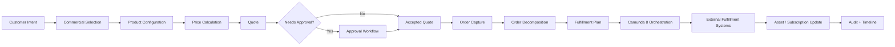
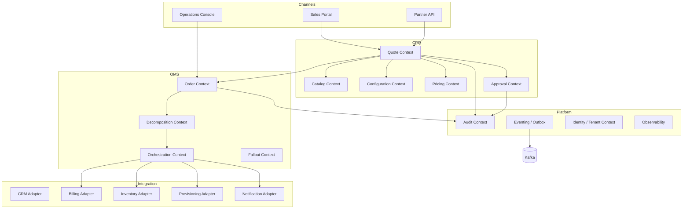
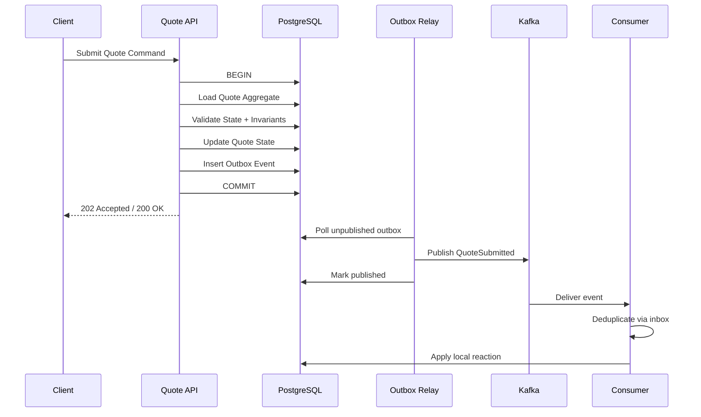
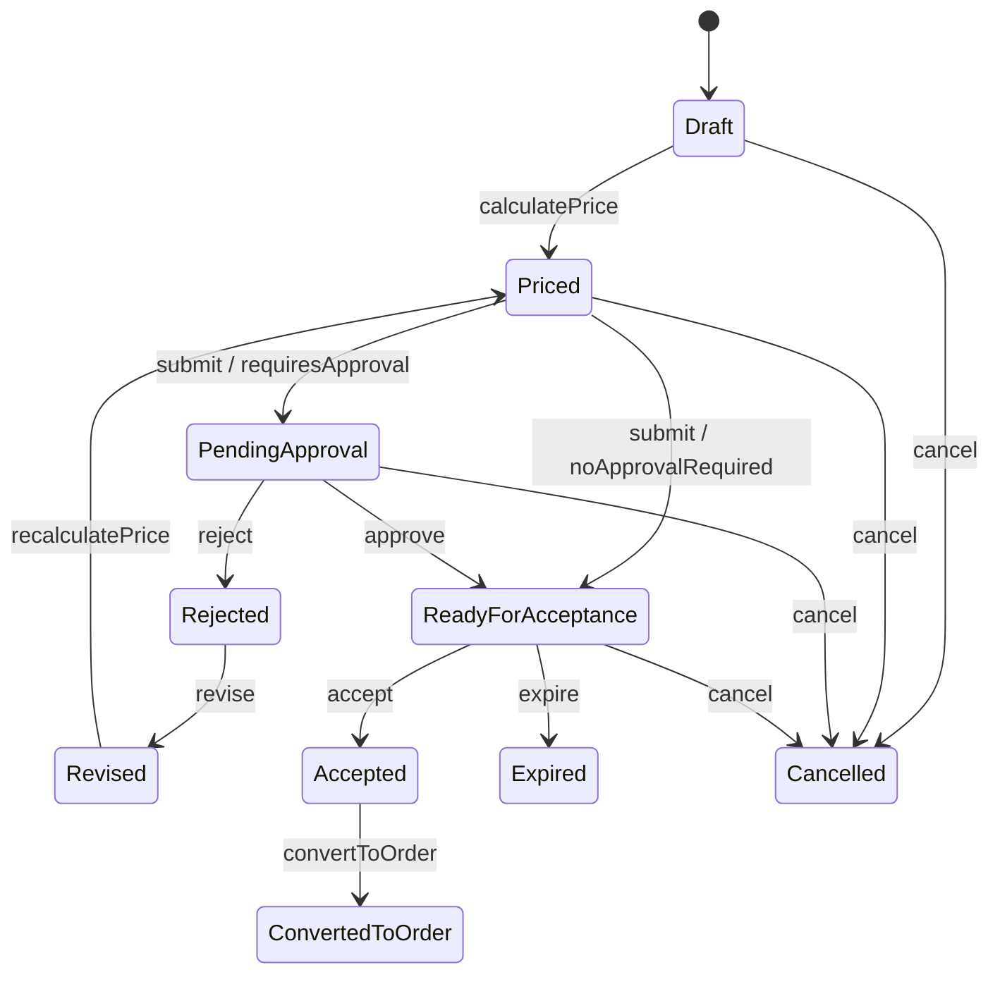

------
title: Build From Scratch: Enterprise Java Microservices CPQ & Order Management Platform - Part 001
description: Menetapkan scope, learning contract, batas sistem, production-grade bar, dan mental model utama sebelum mulai membangun CPQ/OMS enterprise-grade.
series: learn-enterprise-cpq-oms-glassfish-camunda8
seriesTitle: Build From Scratch: Enterprise Java Microservices CPQ & Order Management Platform
order: 1
partTitle: System Scope and Learning Contract
tags:
  - java
  - microservices
  - cpq
  - oms
  - openapi
  - schema-first
  - jax-rs
  - jersey
  - glassfish
  - postgresql
  - mybatis
  - camunda-8
  - kafka
  - redis
  - enterprise-architecture
date: 2026-07-02
---

# Part 001 — System Scope and Learning Contract

Kita tidak akan membangun aplikasi demo.

Kita akan membangun _skeleton_ arsitektur, model domain, kontrak API, persistence boundary, workflow boundary, event boundary, dan operating model untuk sebuah **enterprise-grade CPQ dan Order Management Platform**.

Targetnya bukan sekadar bisa membuat endpoint seperti:

```http
POST /quotes
POST /orders
```

Targetnya adalah memahami kenapa di sistem enterprise, endpoint sederhana itu berdiri di atas lapisan keputusan seperti:

- apakah produk boleh dijual ke customer ini?
- apakah konfigurasi produk valid?
- apakah harga yang diberikan masih sesuai policy?
- apakah quote sudah menjadi komitmen legal/commercial?
- apakah order bisa dipenuhi secara teknis?
- apakah fulfillment bisa diulang dengan aman setelah failure?
- apakah perubahan state dapat dipertanggungjawabkan secara audit?
- apakah sistem tetap benar walaupun ada retry, duplicate message, stale data, partial failure, dan long-running workflow?

Di part ini kita mengunci **scope** dan **learning contract**. Kalau scope tidak dikunci sejak awal, seri ini akan berubah menjadi campuran CRM, billing, inventory, workflow engine, product catalog, pricing engine, e-commerce cart, dan integration platform tanpa batas yang jelas.

---

## 1. Sistem Yang Akan Kita Bangun

Nama konseptual sistem:

> **Enterprise CPQ & Order Management Platform**

Sistem ini menerima intensi commercial dari customer atau sales channel, mengubahnya menjadi quote yang dapat dihitung, divalidasi, disetujui, lalu dikonversi menjadi order yang dapat dijalankan oleh fulfillment layer.

Secara sederhana:

```text
Customer intent
  -> product selection
  -> product configuration
  -> price calculation
  -> quote approval
  -> quote acceptance
  -> order capture
  -> order decomposition
  -> fulfillment orchestration
  -> asset/subscription update
  -> audit evidence
```

Namun di sistem enterprise, urutan itu tidak linear sempurna. Ada revisi, approval, cancellation, amendment, fallout, retry, compensation, dan manual repair.

Karena itu mental model utamanya adalah:

> CPQ mengubah **keinginan membeli** menjadi **komitmen commercial yang valid**. OMS mengubah **komitmen commercial** menjadi **rencana eksekusi fulfillment yang terkendali**.

---

## 2. Kenapa CPQ/OMS Sulit?

CPQ/OMS sulit bukan karena endpoint-nya banyak. Sulit karena sistem ini berada di persimpangan empat jenis kebenaran.

| Jenis kebenaran | Pertanyaan utama | Contoh |
|---|---|---|
| Commercial truth | Apa yang dijual dan dengan harga apa? | bundle internet + router + installation fee |
| Technical truth | Apa yang harus dipenuhi secara teknis? | provision fiber service, reserve ONT, schedule technician |
| Process truth | Order sekarang sedang berada di tahap mana? | waiting approval, provisioning failed, compensating |
| Audit truth | Siapa mengubah apa, kapan, kenapa, dan dengan dasar apa? | price override approved by manager at 2026-07-02T10:00:00+07:00 |

Banyak sistem gagal karena satu model dipakai untuk semua jenis kebenaran.

Contoh kesalahan umum:

- memakai `order_status` tunggal untuk mewakili status commercial, technical, payment, shipment, dan provisioning sekaligus;
- menjadikan product catalog sebagai kumpulan string tanpa versioning;
- menghitung harga ulang dari catalog terbaru ketika quote lama dikonversi menjadi order;
- menganggap message broker membuat transaksi distributed menjadi mudah;
- menganggap workflow engine adalah tempat menaruh semua business logic;
- menganggap cache Redis boleh menjadi sumber kebenaran;
- menganggap retry selalu aman;
- menganggap API contract cukup dengan DTO yang dihasilkan dari class Java.

Seri ini akan membongkar kesalahan-kesalahan itu dari akar desainnya.

---

## 3. Batas Sistem

Kita akan membangun domain inti berikut.

### 3.1 In Scope

| Area | Akan dibahas | Output desain |
|---|---|---|
| Product Catalog | offering, specification, characteristic, relation, lifecycle, version | catalog model + API contract |
| Product Configuration | option, compatibility, cardinality, validation graph | configuration engine |
| Pricing | charge, discount, override, recurring/one-time price, price breakdown | pricing engine |
| Quote | lifecycle, revision, approval, acceptance, conversion | quote aggregate + state machine |
| Approval | approval policy, escalation, SLA, decision evidence | approval workflow |
| Order Capture | order creation from quote/direct channel, validation | order aggregate |
| Order Decomposition | commercial item to fulfillment task graph | decomposition engine |
| Order Orchestration | long-running fulfillment, incident, retry, compensation | Camunda 8 BPMN + workers |
| Integration Events | outbox, inbox, Kafka event contracts | event backbone |
| Persistence | PostgreSQL schema, MyBatis mapper, transaction boundaries | data model + mapper patterns |
| Runtime Acceleration | Redis cache, idempotency acceleration, short-lived locks | cache strategy |
| Observability | logs, metrics, traces, business timeline | operations model |
| Production Support | runbook, manual repair, reconciliation | operating procedures |

### 3.2 Explicitly Out of Scope

Kita tidak akan membangun penuh:

- CRM lengkap;
- billing engine lengkap;
- tax engine lengkap;
- payment gateway lengkap;
- inventory/provisioning system lengkap;
- document generation engine lengkap;
- UI lengkap seperti enterprise portal;
- machine learning recommendation engine;
- low-level implementation detail Camunda cluster operation;
- Kafka cluster administration mendalam;
- PostgreSQL DBA tuning mendalam;
- Kubernetes deployment mendalam.

Namun kita akan membuat **adapter boundary** untuk sistem-sistem tersebut agar arsitektur tetap realistis.

Batas ini penting. Enterprise platform yang baik tidak mencoba menjadi semua sistem sekaligus. Ia tahu mana data yang ia miliki, mana data yang hanya direferensikan, dan mana proses yang harus didelegasikan.

---

## 4. Stack Yang Dipilih dan Perannya

Kita memakai stack berikut bukan karena populer, tetapi karena tiap komponen memiliki peran arsitektural yang jelas.

| Teknologi | Peran di sistem | Catatan desain |
|---|---|---|
| Java | bahasa utama domain service dan worker | fokus pada explicit domain model, bukan framework magic |
| OpenAPI First | kontrak HTTP API | API ditulis sebagai contract terlebih dahulu, bukan hasil dari controller |
| JSON Schema First | kontrak payload kompleks | konfigurasi produk dan event membutuhkan schema eksplisit |
| Jakarta REST / JAX-RS | standar REST resource API | resource layer tidak boleh bocor menjadi domain model |
| Jersey | implementasi Jakarta REST | runtime untuk endpoint HTTP |
| GlassFish | Jakarta EE runtime | deployment target untuk service berbasis Jakarta EE |
| PostgreSQL | source of truth transactional | quote, order, catalog, outbox, audit |
| MyBatis | explicit SQL mapper | cocok untuk query kompleks dan kontrol SQL penuh |
| Camunda 8 / Zeebe | long-running orchestration | workflow state untuk proses lintas sistem |
| Kafka | event streaming backbone | integration event, domain notification, projection |
| Redis | cache dan runtime acceleration | bukan source of truth |

Rule penting:

> Teknologi tidak menentukan boundary. Domain dan failure model yang menentukan boundary. Teknologi hanya alat untuk mengeksekusi boundary itu.

---

## 5. Production-Grade Bar

Aplikasi demo biasanya hanya membuktikan bahwa happy path berjalan.

Enterprise system harus membuktikan bahwa sistem tetap benar ketika:

- request yang sama dikirim dua kali;
- user membuka quote lama lalu mencoba submit setelah catalog berubah;
- approver menyetujui revisi quote yang sudah tidak aktif;
- order dibuat, tetapi event Kafka gagal dikirim;
- fulfillment task sukses, tetapi callback terlambat;
- process worker crash setelah memanggil external system;
- Kafka consumer menerima event yang sama lebih dari sekali;
- order harus dicancel ketika sebagian task sudah selesai;
- database migration terjadi ketika masih ada process instance lama;
- support team harus memperbaiki data tanpa melanggar audit trail.

Di seri ini, setiap desain harus lulus pertanyaan berikut:

1. **State ownership jelas?**  
   Siapa pemilik state ini? Quote service? Order service? Camunda? Kafka? External system?

2. **Transaction boundary jelas?**  
   Apa yang harus atomic? Apa yang eventually consistent? Apa yang tidak boleh dilakukan dalam satu transaksi?

3. **Retry safety jelas?**  
   Kalau operasi diulang, apakah hasilnya sama, ditolak, atau membuat side effect ganda?

4. **Auditability jelas?**  
   Apakah kita bisa menjelaskan perubahan bisnis ke auditor atau support engineer?

5. **Failure recovery jelas?**  
   Kalau gagal di tengah, siapa yang mendeteksi, siapa yang memperbaiki, dan evidence-nya apa?

6. **Versioning jelas?**  
   Kalau catalog, schema, workflow, atau API berubah, apa yang terjadi pada quote/order lama?

7. **Operational visibility jelas?**  
   Kalau customer bertanya “order saya kenapa belum aktif?”, sistem bisa menjawab dengan timeline yang benar?

---

## 6. Mental Model Utama

Kita akan memakai model berikut sepanjang seri:



Poin penting: setiap node di diagram adalah **boundary keputusan**, bukan sekadar step teknis.

Misalnya `Price Calculation` bukan hanya fungsi:

```java
Money calculate(Product product)
```

Ia adalah boundary yang harus menjawab:

- price source mana yang dipakai?
- price version berapa?
- discount mana yang eligible?
- price override boleh atau tidak?
- hasil harga disimpan sebagai snapshot atau dihitung ulang?
- pembulatan dilakukan di level item, group, atau total?
- apakah breakdown harga bisa dijelaskan ke customer dan auditor?

---

## 7. Dari Intent ke Evidence

Salah satu cara paling sehat melihat CPQ/OMS adalah sebagai mesin transformasi evidence.

```text
Intent -> Decision -> Commitment -> Execution -> Evidence
```

| Tahap | Bentuk data | Pertanyaan |
|---|---|---|
| Intent | cart, selected offering, requested config | Apa yang customer ingin beli? |
| Decision | validation result, price result, eligibility result | Apakah boleh dijual dan dengan kondisi apa? |
| Commitment | accepted quote, approved override, signed terms | Apa yang sudah dijanjikan? |
| Execution | order, fulfillment task, workflow instance | Apa yang harus dilakukan? |
| Evidence | event, audit log, process history, asset state | Apa yang benar-benar terjadi? |

Ini mengubah cara kita mendesain sistem.

Kita tidak hanya menyimpan “data terbaru”. Kita menyimpan **alasan dan bukti** dari perubahan penting.

Contoh:

Quote yang sudah accepted tidak boleh bergantung pada product price terbaru. Ia harus menyimpan snapshot harga pada saat customer menerima quote.

Order yang berasal dari quote tidak boleh sekadar menyalin `product_id`. Ia harus membawa commercial commitment yang cukup agar fulfillment, dispute handling, dan audit bisa tetap masuk akal walaupun catalog berubah kemudian.

---

## 8. Core Actors

Aktor bukan hanya manusia. Dalam enterprise system, aktor bisa berupa sistem eksternal, worker, process engine, dan scheduler.

| Actor | Peran | Contoh aksi |
|---|---|---|
| Customer | pihak yang membeli | accept quote, request cancellation |
| Sales Agent | membuat dan merevisi quote | configure product, request discount |
| Sales Manager | approval | approve price override |
| Order Specialist | operasional order | release hold, repair fallout |
| Fulfillment System | sistem teknis eksternal | provision service, reserve resource |
| Billing System | sistem downstream | receive billing activation event |
| Camunda Worker | executor task workflow | call adapter, update task result |
| Event Relay | publisher outbox | publish integration event to Kafka |
| Support Engineer | perbaikan operasional | replay event, reconcile order |
| Auditor | pemeriksa evidence | inspect approval, state transition, before/after value |

Desain yang baik tidak hanya melayani user yang klik tombol. Ia juga melayani operator yang harus memperbaiki failure pada jam 3 pagi.

---

## 9. High-Level Bounded Context

Kita tidak akan langsung membuat microservice untuk setiap noun. Itu kesalahan klasik.

Pertama kita definisikan bounded context.



Catatan penting:

- `Catalog Context` tidak otomatis berarti `catalog-service` terpisah.
- `Pricing Context` tidak otomatis berarti pricing engine harus menjadi microservice sendiri.
- `Orchestration Context` tidak berarti semua logic pindah ke BPMN.
- `Audit Context` tidak boleh hanya berupa logging teknis.

Bounded context adalah batas bahasa, aturan, dan ownership. Deployment boundary bisa menyusul setelah kita paham coupling dan failure mode.

---

## 10. Data Ownership Awal

Sebelum bicara database schema, kita harus tahu siapa pemilik data.

| Data | Owner | Boleh disalin? | Catatan |
|---|---|---|---|
| Product Offering | Catalog Context | Ya, sebagai snapshot | Quote/order butuh snapshot |
| Product Configuration | Configuration Context / Quote Context | Ya | Setelah quote accepted, config harus immutable |
| Price Result | Pricing Context / Quote Context | Ya | Quote menyimpan price breakdown snapshot |
| Quote | Quote Context | Tidak sebagai mutable copy | Order hanya referensi + snapshot commitment |
| Approval Decision | Approval Context | Ya untuk audit read model | Source evidence tetap approval record |
| Order | Order Context | Tidak | OMS source of truth untuk order lifecycle |
| Fulfillment Task | Orchestration/OMS Context | Ya sebagai projection | Camunda punya process state, OMS punya business state |
| Asset | Asset/Inventory Context | Tergantung ownership | Bisa external; OMS menyimpan reference dan event evidence |
| Audit Log | Audit Context | Append-only | Tidak boleh diedit sebagai update biasa |
| Outbox Event | Eventing Context | Tidak | Harus sesuai transaksi lokal |

Rule awal:

> Jangan menganggap semua data yang dibaca oleh service adalah data milik service tersebut.

---

## 11. State Ownership: OMS vs Camunda

Ini salah satu desain paling penting.

Camunda 8 akan kita pakai untuk long-running orchestration. Tetapi **Camunda bukan source of truth untuk semua business state**.

Pisahkan:

| State | Owner | Alasan |
|---|---|---|
| Order status commercial | Order service | dipakai API, audit, reporting, customer support |
| Fulfillment workflow position | Camunda/Zeebe | engine tahu token BPMN sedang di mana |
| Task execution result | OMS + worker result | harus bisa dicari oleh operator |
| Retry count teknis worker | Camunda job metadata + worker logs | engine mengatur job retry |
| Business incident/fallout | OMS | support butuh domain-level reason |
| Audit decision | Audit/Approval context | harus tetap ada walau workflow berubah |

Prinsipnya:

> Camunda mengorkestrasi proses. Domain service tetap memegang kebenaran bisnis yang harus tampil di API, audit, dan support operation.

Kalau semua business state hanya ada di workflow engine, sistem akan sulit di-query, sulit di-versioning, dan sulit dijelaskan ke non-technical user.

Kalau semua orchestration state hanya ada di database OMS, kita akan menulis workflow engine sendiri secara tidak sadar.

Kita butuh keduanya, dengan boundary yang jelas.

---

## 12. Transaction Boundary Awal

Kita tidak akan memakai distributed transaction lintas service.

Baseline kita:

1. Satu command masuk ke satu service.
2. Service membuka transaksi lokal PostgreSQL.
3. Service membaca aggregate yang relevan.
4. Service mengecek invariant.
5. Service menyimpan perubahan aggregate.
6. Service menulis outbox event dalam transaksi yang sama.
7. Event relay menerbitkan event ke Kafka secara asynchronous.
8. Consumer menerapkan inbox/deduplication.



Kenapa begini?

Karena enterprise CPQ/OMS harus tahan partial failure. Jika update quote sukses tetapi publish event gagal, outbox masih menyimpan event yang belum dikirim. Jika consumer menerima event dua kali, inbox mencegah efek ganda.

---

## 13. API Contract Philosophy

Kita memakai OpenAPI First dan Schema First.

Artinya:

- API contract ditulis sebelum implementasi resource Java;
- schema payload kompleks ditulis eksplisit;
- generated code boleh membantu, tetapi tidak boleh mendikte domain model;
- domain model tidak otomatis sama dengan request/response model;
- backward compatibility diuji sebagai quality gate;
- error response, pagination, idempotency, correlation ID, dan versioning bukan tambahan belakangan.

Contoh prinsip:

```text
OpenAPI contract != Java controller
JSON Schema != database schema
DTO != aggregate
Event schema != audit log
BPMN variable != domain model
```

Di sistem kecil, menyamakan semua model mungkin terasa cepat.

Di sistem enterprise, menyamakan semua model membuat perubahan menjadi mahal dan berbahaya.

---

## 14. Domain Model Philosophy

Kita akan menghindari dua ekstrem.

Ekstrem pertama: **anemic CRUD model**.

```java
class Quote {
    String id;
    String status;
    List<QuoteItem> items;
}
```

Lalu semua aturan bisnis tersebar di service method, controller, mapper, workflow worker, dan SQL.

Ekstrem kedua: **over-pure domain model** yang tidak peduli persistence, distributed workflow, event, dan audit.

Kita butuh domain model yang cukup kuat untuk menjaga invariant, tetapi tetap realistis untuk sistem enterprise.

Contoh bentuk yang akan kita tuju:

```java
public final class QuoteAggregate {
    private QuoteId id;
    private QuoteState state;
    private QuoteVersion version;
    private List<QuoteItem> items;
    private PriceSnapshot priceSnapshot;
    private ApprovalSnapshot approvalSnapshot;

    public QuoteSubmitted submit(SubmitQuoteCommand command, PolicyDecision policy) {
        requireState(QuoteState.DRAFT, QuoteState.REVISED);
        requireHasAtLeastOneItem();
        requireConfigurationValid();
        requirePriceCalculated();

        if (policy.requiresApproval()) {
            this.state = QuoteState.PENDING_APPROVAL;
            return QuoteSubmitted.requiresApproval(this.id, this.version, policy.reason());
        }

        this.state = QuoteState.READY_FOR_ACCEPTANCE;
        return QuoteSubmitted.readyForAcceptance(this.id, this.version);
    }
}
```

Ini bukan final code. Ini arah desain.

Domain aggregate bertanggung jawab menjaga state transition dan invariant. Application service bertanggung jawab mengatur transaction, repository, outbox, dan integration boundary.

---

## 15. State Machine Sebagai Tulang Punggung

CPQ/OMS adalah sistem stateful.

Kita akan mendesain state machine eksplisit untuk:

- quote;
- approval;
- order;
- order item;
- fulfillment task;
- catalog lifecycle;
- asset lifecycle;
- compensation/fallout.

Contoh awal quote state:



State machine bukan dekorasi. Ia adalah alat untuk menjawab:

- command apa yang valid di state ini?
- siapa yang boleh menjalankan command?
- apakah transisi harus mencatat audit?
- apakah transisi menghasilkan event?
- apakah transisi membutuhkan workflow?
- apakah transisi bisa dibatalkan?

---

## 16. Multi-Service Tapi Tidak Microservice Mania

Seri ini membahas Java microservices. Namun kita tidak akan memecah service secara membabi buta.

Strategi pembelajaran:

1. Mulai dari bounded context.
2. Tentukan ownership data dan state.
3. Tentukan consistency requirement.
4. Tentukan coupling operasional.
5. Baru tentukan deployment boundary.

Kemungkinan service awal:

| Service | Tanggung jawab |
|---|---|
| catalog-service | product offering, specification, catalog version |
| cpq-service | configuration, pricing, quote lifecycle |
| approval-service | approval policy and decision workflow integration |
| order-service | order capture, order aggregate, decomposition input |
| orchestration-worker-service | Camunda 8 workers for fulfillment |
| integration-service | external system adapters |
| audit-service | audit records and business timeline |

Namun di beberapa organisasi, `catalog`, `cpq`, dan `order` bisa diawali sebagai modular monolith lalu dipisah. Kita akan membahas trade-off itu, bukan memaksakan satu bentuk.

---

## 17. Folder dan Artifact Akhir Yang Akan Dibangun

Target struktur repository konseptual:

```text
enterprise-cpq-oms/
  contracts/
    openapi/
      catalog-api.yaml
      quote-api.yaml
      order-api.yaml
      approval-api.yaml
    schemas/
      product-configuration.schema.json
      price-breakdown.schema.json
      quote-event.schema.json
      order-event.schema.json

  services/
    catalog-service/
    cpq-service/
    order-service/
    approval-service/
    orchestration-worker-service/
    integration-service/
    audit-service/

  platform/
    docker-compose/
    glassfish/
    postgres/
    kafka/
    redis/
    camunda/

  database/
    migrations/
    seed/
    repair-scripts/

  workflow/
    bpmn/
      quote-approval.bpmn
      order-fulfillment.bpmn

  docs/
    architecture/
    adr/
    runbook/
    test-plan/
```

Kita tidak akan mengisi semuanya sekaligus. Tetapi struktur ini membantu menjaga arah.

---

## 18. Naming dan ID Strategy Awal

Enterprise system membutuhkan ID yang stabil dan bisa ditelusuri.

Kita akan menggunakan konsep ID berikut:

| ID | Makna |
|---|---|
| `customerId` | referensi ke customer/party/account external atau internal |
| `productOfferingId` | offering yang dijual secara commercial |
| `productSpecificationId` | spesifikasi produk reusable |
| `catalogVersionId` | versi catalog yang dipakai saat konfigurasi/quote |
| `quoteId` | aggregate quote |
| `quoteVersion` | revisi quote |
| `quoteItemId` | item dalam quote |
| `priceSnapshotId` | snapshot hasil pricing |
| `approvalRequestId` | request approval |
| `approvalDecisionId` | evidence keputusan approval |
| `orderId` | aggregate order |
| `orderItemId` | item dalam order |
| `fulfillmentPlanId` | rencana fulfillment |
| `fulfillmentTaskId` | task teknis |
| `processInstanceKey` | referensi ke Camunda process instance |
| `correlationId` | korelasi request lintas service |
| `causationId` | event/command yang menyebabkan event baru |
| `idempotencyKey` | deduplication command dari client/worker |

Rule awal:

- Jangan gunakan database auto-increment internal sebagai public ID API.
- Jangan gunakan `orderNumber` sebagai primary key domain internal.
- Jangan hilangkan correlation ID di boundary HTTP, Kafka, dan worker.
- Jangan mencampur business number dengan technical identifier.

---

## 19. Audit Strategy Awal

Audit bukan `logger.info()`.

Audit record minimal harus menjawab:

```text
who did what to which business object, when, why, from where, with what before/after state, under which authorization and policy decision
```

Contoh audit event:

```json
{
  "auditId": "aud_01J...",
  "occurredAt": "2026-07-02T10:15:30+07:00",
  "actor": {
    "type": "USER",
    "id": "usr_123",
    "role": "SALES_MANAGER"
  },
  "action": "QUOTE_PRICE_OVERRIDE_APPROVED",
  "entity": {
    "type": "QUOTE",
    "id": "quo_123",
    "version": 4
  },
  "reason": "Strategic enterprise discount approved",
  "before": {
    "state": "PENDING_APPROVAL"
  },
  "after": {
    "state": "READY_FOR_ACCEPTANCE"
  },
  "correlationId": "cor_abc",
  "causationId": "cmd_xyz"
}
```

Audit tidak harus menyimpan seluruh object setiap kali. Tetapi untuk perubahan high-risk seperti price override, approval, cancellation, compensation, dan manual repair, evidence harus cukup untuk rekonstruksi keputusan.

---

## 20. Learning Contract

Seri ini akan mengikuti kontrak belajar berikut.

### 20.1 Kita Akan Selalu Mulai Dari Pertanyaan Desain

Bukan:

> bagaimana cara membuat endpoint quote?

Tetapi:

> state apa yang dimiliki quote, invariant apa yang harus dijaga, command apa yang valid, event apa yang harus keluar, dan failure apa yang harus ditangani?

### 20.2 Kita Akan Memisahkan Model

Minimal kita akan mengenal:

| Model | Digunakan untuk |
|---|---|
| API request/response model | kontrak dengan client |
| Domain model | invariant dan behavior |
| Persistence model | mapping ke PostgreSQL |
| Event model | komunikasi async |
| Workflow variable model | data yang diperlukan proses BPMN |
| Audit model | evidence perubahan |
| Read model | query/search/dashboard |

Satu object Java untuk semua model adalah jalan cepat menuju coupling berbahaya.

### 20.3 Kita Akan Mendesain Untuk Perubahan

Perubahan yang harus diantisipasi:

- produk baru;
- bundle baru;
- harga baru;
- aturan approval baru;
- channel baru;
- external system baru;
- workflow version baru;
- API consumer lama;
- order lama yang masih berjalan;
- regulatory/audit requirement baru.

### 20.4 Kita Akan Memperlakukan Failure Sebagai First-Class Design Input

Setiap part implementasi akan bertanya:

- bagaimana jika request duplicate?
- bagaimana jika transaksi database rollback?
- bagaimana jika event publish gagal?
- bagaimana jika worker crash setelah external call sukses?
- bagaimana jika process instance stuck?
- bagaimana jika data external stale?
- bagaimana jika support harus repair manual?

---

## 21. Apa Yang Tidak Akan Kita Lakukan

Agar seri ini efisien, kita tidak akan:

- mengulang Java basic;
- mengulang SQL basic;
- menjelaskan apa itu HTTP dari nol;
- membuat UI step-by-step;
- membuat fake service yang hanya menyimpan DTO;
- menaruh semua business logic di controller;
- menjadikan BPMN sebagai tempat script kompleks;
- mengejar 100% completeness fitur enterprise vendor CPQ/OMS;
- menyamakan production-grade dengan banyak library.

Production-grade bukan berarti banyak teknologi. Production-grade berarti desain tetap benar saat sistem berubah, gagal, diulang, diperiksa, dan dioperasikan.

---

## 22. Artifact Yang Harus Ada Setelah Part Ini

Setelah memahami part ini, kita sudah punya artifact konseptual berikut:

1. batas CPQ/OMS;
2. daftar in-scope dan out-of-scope;
3. production-grade bar;
4. mental model intent-to-evidence;
5. high-level bounded context;
6. ownership awal data;
7. prinsip state ownership OMS vs Camunda;
8. transaksi lokal + outbox sebagai baseline consistency;
9. API/domain/persistence/event/workflow/audit model separation;
10. learning contract untuk seluruh seri.

Part berikutnya akan membuat **enterprise commerce domain map**. Kita akan memetakan entity, subdomain, bounded context, dependency, command, event, dan traceability dari catalog sampai installed base.

---

## 23. Checklist Pemahaman

Sebelum lanjut, pastikan kamu bisa menjawab pertanyaan berikut dengan jelas.

- Apa beda CPQ dan OMS dalam satu kalimat?
- Kenapa accepted quote tidak boleh dihitung ulang memakai harga catalog terbaru?
- Kenapa Camunda tidak boleh menjadi satu-satunya source of truth business state?
- Kenapa Kafka tidak menyelesaikan distributed transaction?
- Kenapa Redis tidak boleh menjadi source of truth?
- Apa perbedaan domain event, integration event, audit record, dan workflow variable?
- Apa yang harus terjadi jika command `submitQuote` dikirim dua kali?
- Kenapa state machine lebih penting daripada field `status` biasa?
- Apa risiko memakai satu DTO untuk API, database, event, dan domain?
- Apa arti production-grade selain “bisa deploy”?

Kalau jawaban atas pertanyaan ini belum tajam, jangan buru-buru masuk coding. Di enterprise platform, coding yang terlalu cepat sering hanya mempercepat akumulasi desain yang salah.

---

## 24. References

Referensi resmi dan standar yang menjadi landasan seri:

- OpenAPI Initiative — OpenAPI Specifications: https://www.openapis.org/
- OpenAPI Specification 3.1.0: https://swagger.io/specification/
- JSON Schema: https://json-schema.org/
- Jakarta RESTful Web Services: https://jakarta.ee/specifications/restful-ws/
- Jakarta REST Tutorial: https://jakarta.ee/learn/docs/jakartaee-tutorial/current/websvcs/rest/rest.html
- Eclipse Jersey: https://jersey.github.io/
- Eclipse GlassFish: https://glassfish.org/
- PostgreSQL: https://www.postgresql.org/
- MyBatis: https://mybatis.org/mybatis-3/
- Apache Kafka: https://kafka.apache.org/
- Camunda 8 Docs: https://docs.camunda.io/
- TM Forum Open APIs: https://www.tmforum.org/open-digital-architecture/open-apis
