------
title: Build From Scratch: Enterprise Java Microservices CPQ & Order Management Platform - Part 002
description: Memetakan domain enterprise commerce dari catalog, configuration, pricing, quote, approval, order, fulfillment, asset, billing trigger, audit, dan integration boundary.
series: learn-enterprise-cpq-oms-glassfish-camunda8
seriesTitle: Build From Scratch: Enterprise Java Microservices CPQ & Order Management Platform
order: 2
partTitle: Enterprise Commerce Domain Map
tags:
  - java
  - microservices
  - cpq
  - oms
  - domain-driven-design
  - enterprise-commerce
  - product-catalog
  - quote
  - order-management
  - fulfillment
  - camunda-8
  - kafka
  - postgresql
date: 2026-07-02
---

# Part 002 — Enterprise Commerce Domain Map

Part sebelumnya mengunci scope dan learning contract. Sekarang kita membuat peta domain.

Tujuan part ini bukan membuat class Java dulu. Tujuan part ini adalah membuat peta agar kita tahu:

- noun mana yang benar-benar domain object;
- noun mana yang hanya read model;
- noun mana yang milik sistem lain;
- state mana yang harus dikendalikan CPQ;
- state mana yang harus dikendalikan OMS;
- event mana yang penting secara bisnis;
- dependency mana yang synchronous;
- dependency mana yang harus asynchronous;
- boundary mana yang boleh menjadi microservice;
- boundary mana yang sebaiknya tetap modular dulu.

Kalau domain map salah, implementasi yang rapi tetap akan salah arah.

---

## 1. Domain Besar: Enterprise Commerce

CPQ/OMS berada di dalam domain yang lebih besar: **enterprise commerce**.

Enterprise commerce bukan hanya “jual barang”. Ia mencakup kemampuan organisasi untuk menawarkan produk, mengonfigurasi solusi, menghitung harga, membuat komitmen, mengubah komitmen menjadi order, memenuhi order, memperbarui installed base, dan memberi evidence ke customer/support/audit.

Rantai utamanya:

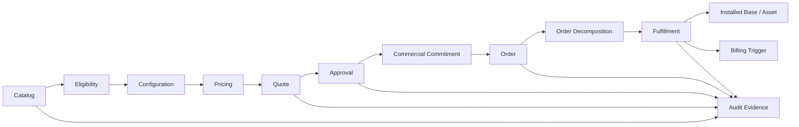

Setiap node bisa menjadi subdomain. Tetapi tidak semua harus menjadi service terpisah.

---

## 2. Core Business Flow

Kita mulai dari cerita end-to-end.

Seorang sales agent ingin menawarkan paket enterprise internet kepada customer. Sistem harus:

1. mencari product offering yang tersedia untuk market/segment customer;
2. mengecek eligibility customer dan location;
3. mengonfigurasi produk dengan bandwidth, SLA, contract term, router option, installation option;
4. menghitung harga one-time charge, recurring charge, discount, dan possible override;
5. membuat quote dengan validity period;
6. meminta approval jika discount/override melewati threshold;
7. menerima acceptance dari customer;
8. mengonversi quote menjadi order;
9. memecah order menjadi fulfillment tasks;
10. menjalankan workflow provisioning, reservation, scheduling, notification, billing activation;
11. memperbarui installed base setelah fulfillment sukses;
12. menyimpan timeline dan audit evidence.

Cerita ini bisa terlihat linear, tetapi sistem nyata berisi cabang:

- product tidak eligible;
- konfigurasi invalid;
- harga perlu approval;
- quote direvisi;
- quote expired;
- customer accept quote lama;
- order gagal karena resource tidak tersedia;
- provisioning sukses tetapi billing gagal;
- cancellation masuk ketika fulfillment sebagian selesai;
- manual repair diperlukan.

Domain map harus memuat kemungkinan itu sejak awal.

---

## 3. Domain Vocabulary Awal

Kita pakai vocabulary berikut secara konsisten.

| Term | Makna |
|---|---|
| Party | individu atau organisasi yang berinteraksi dengan enterprise |
| Customer | party yang membeli atau memakai produk |
| Account | konteks commercial/billing/relationship untuk customer |
| Product Specification | definisi teknis/fungsional produk yang reusable |
| Product Offering | bentuk commercial dari product specification yang dapat dijual |
| Product Offering Price | harga yang melekat pada offering |
| Characteristic | atribut konfigurasi seperti bandwidth, contract term, color, SLA |
| Product Relationship | hubungan antar produk seperti bundle, dependency, exclusion |
| Eligibility | keputusan apakah offering boleh ditawarkan pada konteks tertentu |
| Configuration | pilihan customer terhadap characteristic/options |
| Price Calculation | proses menghasilkan breakdown harga dari offering + config + context |
| Quote | proposal commercial yang bisa direvisi, disetujui, dan diterima |
| Quote Item | item dalam quote, biasanya merepresentasikan offering/config tertentu |
| Approval Request | permintaan persetujuan atas kondisi non-standard |
| Approval Decision | keputusan approve/reject beserta evidence |
| Order | instruksi eksekusi atas komitmen commercial |
| Order Item | unit commercial dalam order |
| Order Decomposition | transformasi order item menjadi fulfillment tasks |
| Fulfillment Task | pekerjaan teknis/operasional yang harus dieksekusi |
| Process Instance | instance workflow Camunda yang mengorkestrasi proses |
| Asset | instance produk/service yang sudah aktif pada customer |
| Subscription | hubungan berkelanjutan customer terhadap produk/service recurring |
| Billing Trigger | event atau instruction untuk mulai/ubah/stop billing |
| Audit Record | bukti perubahan penting pada object bisnis |

Vocabulary ini akan berkembang, tetapi istilah dasar tidak boleh berubah sembarangan. Perubahan istilah di sistem enterprise sering berarti perubahan ownership dan rule.

---

## 4. Subdomain Classification

Tidak semua subdomain sama pentingnya.

Kita klasifikasikan menjadi:

- **Core domain**: keunggulan dan kompleksitas utama sistem.
- **Supporting subdomain**: penting, tetapi bukan pembeda utama.
- **Generic subdomain**: sebaiknya memakai produk/standar/library/platform umum.

| Subdomain | Kategori | Alasan |
|---|---|---|
| Product Catalog | Core | menentukan apa yang bisa dijual dan bagaimana perubahan catalog dikelola |
| Configuration Engine | Core | kompleksitas rule, compatibility, dependency, explainability |
| Pricing Engine | Core | harga, discount, override, approval-sensitive decision |
| Quote Lifecycle | Core | commercial commitment dan state control |
| Order Management | Core | fulfillment readiness dan order state correctness |
| Decomposition Engine | Core | menerjemahkan commercial item menjadi executable plan |
| Approval Management | Supporting/Core | bisa core jika pricing governance adalah pembeda bisnis |
| Asset/Installed Base | Supporting | penting untuk modify/disconnect, tetapi sering dimiliki sistem inventory/CRM |
| Billing Integration | Supporting | CPQ/OMS biasanya trigger, bukan owner ledger billing |
| Notification | Generic | email/SMS/push bukan domain utama |
| Identity/Auth | Generic | gunakan platform identity yang matang |
| Observability | Generic/Platform | penting tetapi bukan domain bisnis CPQ |
| Audit | Supporting/Core | core jika regulasi dan dispute handling berat |

Klasifikasi ini membantu menentukan investasi desain.

Jangan menghabiskan energi membuat notification service super kompleks saat pricing override dan order fallout masih lemah.

---

## 5. Context Map Awal

Berikut context map yang akan kita pakai.

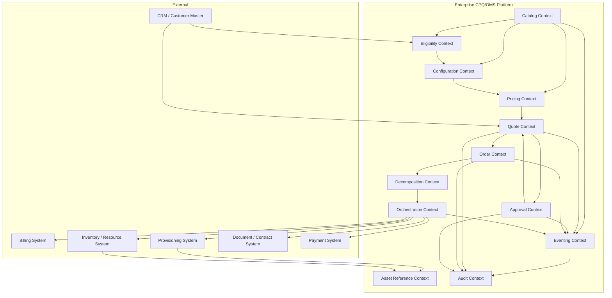

Peta ini menunjukkan dua jenis hubungan:

1. **decision dependency**: satu context butuh keputusan dari context lain;
2. **execution dependency**: satu context memicu pekerjaan di context lain.

Contoh:

- Quote butuh Pricing untuk menghitung harga. Itu decision dependency.
- Order memicu Provisioning untuk aktivasi layanan. Itu execution dependency.

Keduanya tidak boleh diperlakukan sama.

---

## 6. Catalog Context

Catalog adalah sumber definisi produk yang bisa dijual.

Namun catalog bukan sekadar table `products`.

Catalog harus menjawab:

- apa product offering yang tersedia?
- offering ini berlaku untuk market/segment/channel mana?
- offering ini aktif mulai kapan sampai kapan?
- offering ini punya karakteristik apa?
- karakteristik mana yang required?
- option mana yang saling exclude?
- offering ini bagian dari bundle apa?
- offering ini punya price apa?
- catalog version mana yang dipakai quote?

### 6.1 Conceptual Model

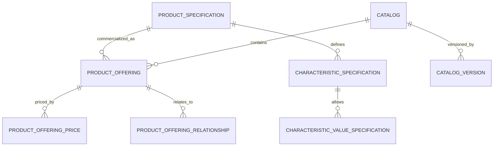

### 6.2 Key Objects

| Object | Ownership | Notes |
|---|---|---|
| `ProductSpecification` | Catalog | definisi reusable produk |
| `ProductOffering` | Catalog | unit commercial yang dijual |
| `ProductOfferingPrice` | Catalog/Pricing | price definition, bukan final calculated price |
| `CharacteristicSpecification` | Catalog | definisi atribut konfigurasi |
| `ProductOfferingRelationship` | Catalog | bundle/dependency/exclusion |
| `CatalogVersion` | Catalog | versioning untuk quote/order snapshot |

### 6.3 Key Invariants

- Product offering tidak boleh dijual jika lifecycle state bukan `ACTIVE`.
- Product offering harus mengarah ke product specification yang valid.
- Required characteristic harus punya value saat konfigurasi selesai.
- Offering relationship tidak boleh membentuk dependency cycle yang tidak bisa dievaluasi.
- Catalog version yang sudah dipakai quote tidak boleh diubah secara destructive.

---

## 7. Eligibility Context

Eligibility menjawab:

> bolehkah offering ini ditawarkan kepada customer ini, di channel ini, untuk lokasi ini, pada waktu ini?

Eligibility bukan konfigurasi produk. Eligibility adalah keputusan sebelum konfigurasi atau sebelum final quote.

Contoh rule:

- customer segment enterprise boleh membeli dedicated internet;
- lokasi customer harus berada dalam coverage area;
- customer dengan outstanding debt tidak boleh mendapat promo tertentu;
- channel partner tidak boleh menjual offering internal-only;
- account tertentu hanya boleh membeli produk sesuai contract master.

### 7.1 Input Eligibility

```json
{
  "customerId": "cus_123",
  "accountId": "acc_456",
  "channel": "DIRECT_SALES",
  "locationId": "loc_789",
  "productOfferingId": "po_enterprise_fiber_1g",
  "requestedAt": "2026-07-02T10:00:00+07:00"
}
```

### 7.2 Output Eligibility

```json
{
  "eligible": false,
  "reasons": [
    {
      "code": "LOCATION_NOT_COVERED",
      "message": "Fiber coverage is not available at the requested location."
    }
  ],
  "alternatives": [
    {
      "productOfferingId": "po_enterprise_wireless_200m"
    }
  ]
}
```

### 7.3 Ownership

Eligibility sering membutuhkan data dari CRM, inventory, coverage, credit, contract, dan catalog. Karena itu eligibility context sebaiknya tidak menyimpan semua data tersebut sebagai owner. Ia mengorkestrasi decision atau memakai projection yang jelas freshness-nya.

---

## 8. Configuration Context

Configuration mengubah offering menjadi konfigurasi spesifik customer.

Contoh offering:

```text
Enterprise Fiber Internet
```

Contoh konfigurasi:

```text
Bandwidth: 1 Gbps
SLA: 99.9%
Contract Term: 36 months
Router: Managed Router Pro
Installation: Standard Installation
Static IP: 8 addresses
```

### 8.1 Configuration Is a Constraint Problem

Configuration bukan form input biasa.

Ia harus mengevaluasi:

- required characteristic;
- allowed values;
- cardinality;
- compatibility;
- dependency;
- exclusion;
- default value;
- derived value;
- explainability.

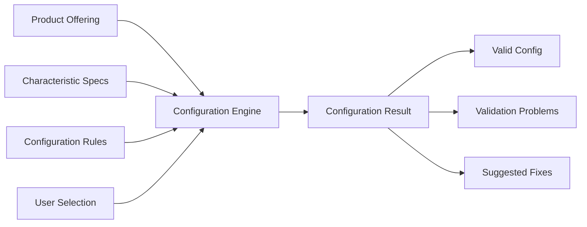

### 8.2 Key Invariants

- Completed configuration must satisfy all required characteristics.
- Selected values must belong to allowed values for the active catalog version.
- Mutually exclusive options cannot coexist.
- Dependent options must be present if prerequisite option is selected.
- Configuration result must be explainable.

Explainable berarti sistem bisa menjawab:

> Kenapa Static IP 16 tidak boleh dipilih untuk bandwidth 100 Mbps?

Bukan hanya:

```text
Invalid configuration.
```

---

## 9. Pricing Context

Pricing menghasilkan price breakdown.

Pricing tidak hanya `quantity * unitPrice`.

Enterprise pricing biasanya melibatkan:

- one-time charge;
- recurring charge;
- usage charge;
- discount;
- promotion;
- contract term;
- volume tier;
- bundle discount;
- manual override;
- approval threshold;
- tax placeholder;
- rounding;
- currency;
- price validity.

### 9.1 Price Definition vs Price Result

Pisahkan:

| Concept | Makna |
|---|---|
| Price Definition | rule/price list di catalog/pricing master |
| Price Calculation Input | customer + offering + config + context |
| Price Result | hasil kalkulasi saat ini |
| Price Snapshot | hasil harga yang disimpan di quote |
| Price Override | perubahan manual terhadap result |
| Price Approval Evidence | bukti override disetujui |

Kesalahan fatal:

> Quote hanya menyimpan `priceId`, lalu harga dihitung ulang saat customer accept.

Yang benar:

> Quote menyimpan price snapshot dan referensi ke price source/version agar bisa diaudit.

### 9.2 Pricing Pipeline

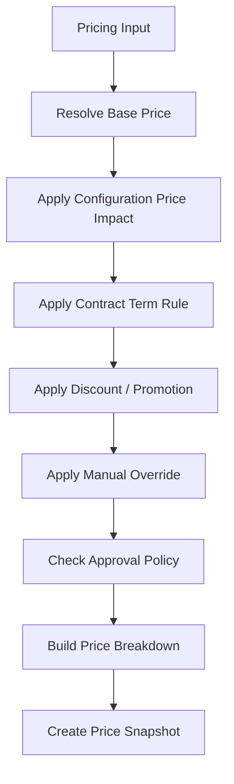

### 9.3 Key Invariants

- Price result must reference catalog/pricing version.
- Price override must be traceable to actor and reason.
- Discount stacking must follow deterministic order.
- Rounding must be consistent and documented.
- Quote acceptance must use approved snapshot, not newly calculated price.

---

## 10. Quote Context

Quote adalah pusat CPQ.

Quote adalah proposal commercial yang dapat berubah sampai diterima. Setelah diterima, quote menjadi evidence komitmen.

### 10.1 Quote Aggregate

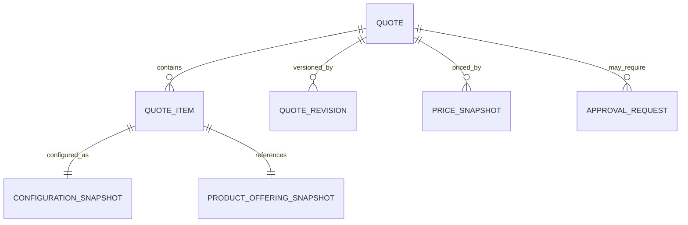

### 10.2 Quote Lifecycle

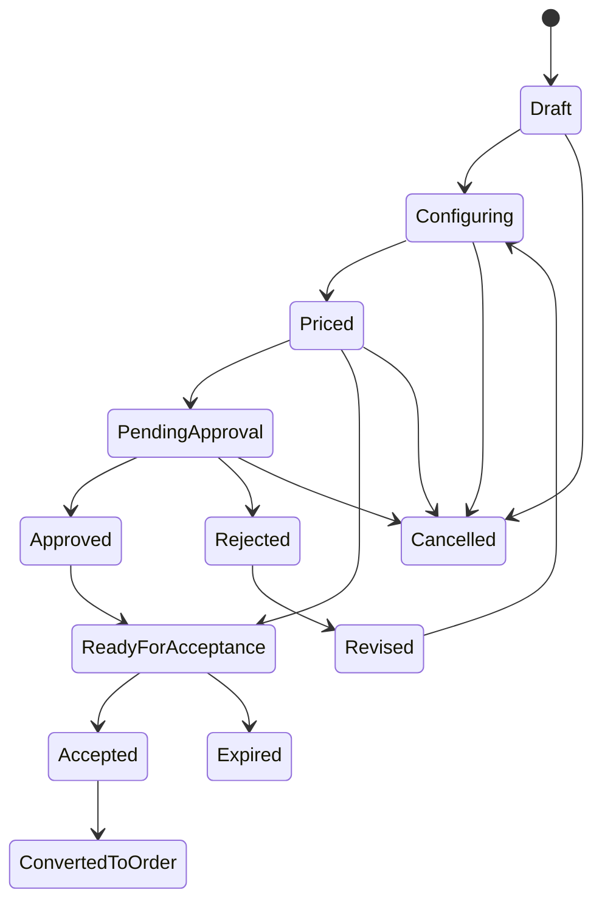

### 10.3 Quote Owns Snapshot

Quote harus menyimpan snapshot berikut:

- selected offering identity;
- selected offering name/description at time of quote;
- catalog version;
- configuration values;
- price breakdown;
- discount/override reason;
- approval reference;
- validity period;
- terms summary.

Quote tidak harus menyimpan seluruh catalog. Tetapi ia harus menyimpan cukup informasi agar acceptance dan dispute handling tidak bergantung pada catalog yang sudah berubah.

---

## 11. Approval Context

Approval context mengontrol keputusan non-standard.

Contoh approval trigger:

- discount melebihi threshold;
- margin di bawah threshold;
- contract term tidak standard;
- product eligibility exception;
- manual price override;
- expedited fulfillment;
- cancellation fee waiver.

### 11.1 Approval Model

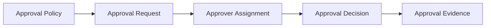

### 11.2 Key Invariants

- Approval decision must be made against a specific quote version.
- Approval of old revision must not approve newer revision accidentally.
- Rejected quote cannot be accepted without revision or override path.
- Approver cannot approve their own request if policy forbids it.
- Approval evidence must remain available after workflow completion.

Approval workflow boleh dijalankan di Camunda. Tetapi approval decision sebagai business evidence harus tetap tersimpan di domain/audit store.

---

## 12. Order Context

Order adalah instruksi eksekusi commercial commitment.

Quote menjawab:

> Apa yang kita tawarkan dan customer setujui?

Order menjawab:

> Apa yang harus kita lakukan untuk memenuhi komitmen itu?

### 12.1 Order Types

| Type | Makna |
|---|---|
| New Install | customer membeli produk baru |
| Add | menambah produk ke existing account |
| Modify | mengubah existing asset/subscription |
| Disconnect | menghentikan produk/service |
| Move | memindahkan service/location |
| Cancel | membatalkan order sebelum selesai |
| Amend | mengubah order yang sedang berjalan |
| Supplemental | order tambahan untuk menyelesaikan perubahan/fallout |

### 12.2 Order Aggregate

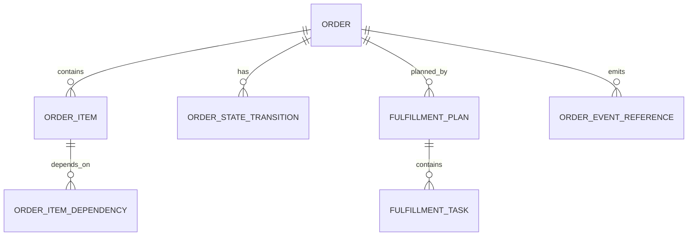

### 12.3 Order Invariants

- Order created from quote must reference accepted quote version.
- Order item must preserve commercial commitment snapshot.
- Order cannot be completed if required fulfillment task is not completed or explicitly waived.
- Cancellation must respect current fulfillment progress.
- Manual repair must produce audit evidence.
- Order state must be queryable without reading Camunda internals.

---

## 13. Decomposition Context

Decomposition mengubah order item commercial menjadi fulfillment task teknis.

Contoh:

```text
Order Item:
  Enterprise Fiber Internet 1Gbps
```

Didekomposisi menjadi:

```text
- validate serviceability
- reserve fiber port
- allocate ONT
- schedule technician
- configure network service
- activate service
- notify billing
- notify customer
```

### 13.1 Decomposition Graph

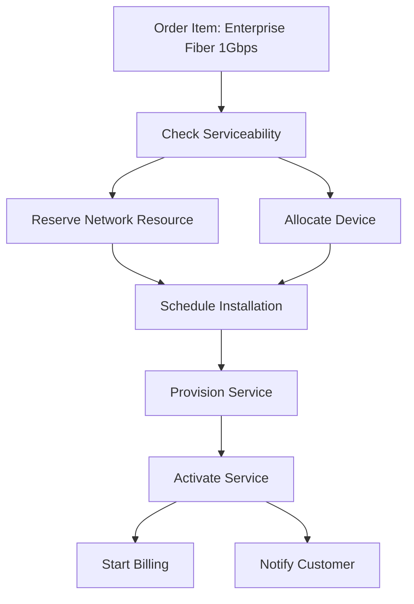

### 13.2 Decomposition Is Not Workflow

Decomposition menghasilkan rencana. Workflow mengeksekusi rencana.

| Concern | Decomposition | Workflow |
|---|---|---|
| Pertanyaan | task apa yang dibutuhkan? | task dijalankan dalam urutan apa? |
| Output | fulfillment plan | process instance execution |
| Ownership | OMS/domain | Camunda orchestration |
| Rule | product/action mapping | retry/timer/error path/process sequence |

Jangan mencampur dua hal ini. Kalau decomposition ditanam seluruhnya di BPMN, perubahan product/action akan membuat workflow explosion.

---

## 14. Orchestration Context

Orchestration menjalankan fulfillment plan lintas sistem.

Kita akan memakai Camunda 8/Zeebe untuk:

- long-running process;
- timers;
- job workers;
- incidents;
- retries;
- human/manual task integration;
- process visibility.

Namun domain logic tetap berada di service/worker yang jelas.

### 14.1 Worker Boundary

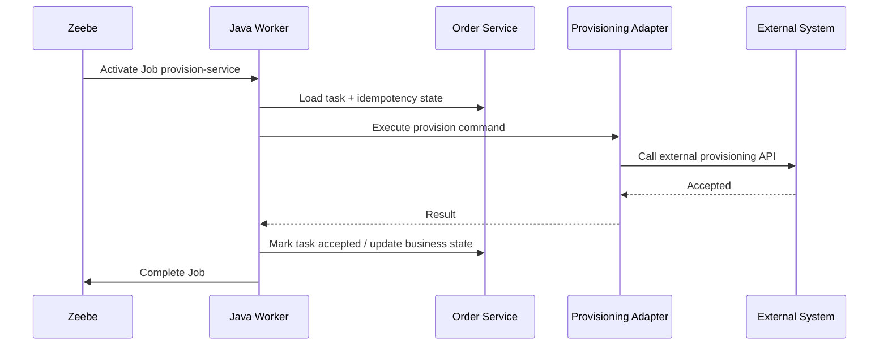

Critical rule:

> Worker harus idempotent. Worker crash setelah external call adalah skenario normal, bukan edge case aneh.

---

## 15. Fulfillment Adapter Context

Adapter adalah anti-corruption layer terhadap sistem eksternal.

External system jarang punya model yang sama dengan OMS.

Contoh perbedaan:

| OMS | External Provisioning |
|---|---|
| order item | service order |
| fulfillment task | work order / job |
| customer asset | service instance |
| cancel | withdraw / abort / terminate |
| retry | duplicate command risk |

Adapter bertanggung jawab:

- mapping model;
- authentication ke external system;
- timeout/retry policy;
- response normalization;
- external correlation ID;
- idempotency handling;
- error taxonomy;
- audit-safe result.

Adapter tidak boleh membocorkan detail eksternal ke domain OMS secara mentah.

---

## 16. Asset / Installed Base Context

Asset adalah produk/service yang sudah aktif untuk customer.

Quote dan order melihat asset untuk:

- modify existing service;
- disconnect service;
- add-on compatibility;
- migration;
- upgrade/downgrade;
- entitlement;
- billing relationship.

### 16.1 Asset Model

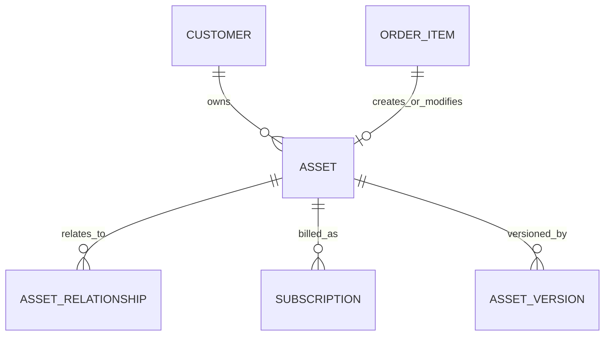

### 16.2 Ownership Warning

Dalam banyak enterprise, source of truth asset bukan CPQ/OMS, melainkan inventory, service inventory, CRM, atau billing.

Karena itu kita akan memperlakukan asset sebagai:

- reference jika dimiliki external system;
- local projection jika dibutuhkan untuk query cepat;
- local owner hanya jika sistem ini memang diberi mandat sebagai installed base master.

Jangan mengklaim ownership asset tanpa keputusan arsitektur eksplisit.

---

## 17. Billing Trigger Context

OMS biasanya tidak menghitung invoice. Tetapi OMS sering memicu billing.

Contoh event:

- service activated;
- subscription started;
- subscription modified;
- service disconnected;
- one-time charge completed;
- cancellation fee waived;
- billing hold released.

Billing trigger harus hati-hati karena uang terlibat.

Key rules:

- billing event harus idempotent;
- event harus membawa business effective date;
- event harus merujuk order/order item/asset;
- event tidak boleh dikirim sebelum fulfillment condition terpenuhi;
- jika billing gagal, order completion rule harus jelas.

---

## 18. Audit Context

Audit context menyimpan evidence lintas domain.

Object yang wajib punya audit kuat:

- catalog lifecycle change;
- price change;
- discount/override;
- quote submit/approve/reject/accept;
- order create/cancel/amend;
- fulfillment failure and manual repair;
- compensation;
- data correction;
- security-sensitive access/change.

### 18.1 Audit Timeline

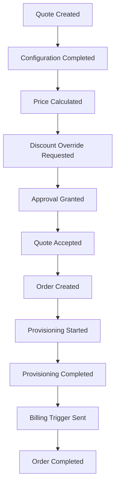

Timeline ini bukan hanya untuk auditor. Support engineer butuh timeline ini untuk menjawab customer dengan cepat.

---

## 19. Eventing Context

Eventing context mengatur event yang keluar dari domain.

Kita akan bedakan:

| Event type | Tujuan | Contoh |
|---|---|---|
| Domain Event | perubahan penting di aggregate | `QuoteAccepted` |
| Integration Event | kontrak untuk service lain | `quote.accepted.v1` |
| Audit Event | evidence | `QUOTE_ACCEPTED_AUDIT_RECORDED` |
| Workflow Event | memicu/lanjutkan process | `OrderReadyForFulfillment` |
| Notification Event | memberi tahu user/system | `CustomerNotificationRequested` |

Jangan semua event diperlakukan sama.

Domain event bisa kaya secara domain internal. Integration event harus stabil dan backward-compatible. Audit event harus evidence-oriented. Workflow event harus membawa data minimum untuk melanjutkan proses.

---

## 20. Command Map Awal

Command adalah intent untuk mengubah state.

### 20.1 Catalog Commands

| Command | Result |
|---|---|
| `CreateProductSpecification` | spec draft dibuat |
| `CreateProductOffering` | offering draft dibuat |
| `ActivateProductOffering` | offering aktif |
| `RetireProductOffering` | offering retired |
| `PublishCatalogVersion` | versi catalog immutable tersedia |

### 20.2 CPQ Commands

| Command | Result |
|---|---|
| `StartQuote` | quote draft dibuat |
| `AddQuoteItem` | item ditambahkan |
| `ConfigureQuoteItem` | configuration snapshot diperbarui |
| `CalculateQuotePrice` | price snapshot dibuat |
| `SubmitQuote` | quote submit, approval atau ready |
| `ApproveQuote` | approval decision recorded |
| `RejectQuote` | quote rejected |
| `ReviseQuote` | revision baru dibuat |
| `AcceptQuote` | quote accepted |
| `ConvertQuoteToOrder` | order dibuat |

### 20.3 OMS Commands

| Command | Result |
|---|---|
| `CreateOrder` | order acknowledged |
| `ValidateOrder` | order validated/held |
| `DecomposeOrder` | fulfillment plan dibuat |
| `StartFulfillment` | process instance dimulai |
| `MarkTaskCompleted` | task sukses |
| `MarkTaskFailed` | task failed/fallout |
| `RetryTask` | retry requested |
| `CancelOrder` | cancellation path dimulai |
| `AmendOrder` | amendment path dimulai |
| `CompleteOrder` | order completed |

Command harus membawa idempotency key jika bisa dipanggil ulang dari client, worker, relay, atau integration callback.

---

## 21. Event Map Awal

### 21.1 Quote Events

| Event | Meaning |
|---|---|
| `QuoteStarted` | quote draft dibuat |
| `QuoteItemConfigured` | konfigurasi item berubah |
| `QuotePriced` | price snapshot dibuat |
| `QuoteSubmitted` | quote disubmit |
| `QuoteApprovalRequested` | approval diperlukan |
| `QuoteApproved` | approval diberikan |
| `QuoteRejected` | approval ditolak |
| `QuoteAccepted` | customer menerima quote |
| `QuoteExpired` | quote melewati validity |
| `QuoteConvertedToOrder` | order berhasil dibuat |

### 21.2 Order Events

| Event | Meaning |
|---|---|
| `OrderCreated` | order dibuat |
| `OrderValidated` | order valid |
| `OrderHeld` | order hold karena issue |
| `OrderDecomposed` | fulfillment plan dibuat |
| `FulfillmentStarted` | workflow dimulai |
| `FulfillmentTaskCompleted` | task selesai |
| `FulfillmentTaskFailed` | task gagal |
| `OrderFalloutDetected` | butuh intervensi |
| `OrderCancellationRequested` | cancel diminta |
| `OrderCancelled` | cancel selesai |
| `OrderCompleted` | order selesai |

Event harus cukup untuk consumer downstream, tetapi tidak boleh menjadi dump seluruh aggregate tanpa desain.

---

## 22. Traceability Model

Traceability adalah kemampuan mengikuti satu customer commitment dari awal sampai akhir.

Minimal chain:

```text
customerId
  -> quoteId / quoteVersion
  -> quoteItemId
  -> priceSnapshotId
  -> approvalDecisionId
  -> orderId
  -> orderItemId
  -> fulfillmentPlanId
  -> fulfillmentTaskId
  -> processInstanceKey
  -> externalRequestId
  -> assetId
  -> billingTriggerId
  -> auditId
```

### 22.1 Traceability Diagram

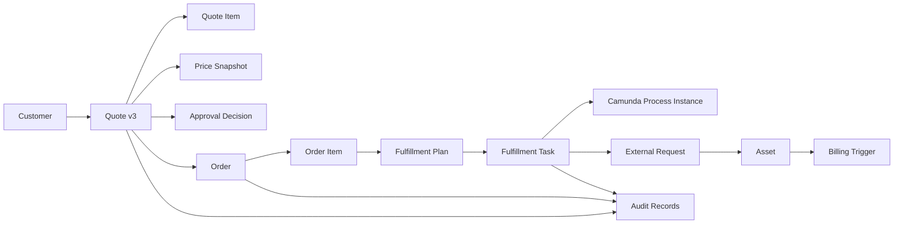

Jika traceability ini tidak didesain dari awal, support dan audit akan bergantung pada pencarian manual di log teknis. Itu bukan enterprise-grade.

---

## 23. Read Model Awal

Write model menjaga invariant. Read model membantu pencarian dan operasi.

Kita butuh read model seperti:

| Read Model | Tujuan |
|---|---|
| Quote Search View | mencari quote by customer, state, expiry, owner |
| Quote Timeline View | melihat riwayat quote |
| Approval Queue View | daftar approval pending |
| Order Search View | mencari order by customer, state, date, channel |
| Order Timeline View | riwayat order end-to-end |
| Fulfillment Dashboard | task pending/failed/blocked |
| Fallout Queue | order/task yang perlu manual repair |
| Customer Commercial Timeline | semua quote/order/asset untuk customer |
| Audit Explorer | pencarian evidence |

Jangan memaksa aggregate write model melayani semua query dashboard.

Enterprise query sering membutuhkan projection khusus.

---

## 24. Synchronous vs Asynchronous Dependency

Tidak semua dependency harus synchronous.

| Dependency | Recommended style | Alasan |
|---|---|---|
| quote -> pricing calculation | synchronous | user menunggu hasil harga |
| quote -> approval request | sync create + async workflow | quote perlu tahu approval dimulai |
| quote accepted -> order creation | synchronous atau async tergantung UX | harus idempotent |
| order created -> fulfillment start | async via workflow/event | long-running |
| fulfillment -> provisioning | async/worker call | external system bisa lambat |
| fulfillment completed -> billing trigger | async event | downstream reaction |
| audit record | same transaction untuk critical state | evidence tidak boleh hilang |
| notification | async | tidak boleh block core transaction |

Rule:

> User-facing decision yang cepat dan deterministik boleh synchronous. Long-running execution harus asynchronous dan observable.

---

## 25. Aggregate Candidates

Aggregate bukan table. Aggregate adalah consistency boundary.

Candidate aggregate awal:

| Aggregate | Kenapa aggregate |
|---|---|
| `ProductOfferingAggregate` | lifecycle dan relation harus konsisten |
| `CatalogVersionAggregate` | publish/immutability boundary |
| `QuoteAggregate` | quote state, items, pricing, approval reference harus konsisten |
| `ApprovalRequestAggregate` | assignment dan decision harus konsisten |
| `OrderAggregate` | order state dan order item state harus konsisten |
| `FulfillmentPlanAggregate` | task dependency dan plan status harus konsisten |
| `AuditRecord` | append-only evidence, bukan aggregate besar |
| `OutboxMessage` | event publication lifecycle |

Hati-hati: terlalu besar aggregate akan membuat locking dan concurrency buruk. Terlalu kecil aggregate akan membuat invariant bocor ke application service.

---

## 26. Boundary Smells

Berikut tanda boundary salah:

1. Satu service harus join database service lain.
2. Quote service harus membaca table Camunda langsung untuk tahu status bisnis.
3. Worker mengubah order state tanpa lewat order service/domain rule.
4. API response mengembalikan entity persistence mentah.
5. Event Kafka berisi seluruh row database.
6. Pricing menghitung dari data mutable tanpa version reference.
7. Approval tidak terikat ke quote version tertentu.
8. Fulfillment task tidak punya external correlation ID.
9. Support hanya bisa troubleshoot lewat grep log.
10. Manual repair dilakukan langsung update table tanpa audit.

Saat smell muncul, jangan buru-buru menambah library. Perbaiki boundary.

---

## 27. Minimal Domain Slice Pertama

Untuk implementasi awal, slice paling sehat bukan “semua fitur tipis”.

Slice awal:

```text
Catalog -> Configure -> Price -> Quote -> Accept -> Create Order -> Decompose -> Start Fulfillment Skeleton
```

Dengan kemampuan:

- satu product offering;
- beberapa characteristic;
- pricing sederhana tapi snapshot-based;
- quote state machine;
- idempotent accept;
- order created from accepted quote;
- simple decomposition plan;
- outbox event;
- audit record;
- dummy worker boundary.

Kenapa slice ini?

Karena slice ini melewati semua boundary penting:

- catalog version;
- configuration;
- pricing;
- quote lifecycle;
- order creation;
- persistence;
- event;
- audit;
- orchestration entry.

Kita tidak akan mulai dari catalog CRUD lengkap karena itu sering memberi rasa kemajuan palsu.

---

## 28. Domain Map Summary

Peta akhir part ini:

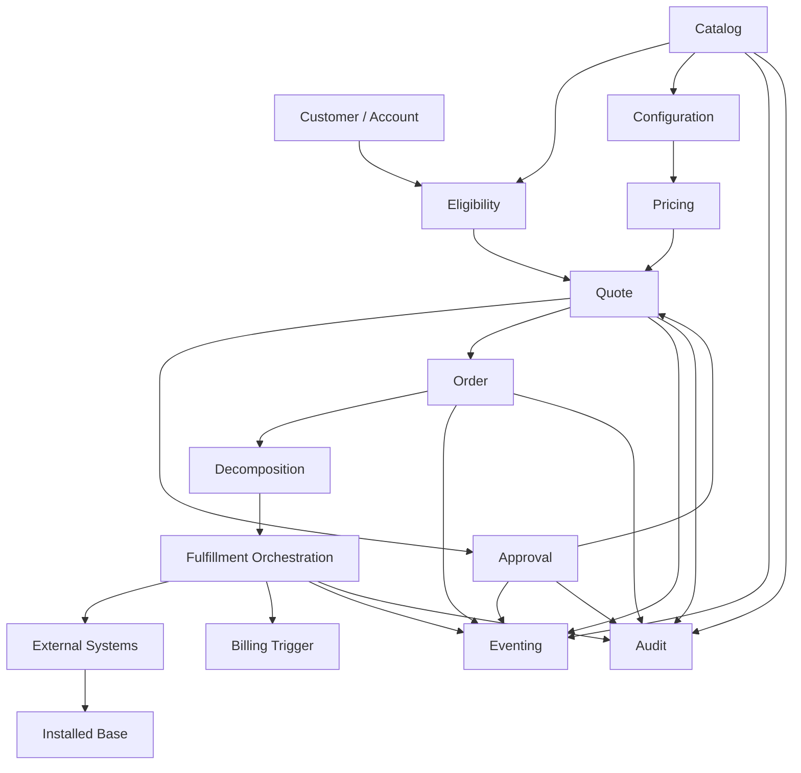

Mental model yang harus dibawa:

> Enterprise commerce bukan pipeline data biasa. Ia adalah rangkaian keputusan, komitmen, eksekusi, dan evidence yang harus tetap konsisten walaupun sistem berubah dan gagal sebagian.

---

## 29. Checklist Pemahaman

Sebelum lanjut ke product catalog domain model, pastikan kamu bisa menjawab:

- Apa perbedaan product specification dan product offering?
- Kenapa configuration adalah constraint problem?
- Apa beda price definition, price result, dan price snapshot?
- Kenapa approval harus terkait quote version?
- Apa beda decomposition dan orchestration?
- Kenapa order state harus tetap ada di OMS walaupun Camunda menjalankan workflow?
- Apa itu asset dan kenapa ownership-nya sering tricky?
- Event mana yang harus integration event dan mana yang cukup internal domain event?
- Kenapa read model berbeda dari aggregate?
- Boundary smell mana yang paling sering kamu lihat di sistem enterprise?

---

## 30. References

Referensi domain dan standar yang relevan:

- TM Forum Open APIs Directory: https://www.tmforum.org/open-digital-architecture/open-apis
- TMF620 Product Catalog Management API: https://www.tmforum.org/oda/open-apis/table/product-catalog-management-api-TMF620/
- TMF648 Quote Management API: https://www.tmforum.org/oda/open-apis/table/quote-management-api-TMF648/
- TMF622 Product Ordering Management API: https://www.tmforum.org/oda/open-apis/table/product-ordering-management-api-TMF622/
- OpenAPI Initiative: https://www.openapis.org/
- Camunda 8 Docs — Processes: https://docs.camunda.io/docs/components/concepts/processes/
- Apache Kafka Documentation: https://kafka.apache.org/documentation/
- PostgreSQL: https://www.postgresql.org/
