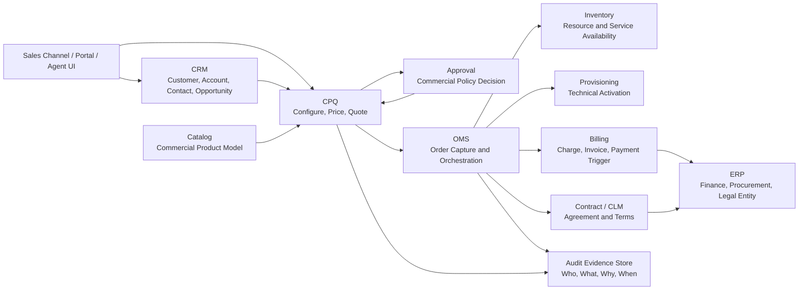
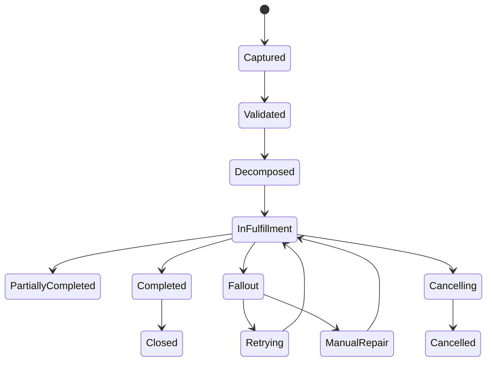
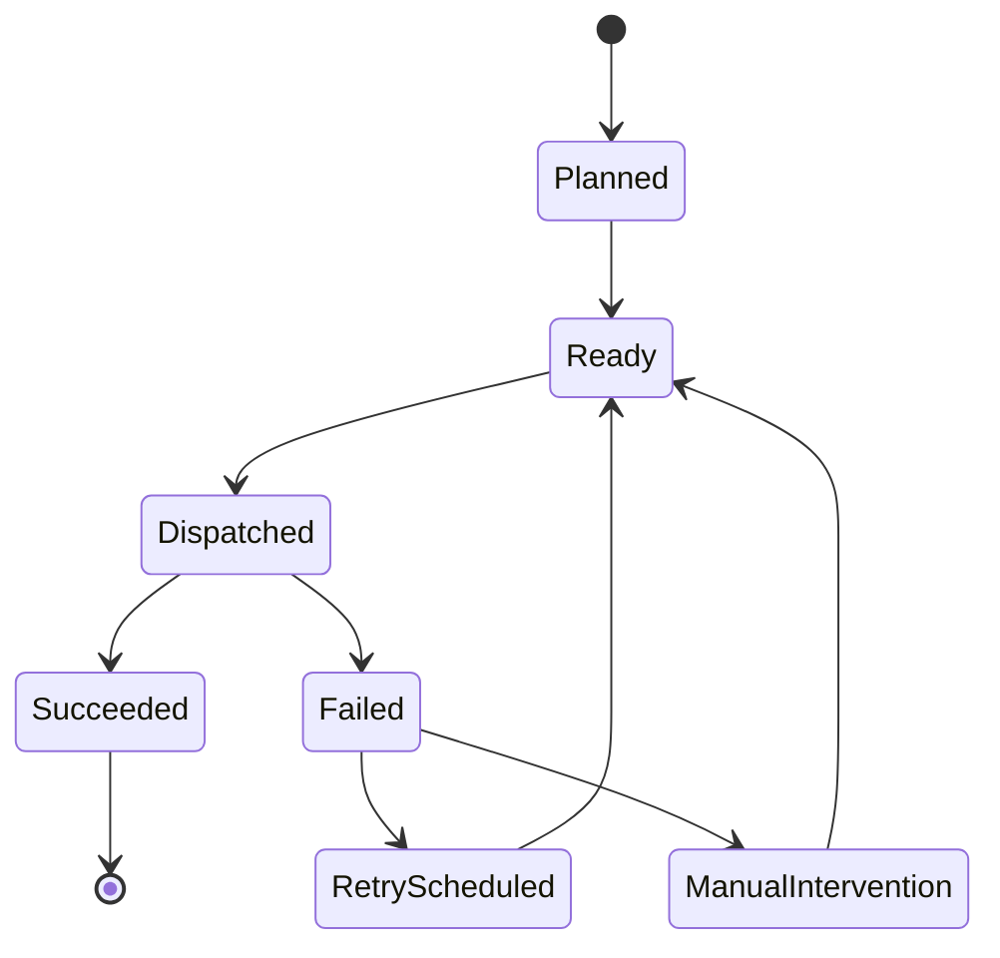
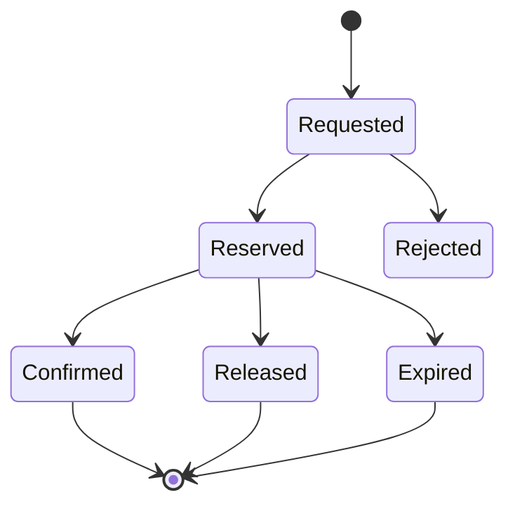
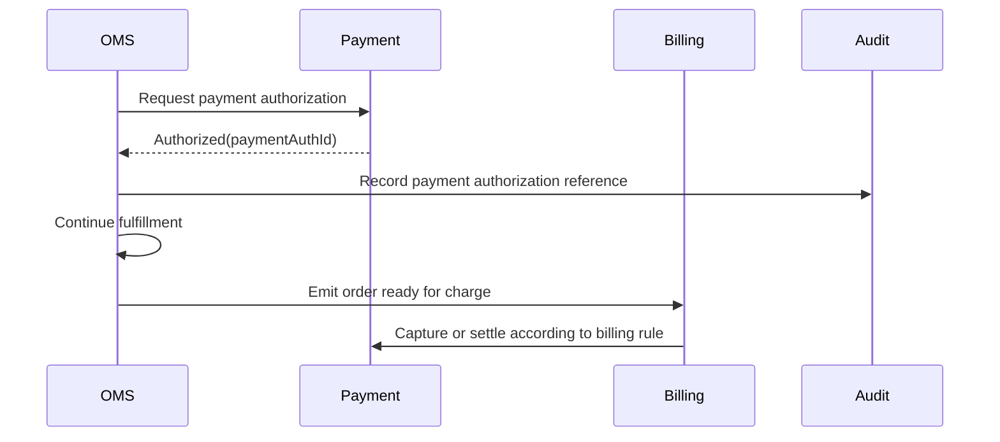
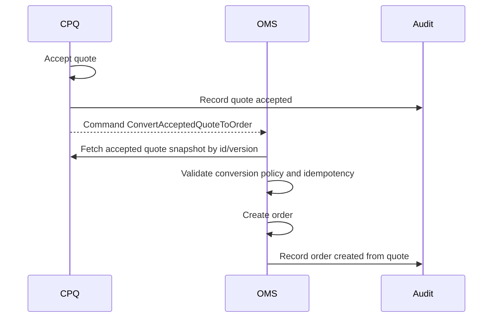
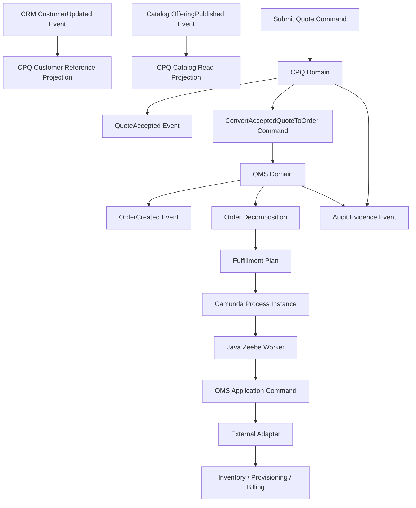

------
title: Build From Scratch: Enterprise Java Microservices CPQ & Order Management Platform - Part 003
description: Memisahkan boundary CPQ, OMS, CRM, ERP, billing, provisioning, inventory, payment, dan contract system agar ownership data, state, command, event, dan audit tidak bercampur.
series: learn-enterprise-cpq-oms-glassfish-camunda8
seriesTitle: Build From Scratch: Enterprise Java Microservices CPQ & Order Management Platform
order: 3
partTitle: CPQ vs OMS vs CRM vs ERP Boundaries
tags:
  - java
  - microservices
  - cpq
  - oms
  - bounded-context
  - domain-driven-design
  - enterprise-architecture
  - system-boundary
  - integration
  - audit
  - order-management
date: 2026-07-02
---

# Part 003 — CPQ vs OMS vs CRM vs ERP Boundaries

Di Part 001 kita mengunci scope.

Di Part 002 kita membuat peta domain enterprise commerce.

Sekarang kita masuk ke pertanyaan yang kelihatannya sederhana, tapi sering menjadi akar kegagalan sistem enterprise:

> Data ini milik siapa?

Pertanyaan itu lebih penting daripada pertanyaan:

> Service apa yang harus kita buat?

Karena microservice yang salah boundary hanya akan menghasilkan distributed monolith: banyak service, banyak database, banyak event, tapi ownership tetap kabur.

Di sistem CPQ/OMS, boundary yang kabur biasanya muncul dalam bentuk:

- CPQ menyimpan customer profile terlalu dalam;
- OMS menghitung ulang harga setelah quote diterima;
- CRM mengubah order state langsung;
- billing mengoreksi order secara diam-diam;
- provisioning menganggap order item adalah technical task;
- product catalog dipakai sebagai runtime rule engine;
- workflow engine menjadi tempat semua business logic;
- reporting database menjadi sumber keputusan operasional;
- event dianggap sebagai pengganti ownership.

Kita akan membangun platform ini dengan prinsip:

> Setiap bounded context harus punya satu jenis kebenaran utama yang ia jaga, satu jenis state yang ia kuasai, dan satu jenis keputusan yang hanya boleh ia buat.

---

## 1. Peta Besar Boundary Enterprise Commerce

Mari mulai dari peta sistem.



Diagram ini bukan deployment diagram. Ini adalah **responsibility diagram**.

Hal terpenting:

- CRM bukan CPQ.
- CPQ bukan OMS.
- OMS bukan provisioning.
- Billing bukan order owner.
- ERP bukan operational workflow engine.
- Audit bukan sekadar log.

Kalau salah satu garis itu dilanggar, konsekuensinya bukan hanya bug teknis. Konsekuensinya bisa menjadi dispute commercial, salah tagih, order stuck, data tidak bisa direkonsiliasi, atau evidence tidak defensible.

---

## 2. Boundary Harus Ditentukan Dari Keputusan, Bukan Dari Tabel

Cara pemula mendesain boundary:

> Ada tabel customer, maka buat Customer Service. Ada tabel order, maka buat Order Service. Ada tabel product, maka buat Product Service.

Cara enterprise mendesain boundary:

> Keputusan apa yang dibuat? Siapa yang berwenang membuat keputusan itu? State apa yang berubah akibat keputusan itu? Evidence apa yang harus disimpan?

Contoh:

| Keputusan | Owner | Bukan owner |
|---|---|---|
| Customer ini eligible membeli offering X? | CPQ, dengan reference dari CRM dan Catalog | CRM sendiri |
| Harga final quote item berapa? | CPQ/Pricing | OMS, Billing |
| Quote boleh dikonversi ke order? | CPQ | OMS |
| Order item harus didekomposisi menjadi task apa? | OMS | CPQ, Provisioning |
| Resource tersedia atau tidak? | Inventory | OMS |
| Service aktif atau gagal? | Provisioning | CPQ |
| Charge harus dibuat dari order completion? | Billing | OMS |
| Revenue recognition masuk legal entity mana? | ERP | CPQ/OMS |

Boundary bukan berarti sistem tidak boleh saling membaca data. Boundary berarti hanya satu sistem yang boleh menjadi **decision authority** untuk jenis keputusan tertentu.

---

## 3. CPQ Boundary

CPQ adalah sistem yang mengubah intensi membeli menjadi quote yang valid secara commercial.

CPQ menjawab pertanyaan:

- produk apa yang boleh ditawarkan?
- konfigurasi apa yang valid?
- harga apa yang berlaku?
- diskon apa yang boleh diberikan?
- apakah quote butuh approval?
- apakah quote masih valid?
- apakah quote bisa diterima?
- apakah quote bisa dikonversi menjadi order?

CPQ bukan sistem fulfillment. CPQ tidak boleh berpura-pura tahu detail teknis aktivasi kecuali sebagai constraint commercial atau eligibility.

### 3.1 Data Yang Dimiliki CPQ

CPQ boleh menjadi owner untuk:

- quote header;
- quote item;
- quote revision;
- quote status;
- quote validity period;
- quote price snapshot;
- quote configuration snapshot;
- quote approval request reference;
- quote acceptance evidence;
- quote-to-order conversion record.

CPQ tidak menjadi owner untuk:

- customer master;
- account hierarchy master;
- active subscription inventory;
- technical service inventory;
- invoice;
- payment;
- provisioning task;
- shipment;
- legal accounting entry.

### 3.2 Quote Snapshot Adalah Kebenaran Commercial

Ketika quote dihitung, hasilnya harus disimpan sebagai snapshot.

Snapshot minimal berisi:

- product offering id dan version;
- selected characteristics;
- selected bundled items;
- price version;
- base price;
- discount;
- one-time charge;
- recurring charge;
- tax placeholder jika belum final;
- approval-sensitive override;
- eligibility result;
- validation result;
- quote validity.

Kenapa snapshot penting?

Karena product catalog dan price book bisa berubah setelah quote dibuat.

Kalau sistem menghitung ulang quote lama menggunakan catalog terbaru, maka quote yang sudah diterima customer bisa berubah diam-diam. Itu bukan hanya bug. Itu pelanggaran commercial integrity.

Rule praktis:

> Quote accepted tidak boleh bergantung pada current catalog untuk menentukan harga yang sudah disepakati.

Current catalog boleh dipakai untuk validasi tambahan saat conversion, tapi bukan untuk mengubah komitmen commercial tanpa proses amendment.

---

## 4. OMS Boundary

OMS adalah sistem yang mengubah komitmen commercial menjadi rencana eksekusi fulfillment.

OMS menjawab pertanyaan:

- order ini valid untuk diproses atau tidak?
- order item ini harus menjadi fulfillment task apa?
- task mana yang harus jalan dulu?
- task mana yang bisa paralel?
- task mana yang boleh retry?
- task mana yang butuh manual intervention?
- kapan order dianggap complete?
- kapan order dianggap fallout?
- kapan compensation harus dijalankan?

OMS bukan CPQ. OMS tidak menghitung ulang harga final quote. OMS boleh membawa price snapshot sebagai evidence, tapi bukan sebagai pricing authority.

### 4.1 Data Yang Dimiliki OMS

OMS boleh menjadi owner untuk:

- order header;
- order item;
- order lifecycle state;
- order item lifecycle state;
- fulfillment plan;
- fulfillment task;
- decomposition result;
- dependency graph;
- orchestration reference;
- cancellation/amendment relationship;
- fallout and recovery state.

OMS tidak menjadi owner untuk:

- quote revision;
- quote approval decision;
- product master;
- technical inventory truth;
- invoice truth;
- payment truth;
- customer profile truth.

### 4.2 Order State Bukan Fulfillment State Tunggal

Kesalahan umum:

```text
order.status = IN_PROGRESS
```

Lalu semua orang menambah arti sendiri:

- sales menganggap in progress artinya order sudah diterima;
- provisioning menganggap in progress artinya teknis sedang aktivasi;
- billing menganggap in progress artinya belum boleh invoice;
- customer service menganggap in progress artinya tidak ada masalah;
- operations menganggap in progress artinya task masih berjalan.

Satu status tidak cukup.

Kita butuh beberapa state machine yang saling terkait:



Dan pada level task:



Order state adalah ringkasan progress business. Task state adalah detail eksekusi teknis. Jangan campur keduanya.

---

## 5. CRM Boundary

CRM adalah system of record untuk relasi commercial dengan customer.

CRM menjawab pertanyaan:

- customer siapa?
- account-nya apa?
- contact-nya siapa?
- opportunity apa?
- segment apa?
- sales owner siapa?
- customer hierarchy bagaimana?

CRM bukan pricing engine, bukan quote state owner, dan bukan order orchestration engine.

### 5.1 Data Dari CRM Yang Biasanya Dipakai CPQ

CPQ biasanya membutuhkan reference dari CRM:

- customer id;
- account id;
- contact id;
- customer segment;
- customer type;
- region;
- billing account reference;
- opportunity reference;
- sales channel;
- sales representative;
- contract eligibility marker.

Reference ini dipakai untuk decision, tetapi decision CPQ tetap milik CPQ.

Contoh:

CRM menyimpan `customer.segment = ENTERPRISE`.

CPQ memakai segment itu untuk menentukan eligibility dan price policy.

Tetapi keputusan:

```text
customer may buy product offering X with discount Y
```

adalah keputusan CPQ, bukan CRM.

### 5.2 Customer Snapshot Dalam Quote

Quote harus menyimpan customer snapshot minimal:

- customer id;
- account id;
- display name at quote time;
- segment at quote time;
- channel;
- sales owner reference;
- billing account reference;
- relevant eligibility attributes.

Snapshot bukan berarti CPQ menjadi owner customer. Snapshot berarti quote bisa dibaca dan diaudit meskipun CRM berubah.

Rule praktis:

> Reference untuk integrasi. Snapshot untuk evidence.

---

## 6. ERP Boundary

ERP biasanya menjadi system of record untuk finance, procurement, accounting, legal entity, tax treatment, dan enterprise master data tertentu.

ERP menjawab pertanyaan:

- legal entity mana yang menjual?
- cost center mana yang terkait?
- revenue account mana yang dipakai?
- procurement order apa yang dibuat?
- accounting posting bagaimana?
- tax/accounting treatment apa yang berlaku?

ERP bukan tempat menjalankan order fulfillment step-by-step.

Kesalahan umum adalah membuat ERP menjadi pusat semua workflow. Akibatnya:

- order orchestration menjadi lambat;
- integration menjadi brittle;
- business exception sulit ditangani;
- teknis fulfillment terikat terlalu kuat ke finance process;
- release ERP menjadi bottleneck semua perubahan.

Dalam desain kita:

- CPQ/OMS mengirim fakta commercial dan order event;
- billing/finance layer menerjemahkan fakta itu ke financial transaction;
- ERP menerima posting/accounting/procurement-relevant data;
- ERP tidak mengatur detail task provisioning.

---

## 7. Billing Boundary

Billing adalah system of record untuk charge, invoice, billing cycle, adjustment, payment allocation, tax finalization, dan dunning.

Billing menjawab pertanyaan:

- charge apa yang harus dibuat?
- invoice kapan dibuat?
- payment sudah diterima atau belum?
- adjustment apa yang disetujui?
- recurring charge mulai kapan?
- usage charge dihitung bagaimana?

Billing bukan CPQ pricing engine.

Ini penting.

CPQ menghitung **commercial price commitment**.

Billing menghitung **billable charge execution**.

Keduanya bisa berbeda detail karena billing harus memperhitungkan:

- cycle;
- proration;
- activation date;
- suspension;
- tax finalization;
- invoice grouping;
- payment terms;
- adjustment;
- usage records.

Tetapi billing tidak boleh diam-diam mengubah commercial agreement tanpa reason/evidence.

### 7.1 CPQ Price vs Billing Charge

| Aspek | CPQ Price | Billing Charge |
|---|---|---|
| Tujuan | Membuat penawaran commercial | Menagih customer |
| Timing | Sebelum order | Setelah order atau activation trigger |
| Sumber | Catalog, price book, promotion, approval | Billing account, cycle, activation, tax, usage |
| Mutability | Frozen saat accepted | Bisa adjustment dengan audit |
| Evidence | Quote snapshot | Invoice/charge record |

Rule praktis:

> CPQ menentukan apa yang dijanjikan. Billing menentukan bagaimana janji itu ditagih.

---

## 8. Inventory Boundary

Inventory dalam enterprise commerce bisa berarti beberapa hal:

- product inventory / installed base;
- service inventory;
- resource inventory;
- stock inventory;
- network inventory;
- appointment capacity.

Satu kata “inventory” sering menipu.

OMS boleh bertanya:

- resource tersedia?
- nomor tersedia?
- slot teknisi tersedia?
- device tersedia?
- service already active?

Tetapi inventory system adalah decision owner untuk availability dan reservation.

OMS tidak boleh membuat resource reservation hanya dengan mengubah field lokal.

### 8.1 Reservation Boundary

Reservation biasanya perlu state sendiri:



OMS boleh menyimpan reference:

```text
reservationId = RSV-123
reservationStateObserved = RESERVED
```

Tapi kebenaran reservation tetap milik inventory.

---

## 9. Provisioning Boundary

Provisioning adalah sistem atau kumpulan adapter yang menjalankan perubahan teknis pada network, platform, device, subscription backend, atau downstream service.

Provisioning menjawab pertanyaan:

- command teknis apa yang dikirim?
- sistem teknis mana yang dipanggil?
- response teknis apa yang diterima?
- activation berhasil atau gagal?
- rollback teknis mungkin atau tidak?

Provisioning bukan order owner.

Provisioning task boleh gagal, retry, timeout, atau partially succeed. OMS yang menentukan dampaknya terhadap order.

### 9.1 Technical Task Tidak Sama Dengan Order Item

Contoh order item:

```text
Install Business Internet 100 Mbps
```

Bisa menjadi technical tasks:

```text
- reserve access resource
- assign router
- schedule technician
- provision access service
- activate account in AAA system
- update service inventory
- notify billing activation
```

Kalau order item dianggap sama dengan provisioning task, maka sistem tidak bisa menangani dependency, partial failure, compensation, dan manual repair dengan baik.

---

## 10. Contract / CLM Boundary

Contract Lifecycle Management menyimpan agreement, legal terms, signature, amendment, renewal, termination, dan legal evidence.

CPQ menghasilkan commercial proposal.

Contract system menghasilkan legal agreement.

OMS menggunakan agreement reference ketika order membutuhkan kontrak aktif.

Boundary yang aman:

- CPQ dapat membuat draft commercial terms;
- CLM memproses legal agreement;
- CPQ menyimpan contract reference;
- OMS memvalidasi contract acceptance jika diperlukan;
- Audit menyimpan evidence link.

Jangan membuat CPQ menjadi legal document system kecuali scope-nya memang eksplisit.

---

## 11. Payment Boundary

Payment system menangani authorization, capture, refund, settlement, dan reconciliation.

OMS boleh membutuhkan payment authorization sebelum fulfillment.

Tetapi OMS bukan owner payment state.

Pattern yang sering dipakai:



Rule praktis:

> OMS boleh menunggu payment signal, tetapi tidak boleh mengubah payment truth.

---

## 12. Ownership Matrix

Matrix ini akan menjadi pegangan sepanjang seri.

| Capability | Primary owner | CPQ relation | OMS relation | Notes |
|---|---|---|---|---|
| Customer profile | CRM | Read/reference/snapshot | Read/reference | Jangan duplikasi master customer |
| Account hierarchy | CRM/MDM | Eligibility input | Fulfillment/customer context | Snapshot untuk evidence |
| Product offering | Catalog | Read with version | Read as order context | Catalog harus versioned |
| Product configuration | CPQ | Owner of quote config snapshot | Consumes frozen config | OMS tidak mutate config commercial |
| Price calculation | CPQ/Pricing | Owner | Consumes price snapshot | Billing tidak override tanpa adjustment evidence |
| Quote lifecycle | CPQ | Owner | Consumes accepted quote | OMS tidak approve quote |
| Approval decision | Approval/CPQ policy | Owner or delegated owner | Read reference | Harus auditable |
| Order lifecycle | OMS | Emits conversion command | Owner | CPQ tidak mutate order state |
| Order decomposition | OMS | None | Owner | Maps commercial intent to technical plan |
| Fulfillment task | OMS/Provisioning split | None | OMS owns task plan, provisioning owns technical result | Jangan campur state |
| Resource availability | Inventory | Eligibility input maybe | Reservation input | Inventory owns availability truth |
| Activation result | Provisioning | None | Consumed by OMS | Provisioning does not close order |
| Charge/invoice | Billing | Price evidence input | Activation/order event input | Billing owns billable truth |
| Accounting | ERP | None | Eventual finance integration | ERP owns financial posting |
| Agreement | Contract/CLM | Draft/reference | Validation/reference | CLM owns legal truth |
| Audit evidence | Audit service + each source | Writes events | Writes events | Evidence immutable/append-only |

---

## 13. Reference, Snapshot, Projection

Enterprise systems fail when all copied data is treated the same.

Kita butuh tiga kategori.

### 13.1 Reference

Reference adalah pointer ke sumber kebenaran.

Contoh:

```json
{
  "customerId": "CUS-10001",
  "accountId": "ACC-20001",
  "productOfferingId": "PO-FTTH-100M"
}
```

Reference dipakai untuk integrasi dan lookup.

Reference tidak cukup untuk audit.

### 13.2 Snapshot

Snapshot adalah salinan nilai pada waktu tertentu untuk menjaga evidence dan semantic stability.

Contoh:

```json
{
  "customerSnapshot": {
    "customerId": "CUS-10001",
    "displayName": "PT Contoh Digital",
    "segment": "ENTERPRISE",
    "capturedAt": "2026-07-02T10:15:00+07:00"
  }
}
```

Snapshot tidak menjadi master data.

Snapshot menjawab:

> Apa yang sistem tahu saat keputusan dibuat?

### 13.3 Projection

Projection adalah view yang dibangun untuk query cepat atau dashboard.

Contoh:

```text
order_search_view
customer_order_timeline_view
fulfillment_exception_view
quote_pipeline_view
```

Projection tidak boleh menjadi sumber command decision kritikal kecuali ada mekanisme freshness dan reconciliation yang jelas.

Rule praktis:

> Reference untuk identity. Snapshot untuk evidence. Projection untuk read experience.

---

## 14. Command vs Event Dalam Boundary

Command adalah permintaan melakukan sesuatu.

Event adalah fakta bahwa sesuatu sudah terjadi.

Contoh command:

```text
SubmitQuoteForApproval
ConvertQuoteToOrder
ReserveResource
StartProvisioning
CancelOrder
```

Contoh event:

```text
QuoteSubmitted
QuoteApproved
QuoteAccepted
OrderCreated
ResourceReserved
ProvisioningFailed
OrderCompleted
```

Boundary menjadi rusak ketika event diperlakukan sebagai command.

Contoh buruk:

```text
Topic: quote.accepted
Consumer OMS: automatically creates order without explicit conversion policy
```

Ini terlihat praktis, tetapi berbahaya jika:

- quote accepted tidak selalu berarti order harus dibuat;
- customer butuh signed contract;
- payment authorization diperlukan;
- acceptance masuk dari channel yang salah;
- quote sudah expired tapi event terlambat;
- duplicate event membuat duplicate order.

Lebih aman:



Event tetap diterbitkan, tetapi order creation adalah command yang idempotent dan policy-aware.

---

## 15. Boundary Dengan Workflow Engine

Workflow engine bukan bounded context.

Workflow engine adalah execution mechanism untuk process state.

Camunda 8/Zeebe dapat menjalankan BPMN process instance, job worker, timer, retries, dan incident handling. Tetapi business authority tetap harus berada di domain service, bukan di BPMN diagram.

Boundary yang sehat:

```text
BPMN decides process sequence.
Domain service decides business validity.
Database stores system of record.
Workers connect process task to domain command.
```

Boundary yang buruk:

```text
BPMN script task calculates price.
BPMN variable becomes order source of truth.
Worker directly mutates random tables.
Process instance state is used as only order state.
```

Dalam seri ini, workflow engine akan dipakai untuk:

- quote approval orchestration;
- order fulfillment orchestration;
- timer escalation;
- retry and incident handling;
- manual intervention routing;
- long-running process visibility.

Workflow engine tidak akan dipakai sebagai:

- product catalog database;
- pricing engine;
- order database;
- audit ledger;
- general-purpose business rule dumping ground.

Referensi resmi: Camunda menjelaskan proses sebagai model BPMN yang dideploy sebagai process definition dan dieksekusi sebagai process instance, sedangkan Zeebe adalah process automation engine yang mendukung Camunda 8. Lihat:

- <https://docs.camunda.io/docs/components/concepts/processes/>
- <https://docs.camunda.io/docs/components/zeebe/zeebe-overview/>

---

## 16. Boundary Dengan API Layer

JAX-RS/Jakarta REST, Jersey, dan GlassFish adalah delivery mechanism, bukan domain model.

Jakarta REST menyediakan API foundational untuk membuat web service RESTful. Jersey adalah implementasi Jakarta REST/JAX-RS. GlassFish adalah application server Jakarta EE. Itu semua penting untuk runtime, tetapi tidak boleh menentukan bentuk domain internal.

Boundary yang sehat:

```text
HTTP resource -> request DTO -> application command -> domain model -> persistence/event/workflow adapters
```

Boundary yang buruk:

```text
HTTP request DTO == database entity == domain object == Kafka event == workflow variable
```

Kenapa buruk?

Karena tiap bentuk data punya alasan berubah yang berbeda:

| Bentuk data | Alasan berubah |
|---|---|
| API request | Consumer contract berubah |
| Domain object | Business invariant berubah |
| DB schema | Storage/query/index strategy berubah |
| Kafka event | Integration contract berubah |
| Workflow variable | Process execution needs berubah |
| Audit record | Evidence requirement berubah |

Kalau satu class dipakai untuk semua, perubahan kecil menjadi ledakan kompatibilitas.

Referensi resmi:

- <https://jakarta.ee/specifications/restful-ws/>
- <https://jersey.github.io/>
- <https://glassfish.org/>

---

## 17. Boundary Dengan Database

Database bukan boundary bisnis. Database adalah storage mechanism.

Namun di microservices, database ownership sangat penting.

Rule yang akan kita pakai:

> Service boleh membaca databasenya sendiri secara langsung. Service lain harus lewat API/event/projection yang disetujui.

Untuk seri ini, kita akan mulai dengan satu PostgreSQL instance untuk development, tetapi logical ownership tetap dipisah per schema/service.

Contoh:

```text
catalog_schema
cpq_schema
order_schema
audit_schema
integration_schema
```

Ini bukan berarti semua harus jadi physical database terpisah sejak hari pertama. Tapi ownership harus jelas sejak desain.

PostgreSQL dipilih karena cocok sebagai transactional source of truth. Dokumentasi PostgreSQL sendiri menekankan reputasinya pada reliability, data integrity, robust feature set, extensibility, dan ACID compliance. Lihat:

- <https://www.postgresql.org/about/>

MyBatis dipakai karena kita ingin explicit SQL untuk query dan persistence yang kompleks. Dokumentasi MyBatis mendeskripsikannya sebagai persistence framework dengan dukungan custom SQL, stored procedures, dan advanced mappings. Lihat:

- <https://mybatis.org/mybatis-3/>

---

## 18. Boundary Dengan Kafka

Kafka bukan transaction coordinator.

Kafka adalah event streaming platform.

Dalam desain kita, Kafka dipakai untuk:

- integration event;
- asynchronous notification;
- projection update;
- audit stream;
- cross-service propagation;
- replayable operational facts.

Kafka tidak dipakai untuk:

- mengganti database transaction;
- menyimpan order source of truth;
- menjalankan synchronous validation;
- membuat global ordering semua event;
- menyembunyikan missing idempotency.

Referensi resmi Apache Kafka menjelaskan Kafka sebagai sistem terdistribusi berisi server dan client yang berkomunikasi melalui TCP protocol, dan sebagai distributed event streaming platform. Lihat:

- <https://kafka.apache.org/documentation/>
- <https://kafka.apache.org/>

Rule praktis:

> Kafka menyebarkan fakta. Kafka tidak memutuskan kebenaran bisnis.

---

## 19. Boundary Dengan Redis

Redis bukan source of truth untuk quote/order.

Redis bisa dipakai untuk:

- cache catalog read model;
- cache pricing lookup;
- short-lived idempotency acceleration;
- rate limiting;
- distributed lock tertentu dengan batasan ketat;
- session/token support;
- temporary workflow helper state.

Redis tidak boleh dipakai sebagai:

- final quote storage;
- order source of truth;
- approval decision ledger;
- audit evidence store;
- permanent reservation source.

Rule praktis:

> Kalau kehilangan Redis membuat order truth hilang, desainnya salah.

---

## 20. Anti-Corruption Layer

Enterprise CPQ/OMS hampir selalu terhubung ke legacy systems.

Legacy tidak selalu buruk. Yang buruk adalah membiarkan model legacy bocor ke core domain.

Anti-corruption layer bertugas:

- menerjemahkan command domain ke request external;
- menerjemahkan response external ke domain result;
- menyembunyikan field aneh dari legacy;
- mengisolasi retry dan timeout behavior;
- menjaga mapping error;
- menjaga audit evidence;
- menjaga idempotency external call.

Contoh:

```text
OMS domain command:
  ReserveAccessResource(orderId, orderItemId, locationId, serviceSpec)

Inventory legacy request:
  POST /legacy/resv
  {
    "cust_ref": "...",
    "prod_cd": "BB100M",
    "node_area": "JKT-SEL",
    "ord_ref": "ORD-123|ITEM-1"
  }
```

Core OMS tidak perlu tahu `prod_cd`, `node_area`, atau weird legacy naming. Adapter yang tahu.

---

## 21. Boundary Smells

Gunakan smell berikut saat review desain.

### Smell 1 — “Satu Status Untuk Semua”

Kalau satu field `status` dipakai untuk quote, approval, payment, fulfillment, billing, dan provisioning, boundary state sudah bocor.

Perbaikan:

- pecah state machine;
- pisahkan owner state;
- buat derived status hanya untuk display.

### Smell 2 — “DTO Menjadi Domain”

Kalau OpenAPI DTO langsung menjadi entity dan Kafka event, perubahan API akan merusak persistence dan integration contract.

Perbaikan:

- request DTO;
- command object;
- domain object;
- persistence record;
- event payload;
- mapper eksplisit.

### Smell 3 — “Workflow Variable Menjadi Database”

Kalau order hanya tersimpan dalam process variable, audit dan query operasional akan rapuh.

Perbaikan:

- domain DB sebagai source of truth;
- workflow menyimpan correlation/reference;
- worker memanggil application service.

### Smell 4 — “Event Tanpa Idempotency”

Kalau duplicate event bisa membuat duplicate order, boundary command/event salah.

Perbaikan:

- idempotency key;
- inbox table;
- unique constraint;
- event processing record.

### Smell 5 — “Catalog Current State Dipakai Untuk Quote Lama”

Kalau quote lama berubah karena catalog berubah, snapshot tidak benar.

Perbaikan:

- versioned catalog;
- quote snapshot;
- immutable accepted quote;
- explicit amendment.

### Smell 6 — “Downstream Mengubah Upstream Truth”

Kalau provisioning failure langsung mengubah quote menjadi rejected, boundary direction salah.

Perbaikan:

- provisioning emits result;
- OMS evaluates impact;
- CPQ quote tetap historical commercial artifact.

### Smell 7 — “Reporting View Dipakai Untuk Command Decision”

Kalau command validation memakai projection yang eventual consistent tanpa freshness guard, sistem bisa menerima keputusan berbasis data stale.

Perbaikan:

- read source of truth untuk keputusan kritikal;
- gunakan projection hanya untuk UI/search;
- tambahkan version/freshness check.

---

## 22. Boundary Contract Dalam Bentuk Diagram

Berikut boundary command/event yang akan menjadi baseline.



Perhatikan bahwa:

- CRM event tidak langsung mengubah quote accepted;
- Catalog event tidak langsung reprice quote accepted;
- Quote accepted event tidak otomatis berarti order dibuat tanpa command policy;
- Workflow tidak menulis random database table;
- Worker memanggil application command;
- Adapter mengisolasi external system;
- Audit menerima evidence dari source system.

---

## 23. Decision Log Yang Harus Dibuat Sejak Awal

Setiap boundary penting harus punya Architecture Decision Record.

Minimal ADR untuk seri ini:

```text
ADR-001: CPQ owns quote lifecycle and price snapshot
ADR-002: OMS owns order lifecycle and fulfillment state
ADR-003: Catalog is versioned and quote stores catalog snapshot
ADR-004: Billing owns invoice and billable charge execution
ADR-005: Workflow engine orchestrates process but does not own domain truth
ADR-006: Kafka events are integration facts, not distributed transactions
ADR-007: PostgreSQL is source of truth for CPQ/OMS aggregates
ADR-008: Redis is cache/acceleration only, not order truth
ADR-009: External systems are isolated by anti-corruption adapters
ADR-010: Audit evidence is append-oriented and queryable independently
```

ADR bukan birokrasi. ADR adalah perlindungan terhadap future confusion.

---

## 24. Boundary Acceptance Checklist

Sebelum masuk ke implementasi detail, desain boundary harus lulus checklist berikut.

### 24.1 Ownership

- Apakah setiap aggregate punya owner tunggal?
- Apakah setiap state machine punya owner tunggal?
- Apakah setiap decision authority jelas?
- Apakah downstream tidak bisa mutate upstream truth langsung?

### 24.2 Consistency

- Apakah command kritikal membaca source of truth?
- Apakah eventual consistency hanya dipakai untuk area yang aman?
- Apakah duplicate command/event aman?
- Apakah stale projection bisa dideteksi?

### 24.3 Audit

- Apakah setiap keputusan commercial punya evidence?
- Apakah setiap approval punya actor, timestamp, reason, dan input snapshot?
- Apakah setiap order transition punya causal command?
- Apakah external response disimpan cukup untuk dispute?

### 24.4 Recovery

- Kalau provisioning timeout, siapa owner recovery?
- Kalau payment authorized tapi order gagal, siapa compensate?
- Kalau event terkirim dua kali, apa yang terjadi?
- Kalau workflow incident, apakah order tetap bisa ditemukan dari OMS database?

### 24.5 Evolution

- Apakah catalog bisa versioned?
- Apakah quote lama tetap valid setelah price book berubah?
- Apakah API bisa berubah tanpa memaksa DB schema berubah langsung?
- Apakah BPMN process bisa versioned tanpa merusak order lama?

---

## 25. Latihan Desain

Gunakan latihan ini untuk menguji pemahaman.

### Latihan 1 — Discount Override

Sales memberi diskon 40% untuk customer enterprise. Diskon normal maksimal 20%.

Jawab:

1. Sistem mana yang memutuskan quote butuh approval?
2. Sistem mana yang menyimpan approval evidence?
3. Apakah OMS boleh menolak order karena diskon terlalu besar?
4. Data apa yang harus masuk quote snapshot?

Expected reasoning:

- CPQ/Pricing policy mendeteksi approval requirement.
- Approval engine/CPQ menyimpan decision reference dan evidence.
- OMS tidak menghitung ulang diskon, tapi boleh memvalidasi quote accepted dan approval complete.
- Quote snapshot menyimpan price breakdown, override reason, approver, policy version, dan validity.

### Latihan 2 — Resource Unavailable

Quote sudah accepted, tetapi saat order fulfillment resource tidak tersedia.

Jawab:

1. Apakah quote menjadi invalid?
2. Sistem mana yang mencatat fallout?
3. Apakah billing boleh membuat invoice?
4. Apa event yang harus keluar?

Expected reasoning:

- Quote tetap historical accepted commercial artifact.
- OMS mencatat order fallout.
- Billing belum boleh invoice kecuali ada business rule khusus.
- OMS menerbitkan `OrderFulfillmentFailed` atau `OrderEnteredFallout`.

### Latihan 3 — Catalog Price Changed

Harga offering berubah setelah quote dibuat tapi sebelum quote diterima.

Jawab:

1. Apakah quote harus dihitung ulang?
2. Siapa yang menentukan?
3. Apa bedanya draft quote dan accepted quote?

Expected reasoning:

- Tergantung validity dan policy.
- CPQ menentukan reprice requirement.
- Draft quote bisa reprice; accepted quote harus immutable kecuali amendment/revision.

---

## 26. Kesimpulan

Boundary yang benar membuat sistem lebih lambat dibangun di awal, tetapi jauh lebih cepat diselamatkan ketika masuk production.

Untuk seri ini, keputusan boundary utama adalah:

- CPQ owns quote lifecycle and commercial price snapshot.
- OMS owns order lifecycle and fulfillment orchestration.
- CRM owns customer relationship truth.
- Catalog owns product offering truth and versioning.
- Billing owns billable charge and invoice truth.
- ERP owns financial/accounting truth.
- Inventory owns availability and reservation truth.
- Provisioning owns technical execution result, not order truth.
- Contract/CLM owns legal agreement truth.
- Kafka distributes facts, not ownership.
- Camunda orchestrates process, not domain truth.
- Redis accelerates reads/coordination, not source of truth.
- PostgreSQL stores transactional truth for each owning service.

Part berikutnya akan mengubah boundary ini menjadi **production-grade reference architecture**: service topology, runtime components, database layout, event backbone, workflow layer, cache layer, integration layer, observability, and deployment baseline.
