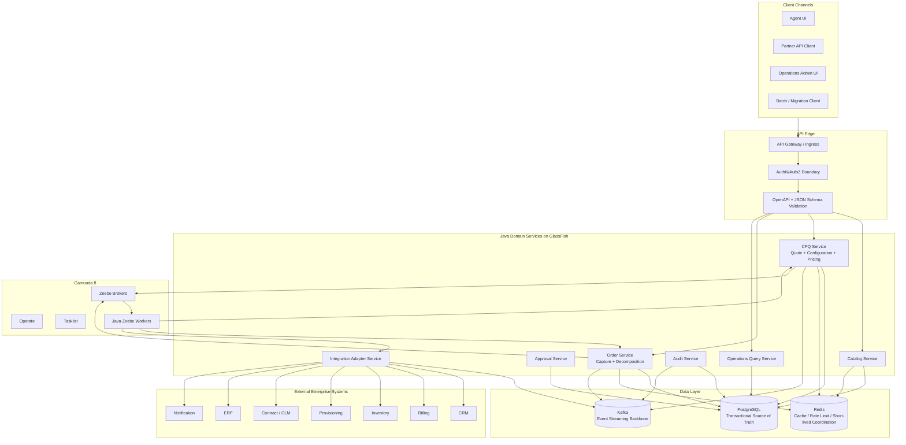
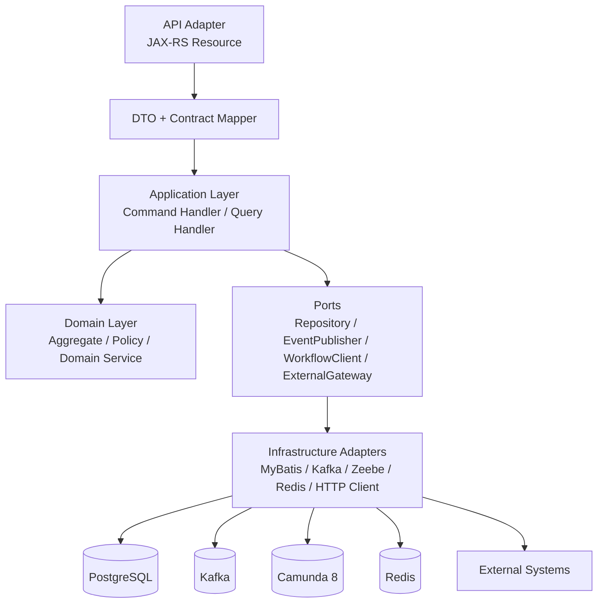
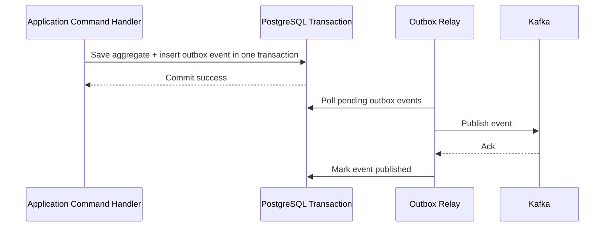
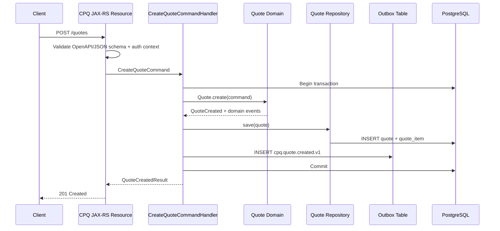
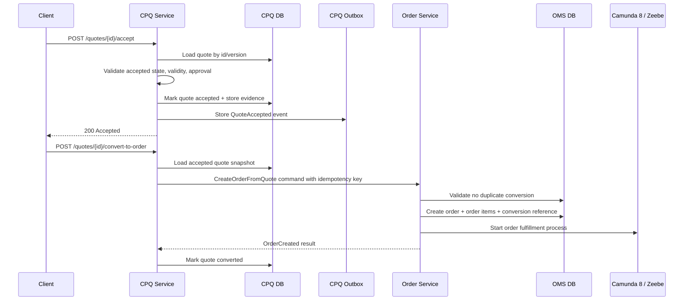
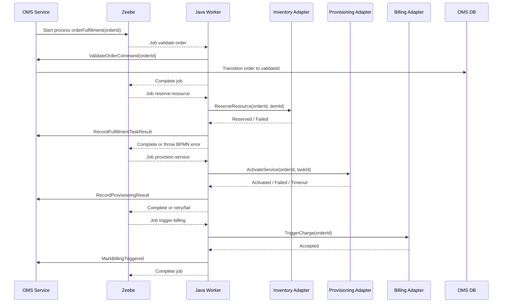
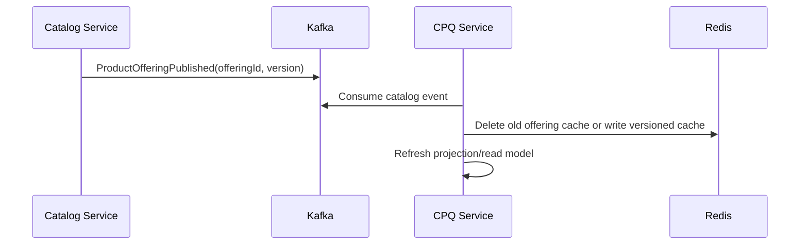
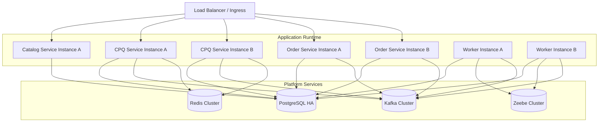

------
title: Build From Scratch: Enterprise Java Microservices CPQ & Order Management Platform - Part 004
description: Mendesain reference architecture production-grade untuk platform CPQ/OMS: API layer, domain services, orchestration, PostgreSQL, Kafka, Redis, Camunda 8, integration adapters, audit, observability, dan operating model.
series: learn-enterprise-cpq-oms-glassfish-camunda8
seriesTitle: Build From Scratch: Enterprise Java Microservices CPQ & Order Management Platform
order: 4
partTitle: Production Grade Reference Architecture
tags:
  - java
  - microservices
  - cpq
  - oms
  - reference-architecture
  - openapi
  - jax-rs
  - jersey
  - glassfish
  - postgresql
  - mybatis
  - camunda-8
  - kafka
  - redis
  - observability
  - production
date: 2026-07-02
---

# Part 004 — Production Grade Reference Architecture

Di Part 003 kita memisahkan boundary.

Sekarang kita ubah boundary itu menjadi arsitektur yang bisa dibangun.

Bukan arsitektur slide kosong.

Bukan juga “microservices diagram” yang semua kotaknya terlihat benar tapi tidak menjelaskan ownership, failure, data flow, dan recovery.

Arsitektur production-grade harus menjawab hal-hal seperti:

- service apa yang menjadi owner data?
- endpoint mana yang synchronous?
- event mana yang asynchronous?
- state mana yang disimpan di PostgreSQL?
- state mana yang hanya boleh berada di Camunda?
- data mana yang boleh dicache Redis?
- message mana yang harus melewati Kafka?
- command mana yang wajib idempotent?
- bagaimana audit evidence dikumpulkan?
- bagaimana operator melihat stuck order?
- bagaimana sistem recovery dari duplicate event, timeout, dan partial failure?

Reference architecture ini akan menjadi blueprint untuk seluruh seri.

---

## 1. Target Architecture Dalam Satu Kalimat

Kita akan membangun platform CPQ/OMS yang memiliki:

> Contract-first APIs, explicit domain ownership, PostgreSQL-backed transactional truth, Camunda 8-backed long-running orchestration, Kafka-backed integration events, Redis-backed runtime acceleration, adapter-isolated downstream integration, and audit/observability designed as first-class architecture concerns.

Jika satu kalimat itu terlalu padat, pecah menjadi beberapa prinsip:

1. API contract didefinisikan dulu sebelum resource implementation.
2. Domain service membuat keputusan bisnis, bukan controller, workflow, atau event consumer.
3. PostgreSQL menyimpan source of truth untuk aggregate dan operational records.
4. MyBatis dipakai untuk SQL eksplisit, bukan hidden ORM magic.
5. Camunda 8 menjalankan long-running process, bukan menyimpan domain truth.
6. Kafka menyebarkan fakta lintas boundary, bukan mengganti transaksi lokal.
7. Redis mempercepat read/coordination tertentu, bukan menyimpan kebenaran final.
8. Integration adapter melindungi core domain dari downstream model.
9. Audit dan observability bukan tambahan belakangan.

---

## 2. Reference Architecture Diagram



Diagram ini sengaja tidak menempatkan semua service sebagai peer yang saling memanggil bebas.

Kita ingin dependency yang terkontrol:

- client masuk lewat API edge;
- service domain punya database ownership;
- workflow memanggil service via worker/application command;
- external system diakses lewat adapter;
- Kafka menyebarkan events;
- Redis hanya acceleration;
- audit berada di jalur utama, bukan tempelan.

---

## 3. Runtime Stack Yang Akan Kita Pakai

### 3.1 Java Service Runtime

Kita akan memakai:

- Java;
- Jakarta REST/JAX-RS;
- Jersey;
- GlassFish;
- Jakarta Validation jika diperlukan;
- JSON-B/Jackson-style mapping tergantung runtime choice;
- MyBatis untuk persistence;
- PostgreSQL sebagai transactional database.

Jakarta REST menyediakan API untuk membangun RESTful web services. Jersey adalah implementation framework untuk Jakarta REST/JAX-RS. GlassFish adalah Jakarta EE application server. Referensi resmi:

- <https://jakarta.ee/specifications/restful-ws/>
- <https://jersey.github.io/>
- <https://glassfish.org/>

Prinsip penting:

> Jakarta REST resource class adalah delivery adapter, bukan tempat domain logic.

Bentuk alur request:

```text
HTTP Request
  -> JAX-RS Resource
  -> Request DTO validation
  -> Application Command
  -> Domain Service
  -> Repository / Gateway / Workflow Client
  -> Response DTO
```

### 3.2 API Contract

Kita akan memakai:

- OpenAPI untuk HTTP API contract;
- JSON Schema untuk data shape dan schema-first validation;
- reusable components untuk error, pagination, command response, money, period, characteristic, state transition;
- contract compatibility check di CI.

OpenAPI Specification 3.1 memakai Schema Object yang berbasis JSON Schema Draft 2020-12, dan OpenAPI Initiative mengumumkan compatibility penuh OpenAPI 3.1 dengan JSON Schema Draft 2020-12. Referensi:

- <https://swagger.io/specification/>
- <https://www.openapis.org/blog/2021/02/18/openapi-specification-3-1-released>

Prinsip penting:

> API schema adalah public contract. Domain model adalah internal decision model. Jangan disamakan.

### 3.3 Workflow Orchestration

Kita akan memakai Camunda 8/Zeebe untuk:

- quote approval process;
- order fulfillment process;
- timer escalation;
- retry orchestration;
- incident visibility;
- manual intervention;
- long-running process tracking.

Camunda menjelaskan process sebagai model BPMN yang dideploy sebagai process definition dan dieksekusi sebagai process instance. Zeebe adalah process automation engine yang powering Camunda 8. Referensi:

- <https://docs.camunda.io/docs/components/concepts/processes/>
- <https://docs.camunda.io/docs/components/zeebe/zeebe-overview/>

Prinsip penting:

> BPMN mengatur urutan proses. Domain service mengatur kebenaran bisnis.

### 3.4 Event Streaming

Kafka dipakai untuk:

- publishing domain/integration events;
- asynchronous downstream propagation;
- read model projection;
- audit/event trace pipeline;
- eventual consistency.

Apache Kafka adalah distributed event streaming platform. Dokumentasi Kafka menjelaskan Kafka sebagai distributed system berisi servers dan clients yang berkomunikasi melalui high-performance TCP protocol. Referensi:

- <https://kafka.apache.org/>
- <https://kafka.apache.org/documentation/>

Prinsip penting:

> Event adalah fakta. Command tetap harus punya owner.

### 3.5 Database

PostgreSQL menjadi source of truth untuk aggregate dan operational records.

PostgreSQL memiliki reputasi pada reliability, data integrity, robust feature set, extensibility, dan ACID compliance. Referensi:

- <https://www.postgresql.org/about/>

MyBatis dipakai karena mendukung custom SQL, stored procedures, dan advanced mappings. Referensi:

- <https://mybatis.org/mybatis-3/>

Prinsip penting:

> SQL harus terlihat, dapat direview, dapat dioptimasi, dan dapat dipertanggungjawabkan.

### 3.6 Redis

Redis dipakai untuk:

- catalog cache;
- pricing lookup cache;
- rate limiting;
- short-lived idempotency acceleration;
- lock terbatas untuk scenario tertentu;
- session/token helper jika diperlukan;
- cache invalidation by version/event.

Prinsip penting:

> Cache boleh hilang. Truth tidak boleh hilang.

---

## 4. Service Topology Baseline

Kita akan mulai dengan service topology yang cukup modular tetapi tidak terlalu banyak sehingga belajar tetap efektif.

### 4.1 Catalog Service

Owner:

- product specification;
- product offering;
- product offering version;
- characteristic definitions;
- relationship rules;
- offering lifecycle;
- commercial catalog publication event.

Tidak owner:

- quote;
- order;
- customer;
- activation;
- invoice.

Primary storage:

```text
catalog_schema
```

Publishes:

```text
catalog.product-offering.published.v1
catalog.product-offering.retired.v1
catalog.price-book.published.v1
```

### 4.2 CPQ Service

Owner:

- quote;
- quote item;
- quote revision;
- configuration snapshot;
- price snapshot;
- quote validation;
- quote acceptance;
- quote conversion command.

Sub-capabilities:

- product configuration engine;
- pricing engine;
- quote lifecycle;
- quote approval integration;
- quote-to-order conversion.

Primary storage:

```text
cpq_schema
```

Publishes:

```text
cpq.quote.created.v1
cpq.quote.priced.v1
cpq.quote.submitted.v1
cpq.quote.approved.v1
cpq.quote.accepted.v1
cpq.quote.converted.v1
```

### 4.3 Approval Service

Owner:

- approval request;
- approval task;
- approver assignment;
- approval decision;
- escalation state;
- delegation;
- approval audit evidence.

For early implementation, approval capability may start inside CPQ service as module. But the boundary must be clean enough to extract later.

Primary storage:

```text
approval_schema
```

Publishes:

```text
approval.requested.v1
approval.approved.v1
approval.rejected.v1
approval.escalated.v1
```

### 4.4 Order Service

Owner:

- order;
- order item;
- order lifecycle;
- decomposition result;
- fulfillment plan;
- fulfillment task;
- fallout state;
- cancellation/amendment relationship.

Primary storage:

```text
order_schema
```

Publishes:

```text
oms.order.created.v1
oms.order.validated.v1
oms.order.decomposed.v1
oms.order.fulfillment-started.v1
oms.order.task-succeeded.v1
oms.order.task-failed.v1
oms.order.entered-fallout.v1
oms.order.completed.v1
oms.order.cancelled.v1
```

### 4.5 Integration Adapter Service

Owner:

- external request mapping;
- external response mapping;
- downstream idempotency key;
- external call log;
- retry classification;
- external error taxonomy.

Adapters:

- CRM adapter;
- inventory adapter;
- provisioning adapter;
- billing adapter;
- contract adapter;
- notification adapter;
- ERP adapter.

Primary storage:

```text
integration_schema
```

Publishes:

```text
integration.inventory.reservation-succeeded.v1
integration.inventory.reservation-failed.v1
integration.provisioning.activation-succeeded.v1
integration.provisioning.activation-failed.v1
integration.billing.charge-triggered.v1
```

### 4.6 Audit Service

Owner:

- audit event ingestion;
- evidence normalization;
- actor/action/resource mapping;
- before/after change record;
- business reason;
- correlation chain;
- queryable audit view.

Primary storage:

```text
audit_schema
```

Consumes:

```text
*.audit-evidence.v1
```

or selected domain events.

Publishes optional:

```text
audit.evidence-recorded.v1
```

### 4.7 Operations Query Service

Owner:

- operational views;
- search endpoints;
- dashboard aggregation;
- exception queue read model;
- customer timeline view;
- order timeline view.

It does not own command decisions.

Primary storage:

```text
ops_schema
```

Consumes:

```text
cpq.*
oms.*
integration.*
audit.*
```

---

## 5. Modular Monolith vs Microservices Decision

Walaupun judul seri menyebut microservices, implementasi pembelajaran yang waras tidak berarti langsung membuat 20 deployables.

Kita akan membedakan:

- logical boundary;
- code module;
- deployable unit;
- database schema;
- runtime service.

Production enterprise bisa memilih salah satu:

### Option A — Modular Monolith First

Satu deployable GlassFish application dengan modules:

```text
catalog-module
cpq-module
approval-module
order-module
integration-module
audit-module
ops-module
```

Kelebihan:

- mudah local development;
- transaksi lokal lebih sederhana;
- debugging lebih mudah;
- cocok untuk tim kecil;
- boundary bisa divalidasi sebelum distributed complexity.

Kekurangan:

- scaling per capability terbatas;
- release coupling lebih tinggi;
- isolation failure lebih rendah;
- extraction butuh disiplin module boundary.

### Option B — Microservices From Early Stage

Beberapa deployable:

```text
catalog-service.war
cpq-service.war
approval-service.war
order-service.war
integration-service.war
audit-service.war
ops-service.war
```

Kelebihan:

- independent deployment;
- independent scaling;
- ownership tim lebih jelas;
- fault isolation lebih baik.

Kekurangan:

- local development lebih berat;
- distributed tracing wajib;
- testing lebih kompleks;
- data consistency lebih sulit;
- migration dan compatibility lebih mahal.

Untuk seri ini, kita akan mendesain seolah-olah microservice-ready, tetapi implementasi bisa dimulai modular agar pembelajaran fokus pada domain dan boundary.

Rule praktis:

> Jangan membayar biaya distributed system sebelum boundary benar.

---

## 6. Internal Layering Per Service

Setiap service akan memakai struktur konseptual berikut.



### 6.1 API Adapter

Responsibilities:

- HTTP method mapping;
- path mapping;
- request parsing;
- auth context extraction;
- correlation id extraction;
- request DTO validation;
- response mapping;
- exception mapping.

Not responsibilities:

- pricing calculation;
- order state transition decision;
- SQL construction;
- workflow business logic;
- event payload construction directly from HTTP request.

### 6.2 Application Layer

Responsibilities:

- command orchestration;
- transaction boundary;
- idempotency check;
- load aggregate;
- invoke domain behavior;
- save aggregate;
- write outbox;
- call workflow client after/within safe boundary;
- map domain result to response.

Application layer is where use case lives.

Example:

```text
AcceptQuoteCommandHandler
SubmitQuoteForApprovalCommandHandler
ConvertQuoteToOrderCommandHandler
CreateOrderFromQuoteCommandHandler
RetryFulfillmentTaskCommandHandler
```

### 6.3 Domain Layer

Responsibilities:

- invariants;
- state transition rules;
- pricing policy;
- configuration validation;
- decomposition policy;
- approval requirement policy;
- command semantic validation.

Domain layer must not depend on:

- JAX-RS;
- MyBatis;
- Kafka;
- Redis;
- Zeebe client;
- HTTP client;
- database row shape.

### 6.4 Infrastructure Adapters

Responsibilities:

- MyBatis mapper implementation;
- Kafka producer/consumer;
- Zeebe client;
- Redis client;
- external HTTP client;
- schema serialization;
- retry implementation;
- technical error mapping.

Adapters translate. They should not decide business truth.

---

## 7. Data Architecture

### 7.1 Schema Layout

Development baseline:

```text
postgres database: cpq_oms_platform

schemas:
  catalog_schema
  cpq_schema
  approval_schema
  order_schema
  integration_schema
  audit_schema
  ops_schema
```

This gives us clear ownership without requiring multiple database instances immediately.

### 7.2 Core Table Categories

Every owning service will usually have these categories.

```text
aggregate tables
history tables
outbox tables
inbox tables
idempotency tables
audit reference tables
read projection tables
operational lock/control tables
```

Example for CPQ:

```text
cpq_quote
cpq_quote_item
cpq_quote_revision
cpq_quote_price_snapshot
cpq_quote_configuration_snapshot
cpq_quote_state_history
cpq_idempotency_record
cpq_outbox_event
cpq_inbox_event
```

Example for OMS:

```text
oms_order
oms_order_item
oms_fulfillment_plan
oms_fulfillment_task
oms_task_dependency
oms_order_state_history
oms_fallout_record
oms_idempotency_record
oms_outbox_event
oms_inbox_event
```

### 7.3 Why Outbox Is Mandatory

Without outbox:

```text
DB commit succeeded
Kafka publish failed
```

or:

```text
Kafka publish succeeded
DB commit failed
```

Both create inconsistent integration truth.

With outbox:



Outbox does not make distributed transaction. It gives us recoverable local atomicity.

---

## 8. Command Flow: Create Quote



Important properties:

- API validates shape.
- Application controls transaction.
- Domain enforces invariants.
- Repository persists aggregate.
- Outbox event is committed with aggregate.
- Kafka publish is not inside request transaction.

---

## 9. Command Flow: Accept Quote And Convert To Order



Depending on business policy, conversion may be initiated by:

- client command;
- CPQ internal command;
- asynchronous process after acceptance;
- channel-specific workflow.

But it must be idempotent.

---

## 10. Workflow Flow: Order Fulfillment



Important:

- Zeebe controls sequence.
- Worker does not mutate DB directly.
- Worker calls OMS commands.
- OMS stores order truth.
- Adapter isolates downstream.
- BPMN errors and incidents are mapped to operational state.

---

## 11. Event Architecture

### 11.1 Event Categories

| Category | Example | Purpose |
|---|---|---|
| Domain event | `QuoteAccepted` | Internal fact from aggregate behavior |
| Integration event | `cpq.quote.accepted.v1` | Cross-service fact contract |
| Audit event | `PriceOverrideApproved` | Evidence and defensibility |
| Operational event | `OrderEnteredFallout` | Ops dashboard and alerting |
| Projection event | `OrderSearchProjectionUpdated` | Read model maintenance |

Domain event and integration event are not always identical.

Domain event can be internal and rich. Integration event should be stable, versioned, and consumer-safe.

### 11.2 Topic Naming Baseline

```text
catalog.product-offering.events.v1
cpq.quote.events.v1
cpq.approval.events.v1
oms.order.events.v1
oms.fulfillment-task.events.v1
integration.inventory.events.v1
integration.provisioning.events.v1
audit.evidence.events.v1
ops.projection-events.v1
```

For early implementation, grouped topics are simpler. Later, topics can be split by volume, retention, and consumer isolation.

### 11.3 Partition Key Baseline

| Event | Partition key | Reason |
|---|---|---|
| Quote events | `quoteId` | Preserve quote event order |
| Order events | `orderId` | Preserve order lifecycle order |
| Fulfillment task events | `orderId` or `taskId` | Usually order-level order is more useful |
| Catalog events | `productOfferingId` | Preserve offering version order |
| Audit events | `businessTransactionId` | Correlation-first audit stream |

Kafka does not guarantee global ordering across partitions. Design ordering requirement per aggregate.

---

## 12. Redis Architecture

Redis usage must be intentional.

### 12.1 Allowed Redis Uses

```text
catalog:offering:{offeringId}:v{version}
pricing:price-book:{priceBookId}:v{version}
rate-limit:{tenantId}:{apiKey}
idempotency-hot:{service}:{key}
lock:quote-pricing:{quoteId}
session:{sessionId}
```

### 12.2 Redis Safety Rules

1. Every cached value must be reconstructable.
2. Every key must have clear ownership.
3. Every key must have TTL or version strategy.
4. No accepted quote or order truth may exist only in Redis.
5. Cache invalidation must be driven by version or event.
6. Lock usage must have timeout and fallback.

### 12.3 Cache Invalidation Baseline



Prefer versioned keys over blind mutation where possible.

---

## 13. Security Architecture

Security has several layers.

### 13.1 Authentication

Who is calling?

Possible caller types:

- human agent;
- customer portal user;
- partner API client;
- internal service;
- batch process;
- workflow worker;
- admin operator.

### 13.2 Authorization

What can they do?

Examples:

- create quote;
- view quote;
- override price;
- submit approval;
- approve discount;
- convert quote;
- cancel order;
- retry task;
- manually repair fallout;
- view audit evidence.

### 13.3 Tenant and Data Scope

Every command should carry:

```text
tenantId
actorId
actorType
channel
correlationId
businessTransactionId
authorizationContext
```

This context should flow into:

- application command;
- domain decision evidence;
- audit event;
- log fields;
- event metadata;
- workflow variables where relevant.

---

## 14. Observability Architecture

Observability is not only technical metrics.

For CPQ/OMS, we need both technical and business observability.

### 14.1 Technical Observability

- request latency;
- error rate;
- DB query latency;
- DB lock wait;
- Kafka publish latency;
- Kafka consumer lag;
- Redis hit/miss ratio;
- worker job latency;
- workflow incident count;
- external adapter timeout rate.

### 14.2 Business Observability

- quote created per hour;
- quote accepted per hour;
- quote approval aging;
- price override frequency;
- quote conversion rate;
- order created per hour;
- order fallout count;
- fulfillment average duration;
- task retry count;
- stuck order count;
- cancellation rate.

### 14.3 Correlation Fields

Every log/event/audit record should carry:

```text
correlationId
causationId
businessTransactionId
tenantId
quoteId
orderId
orderItemId
workflowInstanceKey
actorId
commandId
idempotencyKey
```

Without these fields, production support becomes archaeology.

---

## 15. Audit Architecture

Audit is not the same as log.

Log answers:

> What happened technically?

Audit answers:

> What decision happened, who made it, based on what input, and why is it defensible?

### 15.1 Audit Event Shape

Baseline shape:

```json
{
  "auditEventId": "AUD-...",
  "eventType": "QUOTE_PRICE_OVERRIDDEN",
  "occurredAt": "2026-07-02T10:15:30+07:00",
  "tenantId": "tenant-a",
  "actor": {
    "actorId": "user-123",
    "actorType": "SALES_AGENT"
  },
  "resource": {
    "resourceType": "QUOTE",
    "resourceId": "Q-10001",
    "resourceVersion": 3
  },
  "businessReason": "Strategic enterprise renewal",
  "before": {
    "discountPercent": 20
  },
  "after": {
    "discountPercent": 35
  },
  "policy": {
    "policyId": "PRICE_OVERRIDE_POLICY",
    "policyVersion": "2026.07"
  },
  "correlationId": "corr-...",
  "causationId": "cmd-..."
}
```

### 15.2 Audit Storage Rule

Audit must be:

- append-oriented;
- queryable by resource;
- queryable by actor;
- queryable by business transaction;
- linked to state transition;
- protected from casual mutation;
- sufficient for dispute investigation.

---

## 16. Failure Model

A production-grade architecture must specify expected failures.

### 16.1 Request-Level Failure

Examples:

- invalid request schema;
- authorization denied;
- quote not found;
- quote stale version;
- duplicate idempotency key;
- state transition not allowed;
- DB deadlock/retryable failure;
- external dependency timeout.

Response design:

- deterministic error code;
- human-readable message;
- correlation id;
- optional field errors;
- retryability hint;
- no leaked internal stack trace.

### 16.2 Async Failure

Examples:

- outbox relay failed;
- Kafka broker unavailable;
- consumer duplicate message;
- poison message;
- downstream timeout;
- workflow incident;
- worker crash after external call but before job completion.

Recovery design:

- outbox retry;
- inbox deduplication;
- dead letter handling;
- idempotent external calls;
- manual repair queue;
- workflow incident visibility;
- reconciliation job.

### 16.3 Long-Running Failure

Examples:

- order partially fulfilled;
- cancellation after partial activation;
- billing triggered but provisioning later failed;
- contract signed but resource unavailable;
- payment authorized but order cannot proceed;
- duplicate order conversion request.

Recovery design:

- compensation policy;
- order fallout state;
- task-level retry;
- manual intervention;
- audit trail;
- customer notification.

---

## 17. Idempotency Architecture

Every command that may be retried must be idempotent.

Mandatory idempotency points:

```text
POST /quotes
POST /quotes/{id}/submit
POST /quotes/{id}/accept
POST /quotes/{id}/convert-to-order
POST /orders
POST /orders/{id}/cancel
POST /orders/{id}/tasks/{taskId}/retry
external reservation call
external provisioning call
billing charge trigger
workflow start request
Kafka consumer processing
```

### 17.1 Idempotency Record

Baseline table concept:

```text
idempotency_record
  idempotency_key
  command_type
  resource_type
  resource_id
  request_hash
  response_hash
  status
  created_at
  expires_at
```

Behavior:

- same key + same request returns same result;
- same key + different request is rejected;
- completed command is not executed again;
- in-progress command is handled deterministically;
- expiry policy depends on business risk.

---

## 18. Deployment Topology Baseline

Local development can be Docker Compose style:

```text
- glassfish-catalog
- glassfish-cpq
- glassfish-order
- glassfish-integration
- postgres
- kafka
- redis
- camunda-zeebe
- camunda-operate
- camunda-tasklist
```

Production-like topology:



Important deployment rules:

- stateless service instances;
- DB transaction boundaries local to service;
- worker horizontally scalable;
- Kafka consumer group per projection/adapter;
- no local memory source of truth;
- config via environment/secret management;
- migration runs controlled before service rollout.

---

## 19. Repository Layout

Baseline repository:

```text
enterprise-cpq-oms/
  contracts/
    openapi/
      catalog-api.yaml
      cpq-api.yaml
      order-api.yaml
      approval-api.yaml
      ops-api.yaml
    schemas/
      common/
      catalog/
      quote/
      order/
      events/
  services/
    catalog-service/
    cpq-service/
    approval-service/
    order-service/
    integration-service/
    audit-service/
    ops-service/
  shared/
    common-kernel/
    api-error/
    observability/
    idempotency/
    test-fixtures/
  workflow/
    bpmn/
      quote-approval.bpmn
      order-fulfillment.bpmn
    dmn/
  database/
    migrations/
      catalog/
      cpq/
      approval/
      order/
      integration/
      audit/
      ops/
  deployment/
    local/
    docker/
    helm-or-k8s/
  docs/
    adr/
    runbooks/
    architecture/
```

Why contracts first?

Because API/event/schema compatibility must be reviewable independently from Java code.

---

## 20. Build Milestones

We will not build everything at once.

### Milestone 1 — Architecture Skeleton

- repository structure;
- OpenAPI skeleton;
- common error model;
- GlassFish/Jersey service skeleton;
- PostgreSQL connection;
- MyBatis mapper baseline;
- health endpoints;
- correlation id filter.

### Milestone 2 — Catalog and Quote Core

- product offering model;
- versioned catalog;
- quote create/update;
- quote item;
- configuration snapshot;
- price snapshot.

### Milestone 3 — Pricing and Configuration Engine

- configuration validation graph;
- pricing calculation;
- discount policy;
- explainable result;
- deterministic recalculation.

### Milestone 4 — Approval

- approval policy;
- approval request;
- quote submit;
- Camunda approval BPMN;
- approval decision audit.

### Milestone 5 — Order Capture

- quote-to-order conversion;
- order aggregate;
- order item;
- idempotent conversion;
- order state history.

### Milestone 6 — Order Decomposition and Fulfillment

- decomposition engine;
- fulfillment plan;
- fulfillment task;
- Camunda order BPMN;
- worker command pattern.

### Milestone 7 — Kafka Integration

- outbox;
- event relay;
- event schema;
- consumer inbox;
- projection update.

### Milestone 8 — External Adapters

- inventory adapter;
- provisioning adapter;
- billing adapter;
- contract adapter;
- retry/error taxonomy.

### Milestone 9 — Production Hardening

- audit;
- observability;
- resilience;
- performance test;
- runbook;
- release safety.

---

## 21. Architecture Invariants

These invariants should remain true throughout the series.

### Invariant 1

Accepted quote price must not change because current price book changed.

### Invariant 2

Order must be traceable to quote snapshot or direct capture evidence.

### Invariant 3

Every state transition must have a causal command or external result.

### Invariant 4

Every retryable command must be idempotent.

### Invariant 5

Workflow process instance must not be the only source of order truth.

### Invariant 6

Kafka event processing must tolerate duplicate delivery.

### Invariant 7

Redis loss must not lose quote/order/audit truth.

### Invariant 8

External system model must not leak into core aggregate model.

### Invariant 9

Every approval-sensitive decision must be auditable.

### Invariant 10

Projection must not silently become command source of truth.

---

## 22. What We Are Not Building Yet

To stay efficient, this architecture will not immediately build:

- full UI implementation;
- full CRM;
- full billing engine;
- real payment gateway;
- real ERP integration;
- real tax calculation;
- production Kubernetes manifests in early parts;
- advanced rule engine product;
- full TM Forum API compliance;
- AI assistant layer;
- multi-region active-active architecture.

We will design extension points for them, but the core learning target is CPQ/OMS domain and production architecture.

---

## 23. Architecture Review Checklist

Before implementation, ask:

### API

- Are APIs contract-first?
- Are errors deterministic?
- Are idempotency headers defined?
- Are state transition endpoints explicit?
- Are snapshots represented clearly?

### Domain

- Are aggregate owners clear?
- Are invariants explicit?
- Are state machines separated?
- Are decision authorities clear?

### Data

- Is source of truth stored in PostgreSQL?
- Are snapshots immutable where needed?
- Are history tables planned?
- Are outbox/inbox tables planned?
- Are indexes driven by query paths?

### Workflow

- Is BPMN used for process sequence?
- Are workers calling domain commands?
- Are incidents mapped to operational repair?
- Is process versioning considered?

### Events

- Are event schemas versioned?
- Are topic boundaries clear?
- Are partition keys aligned with ordering needs?
- Are consumers idempotent?

### Operations

- Can support find a stuck order?
- Can support see why a quote price changed?
- Can support retry a failed task safely?
- Can support reconcile external failure?
- Can support trace request to event to workflow to audit?

---

## 24. Kesimpulan

Reference architecture ini bukan final implementation detail. Ini adalah peta kerja.

Keputusan penting yang sudah kita ambil:

- service boundary mengikuti ownership keputusan;
- API memakai OpenAPI/JSON Schema sebagai contract;
- Java runtime memakai Jakarta REST/Jersey/GlassFish;
- PostgreSQL menjadi transactional source of truth;
- MyBatis memberi explicit SQL control;
- Camunda 8 menjalankan long-running orchestration;
- Kafka membawa event lintas boundary;
- Redis hanya acceleration;
- adapter melindungi core dari external model;
- audit dan observability menjadi first-class concerns;
- idempotency dan outbox menjadi mandatory, bukan optional.

Part berikutnya akan mulai masuk ke domain model yang lebih konkret: **Product Catalog Domain Model**. Dari situ kita mulai membangun pondasi CPQ yang benar: product specification, product offering, characteristic, relationship, lifecycle, versioning, dan market segmentation.
