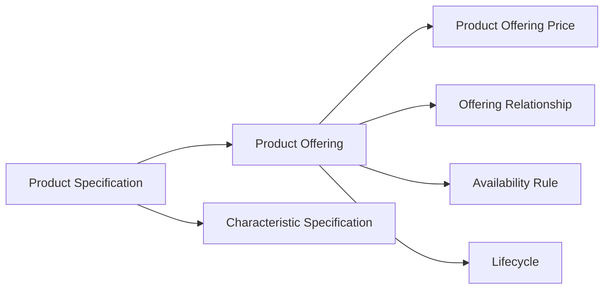
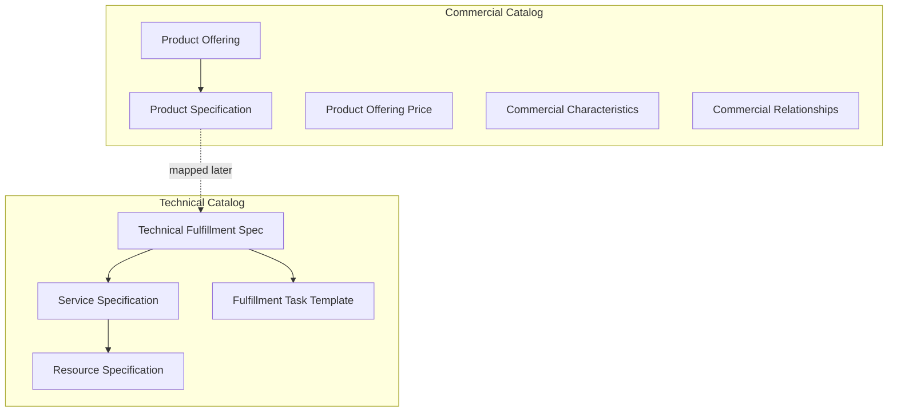
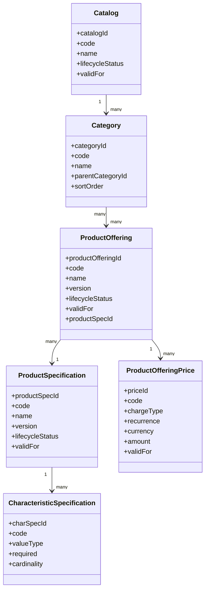
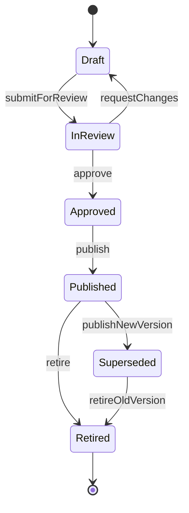
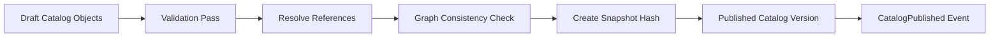

------
title: Build From Scratch: Enterprise Java Microservices CPQ & Order Management Platform - Part 005
description: Mendesain product catalog domain model untuk enterprise CPQ/OMS: product specification, product offering, product offering price, characteristic, relationship, lifecycle, versioning, compatibility, dan governance.
series: learn-enterprise-cpq-oms-glassfish-camunda8
seriesTitle: Build From Scratch: Enterprise Java Microservices CPQ & Order Management Platform
order: 5
partTitle: Product Catalog Domain Model
tags:
  - java
  - microservices
  - cpq
  - oms
  - product-catalog
  - domain-modeling
  - tm-forum
  - postgresql
  - mybatis
  - openapi
  - schema-first
  - enterprise-architecture
date: 2026-07-02
---

# Part 005 — Product Catalog Domain Model

Di Part 001 sampai Part 004 kita sudah menetapkan scope, domain map, boundary, dan reference architecture.

Sekarang kita mulai membangun inti CPQ dari sisi yang paling sering diremehkan: **product catalog**.

Banyak engineer memulai CPQ dari `quote`.

Itu masuk akal secara UI.

User memang membuka layar quote, memilih produk, melihat harga, lalu submit.

Tetapi secara sistem, quote hanyalah **snapshot keputusan penjualan**. Quote tidak bisa benar kalau catalog-nya tidak benar.

Product catalog adalah fondasi yang menentukan:

- produk apa yang bisa dijual;
- opsi apa yang boleh dipilih;
- karakteristik apa yang wajib diisi;
- price component apa yang berlaku;
- produk mana yang kompatibel atau tidak kompatibel;
- produk mana yang bisa dibundle;
- produk mana yang sudah retired tapi masih boleh muncul di amendment order;
- versi catalog mana yang berlaku saat quote dibuat;
- evidence apa yang menjelaskan kenapa konfigurasi dan harga dianggap valid.

Kalau catalog salah, pricing salah.

Kalau pricing salah, approval salah.

Kalau approval salah, order salah.

Kalau order salah, fulfillment salah.

Kalau fulfillment salah, customer, finance, compliance, dan support ikut menanggung dampaknya.

Product catalog bukan tabel master sederhana. Ia adalah **commercial rule graph**.

---

## 1. Tujuan Part Ini

Setelah part ini, kita ingin punya mental model dan desain awal untuk product catalog yang bisa dipakai sebagai fondasi CPQ/OMS enterprise.

Targetnya bukan hafal istilah.

Targetnya adalah bisa menjawab pertanyaan desain seperti:

- apa beda product specification dan product offering?
- kenapa harga tidak boleh ditempel langsung ke product specification?
- apa yang harus immutable setelah product offering dipublish?
- bagaimana catalog versioning bekerja?
- bagaimana quote menyimpan snapshot catalog?
- bagaimana product relationship direpresentasikan tanpa membuat spaghetti rule?
- bagaimana product compatibility dievaluasi?
- kapan pakai relational column, kapan pakai JSONB?
- apa event yang keluar dari catalog service?
- apa saja invariant yang harus dijaga catalog service?

Kita akan membangun model yang cukup kuat untuk enterprise CPQ, tetapi tetap pragmatis untuk dibangun dari scratch.

---

## 2. Referensi Konseptual

Kita tidak akan menyalin mentah-mentah standar eksternal.

Tetapi kita perlu mengambil vocabulary yang sudah matang.

Dua referensi penting:

1. **TM Forum Product Catalog Management API / TMF620**  
   Berguna sebagai inspirasi resource dan lifecycle catalog: catalog, category, product offering, product specification, product offering price.

2. **TM Forum Information Framework / SID Product model**  
   Berguna sebagai inspirasi vocabulary domain: product, product specification, product offering, product characteristic, relationship, dan business-facing product modelling.

Catatan penting:

> Standar domain adalah peta, bukan implementasi final.

Di sistem enterprise nyata, kita tetap perlu menyesuaikan:

- ukuran organisasi;
- jenis produk;
- kebutuhan approval;
- kebutuhan fulfillment;
- integrasi downstream;
- audit;
- performance;
- tooling internal;
- kemampuan tim maintain sistem.

Kita akan memakai istilah yang dekat dengan TM Forum karena CPQ/OMS enterprise sering bersentuhan dengan pola commerce, telco, subscription, service activation, dan order fulfillment yang mirip.

Namun desain kita tetap dibuat agar bisa diterapkan pada domain non-telco juga.

---

## 3. Product Catalog Dalam Satu Kalimat

Product catalog adalah sistem yang mendefinisikan **apa yang boleh dijual, bagaimana pilihan pelanggan dibatasi, berapa komponen harga yang berlaku, dan versi aturan mana yang valid pada waktu transaksi dilakukan**.

Pecah kalimat itu menjadi empat dimensi:

| Dimensi | Pertanyaan | Contoh |
|---|---|---|
| Sellability | Apakah produk boleh dijual? | Internet Fiber 100 Mbps aktif untuk segment SME |
| Configurability | Bagaimana produk dikonfigurasi? | Router wajib, static IP optional, bandwidth pilihan 50/100/300 Mbps |
| Priceability | Bagaimana produk dihargai? | Monthly recurring charge, installation fee, promo 3 bulan |
| Validity | Kapan aturan ini berlaku? | Effective 2026-07-01 sampai 2026-12-31 |

Kalau sebuah catalog tidak bisa menjawab empat dimensi ini, ia belum layak menjadi catalog CPQ.

---

## 4. Kesalahan Paling Umum: Product = SKU = Price Row

Desain buruk yang sering muncul:

```text
product
- id
- code
- name
- price
- active
```

Tabel seperti ini bisa dipakai untuk toko sederhana.

Tetapi ia runtuh ketika enterprise CPQ membutuhkan:

- banyak segment pelanggan;
- harga per channel;
- bundling;
- addon;
- eligibility;
- promotion;
- multi-currency;
- recurring charge;
- one-time charge;
- subscription lifecycle;
- amend order;
- quote revision;
- quote price lock;
- approval karena price override;
- catalog versioning;
- backward compatibility terhadap order lama.

Masalah utama desain ini adalah semua konsep dicampur.

Ia mencampur:

- definisi produk;
- penawaran komersial;
- harga;
- lifecycle;
- rule;
- availability;
- customer segment;
- channel;
- fulfillment mapping.

Ketika semua dicampur, setiap perubahan kecil menjadi migration besar.

---

## 5. Core Mental Model: Spec, Offer, Price

Untuk CPQ enterprise, minimal kita pisahkan tiga konsep inti:



### 5.1 Product Specification

Product specification mendefinisikan **jenis produk secara konseptual**.

Ia menjawab:

- produk ini apa?
- characteristic apa yang dimiliki?
- value apa yang valid?
- struktur teknis atau business capability apa yang direpresentasikan?

Contoh:

```text
ProductSpecification: FIBER_INTERNET
Characteristics:
- bandwidth: 50Mbps | 100Mbps | 300Mbps | 1Gbps
- ip_type: dynamic | static
- router_model: standard | premium
- contract_term: 12m | 24m | 36m
```

Product specification tidak menjawab harga final.

Ia juga tidak selalu langsung dijual.

Satu product specification bisa punya banyak offering.

### 5.2 Product Offering

Product offering mendefinisikan **produk yang benar-benar dijual ke pasar tertentu**.

Ia menjawab:

- apakah produk dijual?
- untuk segment apa?
- channel apa?
- region apa?
- masa berlaku apa?
- relationship dengan offering lain apa?
- apakah bisa dipilih standalone atau hanya sebagai addon?

Contoh:

```text
ProductOffering: SME_FIBER_100M_24M
ProductSpecification: FIBER_INTERNET
Segment: SME
Channel: DIRECT_SALES
Region: JAKARTA
Valid: 2026-07-01..2026-12-31
```

Offering adalah bentuk komersial dari specification.

### 5.3 Product Offering Price

Product offering price mendefinisikan **komponen harga untuk offering**.

Ia menjawab:

- charge type apa?
- recurring atau one-time?
- currency apa?
- price amount berapa?
- tax included atau excluded?
- condition apa?
- discount/promo apa?
- period berlaku kapan?

Contoh:

```text
ProductOfferingPrice:
- MRC: IDR 799000 / month
- OTC_INSTALLATION: IDR 500000 / one-time
- PROMO_DISCOUNT: -50% MRC for first 3 months
```

Harga bukan satu angka.

Harga adalah **breakdown yang explainable**.

---

## 6. Catalog Layering

Catalog tidak hanya satu lapisan.

Untuk seri ini, kita mulai dengan product catalog sebagai commercial-facing catalog.

Namun dari awal kita siapkan boundary ke technical catalog yang akan dibahas di Part 006.



Rule utama:

> Product catalog menjelaskan apa yang dijual. Technical catalog menjelaskan bagaimana yang dijual itu dipenuhi.

Jangan campur dua hal itu di awal.

---

## 7. Bounded Context: Catalog Service

Dalam platform kita, catalog service menjadi owner untuk:

- catalog;
- category;
- product specification;
- product offering;
- product offering price;
- characteristic specification;
- relationship antar offering;
- lifecycle catalog;
- effective dating;
- compatibility rule;
- eligibility metadata;
- publication state;
- catalog snapshot reference.

Catalog service tidak menjadi owner untuk:

- quote state;
- order state;
- customer profile;
- customer asset;
- billing account;
- invoice;
- provisioning task;
- inventory reservation;
- payment state.

Boundary ini penting karena catalog sering menggoda engineer untuk memasukkan semua rule bisnis ke satu tempat.

Catalog memang menyimpan rule jualan.

Tetapi catalog bukan owner semua keputusan bisnis.

---

## 8. Aggregate Candidate

Kita bisa memecah model menjadi beberapa aggregate:



Namun kita tidak harus membuat satu aggregate raksasa.

Kandidat aggregate:

1. `ProductSpecificationAggregate`
2. `ProductOfferingAggregate`
3. `CatalogPublicationAggregate`
4. `ProductOfferingPriceAggregate` atau bagian dari `ProductOfferingAggregate`
5. `CompatibilityRuleAggregate`

Untuk awal seri, kita gunakan pendekatan ini:

| Aggregate | Owner invariant utama |
|---|---|
| ProductSpecification | characteristic schema, version, lifecycle |
| ProductOffering | sellability, relation, validity, attached prices |
| CatalogPublication | published snapshot consistency |
| CompatibilityRule | cross-offering constraint |

Kenapa `ProductOfferingPrice` bisa menjadi child dari `ProductOffering`?

Karena dalam CPQ, harga biasanya dievaluasi dari offering. Offering tanpa harga sering tidak sellable, kecuali harga dihitung eksternal atau zero-price item.

Namun dalam enterprise besar, price book bisa dipisahkan menjadi context sendiri.

Untuk seri ini, kita mulai dengan harga sebagai bagian catalog, lalu pricing engine akan mengambilnya sebagai input di Part 031.

---

## 9. Lifecycle Catalog

Catalog object tidak cukup punya boolean `active`.

Kita butuh lifecycle.



Minimal status:

| Status | Makna |
|---|---|
| Draft | masih bisa diedit |
| InReview | menunggu approval catalog/product owner |
| Approved | siap dipublish tapi belum aktif |
| Published | bisa dipakai CPQ untuk transaksi baru |
| Superseded | digantikan versi baru, tidak untuk penjualan baru |
| Retired | tidak boleh dipakai untuk transaksi baru, tapi masih perlu untuk order/asset lama |

Rule penting:

> Published catalog object harus diperlakukan immutable untuk field yang memengaruhi quote/order.

Kalau harga published diubah in-place, quote lama kehilangan evidence.

Kalau characteristic published diubah in-place, konfigurasi lama bisa terlihat invalid padahal valid saat transaksi dibuat.

Kalau relationship published diubah in-place, order amendment bisa salah membaca dependency.

---

## 10. Versioning Strategy

Ada beberapa strategi versioning catalog.

### 10.1 Mutable Row Dengan Audit

Satu row diupdate terus, audit table menyimpan perubahan.

Kelebihan:

- sederhana;
- query latest mudah.

Kekurangan:

- sulit membuat quote snapshot yang deterministik;
- rollback sulit;
- audit harus direkonstruksi;
- compatibility lama mudah rusak.

Tidak direkomendasikan untuk object published.

### 10.2 Immutable Version Row

Setiap perubahan besar membuat versi baru.

```text
product_offering
- offering_uid: stable logical id
- version: 1, 2, 3
- lifecycle_status
- valid_from
- valid_to
```

Kelebihan:

- quote bisa refer ke versi spesifik;
- audit kuat;
- rollback lebih jelas;
- long-running order aman.

Kekurangan:

- query lebih kompleks;
- data lebih banyak;
- perlu governance publish.

Ini strategi utama yang kita pakai.

### 10.3 Effective-Dated Version

Versi memiliki `valid_from` dan `valid_to`.

CPQ memilih versi berdasarkan waktu transaksi.

```text
Find sellable offering where:
- code = SME_FIBER_100M
- lifecycle_status = PUBLISHED
- valid_from <= quoteDate
- valid_to is null or valid_to > quoteDate
```

Rule:

> Validity time bukan hanya metadata. Ia bagian dari business rule.

Jika quote dibuat pada 2026-07-02, quote harus menyimpan versi catalog yang valid pada tanggal itu.

---

## 11. Snapshot Rule Untuk Quote

Quote tidak boleh hanya menyimpan foreign key ke catalog latest.

Quote harus menyimpan snapshot yang cukup untuk menjawab:

- produk apa yang dipilih;
- versi offering apa;
- versi specification apa;
- characteristic apa;
- value apa;
- price component apa;
- discount apa;
- rule apa yang membuat quote valid;
- rule apa yang membuat approval diperlukan.

Minimal quote item menyimpan:

```json
{
  "productOfferingRef": {
    "id": "po-100m-sme-v3",
    "code": "SME_FIBER_100M",
    "version": 3,
    "name": "SME Fiber 100 Mbps"
  },
  "productSpecificationRef": {
    "id": "ps-fiber-internet-v5",
    "code": "FIBER_INTERNET",
    "version": 5
  },
  "configuration": {
    "bandwidth": "100Mbps",
    "ip_type": "static",
    "contract_term": "24m"
  },
  "catalogSnapshotHash": "sha256:..."
}
```

Snapshot tidak berarti semua catalog harus dicopy mentah.

Snapshot berarti quote punya evidence cukup untuk stabil.

---

## 12. Characteristic Specification

Characteristic adalah property yang bisa dipilih atau diisi.

Contoh:

- bandwidth;
- color;
- contract term;
- license seat count;
- region;
- support tier;
- router model;
- static IP count.

Characteristic specification harus menjawab:

| Field | Fungsi |
|---|---|
| code | stable identifier |
| name | display name |
| valueType | string, number, boolean, enum, date, object |
| required | wajib diisi atau tidak |
| min/max cardinality | jumlah value yang boleh dipilih |
| allowedValues | enum value yang valid |
| defaultValue | value default jika ada |
| validationExpression | constraint tambahan |
| configurable | bisa dipilih user atau system-derived |
| visible | muncul di UI atau hidden |
| priceAffecting | memengaruhi pricing atau tidak |
| fulfillmentAffecting | memengaruhi fulfillment atau tidak |

Contoh model:

```json
{
  "code": "bandwidth",
  "name": "Bandwidth",
  "valueType": "enum",
  "required": true,
  "minCardinality": 1,
  "maxCardinality": 1,
  "allowedValues": [
    { "code": "50M", "value": "50Mbps" },
    { "code": "100M", "value": "100Mbps" },
    { "code": "300M", "value": "300Mbps" }
  ],
  "priceAffecting": true,
  "fulfillmentAffecting": true
}
```

Rule:

> Characteristic yang memengaruhi price atau fulfillment harus masuk snapshot quote/order.

Kalau tidak, nanti sulit menjelaskan kenapa harga dan provisioning task muncul.

---

## 13. Characteristic Value Design

Untuk value sederhana, enum cukup.

Tetapi enterprise catalog sering butuh value yang lebih kaya.

Contoh:

```json
{
  "code": "contract_term",
  "valueType": "integer",
  "allowedValues": [
    { "code": "TERM_12", "value": 12, "unit": "month" },
    { "code": "TERM_24", "value": 24, "unit": "month" },
    { "code": "TERM_36", "value": 36, "unit": "month" }
  ]
}
```

Jangan mengandalkan label manusia sebagai identity.

Buruk:

```text
"24 Months Contract"
```

Lebih baik:

```text
code = TERM_24
value = 24
unit = month
label = 24 Months Contract
```

Label bisa berubah.

Code harus stabil.

---

## 14. Product Offering Relationship

Offering jarang berdiri sendiri.

Kita butuh relationship.

Contoh relationship:

| Type | Makna |
|---|---|
| requires | A membutuhkan B |
| excludes | A tidak boleh bersama B |
| includes | A otomatis menyertakan B |
| upgradesTo | A bisa upgrade ke B |
| downgradesTo | A bisa downgrade ke B |
| addOnOf | A adalah addon untuk B |
| bundleMember | A bagian dari bundle B |
| replaces | A menggantikan B |

Contoh:

```json
{
  "sourceOfferingCode": "SME_FIBER_100M",
  "relationshipType": "requires",
  "targetOfferingCode": "STANDARD_ROUTER",
  "minCardinality": 1,
  "maxCardinality": 1
}
```

Rule penting:

> Relationship harus punya arah dan tipe eksplisit.

Jangan hanya membuat table `product_related_product` tanpa semantics.

Tanpa semantics, configuration engine tidak bisa menjelaskan alasan valid/invalid.

---

## 15. Compatibility Rule

Relationship menjelaskan struktur.

Compatibility rule menjelaskan constraint lintas pilihan.

Contoh:

```text
IF bandwidth = 1Gbps THEN router_model must be premium
IF ip_type = static THEN static_ip_count >= 1
IF region = remote_area THEN installation_option cannot be same_day
IF customer_segment = consumer THEN offering SME_FIBER_100M not eligible
```

Kita bisa mulai dengan rule DSL sederhana.

Jangan langsung memasukkan rule engine besar jika belum perlu.

Minimal representation:

```json
{
  "ruleCode": "FIBER_1G_REQUIRES_PREMIUM_ROUTER",
  "scope": "PRODUCT_CONFIGURATION",
  "when": {
    "all": [
      { "path": "configuration.bandwidth", "operator": "eq", "value": "1Gbps" }
    ]
  },
  "then": {
    "constraints": [
      { "path": "configuration.router_model", "operator": "eq", "value": "premium" }
    ]
  },
  "severity": "ERROR"
}
```

Untuk Part 030, kita akan membangun configuration engine dari scratch.

Di part ini, kita cukup menyiapkan model rule yang explainable.

---

## 16. Explainability Sebagai Requirement Catalog

CPQ enterprise tidak cukup menjawab:

```text
Invalid configuration.
```

Ia harus menjawab:

```text
Invalid configuration because bandwidth 1Gbps requires premium router.
Rule: FIBER_1G_REQUIRES_PREMIUM_ROUTER.
Catalog version: 2026.07.v3.
```

Explainability penting untuk:

- sales user;
- approver;
- support;
- audit;
- dispute;
- debugging;
- automated test;
- compliance.

Karena itu setiap rule harus punya:

- rule code;
- human explanation;
- severity;
- effective period;
- owner;
- version;
- source;
- impacted fields.

---

## 17. Catalog Data Model Awal

Kita mulai dengan relational schema yang eksplisit.

### 17.1 Product Specification

```sql
create table product_specification (
  product_spec_id uuid primary key,
  spec_uid text not null,
  code text not null,
  name text not null,
  description text,
  version int not null,
  lifecycle_status text not null,
  valid_from timestamptz not null,
  valid_to timestamptz,
  attributes jsonb not null default '{}'::jsonb,
  created_at timestamptz not null,
  created_by text not null,
  updated_at timestamptz not null,
  updated_by text not null,
  unique (spec_uid, version),
  unique (code, version),
  check (version > 0),
  check (lifecycle_status in ('DRAFT', 'IN_REVIEW', 'APPROVED', 'PUBLISHED', 'SUPERSEDED', 'RETIRED')),
  check (valid_to is null or valid_to > valid_from)
);
```

`spec_uid` adalah stable logical identity.

`product_spec_id` adalah physical version identity.

Contoh:

```text
spec_uid = FIBER_INTERNET
version 1 -> product_spec_id A
version 2 -> product_spec_id B
version 3 -> product_spec_id C
```

Quote harus refer ke `product_spec_id` atau minimal `spec_uid + version`.

### 17.2 Characteristic Specification

```sql
create table product_characteristic_specification (
  char_spec_id uuid primary key,
  product_spec_id uuid not null references product_specification(product_spec_id),
  code text not null,
  name text not null,
  value_type text not null,
  required boolean not null,
  min_cardinality int not null default 0,
  max_cardinality int not null default 1,
  configurable boolean not null default true,
  visible boolean not null default true,
  price_affecting boolean not null default false,
  fulfillment_affecting boolean not null default false,
  allowed_values jsonb not null default '[]'::jsonb,
  validation_rule jsonb,
  display_order int not null default 0,
  unique (product_spec_id, code),
  check (min_cardinality >= 0),
  check (max_cardinality >= min_cardinality),
  check (value_type in ('STRING', 'INTEGER', 'DECIMAL', 'BOOLEAN', 'ENUM', 'DATE', 'OBJECT'))
);
```

Kita menggunakan `jsonb` untuk `allowed_values` karena value metadata bisa bervariasi.

Tetapi identity, relationship, lifecycle, dan important filter tetap relational.

Rule:

> Pakai JSONB untuk fleksibilitas value metadata, bukan untuk menyembunyikan semua model domain.

### 17.3 Product Offering

```sql
create table product_offering (
  product_offering_id uuid primary key,
  offering_uid text not null,
  product_spec_id uuid not null references product_specification(product_spec_id),
  code text not null,
  name text not null,
  description text,
  version int not null,
  lifecycle_status text not null,
  sellable boolean not null default false,
  customer_segment text,
  sales_channel text,
  region_code text,
  valid_from timestamptz not null,
  valid_to timestamptz,
  attributes jsonb not null default '{}'::jsonb,
  created_at timestamptz not null,
  created_by text not null,
  updated_at timestamptz not null,
  updated_by text not null,
  unique (offering_uid, version),
  unique (code, version),
  check (version > 0),
  check (lifecycle_status in ('DRAFT', 'IN_REVIEW', 'APPROVED', 'PUBLISHED', 'SUPERSEDED', 'RETIRED')),
  check (valid_to is null or valid_to > valid_from)
);
```

`sellable = true` hanya boleh ketika lifecycle mendukung.

Tetapi jangan hanya mengandalkan flag.

Sellability harus dievaluasi dari:

- lifecycle status;
- valid period;
- segment;
- channel;
- region;
- eligibility rule;
- dependency rule.

### 17.4 Product Offering Price

```sql
create table product_offering_price (
  price_id uuid primary key,
  product_offering_id uuid not null references product_offering(product_offering_id),
  code text not null,
  name text not null,
  charge_type text not null,
  recurrence text,
  currency text not null,
  amount numeric(19, 4) not null,
  tax_included boolean not null default false,
  condition_rule jsonb,
  valid_from timestamptz not null,
  valid_to timestamptz,
  display_order int not null default 0,
  unique (product_offering_id, code),
  check (charge_type in ('ONE_TIME', 'RECURRING', 'USAGE', 'DISCOUNT', 'ADJUSTMENT')),
  check (currency ~ '^[A-Z]{3}$'),
  check (valid_to is null or valid_to > valid_from)
);
```

`amount` boleh negatif untuk discount/adjustment.

Tetapi sistem harus explicit.

Jangan membiarkan amount negatif tanpa charge type yang jelas.

### 17.5 Offering Relationship

```sql
create table product_offering_relationship (
  relationship_id uuid primary key,
  source_offering_id uuid not null references product_offering(product_offering_id),
  target_offering_id uuid not null references product_offering(product_offering_id),
  relationship_type text not null,
  min_cardinality int not null default 0,
  max_cardinality int,
  rule jsonb,
  valid_from timestamptz not null,
  valid_to timestamptz,
  check (source_offering_id <> target_offering_id),
  check (relationship_type in ('REQUIRES', 'EXCLUDES', 'INCLUDES', 'ADD_ON_OF', 'BUNDLE_MEMBER', 'UPGRADES_TO', 'DOWNGRADES_TO', 'REPLACES')),
  check (min_cardinality >= 0),
  check (max_cardinality is null or max_cardinality >= min_cardinality),
  check (valid_to is null or valid_to > valid_from)
);
```

Relationship table harus dijaga dari cycle berbahaya.

Tidak semua cycle salah.

Tetapi cycle dalam `REQUIRES` bisa menyebabkan configuration engine tidak pernah selesai.

Karena itu kita butuh validation saat publish.

---

## 18. Published Catalog Validation

Sebelum object catalog dipublish, sistem harus melakukan validation pass.

Minimal check:

| Check | Kenapa penting |
|---|---|
| Required fields lengkap | mencegah incomplete offering tampil di CPQ |
| Lifecycle valid | mencegah draft dijual |
| Effective date valid | mencegah offering tanpa periode jelas |
| Referenced spec published | mencegah offering memakai spec belum stabil |
| At least one price for sellable offering | mencegah quote tanpa price basis |
| Characteristic code unique | mencegah ambiguity config |
| Relationship target valid | mencegah dependency ke object mati |
| Requires graph acyclic | mencegah infinite dependency |
| Excludes tidak konflik dengan includes | mencegah impossible bundle |
| Price currency valid | mencegah pricing error |
| Rule parseable | mencegah runtime failure |
| Snapshot hash computable | mencegah audit gap |

Publish bukan hanya update status.

Publish adalah **compile step**.

Seperti database engine membuat execution plan, catalog service harus mengkompilasi draft catalog menjadi published catalog yang konsisten.

---

## 19. Catalog Compile Concept

Kita bisa meniru cara berpikir database engine.

Draft catalog adalah source code.

Published catalog adalah compiled artifact.



Compile output bisa berisi:

- resolved offering graph;
- resolved characteristic schema;
- resolved price list;
- resolved compatibility rules;
- snapshot hash;
- publication metadata;
- validation report.

Dengan begini CPQ runtime tidak perlu membaca terlalu banyak draft metadata.

Runtime membaca published catalog yang sudah konsisten.

---

## 20. Catalog Snapshot Hash

Hash membantu membuktikan bahwa quote dibuat dari catalog version tertentu.

Contoh:

```text
catalogSnapshotHash = sha256(canonicalJson(publishedOfferingGraph))
```

Rule:

- input hash harus canonical;
- urutan array harus deterministic;
- field volatile seperti `updated_at` tidak boleh masuk hash;
- field domain yang memengaruhi CPQ harus masuk hash;
- hash harus disimpan di quote item snapshot.

Hash bukan pengganti snapshot.

Hash adalah bukti integritas.

---

## 21. API Resource Awal

Catalog service nanti akan punya resource seperti:

```text
GET    /product-specifications
POST   /product-specifications
GET    /product-specifications/{id}
POST   /product-specifications/{id}/versions
POST   /product-specifications/{id}/submit
POST   /product-specifications/{id}/approve
POST   /product-specifications/{id}/publish

GET    /product-offerings
POST   /product-offerings
GET    /product-offerings/{id}
POST   /product-offerings/{id}/versions
POST   /product-offerings/{id}/publish
GET    /product-offerings/{id}/sellability

GET    /product-offerings/{id}/prices
POST   /product-offerings/{id}/prices

POST   /catalog-publications
GET    /catalog-publications/{id}
GET    /catalog-publications/{id}/validation-report
```

Design note:

> Jangan terlalu cepat membuat endpoint CRUD murni untuk semua child object.

Untuk object seperti characteristic dan relationship, sering lebih aman memakai command-level API:

```text
POST /product-specifications/{id}/commands/add-characteristic
POST /product-specifications/{id}/commands/change-characteristic-cardinality
POST /product-offerings/{id}/commands/add-required-offering
POST /product-offerings/{id}/commands/add-price-component
```

Command API lebih verbose, tetapi lebih baik untuk menjaga invariant.

---

## 22. Domain Service Awal

Kita akan membutuhkan domain/application services seperti:

```text
ProductSpecificationService
- createDraftSpecification
- addCharacteristic
- changeCharacteristic
- submitForReview
- approve
- publish
- createNewVersion

ProductOfferingService
- createDraftOffering
- attachSpecification
- addPrice
- addRelationship
- evaluateSellability
- publish
- createNewVersion

CatalogPublicationService
- validatePublication
- compilePublication
- publishCatalog
- retireOffering

CatalogQueryService
- findSellableOfferings
- getOfferingDetail
- getConfigurationSchema
- getPriceComponents
```

Jangan taruh logic publish di JAX-RS resource.

Resource hanya menerjemahkan HTTP request menjadi command.

---

## 23. Java Domain Model Sketch

Kita tidak akan menulis implementasi penuh dulu.

Tetapi kita bisa mulai dengan shape model.

```java
public record ProductOfferingId(UUID value) {}
public record ProductSpecificationId(UUID value) {}
public record CatalogVersion(int value) {
    public CatalogVersion {
        if (value <= 0) throw new IllegalArgumentException("version must be positive");
    }
}

public enum CatalogLifecycleStatus {
    DRAFT,
    IN_REVIEW,
    APPROVED,
    PUBLISHED,
    SUPERSEDED,
    RETIRED
}

public final class ProductOffering {
    private final ProductOfferingId id;
    private final String offeringUid;
    private final String code;
    private final int version;
    private CatalogLifecycleStatus lifecycleStatus;
    private boolean sellable;
    private ProductSpecificationId productSpecificationId;
    private ValidFor validFor;
    private final List<ProductOfferingPrice> prices;
    private final List<ProductOfferingRelationship> relationships;

    public void publish(PublishedSpecificationRef specificationRef) {
        if (lifecycleStatus != CatalogLifecycleStatus.APPROVED) {
            throw new DomainRuleViolation("Only approved offering can be published");
        }
        if (!specificationRef.isPublished()) {
            throw new DomainRuleViolation("Offering cannot be published with unpublished specification");
        }
        if (sellable && prices.isEmpty()) {
            throw new DomainRuleViolation("Sellable offering must have at least one price component");
        }
        this.lifecycleStatus = CatalogLifecycleStatus.PUBLISHED;
    }
}
```

Perhatikan bahwa rule ada di domain object/service, bukan di controller.

---

## 24. MyBatis Mapping Direction

Karena kita memakai MyBatis, kita akan membuat SQL eksplisit.

Contoh query untuk load offering aggregate:

```sql
select
  po.product_offering_id,
  po.offering_uid,
  po.product_spec_id,
  po.code,
  po.name,
  po.description,
  po.version,
  po.lifecycle_status,
  po.sellable,
  po.customer_segment,
  po.sales_channel,
  po.region_code,
  po.valid_from,
  po.valid_to,
  po.attributes
from product_offering po
where po.product_offering_id = #{productOfferingId}
```

Lalu query child:

```sql
select
  price_id,
  product_offering_id,
  code,
  name,
  charge_type,
  recurrence,
  currency,
  amount,
  tax_included,
  condition_rule,
  valid_from,
  valid_to,
  display_order
from product_offering_price
where product_offering_id = #{productOfferingId}
order by display_order, code
```

Untuk aggregate besar, jangan tergoda join semua child sekaligus jika hasilnya meledak karena Cartesian multiplication.

Lebih baik beberapa query eksplisit dan deterministic.

---

## 25. Read Model Untuk CPQ Runtime

CPQ runtime butuh query cepat:

- list offering sellable;
- get offering detail;
- get config schema;
- get price components;
- get relationship graph;
- evaluate compatibility.

Kita bisa membuat read model:

```sql
create table published_offering_view (
  product_offering_id uuid primary key,
  offering_uid text not null,
  code text not null,
  version int not null,
  name text not null,
  product_spec_id uuid not null,
  lifecycle_status text not null,
  sellable boolean not null,
  customer_segment text,
  sales_channel text,
  region_code text,
  valid_from timestamptz not null,
  valid_to timestamptz,
  compiled_payload jsonb not null,
  snapshot_hash text not null,
  published_at timestamptz not null
);
```

`compiled_payload` berisi graph yang sudah resolved.

Ini mempercepat runtime tanpa mengorbankan source of truth.

Source of truth tetap normalized table.

Read model bisa dibangun ulang.

---

## 26. Redis Cache Boundary

Catalog adalah kandidat cache yang baik karena:

- read-heavy;
- relatif jarang berubah;
- dipakai oleh configure/price flow;
- latency penting untuk sales UX.

Tetapi cache harus versioned.

Contoh key:

```text
catalog:offering:{offeringUid}:v{version}
catalog:published-offering:{productOfferingId}
catalog:sellable:{segment}:{channel}:{region}:{date}
```

Rule:

> Jangan cache catalog dengan key tanpa version jika quote membutuhkan determinism.

Kalau cache latest berubah di tengah quote flow, hasil konfigurasi dan pricing bisa tidak konsisten.

---

## 27. Catalog Events

Catalog service mengeluarkan event saat fakta penting terjadi.

Contoh:

```text
ProductSpecificationCreated
ProductSpecificationPublished
ProductSpecificationRetired
ProductOfferingCreated
ProductOfferingPublished
ProductOfferingSuperseded
ProductOfferingRetired
ProductOfferingPriceChanged
CatalogPublicationCompleted
CatalogPublicationFailed
```

Event payload harus cukup untuk consumer melakukan invalidation/projection.

Contoh:

```json
{
  "eventId": "evt-...",
  "eventType": "ProductOfferingPublished",
  "occurredAt": "2026-07-02T10:15:30Z",
  "productOfferingId": "...",
  "offeringUid": "SME_FIBER_100M",
  "version": 3,
  "snapshotHash": "sha256:...",
  "validFrom": "2026-07-01T00:00:00Z",
  "validTo": null
}
```

Consumer yang mungkin peduli:

- CPQ quote service;
- pricing service;
- order service;
- search/projection service;
- cache invalidator;
- audit service;
- admin UI.

---

## 28. Catalog Invariants

Berikut invariant yang harus dipertahankan dari awal.

### 28.1 Identity Invariant

Stable code tidak boleh berubah sembarangan.

Jika `offering_uid = SME_FIBER_100M`, maka itu logical identity.

Perubahan nama tidak membuat identity baru.

Perubahan makna besar mungkin harus membuat offering baru.

### 28.2 Version Invariant

Satu logical identity tidak boleh punya dua versi published yang overlapping untuk segment/channel/region yang sama tanpa rule resolusi eksplisit.

Buruk:

```text
SME_FIBER_100M v2 published valid 2026-07-01..2026-12-31
SME_FIBER_100M v3 published valid 2026-09-01..2027-01-31
```

Kalau overlap diizinkan, CPQ harus punya priority rule.

Kalau tidak ada, reject publish.

### 28.3 Published Immutability Invariant

Field yang memengaruhi configure/price/order tidak boleh diubah setelah publish.

Perubahan harus melalui new version.

### 28.4 Referential Integrity Invariant

Offering published tidak boleh refer ke specification draft.

Relationship published tidak boleh refer ke offering retired, kecuali relationship itu khusus untuk migration/amendment dan ditandai eksplisit.

### 28.5 Explainability Invariant

Setiap rejection configuration harus bisa ditelusuri ke rule code.

### 28.6 Snapshot Invariant

Quote/order harus menyimpan reference ke catalog version/snapshot yang dipakai.

---

## 29. Anti-Patterns Catalog

### Anti-pattern 1: Satu Tabel Product Super Fleksibel

```text
product(id, code, name, type, json_data)
```

Kelihatannya cepat.

Biasanya menjadi kuburan rule tak terdokumentasi.

### Anti-pattern 2: Harga Menempel Ke Product Spec

Specification adalah definisi produk.

Harga adalah commercial offer context.

Kalau harga ditempel ke spec, segment/channel/region/promo akan memaksa spec bercabang liar.

### Anti-pattern 3: Update Published Object In-Place

Ini menghancurkan audit.

Quote lama tidak lagi bisa dijelaskan.

### Anti-pattern 4: Relationship Tanpa Type

`related_product_id` tanpa semantics tidak bisa dipakai engine.

### Anti-pattern 5: Rule Hanya Di Frontend

Frontend validation bagus untuk UX.

Tetapi domain validation harus tetap di backend.

Kalau tidak, API bisa menerima konfigurasi invalid.

### Anti-pattern 6: Catalog Menjadi Owner Fulfillment Detail

Catalog commercial boleh memberi hint.

Tetapi task teknis, adapter downstream, dan orchestration detail harus berada di technical catalog/fulfillment context.

---

## 30. Minimal Build Milestone

Untuk build-from-scratch, jangan langsung membuat admin catalog raksasa.

Milestone pertama:

1. Buat table product specification.
2. Buat table characteristic specification.
3. Buat table product offering.
4. Buat table product offering price.
5. Buat table offering relationship.
6. Buat command create draft spec.
7. Buat command add characteristic.
8. Buat command create offering from spec.
9. Buat command add price.
10. Buat command publish offering.
11. Buat validation pass publish.
12. Buat read API list sellable offering.
13. Buat API get configuration schema.
14. Buat event ProductOfferingPublished melalui outbox.
15. Buat cache key versioned untuk published offering.

Kalau milestone ini selesai, kita sudah punya catalog spine yang bisa dipakai CPQ.

---

## 31. Practice: Model Produk Fiber Internet

Coba modelkan produk berikut:

```text
SME Fiber Internet
- bandwidth: 50M, 100M, 300M
- contract term: 12, 24, 36 bulan
- router: standard atau premium
- static IP optional
- installation fee one-time
- monthly recurring charge
- static IP monthly charge
- promo 50% MRC first 3 months untuk kontrak 24 bulan
```

Output yang harus dibuat:

1. Product specification.
2. Characteristic specification.
3. Product offering untuk 100 Mbps SME.
4. Product offering price components.
5. Relationship router required.
6. Compatibility rule static IP.
7. Snapshot payload contoh untuk quote item.
8. Event ProductOfferingPublished.

Tujuan latihan ini bukan menulis banyak JSON.

Tujuannya melatih pemisahan konsep.

---

## 32. Checklist Desain Part Ini

Sebelum lanjut ke Part 006, pastikan desain catalog menjawab:

- [ ] Apa logical identity product specification?
- [ ] Apa physical version identity product specification?
- [ ] Apa logical identity product offering?
- [ ] Apa physical version identity product offering?
- [ ] Apa field yang immutable setelah publish?
- [ ] Apa lifecycle object catalog?
- [ ] Bagaimana offering menjadi sellable?
- [ ] Bagaimana price component direpresentasikan?
- [ ] Bagaimana characteristic direpresentasikan?
- [ ] Bagaimana compatibility rule diekspresikan?
- [ ] Bagaimana quote menyimpan snapshot?
- [ ] Bagaimana cache key dibuat versioned?
- [ ] Event apa yang keluar saat publish?
- [ ] Validation apa yang terjadi saat publish?

---

## 33. Ringkasan

Product catalog adalah fondasi CPQ.

Bukan master table sederhana.

Bukan kumpulan SKU dan price row.

Untuk enterprise CPQ/OMS, catalog harus memisahkan:

- product specification;
- product offering;
- product offering price;
- characteristic specification;
- relationship;
- compatibility rule;
- lifecycle;
- version;
- published snapshot.

Prinsip paling penting:

> Published catalog harus stabil, versioned, explainable, dan bisa direferensikan oleh quote/order secara deterministik.

Di Part 006, kita akan masuk ke pemisahan yang lebih penting lagi: **commercial catalog vs technical catalog**.

Ini adalah boundary yang menentukan apakah OMS bisa melakukan fulfillment orchestration dengan rapi atau berubah menjadi hardcoded order spaghetti.

---

## References

- TM Forum — Product Catalog Management API / TMF620: https://www.tmforum.org/open-digital-architecture/open-apis/product-catalog-management-api-TMF620/v5.0
- TM Forum — Information Framework / SID: https://www.tmforum.org/open-digital-architecture/information-framework-sid/
- OpenAPI Specification: https://swagger.io/specification/
- PostgreSQL JSON Types: https://www.postgresql.org/docs/current/datatype-json.html
- PostgreSQL Generated Columns: https://www.postgresql.org/docs/current/ddl-generated-columns.html
