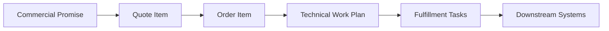
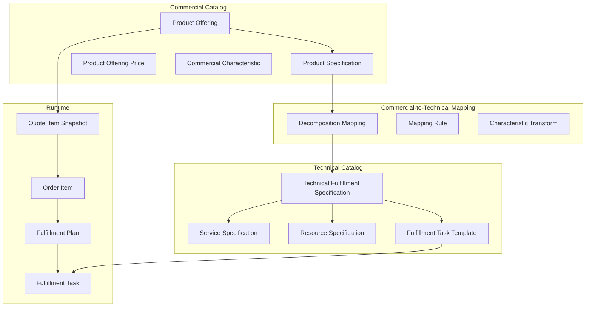
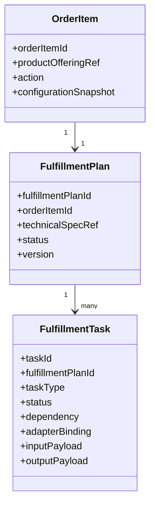
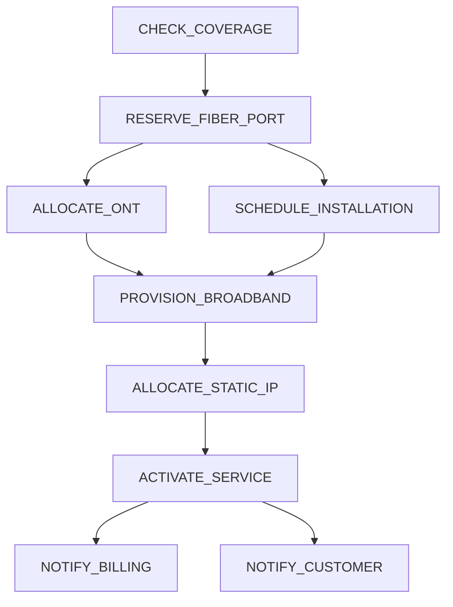
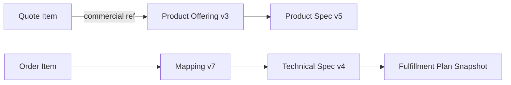
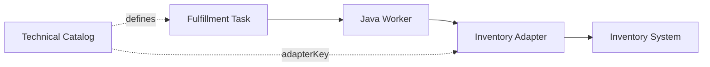
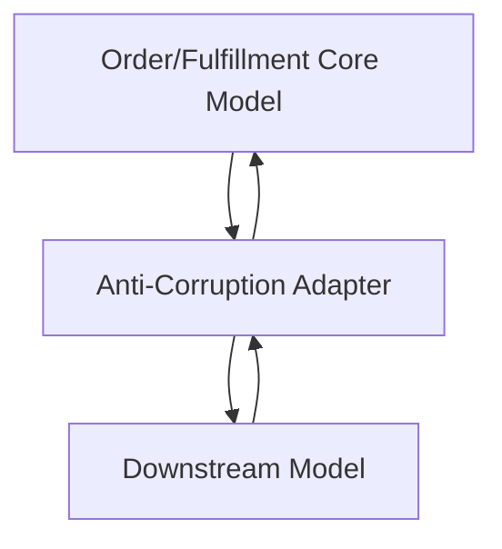

------
title: Build From Scratch: Enterprise Java Microservices CPQ & Order Management Platform - Part 006
description: Memisahkan commercial catalog dan technical catalog dalam enterprise CPQ/OMS: apa yang dijual, apa yang dipenuhi, mapping, decomposition, fulfillment impact, versioning, dan anti-corruption boundary.
series: learn-enterprise-cpq-oms-glassfish-camunda8
seriesTitle: Build From Scratch: Enterprise Java Microservices CPQ & Order Management Platform
order: 6
partTitle: Commercial vs Technical Catalog
tags:
  - java
  - microservices
  - cpq
  - oms
  - product-catalog
  - technical-catalog
  - order-decomposition
  - fulfillment
  - domain-modeling
  - camunda-8
  - kafka
  - postgresql
  - enterprise-architecture
date: 2026-07-02
---

# Part 006 — Commercial vs Technical Catalog

Di Part 005 kita membangun product catalog domain model.

Kita memisahkan product specification, product offering, product offering price, characteristic, relationship, lifecycle, dan versioning.

Sekarang kita masuk ke boundary yang lebih sering menghancurkan CPQ/OMS enterprise:

> mencampur commercial catalog dan technical catalog.

Kesalahan ini biasanya tidak terlihat di awal.

Di awal, semua terlihat praktis.

Satu produk punya price, options, dan provisioning code.

Lalu sistem tumbuh.

Sales ingin bundle baru.

Marketing ingin promo baru.

Fulfillment butuh task baru.

Provisioning system berubah API.

Inventory memerlukan resource reservation.

Billing memerlukan charge mapping berbeda.

Order amendment butuh membaca versi lama.

Akhirnya satu object `Product` berubah menjadi monster yang mencoba menjawab semua hal:

- apa yang dijual;
- bagaimana ditampilkan ke sales;
- bagaimana dihitung harganya;
- bagaimana di-approve;
- bagaimana didekomposisi;
- task apa yang dijalankan;
- adapter mana yang dipanggil;
- payload provisioning seperti apa;
- billing code apa;
- inventory resource apa;
- SLA fulfillment apa.

Itu bukan catalog.

Itu bom waktu.

Part ini memisahkan dua dunia:

1. **Commercial catalog** — what we sell.
2. **Technical catalog** — how we fulfill what we sold.

---

## 1. Tujuan Part Ini

Setelah part ini, kita ingin bisa menjawab:

- apa beda commercial product dan technical service/resource?
- kenapa product offering tidak boleh berisi detail adapter provisioning?
- bagaimana quote item berubah menjadi order item?
- bagaimana order item didekomposisi menjadi fulfillment plan?
- di mana mapping commercial-to-technical disimpan?
- bagaimana mapping versioning bekerja?
- bagaimana technical catalog memengaruhi Camunda workflow?
- bagaimana menghindari hardcoded decomposition logic?
- bagaimana catalog berubah tanpa merusak order yang sedang berjalan?

Ini bukan sekadar pemodelan data.

Ini adalah fondasi OMS.

---

## 2. Definisi Singkat

### 2.1 Commercial Catalog

Commercial catalog menjelaskan **apa yang bisa dijual kepada pelanggan**.

Ia peduli pada:

- product offering;
- product specification;
- price;
- discount;
- bundle;
- addon;
- eligibility;
- segment;
- sales channel;
- region;
- contract term;
- sales-facing characteristic;
- customer-facing naming.

Contoh:

```text
SME Fiber Internet 100 Mbps
- Monthly price: IDR 799000
- Contract term: 24 months
- Static IP optional
- Router included
- Available in Jakarta
```

### 2.2 Technical Catalog

Technical catalog menjelaskan **apa yang harus dilakukan sistem untuk memenuhi produk yang dijual**.

Ia peduli pada:

- service specification;
- resource specification;
- fulfillment task template;
- activation command;
- provisioning adapter;
- inventory reservation;
- dependency antar task;
- technical characteristic;
- downstream payload mapping;
- compensation behavior;
- SLA task;
- fallout handling.

Contoh:

```text
To fulfill SME Fiber Internet 100 Mbps:
1. Check coverage
2. Reserve fiber port
3. Allocate ONT
4. Schedule installation
5. Provision broadband service
6. Activate static IP if selected
7. Notify billing start
```

Commercial catalog menjual pengalaman.

Technical catalog menjalankan realisasi.

---

## 3. Mental Model: Promise vs Work

Cara paling sederhana memahami boundary ini:

> Commercial catalog defines the promise. Technical catalog defines the work.



Commercial promise:

```text
Customer buys SME Fiber 100 Mbps with static IP.
```

Technical work:

```text
Reserve network resource, ship/install router, provision service, assign IP, notify billing.
```

Kalau dua hal ini dicampur, setiap perubahan fulfillment bisa merusak sales catalog.

Sebaliknya, setiap promo sales bisa memaksa perubahan provisioning.

Itu coupling yang buruk.

---

## 4. Kenapa Pemisahan Ini Wajib Di Enterprise

### 4.1 Sales Change Lebih Cepat Dari Fulfillment Change

Marketing bisa membuat offering baru dalam hitungan hari.

Fulfillment capability bisa membutuhkan minggu/bulan karena melibatkan sistem network, billing, inventory, warehouse, partner, dan field operation.

Kalau commercial dan technical dicampur, kecepatan sales tertahan oleh technical deployment.

### 4.2 Satu Technical Capability Bisa Dijual Banyak Cara

Contoh technical service:

```text
Broadband Access Service 100 Mbps
```

Bisa dijual sebagai:

- Consumer Fiber 100M;
- SME Fiber 100M;
- Bundle Internet + Voice;
- Promo Student Internet;
- Enterprise Branch Connectivity.

Kalau technical service dicopy ke setiap offering, sistem akan banyak duplikasi.

### 4.3 Satu Commercial Offering Bisa Butuh Banyak Technical Work

Contoh:

```text
SME Fiber Internet + Static IP + Managed Router
```

Mungkin butuh:

- coverage check;
- fiber port reservation;
- ONT allocation;
- router shipment;
- installation appointment;
- broadband provisioning;
- static IP allocation;
- managed router configuration;
- billing activation;
- customer notification.

Commercial item satu.

Technical tasks banyak.

### 4.4 Fulfillment Berubah Tanpa Mengubah Produk

Dulu provisioning lewat SOAP.

Sekarang lewat REST.

Dulu router dikirim manual.

Sekarang warehouse API otomatis.

Produk yang dijual tetap sama.

Technical catalog dan adapter berubah.

Commercial catalog tidak harus berubah.

### 4.5 Audit Membutuhkan Traceability Dua Arah

Kita harus bisa menjawab:

- quote item ini berasal dari offering apa?
- order item ini berasal dari quote item mana?
- fulfillment task ini dibuat karena order item mana?
- downstream command ini dibuat oleh task mana?
- task ini memakai technical catalog version mana?
- technical rule mana yang menghasilkan task ini?

Tanpa pemisahan jelas, traceability berubah menjadi tebakan.

---

## 5. Layer Model

Kita akan memakai layer berikut:



Layer penting:

1. Product offering dipilih customer.
2. Quote item menyimpan snapshot commercial decision.
3. Order item membawa commercial commitment.
4. Decomposition mapping menerjemahkan order item ke technical plan.
5. Technical catalog memberi template task.
6. Fulfillment plan menjadi runtime instance.

---

## 6. Commercial Catalog Object

Dari Part 005, kita sudah punya:

```text
ProductSpecification
ProductOffering
ProductOfferingPrice
ProductCharacteristicSpecification
ProductOfferingRelationship
CompatibilityRule
CatalogPublication
```

Commercial catalog tidak boleh menyimpan:

```text
provisioning_endpoint
soap_action
network_vlan_id
warehouse_api_payload
billing_system_table_name
camunda_job_type
retry_count_for_adapter_x
```

Kenapa?

Karena semua itu implementation detail technical fulfillment.

Commercial catalog boleh menyimpan hint seperti:

```text
fulfillmentCategory = BROADBAND_ACCESS
requiresInstallation = true
requiresEquipment = true
billingTrigger = ON_ACTIVATION
```

Tetapi hint tidak sama dengan technical command.

---

## 7. Technical Catalog Object

Technical catalog minimal punya object berikut.

### 7.1 Technical Fulfillment Specification

Ini adalah bridge menuju work plan.

Contoh:

```text
TechnicalFulfillmentSpecification: FULFILL_FIBER_BROADBAND_ACCESS
```

Ia menjawab:

- jenis fulfillment apa?
- task template apa saja?
- dependency task apa?
- technical characteristic apa?
- compensation behavior apa?
- version apa?

### 7.2 Service Specification

Service specification menjelaskan service yang akan dibuat/diubah/dimatikan.

Contoh:

```text
BroadbandAccessService
StaticIpService
ManagedRouterService
VoiceService
```

Service adalah sesuatu yang biasanya muncul sebagai customer-facing atau resource-facing service instance.

### 7.3 Resource Specification

Resource specification menjelaskan resource yang perlu dialokasi.

Contoh:

```text
FiberPort
ONTDevice
RouterDevice
StaticIpAddress
VLAN
SIMCard
LicenseSeat
```

Resource bisa physical atau logical.

### 7.4 Fulfillment Task Template

Task template menjelaskan unit kerja runtime.

Contoh:

```text
CHECK_COVERAGE
RESERVE_FIBER_PORT
ALLOCATE_ONT
SCHEDULE_INSTALLATION
PROVISION_BROADBAND
ALLOCATE_STATIC_IP
CONFIGURE_ROUTER
NOTIFY_BILLING
SEND_CUSTOMER_NOTIFICATION
```

Task template tidak sama dengan task runtime.

Template adalah definisi.

Runtime task adalah instance untuk order tertentu.

---

## 8. Runtime Object

Saat order berjalan, technical catalog menghasilkan runtime object.



Runtime object harus menyimpan snapshot technical spec yang dipakai.

Kalau technical catalog berubah saat order berjalan, order lama tidak boleh tiba-tiba berubah plan kecuali ada migration action eksplisit.

---

## 9. Commercial-to-Technical Mapping

Mapping adalah inti boundary.

Ia menjawab:

> Untuk commercial item ini, technical work apa yang harus dibuat?

Contoh mapping:

```json
{
  "mappingCode": "MAP_SME_FIBER_TO_BROADBAND_FULFILLMENT",
  "commercialProductSpecCode": "FIBER_INTERNET",
  "technicalFulfillmentSpecCode": "FULFILL_FIBER_BROADBAND_ACCESS",
  "version": 4,
  "validFrom": "2026-07-01T00:00:00Z",
  "rules": [
    {
      "when": {
        "path": "configuration.static_ip",
        "operator": "eq",
        "value": true
      },
      "includeTask": "ALLOCATE_STATIC_IP"
    }
  ],
  "transforms": [
    {
      "from": "configuration.bandwidth",
      "to": "technical.bandwidthProfile"
    },
    {
      "from": "configuration.router_model",
      "to": "technical.deviceProfile"
    }
  ]
}
```

Mapping harus versioned.

Mapping adalah contract antara CPQ/Order dan Fulfillment.

---

## 10. Decomposition Dalam Satu Kalimat

Order decomposition adalah proses mengubah **commercial order item** menjadi **technical fulfillment plan** yang bisa dieksekusi.

```mermaid
flowchart LR
  OI[Order Item] --> ReadMap[Read Mapping Version]
  ReadMap --> ReadTech[Read Technical Spec]
  ReadTech --> Transform[Transform Characteristics]
  Transform --> BuildGraph[Build Task Graph]
  BuildGraph --> Validate[Validate Dependencies]
  Validate --> Persist[Persist Fulfillment Plan]
  Persist --> Start[Start Camunda Process]
```



Decomposition bukan hanya mapping field.

Ia membuat graph kerja.

Graph itu harus bisa:

- dieksekusi paralel jika aman;
- menjaga dependency;
- retry task tertentu;
- compensate task tertentu;
- masuk manual intervention;
- menjelaskan kenapa task dibuat.

---

## 11. Example: SME Fiber Internet 100 Mbps

Commercial selection:

```json
{
  "productOfferingCode": "SME_FIBER_100M",
  "configuration": {
    "bandwidth": "100Mbps",
    "contract_term": "24m",
    "router_model": "standard",
    "static_ip": true,
    "static_ip_count": 1
  }
}
```

Commercial quote item:

```text
Customer buys SME Fiber 100 Mbps with static IP for 24 months.
```

Technical fulfillment plan:

```text
1. CHECK_COVERAGE
2. RESERVE_FIBER_PORT
3. ALLOCATE_ONT
4. SCHEDULE_INSTALLATION
5. PROVISION_BROADBAND_PROFILE_100M
6. ALLOCATE_STATIC_IP
7. ACTIVATE_SERVICE
8. NOTIFY_BILLING
9. NOTIFY_CUSTOMER
```

Dependency:



Perhatikan:

- static IP commercial characteristic menghasilkan task `ALLOCATE_STATIC_IP`;
- bandwidth menghasilkan technical profile `100M`;
- router model menghasilkan equipment selection;
- billing baru dinotify setelah activation berhasil.

---

## 12. Data Model Technical Catalog

### 12.1 Technical Fulfillment Specification

```sql
create table technical_fulfillment_specification (
  technical_spec_id uuid primary key,
  technical_spec_uid text not null,
  code text not null,
  name text not null,
  version int not null,
  lifecycle_status text not null,
  valid_from timestamptz not null,
  valid_to timestamptz,
  attributes jsonb not null default '{}'::jsonb,
  created_at timestamptz not null,
  created_by text not null,
  updated_at timestamptz not null,
  updated_by text not null,
  unique (technical_spec_uid, version),
  unique (code, version),
  check (version > 0),
  check (lifecycle_status in ('DRAFT', 'IN_REVIEW', 'APPROVED', 'PUBLISHED', 'SUPERSEDED', 'RETIRED')),
  check (valid_to is null or valid_to > valid_from)
);
```

Lifecycle technical catalog mirip commercial catalog.

Published technical spec harus immutable untuk field yang memengaruhi running order.

### 12.2 Fulfillment Task Template

```sql
create table fulfillment_task_template (
  task_template_id uuid primary key,
  technical_spec_id uuid not null references technical_fulfillment_specification(technical_spec_id),
  task_code text not null,
  task_name text not null,
  task_type text not null,
  adapter_key text,
  input_schema jsonb not null default '{}'::jsonb,
  output_schema jsonb not null default '{}'::jsonb,
  retry_policy jsonb,
  timeout_policy jsonb,
  compensation_policy jsonb,
  manual_intervention_policy jsonb,
  display_order int not null default 0,
  unique (technical_spec_id, task_code),
  check (task_type in ('AUTOMATED', 'MANUAL', 'WAIT', 'NOTIFICATION', 'SYSTEM_DECISION'))
);
```

Task template boleh menyimpan `adapter_key`, tetapi bukan detail credential atau endpoint environment-specific.

Endpoint actual tetap config/deployment concern.

### 12.3 Task Dependency

```sql
create table fulfillment_task_dependency (
  dependency_id uuid primary key,
  technical_spec_id uuid not null references technical_fulfillment_specification(technical_spec_id),
  predecessor_task_code text not null,
  successor_task_code text not null,
  dependency_type text not null,
  condition_rule jsonb,
  check (predecessor_task_code <> successor_task_code),
  check (dependency_type in ('SUCCESS_REQUIRED', 'ALWAYS_AFTER', 'CONDITIONAL'))
);
```

Saat publish, dependency graph harus divalidasi.

Minimal:

- no unknown task code;
- no impossible dependency;
- no unsafe cycle;
- conditional rule parseable;
- compensation path valid.

### 12.4 Commercial Technical Mapping

```sql
create table commercial_technical_mapping (
  mapping_id uuid primary key,
  mapping_uid text not null,
  commercial_product_spec_id uuid not null,
  technical_spec_id uuid not null references technical_fulfillment_specification(technical_spec_id),
  version int not null,
  lifecycle_status text not null,
  action_type text not null,
  mapping_rule jsonb not null default '{}'::jsonb,
  characteristic_transform jsonb not null default '[]'::jsonb,
  valid_from timestamptz not null,
  valid_to timestamptz,
  unique (mapping_uid, version),
  check (version > 0),
  check (action_type in ('ADD', 'MODIFY', 'DISCONNECT', 'MOVE', 'SUSPEND', 'RESUME')),
  check (lifecycle_status in ('DRAFT', 'IN_REVIEW', 'APPROVED', 'PUBLISHED', 'SUPERSEDED', 'RETIRED')),
  check (valid_to is null or valid_to > valid_from)
);
```

`action_type` penting karena ADD, MODIFY, dan DISCONNECT sering menghasilkan technical plan yang berbeda.

---

## 13. Jangan Mapping Hanya Dari Offering Code

Mapping yang terlalu sederhana:

```text
SME_FIBER_100M -> FULFILL_FIBER_100M
```

Ini bisa bekerja sebentar.

Tetapi cepat bermasalah.

Kenapa?

Karena fulfillment biasanya tergantung pada:

- action type: add/modify/disconnect;
- existing asset;
- characteristic selected;
- region;
- channel;
- customer segment;
- appointment availability;
- resource availability;
- migration scenario;
- downstream capability.

Lebih baik mapping memakai condition:

```json
{
  "commercialProductSpecCode": "FIBER_INTERNET",
  "actionType": "ADD",
  "when": {
    "all": [
      { "path": "configuration.access_type", "operator": "eq", "value": "fiber" },
      { "path": "context.region", "operator": "in", "value": ["JKT", "BDG"] }
    ]
  },
  "technicalSpecCode": "FULFILL_FIBER_BROADBAND_ACCESS"
}
```

Offering code tetap bisa dipakai sebagai condition.

Tetapi jangan menjadi satu-satunya axis.

---

## 14. Action Type Mengubah Decomposition

Dalam OMS, order item biasanya punya action.

Contoh:

| Action | Makna |
|---|---|
| ADD | pasang produk baru |
| MODIFY | ubah produk/konfigurasi existing |
| DISCONNECT | hentikan produk |
| MOVE | pindahkan lokasi/service |
| SUSPEND | suspend service |
| RESUME | aktifkan kembali |

Commercial product sama bisa menghasilkan technical plan berbeda.

Contoh `FIBER_INTERNET`:

### ADD

```text
CHECK_COVERAGE
RESERVE_PORT
INSTALL_DEVICE
PROVISION_SERVICE
ACTIVATE
BILLING_START
```

### MODIFY Bandwidth 100M -> 300M

```text
CHECK_NETWORK_CAPACITY
CHANGE_BANDWIDTH_PROFILE
VERIFY_SERVICE
BILLING_ADJUSTMENT
```

### DISCONNECT

```text
VALIDATE_CONTRACT_END
DEACTIVATE_SERVICE
RELEASE_STATIC_IP
RELEASE_PORT
BILLING_STOP
RECOVER_EQUIPMENT
```

Kalau action type tidak dimodelkan, OMS akan penuh `if else` tersembunyi.

---

## 15. Commercial Characteristic vs Technical Characteristic

Commercial characteristic adalah pilihan yang dipahami sales/customer.

Technical characteristic adalah parameter yang dipahami fulfillment/downstream.

Contoh mapping:

| Commercial | Technical |
|---|---|
| bandwidth = 100Mbps | bandwidthProfile = BB_100M_DOWN_50M_UP |
| router_model = premium | deviceSku = RTR-PREM-2026 |
| static_ip = true | ipAllocationMode = STATIC |
| contract_term = 24m | billingCommitmentMonths = 24 |
| installation_option = weekend | appointmentWindowType = WEEKEND |

Jangan memaksa customer-facing value menjadi downstream payload langsung.

Gunakan transform.

```json
{
  "from": "configuration.bandwidth",
  "to": "technical.bandwidthProfile",
  "map": {
    "50Mbps": "BB_50M_DOWN_20M_UP",
    "100Mbps": "BB_100M_DOWN_50M_UP",
    "300Mbps": "BB_300M_DOWN_100M_UP"
  }
}
```

Transform harus versioned dan explainable.

---

## 16. Technical Catalog Dan Camunda 8

Camunda 8/BPMN tidak harus tahu semua product detail.

BPMN sebaiknya menangani orchestration pattern.

Technical catalog menyediakan task plan.


Ada dua pendekatan:

### 16.1 BPMN Per Product

Setiap product punya BPMN sendiri.

Kelebihan:

- visual spesifik;
- mudah dimengerti untuk produk kecil.

Kekurangan:

- banyak duplikasi;
- perubahan produk memerlukan deployment BPMN;
- sulit scale jika product banyak.

### 16.2 Generic BPMN + Dynamic Task Plan

Satu BPMN generic menjalankan fulfillment plan dari technical catalog.

Kelebihan:

- lebih fleksibel;
- product baru tidak selalu butuh BPMN baru;
- task graph dikendalikan catalog.

Kekurangan:

- worker lebih kompleks;
- observability harus bagus;
- plan validation harus kuat.

Untuk seri ini, kita akan condong ke pendekatan kedua:

> Generic orchestration process, catalog-driven fulfillment plan.

BPMN menangani lifecycle order.

Technical catalog menangani task definition.

Domain service tetap menjadi owner business decision.

---

## 17. Fulfillment Plan Snapshot

Saat order didekomposisi, sistem harus menyimpan snapshot.

Contoh:

```json
{
  "fulfillmentPlanId": "fp-...",
  "orderItemId": "oi-...",
  "technicalSpecRef": {
    "code": "FULFILL_FIBER_BROADBAND_ACCESS",
    "version": 4,
    "snapshotHash": "sha256:..."
  },
  "tasks": [
    {
      "taskCode": "CHECK_COVERAGE",
      "taskType": "AUTOMATED",
      "adapterKey": "coverage-service",
      "dependsOn": []
    },
    {
      "taskCode": "RESERVE_FIBER_PORT",
      "taskType": "AUTOMATED",
      "adapterKey": "inventory-service",
      "dependsOn": ["CHECK_COVERAGE"]
    }
  ]
}
```

Snapshot melindungi running order dari catalog drift.

Jika technical catalog v5 dipublish besok, order yang sudah memakai v4 tetap bisa selesai berdasarkan v4.

---

## 18. Version Compatibility

Commercial dan technical catalog bisa berubah independen, tetapi mapping harus menjaga compatibility.

Contoh:

```text
Product Specification FIBER_INTERNET v5
maps to
Technical Fulfillment Spec FULFILL_FIBER_BROADBAND_ACCESS v4
via
Mapping MAP_FIBER_TO_BROADBAND v7
```

Quote snapshot menyimpan commercial version.

Order decomposition menyimpan mapping version dan technical version.



Jangan mengandalkan latest mapping saat order recovery.

Recovery harus tahu versi mapping yang dipakai ketika plan dibuat.

---

## 19. Publish Validation Untuk Technical Catalog

Sama seperti commercial catalog, technical catalog publish adalah compile step.

Validation minimal:

- semua task code unique;
- dependency target exists;
- graph tidak punya unsafe cycle;
- adapter key dikenal;
- input schema valid;
- output schema valid;
- retry policy valid;
- timeout policy valid;
- compensation policy valid;
- manual intervention path ada untuk task berisiko;
- mapping transform parseable;
- commercial source valid;
- technical target valid;
- action type valid;
- no overlapping published mapping tanpa priority.

Technical catalog yang tidak divalidasi akan menghasilkan order fallout massal.

---

## 20. Downstream Adapter Boundary

Technical catalog boleh berkata:

```text
Task RESERVE_FIBER_PORT uses adapter inventory-reservation.
```

Tetapi adapter implementation yang tahu:

- endpoint URL;
- auth;
- protocol;
- request mapping detail;
- response parsing;
- downstream error taxonomy;
- retryable vs non-retryable error;
- fallback behavior.



Rule:

> Technical catalog binds to capability, not environment-specific integration detail.

`adapterKey = inventory-reservation` baik.

`url = https://prod-inventory.internal/v1/reserve` buruk untuk catalog.

---

## 21. Billing Mapping Boundary

Billing sering menjadi sumber coupling.

Commercial catalog punya price components.

Billing system butuh charge code.

Jangan langsung menaruh billing implementation detail ke product offering price tanpa boundary.

Lebih baik ada mapping:

```text
ProductOfferingPrice MRC_FIBER_100M
maps to
BillingChargeCode BB_FIBER_100M_MRC
valid for billing system version X
```

Billing mapping bisa berada di integration catalog atau billing adapter config.

Dalam seri ini, kita cukup menjaga bahwa commercial price punya stable `priceCode` dan nanti billing adapter bisa map ke charge code.

---

## 22. Inventory Mapping Boundary

Commercial catalog mungkin tahu produk butuh router.

Technical catalog tahu resource type.

Inventory adapter tahu SKU dan inventory system payload.

Contoh:

```text
Commercial: router_model = premium
Technical: resourceSpec = ManagedRouterDevice
Adapter mapping: deviceSku = RTR-PREM-2026
```

Jika SKU berubah karena vendor baru, commercial offering tidak harus berubah.

Technical/resource mapping atau adapter mapping yang berubah.

---

## 23. Anti-Corruption Layer

Commercial model tidak boleh bocor ke downstream.

Downstream model tidak boleh bocor ke commercial model.

Adapter bertugas menerjemahkan.



Contoh buruk:

```java
public class ProductOffering {
    String inventoryReservationPayload;
    String billingSoapAction;
    String crmProductExternalId;
}
```

Contoh lebih sehat:

```java
public class FulfillmentTask {
    TaskCode taskCode;
    AdapterKey adapterKey;
    JsonNode technicalInput;
}
```

Adapter menerjemahkan `technicalInput` menjadi payload downstream.

---

## 24. State Ownership

Catalog mendefinisikan template.

Order/Fulfillment menyimpan instance state.

| Data | Owner |
|---|---|
| Product offering definition | Commercial Catalog |
| Product offering price definition | Commercial Catalog |
| Technical fulfillment spec | Technical Catalog |
| Mapping commercial-to-technical | Mapping Catalog / Fulfillment Design |
| Quote item selected config | Quote Service |
| Order item state | Order Service |
| Fulfillment task state | Fulfillment Service / OMS |
| Process instance state | Camunda 8 |
| Downstream request/response log | Integration Adapter / Audit |

Jangan menyimpan runtime state di catalog.

Catalog object tidak boleh punya field:

```text
current_order_status
last_provisioning_result
customer_current_bandwidth
```

Itu runtime/asset/order data.

---

## 25. Build Sequence Untuk Seri Ini

Agar build efektif, urutan implementasi sebaiknya:

1. Commercial catalog model.
2. Technical catalog model.
3. Mapping model.
4. Quote item snapshot.
5. Order item model.
6. Decomposition engine sederhana.
7. Fulfillment plan table.
8. Generic Camunda process.
9. Java worker execute task.
10. Adapter mock.
11. Outbox event.
12. Operational dashboard query.

Jangan mulai dari Camunda BPMN dulu.

Kalau BPMN dibuat sebelum model decomposition matang, BPMN akan berisi hardcoded product logic.

---

## 26. Decomposition Service API

Internal API awal:

```text
POST /internal/order-decomposition/preview
POST /internal/order-decomposition/commit
GET  /internal/order-decomposition/{id}
```

Preview berguna untuk debugging dan test.

Input:

```json
{
  "orderItemId": "oi-...",
  "actionType": "ADD",
  "productOfferingRef": {
    "code": "SME_FIBER_100M",
    "version": 3
  },
  "productSpecificationRef": {
    "code": "FIBER_INTERNET",
    "version": 5
  },
  "configuration": {
    "bandwidth": "100Mbps",
    "static_ip": true,
    "router_model": "standard"
  },
  "context": {
    "region": "JKT",
    "customerSegment": "SME"
  }
}
```

Output:

```json
{
  "technicalSpecRef": {
    "code": "FULFILL_FIBER_BROADBAND_ACCESS",
    "version": 4
  },
  "mappingRef": {
    "code": "MAP_FIBER_TO_BROADBAND",
    "version": 7
  },
  "tasks": [
    {
      "taskCode": "CHECK_COVERAGE",
      "dependsOn": [],
      "reason": "Required for fiber broadband add order"
    },
    {
      "taskCode": "ALLOCATE_STATIC_IP",
      "dependsOn": ["PROVISION_BROADBAND"],
      "reason": "Included because configuration.static_ip = true"
    }
  ]
}
```

`reason` bukan kosmetik.

Itu explainability untuk support dan audit.

---

## 27. Domain Service Sketch

```java
public final class OrderDecompositionService {
    private final CommercialTechnicalMappingRepository mappingRepository;
    private final TechnicalCatalogRepository technicalCatalogRepository;
    private final FulfillmentPlanRepository fulfillmentPlanRepository;

    public FulfillmentPlanPreview preview(OrderItemSnapshot orderItem, DecompositionContext context) {
        Mapping mapping = mappingRepository.findPublishedMapping(
            orderItem.productSpecificationRef(),
            orderItem.actionType(),
            context.effectiveAt()
        );

        TechnicalFulfillmentSpecification technicalSpec =
            technicalCatalogRepository.getPublished(mapping.technicalSpecRef());

        TechnicalInput input = mapping.transform(orderItem.configuration(), context);

        TaskGraph graph = technicalSpec.buildTaskGraph(input);
        graph.validate();

        return FulfillmentPlanPreview.from(mapping, technicalSpec, graph);
    }

    public FulfillmentPlan commit(OrderItemSnapshot orderItem, DecompositionContext context) {
        FulfillmentPlanPreview preview = preview(orderItem, context);
        FulfillmentPlan plan = preview.toRuntimePlan(orderItem.orderItemId());
        fulfillmentPlanRepository.save(plan);
        return plan;
    }
}
```

Hal penting:

- decomposition membaca snapshot order item;
- mapping dipilih berdasarkan version/effective date;
- technical spec dibaca secara versioned;
- transform menghasilkan technical input;
- graph divalidasi sebelum persist;
- plan runtime disimpan.

---

## 28. Kafka Events

Event penting:

```text
TechnicalFulfillmentSpecificationPublished
CommercialTechnicalMappingPublished
OrderItemDecomposed
FulfillmentPlanCreated
FulfillmentTaskCreated
```

Contoh event:

```json
{
  "eventId": "evt-...",
  "eventType": "OrderItemDecomposed",
  "occurredAt": "2026-07-02T10:15:30Z",
  "orderId": "ord-...",
  "orderItemId": "oi-...",
  "fulfillmentPlanId": "fp-...",
  "mappingRef": {
    "code": "MAP_FIBER_TO_BROADBAND",
    "version": 7
  },
  "technicalSpecRef": {
    "code": "FULFILL_FIBER_BROADBAND_ACCESS",
    "version": 4
  },
  "taskCount": 9
}
```

Event ini membantu:

- operational timeline;
- support investigation;
- downstream notification;
- dashboard projection;
- replay/rebuild projection.

---

## 29. Failure Modes Jika Boundary Salah

### 29.1 Sales Catalog Pecah Karena Downstream Change

Downstream provisioning mengganti API.

Kalau endpoint ditaruh di product offering, semua offering harus diubah.

### 29.2 Order Lama Berubah Plan

Technical catalog latest dipakai saat retry order lama.

Task baru muncul tanpa sadar.

Order menjadi tidak deterministic.

### 29.3 Pricing Dan Fulfillment Terkunci Bersama

Promo marketing butuh deployment technical catalog.

Kecepatan bisnis turun.

### 29.4 Decomposition Tidak Explainable

Support bertanya:

```text
Kenapa task ALLOCATE_STATIC_IP muncul?
```

Sistem hanya menjawab:

```text
Karena code if di service.
```

Itu bukan enterprise-grade.

### 29.5 Camunda BPMN Menjadi Product Rule Engine

BPMN penuh gateway seperti:

```text
if productCode == A
if productCode == B
if staticIp == true
if router == premium
```

Akhirnya workflow sulit di-maintain.

Product logic harus berada di catalog/decomposition, bukan tersebar di BPMN.

---

## 30. Boundary Rules

Pegang rules ini:

1. Commercial catalog tidak tahu endpoint downstream.
2. Commercial catalog tidak menyimpan runtime state.
3. Technical catalog tidak menentukan harga jual.
4. Technical catalog tidak mengganti quote snapshot.
5. Mapping harus versioned.
6. Decomposition harus explainable.
7. Fulfillment plan harus snapshot.
8. Running order tidak otomatis mengikuti latest catalog.
9. Adapter menerjemahkan core model ke downstream model.
10. BPMN mengorkestrasi lifecycle, bukan menjadi product catalog.

---

## 31. Practice: Pisahkan Model Buruk

Diberikan object buruk:

```json
{
  "productCode": "SME_FIBER_100M",
  "name": "SME Fiber 100 Mbps",
  "price": 799000,
  "billingCode": "BB100MRC",
  "routerSku": "RTR-STANDARD",
  "provisioningApi": "https://prod-network/provision",
  "soapAction": "ActivateBroadband",
  "requiresStaticIp": true,
  "camundaProcessId": "fiberInstallV3",
  "inventoryReservationPayload": {
    "resourceType": "FIBER_PORT"
  }
}
```

Pisahkan menjadi:

1. Product offering.
2. Product offering price.
3. Product characteristic.
4. Technical fulfillment specification.
5. Fulfillment task template.
6. Commercial-to-technical mapping.
7. Adapter configuration.
8. Billing mapping.

Tujuan latihan:

- melihat coupling;
- memisahkan identity;
- menentukan owner;
- mengurangi blast radius perubahan.

---

## 32. Checklist Desain Part Ini

Sebelum lanjut, pastikan bisa menjawab:

- [ ] Apa yang termasuk commercial catalog?
- [ ] Apa yang termasuk technical catalog?
- [ ] Di mana mapping commercial-to-technical disimpan?
- [ ] Apakah mapping versioned?
- [ ] Apakah decomposition menghasilkan explainable task graph?
- [ ] Apakah fulfillment plan menyimpan snapshot technical spec?
- [ ] Apakah running order aman dari catalog drift?
- [ ] Apakah BPMN bebas dari hardcoded product logic?
- [ ] Apakah adapter boundary mencegah downstream model bocor ke core?
- [ ] Apakah action type ADD/MODIFY/DISCONNECT menghasilkan plan berbeda?
- [ ] Apakah billing/inventory mapping tidak merusak commercial catalog?

---

## 33. Ringkasan

Commercial catalog dan technical catalog harus dipisah.

Commercial catalog menjawab:

> Apa yang dijual?

Technical catalog menjawab:

> Apa yang harus dikerjakan untuk memenuhi yang dijual?

Mapping menjawab:

> Bagaimana janji komersial diterjemahkan menjadi pekerjaan teknis?

Decomposition menjawab:

> Untuk order item tertentu, task graph apa yang harus dibuat sekarang?

Prinsip paling penting:

> Product offering adalah promise. Fulfillment plan adalah work. Jangan mencampur promise dan work dalam satu model.

Di Part 007, kita akan masuk ke **product configuration engine model**: required option, optional option, mutually exclusive option, cardinality, dependency, compatibility, constraint, dan validation graph.

Itu adalah jantung CPQ sebelum pricing.

---

## References

- TM Forum — Product Catalog Management API / TMF620: https://www.tmforum.org/open-digital-architecture/open-apis/product-catalog-management-api-TMF620/v5.0
- TM Forum — Information Framework / SID: https://www.tmforum.org/open-digital-architecture/information-framework-sid/
- Camunda 8 Documentation: https://docs.camunda.io/
- OpenAPI Specification: https://swagger.io/specification/
