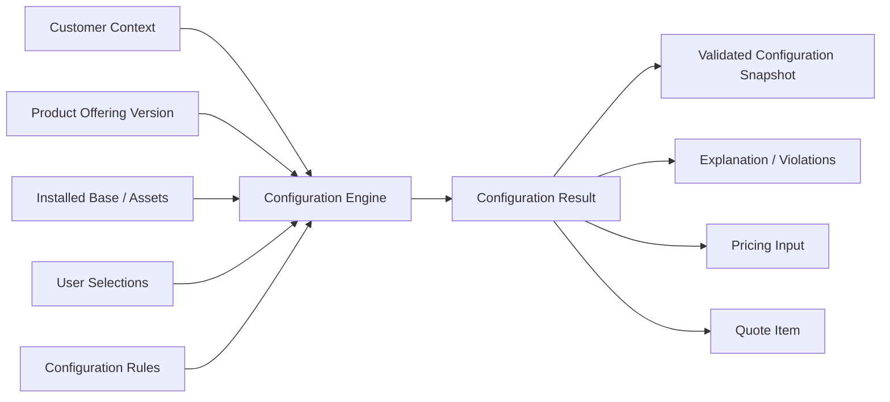
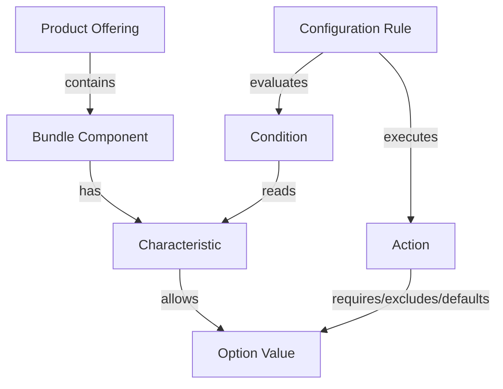
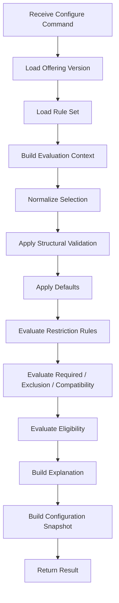
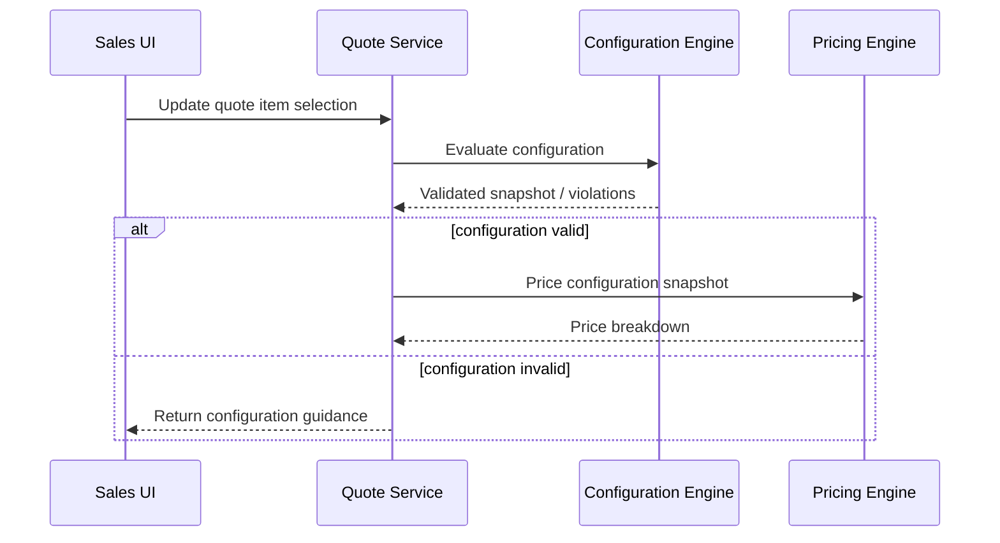
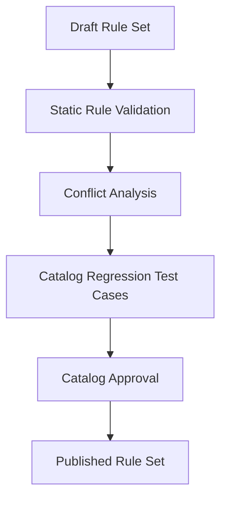

------
title: Build From Scratch: Enterprise Java Microservices CPQ & Order Management Platform - Part 007
description: Mendesain product configuration engine untuk enterprise CPQ/OMS: configuration graph, constraint model, compatibility, cardinality, validation pass, explainability, snapshotting, API contract, persistence, dan failure model.
series: learn-enterprise-cpq-oms-glassfish-camunda8
seriesTitle: Build From Scratch: Enterprise Java Microservices CPQ & Order Management Platform
order: 7
partTitle: Product Configuration Engine Model
tags:
  - java
  - microservices
  - cpq
  - oms
  - product-configuration
  - constraint-modeling
  - schema-first
  - postgresql
  - mybatis
  - redis
  - enterprise-architecture
date: 2026-07-02
---

# Part 007 — Product Configuration Engine Model

Di Part 005 kita membangun **product catalog domain model**.

Di Part 006 kita memisahkan **commercial catalog** dari **technical catalog**.

Sekarang kita masuk ke jantung CPQ:

> bagaimana sistem menentukan konfigurasi produk yang valid, explainable, versioned, dan aman dikonversi menjadi quote/order.

Ini bukan sekadar form validation.

Ini juga bukan sekadar JSON Schema.

Product configuration engine adalah komponen yang menjawab pertanyaan seperti:

- produk apa yang boleh dipilih customer ini;
- opsi apa yang wajib dipilih;
- opsi apa yang saling mengecualikan;
- kombinasi apa yang tidak kompatibel;
- default apa yang boleh diisi otomatis;
- pilihan apa yang perlu approval;
- konfigurasi mana yang valid untuk quote;
- konfigurasi mana yang masih valid ketika quote direvisi;
- snapshot apa yang harus dibawa ke order agar perubahan catalog tidak merusak transaksi lama.

Dalam enterprise CPQ, configuration engine harus bisa menjelaskan **mengapa** sebuah kombinasi valid atau tidak valid.

Kalau sistem hanya berkata:

```text
Invalid configuration.
```

maka itu bukan engine.

Itu kotak hitam.

Dan kotak hitam sulit dipakai sales, sulit di-debug engineer, sulit diaudit, dan sulit dipertahankan ketika ada dispute bisnis.

---

## 1. Target Part Ini

Setelah part ini, kita ingin punya model yang cukup kuat untuk membangun engine konfigurasi produk dari scratch.

Kita belum menulis semua kode implementasi final. Itu akan dilakukan lebih konkret pada Part 030.

Di part ini kita memaku modelnya dulu:

1. apa input configuration engine;
2. apa output configuration engine;
3. bagaimana catalog rule direpresentasikan;
4. bagaimana dependency antar-option dimodelkan;
5. bagaimana cardinality dan compatibility dicek;
6. bagaimana error dan explanation dibuat;
7. bagaimana configuration snapshot disimpan;
8. bagaimana engine ini dihubungkan ke quote/order;
9. bagaimana failure mode-nya dipikirkan sejak awal.

Kita akan membangun mental model berikut:



Configuration engine bukan pemilik quote.

Configuration engine bukan pemilik order.

Configuration engine adalah domain component yang memberikan hasil deterministik:

> berdasarkan catalog version, customer context, existing asset state, dan pilihan user, konfigurasi ini valid atau tidak, lengkap atau belum, serta kenapa.

---

## 2. Problem yang Sering Diremehkan

Banyak CPQ internal gagal karena configuration model-nya terlalu sederhana.

Biasanya dimulai dari object seperti ini:

```json
{
  "productCode": "FIBER_INTERNET",
  "options": {
    "speed": "500_MBPS",
    "router": "PREMIUM_ROUTER",
    "staticIp": true
  }
}
```

Awalnya terlihat cukup.

Lalu bisnis menambahkan aturan:

- speed 1 Gbps hanya tersedia untuk area tertentu;
- static IP hanya untuk business customer;
- premium router wajib untuk speed di atas 500 Mbps;
- voice add-on tidak boleh dipilih kalau customer belum punya identity verification;
- discount bundle hanya valid kalau internet + TV + mobile ada dalam satu quote;
- modify order tidak boleh menurunkan speed jika customer masih dalam lock-in period;
- disconnect order harus memunculkan penalty charge;
- beberapa option hanya available untuk channel tertentu;
- beberapa option hanya boleh dipilih oleh sales role tertentu;
- pilihan teknis fulfillment bergantung pada availability inventory;
- quote lama harus tetap bisa dibuka walaupun catalog terbaru sudah berubah.

Kalau model awal hanya `Map<String, Object> options`, sistem akan tumbuh menjadi sekumpulan `if` tersebar:

```java
if (speed.equals("1G") && !area.isFiberReady()) { ... }
if (staticIp && !customer.isBusiness()) { ... }
if (router.equals("BASIC") && speed > 500) { ... }
```

Ini cepat di awal, tetapi mahal di enterprise.

Masalahnya bukan pada `if`.

Masalahnya adalah rule tersebar, tidak versioned, tidak explainable, tidak bisa diuji sebagai catalog artifact, dan tidak bisa dipahami business analyst.

Configuration engine production-grade harus memindahkan aturan dari **code accident** menjadi **domain artifact**.

---

## 3. Batas Engine

Kita perlu memaku boundary.

Configuration engine melakukan:

- membaca catalog version;
- membaca offering structure;
- membaca characteristic definition;
- membaca rule definition;
- membaca customer/channel/tenant context;
- membaca installed base jika diperlukan;
- menerima selection user;
- normalisasi selection;
- apply default;
- validasi required fields;
- validasi cardinality;
- validasi compatibility;
- validasi eligibility;
- menghasilkan violation dan explanation;
- menghasilkan normalized configuration snapshot.

Configuration engine tidak melakukan:

- menghitung final price;
- membuat quote;
- membuat order;
- menjalankan fulfillment;
- memanggil provisioning;
- menyimpan audit quote;
- menentukan approval final;
- mengambil keputusan pembayaran;
- menjalankan BPMN flow.

Engine boleh menghasilkan signal untuk komponen lain:

- `requiresApproval = true`;
- `pricingHints`;
- `fulfillmentHints`;
- `eligibilityWarnings`;
- `configurationCompleteness`;
- `selectedProductSpecificationRefs`;
- `technicalMappingCandidates`.

Tapi signal bukan ownership.

Ini penting.

Kalau configuration engine mulai membuat order item, engine berubah menjadi hidden OMS.

Kalau pricing logic dimasukkan penuh ke configuration engine, engine berubah menjadi hidden pricing engine.

Kalau provisioning logic dimasukkan ke configuration engine, engine berubah menjadi hidden fulfillment engine.

Production system harus menjaga engine tetap tajam.

---

## 4. Core Domain Vocabulary

Kita gunakan vocabulary yang konsisten dari part sebelumnya.

### Product Offering

Commercial object yang bisa dijual.

Contoh:

- `Business Fiber Internet 500 Mbps`;
- `SME Connectivity Bundle`;
- `Cloud PBX Add-On`;
- `Managed Router`.

Offering punya lifecycle dan version.

### Product Specification

Definisi jenis produk yang lebih stabil daripada offering.

Contoh:

- `Internet Access`;
- `Router Device`;
- `Static IP Service`;
- `Voice Service`.

### Characteristic

Atribut configurable atau descriptive.

Contoh:

- `speed`;
- `contractTerm`;
- `routerType`;
- `ipAddressType`;
- `installationType`;
- `serviceAddress`.

### Option

Nilai yang bisa dipilih untuk characteristic.

Contoh untuk `speed`:

- `100_MBPS`;
- `300_MBPS`;
- `500_MBPS`;
- `1_GBPS`.

### Configuration Rule

Aturan yang mengendalikan validitas konfigurasi.

Contoh:

- `1_GBPS requires fiber coverage`;
- `STATIC_IP requires BUSINESS_CUSTOMER`;
- `PREMIUM_ROUTER required when speed >= 500_MBPS`.

### Selection

Pilihan aktual user/customer pada quote/order.

### Configuration Snapshot

Hasil konfigurasi yang sudah dinormalisasi dan dibekukan dalam quote/order.

Snapshot harus membawa cukup data agar quote lama tetap bisa dipahami walaupun catalog berubah.

---

## 5. Prinsip Desain

Kita pakai beberapa prinsip tegas.

### Prinsip 1 — Catalog Rules Are Versioned Domain Data

Rule konfigurasi bukan sekadar code.

Rule adalah bagian dari catalog version.

Kalau offering version berubah, rule bisa berubah.

Quote yang dibuat dengan version lama harus tetap menunjuk ke rule set lama.

```text
quote_item.catalog_version_id = catalog_version_id_at_configuration_time
```

Ini mencegah bug klasik:

> quote yang valid kemarin menjadi invalid hari ini karena catalog berubah.

Dalam enterprise CPQ, itu bisa menjadi masalah kontrak dan revenue.

### Prinsip 2 — Validation Must Be Explainable

Setiap violation harus punya:

- rule code;
- severity;
- affected path;
- human message;
- machine-readable reason;
- suggested fix jika memungkinkan;
- source rule version.

Contoh:

```json
{
  "code": "CFG_REQUIRES_OPTION",
  "severity": "ERROR",
  "path": "/items/0/characteristics/routerType",
  "message": "Premium router is required for speed 500 Mbps or above.",
  "reason": {
    "selectedSpeed": "500_MBPS",
    "requiredRouterType": "PREMIUM_ROUTER"
  },
  "ruleRef": {
    "ruleCode": "R-INTERNET-ROUTER-001",
    "version": 3
  }
}
```

Tanpa explanation, support team akan menyalahkan engineering.

Dengan explanation, system bisa dipakai untuk sales guidance, debugging, audit, dan regression testing.

### Prinsip 3 — Separate Structural Validation from Semantic Validation

Structural validation menjawab:

- field ada atau tidak;
- tipe data benar atau tidak;
- enum valid atau tidak;
- format value benar atau tidak.

Semantic validation menjawab:

- kombinasi ini boleh atau tidak;
- customer ini eligible atau tidak;
- option ini compatible atau tidak;
- cardinality terpenuhi atau tidak;
- lifecycle product memungkinkan atau tidak.

JSON Schema bagus untuk structural validation.

Tetapi semantic validation tetap membutuhkan domain engine.

Jangan memaksa semua business rule menjadi JSON Schema.

Itu akan membuat schema sulit dibaca, sulit dijelaskan, dan sulit dioperasikan.

### Prinsip 4 — Deterministic Engine

Input yang sama harus menghasilkan output yang sama.

Input minimal engine:

```text
catalogVersionId
productOfferingId
customerContext
channelContext
existingAssetContext
userSelections
engineVersion
```

Output harus deterministik.

Jangan membaca waktu sekarang sembarangan di tengah rule evaluation.

Jangan memanggil service eksternal secara acak di tengah evaluation.

Jika coverage/eligibility berasal dari external system, jadikan itu explicit input atau dependency yang hasilnya disnapshot.

### Prinsip 5 — Snapshot Before Quote and Order

Quote tidak boleh hanya menyimpan pilihan user.

Quote harus menyimpan hasil konfigurasi yang sudah dinormalisasi:

- offering code dan version;
- selected characteristic values;
- applied defaults;
- calculated derived values jika ada;
- rule set version;
- validation status;
- explanation summary;
- configuration hash.

Order harus membawa snapshot dari quote.

Jangan menghitung ulang konfigurasi order dari catalog terbaru kecuali memang ada explicit revalidation flow.

---

## 6. Data Model Konseptual

Configuration model dapat dipandang sebagai graph.

Node-nya:

- offering;
- component;
- characteristic;
- option;
- rule;
- condition;
- action;
- dependency.

Edge-nya:

- contains;
- requires;
- excludes;
- implies;
- restricts;
- defaults;
- mapsTo;
- dependsOn.



Graph ini tidak harus disimpan sebagai graph database.

Untuk sistem kita, PostgreSQL relational model cukup kuat.

Yang penting mental model-nya graph karena konfigurasi produk selalu tentang hubungan dan constraint.

---

## 7. Offering Structure

Offering structure menjawab:

> produk ini terdiri dari apa saja?

Contoh offering:

```text
SME Connectivity Bundle
├── Internet Access
│   ├── speed
│   ├── contractTerm
│   └── staticIp
├── Managed Router
│   └── routerType
└── Installation Service
    └── installationType
```

Model minimal:

```text
product_offering
product_offering_version
product_offering_component
product_specification
product_characteristic
product_characteristic_value
```

Field penting `product_offering_component`:

| Field | Makna |
|---|---|
| `id` | ID component dalam offering version |
| `offering_version_id` | versi offering |
| `component_code` | kode stabil component |
| `product_spec_id` | reference ke product specification |
| `min_quantity` | minimum component harus ada |
| `max_quantity` | maksimum instance component |
| `is_configurable` | apakah user bisa memilih/mengubah |
| `display_order` | urutan UI |
| `lifecycle_status` | draft/active/retired |

Characteristic field:

| Field | Makna |
|---|---|
| `code` | kode characteristic, misalnya `speed` |
| `value_type` | string, number, boolean, enum, object, address, date |
| `is_required` | required secara structural |
| `is_user_visible` | tampil di UI atau internal |
| `is_user_editable` | boleh diedit user |
| `is_price_affecting` | memengaruhi pricing |
| `is_fulfillment_affecting` | memengaruhi decomposition |
| `default_value` | default statis jika ada |
| `validation_schema` | JSON Schema fragment jika perlu |

Value field:

| Field | Makna |
|---|---|
| `value_code` | kode option |
| `display_name` | label UI |
| `sort_order` | urutan UI |
| `is_default` | default candidate |
| `lifecycle_status` | active/retired |
| `effective_from` | awal berlaku |
| `effective_to` | akhir berlaku |

---

## 8. Cardinality Model

Cardinality adalah rule paling dasar tetapi sering salah.

Cardinality menjawab:

- harus pilih berapa option;
- boleh pilih berapa component;
- boleh punya berapa instance;
- apakah multiple values allowed;
- apakah quantity allowed.

Contoh:

```text
Internet Access component: min 1, max 1
Managed Router component: min 0, max 1
Static IP component: min 0, max 4
TV Channel Pack: min 1, max 5
```

Characteristic cardinality:

```text
speed: exactly 1
routerType: exactly 1 if router selected
staticIpCount: 0..4
channelPacks: 1..5
```

Kita harus membedakan:

1. component cardinality;
2. characteristic value cardinality;
3. quantity cardinality;
4. relationship cardinality.

Jangan mencampur semuanya ke satu field `required`.

### Violation Example

```json
{
  "code": "CFG_CARDINALITY_MIN_NOT_MET",
  "severity": "ERROR",
  "path": "/components/staticIp",
  "message": "At least 1 static IP is required when business firewall option is selected.",
  "reason": {
    "min": 1,
    "actual": 0,
    "trigger": "businessFirewall=true"
  }
}
```

---

## 9. Rule Taxonomy

Configuration rule tidak semuanya sama.

Kita perlu taxonomy agar engine tidak menjadi lumpur.

### 9.1 Required Rule

Jika condition terpenuhi, field/component/option wajib ada.

Contoh:

```text
IF speed >= 500_MBPS
THEN routerType is required
```

### 9.2 Exclusion Rule

Jika A dipilih, B tidak boleh dipilih.

```text
IF installationType = SELF_INSTALL
THEN exclude managedRouterInstallation
```

### 9.3 Dependency Rule

Jika A dipilih, B harus tersedia atau dipilih.

```text
IF staticIp = true
THEN requires internetAccess
```

### 9.4 Compatibility Rule

Kombinasi values tertentu compatible atau incompatible.

```text
speed=1_GBPS compatible only with accessTechnology=FIBER
```

### 9.5 Eligibility Rule

Customer/channel/location context menentukan availability.

```text
staticIp allowed only when customerSegment = BUSINESS
```

### 9.6 Defaulting Rule

Engine boleh mengisi nilai default ketika user belum memilih.

```text
IF router selected AND routerType missing
THEN default routerType = BASIC_ROUTER
```

Defaulting harus explainable.

Defaulting juga tidak boleh menyembunyikan keputusan material.

Untuk value yang berdampak harga besar, lebih aman meminta explicit choice daripada default diam-diam.

### 9.7 Derivation Rule

Engine menghitung value turunan.

```text
contractEndDate = activationDate + contractTerm
```

Derivation berbeda dari pricing.

Jika output-nya charge, masukkan ke pricing engine.

Jika output-nya attribute konfigurasi, boleh di configuration engine.

### 9.8 Warning Rule

Rule yang tidak memblokir quote tetapi memberi peringatan.

```text
speed=1_GBPS in this area may require longer installation lead time
```

Severity:

- `INFO`;
- `WARNING`;
- `ERROR`;
- `BLOCKER`.

`ERROR` berarti quote belum valid.

`BLOCKER` berarti flow tidak boleh lanjut bahkan untuk draft submission.

---

## 10. Rule Representation

Ada tiga cara umum merepresentasikan rule.

### Option A — Hardcoded Java Rules

Contoh:

```java
public final class StaticIpBusinessOnlyRule implements ConfigurationRule {
    @Override
    public RuleResult evaluate(ConfigurationContext ctx) {
        if (ctx.isSelected("staticIp", true) && !ctx.customer().isBusiness()) {
            return RuleResult.error("CFG_STATIC_IP_BUSINESS_ONLY");
        }
        return RuleResult.ok();
    }
}
```

Kelebihan:

- mudah dikode;
- type-safe;
- bisa kompleks;
- mudah di-debug engineer.

Kekurangan:

- deploy code untuk ubah rule;
- business sulit review;
- versioning catalog lebih sulit;
- berisiko tersebar di banyak service.

### Option B — Declarative Rules in Database

Contoh:

```json
{
  "ruleCode": "R-STATIC-IP-001",
  "condition": {
    "all": [
      { "path": "$.selection.staticIp", "op": "eq", "value": true },
      { "path": "$.customer.segment", "op": "neq", "value": "BUSINESS" }
    ]
  },
  "action": {
    "type": "reject",
    "code": "CFG_STATIC_IP_BUSINESS_ONLY",
    "message": "Static IP is available only for business customers."
  }
}
```

Kelebihan:

- versioned sebagai catalog data;
- bisa diuji sebagai artifact;
- bisa diedit lewat admin governance;
- bisa dijelaskan.

Kekurangan:

- perlu expression evaluator;
- perlu governance ketat;
- type safety lebih sulit;
- rule terlalu kompleks bisa menjadi bahasa pemrograman jelek.

### Option C — Hybrid

Ini yang paling realistis untuk enterprise.

Gunakan declarative rule untuk 80% catalog constraints.

Gunakan Java plugin untuk rule yang sangat kompleks, mahal, atau butuh algoritma khusus.

Tetapi Java plugin tetap harus:

- punya rule code;
- punya version;
- punya input/output contract;
- menghasilkan explanation;
- diuji seperti catalog rule;
- tidak melakukan side effect.

Dalam seri ini kita akan menggunakan hybrid model.

---

## 11. Condition Model

Condition model harus cukup ekspresif tetapi tidak berubah menjadi full programming language.

Minimal operator:

| Operator | Makna |
|---|---|
| `eq` | sama dengan |
| `neq` | tidak sama |
| `in` | value ada dalam set |
| `notIn` | value tidak ada dalam set |
| `exists` | path ada |
| `missing` | path tidak ada |
| `gt/gte/lt/lte` | numeric comparison |
| `contains` | collection mengandung value |
| `all` | semua condition benar |
| `any` | salah satu condition benar |
| `not` | negasi |

Contoh condition:

```json
{
  "all": [
    { "path": "$.selection.speed", "op": "in", "value": ["500_MBPS", "1_GBPS"] },
    { "path": "$.selection.routerType", "op": "missing" }
  ]
}
```

Input context harus jelas:

```json
{
  "catalog": { },
  "selection": { },
  "customer": { },
  "channel": { },
  "asset": { },
  "tenant": { },
  "quote": { }
}
```

Jangan biarkan rule membaca sembarang database.

Semua data yang boleh dibaca rule harus masuk context.

Ini membuat rule deterministik dan testable.

---

## 12. Action Model

Action model menentukan apa yang terjadi jika condition terpenuhi.

Minimal action:

| Action | Makna |
|---|---|
| `reject` | menghasilkan error |
| `warn` | menghasilkan warning |
| `require` | mewajibkan field/component/value |
| `exclude` | melarang field/component/value |
| `default` | mengisi default jika missing |
| `restrictValues` | membatasi allowed values |
| `derive` | menghitung value turunan |
| `markApprovalRequired` | memberi signal approval |
| `markPriceAffecting` | memberi signal pricing |
| `markFulfillmentAffecting` | memberi signal decomposition |

Contoh:

```json
{
  "type": "restrictValues",
  "targetPath": "$.selection.speed",
  "allowedValues": ["100_MBPS", "300_MBPS", "500_MBPS"],
  "message": "1 Gbps is not available for this coverage area."
}
```

---

## 13. Engine Evaluation Pipeline

Engine harus punya pipeline jelas.



Urutan penting.

Jika defaulting dilakukan setelah compatibility, engine bisa salah membaca missing value sebagai invalid.

Jika restriction dilakukan setelah required, user bisa dipaksa memilih value yang ternyata tidak allowed.

Pipeline yang disarankan:

1. Load immutable offering version.
2. Load applicable rule set.
3. Build evaluation context.
4. Normalize input.
5. Validate structure.
6. Apply safe defaults.
7. Compute allowed values.
8. Validate required/cardinality.
9. Validate compatibility/exclusion.
10. Validate eligibility.
11. Produce result and explanation.
12. Produce snapshot and hash.

---

## 14. Normalization

User input biasanya tidak bersih.

Contoh input:

```json
{
  "speed": "500mbps",
  "router": "premium",
  "static_ip": "yes"
}
```

Engine internal butuh canonical value:

```json
{
  "speed": "500_MBPS",
  "routerType": "PREMIUM_ROUTER",
  "staticIp": true
}
```

Normalization boleh melakukan:

- alias mapping;
- case normalization;
- boolean normalization;
- deprecated value mapping;
- UI field mapping ke domain field;
- sorting collection agar hash stabil;
- removing unknown fields jika allowed;
- rejecting unknown fields jika strict.

Untuk enterprise CPQ, strict mode lebih aman untuk quote submission.

Draft mode boleh lebih toleran.

```text
Draft Configure: tolerant but explain unknown fields.
Submit Quote: strict.
Convert Order: strict and frozen.
```

---

## 15. Allowed Values Computation

UI CPQ biasanya membutuhkan dynamic allowed values.

Contoh:

- user memilih address;
- engine membatasi speed yang available;
- user memilih speed;
- engine membatasi router type;
- user memilih router type;
- engine memperlihatkan add-on yang compatible.

API yang dibutuhkan bukan hanya `validate`.

Kita butuh `configure` yang mengembalikan:

- normalized selection;
- allowed values per field;
- required fields;
- excluded fields;
- warnings;
- errors;
- next recommended actions.

Contoh response:

```json
{
  "status": "INCOMPLETE",
  "selection": {
    "speed": "500_MBPS"
  },
  "fields": [
    {
      "path": "$.selection.routerType",
      "required": true,
      "allowedValues": ["PREMIUM_ROUTER"],
      "reason": "Required for speed 500 Mbps or above."
    }
  ],
  "violations": []
}
```

Ini membuat UI lebih pintar tanpa menyalin business rule ke frontend.

Frontend tidak boleh menjadi configuration engine kedua.

---

## 16. Configuration Status

Jangan hanya pakai boolean `valid`.

Status yang lebih berguna:

| Status | Makna |
|---|---|
| `EMPTY` | belum ada selection material |
| `INCOMPLETE` | belum lengkap tetapi belum invalid |
| `VALID` | valid untuk pricing/quote draft |
| `VALID_WITH_WARNING` | valid tetapi ada warning |
| `INVALID` | ada error yang harus diperbaiki |
| `BLOCKED` | tidak boleh dilanjutkan |

Quote lifecycle bisa memakai status ini:

```text
Draft quote may contain INCOMPLETE configuration.
Submitted quote must contain VALID or VALID_WITH_WARNING configuration.
Order conversion requires VALID and no blocking warning according to policy.
```

---

## 17. Snapshot Model

Snapshot adalah kontrak historis.

Model snapshot minimal:

```json
{
  "snapshotId": "cfgsnap_01H...",
  "productOffering": {
    "id": "offering_business_fiber",
    "code": "BUSINESS_FIBER",
    "version": "2026.07.01",
    "catalogVersionId": "catv_2026_07"
  },
  "engine": {
    "version": "cfg-engine-1.0.0",
    "ruleSetVersion": "ruleset_17"
  },
  "selection": {
    "speed": "500_MBPS",
    "routerType": "PREMIUM_ROUTER",
    "staticIp": true
  },
  "appliedDefaults": [
    {
      "path": "$.selection.contractTerm",
      "value": 24,
      "ruleCode": "R-CONTRACT-DEFAULT-001"
    }
  ],
  "validation": {
    "status": "VALID",
    "violations": []
  },
  "hash": "sha256:..."
}
```

Snapshot harus immutable.

Jika user mengubah konfigurasi quote, buat snapshot baru.

Jangan mutate snapshot lama.

Ini memudahkan:

- audit;
- quote revision;
- dispute resolution;
- debugging;
- idempotency;
- pricing reproducibility.

---

## 18. Configuration Hash

Hash membantu mendeteksi perubahan material.

Hash dihitung dari canonical representation:

```text
hash = sha256(canonicalJson(
  catalogVersionId,
  productOfferingId,
  ruleSetVersion,
  normalizedSelection,
  relevantContextSnapshot
))
```

Hash digunakan untuk:

- caching configuration result;
- idempotency;
- detecting stale pricing;
- detecting quote modification;
- comparing revision;
- preventing duplicate conversion.

Jangan memasukkan field volatile seperti timestamp request ke hash.

---

## 19. PostgreSQL Schema Draft

Kita mulai dari schema konseptual.

```sql
create table cfg_rule_set (
    id uuid primary key,
    catalog_version_id uuid not null,
    code varchar(100) not null,
    version int not null,
    status varchar(30) not null,
    created_at timestamptz not null,
    unique (catalog_version_id, code, version)
);

create table cfg_rule (
    id uuid primary key,
    rule_set_id uuid not null references cfg_rule_set(id),
    rule_code varchar(120) not null,
    rule_type varchar(50) not null,
    severity varchar(30) not null,
    priority int not null default 100,
    condition_json jsonb not null,
    action_json jsonb not null,
    message_template text not null,
    is_active boolean not null default true,
    created_at timestamptz not null,
    unique (rule_set_id, rule_code)
);

create table quote_item_configuration_snapshot (
    id uuid primary key,
    quote_item_id uuid not null,
    catalog_version_id uuid not null,
    product_offering_id uuid not null,
    rule_set_id uuid not null,
    engine_version varchar(80) not null,
    status varchar(40) not null,
    normalized_selection_json jsonb not null,
    applied_defaults_json jsonb not null,
    violations_json jsonb not null,
    explanation_json jsonb not null,
    config_hash varchar(120) not null,
    created_at timestamptz not null
);
```

Index penting:

```sql
create index idx_cfg_rule_rule_set on cfg_rule(rule_set_id);
create index idx_cfg_rule_type on cfg_rule(rule_type);
create index idx_cfg_snapshot_quote_item on quote_item_configuration_snapshot(quote_item_id);
create index idx_cfg_snapshot_hash on quote_item_configuration_snapshot(config_hash);
```

Catatan penting:

- rule definition boleh JSONB karena condition/action fleksibel;
- entity utama tetap relational;
- snapshot JSONB diterima karena snapshot adalah immutable document;
- jangan query reporting berat langsung dari JSONB snapshot tanpa projection.

---

## 20. MyBatis Mapper Direction

Untuk rule set loading, MyBatis mapper harus explicit.

Contoh interface:

```java
public interface ConfigurationRuleMapper {
    RuleSetRecord findActiveRuleSet(
        @Param("catalogVersionId") UUID catalogVersionId,
        @Param("offeringId") UUID offeringId
    );

    List<RuleRecord> findRulesByRuleSetId(
        @Param("ruleSetId") UUID ruleSetId
    );

    void insertConfigurationSnapshot(ConfigurationSnapshotRecord record);
}
```

SQL harus jelas.

Jangan menyembunyikan loading rule di lazy ORM traversal.

Configuration engine harus tahu kapan ia membaca rule set dan berapa banyak rule yang dievaluasi.

---

## 21. API Contract Draft

Kita butuh endpoint untuk configuration.

Contoh:

```http
POST /v1/product-offerings/{offeringId}/configuration:evaluate
```

Request:

```json
{
  "catalogVersionId": "catv_2026_07",
  "mode": "DRAFT",
  "customerContext": {
    "customerId": "cust_123",
    "segment": "BUSINESS",
    "locationId": "loc_456"
  },
  "channelContext": {
    "channel": "SALES_PORTAL"
  },
  "selection": {
    "speed": "500_MBPS",
    "staticIp": true
  }
}
```

Response:

```json
{
  "status": "INCOMPLETE",
  "normalizedSelection": {
    "speed": "500_MBPS",
    "staticIp": true
  },
  "requiredFields": [
    {
      "path": "$.selection.routerType",
      "allowedValues": ["PREMIUM_ROUTER"],
      "reason": "Required for selected speed."
    }
  ],
  "allowedValues": {
    "$.selection.speed": ["100_MBPS", "300_MBPS", "500_MBPS"],
    "$.selection.routerType": ["PREMIUM_ROUTER"]
  },
  "violations": [],
  "configurationHash": "sha256:..."
}
```

Mode penting:

| Mode | Behavior |
|---|---|
| `DRAFT` | tolerant, returns guidance |
| `SUBMIT` | strict, errors block quote submission |
| `ORDER_CONVERSION` | strict, no unresolved warning unless policy allows |
| `REVALIDATION` | compares old snapshot against current catalog/context |

---

## 22. Redis Cache Boundary

Configuration engine bisa mahal.

Cache boleh dipakai, tetapi hati-hati.

Cache candidate:

- active rule set by catalog version;
- offering structure by version;
- characteristic metadata;
- allowed value static data;
- deterministic evaluation result by configuration hash.

Cache key contoh:

```text
cfg:ruleset:{tenant}:{catalogVersionId}:{offeringId}:{ruleSetVersion}
cfg:offering:{tenant}:{catalogVersionId}:{offeringId}
cfg:result:{tenant}:{configurationHash}
```

Jangan cache hasil yang bergantung pada external state volatile tanpa memasukkan context snapshot ke hash.

Contoh salah:

```text
cache key hanya offeringId + selection
```

Padahal eligibility juga bergantung pada customer segment dan coverage area.

---

## 23. Kafka Events

Configuration engine tidak harus menerbitkan event untuk setiap evaluate draft.

Draft evaluation bisa sangat sering.

Event hanya diterbitkan untuk perubahan material yang persisted.

Event candidate:

- `QuoteItemConfigurationChanged`;
- `QuoteItemConfigurationValidated`;
- `QuoteItemConfigurationInvalidated`;
- `CatalogRuleSetPublished`;
- `CatalogRuleSetRetired`.

Contoh event:

```json
{
  "eventType": "QuoteItemConfigurationChanged",
  "eventVersion": 1,
  "quoteId": "quote_123",
  "quoteItemId": "qitem_456",
  "configurationSnapshotId": "cfgsnap_789",
  "configurationHash": "sha256:...",
  "status": "VALID",
  "occurredAt": "2026-07-02T00:00:00Z"
}
```

Gunakan outbox.

Jangan publish langsung dari request thread setelah DB commit tanpa recovery plan.

---

## 24. Interaction with Pricing Engine

Pricing engine menerima configuration snapshot sebagai input.

Jangan memberi pricing engine raw user input.



Kenapa snapshot?

Karena pricing harus tahu apa yang benar-benar dipilih setelah defaulting dan normalization.

Jika pricing membaca input user langsung, hasil price bisa tidak konsisten dengan validation.

---

## 25. Interaction with Order Decomposition

Order decomposition juga membaca snapshot.

Fulfillment-affecting characteristics harus jelas.

Contoh:

| Characteristic | Price Affecting | Fulfillment Affecting |
|---|---:|---:|
| `speed` | yes | yes |
| `contractTerm` | yes | no |
| `routerType` | yes | yes |
| `staticIp` | yes | yes |
| `marketingLabel` | no | no |

Decomposition engine tidak boleh menebak.

Ia harus membaca field yang sudah ditandai dan disnapshot.

---

## 26. Installed Base Context

Modify/disconnect scenario membutuhkan installed base.

Contoh:

Customer punya asset:

```text
Internet Access 300 Mbps
Contract remaining: 10 months
Static IP: false
Router: Basic
```

User ingin modify ke:

```text
Internet Access 100 Mbps
Static IP: true
```

Rule:

```text
IF action = MODIFY
AND selectedSpeed < currentAsset.speed
AND lockInRemainingMonths > 0
THEN reject or require approval depending policy
```

Engine context harus mendukung:

```json
{
  "asset": {
    "currentProducts": [
      {
        "assetId": "asset_123",
        "productCode": "INTERNET_ACCESS",
        "characteristics": {
          "speed": "300_MBPS",
          "contractEndDate": "2027-05-01"
        }
      }
    ]
  }
}
```

Tetapi engine tidak boleh menjadi asset inventory.

Asset service menyediakan context snapshot.

Configuration engine mengevaluasi.

---

## 27. Rule Conflict Detection

Catalog publisher harus mendeteksi conflict sebelum rule set aktif.

Contoh conflict:

```text
Rule A: speed=1_GBPS requires routerType=PREMIUM_ROUTER
Rule B: area=RURAL excludes routerType=PREMIUM_ROUTER
Rule C: area=RURAL allows speed=1_GBPS
```

Untuk area rural, user bisa memilih 1 Gbps, tetapi required router dilarang.

Engine runtime bisa mendeteksi violation, tetapi catalog governance seharusnya menemukan ini saat publishing.

Minimal publish checks:

- unreachable option;
- required option excluded by another rule;
- default value not in allowed values;
- circular dependency;
- duplicate rule code;
- invalid target path;
- condition path unknown;
- action type unsupported;
- lifecycle references retired object;
- severity incompatible with action.



---

## 28. Circular Dependency

Circular dependency bisa muncul.

Contoh:

```text
A requires B
B requires C
C excludes A
```

Atau:

```text
routerType default depends on speed
speed default depends on routerType
```

Circular dependency tidak selalu invalid, tetapi harus disadari.

Untuk defaulting, cycle berbahaya.

Untuk requires/excludes, cycle bisa menghasilkan unsatisfiable configuration.

Catalog publish harus membangun dependency graph dan mengecek cycle.

---

## 29. Explainability Model

Explanation bukan message string saja.

Explanation adalah trace evaluasi yang bisa dibaca manusia dan mesin.

Minimal explanation item:

```json
{
  "ruleCode": "R-SPEED-ROUTER-001",
  "ruleType": "REQUIRED",
  "result": "TRIGGERED",
  "conditionEvaluation": [
    {
      "path": "$.selection.speed",
      "operator": "in",
      "expected": ["500_MBPS", "1_GBPS"],
      "actual": "500_MBPS",
      "matched": true
    }
  ],
  "action": {
    "type": "require",
    "targetPath": "$.selection.routerType"
  }
}
```

Untuk response API, jangan selalu mengirim full trace.

Gunakan mode:

- `summary` untuk UI biasa;
- `debug` untuk internal admin/support;
- `audit` untuk persisted evidence.

---

## 30. Performance Model

Rule evaluation bisa menjadi bottleneck.

Contoh:

- 1 offering punya 150 characteristics;
- 400 possible options;
- 800 rules;
- 100 concurrent sales users;
- UI memanggil evaluate setiap field berubah.

Optimisasi yang masuk akal:

1. cache offering structure;
2. cache parsed rule set;
3. precompile condition paths;
4. index rules by referenced path;
5. evaluate only impacted rules for interactive draft;
6. full evaluate untuk submit;
7. canonical hash caching;
8. avoid external call in engine loop;
9. publish-time conflict analysis;
10. keep explanation detail configurable.

Jangan optimisasi terlalu awal dengan mengorbankan correctness.

Configuration engine salah lebih mahal daripada configuration engine lambat.

Tapi untuk UI CPQ, latency tetap penting.

Target awal reasonable:

```text
Interactive evaluate P95 <= 300 ms for normal offering
Submit validation P95 <= 800 ms for complex offering
```

Angka ini bukan hukum universal.

Gunakan sebagai starting SLO internal.

---

## 31. Failure Modes

Kita harus berpikir dari awal.

### Failure 1 — Catalog Changed During Quote Draft

Quote dibuat dengan catalog version A.

Catalog terbaru adalah version B.

Solusi:

- draft quote tetap menunjuk version A;
- revalidation explicit jika ingin migrate;
- UI menampilkan warning jika version sudah retired;
- conversion policy menentukan apakah version lama masih boleh order.

### Failure 2 — Rule Set Bug Published

Rule baru membuat banyak quote invalid.

Solusi:

- rule set versioning;
- publish approval;
- automated catalog regression tests;
- rollback rule set;
- quote snapshot tetap aman.

### Failure 3 — Cache Stale

Redis menyimpan rule set lama.

Solusi:

- versioned cache key;
- event-based invalidation;
- TTL;
- compare ruleSetVersion dari DB saat submit jika perlu.

### Failure 4 — UI Sends Unknown Field

Solusi:

- DRAFT mode: warning;
- SUBMIT mode: error;
- log field untuk compatibility analysis.

### Failure 5 — External Eligibility Unavailable

Solusi:

- jangan call external system langsung dari pure evaluation;
- pre-fetch eligibility context;
- jika context missing, return `BLOCKED` atau `INCOMPLETE_CONTEXT`;
- no silent allow.

---

## 32. Testing Strategy

Configuration engine wajib punya test suite yang kaya.

Test categories:

### Unit Tests

- condition evaluator;
- action executor;
- defaulting;
- cardinality;
- conflict detection;
- normalization;
- hash generation.

### Catalog Rule Tests

Business-readable fixtures:

```yaml
case: static-ip-not-allowed-for-consumer
input:
  customer.segment: CONSUMER
  selection.staticIp: true
expect:
  status: INVALID
  violationCodes:
    - CFG_STATIC_IP_BUSINESS_ONLY
```

### Snapshot Tests

Pastikan snapshot stable.

Input sama menghasilkan canonical JSON dan hash sama.

### Regression Tests

Sebelum publish catalog:

- run all test cases for impacted offering;
- compare old vs new allowed values;
- detect unexpected invalidation;
- detect price-affecting side effect candidate.

### Contract Tests

API response harus sesuai OpenAPI/JSON Schema.

---

## 33. Java Object Model Draft

Kita akan refine di part implementasi, tetapi model awal:

```java
public record ConfigurationCommand(
    UUID tenantId,
    UUID catalogVersionId,
    UUID productOfferingId,
    ConfigurationMode mode,
    CustomerContext customerContext,
    ChannelContext channelContext,
    AssetContext assetContext,
    Map<String, Object> selection
) {}

public record ConfigurationResult(
    ConfigurationStatus status,
    Map<String, Object> normalizedSelection,
    List<RequiredField> requiredFields,
    Map<String, List<Object>> allowedValues,
    List<ConfigurationViolation> violations,
    List<AppliedDefault> appliedDefaults,
    String configurationHash,
    ConfigurationExplanation explanation
) {}

public interface ConfigurationEngine {
    ConfigurationResult evaluate(ConfigurationCommand command);
}
```

Violation:

```java
public record ConfigurationViolation(
    String code,
    Severity severity,
    String path,
    String message,
    Map<String, Object> reason,
    RuleReference ruleRef
) {}
```

Rule:

```java
public interface ConfigurationRule {
    RuleReference reference();
    RuleType type();
    RuleEvaluationResult evaluate(EvaluationContext context);
}
```

---

## 34. Example Walkthrough

Offering:

```text
Business Fiber Internet
Characteristics:
- speed: 100_MBPS, 300_MBPS, 500_MBPS, 1_GBPS
- routerType: BASIC_ROUTER, PREMIUM_ROUTER
- staticIp: boolean
- contractTerm: 12, 24, 36
```

Rules:

```text
R1: staticIp=true requires customer.segment=BUSINESS
R2: speed in [500_MBPS, 1_GBPS] requires routerType=PREMIUM_ROUTER
R3: 1_GBPS requires coverage.fiberReady=true
R4: missing contractTerm defaults to 24
R5: contractTerm=36 marks approvalRequired=false and discountEligible=true
```

Input:

```json
{
  "customerContext": {
    "segment": "BUSINESS",
    "coverage": {
      "fiberReady": true
    }
  },
  "selection": {
    "speed": "500_MBPS",
    "staticIp": true
  }
}
```

Evaluation:

1. Normalize speed.
2. Static IP allowed because customer is business.
3. Router missing.
4. Premium router required because speed is 500 Mbps.
5. Contract term defaulted to 24.
6. Result incomplete because routerType is required.

Output:

```json
{
  "status": "INCOMPLETE",
  "normalizedSelection": {
    "speed": "500_MBPS",
    "staticIp": true,
    "contractTerm": 24
  },
  "requiredFields": [
    {
      "path": "$.selection.routerType",
      "allowedValues": ["PREMIUM_ROUTER"]
    }
  ],
  "appliedDefaults": [
    {
      "path": "$.selection.contractTerm",
      "value": 24,
      "ruleCode": "R4"
    }
  ]
}
```

---

## 35. What Not To Build Yet

Jangan langsung membangun full-blown rules DSL.

Jangan langsung memasukkan Drools atau rule engine eksternal tanpa memahami domain model.

Jangan langsung membuat UI rule builder.

Jangan langsung support semua operator.

Jangan langsung membuat graph database.

Start dari engine kecil yang benar:

- deterministic;
- versioned;
- explainable;
- testable;
- pure evaluation;
- snapshot-aware;
- safe for quote/order lifecycle.

Kalau fondasi ini benar, engine bisa tumbuh.

Kalau fondasi ini salah, setiap rule baru akan menambah utang desain.

---

## 36. Implementation Milestone

Milestone realistis:

### Milestone 1 — Static Offering Configuration

- load offering version;
- validate enum characteristic;
- validate required field;
- produce violation.

### Milestone 2 — Declarative Rules

- implement condition evaluator;
- implement action executor;
- implement required/exclude/default rules.

### Milestone 3 — Snapshot

- normalize selection;
- calculate hash;
- persist snapshot;
- connect to quote item.

### Milestone 4 — Explainability

- rule trace;
- violation reason;
- support/admin explanation mode.

### Milestone 5 — Catalog Governance

- publish-time validation;
- conflict detection;
- regression fixtures.

### Milestone 6 — Performance

- cache rule set;
- precompile paths;
- impacted rule evaluation;
- benchmark.

---

## 37. Checklist Desain

Sebelum lanjut, configuration engine kita harus menjawab:

- Apakah rule terikat ke catalog version?
- Apakah quote menyimpan configuration snapshot?
- Apakah output engine explainable?
- Apakah structural validation dipisah dari semantic validation?
- Apakah rule evaluation deterministic?
- Apakah external context eksplisit?
- Apakah defaulting tercatat?
- Apakah allowed values bisa dikembalikan untuk UI?
- Apakah error punya code dan path?
- Apakah cache key versioned?
- Apakah rule conflict dicek sebelum publish?
- Apakah order conversion memakai snapshot, bukan catalog terbaru?

Kalau jawaban untuk salah satu pertanyaan ini belum jelas, jangan buru-buru membangun pricing atau order orchestration.

Configuration adalah fondasi CPQ.

Pricing engine yang hebat tetap akan salah kalau configuration snapshot-nya tidak reliable.

---

## 38. Penutup

Part ini memodelkan product configuration engine sebagai komponen domain yang deterministic, versioned, explainable, dan snapshot-aware.

Kita tidak memperlakukannya sebagai form validation.

Kita juga tidak memperlakukannya sebagai black-box rule engine.

Kita membangun engine sebagai bagian dari enterprise CPQ/OMS lifecycle:

```text
Catalog Version
    -> Configuration Rule Set
        -> Configuration Evaluation
            -> Configuration Snapshot
                -> Pricing
                    -> Quote
                        -> Order
                            -> Decomposition
```

Di part berikutnya, kita masuk ke **Pricing Domain Model**.

Di sana kita akan membedakan base price, charge, discount, promotion, override, price snapshot, explainable price breakdown, recurring charge, one-time charge, usage charge, dan approval-sensitive price mutation.
