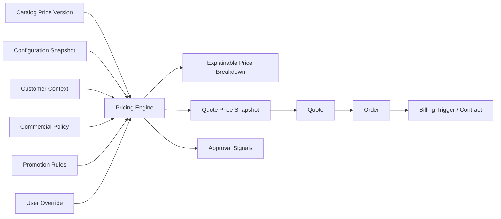
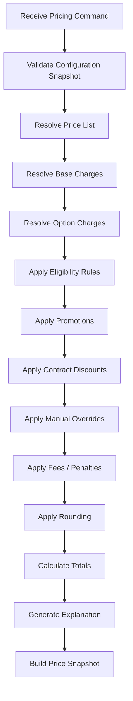
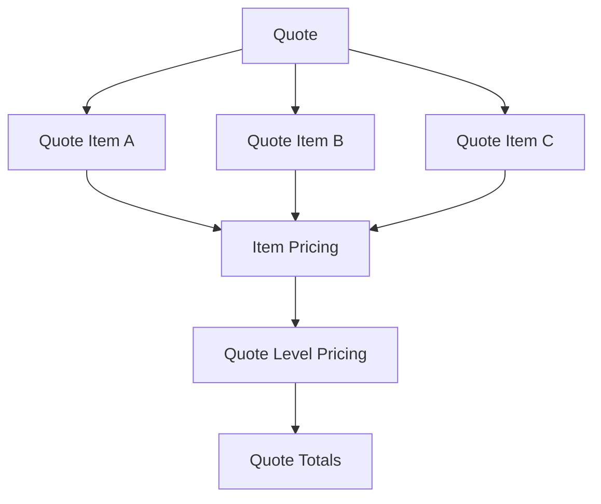
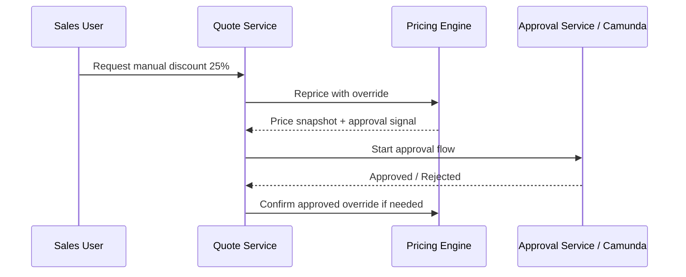

------
title: Build From Scratch: Enterprise Java Microservices CPQ & Order Management Platform - Part 008
description: Mendesain pricing domain model untuk enterprise CPQ: charge model, base price, recurring/one-time/usage charge, discount, promotion, override, tax placeholder, rounding, price snapshot, explainability, PostgreSQL schema, MyBatis mapper, API contract, dan failure model.
series: learn-enterprise-cpq-oms-glassfish-camunda8
seriesTitle: Build From Scratch: Enterprise Java Microservices CPQ & Order Management Platform
order: 8
partTitle: Pricing Domain Model
tags:
  - java
  - microservices
  - cpq
  - oms
  - pricing
  - quote
  - discount
  - promotion
  - postgresql
  - mybatis
  - redis
  - kafka
  - enterprise-architecture
date: 2026-07-02
---

# Part 008 — Pricing Domain Model

Di Part 007 kita membangun model **product configuration engine**.

Configuration engine menjawab:

> kombinasi produk ini valid atau tidak?

Pricing engine menjawab:

> kalau konfigurasi itu valid, berapa customer harus membayar, kenapa angka itu muncul, charge mana yang recurring, charge mana yang one-time, discount mana yang diterapkan, override mana yang butuh approval, dan snapshot apa yang harus dipertahankan sampai order/billing?

Ini salah satu bagian CPQ yang paling sering terlihat mudah tetapi menjadi sumber dispute.

Di sistem kecil, pricing terlihat seperti:

```java
price = basePrice - discount;
```

Di enterprise CPQ, pricing biasanya menjadi:

```text
effective price = catalog base price
                + option charges
                + one-time charges
                + recurring charges
                + usage charge definitions
                - eligibility-based discounts
                - negotiated discounts
                - promotional discounts
                + fees
                + penalties
                + tax placeholders
                + rounding adjustments
                + currency rules
                + approval-sensitive overrides
```

Dan setiap angka harus bisa dijelaskan.

Jika sales bertanya:

> Kenapa total monthly recurring charge customer ini 1.350.000, bukan 1.250.000?

Sistem harus bisa menjawab dengan breakdown, bukan dengan screenshot.

---

## 1. Target Part Ini

Part ini memaku pricing domain model.

Kita belum membangun semua implementasi pricing engine. Itu akan dilakukan lebih konkret pada Part 031.

Di sini kita menentukan:

1. apa yang disebut price;
2. apa bedanya price, charge, amount, discount, promotion, adjustment, tax, dan total;
3. apa input pricing engine;
4. apa output pricing engine;
5. bagaimana pricing rule direpresentasikan;
6. bagaimana price snapshot disimpan;
7. bagaimana price explainability dibuat;
8. bagaimana pricing terkait approval;
9. bagaimana pricing terkait quote/order/billing;
10. bagaimana failure mode-nya dikendalikan.

Mental model awal:



---

## 2. Pricing Is Not Billing

Pricing dan billing sering dicampur.

Pricing dalam CPQ menjawab:

- berapa harga yang ditawarkan;
- charge apa saja yang akan muncul;
- discount apa yang diberikan;
- apakah price butuh approval;
- apakah quote masih valid sampai tanggal tertentu;
- apa evidence komersial dari angka tersebut.

Billing menjawab:

- kapan invoice dibuat;
- period mana yang ditagih;
- proration seperti apa;
- tax final apa;
- payment status bagaimana;
- collection dan dunning bagaimana;
- credit note/debit note bagaimana.

CPQ pricing tidak boleh menjadi billing engine.

Namun CPQ harus menghasilkan price snapshot yang cukup baik agar billing downstream tahu commercial agreement-nya.

Kalau CPQ hanya mengirim total angka tanpa charge structure, billing akan menebak.

Jika billing menebak, dispute akan muncul.

---

## 3. Pricing Is Not Product Configuration

Configuration engine menentukan pilihan valid.

Pricing engine menghitung konsekuensi komersial dari pilihan itu.

Contoh:

```text
speed = 500_MBPS
routerType = PREMIUM_ROUTER
contractTerm = 24
staticIp = true
```

Configuration engine memastikan kombinasi ini valid.

Pricing engine menghitung:

```text
Internet 500 Mbps MRC: 1.000.000 / month
Premium router MRC: 150.000 / month
Static IP MRC: 100.000 / month
Installation OTC: 500.000 one time
24-month contract discount: -10% MRC
```

Jangan membuat configuration engine menghitung amount.

Jangan membuat pricing engine menentukan compatibility.

Keduanya boleh membaca data catalog yang sama, tetapi dengan tanggung jawab berbeda.

---

## 4. Core Pricing Vocabulary

Kita butuh vocabulary stabil.

### Price

Definisi komersial yang melekat pada offering, component, characteristic, option, action, atau policy.

Contoh:

- base monthly price for Internet 500 Mbps;
- one-time installation fee;
- router rental monthly charge;
- static IP monthly charge;
- early termination penalty;
- upgrade fee.

### Charge

Line item hasil pricing yang akan ditampilkan di quote dan mungkin dikirim ke billing.

Price adalah definisi.

Charge adalah hasil kalkulasi.

### Amount

Nilai monetary.

Harus membawa:

- currency;
- value;
- precision;
- rounding behavior jika relevan.

### Discount

Pengurangan harga.

Bisa berupa:

- percentage;
- fixed amount;
- recurring discount;
- one-time discount;
- duration-limited discount;
- volume discount;
- negotiated discount.

### Promotion

Paket policy komersial yang dapat menghasilkan discount, bonus, waiver, atau bundle behavior.

Promotion punya eligibility, lifecycle, dan budget/policy guard.

### Adjustment

Perubahan harga karena koreksi, manual override, fee, penalty, atau rounding.

### Override

Manual change terhadap price/discount yang biasanya butuh approval.

### Price Snapshot

Hasil pricing yang disimpan immutable pada quote/order.

---

## 5. Charge Type

Pricing domain harus membedakan charge type.

### One-Time Charge / OTC

Dibayar sekali.

Contoh:

- installation fee;
- activation fee;
- device purchase fee;
- migration fee.

### Recurring Charge / RC / MRC

Dibayar berkala.

Contoh:

- monthly internet subscription;
- monthly router rental;
- monthly static IP service.

### Usage Charge

Bergantung pada pemakaian.

CPQ biasanya tidak menghitung final usage invoice.

CPQ mendefinisikan rating plan atau usage price definition.

Contoh:

- per GB over quota;
- per minute international call;
- per API call;
- per SMS.

### Penalty Charge

Muncul karena policy.

Contoh:

- early termination charge;
- downgrade during lock-in;
- missed appointment fee.

### Credit / Waiver

Pengurangan atau penghapusan charge.

Contoh:

- installation fee waiver;
- first month free;
- migration credit.

---

## 6. Charge Frequency and Period

Recurring charge harus punya frequency.

Field penting:

| Field | Contoh |
|---|---|
| `chargeType` | `RECURRING` |
| `billingFrequency` | `MONTHLY` |
| `billingPeriod` | `P1M` |
| `duration` | `P12M` untuk promo 12 bulan |
| `startsAt` | activation date or contract start |
| `endsAt` | contract end or promo end |

Jangan hanya pakai label `monthlyPrice`.

Sistem enterprise perlu bisa mewakili:

- monthly recurring charge;
- annual recurring charge;
- recurring discount 6 bulan pertama;
- free trial 3 bulan;
- contract term 24 bulan;
- usage charge mulai setelah activation.

---

## 7. Pricing Input

Pricing engine tidak menerima raw selection.

Pricing engine menerima validated configuration snapshot.

Input minimal:

```json
{
  "tenantId": "tenant_001",
  "quoteId": "quote_123",
  "quoteItemId": "qitem_456",
  "pricingMode": "DRAFT",
  "configurationSnapshot": {
    "catalogVersionId": "catv_2026_07",
    "productOfferingId": "offering_business_fiber",
    "selection": {
      "speed": "500_MBPS",
      "routerType": "PREMIUM_ROUTER",
      "staticIp": true,
      "contractTerm": 24
    },
    "configurationHash": "sha256:..."
  },
  "customerContext": {
    "customerId": "cust_123",
    "segment": "BUSINESS",
    "accountTier": "GOLD"
  },
  "channelContext": {
    "channel": "SALES_PORTAL"
  },
  "commercialContext": {
    "currency": "IDR",
    "priceListId": "plist_sme_2026",
    "requestedContractTerm": 24
  },
  "overrides": []
}
```

Pricing mode:

| Mode | Makna |
|---|---|
| `DRAFT` | boleh return tentative price |
| `SUBMIT` | strict, must be approval-aware |
| `APPROVAL_REPRICE` | reprice after approval changes |
| `ORDER_CONVERSION` | compare with approved quote snapshot |
| `REVALIDATION` | detect stale price/catalog/promotion |

---

## 8. Pricing Output

Output pricing tidak boleh hanya total.

Output harus berupa price breakdown.

```json
{
  "status": "PRICED",
  "currency": "IDR",
  "totals": {
    "oneTimeTotal": { "amount": "500000", "currency": "IDR" },
    "monthlyRecurringTotal": { "amount": "1125000", "currency": "IDR" },
    "usageTotal": null
  },
  "charges": [
    {
      "chargeCode": "CHG-INTERNET-500-MRC",
      "name": "Business Fiber Internet 500 Mbps",
      "chargeType": "RECURRING",
      "frequency": "MONTHLY",
      "baseAmount": { "amount": "1000000", "currency": "IDR" },
      "adjustments": [],
      "finalAmount": { "amount": "1000000", "currency": "IDR" }
    },
    {
      "chargeCode": "CHG-ROUTER-PREMIUM-MRC",
      "name": "Premium Router Rental",
      "chargeType": "RECURRING",
      "frequency": "MONTHLY",
      "baseAmount": { "amount": "150000", "currency": "IDR" },
      "finalAmount": { "amount": "150000", "currency": "IDR" }
    },
    {
      "chargeCode": "DISC-CONTRACT-24M-10PCT",
      "name": "24 Month Contract Discount",
      "chargeType": "DISCOUNT",
      "appliesTo": ["CHG-INTERNET-500-MRC"],
      "finalAmount": { "amount": "-100000", "currency": "IDR" }
    }
  ],
  "approvalSignals": [],
  "priceHash": "sha256:..."
}
```

Breakdown adalah evidence.

Total adalah summary.

---

## 9. Pricing Pipeline

Pipeline pricing harus deterministic dan explainable.



Urutan penting.

Jika override diterapkan sebelum promotion, hasil bisa berbeda.

Jika rounding dilakukan di tiap line vs total, hasil bisa berbeda.

Jika discount stacking tidak jelas, sales bisa memberi discount berlebih.

Pricing engine harus punya **pricing policy order** yang eksplisit.

---

## 10. Price List Model

Price list adalah container komersial.

Contoh:

- `SME Standard Price List 2026`;
- `Enterprise Negotiated Price List`;
- `Partner Channel Price List`;
- `Region A Price List`.

Field penting:

| Field | Makna |
|---|---|
| `price_list_id` | ID price list |
| `code` | kode stabil |
| `currency` | currency utama |
| `market_segment` | customer segment |
| `channel` | channel berlaku |
| `region` | region berlaku |
| `effective_from` | awal berlaku |
| `effective_to` | akhir berlaku |
| `status` | draft/active/retired |
| `priority` | resolusi jika overlap |

Jangan menyimpan satu harga global di product offering.

Enterprise pricing hampir selalu bergantung pada market, channel, segment, currency, dan time validity.

---

## 11. Product Offering Price

Product offering price adalah price definition yang melekat pada offering atau component.

Field minimal:

```text
product_offering_price
- id
- price_list_id
- product_offering_id
- product_offering_version_id
- applies_to_path
- price_code
- charge_type
- frequency
- currency
- amount
- condition_json
- effective_from
- effective_to
- lifecycle_status
```

`applies_to_path` penting.

Contoh:

```text
$.offering
$.selection.speed[500_MBPS]
$.selection.routerType[PREMIUM_ROUTER]
$.selection.staticIp[true]
$.action[INSTALL]
$.action[DISCONNECT]
```

Ini membuat price bisa melekat pada:

- seluruh offering;
- option tertentu;
- component tertentu;
- action tertentu;
- quantity tertentu.

---

## 12. Amount Model

Jangan pakai `double` untuk uang.

Di Java, gunakan `BigDecimal`.

Amount object minimal:

```java
public record Money(
    BigDecimal amount,
    String currency
) {}
```

Tambahkan rules:

- scale sesuai currency;
- rounding mode explicit;
- no floating point;
- no implicit currency conversion;
- no adding different currencies.

Contoh invariant:

```text
Money(IDR, 100000) + Money(USD, 10) = invalid
```

Currency conversion adalah domain khusus.

Jangan diam-diam convert.

---

## 13. Base Charge Resolution

Base charge resolution menjawab:

> dari configuration snapshot ini, charge dasar apa yang berlaku?

Contoh:

```text
productOffering = Business Fiber
speed = 500_MBPS
routerType = PREMIUM_ROUTER
staticIp = true
```

Resolved charges:

```text
Internet base MRC 500 Mbps
Premium router MRC
Static IP MRC
Installation OTC
```

Pseudo-code:

```java
List<ChargeCandidate> candidates = priceRepository.findActivePrices(
    priceListId,
    catalogVersionId,
    productOfferingId,
    pricingDate
);

for (ChargeCandidate candidate : candidates) {
    if (conditionEvaluator.matches(candidate.condition(), pricingContext)) {
        charges.add(candidate.toChargeLine());
    }
}
```

`pricingDate` harus explicit.

Untuk quote draft, biasanya pricing date adalah quote created date atau requested pricing date.

Untuk conversion, gunakan approved quote snapshot kecuali policy mengharuskan reprice.

---

## 14. Discount Model

Discount harus dimodelkan sebagai first-class object.

Field penting:

| Field | Makna |
|---|---|
| `discount_code` | kode stabil |
| `discount_type` | percentage/fixed/waiver |
| `scope` | line/item/quote/bundle/account |
| `applies_to` | target charge |
| `eligibility_condition` | condition |
| `value` | amount atau percentage |
| `duration` | jika terbatas waktu |
| `stacking_group` | aturan stacking |
| `priority` | urutan apply |
| `approval_threshold` | batas approval |

Discount bukan sekadar negative price line.

Discount punya policy.

---

## 15. Promotion Model

Promotion adalah policy yang bisa menghasilkan satu atau lebih adjustment.

Contoh promotion:

```text
Promo: SME Fiber Launch 2026
Eligibility:
- customer segment = SME
- channel = SALES_PORTAL
- speed in [500_MBPS, 1_GBPS]
Benefit:
- waive installation fee
- 10% MRC discount for first 6 months
Constraint:
- cannot stack with negotiated discount above 15%
```

Promotion output:

```json
{
  "promotionCode": "PROMO-SME-FIBER-2026",
  "benefits": [
    {
      "type": "WAIVE_CHARGE",
      "targetChargeCode": "CHG-INSTALLATION-OTC"
    },
    {
      "type": "PERCENT_DISCOUNT",
      "targetChargeType": "RECURRING",
      "percentage": "10",
      "duration": "P6M"
    }
  ]
}
```

Promotion harus punya lifecycle dan effective date.

Quote lama harus menyimpan promotion snapshot.

Jangan hanya menyimpan `promotionId`.

Kalau promotion berubah, quote lama harus tetap explainable.

---

## 16. Discount Stacking

Discount stacking adalah sumber bug dan revenue leakage.

Contoh:

- contract term discount 10%;
- loyalty discount 5%;
- manual discount 20%;
- promo discount 10%.

Apakah total discount 45%?

Atau sequential?

Atau capped at 25%?

Atau promo tidak boleh stack dengan manual discount?

Kita harus model stacking.

Field:

```text
stacking_group
stacking_policy
priority
max_total_discount_percentage
exclusive_with
```

Policy contoh:

| Policy | Makna |
|---|---|
| `STACKABLE` | boleh digabung |
| `EXCLUSIVE` | hanya satu dari group |
| `BEST_OF` | ambil benefit terbesar |
| `SEQUENTIAL` | apply berurutan |
| `CAP_TOTAL` | total discount dibatasi |

Tanpa stacking policy, pricing engine akan menjadi tempat debat bisnis setiap minggu.

---

## 17. Manual Override

Manual override adalah perubahan harga oleh user.

Jenis override:

- override base amount;
- override discount percentage;
- waive fee;
- add custom charge;
- apply negotiated price;
- extend promo duration.

Manual override harus selalu membawa reason.

```json
{
  "overrideType": "DISCOUNT_PERCENTAGE",
  "targetChargeCode": "CHG-INTERNET-500-MRC",
  "requestedValue": "20",
  "reasonCode": "COMPETITIVE_MATCH",
  "comment": "Customer has competing offer from provider X.",
  "requestedBy": "sales_123"
}
```

Override harus menghasilkan approval signal jika melewati threshold.

Contoh policy:

```text
discount <= 10%: no approval
10% < discount <= 20%: sales manager approval
20% < discount <= 35%: finance approval
> 35%: commercial director approval
```

Pricing engine tidak menjalankan approval workflow.

Pricing engine menghasilkan signal:

```json
{
  "approvalRequired": true,
  "approvalReasons": [
    {
      "code": "APPROVAL_DISCOUNT_THRESHOLD_EXCEEDED",
      "threshold": "10",
      "actual": "20",
      "approvalLevel": "SALES_MANAGER"
    }
  ]
}
```

Camunda approval flow akan memakai signal ini pada part berikutnya.

---

## 18. Price Explanation

Price explanation harus menjawab:

- dari mana charge ini berasal;
- condition apa yang membuatnya berlaku;
- discount apa yang diterapkan;
- promotion apa yang digunakan;
- override apa yang mengubahnya;
- rounding apa yang dilakukan;
- approval apa yang diperlukan.

Contoh explanation line:

```json
{
  "chargeCode": "CHG-INTERNET-500-MRC",
  "source": {
    "priceListCode": "SME_STANDARD_2026",
    "priceCode": "PRICE-FIBER-500-MRC",
    "catalogVersionId": "catv_2026_07"
  },
  "matchedBecause": [
    {
      "path": "$.configuration.selection.speed",
      "operator": "eq",
      "expected": "500_MBPS",
      "actual": "500_MBPS"
    }
  ],
  "adjustments": [
    {
      "type": "PERCENT_DISCOUNT",
      "code": "DISC-CONTRACT-24M",
      "amount": "-100000",
      "reason": "24 month contract term"
    }
  ]
}
```

Price without explanation is not enterprise-grade.

---

## 19. Price Snapshot

Price snapshot adalah hasil pricing yang immutable.

Minimal:

```json
{
  "priceSnapshotId": "psnap_123",
  "quoteItemId": "qitem_456",
  "configurationSnapshotId": "cfgsnap_789",
  "pricingEngineVersion": "pricing-engine-1.0.0",
  "priceListSnapshot": {
    "priceListId": "plist_sme_2026",
    "code": "SME_STANDARD_2026",
    "version": 4
  },
  "currency": "IDR",
  "charges": [],
  "totals": {},
  "approvalSignals": [],
  "pricingDate": "2026-07-02",
  "validUntil": "2026-08-01",
  "priceHash": "sha256:..."
}
```

Snapshot harus menyimpan cukup data untuk:

- menampilkan quote lama;
- menjelaskan harga lama;
- membandingkan quote revision;
- mengirim order downstream;
- menghindari repricing tidak sengaja;
- audit approval.

Jangan hanya menyimpan `priceListId` dan total.

---

## 20. Price Hash

Price hash membantu mendeteksi perubahan material.

Input hash:

```text
configurationHash
priceListVersion
pricingRulesVersion
promotionVersion
overrideRequest
pricingDate
currency
```

Jangan memasukkan generated ID atau timestamp volatile.

Price hash dipakai untuk:

- idempotency;
- detect stale quote;
- compare revision;
- approval evidence;
- avoid duplicate recalculation;
- cache result.

---

## 21. Rounding Model

Rounding harus explicit.

Pertanyaan yang harus dijawab:

- rounding per line atau total?
- rounding sebelum atau sesudah discount?
- rounding untuk tax placeholder bagaimana?
- currency precision apa?
- percentage discount dibulatkan bagaimana?

Contoh policy:

```text
- calculate base line amount with BigDecimal scale 6
- apply percentage discounts with scale 6
- round each final charge line to currency minor unit
- calculate total from rounded line amounts
- use HALF_UP for commercial quote display
```

Policy ini harus versioned.

Jika rounding policy berubah, quote lama tetap harus explainable.

---

## 22. Tax Placeholder

Dalam banyak enterprise system, CPQ tidak menghitung tax final.

Tetapi CPQ perlu menampilkan tax estimate atau tax placeholder.

Kita bisa model:

| Field | Makna |
|---|---|
| `taxMode` | `NONE`, `ESTIMATED`, `EXTERNAL`, `DEFERRED_TO_BILLING` |
| `taxCategory` | kategori pajak |
| `taxIncluded` | apakah price include tax |
| `taxAmount` | estimated tax jika tersedia |
| `taxExplanation` | sumber tax estimate |

Jangan mencampur tax estimate dengan final billing tax.

Label harus jelas.

---

## 23. Quote-Level vs Item-Level Pricing

Beberapa price dihitung per item.

Beberapa price dihitung pada quote level.

Item-level:

- internet monthly charge;
- router rental;
- installation fee per site.

Quote-level:

- bundle discount;
- volume discount;
- account-level negotiated discount;
- shipping fee;
- minimum commitment.

Pricing engine harus mendukung keduanya.



Bundle discount tidak bisa dihitung hanya dari satu item.

Itu butuh quote-level context.

---

## 24. Bundle Pricing

Bundle pricing adalah pricing yang bergantung pada kombinasi produk.

Contoh:

```text
Internet + TV + Mobile = 15% discount on Internet MRC
```

Rule:

```json
{
  "ruleCode": "BUNDLE-TRIPLE-PLAY-001",
  "scope": "QUOTE",
  "condition": {
    "all": [
      { "path": "$.quote.items[*].productFamily", "op": "contains", "value": "INTERNET" },
      { "path": "$.quote.items[*].productFamily", "op": "contains", "value": "TV" },
      { "path": "$.quote.items[*].productFamily", "op": "contains", "value": "MOBILE" }
    ]
  },
  "benefit": {
    "type": "PERCENT_DISCOUNT",
    "target": "INTERNET_RECURRING_CHARGES",
    "percentage": "15"
  }
}
```

Bundle pricing membuat urutan pipeline penting:

1. price each item;
2. aggregate quote context;
3. evaluate bundle rules;
4. apply quote-level adjustments;
5. recalculate totals.

---

## 25. Quantity and Tiered Pricing

Quantity pricing sering muncul.

Contoh:

```text
Static IP:
1-4 IP: 100.000 per IP / month
5-16 IP: 80.000 per IP / month
17+ IP: 60.000 per IP / month
```

Ada dua model:

### Volume Pricing

Semua unit memakai tier berdasarkan total quantity.

```text
10 IP x 80.000 = 800.000
```

### Graduated Pricing

Setiap tier dihitung terpisah.

```text
4 IP x 100.000 + 6 IP x 80.000 = 880.000
```

Field penting:

```text
tier_model = VOLUME | GRADUATED
tier_from
tier_to
unit_price
```

Jangan implement tiered pricing dengan `if quantity > 5` tersebar.

---

## 26. Usage Pricing

Usage pricing tidak selalu menghasilkan amount final di CPQ.

CPQ bisa menghasilkan usage price definition:

```json
{
  "chargeType": "USAGE",
  "usageType": "DATA_OVERAGE",
  "unitOfMeasure": "GB",
  "unitPrice": { "amount": "10000", "currency": "IDR" },
  "includedQuantity": 100,
  "ratingPlanCode": "DATA_OVERAGE_STANDARD"
}
```

Billing/rating engine menghitung invoice aktual berdasarkan usage.

CPQ hanya memastikan customer menyetujui usage rate.

---

## 27. Action-Based Pricing

Order action memengaruhi harga.

ADD:

- activation fee;
- installation fee;
- new subscription MRC.

MODIFY:

- upgrade fee;
- downgrade penalty;
- changed recurring charge;
- prorated charge may be billing concern.

DISCONNECT:

- early termination charge;
- device return fee;
- final settlement placeholder.

MOVE:

- relocation fee;
- reinstallation fee.

Pricing input harus membawa action.

```json
{
  "orderAction": "MODIFY",
  "currentAssetSnapshot": {
    "speed": "300_MBPS",
    "contractRemainingMonths": 10
  },
  "targetConfiguration": {
    "speed": "100_MBPS"
  }
}
```

---

## 28. Approval-Sensitive Pricing

Pricing dan approval sangat terkait.

Price mutation yang perlu approval:

- discount override;
- fee waiver;
- non-standard price;
- margin below threshold;
- contract term exception;
- promo exception;
- price lock extension;
- expired price acceptance.

Pricing engine menghasilkan approval signal.

Approval engine menentukan workflow.

Jangan membuat pricing engine menunggu approval task.

Boundary:



---

## 29. PostgreSQL Schema Draft

Core tables:

```sql
create table price_list (
    id uuid primary key,
    tenant_id uuid not null,
    code varchar(100) not null,
    name varchar(255) not null,
    currency char(3) not null,
    market_segment varchar(80),
    channel varchar(80),
    region varchar(80),
    version int not null,
    status varchar(40) not null,
    effective_from timestamptz not null,
    effective_to timestamptz,
    created_at timestamptz not null,
    unique (tenant_id, code, version)
);

create table product_offering_price (
    id uuid primary key,
    tenant_id uuid not null,
    price_list_id uuid not null references price_list(id),
    catalog_version_id uuid not null,
    product_offering_id uuid not null,
    price_code varchar(120) not null,
    name varchar(255) not null,
    applies_to_path varchar(500) not null,
    charge_type varchar(50) not null,
    frequency varchar(50),
    currency char(3) not null,
    amount numeric(19, 6) not null,
    condition_json jsonb not null,
    priority int not null default 100,
    effective_from timestamptz not null,
    effective_to timestamptz,
    status varchar(40) not null,
    created_at timestamptz not null,
    unique (tenant_id, price_list_id, price_code)
);

create table discount_policy (
    id uuid primary key,
    tenant_id uuid not null,
    price_list_id uuid not null references price_list(id),
    discount_code varchar(120) not null,
    name varchar(255) not null,
    discount_type varchar(50) not null,
    scope varchar(50) not null,
    value numeric(19, 6) not null,
    condition_json jsonb not null,
    stacking_group varchar(120),
    stacking_policy varchar(50),
    priority int not null default 100,
    approval_threshold_json jsonb not null default '{}'::jsonb,
    effective_from timestamptz not null,
    effective_to timestamptz,
    status varchar(40) not null,
    created_at timestamptz not null,
    unique (tenant_id, price_list_id, discount_code)
);
```

Snapshot tables:

```sql
create table quote_item_price_snapshot (
    id uuid primary key,
    tenant_id uuid not null,
    quote_id uuid not null,
    quote_item_id uuid not null,
    configuration_snapshot_id uuid not null,
    price_list_id uuid not null,
    pricing_engine_version varchar(80) not null,
    pricing_date date not null,
    valid_until date,
    currency char(3) not null,
    status varchar(40) not null,
    totals_json jsonb not null,
    charges_json jsonb not null,
    approval_signals_json jsonb not null,
    explanation_json jsonb not null,
    price_hash varchar(120) not null,
    created_at timestamptz not null
);

create index idx_quote_item_price_snapshot_quote_item
    on quote_item_price_snapshot(quote_item_id);

create index idx_quote_item_price_snapshot_hash
    on quote_item_price_snapshot(price_hash);
```

Kenapa `charges_json` boleh JSONB?

Karena price snapshot adalah immutable document.

Untuk reporting, buat projection table.

Jangan memaksa semua breakdown historical menjadi 20 table kalau query utama hanya quote rendering dan audit.

Namun untuk active price definition, gunakan relational table agar governance, query, dan validation lebih kuat.

---

## 30. MyBatis Mapper Direction

Mapper harus explicit.

```java
public interface PricingMapper {
    PriceListRecord findApplicablePriceList(
        @Param("tenantId") UUID tenantId,
        @Param("segment") String segment,
        @Param("channel") String channel,
        @Param("region") String region,
        @Param("currency") String currency,
        @Param("pricingAt") Instant pricingAt
    );

    List<ProductOfferingPriceRecord> findActiveOfferingPrices(
        @Param("tenantId") UUID tenantId,
        @Param("priceListId") UUID priceListId,
        @Param("catalogVersionId") UUID catalogVersionId,
        @Param("productOfferingId") UUID productOfferingId,
        @Param("pricingAt") Instant pricingAt
    );

    List<DiscountPolicyRecord> findActiveDiscountPolicies(
        @Param("tenantId") UUID tenantId,
        @Param("priceListId") UUID priceListId,
        @Param("pricingAt") Instant pricingAt
    );

    void insertQuoteItemPriceSnapshot(QuoteItemPriceSnapshotRecord record);
}
```

Jangan membuat query pricing implicit.

Saat debugging harga, engineer harus bisa menjawab:

- price list mana yang dipilih;
- price rows mana yang match;
- discount rows mana yang match;
- condition mana yang true;
- amount mana yang dihasilkan.

---

## 31. API Contract Draft

Endpoint item pricing:

```http
POST /v1/quotes/{quoteId}/items/{quoteItemId}/pricing:evaluate
```

Request:

```json
{
  "mode": "DRAFT",
  "configurationSnapshotId": "cfgsnap_789",
  "commercialContext": {
    "currency": "IDR",
    "priceListCode": "SME_STANDARD_2026"
  },
  "overrides": [
    {
      "overrideType": "DISCOUNT_PERCENTAGE",
      "targetChargeCode": "CHG-INTERNET-500-MRC",
      "requestedValue": "15",
      "reasonCode": "RETENTION_OFFER"
    }
  ]
}
```

Response:

```json
{
  "status": "PRICED_REQUIRES_APPROVAL",
  "priceSnapshotId": "psnap_123",
  "currency": "IDR",
  "totals": {
    "oneTimeTotal": "500000",
    "monthlyRecurringTotal": "1075000"
  },
  "approvalSignals": [
    {
      "code": "APPROVAL_DISCOUNT_THRESHOLD_EXCEEDED",
      "approvalLevel": "SALES_MANAGER"
    }
  ],
  "priceHash": "sha256:..."
}
```

Endpoint quote-level pricing:

```http
POST /v1/quotes/{quoteId}/pricing:evaluate
```

Ini diperlukan untuk bundle, volume, quote-level discount, dan total.

---

## 32. Redis Cache Boundary

Cache candidate:

- active price list resolution;
- product offering price rows;
- parsed pricing conditions;
- discount policies;
- promotion rules;
- deterministic price result by price hash.

Key contoh:

```text
price:list:{tenant}:{segment}:{channel}:{region}:{currency}:{pricingDate}
price:offering:{tenant}:{priceListId}:{catalogVersionId}:{offeringId}:{version}
price:result:{tenant}:{priceHash}
```

Cache warning:

- price changes are high-risk;
- stale cache can cause revenue leakage;
- submit/order conversion should validate version;
- price cache key must include all material inputs;
- use event-based invalidation after price list publish.

---

## 33. Kafka Events

Event pricing harus diterbitkan untuk persisted material changes.

Candidate events:

- `QuoteItemPriced`;
- `QuoteRepriced`;
- `QuotePriceInvalidated`;
- `PriceListPublished`;
- `PromotionPublished`;
- `ManualPriceOverrideRequested`;
- `ManualPriceOverrideApproved`;
- `ManualPriceOverrideRejected`.

Contoh event:

```json
{
  "eventType": "QuoteItemPriced",
  "eventVersion": 1,
  "quoteId": "quote_123",
  "quoteItemId": "qitem_456",
  "priceSnapshotId": "psnap_123",
  "configurationSnapshotId": "cfgsnap_789",
  "priceHash": "sha256:...",
  "status": "PRICED_REQUIRES_APPROVAL",
  "occurredAt": "2026-07-02T00:00:00Z"
}
```

Gunakan outbox pattern.

Jangan publish pricing event sebelum snapshot committed.

---

## 34. Failure Modes

### Failure 1 — Price List Overlap

Dua price list sama-sama applicable.

Solusi:

- priority eksplisit;
- uniqueness constraint untuk active overlapping jika memungkinkan;
- publish-time validation;
- explanation mencatat price list yang dipilih.

### Failure 2 — Expired Promotion Still Used

Quote lama memakai promotion yang sudah expired.

Solusi:

- quote snapshot menyimpan promotion snapshot;
- submit policy mengecek validUntil;
- conversion policy menentukan apakah expired quote harus reprice.

### Failure 3 — Manual Override Without Approval

Sales memberi discount besar dan quote dikirim tanpa approval.

Solusi:

- pricing engine menghasilkan approval signal;
- quote submission memblokir jika unresolved approval;
- audit trail override mandatory;
- state machine mencegah accept sebelum approval complete.

### Failure 4 — Currency Mismatch

Charge IDR dan USD dijumlahkan.

Solusi:

- Money invariant;
- reject mixed currency unless explicit conversion policy;
- conversion rate snapshot jika conversion diizinkan.

### Failure 5 — Rounding Dispute

Customer melihat total berbeda dari invoice estimate.

Solusi:

- rounding policy versioned;
- line-level explanation;
- billing integration contract jelas;
- tax final/deferred label jelas.

### Failure 6 — Repricing Changes Accepted Quote

Quote sudah approved, lalu repricing otomatis mengubah total.

Solusi:

- approved price snapshot immutable;
- reprice harus explicit command;
- change triggers approval reset if material;
- order conversion compares approved snapshot.

---

## 35. Testing Strategy

Pricing engine wajib diuji lebih serius daripada CRUD.

### Unit Tests

- Money arithmetic;
- condition matching;
- charge resolution;
- discount calculation;
- stacking policy;
- rounding policy;
- override threshold;
- price hash stability.

### Golden Master Tests

Untuk pricing, golden master sangat berguna.

Input fixture:

```yaml
case: business-fiber-500-with-24m-discount
configuration:
  speed: 500_MBPS
  routerType: PREMIUM_ROUTER
  staticIp: true
  contractTerm: 24
expect:
  monthlyRecurringTotal: 1125000
  oneTimeTotal: 500000
  charges:
    - CHG-INTERNET-500-MRC
    - CHG-ROUTER-PREMIUM-MRC
    - CHG-STATIC-IP-MRC
    - DISC-CONTRACT-24M
```

### Approval Tests

- discount below threshold: no approval;
- discount above manager threshold: manager approval;
- discount above finance threshold: finance approval;
- fee waiver requires approval;
- rejected approval invalidates override.

### Regression Tests

Before publishing price list:

- compare selected benchmark quotes;
- detect unexpected total changes;
- detect missing charge;
- detect duplicate charge;
- detect promotion stacking violation.

### Contract Tests

OpenAPI response and JSON Schema validation.

### Property-Like Tests

Useful invariants:

```text
total = sum(final charge lines grouped by charge type)
no discount applies to non-existing charge
no negative recurring total unless credit product allowed
same input produces same price hash
approved quote snapshot cannot be mutated
```

---

## 36. Java Object Model Draft

Pricing command:

```java
public record PricingCommand(
    UUID tenantId,
    UUID quoteId,
    UUID quoteItemId,
    PricingMode mode,
    ConfigurationSnapshot configurationSnapshot,
    CustomerContext customerContext,
    ChannelContext channelContext,
    CommercialContext commercialContext,
    List<PriceOverrideRequest> overrides
) {}
```

Money:

```java
public record Money(BigDecimal amount, String currency) {
    public Money add(Money other) {
        if (!currency.equals(other.currency)) {
            throw new IllegalArgumentException("Currency mismatch");
        }
        return new Money(amount.add(other.amount), currency);
    }
}
```

Charge line:

```java
public record ChargeLine(
    String chargeCode,
    String name,
    ChargeType chargeType,
    BillingFrequency frequency,
    Money baseAmount,
    List<PriceAdjustment> adjustments,
    Money finalAmount,
    PriceSource source
) {}
```

Pricing result:

```java
public record PricingResult(
    PricingStatus status,
    String currency,
    List<ChargeLine> charges,
    PriceTotals totals,
    List<ApprovalSignal> approvalSignals,
    PriceExplanation explanation,
    String priceHash
) {}
```

Engine interface:

```java
public interface PricingEngine {
    PricingResult price(PricingCommand command);
}
```

---

## 37. Example Walkthrough

Input configuration:

```json
{
  "speed": "500_MBPS",
  "routerType": "PREMIUM_ROUTER",
  "staticIp": true,
  "contractTerm": 24
}
```

Catalog price:

```text
Internet 500 Mbps MRC: 1.000.000
Premium Router MRC: 150.000
Static IP MRC: 100.000
Installation OTC: 500.000
24 Month Contract Discount: 10% of Internet MRC
```

Evaluation:

1. Resolve price list `SME_STANDARD_2026`.
2. Match base internet charge because speed=500 Mbps.
3. Match router charge because routerType=PREMIUM_ROUTER.
4. Match static IP charge because staticIp=true.
5. Match installation charge because action=ADD.
6. Apply 10% contract discount on internet MRC.
7. Calculate total recurring:

```text
1.000.000 + 150.000 + 100.000 - 100.000 = 1.150.000
```

8. Calculate one-time:

```text
500.000
```

Output:

```json
{
  "monthlyRecurringTotal": "1150000",
  "oneTimeTotal": "500000",
  "approvalSignals": [],
  "status": "PRICED"
}
```

Now add manual discount 20% on internet charge.

Policy says discount above 10% needs manager approval.

Output status becomes:

```text
PRICED_REQUIRES_APPROVAL
```

The quote can be saved, but cannot be accepted until approval is complete.

---

## 38. What Not To Build Yet

Jangan langsung membangun pricing engine yang mencoba melakukan semua hal:

- billing proration;
- invoice tax final;
- payment schedule;
- revenue recognition;
- commission;
- accounting journal;
- dynamic market optimization;
- AI price recommendation.

Itu domain lain.

CPQ pricing harus kuat di:

- quote price;
- explainability;
- discount/promotion;
- override approval;
- snapshot;
- downstream commercial contract.

Build the core first.

---

## 39. Implementation Milestone

### Milestone 1 — Money and Charge Model

- Money object;
- charge line;
- totals;
- no floating point;
- currency invariant.

### Milestone 2 — Price List and Base Charge

- price list resolution;
- product offering price table;
- condition matching;
- base charge output.

### Milestone 3 — Discount and Promotion

- discount policy;
- promotion benefit;
- stacking group;
- priority.

### Milestone 4 — Override and Approval Signal

- override request;
- threshold evaluation;
- approval signal output.

### Milestone 5 — Snapshot and Hash

- persist price snapshot;
- calculate price hash;
- connect to quote item.

### Milestone 6 — Regression and Governance

- golden master tests;
- price list publish validation;
- impact analysis.

---

## 40. Checklist Desain

Sebelum lanjut, pricing model kita harus menjawab:

- Apakah price berbeda dari charge?
- Apakah Money tidak memakai floating point?
- Apakah currency invariant dijaga?
- Apakah recurring, one-time, usage, penalty, dan credit dibedakan?
- Apakah price list versioned?
- Apakah promotion snapshot disimpan?
- Apakah discount stacking eksplisit?
- Apakah manual override wajib punya reason?
- Apakah approval signal dihasilkan oleh pricing engine?
- Apakah price snapshot immutable?
- Apakah price hash deterministic?
- Apakah quote/order conversion tidak reprice diam-diam?
- Apakah explanation bisa menjawab asal setiap angka?
- Apakah rounding policy explicit?
- Apakah billing boundary jelas?

Kalau belum, jangan lanjut ke quote lifecycle.

Quote lifecycle tanpa pricing model yang kuat akan terlihat rapi di state diagram, tetapi rapuh di operasi nyata.

---

## 41. Penutup

Part ini membangun pricing domain model sebagai komponen enterprise CPQ yang:

- deterministic;
- explainable;
- versioned;
- approval-aware;
- snapshot-aware;
- safe for quote/order conversion;
- tidak mencampur billing;
- tidak mencampur configuration.

Alur besar sekarang menjadi:

```text
Product Catalog
    -> Configuration Engine
        -> Configuration Snapshot
            -> Pricing Engine
                -> Price Snapshot
                    -> Quote Lifecycle
                        -> Approval
                            -> Order Conversion
```

Di part berikutnya, kita akan membahas **Quote Domain Model**.

Di sana kita akan mengikat configuration snapshot dan price snapshot ke quote aggregate, quote item, revision, validity, acceptance, expiry, approval state, dan conversion boundary.
