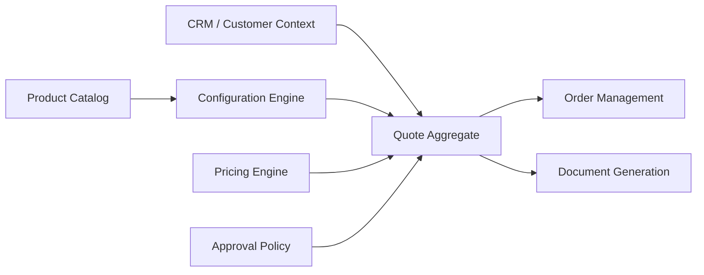
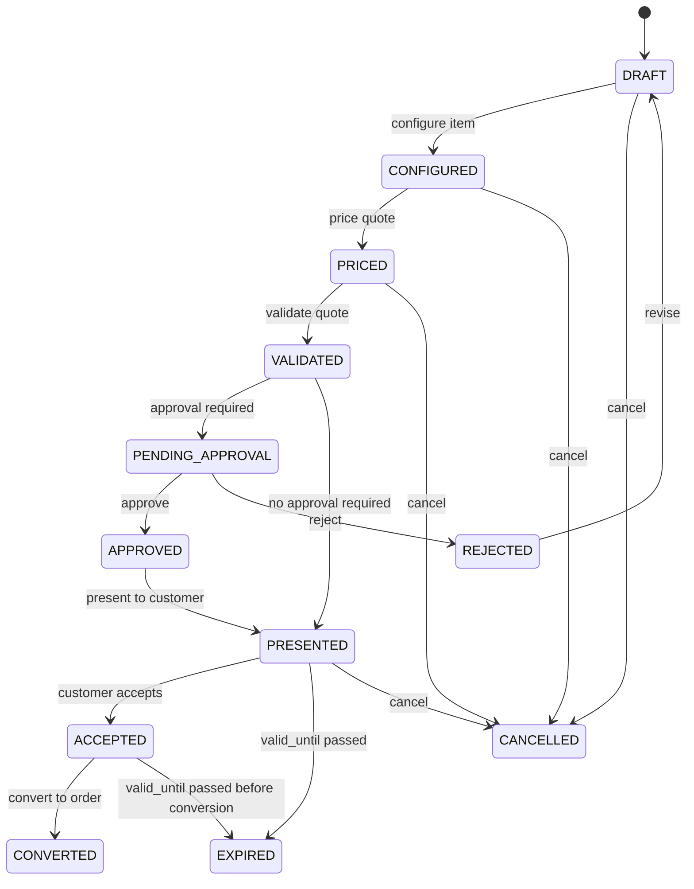
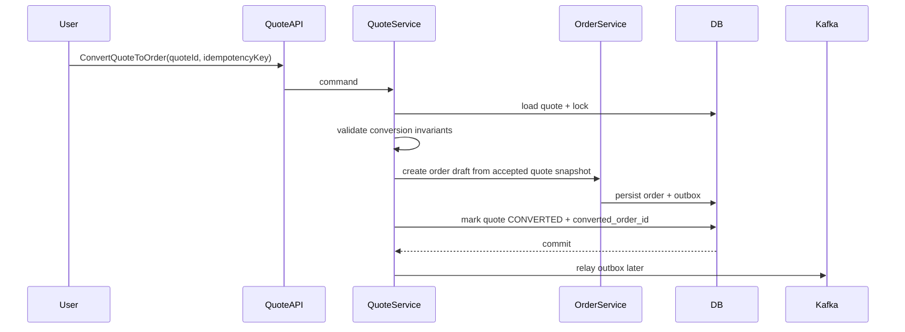

------
title: Build From Scratch: Enterprise Java Microservices CPQ & Order Management Platform - Part 009
description: Mendesain quote domain model untuk enterprise CPQ: quote aggregate, quote item, configuration snapshot, price snapshot, customer context, validity, approval, revision, concurrency, idempotency, audit, PostgreSQL schema, MyBatis mapper, API contract, dan conversion boundary menuju order.
series: learn-enterprise-cpq-oms-glassfish-camunda8
seriesTitle: Build From Scratch: Enterprise Java Microservices CPQ & Order Management Platform
order: 9
partTitle: Quote Domain Model
tags:
  - java
  - microservices
  - cpq
  - quote
  - pricing
  - approval
  - domain-modeling
  - postgresql
  - mybatis
  - kafka
  - redis
  - enterprise-architecture
date: 2026-07-02
---

# Part 009 — Quote Domain Model

Di Part 007 kita memodelkan **configuration engine**.

Di Part 008 kita memodelkan **pricing engine**.

Sekarang kita masuk ke objek transaksi CPQ pertama yang benar-benar dipakai user bisnis:

> Quote.

Di sistem kecil, quote sering dianggap sebagai dokumen PDF yang berisi daftar produk dan harga.

Di enterprise CPQ, quote bukan sekadar PDF.

Quote adalah **commercial promise**.

Quote menyimpan:

- apa yang ditawarkan;
- kepada siapa ditawarkan;
- konfigurasi produk yang disetujui;
- harga yang dihitung atau dinegosiasikan;
- masa berlaku;
- approval evidence;
- revision history;
- alasan perubahan;
- snapshot dari catalog, pricing, dan customer context pada saat quote dibuat;
- kondisi yang menentukan apakah quote boleh dikonversi menjadi order.

Quote adalah jembatan antara **intent sales** dan **commitment order**.

Kalau quote model salah, order model akan dipaksa menanggung kekacauan yang seharusnya diselesaikan sebelum order dibuat.

---

## 1. Target Part Ini

Part ini memaku **quote domain model**.

Kita belum membangun full quote API, quote service, approval workflow, dan quote-to-order conversion. Itu akan muncul bertahap pada part berikutnya.

Di sini kita menentukan:

1. quote itu apa dan bukan apa;
2. aggregate boundary quote;
3. quote header dan quote item;
4. configuration snapshot;
5. price snapshot;
6. customer context snapshot;
7. quote lifecycle;
8. quote revision;
9. approval-sensitive mutation;
10. validity dan expiration;
11. invariant yang harus dijaga;
12. command/event model;
13. PostgreSQL schema awal;
14. MyBatis loading strategy;
15. API shape awal;
16. boundary quote-to-order.

Sasarannya bukan membuat model yang paling fleksibel secara teoretis.

Sasarannya adalah membuat model yang:

- cukup eksplisit untuk enterprise;
- cukup defensible untuk audit;
- cukup stabil untuk long-running sales cycle;
- cukup kuat untuk quote revision;
- cukup aman untuk order conversion;
- cukup observable ketika terjadi dispute.

---

## 2. Quote Bukan Cart, Bukan Order, Bukan Invoice

Sebelum membuat tabel dan class, kita harus memaku boundary.

### 2.1 Quote vs Cart

Cart biasanya bersifat ringan, sementara, dan interaktif.

Cart menjawab:

> user sedang memilih apa?

Quote menjawab:

> organisasi kita siap menawarkan apa, dengan harga berapa, kepada customer mana, sampai kapan, dengan approval apa?

Cart dapat berubah cepat.

Quote harus punya jejak perubahan.

Cart boleh ephemeral.

Quote harus persistent.

Cart boleh mostly user-experience object.

Quote adalah commercial record.

### 2.2 Quote vs Order

Quote adalah offer.

Order adalah execution commitment.

Quote boleh direvisi sebelum diterima.

Order tidak boleh sembarang direvisi; perubahan order biasanya harus melalui amendment, cancellation, supplemental order, atau compensating process.

Quote dapat mengandung opsi yang belum dieksekusi.

Order harus bisa diterjemahkan menjadi fulfillment plan.

Quote berfokus pada:

- commercial validity;
- price correctness;
- approval;
- customer acceptance.

Order berfokus pada:

- execution;
- decomposition;
- fulfillment;
- status;
- fallout;
- completion.

### 2.3 Quote vs Invoice

Quote bukan tagihan.

Quote menyimpan expected commercial terms.

Invoice menyimpan billing actuals.

Quote bisa memiliki charge plan, recurring charge, discount, atau tax placeholder, tetapi bukan authority final untuk invoice.

Billing system tetap menjadi owner invoice, tax finalization, payment status, billing account balance, dunning, dan revenue posting.

---

## 3. Mental Model: Quote Sebagai Frozen Commercial Intent

Quote berada di tengah-tengah sistem:



Quote bukan owner catalog.

Quote bukan owner customer master.

Quote bukan owner pricing rule.

Tetapi quote harus menyimpan snapshot yang cukup agar keputusan lama masih bisa dijelaskan walaupun catalog, customer, atau price rule berubah.

Prinsipnya:

> Quote references live master data for lookup, but persists commercial snapshots for evidence.

Contoh:

Saat quote dibuat tanggal 2 Juli 2026, product offering `Fiber Business 1Gbps` punya harga Rp1.500.000/bulan.

Tanggal 10 Juli 2026 catalog berubah menjadi Rp1.700.000/bulan.

Kalau quote masih valid sampai 31 Juli 2026, sistem tidak boleh tiba-tiba mengubah harga existing quote tanpa explicit reprice command.

Quote harus tahu:

- product offering id;
- product offering version;
- display name saat quote dibuat;
- price list version;
- base price saat quote dibuat;
- discount yang diterapkan;
- total akhir;
- calculation explanation.

Tanpa snapshot, dispute tidak bisa diselesaikan.

---

## 4. Quote Aggregate Boundary

Quote aggregate adalah transactional boundary untuk perubahan quote.

Satu command yang mengubah quote harus menjaga quote tetap valid secara internal.

Aggregate awal:

```text
Quote
├── QuoteHeader
├── QuoteItem[]
│   ├── ProductSelection
│   ├── ConfigurationSnapshot
│   ├── PriceSnapshot
│   ├── EligibilitySnapshot
│   └── ItemState
├── QuotePriceSummary
├── CustomerContextSnapshot
├── ApprovalState
├── QuoteValidity
├── RevisionInfo
├── AuditMetadata
└── ConversionGuard
```

### 4.1 Apa yang Masuk Aggregate

Masuk ke quote aggregate:

- quote id;
- quote number;
- quote state;
- quote version;
- customer/account references;
- customer context snapshot;
- quote item;
- selected product offering;
- configuration snapshot;
- price snapshot;
- quote-level discount/adjustment;
- approval state summary;
- validity dates;
- revision number;
- conversion status;
- audit metadata.

### 4.2 Apa yang Tidak Masuk Aggregate

Tidak masuk ke quote aggregate:

- full customer master record;
- full product catalog;
- full pricing rule catalog;
- billing account ledger;
- payment status;
- inventory availability actual;
- fulfillment task state;
- process engine internal state;
- PDF binary content.

Quote boleh menyimpan reference atau snapshot ringkas, tetapi tidak boleh mengambil ownership data lain.

---

## 5. Quote Header

Quote header adalah identitas dan state quote secara keseluruhan.

Contoh field:

```text
quote_id
quote_number
customer_id
account_id
opportunity_id
sales_channel
sales_owner_user_id
currency
state
revision
valid_from
valid_until
accepted_at
converted_order_id
created_at
created_by
updated_at
updated_by
version
```

### 5.1 Quote ID vs Quote Number

Gunakan dua identifier:

1. `quote_id` sebagai immutable technical id;
2. `quote_number` sebagai business-facing id.

`quote_id` bisa UUID.

`quote_number` bisa format seperti:

```text
Q-2026-00000123
```

Jangan menjadikan business number sebagai primary key internal. Nomor bisnis sering punya aturan formatting, reset tahunan, prefix channel, atau kebutuhan migrasi.

### 5.2 State

Quote state bukan dekorasi UI.

State menentukan command yang boleh dijalankan.

Baseline state:

```text
DRAFT
CONFIGURED
PRICED
VALIDATED
PENDING_APPROVAL
APPROVED
REJECTED
PRESENTED
ACCEPTED
EXPIRED
CANCELLED
CONVERTED
```

Tidak semua sistem membutuhkan semua state di awal, tetapi enterprise CPQ biasanya butuh membedakan minimal:

- masih draft;
- sudah dihitung harga;
- butuh approval;
- sudah approved;
- sudah accepted;
- sudah converted;
- expired/cancelled.

### 5.3 Revision

Quote harus punya revision.

Contoh:

```text
quote_number = Q-2026-00000123
revision = 1
revision_label = Q-2026-00000123-R1
```

Ketika quote direvisi setelah approval atau presentation, sistem bisa memilih dua strategi:

1. update same quote aggregate dengan revision increment;
2. membuat quote revision baru sebagai immutable version.

Untuk enterprise audit, strategi kedua sering lebih defensible.

Namun untuk build awal, kita bisa memakai kombinasi:

- `quote` menyimpan current revision;
- `quote_revision_snapshot` menyimpan snapshot setiap revision penting.

---

## 6. Quote Item

Quote item adalah baris penawaran.

Tetapi jangan bayangkan quote item seperti line item invoice sederhana.

Quote item bisa berupa:

- standalone product offering;
- bundle root;
- bundle child;
- add-on;
- discount item;
- fee item;
- installation item;
- modification terhadap existing asset;
- disconnect request;
- migration request.

Baseline field:

```text
quote_item_id
quote_id
parent_quote_item_id
line_number
action_type
product_offering_id
product_offering_version
product_specification_id
quantity
configuration_hash
price_hash
state
created_at
updated_at
version
```

### 6.1 Action Type

Quote item harus tahu action komersialnya.

Minimal:

```text
ADD
MODIFY
DISCONNECT
MOVE
RENEW
```

Untuk greenfield sederhana, `ADD` cukup.

Untuk enterprise-grade OMS path, action type harus masuk sejak domain model karena nanti memengaruhi:

- configuration context;
- pricing;
- eligibility;
- approval;
- order decomposition;
- fulfillment task;
- asset impact.

Contoh:

Produk yang sama bisa punya harga berbeda ketika:

- customer membeli baru;
- customer upgrade dari paket lama;
- customer downgrade;
- customer renew contract;
- customer disconnect sebelum masa kontrak selesai.

### 6.2 Parent-Child Item

Bundle membutuhkan hierarchy.

Contoh:

```text
Business Internet Bundle
├── Fiber Access 1Gbps
├── Static IP
├── Managed Router
└── Installation Service
```

`parent_quote_item_id` cukup untuk struktur sederhana.

Namun untuk relationship kompleks, kita mungkin butuh table tambahan:

```text
quote_item_relationship
- parent_item_id
- child_item_id
- relationship_type
```

Relationship type dapat berupa:

- BUNDLE_COMPONENT;
- DEPENDS_ON;
- REQUIRES;
- EXCLUDES;
- REPLACES;
- MIGRATES_FROM.

Jangan menyimpan bundle hanya sebagai JSON blob tanpa relationship yang queryable. Operational view, approval, decomposition, dan audit akan membutuhkan relasi ini.

---

## 7. Product Selection Snapshot

Quote item mereferensikan product offering live catalog, tetapi harus menyimpan snapshot yang cukup.

Contoh snapshot:

```json
{
  "productOfferingId": "po-fiber-business-1gbps",
  "productOfferingVersion": 7,
  "productOfferingName": "Business Fiber 1Gbps",
  "productSpecificationId": "ps-fiber-access",
  "catalogVersion": "2026.07.01",
  "marketSegment": "SMB",
  "salesChannel": "DIRECT_SALES"
}
```

Kenapa snapshot ini penting?

Karena quote bisa dibuka kembali setelah catalog berubah.

Jika hanya menyimpan `product_offering_id`, maka UI dan audit akan mengambil nama/versi terbaru, bukan nama/versi saat quote dibuat.

Itu salah.

Rule:

> Quote item references catalog identity, but displays and audits from quote snapshot.

---

## 8. Configuration Snapshot

Configuration snapshot adalah hasil configuration engine pada saat item dikonfigurasi.

Bukan cuma selected values.

Minimal berisi:

- selected characteristics;
- selected options;
- rule version;
- validation result;
- configuration hash;
- explanation;
- unresolved warning jika ada;
- effective product offering version.

Contoh:

```json
{
  "configurationHash": "sha256:9f3a...",
  "engineVersion": "config-engine-2026.07.02",
  "catalogVersion": "2026.07.01",
  "selectedCharacteristics": {
    "bandwidth": "1Gbps",
    "ipType": "Static",
    "routerIncluded": true,
    "contractTermMonths": 24
  },
  "selectedOptions": [
    "static-ip-1",
    "managed-router-basic"
  ],
  "validation": {
    "status": "VALID",
    "warnings": []
  },
  "explanations": [
    {
      "ruleId": "requires-router-for-managed-service",
      "message": "Managed router is required when managed service option is selected."
    }
  ]
}
```

### 8.1 Snapshot Harus Immutable Setelah Pricing

Setelah item priced, mengubah configuration harus membatalkan price snapshot.

Rule:

```text
if configuration changes:
    item.priceSnapshot = null
    quote.priceSummary = stale
    quote.state cannot remain PRICED/APPROVED
```

Ini invariant penting.

Jika configuration berubah tapi price tidak dihitung ulang, quote menjadi misleading.

### 8.2 Configuration Hash

`configuration_hash` membantu mendeteksi apakah price snapshot masih sesuai dengan configuration snapshot.

Saat pricing dilakukan, price snapshot menyimpan:

```text
input_configuration_hash
```

Saat conversion ke order, sistem memeriksa:

```text
quote_item.configuration_hash == quote_item.price_snapshot.input_configuration_hash
```

Kalau tidak sama, conversion ditolak.

---

## 9. Price Snapshot

Price snapshot adalah hasil pricing engine.

Minimal:

- price calculation id;
- pricing engine version;
- price list id/version;
- currency;
- charge breakdown;
- discounts;
- promotions;
- overrides;
- tax placeholder;
- total NRC;
- total MRC;
- total usage plan;
- rounding adjustment;
- approval signals;
- price hash;
- input configuration hash.

Contoh ringkas:

```json
{
  "priceHash": "sha256:abc...",
  "inputConfigurationHash": "sha256:9f3a...",
  "pricingEngineVersion": "pricing-engine-2026.07.02",
  "currency": "IDR",
  "charges": [
    {
      "code": "MRC_BASE_FIBER_1G",
      "chargeType": "RECURRING",
      "period": "MONTH",
      "amount": "1500000.00"
    },
    {
      "code": "NRC_INSTALLATION",
      "chargeType": "ONE_TIME",
      "amount": "500000.00"
    }
  ],
  "discounts": [
    {
      "code": "PROMO_24M_10PCT",
      "basis": "MRC_BASE_FIBER_1G",
      "amount": "150000.00",
      "requiresApproval": false
    }
  ],
  "totals": {
    "oneTimeTotal": "500000.00",
    "monthlyRecurringTotal": "1350000.00"
  },
  "approvalSignals": []
}
```

### 9.1 Price Snapshot Bukan Derived Field Semata

Jangan hanya menyimpan total.

Simpan breakdown.

Tanpa breakdown:

- sales tidak bisa menjelaskan harga;
- approver tidak bisa mengevaluasi override;
- dispute tidak bisa diselesaikan;
- order/billing handoff rawan salah;
- regression pricing tidak bisa dibandingkan.

### 9.2 Reprice Command Harus Explicit

Jika catalog price berubah, quote tidak otomatis berubah.

Perubahan harga pada quote harus melalui command:

```text
RepriceQuote
RepriceQuoteItem
```

Command ini harus menghasilkan event dan audit.

Contoh event:

```text
QuoteRepriced
QuoteItemRepriced
QuoteApprovalRequired
```

Ini menjaga audit trail.

---

## 10. Customer Context Snapshot

Quote membutuhkan customer context.

Tetapi quote bukan customer master.

Customer snapshot minimal:

```json
{
  "customerId": "cust-1001",
  "accountId": "acct-2001",
  "customerName": "PT Contoh Digital",
  "segment": "SMB",
  "industry": "Technology",
  "taxCategory": "STANDARD",
  "billingAccountId": "ba-3001",
  "serviceAddress": {
    "city": "Jakarta",
    "postalCode": "12950"
  },
  "eligibilityContext": {
    "creditClass": "A",
    "contractStatus": "ACTIVE"
  }
}
```

Snapshot ini dipakai untuk:

- eligibility;
- pricing;
- approval;
- audit;
- document generation;
- order conversion.

Namun perubahan customer master tidak otomatis mengubah quote.

Jika butuh refresh customer context, buat command explicit:

```text
RefreshQuoteCustomerContext
```

Dan command ini harus bisa menyebabkan:

- eligibility invalid;
- price stale;
- approval reset;
- quote blocked from conversion.

---

## 11. Quote Validity

Quote harus punya masa berlaku.

Field umum:

```text
valid_from
valid_until
expiration_policy
expired_at
```

Rule dasar:

```text
quote can be accepted only if now <= valid_until
quote can be converted only if state == ACCEPTED and not expired
quote can be extended only by authorized role and audited
```

### 11.1 Expiration Jangan Hanya UI Label

Expiration harus enforced di domain service.

Jangan hanya menampilkan label `Expired` di UI.

Command seperti `AcceptQuote` dan `ConvertQuoteToOrder` harus mengecek validity.

### 11.2 Extension

Quote extension bisa sederhana:

```text
ExtendQuoteValidity(quoteId, newValidUntil, reason)
```

Tetapi extension dapat memicu reapproval jika:

- price list berubah;
- promotion sudah berakhir;
- discount policy berubah;
- customer eligibility berubah.

Jangan membuat extension sebagai update tanggal biasa.

---

## 12. Quote Lifecycle

Baseline lifecycle:



State machine ini bukan aturan universal.

Namun sebagai baseline enterprise, ini cukup untuk menjaga distinction penting:

- quote belum lengkap;
- quote sudah dihitung;
- quote butuh approval;
- quote sudah disampaikan;
- quote sudah diterima;
- quote sudah menjadi order.

### 12.1 Jangan Terlalu Cepat Menggabungkan State

Misalnya `APPROVED` dan `PRESENTED` terlihat mirip, tetapi berbeda.

`APPROVED` berarti internal company setuju.

`PRESENTED` berarti quote sudah dikirim/diberikan ke customer.

Dalam beberapa organisasi, quote bisa approved tetapi belum boleh dikirim karena dokumen belum lengkap atau legal term belum final.

### 12.2 Jangan Terlalu Banyak State Teknis

Jangan memasukkan state seperti:

```text
LOADING_PRICE
CALLING_PRICING_ENGINE
WAITING_FOR_CACHE
```

Itu bukan business state quote.

Itu runtime/process state.

Kalau perlu, simpan di operation log atau workflow state, bukan quote state utama.

---

## 13. Quote Commands

Commands adalah intention.

Bukan sekadar CRUD.

Baseline command:

```text
CreateQuote
AddQuoteItem
RemoveQuoteItem
ConfigureQuoteItem
PriceQuote
ValidateQuote
SubmitQuoteForApproval
ApproveQuote
RejectQuote
ReviseQuote
PresentQuote
AcceptQuote
CancelQuote
ExpireQuote
ConvertQuoteToOrder
RefreshCustomerContext
ExtendQuoteValidity
```

### 13.1 Command Naming Harus Domain-Oriented

Jangan membuat API utama seperti:

```text
PATCH /quotes/{id}
```

Lalu membiarkan client mengubah field bebas.

Untuk stateful aggregate seperti quote, command lebih aman:

```text
POST /quotes/{id}/items
POST /quotes/{id}/price
POST /quotes/{id}/submit-approval
POST /quotes/{id}/approve
POST /quotes/{id}/accept
POST /quotes/{id}/convert-to-order
```

PATCH masih bisa dipakai untuk draft attribute sederhana, tetapi state transition harus explicit.

### 13.2 Command Harus Idempotent Ketika Perlu

Command yang rentan retry harus memiliki idempotency key:

- create quote;
- price quote;
- submit approval;
- accept quote;
- convert quote to order.

Terutama conversion.

Jangan sampai retry `ConvertQuoteToOrder` menciptakan dua order.

---

## 14. Quote Events

Events adalah fakta yang sudah terjadi.

Baseline event:

```text
QuoteCreated
QuoteItemAdded
QuoteItemConfigured
QuotePriced
QuoteValidated
QuoteApprovalRequired
QuoteSubmittedForApproval
QuoteApproved
QuoteRejected
QuoteRevised
QuotePresented
QuoteAccepted
QuoteExpired
QuoteCancelled
QuoteConvertedToOrder
```

### 14.1 Event Bukan Command

`QuoteApprovalRequired` adalah fakta bahwa approval dibutuhkan.

`SubmitQuoteForApproval` adalah command.

Jangan mencampur keduanya.

### 14.2 Event Payload

Payload event integrasi sebaiknya tidak membawa seluruh aggregate.

Contoh:

```json
{
  "eventId": "evt-001",
  "eventType": "QuoteAccepted",
  "occurredAt": "2026-07-02T10:15:00+07:00",
  "quoteId": "q-123",
  "quoteNumber": "Q-2026-00000123",
  "revision": 3,
  "customerId": "cust-1001",
  "accountId": "acct-2001",
  "validUntil": "2026-07-31",
  "priceSummary": {
    "currency": "IDR",
    "oneTimeTotal": "500000.00",
    "monthlyRecurringTotal": "1350000.00"
  }
}
```

Jika consumer butuh detail penuh, consumer bisa query API atau membaca projection khusus.

---

## 15. Quote Invariants

Invariants adalah aturan yang harus selalu benar.

Tanpa invariants, quote aggregate hanya menjadi struktur data.

### 15.1 Structural Invariants

```text
quote must have customer_id
quote must have currency
quote item must reference product_offering_id
quote item line_number must be unique within quote
quote item quantity must be positive
valid_until must be >= valid_from
```

### 15.2 Configuration Invariants

```text
quote item cannot be priced unless configuration status is VALID
quote item cannot be submitted if required configuration is missing
configuration_hash must change when selected characteristic changes
```

### 15.3 Pricing Invariants

```text
quote cannot be presented without price summary
price snapshot input_configuration_hash must match current configuration_hash
quote total must equal sum of active item price snapshots plus quote-level adjustments
manual override must be captured with reason
approval-required override cannot bypass approval
```

### 15.4 Approval Invariants

```text
quote requiring approval cannot be presented before approval
approved quote cannot be changed without revision or approval reset
rejected quote cannot be accepted
approval decision must include actor and timestamp
```

### 15.5 Conversion Invariants

```text
quote can be converted only once
quote can be converted only if ACCEPTED
quote cannot be converted if expired
quote cannot be converted if price stale
quote cannot be converted if approval required but not approved
quote conversion must be idempotent
```

### 15.6 Invariant Placement

Do not scatter invariants randomly.

Recommended placement:

```text
Quote aggregate method       -> internal consistency
Application command handler  -> transaction, authorization, idempotency
Domain service               -> cross-aggregate checks
Policy service               -> approval policy and external eligibility
Database constraint          -> last line of defense
```

---

## 16. Revision Model

Quote revision is not optional in enterprise CPQ.

Sales process is iterative.

Customer asks:

- change bandwidth;
- add managed router;
- remove installation fee;
- extend validity;
- apply custom discount;
- change contract term.

Each important change must be traceable.

### 16.1 Revision Trigger

Revision should happen when quote is already beyond draft-like states.

Example:

```text
DRAFT -> direct mutation allowed with audit
PRESENTED -> ReviseQuote required
APPROVED -> ReviseQuote required and approval reset may be required
ACCEPTED -> normally no revision; use amendment/order process
CONVERTED -> no revision; create new quote/order flow
```

### 16.2 Revision Snapshot

Create table:

```text
quote_revision_snapshot
```

It stores immutable JSON snapshot of quote at revision boundary.

Use it for:

- audit;
- customer dispute;
- document regeneration;
- approval evidence;
- comparison between revisions.

### 16.3 Do Not Overuse Event Sourcing Too Early

Full event sourcing can work, but it adds complexity:

- replay logic;
- schema evolution;
- snapshot strategy;
- debugging difficulty;
- operational skill requirement.

For this build, use:

- normalized current state;
- immutable revision snapshots;
- append-only audit log;
- outbox events.

This gives most audit benefits without forcing full event sourcing from day one.

---

## 17. Approval-Sensitive Mutation

Quote may require approval due to:

- discount above threshold;
- price override;
- non-standard term;
- contract term exception;
- product eligibility exception;
- margin below target;
- special installation waiver;
- customer risk class.

Approval model will be detailed in Part 033.

For now, quote must provide hooks.

### 17.1 Approval Signal

Pricing and validation can produce approval signals:

```json
[
  {
    "code": "DISCOUNT_ABOVE_THRESHOLD",
    "severity": "APPROVAL_REQUIRED",
    "source": "PRICING",
    "message": "Discount 25% exceeds SMB direct sales threshold 15%.",
    "relatedQuoteItemId": "qi-123"
  }
]
```

Quote aggregate stores approval summary:

```text
approval_required = true
approval_state = PENDING
approval_policy_version = approval-policy-2026.07
```

### 17.2 Approval Reset

Certain changes reset approval.

Examples:

- price changed;
- item added;
- item removed;
- customer context changed;
- validity extended beyond policy;
- contract term changed;
- discount override changed.

Rule:

```text
if approved quote is materially changed:
    approval_state = NOT_SUBMITTED or PENDING
    approval evidence from previous revision remains but no longer authorizes current revision
```

---

## 18. Quote to Order Boundary

Quote-to-order conversion is not a copy-paste operation.

It is a controlled transition.



### 18.1 Conversion Input

Order should be created from quote snapshot, not live catalog lookup.

Why?

Because customer accepted quote content, not today's catalog.

But order service may still validate whether product is fulfillable.

So conversion has two layers:

1. commercial conversion from quote snapshot;
2. operational validation/decomposition in OMS.

### 18.2 Conversion Must Be Atomic Enough

If quote and order are in same service/database, conversion can be one DB transaction.

If quote and order are separate services/databases, conversion needs saga/idempotency.

In this series, because we are building microservices but also keeping learning manageable, we will model quote and order as separate bounded contexts. We will later choose exact service split carefully.

The invariant remains:

```text
one accepted quote revision produces at most one primary order
```

---

## 19. PostgreSQL Schema Baseline

This is not final migration script yet.

It is a domain-oriented starting point.

```sql
create table quote (
    quote_id uuid primary key,
    quote_number varchar(64) not null unique,
    customer_id varchar(64) not null,
    account_id varchar(64),
    opportunity_id varchar(64),
    sales_channel varchar(64) not null,
    sales_owner_user_id varchar(64),
    currency char(3) not null,
    state varchar(32) not null,
    revision integer not null default 1,
    valid_from date not null,
    valid_until date not null,
    accepted_at timestamptz,
    converted_order_id uuid,
    customer_context_snapshot jsonb not null,
    price_summary_snapshot jsonb,
    approval_state varchar(32) not null default 'NOT_REQUIRED',
    approval_summary_snapshot jsonb,
    created_at timestamptz not null,
    created_by varchar(128) not null,
    updated_at timestamptz not null,
    updated_by varchar(128) not null,
    version integer not null,
    constraint ck_quote_validity check (valid_until >= valid_from)
);
```

Quote item:

```sql
create table quote_item (
    quote_item_id uuid primary key,
    quote_id uuid not null references quote(quote_id),
    parent_quote_item_id uuid references quote_item(quote_item_id),
    line_number integer not null,
    action_type varchar(32) not null,
    product_offering_id varchar(128) not null,
    product_offering_version integer not null,
    product_specification_id varchar(128),
    quantity numeric(18, 6) not null,
    product_selection_snapshot jsonb not null,
    configuration_snapshot jsonb,
    configuration_hash varchar(128),
    price_snapshot jsonb,
    price_hash varchar(128),
    state varchar(32) not null,
    created_at timestamptz not null,
    updated_at timestamptz not null,
    version integer not null,
    constraint uq_quote_item_line unique (quote_id, line_number),
    constraint ck_quote_item_quantity check (quantity > 0)
);
```

Quote revision snapshot:

```sql
create table quote_revision_snapshot (
    quote_revision_snapshot_id uuid primary key,
    quote_id uuid not null references quote(quote_id),
    revision integer not null,
    snapshot_reason varchar(128) not null,
    snapshot jsonb not null,
    created_at timestamptz not null,
    created_by varchar(128) not null,
    constraint uq_quote_revision_snapshot unique (quote_id, revision)
);
```

Quote audit:

```sql
create table quote_audit_log (
    audit_id uuid primary key,
    quote_id uuid not null references quote(quote_id),
    quote_item_id uuid,
    action varchar(128) not null,
    actor_id varchar(128) not null,
    reason text,
    before_snapshot jsonb,
    after_snapshot jsonb,
    occurred_at timestamptz not null,
    correlation_id varchar(128),
    causation_id varchar(128)
);
```

Idempotency:

```sql
create table quote_idempotency_record (
    idempotency_key varchar(128) primary key,
    command_type varchar(128) not null,
    quote_id uuid,
    request_hash varchar(128) not null,
    response_snapshot jsonb,
    status varchar(32) not null,
    created_at timestamptz not null,
    expires_at timestamptz not null
);
```

Outbox:

```sql
create table quote_outbox_event (
    outbox_event_id uuid primary key,
    aggregate_id uuid not null,
    aggregate_type varchar(64) not null,
    event_type varchar(128) not null,
    event_payload jsonb not null,
    event_version integer not null,
    occurred_at timestamptz not null,
    published_at timestamptz,
    publish_attempts integer not null default 0,
    last_error text
);
```

---

## 20. JSONB vs Normalized Columns

Do not use JSONB as excuse to avoid modeling.

Use normalized columns for:

- identifiers;
- state;
- version;
- dates;
- foreign references;
- fields used for search/filter;
- fields used for constraints.

Use JSONB for:

- snapshots;
- explanations;
- calculation breakdown;
- external context;
- versioned structures that are read mostly as a whole.

Bad design:

```text
quote(id, data jsonb)
```

Better design:

```text
quote(id, customer_id, state, valid_until, price_summary_snapshot jsonb, ...)
quote_item(id, quote_id, product_offering_id, configuration_snapshot jsonb, price_snapshot jsonb, ...)
```

This balances queryability and flexibility.

---

## 21. MyBatis Mapper Direction

Quote loading needs care.

A quote aggregate includes header and items.

Naive nested select can cause N+1 query.

Recommended initial approach:

```text
select quote header by id
select quote items by quote_id order by line_number
assemble aggregate in repository
```

Example mapper interface:

```java
public interface QuoteMapper {
    QuoteRecord selectQuoteById(UUID quoteId);
    List<QuoteItemRecord> selectQuoteItems(UUID quoteId);
    int insertQuote(QuoteRecord record);
    int updateQuote(QuoteRecord record);
    int insertQuoteItem(QuoteItemRecord record);
    int updateQuoteItem(QuoteItemRecord record);
}
```

Repository:

```java
public final class QuoteRepository {
    private final QuoteMapper mapper;
    private final JsonCodec jsonCodec;

    public Quote loadForUpdate(QuoteId quoteId) {
        QuoteRecord quoteRecord = mapper.selectQuoteByIdForUpdate(quoteId.value());
        List<QuoteItemRecord> itemRecords = mapper.selectQuoteItems(quoteId.value());
        return QuoteAssembler.toDomain(quoteRecord, itemRecords, jsonCodec);
    }

    public void save(Quote quote) {
        // compare version, write header, write changed items, write audit/outbox in same transaction
    }
}
```

Important:

- domain object should not depend on MyBatis;
- mapper record should not leak into domain logic;
- JSON snapshot conversion should be explicit;
- optimistic lock must be checked;
- save strategy should not delete/reinsert all items blindly once audit matters.

---

## 22. API Shape Awal

Quote API should expose command intent.

Example resources:

```text
POST   /quotes
GET    /quotes/{quoteId}
GET    /quotes?customerId=&state=&createdFrom=&createdTo=
POST   /quotes/{quoteId}/items
DELETE /quotes/{quoteId}/items/{quoteItemId}
POST   /quotes/{quoteId}/items/{quoteItemId}/configure
POST   /quotes/{quoteId}/price
POST   /quotes/{quoteId}/validate
POST   /quotes/{quoteId}/submit-approval
POST   /quotes/{quoteId}/approve
POST   /quotes/{quoteId}/reject
POST   /quotes/{quoteId}/revise
POST   /quotes/{quoteId}/present
POST   /quotes/{quoteId}/accept
POST   /quotes/{quoteId}/cancel
POST   /quotes/{quoteId}/convert-to-order
```

### 22.1 Why Command Endpoints Are Acceptable

Some REST purists dislike action endpoints.

But state transition commands are often clearer than pretending everything is simple resource replacement.

`POST /quotes/{id}/accept` is explicit.

`PATCH /quotes/{id}` with `{ "state": "ACCEPTED" }` hides business rules behind field update.

For enterprise workflow, explicit command endpoint improves:

- authorization;
- validation;
- audit;
- idempotency;
- observability;
- API documentation.

---

## 23. Redis Boundary

Redis can help quote read performance, but it must not become source of truth.

Safe Redis usage:

- cache quote summary search result briefly;
- cache product catalog snapshot used by configuration;
- cache price list lookup;
- cache idempotency fast path with DB as authority;
- cache draft UI helper data.

Unsafe Redis usage:

- storing quote as only copy;
- using Redis lock as only consistency mechanism;
- keeping approval state only in Redis;
- using cache result for conversion without DB validation.

Rule:

```text
Quote command path must validate against PostgreSQL source of truth.
```

---

## 24. Kafka Boundary

Kafka publishes quote events after DB commit through outbox.

Do not publish directly inside the transaction before commit.

Bad:

```text
save quote
publish QuoteAccepted to Kafka
commit DB
```

If DB commit fails after publish, consumers observe an event for state that does not exist.

Better:

```text
begin transaction
save quote
insert outbox event
commit
relay outbox to Kafka
mark outbox published
```

Quote topics can be:

```text
cpq.quote.events.v1
cpq.quote.approval.events.v1
cpq.quote.audit.events.v1
```

Keep topic boundaries purposeful.

Do not create one topic per state unless there is a strong operational reason.

---

## 25. Quote Failure Modes

Top engineers model failure early.

### 25.1 Price Stale

Cause:

- configuration changed after price;
- customer context changed;
- pricing rule expired;
- quote validity extended.

System response:

- mark quote as price stale;
- block presentation/conversion;
- require explicit reprice.

### 25.2 Approval Stale

Cause:

- approved quote modified;
- discount changed;
- validity extended;
- customer risk changed.

System response:

- reset approval state;
- preserve old approval evidence;
- require new approval for current revision.

### 25.3 Duplicate Conversion

Cause:

- user double-click;
- API retry;
- network timeout;
- consumer retry.

System response:

- idempotency key;
- quote row lock;
- unique converted order relationship;
- return existing order for same command.

### 25.4 Expired Quote Accepted

Cause:

- UI stale;
- time zone mismatch;
- backend missing validation.

System response:

- server-side validity check;
- use authoritative clock;
- return deterministic domain error.

### 25.5 Lost Update

Cause:

- two sales users edit same quote;
- approver approves old version;
- price service returns result for outdated input.

System response:

- optimistic locking;
- version check in command;
- hash validation;
- clear conflict error.

---

## 26. Testing Strategy Untuk Quote Model

Do not start with endpoint tests only.

Start with domain tests.

### 26.1 Invariant Tests

```text
cannot price invalid configuration
cannot present quote without price
cannot accept expired quote
cannot convert quote twice
cannot convert quote with stale price
cannot bypass approval-required price override
```

### 26.2 Revision Tests

```text
presented quote revision creates revision snapshot
modifying approved quote resets approval
old revision remains reconstructable
current revision has new version
```

### 26.3 Persistence Tests

```text
save and load quote with multiple items
preserve JSON snapshots
optimistic lock rejects stale update
line number uniqueness enforced
```

### 26.4 API Contract Tests

```text
AcceptQuote requires idempotency key
ConvertQuoteToOrder returns same order on duplicate key
invalid transition returns domain error code
```

### 26.5 Event Tests

```text
QuoteAccepted writes outbox event
QuoteConvertedToOrder writes outbox event
outbox payload contains quote id, revision, customer id, totals
```

---

## 27. Domain Class Sketch

Not final implementation, but enough to shape thinking.

```java
public final class Quote {
    private final QuoteId id;
    private final QuoteNumber number;
    private QuoteState state;
    private int revision;
    private CustomerContextSnapshot customerContext;
    private final List<QuoteItem> items;
    private PriceSummarySnapshot priceSummary;
    private ApprovalState approvalState;
    private QuoteValidity validity;
    private Version version;

    public void addItem(QuoteItem item) {
        ensureMutable();
        ensureUniqueLineNumber(item.lineNumber());
        items.add(item);
        markPriceStale();
        resetApprovalIfNeeded("ITEM_ADDED");
    }

    public void applyPricing(PriceCalculationResult result) {
        ensureCanPrice();
        ensureResultMatchesCurrentConfiguration(result);
        this.priceSummary = result.toSnapshot();
        this.state = QuoteState.PRICED;
        updateApprovalSignals(result.approvalSignals());
    }

    public void accept(Instant acceptedAt) {
        ensureState(QuoteState.PRESENTED);
        ensureNotExpired(acceptedAt);
        ensureApprovalSatisfied();
        ensurePriceNotStale();
        this.state = QuoteState.ACCEPTED;
    }

    public void markConverted(OrderId orderId) {
        ensureState(QuoteState.ACCEPTED);
        ensureNotAlreadyConverted();
        this.state = QuoteState.CONVERTED;
        this.convertedOrderId = orderId;
    }
}
```

Notice what is not here:

- SQL;
- HTTP;
- Kafka;
- Redis;
- Camunda.

The domain object should express business invariants first.

---

## 28. Build Exercise

Untuk project kita, implementasikan skeleton berikut:

```text
cpq-quote-service
├── api
│   ├── QuoteResource.java
│   └── dto
├── application
│   ├── CreateQuoteHandler.java
│   ├── AddQuoteItemHandler.java
│   ├── ConfigureQuoteItemHandler.java
│   ├── PriceQuoteHandler.java
│   ├── AcceptQuoteHandler.java
│   └── ConvertQuoteToOrderHandler.java
├── domain
│   ├── Quote.java
│   ├── QuoteItem.java
│   ├── QuoteState.java
│   ├── QuoteValidity.java
│   ├── PriceSnapshot.java
│   ├── ConfigurationSnapshot.java
│   └── ApprovalState.java
├── infrastructure
│   ├── persistence
│   │   ├── QuoteMapper.java
│   │   ├── QuoteRecord.java
│   │   └── QuoteRepository.java
│   ├── outbox
│   └── json
└── test
```

Minimal domain tests:

```text
QuoteDomainTest
QuoteRevisionTest
QuoteConversionGuardTest
QuotePricingStalenessTest
```

---

## 29. Design Checklist

Sebelum lanjut ke order domain, quote model harus bisa menjawab:

```text
Can we explain every price on the quote?
Can we prove which configuration was accepted?
Can we show which catalog version was used?
Can we prove who approved non-standard pricing?
Can we prevent expired quote acceptance?
Can we prevent duplicate order creation?
Can we detect stale price after configuration change?
Can we revise quote without losing history?
Can we convert quote to order from immutable snapshot?
```

Jika jawabannya belum bisa, quote belum enterprise-grade.

---

## 30. Ringkasan

Quote adalah **commercial promise**, bukan sekadar cart dan bukan order.

Quote harus menyimpan snapshot karena master data berubah.

Quote item harus membawa action type karena nanti order decomposition bergantung pada intent komersial.

Configuration snapshot dan price snapshot harus dihubungkan dengan hash agar stale price bisa dideteksi.

Approval harus diperlakukan sebagai evidence yang melekat pada revision tertentu, bukan stempel global yang selalu valid.

Quote-to-order conversion harus explicit, guarded, atomic/idempotent, dan berbasis accepted quote snapshot.

Part berikutnya akan membangun:

> **Order Domain Model**.

Di sana kita mulai masuk ke objek yang bukan lagi offer, tetapi execution commitment yang harus bisa didekomposisi, diorkestrasi, gagal sebagian, dikompensasi, dan direkonsiliasi.
