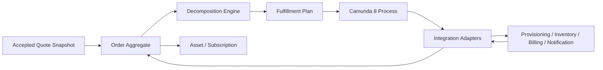
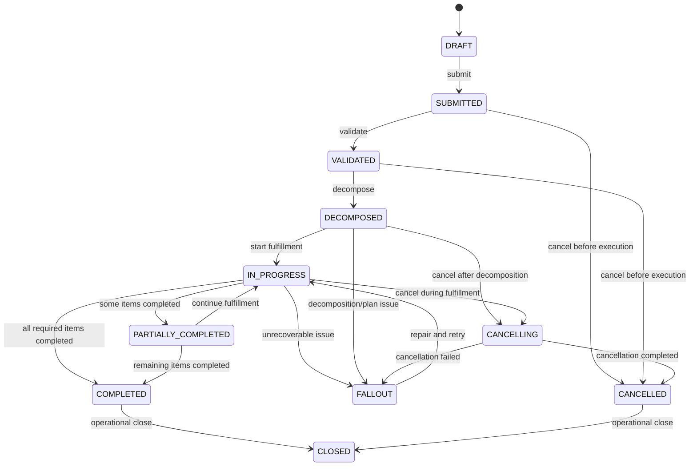
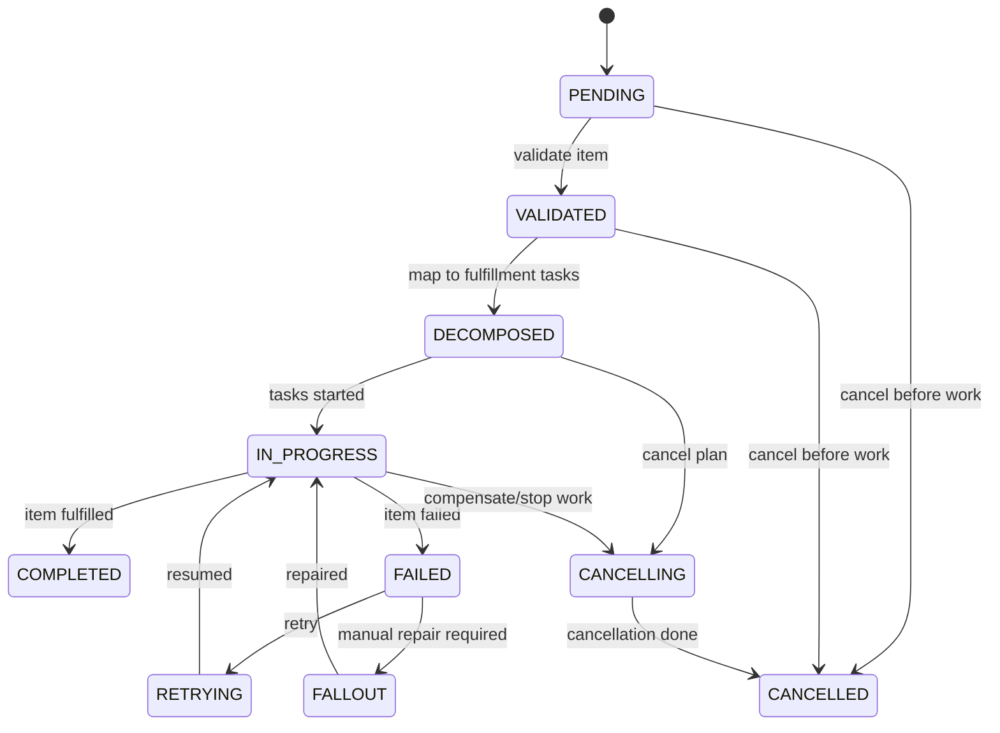
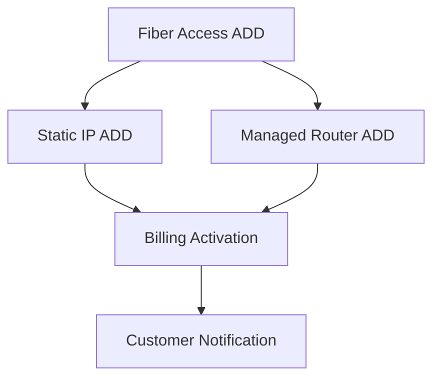

------
title: Build From Scratch: Enterprise Java Microservices CPQ & Order Management Platform - Part 010
description: Mendesain order domain model untuk enterprise OMS: order aggregate, order item, action type, fulfillment state, decomposition readiness, dependency, amendment, cancellation, installed base impact, PostgreSQL schema, MyBatis mapper, API contract, Kafka events, Camunda boundary, dan failure model.
series: learn-enterprise-cpq-oms-glassfish-camunda8
seriesTitle: Build From Scratch: Enterprise Java Microservices CPQ & Order Management Platform
order: 10
partTitle: Order Domain Model
tags:
  - java
  - microservices
  - cpq
  - oms
  - order-management
  - fulfillment
  - decomposition
  - state-machine
  - postgresql
  - mybatis
  - camunda-8
  - kafka
  - enterprise-architecture
date: 2026-07-02
---

# Part 010 — Order Domain Model

Di Part 009 kita memodelkan **quote** sebagai commercial promise.

Sekarang kita masuk ke **order**.

Order adalah titik perubahan besar.

Sebelum order, sistem masih berada di wilayah offer, negotiation, approval, dan acceptance.

Setelah order, sistem masuk ke wilayah execution:

- harus dikerjakan;
- harus dilacak;
- harus dikompensasi jika gagal;
- harus direkonsiliasi dengan sistem eksternal;
- harus meninggalkan audit trail;
- harus bisa dijelaskan kepada customer support, operations, sales, fulfillment team, dan compliance.

Quote yang salah bisa direvisi.

Order yang salah bisa menjadi insiden operasional.

Karena itu order model harus lebih ketat daripada quote model.

---

## 1. Target Part Ini

Part ini memaku **order domain model**.

Kita belum membangun full order orchestration, decomposition engine, Camunda BPMN, fulfillment worker, atau integration adapter. Itu akan dibangun di part berikutnya.

Di sini kita menentukan:

1. order itu apa dan bukan apa;
2. order aggregate boundary;
3. order header;
4. order item;
5. action type;
6. order lifecycle;
7. order item lifecycle;
8. decomposition readiness;
9. dependency model;
10. fulfillment state;
11. cancellation dan amendment boundary;
12. installed base impact;
13. invariants;
14. command/event model;
15. PostgreSQL schema awal;
16. MyBatis direction;
17. API shape awal;
18. Camunda/Kafka/Redis boundary.

Order model ini dirancang untuk enterprise-grade OMS, bukan order table sederhana.

---

## 2. Order Bukan Quote, Bukan Fulfillment Task, Bukan Invoice

### 2.1 Order vs Quote

Quote adalah offer yang diterima customer.

Order adalah commitment untuk mengeksekusi offer.

Quote menyimpan commercial snapshot.

Order menyimpan execution snapshot.

Quote dapat mengatakan:

> customer menerima Business Fiber 1Gbps dengan MRC Rp1.350.000 dan instalasi Rp500.000.

Order harus dapat mengatakan:

> untuk memenuhi acceptance tersebut, kita perlu reserve resource, schedule installation, provision service, activate billing trigger, notify customer, dan close order.

### 2.2 Order vs Fulfillment Task

Order bukan task.

Order adalah container bisnis dari execution request.

Fulfillment task adalah langkah teknis/operasional untuk menyelesaikan order.

Contoh order:

```text
Install Business Fiber 1Gbps for PT Contoh Digital
```

Contoh fulfillment tasks:

```text
Validate serviceability
Reserve ONT
Schedule technician appointment
Configure network profile
Activate service
Notify billing
Send completion notification
```

Order harus tahu high-level state.

Task detail bisa hidup di fulfillment plan/workflow context.

### 2.3 Order vs Invoice

Order bukan invoice.

Order boleh menghasilkan billing trigger.

Billing system tetap owner invoice.

Jangan menyimpan invoice lifecycle sebagai order lifecycle.

Order bisa completed tetapi invoice belum issued.

Invoice bisa failed tetapi order fulfillment sudah selesai.

Boundary ini penting untuk menghindari coupling buruk antara OMS dan billing.

---

## 3. Mental Model: Order Sebagai Execution Commitment

Order berada di antara commercial acceptance dan fulfillment systems.



Order harus memisahkan:

- commercial input;
- decomposition result;
- orchestration progress;
- item state;
- external system references;
- final asset impact.

Kalau semua dimasukkan ke satu JSON raksasa, sistem akan sulit query, sulit audit, sulit recover.

---

## 4. Order Aggregate Boundary

Order aggregate adalah transactional boundary untuk order-level state dan item-level state.

Baseline structure:

```text
Order
├── OrderHeader
├── OrderItem[]
│   ├── ActionType
│   ├── ProductSnapshot
│   ├── ConfigurationSnapshot
│   ├── PriceSnapshot
│   ├── TargetAssetReference
│   ├── FulfillmentState
│   └── Dependency[]
├── OrderCommercialSnapshot
├── OrderFulfillmentSummary
├── DecompositionStatus
├── WorkflowReference
├── AuditMetadata
└── Version
```

### 4.1 Masuk Aggregate

Masuk ke order aggregate:

- order id;
- order number;
- source quote id/revision;
- customer/account reference;
- order state;
- order items;
- action type per item;
- commercial snapshot dari quote;
- configuration snapshot;
- price snapshot;
- item dependency;
- decomposition status summary;
- workflow instance reference;
- fulfillment summary;
- cancellation/amendment reference;
- audit metadata;
- version.

### 4.2 Tidak Masuk Aggregate

Tidak masuk ke order aggregate:

- full workflow engine history;
- every low-level worker log;
- full inventory model;
- full billing ledger;
- full provisioning payload history;
- document binary;
- Kafka offset;
- Redis cache state.

Order aggregate boleh menyimpan external reference dan summary, bukan mengambil alih ownership sistem lain.

---

## 5. Order Header

Order header adalah identitas dan state utama.

Field awal:

```text
order_id
order_number
source_type
source_quote_id
source_quote_revision
customer_id
account_id
billing_account_id
sales_channel
order_type
state
priority
requested_completion_date
submitted_at
accepted_at
completed_at
cancelled_at
workflow_instance_key
created_at
created_by
updated_at
updated_by
version
```

### 5.1 Order ID vs Order Number

Sama seperti quote, gunakan dua identifier:

```text
order_id     -> technical immutable UUID
order_number -> business-facing number, e.g. O-2026-00000421
```

Business number tidak boleh menjadi primary mechanism untuk internal reference.

### 5.2 Source Type

Order bisa berasal dari:

```text
QUOTE
DIRECT_CAPTURE
AMENDMENT
CANCELLATION
MIGRATION
BULK_IMPORT
SYSTEM_GENERATED
```

Untuk awal seri, kita fokus pada `QUOTE`.

Tetapi model harus tidak menutup pintu untuk direct order atau amendment.

### 5.3 Order Type

Order type berbeda dari item action type.

Contoh order type:

```text
NEW_PROVIDE
CHANGE
DISCONNECT
MOVE
RENEWAL
CANCEL_ORDER
SUPPLEMENTAL
```

Order type menjelaskan intent global.

Item action type menjelaskan intent per item.

---

## 6. Order Item

Order item adalah unit komersial-operasional yang akan didekomposisi.

Field awal:

```text
order_item_id
order_id
parent_order_item_id
source_quote_item_id
line_number
action_type
product_offering_id
product_offering_version
product_specification_id
quantity
target_asset_id
product_snapshot
configuration_snapshot
price_snapshot
state
fulfillment_state
created_at
updated_at
version
```

### 6.1 Action Type Per Item

Minimal:

```text
ADD
MODIFY
DISCONNECT
MOVE
RENEW
NO_CHANGE
```

Kenapa `NO_CHANGE` diperlukan?

Dalam bundle modification, tidak semua child item berubah.

Contoh:

Customer upgrade internet speed tetapi tetap memakai managed router existing.

Order item bisa berisi:

```text
Fiber Access       MODIFY
Static IP          NO_CHANGE
Managed Router     NO_CHANGE
New Speed Profile  ADD
Old Speed Profile  DISCONNECT
```

Jika kita tidak memodelkan `NO_CHANGE`, decomposition bisa salah menganggap semua komponen harus diprovision ulang.

### 6.2 Source Quote Item

Order item yang berasal dari quote harus menyimpan:

```text
source_quote_id
source_quote_revision
source_quote_item_id
```

Ini penting untuk traceability.

Customer support harus bisa menjawab:

> Order item ini berasal dari quote item mana?

Tanpa traceability, dispute antara sales dan operations akan sulit diselesaikan.

### 6.3 Target Asset

Untuk action selain ADD, order item sering menarget existing asset.

Contoh:

```text
action_type = MODIFY
target_asset_id = asset-123
```

Jika `DISCONNECT`, target asset wajib.

Jika `ADD`, target asset biasanya kosong sampai fulfillment selesai dan asset dibuat.

Invariant:

```text
MODIFY/DISCONNECT/MOVE must reference target asset unless explicitly allowed by migration mode
ADD must not reference active target asset as mutation target
```

---

## 7. Product, Configuration, and Price Snapshot in Order

Order harus membawa snapshot dari quote.

Jangan hanya menyimpan `quote_id` lalu membaca quote live setiap kali.

Ketika order dibuat, accepted quote snapshot menjadi basis order.

Order item menyimpan:

- product snapshot;
- configuration snapshot;
- price snapshot;
- customer/account snapshot;
- accepted commercial terms.

### 7.1 Why Duplicate Snapshot?

Bukankah quote sudah punya snapshot?

Ya.

Tapi order adalah execution record independen.

Jika quote diarsipkan, dimigrasi, atau retention policy berbeda, order tetap harus bisa menjelaskan execution input.

Rule:

> Order should be reconstructable without live quote dependency.

Tetap simpan reference ke quote untuk traceability, tetapi execution tidak boleh bergantung pada mutable quote query.

---

## 8. Order Lifecycle

Order-level lifecycle baseline:



### 8.1 DRAFT in OMS?

Some OMS designs avoid draft orders.

If order is always created from accepted quote, `DRAFT` may be short-lived or internal.

But keeping `DRAFT` can help:

- idempotent creation;
- validation before submission;
- imported order staging;
- manual correction before execution.

Do not expose draft order broadly unless business needs it.

### 8.2 SUBMITTED vs VALIDATED

`SUBMITTED` means request received.

`VALIDATED` means OMS has checked structural and business preconditions.

This distinction matters because external request can be malformed, stale, incomplete, or no longer eligible.

### 8.3 DECOMPOSED vs IN_PROGRESS

`DECOMPOSED` means fulfillment plan exists.

`IN_PROGRESS` means execution started.

This distinction matters for cancellation.

Cancelling before execution is simpler than cancelling after technician scheduled, resource reserved, or service partially activated.

---

## 9. Order Item Lifecycle

Order item state is not always same as order state.

Item-level lifecycle:



Order completed only when all required order items are terminal successful or explicitly waived according to policy.

Do not mark order completed just because BPMN process ended.

Workflow completion and domain completion must agree, but they are not the same concept.

---

## 10. Fulfillment State vs Order State

Order state is business-facing.

Fulfillment state is execution-facing.

Example:

```text
order.state = IN_PROGRESS
order_item.state = IN_PROGRESS
order_item.fulfillment_state = WAITING_FOR_TECHNICIAN_APPOINTMENT
```

Fulfillment state can be more detailed:

```text
NOT_STARTED
WAITING_FOR_DEPENDENCY
WAITING_FOR_EXTERNAL_SYSTEM
WAITING_FOR_APPOINTMENT
WAITING_FOR_MANUAL_ACTION
RETRY_SCHEDULED
COMPENSATING
COMPLETED
FAILED
```

Do not pollute order state with every fulfillment detail.

Expose fulfillment detail through:

- order item fulfillment summary;
- fulfillment task view;
- workflow incident view;
- operational dashboard.

---

## 11. Dependency Model

Order items can depend on each other.

Example:

```text
Install router depends on install fiber access.
Activate service depends on configure network profile.
Notify billing depends on service activation.
```

At order item level:

```text
order_item_dependency
- order_item_id
- depends_on_order_item_id
- dependency_type
```

Dependency type:

```text
SEQUENCE
RESOURCE
COMMERCIAL
TECHNICAL
BILLING
```

Example graph:



In practice, fulfillment task dependencies will be more detailed than order item dependencies.

But item dependency is still useful for high-level impact analysis.

---

## 12. Decomposition Readiness

Order should not be decomposed blindly.

Before decomposition, OMS must check:

```text
order is VALIDATED
all required order items exist
all product snapshots exist
all configuration snapshots valid
all action types supported
all target assets resolved where required
commercial-to-technical mapping exists
customer/service address context sufficient
no blocking hold exists
```

If decomposition fails, distinguish:

- invalid order data;
- missing catalog mapping;
- unsupported product/action;
- temporary external dependency;
- internal system error.

These should not all become `FAILED`.

Example error taxonomy:

```text
ORDER_INVALID
DECOMPOSITION_RULE_MISSING
TECHNICAL_CATALOG_MAPPING_MISSING
TARGET_ASSET_NOT_FOUND
UNSUPPORTED_ACTION_TYPE
TEMPORARY_DEPENDENCY_UNAVAILABLE
INTERNAL_ERROR
```

This taxonomy determines whether repair is data fix, catalog fix, retry, or manual fallout.

---

## 13. Order Holds

Enterprise OMS needs hold mechanism.

A hold prevents progress without losing order context.

Examples:

- credit hold;
- fraud hold;
- legal hold;
- customer document hold;
- manual verification hold;
- capacity hold;
- serviceability hold.

Model:

```text
order_hold
- order_hold_id
- order_id
- hold_type
- reason
- state
- created_at
- created_by
- released_at
- released_by
```

Order with active blocking hold should not start fulfillment.

State should not necessarily become `FAILED`.

Better:

```text
order.state = VALIDATED
order.fulfillment_blocked = true
active_holds = [CREDIT_HOLD]
```

Or introduce `ON_HOLD` if business needs visible state.

Be careful: `ON_HOLD` as top-level state can make transitions complex because order may be on hold from multiple previous states.

Often better to model hold orthogonally.

---

## 14. Cancellation Boundary

Cancellation is not delete.

Cancellation is domain process.

Before execution:

```text
SUBMITTED/VALIDATED -> CANCELLED
```

After execution starts:

```text
IN_PROGRESS -> CANCELLING -> CANCELLED or FALLOUT
```

Why?

Because work may already have happened:

- resource reserved;
- device shipped;
- technician scheduled;
- network configured;
- service activated;
- billing triggered.

Cancellation after execution may require compensation.

### 14.1 Cancellation Request

Use explicit command:

```text
RequestOrderCancellation(orderId, reason, requestedBy)
```

Do not allow:

```text
PATCH /orders/{id} { "state": "CANCELLED" }
```

Cancellation command should evaluate:

- current order state;
- completed tasks;
- cancellable tasks;
- compensation requirements;
- business policy;
- customer/legal constraints.

### 14.2 Cancellation Reason

Reason is not optional.

It is audit evidence.

Examples:

```text
CUSTOMER_REQUEST
DUPLICATE_ORDER
FRAUD_RISK
PAYMENT_FAILURE
SERVICE_UNAVAILABLE
SALES_ERROR
```

---

## 15. Amendment and Supplemental Orders

Do not mutate completed order to represent new customer intent.

If customer changes request after order submission, choose one of:

1. cancel and recreate;
2. amend before execution;
3. create supplemental order;
4. create change order against installed asset.

### 15.1 Amendment

Amendment changes an existing in-flight order.

This is risky.

Only allow amendment while order is in states where change is safe:

```text
DRAFT
SUBMITTED
VALIDATED
```

After fulfillment starts, amendment may require compensation or supplemental process.

### 15.2 Supplemental Order

Supplemental order is a separate order linked to original order.

Example:

```text
Original order: Install fiber internet
Supplemental order: Add static IP before activation
```

Link:

```text
related_order_id
relationship_type = SUPPLEMENTS
```

This preserves traceability without corrupting original execution history.

---

## 16. Installed Base Impact

Order changes installed base.

But order is not the asset inventory.

Order should record expected asset impact:

```text
ADD -> creates new asset/service instance
MODIFY -> updates existing asset/service instance
DISCONNECT -> terminates existing asset/service instance
MOVE -> changes service location/resource association
RENEW -> extends contract/subscription term
```

Asset service consumes order completion events or is called during fulfillment close.

Order item should store:

```text
expected_asset_action
actual_asset_id
asset_update_status
```

Example:

```text
order_item.action_type = ADD
order_item.actual_asset_id = asset-789 after completion
```

For MODIFY:

```text
target_asset_id = asset-123
actual_asset_id = asset-123
```

---

## 17. Order Invariants

### 17.1 Structural Invariants

```text
order must have customer_id
order must have at least one order item before submit
order item line_number unique within order
order item quantity must be positive
order state must be valid for command
```

### 17.2 Source Invariants

```text
order from quote must reference source_quote_id and source_quote_revision
order from quote must preserve accepted quote snapshot
one quote revision can create at most one primary order
```

### 17.3 Item Action Invariants

```text
MODIFY/DISCONNECT/MOVE require target_asset_id
ADD should not require target_asset_id
NO_CHANGE cannot create fulfillment task that mutates external system
unsupported action type blocks decomposition
```

### 17.4 Fulfillment Invariants

```text
order cannot start fulfillment before validation
order cannot start fulfillment before decomposition
order cannot complete while required item incomplete
failed required item prevents order completion unless waived by policy
cancellation after fulfillment start must go through CANCELLING
```

### 17.5 Workflow Invariants

```text
workflow instance must correspond to current order version or process version
workflow completion alone cannot mark order completed without domain validation
incident must not silently disappear without repair/audit
```

### 17.6 Audit Invariants

```text
state transition must record actor/system and timestamp
manual repair must record reason
cancellation must record reason
external reference update must be traceable
```

---

## 18. Order Commands

Baseline command:

```text
CreateOrderFromQuote
SubmitOrder
ValidateOrder
DecomposeOrder
StartFulfillment
MarkOrderItemInProgress
MarkOrderItemCompleted
MarkOrderItemFailed
PlaceOrderHold
ReleaseOrderHold
RequestOrderCancellation
CompleteOrderCancellation
AmendOrder
CreateSupplementalOrder
CloseOrder
```

### 18.1 Command Granularity

Do not expose every internal worker update as public API.

External/internal API distinction:

Public/business APIs:

```text
CreateOrderFromQuote
SubmitOrder
CancelOrder
GetOrder
SearchOrder
```

Internal fulfillment APIs:

```text
MarkTaskCompleted
UpdateOrderItemFulfillmentState
RegisterExternalReference
RaiseFallout
```

Keep these separated by package, authorization, and route.

---

## 19. Order Events

Baseline events:

```text
OrderCreated
OrderSubmitted
OrderValidated
OrderValidationFailed
OrderDecomposed
OrderDecompositionFailed
OrderFulfillmentStarted
OrderItemStarted
OrderItemCompleted
OrderItemFailed
OrderHeld
OrderHoldReleased
OrderCancellationRequested
OrderCancellationCompleted
OrderCompleted
OrderClosed
OrderFalloutRaised
OrderManualRepairApplied
```

### 19.1 Event Payload

Example:

```json
{
  "eventId": "evt-ord-001",
  "eventType": "OrderCreated",
  "occurredAt": "2026-07-02T10:30:00+07:00",
  "orderId": "ord-123",
  "orderNumber": "O-2026-00000421",
  "sourceType": "QUOTE",
  "sourceQuoteId": "q-123",
  "sourceQuoteRevision": 3,
  "customerId": "cust-1001",
  "accountId": "acct-2001",
  "orderType": "NEW_PROVIDE",
  "itemCount": 4
}
```

Do not publish full execution detail to every consumer.

Use targeted events/projections for operations dashboards.

---

## 20. PostgreSQL Schema Baseline

Order table:

```sql
create table customer_order (
    order_id uuid primary key,
    order_number varchar(64) not null unique,
    source_type varchar(32) not null,
    source_quote_id uuid,
    source_quote_revision integer,
    customer_id varchar(64) not null,
    account_id varchar(64),
    billing_account_id varchar(64),
    sales_channel varchar(64),
    order_type varchar(32) not null,
    state varchar(32) not null,
    priority varchar(32) not null default 'NORMAL',
    requested_completion_date date,
    submitted_at timestamptz,
    accepted_at timestamptz,
    completed_at timestamptz,
    cancelled_at timestamptz,
    workflow_instance_key varchar(128),
    commercial_snapshot jsonb not null,
    fulfillment_summary_snapshot jsonb,
    created_at timestamptz not null,
    created_by varchar(128) not null,
    updated_at timestamptz not null,
    updated_by varchar(128) not null,
    version integer not null
);
```

Order item:

```sql
create table customer_order_item (
    order_item_id uuid primary key,
    order_id uuid not null references customer_order(order_id),
    parent_order_item_id uuid references customer_order_item(order_item_id),
    source_quote_item_id uuid,
    line_number integer not null,
    action_type varchar(32) not null,
    product_offering_id varchar(128) not null,
    product_offering_version integer not null,
    product_specification_id varchar(128),
    quantity numeric(18, 6) not null,
    target_asset_id varchar(128),
    actual_asset_id varchar(128),
    product_snapshot jsonb not null,
    configuration_snapshot jsonb not null,
    price_snapshot jsonb,
    state varchar(32) not null,
    fulfillment_state varchar(64) not null,
    created_at timestamptz not null,
    updated_at timestamptz not null,
    version integer not null,
    constraint uq_order_item_line unique (order_id, line_number),
    constraint ck_order_item_quantity check (quantity > 0)
);
```

Order item dependency:

```sql
create table customer_order_item_dependency (
    order_item_dependency_id uuid primary key,
    order_id uuid not null references customer_order(order_id),
    order_item_id uuid not null references customer_order_item(order_item_id),
    depends_on_order_item_id uuid not null references customer_order_item(order_item_id),
    dependency_type varchar(32) not null,
    created_at timestamptz not null,
    constraint uq_order_item_dependency unique (order_item_id, depends_on_order_item_id, dependency_type)
);
```

Order hold:

```sql
create table customer_order_hold (
    order_hold_id uuid primary key,
    order_id uuid not null references customer_order(order_id),
    hold_type varchar(64) not null,
    reason text not null,
    state varchar(32) not null,
    created_at timestamptz not null,
    created_by varchar(128) not null,
    released_at timestamptz,
    released_by varchar(128),
    release_reason text
);
```

Order audit:

```sql
create table customer_order_audit_log (
    audit_id uuid primary key,
    order_id uuid not null references customer_order(order_id),
    order_item_id uuid,
    action varchar(128) not null,
    actor_id varchar(128) not null,
    reason text,
    before_snapshot jsonb,
    after_snapshot jsonb,
    occurred_at timestamptz not null,
    correlation_id varchar(128),
    causation_id varchar(128)
);
```

Order outbox:

```sql
create table customer_order_outbox_event (
    outbox_event_id uuid primary key,
    aggregate_id uuid not null,
    aggregate_type varchar(64) not null,
    event_type varchar(128) not null,
    event_payload jsonb not null,
    event_version integer not null,
    occurred_at timestamptz not null,
    published_at timestamptz,
    publish_attempts integer not null default 0,
    last_error text
);
```

Idempotency:

```sql
create table customer_order_idempotency_record (
    idempotency_key varchar(128) primary key,
    command_type varchar(128) not null,
    order_id uuid,
    request_hash varchar(128) not null,
    response_snapshot jsonb,
    status varchar(32) not null,
    created_at timestamptz not null,
    expires_at timestamptz not null
);
```

---

## 21. MyBatis Mapper Direction

Order aggregate loading is similar to quote but with dependencies and holds.

Basic loading:

```text
select order header by id
select order items by order_id
select order item dependencies by order_id
select active holds by order_id
assemble domain aggregate
```

Mapper sketch:

```java
public interface CustomerOrderMapper {
    CustomerOrderRecord selectOrderById(UUID orderId);
    CustomerOrderRecord selectOrderByIdForUpdate(UUID orderId);
    List<CustomerOrderItemRecord> selectOrderItems(UUID orderId);
    List<OrderItemDependencyRecord> selectOrderItemDependencies(UUID orderId);
    List<OrderHoldRecord> selectActiveHolds(UUID orderId);

    int insertOrder(CustomerOrderRecord record);
    int updateOrder(CustomerOrderRecord record);
    int insertOrderItem(CustomerOrderItemRecord record);
    int updateOrderItem(CustomerOrderItemRecord record);
    int insertOrderItemDependency(OrderItemDependencyRecord record);
    int insertOrderHold(OrderHoldRecord record);
    int releaseOrderHold(OrderHoldRecord record);
}
```

Repository:

```java
public final class CustomerOrderRepository {
    private final CustomerOrderMapper mapper;
    private final JsonCodec jsonCodec;

    public CustomerOrder loadForUpdate(OrderId orderId) {
        var header = mapper.selectOrderByIdForUpdate(orderId.value());
        var items = mapper.selectOrderItems(orderId.value());
        var dependencies = mapper.selectOrderItemDependencies(orderId.value());
        var holds = mapper.selectActiveHolds(orderId.value());
        return CustomerOrderAssembler.toDomain(header, items, dependencies, holds, jsonCodec);
    }

    public void save(CustomerOrder order) {
        // persist changed header, changed items, dependencies, holds, audit, outbox in one transaction
    }
}
```

Avoid:

- business logic inside mapper XML;
- hidden state transition in SQL update;
- updating state without version check;
- loading huge audit history with aggregate by default.

---

## 22. API Shape Awal

Business APIs:

```text
POST   /orders/from-quote
GET    /orders/{orderId}
GET    /orders?customerId=&state=&createdFrom=&createdTo=
POST   /orders/{orderId}/submit
POST   /orders/{orderId}/cancel
POST   /orders/{orderId}/holds
POST   /orders/{orderId}/holds/{holdId}/release
```

Operational/internal APIs:

```text
POST   /orders/{orderId}/validate
POST   /orders/{orderId}/decompose
POST   /orders/{orderId}/start-fulfillment
POST   /orders/{orderId}/items/{orderItemId}/mark-in-progress
POST   /orders/{orderId}/items/{orderItemId}/mark-completed
POST   /orders/{orderId}/items/{orderItemId}/mark-failed
POST   /orders/{orderId}/fallout
POST   /orders/{orderId}/manual-repair
POST   /orders/{orderId}/close
```

Do not expose internal worker endpoints to external clients.

Put them behind service-to-service auth and restricted routes.

---

## 23. Camunda 8 Boundary

Camunda orchestrates process.

Order domain owns order truth.

This distinction is crucial.

### 23.1 Camunda Should Not Be the Order Database

Do not use process variables as source of truth for order state.

Process variables are useful for workflow execution.

PostgreSQL order tables remain source of truth.

### 23.2 Store Workflow Reference in Order

Order stores:

```text
workflow_instance_key
workflow_process_id
workflow_process_version
```

But order does not store every BPMN token detail.

### 23.3 Worker Updates Must Go Through Domain Commands

Bad:

```text
Zeebe worker directly updates order.state = COMPLETED
```

Better:

```text
Zeebe worker calls CompleteOrderItem command
Command handler validates invariant
Repository persists state + audit + outbox
```

This keeps domain rules centralized.

---

## 24. Kafka Boundary

Kafka event topics can be:

```text
oms.order.events.v1
oms.order.fulfillment.events.v1
oms.order.fallout.events.v1
oms.order.audit.events.v1
```

Same rule as quote:

> write DB state and outbox event in same transaction, then relay to Kafka after commit.

Events are used for:

- notification;
- dashboard projections;
- downstream billing trigger;
- asset update;
- audit warehouse;
- reporting.

But command path should not depend on Kafka delivery for immediate consistency inside the same aggregate.

---

## 25. Redis Boundary

Redis can help OMS runtime, but carefully.

Safe usages:

- short-lived order summary cache;
- duplicate command fast lookup;
- rate limiting;
- worker coordination hints;
- read model acceleration;
- temporary UI progress cache.

Unsafe usages:

- order state source of truth;
- only copy of fulfillment progress;
- distributed lock without DB invariant;
- permanent incident storage.

Use Redis as acceleration, not authority.

---

## 26. Failure Modes

### 26.1 Duplicate Order Creation From Quote

Cause:

- retry;
- double-click;
- timeout;
- multi-node race.

Defense:

```text
idempotency key
unique source quote revision conversion record
quote conversion lock
order creation transaction
```

### 26.2 Decomposition Missing Mapping

Cause:

- commercial catalog updated without technical mapping;
- unsupported product action;
- technical catalog version mismatch.

Defense:

```text
validate decomposition readiness
fail with DECOMPOSITION_RULE_MISSING
route to catalog repair, not random retry
```

### 26.3 Workflow and Order State Drift

Cause:

- worker failed after external call;
- process incident resolved manually;
- DB update failed;
- duplicate job execution.

Defense:

```text
idempotent worker command
order state reconciliation job
workflow reference audit
incident dashboard
```

### 26.4 Partial Fulfillment

Cause:

- one item completed;
- another item failed;
- external system unavailable;
- manual task pending.

Defense:

```text
item-level state
order-level PARTIALLY_COMPLETED
clear dependency model
manual fallout path
```

### 26.5 Cancellation During Execution

Cause:

- customer cancels after work started;
- sales mistake;
- credit failure.

Defense:

```text
CANCELLING state
compensation plan
external task cancellation
manual review for irreversible steps
```

---

## 27. Testing Strategy Untuk Order Model

### 27.1 Domain Tests

```text
cannot submit order without items
cannot start fulfillment before decomposition
cannot complete order while required item incomplete
cannot cancel in-progress order without CANCELLING
MODIFY requires target asset
DISCONNECT requires target asset
ADD does not require target asset
```

### 27.2 Conversion Tests

```text
CreateOrderFromQuote preserves source quote revision
CreateOrderFromQuote preserves commercial snapshot
same idempotency key returns same order
same accepted quote cannot create duplicate primary order
```

### 27.3 Decomposition Readiness Tests

```text
missing technical mapping blocks decomposition
unsupported action type blocks decomposition
invalid configuration snapshot blocks decomposition
active blocking hold prevents fulfillment start
```

### 27.4 Persistence Tests

```text
save/load order with items
save/load dependencies
save/load active holds
optimistic lock rejects stale update
JSON snapshots preserved
```

### 27.5 Workflow Boundary Tests

```text
worker completion command is idempotent
duplicate job does not double-complete item
workflow incident does not silently mark order failed
manual repair records audit log
```

---

## 28. Domain Class Sketch

```java
public final class CustomerOrder {
    private final OrderId id;
    private final OrderNumber number;
    private OrderState state;
    private final SourceReference source;
    private final CustomerReference customer;
    private final List<CustomerOrderItem> items;
    private final List<OrderHold> activeHolds;
    private WorkflowReference workflowReference;
    private Version version;

    public void submit(Instant submittedAt) {
        ensureState(OrderState.DRAFT);
        ensureHasItems();
        ensureNoBlockingHold();
        this.state = OrderState.SUBMITTED;
    }

    public void markValidated() {
        ensureState(OrderState.SUBMITTED);
        ensureAllItemsValidForAction();
        this.state = OrderState.VALIDATED;
    }

    public void markDecomposed(DecompositionResult result) {
        ensureState(OrderState.VALIDATED);
        ensureResultCoversRequiredItems(result);
        applyDependencies(result.dependencies());
        this.state = OrderState.DECOMPOSED;
    }

    public void startFulfillment(WorkflowReference workflowReference) {
        ensureState(OrderState.DECOMPOSED);
        ensureNoBlockingHold();
        this.workflowReference = workflowReference;
        this.state = OrderState.IN_PROGRESS;
    }

    public void completeItem(OrderItemId itemId, Instant completedAt) {
        var item = item(itemId);
        item.markCompleted(completedAt);
        if (allRequiredItemsCompleted()) {
            this.state = OrderState.COMPLETED;
            this.completedAt = completedAt;
        } else if (someItemsCompleted()) {
            this.state = OrderState.PARTIALLY_COMPLETED;
        }
    }

    public void requestCancellation(CancellationReason reason) {
        ensureCancellable();
        if (fulfillmentStarted()) {
            this.state = OrderState.CANCELLING;
        } else {
            this.state = OrderState.CANCELLED;
        }
    }
}
```

Again, no SQL, HTTP, Kafka, or Camunda logic inside the domain entity.

---

## 29. Build Exercise

Implement skeleton:

```text
oms-order-service
├── api
│   ├── CustomerOrderResource.java
│   └── dto
├── application
│   ├── CreateOrderFromQuoteHandler.java
│   ├── SubmitOrderHandler.java
│   ├── ValidateOrderHandler.java
│   ├── DecomposeOrderHandler.java
│   ├── StartFulfillmentHandler.java
│   ├── CompleteOrderItemHandler.java
│   ├── FailOrderItemHandler.java
│   └── RequestOrderCancellationHandler.java
├── domain
│   ├── CustomerOrder.java
│   ├── CustomerOrderItem.java
│   ├── OrderState.java
│   ├── OrderItemState.java
│   ├── OrderActionType.java
│   ├── OrderHold.java
│   ├── SourceReference.java
│   └── WorkflowReference.java
├── infrastructure
│   ├── persistence
│   │   ├── CustomerOrderMapper.java
│   │   ├── CustomerOrderRecord.java
│   │   └── CustomerOrderRepository.java
│   ├── outbox
│   └── json
└── test
```

Minimal tests:

```text
CustomerOrderDomainTest
OrderConversionTest
OrderDecompositionReadinessTest
OrderCancellationTest
OrderPersistenceTest
```

---

## 30. Design Checklist

Sebelum lanjut ke asset/subscription model, order model harus bisa menjawab:

```text
Can we trace every order item back to quote item?
Can we distinguish offer acceptance from execution commitment?
Can we prevent duplicate order creation?
Can we represent ADD/MODIFY/DISCONNECT/MOVE correctly?
Can we block fulfillment before validation and decomposition?
Can we represent partial completion?
Can we cancel safely before and after execution starts?
Can we preserve commercial snapshot without live quote dependency?
Can we keep Camunda as orchestration engine, not order database?
Can we audit every manual repair and state transition?
```

Jika belum, order model belum siap masuk fulfillment orchestration.

---

## 31. Ringkasan

Order adalah **execution commitment**.

Quote menjawab apa yang diterima customer.

Order menjawab bagaimana acceptance itu dieksekusi, dilacak, diperbaiki, dibatalkan, dan ditutup.

Order model harus memisahkan:

- order state;
- item state;
- fulfillment state;
- workflow state;
- external system state;
- asset impact.

Order dari quote harus mempertahankan accepted quote snapshot, tetapi tidak boleh bergantung pada live quote untuk execution.

Action type per item adalah fondasi untuk decomposition.

Cancellation bukan delete. Amendment bukan update bebas. Workflow bukan source of truth.

Part berikutnya akan masuk ke:

> **Asset and Subscription Model**.

Di sana kita akan membahas installed base: apa yang customer sudah punya, bagaimana order ADD/MODIFY/DISCONNECT memengaruhinya, dan kenapa OMS enterprise tidak bisa hanya menyimpan order tanpa asset/subscription continuity.
