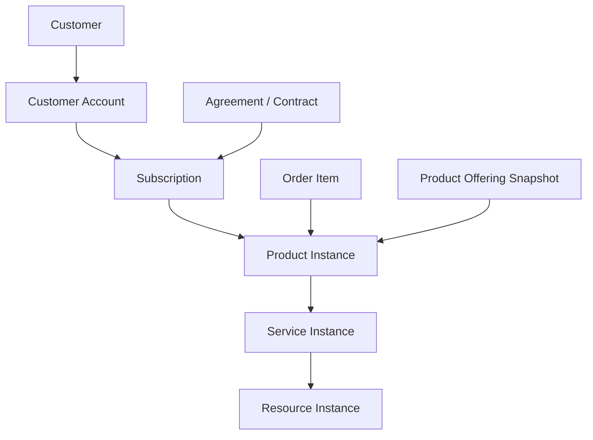
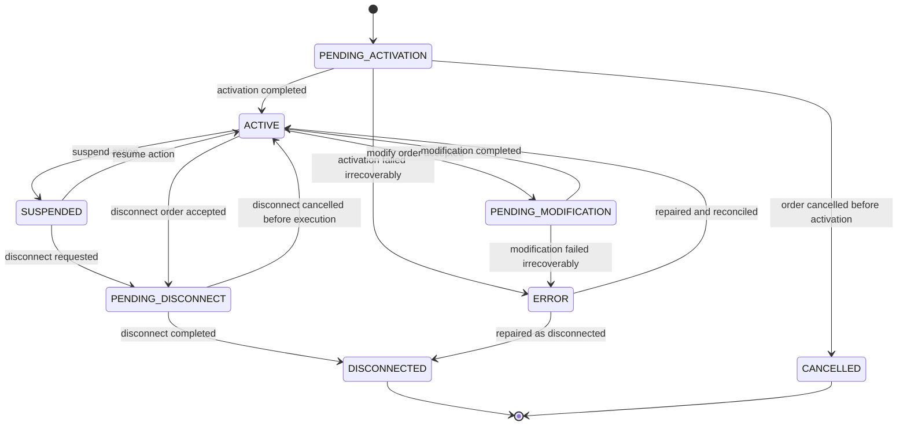
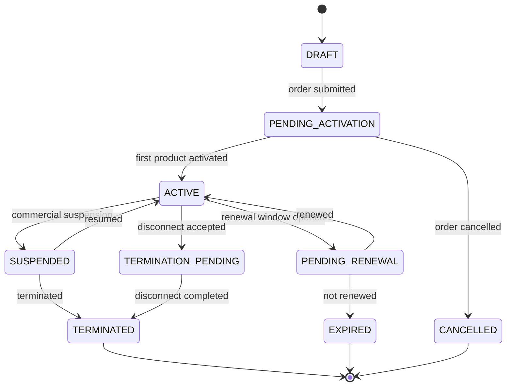
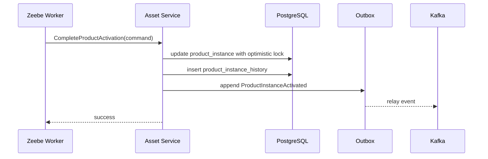

------
title: Build From Scratch: Enterprise Java Microservices CPQ & Order Management Platform - Part 011
description: Mendesain installed base, asset, subscription, product instance, service instance, dan relationship-nya dengan order management untuk enterprise CPQ/OMS yang mendukung add, modify, disconnect, move, renewal, amendment, audit, dan long-lived customer ownership.
series: learn-enterprise-cpq-oms-glassfish-camunda8
seriesTitle: Build From Scratch: Enterprise Java Microservices CPQ & Order Management Platform
order: 11
partTitle: Asset and Subscription Model
tags:
  - java
  - microservices
  - cpq
  - oms
  - asset-management
  - subscription
  - installed-base
  - order-management
  - postgresql
  - mybatis
  - kafka
  - camunda-8
  - enterprise-architecture
date: 2026-07-02
---

# Part 011 — Asset and Subscription Model

Di Part 010 kita memodelkan **order** sebagai execution commitment.

Sekarang kita masuk ke satu domain yang sering disepelekan dalam sistem CPQ/OMS, padahal justru domain ini yang membuat enterprise order management menjadi sulit: **installed base**, **asset**, dan **subscription**.

Jika sistem hanya menjual satu kali lalu selesai, asset model mungkin sederhana.

Tetapi enterprise CPQ/OMS biasanya tidak hanya menjual sesuatu. Ia mengelola hubungan panjang antara customer dan produk/layanan yang sudah aktif.

Customer bisa:

- membeli produk baru;
- menambah add-on;
- mengubah paket;
- menaikkan bandwidth;
- menurunkan tier;
- memindahkan lokasi layanan;
- mengganti perangkat;
- memperbarui kontrak;
- menghentikan layanan sebagian;
- menghentikan layanan penuh;
- melakukan amendment ketika order lama belum selesai;
- meminta koreksi karena fulfillment external tidak sesuai.

Semua ini tidak bisa dimodelkan hanya dengan `orders` dan `order_items`.

Kita butuh installed base.

---

## 1. Target Part Ini

Part ini memaku model untuk:

1. customer asset;
2. product instance;
3. service instance;
4. resource instance;
5. subscription;
6. agreement reference;
7. asset relationship;
8. asset versioning;
9. installed base snapshot;
10. order action terhadap asset;
11. add/modify/disconnect/move/renew flows;
12. asset lifecycle;
13. subscription lifecycle;
14. PostgreSQL schema awal;
15. MyBatis persistence direction;
16. Kafka event model;
17. Camunda boundary;
18. failure modes;
19. testing strategy.

Kita belum membangun full asset service implementation. Itu akan muncul bertahap ketika order, decomposition, fulfillment, dan integration adapter mulai dibangun.

Di part ini kita membangun mental model dan kontrak domainnya.

---

## 2. Installed Base: Apa Yang Sebenarnya Disimpan?

**Installed base** adalah representasi sistem terhadap produk/layanan yang sudah dimiliki, digunakan, aktif, suspended, pending change, atau pernah dimiliki customer.

Installed base bukan katalog.

Installed base bukan order history.

Installed base bukan billing account.

Installed base adalah keadaan aktual atau near-actual dari relationship customer terhadap product/service instance.

Contoh sederhana:

```text
Customer: PT Contoh Digital
Location: Jakarta HQ
Active installed base:
- Business Fiber 1Gbps
  - Static IP /29
  - Managed Router
  - SLA Gold
- Cloud Backup 5TB
```

Jika customer ingin upgrade Business Fiber 1Gbps menjadi 2Gbps, CPQ tidak boleh hanya melihat catalog. CPQ harus tahu customer sekarang sudah punya apa.

Jika customer ingin disconnect Managed Router, OMS harus tahu router itu child dari Business Fiber instance, bukan produk lepas.

Jika customer ingin pindah lokasi, OMS harus tahu service instance mana yang dipindahkan, appointment mana yang diperlukan, dan fulfillment task apa yang harus dibuat.

---

## 3. Empat Level Yang Harus Dibedakan

Dalam enterprise OMS, kita perlu membedakan minimal empat level:

```text
Commercial Product Instance
Service Instance
Resource Instance
Subscription / Commercial Commitment
```

Masing-masing punya alasan hidup yang berbeda.

### 3.1 Product Instance

Product instance adalah representasi komersial dari produk yang customer miliki.

Contoh:

```text
Business Fiber 1Gbps
Static IP /29
SLA Gold
Managed Router
```

Product instance menjawab:

> customer membeli atau memiliki produk komersial apa?

Ia biasanya berasal dari `product_offering` dan `product_specification` pada catalog.

### 3.2 Service Instance

Service instance adalah representasi layanan teknis yang dipenuhi oleh operasi.

Contoh:

```text
Internet Access Service
IP Allocation Service
Managed CPE Service
SLA Monitoring Service
```

Service instance menjawab:

> layanan teknis apa yang harus aktif agar produk komersial ini benar-benar terpenuhi?

Product instance bisa memetakan ke satu atau beberapa service instance.

### 3.3 Resource Instance

Resource instance adalah representasi resource fisik/logis yang dialokasikan.

Contoh:

```text
ONT serial number
Router serial number
Port ID
VLAN ID
IP block
SIM card
Phone number
Cloud quota bucket
```

Resource instance menjawab:

> resource apa yang dikonsumsi atau dikunci untuk memenuhi service?

OMS sering tidak menjadi owner resource inventory. Namun OMS tetap perlu reference agar order traceable.

### 3.4 Subscription

Subscription adalah commercial continuity contract.

Contoh:

```text
Monthly Business Fiber 1Gbps subscription
Contract term: 24 months
Billing cycle: monthly
Start date: 2026-07-02
End date: 2028-07-01
Auto-renew: true
```

Subscription menjawab:

> komitmen berulang apa yang berjalan antara customer dan business?

Subscription bukan sekadar product instance.

Product instance bisa aktif tanpa subscription dalam model tertentu, misalnya one-time hardware sale.

Subscription bisa mengikat banyak product instances dalam satu commercial commitment.

---

## 4. Jangan Campur Asset Dengan Catalog

Catalog menjawab:

```text
Apa yang bisa dijual?
```

Installed base menjawab:

```text
Apa yang sudah dimiliki atau sedang digunakan customer?
```

Order menjawab:

```text
Perubahan apa yang diminta dan harus dieksekusi?
```

Billing menjawab:

```text
Apa yang harus ditagihkan?
```

Provisioning menjawab:

```text
Apa yang harus dikonfigurasi di network/system teknis?
```

Jika asset dicampur dengan catalog, maka product offering yang berubah akan terlihat seolah-olah semua customer asset ikut berubah.

Ini berbahaya.

Customer yang membeli produk lama harus tetap bisa direkonstruksi berdasarkan versi yang berlaku saat purchase atau activation.

Karena itu product instance harus menyimpan snapshot referensi catalog, bukan hanya pointer tipis.

---

## 5. Core Mental Model

Kita dapat menggambarkan hubungan utama seperti ini:



Dari diagram ini, terlihat bahwa order item bukan owner penuh product instance. Order item adalah penyebab perubahan.

Asset menyimpan keadaan setelah perubahan diterapkan.

---

## 6. Entity Utama

### 6.1 Customer Asset

`CustomerAsset` adalah container installed base milik customer/account.

Ia bisa berupa aggregate root tersendiri atau projection dari product instances.

Untuk sistem yang besar, lebih aman menganggap customer asset sebagai read/query boundary, sementara product instance menjadi entity utama untuk mutation.

Minimal fields:

```text
asset_id
customer_id
account_id
root_product_instance_id
status
created_at
updated_at
```

Namun jangan tergoda membuat satu table `customer_asset` yang menyimpan semua detail dalam JSON tanpa struktur.

JSON boleh dipakai untuk snapshot/configuration, tetapi lifecycle, relationship, dan status harus queryable.

### 6.2 Product Instance

Product instance adalah commercial instance.

Fields penting:

```text
product_instance_id
customer_id
account_id
subscription_id
product_offering_id
product_offering_version
product_specification_id
product_specification_version
name
status
action_origin_order_id
action_origin_order_item_id
activation_date
termination_date
configuration_snapshot
price_snapshot
catalog_snapshot
version
created_at
updated_at
```

`configuration_snapshot`, `price_snapshot`, dan `catalog_snapshot` penting untuk historical reconstruction.

### 6.3 Service Instance

Service instance adalah technical service representation.

Fields penting:

```text
service_instance_id
product_instance_id
service_specification_id
service_specification_version
status
external_service_id
activation_date
termination_date
technical_parameters
version
created_at
updated_at
```

`external_service_id` bisa menunjuk ke service inventory atau provisioning system.

### 6.4 Resource Instance

Resource instance adalah resource binding.

Fields penting:

```text
resource_instance_id
service_instance_id
resource_type
resource_id
external_resource_id
status
allocation_date
release_date
attributes
created_at
updated_at
```

Resource instance dalam OMS biasanya bukan authoritative source untuk resource inventory. Ia menyimpan binding/reference untuk traceability.

### 6.5 Subscription

Subscription adalah commercial recurring relationship.

Fields penting:

```text
subscription_id
customer_id
account_id
agreement_id
status
start_date
end_date
commitment_start_date
commitment_end_date
billing_account_id
billing_cycle
auto_renew
renewal_policy
created_at
updated_at
version
```

Subscription perlu status sendiri karena product instance dan subscription bisa tidak selalu berubah bersamaan.

Contoh:

- subscription active, satu child product suspended;
- product still active, subscription pending renewal;
- subscription terminated, product instance entering disconnect workflow;
- subscription migrated ke agreement baru.

---

## 7. Lifecycle Asset

Asset lifecycle harus lebih stabil daripada fulfillment task lifecycle.

Contoh status product instance:

```text
PENDING_ACTIVATION
ACTIVE
PENDING_MODIFICATION
SUSPENDED
PENDING_DISCONNECT
DISCONNECTED
CANCELLED
ERROR
```

Jangan terlalu banyak status teknis di product instance.

Status seperti `WAITING_FOR_ROUTER_DELIVERY`, `PROVISIONING_NETWORK_PROFILE`, atau `TECHNICIAN_ASSIGNED` adalah fulfillment task/workflow state, bukan product instance state.

### 7.1 Product Instance State Machine



### 7.2 Subscription State Machine



---

## 8. Asset Relationship Model

Enterprise products jarang berdiri sendiri.

Contoh:

```text
Business Fiber 1Gbps
├── Static IP /29
├── Managed Router
└── SLA Gold
```

Atau:

```text
Enterprise Mobile Plan
├── SIM Card
├── Data Package
├── Roaming Add-on
└── Device Installment
```

Kita butuh relationship antar product instances.

Fields:

```text
relationship_id
source_product_instance_id
target_product_instance_id
relationship_type
valid_from
valid_to
created_by_order_item_id
created_at
```

Relationship type contoh:

```text
BUNDLES
DEPENDS_ON
REQUIRES
ADDON_OF
REPLACES
MIGRATED_FROM
PARENT_OF
```

### 8.1 Relationship Direction

Direction harus konsisten.

Saya sarankan:

```text
source = parent / dependent owner / newer object
target = child / dependency / previous object
```

Contoh:

```text
Business Fiber source --PARENT_OF--> Static IP target
SLA Gold source --ADDON_OF--> Business Fiber target
Business Fiber 2Gbps source --REPLACES--> Business Fiber 1Gbps target
```

Namun untuk relationship `ADDON_OF`, secara natural source bisa child dan target parent. Yang penting aturan ini eksplisit dan dites.

Jangan biarkan developer berbeda membuat arah relationship berbeda.

---

## 9. Asset Versioning

Installed base adalah long-lived data.

Kita perlu tahu:

- keadaan sekarang;
- perubahan apa yang pernah terjadi;
- order mana yang mengubahnya;
- configuration sebelum dan sesudah;
- price sebelum dan sesudah;
- kapan perubahan berlaku;
- apakah perubahan sudah efektif secara technical/billing/commercial.

Ada dua pendekatan umum.

### 9.1 Current Table + History Table

Current table menyimpan state terbaru.

History table menyimpan setiap versi.

```text
product_instance
product_instance_history
```

Keuntungan:

- query state sekarang cepat;
- history bisa dipakai audit;
- cocok dengan MyBatis explicit SQL;
- lebih mudah untuk operational dashboard.

Kekurangan:

- harus disiplin menulis history setiap mutation;
- replay domain event tidak otomatis membangun state;
- repair script harus hati-hati.

### 9.2 Event-Sourced Asset

Semua perubahan asset disimpan sebagai event dan state dibangun dari replay.

Keuntungan:

- audit natural;
- temporal reconstruction kuat;
- event history lengkap.

Kekurangan:

- implementation jauh lebih sulit;
- query operational butuh projection;
- schema evolution event menjadi kompleks;
- repair human operator lebih sulit.

Untuk seri ini kita pakai **current table + history table + domain events + audit log**.

Ini lebih realistis untuk enterprise Java microservices yang memakai PostgreSQL, MyBatis, Kafka, dan operational dashboard.

---

## 10. Effective Date vs Transaction Date

Asset management selalu punya dua jenis waktu.

### 10.1 Transaction Time

Kapan sistem mencatat perubahan.

Contoh:

```text
2026-07-02 10:30:00 order completed in OMS
```

### 10.2 Effective Time

Kapan perubahan dianggap berlaku secara bisnis/teknis.

Contoh:

```text
2026-07-01 00:00:00 subscription renewal effective
```

Atau:

```text
2026-07-05 09:00:00 service activated by provisioning system
```

Jangan hanya punya `created_at` dan `updated_at`.

Untuk asset dan subscription, kita butuh fields seperti:

```text
valid_from
valid_to
effective_from
effective_to
activation_date
termination_date
```

Nama harus jelas. Jangan mencampur `valid_from` dan `effective_from` tanpa definisi.

Rekomendasi seri ini:

- `created_at`: kapan row dibuat di sistem;
- `updated_at`: kapan row terakhir diubah;
- `activation_date`: kapan instance aktif secara layanan;
- `termination_date`: kapan instance berakhir;
- `effective_from`: kapan versi ini berlaku secara bisnis;
- `effective_to`: kapan versi ini tidak lagi berlaku.

---

## 11. Order Action Terhadap Asset

Order item harus menyatakan action terhadap installed base.

Action umum:

```text
ADD
MODIFY
DISCONNECT
SUSPEND
RESUME
MOVE
REPLACE
RENEW
```

### 11.1 ADD

Membuat product instance baru.

Input:

```text
product_offering_id
configuration_snapshot
price_snapshot
customer/account context
```

Output:

```text
new product_instance_id
maybe new subscription_id
service/resource instances after fulfillment
```

### 11.2 MODIFY

Mengubah existing product instance.

Input:

```text
target_product_instance_id
current asset snapshot
requested configuration delta
requested price delta
```

Output:

```text
same product_instance_id with new version
maybe new service/resource changes
history record
```

Contoh:

```text
Upgrade bandwidth from 1Gbps to 2Gbps
Add Static IP /29
Remove SLA Gold
```

### 11.3 DISCONNECT

Mengakhiri product instance.

Input:

```text
target_product_instance_id
disconnect reason
requested termination date
```

Output:

```text
product_instance status DISCONNECTED
termination_date set
child asset impact handled
resource release triggered
billing stop trigger emitted
```

### 11.4 MOVE

Memindahkan service/product ke lokasi baru.

MOVE tidak selalu sama dengan MODIFY.

MOVE bisa melibatkan:

- disconnect technical service di lokasi lama;
- reserve resource di lokasi baru;
- appointment baru;
- keep same commercial subscription;
- change service instance;
- change resource binding;
- maintain customer product continuity.

### 11.5 REPLACE

Mengganti product instance lama dengan instance baru.

Contoh:

```text
Legacy Fiber 500Mbps replaced by Business Fiber 1Gbps
```

REPLACE sering lebih aman daripada MODIFY jika product specification berubah besar.

Hasilnya:

```text
new product_instance_id --REPLACES--> old product_instance_id
old product_instance_id status DISCONNECTED or MIGRATED
```

### 11.6 RENEW

Memperpanjang subscription/agreement tanpa selalu mengubah product instance.

Renewal sebaiknya memutasi subscription dan agreement reference, bukan membuat product instance baru kecuali ada perubahan product.

---

## 12. Installed Base Snapshot Untuk CPQ

CPQ butuh installed base snapshot ketika melakukan configure/price/quote.

Jangan biarkan CPQ membaca live asset berkali-kali selama quote sedang berjalan tanpa snapshot.

Masalahnya:

1. asset bisa berubah oleh order lain;
2. quote bisa menjadi tidak deterministik;
3. price eligibility bisa berubah diam-diam;
4. approval yang sudah diberikan bisa tidak sesuai dengan kondisi awal;
5. quote-to-order conversion bisa gagal karena state asset berubah.

Karena itu quote perlu menyimpan snapshot:

```text
installed_base_snapshot_id
snapshot_time
customer_id
account_id
asset_versions[]
subscription_versions[]
```

Ketika quote dikonversi menjadi order, sistem harus melakukan stale check.

```text
If target asset version != version used during quote,
then conversion must fail or require requote.
```

---

## 13. Concurrency Problem: Two Orders Target The Same Asset

Contoh:

- Order A: upgrade Business Fiber dari 1Gbps ke 2Gbps.
- Order B: disconnect Business Fiber.

Keduanya menargetkan product instance yang sama.

Jika berjalan bersamaan tanpa guard, hasilnya bisa absurd:

```text
service upgraded after disconnect completed
billing started for product that is already terminated
resource reserved for inactive service
```

Kita butuh asset-level concurrency control.

### 13.1 Optimistic Locking

Product instance punya `version`.

Command membawa `expected_version`.

```text
MODIFY product_instance_id=PI-123 expected_version=7
```

Update hanya berhasil jika current version masih 7.

### 13.2 Pending Change Lock

Product instance punya status `PENDING_MODIFICATION` atau `PENDING_DISCONNECT`.

Order baru yang menarget asset tersebut harus dievaluasi:

- reject;
- queue;
- merge;
- require manual review;
- allow only compatible action.

Untuk seri ini default-nya: **reject conflicting active change**, kecuali secara eksplisit didesain sebagai supplemental order.

### 13.3 Asset Operation Table

Kita dapat menambah table:

```text
asset_operation_lock
```

Fields:

```text
lock_id
product_instance_id
order_id
order_item_id
operation_type
status
created_at
released_at
```

Ini bukan distributed lock Redis. Ini transactional business lock di PostgreSQL.

Redis lock bisa membantu runtime short-lived coordination, tetapi source of truth conflict harus tetap di database.

---

## 14. PostgreSQL Schema Awal

Schema ini belum final, tetapi cukup untuk fondasi.

```sql
create table subscription (
    subscription_id uuid primary key,
    customer_id uuid not null,
    account_id uuid not null,
    agreement_id uuid null,
    billing_account_id uuid null,
    status varchar(40) not null,
    start_date timestamptz null,
    end_date timestamptz null,
    commitment_start_date timestamptz null,
    commitment_end_date timestamptz null,
    billing_cycle varchar(40) null,
    auto_renew boolean not null default false,
    renewal_policy jsonb not null default '{}'::jsonb,
    version bigint not null default 0,
    created_at timestamptz not null default now(),
    updated_at timestamptz not null default now()
);

create table product_instance (
    product_instance_id uuid primary key,
    customer_id uuid not null,
    account_id uuid not null,
    subscription_id uuid null references subscription(subscription_id),
    product_offering_id uuid not null,
    product_offering_version varchar(40) not null,
    product_specification_id uuid not null,
    product_specification_version varchar(40) not null,
    name varchar(300) not null,
    status varchar(40) not null,
    action_origin_order_id uuid null,
    action_origin_order_item_id uuid null,
    activation_date timestamptz null,
    termination_date timestamptz null,
    effective_from timestamptz null,
    effective_to timestamptz null,
    catalog_snapshot jsonb not null,
    configuration_snapshot jsonb not null,
    price_snapshot jsonb not null,
    version bigint not null default 0,
    created_at timestamptz not null default now(),
    updated_at timestamptz not null default now()
);

create index idx_product_instance_customer
    on product_instance(customer_id, account_id, status);

create index idx_product_instance_subscription
    on product_instance(subscription_id);

create table product_instance_relationship (
    relationship_id uuid primary key,
    source_product_instance_id uuid not null references product_instance(product_instance_id),
    target_product_instance_id uuid not null references product_instance(product_instance_id),
    relationship_type varchar(40) not null,
    valid_from timestamptz null,
    valid_to timestamptz null,
    created_by_order_item_id uuid null,
    created_at timestamptz not null default now(),
    constraint uq_product_instance_relationship unique (
        source_product_instance_id,
        target_product_instance_id,
        relationship_type,
        valid_from
    )
);

create table service_instance (
    service_instance_id uuid primary key,
    product_instance_id uuid not null references product_instance(product_instance_id),
    service_specification_id uuid not null,
    service_specification_version varchar(40) not null,
    status varchar(40) not null,
    external_service_id varchar(120) null,
    activation_date timestamptz null,
    termination_date timestamptz null,
    technical_parameters jsonb not null default '{}'::jsonb,
    version bigint not null default 0,
    created_at timestamptz not null default now(),
    updated_at timestamptz not null default now()
);

create index idx_service_instance_product
    on service_instance(product_instance_id, status);

create table resource_instance (
    resource_instance_id uuid primary key,
    service_instance_id uuid not null references service_instance(service_instance_id),
    resource_type varchar(80) not null,
    resource_id varchar(160) null,
    external_resource_id varchar(160) null,
    status varchar(40) not null,
    allocation_date timestamptz null,
    release_date timestamptz null,
    attributes jsonb not null default '{}'::jsonb,
    created_at timestamptz not null default now(),
    updated_at timestamptz not null default now()
);

create index idx_resource_instance_service
    on resource_instance(service_instance_id, status);
```

### 14.1 History Tables

```sql
create table product_instance_history (
    history_id uuid primary key,
    product_instance_id uuid not null,
    version bigint not null,
    change_type varchar(40) not null,
    changed_by_order_id uuid null,
    changed_by_order_item_id uuid null,
    before_state jsonb null,
    after_state jsonb not null,
    changed_at timestamptz not null default now(),
    unique(product_instance_id, version)
);

create table subscription_history (
    history_id uuid primary key,
    subscription_id uuid not null,
    version bigint not null,
    change_type varchar(40) not null,
    changed_by_order_id uuid null,
    changed_by_order_item_id uuid null,
    before_state jsonb null,
    after_state jsonb not null,
    changed_at timestamptz not null default now(),
    unique(subscription_id, version)
);
```

### 14.2 Asset Operation Guard

```sql
create table asset_operation_guard (
    guard_id uuid primary key,
    product_instance_id uuid not null references product_instance(product_instance_id),
    order_id uuid not null,
    order_item_id uuid not null,
    operation_type varchar(40) not null,
    status varchar(40) not null,
    created_at timestamptz not null default now(),
    released_at timestamptz null
);

create unique index uq_asset_operation_guard_active
    on asset_operation_guard(product_instance_id)
    where status in ('ACTIVE', 'PENDING_RELEASE');
```

Partial unique index ini membantu memastikan satu asset tidak diproses oleh dua operation aktif sekaligus.

---

## 15. MyBatis Mapper Direction

Kita tidak akan menyembunyikan mutation penting di ORM magic.

Untuk asset, explicit SQL lebih mudah diaudit.

### 15.1 ProductInstanceMapper

```java
public interface ProductInstanceMapper {
    ProductInstanceRecord findById(UUID productInstanceId);

    List<ProductInstanceRecord> findActiveByCustomerAccount(
        @Param("customerId") UUID customerId,
        @Param("accountId") UUID accountId
    );

    int insert(ProductInstanceRecord record);

    int updateWithOptimisticLock(
        @Param("record") ProductInstanceRecord record,
        @Param("expectedVersion") long expectedVersion
    );

    int markPendingModification(
        @Param("productInstanceId") UUID productInstanceId,
        @Param("orderId") UUID orderId,
        @Param("orderItemId") UUID orderItemId,
        @Param("expectedVersion") long expectedVersion
    );
}
```

### 15.2 Optimistic Update SQL

```xml
<update id="updateWithOptimisticLock">
  update product_instance
  set
    status = #{record.status},
    catalog_snapshot = #{record.catalogSnapshot, typeHandler=JsonbTypeHandler},
    configuration_snapshot = #{record.configurationSnapshot, typeHandler=JsonbTypeHandler},
    price_snapshot = #{record.priceSnapshot, typeHandler=JsonbTypeHandler},
    activation_date = #{record.activationDate},
    termination_date = #{record.terminationDate},
    effective_from = #{record.effectiveFrom},
    effective_to = #{record.effectiveTo},
    version = version + 1,
    updated_at = now()
  where product_instance_id = #{record.productInstanceId}
    and version = #{expectedVersion}
</update>
```

Jika return count `0`, application service harus melempar `ConcurrentAssetModificationException`.

Jangan diam-diam reload dan overwrite.

---

## 16. Application Service Boundary

Mutasi asset harus terjadi melalui application service yang eksplisit.

Contoh:

```java
public final class AssetApplicationService {
    private final ProductInstanceRepository productInstances;
    private final SubscriptionRepository subscriptions;
    private final AssetOperationGuardRepository guards;
    private final OutboxRepository outbox;
    private final Clock clock;

    public ProductInstanceId startModification(StartAssetModificationCommand command) {
        ProductInstance current = productInstances.get(command.productInstanceId());

        current.assertVersion(command.expectedVersion());
        current.assertCanStartModification(command.operationType());

        guards.acquire(
            command.productInstanceId(),
            command.orderId(),
            command.orderItemId(),
            command.operationType()
        );

        ProductInstance pending = current.startPendingModification(
            command.orderId(),
            command.orderItemId(),
            clock.instant()
        );

        productInstances.save(pending, current.version());

        outbox.append(ProductInstanceChangeStarted.from(pending));

        return pending.id();
    }
}
```

Perhatikan urutan:

1. load current state;
2. validate version;
3. validate status;
4. acquire business guard;
5. mutate domain object;
6. persist with optimistic lock;
7. write outbox in same DB transaction.

---

## 17. Kafka Event Model

Asset events harus jelas membedakan event internal domain dan integration event.

Contoh domain events:

```text
ProductInstanceCreated
ProductInstanceActivationPending
ProductInstanceActivated
ProductInstanceModificationStarted
ProductInstanceModified
ProductInstanceDisconnectStarted
ProductInstanceDisconnected
SubscriptionCreated
SubscriptionActivated
SubscriptionRenewed
SubscriptionTerminated
```

Contoh integration events:

```text
customer.asset.product-instance.activated.v1
customer.asset.product-instance.modified.v1
customer.asset.product-instance.disconnected.v1
customer.subscription.activated.v1
customer.subscription.terminated.v1
```

### 17.1 Event Payload Minimal

```json
{
  "eventId": "9afc4c9e-4a9f-40d4-8b4e-68a9c2e6f5f0",
  "eventType": "ProductInstanceModified",
  "eventVersion": 1,
  "occurredAt": "2026-07-02T10:30:00Z",
  "correlationId": "corr-123",
  "causationId": "order-item-456",
  "customerId": "...",
  "accountId": "...",
  "productInstanceId": "...",
  "subscriptionId": "...",
  "previousVersion": 7,
  "newVersion": 8,
  "status": "ACTIVE",
  "changeSummary": {
    "operation": "MODIFY",
    "changedCharacteristics": ["bandwidth"],
    "changedPrices": ["monthlyRecurringCharge"]
  }
}
```

Jangan mengirim semua snapshot besar ke semua consumer kecuali memang diperlukan.

Untuk payload besar, kirim reference dan sediakan query API.

---

## 18. Camunda Boundary

Camunda/Zeebe menjalankan orchestration.

Asset service tetap owner installed base.

Workflow boleh memanggil command seperti:

```text
StartProductActivation
CompleteProductActivation
StartProductModification
CompleteProductModification
StartProductDisconnect
CompleteProductDisconnect
```

Workflow tidak boleh langsung update table `product_instance`.



Jika workflow incident terjadi, asset state tidak boleh berubah separuh tanpa domain command yang tercatat.

---

## 19. Redis Boundary

Redis boleh dipakai untuk:

- cache installed base snapshot untuk read-heavy CPQ;
- cache active product list per account;
- short-lived lookup hasil query;
- rate limiting asset-heavy APIs;
- temporary workflow correlation lookup.

Redis tidak boleh menjadi source of truth untuk:

- status asset;
- subscription lifecycle;
- operation guard utama;
- version asset;
- ownership asset.

Cache key contoh:

```text
asset:account:{accountId}:active-products:v{assetProjectionVersion}
asset:product-instance:{productInstanceId}:v{version}
subscription:{subscriptionId}:v{version}
```

Versioned key mengurangi risiko stale overwrite.

---

## 20. API Shape Awal

API detail akan dibahas di blok API-first, tetapi mental shape-nya perlu terlihat.

### 20.1 Query Installed Base

```http
GET /accounts/{accountId}/installed-base
```

Response ringkas:

```json
{
  "accountId": "...",
  "snapshotTime": "2026-07-02T10:30:00Z",
  "products": [
    {
      "productInstanceId": "...",
      "name": "Business Fiber 1Gbps",
      "status": "ACTIVE",
      "version": 7,
      "subscriptionId": "...",
      "relationships": [
        {
          "type": "PARENT_OF",
          "targetProductInstanceId": "..."
        }
      ]
    }
  ]
}
```

### 20.2 Start Asset Modification

Biasanya API ini bukan public API untuk UI langsung. Ia dipanggil oleh order/workflow service.

```http
POST /internal/assets/product-instances/{productInstanceId}/modification:start
```

Request:

```json
{
  "orderId": "...",
  "orderItemId": "...",
  "expectedVersion": 7,
  "operationType": "MODIFY",
  "correlationId": "..."
}
```

---

## 21. Failure Modes

### 21.1 Asset Updated Without History

Symptom:

```text
product_instance status changed but no product_instance_history row exists
```

Impact:

- audit broken;
- dispute hard to investigate;
- support cannot explain change;
- downstream reconciliation becomes unreliable.

Mitigation:

- mutation only through repository/application service;
- DB trigger as defense-in-depth if needed;
- automated consistency check;
- outbox and history inserted in same transaction.

### 21.2 Two Active Changes On Same Asset

Symptom:

```text
two in-progress orders targeting same product_instance
```

Impact:

- race condition;
- wrong fulfillment;
- stale quote conversion;
- inconsistent billing trigger.

Mitigation:

- asset operation guard;
- optimistic lock;
- stale snapshot validation;
- conflict policy.

### 21.3 Asset Status Too Technical

Symptom:

```text
product_instance.status = WAITING_FOR_TECHNICIAN_CALL_BACK
```

Impact:

- product status becomes fulfillment workflow dump;
- UI/support confused;
- billing cannot interpret status;
- state transitions explode.

Mitigation:

- keep asset lifecycle high-level;
- put operational details in fulfillment task/workflow state;
- expose timeline combining asset + workflow events.

### 21.4 Subscription Treated As Product Instance

Symptom:

```text
renewal creates duplicate product instances even when product did not change
```

Impact:

- installed base duplicated;
- billing duplicate risk;
- support sees multiple active products;
- amendment becomes hard.

Mitigation:

- model subscription explicitly;
- separate renewal from product modification;
- link product instances to subscription.

### 21.5 External System Changes Asset Without OMS Knowing

Symptom:

```text
provisioning system disconnected service but OMS product_instance is ACTIVE
```

Impact:

- customer sees active but service down;
- billing continues incorrectly;
- next order uses wrong base state.

Mitigation:

- reconciliation job;
- external event ingestion;
- exception queue;
- manual repair command with audit.

---

## 22. Testing Strategy

### 22.1 Unit Tests For State Transition

Test examples:

```text
ACTIVE can start MODIFY
ACTIVE can start DISCONNECT
PENDING_MODIFICATION cannot start DISCONNECT by default
DISCONNECTED cannot start MODIFY
SUSPENDED can resume
SUSPENDED can disconnect
```

### 22.2 Repository Tests

Use PostgreSQL test container or dedicated test database.

Test:

- insert product instance;
- update with correct version;
- update with stale version returns zero rows;
- history row inserted;
- active operation guard unique constraint works;
- relationship uniqueness works.

### 22.3 Command Handler Tests

Test:

- start modification acquires guard;
- start modification writes outbox;
- complete modification updates version;
- failed optimistic lock does not write event;
- business rule violation does not mutate DB.

### 22.4 Scenario Tests

Scenarios:

```text
new sale -> product active -> subscription active
upgrade active product -> same product instance new version
disconnect product with child add-ons -> child impact evaluated
renew subscription -> subscription version changes, product unchanged
move service -> commercial product continuity preserved
```

---

## 23. Design Checklist

Sebelum melanjutkan ke API-first, asset model harus menjawab pertanyaan ini:

```text
Can we know what the customer currently owns?
Can we know what the customer owned at quote time?
Can we know which order created or changed an asset?
Can we prevent two conflicting active changes?
Can we explain why a price or configuration was allowed?
Can we distinguish product, service, resource, and subscription?
Can we reconstruct history for audit and support?
Can we survive external system mismatch?
Can we safely modify/disconnect/move/renew?
```

Jika jawabannya belum jelas, order management berikutnya akan rapuh.

---

## 24. Ringkasan

Installed base adalah fondasi perubahan jangka panjang.

Tanpa asset dan subscription model yang benar, CPQ hanya bisa menjual produk baru. Ia akan kesulitan menangani modify, disconnect, move, renewal, amendment, dan reconciliation.

Prinsip utama part ini:

1. catalog bukan installed base;
2. order bukan asset;
3. product instance berbeda dari service instance;
4. service instance berbeda dari resource instance;
5. subscription berbeda dari product instance;
6. asset harus versioned;
7. quote harus memakai installed base snapshot;
8. order action harus eksplisit terhadap target asset;
9. conflicting active changes harus dicegah;
10. mutation harus melalui command yang audit-friendly;
11. history dan outbox harus ditulis atomically;
12. Redis bukan source of truth;
13. Camunda tidak boleh langsung mengubah asset table.

Part berikutnya akan menutup domain modelling block dengan **domain invariants and state machines**. Di sana kita akan memaku aturan yang tidak boleh dilanggar oleh API, workflow, event consumer, repair script, atau operator.
