------
title: Build From Scratch: Enterprise Java Microservices CPQ & Order Management Platform - Part 012
description: Merancang domain invariants dan state machines untuk catalog, configuration, pricing, quote, approval, order, fulfillment, asset, subscription, cancellation, compensation, dan exception recovery agar CPQ/OMS enterprise tetap konsisten di bawah concurrency, workflow orchestration, event streaming, dan integrasi eksternal.
series: learn-enterprise-cpq-oms-glassfish-camunda8
seriesTitle: Build From Scratch: Enterprise Java Microservices CPQ & Order Management Platform
order: 12
partTitle: Domain Invariants and State Machines
tags:
  - java
  - microservices
  - cpq
  - oms
  - domain-driven-design
  - state-machine
  - invariants
  - workflow
  - camunda-8
  - kafka
  - postgresql
  - enterprise-architecture
date: 2026-07-02
---

# Part 012 — Domain Invariants and State Machines

Di Part 011 kita memodelkan **asset** dan **subscription**.

Sekarang kita menutup blok domain modelling awal dengan hal yang menentukan apakah sistem ini akan tahan dipakai di enterprise: **invariants** dan **state machines**.

CRUD system biasanya hanya punya validasi field.

Enterprise CPQ/OMS harus punya aturan yang lebih kuat:

```text
A quote cannot be accepted after expiry.
A quote cannot be converted twice into two active orders.
An approved price override cannot be silently changed after approval.
An order item cannot complete before its required predecessor completes.
A disconnected asset cannot be modified.
A fulfillment task cannot be retried after a terminal business rejection.
A compensation cannot run without knowing what it is compensating.
```

Inilah domain invariants.

Tanpa invariants, sistem masih bisa terlihat berjalan di demo. Tetapi di production, sistem akan menghasilkan state yang tidak bisa dijelaskan.

---

## 1. Target Part Ini

Part ini akan membahas:

1. apa itu invariant;
2. perbedaan field validation, schema validation, business rule, dan invariant;
3. cara menemukan invariant;
4. state machine catalog;
5. state machine quote;
6. state machine approval;
7. state machine order;
8. state machine order item;
9. state machine fulfillment task;
10. state machine asset;
11. state machine subscription;
12. cancellation dan compensation state;
13. exception/fallout state;
14. invariant enforcement layers;
15. PostgreSQL guard;
16. Java domain object guard;
17. Camunda workflow guard;
18. Kafka consumer guard;
19. repair command guard;
20. testing strategy.

Part ini bukan teori state machine abstrak.

Kita akan memakainya untuk menjaga CPQ/OMS yang akan dibangun dalam seri ini.

---

## 2. Invariant: Definisi Praktis

Invariant adalah aturan yang harus selalu benar untuk menjaga domain tetap masuk akal.

Invariant bukan sekadar validasi input.

Contoh field validation:

```text
quantity must be greater than zero
email must be valid format
price amount must not be null
```

Contoh schema validation:

```text
request body must match JSON Schema
required property productOfferingId must exist
status must be one of enum values
```

Contoh business rule biasa:

```text
Gold SLA is eligible only for enterprise customers
Discount above 20% requires approval
Static IP requires Internet Access product
```

Contoh invariant:

```text
An accepted quote must have an immutable price snapshot.
An order cannot be completed while any mandatory order item is not terminal-success.
A product instance cannot be ACTIVE without activation date.
A product instance cannot transition from DISCONNECTED back to ACTIVE.
A workflow cannot complete an order item unless the order item is still in an executable state.
```

Invariant adalah aturan penjaga integritas domain.

Jika invariant dilanggar, sistem tidak hanya menerima input buruk. Sistem menciptakan kenyataan bisnis yang rusak.

---

## 3. Kenapa State Machine Wajib Ada?

State machine membuat lifecycle eksplisit.

Tanpa state machine, developer akan menulis logika seperti ini di banyak tempat:

```java
if (!"COMPLETED".equals(order.getStatus())) {
    order.setStatus("CANCELLED");
}
```

Masalahnya:

- tidak semua status boleh cancel;
- cancellation saat `IN_PROGRESS` beda dengan cancellation saat `ACKNOWLEDGED`;
- order dengan item completed sebagian butuh compensation;
- order yang sudah closed tidak boleh berubah;
- command yang sama bisa punya arti berbeda tergantung state.

State machine memaksa kita menjawab:

```text
From this state, what transitions are legal?
What command causes each transition?
What side effects are required?
What invariants must hold before and after transition?
Is transition reversible?
Is transition terminal?
Who is allowed to trigger it?
```

---

## 4. Invariant Harus Diterapkan Di Banyak Layer

Satu layer tidak cukup.

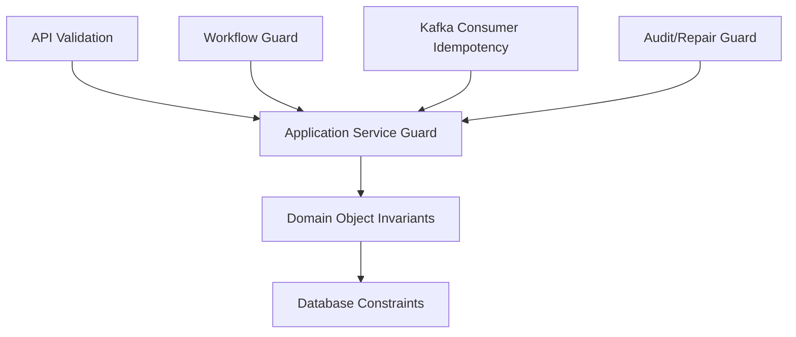

Layer berbeda menangkap failure berbeda.

- API validation menangkap request buruk lebih awal.
- Application service menjaga use case boundary.
- Domain object menjaga transition logic.
- Database constraint menjaga data dari bug aplikasi.
- Workflow guard menjaga orchestration tidak menyelesaikan state yang salah.
- Kafka consumer guard menjaga duplicate/out-of-order event.
- Repair command guard menjaga operator tidak merusak state saat manual recovery.

---

## 5. Taxonomy Invariants Untuk CPQ/OMS

Kita pakai kategori berikut.

### 5.1 Identity Invariants

Aturan tentang identitas.

```text
quote_id immutable
order_id immutable
product_instance_id immutable
order_item_id belongs to exactly one order
quote_item_id belongs to exactly one quote
```

### 5.2 Ownership Invariants

Aturan tentang siapa memiliki apa.

```text
quote.customer_id cannot change after quote creation
order.customer_id must equal source quote.customer_id when created from quote
product_instance.customer_id cannot change after activation
subscription.customer_id cannot change after activation
```

### 5.3 Snapshot Invariants

Aturan tentang snapshot.

```text
accepted quote must contain product/configuration/price snapshots
order created from quote must reference quote version
order must not depend on mutable live quote price
asset change must record before/after state
```

### 5.4 Lifecycle Invariants

Aturan tentang state transition.

```text
DRAFT quote can be submitted
ACCEPTED quote cannot be edited
COMPLETED order cannot be cancelled by normal cancellation
DISCONNECTED asset cannot be modified
```

### 5.5 Monetary Invariants

Aturan tentang uang.

```text
money must have currency
price snapshot must preserve rounding result
manual override must preserve original price and override reason
approved price must not be changed without invalidating approval
```

### 5.6 Dependency Invariants

Aturan tentang hubungan antar item/task.

```text
child order item cannot complete before required parent completes
add-on product cannot exist without parent asset unless explicitly allowed
disconnect parent must evaluate child impact
fulfillment task with dependency cannot start before dependency terminal-success
```

### 5.7 Idempotency Invariants

Aturan tentang retry.

```text
same idempotency key must not create multiple quotes/orders
same quote cannot convert into multiple active orders
same external event cannot complete task twice
same workflow job retry must not duplicate external side effect
```

### 5.8 Audit Invariants

Aturan tentang evidence.

```text
approval decision must store actor, timestamp, decision, reason
price override must store before/after value
manual repair must store operator and justification
state transition must be traceable to command/event/workflow/action
```

---

## 6. Catalog State Machine

Catalog lifecycle perlu stabil karena quote/order snapshot bergantung padanya.

Status product offering:

```text
DRAFT
READY_FOR_REVIEW
PUBLISHED
RETIRED
ARCHIVED
```

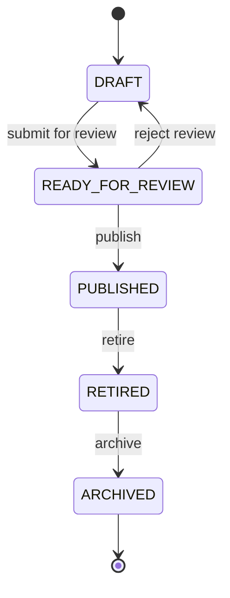

Catalog invariants:

```text
Only PUBLISHED offering can be used for new quote.
PUBLISHED offering version must be immutable.
RETIRED offering cannot be used for new acquisition, but may be used for modify/disconnect of existing asset if policy allows.
ARCHIVED offering cannot be used by runtime CPQ except historical reconstruction.
Offering version referenced by quote snapshot must remain resolvable.
```

Implementation implication:

- never update published offering row destructively;
- create new version instead;
- quote stores offering version;
- order stores quote snapshot;
- installed base stores catalog snapshot.

---

## 7. Configuration State Machine

Configuration lifecycle bisa berada di dalam quote item.

Status:

```text
EMPTY
IN_PROGRESS
VALID
INVALID
FROZEN
```

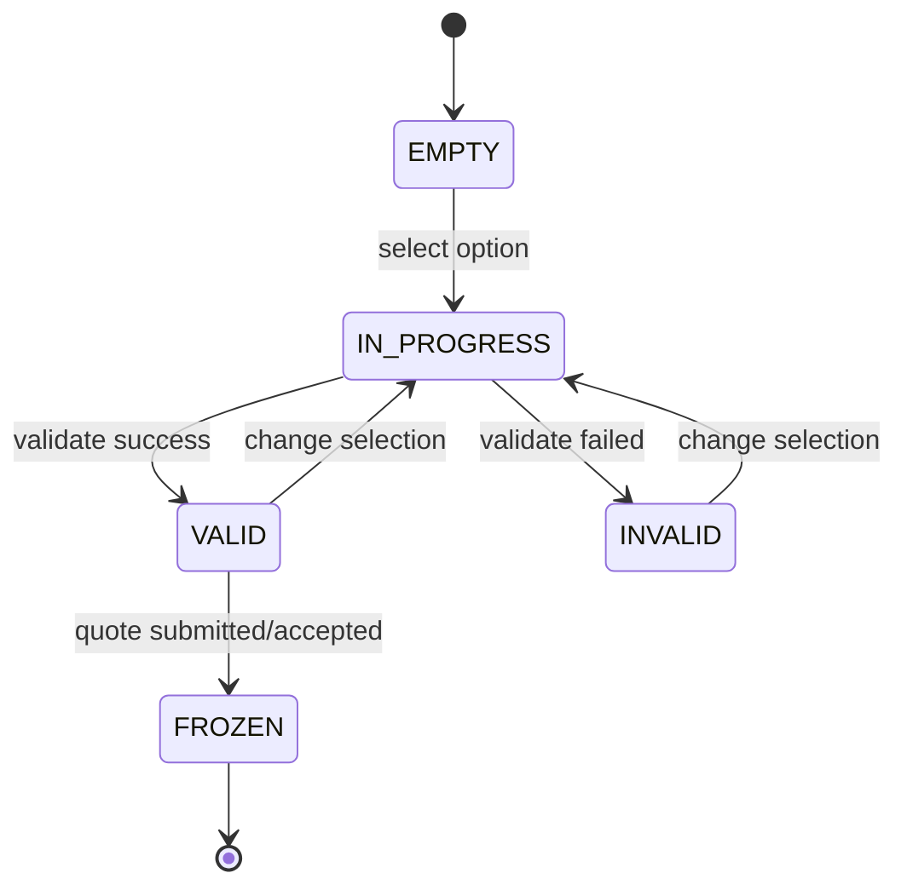

Configuration invariants:

```text
FROZEN configuration cannot be mutated.
VALID configuration must include all required characteristics.
VALID configuration must not contain mutually exclusive selections.
VALID configuration must include configuration hash.
Quote cannot be submitted with INVALID configuration.
Order cannot be created from quote item with non-frozen configuration.
```

Important distinction:

JSON Schema bisa memastikan shape request benar.

Configuration engine harus memastikan semantic configuration benar.

---

## 8. Pricing State Machine

Pricing lifecycle juga bisa berada di quote item atau quote-level pricing result.

Status:

```text
NOT_PRICED
PRICED
PRICE_STALE
OVERRIDE_PENDING_APPROVAL
APPROVED
REJECTED
FROZEN
```

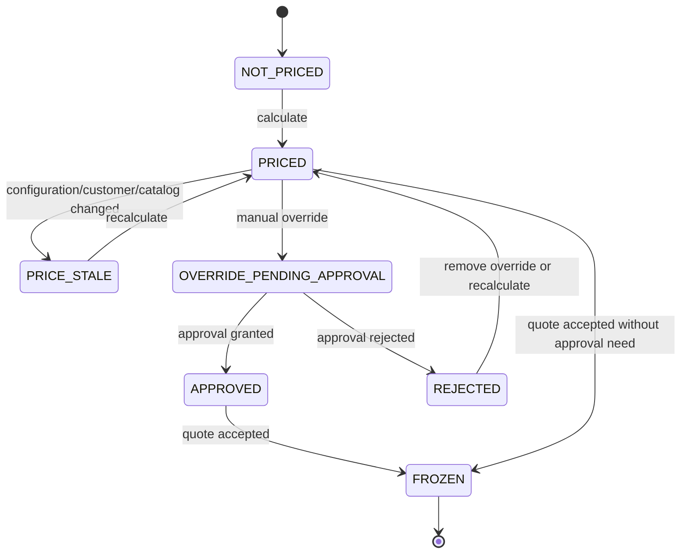

Pricing invariants:

```text
Accepted quote must have FROZEN price snapshot.
Price snapshot must include currency.
Manual override must include original price, overridden price, actor, reason, and policy signal.
Approved override cannot be changed without returning to OVERRIDE_PENDING_APPROVAL.
Price hash used for approval must match price hash at acceptance.
Order cannot be created from quote with PRICE_STALE state.
```

This is one of the most important CPQ invariants.

A lot of CPQ failures come from approving one number and ordering another.

---

## 9. Quote State Machine

Quote state machine harus membedakan commercial lifecycle dari approval subflow.

Status utama:

```text
DRAFT
CONFIGURED
PRICED
SUBMITTED
APPROVAL_PENDING
APPROVED
REJECTED
ACCEPTED
EXPIRED
CANCELLED
CONVERTED
```

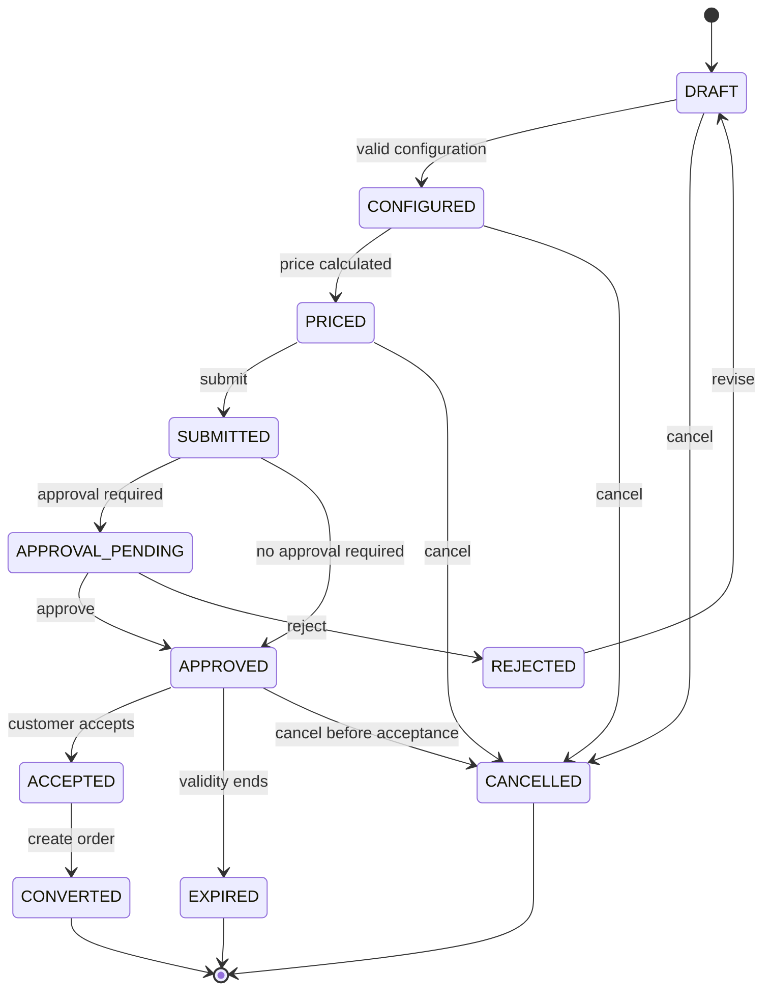

Quote invariants:

```text
DRAFT quote can be edited.
SUBMITTED quote cannot be edited except through revision command.
APPROVAL_PENDING quote cannot be accepted.
APPROVED quote can be accepted only before valid_until.
ACCEPTED quote cannot be edited.
CONVERTED quote cannot be converted again.
EXPIRED quote cannot be accepted.
Quote revision must create new revision number.
Quote accepted by customer must preserve acceptance evidence.
Quote-to-order conversion must verify quote status ACCEPTED and not converted.
```

### 9.1 Quote Revision Invariant

Do not mutate approved quote in place.

Use revision:

```text
quote_id: Q-100
revision: 1 -> rejected
revision: 2 -> approved
revision: 3 -> accepted
```

The exact model may keep same quote_id with revision number, or separate quote_version_id. But approval evidence must map to the exact version that was approved.

---

## 10. Approval State Machine

Approval is not just a quote status.

Approval has its own lifecycle.

Status:

```text
NOT_REQUIRED
PENDING
APPROVED
REJECTED
CANCELLED
EXPIRED
SUPERSEDED
```

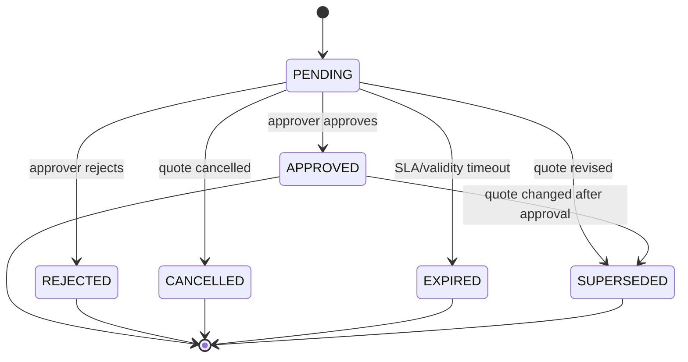

Approval invariants:

```text
Approval decision must reference approval_request_id.
Approval request must reference quote_id and quote_revision.
Approval request must include policy evaluation snapshot.
Approval decision must include actor, timestamp, decision, and optional reason.
Approved request becomes SUPERSEDED if quote commercial terms change.
Rejected request cannot be reused.
Expired request cannot approve quote.
```

Camunda can orchestrate approval process, but approval aggregate must still enforce these invariants.

---

## 11. Order State Machine

Order state machine is execution lifecycle.

Status:

```text
DRAFT
ACKNOWLEDGED
VALIDATED
DECOMPOSED
IN_PROGRESS
HELD
PARTIALLY_COMPLETED
COMPLETED
CANCELLATION_PENDING
CANCELLED
FAILED
FALLOUT
CLOSED
```

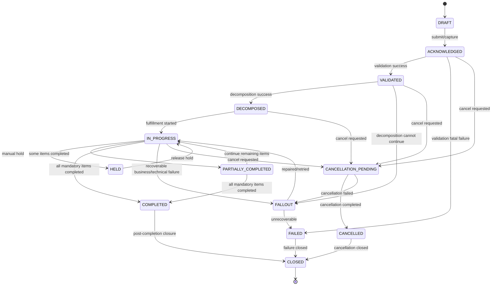

Order invariants:

```text
Order cannot enter IN_PROGRESS before decomposition exists.
Order cannot be COMPLETED if mandatory order items are not terminal-success.
Order cannot be CANCELLED after COMPLETED through normal cancellation.
Order in CLOSED state cannot be mutated except audit annotation.
Order from quote must reference accepted quote revision.
Order customer/account must match source quote unless explicit transfer flow exists.
Order total commercial snapshot must match accepted quote snapshot unless adjustment order is created.
```

---

## 12. Order Item State Machine

Order item has its own lifecycle.

Status:

```text
PENDING
VALIDATED
READY
BLOCKED
IN_PROGRESS
COMPLETED
SKIPPED
FAILED
CANCEL_PENDING
CANCELLED
COMPENSATING
COMPENSATED
```

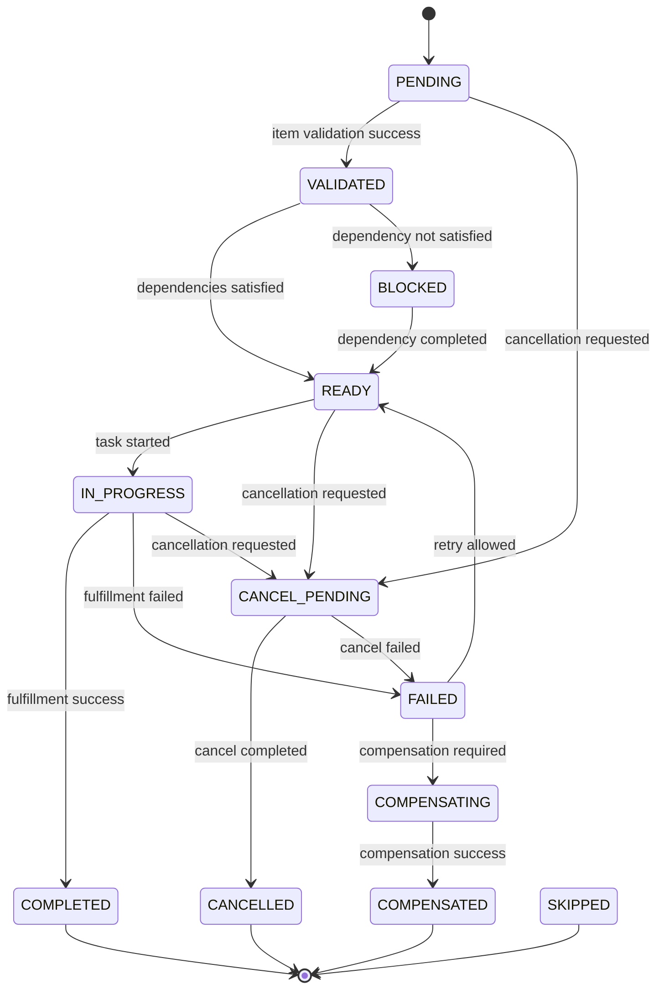

Order item invariants:

```text
Order item belongs to exactly one order.
Order item action type must be explicit.
MODIFY/DISCONNECT/MOVE action must reference target product_instance_id.
ADD action must not reference existing product_instance_id unless it is add-on to parent.
Order item cannot start before required dependencies are terminal-success.
Order item cannot complete twice.
Failed order item can retry only if failure classification is retryable.
Cancelled item must not emit activation event.
```

---

## 13. Fulfillment Task State Machine

Fulfillment task is lower-level than order item.

Status:

```text
CREATED
WAITING_DEPENDENCY
READY
DISPATCHED
IN_PROGRESS
SUCCEEDED
FAILED_RETRYABLE
FAILED_NON_RETRYABLE
TIMED_OUT
CANCELLED
COMPENSATING
COMPENSATED
```

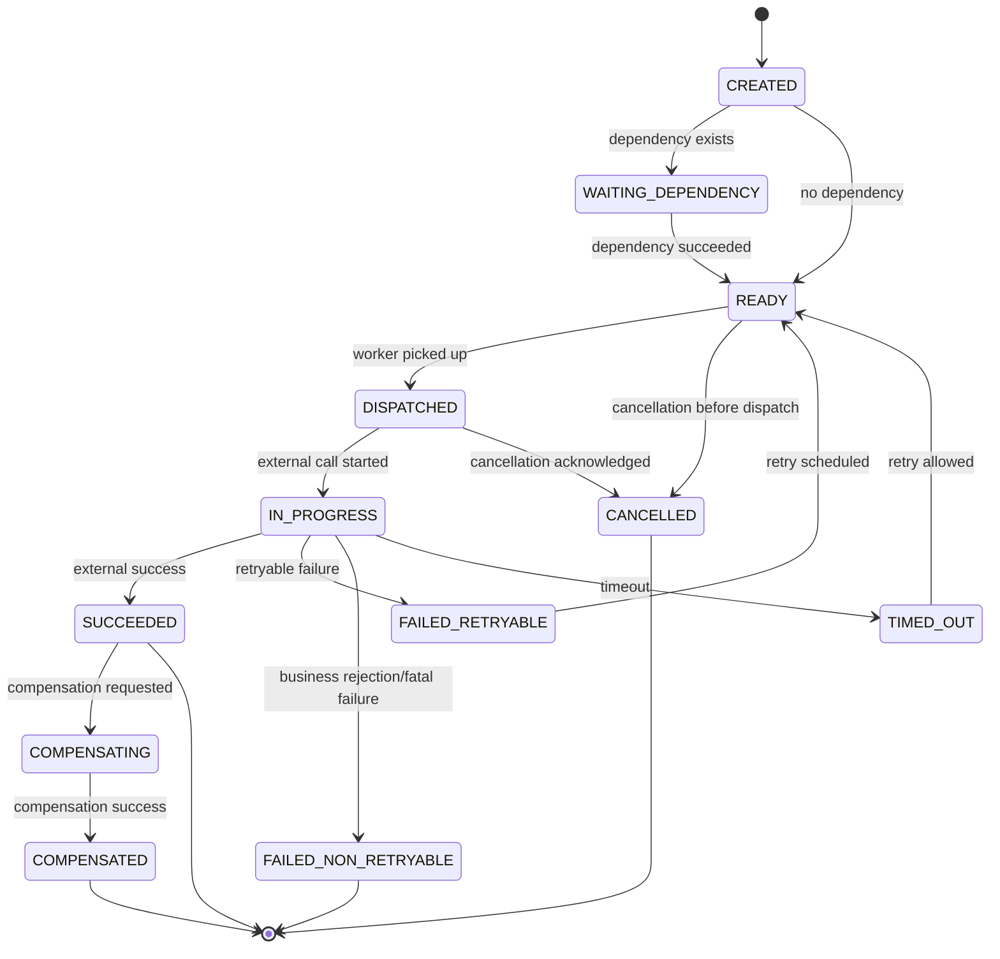

Fulfillment task invariants:

```text
Task job type must map to one worker responsibility.
Task external call must be idempotent or protected by idempotency key.
Task cannot SUCCEED if parent order item is CANCELLED.
Task cannot retry non-retryable failure.
Task timeout must not imply external failure automatically.
Task compensation must know original successful side effect.
```

This is crucial for external systems.

A timeout means OMS does not know the result. It does not mean the external system failed.

---

## 14. Asset State Machine

Asset/product instance state was introduced in Part 011, but here we define invariants.

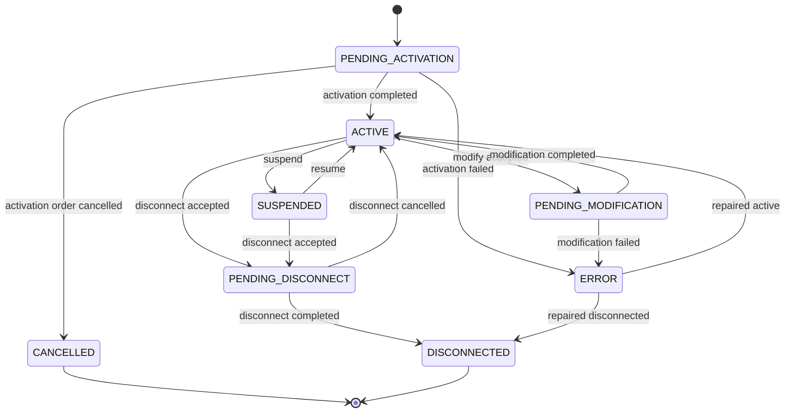

Asset invariants:

```text
ACTIVE product instance must have activation_date.
DISCONNECTED product instance must have termination_date.
DISCONNECTED product instance cannot be modified.
PENDING_MODIFICATION product instance cannot accept another conflicting modification.
PENDING_DISCONNECT product instance cannot accept modification unless explicit reversal flow exists.
Product instance version must increase on every state-changing mutation.
Mutation must create history row.
Mutation caused by order must reference order_id and order_item_id.
```

---

## 15. Subscription State Machine

Subscription lifecycle can diverge from product instance lifecycle.

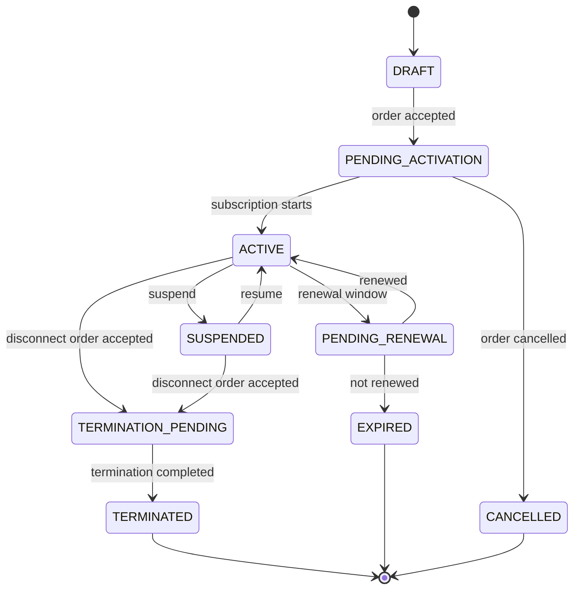

Subscription invariants:

```text
ACTIVE subscription must have start_date.
TERMINATED subscription must have end_date or termination_date.
Subscription customer/account cannot change after activation.
Renewal must preserve renewal evidence.
Renewal must not duplicate product instances unless product changes require replacement.
Termination must evaluate active product instances linked to subscription.
Billing trigger must reference subscription version.
```

---

## 16. Cancellation State Model

Cancellation is not just setting status to CANCELLED.

Cancellation depends on how far execution has gone.

### 16.1 Before Fulfillment Starts

If order is only acknowledged/validated:

```text
cancel order
release operation guards
mark order items cancelled
no external compensation needed
```

### 16.2 During Fulfillment

If some tasks are in progress:

```text
stop tasks not started
ask external systems to cancel in-progress actions if supported
compensate successful reversible tasks
mark irreversible tasks for manual handling
```

### 16.3 After Completion

After completion, normal cancellation is not enough.

Need reversal order or disconnect order.

```text
Completed activation order cannot be cancelled.
Create disconnect/reversal order instead.
```

Cancellation invariants:

```text
Cancellation must know execution progress.
Cancellation must not assume external task can be undone.
Completed order cannot transition to CANCELLED directly.
Cancellation of parent item must evaluate child items.
Cancellation must release business guards only after safe state reached.
```

---

## 17. Compensation State Model

Compensation is not rollback.

Rollback implies returning to previous state as if nothing happened.

In distributed enterprise systems, that is often impossible.

Compensation is a new action that semantically counteracts a previous successful action.

Examples:

```text
Resource reserved -> release resource
Service activated -> deactivate service
Billing started -> send stop/reversal trigger
Device shipped -> create return process
Appointment booked -> cancel appointment
```

Compensation invariants:

```text
Only successful side effects can be compensated.
Compensation command must reference original side effect.
Compensation result must be recorded separately.
Compensation failure must create fallout/manual recovery path.
Compensation must be idempotent.
Compensation must not erase original audit trail.
```

### 17.1 Compensation State Machine

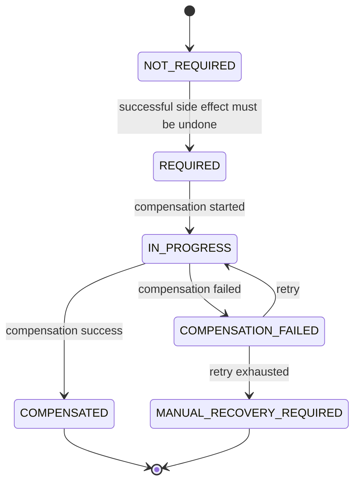

---

## 18. Fallout and Exception Recovery

Enterprise OMS must treat fallout as first-class domain, not just error logs.

Fallout means the order cannot proceed automatically and needs repair, retry, compensation, manual decision, or external reconciliation.

Fallout fields:

```text
fallout_id
order_id
order_item_id
task_id
severity
category
status
failure_code
message
retryable
owner_team
created_at
last_attempt_at
resolved_at
resolution_type
resolution_note
```

Fallout statuses:

```text
OPEN
ASSIGNED
RETRY_SCHEDULED
WAITING_EXTERNAL
MANUAL_ACTION_REQUIRED
RESOLVED
CLOSED
```

Fallout invariants:

```text
Fallout must reference affected business object.
Fallout must have category and severity.
Resolving fallout must record resolution evidence.
Retrying fallout must be tied to a retryable failure.
Closing fallout must not silently complete order unless state transition succeeds.
Manual repair must go through command path, not direct DB update.
```

---

## 19. Where To Put State Transition Logic In Java

Do not scatter state transition checks across resource classes, workers, and mappers.

Recommended layering:

```text
JAX-RS Resource
  -> Application Service
      -> Domain Aggregate / State Machine
          -> Repository
              -> MyBatis Mapper
```

### 19.1 Domain Transition Example

```java
public final class Quote {
    private final QuoteId id;
    private final QuoteStatus status;
    private final int revision;
    private final Instant validUntil;
    private final PriceSnapshot priceSnapshot;

    public Quote accept(CustomerAcceptance acceptance, Instant now) {
        if (status != QuoteStatus.APPROVED) {
            throw new IllegalStateException("Only APPROVED quote can be accepted");
        }
        if (!now.isBefore(validUntil)) {
            throw new QuoteExpiredException(id);
        }
        if (!priceSnapshot.isFrozen()) {
            throw new PriceNotFrozenException(id);
        }
        return withStatus(QuoteStatus.ACCEPTED)
            .withAcceptanceEvidence(acceptance, now);
    }
}
```

### 19.2 Transition Table Example

For complex lifecycle, use explicit transition table.

```java
public final class OrderStateMachine {
    private static final Map<OrderStatus, Set<OrderStatus>> ALLOWED = Map.of(
        OrderStatus.DRAFT, Set.of(OrderStatus.ACKNOWLEDGED),
        OrderStatus.ACKNOWLEDGED, Set.of(OrderStatus.VALIDATED, OrderStatus.FAILED, OrderStatus.CANCELLATION_PENDING),
        OrderStatus.VALIDATED, Set.of(OrderStatus.DECOMPOSED, OrderStatus.FALLOUT, OrderStatus.CANCELLATION_PENDING),
        OrderStatus.DECOMPOSED, Set.of(OrderStatus.IN_PROGRESS, OrderStatus.CANCELLATION_PENDING),
        OrderStatus.IN_PROGRESS, Set.of(OrderStatus.PARTIALLY_COMPLETED, OrderStatus.COMPLETED, OrderStatus.HELD, OrderStatus.FALLOUT, OrderStatus.CANCELLATION_PENDING),
        OrderStatus.COMPLETED, Set.of(OrderStatus.CLOSED),
        OrderStatus.CANCELLED, Set.of(OrderStatus.CLOSED),
        OrderStatus.FAILED, Set.of(OrderStatus.CLOSED),
        OrderStatus.CLOSED, Set.of()
    );

    public void assertTransition(OrderStatus from, OrderStatus to) {
        if (!ALLOWED.getOrDefault(from, Set.of()).contains(to)) {
            throw new IllegalStateException("Illegal order transition: " + from + " -> " + to);
        }
    }
}
```

Do not over-engineer with generic workflow framework inside domain model.

A simple explicit state machine is often better than a magical one.

---

## 20. Database Guardrails

Database should not contain all business logic, but it must prevent impossible data.

Examples:

```sql
alter table quote
add constraint chk_quote_status
check (status in (
    'DRAFT', 'CONFIGURED', 'PRICED', 'SUBMITTED', 'APPROVAL_PENDING',
    'APPROVED', 'REJECTED', 'ACCEPTED', 'EXPIRED', 'CANCELLED', 'CONVERTED'
));

alter table product_instance
add constraint chk_product_instance_status
check (status in (
    'PENDING_ACTIVATION', 'ACTIVE', 'PENDING_MODIFICATION', 'SUSPENDED',
    'PENDING_DISCONNECT', 'DISCONNECTED', 'CANCELLED', 'ERROR'
));

alter table product_instance
add constraint chk_active_has_activation_date
check (
    status <> 'ACTIVE' or activation_date is not null
);

alter table product_instance
add constraint chk_disconnected_has_termination_date
check (
    status <> 'DISCONNECTED' or termination_date is not null
);
```

However, not every invariant should be database check.

Example:

```text
Order cannot complete unless all mandatory items completed.
```

This is aggregate-level logic, not simple row-level check.

Enforce in domain/application layer, then verify with integration tests and operational consistency checks.

---

## 21. Invariants Under Kafka Delivery

Kafka consumers can receive duplicate events, delayed events, or events after local state changed.

Consumer invariants:

```text
Do not process event twice.
Do not apply stale event over newer state.
Do not infer command success purely from event arrival unless event is authoritative.
Do not emit downstream event unless local state transition succeeded.
```

Inbox table pattern:

```sql
create table inbox_message (
    message_id uuid primary key,
    topic varchar(200) not null,
    partition_no int not null,
    offset_no bigint not null,
    event_type varchar(120) not null,
    received_at timestamptz not null default now(),
    processed_at timestamptz null,
    status varchar(40) not null,
    failure_reason text null
);
```

Consumer flow:

```text
begin transaction
  insert inbox_message if absent
  load aggregate
  check expected version / state
  apply state transition if valid
  write outbox if needed
  mark inbox processed
commit
```

If duplicate event arrives, insert fails or existing message is found, and consumer returns success without duplicate side effect.

---

## 22. Invariants Under Camunda/Zeebe Retry

Zeebe job workers can retry jobs.

Worker invariants:

```text
Worker must be idempotent.
Worker must not create duplicate external side effects on retry.
Worker must distinguish business error from technical retryable error.
Worker must not complete job if domain command failed.
Worker must map external result to explicit domain command.
```

Bad worker:

```java
externalProvisioning.activateService(request);
jobClient.newCompleteCommand(job).send();
```

Better worker:

```java
ActivationResult result = provisioningAdapter.activateServiceWithIdempotency(request);
assetApplicationService.completeActivation(commandFrom(result));
jobClient.newCompleteCommand(job).send();
```

Even better: if domain update fails after external success, worker must report failure/fallout, not pretend everything completed.

---

## 23. Repair Commands Must Obey Invariants

Production systems need manual repair.

But manual repair must not mean direct DB mutation.

Repair commands examples:

```text
MarkExternalTaskAsSucceededAfterVerification
ReleaseStuckAssetOperationGuard
CorrectProductInstanceStatus
AttachMissingExternalServiceReference
RetryFailedBillingTrigger
CloseFalloutWithManualResolution
```

Repair command invariants:

```text
Repair must require actor and reason.
Repair must reference evidence.
Repair must create audit event.
Repair must not skip state machine unless command is explicitly privileged.
Privileged bypass must be extremely narrow and logged.
```

Repair is part of system design, not embarrassment.

The embarrassment is needing repair but having no safe mechanism.

---

## 24. End-To-End Example: Quote To Order To Asset

Let's trace invariants across flow.

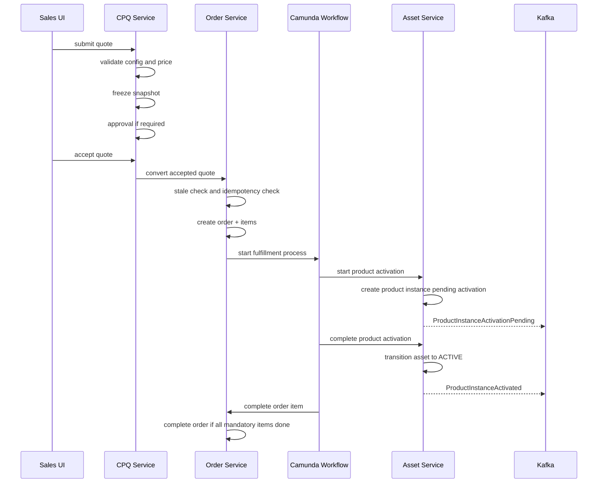

Invariant checkpoints:

```text
Quote submit: configuration valid and price not stale.
Quote accept: approved and not expired.
Quote convert: accepted and not already converted.
Order create: quote snapshot preserved.
Workflow start: order decomposed.
Asset activation: product instance not already active.
Order completion: mandatory items completed.
Event emission: outbox only after DB transition committed.
```

---

## 25. Testing Strategy

### 25.1 Transition Matrix Tests

For every state machine, create matrix tests:

```text
from_state | command | expected_to_state | allowed?
```

Example:

```text
APPROVED + accept -> ACCEPTED allowed
EXPIRED + accept -> rejected
ACCEPTED + edit -> rejected
CONVERTED + convert -> rejected
```

### 25.2 Invariant Property Tests

For complex state machines, generate sequences of commands and assert global invariants.

Example properties:

```text
No quote reaches ACCEPTED without frozen price.
No order reaches COMPLETED with incomplete mandatory item.
No product instance reaches ACTIVE without activation date.
No approval decision exists without actor and timestamp.
```

### 25.3 Concurrent Command Tests

Simulate:

```text
two quote conversions with same accepted quote
two modify orders targeting same asset
duplicate Kafka event completing same task
duplicate Zeebe job retry after external success
```

Expected result:

```text
only one state transition succeeds
other operation becomes idempotent success or business rejection
no duplicate order/asset/event side effect
```

### 25.4 Database Constraint Tests

Test check constraints and unique constraints explicitly.

```text
cannot insert ACTIVE product_instance without activation_date
cannot insert duplicate active asset operation guard
cannot insert unsupported status
cannot insert order_item referencing wrong order aggregate if FK exists
```

### 25.5 Scenario Tests

Scenarios:

```text
quote approval superseded after price change
quote expires before acceptance
quote accepted then converted once
order fails decomposition and enters fallout
fulfillment task timeout then external reconciliation succeeds
asset disconnect requires child add-on handling
subscription renewal does not duplicate product instance
```

---

## 26. Design Smells

Watch for these smells.

### 26.1 Status As Free Text

If status is arbitrary string with no central transition rule, state machine does not exist.

### 26.2 Boolean Explosion

Fields like these often indicate missing state machine:

```text
is_approved
is_cancelled
is_completed
is_failed
is_active
is_pending
```

Use status and transition model instead.

### 26.3 Workflow Owns Domain State

If BPMN diagram directly decides business state without domain aggregate validation, the workflow becomes the domain model.

That is fragile.

Workflow orchestrates. Domain validates.

### 26.4 Database Update Script As Normal Operation

If production support fixes orders by running SQL update manually, the system lacks repair commands.

### 26.5 Events As Truth Without Local Guard

If consumer applies every event without checking local state/version, duplicate or stale events will corrupt state.

### 26.6 Terminal State Mutation

If closed/completed/cancelled entities keep changing under normal commands, audit and lifecycle semantics are weak.

---

## 27. Practical Implementation Rule

For every command, define this table before coding:

```text
Command:
Aggregate:
Allowed source states:
Required input:
Required current-state checks:
Required related-object checks:
State transition:
Data mutation:
History/audit record:
Outbox event:
Idempotency behavior:
Failure behavior:
```

Example:

```text
Command: ConvertQuoteToOrder
Aggregate: Quote + Order creation boundary
Allowed source states: Quote ACCEPTED
Required input: quote_id, quote_revision, idempotency_key, actor
Required current-state checks: quote not expired, not converted, price frozen
Required related-object checks: installed base versions still match quote snapshot
State transition: Quote ACCEPTED -> CONVERTED
Data mutation: insert order, order_items, update quote converted marker
History/audit record: quote conversion audit
Outbox event: OrderCreated
Idempotency behavior: same key returns existing order
Failure behavior: stale asset causes conversion rejection requiring requote
```

This format prevents accidental logic gaps.

---

## 28. Ringkasan

Invariants dan state machines adalah safety rail sistem CPQ/OMS.

Tanpa keduanya, sistem akan terlihat sederhana, tetapi semua complexity akan bocor ke bug production, manual SQL repair, duplicate order, stale price, invalid asset, dan workflow incident yang sulit dijelaskan.

Prinsip utama part ini:

1. invariant adalah aturan yang harus selalu benar;
2. state machine membuat lifecycle eksplisit;
3. schema validation bukan pengganti domain invariant;
4. quote, approval, order, order item, task, asset, dan subscription perlu lifecycle terpisah;
5. terminal state harus dihormati;
6. cancellation berbeda dari compensation;
7. timeout bukan berarti external failure;
8. Kafka consumer harus idempotent dan state-aware;
9. Camunda worker harus memanggil domain command, bukan mengubah state sendiri;
10. repair command harus audit-friendly;
11. database constraint adalah guardrail, bukan tempat semua business logic;
12. transition matrix harus dites.

Blok domain modelling awal selesai sampai di sini.

Part berikutnya akan masuk ke **API First and Schema First Strategy**, di mana kita mulai mengubah domain backbone ini menjadi kontrak API dan schema yang bisa dikembangkan secara production-grade.
