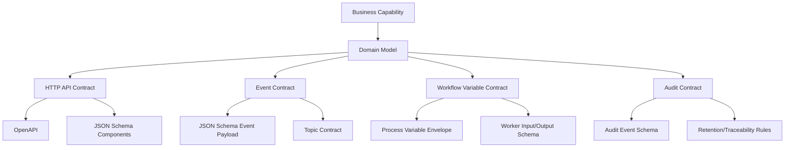
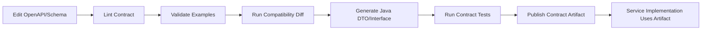
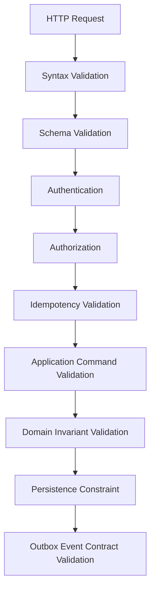
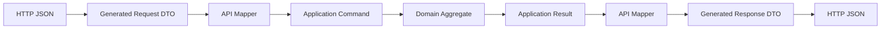
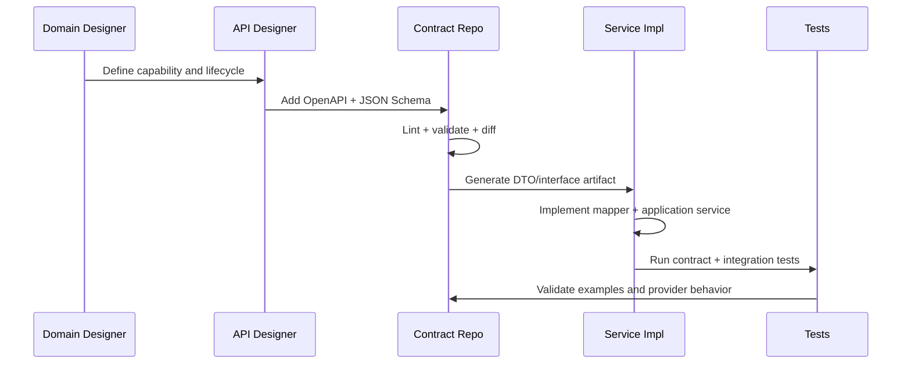

------
title: Build From Scratch: Enterprise Java Microservices CPQ & Order Management Platform - Part 013
description: Menyusun strategi OpenAPI First dan Schema First untuk CPQ/OMS enterprise: contract ownership, schema governance, compatibility, generated artifacts, validation pipeline, documentation, testing, dan change management agar API tidak bergantung pada kebetulan implementasi Java.
series: learn-enterprise-cpq-oms-glassfish-camunda8
seriesTitle: Build From Scratch: Enterprise Java Microservices CPQ & Order Management Platform
order: 13
partTitle: API First and Schema First Strategy
tags:
  - java
  - microservices
  - cpq
  - oms
  - openapi
  - schema-first
  - json-schema
  - api-design
  - contract-testing
  - enterprise-architecture
date: 2026-07-02
---

# Part 013 — API First and Schema First Strategy

Di Part 012 kita mengunci **domain invariants** dan **state machines**.

Sekarang kita masuk ke blok baru: **API First** dan **Schema First**.

Banyak tim mengira API-first berarti menulis file `openapi.yaml` sebelum coding. Itu terlalu dangkal.

Dalam sistem CPQ/OMS enterprise, API-first berarti:

```text
Kontrak eksternal lebih stabil daripada implementasi internal.
```

Schema-first berarti:

```text
Struktur data yang dipertukarkan antar boundary harus eksplisit, tervalidasi, versioned, dan bisa diuji terpisah dari service runtime.
```

Keduanya bukan ritual dokumentasi.

Keduanya adalah **mechanism of control** agar sistem besar tidak berubah menjadi kumpulan endpoint ad-hoc.

---

## 1. Target Part Ini

Part ini membahas:

1. kenapa API-first penting untuk CPQ/OMS;
2. perbedaan API contract, schema contract, dan domain model;
3. OpenAPI sebagai kontrak HTTP;
4. JSON Schema sebagai kontrak struktur data;
5. strategi contract ownership;
6. struktur repository kontrak;
7. boundary antara public API, internal API, dan event schema;
8. naming, type system, ID, Money, status, timestamp, dan enum;
9. validation pipeline;
10. code generation strategy;
11. compatibility policy;
12. governance dan review process;
13. contract testing;
14. documentation strategy;
15. CI/CD quality gates;
16. kesalahan desain yang harus dihindari.

Part ini belum membuat semua endpoint.

Kita sedang menentukan **aturan main** sebelum endpoint dibuat di Part 014 dan setelahnya.

---

## 2. Mental Model: API Bukan Method Remote

API sering diperlakukan seperti method Java yang kebetulan dipanggil lewat HTTP:

```text
POST /calculatePrice
POST /submitQuote
POST /changeOrderStatus
POST /doFulfillment
```

Ini cepat di awal, tetapi buruk untuk sistem enterprise.

Kenapa?

Karena API seperti itu:

- tidak menjelaskan resource lifecycle;
- tidak punya model ownership;
- sulit dipagination;
- sulit di-cache;
- sulit diaudit;
- sulit diverifikasi compatibility-nya;
- sulit dipakai banyak consumer;
- cenderung membocorkan nama method internal;
- membuat client tahu terlalu banyak tentang implementasi service.

API enterprise harus dimodelkan sebagai **business surface**.

Business surface berarti API menjawab:

```text
Apa resource yang dimiliki service ini?
Command apa yang legal terhadap resource itu?
State apa yang bisa diamati consumer?
Snapshot apa yang dijanjikan stabil?
Error apa yang bisa diterima consumer?
Apa yang aman untuk retry?
Apa yang immutable?
Apa yang versioned?
```

---

## 3. OpenAPI First: Definisi Praktis

OpenAPI First dalam seri ini berarti:

```text
OpenAPI adalah kontrak resmi untuk HTTP API sebelum implementasi Java dianggap valid.
```

Konsekuensinya:

- endpoint tidak boleh muncul hanya karena ada resource class JAX-RS;
- request/response tidak boleh mengikuti shape entity database;
- error response harus dikontrak;
- idempotency harus dikontrak;
- pagination harus dikontrak;
- enum harus dikontrak;
- status code harus dikontrak;
- examples harus dikontrak;
- breaking change harus terdeteksi di CI.

OpenAPI bukan sekadar dokumentasi setelah code selesai.

OpenAPI adalah **source of contract truth** untuk HTTP boundary.

---

## 4. Schema First: Definisi Praktis

Schema First dalam seri ini berarti:

```text
Data shape yang melintasi boundary harus didefinisikan sebagai schema yang eksplisit, reusable, dan bisa divalidasi otomatis.
```

Boundary yang kita maksud:

- HTTP request;
- HTTP response;
- Kafka event payload;
- workflow variable envelope;
- outbox payload;
- inbox payload;
- audit payload;
- external integration payload;
- snapshot payload.

Untuk CPQ/OMS, schema-first sangat penting karena object yang bergerak bukan sekadar `name`, `email`, `address`.

Object yang bergerak adalah:

- product configuration;
- quote item snapshot;
- price breakdown;
- approval decision;
- order decomposition result;
- fulfillment task command;
- compensation result;
- asset snapshot;
- subscription change plan.

Jika shape ini berubah tanpa kontrak, kerusakan bisa menyebar ke banyak service dan consumer.

---

## 5. OpenAPI vs JSON Schema vs Domain Model

Jangan mencampur tiga hal ini.

| Layer | Fungsi | Contoh | Tidak Boleh Menjadi |
|---|---|---|---|
| OpenAPI | Mendeskripsikan HTTP API | path, method, status code, request body, response body, security | domain model murni |
| JSON Schema | Mendeskripsikan struktur JSON | required property, type, enum, oneOf, pattern | business rule engine penuh |
| Domain Model | Menjaga meaning dan invariant | quote cannot be accepted after expiry | DTO publik |

Contoh:

```yaml
QuoteStatus:
  type: string
  enum:
    - DRAFT
    - PRICED
    - SUBMITTED
    - APPROVED
    - ACCEPTED
    - EXPIRED
    - CANCELLED
```

Schema di atas hanya berkata bahwa `status` harus salah satu dari enum.

Schema tidak bisa membuktikan bahwa:

```text
DRAFT boleh ke SUBMITTED hanya jika quote sudah valid dan priced.
APPROVED boleh ke ACCEPTED hanya jika belum expired.
ACCEPTED tidak boleh diubah item-nya.
```

Itu tugas domain model dan application service.

Schema menjaga **shape**.

Domain menjaga **meaning**.

---

## 6. Contract Stack Untuk Sistem Ini

Kita akan memakai beberapa jenis kontrak.



Catatan penting:

- OpenAPI mengatur HTTP API.
- JSON Schema mengatur data shape.
- Kafka topic contract mengatur event routing dan ordering key.
- Workflow variable contract mengatur data yang masuk/keluar worker.
- Audit contract mengatur evidence.

Semua layer ini berbeda, tetapi harus konsisten secara vocabulary.

---

## 7. Contract Ownership

Sistem CPQ/OMS enterprise gagal ketika tidak jelas siapa pemilik kontrak.

Aturan yang akan kita pakai:

```text
Service owner owns the API contract.
Domain owner owns the vocabulary.
Platform/API guild owns standards.
Consumer can propose contract changes, but cannot force internal model exposure.
```

Contoh ownership:

| Contract | Owner | Consumer | Governance |
|---|---|---|---|
| Catalog API | Catalog service team | CPQ, OMS, UI, partner | API review |
| Quote API | Quote service team | sales UI, partner, order service | API + domain review |
| Order API | OMS service team | sales UI, customer care, partner | API + operations review |
| Pricing schema | Pricing domain owner | Quote service, approval, UI | domain review |
| Order event schema | OMS service owner | billing, provisioning, notification | event review |
| Audit schema | platform/compliance owner | audit explorer, regulator support | compliance review |

Yang harus dihindari:

```text
Consumer meminta field internal karena lebih mudah bagi UI.
Service menambahkan field publik tanpa review.
Database migration otomatis mengubah response API.
Kafka event memakai entity database serialized mentah.
Workflow variable diisi object domain penuh tanpa schema.
```

---

## 8. Public API, Internal API, dan Integration API

Tidak semua API punya audience yang sama.

Kita akan membagi API menjadi tiga kategori.

### 8.1 Public/Partner API

Dipakai oleh sistem di luar boundary organisasi atau partner channel.

Karakteristik:

- paling stabil;
- versioning ketat;
- dokumentasi kuat;
- tidak mengekspos detail internal;
- security policy eksplisit;
- error model stabil;
- deprecation window panjang.

Contoh:

```text
GET /product-offerings
POST /quotes
GET /quotes/{quoteId}
POST /quotes/{quoteId}/submission-requests
POST /orders
GET /orders/{orderId}
```

### 8.2 Internal API

Dipakai antar service internal atau internal UI.

Karakteristik:

- tetap harus dikontrak;
- bisa lebih kaya;
- tidak berarti boleh sembarangan;
- lifecycle lebih cepat daripada public API;
- masih butuh compatibility test.

Contoh:

```text
POST /internal/catalog-resolution-requests
POST /internal/order-decomposition-requests
GET /internal/orders/{orderId}/execution-view
```

### 8.3 Integration API

Dipakai untuk adapter ke external system seperti billing, provisioning, inventory, document generation, payment.

Karakteristik:

- banyak mapping dan anti-corruption layer;
- error taxonomy penting;
- idempotency wajib;
- audit wajib;
- tidak boleh mencemari domain model internal.

Contoh:

```text
POST /integrations/billing/customer-order-submission-requests
POST /integrations/provisioning/service-activation-requests
```

---

## 9. Jangan Membuat API dari Database Table

Anti-pattern:

```text
Table: quote
Endpoint: /quotes

Table: quote_item
Endpoint: /quote-items

Table: price_component
Endpoint: /price-components

Table: approval_request
Endpoint: /approval-requests
```

Kadang masuk akal, tetapi sering merusak business boundary.

Consumer tidak butuh tahu semua tabel.

Consumer butuh business operation:

```text
Create quote.
Add item to quote.
Configure item.
Run pricing.
Submit quote for approval.
Accept quote.
Convert quote to order.
Track order.
Request cancellation.
```

Database table adalah implementation detail.

API resource adalah business contract.

---

## 10. Contract Repository Structure

Kita akan memakai struktur seperti ini:

```text
contracts/
  openapi/
    public/
      catalog-api.yaml
      quote-api.yaml
      order-api.yaml
      asset-api.yaml
    internal/
      catalog-internal-api.yaml
      pricing-internal-api.yaml
      decomposition-internal-api.yaml
    integration/
      billing-adapter-api.yaml
      provisioning-adapter-api.yaml

  schemas/
    common/
      money.schema.json
      period.schema.json
      error.schema.json
      pagination.schema.json
      audit-metadata.schema.json
      idempotency.schema.json
    catalog/
      product-offering.schema.json
      product-specification.schema.json
      product-configuration-rule.schema.json
    quote/
      quote.schema.json
      quote-item.schema.json
      quote-price-snapshot.schema.json
      submit-quote-command.schema.json
    order/
      order.schema.json
      order-item.schema.json
      order-decomposition-result.schema.json
    event/
      quote-event.schema.json
      order-event.schema.json
      asset-event.schema.json
    workflow/
      quote-approval-worker-input.schema.json
      order-fulfillment-worker-input.schema.json

  examples/
    quote/
      create-quote-request.json
      priced-quote-response.json
      approval-required-quote-response.json
    order/
      create-order-from-quote-request.json
      order-in-progress-response.json

  rules/
    compatibility-policy.md
    naming-policy.md
    error-policy.md
    versioning-policy.md
```

Kenapa kontrak dipisahkan?

Agar contract bisa:

- direview sebelum code;
- dites tanpa menjalankan service;
- digunakan oleh UI/backend/QA;
- digunakan untuk generate client/server stub;
- dibandingkan antar versi;
- dipakai untuk documentation portal.

---

## 11. API Contract Build Pipeline

Pipeline kontrak minimal:



Quality gate:

| Gate | Tujuan |
|---|---|
| schema validation | memastikan file schema valid |
| OpenAPI validation | memastikan spec valid |
| linting | memastikan style dan consistency |
| examples validation | memastikan examples cocok schema |
| breaking change detection | mencegah perubahan merusak consumer |
| generated code compile | memastikan contract bisa dipakai Java |
| consumer contract test | memastikan expectation consumer masih valid |
| documentation build | memastikan docs bisa dipublish |

---

## 12. Naming Policy

Naming yang buruk akan menyebar ke seluruh organisasi.

Gunakan vocabulary yang stabil.

### 12.1 Resource Name

Gunakan plural noun untuk collection:

```text
/product-offerings
/product-specifications
/quotes
/orders
/assets
/subscriptions
/approval-requests
```

Jangan gunakan nama teknis internal:

```text
/q_hdr
/q_item
/order_master
/wf_task
/cpq_calc
```

### 12.2 Command Name

Untuk business transition, jangan memaksa semuanya menjadi `PATCH status`.

Buruk:

```http
PATCH /quotes/{quoteId}
{
  "status": "SUBMITTED"
}
```

Lebih baik:

```http
POST /quotes/{quoteId}/submission-requests
```

Kenapa?

Karena `submit` bukan update field. Itu command dengan aturan:

- quote harus valid;
- quote harus priced;
- quote belum expired;
- quote belum submitted;
- mungkin membutuhkan approval;
- harus membuat audit event;
- harus membuat workflow instance;
- harus idempotent.

### 12.3 Enum Name

Gunakan enum yang domain-readable.

```text
DRAFT
CONFIGURING
PRICED
VALIDATION_FAILED
APPROVAL_REQUIRED
SUBMITTED
APPROVED
ACCEPTED
CONVERTED_TO_ORDER
EXPIRED
CANCELLED
```

Hindari enum vendor/internal:

```text
S1
S2
OK
NOK
WF_001
PROC_DONE
```

---

## 13. Identifier Policy

ID adalah kontrak jangka panjang.

Aturan:

1. Jangan mengekspos auto-increment integer sebagai ID publik.
2. Gunakan opaque ID untuk public API.
3. Jangan encode business meaning di ID.
4. Jangan membuat client bergantung pada prefix parsing.
5. Bedakan `id`, `externalId`, `correlationId`, `sourceSystemId`, dan `businessKey`.

Contoh:

```json
{
  "id": "quo_01JZ7QK7ZXF4VV62CM6GBJ2T8V",
  "externalId": "PARTNER-QUOTE-88371",
  "correlationId": "corr_01JZ7QK9P0HMTGQEDABVX7EGA5",
  "businessKey": "Q-2026-00000123"
}
```

Makna:

| Field | Meaning |
|---|---|
| `id` | primary API identity |
| `externalId` | ID dari consumer/partner |
| `correlationId` | trace antar request/event |
| `businessKey` | nomor manusiawi untuk operasional |
| `sourceSystemId` | ID dari upstream system tertentu |

---

## 14. Money Policy

Jangan kirim price sebagai number polos.

Buruk:

```json
{
  "price": 100000
}
```

Lebih aman:

```json
{
  "amount": "100000.00",
  "currency": "IDR"
}
```

Kenapa `amount` string?

Karena JSON number tidak membawa precision decimal yang cukup aman untuk semua client. Dalam Java domain, kita pakai `BigDecimal`. Di kontrak JSON, string decimal lebih eksplisit.

Schema:

```json
{
  "$id": "https://example.com/schemas/common/money.schema.json",
  "$schema": "https://json-schema.org/draft/2020-12/schema",
  "type": "object",
  "required": ["amount", "currency"],
  "properties": {
    "amount": {
      "type": "string",
      "pattern": "^-?[0-9]+(\\.[0-9]{1,6})?$"
    },
    "currency": {
      "type": "string",
      "pattern": "^[A-Z]{3}$"
    }
  },
  "additionalProperties": false
}
```

Domain invariant tetap di Java:

```text
Quote total cannot be negative unless it is a credit quote.
Recurring charge currency must match quote currency.
Discount cannot create invalid tax basis.
```

---

## 15. Timestamp and Period Policy

Gunakan timestamp dengan timezone/offset.

Contoh:

```json
{
  "createdAt": "2026-07-02T10:15:30+07:00",
  "validFrom": "2026-07-02T00:00:00+07:00",
  "validUntil": "2026-07-31T23:59:59+07:00"
}
```

Bedakan:

| Field | Meaning |
|---|---|
| `createdAt` | kapan record dibuat |
| `updatedAt` | kapan record terakhir berubah |
| `effectiveFrom` | kapan dampak bisnis mulai berlaku |
| `effectiveUntil` | kapan dampak bisnis selesai |
| `validFrom` | kapan penawaran/quote valid |
| `validUntil` | kapan penawaran/quote expired |
| `submittedAt` | kapan command submit diterima |
| `completedAt` | kapan lifecycle selesai |

Jangan campur effective time dan transaction time.

Dalam CPQ/OMS, ini critical.

Contoh:

```text
Order dibuat tanggal 10.
Service effective mulai tanggal 15.
Billing harus mulai tanggal 15.
Audit tetap mencatat transaksi tanggal 10.
```

---

## 16. Error Contract Policy

Error tidak boleh berupa string bebas.

Buruk:

```json
{
  "error": "Something went wrong"
}
```

Lebih baik:

```json
{
  "type": "https://example.com/problems/domain-invariant-violation",
  "title": "Domain invariant violation",
  "status": 409,
  "code": "QUOTE_ALREADY_ACCEPTED",
  "message": "Accepted quote cannot be modified.",
  "correlationId": "corr_01JZ7QK9P0HMTGQEDABVX7EGA5",
  "details": [
    {
      "field": "quoteId",
      "reason": "Quote is already in ACCEPTED state."
    }
  ]
}
```

Error taxonomy:

| Category | HTTP Status | Example Code |
|---|---:|---|
| malformed request | 400 | INVALID_JSON |
| schema validation | 400 | REQUEST_SCHEMA_INVALID |
| authentication | 401 | AUTHENTICATION_REQUIRED |
| authorization | 403 | FORBIDDEN_QUOTE_ACCESS |
| not found | 404 | QUOTE_NOT_FOUND |
| conflict/state | 409 | INVALID_QUOTE_STATE |
| idempotency conflict | 409 | IDEMPOTENCY_KEY_REUSED_WITH_DIFFERENT_BODY |
| semantic validation | 422 | PRODUCT_CONFIGURATION_INVALID |
| rate limit | 429 | RATE_LIMIT_EXCEEDED |
| downstream timeout | 504 | PROVISIONING_TIMEOUT |
| internal error | 500 | INTERNAL_ERROR |

Prinsip:

```text
Client should be able to automate response based on code, not parse message text.
```

---

## 17. Validation Pipeline

Validation harus berlapis.



Detail:

| Layer | Menjawab |
|---|---|
| syntax | apakah JSON bisa diparse? |
| schema | apakah shape sesuai kontrak? |
| authn | siapa pemanggil? |
| authz | boleh melakukan command ini? |
| idempotency | apakah request aman diulang? |
| application | apakah command lengkap secara use case? |
| domain | apakah state transition legal? |
| persistence | apakah constraint data tetap aman? |
| event schema | apakah event yang keluar valid? |

Jangan menaruh semua validasi di controller.

JAX-RS resource harus tipis:

```text
HTTP mapping -> authentication context -> command construction -> application service -> response mapping
```

---

## 18. Code Generation Strategy

Code generation berguna, tetapi harus dikontrol.

Ada tiga pendekatan:

### 18.1 Generate DTO Only

OpenAPI menghasilkan request/response DTO.

Domain model tetap manual.

Ini pilihan utama seri ini.

```text
OpenAPI Schema -> Generated DTO -> Mapper -> Domain Command/Result
```

Kelebihan:

- contract tetap source of truth;
- domain tidak tercemar annotation API;
- DTO change tidak otomatis merusak domain;
- mapper menjadi explicit anti-corruption layer.

Kekurangan:

- perlu mapping code;
- perlu disiplin agar mapping tidak asal.

### 18.2 Generate Server Interface

OpenAPI menghasilkan interface controller.

Implementation mengisi interface.

Kelebihan:

- endpoint selalu sinkron kontrak;
- compile-time guard bagus.

Kekurangan:

- kadang bentrok dengan framework style;
- perlu adaptasi untuk JAX-RS/Jersey.

### 18.3 Generate Domain Model

OpenAPI langsung menghasilkan model domain.

Ini **tidak dipakai** untuk sistem ini.

Alasannya:

- domain invariant tidak cukup direpresentasikan DTO;
- domain lifecycle akan tercemar serialization concern;
- public API change bisa merusak internal domain;
- persistence dan API akan terlalu erat.

---

## 19. Mapping Layer Wajib Ada

Kita akan memakai pola ini:



Contoh:

```java
public final class CreateQuoteApiMapper {

    public CreateQuoteCommand toCommand(CreateQuoteRequest request, RequestContext context) {
        return new CreateQuoteCommand(
            CustomerRef.of(request.customerId()),
            SalesChannel.of(request.salesChannel()),
            CurrencyCode.of(request.currency()),
            context.actor(),
            context.correlationId(),
            context.idempotencyKey()
        );
    }
}
```

DTO tidak melakukan business decision.

Mapper tidak melakukan database call.

Application service menjalankan use case.

Domain object menjaga invariant.

---

## 20. Schema Reuse Policy

Schema reuse harus hati-hati.

Jangan membuat satu schema raksasa `Quote` untuk semua konteks.

Buruk:

```text
Quote schema digunakan untuk:
- create request
- update request
- response
- event
- workflow variable
- audit payload
```

Masalah:

- create request tidak punya semua field;
- response punya computed fields;
- event harus immutable;
- workflow variable mungkin hanya butuh subset;
- audit perlu before/after;
- perubahan response bisa merusak event consumer.

Lebih baik:

```text
CreateQuoteRequest
QuoteResponse
QuoteSummaryResponse
QuotePriceSnapshot
QuoteAcceptedEventPayload
QuoteApprovalWorkerInput
QuoteAuditRecordPayload
```

Reuse boleh di value object stabil:

```text
Money
Period
Address
ActorRef
CustomerRef
ProductOfferingRef
Pagination
ProblemDetail
```

---

## 21. Request Schema vs Response Schema

Request dan response tidak boleh otomatis sama.

Contoh create quote request:

```json
{
  "customerId": "cus_01JZ7R6JXXM3B2ZD8EV2B4H6JD",
  "salesChannel": "DIRECT_SALES",
  "currency": "IDR"
}
```

Quote response:

```json
{
  "id": "quo_01JZ7R7Y95W6PPXN3DWV4K8FQG",
  "status": "DRAFT",
  "customerId": "cus_01JZ7R6JXXM3B2ZD8EV2B4H6JD",
  "salesChannel": "DIRECT_SALES",
  "currency": "IDR",
  "version": 1,
  "createdAt": "2026-07-02T10:15:30+07:00",
  "updatedAt": "2026-07-02T10:15:30+07:00"
}
```

Request adalah **intent**.

Response adalah **observable state**.

Jangan campur.

---

## 22. Event Schema vs API Schema

Event bukan response API yang dikirim ke Kafka.

API response menjawab permintaan client sekarang.

Event memberitahu fakta yang sudah terjadi.

Contoh response:

```json
{
  "id": "quo_01JZ7R7Y95W6PPXN3DWV4K8FQG",
  "status": "DRAFT"
}
```

Contoh event:

```json
{
  "eventId": "evt_01JZ7R9BEK4X2X1WDYKXQB5GE7",
  "eventType": "QUOTE_CREATED",
  "occurredAt": "2026-07-02T10:15:30+07:00",
  "aggregateType": "QUOTE",
  "aggregateId": "quo_01JZ7R7Y95W6PPXN3DWV4K8FQG",
  "aggregateVersion": 1,
  "correlationId": "corr_01JZ7QK9P0HMTGQEDABVX7EGA5",
  "payload": {
    "quoteId": "quo_01JZ7R7Y95W6PPXN3DWV4K8FQG",
    "customerId": "cus_01JZ7R6JXXM3B2ZD8EV2B4H6JD",
    "status": "DRAFT"
  }
}
```

Event harus punya envelope.

Minimal:

- event ID;
- event type;
- aggregate type;
- aggregate ID;
- aggregate version;
- occurred at;
- correlation ID;
- causation ID;
- tenant ID jika multi-tenant;
- schema version;
- payload.

---

## 23. Workflow Variable Schema

Camunda/Zeebe process variable juga perlu kontrak.

Anti-pattern:

```java
client.newCreateInstanceCommand()
    .bpmnProcessId("order-fulfillment")
    .latestVersion()
    .variables(orderAggregate)
    .send();
```

Jangan kirim aggregate penuh.

Kirim variable envelope yang sengaja didesain.

Contoh:

```json
{
  "orderId": "ord_01JZ7RBSCXN671BXFY8ZGM88GM",
  "orderVersion": 3,
  "fulfillmentPlanId": "ffp_01JZ7RC502RYZ9GTEX1P1RG10M",
  "customerId": "cus_01JZ7R6JXXM3B2ZD8EV2B4H6JD",
  "correlationId": "corr_01JZ7QK9P0HMTGQEDABVX7EGA5"
}
```

Worker mengambil detail dari service/database sesuai kebutuhan.

Kenapa?

- process instance bisa long-running;
- variable lama bisa stale;
- aggregate shape bisa berubah;
- payload besar membuat workflow berat;
- audit workflow lebih jelas jika variable minimal.

---

## 24. Compatibility Policy

Compatibility bukan opini. Kita harus punya aturan.

### 24.1 Additive Change Biasanya Aman

Contoh aman:

- menambah optional response field;
- menambah enum baru hanya jika consumer siap unknown enum;
- menambah optional request field;
- menambah endpoint baru;
- menambah error detail optional;
- menambah link relation baru.

Tetapi hati-hati: enum baru bisa breaking untuk client yang deserialize strict.

### 24.2 Breaking Change

Contoh breaking:

- menghapus field;
- mengubah type field;
- membuat optional field menjadi required;
- mengubah semantic field;
- mengubah status code sukses utama;
- menghapus enum value;
- mengganti meaning enum value;
- mengubah pagination shape;
- mengubah ID format yang diparse consumer;
- mengubah error code.

### 24.3 Semantic Breaking Change

Ini lebih berbahaya karena tidak selalu terdeteksi schema diff.

Contoh:

```text
Field validUntil sebelumnya inclusive, sekarang exclusive.
Price total sebelumnya before tax, sekarang after tax.
Quote status APPROVED sebelumnya berarti semua approval selesai, sekarang berarti approval level 1 selesai.
Order COMPLETED sebelumnya berarti fulfillment complete, sekarang berarti accepted by downstream.
```

Untuk itu, description dan examples harus dianggap bagian dari contract review.

---

## 25. Versioning Strategy

Kita gunakan prinsip:

```text
Avoid versioning by default. Version only when compatibility cannot be preserved.
```

Urutan preferensi:

1. additive change;
2. optional field;
3. new endpoint/resource;
4. behavior flag dengan masa transisi;
5. versioned media type atau path major version;
6. parallel API major version;
7. deprecate old version.

Untuk seri ini, public API bisa memakai path major version:

```text
/api/v1/quotes
/api/v1/orders
```

Bukan karena paling indah, tetapi karena mudah dipahami dalam enterprise environment.

Internal schema tetap punya `schemaVersion`.

Event wajib punya schema version:

```json
{
  "eventType": "ORDER_SUBMITTED",
  "schemaVersion": "1.2.0"
}
```

---

## 26. Contract Review Checklist

Sebelum contract diterima, jawab:

```text
Does this expose a business resource, not internal table?
Is the command idempotent or explicitly non-idempotent?
Is correlation ID supported?
Is error taxonomy clear?
Are state transitions explicit?
Are examples valid?
Are fields named using domain vocabulary?
Are Money and timestamp represented safely?
Are optional and required fields justified?
Is pagination required?
Does this leak workflow engine internals?
Does this leak database implementation?
Can old clients survive this change?
Does this contract support audit/debugging?
```

Jika jawaban banyak yang tidak jelas, kontrak belum siap.

---

## 27. OpenAPI File Skeleton

Contoh skeleton untuk Quote API:

```yaml
openapi: 3.1.1
info:
  title: Quote API
  version: 1.0.0
  description: API for managing enterprise CPQ quote lifecycle.
servers:
  - url: https://api.example.com/api/v1
security:
  - bearerAuth: []
paths:
  /quotes:
    post:
      operationId: createQuote
      summary: Create a draft quote.
      parameters:
        - $ref: '#/components/parameters/CorrelationId'
        - $ref: '#/components/parameters/IdempotencyKey'
      requestBody:
        required: true
        content:
          application/json:
            schema:
              $ref: '#/components/schemas/CreateQuoteRequest'
      responses:
        '201':
          description: Quote created.
          content:
            application/json:
              schema:
                $ref: '#/components/schemas/QuoteResponse'
        '400':
          $ref: '#/components/responses/BadRequest'
        '409':
          $ref: '#/components/responses/Conflict'
components:
  securitySchemes:
    bearerAuth:
      type: http
      scheme: bearer
      bearerFormat: JWT
  parameters:
    CorrelationId:
      name: X-Correlation-Id
      in: header
      required: false
      schema:
        type: string
    IdempotencyKey:
      name: Idempotency-Key
      in: header
      required: true
      schema:
        type: string
        minLength: 16
        maxLength: 128
  schemas:
    CreateQuoteRequest:
      type: object
      required:
        - customerId
        - salesChannel
        - currency
      properties:
        customerId:
          type: string
        salesChannel:
          type: string
        currency:
          type: string
          pattern: '^[A-Z]{3}$'
      additionalProperties: false
```

Catatan:

- `operationId` wajib stabil;
- idempotency header wajib untuk command mutating;
- error response reusable;
- request schema tidak memakai database entity;
- response schema dipisah.

---

## 28. Contract Artifact Versioning

Contract harus dipublish sebagai artifact.

Contoh artifact:

```text
com.example.cpq.contracts:quote-api-openapi:1.4.0
com.example.cpq.contracts:quote-api-java-dto:1.4.0
com.example.cpq.contracts:quote-events-schema:1.2.0
```

Service implementation bergantung pada artifact contract yang eksplisit.

Consumer juga bisa bergantung pada artifact yang sama.

Dengan begitu:

- contract drift lebih mudah dideteksi;
- UI bisa generate client;
- integration test bisa pakai schema yang sama;
- breaking change bisa dibahas dengan versi nyata.

---

## 29. Consumer-Driven Contract Testing

Contract testing menjawab:

```text
Apakah provider masih memenuhi ekspektasi consumer yang valid?
```

Contoh consumer expectation:

```text
When quote is accepted,
GET /quotes/{quoteId}
returns status ACCEPTED,
acceptedAt is present,
priceSnapshot is present,
and accepted quote item IDs remain stable.
```

Provider test harus membuktikan itu.

Tetapi jangan membuat consumer mengunci semua field response.

Consumer-driven contract harus fokus pada field yang benar-benar dipakai.

---

## 30. Example Validation

Examples bukan hiasan.

Examples harus ikut CI.

Jika schema berubah dan example rusak, build gagal.

Directory:

```text
contracts/examples/quote/create-quote-request.json
contracts/examples/quote/create-quote-response.json
contracts/examples/quote/submit-quote-response-approval-required.json
contracts/examples/order/create-order-from-quote-request.json
contracts/examples/order/order-in-progress-response.json
```

Kenapa ini penting?

Karena developer, QA, UI, partner, dan technical writer sering belajar dari examples lebih cepat daripada dari schema.

Example yang salah lebih merusak daripada dokumentasi yang kurang lengkap.

---

## 31. API Documentation Strategy

Documentation tidak boleh hanya daftar endpoint.

Minimal perlu:

1. overview capability;
2. lifecycle diagram;
3. authentication;
4. idempotency;
5. error taxonomy;
6. pagination/filtering;
7. state transition rules;
8. examples per lifecycle;
9. compatibility notes;
10. deprecation notes;
11. operational support notes.

Untuk Quote API, dokumentasi harus menjelaskan:

```text
Create draft quote.
Add/configure item.
Run pricing.
Submit for approval.
Approve/reject.
Accept quote.
Convert to order.
Track generated order.
Revise quote when allowed.
```

Bukan hanya:

```text
POST /quotes
GET /quotes/{id}
PATCH /quotes/{id}
```

---

## 32. Governance Tanpa Membunuh Delivery

API governance yang buruk membuat delivery lambat.

API governance yang baik membuat delivery aman.

Gunakan tiga level review:

### Level 1 — Local Team Review

Untuk endpoint internal dan perubahan additive kecil.

### Level 2 — Domain/API Review

Untuk public API, event contract, enum baru, lifecycle change, error taxonomy change.

### Level 3 — Architecture/Compliance Review

Untuk breaking change, audit-relevant contract, tenant boundary, regulatory/reporting evidence, security-sensitive API.

Jangan semua hal masuk review berat.

Tetapi jangan juga membiarkan public contract berubah tanpa governance.

---

## 33. Tooling Yang Masuk Akal

Jenis tooling yang dibutuhkan:

| Need | Tool Category |
|---|---|
| OpenAPI validation | OpenAPI validator |
| OpenAPI linting | API style linter |
| JSON Schema validation | JSON Schema validator |
| schema diff | compatibility checker |
| example validation | test runner |
| code generation | OpenAPI generator |
| mock server | contract mock |
| documentation | API docs renderer |
| consumer tests | contract test framework |

Tool spesifik bisa berbeda antar organisasi.

Yang penting bukan nama tool.

Yang penting quality gate-nya ada.

---

## 34. Integration With Java/JAX-RS/Jersey

Dengan JAX-RS/Jersey/GlassFish, kita akan menjaga resource class tetap tipis.

Contoh struktur:

```text
quote-service/
  src/main/java/com/example/quote/api/
    QuoteResource.java
    QuoteExceptionMapper.java
    RequestContextFilter.java
  src/main/java/com/example/quote/api/mapper/
    QuoteApiMapper.java
  src/main/java/com/example/quote/application/
    CreateQuoteCommand.java
    SubmitQuoteCommand.java
    QuoteApplicationService.java
  src/main/java/com/example/quote/domain/
    Quote.java
    QuoteItem.java
    QuoteStatus.java
    QuoteTransitionPolicy.java
```

Resource class:

```java
@Path("/api/v1/quotes")
@Consumes(MediaType.APPLICATION_JSON)
@Produces(MediaType.APPLICATION_JSON)
public class QuoteResource {

    private final QuoteApplicationService applicationService;
    private final QuoteApiMapper mapper;

    @POST
    public Response createQuote(CreateQuoteRequest request, @Context HttpHeaders headers) {
        RequestContext context = RequestContext.from(headers);
        CreateQuoteCommand command = mapper.toCommand(request, context);
        QuoteResult result = applicationService.createQuote(command);
        return Response.status(Response.Status.CREATED)
            .entity(mapper.toResponse(result))
            .build();
    }
}
```

Tidak ada SQL di resource.

Tidak ada domain transition manual di resource.

Tidak ada Kafka publish langsung di resource.

---

## 35. The Contract-to-Implementation Loop

Flow kerja implementasi:



Kuncinya:

```text
Contract drives implementation, but domain drives contract.
```

Jika kontrak dibuat tanpa domain model, API akan dangkal.

Jika domain dibuat tanpa kontrak, sistem akan sulit dikonsumsi.

---

## 36. Anti-Patterns

### 36.1 API Mirrors Database

Gejala:

```text
Every table has endpoint.
Every foreign key appears in response.
Every column rename breaks API.
```

Dampak:

- consumer coupling tinggi;
- refactor database mahal;
- API tidak punya meaning bisnis.

### 36.2 One Giant DTO

Gejala:

```text
QuoteDto dipakai untuk create, update, response, event, audit, workflow.
```

Dampak:

- field optional tidak jelas;
- validation lemah;
- compatibility sulit;
- consumer bingung.

### 36.3 PATCH Status For Business Transition

Gejala:

```http
PATCH /orders/{id}
{
  "status": "COMPLETED"
}
```

Dampak:

- state machine dilewati;
- audit buruk;
- side effect tidak jelas;
- idempotency sulit.

### 36.4 Event Is API Response

Gejala:

```text
Whatever GET /orders returns is published to Kafka.
```

Dampak:

- event terlalu besar;
- consumer bergantung pada response shape;
- schema evolution sulit;
- confidential field bisa bocor.

### 36.5 Workflow Variables Are Domain Objects

Gejala:

```text
Full Order aggregate stored as Zeebe variable.
```

Dampak:

- process instance berat;
- long-running workflow stale;
- migration sulit;
- debugging sulit.

---

## 37. Minimum Contract Standard Untuk Seri Ini

Setiap API harus punya:

```text
OpenAPI path/method/operationId.
Request schema.
Response schema.
Error response.
Correlation ID.
Idempotency for mutating commands.
Examples.
Security scheme.
Status code policy.
Compatibility review.
Contract test.
```

Setiap event harus punya:

```text
Event envelope.
Payload schema.
Schema version.
Aggregate identity.
Aggregate version.
OccurredAt.
CorrelationId.
CausationId.
Topic name.
Partition key rule.
Consumer compatibility policy.
```

Setiap workflow variable contract harus punya:

```text
Process id.
Worker job type.
Input schema.
Output schema.
Error code taxonomy.
Retryability rule.
Incident mapping.
```

---

## 38. How This Part Connects To The Build

Setelah part ini, kita punya aturan main.

Part berikutnya akan menerjemahkan aturan ini menjadi resource modelling:

```text
Catalog APIs
Configuration APIs
Pricing APIs
Quote APIs
Approval APIs
Order APIs
Fulfillment APIs
Asset APIs
Operational APIs
```

Kita tidak akan membuat endpoint hanya karena entity ada.

Kita akan membuat endpoint karena ada business capability yang perlu dikonsumsi dengan aman.

---

## 39. Latihan Praktis

Ambil lifecycle quote dari Part 009.

Buat daftar command:

```text
create quote
add quote item
configure quote item
run pricing
submit quote
approve quote
reject quote
accept quote
expire quote
cancel quote
convert quote to order
```

Untuk setiap command, jawab:

```text
Apakah command mutating?
Apakah butuh idempotency key?
Apa request schema-nya?
Apa response schema-nya?
Apa state asal yang legal?
Apa state target yang mungkin?
Apa event yang keluar?
Apa error domain yang mungkin?
Apakah command sync atau async?
```

Jika tidak bisa menjawab, API belum siap.

---

## 40. Ringkasan

API-first bukan menulis YAML demi dokumentasi.

API-first adalah cara menjaga boundary enterprise agar stabil.

Schema-first bukan mengganti domain model.

Schema-first adalah cara membuat data yang melintasi boundary menjadi eksplisit, tervalidasi, dan versioned.

Untuk CPQ/OMS production-grade:

- OpenAPI mengontrak HTTP API;
- JSON Schema mengontrak data shape;
- domain model menjaga meaning;
- application service menjalankan use case;
- workflow engine mengorkestrasi long-running process;
- Kafka event contract menyebarkan facts;
- audit contract menjaga evidence.

Prinsip utama:

```text
Contract should be stable.
Domain should be truthful.
Implementation should be replaceable.
```

---

## 41. Referensi Resmi

- OpenAPI Specification: https://spec.openapis.org/oas/v3.1.1.html
- OpenAPI Initiative: https://www.openapis.org/
- JSON Schema Draft 2020-12: https://json-schema.org/draft/2020-12
- JSON Schema Specification: https://json-schema.org/specification
- TM Forum Open APIs Directory: https://www.tmforum.org/open-digital-architecture/open-apis
- TMF620 Product Catalog Management API: https://www.tmforum.org/resources/specifications/tmf620-product-catalog-management-api-user-guide-v5-0-0/
- TMF648 Quote Management API: https://www.tmforum.org/open-digital-architecture/open-apis/quote-management-api-TMF648/v4.0
