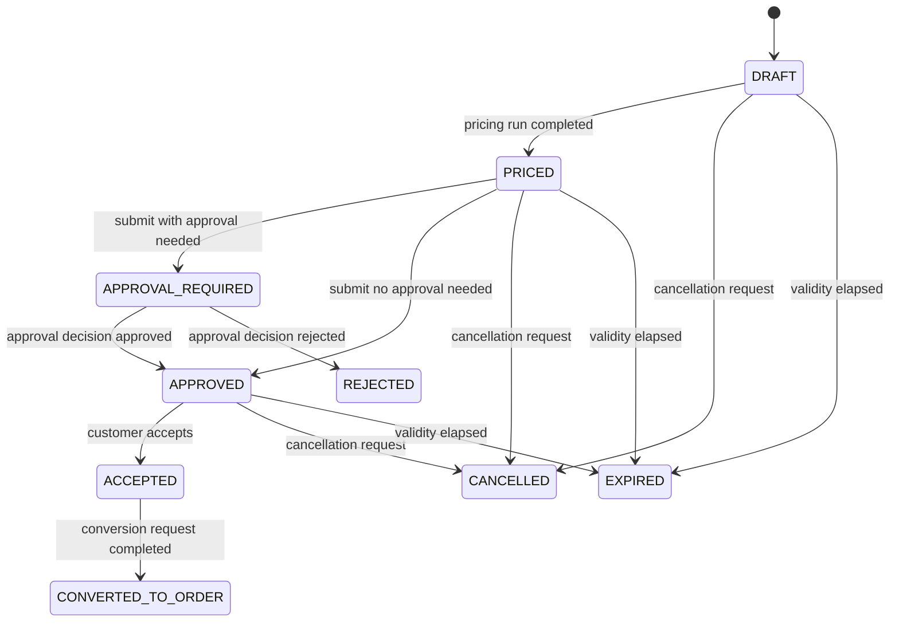

------
title: Build From Scratch: Enterprise Java Microservices CPQ & Order Management Platform - Part 014
description: Mendesain resource model API untuk catalog, configuration, pricing, quote, approval, order, fulfillment, asset, dan operational APIs agar kontrak HTTP merepresentasikan business capability, bukan sekadar CRUD table atau remote method Java.
series: learn-enterprise-cpq-oms-glassfish-camunda8
seriesTitle: Build From Scratch: Enterprise Java Microservices CPQ & Order Management Platform
order: 14
partTitle: Resource Modelling for CPQ OMS APIs
tags:
  - java
  - microservices
  - cpq
  - oms
  - openapi
  - api-design
  - resource-modelling
  - jax-rs
  - jersey
  - contract-first
  - enterprise-architecture
date: 2026-07-02
---

# Part 014 — Resource Modelling for CPQ OMS APIs

Di Part 013 kita menyusun strategi **API First** dan **Schema First**.

Sekarang kita mulai menjawab pertanyaan yang lebih konkret:

```text
Endpoint apa yang harus ada?
Resource apa yang harus diekspos?
Command apa yang harus menjadi sub-resource?
Kapan pakai POST, GET, PATCH, DELETE?
Kapan lifecycle transition tidak boleh dimodelkan sebagai update status?
```

Part ini bukan daftar endpoint final yang kaku.

Part ini adalah **resource modelling guide** untuk CPQ/OMS enterprise.

Tujuannya: saat nanti kita menulis OpenAPI, JAX-RS resource, MyBatis query, Camunda worker, dan Kafka event, semuanya punya boundary yang masuk akal.

---

## 1. Target Part Ini

Part ini membahas:

1. prinsip resource modelling;
2. kenapa CPQ/OMS API tidak boleh sekadar CRUD;
3. resource taxonomy untuk catalog, configuration, pricing, quote, approval, order, fulfillment, asset, dan operations;
4. command resource pattern;
5. resource lifecycle;
6. sync vs async command;
7. idempotency;
8. path naming;
9. filtering, sorting, pagination;
10. expansion dan projection;
11. ETag/version handling;
12. error resource;
13. operational resource;
14. API boundary terhadap Camunda, Kafka, Redis, dan database;
15. OpenAPI shape awal;
16. JAX-RS implementation direction;
17. anti-patterns.

---

## 2. Resource Modelling: Definisi Praktis

Resource modelling adalah proses memilih **apa yang layak menjadi konsep publik di API**.

Resource bukan berarti tabel.

Resource bukan berarti class Java.

Resource adalah sesuatu yang:

```text
has identity,
has lifecycle,
can be observed,
can be acted upon,
and has meaning to API consumers.
```

Contoh resource yang bagus:

```text
ProductOffering
ProductConfiguration
Quote
QuoteItem
PricingRun
ApprovalRequest
Order
OrderItem
FulfillmentPlan
FulfillmentTask
Asset
Subscription
CancellationRequest
```

Contoh resource yang buruk untuk public API:

```text
QuoteEntityRow
OrderJoinResult
WorkflowVariableBlob
OutboxRecord
RedisCacheEntry
MyBatisResultMap
ZeebeJobKey
```

Yang buruk di atas mungkin penting secara internal, tetapi tidak layak menjadi resource publik.

---

## 3. CRUD Tidak Cukup Untuk CPQ/OMS

CRUD cocok untuk resource sederhana.

CPQ/OMS bukan resource sederhana.

Contoh quote:

```text
create draft
add item
configure item
validate
price
submit
approve
accept
convert to order
expire
cancel
revise
```

Jika semua dipaksa ke CRUD:

```http
PATCH /quotes/{quoteId}
{
  "status": "APPROVED"
}
```

Maka API kehilangan meaning.

Apa yang hilang?

- siapa approver;
- decision reason;
- approval policy;
- state transition guard;
- audit evidence;
- idempotency;
- event emission;
- workflow correlation;
- rejection reason;
- approval expiry;
- price snapshot lock.

Business transition bukan field update.

Business transition harus dimodelkan sebagai command/resource yang eksplisit.

---

## 4. Resource Taxonomy

Kita kelompokkan resource berdasarkan bounded context.

```mermaid
flowchart TD
    A[API Surface] --> B[Catalog]
    A --> C[Configuration]
    A --> D[Pricing]
    A --> E[Quote]
    A --> F[Approval]
    A --> G[Order]
    A --> H[Fulfillment]
    A --> I[Asset & Subscription]
    A --> J[Operations]

    B --> B1[ProductOffering]
    B --> B2[ProductSpecification]
    B --> B3[CatalogVersion]

    C --> C1[ConfigurationSession]
    C --> C2[ConfigurationValidation]

    D --> D1[PricingRun]
    D --> D2[PriceExplanation]

    E --> E1[Quote]
    E --> E2[QuoteItem]
    E --> E3[QuoteRevision]

    F --> F1[ApprovalRequest]
    F --> F2[ApprovalDecision]

    G --> G1[Order]
    G --> G2[OrderItem]
    G --> G3[CancellationRequest]

    H --> H1[FulfillmentPlan]
    H --> H2[FulfillmentTask]

    I --> I1[Asset]
    I --> I2[Subscription]

    J --> J1[Incident]
    J --> J2[RepairAction]
```



Resource taxonomy ini akan berkembang, tetapi cukup sebagai starting point.

---

## 5. API Surface Berdasarkan Capability

### 5.1 Catalog API

Tujuan: consumer bisa menemukan apa yang bisa dijual.

Resource:

```text
/product-offerings
/product-offerings/{productOfferingId}
/product-specifications
/product-specifications/{productSpecificationId}
/catalog-versions
/catalog-versions/{catalogVersionId}
```

Capability:

- browse offering;
- search offering;
- resolve offering detail;
- inspect characteristics;
- inspect price references;
- inspect compatibility metadata;
- inspect lifecycle state.

Tidak semua catalog management perlu public.

Catalog publishing/admin API bisa internal.

### 5.2 Configuration API

Tujuan: consumer bisa membangun konfigurasi produk yang valid.

Resource:

```text
/configuration-sessions
/configuration-sessions/{configurationSessionId}
/configuration-sessions/{configurationSessionId}/items
/configuration-sessions/{configurationSessionId}/validation-runs
```

Atau jika configuration selalu melekat ke quote:

```text
/quotes/{quoteId}/items/{quoteItemId}/configuration
/quotes/{quoteId}/items/{quoteItemId}/configuration-validation-runs
```

Seri ini akan memakai kombinasi:

- quote item punya configuration snapshot;
- standalone configuration session bisa dipakai untuk pre-quote simulation;
- final quote tetap menyimpan immutable snapshot.

### 5.3 Pricing API

Tujuan: consumer bisa menjalankan price simulation atau price quote item.

Resource:

```text
/pricing-runs
/pricing-runs/{pricingRunId}
/quotes/{quoteId}/pricing-runs
/quotes/{quoteId}/pricing-runs/{pricingRunId}
```

Pricing run adalah resource karena:

- punya input snapshot;
- punya output breakdown;
- bisa audit;
- bisa explain;
- bisa gagal;
- bisa dibandingkan antar revision.

### 5.4 Quote API

Tujuan: consumer bisa mengelola commercial promise.

Resource:

```text
/quotes
/quotes/{quoteId}
/quotes/{quoteId}/items
/quotes/{quoteId}/items/{quoteItemId}
/quotes/{quoteId}/revisions
/quotes/{quoteId}/pricing-runs
/quotes/{quoteId}/submission-requests
/quotes/{quoteId}/acceptance-requests
/quotes/{quoteId}/cancellation-requests
/quotes/{quoteId}/conversion-requests
```

### 5.5 Approval API

Tujuan: approver bisa melihat request dan memberikan decision.

Resource:

```text
/approval-requests
/approval-requests/{approvalRequestId}
/approval-requests/{approvalRequestId}/decisions
/approval-requests/{approvalRequestId}/escalations
```

Approval bukan sekadar status quote.

Approval punya:

- requester;
- approver;
- policy;
- decision;
- reason;
- SLA;
- delegation;
- escalation;
- evidence.

### 5.6 Order API

Tujuan: consumer bisa membuat order, memantau order, dan meminta perubahan order.

Resource:

```text
/orders
/orders/{orderId}
/orders/{orderId}/items
/orders/{orderId}/items/{orderItemId}
/orders/{orderId}/cancellation-requests
/orders/{orderId}/amendment-requests
/orders/{orderId}/events
/orders/{orderId}/timeline
```

Order API harus sangat hati-hati.

Order adalah execution commitment, bukan shopping cart.

### 5.7 Fulfillment API

Tujuan: internal operations/support bisa melihat execution plan.

Resource:

```text
/fulfillment-plans
/fulfillment-plans/{fulfillmentPlanId}
/fulfillment-plans/{fulfillmentPlanId}/tasks
/fulfillment-tasks/{fulfillmentTaskId}
/fulfillment-tasks/{fulfillmentTaskId}/retry-requests
/fulfillment-tasks/{fulfillmentTaskId}/manual-completion-requests
```

Fulfillment API biasanya internal/operations, bukan partner public.

### 5.8 Asset and Subscription API

Tujuan: customer care, CPQ, OMS, billing, dan support bisa melihat installed base.

Resource:

```text
/assets
/assets/{assetId}
/assets/{assetId}/versions
/assets/{assetId}/relationships
/subscriptions
/subscriptions/{subscriptionId}
/subscriptions/{subscriptionId}/versions
```

Asset mutation sebaiknya lewat order, bukan direct edit public API.

Direct repair API harus controlled.

### 5.9 Operational API

Tujuan: support dan SRE bisa melihat dan memperbaiki masalah dengan aman.

Resource:

```text
/operations/incidents
/operations/incidents/{incidentId}
/operations/repair-actions
/operations/repair-actions/{repairActionId}
/operations/reconciliation-runs
/operations/reconciliation-runs/{reconciliationRunId}
```

Operational API harus punya audit lebih ketat daripada API biasa.

---

## 6. Command Resource Pattern

Business command sebaiknya dimodelkan sebagai resource baru.

Contoh:

```http
POST /quotes/{quoteId}/submission-requests
```

Request:

```json
{
  "requestedBy": "usr_01JZ80Q1QQN8A69KJGF3SRBSP4",
  "comment": "Customer is ready for approval review."
}
```

Response:

```json
{
  "id": "qsr_01JZ80Q6M9Y4TQR5HH6K8PN1V6",
  "quoteId": "quo_01JZ7R7Y95W6PPXN3DWV4K8FQG",
  "status": "ACCEPTED_FOR_PROCESSING",
  "resultingQuoteStatus": "APPROVAL_REQUIRED",
  "approvalRequestId": "apr_01JZ80R4JK3BGEP66WCR8QVE7Z",
  "createdAt": "2026-07-02T10:20:30+07:00"
}
```

Kenapa bukan `POST /quotes/{quoteId}/submit`?

`/submit` masih terlihat seperti RPC.

`/submission-requests` menyatakan bahwa kita membuat sebuah request yang bisa:

- diterima;
- ditolak;
- diproses async;
- punya ID;
- punya audit;
- punya status;
- aman untuk retry dengan idempotency key.

Tidak semua command harus begini, tetapi untuk business transition penting, pola ini kuat.

---

## 7. POST, PUT, PATCH, DELETE: Aturan Praktis

### 7.1 GET

Untuk membaca resource.

```http
GET /quotes/{quoteId}
GET /orders/{orderId}
GET /product-offerings?marketSegment=ENTERPRISE
```

GET harus safe.

Jangan trigger pricing calculation berat lewat GET jika hasilnya membuat record/audit.

### 7.2 POST

Untuk membuat resource atau command request.

```http
POST /quotes
POST /quotes/{quoteId}/items
POST /quotes/{quoteId}/pricing-runs
POST /quotes/{quoteId}/submission-requests
POST /orders
POST /orders/{orderId}/cancellation-requests
```

POST mutating wajib pakai idempotency key kecuali memang tidak bisa diulang dan didokumentasikan jelas.

### 7.3 PUT

Untuk replace resource by known identity.

Jarang dipakai di CPQ/OMS public API.

Cocok untuk admin/reference data tertentu:

```http
PUT /internal/catalog/product-offerings/{productOfferingId}
```

Tetapi untuk quote/order lifecycle, PUT jarang tepat.

### 7.4 PATCH

Untuk partial update field yang memang bukan transition kompleks.

Contoh masuk akal:

```http
PATCH /quotes/{quoteId}
{
  "customerContactId": "cnt_01JZ8..."
}
```

Tetapi jangan:

```http
PATCH /quotes/{quoteId}
{
  "status": "ACCEPTED"
}
```

Status transition harus command.

### 7.5 DELETE

Untuk delete resource yang benar-benar boleh dihapus.

Di enterprise CPQ/OMS, delete sering diganti cancel/archive karena audit.

Contoh:

```http
POST /quotes/{quoteId}/cancellation-requests
```

lebih aman daripada:

```http
DELETE /quotes/{quoteId}
```

---

## 8. Quote Resource Model

Quote adalah aggregate utama CPQ.

### 8.1 Collection

```http
POST /quotes
GET /quotes
```

Create quote:

```http
POST /api/v1/quotes
Idempotency-Key: idem_01JZ8105KVWG0XH6GDXXR9N56Q
X-Correlation-Id: corr_01JZ810BQDME1DJ3SS4VDACXEA
```

```json
{
  "customerId": "cus_01JZ7R6JXXM3B2ZD8EV2B4H6JD",
  "salesChannel": "DIRECT_SALES",
  "currency": "IDR",
  "validityPeriod": {
    "validFrom": "2026-07-02T00:00:00+07:00",
    "validUntil": "2026-07-31T23:59:59+07:00"
  }
}
```

Response:

```http
201 Created
Location: /api/v1/quotes/quo_01JZ7R7Y95W6PPXN3DWV4K8FQG
```

```json
{
  "id": "quo_01JZ7R7Y95W6PPXN3DWV4K8FQG",
  "status": "DRAFT",
  "version": 1,
  "customerId": "cus_01JZ7R6JXXM3B2ZD8EV2B4H6JD",
  "salesChannel": "DIRECT_SALES",
  "currency": "IDR",
  "createdAt": "2026-07-02T10:15:30+07:00"
}
```

### 8.2 Quote Item

```http
POST /quotes/{quoteId}/items
GET /quotes/{quoteId}/items
GET /quotes/{quoteId}/items/{quoteItemId}
PATCH /quotes/{quoteId}/items/{quoteItemId}
```

Add item request:

```json
{
  "productOfferingId": "po_01JZ81B5MGDE53NKZTCSEW3VKG",
  "quantity": 1,
  "action": "ADD"
}
```

Quote item response:

```json
{
  "id": "qit_01JZ81E0661QPRBK1H43X84PE7",
  "quoteId": "quo_01JZ7R7Y95W6PPXN3DWV4K8FQG",
  "productOfferingId": "po_01JZ81B5MGDE53NKZTCSEW3VKG",
  "action": "ADD",
  "quantity": 1,
  "configurationStatus": "REQUIRES_CONFIGURATION",
  "pricingStatus": "NOT_PRICED"
}
```

### 8.3 Quote Pricing Run

```http
POST /quotes/{quoteId}/pricing-runs
GET /quotes/{quoteId}/pricing-runs/{pricingRunId}
```

Pricing run response:

```json
{
  "id": "prr_01JZ81K0K3G3JDBYDKH6NXXT6P",
  "quoteId": "quo_01JZ7R7Y95W6PPXN3DWV4K8FQG",
  "status": "COMPLETED",
  "inputQuoteVersion": 4,
  "priceSnapshotVersion": 2,
  "totalOneTimeCharge": {
    "amount": "250000.00",
    "currency": "IDR"
  },
  "totalRecurringCharge": {
    "amount": "750000.00",
    "currency": "IDR"
  }
}
```

Pricing run adalah resource karena hasilnya bisa diaudit dan dibandingkan.

---

## 9. Quote Lifecycle Commands

Quote lifecycle transition harus eksplisit.



Resource untuk command:

| Transition | Endpoint |
|---|---|
| submit | `POST /quotes/{quoteId}/submission-requests` |
| approve/reject | `POST /approval-requests/{approvalRequestId}/decisions` |
| accept | `POST /quotes/{quoteId}/acceptance-requests` |
| convert | `POST /quotes/{quoteId}/conversion-requests` |
| cancel | `POST /quotes/{quoteId}/cancellation-requests` |
| revise | `POST /quotes/{quoteId}/revisions` |

Kenapa `revisions` resource?

Karena revision bukan update biasa. Revision menciptakan versi quote baru atau branch baru dengan traceability ke versi sebelumnya.

---

## 10. Order Resource Model

Order adalah execution commitment.

### 10.1 Create Order

Ada dua sumber utama:

1. quote-derived order;
2. direct order.

Quote-derived order:

```http
POST /quotes/{quoteId}/conversion-requests
```

Direct order:

```http
POST /orders
```

Direct order harus tetap melewati validasi yang kuat.

Request:

```json
{
  "customerId": "cus_01JZ7R6JXXM3B2ZD8EV2B4H6JD",
  "source": "DIRECT_ORDER",
  "items": [
    {
      "productOfferingId": "po_01JZ81B5MGDE53NKZTCSEW3VKG",
      "action": "ADD",
      "quantity": 1,
      "configuration": {
        "characteristics": [
          {
            "name": "bandwidth",
            "value": "1Gbps"
          }
        ]
      }
    }
  ]
}
```

### 10.2 Order Read Model

```http
GET /orders/{orderId}
```

Response should include business status, not workflow internals:

```json
{
  "id": "ord_01JZ82C9PCSDPW5QX234JFN4ZC",
  "status": "IN_PROGRESS",
  "source": "QUOTE",
  "sourceQuoteId": "quo_01JZ7R7Y95W6PPXN3DWV4K8FQG",
  "customerId": "cus_01JZ7R6JXXM3B2ZD8EV2B4H6JD",
  "version": 5,
  "createdAt": "2026-07-02T11:15:30+07:00",
  "submittedAt": "2026-07-02T11:16:00+07:00"
}
```

Do not expose this in public response:

```json
{
  "zeebeProcessInstanceKey": "2251799813685251",
  "workerType": "reserve-resource-worker",
  "bpmnElementId": "Activity_1x7abc"
}
```

Camunda details belong in operational/internal view.

---

## 11. Order Lifecycle Commands

Resource:

```text
/orders/{orderId}/cancellation-requests
/orders/{orderId}/amendment-requests
/orders/{orderId}/hold-requests
/orders/{orderId}/resume-requests
```

Cancellation request:

```json
{
  "reasonCode": "CUSTOMER_REQUEST",
  "comment": "Customer requested cancellation before activation.",
  "requestedEffectiveDate": "2026-07-05T00:00:00+07:00"
}
```

Response:

```json
{
  "id": "ocr_01JZ82SSYFCT8R8WV3D9EZ95RM",
  "orderId": "ord_01JZ82C9PCSDPW5QX234JFN4ZC",
  "status": "ACCEPTED_FOR_PROCESSING",
  "requiresCompensation": true,
  "createdAt": "2026-07-02T11:20:00+07:00"
}
```

Cancellation is not delete.

Cancellation is a business process.

---

## 12. Fulfillment Resource Model

Fulfillment is usually internal/operations.

Resource:

```http
GET /fulfillment-plans/{fulfillmentPlanId}
GET /fulfillment-plans/{fulfillmentPlanId}/tasks
GET /fulfillment-tasks/{fulfillmentTaskId}
POST /fulfillment-tasks/{fulfillmentTaskId}/retry-requests
POST /fulfillment-tasks/{fulfillmentTaskId}/manual-completion-requests
```

Fulfillment task response:

```json
{
  "id": "fft_01JZ834SMJ3BE0M20M1PHRSVFY",
  "fulfillmentPlanId": "ffp_01JZ833V63S0JACGDFHK77AMK7",
  "orderId": "ord_01JZ82C9PCSDPW5QX234JFN4ZC",
  "orderItemId": "oit_01JZ82D3R9SD50KTG2Y0KEQT3V",
  "taskType": "RESERVE_RESOURCE",
  "status": "FAILED_RETRYABLE",
  "attemptCount": 3,
  "lastFailureCode": "INVENTORY_TIMEOUT",
  "retryable": true
}
```

Retry request:

```http
POST /fulfillment-tasks/{fulfillmentTaskId}/retry-requests
```

```json
{
  "reason": "Inventory service recovered.",
  "requestedBy": "usr_01JZ80Q1QQN8A69KJGF3SRBSP4"
}
```

This command must not call Zeebe blindly.

It must:

- validate task state;
- validate retryability;
- create audit record;
- update local task state;
- trigger workflow/message safely;
- publish event through outbox.

---

## 13. Approval Resource Model

Approval is its own domain surface.

```http
GET /approval-requests
GET /approval-requests/{approvalRequestId}
POST /approval-requests/{approvalRequestId}/decisions
POST /approval-requests/{approvalRequestId}/escalations
```

Decision request:

```json
{
  "decision": "APPROVED",
  "reason": "Discount is acceptable for enterprise renewal.",
  "conditions": [
    {
      "type": "VALID_UNTIL",
      "value": "2026-07-15T23:59:59+07:00"
    }
  ]
}
```

Decision response:

```json
{
  "id": "apd_01JZ83MJCTN8VT0AK62A33ZTEV",
  "approvalRequestId": "apr_01JZ80R4JK3BGEP66WCR8QVE7Z",
  "decision": "APPROVED",
  "decidedAt": "2026-07-02T12:00:00+07:00",
  "resultingApprovalStatus": "APPROVED"
}
```

Approval decision is append-only.

Do not update old decision silently.

If correction is needed, create reversal/correction record with audit.

---

## 14. Asset and Subscription Resource Model

Asset is installed reality.

Resource:

```http
GET /assets?customerId={customerId}
GET /assets/{assetId}
GET /assets/{assetId}/versions
GET /assets/{assetId}/relationships
GET /subscriptions?customerId={customerId}
GET /subscriptions/{subscriptionId}
```

Asset response:

```json
{
  "id": "ast_01JZ840DBKSMA4BJCC0J8HB77M",
  "customerId": "cus_01JZ7R6JXXM3B2ZD8EV2B4H6JD",
  "productOfferingId": "po_01JZ81B5MGDE53NKZTCSEW3VKG",
  "status": "ACTIVE",
  "effectiveFrom": "2026-07-02T13:00:00+07:00",
  "sourceOrderId": "ord_01JZ82C9PCSDPW5QX234JFN4ZC",
  "version": 3
}
```

Mutation rule:

```text
Normal asset change must come from order lifecycle.
Direct asset correction must use controlled repair API.
```

Why?

Because direct asset update can break:

- billing;
- subscription;
- fulfillment history;
- customer promise;
- audit evidence;
- future CPQ eligibility.

---

## 15. Search, Filtering, Sorting, Pagination

Collection endpoints must be predictable.

Example:

```http
GET /quotes?customerId=cus_01JZ7R6JXXM3B2ZD8EV2B4H6JD&status=APPROVED&pageSize=50&pageToken=abc
```

Response:

```json
{
  "items": [
    {
      "id": "quo_01JZ7R7Y95W6PPXN3DWV4K8FQG",
      "status": "APPROVED",
      "customerId": "cus_01JZ7R6JXXM3B2ZD8EV2B4H6JD",
      "createdAt": "2026-07-02T10:15:30+07:00"
    }
  ],
  "page": {
    "nextPageToken": "eyJvZmZzZXQiOjUwfQ",
    "pageSize": 50
  }
}
```

Rules:

- do not expose raw DB offset as stable contract;
- use stable sort for pagination;
- define max page size;
- define default sort;
- document filter combinations;
- reject unsupported filters instead of silently ignoring;
- index query patterns in PostgreSQL.

---

## 16. Projection and Expansion

Consumer often wants either summary or full detail.

Do not always return giant aggregate.

Options:

### 16.1 Dedicated Summary Resource

```http
GET /quotes
```

returns quote summary.

```http
GET /quotes/{quoteId}
```

returns quote detail.

### 16.2 Include Parameter

```http
GET /quotes/{quoteId}?include=items,priceSnapshot,approvalSummary
```

Rules:

- `include` values must be allowlisted;
- default response must be stable;
- included objects must not change lifecycle semantics;
- avoid arbitrary graph expansion.

Bad:

```http
GET /quotes/{id}?include=*
```

That turns API into uncontrolled object graph serialization.

---

## 17. Version and Optimistic Concurrency

For mutating commands, include version when command depends on observed state.

Example:

```json
{
  "expectedQuoteVersion": 5,
  "comment": "Submit after final pricing."
}
```

If current quote version is 6:

```http
409 Conflict
```

```json
{
  "code": "QUOTE_VERSION_CONFLICT",
  "message": "Quote version changed after the caller last read it.",
  "currentVersion": 6,
  "expectedVersion": 5
}
```

Why not rely only on idempotency?

Because idempotency prevents duplicate command execution.

Optimistic concurrency prevents stale decision execution.

Both are needed.

---

## 18. Idempotency By Resource Type

Mutating command endpoints need idempotency.

| Endpoint | Idempotency Required? | Reason |
|---|---:|---|
| `POST /quotes` | yes | avoid duplicate quote from retry |
| `POST /quotes/{id}/items` | yes | avoid duplicate item |
| `POST /quotes/{id}/pricing-runs` | usually yes | avoid duplicate pricing records |
| `POST /quotes/{id}/submission-requests` | yes | avoid duplicate approval/workflow |
| `POST /approval-requests/{id}/decisions` | yes | avoid duplicate decision |
| `POST /orders` | yes | avoid duplicate order |
| `POST /orders/{id}/cancellation-requests` | yes | avoid duplicate cancellation |
| `GET /orders/{id}` | no | safe read |

Idempotency key scope:

```text
tenant + actor/client + endpoint + idempotency key
```

Store:

- request hash;
- response summary;
- resource ID created;
- status;
- expiry;
- correlation ID;
- created time.

---

## 19. Sync vs Async Commands

Not every command should complete synchronously.

### 19.1 Synchronous Command

Good for quick operations:

```text
create draft quote
add quote item
update contact
basic validation
```

Response can return final result.

### 19.2 Asynchronous Command

Good for long-running operations:

```text
submit order
decompose order
run external provisioning
generate contract document
perform large pricing simulation
cancel in-progress order
```

Response should return accepted request resource:

```http
202 Accepted
Location: /api/v1/orders/ord_.../cancellation-requests/ocr_...
```

```json
{
  "id": "ocr_01JZ82SSYFCT8R8WV3D9EZ95RM",
  "status": "ACCEPTED_FOR_PROCESSING",
  "orderId": "ord_01JZ82C9PCSDPW5QX234JFN4ZC"
}
```

Don't block HTTP while waiting for external provisioning.

---

## 20. Timeline and Events API

Business users often need timeline.

```http
GET /orders/{orderId}/timeline
GET /quotes/{quoteId}/timeline
```

Timeline is not raw Kafka event stream.

Timeline is curated business view:

```json
{
  "items": [
    {
      "type": "ORDER_CREATED",
      "occurredAt": "2026-07-02T11:15:30+07:00",
      "actor": "usr_01JZ80Q1QQN8A69KJGF3SRBSP4",
      "summary": "Order was created from accepted quote."
    },
    {
      "type": "FULFILLMENT_TASK_FAILED",
      "occurredAt": "2026-07-02T11:45:00+07:00",
      "summary": "Inventory reservation timed out."
    }
  ]
}
```

Why curated?

Because raw events may include technical noise, internal fields, retries, or sensitive data.

---

## 21. Operational Repair APIs

Repair API must be explicit and audited.

Examples:

```http
POST /operations/repair-actions
GET /operations/repair-actions/{repairActionId}
POST /operations/reconciliation-runs
```

Repair action request:

```json
{
  "targetType": "FULFILLMENT_TASK",
  "targetId": "fft_01JZ834SMJ3BE0M20M1PHRSVFY",
  "actionType": "MARK_EXTERNAL_STEP_COMPLETED",
  "reason": "Provisioning completed externally but callback failed.",
  "evidenceReference": "INC-2026-000187"
}
```

This is dangerous.

So it must enforce:

- strong authorization;
- four-eyes approval for high-risk action;
- audit before/after;
- allowed target state;
- allowed repair type;
- event emission;
- reconciliation marker.

Never allow generic:

```http
POST /operations/sql
```

or:

```http
PATCH /orders/{id}
{
  "status": "COMPLETED"
}
```

---

## 22. API Boundary Against Camunda

API should not expose Camunda as the business API.

Bad:

```http
POST /process-instances
GET /process-instances/{key}
POST /jobs/{jobKey}/complete
```

Good:

```http
POST /orders/{orderId}/cancellation-requests
GET /orders/{orderId}
GET /fulfillment-plans/{fulfillmentPlanId}
GET /operations/incidents/{incidentId}
```

Camunda/Zeebe is orchestration infrastructure.

Business API should expose business resource.

Internal operations may show workflow correlation, but even then it should be wrapped in domain language.

---

## 23. API Boundary Against Kafka

Kafka event is not query API.

Do not tell consumers:

```text
Read topic order-events to know order status.
```

For business query:

```http
GET /orders/{orderId}
```

For integration facts:

```text
order.events.v1 topic
```

Both exist.

They serve different needs.

API answers current state.

Events publish facts that occurred.

---

## 24. API Boundary Against Redis

Redis cache is invisible to API contract.

Do not expose:

```http
DELETE /redis/keys/{key}
```

Instead expose domain-safe operation:

```http
POST /operations/cache-invalidation-requests
```

or make invalidation event-driven internally.

If cache must be controlled, resource should be operational and audited.

---

## 25. API Boundary Against PostgreSQL/MyBatis

Database and mapper are implementation details.

Do not expose:

```http
GET /orders?sqlWhere=status='FAILED'
GET /quote-items?join=price_component
```

Expose supported filters:

```http
GET /orders?status=FAILED&createdFrom=2026-07-01T00:00:00+07:00
```

Query flexibility is good.

Unbounded query language over public API is not.

---

## 26. OpenAPI Path Skeleton

A first skeleton:

```yaml
paths:
  /quotes:
    post:
      operationId: createQuote
    get:
      operationId: searchQuotes

  /quotes/{quoteId}:
    get:
      operationId: getQuote
    patch:
      operationId: patchQuote

  /quotes/{quoteId}/items:
    post:
      operationId: addQuoteItem
    get:
      operationId: listQuoteItems

  /quotes/{quoteId}/items/{quoteItemId}:
    get:
      operationId: getQuoteItem
    patch:
      operationId: patchQuoteItem

  /quotes/{quoteId}/pricing-runs:
    post:
      operationId: createQuotePricingRun
    get:
      operationId: listQuotePricingRuns

  /quotes/{quoteId}/submission-requests:
    post:
      operationId: submitQuote

  /quotes/{quoteId}/acceptance-requests:
    post:
      operationId: acceptQuote

  /quotes/{quoteId}/conversion-requests:
    post:
      operationId: convertQuoteToOrder

  /orders:
    post:
      operationId: createOrder
    get:
      operationId: searchOrders

  /orders/{orderId}:
    get:
      operationId: getOrder

  /orders/{orderId}/cancellation-requests:
    post:
      operationId: requestOrderCancellation
```

This skeleton is not final implementation.

It is a modelling baseline.

---

## 27. JAX-RS Resource Direction

Resource class should align with API grouping.

```java
@Path("/api/v1/quotes")
public class QuoteResource {

    @POST
    public Response createQuote(CreateQuoteRequest request) {
        // map -> application service -> map response
    }

    @GET
    @Path("/{quoteId}")
    public Response getQuote(@PathParam("quoteId") String quoteId) {
        // query application service
    }

    @POST
    @Path("/{quoteId}/submission-requests")
    public Response submitQuote(
        @PathParam("quoteId") String quoteId,
        SubmitQuoteRequest request
    ) {
        // command application service
    }
}
```

Do not put every endpoint in one giant resource.

Possible grouping:

```text
CatalogResource
ConfigurationResource
PricingResource
QuoteResource
ApprovalResource
OrderResource
FulfillmentResource
AssetResource
OperationalResource
```

But grouping by URL and capability is better than grouping by database table.

---

## 28. Error Modelling Per Resource

Each resource needs known errors.

Example quote submission:

| Code | Status | Meaning |
|---|---:|---|
| QUOTE_NOT_FOUND | 404 | quote ID unknown |
| QUOTE_VERSION_CONFLICT | 409 | expected version stale |
| QUOTE_INVALID_STATE | 409 | quote cannot be submitted from current state |
| QUOTE_EXPIRED | 409 | quote validity elapsed |
| QUOTE_HAS_INVALID_CONFIGURATION | 422 | item configuration invalid |
| QUOTE_NOT_PRICED | 422 | pricing snapshot missing |
| APPROVAL_POLICY_UNAVAILABLE | 503 | policy service unavailable |

Error model is part of resource design.

If you cannot list expected errors, you do not understand the resource yet.

---

## 29. Security Scope Per Resource

Security is not just global login.

Example scopes:

```text
catalog:read
quote:create
quote:read
quote:update
quote:submit
quote:accept
approval:read
approval:decide
order:create
order:read
order:cancel
fulfillment:read
fulfillment:repair
asset:read
operations:repair
```

Commands need stronger authorization than reads.

Repair APIs need strongest authorization.

Approval decision must check assigned approver/delegation, not just role.

---

## 30. Resource Design Review Checklist

For each proposed resource, ask:

```text
Does it have business meaning?
Does it have identity?
Does it have lifecycle?
Who owns it?
Who consumes it?
Is it public, internal, integration, or operational?
Is it read model or command resource?
Is mutation idempotent?
What state transitions are legal?
What events are emitted?
What audit evidence is required?
What error codes are expected?
What fields are stable contract?
Does this leak database/workflow/cache internals?
Does this need pagination?
Does this need optimistic concurrency?
```

If many answers are unclear, resource modelling is not finished.

---

## 31. Anti-Patterns

### 31.1 Verb Explosion

Bad:

```text
/calculatePrice
/submitQuote
/approveQuote
/rejectQuote
/convertQuote
/startOrder
/stopOrder
/retryTask
```

Better:

```text
/quotes/{quoteId}/pricing-runs
/quotes/{quoteId}/submission-requests
/approval-requests/{approvalRequestId}/decisions
/quotes/{quoteId}/conversion-requests
/fulfillment-tasks/{fulfillmentTaskId}/retry-requests
```

### 31.2 Status Mutation API

Bad:

```http
PATCH /orders/{id}
{
  "status": "COMPLETED"
}
```

Better:

```http
POST /fulfillment-tasks/{taskId}/manual-completion-requests
```

or a domain-specific completion command with evidence.

### 31.3 Exposing Workflow Engine

Bad:

```http
GET /zeebe/process-instances/{key}
```

Better:

```http
GET /orders/{orderId}/timeline
GET /operations/incidents/{incidentId}
```

### 31.4 Infinite Include

Bad:

```http
GET /customers/{id}?include=quotes.orders.assets.billing.provisioning.everything
```

Better:

```http
GET /customers/{id}/commercial-summary
GET /quotes?customerId=...
GET /orders?customerId=...
GET /assets?customerId=...
```

### 31.5 Generic Admin Mutator

Bad:

```http
POST /admin/change-status
```

Better:

```http
POST /operations/repair-actions
```

with typed action and guardrails.

---

## 32. Minimal API Set For First Build Slice

Untuk implementasi awal, kita tidak akan membuat semua resource sekaligus.

Build slice pertama cukup:

```text
Catalog read API
Create quote
Add quote item
Configure quote item
Run pricing
Submit quote
Approve quote
Accept quote
Convert quote to order
Get order
Track order timeline
```

Endpoint minimal:

```text
GET  /product-offerings
GET  /product-offerings/{id}
POST /quotes
GET  /quotes/{id}
POST /quotes/{id}/items
PATCH /quotes/{id}/items/{itemId}
POST /quotes/{id}/pricing-runs
POST /quotes/{id}/submission-requests
GET  /approval-requests/{id}
POST /approval-requests/{id}/decisions
POST /quotes/{id}/acceptance-requests
POST /quotes/{id}/conversion-requests
GET  /orders/{id}
GET  /orders/{id}/timeline
```

Itu sudah cukup untuk membuktikan core CPQ-to-order lifecycle.

---

## 33. How This Part Connects To Next Part

Part berikutnya akan masuk ke struktur OpenAPI lebih teknis:

```text
components
request/response envelope
error model
pagination
filtering
sorting
headers
idempotency
correlation ID
problem detail
```

Di part ini kita memilih resource.

Di part berikutnya kita membuat kontrak teknisnya lebih rapi.

---

## 34. Latihan Praktis

Ambil satu resource: `OrderCancellationRequest`.

Jawab:

```text
Apa parent resource-nya?
Apakah dia punya ID sendiri?
Apakah cancellation sync atau async?
Apa state awal order yang legal?
Apa state task yang legal?
Apa response saat accepted?
Apa response saat rejected?
Apa event yang keluar?
Apa audit evidence wajib?
Apa idempotency key scope?
Apa authorization scope?
Apa error code domain?
Apa field yang immutable?
```

Jika jawabanmu jelas, kamu sudah mulai berpikir seperti designer enterprise API.

---

## 35. Ringkasan

Resource modelling untuk CPQ/OMS harus dimulai dari business capability, bukan database table.

Prinsip yang kita pakai:

```text
Expose business resources.
Model lifecycle transitions as explicit command resources.
Use GET for safe reads.
Use POST for command/resource creation.
Use PATCH only for simple partial mutation, not lifecycle transition.
Avoid DELETE for audited business objects.
Make idempotency explicit.
Separate public business API from internal workflow/operations API.
Never expose Camunda, Kafka, Redis, PostgreSQL, or MyBatis details as public contract.
```

Tujuan akhirnya sederhana:

```text
A consumer should understand the business system from the API surface without knowing how the service is implemented.
```

---

## 36. Referensi Resmi

- OpenAPI Specification: https://spec.openapis.org/oas/v3.1.1.html
- OpenAPI Initiative: https://www.openapis.org/
- JSON Schema Draft 2020-12: https://json-schema.org/draft/2020-12
- TM Forum Open APIs Directory: https://www.tmforum.org/open-digital-architecture/open-apis
- TMF620 Product Catalog Management API: https://www.tmforum.org/resources/specifications/tmf620-product-catalog-management-api-user-guide-v5-0-0/
- TMF648 Quote Management API: https://www.tmforum.org/open-digital-architecture/open-apis/quote-management-api-TMF648/v4.0
