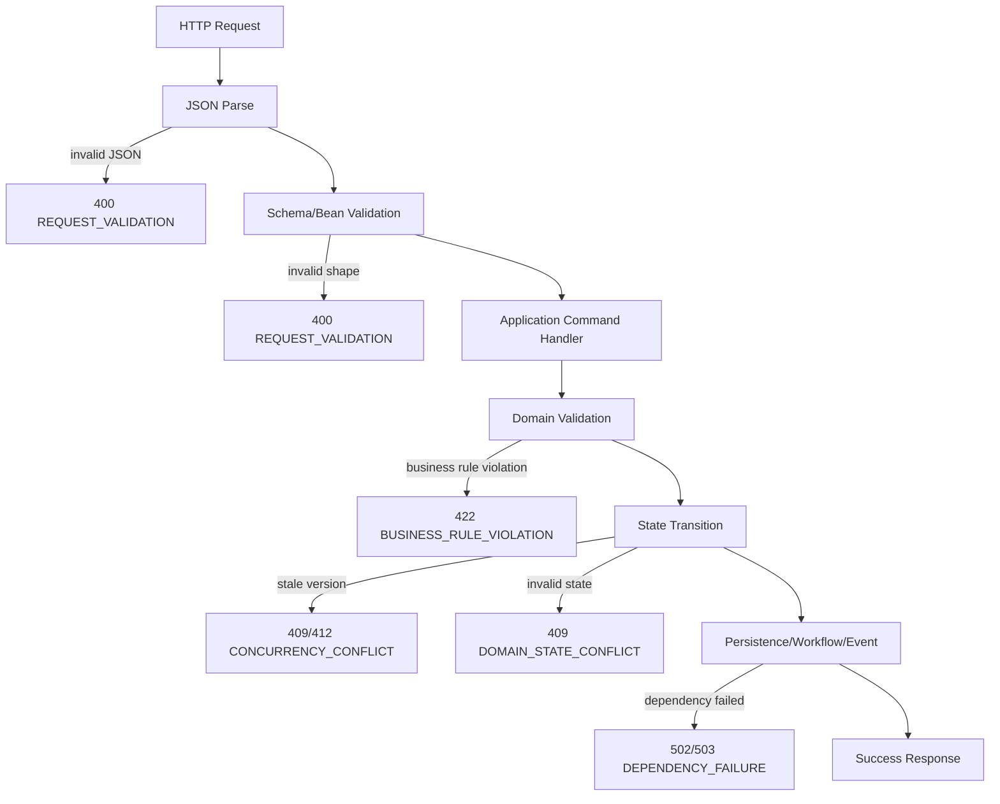
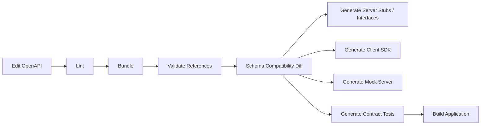

------
title: Build From Scratch: Enterprise Java Microservices CPQ & Order Management Platform - Part 015
description: Mendesain struktur OpenAPI production-grade untuk CPQ/OMS: reusable components, request/response model, RFC 9457-style problem details, pagination, filtering, sorting, idempotency, correlation ID, optimistic concurrency, dan async command response.
series: learn-enterprise-cpq-oms-glassfish-camunda8
seriesTitle: Build From Scratch: Enterprise Java Microservices CPQ & Order Management Platform
order: 15
partTitle: OpenAPI Structure, Error Model, and Pagination
tags:
  - java
  - microservices
  - cpq
  - oms
  - openapi
  - schema-first
  - api-design
  - problem-details
  - pagination
  - idempotency
date: 2026-07-02
---

# Part 015 — OpenAPI Structure, Error Model, and Pagination

Pada part sebelumnya kita sudah membahas strategi **API First** dan cara memodelkan resource CPQ/OMS agar API tidak sekadar menjadi remote database table.

Sekarang kita turun satu level lebih konkret:

> Bagaimana bentuk OpenAPI file yang production-grade?

Bukan sekadar:

```yaml
paths:
  /quotes:
    post:
      responses:
        '200':
          description: OK
```

Itu terlalu miskin untuk sistem enterprise.

Di platform CPQ/OMS, kontrak API harus menjawab pertanyaan operasional:

- request ini idempotent atau tidak?
- response ini snapshot atau live state?
- error ini bisa diretry atau tidak?
- field mana yang invalid?
- status domain apa yang berubah?
- bagaimana client melakukan pagination tanpa data lompat atau duplikat?
- bagaimana trace dari API request ke database, Kafka, dan Camunda process?
- bagaimana schema berkembang tanpa menghancurkan consumer lama?

API contract adalah **boundary hukum teknis** antara producer dan consumer. Kalau boundary ini kabur, bug-nya akan muncul di tempat paling mahal: order stuck, quote salah harga, approval tidak bisa diaudit, event duplikat, atau fulfillment jalan dari input yang tidak valid.

---

## 1. Target Mental Model

OpenAPI untuk CPQ/OMS harus diperlakukan sebagai:

```text
contract = syntax + semantics + failure behavior + compatibility promise
```

Banyak tim hanya menulis syntax:

```text
field name
field type
required or optional
```

Itu belum cukup.

Untuk enterprise system, API contract harus punya empat lapisan:

| Lapisan | Tujuan | Contoh |
|---|---|---|
| Structural contract | Bentuk JSON valid | `quoteId` string, `items` array |
| Semantic contract | Makna field dan aturan domain | `accepted` quote tidak boleh dimutasi |
| Operational contract | Retry, idempotency, pagination, timeout | `Idempotency-Key`, `Retry-After` |
| Compatibility contract | Cara kontrak berubah | additive change allowed, enum handling |

OpenAPI kuat untuk structural dan sebagian operational contract. Domain semantic tetap harus ditegakkan di application/domain layer.

---

## 2. Prinsip Desain OpenAPI Untuk Seri Ini

Kita akan memakai prinsip berikut sepanjang seri:

1. **One bounded context, one API contract package.**  
   Catalog, CPQ, OMS, Asset, dan Operations tidak dicampur dalam satu file raksasa tanpa struktur.

2. **Public API berbeda dari internal API.**  
   Public API stabil dan konservatif. Internal API boleh lebih cepat berubah, tetapi tetap dikontrak.

3. **Command endpoint berbeda dari query endpoint.**  
   Query mengembalikan projection. Command mengubah state atau memulai proses.

4. **Domain transition selalu eksplisit.**  
   Jangan ubah status dengan `PATCH /orders/{id}` yang menerima arbitrary field.

5. **Error adalah contract, bukan afterthought.**  
   Error harus punya type, code, category, retryability, correlation, dan detail field-level.

6. **Pagination harus deterministik.**  
   Search order/quote di enterprise tidak boleh membuat user melihat record meloncat ketika data baru masuk.

7. **Idempotency adalah bagian kontrak.**  
   Semua command yang bisa dieksekusi ulang oleh client atau gateway wajib punya model idempotency.

8. **API tidak membocorkan storage/workflow implementation.**  
   Response API tidak boleh bergantung pada nama tabel PostgreSQL, job key Zeebe, offset Kafka, atau struktur internal Redis.

---

## 3. Struktur Repository OpenAPI

Kita tidak akan membuat satu `openapi.yaml` berisi semua hal. Itu cepat, tetapi akan buruk ketika service tumbuh.

Struktur yang akan kita pakai:

```text
contracts/
  openapi/
    shared/
      components/
        headers.yaml
        parameters.yaml
        responses.yaml
        errors.yaml
        pagination.yaml
        money.yaml
        identifiers.yaml
        audit.yaml
    catalog-api/
      openapi.yaml
      paths/
        product-offerings.yaml
        product-specifications.yaml
      schemas/
        product-offering.yaml
        product-specification.yaml
    cpq-api/
      openapi.yaml
      paths/
        configurations.yaml
        prices.yaml
        quotes.yaml
        approvals.yaml
      schemas/
        configuration.yaml
        price.yaml
        quote.yaml
        approval.yaml
    oms-api/
      openapi.yaml
      paths/
        orders.yaml
        fulfillment-tasks.yaml
      schemas/
        order.yaml
        fulfillment-task.yaml
    asset-api/
      openapi.yaml
      paths/
        assets.yaml
        subscriptions.yaml
      schemas/
        asset.yaml
        subscription.yaml
    operations-api/
      openapi.yaml
      paths/
        incidents.yaml
        reconciliation.yaml
        repair-commands.yaml
      schemas/
        incident.yaml
        repair-command.yaml
```

Kenapa begini?

Karena API contract akan dipakai banyak pihak:

- backend implementer,
- frontend developer,
- integration team,
- QA automation,
- SRE/support,
- security reviewer,
- partner integrator,
- documentation generator,
- contract test,
- mock server,
- schema diff checker.

File kontrak yang rapi bukan soal estetika. Itu soal **change governance**.

---

## 4. Root OpenAPI File

Contoh root file untuk CPQ API:

```yaml
openapi: 3.1.1
info:
  title: Enterprise CPQ API
  version: 1.0.0
  description: |
    API for product configuration, price simulation, quote lifecycle,
    and quote approval commands.
servers:
  - url: https://api.example.com/cpq/v1
    description: Production
  - url: https://staging-api.example.com/cpq/v1
    description: Staging
tags:
  - name: Configurations
  - name: Prices
  - name: Quotes
  - name: Approvals
security:
  - bearerAuth: []
paths:
  /configurations: {$ref: './paths/configurations.yaml'}
  /prices/simulations: {$ref: './paths/prices.yaml'}
  /quotes: {$ref: './paths/quotes.yaml'}
  /quotes/{quoteId}: {$ref: './paths/quote-by-id.yaml'}
  /quotes/{quoteId}/submit: {$ref: './paths/quote-submit.yaml'}
  /quotes/{quoteId}/accept: {$ref: './paths/quote-accept.yaml'}
  /approvals/tasks: {$ref: './paths/approval-tasks.yaml'}
components:
  securitySchemes:
    bearerAuth:
      type: http
      scheme: bearer
      bearerFormat: JWT
```

Catatan penting:

- base path memakai `/cpq/v1`, bukan `/v1/cpq` juga boleh, tetapi harus konsisten;
- command endpoint seperti `/submit` dan `/accept` sengaja eksplisit;
- operation tidak diberi generic `updateQuoteStatus`;
- security scheme dideklarasikan di root;
- schema detail dipisah.

---

## 5. Naming Policy

Naming harus konsisten karena contract akan bertahan lama.

### 5.1 Resource Path

Gunakan plural noun untuk collection:

```text
/product-offerings
/quotes
/orders
/assets
/subscriptions
```

Gunakan nested path hanya ketika lifecycle-nya memang subordinat:

```text
/quotes/{quoteId}/items
/orders/{orderId}/fulfillment-tasks
```

Jangan membuat path terlalu dalam:

```text
/customers/{customerId}/accounts/{accountId}/quotes/{quoteId}/items/{itemId}/prices
```

Itu membuat API hierarchy seolah-olah ownership data selalu parent-child. Dalam enterprise domain, customer, account, quote, price, order, dan asset sering punya lifecycle berbeda.

Lebih baik:

```text
/quotes/{quoteId}/items/{quoteItemId}/price
```

Customer/account context cukup menjadi field/filter, bukan selalu path hierarchy.

### 5.2 OperationId

Operation ID harus stabil dan action-oriented:

```yaml
operationId: createQuote
operationId: getQuote
operationId: searchQuotes
operationId: submitQuote
operationId: acceptQuote
operationId: cancelQuote
```

Hindari:

```yaml
operationId: quotePost
operationId: quoteControllerSubmit
operationId: updateStatus
```

Karena operationId sering dipakai untuk generated client method. Nama buruk akan bocor ke consumer code.

### 5.3 Schema Name

Gunakan suffix yang menunjukkan role:

```text
QuoteCreateRequest
QuoteResponse
QuoteSummaryResponse
QuoteItemRequest
QuoteItemResponse
QuoteSubmitRequest
QuoteStatus
QuoteTransition
QuoteEventPayload
```

Jangan pakai satu `Quote` untuk semuanya.

Alasannya: create request, domain model, response projection, event payload, dan database row tidak sama.

---

## 6. Header Contract

Enterprise API perlu header standar.

```yaml
components:
  parameters:
    CorrelationIdHeader:
      name: X-Correlation-Id
      in: header
      required: false
      schema:
        type: string
        minLength: 8
        maxLength: 128
      description: Client-provided correlation identifier. If absent, server generates one.

    IdempotencyKeyHeader:
      name: Idempotency-Key
      in: header
      required: true
      schema:
        type: string
        minLength: 16
        maxLength: 128
      description: Required for mutating command requests that may be retried safely.

    IfMatchHeader:
      name: If-Match
      in: header
      required: false
      schema:
        type: string
      description: Optimistic concurrency token for state-sensitive mutation.
```

Header minimal yang akan kita pakai:

| Header | Direction | Wajib | Fungsi |
|---|---:|---:|---|
| `X-Correlation-Id` | request/response | sebaiknya | trace antar service |
| `Idempotency-Key` | request | command tertentu | dedup command |
| `If-Match` | request | state-sensitive command | optimistic concurrency |
| `ETag` | response | entity response | version token |
| `Retry-After` | response | throttling/temporary failure | retry guidance |
| `Location` | response | create/accepted | URI resource/result |

Jangan membuat terlalu banyak custom header. Header harus untuk cross-cutting concern, bukan domain data.

Domain data tetap di body.

---

## 7. Response Envelope: Perlu Atau Tidak?

Ada dua gaya umum.

### Gaya A — Bare Resource

```json
{
  "quoteId": "quo_01HY...",
  "quoteNumber": "Q-2026-00001",
  "status": "DRAFT"
}
```

### Gaya B — Envelope

```json
{
  "data": {
    "quoteId": "quo_01HY...",
    "quoteNumber": "Q-2026-00001",
    "status": "DRAFT"
  },
  "meta": {
    "correlationId": "corr_abc"
  }
}
```

Untuk seri ini kita pakai pendekatan hybrid:

- **single resource response**: bare resource + headers;
- **collection/search response**: envelope dengan `items`, `page`, `links`;
- **async command response**: command result envelope;
- **error response**: problem details envelope.

Kenapa?

Karena envelope untuk semua response sering membuat generated client lebih berisik. Tetapi collection dan async command memang butuh metadata.

---

## 8. Standard Single Resource Response

Contoh `QuoteResponse`:

```yaml
QuoteResponse:
  type: object
  required:
    - quoteId
    - quoteNumber
    - status
    - customerRef
    - items
    - totals
    - version
    - createdAt
    - updatedAt
  properties:
    quoteId:
      $ref: '../../shared/components/identifiers.yaml#/components/schemas/QuoteId'
    quoteNumber:
      type: string
      example: Q-2026-000001
    status:
      $ref: './quote-status.yaml#/QuoteStatus'
    customerRef:
      $ref: '../../shared/components/customer-ref.yaml#/CustomerRef'
    items:
      type: array
      items:
        $ref: './quote-item-response.yaml#/QuoteItemResponse'
    totals:
      $ref: './quote-totals.yaml#/QuoteTotals'
    version:
      type: integer
      minimum: 1
    createdAt:
      type: string
      format: date-time
    updatedAt:
      type: string
      format: date-time
```

`version` di sini penting. Ia menjadi dasar optimistic concurrency.

Response header:

```yaml
headers:
  ETag:
    schema:
      type: string
    description: Current entity version token.
  X-Correlation-Id:
    schema:
      type: string
```

---

## 9. Command Response Model

Command tidak selalu langsung selesai.

Di CPQ/OMS ada tiga jenis command:

| Jenis | Contoh | Response |
|---|---|---|
| Synchronous mutation | create draft quote | `201 Created` + resource |
| Synchronous transition | submit quote with fast validation | `200 OK` + updated resource |
| Async orchestration | submit order fulfillment | `202 Accepted` + command tracking |

Contoh async command response:

```yaml
CommandAcceptedResponse:
  type: object
  required:
    - commandId
    - status
    - submittedAt
    - resourceRef
  properties:
    commandId:
      type: string
      example: cmd_01J2...
    status:
      type: string
      enum: [ACCEPTED]
    resourceRef:
      type: object
      required: [resourceType, resourceId]
      properties:
        resourceType:
          type: string
          example: ORDER
        resourceId:
          type: string
          example: ord_01J2...
    trackingUrl:
      type: string
      format: uri
      example: /operations/commands/cmd_01J2...
    submittedAt:
      type: string
      format: date-time
```

Response:

```yaml
'202':
  description: Command accepted for asynchronous processing.
  headers:
    Location:
      schema:
        type: string
      description: URL for command tracking or resource status.
  content:
    application/json:
      schema:
        $ref: '../../shared/components/responses.yaml#/components/schemas/CommandAcceptedResponse'
```

Rule:

> Jangan mengembalikan `200 OK` untuk command yang sebenarnya baru masuk queue/workflow.

Kalau process belum selesai, jawab `202 Accepted`.

---

## 10. Error Model: Problem Details + Domain Extension

Untuk error, kita pakai model yang kompatibel dengan gaya **Problem Details for HTTP APIs**.

Minimal fields:

```json
{
  "type": "https://errors.example.com/cpq/quote-not-submittable",
  "title": "Quote cannot be submitted",
  "status": 409,
  "detail": "Quote quo_123 is in EXPIRED state and cannot be submitted.",
  "instance": "/quotes/quo_123/submit"
}
```

Tetapi enterprise CPQ/OMS butuh extension fields:

```json
{
  "type": "https://errors.example.com/cpq/quote-not-submittable",
  "title": "Quote cannot be submitted",
  "status": 409,
  "detail": "Quote quo_123 is in EXPIRED state and cannot be submitted.",
  "instance": "/quotes/quo_123/submit",
  "code": "QUOTE_NOT_SUBMITTABLE",
  "category": "DOMAIN_STATE_CONFLICT",
  "retryable": false,
  "correlationId": "corr_01J2...",
  "timestamp": "2026-07-02T10:15:30Z",
  "violations": []
}
```

OpenAPI schema:

```yaml
ProblemDetail:
  type: object
  required:
    - type
    - title
    - status
    - code
    - category
    - retryable
    - correlationId
    - timestamp
  properties:
    type:
      type: string
      format: uri
    title:
      type: string
    status:
      type: integer
      minimum: 400
      maximum: 599
    detail:
      type: string
    instance:
      type: string
    code:
      type: string
      pattern: '^[A-Z0-9_]+$'
    category:
      $ref: '#/components/schemas/ErrorCategory'
    retryable:
      type: boolean
    correlationId:
      type: string
    timestamp:
      type: string
      format: date-time
    violations:
      type: array
      items:
        $ref: '#/components/schemas/FieldViolation'
    context:
      type: object
      additionalProperties: true
```

---

## 11. Error Category Taxonomy

Error code terlalu banyak jika semua kasus menjadi top-level category. Kita butuh taxonomy stabil.

```yaml
ErrorCategory:
  type: string
  enum:
    - REQUEST_VALIDATION
    - AUTHENTICATION
    - AUTHORIZATION
    - NOT_FOUND
    - DOMAIN_STATE_CONFLICT
    - BUSINESS_RULE_VIOLATION
    - CONCURRENCY_CONFLICT
    - IDEMPOTENCY_CONFLICT
    - RATE_LIMITED
    - DEPENDENCY_FAILURE
    - TEMPORARY_UNAVAILABLE
    - INTERNAL_ERROR
```

Mapping HTTP status:

| Category | HTTP | Retryable | Contoh |
|---|---:|---:|---|
| `REQUEST_VALIDATION` | 400 | false | invalid JSON, missing field |
| `AUTHENTICATION` | 401 | false | expired token |
| `AUTHORIZATION` | 403 | false | user cannot approve quote |
| `NOT_FOUND` | 404 | false | quote not found |
| `DOMAIN_STATE_CONFLICT` | 409 | false | expired quote submitted |
| `BUSINESS_RULE_VIOLATION` | 422 | false | incompatible product config |
| `CONCURRENCY_CONFLICT` | 412/409 | true-ish | stale version token |
| `IDEMPOTENCY_CONFLICT` | 409 | false | same key different payload |
| `RATE_LIMITED` | 429 | true | too many requests |
| `DEPENDENCY_FAILURE` | 502 | true | billing API failed |
| `TEMPORARY_UNAVAILABLE` | 503 | true | degraded dependency |
| `INTERNAL_ERROR` | 500 | maybe | unexpected bug |

Catatan: retryable `true` bukan berarti client boleh retry secara agresif. Tetap ikuti backoff dan `Retry-After` jika ada.

---

## 12. Field Violation Model

Validation error harus menunjuk field yang salah.

```yaml
FieldViolation:
  type: object
  required:
    - path
    - code
    - message
  properties:
    path:
      type: string
      description: JSON Pointer-like path to invalid field.
      example: /items/0/configuration/characteristics/bandwidth
    code:
      type: string
      example: VALUE_NOT_ALLOWED
    message:
      type: string
      example: Bandwidth 10Gbps is not allowed for this product offering.
    rejectedValue:
      description: Optional rejected value. Avoid returning sensitive values.
    ruleId:
      type: string
      description: Optional business rule identifier.
      example: rule_bandwidth_enterprise_only
```

Contoh error:

```json
{
  "type": "https://errors.example.com/cpq/configuration-invalid",
  "title": "Product configuration is invalid",
  "status": 422,
  "code": "CONFIGURATION_INVALID",
  "category": "BUSINESS_RULE_VIOLATION",
  "retryable": false,
  "correlationId": "corr_01J2ABC",
  "timestamp": "2026-07-02T10:15:30Z",
  "violations": [
    {
      "path": "/items/0/configuration/characteristics/bandwidth",
      "code": "VALUE_NOT_ALLOWED",
      "message": "Bandwidth 10Gbps is not available for offering po_business_internet_basic.",
      "rejectedValue": "10Gbps",
      "ruleId": "rule_bandwidth_basic_max"
    }
  ]
}
```

Untuk security, jangan pernah echo:

- password,
- token,
- secret,
- full payment data,
- confidential price formula,
- internal stack trace.

---

## 13. Error Handling Flow

Di runtime JAX-RS/Jersey, error mapping akan terjadi dari beberapa sumber:



Kita akan implementasikan nanti dengan:

- `ExceptionMapper<DomainException>`,
- `ExceptionMapper<ValidationException>`,
- `ExceptionMapper<OptimisticLockException>` atau custom concurrency exception,
- `ExceptionMapper<ExternalDependencyException>`,
- fallback `ExceptionMapper<Throwable>` yang tidak membocorkan stack trace.

---

## 14. HTTP Status Policy Untuk CPQ/OMS

Gunakan HTTP status dengan disiplin.

| Use case | Status | Body |
|---|---:|---|
| Create quote success | 201 | `QuoteResponse` |
| Submit quote sync success | 200 | `QuoteResponse` |
| Submit order async accepted | 202 | `CommandAcceptedResponse` |
| Search success empty | 200 | empty `items` |
| Delete/cancel accepted sync | 200/204 | resource/empty |
| Invalid JSON | 400 | `ProblemDetail` |
| Missing auth | 401 | `ProblemDetail` |
| Forbidden action | 403 | `ProblemDetail` |
| Resource not found | 404 | `ProblemDetail` |
| Invalid state transition | 409 | `ProblemDetail` |
| Invalid product rule | 422 | `ProblemDetail` |
| Stale ETag | 412 | `ProblemDetail` |
| Idempotency conflict | 409 | `ProblemDetail` |
| Rate limited | 429 | `ProblemDetail` |
| External dependency failed | 502/503 | `ProblemDetail` |

Jangan semua error dijadikan `400`. Itu membunuh client behavior.

---

## 15. Pagination: Offset vs Cursor

Search quote/order adalah API yang sangat sering dipakai.

Naive pagination:

```text
GET /orders?page=2&size=50
```

Masalahnya: data berubah saat user paging.

Misal:

1. User buka page 1.
2. Ada order baru masuk di posisi atas.
3. User buka page 2.
4. Salah satu order bisa muncul dua kali atau terlewat.

Untuk operational dashboard yang dinamis, offset pagination rawan.

### 15.1 Offset Pagination

Cocok untuk:

- data kecil,
- admin reference data,
- catalog list yang relatif stabil,
- export non-critical.

Contract:

```yaml
OffsetPage:
  type: object
  required: [pageNumber, pageSize, hasNext]
  properties:
    pageNumber:
      type: integer
      minimum: 0
    pageSize:
      type: integer
      minimum: 1
      maximum: 200
    totalElements:
      type: integer
      minimum: 0
      description: Optional because counting large result sets can be expensive.
    hasNext:
      type: boolean
```

### 15.2 Cursor Pagination

Cocok untuk:

- quote search,
- order search,
- event timeline,
- audit log,
- fulfillment task queue,
- incident list.

Contract:

```yaml
CursorPage:
  type: object
  required: [limit, hasNext]
  properties:
    limit:
      type: integer
      minimum: 1
      maximum: 200
    nextCursor:
      type: string
      nullable: true
    hasNext:
      type: boolean
```

Collection response:

```yaml
QuoteSearchResponse:
  type: object
  required: [items, page]
  properties:
    items:
      type: array
      items:
        $ref: './quote-summary-response.yaml#/QuoteSummaryResponse'
    page:
      $ref: '../../shared/components/pagination.yaml#/components/schemas/CursorPage'
```

Request:

```text
GET /quotes?customerId=cus_123&status=DRAFT&limit=50&cursor=eyJzb3J0S2V5Ijoi..."
```

Cursor harus opaque. Client tidak boleh mengerti struktur cursor.

---

## 16. Stable Sort Key Untuk Cursor

Cursor butuh stable ordering.

Jangan hanya sort by `updatedAt` karena banyak row bisa punya timestamp sama.

Gunakan composite sort:

```text
updatedAt DESC, quoteId DESC
```

Cursor internal bisa berisi:

```json
{
  "updatedAt": "2026-07-02T10:15:30.123Z",
  "quoteId": "quo_01J2ABC",
  "direction": "NEXT"
}
```

Tetapi client hanya melihat encoded string.

SQL keyset pagination:

```sql
SELECT quote_id, quote_number, status, customer_id, updated_at
FROM quote
WHERE tenant_id = #{tenantId}
  AND status = #{status}
  AND (
    updated_at < #{cursorUpdatedAt}
    OR (updated_at = #{cursorUpdatedAt} AND quote_id < #{cursorQuoteId})
  )
ORDER BY updated_at DESC, quote_id DESC
LIMIT #{limitPlusOne};
```

Ambil `limit + 1` untuk menentukan `hasNext`.

---

## 17. Filtering Policy

Filtering harus didesain, bukan dibebaskan.

Buruk:

```text
GET /orders?where=status='FAILED' and customer_id='123'
```

Lebih baik:

```text
GET /orders?status=FAILED&customerId=cus_123&createdFrom=2026-07-01T00:00:00Z&createdTo=2026-07-02T00:00:00Z
```

OpenAPI parameter:

```yaml
parameters:
  - name: status
    in: query
    schema:
      type: array
      items:
        $ref: './order-status.yaml#/OrderStatus'
    style: form
    explode: false
    description: Comma-separated statuses.
  - name: customerId
    in: query
    schema:
      type: string
  - name: createdFrom
    in: query
    schema:
      type: string
      format: date-time
  - name: createdTo
    in: query
    schema:
      type: string
      format: date-time
```

Policy:

- hanya expose filter yang punya index/query plan jelas;
- jangan expose arbitrary SQL-like filter;
- bedakan search API dari report API;
- limit default wajib ada;
- limit maksimum wajib ada;
- date range harus dibatasi untuk heavy query;
- tenant filter tidak boleh berasal dari query parameter jika tenant ditentukan dari token.

---

## 18. Sorting Policy

Sorting juga harus dibatasi.

```yaml
SortField:
  type: string
  enum:
    - createdAt
    - updatedAt
    - quoteNumber
    - status

SortDirection:
  type: string
  enum:
    - asc
    - desc
```

Query:

```text
GET /quotes?sort=updatedAt:desc&limit=50
```

Jangan menerima nama kolom DB langsung.

Backend harus mapping:

```text
updatedAt -> quote.updated_at
quoteNumber -> quote.quote_number
```

Kenapa?

Karena nama field API dan nama kolom DB bukan kontrak yang sama.

---

## 19. Idempotency Contract

Command seperti `createQuote`, `submitQuote`, `convertQuoteToOrder`, dan `cancelOrder` rentan retry.

Client bisa retry karena:

- timeout,
- gateway failure,
- mobile/network issue,
- load balancer cut connection,
- duplicate click,
- batch integration retry.

Tanpa idempotency, satu command bisa menghasilkan dua quote/order.

Contract:

```yaml
parameters:
  - $ref: '../../shared/components/headers.yaml#/components/parameters/IdempotencyKeyHeader'
```

Server behavior:

| Kondisi | Response |
|---|---|
| key baru + payload baru | execute command |
| key sama + payload sama + completed | return previous response |
| key sama + payload sama + still processing | return current command status |
| key sama + payload berbeda | `409 IDEMPOTENCY_CONFLICT` |
| key expired | treat as new or reject, sesuai policy |

Idempotency record minimal:

```text
idempotency_key
request_hash
resource_type
resource_id
command_id
status
response_status
response_body_hash
created_at
expires_at
```

Hash payload harus canonical. Jangan hash raw JSON string jika field order bisa berubah.

---

## 20. Optimistic Concurrency Contract

Quote/order bisa dibuka oleh beberapa user atau integration.

Tanpa concurrency guard:

1. User A load quote version 3.
2. User B update quote jadi version 4.
3. User A submit quote lama.
4. Sistem submit state yang sudah stale.

Gunakan ETag/If-Match:

```text
GET /quotes/quo_123
<- ETag: "quote-quo_123-v3"

POST /quotes/quo_123/submit
If-Match: "quote-quo_123-v3"
```

Jika quote sudah version 4:

```json
{
  "type": "https://errors.example.com/common/concurrency-conflict",
  "title": "Resource version conflict",
  "status": 412,
  "code": "RESOURCE_VERSION_CONFLICT",
  "category": "CONCURRENCY_CONFLICT",
  "retryable": true,
  "detail": "Quote quo_123 has changed. Reload the quote and retry the command.",
  "correlationId": "corr_01J2...",
  "timestamp": "2026-07-02T10:15:30Z"
}
```

Rule:

> Semua command yang bergantung pada state terakhir sebaiknya menerima version token.

---

## 21. Quote Submit Endpoint Example

File: `contracts/openapi/cpq-api/paths/quote-submit.yaml`

```yaml
post:
  tags: [Quotes]
  operationId: submitQuote
  summary: Submit a quote for validation and approval decision.
  parameters:
    - name: quoteId
      in: path
      required: true
      schema:
        $ref: '../schemas/quote-id.yaml#/QuoteId'
    - $ref: '../../shared/components/headers.yaml#/components/parameters/IdempotencyKeyHeader'
    - $ref: '../../shared/components/headers.yaml#/components/parameters/CorrelationIdHeader'
    - $ref: '../../shared/components/headers.yaml#/components/parameters/IfMatchHeader'
  requestBody:
    required: true
    content:
      application/json:
        schema:
          $ref: '../schemas/quote-submit-request.yaml#/QuoteSubmitRequest'
  responses:
    '200':
      description: Quote submitted and resulting state is available.
      headers:
        ETag:
          schema:
            type: string
        X-Correlation-Id:
          schema:
            type: string
      content:
        application/json:
          schema:
            $ref: '../schemas/quote-response.yaml#/QuoteResponse'
    '202':
      description: Quote submission accepted for asynchronous approval workflow.
      headers:
        Location:
          schema:
            type: string
        X-Correlation-Id:
          schema:
            type: string
      content:
        application/json:
          schema:
            $ref: '../../shared/components/responses.yaml#/components/schemas/CommandAcceptedResponse'
    '400':
      $ref: '../../shared/components/responses.yaml#/components/responses/BadRequest'
    '401':
      $ref: '../../shared/components/responses.yaml#/components/responses/Unauthorized'
    '403':
      $ref: '../../shared/components/responses.yaml#/components/responses/Forbidden'
    '404':
      $ref: '../../shared/components/responses.yaml#/components/responses/NotFound'
    '409':
      $ref: '../../shared/components/responses.yaml#/components/responses/Conflict'
    '412':
      $ref: '../../shared/components/responses.yaml#/components/responses/PreconditionFailed'
    '422':
      $ref: '../../shared/components/responses.yaml#/components/responses/BusinessRuleViolation'
    '500':
      $ref: '../../shared/components/responses.yaml#/components/responses/InternalServerError'
```

Perhatikan: endpoint ini tidak menjanjikan selalu sync. Ia menyediakan `200` dan `202`. Implementasi dapat memilih berdasarkan kompleksitas approval flow.

---

## 22. Search Quotes Endpoint Example

```yaml
get:
  tags: [Quotes]
  operationId: searchQuotes
  summary: Search quotes using stable cursor pagination.
  parameters:
    - $ref: '../../shared/components/headers.yaml#/components/parameters/CorrelationIdHeader'
    - name: customerId
      in: query
      schema:
        type: string
    - name: status
      in: query
      schema:
        type: array
        items:
          $ref: '../schemas/quote-status.yaml#/QuoteStatus'
      style: form
      explode: false
    - name: updatedFrom
      in: query
      schema:
        type: string
        format: date-time
    - name: updatedTo
      in: query
      schema:
        type: string
        format: date-time
    - name: limit
      in: query
      schema:
        type: integer
        minimum: 1
        maximum: 200
        default: 50
    - name: cursor
      in: query
      schema:
        type: string
  responses:
    '200':
      description: Search result.
      content:
        application/json:
          schema:
            $ref: '../schemas/quote-search-response.yaml#/QuoteSearchResponse'
```

---

## 23. API Contract vs Database Query Contract

Jangan samakan search API dengan SQL.

API contract:

```text
GET /quotes?status=SUBMITTED&limit=50&cursor=abc
```

Application query object:

```java
public record SearchQuotesQuery(
    TenantId tenantId,
    Optional<CustomerId> customerId,
    Set<QuoteStatus> statuses,
    Optional<Instant> updatedFrom,
    Optional<Instant> updatedTo,
    int limit,
    Optional<PageCursor> cursor
) {}
```

MyBatis mapper SQL:

```sql
SELECT ...
FROM quote
WHERE tenant_id = #{tenantId}
  AND status IN (...)
ORDER BY updated_at DESC, quote_id DESC
LIMIT #{limitPlusOne}
```

OpenAPI tidak boleh mencerminkan SQL detail. MyBatis mapper tidak boleh menentukan public API semantics.

---

## 24. Compatibility Rules

Untuk OpenAPI evolution:

### Umumnya backward compatible

- menambah optional response field;
- menambah optional request field dengan default aman;
- menambah enum baru jika consumer sudah didesain tolerant;
- menambah endpoint baru;
- menambah response header optional;
- menambah problem `code` baru di existing category.

### Berpotensi breaking

- menghapus field;
- mengubah required field menjadi optional di response yang consumer anggap selalu ada;
- mengubah type field;
- mengubah semantic field;
- mengubah HTTP status untuk use case yang sama;
- mengubah pagination cursor semantics;
- mengubah idempotency behavior;
- mengubah enum tanpa compatibility policy.

### Selalu breaking

- rename field;
- mengubah ID format yang diparsing consumer;
- mengubah money precision;
- mengubah timezone assumption;
- mengubah resource lifecycle state tanpa migration strategy.

---

## 25. Enum Compatibility

Enum adalah jebakan.

Contoh:

```yaml
QuoteStatus:
  type: string
  enum:
    - DRAFT
    - PRICED
    - SUBMITTED
    - APPROVED
    - ACCEPTED
    - EXPIRED
    - CANCELLED
```

Jika nanti ditambah `PENDING_CUSTOMER_ACCEPTANCE`, consumer lama mungkin gagal parse.

Policy:

- untuk internal generated client, strict enum boleh;
- untuk public/partner API, consumer harus tolerant terhadap unknown enum;
- dokumentasikan bahwa enum bisa bertambah;
- UI harus punya fallback display;
- event consumer tidak boleh crash karena enum baru.

---

## 26. OpenAPI Lint Rules

Kita akan memakai linting policy seperti ini:

- semua operation punya `operationId`;
- semua operation punya `summary` dan `description`;
- semua mutating operation punya idempotency policy;
- semua response error memakai `ProblemDetail`;
- tidak boleh ada inline schema besar di paths;
- semua date-time memakai UTC assumption;
- semua money memakai shared schema;
- semua list endpoint punya limit maksimum;
- semua path parameter punya schema reusable;
- semua endpoint punya security declaration atau explicit public marker;
- semua request/response punya example realistis;
- tidak boleh ada `200 OK` generic untuk async command;
- tidak boleh ada `default` error response tanpa typed known errors.

---

## 27. OpenAPI Build Pipeline

Contract harus masuk CI.



Minimum pipeline:

```text
openapi lint
openapi bundle
openapi diff against main
schema validation tests
server route coverage tests
example validation
```

Jangan biarkan OpenAPI menjadi dokumen mati yang tidak pernah diuji.

---

## 28. Implementation Boundary In Java/JAX-RS

Nanti di service implementation:

```text
JAX-RS Resource
  -> request DTO
  -> request validator
  -> command/query object
  -> application service
  -> domain model
  -> repository/workflow/event adapter
  -> response mapper
```

Resource class tidak boleh:

- menjalankan SQL langsung;
- memanggil Kafka langsung;
- memulai Zeebe process tanpa application command;
- mengubah domain state secara manual;
- membuat error response sendiri-sendiri;
- melakukan business rule kompleks.

JAX-RS resource hanya boundary adapter.

---

## 29. Anti-Patterns

### 29.1 Generic PATCH For Domain Transition

Buruk:

```http
PATCH /quotes/quo_123
{
  "status": "SUBMITTED"
}
```

Lebih baik:

```http
POST /quotes/quo_123/submit
{
  "submittedBy": "usr_123",
  "comment": "Ready for approval"
}
```

Karena submit quote bukan field update. Itu domain command.

### 29.2 Error Tanpa Code

Buruk:

```json
{"message": "Invalid request"}
```

Lebih baik:

```json
{
  "code": "CONFIGURATION_INVALID",
  "category": "BUSINESS_RULE_VIOLATION",
  "violations": [...]
}
```

### 29.3 Offset Pagination Untuk Audit Log

Audit log harus stabil. Pakai cursor.

### 29.4 API Membocorkan Workflow Engine

Buruk:

```json
{
  "zeebeProcessInstanceKey": 2251799813685251
}
```

Lebih baik:

```json
{
  "commandId": "cmd_123",
  "trackingUrl": "/operations/commands/cmd_123"
}
```

### 29.5 Database Column As API Field

Buruk:

```json
{
  "quote_tbl_upd_ts": "..."
}
```

API field adalah contract, bukan storage detail.

---

## 30. Part 015 Deliverables

Setelah part ini, kita punya standar untuk:

- OpenAPI repository structure;
- root OpenAPI file;
- naming policy;
- reusable headers;
- single resource response;
- async command response;
- problem detail error response;
- field violation model;
- HTTP status mapping;
- cursor pagination;
- filtering and sorting policy;
- idempotency contract;
- optimistic concurrency contract;
- quote submit endpoint example;
- quote search endpoint example;
- compatibility rules;
- OpenAPI lint rules;
- implementation boundary di Java/JAX-RS.

Ini belum implementasi. Tapi ini adalah kontrak yang akan membatasi implementasi berikutnya.

---

## 31. Latihan Desain

Sebelum lanjut ke Part 016, coba desain endpoint berikut:

1. `POST /orders/{orderId}/cancel`
2. `GET /orders/{orderId}/timeline`
3. `GET /fulfillment-tasks?status=FAILED`
4. `POST /quotes/{quoteId}/items/{quoteItemId}/reprice`

Untuk masing-masing, jawab:

- sync atau async?
- butuh `Idempotency-Key`?
- butuh `If-Match`?
- error apa saja yang mungkin?
- pagination pakai offset atau cursor?
- response body apa?
- apakah endpoint membocorkan Camunda/Kafka/PostgreSQL?

Kalau tidak bisa menjawab itu, API-nya belum siap production.

---

## 32. Referensi Resmi

- OpenAPI Specification: https://spec.openapis.org/oas/latest.html
- OpenAPI Initiative: https://www.openapis.org/
- JSON Schema Draft 2020-12: https://json-schema.org/draft/2020-12
- RFC 9457 Problem Details for HTTP APIs: https://www.rfc-editor.org/rfc/rfc9457.html
