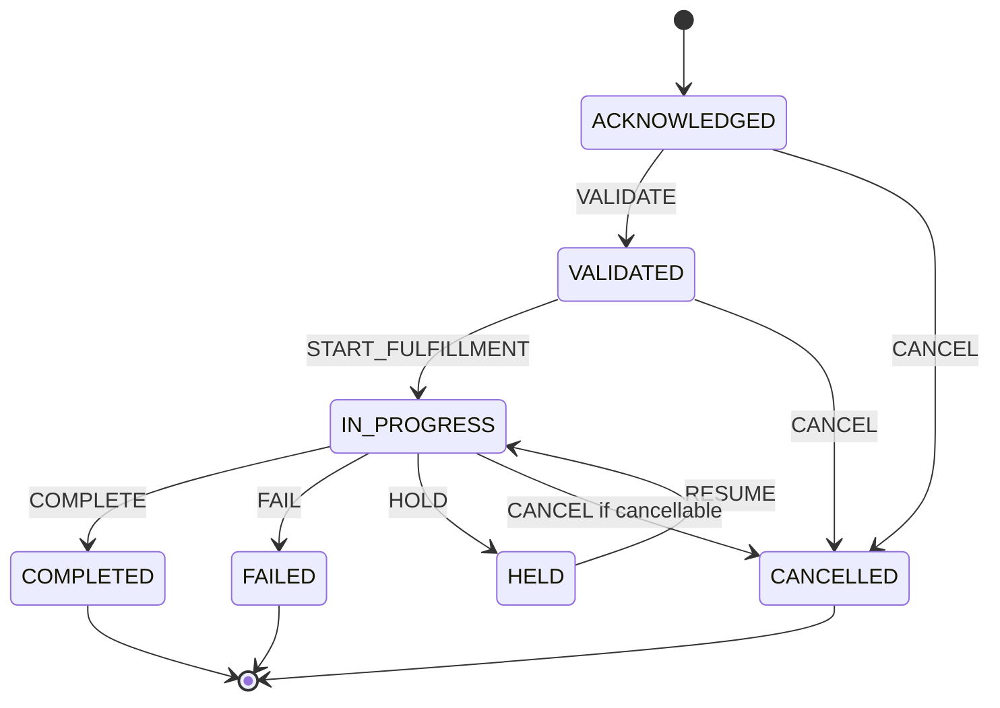
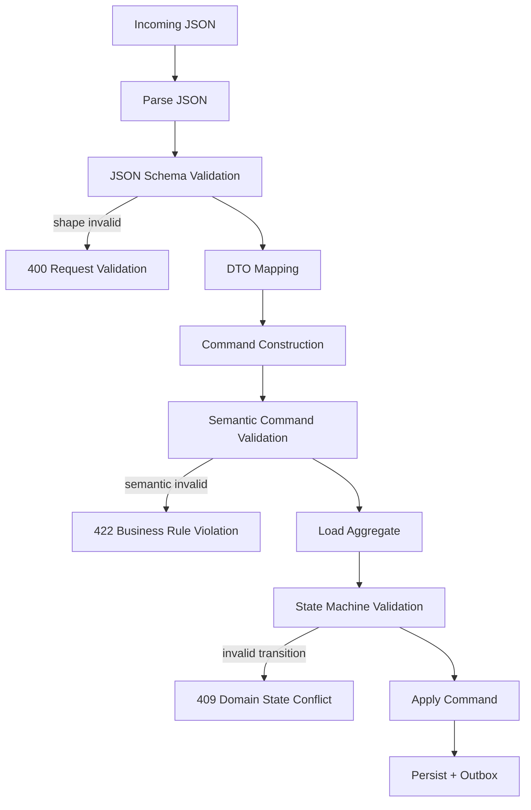

------
title: Build From Scratch: Enterprise Java Microservices CPQ & Order Management Platform - Part 016
description: Mendesain JSON Schema domain contracts untuk CPQ/OMS: product configuration, quote item, price item, order item, state transition command, audit event, integration event, validation boundary, schema versioning, dan compatibility strategy.
series: learn-enterprise-cpq-oms-glassfish-camunda8
seriesTitle: Build From Scratch: Enterprise Java Microservices CPQ & Order Management Platform
order: 16
partTitle: JSON Schema Domain Contracts
tags:
  - java
  - microservices
  - cpq
  - oms
  - json-schema
  - schema-first
  - openapi
  - contract-design
  - event-contract
  - validation
date: 2026-07-02
---

# Part 016 — JSON Schema Domain Contracts

Di Part 015 kita mendesain struktur OpenAPI, error model, pagination, filtering, idempotency, dan concurrency contract.

Sekarang kita masuk ke pondasi yang lebih kecil tetapi lebih berbahaya jika salah:

> Bagaimana mendesain JSON Schema untuk domain contract CPQ/OMS?

Di sistem enterprise, JSON bukan sekadar payload.

JSON adalah:

- input command,
- output projection,
- event payload,
- audit record,
- workflow variable snapshot,
- integration message,
- repair command,
- test fixture,
- documentation artifact,
- compatibility boundary.

Kalau schema lemah, service akan menerima bentuk data yang tampak valid tetapi secara domain beracun.

Contoh:

```json
{
  "quoteId": "quo_123",
  "status": "ACCEPTED",
  "items": [],
  "totalRecurring": -5000
}
```

Secara JSON valid. Secara bisnis kacau.

JSON Schema bisa membantu menolak struktur yang jelas salah. Tetapi ia bukan pengganti domain model, pricing engine, configuration engine, dan state machine.

---

## 1. Target Mental Model

Kita akan memakai mental model ini:

```text
JSON Schema validates shape.
Domain model validates meaning.
State machine validates timing.
Application service validates authority and use case.
```

Contoh:

| Concern | Tempat Validasi |
|---|---|
| `quoteId` wajib string | JSON Schema |
| `items` minimal satu saat submit | JSON Schema atau command validator |
| product option compatible | configuration engine |
| price override butuh approval | pricing/approval policy |
| quote expired tidak bisa accepted | state machine |
| user boleh approve quote ini | authorization layer |
| idempotency key reused dengan payload beda | idempotency service |

Kesalahan umum: mencoba memasukkan semua business rule ke JSON Schema.

Itu membuat schema sulit dipahami, sulit di-maintain, dan sering tetap tidak cukup ekspresif untuk domain rule nyata.

---

## 2. Jenis Schema Dalam Sistem CPQ/OMS

Jangan punya satu folder `schemas` untuk semuanya tanpa klasifikasi.

Kita butuh jenis schema berbeda:

| Jenis Schema | Tujuan | Contoh |
|---|---|---|
| API request schema | Validasi input HTTP | `QuoteCreateRequest` |
| API response schema | Kontrak response | `QuoteResponse` |
| Command schema | Payload domain command | `SubmitQuoteCommand` |
| Event schema | Kontrak Kafka event | `QuoteSubmittedEvent` |
| Audit schema | Bukti perubahan | `AuditRecord` |
| Workflow variable schema | Snapshot variable Camunda/Zeebe | `OrderFulfillmentVariables` |
| Integration schema | Payload ke/dari sistem luar | `BillingActivationRequest` |
| Test fixture schema | Stabilitas test data | `QuoteFixture` |

Satu domain concept bisa punya beberapa schema.

`Quote` untuk API response tidak sama dengan `QuoteSubmittedEvent` dan tidak sama dengan `quote` table.

---

## 3. Schema Repository Layout

Kita lanjutkan struktur dari Part 015:

```text
contracts/
  schemas/
    shared/
      id.schema.json
      money.schema.json
      time.schema.json
      reference.schema.json
      problem-detail.schema.json
    cpq/
      configuration/
        product-configuration.schema.json
        characteristic-value.schema.json
        configuration-validation-result.schema.json
      pricing/
        price-item.schema.json
        charge.schema.json
        discount.schema.json
        price-breakdown.schema.json
      quote/
        quote-create-request.schema.json
        quote-response.schema.json
        quote-item.schema.json
        quote-submit-command.schema.json
        quote-submitted-event.schema.json
    oms/
      order/
        order-create-request.schema.json
        order-response.schema.json
        order-item.schema.json
        order-state-transition-command.schema.json
        order-accepted-event.schema.json
      fulfillment/
        fulfillment-task.schema.json
        fulfillment-plan.schema.json
    asset/
      asset.schema.json
      subscription.schema.json
    audit/
      audit-record.schema.json
      field-change.schema.json
    events/
      event-envelope.schema.json
      event-metadata.schema.json
```

Prinsip:

- shared schema hanya untuk value object umum;
- domain schema ditempatkan di bounded context;
- event schema dipisah dari API response schema;
- command schema dipisah dari request schema jika command bisa datang dari non-HTTP source;
- audit schema stabil dan konservatif.

---

## 4. `$id`, `$schema`, dan Versioning

Setiap schema harus punya identity.

```json
{
  "$schema": "https://json-schema.org/draft/2020-12/schema",
  "$id": "https://schemas.example.com/cpq/quote/quote-item.schema.json",
  "title": "QuoteItem",
  "type": "object"
}
```

`$id` tidak harus bisa dibuka public oleh browser, tetapi sebaiknya resolvable di internal tooling.

Versioning bisa dilakukan dengan dua gaya.

### Gaya A — Version di URL `$id`

```text
https://schemas.example.com/cpq/quote/v1/quote-item.schema.json
```

### Gaya B — Version di Metadata

```json
{
  "$id": "https://schemas.example.com/cpq/quote/quote-item.schema.json",
  "x-domain-version": "1.0.0"
}
```

Untuk seri ini:

- API version ada di OpenAPI base path;
- event version ada di event envelope;
- schema `$id` stabil untuk major version;
- breaking change membuat major version baru;
- additive change tetap di schema version minor.

---

## 5. Strictness Policy: `additionalProperties`

Pertanyaan besar:

> Apakah schema harus menolak field tambahan?

Untuk request internal, biasanya iya.

```json
{
  "type": "object",
  "additionalProperties": false
}
```

Untuk event consumer, kadang perlu tolerant reader.

Jika producer menambah field optional, consumer lama tidak boleh crash.

Policy kita:

| Contract | `additionalProperties` |
|---|---|
| API request | `false` |
| API response | schema boleh menjelaskan field, client harus tolerant |
| Command internal | `false` |
| Event payload | producer schema jelas; consumer harus ignore unknown |
| Audit context | boleh `true` untuk extension terkontrol |
| Integration payload external | tergantung partner contract |

Jadi bukan satu aturan untuk semua.

---

## 6. Shared ID Schema

File: `contracts/schemas/shared/id.schema.json`

```json
{
  "$schema": "https://json-schema.org/draft/2020-12/schema",
  "$id": "https://schemas.example.com/shared/id.schema.json",
  "$defs": {
    "TenantId": {
      "type": "string",
      "pattern": "^ten_[A-Za-z0-9]{8,64}$"
    },
    "CustomerId": {
      "type": "string",
      "pattern": "^cus_[A-Za-z0-9]{8,64}$"
    },
    "QuoteId": {
      "type": "string",
      "pattern": "^quo_[A-Za-z0-9]{8,64}$"
    },
    "OrderId": {
      "type": "string",
      "pattern": "^ord_[A-Za-z0-9]{8,64}$"
    },
    "ProductOfferingId": {
      "type": "string",
      "pattern": "^po_[A-Za-z0-9]{8,64}$"
    },
    "ProductSpecificationId": {
      "type": "string",
      "pattern": "^ps_[A-Za-z0-9]{8,64}$"
    }
  }
}
```

Catatan penting:

- Prefix ID membantu observability dan debugging.
- Pattern tidak boleh terlalu mengikat implementation jika ID generator bisa berubah.
- Jangan validasi ID hanya sebagai `string` tanpa batas.
- Jangan expose sequential integer untuk public API jika tidak perlu.

---

## 7. Shared Money Schema

Money adalah sumber bug besar.

Jangan pakai float.

```json
{
  "$schema": "https://json-schema.org/draft/2020-12/schema",
  "$id": "https://schemas.example.com/shared/money.schema.json",
  "$defs": {
    "Money": {
      "type": "object",
      "required": ["amount", "currency"],
      "additionalProperties": false,
      "properties": {
        "amount": {
          "type": "string",
          "pattern": "^-?[0-9]+(\\.[0-9]{1,6})?$",
          "description": "Decimal amount encoded as string to avoid floating point precision loss."
        },
        "currency": {
          "type": "string",
          "pattern": "^[A-Z]{3}$",
          "example": "USD"
        }
      }
    },
    "NonNegativeMoney": {
      "allOf": [
        { "$ref": "#/$defs/Money" },
        {
          "properties": {
            "amount": {
              "type": "string",
              "pattern": "^[0-9]+(\\.[0-9]{1,6})?$"
            }
          }
        }
      ]
    }
  }
}
```

Kenapa amount string?

Karena JSON number tidak membawa decimal precision guarantee yang cukup aman untuk uang. Di Java nanti kita map ke `BigDecimal`.

Domain rule tambahan tetap di pricing engine:

- jumlah decimal sesuai currency;
- rounding policy;
- tax treatment;
- negative amount hanya untuk credit/discount;
- currency conversion tidak dilakukan sembarangan.

---

## 8. Time Schema

```json
{
  "$schema": "https://json-schema.org/draft/2020-12/schema",
  "$id": "https://schemas.example.com/shared/time.schema.json",
  "$defs": {
    "UtcDateTime": {
      "type": "string",
      "format": "date-time",
      "description": "Timestamp in UTC. Offset must be present."
    },
    "LocalDate": {
      "type": "string",
      "format": "date"
    },
    "EffectivePeriod": {
      "type": "object",
      "required": ["validFrom"],
      "additionalProperties": false,
      "properties": {
        "validFrom": { "$ref": "#/$defs/UtcDateTime" },
        "validTo": { "$ref": "#/$defs/UtcDateTime" }
      }
    }
  }
}
```

Domain CPQ/OMS harus membedakan:

| Waktu | Makna |
|---|---|
| `createdAt` | kapan record dibuat |
| `updatedAt` | kapan record terakhir berubah |
| `submittedAt` | kapan command submit terjadi |
| `acceptedAt` | kapan customer menerima quote |
| `effectiveFrom` | kapan commercial effect mulai |
| `requestedCompletionDate` | kapan customer ingin order selesai |
| `completedAt` | kapan fulfillment selesai |

Jangan pakai satu `date` untuk semua.

---

## 9. Product Configuration Schema

Product configuration adalah input paling penting di CPQ.

Kita butuh schema yang cukup fleksibel untuk berbagai product offering, tetapi tetap punya struktur stabil.

```json
{
  "$schema": "https://json-schema.org/draft/2020-12/schema",
  "$id": "https://schemas.example.com/cpq/configuration/product-configuration.schema.json",
  "title": "ProductConfiguration",
  "type": "object",
  "required": [
    "productOfferingId",
    "configurationVersion",
    "characteristics",
    "selectedOptions"
  ],
  "additionalProperties": false,
  "properties": {
    "productOfferingId": {
      "$ref": "https://schemas.example.com/shared/id.schema.json#/$defs/ProductOfferingId"
    },
    "configurationVersion": {
      "type": "integer",
      "minimum": 1
    },
    "catalogVersion": {
      "type": "string",
      "minLength": 1,
      "maxLength": 64
    },
    "characteristics": {
      "type": "array",
      "items": {
        "$ref": "#/$defs/CharacteristicValue"
      }
    },
    "selectedOptions": {
      "type": "array",
      "items": {
        "$ref": "#/$defs/SelectedOption"
      }
    }
  },
  "$defs": {
    "CharacteristicValue": {
      "type": "object",
      "required": ["code", "value"],
      "additionalProperties": false,
      "properties": {
        "code": {
          "type": "string",
          "pattern": "^[a-zA-Z][a-zA-Z0-9_]{1,63}$"
        },
        "value": {
          "oneOf": [
            { "type": "string" },
            { "type": "number" },
            { "type": "integer" },
            { "type": "boolean" },
            {
              "type": "array",
              "items": {
                "oneOf": [
                  { "type": "string" },
                  { "type": "number" },
                  { "type": "integer" },
                  { "type": "boolean" }
                ]
              }
            }
          ]
        },
        "unit": {
          "type": "string",
          "maxLength": 32
        }
      }
    },
    "SelectedOption": {
      "type": "object",
      "required": ["optionOfferingId", "quantity"],
      "additionalProperties": false,
      "properties": {
        "optionOfferingId": {
          "$ref": "https://schemas.example.com/shared/id.schema.json#/$defs/ProductOfferingId"
        },
        "quantity": {
          "type": "integer",
          "minimum": 1,
          "maximum": 9999
        },
        "characteristics": {
          "type": "array",
          "items": {
            "$ref": "#/$defs/CharacteristicValue"
          },
          "default": []
        }
      }
    }
  }
}
```

Yang schema bisa validasi:

- ada `productOfferingId`;
- `characteristics` berbentuk array;
- characteristic punya `code` dan `value`;
- selected option punya quantity positif;
- field tambahan ditolak.

Yang schema tidak boleh dipaksa validasi sendiri:

- apakah `bandwidth=10Gbps` boleh untuk offering ini;
- apakah option A dan B mutually exclusive;
- apakah quantity option sesuai cardinality catalog;
- apakah customer eligible;
- apakah catalog version masih aktif.

Itu tugas configuration engine.

---

## 10. Configuration Validation Result Schema

Configuration engine harus menjelaskan hasilnya.

```json
{
  "$schema": "https://json-schema.org/draft/2020-12/schema",
  "$id": "https://schemas.example.com/cpq/configuration/configuration-validation-result.schema.json",
  "title": "ConfigurationValidationResult",
  "type": "object",
  "required": ["valid", "violations", "warnings", "normalizedConfiguration"],
  "additionalProperties": false,
  "properties": {
    "valid": { "type": "boolean" },
    "normalizedConfiguration": {
      "$ref": "https://schemas.example.com/cpq/configuration/product-configuration.schema.json"
    },
    "violations": {
      "type": "array",
      "items": { "$ref": "#/$defs/ConfigurationViolation" }
    },
    "warnings": {
      "type": "array",
      "items": { "$ref": "#/$defs/ConfigurationWarning" }
    },
    "explanationId": {
      "type": "string"
    }
  },
  "$defs": {
    "ConfigurationViolation": {
      "type": "object",
      "required": ["code", "path", "message", "severity"],
      "additionalProperties": false,
      "properties": {
        "code": { "type": "string" },
        "path": { "type": "string" },
        "message": { "type": "string" },
        "severity": { "type": "string", "enum": ["ERROR"] },
        "ruleId": { "type": "string" }
      }
    },
    "ConfigurationWarning": {
      "type": "object",
      "required": ["code", "path", "message", "severity"],
      "additionalProperties": false,
      "properties": {
        "code": { "type": "string" },
        "path": { "type": "string" },
        "message": { "type": "string" },
        "severity": { "type": "string", "enum": ["WARNING"] },
        "ruleId": { "type": "string" }
      }
    }
  }
}
```

Explainability penting. User enterprise tidak cukup diberi pesan “invalid”. Mereka butuh tahu rule mana yang gagal.

---

## 11. Price Item Schema

Price item harus menjelaskan charge, bukan hanya total.

```json
{
  "$schema": "https://json-schema.org/draft/2020-12/schema",
  "$id": "https://schemas.example.com/cpq/pricing/price-item.schema.json",
  "title": "PriceItem",
  "type": "object",
  "required": [
    "priceItemId",
    "chargeType",
    "chargePeriod",
    "description",
    "listAmount",
    "netAmount",
    "currency",
    "discounts"
  ],
  "additionalProperties": false,
  "properties": {
    "priceItemId": { "type": "string" },
    "sourceRef": {
      "type": "object",
      "required": ["sourceType", "sourceId"],
      "additionalProperties": false,
      "properties": {
        "sourceType": {
          "type": "string",
          "enum": ["PRODUCT_OFFERING", "OPTION", "MANUAL_ADJUSTMENT", "PROMOTION"]
        },
        "sourceId": { "type": "string" }
      }
    },
    "chargeType": {
      "type": "string",
      "enum": ["ONE_TIME", "RECURRING", "USAGE", "PENALTY", "CREDIT"]
    },
    "chargePeriod": {
      "type": "string",
      "enum": ["NONE", "MONTHLY", "QUARTERLY", "YEARLY"]
    },
    "description": { "type": "string" },
    "quantity": {
      "type": "integer",
      "minimum": 1,
      "default": 1
    },
    "listAmount": {
      "$ref": "https://schemas.example.com/shared/money.schema.json#/$defs/Money"
    },
    "netAmount": {
      "$ref": "https://schemas.example.com/shared/money.schema.json#/$defs/Money"
    },
    "currency": {
      "type": "string",
      "pattern": "^[A-Z]{3}$"
    },
    "discounts": {
      "type": "array",
      "items": { "$ref": "#/$defs/DiscountApplied" }
    },
    "approvalRequired": { "type": "boolean", "default": false },
    "explanation": {
      "type": "array",
      "items": { "$ref": "#/$defs/PriceExplanationStep" }
    }
  },
  "$defs": {
    "DiscountApplied": {
      "type": "object",
      "required": ["discountId", "discountType", "amount"],
      "additionalProperties": false,
      "properties": {
        "discountId": { "type": "string" },
        "discountType": {
          "type": "string",
          "enum": ["PERCENTAGE", "FIXED_AMOUNT", "MANUAL_OVERRIDE", "PROMOTION"]
        },
        "amount": {
          "$ref": "https://schemas.example.com/shared/money.schema.json#/$defs/Money"
        },
        "reasonCode": { "type": "string" }
      }
    },
    "PriceExplanationStep": {
      "type": "object",
      "required": ["step", "message"],
      "additionalProperties": false,
      "properties": {
        "step": { "type": "string" },
        "message": { "type": "string" },
        "ruleId": { "type": "string" }
      }
    }
  }
}
```

Yang penting:

- `listAmount` dan `netAmount` dipisah;
- discount punya struktur;
- charge type explicit;
- charge period explicit;
- approval signal bisa terlihat;
- explanation tersedia untuk audit dan support.

---

## 12. Quote Item Schema

Quote item menyatukan offering, configuration, dan price snapshot.

```json
{
  "$schema": "https://json-schema.org/draft/2020-12/schema",
  "$id": "https://schemas.example.com/cpq/quote/quote-item.schema.json",
  "title": "QuoteItem",
  "type": "object",
  "required": [
    "quoteItemId",
    "action",
    "productOfferingId",
    "quantity",
    "configuration",
    "prices",
    "status"
  ],
  "additionalProperties": false,
  "properties": {
    "quoteItemId": {
      "type": "string",
      "pattern": "^qit_[A-Za-z0-9]{8,64}$"
    },
    "parentQuoteItemId": {
      "type": "string",
      "pattern": "^qit_[A-Za-z0-9]{8,64}$"
    },
    "action": {
      "type": "string",
      "enum": ["ADD", "MODIFY", "DISCONNECT", "MOVE"]
    },
    "productOfferingId": {
      "$ref": "https://schemas.example.com/shared/id.schema.json#/$defs/ProductOfferingId"
    },
    "targetAssetId": {
      "type": "string",
      "description": "Required for MODIFY, DISCONNECT, and MOVE actions."
    },
    "quantity": {
      "type": "integer",
      "minimum": 1
    },
    "configuration": {
      "$ref": "https://schemas.example.com/cpq/configuration/product-configuration.schema.json"
    },
    "prices": {
      "type": "array",
      "items": {
        "$ref": "https://schemas.example.com/cpq/pricing/price-item.schema.json"
      }
    },
    "status": {
      "type": "string",
      "enum": ["DRAFT", "CONFIGURED", "PRICED", "INVALID", "REMOVED"]
    }
  }
}
```

Schema bisa menyatakan `targetAssetId` optional. Tetapi domain validator harus memastikan:

```text
if action in MODIFY, DISCONNECT, MOVE -> targetAssetId required
if action == ADD -> targetAssetId absent
```

Bisa saja memakai conditional JSON Schema, tetapi untuk readability dan consistency, rule semacam ini sering lebih baik ada di semantic validator.

Jika ingin conditional schema:

```json
{
  "if": {
    "properties": {
      "action": { "enum": ["MODIFY", "DISCONNECT", "MOVE"] }
    }
  },
  "then": {
    "required": ["targetAssetId"]
  }
}
```

Gunakan conditional schema untuk rule sederhana dan stabil. Jangan gunakan untuk rule yang bergantung catalog/customer/asset state.

---

## 13. Quote Submit Command Schema

Command schema lebih kecil dari full quote.

```json
{
  "$schema": "https://json-schema.org/draft/2020-12/schema",
  "$id": "https://schemas.example.com/cpq/quote/quote-submit-command.schema.json",
  "title": "QuoteSubmitCommand",
  "type": "object",
  "required": ["quoteId", "submittedBy", "submittedAt"],
  "additionalProperties": false,
  "properties": {
    "quoteId": {
      "$ref": "https://schemas.example.com/shared/id.schema.json#/$defs/QuoteId"
    },
    "submittedBy": {
      "type": "string",
      "minLength": 1,
      "maxLength": 128
    },
    "submittedAt": {
      "$ref": "https://schemas.example.com/shared/time.schema.json#/$defs/UtcDateTime"
    },
    "comment": {
      "type": "string",
      "maxLength": 2000
    },
    "expectedVersion": {
      "type": "integer",
      "minimum": 1
    }
  }
}
```

Command tidak membawa seluruh quote karena source of truth tetap database quote aggregate.

Rule:

> Command membawa intent, bukan seluruh state.

---

## 14. Order Item Schema

Order item adalah execution unit. Ia harus punya action, decomposition readiness, dan dependency.

```json
{
  "$schema": "https://json-schema.org/draft/2020-12/schema",
  "$id": "https://schemas.example.com/oms/order/order-item.schema.json",
  "title": "OrderItem",
  "type": "object",
  "required": [
    "orderItemId",
    "action",
    "productOfferingId",
    "quantity",
    "state",
    "sourceQuoteItemRef"
  ],
  "additionalProperties": false,
  "properties": {
    "orderItemId": {
      "type": "string",
      "pattern": "^oit_[A-Za-z0-9]{8,64}$"
    },
    "parentOrderItemId": {
      "type": "string",
      "pattern": "^oit_[A-Za-z0-9]{8,64}$"
    },
    "action": {
      "type": "string",
      "enum": ["ADD", "MODIFY", "DISCONNECT", "MOVE"]
    },
    "productOfferingId": {
      "$ref": "https://schemas.example.com/shared/id.schema.json#/$defs/ProductOfferingId"
    },
    "quantity": {
      "type": "integer",
      "minimum": 1
    },
    "state": {
      "type": "string",
      "enum": [
        "ACKNOWLEDGED",
        "VALIDATED",
        "IN_PROGRESS",
        "COMPLETED",
        "FAILED",
        "CANCELLED",
        "HELD"
      ]
    },
    "sourceQuoteItemRef": {
      "type": "object",
      "required": ["quoteId", "quoteItemId"],
      "additionalProperties": false,
      "properties": {
        "quoteId": {
          "$ref": "https://schemas.example.com/shared/id.schema.json#/$defs/QuoteId"
        },
        "quoteItemId": {
          "type": "string"
        }
      }
    },
    "dependsOn": {
      "type": "array",
      "items": {
        "type": "string",
        "pattern": "^oit_[A-Za-z0-9]{8,64}$"
      }
    },
    "configurationSnapshotHash": {
      "type": "string"
    },
    "priceSnapshotHash": {
      "type": "string"
    }
  }
}
```

Order item tidak harus membawa semua detail configuration dan price di setiap response summary. Tetapi order harus punya snapshot reference/hash agar traceability quote-to-order tetap kuat.

---

## 15. State Transition Command Schema

State transition command harus eksplisit.

```json
{
  "$schema": "https://json-schema.org/draft/2020-12/schema",
  "$id": "https://schemas.example.com/oms/order/order-state-transition-command.schema.json",
  "title": "OrderStateTransitionCommand",
  "type": "object",
  "required": ["orderId", "transition", "requestedBy", "requestedAt"],
  "additionalProperties": false,
  "properties": {
    "orderId": {
      "$ref": "https://schemas.example.com/shared/id.schema.json#/$defs/OrderId"
    },
    "transition": {
      "type": "string",
      "enum": ["VALIDATE", "START_FULFILLMENT", "COMPLETE", "FAIL", "HOLD", "RESUME", "CANCEL"]
    },
    "reasonCode": {
      "type": "string",
      "maxLength": 64
    },
    "comment": {
      "type": "string",
      "maxLength": 2000
    },
    "requestedBy": {
      "type": "string",
      "maxLength": 128
    },
    "requestedAt": {
      "$ref": "https://schemas.example.com/shared/time.schema.json#/$defs/UtcDateTime"
    },
    "expectedVersion": {
      "type": "integer",
      "minimum": 1
    }
  }
}
```

Schema memastikan command berbentuk benar. State machine memastikan transition legal.



Jangan validasi state transition hanya di JSON Schema. State transition membutuhkan current state dari database.

---

## 16. Event Envelope Schema

Kafka event butuh envelope yang stabil.

```json
{
  "$schema": "https://json-schema.org/draft/2020-12/schema",
  "$id": "https://schemas.example.com/events/event-envelope.schema.json",
  "title": "EventEnvelope",
  "type": "object",
  "required": [
    "eventId",
    "eventType",
    "eventVersion",
    "occurredAt",
    "producer",
    "tenantId",
    "correlationId",
    "payload"
  ],
  "additionalProperties": false,
  "properties": {
    "eventId": {
      "type": "string",
      "pattern": "^evt_[A-Za-z0-9]{8,64}$"
    },
    "eventType": {
      "type": "string",
      "example": "cpq.quote.submitted"
    },
    "eventVersion": {
      "type": "integer",
      "minimum": 1
    },
    "occurredAt": {
      "$ref": "https://schemas.example.com/shared/time.schema.json#/$defs/UtcDateTime"
    },
    "producer": {
      "type": "string",
      "example": "cpq-service"
    },
    "tenantId": {
      "$ref": "https://schemas.example.com/shared/id.schema.json#/$defs/TenantId"
    },
    "correlationId": {
      "type": "string"
    },
    "causationId": {
      "type": "string",
      "description": "Command or event that caused this event."
    },
    "aggregateType": {
      "type": "string",
      "example": "QUOTE"
    },
    "aggregateId": {
      "type": "string"
    },
    "payload": {
      "type": "object"
    }
  }
}
```

Envelope memisahkan metadata dari payload.

Jangan taruh `eventId`, `tenantId`, `correlationId` tersebar di payload domain. Itu metadata event.

---

## 17. Quote Submitted Event Payload Schema

```json
{
  "$schema": "https://json-schema.org/draft/2020-12/schema",
  "$id": "https://schemas.example.com/cpq/quote/quote-submitted-event.schema.json",
  "title": "QuoteSubmittedEventPayload",
  "type": "object",
  "required": [
    "quoteId",
    "quoteNumber",
    "customerId",
    "submittedAt",
    "submittedBy",
    "quoteVersion",
    "approvalRequired",
    "totalOneTime",
    "totalRecurring"
  ],
  "additionalProperties": false,
  "properties": {
    "quoteId": {
      "$ref": "https://schemas.example.com/shared/id.schema.json#/$defs/QuoteId"
    },
    "quoteNumber": {
      "type": "string"
    },
    "customerId": {
      "$ref": "https://schemas.example.com/shared/id.schema.json#/$defs/CustomerId"
    },
    "submittedAt": {
      "$ref": "https://schemas.example.com/shared/time.schema.json#/$defs/UtcDateTime"
    },
    "submittedBy": {
      "type": "string"
    },
    "quoteVersion": {
      "type": "integer",
      "minimum": 1
    },
    "approvalRequired": {
      "type": "boolean"
    },
    "totalOneTime": {
      "$ref": "https://schemas.example.com/shared/money.schema.json#/$defs/Money"
    },
    "totalRecurring": {
      "$ref": "https://schemas.example.com/shared/money.schema.json#/$defs/Money"
    }
  }
}
```

Event payload tidak harus berisi seluruh quote. Ia harus berisi data yang consumer butuhkan untuk bereaksi.

Rule:

> Event bukan database dump. Event adalah fakta bisnis yang sudah terjadi.

---

## 18. Audit Record Schema

Audit schema harus lebih konservatif daripada API response.

Audit menjawab:

- siapa melakukan apa,
- kapan,
- terhadap resource apa,
- dari nilai apa ke nilai apa,
- lewat channel apa,
- dengan correlation ID apa,
- reason/comment apa,
- apakah ada approval atau policy reference.

```json
{
  "$schema": "https://json-schema.org/draft/2020-12/schema",
  "$id": "https://schemas.example.com/audit/audit-record.schema.json",
  "title": "AuditRecord",
  "type": "object",
  "required": [
    "auditId",
    "tenantId",
    "resourceType",
    "resourceId",
    "action",
    "actor",
    "occurredAt",
    "correlationId"
  ],
  "additionalProperties": false,
  "properties": {
    "auditId": {
      "type": "string",
      "pattern": "^aud_[A-Za-z0-9]{8,64}$"
    },
    "tenantId": {
      "$ref": "https://schemas.example.com/shared/id.schema.json#/$defs/TenantId"
    },
    "resourceType": {
      "type": "string",
      "enum": ["CATALOG", "QUOTE", "ORDER", "ASSET", "SUBSCRIPTION", "APPROVAL", "FULFILLMENT_TASK"]
    },
    "resourceId": {
      "type": "string"
    },
    "action": {
      "type": "string",
      "example": "QUOTE_SUBMITTED"
    },
    "actor": {
      "$ref": "#/$defs/AuditActor"
    },
    "occurredAt": {
      "$ref": "https://schemas.example.com/shared/time.schema.json#/$defs/UtcDateTime"
    },
    "correlationId": {
      "type": "string"
    },
    "reasonCode": {
      "type": "string"
    },
    "comment": {
      "type": "string",
      "maxLength": 4000
    },
    "changes": {
      "type": "array",
      "items": {
        "$ref": "#/$defs/FieldChange"
      }
    },
    "policyRefs": {
      "type": "array",
      "items": {
        "type": "string"
      }
    },
    "context": {
      "type": "object",
      "additionalProperties": true
    }
  },
  "$defs": {
    "AuditActor": {
      "type": "object",
      "required": ["actorType", "actorId"],
      "additionalProperties": false,
      "properties": {
        "actorType": {
          "type": "string",
          "enum": ["USER", "SYSTEM", "SERVICE", "PARTNER"]
        },
        "actorId": {
          "type": "string"
        },
        "displayName": {
          "type": "string"
        }
      }
    },
    "FieldChange": {
      "type": "object",
      "required": ["path", "changeType"],
      "additionalProperties": false,
      "properties": {
        "path": { "type": "string" },
        "changeType": {
          "type": "string",
          "enum": ["ADDED", "UPDATED", "REMOVED"]
        },
        "oldValue": true,
        "newValue": true
      }
    }
  }
}
```

`oldValue` dan `newValue` memakai `true` karena JSON Schema memperbolehkan schema boolean. `true` artinya nilai apa pun valid.

Tetapi secara implementation, kita tetap harus masking data sensitif.

---

## 19. Workflow Variable Schema

Camunda/Zeebe variables sering menjadi tempat data liar jika tidak dikontrol.

Untuk order fulfillment process, jangan kirim seluruh order aggregate sebagai variable besar.

Gunakan variable schema kecil:

```json
{
  "$schema": "https://json-schema.org/draft/2020-12/schema",
  "$id": "https://schemas.example.com/oms/fulfillment/order-fulfillment-variables.schema.json",
  "title": "OrderFulfillmentVariables",
  "type": "object",
  "required": [
    "orderId",
    "tenantId",
    "fulfillmentPlanId",
    "orderVersion",
    "correlationId"
  ],
  "additionalProperties": false,
  "properties": {
    "orderId": {
      "$ref": "https://schemas.example.com/shared/id.schema.json#/$defs/OrderId"
    },
    "tenantId": {
      "$ref": "https://schemas.example.com/shared/id.schema.json#/$defs/TenantId"
    },
    "fulfillmentPlanId": {
      "type": "string"
    },
    "orderVersion": {
      "type": "integer",
      "minimum": 1
    },
    "correlationId": {
      "type": "string"
    },
    "recoveryMode": {
      "type": "string",
      "enum": ["NORMAL", "RETRY", "MANUAL_REPAIR"],
      "default": "NORMAL"
    }
  }
}
```

Rule:

> Workflow variable membawa pointer dan control data, bukan seluruh domain truth.

Domain truth tetap di PostgreSQL.

---

## 20. Validation Pipeline

Schema validation bukan satu-satunya validasi.



Layering:

| Layer | Input | Output |
|---|---|---|
| JSON parser | raw body | JSON tree/object |
| Schema validator | JSON tree | structural validation result |
| DTO mapper | JSON tree | typed request DTO |
| Command factory | DTO + context | command object |
| Semantic validator | command + reference data | valid/violations |
| Domain aggregate | command + current state | new state/events |

Jangan skip command object. DTO langsung masuk domain biasanya membuat API shape mencemari domain model.

---

## 21. Java Mapping Direction

Schema-first bukan berarti semua class generated harus menjadi domain class.

Boundary yang benar:

```text
JSON Schema / OpenAPI
    -> generated API DTO
        -> application command/query
            -> domain value object / aggregate
                -> persistence model / MyBatis mapper
```

Jangan:

```text
generated API DTO == domain entity == DB row == event payload
```

Itu terlihat hemat di awal, tapi menghancurkan evolusi sistem.

---

## 22. Schema Compatibility Strategy

### 22.1 Request Schema

Backward compatible changes:

- tambah optional field;
- longgarkan constraint dengan aman;
- tambah enum hanya jika server tetap menerima nilai lama.

Breaking:

- tambah required field;
- rename field;
- ubah type;
- ubah semantic;
- perketat constraint yang dulu valid menjadi invalid.

### 22.2 Response Schema

Backward compatible untuk producer:

- tambah optional field.

Tetapi consumer harus tolerant.

Generated client yang strict bisa rusak jika unknown field tidak diabaikan.

### 22.3 Event Schema

Event lebih sensitif karena replay.

Rule:

- event lama harus tetap bisa dibaca;
- jangan ubah makna field event lama;
- breaking change buat event version baru;
- consumer harus memilih versi yang didukung;
- schema registry/diff check wajib di CI;
- jangan hapus event type dari topic sebelum retention dan consumer migration jelas.

---

## 23. Schema Diff Policy

CI harus mendeteksi perubahan schema.

Kategori diff:

| Change | Kategori |
|---|---|
| add optional property | compatible |
| add required property | breaking |
| remove property | breaking |
| change string to integer | breaking |
| tighten maxLength | breaking for request |
| loosen maxLength | compatible |
| add enum value | conditional |
| remove enum value | breaking |
| change `$id` | breaking if referenced |
| change default | potentially breaking |

Schema diff tidak bisa menilai semua semantic change. Karena itu butuh review manusia.

---

## 24. Example Payloads As Contract Tests

Setiap schema harus punya example valid dan invalid.

```text
contracts/examples/
  cpq/
    quote/
      quote-create-request.valid.json
      quote-create-request.invalid-missing-customer.json
      quote-submitted-event.valid.json
  oms/
    order/
      order-create-request.valid.json
      order-state-transition.invalid-transition-shape.json
```

CI:

```text
for each *.valid.json:
  validate against schema -> must pass

for each *.invalid-*.json:
  validate against schema -> must fail
```

Ini sederhana tetapi sangat efektif.

---

## 25. Schema-Driven Test Fixtures

Test fixture harus mengikuti schema.

Contoh fixture quote item:

```json
{
  "quoteItemId": "qit_01J2ABCDEFGH",
  "action": "ADD",
  "productOfferingId": "po_01J2ABCDEFGH",
  "quantity": 1,
  "configuration": {
    "productOfferingId": "po_01J2ABCDEFGH",
    "configurationVersion": 1,
    "catalogVersion": "2026.07",
    "characteristics": [
      { "code": "bandwidth", "value": "1Gbps" },
      { "code": "contractTerm", "value": 24, "unit": "months" }
    ],
    "selectedOptions": []
  },
  "prices": [],
  "status": "CONFIGURED"
}
```

Fixture yang tidak valid harus ditolak sebelum masuk unit/integration test.

Kalau test data saja tidak schema-valid, test tidak bisa dipercaya.

---

## 26. Domain Contract Matrix

Untuk menjaga coverage, buat matrix.

| Domain Object | API Request | API Response | Command | Event | Audit | Workflow |
|---|---:|---:|---:|---:|---:|---:|
| Product Offering | yes | yes | publish/retire | yes | yes | no |
| Configuration | yes | yes | validate | maybe | yes | no |
| Price | yes | yes | simulate/reprice | yes | yes | no |
| Quote | yes | yes | submit/accept/cancel | yes | yes | approval only |
| Order | yes | yes | validate/cancel/amend | yes | yes | yes |
| Fulfillment Task | no | yes | retry/complete/fail | yes | yes | yes |
| Asset | no direct create | yes | created by order | yes | yes | no |
| Subscription | no direct create | yes | created by order | yes | yes | no |

Matrix ini membantu menghindari schema bolong.

---

## 27. Where JSON Schema Should Not Be Used

Jangan memaksa JSON Schema untuk:

- menghitung price;
- mengevaluasi promotion;
- memutus approval required;
- mengecek inventory availability;
- memastikan fulfillment dependency bisa dijalankan;
- membaca installed base;
- mengecek permission user;
- menentukan SLA;
- menjalankan reconciliation.

Schema adalah guardrail awal, bukan otak sistem.

---

## 28. Anti-Patterns

### 28.1 One Mega Schema

Buruk:

```text
enterprise-cpq-oms.schema.json
```

Satu file untuk semua domain membuat reuse dan review sulit.

### 28.2 Domain Entity Generated From API Schema

Generated DTO boleh. Domain entity jangan.

### 28.3 Event Payload Sama Dengan API Response

API response menjawab user sekarang. Event menyatakan fakta yang terjadi.

Keduanya bisa mirip, tetapi tidak boleh dipaksa sama.

### 28.4 `additionalProperties: true` Everywhere

Ini membuat schema kehilangan fungsi sebagai contract.

### 28.5 Overusing `oneOf`

`oneOf` kuat, tetapi tooling/client generator bisa bermasalah. Gunakan saat domain polymorphism benar-benar perlu.

### 28.6 Money As Number

Buruk:

```json
{ "amount": 19.99 }
```

Lebih aman:

```json
{ "amount": "19.99", "currency": "USD" }
```

### 28.7 Unbounded String

Buruk:

```json
{ "comment": { "type": "string" } }
```

Lebih baik:

```json
{ "comment": { "type": "string", "maxLength": 2000 } }
```

Unbounded input adalah undangan untuk storage, logging, dan security problem.

---

## 29. Part 016 Deliverables

Setelah part ini, kita punya standar untuk:

- klasifikasi schema CPQ/OMS;
- schema repository layout;
- `$id` dan versioning policy;
- strictness policy;
- shared ID schema;
- Money schema;
- Time schema;
- Product Configuration schema;
- Configuration Validation Result schema;
- Price Item schema;
- Quote Item schema;
- Quote Submit Command schema;
- Order Item schema;
- State Transition Command schema;
- Event Envelope schema;
- Quote Submitted Event schema;
- Audit Record schema;
- Workflow Variable schema;
- validation pipeline;
- Java mapping boundary;
- compatibility strategy;
- schema diff policy;
- schema-driven examples and fixtures.

Ini adalah pondasi untuk implementasi API, event, audit, dan workflow pada part berikutnya.

---

## 30. Latihan Desain

Buat schema untuk:

1. `OrderCancelledEventPayload`
2. `FulfillmentTaskFailedEventPayload`
3. `QuoteApprovalRequestedEventPayload`
4. `ManualRepairCommand`
5. `AssetActivatedEventPayload`

Untuk masing-masing, tentukan:

- field required;
- field optional;
- apakah perlu `reasonCode`;
- apakah perlu `correlationId` di payload atau cukup envelope;
- apakah payload perlu snapshot besar atau cukup reference;
- compatibility rule jika field baru ditambah;
- data mana yang harus di-mask di audit/log.

---

## 31. Referensi Resmi

- JSON Schema Draft 2020-12: https://json-schema.org/draft/2020-12
- JSON Schema Specification: https://json-schema.org/specification
- OpenAPI Specification: https://spec.openapis.org/oas/latest.html
- RFC 9457 Problem Details for HTTP APIs: https://www.rfc-editor.org/rfc/rfc9457.html
