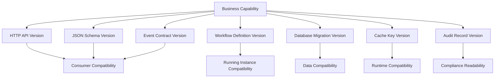
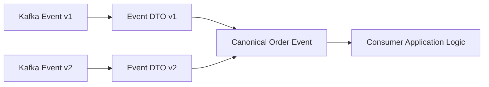
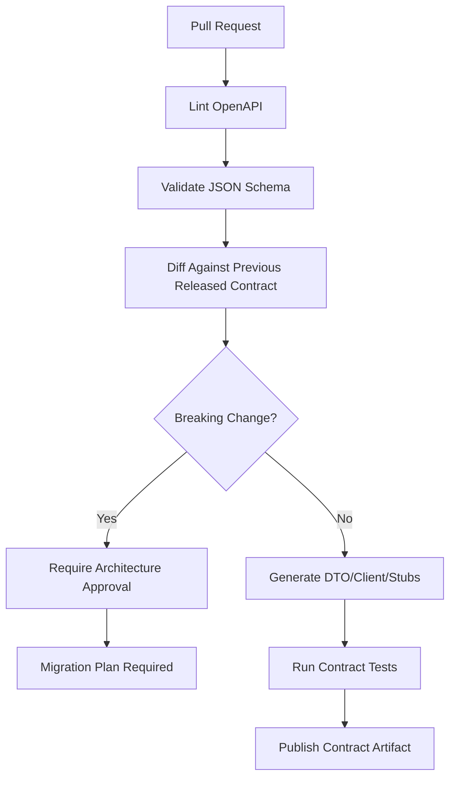
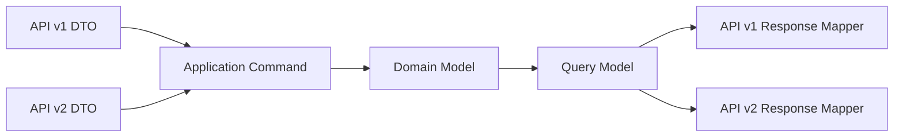
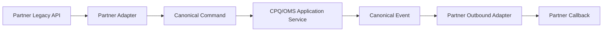

------
title: Build From Scratch: Enterprise Java Microservices CPQ & Order Management Platform - Part 017
description: Mendesain API versioning dan backward compatibility untuk enterprise CPQ/OMS: semantic compatibility, OpenAPI diff, schema evolution, event compatibility, workflow compatibility, deprecation, rollout, dan Java implementation boundary.
series: learn-enterprise-cpq-oms-glassfish-camunda8
seriesTitle: Build From Scratch: Enterprise Java Microservices CPQ & Order Management Platform
order: 17
partTitle: API Versioning and Backward Compatibility
tags:
  - java
  - microservices
  - cpq
  - oms
  - openapi
  - json-schema
  - api-versioning
  - backward-compatibility
  - contract-testing
  - enterprise-architecture
date: 2026-07-02
---

# Part 017 — API Versioning and Backward Compatibility

Di Part 013 sampai Part 016 kita membangun pondasi API-first dan schema-first:

- OpenAPI sebagai kontrak HTTP API,
- JSON Schema sebagai kontrak struktur payload,
- error model,
- pagination,
- filtering,
- idempotency,
- optimistic concurrency,
- dan domain schema untuk configuration, price, quote, order, event, audit, serta workflow variable.

Sekarang kita masuk ke masalah yang sering diremehkan:

> Bagaimana mengubah API tanpa menghancurkan consumer, order yang sedang berjalan, workflow yang masih hidup, event replay, dan integrasi enterprise yang lambat berubah?

Versioning bukan solusi ajaib. Versioning adalah **biaya organisasi**.

Kalau setiap perubahan kecil langsung dibuat `/v2`, sistem akan cepat menjadi museum API mati. Sebaliknya, kalau semua perubahan dipaksakan masuk `/v1` tanpa compatibility discipline, consumer akan pecah diam-diam.

Target kita bukan sekadar punya versi.

Target kita adalah punya **evolution model**.

---

## 1. Mental Model: Compatibility Lebih Penting Daripada Version Number

Nomor versi tidak membuat API aman.

Yang membuat API aman adalah kemampuan menjawab pertanyaan ini:

```text
Apakah consumer lama masih bisa berjalan ketika provider baru dirilis?
```

Itu definisi praktis backward compatibility.

Untuk CPQ/OMS, compatibility harus dilihat dari banyak permukaan:

| Surface | Contoh | Risiko |
|---|---|---|
| HTTP API | `POST /quotes`, `GET /orders/{id}` | UI, partner, integration client gagal |
| JSON Schema | field required, enum, format | payload valid kemarin menjadi invalid hari ini |
| Error Contract | error code berubah | client tidak bisa recovery |
| Event Contract | `OrderSubmitted`, `QuoteAccepted` | consumer Kafka gagal deserialize |
| Workflow Variables | Camunda/Zeebe variables | running process instance gagal saat worker baru membaca variable lama |
| Database Shape | migration kolom | deployment gagal atau data lama tidak valid |
| Cache Key | Redis key schema berubah | stale read, miss besar, atau data salah |
| Idempotency Record | request hash berubah | duplicate command tidak dikenali |
| Audit Contract | audit field berubah | compliance evidence sulit dibaca |

Jadi aturan pertama:

> Versioning API tidak boleh dipikirkan terpisah dari schema, event, workflow, database, cache, dan audit.

---

## 2. Jangan Jadikan `/v2` Sebagai Tempat Sampah Perubahan

Banyak tim memakai pendekatan ini:

```text
Ada breaking change? Buat /v2.
Ada naming kurang enak? Buat /v2.
Ada field baru? Buat /v2.
Ada response berubah? Buat /v2.
```

Hasilnya:

```text
/v1 masih dipakai UI lama
/v2 dipakai mobile app
/v3 dipakai partner
/v4 dipakai internal tool
/v5 setengah jadi
```

Lalu setiap bug fix harus dipikirkan lima kali.

Di enterprise CPQ/OMS, ini berbahaya karena order lifecycle bisa panjang. Satu order bisa hidup beberapa hari, minggu, atau bulan. Quote bisa direvisi berkali-kali. Approval bisa menunggu manusia. Fulfillment bisa pending karena eksternal system.

Kalau API lifecycle terlalu agresif, sistem menjadi sulit dioperasikan.

Prinsip kita:

```text
Major API version is a compatibility boundary, not a release number.
```

Artinya:

- jangan naik major hanya karena implementasi berubah,
- jangan naik major hanya karena field baru ditambahkan,
- jangan naik major hanya karena internal model berubah,
- naik major hanya jika consumer lama memang tidak bisa dipertahankan dengan wajar.

---

## 3. Definisi Compatibility untuk Seri Ini

Kita akan memakai empat definisi.

### 3.1 Backward Compatible

Provider baru tetap bisa melayani consumer lama.

Contoh aman:

```json
{
  "quoteId": "quo_1001",
  "status": "DRAFT",
  "validUntil": "2026-08-01T00:00:00Z",
  "approvalRequired": false
}
```

Field `approvalRequired` baru ditambahkan di response. Consumer lama yang mengabaikan field tidak dikenal tetap berjalan.

### 3.2 Forward Tolerant

Consumer baru masih bisa menerima data dari provider lama, selama field baru diperlakukan optional.

Contoh:

```java
boolean approvalRequired = response.approvalRequired() != null
    ? response.approvalRequired()
    : false;
```

Consumer tidak boleh menganggap provider selalu mengirim field baru.

### 3.3 Wire Compatible

Payload lama masih bisa diparse oleh schema/DTO baru.

Contoh aman:

```text
Field optional ditambahkan.
Enum lama tetap ada.
Existing field tidak berubah tipe.
```

### 3.4 Semantic Compatible

Makna bisnis tidak berubah untuk field/endpoint yang sama.

Ini yang paling sering dilanggar.

Contoh breaking secara semantic:

```text
GET /quotes/{id}/price
```

Sebelumnya mengembalikan price termasuk discount. Sekarang mengembalikan price sebelum discount, tetapi field tetap bernama `totalRecurring`.

Secara schema mungkin compatible. Secara bisnis rusak.

Untuk CPQ/OMS, semantic compatibility lebih penting daripada sekadar JSON compatibility.

---

## 4. Compatibility Matrix

Gunakan matrix ini untuk menilai setiap perubahan API.

### 4.1 Response Body

| Perubahan | Aman? | Catatan |
|---|---:|---|
| Menambah optional field | Ya | Consumer harus ignore unknown fields |
| Menghapus field | Tidak | Breaking |
| Mengubah field type | Tidak | Breaking |
| Mengubah field format | Biasanya tidak | Contoh `date` menjadi `date-time` |
| Mengubah field meaning | Tidak | Semantic breaking |
| Menambah enum value | Tergantung | Aman hanya jika consumer didesain unknown-safe |
| Mengubah enum value string | Tidak | Breaking |
| Mengubah nullability dari nullable ke non-null | Tergantung | Bisa aman di response, tapi hati-hati consumer |
| Mengubah nullability dari non-null ke nullable | Tidak | Consumer bisa NPE |
| Mengubah array ordering | Tergantung | Breaking jika ordering pernah dijanjikan |
| Mengubah default sorting | Tidak aman | Bisa merusak pagination |

### 4.2 Request Body

| Perubahan | Aman? | Catatan |
|---|---:|---|
| Menambah optional request field | Ya | Provider lama akan ignore hanya jika schema longgar; hati-hati |
| Menambah required request field | Tidak | Consumer lama tidak mengirim |
| Menghapus required field | Tergantung | Bisa aman tapi mengubah semantic |
| Mengubah field type | Tidak | Breaking |
| Memperketat validation | Biasanya tidak | Request lama bisa ditolak |
| Melonggarkan validation | Biasanya aman | Tetapi cek invariant bisnis |
| Menambah enum value di request | Aman bagi provider | Consumer lama belum tentu tahu |
| Menghapus enum value | Tidak | Breaking |

### 4.3 HTTP Status dan Error

| Perubahan | Aman? | Catatan |
|---|---:|---|
| Menambah error code baru | Tergantung | Consumer harus punya fallback unknown error |
| Mengganti error code lama | Tidak | Breaking recovery logic |
| Mengubah 400 menjadi 422 | Tergantung | Bisa breaking jika client branch by status |
| Mengubah 409 conflict menjadi 200 success | Tidak | Semantic breaking |
| Menambah header metadata | Ya | Jika optional |
| Menghapus correlation header | Tidak | Observability breaking |

### 4.4 Pagination, Filtering, Sorting

| Perubahan | Aman? | Catatan |
|---|---:|---|
| Menambah filter baru | Ya | Optional |
| Menghapus filter | Tidak | Breaking |
| Mengubah default page size | Tergantung | Bisa berdampak performance/UI |
| Mengubah cursor format | Tidak | Cursor lama bisa gagal |
| Mengubah sort default | Tidak aman | Bisa duplicate/missing item di client |
| Menambah sortable field | Ya | Optional |

### 4.5 Event Contract

| Perubahan | Aman? | Catatan |
|---|---:|---|
| Menambah optional field | Ya | Consumer ignore unknown |
| Menghapus field | Tidak | Breaking |
| Mengubah event name | Tidak | Breaking |
| Mengubah partition key | Sangat tidak aman | Ordering bisa rusak |
| Mengubah event meaning | Tidak | Consumer salah mengambil aksi |
| Menambah event type baru | Ya, jika consumer unknown-safe | Consumer harus skip unknown event |

---

## 5. Versioning Surfaces dalam CPQ/OMS

Jangan hanya versioning URL.

Kita perlu versioning policy untuk semua contract berikut:



Untuk seri ini, kita pakai strategi berikut.

| Surface | Strategy |
|---|---|
| Public REST API | Major version di base path: `/api/v1` |
| Internal REST API | Sama, tapi lifecycle lebih cepat dan consumer terbatas |
| JSON Schema | `$id` mengandung domain, object, dan major version |
| Event | Event name stabil, payload punya `schemaVersion` |
| Workflow BPMN | Version by deployment; process definition version dikelola Camunda/Zeebe |
| Worker Contract | Job type stabil; variables backward-compatible |
| Database | Migration incremental, backward-compatible during rolling deploy |
| Redis Key | Prefix version saat shape berubah |
| Audit | `recordSchemaVersion` untuk long-term readability |

---

## 6. URL Versioning: Kenapa Kita Pakai `/api/v1`

Ada beberapa strategi:

```text
/api/v1/quotes
/api/quotes dengan Accept: application/vnd.company.quote.v1+json
/api/quotes?version=1
/api/quotes tanpa versi eksplisit
```

Untuk sistem enterprise internal + partner-heavy, `/api/v1` lebih eksplisit dan mudah dioperasikan.

Kelebihan:

- mudah dibaca,
- mudah di-route di gateway,
- mudah diamati di log,
- mudah didokumentasikan,
- mudah dipisahkan oleh contract test,
- mudah diberi deprecation policy.

Kekurangan:

- bisa mendorong tim membuat `/v2` terlalu cepat,
- endpoint path menjadi membawa versi,
- kadang versi resource dan versi operation tidak selalu sejalan.

Keputusan seri:

```text
Use /api/v1 for major compatibility boundaries.
Do not create /api/v2 for additive changes.
```

Contoh:

```yaml
openapi: 3.1.1
info:
  title: Enterprise CPQ Quote API
  version: 1.4.0
servers:
  - url: https://api.example.com/api/v1
paths:
  /quotes:
    post:
      operationId: createQuote
```

Perhatikan:

- path major version: `/api/v1`,
- OpenAPI document version: `1.4.0`,
- schema version: bisa berbeda,
- application release version: bisa berbeda.

Jangan campur semua menjadi satu angka.

---

## 7. Jangan Samakan API Version dengan Application Version

Misalnya:

```text
Application release: 2026.07.15-rc.3
API document version: 1.8.0
API base path: /api/v1
Quote schema major: 1
Order event schema major: 1
Workflow version: quote-approval:17
Database migration: V142__add_quote_approval_reason.sql
```

Semua angka itu menjawab pertanyaan berbeda.

| Version | Menjawab Pertanyaan |
|---|---|
| Application release | Build/deployment mana yang berjalan? |
| API document version | Kontrak OpenAPI berubah apa? |
| API major path | Apakah consumer lama masih compatible? |
| Schema major | Apakah payload shape masih compatible? |
| Event schema version | Consumer event harus membaca versi mana? |
| Workflow version | Instance baru memakai BPMN deployment mana? |
| DB migration | Struktur database sudah sampai tahap mana? |

Kalau semua dipaksa satu angka, release governance akan kacau.

---

## 8. Semantic Versioning untuk API Document

Kita bisa memakai ide SemVer untuk `info.version` OpenAPI, tetapi dengan interpretasi contract:

```text
MAJOR.MINOR.PATCH
```

| Bagian | Arti dalam API Contract |
|---|---|
| MAJOR | Breaking contract change |
| MINOR | Backward-compatible addition |
| PATCH | Clarification, documentation fix, non-contract correction |

Contoh:

```text
1.2.0 -> 1.3.0
```

Menambah optional field `quote.expirationReason` di response.

```text
1.3.0 -> 2.0.0
```

Mengubah `quote.status` dari string enum menjadi object.

Tapi jangan otomatis deploy `/api/v2` hanya karena `info.version` major naik. Path major dan document major biasanya sejalan, tetapi proses migrasinya perlu desain.

---

## 9. JSON Schema Versioning Policy

Gunakan `$id` yang stabil dan eksplisit.

Contoh:

```json
{
  "$id": "https://schemas.example.com/cpq/quote/v1/quote-response.schema.json",
  "$schema": "https://json-schema.org/draft/2020-12/schema",
  "title": "QuoteResponse",
  "type": "object",
  "required": ["quoteId", "status", "items", "currency"],
  "properties": {
    "quoteId": { "type": "string", "pattern": "^quo_[A-Za-z0-9]+$" },
    "status": {
      "type": "string",
      "enum": ["DRAFT", "PRICED", "SUBMITTED", "APPROVED", "ACCEPTED", "EXPIRED", "CANCELLED"]
    },
    "currency": { "type": "string", "minLength": 3, "maxLength": 3 },
    "items": {
      "type": "array",
      "items": { "$ref": "quote-item.schema.json" }
    }
  },
  "additionalProperties": false
}
```

Policy:

```text
v1 in $id means major schema version.
Minor/patch changes live in repository tag or OpenAPI info.version.
```

Kenapa tidak menaruh minor di `$id`?

Karena kalau setiap optional field baru membuat URL schema berubah, consumer harus terlalu sering update. Untuk runtime validation, biasanya kita butuh major compatibility boundary, bukan setiap patch.

---

## 10. `additionalProperties`: Strict atau Loose?

Di Part 016 kita sudah menyentuh ini. Untuk versioning, ini sangat penting.

Ada dua pilihan:

### Strict Contract

```json
{
  "type": "object",
  "additionalProperties": false
}
```

Kelebihan:

- payload liar ditolak,
- typo cepat terdeteksi,
- domain contract rapi,
- audit lebih bersih.

Kekurangan:

- provider lama bisa menolak request consumer baru yang mengirim optional field baru,
- extension sulit.

### Loose Contract

```json
{
  "type": "object",
  "additionalProperties": true
}
```

Kelebihan:

- forward tolerant,
- cocok untuk extension.

Kekurangan:

- typo lolos,
- field tidak terdokumentasi menyebar,
- domain model bisa bocor.

Keputusan seri:

| Payload Type | Policy |
|---|---|
| Public command request | Strict |
| Public response | Strict di schema, consumer harus ignore unknown jika library memungkinkan |
| Event payload | Prefer strict per major version |
| Metadata bag | Explicit extension object |
| Partner extension | Gunakan `extensions` object, bukan root loose field |

Contoh extension terkendali:

```json
{
  "quoteId": "quo_1001",
  "status": "DRAFT",
  "extensions": {
    "partnerX": {
      "campaignCode": "RAMADAN-2026"
    }
  }
}
```

Root object tetap terkendali.

---

## 11. Enum Evolution: Sumber Breaking Change Diam-Diam

Enum terlihat sederhana, tetapi sering merusak consumer.

Contoh:

```json
{
  "status": "PENDING_EXTERNAL_APPROVAL"
}
```

Jika consumer lama hanya mengenal:

```java
enum QuoteStatus {
    DRAFT,
    PRICED,
    SUBMITTED,
    APPROVED,
    REJECTED,
    ACCEPTED
}
```

Deserialize bisa gagal.

Ada tiga strategi.

### 11.1 Closed Enum

Consumer harus mengenal semua value.

Cocok untuk command request:

```text
Client mengirim actionType.
Provider berhak menolak value tidak dikenal.
```

### 11.2 Open Enum

Consumer harus toleran terhadap value baru.

Cocok untuk response status:

```text
Server dapat memperkenalkan status baru.
Client lama harus fallback ke UNKNOWN.
```

### 11.3 Enum + Category

Untuk status yang kemungkinan berkembang, tambahkan category stabil.

```json
{
  "status": "PENDING_EXTERNAL_APPROVAL",
  "statusCategory": "IN_PROGRESS"
}
```

UI lama bisa memakai `statusCategory` untuk behavior umum.

Contoh Java:

```java
public enum StatusCategory {
    DRAFT,
    IN_PROGRESS,
    SUCCESS,
    FAILURE,
    TERMINAL,
    UNKNOWN
}
```

Untuk CPQ/OMS, ini sangat berguna di order dan fulfillment dashboard.

---

## 12. Error Code Versioning

Error code adalah contract.

Jangan asal ubah.

Contoh error:

```json
{
  "type": "https://errors.example.com/cpq/quote/invalid-transition",
  "title": "Invalid quote state transition",
  "status": 409,
  "code": "QUOTE_INVALID_STATE_TRANSITION",
  "detail": "Quote quo_1001 cannot move from ACCEPTED to DRAFT.",
  "correlationId": "corr_abc",
  "violations": []
}
```

Policy:

- `code` stabil,
- `type` stabil,
- `title` boleh diperjelas tapi jangan ubah makna,
- `detail` tidak boleh diparse client,
- `violations.field` harus stabil jika digunakan UI,
- error baru boleh ditambahkan,
- error lama jangan diganti diam-diam.

Kalau perlu mengganti error:

```text
1. Tambahkan error baru.
2. Dokumentasikan mapping lama -> baru.
3. Emit warning/deprecation header jika memungkinkan.
4. Hapus hanya di major version berikutnya.
```

---

## 13. Idempotency Contract Compatibility

Idempotency sering ikut rusak saat request schema berubah.

Misalnya di `/quotes/{id}/submit` kita menyimpan:

```text
idempotencyKey + requestHash -> response
```

Jika field optional baru ditambahkan:

```json
{
  "submittedBy": "usr_1",
  "comment": "Please approve",
  "clientContext": {
    "source": "partner-portal"
  }
}
```

Request hash bisa berbeda walau command semantic sama.

Policy:

```text
Hash only semantic command fields.
Ignore non-semantic metadata for idempotency identity.
Store full request payload for audit separately.
```

Contoh:

| Field | Masuk Hash? |
|---|---:|
| `quoteId` | Ya |
| `requestedTransition` | Ya |
| `submittedBy` | Ya |
| `comment` | Tergantung policy |
| `clientContext.source` | Tidak |
| `correlationId` | Tidak |
| `requestTimestamp` | Tidak |

Kalau idempotency hash berubah karena field metadata, retry bisa dianggap command baru. Itu berbahaya.

---

## 14. Versioning untuk Async Command

Di sistem CPQ/OMS, banyak command tidak selesai langsung.

Contoh:

```http
POST /api/v1/orders/{orderId}/submit
```

Response:

```json
{
  "commandId": "cmd_123",
  "orderId": "ord_1001",
  "status": "ACCEPTED",
  "statusUrl": "/api/v1/commands/cmd_123"
}
```

Masalah compatibility:

- command response version,
- command status projection version,
- final order projection version,
- event emitted setelah command.

Policy:

```text
Async command contract must be stable even if internal workflow changes.
```

Jangan pernah membocorkan internal Camunda element ID atau Kafka offset sebagai public contract.

Buruk:

```json
{
  "zeebeProcessInstanceKey": 2251799813685250,
  "topic": "order-command-v2",
  "partition": 4,
  "offset": 91231
}
```

Lebih baik:

```json
{
  "commandId": "cmd_123",
  "resourceType": "ORDER",
  "resourceId": "ord_1001",
  "status": "ACCEPTED",
  "statusUrl": "/api/v1/commands/cmd_123"
}
```

Internal runtime boleh berubah tanpa memaksa consumer berubah.

---

## 15. Event Contract Versioning

Kafka event bukan API kelas dua. Ia juga contract.

Event envelope:

```json
{
  "eventId": "evt_1001",
  "eventType": "OrderSubmitted",
  "schemaVersion": "1.0",
  "occurredAt": "2026-07-02T10:15:30Z",
  "producer": "order-service",
  "correlationId": "corr_abc",
  "aggregateType": "ORDER",
  "aggregateId": "ord_1001",
  "payload": {
    "orderId": "ord_1001",
    "status": "SUBMITTED"
  }
}
```

Event compatibility rules:

| Change | Rule |
|---|---|
| Add optional payload field | Minor-compatible |
| Remove payload field | Breaking |
| Rename event type | Breaking |
| Change aggregate ID format | Breaking |
| Change partition key | Treat as major operational change |
| Change meaning of event | Breaking |
| Add event type | Compatible if consumer ignores unknown |

Satu kesalahan umum:

```text
OrderSubmitted dulu berarti order valid dan siap fulfillment.
Sekarang OrderSubmitted berarti hanya diterima API.
```

Itu breaking change walaupun payload sama.

Gunakan event baru:

```text
OrderSubmissionAccepted
OrderValidated
OrderFulfillmentStarted
```

Jangan mengubah makna event lama.

---

## 16. Event Replay dan Historical Payload

Dalam event-driven system, consumer bisa membaca event lama.

Artinya worker/consumer baru harus bisa membaca payload lama.

Strategi:

```text
Deserialize old schema -> map to internal canonical model -> process using current logic if safe.
```

Jangan proses langsung dari DTO event ke domain behavior tanpa translation layer.



Translation layer membuat consumer lebih tahan terhadap evolusi.

---

## 17. Workflow Variable Compatibility

Camunda 8/Zeebe workflow bisa long-running.

Masalah:

- process instance lama menyimpan variables lama,
- worker baru membaca variable lama,
- BPMN baru mungkin punya task berbeda,
- incident bisa dibuat dari version lama.

Policy:

```text
Workflow variables are persisted contracts.
Treat them like event payloads.
```

Contoh buruk:

```json
{
  "quote": {
    "id": "quo_1",
    "items": [...],
    "price": {...}
  }
}
```

Workflow menyimpan seluruh aggregate. Jika domain berubah, variable lama besar dan rapuh.

Lebih baik:

```json
{
  "quoteId": "quo_1",
  "quoteVersion": 7,
  "approvalPolicySnapshotId": "aps_22",
  "approvalContext": {
    "requiresPriceOverrideApproval": true,
    "requiresMarginApproval": false
  }
}
```

Worker dapat reload aggregate dari service/database dengan version guard.

---

## 18. Worker Contract Versioning

Zeebe job type adalah contract antara BPMN dan worker.

Contoh:

```text
jobType = calculate-price
jobType = submit-approval-request
jobType = reserve-resource
```

Jangan ubah behavior job type secara breaking.

Jika task berubah besar, buat job type baru:

```text
calculate-price-v2
```

Tapi jangan terlalu cepat menambahkan suffix version. Gunakan jika input/output semantic berubah.

Worker harus:

- menerima variable lama,
- memberi default untuk field baru,
- menulis output variable yang backward-compatible,
- membedakan business error dan technical retry,
- idempotent terhadap job retry.

---

## 19. Database Migration Compatibility

API compatibility akan gagal jika database migration tidak mendukung rolling deploy.

Pattern aman:

```text
Expand -> Migrate -> Contract
```

### 19.1 Expand

Tambahkan struktur baru tanpa menghapus struktur lama.

```sql
ALTER TABLE quote
ADD COLUMN approval_required BOOLEAN;
```

Pastikan aplikasi lama tetap berjalan.

### 19.2 Migrate

Isi data baru.

```sql
UPDATE quote
SET approval_required = false
WHERE approval_required IS NULL;
```

### 19.3 Contract

Setelah semua app versi lama mati, baru perketat.

```sql
ALTER TABLE quote
ALTER COLUMN approval_required SET NOT NULL;
```

Dalam deployment enterprise, contract step bisa terjadi release berikutnya, bukan di release yang sama.

---

## 20. Redis Cache Versioning

Cache key juga contract internal.

Contoh key:

```text
catalog:v1:offering:po_1001
pricing:v1:price-list:pl_2026_idr
quote-summary:v1:quo_1001
```

Jika shape value berubah secara incompatible:

```text
catalog:v2:offering:po_1001
```

Jangan recycle key lama untuk value shape baru jika aplikasi lama dan baru bisa berjalan bersamaan.

Rule:

| Perubahan | Cache Strategy |
|---|---|
| Add optional field | Bisa tetap v1 |
| Change value shape | Prefix baru |
| Change serialization format | Prefix baru |
| Change TTL only | Tidak perlu prefix baru |
| Change semantic meaning | Prefix baru |

Cache bug sering tampak seperti domain bug. Version prefix membuat investigasi lebih mudah.

---

## 21. Deprecation Policy

Deprecation tanpa tanggal dan owner hanyalah komentar.

Kita butuh policy eksplisit:

```text
1. Announce deprecation.
2. Emit deprecation metadata.
3. Monitor usage.
4. Provide migration guide.
5. Support overlap period.
6. Remove only after consumer migration or approved exception.
```

Header contoh:

```http
Deprecation: true
Sunset: Wed, 30 Sep 2026 23:59:59 GMT
Link: <https://developer.example.com/migrations/quote-v1-discount-fields>; rel="deprecation"
```

Jangan gunakan deprecation sebagai ancaman. Gunakan sebagai operational contract.

Tracking table:

| Deprecated Element | Replacement | Owner | Consumers | Last Seen | Sunset |
|---|---|---|---|---|---|
| `quote.totalDiscount` | `quote.priceSummary.discountTotal` | CPQ API Team | Partner A, UI Old | 2026-07-01 | 2026-09-30 |

---

## 22. Consumer Compatibility by Design

Provider tidak bisa menjaga compatibility sendirian. Consumer juga harus didesain tahan perubahan.

Consumer rules:

```text
Ignore unknown response fields.
Do not parse human-readable detail.
Do not depend on object property order.
Do not assume enum is closed unless documented.
Do not assume pagination default ordering beyond contract.
Do not depend on undocumented fields.
Do not deserialize event directly into domain aggregate.
```

Java client DTO example:

```java
public record QuoteSummaryResponse(
    String quoteId,
    String quoteNumber,
    String status,
    String statusCategory,
    String currency,
    MoneyResponse totalOneTime,
    MoneyResponse totalRecurring
) {
    public StatusCategory safeStatusCategory() {
        try {
            return StatusCategory.valueOf(statusCategory);
        } catch (Exception ex) {
            return StatusCategory.UNKNOWN;
        }
    }
}
```

Jika memakai library JSON yang strict terhadap unknown property, atur agar consumer response lebih toleran.

---

## 23. Provider Compatibility by Design

Provider rules:

```text
Never remove documented field in same major version.
Never change documented field meaning.
Never make optional request field required.
Never change error code semantic.
Never change idempotency identity without migration.
Never change event partition key casually.
Never expose internal runtime identifiers as public API.
```

Provider juga harus punya compatibility test.

---

## 24. Contract Diff Pipeline

Di CI/CD, setiap perubahan OpenAPI dan JSON Schema harus dicek.

Pipeline:



Breaking change detection tidak sempurna. Tool bisa menemukan structural breaking change, tetapi semantic breaking change tetap perlu review manusia.

Contoh yang tool bisa deteksi:

- field dihapus,
- required field ditambah,
- type berubah,
- path dihapus,
- response status dihapus.

Contoh yang tool sulit deteksi:

- `totalRecurring` berubah dari net ke gross,
- `OrderSubmitted` berubah makna,
- default sort berubah,
- timeout SLA berubah,
- approval policy berubah.

Karena itu PR contract harus punya section:

```text
Semantic Compatibility Notes
```

---

## 25. Contract Artifact Repository

Struktur repository contract:

```text
contracts/
  openapi/
    cpq/
      quote-api.v1.yaml
      pricing-api.v1.yaml
      configuration-api.v1.yaml
    oms/
      order-api.v1.yaml
      fulfillment-api.v1.yaml
  schemas/
    common/v1/
      money.schema.json
      problem.schema.json
      page.schema.json
    cpq/v1/
      quote-response.schema.json
      quote-command.schema.json
    oms/v1/
      order-response.schema.json
      order-event.schema.json
  events/
    oms/v1/
      order-submitted.event.schema.json
      order-completed.event.schema.json
  compatibility/
    allowed-breaking-changes.yml
    deprecations.yml
```

Setiap service build mengambil contract dari artifact version tertentu, bukan copy manual tak terkendali.

---

## 26. Java Implementation Boundary

Jangan membuat JAX-RS resource langsung memakai domain aggregate.

Buruk:

```java
@GET
@Path("/{quoteId}")
public Quote getQuote(@PathParam("quoteId") String quoteId) {
    return quoteService.getQuote(quoteId);
}
```

Masalah:

- domain object bocor,
- perubahan domain menjadi perubahan API,
- field internal bisa terekspos,
- compatibility sulit dikontrol.

Lebih baik:

```java
@GET
@Path("/{quoteId}")
public QuoteResponse getQuote(@PathParam("quoteId") String quoteId) {
    QuoteView view = quoteQueryService.getQuoteView(QuoteId.of(quoteId));
    return quoteResponseMapper.toV1Response(view);
}
```

Boundary:

```text
JAX-RS Resource -> Application Service / Query Service -> Domain Model / Query Model -> API Mapper -> DTO
```

Mapper menjadi compatibility wall.

---

## 27. Package Strategy untuk Versioned API

Contoh package:

```text
com.example.cpq.quote.api.v1.resource
com.example.cpq.quote.api.v1.dto
com.example.cpq.quote.api.v1.mapper
com.example.cpq.quote.application
com.example.cpq.quote.domain
com.example.cpq.quote.persistence
```

Jika `/v2` benar-benar perlu dibuat:

```text
com.example.cpq.quote.api.v2.resource
com.example.cpq.quote.api.v2.dto
com.example.cpq.quote.api.v2.mapper
```

Domain tidak otomatis di-copy ke v2. Domain boleh tetap satu jika capability sama.



Ini menghindari duplikasi business logic.

---

## 28. Backward-Compatible Additive Change: Contoh Lengkap

Kebutuhan baru:

> Quote response perlu menampilkan `approvalSummary`.

### 28.1 Schema Change

```json
{
  "approvalSummary": {
    "type": "object",
    "properties": {
      "approvalRequired": { "type": "boolean" },
      "pendingApprovalCount": { "type": "integer", "minimum": 0 },
      "highestApprovalLevel": { "type": ["string", "null"] }
    },
    "required": ["approvalRequired", "pendingApprovalCount"],
    "additionalProperties": false
  }
}
```

Field ditambahkan sebagai optional di root.

### 28.2 OpenAPI Version

```text
1.7.0 -> 1.8.0
```

Minor bump.

### 28.3 Database

Jika perlu kolom baru:

```sql
ALTER TABLE quote
ADD COLUMN approval_summary_json JSONB;
```

Atau lebih baik dari query model existing jika bisa dihitung.

### 28.4 Java Mapper

```java
public QuoteResponse toV1Response(QuoteView view) {
    return new QuoteResponse(
        view.quoteId().value(),
        view.status().name(),
        mapMoney(view.totalOneTime()),
        mapMoney(view.totalRecurring()),
        mapApprovalSummary(view.approvalSummary())
    );
}
```

### 28.5 Compatibility Review

```text
Consumer lama: ignore field baru.
Consumer baru: field optional; handle null.
Event: tidak berubah.
Workflow: tidak berubah.
DB: expand-only.
Cache: value shape bertambah optional, prefix tetap v1 jika deserializer toleran.
```

---

## 29. Breaking Change: Contoh dan Cara Migrasi

Kebutuhan:

> `quote.status` string tidak cukup. Kita butuh status object berisi code, category, reason, dan actor.

Breaking jika langsung mengubah:

```json
{
  "status": {
    "code": "SUBMITTED",
    "category": "IN_PROGRESS"
  }
}
```

Karena consumer lama mengharapkan string.

Strategi aman di v1:

```json
{
  "status": "SUBMITTED",
  "statusDetail": {
    "code": "SUBMITTED",
    "category": "IN_PROGRESS",
    "reason": "WAITING_APPROVAL",
    "changedBy": "usr_123"
  }
}
```

Kemudian jika suatu hari `/v2` dibuat:

```json
{
  "status": {
    "code": "SUBMITTED",
    "category": "IN_PROGRESS",
    "reason": "WAITING_APPROVAL",
    "changedBy": "usr_123"
  }
}
```

Migration path:

```text
1. Add statusDetail to v1.
2. Ask consumers to migrate.
3. Monitor usage of old status-only behavior.
4. Introduce v2 only when justified.
5. Keep v1 until sunset policy complete.
```

---

## 30. Version Negotiation: Kapan Dibutuhkan?

Untuk sebagian besar API kita, base path cukup.

Tetapi ada kasus version negotiation berguna:

- export file,
- partner-specific payload,
- webhook callback,
- event replay endpoint,
- report projection.

Contoh header:

```http
Accept: application/vnd.example.quote-summary.v1+json
```

Namun jangan campur terlalu banyak mekanisme.

Keputusan seri:

```text
Primary: path major version.
Secondary: media type only for specialized representations.
Never: query parameter version for core API.
```

---

## 31. Compatibility dengan Partner Lambat

Enterprise partner sering tidak bisa upgrade cepat.

Mereka mungkin punya:

- release window per kuartal,
- testing cycle panjang,
- manual certification,
- middleware lama,
- fixed schema mapping,
- batch integration.

Jadi compatibility policy harus realistis.

Praktik:

```text
Public partner API lebih stabil daripada internal API.
Partner-specific adapter boleh hidup lebih lama daripada canonical internal API.
Anti-corruption layer menahan legacy contract.
```

Jangan memaksa domain internal menjadi bentuk partner lama.

Gunakan adapter:



---

## 32. Compatibility dengan UI Internal

UI sering dianggap mudah diubah karena satu perusahaan. Kenyataannya tidak selalu.

UI bisa punya:

- cached bundle,
- mobile app release delay,
- browser tab lama,
- feature flag,
- role-specific workflow,
- customer service training dependency.

Karena itu API jangan sengaja breaking hanya karena consumer internal.

Untuk UI, gunakan pattern:

```text
Stable command API + projection tailored for screen.
```

Jika screen berubah, bisa buat projection baru tanpa mengubah command contract.

Contoh:

```text
GET /api/v1/quotes/{id}
GET /api/v1/quotes/{id}/sales-workbench-view
GET /api/v1/quotes/{id}/approval-workbench-view
```

Projection bukan domain aggregate.

---

## 33. Backward Compatibility Test Suite

Test minimal:

| Test | Tujuan |
|---|---|
| OpenAPI diff test | Deteksi breaking structural change |
| JSON Schema validation test | Payload contoh lama masih valid |
| Golden response test | Response lama masih bisa diproduksi |
| Consumer contract test | Consumer critical masih jalan |
| Event replay test | Event lama bisa dibaca consumer baru |
| Workflow variable migration test | Worker baru bisa membaca variable lama |
| DB rolling migration test | App lama dan baru compatible selama deploy |
| Cache compatibility test | Key lama tidak salah dibaca sebagai shape baru |

Golden payload contoh:

```text
test-fixtures/
  api/v1/quote-response/
    quote-draft-1.0.json
    quote-priced-1.2.json
    quote-approved-1.5.json
  events/v1/order/
    order-submitted-1.0.json
    order-completed-1.3.json
  workflow/quote-approval/
    variables-instance-v12.json
```

Golden payload bukan snapshot sembarang. Ia adalah compatibility asset.

---

## 34. Release Governance Checklist

Sebelum merge contract change, jawab:

```text
1. Apakah ada field/path/error/event yang dihapus?
2. Apakah ada request field baru yang required?
3. Apakah enum ditambah? Consumer unknown-safe?
4. Apakah semantic field berubah?
5. Apakah default sorting/filtering berubah?
6. Apakah idempotency hash berubah?
7. Apakah event partition key berubah?
8. Apakah workflow variable berubah?
9. Apakah running process instance lama tetap bisa lanjut?
10. Apakah migration database expand-first?
11. Apakah cache key perlu prefix baru?
12. Apakah audit reader tetap bisa membaca record lama?
13. Apakah deprecation perlu diumumkan?
14. Apakah partner consumer terdampak?
15. Apakah migration guide dibuat?
```

Kalau jawaban tidak jelas, jangan merge.

---

## 35. Failure Modes

### 35.1 Field Required Baru Merusak Consumer Lama

Gejala:

```text
Partner mendapat 400/422 setelah release.
```

Penyebab:

```text
Provider menambahkan required request field di v1.
```

Pencegahan:

```text
Tambahkan optional field, default server-side, atau buat command baru.
```

### 35.2 Enum Baru Merusak UI

Gejala:

```text
UI blank karena status tidak dikenal.
```

Pencegahan:

```text
Gunakan statusCategory dan UNKNOWN fallback.
```

### 35.3 Event Consumer Gagal Saat Replay

Gejala:

```text
Consumer baru crash membaca event lama.
```

Pencegahan:

```text
Event DTO versioned + canonical mapper + golden replay tests.
```

### 35.4 Workflow Incident Setelah Deployment

Gejala:

```text
Running process instance lama gagal di worker baru.
```

Pencegahan:

```text
Variable backward compatibility, worker defaulting, BPMN migration plan.
```

### 35.5 Cache Shape Mismatch

Gejala:

```text
ClassCastException, missing field, stale price, atau quote summary salah.
```

Pencegahan:

```text
Versioned cache prefix for incompatible value shape.
```

---

## 36. Architecture Decision Record

Gunakan ADR untuk versioning policy.

```md
# ADR-017: API and Schema Versioning Policy

## Status
Accepted

## Context
CPQ/OMS API will be consumed by internal UI, partner systems, workflow workers, event consumers, and operations tools. Orders and quotes can be long-running. Breaking changes can disrupt commercial and fulfillment operations.

## Decision
Use `/api/v1` as major public API compatibility boundary. Use OpenAPI `info.version` with semantic versioning semantics. Use JSON Schema `$id` with major schema version. Treat event payloads, workflow variables, cache values, and audit records as versioned contracts.

## Consequences
Additive changes do not create `/v2`. Breaking changes require migration plan, deprecation policy, usage monitoring, and architecture approval. JAX-RS resources must map domain/query models into versioned DTOs through explicit mappers.
```

---

## 37. Implementation Milestone for Our Platform

Untuk build-from-scratch nanti, kita akan implementasikan minimal:

```text
1. /api/v1 base path.
2. OpenAPI info.version.
3. Schema $id with major version.
4. Contract diff CI placeholder.
5. API DTO mappers separated from domain.
6. Event envelope with schemaVersion.
7. Workflow variable version marker.
8. Cache key prefix version.
9. Deprecation registry file.
10. Golden payload compatibility tests.
```

Ini bukan overhead. Ini pagar keselamatan.

---

## 38. Ringkasan

API versioning bukan tentang angka.

API versioning adalah disiplin menjaga janji.

Untuk enterprise CPQ/OMS:

```text
Contract lives longer than implementation.
Events live longer than deployment.
Workflow instances live longer than code version.
Audit records live longer than product team memory.
```

Maka desain kita:

- `/api/v1` untuk major compatibility boundary,
- OpenAPI `info.version` untuk evolusi dokumen,
- JSON Schema `$id` untuk major schema version,
- event envelope dengan `schemaVersion`,
- workflow variable sebagai persisted contract,
- database migration expand-migrate-contract,
- Redis key prefix untuk incompatible shape,
- DTO mapper sebagai compatibility wall,
- contract diff dan golden payload test sebagai quality gate.

Part berikutnya kita akan memakai semua prinsip ini untuk melakukan mapping API yang lebih realistis terhadap vocabulary enterprise commerce, khususnya yang diinspirasi oleh TM Forum Open APIs.

---

## 39. Referensi Resmi yang Relevan

- OpenAPI Specification 3.1.1: https://spec.openapis.org/oas/v3.1.1.html
- OpenAPI Initiative announcement for OAS 3.1.1: https://www.openapis.org/blog/2024/10/25/announcing-openapi-specification-patch-releases
- JSON Schema Draft 2020-12: https://json-schema.org/draft/2020-12
- JSON Schema Specification page: https://json-schema.org/specification
- Semantic Versioning 2.0.0: https://semver.org/
