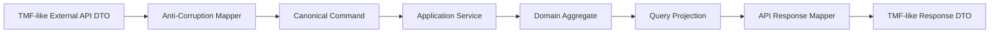
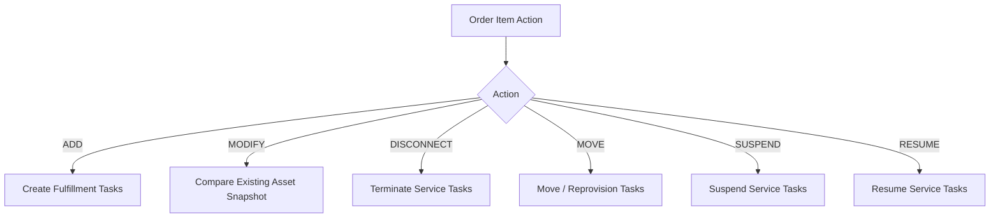
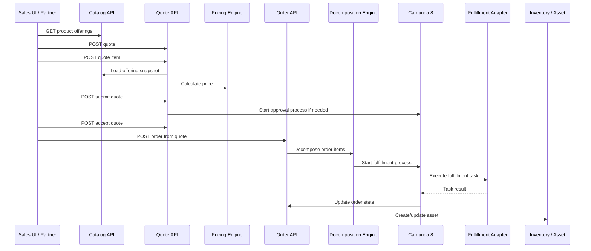
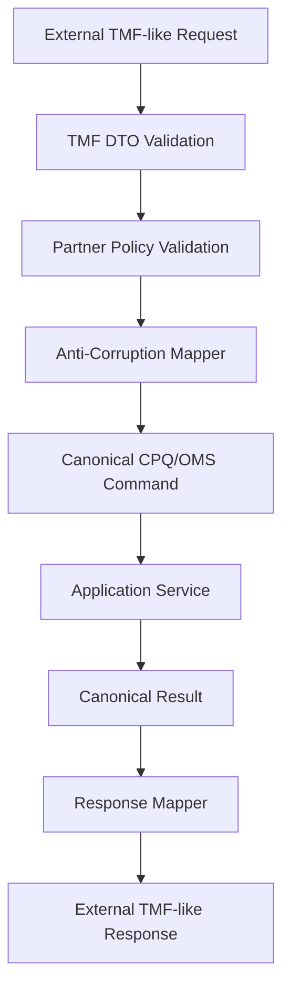
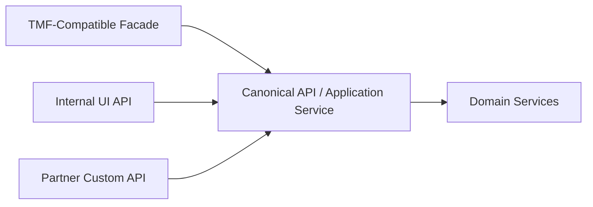

------
title: Build From Scratch: Enterprise Java Microservices CPQ & Order Management Platform - Part 018
description: Memetakan API CPQ/OMS enterprise dengan inspirasi TM Forum Open APIs: TMF620 Product Catalog, TMF648 Quote, TMF622 Product Ordering, TMF663 Shopping Cart, TMF637 Product Inventory, TMF641 Service Ordering, anti-corruption layer, canonical model, dan adaptation strategy.
series: learn-enterprise-cpq-oms-glassfish-camunda8
seriesTitle: Build From Scratch: Enterprise Java Microservices CPQ & Order Management Platform
order: 18
partTitle: TM Forum Inspired API Mapping
tags:
  - java
  - microservices
  - cpq
  - oms
  - tm-forum
  - openapi
  - api-design
  - product-catalog
  - quote
  - product-ordering
  - anti-corruption-layer
date: 2026-07-02
---

# Part 018 — TM Forum Inspired API Mapping

Di Part 017 kita membahas API versioning dan compatibility.

Sekarang kita akan memetakan API CPQ/OMS kita terhadap vocabulary enterprise commerce yang lebih luas, terutama yang diinspirasi oleh TM Forum Open APIs.

Penting:

> Kita tidak akan menyalin TM Forum mentah-mentah.

Kita akan memakainya sebagai **bahasa referensi** untuk menghindari desain domain yang terlalu lokal, terlalu CRUD, atau terlalu tergantung implementasi internal.

TM Forum berguna karena banyak konsep enterprise telco/commerce sudah diberi nama:

- Product Catalog,
- Product Offering,
- Product Specification,
- Product Offering Price,
- Quote,
- Product Order,
- Product Inventory,
- Service Catalog,
- Service Ordering,
- Service Inventory,
- Party,
- Account,
- Agreement.

Tetapi platform kita tetap punya kebutuhan sendiri:

- CPQ configuration engine,
- pricing explainability,
- approval policy,
- quote-to-order conversion,
- order decomposition,
- fulfillment plan,
- Camunda orchestration,
- Kafka event model,
- Redis acceleration,
- operational repair,
- audit defensibility.

Jadi pendekatannya:

```text
Use TM Forum as vocabulary and integration boundary.
Use our own canonical model for internal correctness.
```

---

## 1. Kenapa Perlu TM Forum-Inspired Mapping?

Tanpa referensi eksternal, tim sering membuat istilah sendiri:

```text
Package
Bundle
Product
Offering
Plan
SKU
Service
Subscription
Asset
Contract
Order Item
Line Item
Provisioning Item
Fulfillment Item
```

Lalu setiap tim memberi arti berbeda.

Di CPQ/OMS production, vocabulary mismatch menyebabkan:

- quote item tidak bisa dikonversi ke order item,
- product catalog tidak cocok dengan inventory,
- order amendment membingungkan,
- billing tidak tahu charge mana yang recurring,
- provisioning tidak tahu service mana yang perlu dibuat,
- support tidak bisa menelusuri installed base,
- audit tidak bisa menjelaskan commercial promise.

TM Forum membantu memberi baseline vocabulary.

Tetapi jangan lupa:

```text
External standard vocabulary is not a substitute for internal domain modelling.
```

---

## 2. API Keluarga TM Forum yang Relevan

Untuk seri ini, kita anggap keluarga API berikut sebagai sumber inspirasi utama.

| TMF API | Domain | Relevansi untuk Platform Kita |
|---|---|---|
| TMF620 Product Catalog Management | Catalog | Product offering, product spec, product offering price, lifecycle |
| TMF663 Shopping Cart | Pre-quote cart | Optional jika platform punya cart sebelum quote |
| TMF648 Quote Management | Quote | Quote, quote item, quote lifecycle, customer-facing commercial proposal |
| TMF622 Product Ordering | Product order | Order capture, product order item, order state |
| TMF637 Product Inventory | Installed product | Asset/subscription/installed base view |
| TMF633 Service Catalog | Technical service catalog | Mapping commercial offering ke service spec |
| TMF641 Service Ordering | Service order | Downstream technical fulfillment order |
| TMF638 Service Inventory | Service instance | Runtime service installed base |
| TMF632 Party Management | Party | Person/organization reference |
| TMF666 Account Management | Account | Billing/customer account reference |
| TMF651 Agreement Management | Agreement | Contract/agreement reference |

Kita tidak perlu mengimplementasikan semuanya sekarang. Yang penting adalah tahu boundary-nya.

---

## 3. Vocabulary Alignment

Mapping awal:

| Vocabulary TM Forum | Canonical Model Kita | Catatan |
|---|---|---|
| ProductSpecification | ProductSpecification | Template teknis-komersial produk |
| ProductOffering | ProductOffering | Sesuatu yang bisa dijual ke customer |
| ProductOfferingPrice | OfferingPrice / PriceComponent | Sumber harga katalog, bukan hasil pricing quote |
| Quote | Quote | Commercial proposal dengan snapshot |
| QuoteItem | QuoteItem | Baris quote, berisi offering + configuration + price snapshot |
| ProductOrder | Order | Execution commitment |
| ProductOrderItem | OrderItem | Baris order hasil quote/direct order |
| Product | InstalledProduct / Asset | Produk yang sudah aktif/terpasang |
| ServiceSpecification | TechnicalServiceSpecification | Definisi service teknis |
| ServiceOrder | TechnicalFulfillmentOrder | Order ke fulfillment/provisioning layer |
| Service | ServiceInstance | Service runtime/aktif |
| RelatedParty | PartyReference | Referensi customer/user/organization |
| BillingAccount | BillingAccountReference | Referensi account billing, bukan owner semua data |
| Agreement | AgreementReference | Kontrak/terms reference |

Dalam sistem kita, nama boleh tidak identik, tetapi mapping harus eksplisit.

---

## 4. Canonical Model Internal vs External API Model

Jangan jadikan model eksternal sebagai domain model internal.



Kenapa?

Karena external API model sering punya karakteristik:

- generic,
- extensible,
- polymorphic,
- memakai `@type`, `@baseType`, `@schemaLocation`,
- relationship-heavy,
- tidak selalu cukup presisi untuk invariant internal,
- dirancang untuk interoperability, bukan internal enforcement.

Domain internal kita butuh:

- invariant kuat,
- state machine eksplisit,
- aggregate boundary jelas,
- command semantics eksplisit,
- idempotency,
- audit evidence,
- pricing explanation,
- configuration validation,
- decomposition trace.

Jadi mapping layer wajib ada.

---

## 5. Jangan Cargo-Cult `@type`

Banyak implementasi TMF-style membawa field seperti:

```json
{
  "@type": "ProductOffering",
  "@baseType": "CatalogEntity",
  "@schemaLocation": "https://..."
}
```

Field seperti ini berguna dalam ekosistem tertentu untuk polymorphism dan extension.

Tetapi kalau kita memaksanya ke domain internal, kita akan mendapatkan domain model yang kabur.

Buruk:

```java
public class DomainEntity {
    String atType;
    String atBaseType;
    String atSchemaLocation;
    Map<String, Object> dynamicFields;
}
```

Ini bukan domain model. Ini generic document container.

Lebih baik:

```java
public final class ProductOffering {
    private final ProductOfferingId id;
    private final ProductSpecificationId productSpecificationId;
    private final OfferingLifecycleStatus status;
    private final List<CharacteristicDefinition> configurableCharacteristics;
    private final List<OfferingPriceRef> prices;
    private final List<EligibilityRuleRef> eligibilityRules;
}
```

Jika external API perlu `@type`, mapping-kan di edge.

---

## 6. TMF620-Inspired Product Catalog API

TMF620 memberi vocabulary penting untuk Product Catalog Management.

Di platform kita, catalog API dipakai oleh:

- CPQ UI,
- configuration engine,
- pricing engine,
- quote service,
- order decomposition,
- partner API,
- admin console,
- cache warmer,
- operational diagnostics.

### 6.1 Resource Mapping

| API Resource | Canonical Entity | Ownership |
|---|---|---|
| `/product-catalogs` | Catalog | Catalog Service |
| `/product-categories` | Category | Catalog Service |
| `/product-specifications` | ProductSpecification | Catalog Service |
| `/product-offerings` | ProductOffering | Catalog Service |
| `/product-offering-prices` | ProductOfferingPrice | Catalog/Pricing boundary |
| `/product-offering-rules` | Compatibility/Eligibility Rule | Catalog/Configuration boundary |

### 6.2 Read API Shape

```http
GET /api/v1/product-offerings/{offeringId}
```

Response konseptual:

```json
{
  "id": "po_broadband_1g",
  "name": "Broadband 1Gbps",
  "lifecycleStatus": "ACTIVE",
  "productSpecification": {
    "id": "ps_broadband_access",
    "name": "Broadband Access"
  },
  "characteristics": [
    {
      "code": "CONTRACT_TERM",
      "valueType": "STRING",
      "allowedValues": ["12M", "24M"],
      "required": true
    }
  ],
  "prices": [
    {
      "id": "pop_broadband_1g_mrc",
      "chargeType": "RECURRING",
      "recurrence": "MONTHLY",
      "amount": {
        "currency": "IDR",
        "value": "499000.00"
      }
    }
  ],
  "validFor": {
    "startDateTime": "2026-01-01T00:00:00Z",
    "endDateTime": null
  }
}
```

### 6.3 Important Adaptation

TMF-inspired catalog object biasanya cukup untuk describing offering. Tetapi CPQ kita perlu tambahan:

- configuration graph,
- rule explainability,
- price calculation input,
- decomposition mapping,
- quote snapshot policy,
- cache version.

Jadi kita tambahkan API khusus:

```http
GET /api/v1/product-offerings/{offeringId}/configuration-model
GET /api/v1/product-offerings/{offeringId}/pricing-model
GET /api/v1/product-offerings/{offeringId}/decomposition-template
```

Jangan paksa semuanya masuk satu resource besar.

---

## 7. Catalog Versioning dan Published Immutability

Enterprise catalog bukan data master biasa.

Quote yang dibuat pada 1 Juli harus tetap bisa dijelaskan walaupun catalog berubah pada 15 Juli.

Karena itu product offering perlu version atau published snapshot.

```json
{
  "offeringId": "po_broadband_1g",
  "offeringVersion": 12,
  "catalogVersion": "2026.Q3",
  "lifecycleStatus": "ACTIVE"
}
```

Quote item menyimpan:

```json
{
  "productOfferingRef": {
    "id": "po_broadband_1g",
    "version": 12,
    "nameSnapshot": "Broadband 1Gbps"
  }
}
```

Rule:

```text
Quote and order must not depend on mutable live catalog for historical explanation.
```

---

## 8. TMF663 Shopping Cart: Perlu atau Tidak?

Shopping cart berguna jika ada pengalaman belanja sebelum quote.

Contoh:

```text
Customer memilih produk -> cart -> eligibility check -> price estimate -> quote
```

Tetapi untuk B2B CPQ, quote sering langsung menjadi workspace utama.

Perbedaan:

| Concern | Cart | Quote |
|---|---|---|
| Binding commercial promise | Lemah | Kuat |
| Validity period | Pendek | Formal |
| Approval | Jarang | Sering |
| Price snapshot | Estimasi | Harus explainable |
| Conversion to order | Bisa | Umum |
| Sales negotiation | Ringan | Inti proses |

Keputusan seri:

```text
Kita tidak membuat cart sebagai aggregate utama di awal.
Quote akan berfungsi sebagai configurable commercial workspace.
```

Nanti jika e-commerce channel butuh cart, cart bisa dibuat sebagai upstream transient aggregate yang mengkonversi ke quote.

---

## 9. TMF648-Inspired Quote API

Quote adalah commercial proposal.

Dalam platform kita, quote bukan hanya kumpulan line item. Quote adalah:

- customer context,
- offering selections,
- configuration snapshot,
- price snapshot,
- discount/override evidence,
- approval state,
- validity period,
- revision history,
- conversion candidate.

### 9.1 Resource Mapping

| TMF-like Resource | Canonical Entity |
|---|---|
| Quote | Quote Aggregate |
| QuoteItem | QuoteItem |
| ProductRefOrValue | ConfiguredProductSnapshot |
| RelatedParty | PartyReference |
| BillingAccount | BillingAccountReference |
| Agreement | AgreementReference |
| QuotePrice | QuotePriceSummary / PriceBreakdown |
| QuoteState | QuoteStatus |

### 9.2 API Set

```http
POST   /api/v1/quotes
GET    /api/v1/quotes/{quoteId}
PATCH  /api/v1/quotes/{quoteId}
POST   /api/v1/quotes/{quoteId}/items
PATCH  /api/v1/quotes/{quoteId}/items/{itemId}
DELETE /api/v1/quotes/{quoteId}/items/{itemId}
POST   /api/v1/quotes/{quoteId}/price
POST   /api/v1/quotes/{quoteId}/validate
POST   /api/v1/quotes/{quoteId}/submit
POST   /api/v1/quotes/{quoteId}/approve
POST   /api/v1/quotes/{quoteId}/reject
POST   /api/v1/quotes/{quoteId}/accept
POST   /api/v1/quotes/{quoteId}/convert-to-order
```

TMF-style API cenderung resource-oriented. Kita menambahkan command endpoints untuk lifecycle transition karena state machine harus eksplisit.

### 9.3 Quote Response Shape

```json
{
  "id": "quo_1001",
  "version": 7,
  "state": "PRICED",
  "stateCategory": "IN_PROGRESS",
  "validFor": {
    "startDateTime": "2026-07-02T00:00:00Z",
    "endDateTime": "2026-07-31T23:59:59Z"
  },
  "relatedParty": [
    {
      "role": "CUSTOMER",
      "id": "party_123",
      "name": "PT Example"
    }
  ],
  "billingAccount": {
    "id": "ba_456"
  },
  "quoteItem": [
    {
      "id": "qi_1",
      "action": "ADD",
      "productOffering": {
        "id": "po_broadband_1g",
        "version": 12,
        "name": "Broadband 1Gbps"
      },
      "configuration": {
        "configurationId": "cfg_1",
        "status": "VALID"
      },
      "price": {
        "oneTimeTotal": { "currency": "IDR", "value": "0.00" },
        "recurringTotal": { "currency": "IDR", "value": "499000.00" }
      }
    }
  ],
  "priceSummary": {
    "currency": "IDR",
    "oneTimeTotal": "0.00",
    "recurringTotal": "499000.00"
  }
}
```

### 9.4 Adaptation dari TMF

Kita perlu menambah hal yang biasanya lebih spesifik CPQ:

- `configuration.status`,
- `configuration.explanation`,
- `price.explanationId`,
- `approvalSummary`,
- `revisionNumber`,
- `sourceQuoteId`,
- `convertedOrderId`,
- `idempotencyKey` handling,
- command result.

Jangan takut berbeda jika domain membutuhkan.

---

## 10. Quote Item: ProductRefOrValue vs Snapshot

TMF-style payload sering memakai konsep `product` yang bisa berupa reference atau embedded value.

Untuk CPQ kita, quote item harus menyimpan snapshot karena quote adalah promise.

```json
{
  "quoteItemId": "qi_1",
  "productOfferingSnapshot": {
    "id": "po_broadband_1g",
    "version": 12,
    "name": "Broadband 1Gbps"
  },
  "configurationSnapshot": {
    "characteristics": [
      { "code": "CONTRACT_TERM", "value": "24M" }
    ],
    "validationHash": "sha256:..."
  },
  "priceSnapshot": {
    "priceHash": "sha256:...",
    "charges": []
  }
}
```

Reference ke catalog saja tidak cukup.

Jika catalog berubah, quote tetap harus bisa dijelaskan.

---

## 11. TMF622-Inspired Product Ordering API

Product order adalah execution commitment.

TMF622 Product Ordering memberi vocabulary untuk placing product order dengan order parameters berdasarkan product offering dari catalog.

Dalam platform kita, order bisa berasal dari:

- accepted quote,
- direct order,
- amendment,
- cancellation,
- migration,
- repair command.

### 11.1 Resource Mapping

| TMF-like Resource | Canonical Entity |
|---|---|
| ProductOrder | Order Aggregate |
| ProductOrderItem | OrderItem |
| ProductOrderItem.action | OrderAction |
| ProductOrder.state | OrderStatus |
| Product | OrderedProductSnapshot |
| RelatedParty | PartyReference |
| BillingAccount | BillingAccountReference |
| OrderRelationship | RelatedOrderRef |

### 11.2 API Set

```http
POST /api/v1/orders
POST /api/v1/orders/from-quote
GET  /api/v1/orders/{orderId}
GET  /api/v1/orders/{orderId}/timeline
GET  /api/v1/orders/{orderId}/fulfillment-plan
POST /api/v1/orders/{orderId}/submit
POST /api/v1/orders/{orderId}/cancel
POST /api/v1/orders/{orderId}/amend
POST /api/v1/orders/{orderId}/hold
POST /api/v1/orders/{orderId}/resume
```

### 11.3 Order from Quote

```http
POST /api/v1/orders/from-quote
Idempotency-Key: idem_123
If-Match: "quote-version-7"
```

Request:

```json
{
  "quoteId": "quo_1001",
  "requestedCompletionDate": "2026-08-01T00:00:00Z",
  "externalReference": {
    "system": "SALES_PORTAL",
    "id": "sp_9988"
  }
}
```

Response:

```json
{
  "commandId": "cmd_2001",
  "orderId": "ord_3001",
  "status": "ACCEPTED",
  "statusUrl": "/api/v1/commands/cmd_2001"
}
```

Order conversion harus idempotent.

Kalau request yang sama dikirim ulang, hasilnya harus order yang sama, bukan order baru.

---

## 12. Order Item Action Mapping

Action type penting untuk add/change/disconnect flows.

| Action | Meaning | Installed Base Impact |
|---|---|---|
| `ADD` | Menambah produk baru | Create new asset/subscription/service |
| `MODIFY` | Mengubah produk terpasang | Create new asset version or update subscription terms |
| `DISCONNECT` | Mengakhiri produk | Terminate asset/subscription/service |
| `MOVE` | Memindahkan lokasi/ownership | Update relationship/place; may require technical re-provisioning |
| `SUSPEND` | Suspend sementara | Change service/subscription operational status |
| `RESUME` | Aktifkan kembali | Reverse suspend if allowed |

Jangan model semua sebagai `UPDATE`.

OMS butuh action karena decomposition dan compensation berbeda.



---

## 13. TMF637-Inspired Product Inventory API

Product inventory merepresentasikan produk yang sudah dimiliki/aktif untuk customer.

Dalam platform kita:

```text
Product Inventory ~= Installed Base / Asset View
```

Resource:

```http
GET /api/v1/customer-assets?customerId=party_123
GET /api/v1/customer-assets/{assetId}
GET /api/v1/customer-assets/{assetId}/timeline
GET /api/v1/customer-assets/{assetId}/eligible-actions
```

Mapping:

| TMF-like Concept | Model Kita |
|---|---|
| Product | CustomerAsset / InstalledProduct |
| Product.status | AssetStatus |
| Product.productOffering | Offering Snapshot |
| Product.productCharacteristic | Installed Characteristic |
| ProductRelationship | AssetRelationship |
| Place | ServiceLocationRef |
| RelatedParty | Customer/User/Owner |

Installed base penting untuk CPQ karena modify/disconnect quote membutuhkan current asset snapshot.

Contoh:

```json
{
  "assetId": "ast_1001",
  "customerId": "party_123",
  "status": "ACTIVE",
  "productOffering": {
    "id": "po_broadband_1g",
    "name": "Broadband 1Gbps"
  },
  "characteristics": [
    { "code": "CONTRACT_TERM", "value": "24M" },
    { "code": "ACCESS_SPEED", "value": "1G" }
  ],
  "subscription": {
    "id": "sub_1001",
    "status": "ACTIVE",
    "startDate": "2026-01-01T00:00:00Z"
  }
}
```

---

## 14. TMF633/TMF641-Inspired Service Layer

Commercial order tidak selalu langsung dipenuhi oleh satu technical action.

Contoh commercial product:

```text
Broadband 1Gbps + Static IP + Router Rental
```

Bisa decomposed menjadi:

```text
- reserve access resource
- ship router
- configure CPE
- provision broadband service
- assign static IP
- activate billing trigger
- send notification
```

TMF633 Service Catalog dan TMF641 Service Ordering memberi inspirasi untuk technical fulfillment boundary.

Platform kita akan memakai internal model:

| Commercial Layer | Technical Layer |
|---|---|
| ProductOffering | TechnicalServiceSpecification mapping |
| ProductOrderItem | FulfillmentPlanItem |
| Order Decomposition | TechnicalFulfillmentOrder generation |
| Order State | Aggregated from fulfillment task states |
| Product Inventory | Service Inventory + Asset View |

API internal:

```http
POST /internal/v1/technical-fulfillment-orders
GET  /internal/v1/technical-fulfillment-orders/{id}
POST /internal/v1/technical-fulfillment-orders/{id}/tasks/{taskId}/complete
POST /internal/v1/technical-fulfillment-orders/{id}/tasks/{taskId}/fail
```

Jangan expose technical service order langsung ke sales channel kecuali memang consumer-nya technical.

---

## 15. End-to-End Mapping Flow



TMF vocabulary membantu naming resource. Internal orchestration tetap milik desain kita.

---

## 16. API Mapping per Capability

### 16.1 Catalog Browse

| Capability | API |
|---|---|
| Browse offerings | `GET /api/v1/product-offerings` |
| Get offering detail | `GET /api/v1/product-offerings/{id}` |
| Get configuration model | `GET /api/v1/product-offerings/{id}/configuration-model` |
| Get price model | `GET /api/v1/product-offerings/{id}/pricing-model` |
| Check eligibility | `POST /api/v1/product-offerings/{id}/check-eligibility` |

### 16.2 CPQ

| Capability | API |
|---|---|
| Create quote | `POST /api/v1/quotes` |
| Add quote item | `POST /api/v1/quotes/{id}/items` |
| Configure item | `PATCH /api/v1/quotes/{id}/items/{itemId}/configuration` |
| Price quote | `POST /api/v1/quotes/{id}/price` |
| Validate quote | `POST /api/v1/quotes/{id}/validate` |
| Submit quote | `POST /api/v1/quotes/{id}/submit` |
| Accept quote | `POST /api/v1/quotes/{id}/accept` |
| Convert quote | `POST /api/v1/quotes/{id}/convert-to-order` |

### 16.3 OMS

| Capability | API |
|---|---|
| Create direct order | `POST /api/v1/orders` |
| Create order from quote | `POST /api/v1/orders/from-quote` |
| Get order | `GET /api/v1/orders/{id}` |
| Get timeline | `GET /api/v1/orders/{id}/timeline` |
| Get fulfillment plan | `GET /api/v1/orders/{id}/fulfillment-plan` |
| Cancel order | `POST /api/v1/orders/{id}/cancel` |
| Hold/resume order | `POST /api/v1/orders/{id}/hold`, `POST /api/v1/orders/{id}/resume` |

### 16.4 Installed Base

| Capability | API |
|---|---|
| Search customer assets | `GET /api/v1/customer-assets` |
| Get asset detail | `GET /api/v1/customer-assets/{id}` |
| Get eligible actions | `GET /api/v1/customer-assets/{id}/eligible-actions` |
| Quote modify existing asset | `POST /api/v1/quotes/from-asset-action` |

---

## 17. Relationship Modelling

TMF-style APIs often use relationships heavily.

Example:

```json
{
  "relatedParty": [
    { "role": "CUSTOMER", "id": "party_123" },
    { "role": "SALES_AGENT", "id": "user_99" }
  ],
  "relatedOrder": [
    { "relationshipType": "AMENDS", "id": "ord_1000" }
  ]
}
```

Relationship is useful, but dangerous if unconstrained.

Policy:

```text
Every relationship type must be enumerated and have domain meaning.
```

Do not allow arbitrary strings like:

```json
{ "relationshipType": "somehow_related" }
```

For our model:

| Relationship | Meaning |
|---|---|
| `QUOTE_DERIVED_FROM` | Quote revision from previous quote |
| `ORDER_DERIVED_FROM_QUOTE` | Order created from accepted quote |
| `ORDER_AMENDS_ORDER` | Amendment order modifies previous order |
| `ORDER_CANCELS_ORDER` | Cancellation order targets previous order |
| `ITEM_MODIFIES_ASSET` | Order item modifies installed asset |
| `ITEM_DISCONNECTS_ASSET` | Order item terminates installed asset |
| `ITEM_DEPENDS_ON_ITEM` | Fulfillment dependency |

Relationship must support traceability, not become dumping ground.

---

## 18. External Identifier Strategy

Enterprise integrations need external references.

Examples:

- CRM opportunity ID,
- partner order ID,
- billing account ID,
- provisioning service ID,
- legacy asset ID.

Model:

```json
{
  "externalIdentifier": [
    {
      "system": "CRM",
      "type": "OPPORTUNITY_ID",
      "id": "opp_789"
    },
    {
      "system": "PARTNER_X",
      "type": "ORDER_ID",
      "id": "PX-2026-0001"
    }
  ]
}
```

Rules:

```text
Internal ID remains primary.
External ID is lookup/reference, not aggregate identity.
External ID uniqueness must be scoped by system + type.
External ID changes must be audited.
```

Do not use partner ID as primary key.

---

## 19. State Mapping

TMF-style state values may not match internal state machine exactly.

Example internal order states:

```text
DRAFT
ACKNOWLEDGED
VALIDATED
DECOMPOSED
FULFILLING
PARTIALLY_COMPLETED
COMPLETED
FAILED
CANCELLING
CANCELLED
FALLOUT
CLOSED
```

External simplified states:

```text
ACKNOWLEDGED
IN_PROGRESS
COMPLETED
FAILED
CANCELLED
```

Mapping:

| Internal State | External State | Category |
|---|---|---|
| `DRAFT` | `ACKNOWLEDGED` or hidden | `DRAFT` |
| `ACKNOWLEDGED` | `ACKNOWLEDGED` | `IN_PROGRESS` |
| `VALIDATED` | `IN_PROGRESS` | `IN_PROGRESS` |
| `DECOMPOSED` | `IN_PROGRESS` | `IN_PROGRESS` |
| `FULFILLING` | `IN_PROGRESS` | `IN_PROGRESS` |
| `PARTIALLY_COMPLETED` | `IN_PROGRESS` | `IN_PROGRESS` |
| `COMPLETED` | `COMPLETED` | `SUCCESS` |
| `FAILED` | `FAILED` | `FAILURE` |
| `FALLOUT` | `IN_PROGRESS` or `FAILED` | depends on policy |
| `CANCELLED` | `CANCELLED` | `TERMINAL` |

Never let external simplification destroy internal state detail.

---

## 20. Price Mapping

TMF-style ProductOfferingPrice is catalog price.

CPQ price result is not just ProductOfferingPrice.

We need distinguish:

| Concept | Meaning |
|---|---|
| ProductOfferingPrice | Price defined in catalog |
| QuoteItemPrice | Calculated price for selected configuration/customer/context |
| PriceAlteration | Discount/promotion/override/adjustment |
| PriceSummary | Aggregated totals |
| PriceExplanation | Why price became that number |
| Billing Charge | Downstream billing instruction or charge candidate |

Bad design:

```text
Store only final price total.
```

Good design:

```json
{
  "price": {
    "charges": [
      {
        "chargeType": "RECURRING",
        "recurrence": "MONTHLY",
        "baseAmount": { "currency": "IDR", "value": "599000.00" },
        "adjustments": [
          {
            "type": "PROMOTION",
            "code": "PROMO_100K_OFF",
            "amount": { "currency": "IDR", "value": "-100000.00" }
          }
        ],
        "finalAmount": { "currency": "IDR", "value": "499000.00" }
      }
    ],
    "explanationId": "pex_123",
    "priceHash": "sha256:..."
  }
}
```

TMF vocabulary helps. CPQ explainability completes it.

---

## 21. Configuration Mapping

TMF ProductCharacteristic can represent selected characteristics.

But CPQ configuration needs more:

- allowed values,
- dependency,
- exclusion,
- cardinality,
- compatibility,
- source of default,
- validation result,
- conflict explanation.

So we separate:

| Concern | API |
|---|---|
| What can be configured | Catalog/configuration model API |
| What customer selected | Quote item configuration |
| Whether valid | Configuration validation result |
| Why invalid | Explanation/conflict result |

Example:

```json
{
  "configuration": {
    "status": "INVALID",
    "selectedCharacteristics": [
      { "code": "CONTRACT_TERM", "value": "12M" },
      { "code": "ROUTER_OPTION", "value": "PREMIUM_ROUTER" }
    ],
    "violations": [
      {
        "code": "INCOMPATIBLE_OPTION",
        "message": "Premium router requires contract term 24M.",
        "path": "/selectedCharacteristics/1"
      }
    ]
  }
}
```

Do not hide configuration validation behind generic 400 error only.

---

## 22. Approval Mapping

TMF Quote API can represent quote state. But approval process often needs richer internal model.

Our approval API:

```http
GET  /api/v1/quotes/{quoteId}/approval-summary
GET  /api/v1/quotes/{quoteId}/approval-tasks
POST /api/v1/quotes/{quoteId}/approval-tasks/{taskId}/approve
POST /api/v1/quotes/{quoteId}/approval-tasks/{taskId}/reject
POST /api/v1/quotes/{quoteId}/approval-tasks/{taskId}/delegate
```

Why not only `PATCH /quotes/{id}`?

Because approval is not just updating state. It has:

- actor,
- authority,
- decision,
- reason,
- timestamp,
- policy version,
- escalation,
- delegation,
- evidence.

Approval commands must be auditable.

---

## 23. Anti-Corruption Layer for TMF-Compatible Integration

If an external partner wants TMF-like payload, do not force internal service to speak that shape everywhere.

Use adapter:



Adapter responsibilities:

- validate external schema,
- map external ID to internal ID,
- normalize state/value naming,
- reject unsupported relationship types,
- enrich missing mandatory internal context,
- map errors to partner contract,
- record audit mapping,
- preserve external identifiers.

Application service should not know partner-specific quirks.

---

## 24. Canonical Command Examples

External quote create request may be TMF-like. Internally convert to command:

```java
public record CreateQuoteCommand(
    CustomerRef customer,
    BillingAccountRef billingAccount,
    SalesChannelRef salesChannel,
    AgreementRef agreement,
    List<ExternalIdentifier> externalIdentifiers,
    Instant requestedValidUntil,
    ActorRef actor,
    RequestContext requestContext
) {}
```

Add item command:

```java
public record AddQuoteItemCommand(
    QuoteId quoteId,
    ProductOfferingId offeringId,
    CatalogVersionRef catalogVersion,
    OrderAction action,
    Optional<AssetId> targetAssetId,
    List<SelectedCharacteristic> selectedCharacteristics,
    ActorRef actor,
    IdempotencyKey idempotencyKey
) {}
```

Order from quote:

```java
public record CreateOrderFromQuoteCommand(
    QuoteId quoteId,
    QuoteVersion expectedQuoteVersion,
    RequestedCompletionDate requestedCompletionDate,
    List<ExternalIdentifier> externalIdentifiers,
    ActorRef actor,
    IdempotencyKey idempotencyKey
) {}
```

Notice: command internal lebih eksplisit daripada external JSON.

---

## 25. Event Mapping

Event internal kita harus canonical, bukan copy response API.

| Event | Trigger | Payload Principle |
|---|---|---|
| `ProductOfferingPublished` | Catalog publish | IDs, version, lifecycle, cache invalidation hints |
| `QuoteCreated` | Quote created | Quote ID, customer, channel, actor |
| `QuoteItemConfigured` | Configuration changed | Item ID, config status, config hash |
| `QuotePriced` | Pricing completed | Price hash, total summary, explanation ID |
| `QuoteSubmitted` | Submitted for approval/order | Quote version, approval required flag |
| `QuoteAccepted` | Customer accepts quote | Quote version, acceptedAt |
| `OrderCreatedFromQuote` | Conversion success | Quote ID/version, order ID |
| `OrderSubmitted` | Order submitted | Order ID/version |
| `OrderDecomposed` | Fulfillment plan created | Plan ID/version |
| `FulfillmentTaskCompleted` | Task complete | Task ID, order item ID, result |
| `CustomerAssetActivated` | Installed base updated | Asset ID, order item ID |

Do not publish entire aggregate if consumers only need signal + reference.

Event should support replay and not expose private internal object graph.

---

## 26. API Facade vs Domain Service API

For external TMF-like integration, it may be useful to expose facade APIs:

```text
/tmf/v5/productCatalogManagement/...
/tmf/v5/quoteManagement/...
/tmf/v5/productOrdering/...
```

But internal canonical APIs remain:

```text
/api/v1/product-offerings
/api/v1/quotes
/api/v1/orders
```

Architecture:



This prevents a standard facade from dictating the whole internal design.

---

## 27. How to Decide Whether to Be TMF-Compatible

Ask:

```text
1. Do external partners require TMF conformance?
2. Do we need certification/interoperability?
3. Are downstream systems already TMF-based?
4. Is the domain telco-like enough?
5. Can our internal requirements fit without distortion?
6. Will conformance improve integration speed or create ceremony?
```

If yes, expose TMF-compatible facade.

If no, still use vocabulary and mapping discipline.

For this learning series, we choose:

```text
TMF-inspired internal canonical API.
Optional TMF-compatible adapter/facade later.
```

---

## 28. Data Ownership Mapping

| Data | Owner | Exposed Via |
|---|---|---|
| Product offering | Catalog Service | Catalog API |
| Configuration model | Catalog/Configuration Service | Configuration API |
| Calculated price | Pricing/Quote Service | Quote/Pricing API |
| Quote | Quote Service | Quote API |
| Approval task | Approval/Workflow boundary | Approval API |
| Product order | Order Service | Order API |
| Fulfillment plan | OMS/Fulfillment boundary | Fulfillment API |
| Technical task | Fulfillment Service | Internal Fulfillment API |
| Installed asset | Inventory/Asset Service | Customer Asset API |
| Party | CRM/Party system | Party reference, not copied blindly |
| Billing account | Billing/Account system | BillingAccountRef |
| Agreement | CLM/Agreement system | AgreementRef |

Do not let API mapping blur ownership.

---

## 29. OpenAPI Tag Strategy

OpenAPI document should be organized by capability, not by database table.

Example tags:

```yaml
tags:
  - name: Product Offerings
    description: Published commercial offerings available for selection.
  - name: Configuration
    description: Product configuration models and validation operations.
  - name: Pricing
    description: Price simulation and quote pricing operations.
  - name: Quotes
    description: Commercial proposal lifecycle.
  - name: Quote Approvals
    description: Approval tasks and decisions related to quotes.
  - name: Orders
    description: Product order capture and lifecycle.
  - name: Fulfillment
    description: Fulfillment plan and operational task visibility.
  - name: Customer Assets
    description: Installed base and subscription-oriented views.
```

Bad tags:

```text
quote_table
order_item_table
product_json
misc
```

Tagging is documentation architecture.

---

## 30. Example OpenAPI Fragment: Quote Command

```yaml
paths:
  /quotes/{quoteId}/submit:
    post:
      tags:
        - Quotes
      operationId: submitQuote
      summary: Submit a quote for approval or acceptance flow
      parameters:
        - name: quoteId
          in: path
          required: true
          schema:
            type: string
        - name: Idempotency-Key
          in: header
          required: true
          schema:
            type: string
        - name: If-Match
          in: header
          required: true
          schema:
            type: string
      requestBody:
        required: true
        content:
          application/json:
            schema:
              $ref: '#/components/schemas/SubmitQuoteRequest'
      responses:
        '202':
          description: Quote submit command accepted
          content:
            application/json:
              schema:
                $ref: '#/components/schemas/CommandAcceptedResponse'
        '409':
          description: Invalid quote state or version conflict
          content:
            application/problem+json:
              schema:
                $ref: '#/components/schemas/Problem'
```

This is not pure CRUD. It is lifecycle command.

---

## 31. Example Mapping: External TMF-like Quote to Internal Command

External input:

```json
{
  "relatedParty": [
    { "role": "customer", "id": "party_123" },
    { "role": "salesAgent", "id": "usr_99" }
  ],
  "billingAccount": { "id": "ba_456" },
  "externalIdentifier": [
    { "owner": "CRM", "id": "opp_123" }
  ],
  "validFor": {
    "endDateTime": "2026-08-01T00:00:00Z"
  }
}
```

Internal command:

```json
{
  "customer": { "id": "party_123" },
  "actor": { "id": "usr_99", "type": "SALES_AGENT" },
  "billingAccount": { "id": "ba_456" },
  "externalIdentifiers": [
    { "system": "CRM", "type": "OPPORTUNITY_ID", "id": "opp_123" }
  ],
  "requestedValidUntil": "2026-08-01T00:00:00Z"
}
```

Mapping rules catch problems:

- missing customer,
- multiple customer parties,
- unsupported party role,
- invalid billing account reference,
- invalid external identifier owner.

---

## 32. Error Mapping

Internal error:

```json
{
  "code": "QUOTE_INVALID_STATE_TRANSITION",
  "status": 409,
  "detail": "Quote cannot move from ACCEPTED to SUBMITTED."
}
```

External partner contract may need:

```json
{
  "code": "INVALID_TRANSITION",
  "reason": "The requested operation is not allowed for the current quote state.",
  "message": "Quote cannot be submitted because it has already been accepted."
}
```

Do not leak internal error taxonomy if partner contract differs.

But keep correlation:

```text
internalErrorId -> externalResponseId -> audit record
```

---

## 33. Security and Authorization Mapping

TMF-like API says what resource exists. It does not decide your authorization model.

For CPQ/OMS:

| Operation | Authorization Concern |
|---|---|
| Browse offering | Market/segment/channel eligibility |
| Create quote | Sales channel, customer access |
| Apply discount | Discount authority |
| Override price | Approval or privileged role |
| Submit quote | Quote ownership, state |
| Approve quote | Approval assignment, delegation |
| Convert to order | Accepted quote, customer authority |
| Cancel order | Order state, role, regulatory/commercial policy |
| Modify asset | Asset ownership, eligibility, contract terms |

Authorization must sit in application layer, not merely API gateway.

---

## 34. Testing Mapping Correctness

Test types:

| Test | Purpose |
|---|---|
| Contract validation | External payload matches API schema |
| Mapping test | DTO maps to canonical command correctly |
| Rejection test | Unsupported relationship/role rejected |
| Round-trip projection test | Canonical projection maps to external response |
| Golden partner payload test | Existing partner examples stay supported |
| Error mapping test | Internal error maps to expected external error |
| State mapping test | Internal state maps to external category correctly |
| Audit mapping test | External IDs and transformed fields traceable |

Example test fixture structure:

```text
test-fixtures/
  tmf-like/
    quote-create/
      valid-minimal.json
      valid-with-external-id.json
      invalid-multiple-customer.json
      invalid-unsupported-party-role.json
    product-order/
      order-from-quote.json
      amend-existing-asset.json
```

Mapping code is production code. Test it like business logic.

---

## 35. Failure Modes

### 35.1 Standard Shape, Wrong Semantics

Payload follows TMF-like structure but means the wrong thing.

Example:

```text
Partner sends ProductOrderItem.action = modify, but no target asset reference.
```

Schema may pass. Domain validation must reject.

### 35.2 Relationship Explosion

Everything is represented as relationship.

Result:

```text
No one knows which relationship drives behavior.
```

Fix:

```text
Enumerate relationship types and map each to explicit domain meaning.
```

### 35.3 Generic Extension Abuse

Partner puts business-critical fields in extension bag.

Fix:

```text
Promote stable business-critical field into explicit contract.
Use extension only for non-core partner metadata.
```

### 35.4 External State Drives Internal State Machine

External consumer sends state directly:

```json
{ "state": "COMPLETED" }
```

This bypasses lifecycle control.

Fix:

```text
Expose command endpoints, not arbitrary state patching.
```

### 35.5 Product Offering Used as Installed Product

A product offering is what can be sold. Installed product/asset is what customer has.

Mixing them breaks modify/disconnect.

Fix:

```text
Use ProductOfferingRef for catalog.
Use Asset/ProductInventoryRef for installed base.
```

---

## 36. Design Rules for Our Platform

Use these rules going forward:

```text
1. TMF vocabulary is allowed; TMF cargo-cult is not.
2. External API DTO is not domain model.
3. All external payloads map to canonical commands.
4. Quote item stores offering/configuration/price snapshots.
5. Order item action is explicit.
6. Installed asset is separate from product offering.
7. Relationship types are enumerated and behavior-relevant.
8. External identifiers are scoped references, not primary keys.
9. State mapping must preserve internal detail.
10. Approval, pricing, configuration, and fulfillment need first-class APIs, not generic patching.
11. TMF-compatible facade may exist, but canonical service remains internally consistent.
12. Mapping code must be tested and audited.
```

---

## 37. Architecture Decision Record

```md
# ADR-018: TM Forum Inspired API Mapping

## Status
Accepted

## Context
The CPQ/OMS platform must support enterprise commerce concepts such as product catalog, quote, product order, product inventory, service fulfillment, related party, billing account, and agreement references. TM Forum Open APIs provide useful industry vocabulary, but the platform also requires CPQ-specific configuration, pricing explainability, approval policy, orchestration, and operational repair models.

## Decision
Use TM Forum Open APIs as vocabulary and integration inspiration, not as internal domain model. Build canonical internal APIs and domain commands. Add TMF-compatible facade or partner adapters only at the edge where required.

## Consequences
Internal models remain precise and invariant-driven. External integrations can still align with industry vocabulary. Mapping layers become critical production components and require contract tests, golden payloads, error mapping, and audit traceability.
```

---

## 38. Implementation Milestone for Our Platform

Setelah part ini, kita punya API mapping direction:

```text
1. Catalog API inspired by TMF620 vocabulary.
2. Quote API inspired by TMF648 but extended for CPQ configuration/pricing/approval.
3. Order API inspired by TMF622 but extended for decomposition and fulfillment visibility.
4. Customer Asset API inspired by product inventory concepts.
5. Internal fulfillment API inspired by service ordering concepts.
6. Anti-corruption layer for external TMF-like payloads.
7. Canonical command model for application services.
8. Explicit mapping tests and golden payloads.
```

Part berikutnya kita akan mulai masuk ke implementasi Java runtime foundation: Jakarta REST/JAX-RS, Jersey, GlassFish, request lifecycle, provider, filter, exception mapper, dan dependency boundaries.

---

## 39. Ringkasan

TM Forum-inspired mapping membantu kita berbicara dalam vocabulary enterprise yang matang.

Tetapi platform CPQ/OMS production tidak boleh menjadi copy generik dari standard payload.

Desain yang benar:

```text
External vocabulary for interoperability.
Internal canonical model for correctness.
Explicit mapping for safety.
State machines for lifecycle control.
Snapshots for commercial defensibility.
Events for integration.
Audit for accountability.
```

Dengan ini, kita siap membangun runtime Java-nya.

---

## 40. Referensi Resmi yang Relevan

- TM Forum Open API Directory: https://www.tmforum.org/open-digital-architecture/open-apis
- TMF620 Product Catalog Management API User Guide v5.0.0: https://www.tmforum.org/resources/specifications/tmf620-product-catalog-management-api-user-guide-v5-0-0/
- TMF622 Product Ordering API REST Specification: https://www.tmforum.org/resources/interface/tmf622-product-ordering-api-rest-specification-r14-5-0/
- OpenAPI Specification 3.1.1: https://spec.openapis.org/oas/v3.1.1.html
